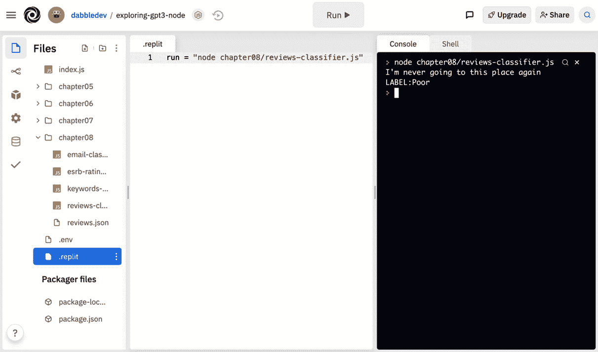
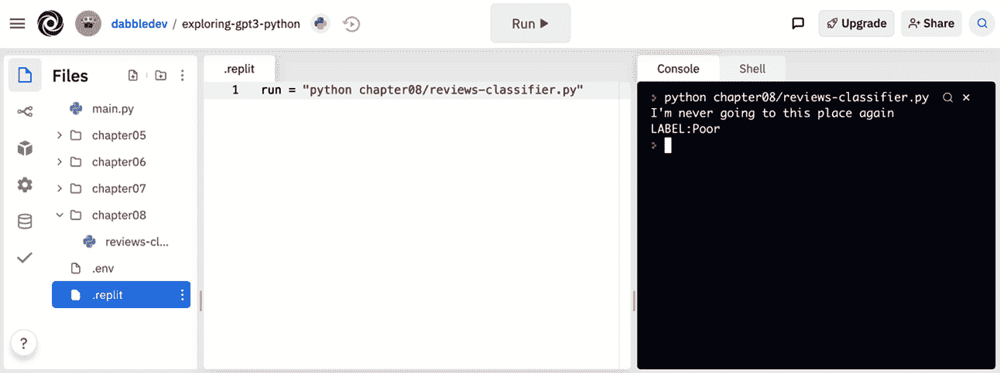
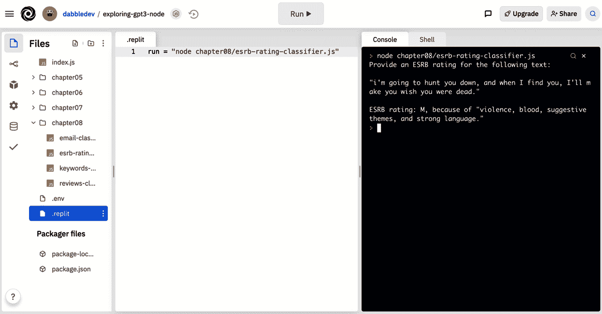
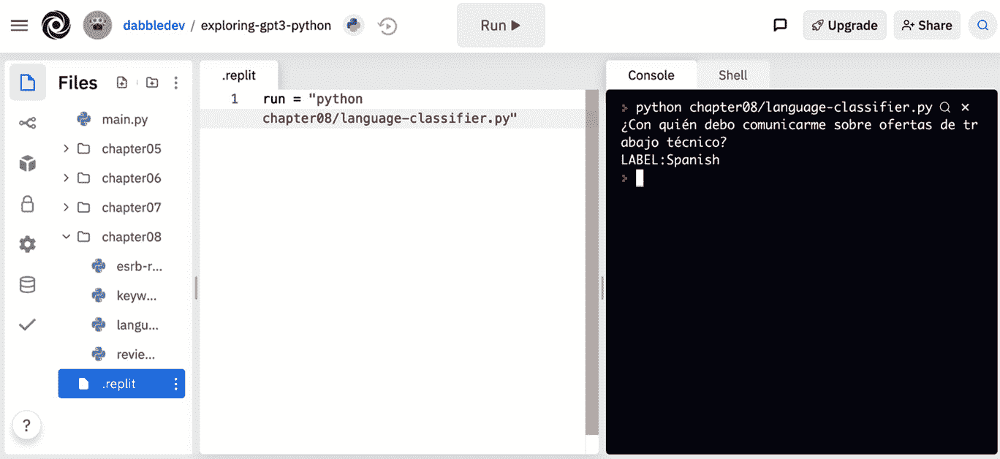
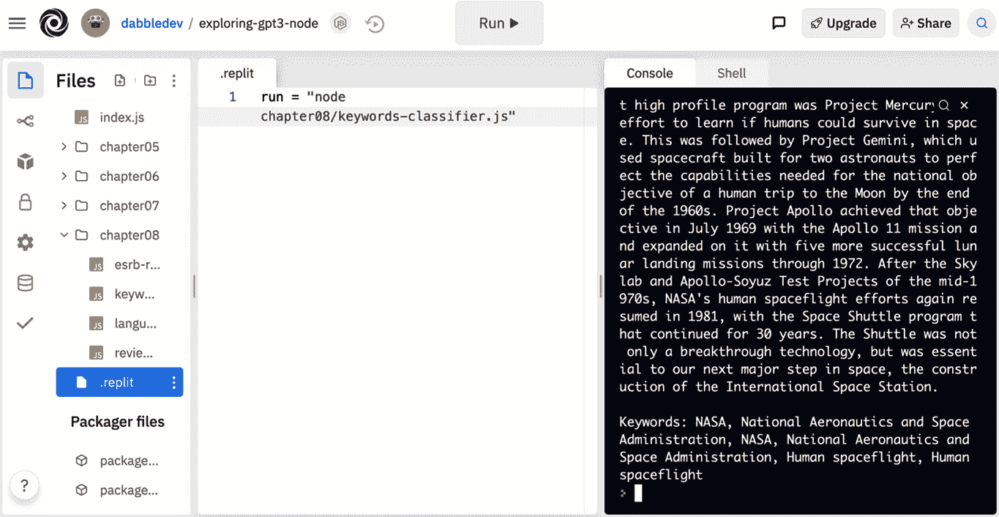
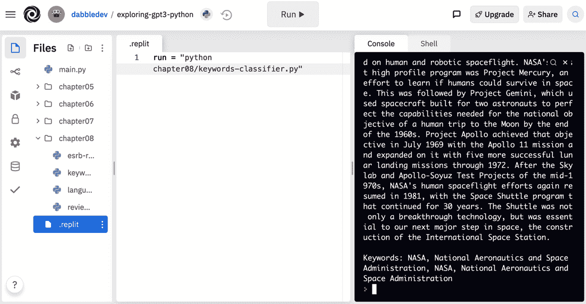

# 第九章：分类和归类文本

在上一章中，我们探讨了生成文本的不同方法。在本章中，我们将讨论文本分类和 OpenAI API 分类端点。我们将从快速概述文本分类和分类端点开始，然后进行实施情感分析、为文本分配 ESRB 评级、通过语言对文本进行分类以及从关键词对文本进行分类，这些都是常见的文本分类示例。

本章将涵盖以下主题：

+   理解文本分类

+   介绍分类端点

+   实施情感分析

+   为文本分配 ESRB 评级

+   通过语言对文本进行分类

+   从关键词对文本进行分类

# 技术要求

本章需要您访问 OpenAI API。您可以通过访问[`openapi.com`](https://openapi.com)来请求访问权限。

# 理解文本分类

文本分类任务接受文本并返回标签。将电子邮件分类为垃圾邮件或确定推文的情感都是文本分类任务的例子。使用 OpenAI API 进行文本分类有多种方法，我们已经看过其中一些。但我们还没有涵盖的一种方法是使用**完成端点**。然而，在我们深入研究完成端点之前，让我们快速回顾一下我们已经涵盖的一些不同的文本分类方法。

## 使用完成端点进行文本分类

你可以使用完成端点来执行分类任务，只需在提示中描述任务。例如，下面的提示可用于对社交媒体发布进行分类：

```py
Social media post: "My favorite restaurant is opening again Monday. I can't wait!"
Sentiment (positive, neutral, negative):
```

以往的提示可能会根据发布返回积极，自然或消极，但很可能是积极的。

## 内容过滤是一个文本分类任务

内容过滤也是一种文本分类任务。回想一下*第六章*中的*内容过滤*，当我们使用内容过滤引擎时，返回的结果是**0 = 安全**，**1 = 敏感**和**2 = 不安全**，这就是文本分类。

虽然可以使用 OpenAI API 进行多种文本分类的方法，但有一个端点专门设计用于分类任务。该端点就是分类端点，接下来我们将讨论这个内容。

# 介绍分类端点

OpenAI API 还为文本分类任务提供了**分类端点**。分类端点简化了许多分类任务。它使用语义搜索和完成引擎的组合，根据您提供的样本对文本进行分类。您可以在 HTTP 请求中提供最多 200 个示例，或者可以提前上传包含示例数据的文件。

分类端点的 URL 是[`api.openai.com/v1/classifications`](https://api.openai.com/v1/classifications)。它期望使用包含输入参数的 JSON 主体的 HTTP `POST`。其中一个必需的参数是*query*参数。*query*参数的值是要分类的文本。*query*值首先用于进行语义搜索，以从提供的示例中找到相关示例。然后，这些示例连同查询一起用于创建一个定义的完成引擎的提示，该引擎将对文本进行分类。

以下代码块显示了分类端点的简单请求主体。请注意，此请求与示例一起提供，并且将用于执行分类的模型是`curie`模型：

```py
{
  "query": "That makes me smile",
  "examples": [
    ["That is awesome", "Happy"],
    ["I feel so sad", "Sad"],
    ["I don't know how I feel", "Neutral"]
  ],
  "model": "curie"
}
```

正如前面提到的，你也可以上传示例数据，并使用*file*参数引用上传的示例数据。当你有大量示例时，这是很有用的 – 超过 200 个。让我们来看看如何上传文件。

## 上传文件

可以使用 OpenAI API 文件端点上传分类端点的示例数据。文件应该基于 JSON 行文本格式进行格式化，基本上就是每行一个有效的 JSON 对象，这些对象之间用换行符分隔。

重要提示

您可以在[`jsonlines.org`](https://jsonlines.org)了解更多关于 JSON 行格式的信息。

以下代码块提供了一个分类样本文件所需的格式示例。*text*属性和*label*属性是必需的，但*metadata*是可选的。元数据属性可以包含一个 JSON 对象，其中包含您想要的任何信息。然后这些数据可以选择性地随查询结果返回：

```py
{"text": "that is awesome", "label": "Happy", "metadata": {"id":"1"}}
{"text": "i feel so sad", "label": "Sad", "metadata": {"id":"2"}}
{"text": "i don't know how i feel", "label": "Neutral", "metadata": {"id":"3"}}
```

要上传一个样本文件，您可以使用 OpenAI API 的文件端点。在本章的示例中，我们不会使用文件。但是，在*第九章*中，我们将更仔细地研究文件端点，*构建一个 GPT-3 支持的问答应用*。

# 实施情感分析

常见的分类任务是情感分析。使用情感分析，您可以根据文本的一般语气进行分类 – 例如，快乐，悲伤，愤怒或中性。这在许多应用中都很有用；例如，如果您是餐馆老板，您希望能够迅速对不满意的顾客评论做出回应。让我们来看看如何使用 OpenAI API 分类端点来实现这一点。

在此示例中，我们将对餐厅评论进行分类。我们将使用分类端点进行此示例，并且我们将在请求中提供一些示例评论。

### Node.js/JavaScript 示例

要在 Node.js/JavaScript 中创建评论分类器示例，请按照以下步骤进行：

1.  登录到[replit.com](http://replit.com)，并打开你的**exploring-gpt3-node** REPL。

1.  创建一个新文件 – `chapter08/reviews-classifier.js`。

1.  将以下代码添加到`reviews-classifier.js`文件的开头：

    ```py
    const axios = require('axios');
    const client = axios.create({
      headers: {
        'Authorization': 'Bearer ' + process.env.OPENAI_API_KEY
      }
    });
    const endpoint = "https://api.openai.com/v1/classifications";
    ```

1.  然后，添加将与请求一起使用的示例评论：

    ```py
    const examples = [
      ["The service was super quick. I love that.","Good"],
      ["Would not go back.","Poor"],
      ["I tried the chicken and cranberry pizza...mmmm!","Good"],
      ["There were no signs indicating cash only!","Poor"],
      ["I was disgusted. There was a hair in my food.","Poor"],
      ["The waitress was a little slow but friendly.","Neutral"]
    ]
    ```

1.  接下来，为分类端点添加请求参数：

    ```py
    const params = {
      "query": "I'm never going to this place again",
      "examples": reviews,
      "model": "curie"
    }
    ```

1.  最后，添加以下代码将结果记录到控制台：

    ```py
    client.post(endpoint, params)
      .then(result => {
        console.log(params.query + '\nLABEL:' + result.data.label);
      }).catch(err => {
        console.log(err);
      });
    ```

1.  将你的根文件夹中的 `.replit` 文件更改为以下内容：

    ```py
    run = "node chapter08/reviews-classifier.js"
    ```

1.  单击 `chapter08/reviews-classifier.js` 文件，你应该会看到类似于以下截图中控制台输出的结果：



图 8.1 – 来自 chapter08/reviews-classifier.js 的示例输出

接下来，让我们使用 Python 来看一下相同的示例。

### Python 示例

要创建 Python 中的在线评论分类器示例，请按照以下步骤操作：

1.  登录到 [replit.com](http://replit.com)，并打开你的 **exploring-gpt3-python** REPL。

1.  创建一个新文件 – `chapter08/reviews-classifier.py`。

1.  将以下代码添加到 `reviews-classifier.py` 文件的开头：

    ```py
    import requests
    import os
    import json
    headers = {
        'Content-Type': 'application/json',
        'Authorization': 'Bearer ' + os.environ.get("OPENAI_API_KEY")
    }
    endpoint = "https://api.openai.com/v1/classifications"
    ```

1.  为评论示例创建一个数组：

    ```py
    examples = [
      ["The service was super quick. I love that.","Good"],
      ["Would not go back.","Poor"],
      ["I tried the chicken and cranberry pizza...mmmm!","Good"],
      ["There were no signs indicating cash only!","Poor"],
      ["I was disgusted. There was a hair in my food.","Poor"],
      ["The waitress was a little slow but friendly.","Neutral"]
    ]
    ```

1.  为端点设置请求参数：

    ```py
    params = {
      "query": "I'm never going to this place again",
      "examples": examples,
      "model": "curie"
    }
    ```

1.  进行 HTTP 请求并将结果打印到控制台：

    ```py
    result = requests.post(endpoint, headers=headers, data=json.dumps(params))
    print(params["query"] + '\nLABEL:' + result.json()["label"])
    ```

1.  将你的根文件夹中的 `.replit` 文件更改为以下内容：

    ```py
    run = "python chapter08/reviews-classifier.py"
    ```

1.  单击 `chapter08/online-review-classifier.py` 文件，你应该会看到类似于以下截图中控制台输出的结果：



图 8.2 – 来自 chapter08/online-review-classifier.py 的示例输出

现在让我们看另一个示例。

# 为文本分配 ESRB 等级

在上一个示例中，我们提供了样本数据来帮助我们的分类任务。但 GPT-3 是预先训练的，具有大量数据集，这意味着它可以执行令人惊讶的数量的分类任务，而无需提供任何示例数据。让我们看另一个使用完成端点的示例。在这个示例中，我们将研究使用 **娱乐软件评级委员会** (**ESRB**) 等级对文本进行分类。

在这个示例中，我们将使用完成端点为文本分配 ESRB 等级，而不需要任何示例数据。

### Node.js/JavaScript 示例

要创建 `Node.js/JavaScript` 中的 ESRB 等级分类器示例，请按照以下步骤操作：

1.  登录到 [replit.com](http://replit.com)，并打开你的 **exploring-gpt3-node** REPL。

1.  创建一个新文件 – `chapter08/esrb-rating-classifier.js`。

1.  将以下代码添加到 `esrb-rating-classifier.js` 文件的开头：

    ```py
    const axios = require('axios');
    const apiKey = process.env.OPENAI_API_KEY;
    const client = axios.create({
      headers: { 'Authorization': 'Bearer ' + apiKey }
    });
    const endpoint = "https://api.openai.com/v1/engines/davinci/completions";
    ```

1.  使用以下代码将端点参数添加到 `esrb-rating-classifier.js` 文件中：

    ```py
    const params = {
      prompt: "Provide an ESRB rating for the following text:\n\n\"i'm going to hunt you down, and when I find you, I'll make you wish you were dead.\"\n\nESRB rating:",
      temperature: 0.7,
      max_tokens: 60,
      top_p: 1,
      frequency_penalty: 0,
      presence_penalty: 0,
      stop: ["\n"]
    }
    ```

1.  将以下代码添加到将端点响应记录到控制台的文件中：

    ```py
    client.post(endpoint, params)
      .then(result => {
        console.log(params.prompt + result.data.choices[0].text);
        // console.log(result.data);
      }).catch(err => {
        console.log(err);
      });
    ```

1.  将你的根文件夹中的 `.replit` 文件更改为以下内容：

    ```py
    run = "node chapter08/esrb-rating-classifier.js"
    ```

1.  单击 `chapter08/esrb-rating-classifier.js` 文件，你应该会看到类似于以下截图中控制台输出的结果：



图 8.3 – 来自 chapter08/esrb-rating-classifier.js 的示例输出

现在，让我们来看一下 Python 中的 ESRB 等级分类器。

### Python 示例

要在 Python 中创建 ESRB 分级分类器示例，请按照以下步骤操作：

1.  登录到 [replit.com](http://replit.com) 并打开你的 **exploring-gpt3-python** REPL。

1.  创建一个新文件 – `chapter08/esrb-rating-classifier.py`。

1.  在 `esrb-rating-classifier.py` 文件的开头添加以下代码：

    ```py
    import requests
    import os
    import json
    headers = {
        'Content-Type': 'application/json',
        'Authorization': 'Bearer ' + os.environ.get("OPENAI_API_KEY")
    }
    endpoint = 'https://api.openai.com/v1/engines/davinci/completions'
    ```

1.  使用以下代码将端点参数添加到 `esrb-rating-classifier.js` 文件中：

    ```py
    params = {
      "prompt": "Provide an ESRB rating for the following text:\n\n\"i'm going to hunt you down, and when I find you, I'll make you wish you were dead.\"\n\nESRB rating:",
      "temperature": 0.7,
      "max_tokens": 60,
      "top_p": 1,
      "frequency_penalty": 0,
      "presence_penalty": 0,
      "stop": ["\n"]
    }
    ```

1.  添加以下代码将端点响应记录到控制台：

    ```py
    result = requests.post(endpoint, headers=headers, data=json.dumps(params))
    print(params["prompt"] + result.json()["choices"][0]["text"])
    ```

1.  更改你根目录下的 `.replit` 文件为以下内容：

    ```py
    run = "node chapter08/esrb-rating-classifier.js"
    ```

1.  点击 `chapter08/esrb-rating-classifier.js` 文件，你应该看到类似于以下截图中控制台输出的结果：

![图 8.4 – 来自 chapter08/esrb-rating-classifier.py 的示例输出]

](img/B16854_08_004.jpg)

图 8.4 – 来自 chapter08/esrb-rating-classifier.py 的示例输出

现在让我们看另一个例子。

# 文本分类为语言

现在，让我们考虑一个例子。假设我们需要根据消息所写的语言将支持消息路由到一个跨国支持中心。在这种情况下，我们可以使用 GPT-3 来按语言分类消息，例如英语、法语、印地语、西班牙语和俄语。让我们看看我们如何去做。

在此示例中，我们将使用分类端点和每种语言的示例来按语言分类支持消息。

### Node.js/JavaScript 示例

要在 Node.js/JavaScript 中创建电子邮件分类器示例，请按照以下步骤操作：

1.  登录到 [replit.com](http://replit.com) 并打开你的 **exploring-gpt3-node** REPL。

1.  创建一个新文件 – `chapter08/language-classifier.js`。

1.  在 `language-classifier.js` 文件的开头添加以下代码：

    ```py
    const axios = require('axios');
    const apiKey = process.env.OPENAI_API_KEY;
    const client = axios.create({
      headers: { 'Authorization': 'Bearer ' + apiKey }
    });
    const endpoint = "https://api.openai.com/v1/classifications";
    ```

1.  为语言示例创建一个数组：

    ```py
    const examples = [
      ["Hello, I'm interested in applying for the prompt designer position you are hiring for. Can you please tell me where I should send my resume?","English"],
      ["Здравствуйте, я хочу подать заявку на должность быстрого дизайнера, на которую вы нанимаете. Подскажите, пожалуйста, куда мне отправить резюме?","Russian"],
      ["Hola, estoy interesado en postularme para el puesto de diseñador rápido para el que está contratando. ¿Puede decirme dónde debo enviar mi currículum?", "Spanish"],
      ["Bonjour, je suis intéressé à postuler pour le poste de concepteur rapide pour lequel vous recrutez. Pouvez-vous me dire où je dois envoyer mon CV?","French"],
      ["नमस्कार, मैं उस त्वरित डिज़ाइनर पद के लिए आवेदन करने में रुचि रखता हूं, जिसके लिए आप नौकरी कर रहे हैं। क्या आप मुझे बता सकते हैं कि मुझे अपना रिज्यूम कहां भेजना चाहिए?","Hindi"]
    ]
    ```

    如果需要，你可以使用 [`translate.google.com`](https://translate.google.com) 创建示例数据。

1.  使用以下代码添加端点参数：

    ```py
    const params = {
      "query": "¿Con quién debo comunicarme sobre ofertas de trabajo técnico?",
      "examples": examples,
      "model": "curie"
    }
    ```

1.  添加以下代码将端点响应记录到控制台：

    ```py
    client.post(endpoint, params)
      .then(result => {
        console.log(params.query + '\nLABEL:' + result.data.label);
      }).catch(err => {
        console.log(err);
      });
    ```

1.  更改你根目录下的 `.replit` 文件为以下内容：

    ```py
    run = "node chapter08/language-classifier.js"
    ```

1.  点击 `chapter08/email-classifier.js` 文件，你应该看到类似于以下截图中控制台输出的结果：

![图 8.5 – 来自 chapter08/language-classifier.js 的示例输出]

](img/B16854_08_005.jpg)

图 8.5 – 来自 chapter08/language-classifier.js 的示例输出

接下来让我们看看 Python 版本。

### Python 示例

要在 Python 中创建语言分类器示例，请按照以下步骤操作：

1.  登录到 [replit.com](http://replit.com) 并打开你的 **exploring-gpt3-python** REPL。

1.  创建一个新文件 – `chapter08/language-classifier.py`。

1.  在 `language-classifier.py` 文件的开头添加以下代码：

    ```py
    import requests
    import os
    import json
    headers = {
        'Content-Type': 'application/json',
        'Authorization': 'Bearer ' + os.environ.get("OPENAI_API_KEY")
    }
    endpoint = "https://api.openai.com/v1/classifications"
    ```

1.  为语言示例创建一个数组：

    ```py
    examples = [
      ["Hello, I'm interested in applying for the prompt designer position you are hiring for. Can you please tell me where I should send my resume?","English"],
      ["Здравствуйте, я хочу подать заявку на должность быстрого дизайнера, на которую вы нанимаете. Подскажите, пожалуйста, куда мне отправить резюме?","Russian"],
      ["Hola, estoy interesado en postularme para el puesto de diseñador rápido para el que está contratando. ¿Puede decirme dónde debo enviar mi currículum?", "Spanish"],
      ["Bonjour, je suis intéressé à postuler pour le poste de concepteur rapide pour lequel vous recrutez. Pouvez-vous me dire où je dois envoyer mon CV?","French"],
      ["नमस्कार, मैं उस त्वरित डिज़ाइनर पद के लिए आवेदन करने में रुचि रखता हूं, जिसके लिए आप नौकरी कर रहे हैं। क्या आप मुझे बता सकते हैं कि मुझे अपना रिज्यूम कहां भेजना चाहिए?","Hindi"]
    ]
    ```

    如果需要，你可以使用 [`translate.google.com`](https://translate.google.com) 创建示例数据。

1.  使用以下代码添加端点参数：

    ```py
    const params = {
      "query": "¿Con quién debo comunicarme sobre ofertas de trabajo técnico?",
      "examples": examples,
      "model": "curie"
    }
    ```

1.  添加以下代码将端点响应记录到控制台：

    ```py
    result = requests.post(endpoint, headers=headers, data=json.dumps(params))
    print(params["query"] + '\nLABEL:' + result.json()["label"])
    ```

1.  将您的根文件夹中的`.replit`文件更改为以下内容：

    ```py
    run = "python chapter08/language-classifier.py"
    ```

1.  单击`chapter08/language-classifier.py`文件，您应该看到与以下截图中的控制台输出类似的结果：



图 8.6 - 来自 chapter08/language-classifier.py 的示例输出

现在让我们看另一个例子。

# 基于关键字分类文本

另一个常见的文本分类任务是基于关键字对文档进行分类。为此，我们可以使用 GPT3 创建一个与文档内容相关的关键字列表。然而，GPT3 不仅仅是从文档中提取关键字。它根据文档内容确定相关的关键字。让我们尝试一个例子。

在这个例子中，我们将使用完成端点来基于相关关键字对文档进行分类。

### Node.js/JavaScript 示例

要在`Node.js/JavaScript`中创建关键词分类器示例，请按照以下步骤进行：

1.  登录到[replit.com](http://replit.com)，然后打开您的**exploring-gpt3-node** REPL。

1.  创建一个新文件 - `chapter08/keywords-classifier.js`。

1.  在`keywords-classifier.js`文件的开头添加以下代码：

    ```py
    const axios = require('axios');
    const apiKey = process.env.OPENAI_API_KEY;
    const client = axios.create({
      headers: { 'Authorization': 'Bearer ' + apiKey }
    });
    const endpoint = "https://api.openai.com/v1/engines/davinci/completions";
    ```

1.  使用以下代码将端点参数添加到`keywords-classifier.js`中：

    ```py
    const params = {
      prompt: "Text: When NASA opened for business on October 1, 1958, it accelerated the work already started on human and robotic spaceflight. NASA's first high profile program was Project Mercury, an effort to learn if humans could survive in space. This was followed by Project Gemini, which used spacecraft built for two astronauts to perfect the capabilities needed for the national objective of a human trip to the Moon by the end of the 1960s. Project Apollo achieved that objective in July 1969 with the Apollo 11 mission and expanded on it with five more successful lunar landing missions through 1972\. After the Skylab and Apollo-Soyuz Test Projects of the mid-1970s, NASA's human spaceflight efforts again resumed in 1981, with the Space Shuttle program that continued for 30 years. The Shuttle was not only a breakthrough technology, but was essential to our next major step in space, the construction of the International Space Station.\n\nKeywords:",
      temperature: 0.3,
      max_tokens: 60,
      top_p: 1,
      frequency_penalty: 0.8,
      presence_penalty: 0,
      stop: ["\n"]
    }
    ```

1.  添加以下代码以将端点响应记录到控制台：

    ```py
    client.post(endpoint, params)
      .then(result => {
        console.log(params.prompt + result.data.choices[0].text);
        // console.log(result.data);
      }).catch(err => {
        console.log(err);
      });
    ```

1.  将您的根文件夹中的`.replit`文件更改为以下内容：

    ```py
    run = "node chapter08/keywords-classifier.js"
    ```

1.  单击`chapter08/keywords-classifier.js`文件，您应该看到与以下截图中的控制台输出类似的结果。请注意，在结果中识别出的一些关键字可能不存在于原始文本中：



图 8.7 - 来自 chapter08/keywords-classifier.js 的示例输出

好了，接下来，让我们看一下 Python 版本。

### Python 示例

要在 Python 中创建关键词分类器示例，请按照以下步骤进行：

1.  登录到[replit.com](http://replit.com)，然后打开您的**exploring-gpt3-python** REPL。

1.  创建一个新文件 - `chapter08/keywords-classifier.py`。

1.  在`keywords-classifier.py`文件的开头添加以下代码：

    ```py
    import requests
    import os
    import json
    headers = {
        'Content-Type': 'application/json',
        'Authorization': 'Bearer ' + os.environ.get("OPENAI_API_KEY")
    }
    endpoint = 'https://api.openai.com/v1/engines/davinci/completions'
    ```

1.  在`chapter08/keywords-classifier.py`中添加一个`params`变量，其中包含以下代码：

    ```py
    params = {
      "prompt": "Text: When NASA opened for business on October 1, 1958, it accelerated the work already started on human and robotic spaceflight. NASA's first high profile program was Project Mercury, an effort to learn if humans could survive in space. This was followed by Project Gemini, which used spacecraft built for two astronauts to perfect the capabilities needed for the national objective of a human trip to the Moon by the end of the 1960s. Project Apollo achieved that objective in July 1969 with the Apollo 11 mission and expanded on it with five more successful lunar landing missions through 1972\. After the Skylab and Apollo-Soyuz Test Projects of the mid-1970s, NASA's human spaceflight efforts again resumed in 1981, with the Space Shuttle program that continued for 30 years. The Shuttle was not only a breakthrough technology, but was essential to our next major step in space, the construction of the International Space Station.\n\nKeywords:",
      "temperature": 0.3,
      "max_tokens": 60,
      "top_p": 1,
      "frequency_penalty": 0.8,
      "presence_penalty": 0,
      "stop": ["\n"]
    }
    ```

1.  添加以下代码以将端点响应记录到控制台：

    ```py
    result = requests.post(endpoint, headers=headers, data=json.dumps(params))
    print(params["prompt"] + result.json()["choices"][0]["text"])
    ```

1.  将您的根文件夹中的`.replit`文件更改为以下内容：

    ```py
    run = "python chapter08/keywords-classifier.py"
    ```

1.  单击`chapter08/keywords-classifier.py`文件，您应该看到与以下截图中的控制台输出类似的结果：



图 8.8 - 来自 chapter08/keywords-classifier.py 的示例输出

再次注意，返回的一些关键字并不出现在提供的文本中，但它们仍然相关。这是可能的，因为 GPT3 正在使用其语言模型来考虑最合适的关键字，即使它们不包含在文本中。

# 摘要

在本章中，我们介绍了理解文本分类和分类 API 端点。然后，我们通过实例来实现情感分析，为文本分配 ESRB 等级，语言分类和关键字文本分类。

在下一章中，我们将了解如何使用语义搜索 API 端点。
