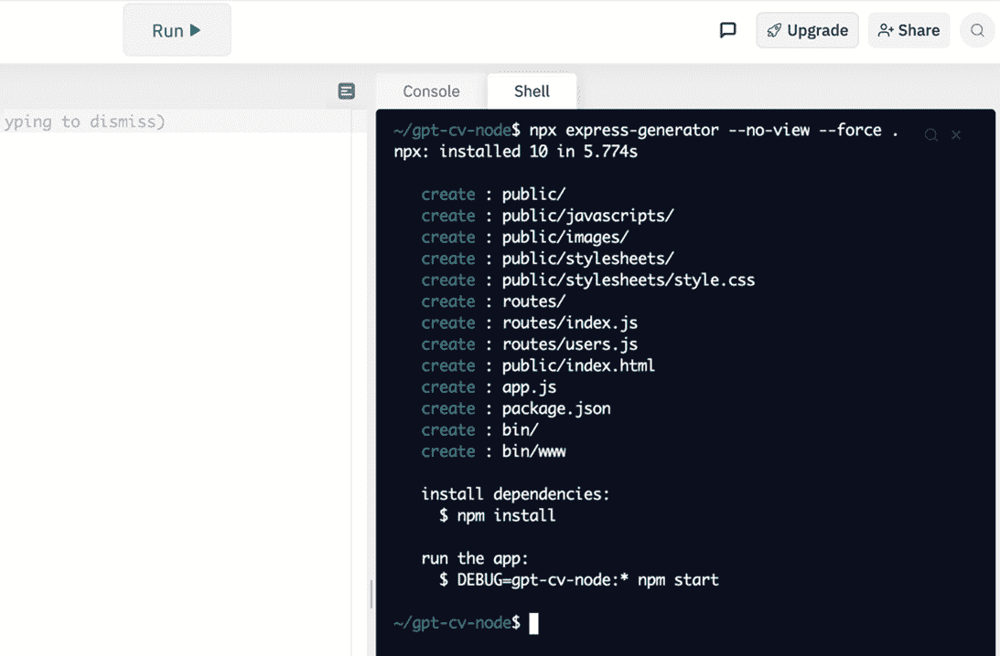

# 第十章：构建一个由 GPT-3 提供动力的问答 app

到目前为止，我们已经查看了（并编写了）很多代码。但我们实际上还没有创建一个完全可用的 app。那就是我们将要做的事情。在本章中，我们将构建一个简单但功能强大的 Web app，让用户提出问题，由 GPT-3 从我们提供的知识库中回答。该 app 可用于回答任何类型的问题，但我们将用它来回答人们可能对我们有的问题 - 一个 *问我任何事* 的 app。所以，想象一个招聘专员或潜在雇主可以用来询问你的技能、成就和经验的网站。不想找新工作？没问题。同样，这个 app 可以用于任何类型的问答应用 - 所以可能是一个由 GPT-3 动力驱动的产品 FAQ，或一个由 GPT-3 动力驱动的教学助手 - 这完全取决于你。我们将从 app 将如何工作的快速概述开始，然后逐步介绍构建过程。

我们将涵盖的主题如下：

+   介绍 GPT Answers

+   介绍 Answers 端点

+   设置和测试 Express

+   为 GPT Answers 创建 API 端点

+   创建 GPT Answers 用户界面

+   整合 Answers 端点

+   生成相关且准确的答案

+   使用带有 Answers 端点的文件

# 技术要求

本章需要您访问 OpenAI API。您可以通过访问 [`openapi.com`](https://openapi.com) 来请求访问权限。

# 介绍 GPT Answers

在本节中，我们将构建一个由 GPT-3 提供动力的 Web app，让用户提出任何问题并从我们提供的数据知识库中获取答案。我们将称该 app 为 **GPT Answers**。是的，这个名称有点平淡，但我们可以随时使用 GPT-3 来帮助我们思考一个更好的名称。

以下是完成时 app 外观的截图。是的，用户界面可能像名称一样平淡，但其背后的功能一定令人印象深刻！


图 9.1 – GPT Answers 用户界面

现在让我们深入了解 UI 的后台以及 app 将如何构建。

## GPT Answers 技术概述

GPT Answers 将使用 Node.js、JavaScript 和 HTML 构建。我们还将使用一个名为 Express 的 Web 框架来简化开发。

重要提示

该 app 也可以使用 Python 构建，但对于本章，与之前的章节不同，我们只会介绍使用 Node.js/JavaScript 创建 app 的步骤。

问题将通过一个简单的网页表单提交，该表单将使用 JavaScript 向 app 也暴露的 API 端点发送请求。该 app 的 API 主要作为与 OpenAI API 交互的代理，但也将提供异常处理和响应格式化。

## 托管该 app

到目前为止，我们只使用[replit.com](http://replit.com)来编写和测试代码。但是，[replit.com](http://replit.com)还支持托管应用程序，并且使用起来非常容易。对于 Web 应用程序，您甚至可以使用自己的域名。因此，[replit.com](http://replit.com)将成为我们的托管环境以及开发环境。

重要说明

由 GPT-3 支持的应用程序需要经过 OpenAI 批准才能向公众展示。我们在本章不会详细讨论此事，但我们将在*第十章*中涵盖应用程序批准流程，*与 OpenAI 技术的应用上线*。

应用程序将使用的主要 OpenAI 端点是答案端点。但是由于我们尚未涵盖答案端点，请在开始编码之前快速介绍一下。

# 介绍答案端点

OpenAI Answers 端点专为问答任务而设计。它通过启用用于答案的真实来源而比 Completions 端点提供更多控制。对于我们的 GPT Answers 应用程序，这个真实来源将是用于回答问题的知识库。知识库（即文档）可以通过端点请求提供，也可以通过引用包含数据的预先上传的文件来提供。

答案端点的 URL 为 [`api.openai.com/v1/answers`](https://api.openai.com/v1/answers)，该端点接受 HTTP POST 请求和一些输入参数。以下是可用输入参数的简要描述，但有关更完整的详细信息，请参阅位于 [`beta.openai.com/docs/api-reference/answers`](https://beta.openai.com/docs/api-reference/answers) 的 OpenAI 文档的答案端点。

以下是必填参数：

+   `model`（必填，字符串） - 将用于完成的模型的 ID。

+   `question`（必填，字符串） - 要回答的问题。

+   `examples`（必填，数组） - 问题列表，带有答案，以帮助引导模型朝着答案的语气和格式前进。

+   `examples_context`（必填，字符串） - 包含用于为您提供的示例生成答案的上下文信息的文本片段。

+   `documents`（数组） - 应从中提取输入问题的答案的文档列表。如果`documents`参数是空列表，则将根据问题 - 答案示例来回答问题。另外，仅在不使用`file`参数时才需要`documents`参数。

+   `file`（字符串） - 包含要从中提取答案的文档的上传文件的 ID。如果未使用`documents`参数，则仅需要`file`参数。

可选参数如下：

+   `search_model`（字符串） - 用于搜索的引擎。默认为`ada`。

+   `max_rerank`（整数）- 要处理的文档的最大数量。较高的值可以提高准确性，但会增加延迟和成本。默认为`200`。

+   `temperature`（数字）- 默认为`0`，适用于定义明确答案，但较高的值可用于较不确定的答案。

+   `logprobs`（整数）- 默认为`null`。返回的可能标记数量。

+   `max_tokens`（整数）- 将用于生成答案的最大标记数量。默认为`16`。

+   `stop`（字符串或数组）- 可选的最多四个模式序列，将导致 API 停止生成完成。默认为`null`。

+   `n`（整数）- 为每个问题生成的答案数量。默认为`1`。

+   `logit_bias`（映射）- 可以用于控制指定标记出现在完成中的可能性。

+   `return_metadata`（布尔值）- 如果使用了`file`参数并且文件引用包含元数据，则导致响应包含来自文件的元数据。

+   `return_prompt`（布尔值）- 导致将提示文本与响应一起返回。默认为`false`。

+   `expand`（数组）- 导致响应包含关于完成或文件的详细信息。`expand`的值当前可以包括`completion`和`file`。默认为一个空数组。

    重要提示

    对于我们的 GPTAMA 应用程序，我们将不会使用所有可用的参数。

现在我们已经对 Answers 端点进行了快速介绍，让我们开始编写我们的 GPTAMA 应用程序！

# 设置和测试 Express

Express 是用于 Node.js 的轻量级但灵活的 Web 应用程序框架，我们将在应用程序中使用它。通过 Replit.com，它非常容易上手。所以，我们要做的第一件事是在 Replit.com 上设置 Express 并进行测试。我们将从头开始，因此我们将为 GPTAMA 创建一个新的 repl。

要创建一个新的 Node.js REPL 并设置 Express，请完成以下步骤：

1.  在[replit.com](http://replit.com)登录。

1.  创建一个名为**gptanswers-node**的新 Node.js REPL。

1.  在输出窗格中，单击**Shell**选项卡，然后输入此命令：

    ```py
    npx express-generator --no-view --force .
    ```

1.  通过按下*Enter*键运行上一个命令，您应该会看到一个类似以下截图的结果：

    图 9.2 - express-generator 的输出

    重要提示

    `npx`命令包含在 NPM 中，NPM 与 Node.js 一起安装。它用于运行`express-generator`，该生成器将创建一个基本的 Express 应用程序作为起点。命令以句点结尾，以指示`express-generator`将文件添加到当前目录。`--no-view`开关告诉生成器我们只是使用纯 HTML 作为我们的 UI，`--force`开关告诉生成器覆盖当前目录中的任何现有文件。

1.  `express-generator`完成后，在 shell 中运行以下命令：

    ```py
    npm update
    ```

1.  现在创建一个名为`.replit`的文件，并将以下`Run`命令添加到其中：

    ```py
    Run = "node ./bin/www"
    ```

1.  最后，点击**Run**按钮启动 Express 服务器。如果一切顺利，您应该在 Replit.com 编辑器中看到一个打开的浏览器窗口，其中显示 Express 的欢迎消息。它应如下图所示：


图 9.3 – 在 Replit.com 中运行的 Express 服务器

需要注意的两件事是浏览器窗格中的 URL 以及**Run**按钮变成了**Stop**按钮。这是因为 Express 正在运行一个 HTTP 服务器，该服务器将持续运行，直到停止。因此，在 Express 服务器运行时，应用程序可在网上访问，并通过浏览器窗格中的 URL 访问。此外，当您进行更改时，您需要点击**Stop**按钮然后点击**Run**按钮来停止和重新启动 Express。

如果您遇到任何问题，并且看不到 Express 页面，您可以再次按照本节的步骤操作而不会损坏任何内容。当您看到 Express 的欢迎页面时，您就可以继续进行。接下来，我们将为我们的 GPT Answers 应用程序创建 API 端点。

# 为 GPT Answers 创建 API 端点

当我们的应用程序完成时，我们将拥有一个完全功能的 API 端点，可以返回由 OpenAI API 生成的答案。但现在，我们将只创建一个返回占位符响应的端点。然后，我们将使用 Postman 测试端点，稍后再回来完成编码。

## 创建 API 端点

要创建 API 端点，请执行以下操作：

1.  打开由`express-generator`创建的`app.js`文件。该文件应如下图所示：

    图 9.4 – 由 express-generator 创建的默认 app.js 文件

1.  编辑*第 7 行*，将`var usersRouter = require('./routes/users')`更改为以下内容：

    ```py
    var answerRouter = require('./routes/answer');
    ```

1.  编辑*第 18 行*，将`app.use('/users', usersRouter);`更改为以下内容：

    ```py
    app.use('/answer', answerRouter);
    ```

    编辑*第 7*行和*18*行后，`app.js`文件应如下图所示：

    

    图 9.5 – 编辑后的 app.js 文件

1.  删除`routes/users.js`文件。

1.  创建一个新文件`routes/answer.js`。

1.  添加以下代码到`answers.js`文件中：

    ```py
    const axios = require('axios');
    const express = require('express');
    const router = express.Router();

    router.post('/', (req, res) => {
      res.send({answer:'placeholder for the answer'});
    });

    module.exports = router;
    ```

1.  点击**Stop**按钮，然后**Start**。您应该再次看到**Welcome to E****xpress**的消息。

我们创建的 API 端点接受 HTTP`/answer`。但由于它接受 HTTP POST，我们需要通过进行 POST 请求来测试它。为了做到这一点，我们将使用 Postman。

## 使用 Postman 测试我们的 API

此时，我们应该能够向我们的`/answer`端点进行 HTTP POST 请求并获得响应。要完成测试，请将从[Replit.com](http://Replit.com)浏览器（显示 Express 欢迎消息的浏览器）复制到剪贴板的应用程序 URL：

1.  打开一个新的浏览器选项卡并登录到[`postman.com`](https://postman.com)。

1.  创建一个名为`gptanswers-node`的新集合。

1.  在 `/answer` 中创建一个名为 `test-answer-api` 的新请求。端点 URL 的格式如下，其中`{username}` 是你的 Replit.com 用户名（假设你将 repl 命名为 `gptanswers-node`）：

    ```py
    https://gptanswers-node.{username}.repl.co
    ```

1.  在端点 URL 输入框下方，选择 **Body** 选项卡，选择 **Raw** 单选按钮，并从内容类型下拉列表中选择 **JSON**。

1.  最后，添加以下 JSON 请求体：

    ```py
    {
        "question" : "How old are you?"
    }
    ```

    在设置 Postman 请求后，它应该像以下的屏幕截图：

    

    图 9.6 – 在 Postman 中测试 GPT-CV 应用程序 API 端点的请求。

1.  点击蓝色 **Send** 按钮提交请求并查看响应，应如下所示：

    ```py
    {
        "answer": "placeholder for the answer"
    }
    ```

现在，我们已经得到 API 端点的回应，接下来我们将创建一个 Web 表单来调用 API。

# 创建 GPT Answers 用户界面。

现在，让我们创建一个简单的 Web 表单界面，让用户提交问题以从我们的 API 获取答案。我们将从添加 **UIkit** 开始 – 这是一个流行的轻量级前端框架，你可以在 [`getuikit.com/`](https://getuikit.com/) 了解更多信息。我们还将使用 **Axios** 使用一些 JavaScript 来对应用程序 API 进行 HTTP 调用。

UIkit 将使我们的应用程序拥有简单但干净和现代的外观。你可以从 [`getuikit.com`](https://getuikit.com) 免费下载 UIkit，或者你可以使用一个托管版本，该版本可从 [`jsdeliver.com`](https://jsdeliver.com) 获得，那就是我们将要使用的。

要添加 UIkit，请执行以下操作：

1.  打开 `public/index.html` 文件。

1.  用[`cdn.jsdelivr.net/npm/uikit@3.6.22/dist/css/uikit.min.css`](https://cdn.jsdelivr.net/npm/uikit@3.6.22/dist/css/uikit.min.css)替换样式表的 URL。

1.  使用以下代码替换 `<body>` 标签和 `</body>` 标签之间的所有内容：

    ```py
      <div class="uk-section uk-section-large uk-height-viewport">
      <div class="uk-container uk-text-center uk-padding-large">
            <h1 class="uk-heading-medium"><strong>GPT</strong> Answers </h1>
            <p class="uk-text-lead">An Example Knowledge Base App Powered by GPT-3</p>
        </div>
        <div class="uk-container uk-text-center">
            <form class="uk-grid-collapse" uk-grid>
              <div class="uk-width-1-1 ">
                <input id="question" class="uk-input uk-width-1-3" type="text">
                <button type="submit" class="uk-button uk-button-default uk-width-1-5">Get Answer</button>
              </div>
            </form>
        </div>
        <div class="uk-container uk-text-center uk-padding">
          <div class="uk-inline">
            <div id="answer" class="uk-flex uk-flex-center uk-flex-middle uk-padding uk-width-expand"></div>
          </div>
        </div>
      </div>
    ```

1.  在`</body>`标签上方添加以下代码。这将添加页面使用的 JavaScript 文件的引用。其中三个脚本将来自 CDN，一个 `/javascripts/script.js`，我们将在下一步中创建它：

    ```py
    <script src="img/axios.min.js"></script>
    <script src="img/uikit.min.js"></script>
    <script src="img/uikit-icons.min.js"></script>
    <script src="img/script.js"></script>
    ```

    此时，`public/index.html` 文件的代码应如图所示：

    

    图 9.7 – 完成的 `index.html` 代码

    如果你点击 **Stop** 按钮然后点击 **Run** 按钮停止并重新启动 Express 服务器，你会看到主屏幕更新为如下屏幕截图的样子：

    

    图 9.8 – 问题输入表单

    现在我们需要添加一些 JavaScript 来调用应用程序 API。

1.  创建 `javascripts/script.js` 文件并添加以下代码。

1.  首先，我们将添加两个变量来保存 HTML 表单和答案 `div`：

    ```py
    const form = document.querySelector('form');
    const answer = document.querySelector('#answer');
    ```

1.  接下来，我们将添加当提交表单时触发的代码：

    ```py
    const formEvent = form.addEventListener('submit', event => {
      event.preventDefault();
      const question = document.querySelector('#question');
      if (question.value) {
        askQuestion(question.value);
      } else {
        answer.innerHTML = "You need to enter a question to get an answer.";
        answer.classList.add("error");
      }
    });
    ```

1.  下面的代码将将文本附加到答案`div`中：

    ```py
    const appendAnswer = (result) => {
      answer.innerHTML = `<p>${result.answer}</p>`;
    };
    ```

1.  最后，我们将添加一个函数，使用 Axios 调用应用程序的 API 端点：

    ```py
    const askQuestion = (question) => {
      const params = {
        method: 'post',
        url: '/answer',
        headers: {
          'content-type': 'application/json'
        },
        data: { question }
      };
      axios(params)
        .then(response => {
          const answer = response.data;
          appendAnswer(answer);
        })
        .catch(error => console.error(error));
    };
    ```

1.  现在我们可以通过点击**Stop**按钮，然后点击**Start**按钮来进行测试。然后，在浏览器窗格中，在文本框中输入一个问题，然后点击**GET ANSWER**按钮。你应该会看到 API 回复的**占位符答案**，如下图所示：


图 9.9 – 使用占位符 API 代码测试 Web UI

在这一点上，我们已经搭建好了应用程序的基本框架。接下来，我们需要做的是写一些代码，将问题传递给 OpenAI API 答案端点。

# 集成答案端点

现在我们将返回到`routes/answer.js`文件中添加一些代码，以便调用 OpenAI Answers 端点来回答用户的问题，而不是返回占位符文本：

1.  打开`routes/answer.js`文件并执行以下操作。

1.  删除 *第 5 行* 之后的所有代码。

1.  从 *第 5 行* 开始，添加以下代码，然后换行：

    ```py
    const apiKey = process.env.OPENAI_API_KEY;
    const client = axios.create({
      headers: { 'Authorization': 'Bearer ' + apiKey }
    });
    ```

1.  接下来，添加以下代码并在其后换行：

    ```py
    const documents = [
      "I am a day older than I was yesterday.<|endoftext|>",
      "I build applications that use GPT-3.<|endoftext|>",
      "My preferred programming is Python.<|endoftext|>"
    ]
    ```

1.  从 *第 16 行* 开始添加以下代码，然后换行：

    ```py
    const endpoint = 'https://api.openai.com/v1/answers';
    ```

1.  接下来，从 *第 18 行* 开始添加以下内容以完成代码：

    ```py
    router.post('/', (req, res) => {
      // call the OpenAI API
        const data = {
        "documents": documents,
        "question": req.body.question,
        "search_model": "ada",
        "model": "curie",
        "examples_context": "My favorite programming language is Python.",
        "examples": [["How old are you?", "I'm a day older than I was yesterday."], ["What languages do you know?", "I speak English and write code in Python."]],
        "max_tokens": 15,
        "temperature": 0,
        "return_prompt": false,
        "expand": ["completion"],
        "stop": ["\n", "<|endoftext|>"],
      }
      client.post(endpoint, data)
        .then(result => {
          res.send({"answer" : result.data.answers[0]})
        }).catch(result => {
          res.send({"answer" : "Sorry, I don't have an answer."})
        });
    });
    module.exports = router;
    ```

    当你编辑完`routes/answer.js`文件后，文件应该像以下屏幕截图所示：

    

    图 9.10 – 编辑后的 routes/answer.js 文件

    我们快要完成了。在测试之前的最后一步是将我们的 OpenAI API 密钥添加为环境变量。

1.  通过点击挂锁图标并添加一个名为`OPENAI_API_KEY`的密钥和您的 OpenAI API 密钥的值来将您的 OpenAI API 密钥添加为 REPL 的秘密，就像以下屏幕截图中的示例一样: 

    图 9.11 – 为 OpenAI API 密钥添加一个秘密

1.  点击**Stop**按钮，然后点击**Run**重新启动 Express，然后在问题文本框中输入**你最喜欢的食物是什么？**，然后点击**GET ANSWER**按钮。你应该会看到像以下屏幕截图展示的内容——来自 GPT-3 的答案：


图 9.12 – 来自 GPT-3 的答案

现在我们有了一个简单但功能齐全的基于 GPT-3 的问答应用。然而，您可能想知道为什么我们在**你最喜欢的食物是什么？**这个问题上得到了回应（一个答案），当我们还没有给出那个答案。我们将在后面讨论这个问题。

# 生成相关且真实的答案

GPT-3 是一个语言模型 - 它预测应该跟随提供的提示文本的文本的统计可能性。从某种意义上说，它不是一个知识库，它并不太关心所生成的响应的事实准确性。这并不意味着它不会生成事实性答案；这只是意味着你不能指望所有时间答案都是准确的。但是 Answers 端点可以提供对所生成答案的准确性或相关性的很多控制。

正如我们之前在 *介绍 Answers 端点* 中讨论的那样，答案将从我们提供的文档中生成。在这一点上，我们是作为端点请求的一部分提供文档的。使用这种方法，如果答案无法从文档中推导出来，由 `routes/answer.js` 文件定义的引擎 - 我们使用了 `Curie` 引擎。但是假设我们只希望答案从我们的文档中推导出来，否则我们不希望返回答案。虽然我们无法完全控制这一点，但我们可以使用预先上传的文件使我们接近实现这一点。

当使用 Answers 端点时使用预先上传的文件时，与使用 HTTP 请求提供文档时一样，你不仅仅限于只有 200 个文档。事实上，预先上传的文件可能包含非常多的文档，因为每个组织可以拥有最多 1 GB 的文件空间。因为一个文件可能包含非常多的文档，所以对文件中的文档应用关键字过滤器以缩小可能用于答案的文档范围。从那里开始，文档被排名，然后由模型参数定义的引擎使用以生成答案。当你使用请求参数发送文档时，关键字过滤将被跳过，因为你可以发送的文档数量限制为 200 个。对于我们的 GPT Answers 应用程序，关键字过滤将帮助我们减少回答无关问题的可能性。所以，让我们看一下如何使用 Answers 端点中的文件。

# 使用 Answers 端点的文件

要使用文件中的文档，我们需要做的第一件事是将文件上传到 OpenAI，以便 Answers 端点可以使用它。该过程涉及创建一个包含我们文档的文件，然后使用 **文件端点** 将文件上传并获取可在对 Answers 端点发出请求时使用的文件 ID。要创建和上传答案文件，请完成以下步骤：

1.  创建一个名为 `answers.jsonl` 的新的`jsonl`文件，并为文件中的一些答案编写如下格式的答案：

    ```py
    {"text": "I am a day younger than I will be tomorrow"}
    {"text": "I like to code in Python."}
    {"text": "My favorite food is carrot cake."}
    ```

1.  创建另一个名为 `files-upload.js` 的新文件。

1.  在 `file-upload.js` 中添加以下代码：

1.  需要几个将要使用的模块：

    ```py
    const fs = require('fs');
    const axios = require('axios');
    const FormData = require('form-data');
    ```

1.  接下来，添加以下代码来读取请求的 `jsonl` 数据：

    ```py
    const data = new FormData();
    data.append('purpose', 'answers');
    data.append('file', fs.createReadStream('answers.jsonl'));
    ```

1.  添加一个变量用于 HTTP 请求参数：

    ```py
    const params = {
    method: 'post',
    url: 'https://api.openai.com/v1/files',
    headers: { 
      'Authorization': 'Bearer ' + process.env.OPENAI_API_KEY, 
      ...data.getHeaders()
    },
    data : data
    }
    ```

1.  最后，添加代码以进行 HTTP 请求并记录结果：

    ```py
    axios(params)
      .then(function(response) {
        console.log(response.data);
      })
      .catch(function(error) {
        console.log(error);
      });
    ```

    当编辑完 `files-upload.js` 后，它应该像以下截图中的代码一样：

    

    图 9.13 – file-upload.js 的完成代码

1.  在输出窗格中，点击**Shell**选项卡。

1.  在`~/gptanswers-node`提示符处，输入以下命令并附上你的 OpenAI API 密钥：

    ```py
    export OPENAI_API_KEY="your-api-key-goes-here"
    ```

1.  接下来，在 shell 中输入以下命令：

    ```py
    node files-upload.js
    ```

    运行上述 shell 命令后，你应该会看到类似以下截图的输出结果：

    

    图 9.14 – files-upload.js 的 Shell 输出

1.  从 JSON 结果中复制`id`值（以`file-`开头的值）到剪贴板。

1.  点击小锁图标并创建一个名为`ANSWERS_FILE`的新秘密/环境变量，并将你在上一步中复制的 ID 值粘贴到值输入中，然后点击**添加新的秘密**按钮。

1.  打开`routes/answer.js`并将*第 20 行*的`documents`参数重命名为`file`。然后用`process.env.ANSWERS_FILE`替换`documents`值。

    上一个更新后，*第 20 行*应该看起来像以下截图中的*第 20 行*：

    

    图 9.15 – 使用文件参数的 Answers 端点参数

    此时，你已经准备好测试了。

1.  点击**运行**按钮，然后在问题输入中输入**你最喜欢的食物是什么？**，然后点击**获取答案**按钮。这次你会注意到答案是从我们的答案文件中生成的，就像以下截图所示：


图 9.16 – 从答案文件生成的答案

但是现在，如果你输入一个与你的文件中的数据完全无关的问题，响应将会是**对不起，我没有答案**。你可以尝试询问诸如**你们有红色的这个吗？**这样的问题。你应该会看到一个类似以下截图的结果：


图 9.17 – 无法回答的问题

一个重要的事情要记住的是，答案文件和完成引擎（在我们的案例中是`Curie`）都用于生成答案。因此，有可能得到一个在你的文件中没有定义的答案。但是，你的答案文件中的数据越多，这种可能性就越小。但是因为我们现在只有三个文档在我们的答案文件中，所以如果你问类似**你最喜欢的度假地点是什么？**这样的问题，你可能会看到一个在你的答案文件中没有定义的答案，就像以下截图所示：


图 9.18 – 不是来自答案文件的答案

因此，即使我们在答案文件中提供答案，也不能保证 GPT-3 不会生成不准确的答案。但我们稍后将在本章和*第十章*，*使用 OpenAI-Powered 应用程序上线*中讨论这一点。

到目前为止，我们有一个完全功能的应用程序。当然，我们可以添加更多功能来完善我们的应用程序，但核心功能已经就位。你需要做的主要事情是向答案文件中添加更多文档。要做到这一点，每次想要添加新数据时，请完成以下步骤：

1.  向 `answers.jsonl` 文件添加新文档。

1.  打开 shell。

1.  运行以下 shell 命令将你的 API 密钥设置为 shell 可以访问的环境变量：

    ```py
    export OPENAI_API_KEY="your-api-key-goes-here"
    ```

1.  在 shell 中运行以下命令以执行 `files-upload.js`：

    ```py
    node files-upload.js
    ```

1.  通过单击锁图标并替换值为 **ANSWERS_FILE** 机密，复制文件 `ANSWERS_FILE` 环境变量。

1.  单击 **停止** 按钮，然后单击 **运行** 按钮重新启动 Express。

再次，你的答案文件中有更多数据将减少出现非事实性答案的机会。但 GPT-3 仍然可能生成明显不是来自你的答案文件的答案。因此，考虑内容过滤仍然很重要，这也是我们将在下一章中更详细介绍的原因。

# 概要

在本章中，我们介绍了答案端点，并使用 Node.js/JavaScript 构建了一个简单但功能齐全的 Web 应用程序，可以从我们提供的文档中回答问题。对于我们的应用程序，我们创建了一个充当 OpenAI API 代理的 API 和一个提供用户界面的 HTML 页面。

在下一章中，我们将讨论 OpenAI 应用程序审查流程，并根据 OpenAI 的建议实施一些修改。然后，我们将介绍上线所需的步骤！
