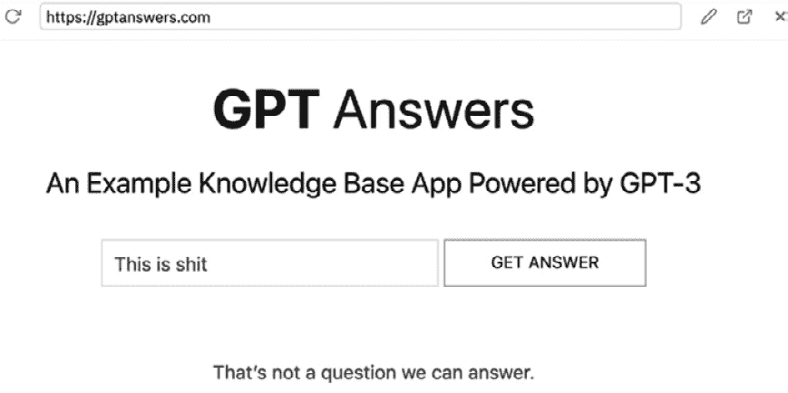
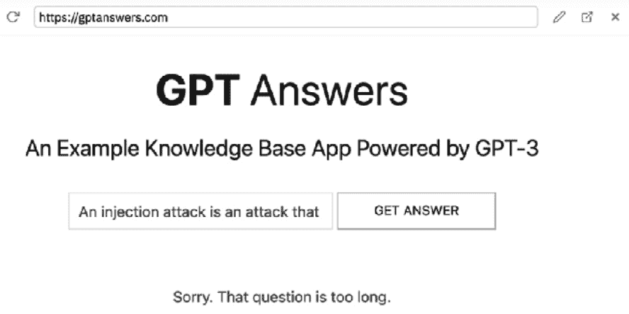
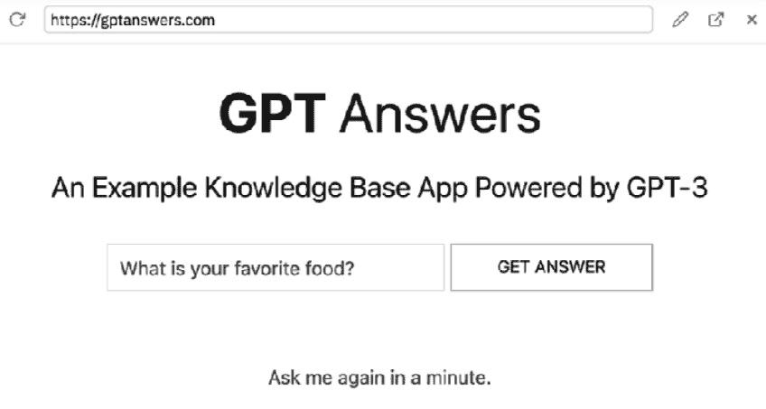
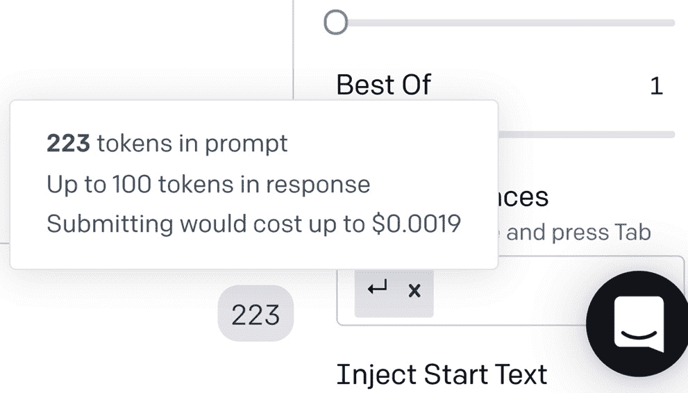

# *第十章*：使用 OpenAI 提供的应用程序上线

在使用 OpenAI API 的应用程序上线之前，它们必须经过 OpenAI 的发布批准。批准过程有助于防止 OpenAI API 被故意或意外地滥用。它也有助于应用程序提供者和 OpenAI 规划资源需求，以确保应用程序在推出时表现良好，并随着使用量的增长而增加。

在此章节中，我们将讨论 OpenAI 应用程序使用案例指南以及审查和批准过程。然后，我们将根据 OpenAI 的指南讨论对我们的 GPT Answers 应用程序所做的更改。最后，我们将实施建议的更新，并讨论提交我们的应用程序进行审查，并希望获得批准的过程！

我们将涵盖的主题如下：

+   上线

+   理解用例指南

+   处理潜在的批准问题

+   完成预上线审查请求

# 技术要求

本章需要您可以访问**OpenAI API**。您可以通过访问[`openai.com`](https://openai.com)来请求访问权限。

# 上线

OpenAI 将活动的应用程序定义为向超过五个人提供 API 输出的任何应用程序。这包括您公司或组织中的人员。因此，即使一个私人测试版应用程序使用 OpenAI API 并拥有超过五个用户，它也被认为是活动的。要超出这一限制，您的应用程序需要经过 OpenAI 的审查和批准。

在未经 OpenAI 批准的情况下上线可能会导致您的 API 密钥立即被吊销，而且没有警告。此外，未经批准的上线可能导致您的账户被永久性地阻止进一步访问 API。因此，了解 OpenAI 使用案例指南和审查过程是一个好主意。

# 理解用例指南

可以使用 OpenAI API 的应用程序范围广泛。然而，并非所有用例都被允许，因此每个应用程序在上线之前都必须经过审查和批准。

每个应用程序都是根据特定情况进行评估的，因此了解您的应用程序是否允许的唯一方法是通过审查过程。特别是，OpenAI 发表了一些指南，您可以阅读和遵循，以使您的应用程序有最佳的批准机会。您可以在[`beta.openai.com/docs/use-case-guidelines`](https://beta.openai.com/docs/use-case-guidelines)找到这些指南。在大量投入应用程序之前，您应该先仔细阅读这些指南。

在本节中，我们不会涵盖所有应用程序指南。但主要是与安全相关的指南。OpenAI 定义的安全是*摆脱可以对人们造成身体、心理或社会伤害的条件的自由，包括但不限于死亡、伤害、疾病、困扰、错误信息或激进化、财产或机会的损失或损害，以及对环境的损害*。

因此，作弊、欺骗、剥削、骚扰、伤害、恐吓、操纵、误导、盗窃、诈骗，或者在任何方式上可能造成伤害或损害的应用，无论是否有意，都是不允许的。大多数指南应该看起来相当明显。但有些指南并不那么明显。例如，在大多数情况下，你不能构建用于生成 Twitter 推文内容的应用。这是因为使用 AI 生成的内容违反了 Twitter 的可接受使用政策。因此，再次强调本节的重点不是覆盖具体的指南；重点是强调在构建应用之前审查和理解指南的重要性。通过在开始构建之前审查指南，你将能够专注于所有可接受的用例，并避免潜在的审批问题。我们将在审查流程之前看一些可能的问题。

# 处理潜在的审批问题

阅读完 OpenAI 用例指南后，我们可以考虑它们如何适用于我们的 GPT Answers 应用程序。我们的应用程序仅限于以我们在答案文件中提供的答案来回答问题。因此，它的范围非常有限，不会生成开放式的响应。基于此，指南建议我们的应用程序几乎总是可批准的。然而，再次强调，每个应用程序都是根据具体情况审批的，所以这并不是一个保证。

另外，作为开发人员，我们希望尽一切可能考虑安全最佳实践。OpenAI 在 [`beta.openai.com/docs/safety-best-practices`](https://https://beta.openai.com/docs/safety-best-practices) 发布了安全最佳实践，这将有助于确保我们的应用程序是安全的，并且不容易被利用。这也将有助于增加我们的应用程序获得批准的机会。基于这些指南，我们将考虑对我们的 GPT Answers 应用程序进行一些修改。具体来说，我们将考虑以下内容：

+   内容过滤

+   输入和输出长度

+   速率限制

让我们逐个讨论这些考虑因素，并讨论它们如何适用于我们的应用。

## 内容过滤

对于我们的 GPT Answers 应用程序，内容过滤可能是不必要的，因为完成是从我们提供的答案文件中生成的 - 这在某种程度上可以算作一种输出过滤。然而，我们可能不希望将不适当的问题发送到 OpenAI API，因为即使在我们的情况下响应是安全的，我们仍然会使用令牌。因此，我们将为问题实施内容过滤，以检查不适当的词语。

我们将要实现的内容过滤流程如下：

1.  用户提出一个问题。

1.  我们检查问题是否含有粗俗语言。

1.  如果检测到粗俗语言，我们显示：**这不是我们可以回答的问题**。

1.  如果未检测到粗俗语言，我们将问题传递给 OpenAI API。

我们将使用一个名为 `bad-words` 的 `Node.js` 库来检查问题文本中是否包含粗话，然后再将其发送到 OpenAI API。如果在文本中发现了粗话，我们将礼貌地回复一条消息，说**这不是我们能回答的问题**。

要在问题文本上实现内容过滤，请执行以下操作：

1.  在 `routes/answer.js` 的第一行引入 `bad-words` 库，代码如下：

    ```py
    const Filter = require(‘bad-words’);
    ```

1.  在 `routes/answer.js` 文件中，在以 `const data` 开头的行上面添加以下代码：

    ```py
    let filter = new Filter();
    if (filter.isProfane(req.body.question)) {
        res.send({ “answer”: “That’s not a question we can answer.”});
        return;
    }
    ```

1.  点击**停止**按钮，然后点击**运行**按钮，并通过输入包含粗话的问题来进行测试。你应该会看到以下截图中的结果：



图 10.1 – 过滤问题中的粗话

现在我们已经为问题实现了内容过滤。如果我们要使用完成端点生成答案，我们还想使用我们在*第六章*中讨论过的*内容过滤*引擎来对答案应用内容过滤。但是，因为我们是从提供的文件中生成答案，所以对于 GPT Answers 应用来说可能并不必要。因此，让我们继续考虑输入和输出长度。

## 输入和输出长度

OpenAI 建议限制输入和输出长度。输出可以使用 `max_tokens` 参数轻松限制。我们已经将 GPT Answers 应用的 `max_tokens` 参数设为 `150`。这是推荐的范围输出长度 - 如来自答案文件的问题答案。这将支持约 6-8 个句子的答案文本。如果你有更短的答案，你可以减小 `max_tokens` 的长度。较少，只要你允许足够来完全回答问题。

注入攻击是一种利用允许执行不受信任或意外输入的 Web 应用程序的攻击。例如，在 GPT Answers 应用中 - 如果用户提交的内容不是问题，而我们的后端代码将其传递给 OpenAI API 会发生什么？记得了吗，输入输出？尽管我们的应用程序范围严格，并且除了相关问题以外的任何内容都不会返回任何东西，但是添加一些代码来防止非常大的文本输入仍然是值得的，因为输入仍然会使用标记。因此，我们将添加一些代码来限制输入长度。平均句子是 75-100 个字符，因此我们将限制输入为 150 个字符，以允许更长的句子。

要限制我们的 GPT Answers 应用中的输入长度，请执行以下操作：

1.  打开 `routes/answer.js` 并在以 `router.post` 开头的行后面的新行上添加以下代码：

    ```py
    if (req.body.question.length > 150) {
      res.send({ “answer”: “Sorry. That question is too long.” });
      return;
    }
    ```

1.  点击**停止**按钮，然后点击**运行**按钮来停止和启动 Express 服务。

1.  输入一个超过 150 个字符长的文本输入到问题框中，然后点击**获取答案**按钮。

    您现在会看到表单告诉用户他们输入的文本太长，如下截图所示：



图 10.2 – 长文本表单输出

再次强调，尽管我们的应用不应生成意外完成，但限制输入，以及请求速率限制，将有助于预防恶意尝试利用您的应用。接下来让我们来谈谈速率限制。

## 请求速率限制

速率限制防止用户在给定时间段内发出超过预定义数量的请求。这可防止恶意脚本潜在地向您的应用程序发出大量请求。我们将使用一个名为`Express Rate Limit`的可用于`Node.js`的库，根据 OpenAI 建议的指南将限制设置为每分钟最多六次请求。

要实现速率限制，请执行以下操作：

1.  打开`app.js`，在*行 9*之后（或在`var app = express();`之后），添加以下代码：

    ```py
    const rateLimit = require(“express-rate-limit”);
    const apiLimiter = rateLimit({
      windowMs: 1 * 60 * 1000,
      max: 6
    });
    app.use(“/answer/”, apiLimiter);
    ```

1.  打开`routes/answer.js`，并在以`router.post`开头的行后添加以下代码：

    ```py
    if (req.rateLimit.remaining == 0) {
      res.send({“answer” : “Ask me again in a minute.”});
      return;
    };
    ```

    之前的更改为每分钟六次请求设置了速率限制。当在向 OpenAI API 发出请求之前达到速率限制时，我们会以消息回应，并要求在一分钟内再试一次，如下截图所示：



图 10.3 – 请求速率超过时的消息

由于我们以与答案相同的 JSON 格式发送消息，因此消息会显示在表单页面上。

重要提示

您可以通过访问[`www.npmjs.com/package/limiter`](https://https://www.npmjs.com/package/limiter)了解使用的速率限制器库。

好的，现在我们已经审查了用例指南并实施了一些安全最佳实践，我们准备讨论 OpenAI 预发布审核和批准流程。

# 完成预发布审核请求

当您的应用准备好上线时，您可以通过填写位于[`beta.openai.com/forms/pre-launch-review`](https://beta.openai.com/forms/pre-launch-review)的**预发布审核请求**表单来开始批准流程。

该表单收集您的联系信息，以及您的领英资料链接、应用程序的视频演示，以及关于应用用例和增长计划的一系列特定问题的答案。在接下来的部分中，我们将列出当前问题并提供可能适用于 GPT Answers 应用程序的示例答案。

预发布审核请求表中有很多问题，建议先在 Google 文档（或其他应用程序）中完整回答问题，然后在准备就绪时将答案复制粘贴到表单中。

该表单首先收集您的联系方式。在提供联系信息后，第一组问题会就高级别的用例进行提问。

## 高级用例问题

高层次的用例问题非常直观。但是，其中一个问题要求提供视频演示。所以，您需要提供一个视频演示，并将其发布到 YouTube 等地方，以便提供链接。以下是问题和一些示例答案：

+   问题：您是否已经审查过 OpenAI 的用例指南？

    答案：是的

+   问题：请描述一下您的公司是做什么的。

    答案：我的公司提供技术学习资源。

+   问题：请描述一下您的应用程序是做什么的。

    答案：它让用户获取关于我的问题的答案。

+   问题：您的申请之前是否被 OpenAI 审核过？此次审核的结果如何？此次提交与之前的审核有何关联？

    答案：没有

+   问题：请链接到您的应用程序的短视频演示。

    答案：这里放置一个视频演示的链接。

+   问题：请分享一个 OpenAI 团队可以用来演示/测试您的应用程序的登录凭据。

    答案：不需要登录凭据。

接下来的一组问题与安全性和风险缓解相关。您可能会猜到，有很多关于安全性和风险缓解的问题。让我们来看一看。

## 安全和风险缓解问题

在编写本书时，有 14 个安全和风险缓解问题。您将看到其中一些问题涉及内容过滤、设置输入和输出长度以及请求速率限制等问题。这些问题对批准是重要的且必需的，这就是为什么我们在我们的 GPT Answers 应用中实现了它们：

+   问题：用户可以在您的应用程序的输入文本框中插入的最大字符数是多少？

    答案：150

+   问题：您的应用程序运行的最大输出标记是多少？

    答案：150

+   问题：您的应用程序的典型用户是谁（例如，企业、研究实验室、企业家、学术界等）？您以某种方式验证或认证用户吗？如果是，如何？

    答案：最可能的用户是对我的专业背景感兴趣的招聘人员。用户未经验证，但使用用户的 IP 地址进行了速率限制。

+   问题：用户需要支付才能访问您的应用程序吗？如果是，金额是多少？

    答案：没有

+   问题：您是否为您的应用程序实现了速率限制？如果是，速率限制是多少，如何执行？

    答案：是的，速率限制由 IP 地址强制执行，请求限制为每分钟六次请求。

+   问题：您是否为您的应用程序实现了某种形式的内容过滤？如果是，被过滤的内容是什么，通过什么手段进行过滤，以及如何执行？

    答案：所有答案都是从预先上传用于与答案端点一起使用的答案文件生成的。因此，不使用内容过滤。

+   问题：您是否捕获用户对您的输出质量或其他细节（例如，返回不愉快的内容）的反馈？如果是，这些数据如何监控和处理？

    答案：提供了一个链接到 Google 表单，让用户报告他们可能遇到的任何问题。

+   问题：您是否会监控您应用程序的特定用户的使用情况（例如，调查体积的激增，标记某些关键字等）？如果是，以什么方式和通过什么执行机制？

    答案：不，因为范围仅限于由我提供的答案文件中的数据。

+   问题：您的应用程序是否清楚地披露了内容是由 AI 生成的？以什么方式？

    答案：是的，问题输入页面上的文字让用户知道答案是由 GPT-3 生成的。

+   问题：您的应用程序中是否有**人类介入**的形式？如果有，请描述。

    答案：是的，所有问题的答案都来自一个最初由人类创建和更新的答案文件。

+   问题：您是否为此项目实施了其他安全或风险缓解因素？请描述。

    答案：OpenAI 令牌使用将被密切监控异常使用模式。

+   问题：您的应用程序与社交媒体之间有何关系（如果有的话）？

    答案：没有。

+   问题：你的应用程序与政治内容有何关系（如果有的话）？

    答案：没有。

+   问题：如果您的团队具有特定的资格或背景，可能有助于缓解上述任何风险，请在此处详细说明。

    答案：我们没有特定的资格。

在安全和风险缓解问题之后，你将被询问关于你的增长计划。

## 增长计划问题

为了管理资源需求并限制滥用的可能性，新的应用程序被授予了最大花费限制。这就限制了可以处理的令牌的最大数量，从而限制了可扩展性。然而，随着你的应用程序建立了一份可靠记录，最大花费限制可以随着时间的推移而增加。

你的初始花费限制需要经过批准才能上线，并且在应用程序上线后需要提交额外的表单来请求花费限制的增加。花费限制增加表单位于[`beta.openai.com/forms/quota-increase`](https://beta.openai.com/forms/quota-increase)。要计算您的花费限制，请在 Playground 中输入一个典型的提示，并设置引擎和响应长度。然后将鼠标悬停在提示输入下方的数字上，您将看到一个估计的成本，如下面的屏幕截图所示：




图 10.4 – 估计成本

通过 Playground 的成本，你可以按预估的用户数量和每月请求数量进行乘法运算。你需要对增长计划部分的问题提供一个估计。

以下是关于你的增长计划的问题：

+   问题：您希望请求多少美元价值的每月配额？

    答案：$18

+   问题：您预计每个月会消耗多少令牌？针对哪些引擎？

    答案：~ 1 Mn ada 代币和~1 Mn curie 代币。

+   问题：您最初将向多少用户（大约）推出您的应用程序？您如何知道这些用户？/您将如何找到这些用户？

    答案：订阅我们 SaaS 服务的 5,000 名用户

+   问题：请描述您在初始推出后的增长计划。

    答案：我们计划向我们服务的所有新用户推出该应用程序 - 每月约 500 个

+   问题：如果获准，您打算在哪个日期启动您的应用程序？

    答案：2021 年 11 月 5 日

+   问题：如果有用的话，您可以在上面的启动日期上进行详细说明。

    答案：我们希望尽快推出。

在成长规划问题之后，还有一些杂项问题要总结，然后您就完成了。

## 总结问题

总结问题请求您对应用程序开发过程以及构建应用程序的经验提供反馈。这是向 OpenAI 提供信息的机会，可以帮助他们改进其他开发者的开发体验：

+   问题：我们很喜欢听取反馈！您是否想与 OpenAI 团队分享任何内容（例如，构建应用程序最困难的部分或您希望看到的功能）？

    答案：最困难的部分是找出最佳的请求速率限制方法。

+   问题：如果我们批准您的应用程序，您是否希望添加任何合作者来访问 API？如果是，请以逗号分隔的形式列出他们的电子邮件。

    答案：不，目前只有我一个人。

+   问题：我们对此过程的反馈特别感兴趣。您完成这个表单需要多长时间？您觉得最困难的是什么？

    答案：我花了大约 5 天时间。我对编码还很陌生，所以学习曲线很具挑战性。

+   问题：您还有什么要分享的吗？

    答案：我非常喜欢与 API 合作！

+   问题：表单提交日期

    答案：05/11/2021

在完成并提交“预发布审查请求”表单后，您应该在几天内收到回复。回复将是批准或拒绝，并附有拒绝的原因。根据拒绝原因，您可能能够解决任何指出的问题并重新提交进行另一次审查。然而，希望您的应用程序获得批准，并且您已经获得了上线的批准！

# 概要

恭喜，您已完成*探索 GPT-3*和您的第一个 OpenAI 驱动的应用程序！在这一点上，您的应用程序应该已经准备好进行审查流程了。请记住，所有应用程序都是根据具体情况逐案批准的。因此，仅仅完成本书中的步骤并不保证获得批准。但是，您现在了解了用例指南以及应用程序审查和批准流程。此外，您具备了处理 OpenAI 可能要求的任何更改所需的知识和技能。
