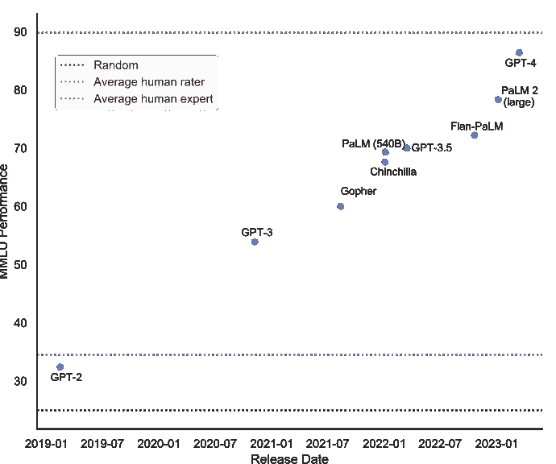
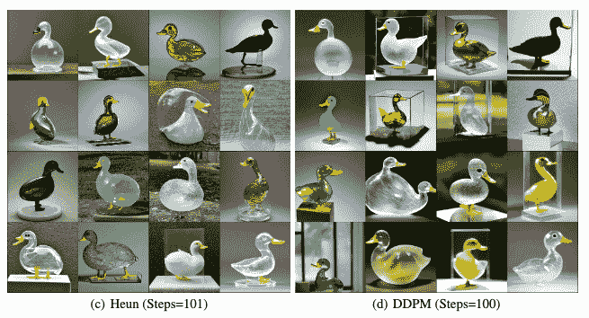
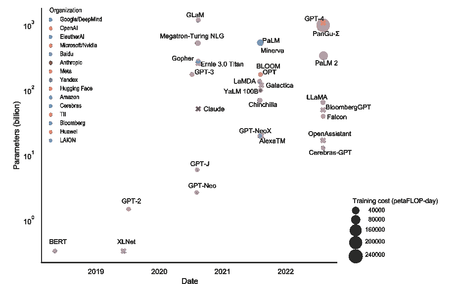
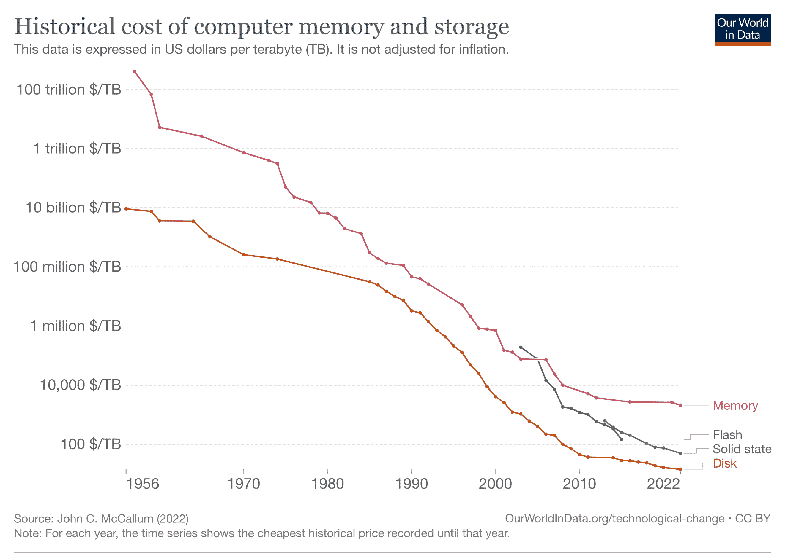
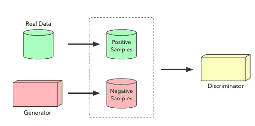
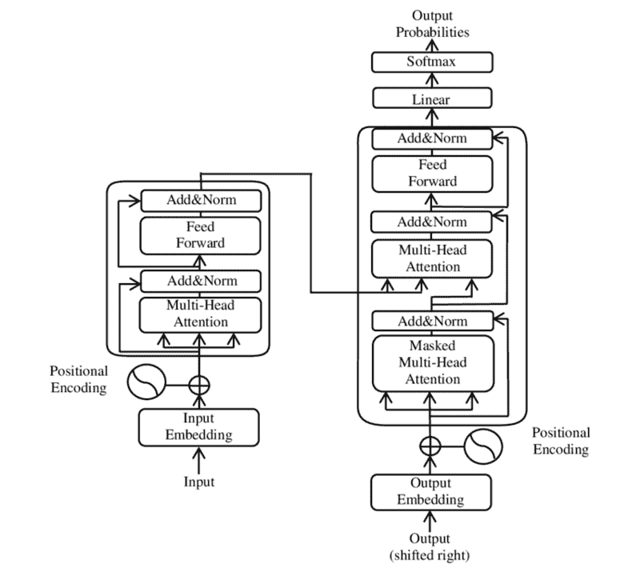
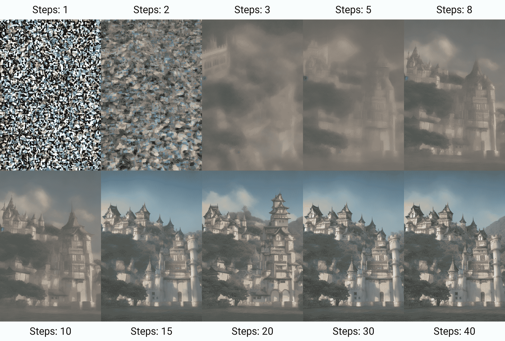

# 第一章：什么是生成模型？

## 加入我们的书籍社区 Discord

[`packt.link/EarlyAccessCommunity`](https://packt.link/EarlyAccessCommunity)

**人工智能**（**AI**）取得了重大进展，影响着企业、社会和个人。大约过去的十年里，深度学习已经发展到可以处理和生成文本、图像、视频等非结构化数据的程度。这些基于深度学习的先进人工智能模型在各个行业都受到了欢迎，包括**大型语言模型**（**LLMs**）。目前，媒体和行业都对人工智能存在很高的热情。这是由多种因素推动的，包括技术进步、知名应用以及潜在的跨行业变革影响。在本章中，我们将讨论生成模型，特别是 LLMs，并将其应用于文本、图像、声音和视频等领域。我们将介绍一些使它们运转的技术背景，以及它们是如何训练的。我们将从一个介绍开始，澄清我们在技术最前沿的地方以及热潮是关于什么的。

## 为什么会有热潮？

在媒体上，人工智能相关突破及其潜在影响得到了大量报道。这些涵盖了从自然语言处理和计算机视觉的进步到像 GPT-3 这样的复杂语言模型的发展。媒体通常突出人工智能的能力以及其革命性改变医疗保健、金融、交通等行业的潜力。特别是，生成模型因其能够生成文本、图像和其他创意内容（通常与人类生成的内容难以区分）而受到了广泛关注。这些模型还提供了广泛的功能，包括语义搜索、内容操作和分类。这通过自动化实现了成本节约，并可以让人类以前所未有的水平利用他们的创造力。这张图表灵感来自于 LessWrong 上 Stephen McAleese 关于 GPT-4 预测的博文，显示了 LLM 在**大规模多任务语言理解**（**MMLU**）基准测试中的改进情况，该测试旨在量化基础数学、美国历史、计算机科学、法律等领域的知识和问题解决能力：

图 1.1：大型语言模型（LLM）在大规模多任务语言理解（MMLU）基准测试上的平均表现。请注意，虽然大多数基准结果来自 5-shot，但一些 GPT-2、PaLM 和 PaLM-2 的结果是指微调模型。

您可以在近年的基准中看到进展。特别值得强调的是 OpenAI 通过公共用户界面提供的模型的进展，特别是从 GPT-2 到 GPT-3 再到 GPT-3.5 到 GPT-4 版本之间的改进。这些模型最近才开始胜过平均人类评分员，但仍未达到人类专家的水平。这些人工智能模型的成就令人印象深刻；然而，值得注意的是这些模型的表现取决于领域；大多数模型在小学数学单词问题的 GSM8K 基准测试中仍表现不佳。

> **OpenAI** 是一家美国人工智能研究实验室，旨在推动和发展友好的人工智能。它成立于 2015 年，得到了几位有影响力的人物和公司的支持，他们承诺向这项创业投资超过 10 亿美元。该组织最初承诺非营利性质，通过向公众开放其专利和研究成果，与其他机构和研究人员合作。2018 年，埃隆·马斯克因担心与特斯拉的角色存在潜在利益冲突而辞去了董事会成员职务。2019 年，OpenAI 转变为营利性组织，随后微软对 OpenAI 进行了重大投资，导致 OpenAI 系统与微软基于 Azure 的超级计算平台以及必应搜索引擎整合。该公司的最显著成就包括用于训练强化算法的 OpenAI Gym，以及最近推出的 GPT-n 模型和 DALL-E，另一个能从文本生成图像的深度学习模型。

**生成预训练变压器**（**GPT**）模型，如最近推出的 OpenAI 的 ChatGPT，是 AI 在 LLM 领域的主要进展的典范。ChatGPT 通过在更大的规模上进行训练，并且比以前的模型更大，极大地改善了聊天机器人的能力。这些基于 AI 的聊天机器人可以生成类似人类的实时反馈以回应客户，并且可以应用于广泛的用例，从软件开发和测试到诗歌和商业通信。在行业内，对于 AI 的能力及其对业务运营的潜在影响，人们感到越来越兴奋。我们将在*第十章*，*生成模型的未来*中更详细地讨论这一点。随着 OpenAI 的 GPT 等 AI 模型的不断改进，它们可能成为需要多样化知识和技能的团队的不可或缺的资产。例如，GPT-4 可以被认为是一个可以无偿工作的“博学多才”的人（除了订阅或 API 费用），在数学、语言、统计、宏观经济学、生物学甚至通过法律考试方面提供帮助。随着这些 AI 模型变得更加熟练和易于访问，它们很可能在塑造未来工作和学习方面发挥重要作用。通过使知识更易于访问和适应，这些模型有可能促进公平竞争，并为各行各业的人们创造新的机会。这些模型在需要更高级别推理和理解的领域显示出潜力，尽管取得进展的程度取决于涉及的任务的复杂性。至于带有图像的生成模型，我们可以期待具有更好能力的模型协助创建视觉内容，并且可能在目标检测、分割、字幕生成等计算机视觉任务方面有所改进。让我们把术语稍微澄清一下，并更详细地解释生成模型、人工智能、深度学习和机器学习是什么意思。

### 生成模型是什么？

在媒体中，当提到这些新模型时经常使用术语人工智能。值得更清晰地区分一下术语生成模型与人工智能、深度学习、机器学习和语言模型的区别：

+   **人工智能**（**AI**）是计算机科学的一个广泛领域，涉及创建智能代理的系统，这些系统可以推理、学习和自主行动。

+   **机器学习**（**ML**）是人工智能的一个子集，涉及开发能够从数据中学习的算法。ML 算法是在一组数据上训练的，然后它们可以使用该数据进行预测或决策。

+   **深度学习**（**DL**）是机器学习的一个子集，使用人工神经网络从数据中学习。神经网络受人类大脑启发，它们能够从数据中学习复杂的模式。

+   **生成模型**是一种可以生成新数据的机器学习模型。生成模型在一组数据上进行训练，然后它们可以利用该数据创建类似于训练数据的新数据。

+   **语言模型**是预测序列中的标记（通常是单词）的统计模型。其中一些能够执行更复杂的任务的模型由许多参数组成（数量达到数十亿甚至万亿），因此被称为**大语言模型**。

生成模型与其他类型的机器学习模型之间的主要区别在于生成模型不仅仅是做出预测或决策。它们实际上可以创建新数据。这使得生成模型非常强大，可以用于各种任务，比如生成图像、文本、音乐和视频。下表总结了人工智能（AI）、机器学习（ML）、深度学习（DL）、语言模型和生成模型之间的区别：

| **术语** | **定义** |
| --- | --- |
| 人工智能 | 计算机科学的一个广泛领域，涉及智能体的创建。 |
| 机器学习 | 处理能够从数据中学习的算法开发的人工智能的一个子集。 |
| 深度学习 | 机器学习的一个子集，利用人工神经网络从数据中学习。 |
| 生成模型 | 一种能够生成新数据的机器学习模型。 |
| 语言模型 | 一种模型，如今主要是深度学习模型，用于在上下文中预测标记。 |

图 1.2：术语 - 人工智能、机器学习、深度学习和生成模型。生成模型是一种强大的人工智能类型，可以生成类似于训练数据的新数据样本。生成式人工智能模型已经取得了长足的进展，能够利用数据中的模式从头开始生成新示例。这些模型可以处理不同类型的数据，并应用于各种领域，包括文本生成、图像生成、音乐生成和视频生成。对于语言模型，重要的是要注意，其中一些模型，尤其是较新一代的模型，是生成的，可以产生语言（文本），而其他模型则不是。这些生成模型促进了生成**合成数据**来训练人工智能模型，当真实数据稀缺或受限时。这种数据生成方式可以降低标记成本并提高训练效率。微软研究采用了这种方法（“只需教科书”，2023 年 6 月），用 GPT-3.5 创建了合成教科书和练习作为他们的训练数据集。在接下来的章节中，我们将看看生成模型的不同领域，比如文本、图像、声音、视频。这些应用主要围绕内容生成、编辑和处理（识别）。让我们从文本开始！

### 文本

文本生成，如 OpenAI 的 GPT-4，可以生成连贯和语法正确的诗歌，或者用不同语言编写代码并提取关键词和主题特征。这些模型在内容创作和**自然语言处理**（**NLP**）等领域具有实际应用，其最终目标是创建能够解释人类语言的算法。语言建模旨在基于先前的文本序列来预测下一个单词、字符，甚至句子。从这个意义上讲，语言建模可以作为一种编码语言规则和结构的方法，可以被机器理解。大型语言模型捕获了人类语言的语法、句法和语义结构。这些模型很重要，因为它们构成了许多更大的 NLP 任务的核心，例如内容创建、翻译、摘要、机器翻译和文本编辑任务，如拼写校正。从本质上讲，语言建模以及更广泛地说自然语言处理，严重依赖于表示学习的质量。一个训练良好的语言模型可以对其训练的文本信息进行编码，并基于这些学习生成新的文本，从而承担文本生成的任务。最近，大型语言模型已经在论文生成、代码开发、翻译和理解基因序列等任务中找到了应用。语言模型的更广泛应用涉及多个领域，例如：

+   **问答**：AI 聊天机器人和虚拟助手可以提供个性化和高效的帮助，缩短客户支持的响应时间，从而提升客户体验。这些系统可以用于解决诸如餐厅预订和票务预订等特定问题。

+   **自动摘要**：语言模型可以创建文章、研究论文和其他内容的简洁摘要，使用户能够迅速消化和理解信息。

+   **情感分析**：通过分析文本中的观点和情感，语言模型可以帮助企业更高效地理解客户的反馈和意见。

+   **主题建模**和**语义搜索**：这些模型可以识别、按主题分类，并将文档压缩成简洁向量，使得组织在内容管理和发现方面更加便利。

+   **机器翻译**：AI 驱动的语言模型可以将一种语言的文本翻译成另一种语言，支持企业的全球扩张努力。新型生成模型可以与商业产品（例如 Google 翻译）竞争。

尽管语言模型取得了显著的成就，但在处理复杂的数学或逻辑推理任务时，仍然存在限制。目前还不清楚不断增加语言模型规模是否会不可避免地导致新的推理能力。正如前面提到的，我们还必须考虑数据质量和规模的重要性，因为这些因素在改进不同任务和领域中的语言模型性能方面起着重要作用。生成模型的另一个应用领域是图像生成，让我们来看看这是怎么回事！

### 图像

生成式人工智能广泛用于生成 3D 图像、头像、视频、图表、虚拟或增强现实中的插图、视频游戏图形设计、标识创建、图像编辑或增强。该图表展示了使用稳定扩散从文本提示中生成图像（来源：麻省理工学院和谷歌研究的 Yilun Xu 等人于 2023 年 6 月发表的“重启采样以改进生成过程”；https://arxiv.org/pdf/2306.14878.pdf）：

图 1.3：从文本提示“一个由玻璃制成的透明鸭雕塑”生成的图像。

借助稳定的扩散模型，你可以在仅对模型的初始设置进行最小更改或使用数值求解器和抽样器的情况下，看到各种结果。尽管有时它们会产生惊人的结果，但这种不稳定性和不一致性对更广泛应用这些模型构成了重大挑战。像**MidJourney**、**DALL-E 2**和**Stable Diffusion**这样的服务，提供自文本输入或其他图像派生出的有创意和逼真的图像。像**DreamFusion**、**Magic3D**和**Get3D**这样的服务，让用户能够将文字描述转换为 3D 模型和场景，推动设计、游戏和虚拟体验领域的创新。主要应用有三大方面：

1.  **图像生成**：模型可以生成绘画、照片和素描等图像。这可以用于各种用途，如创作艺术品、设计产品、生成逼真的视觉效果。

1.  **图像编辑**：模型可以执行移除对象、更改颜色和添加效果等任务。这可以用于提高图像的质量，并使其更具视觉吸引力。

1.  **图像识别**：大型基础模型可用于识别图像，包括场景分类，还有对象检测，例如检测人脸。

像生成对抗网络（GANs）和 DALL-E 这样的模型。GANs 生成逼真的图像，具有许多商业应用，而 DALL-E 则根据文本描述创建图像，这对于创意产业设计广告、产品和时尚非常有帮助。图像编辑涉及使用面部属性编辑或图像变形等技术修改图像的语义，通过优化和基于学习的方法生成具有通过 StyleGAN 预训练的 GAN 模型的潜在表示获得的风格的图像。扩散模型最近已被用于高级图像编辑任务，如通过文本引导无缝连接手动设计的遮罩区域或生成 3D 对象操作。这些技术使得图像生成灵活，但面临着有限的多样性问题，可以通过将其他文本输入纳入到过程中来缓解。图像编辑类别还包括图像恢复等任务，即从其降解版本中恢复清晰图像，这涉及图像超分辨率、修补、去噪、去雾和去模糊等任务。使用 CNN 和 transformer 架构的深度学习方法由于比传统方法具有优越的视觉质量而普遍存在。生成模型如 GANs 和扩散模型（DMs）用于恢复，但可能遭受复杂的训练过程和模式崩溃。多畸变数据集和带有注意模块或引导子网络的单网络方法提高了处理多种降解类型的效果。我们接下来将看到模型如何处理声音和音乐。

### 声音和音乐

生成模型可以根据文本输入开发歌曲和音频片段，识别视频中的对象并创建相应的音频，并创建定制音乐。我们可以粗略地将应用程序再次分类为生成、编辑和识别：

+   **音乐生成**：生成模型可以用于生成音乐，比如歌曲、节拍和旋律。这可以用于各种目的，比如创作新音乐、谱写配乐和生成个性化播放列表。

+   **声音编辑**：生成模型可用于编辑声音，例如去除噪音、改变音调和添加效果。这可以用于提高声音质量，并使其更具声音吸引力。

+   **声音识别**：生成模型可以用于识别声音，例如识别乐器、分类流派和检测语音。这可以用于各种目的，比如音乐分析、搜索和推荐系统。

音乐生成算法始于 20 世纪 50 年代的算法作曲，近年来出现了诸如 Google 的 WaveNet 和 OpenAI 的 Jukebox 等创新。这些模型导致了 AI 作曲助手的出现，可以在各种风格中生成音乐，并实现了诸如语音合成之类的新应用。作为特例，语音转文本生成，也称为**自动语音识别**（**ASR**），是将口语转换为文本的过程。它们经过声音和文本的训练。ASR 系统的准确性越来越高，现在被广泛应用于各种应用中。但是，仍然存在一些需要解决的挑战，比如处理嘈杂环境和不同口音的能力。随着诸如语音拨号和像 Alexa 和 Siri 这样的计算机辅助个人助手的潜在应用越来越多，ASR 背后的技术从马尔可夫模型发展到依赖于 GPTs。接下来我们将看到视频。

### 视频

**DeepMind** 的 Motion to Video 和 **NVIDIA** 的 **Vid2Vid** 等视频生成模型依赖于 **GANs** 进行高质量的视频合成。它们可以在不同领域之间转换视频，修改现有视频，并将静态图像制作成动画，展示了在视频编辑和媒体制作方面的巨大潜力。像 Make-a-Video 和 Imagen Video 这样的工具可以将自然语言提示转换为视频片段，简化视频制作和内容创作流程。这些应用的广泛类别包括：

+   **视频生成**：生成模型可以用来生成视频，比如短片、动画和商业广告。这可以用于创建新内容、推广产品和生成逼真的视觉效果。

+   **视频编辑**：我们可以编辑视频，比如删除对象、更改颜色和添加效果。这可以帮助提高视频的质量，并使其更具视觉吸引力。

+   **视频识别**：模型可以识别视频，比如识别物体、分类场景和检测人脸。这对于安全、搜索和推荐系统等应用非常有帮助。

一些模型可以在多个领域或模态中生成内容。这些称为多模态模型。

### 多模态

多模态生成模型可以生成**文本**、**图像**、**声音**和**视频**。这使它们能够创建更加逼真和沉浸式的体验。多模态模型仍处于早期开发阶段，但它们有可能彻底改变我们与计算机交互和体验世界的方式。例如，这些进步显著提高了图像字幕任务的性能，即通过自然语言描述图像内容的过程。多模态模型采用将图像和字幕融合为单一模型的生成架构进行共享学习空间。这个过程涉及到两步编码器-解码器架构：视觉编码和语言解码。我们可以区分出这些潜在的用例：

+   **虚拟现实**：这些模型可以用来创建更加真实和沉浸式的虚拟现实体验。这可以在游戏、教育和培训中起到帮助作用。

+   **增强现实**：它们可以创建增强现实体验，将数字内容叠加在现实世界上。这对导航、购物和娱乐非常有用。

在下一节中，我们将讨论大型语言模型的技术背景。

## 什么是 GPT？

**大型语言模型**（**LLMs**）是深度训练的神经网络，擅长理解和生成人类语言。像 ChatGPT 这样的当前一代 LLMs 是深度神经网络架构，利用 Transformer 模型进行预训练，利用无监督学习在大量文本数据上进行预训练，从而使其能够学习语言模式和结构。最新一代 LLMs 的显著优势在于其作为对话界面（ChatBot）的能力，能够生成连贯且情景适当的回应，甚至在开放式对话中也是如此。通过根据前面的单词生成下一个单词，该模型产生流畅、连贯的文本，通常难以与人类产生的文本区分开来。然而，OpenAI 曾表示 ChatGPT 会有“有时写出听起来可信但是不正确或荒谬的答案”的现象。这被称为幻觉，这只是围绕 **LLMs** 的担忧之一。**Transformer** 是一个深度学习架构，于 2017 年首次由 Google 和多伦多大学的研究人员提出（在一篇名为“Attention is All You Need”的文章中），其包括自注意力和前馈神经网络，使其能够有效地捕捉句子中的单词关系。注意机制使模型能够专注于输入序列的不同部分。**生成式预训练变换器**（**GPTs**）是由 OpenAI 的研究人员于 2018 年与他们的第一款同名 GPT 模型 GPT-1 一起推出的，并发表在“通过生成式预训练来改进语言理解”的论文中。预训练过程涉及预测文本序列中的下一个单词，提高模型对语言的理解程度，这可以从输出的质量来衡量。在预训练完成后，模型可供特定语言处理任务（如情感分析、语言翻译或对话）进行微调。这种无监督和监督学习的组合使 GPT 模型能够在各种自然语言处理任务中表现更好，并减少了训练 LLMs 时面临的挑战。LLMs 的训练语料库规模已经急剧增加。2018 年由 OpenAI 推出的 GPT-1 是在包含 9.85 亿个单词的 BookCorpus 上进行的训练。同年发布的 BERT 是基于 **BookCorpus** 和 **English Wikipedia** 的联合语料库进行训练，共计 **33 亿个单词**。现在，LLMs 的训练语料库已经达到了数万亿的标记。这张图表说明了 LLMs 是如何越来越庞大的：

图 1.4：从 BERT 到 GPT-4 的大型语言模型 - 大小、训练预算和组织。

数据点的大小表示以 petaFLOP 天为单位的训练成本。对于一些模型，尤其是专有和闭源模型，这些信息是未知的 - 在这些情况下，我放了个叉。例如，对于 XLNet，论文没有提供有关 flops 计算的信息，但是，训练是在 512 个 TPU v3 芯片上进行的，历时 2.5 天。数据点的颜色显示了开发该模型的公司或组织 - 由于这些颜色在打印版或 Kindle 上可能看不到（除非你有一台彩色 Kindle），你可以在此网址找到这个图表的彩色版本：GPT 模型的开发取得了显著进展，OpenAI 的 GPT-n 系列在创建基础 AI 模型方面处于领先地位。LLM 的训练语料库规模已经大幅增长。2018 年，OpenAI 推出了 GPT-1，它是在包含 9.85 亿个单词的 BookCorpus 上进行训练的。BERT，也是在同一年发布的，是在 BookCorpus 和英文维基百科的结合语料库上进行训练的，总共有 33 亿个单词。现在，LLM 的训练语料库可达到数万亿个标记。

> **基础模型**（有时称为基础模型）是一个大型模型，它在规模上经过了大量数据的训练，以便它可以适应各种下游任务。在 GPT 模型中，这种预训练是通过自监督学习完成的。

经过 3000 亿个标记的训练，**GPT-3** 拥有 **1750 亿个参数**，这是深度学习模型的一个前所未有的规模。**GPT-4** 是该系列中最新的，尽管由于竞争和安全方面的考虑，其规模和训练细节尚未公布，但不同的估计将其放在 **200 到 5000 亿个参数**之间。*Sam Altman*，OpenAI 的 CEO 表示，训练 **GPT-4** 的成本超过了 1 亿美元。ChatGPT，一个对话模型，由 **OpenAI** 在 2022 年 11 月发布。基于之前的 **GPT** 模型（特别是 **GPT-3**），并针对对话进行了优化，它结合了人类生成的角色扮演对话和人类标记者对所需模型行为的演示数据集。该模型展现了出色的能力，如广泛的知识保留和多轮对话中的精确上下文跟踪。另一个重要的进展出现在 2023 年 3 月的 **GPT-4** 上，它不仅限于文本输入，还包括多模态信号。由于训练期间进行了六个月的迭代对齐，**GPT-4** 在各种评估任务上表现出优异的性能，并且在避免恶意或挑衅性查询方面有着明显更好的响应。除 OpenAI 之外的其他知名基础 **GPT** 模型包括 Google 的 **PaLM2**。虽然 **GPT-4** 在性能上领先于大多数基准测试，但这些以及其他模型在某些任务上表现出可比性，并且为基于生成变换器的语言模型的进展做出了贡献。Meta 的 **LLaMA** 受到 **1.4 万亿个标记**的训练，而 Google 聊天机器人 **Bard** 背后的模型 **PaLM2** 由 **3400 亿个参数**组成，比以前的 LLMs 小，但在至少 100 种语言中似乎具有更大规模的训练数据。

> 有相当多的 **公司和组织正在开发 LLMs**，并且它们以不同的方式发布。OpenAI 已发布了 GPT-2，随后的模型已关闭源代码，但可以通过其网站或 API 使用。Meta 正在发布从 RoBERTa、BART 到 LLaMA 的模型，包括模型的参数（权重），尽管采用非商业许可证，以及设置和训练模型的源代码。Google AI 及其 DeepMind 部门已开发了许多大型语言模型，包括 BERT、GPT-2、LaMDA、Chinchilla、Gopher、PaLM 和 PaLM2。他们已经在开源许可下发布了一些模型的代码和权重，尽管最近他们在开发中更趋向于保密。微软已开发了许多大型语言模型，包括 Turing NLG 和 Megatron-Turing NLG，但他们已将 OpenAI 模型集成到 Microsoft 365 和 Bing 中。阿布扎比政府资助的研究机构科技创新研究所（TII）已经为研究和商业用途开源了 Falcon LLM。

GPT 模型也可以处理超出文本范围的模态输入和输出，正如 GPT-4 能够处理图像输入与文本一样。此外，它们还为文本到图像技术如扩散和并行解码奠定了基础，从而实现了与图像一起工作的系统的**视觉基础模型**（**VFMs**）的发展。总而言之，GPT 模型已经快速发展，使得可以创建多功能的基础 AI 模型，适用于广泛的下游任务和模态，最终推动了各种应用和行业的创新。在下一节中，我们将回顾深度学习和生成模型在最近几年取得的进展，这些进展导致了当前明显能力的爆炸性增长以及这些模型所吸引的关注。

### 为什么是现在？

2022 年生成 AI 成功进入公众视野的原因可以归因于几个相互关联的驱动因素。生成模型的发展和成功依赖于改进的算法，计算能力和硬件设计的显著进步，大型标记数据集的可用性，以及积极合作的研究社区帮助演化一套工具和技术。更复杂的数学和计算方法的发展对于生成模型的进步起着至关重要的作用。20 世纪 80 年代由 Geoffrey Hinton、David Rumelhart 和 Ronald Williams 引入的反向传播算法就是一个例子。它提供了一种有效地训练多层神经网络的方法。在 2000 年代，**神经网络**开始重新受到研究人员的关注，研究人员开发了更复杂的架构。然而，深度学习的出现，即具有多个层的神经网络的一种类型，标志着这些模型性能和能力的重大转折点。有趣的是，尽管深度学习的概念已经存在了一段时间，但生成模型的发展和扩展与硬件的显著进步有关，特别是**图形处理单元**（**GPUs**），这些硬件对推动该领域向前发展起到了重要作用。正如前面提到的，更便宜和更强大的硬件的可用性是发展更深层模型的关键因素之一。这是因为深度学习模型需要大量的计算资源来训练和运行。这涉及到处理能力、内存和磁盘空间的所有方面。此图显示了不同媒介（如磁盘、固态、闪存和内存）的计算机存储成本随时间变化的情况，以每千兆字节的价格表示（来源：Our World in Data；[`ourworldindata.org/moores-law`](https://ourworldindata.org/moores-law)）：

图 1.5：自 1950 年代以来每个**千兆字节**的计算机存储成本。

虽然过去，训练深度学习模型代价高昂，但随着硬件成本的降低，现在可以在更大的数据集上训练更大型的模型。模型的大小是决定其在逼近（以困惑度衡量）训练数据集方面表现的因素之一。

> **在 LLM 中参数数量的重要性**：模型的参数数量越多，其捕捉单词和短语关系作为知识的能力就越强。作为这些高阶相关性的简单示例，LLM 可以学习当单词“猫”在词“追逐”之前出现时，如果其后跟着单词“狗”，那么猫更有可能追逐狗，即使中间还有其他单词。一般来说，模型的困惑度越低，其性能越好，例如在回答问题方面。特别地，似乎在由 20 亿到 70 亿个参数构成的模型中，新的功能会出现，例如生成不同的创意文本格式，如诗歌、代码、脚本、音乐作品、电子邮件、信件，并以信息丰富的方式回答问题，即使它们是开放性和挑战性的。

2009 年，Nvidia 催生了深度学习的“大爆炸”，推动了更大型的模型发展趋势。GPU 对于深度学习神经网络所需的矩阵/向量计算非常适用，因此将这些系统的速度和效率显著提高了数倍，并将运行时间从数周缩短到数天。特别是，Nvidia 的**CUDA**平台允许直接编程 GPU，使得研究人员和开发人员能够更轻松地尝试和部署复杂的生成模型。在 2010 年代，不同类型的生成模型开始受到关注。自编码器是一种神经网络，可以学习将输入层的数据压缩成一种表示，然后重新构建输入，这为更高级的模型（如 2013 年首次提出的**变分自编码器 VAE**）奠定了基础。与传统自编码器不同，**VAE**使用变分推理来学习数据的分布，也称为输入数据的潜在空间。与此同时，Ian Goodfellow 和其他人在 2014 年提出了**生成对抗网络 GAN**。GAN 的训练过程如下图所示（摘自“使用生成对抗网络生成文本的调查”，G de Rosa 和 J P. Papa，2022; [`arxiv.org/pdf/2212.11119.pdf`](https://arxiv.org/pdf/2212.11119.pdf)）：

图 1.6：生成对抗网络（GAN）的训练。

GANs 由两个网络组成，在类似游戏的设置中相互对抗 - 生成器生成新数据，通常是图像，以及估计新数据为真实数据的概率的鉴别器。当它们相互竞争时，GANs 在任务上变得更加优秀，能够生成逼真的图像和其他类型的数据。在过去的十年中，在深度学习中使用的基本算法取得了重大进展，如更好的优化方法、更复杂的模型架构和改进的正则化技术。Transformer 模型，于 2017 年推出，建立在这一进展的基础上，并实现了像 GPT-3 这样的大规模模型的创建。Transformers 依赖于注意机制，并且使生成模型的性能进一步提升。这些模型，如 Google 的 BERT 和 OpenAI 的 GPT 系列，可以生成高度连贯和具有上下文相关性的文本。迁移学习技术的发展也是重要的一部分，它允许对一个任务上预训练的模型进行在另一个类似的任务上微调，这些技术使训练大规模生成模型更加高效和实用。此外，生成模型的崛起部分归功于专门设计用于处理这些人工神经网络的软件库和工具（**TensorFlow**、**PyTorch**、**Keras**），简化了构建、训练和部署的过程。为了进一步推动生成模型的发展，研究界定期举行像 ImageNet（用于图像分类）这样的挑战赛，并已开始为生成模型做同样的事情，比如 Generative Adversarial Networks (GAN) Competition。除了更便宜和更强大的硬件的可用性之外，大量标记数据集的可用性也是生成模型发展的关键因素。这是因为深度学习模型，尤其是生成模型，需要大量文本数据进行有效训练。互联网数据的爆炸性增长，尤其是在过去的十年中，创造了适合这种模型发展的环境。随着互联网的普及，收集大规模文本、图像和其他数据集变得更加容易。这使得可以在比过去更大的数据集上训练生成模型成为可能。总之，生成建模是一个令人着迷且正在快速发展的领域。它有潜力彻底改变我们与计算机的交互方式以及我们创建新内容的方式。我很期待看到这个领域的未来。让我们深入了解 - 这是如何工作的？

### 这是如何工作的？

诸如 BERT 和 GPT 之类的模型，都是由**变压器**深度神经网络架构所实现的，该架构已经成为自然语言处理的游戏规则改变者。设计为避免递归以允许并行计算，变压器架构在不同的变体中继续推动自然语言处理和生成式人工智能领域可能性的边界。变压器的定义特征之一是注意机制。传统的序列到序列模型经常受到处理长依赖性的问题的困扰-如果序列过长，则很难记住相关信息。变压器模型引入了注意机制来解决这个问题。自注意机制，通常被称为变压器模型的核心，为序列中的每个单词分配一个分数，决定应该给予该单词多少关注。变压器由可以堆叠的模块组成，从而创建可以学习大规模数据集的非常大型模型。这在这里的图示中指示出。

图 1.7：变压器架构（来源：Yuening Jia，维基共享资源）

对 Transformer 成功的架构特征：

+   **编码器-解码器结构**：变压器模型遵循编码器-解码器结构。编码器接受输入序列并计算一系列表示（上下文嵌入），为每个词生成表示。这些表示不仅考虑词语的固有含义（它们的语义价值），还考虑它们在序列中的上下文。解码器然后使用此编码信息，逐个生成输出序列项，利用先前生成的项的上下文。

+   **位置编码**：由于 Transformer 不是顺序处理单词，而是同时处理所有单词，它缺乏对单词顺序的任何概念。为了弥补这一点，关于序列中单词位置的信息被注入到模型中，使用位置编码。这些编码被添加到表示每个单词的输入嵌入中，从而使模型考虑序列中的单词顺序。

+   **层归一化**：为了稳定网络的学习，变压器使用一种称为层归一化的技术。这种技术通过特征维度（而不是批处理维度，如批处理归一化中）对模型的输入进行归一化，从而提高了整体学习的速度和稳定性。

+   **多头注意力**：Transformer 不是一次应用注意力，而是并行多次应用它，从而改进了模型聚焦于不同类型信息的能力，从而捕捉到更丰富的特征组合。

另一个可选的架构特性，不仅仅适用于 Transformers 的是 Skip Connections（也称为：Residual Connections）。这些被引入是为了减轻网络加深时出现的退化问题，使用了 Skip Connections。这允许梯度在层之间无缝流动，通过将输入直接传递给更深层次。Transformers 在自然语言处理领域推动了前沿，特别是在翻译和语言理解方面。**神经机器翻译**（**NMT**）是机器翻译的主流方法，它使用深度学习来捕捉句子中的长距离依赖关系。基于 Transformers 的 **NMT** 胜过了以往的方法，比如使用循环神经网络，特别是 **长短期记忆**（**LSTM**）网络。这可以归因于这种强大的架构，首先是注意力机制，它使得 Transformer 模型可以以灵活的方式处理单词顺序，不论它们之间有多远，这对每个特定情况都是最优的。此外，这些架构特性的结合使得它能够成功处理涉及理解和生成人类语言以及其他领域的任务。OpenAI 强大的用于语言生成的 GPT 模型也是 Transformer，同样如此的还有 **DeepMind 的 AlphaFold 2**，这是一个从基因序列预测蛋白质结构的模型。Transformers 能够比其他模型更好地保持在更长序列上的性能，例如循环神经网络。这为它们的成功做出了贡献，但是，Transformer 架构意味着它们只能捕捉到固定输入宽度内的依赖关系。早期的注意力机制随着数据点数量的增加呈二次方增长，使它们无法应用于具有大量输入的设置。已经提出了许多获取效率提升的方法，例如稀疏、低秩的自注意力机制和潜在的瓶颈，仅举几例。其他工作尝试扩展超出固定输入大小的序列，像是 Transformer-XL 这样的架构通过存储已编码句子的隐藏状态来重新引入递归，以便在后续编码下一句时利用它们。GPT 的特殊之处以及其名称的由来在于预训练。让我们看看这些 LLMs 是如何被训练的！

#### 预训练

训练**大型语言模型**（**LLM**）的第一步是分词。这个过程涉及将单词转换为数字，以便模型能够处理它们，因为**LLM**是需要数值输入和输出的数学函数。为了执行这种分词，**LLM**使用独特的分词器。分词器将文本中的单词映射到对应的整数列表上。在训练**LLM**之前，分词器通常会适配整个训练数据集，然后冻结。一种常见的分词器类型是字节对编码。需要注意的是，分词器不会产生任意的整数。相反，它们输出在特定范围内的整数，从到，其中表示分词器的词汇量。现在，考虑到输出，当 LLM 接收到一段文本时，它主要会产生一个落在范围内的向量。然后将该输出向量通过 softmax 函数传递，得到另一个向量，称为概率向量。由于它的条目为非负且总和为，因此可以将该向量解释为**LLM**词汇表上的概率分布。另外，需要指出的是，**LLM**只能基于不超过其上下文窗口的一系列令牌生成令牌。该上下文窗口是指**LLM**可以使用的最长令牌序列的长度。如果呈现的序列长度超过了该窗口，**LLM**将需要截断该序列或采用算法修改来处理它。**LLM**的典型上下文窗口大小可以从约 1000 到 10000 个令牌不等。训练**LLM**涉及将输入数据进行特定的分词处理，将其馈送到模型中，并生成一个概率分布，该分布覆盖了模型的词汇表。该过程中的具体机制，如 softmax 函数和上下文窗口，有助于促进**LLM**对输入数据的理解和响应。**负对数似然**（**NLL**）和**困惑度**（**PPL**）是在训练和评估语言模型的过程中使用的重要指标。**NLL**是一种在机器学习算法中使用的损失函数，旨在最大化正确预测的概率。较低的**NLL**表明网络已成功地从训练集中学习了模式，因此它将能够准确地预测训练样本的标签。需要提到的是**NLL**是一个约束在正数区间内的值。另一方面，**困惑度**（**PPL**）是**NLL**的指数化，提供了一种更直观的方式来理解模型的性能。较小的**PPL**值表示经过良好训练的网络可以准确预测，而较高的值则表示学习性能不佳。直观地说，我们可以说低困惑度意味着模型对下一个单词的出现不太惊讶。因此，预训练的目标是最小化困惑度，这意味着模型的预测与实际结果更加一致。在比较不同的语言模型时，困惑度通常用作各种任务的基准指标。它提供了有关语言模型性能的信息，其中较低的困惑度表示模型对其预测更有信心。因此，与困惑度较高的其他模型相比，困惑度较低的模型将被认为具有更好的性能。

#### 扩展

至少简要讨论架构的选择以及为什么这些模型如此庞大是值得的。在 2020 年的一篇来自 OpenAI 研究人员 Kaplan 等人的论文中，他们讨论了缩放定律和参数选择。有趣的是，他们比较了许多不同的架构选择，并且在其他方面表明，变压器相对于**LSTM**作为语言模型在困惑度方面表现优越，这在很大程度上归功于对长上下文的改进使用 - 而这些循环网络在不到 100 个令牌后就停滞了，变压器通过整个上下文改善。因此，变压器不仅在训练和推断速度方面表现更好，而且在查看相关上下文时也表现更好。此外，他们发现了数据集大小、模型大小（参数数量）和用于训练的计算量之间的幂律关系，即为了以一定因子提高性能，其中一个因素必须按照因子的幂进行扩展，然而，为了实现最佳性能，这三个因素必须同时进行扩展，以避免产生瓶颈效应。**DeepMind**的研究人员（Hoffmann 等人，2022 年）分析了**LLMs**的训练计算量和数据集大小，并得出结论，根据缩放定律，**LLMs**在计算预算和数据集大小方面都被低估了。他们预测，如果大型模型比较小，并且训练时间更长，大型模型的性能将更好，并且事实上，他们通过将**70 亿参数的 Chinchilla 模型**与他们的 Gopher 模型进行比较，验证了他们的预测，后者由**2800 亿参数**组成。最近，该团队发现，以时代为单位的更长的训练或以 petaflops 为单位的更多计算似乎不再改善性能，较小的网络和更高质量的数据集可以提供非常具有竞争力的性能。

#### 调节

对大型语言模型进行调节是指将模型调整为特定任务。调节的不同方法包括微调、提示、指令调节和强化学习：

+   微调涉及通过监督学习在特定任务上对预训练语言模型进行修改。例如，为了使模型更适合与人类进行聊天，模型被训练使用自然语言指令（指令调节）的任务示例。

+   提示技术以文本提示形式呈现问题，并期望模型完成。

对于微调，通常，强化学习将监督微调与利用人类反馈的强化学习结合起来，根据人类偏好训练模型。LLM 可以在由 LLM 生成的示例的训练集上进行训练（从一小部分人类生成的示例开始引导）例如由微软研究院 ("Textbooks Are All You Need", 2023 年 6 月) 提供的 phi-1 的训练集。通过提示技术，将呈现类似问题及其解决方案的文本示例。零-shot 提示不涉及已解决的示例，而少量提示包括少量类似（问题，解决方案）对的示例。这些调节方法不断发展，对各种应用变得更加有效和有用。*第八章* *提示工程* 将进一步探讨提示工程和调节方法。

### 如何开始尝试呢？

您可以通过他们的网站或 API 访问 OpenAI 的模型。如果您想在笔记本电脑上尝试其他大型语言模型，开源 LLM 是一个很好的开始地点。这里有很多资源！您可以通过 Hugginface 或其他提供商访问这些模型。您甚至可以下载它们，微调它们，或者 - 如果您感觉非常高级 - 完全训练一个模型。我们将在*第九章* *LLM 生产中的应用* 中更详细地讨论如何使用这些模型。在接下来的部分中，我们将看看稳定扩散以及它是如何工作的。

## 什么是稳定扩散模型？

图像生成模型是一种生成模型，可用于生成图像。图像生成模型是一个强大的工具，可以用来生成逼真和创意的图像。它们仍处于开发的早期阶段，但它们有可能彻底改变我们创建和消费图像的方式。最受欢迎的图像生成模型之一是**稳定扩散**，另一个是**Midjourney**。简单来说，这些是根据文本提示创建图像的深度学习模型。2022 年，Google Brain 宣布了两个文本到图像模型的创建，**Imagen** 和 **Parti**。

### 它是如何工作的？

**稳定扩散**模型是由慕尼黑路德维希·马克西米连大学的计算机视觉组和 Runway 的研究人员开发的深度学习、文本到图像模型。它根据文本描述生成详细的图像，并利用潜在扩散模型架构。该模型的源代码甚至权重都已经公开发布，采用**CreativeML** **OpenRAIL**-**M License**许可证，该许可证“不对再利用、分发、商业化、适应性施加任何限制。”该模型可以在配备了适度 GPU（例如**GeForce 40**系列）的消费者硬件上运行。**稳定扩散**是一种使用 Gumbel 分布向图像添加噪声的扩散模型。Gumbel 分布是连续概率分布，通常在机器学习中使用，因为它易于采样，并且具有更稳定的属性。稳定性意味着模型不太可能陷入局部最小值，这可能会发生在其他类型的扩散模型中。该模型由**变分自动编码器**（**VAE**）、**U-Net**和**文本编码器**组成。**VAE**有两部分，一个编码器和一个解码器，将原始的高维图像压缩成低维的潜在空间，然后再将其重构回图像空间。潜在空间显著减少了计算复杂度，使得扩散过程更快速。**VAE**编码器将图像压缩成潜在空间，而**U-Net**执行从前向扩散到获得潜在表示的去噪。然后**VAE**解码器生成最终图像。该模型可以灵活地依赖于各种模态，包括文本，并利用交叉注意力机制来合并条件信息。**U-Net**是一种常见的具有对称编码器-解码器结构的卷积神经网络（CNN）。它通常用于图像分割任务，但在稳定扩散的背景下，它被用于预测图像中的噪声。U-Net 将噪声图像作为输入，并通过一系列卷积层来提取特征和学习表示。这些卷积层通常组织在收缩路径中，降低空间维度同时增加通道数量。一旦收缩路径到达 U-Net 的瓶颈，它就会通过对称扩展路径进行扩展。在扩展路径中，应用转置卷积（也称为上采样或反卷积）逐步上采样空间维度，同时减少通道数量。在扩散过程中，U-Net 的扩展路径获取噪声图像并从前向扩散中重建潜在表示。通过将重建的潜在表示与真实的潜在表示进行比较，U-Net 预测出原始图像中的噪声的估计。这种噪声的预测有助于在逆扩散过程中恢复原始图像。扩散模型通过与物理学中的扩散类似的过程运行。它通过向图像添加噪声进行**前向扩散过程**，直到图像变得不典型和嘈杂。这个过程类似于墨水滴落到水杯中逐渐扩散。这里的独特之处在于**逆扩散过程**，在这个过程中，模型试图从嘈杂的、无意义的图像中恢复原始图像。通过逐步从嘈杂图像中减去估计的噪声，最终恢复出类似原始图像的图像。去噪过程在这个图中展示（来源：维基媒体公共资源上的用户 Benlisquare）：

图 1.8：在日本创建的欧洲风格城堡，使用了 Stable Diffusion V1-5 AI 扩散模型。仅展示了 40 个生成步骤中的几步。

在图中，您可以逐步看到图像生成的过程，使用 DDIM 采样方法进行 U-Net 去噪处理，该方法反复去除高斯噪声，然后将去噪后的输出解码为像素空间。 Stable Diffusion 是一个利用扩散过程生成图像的深度学习模型，经历了几个清晰的步骤生成从文本提示到图像的过程：

1.  它首先在潜在空间中生成一个随机张量（随机图像），用作我们初始图像的噪声。

1.  噪声预测器（**U-Net**）接收潜在的嘈杂图像和提供的文本提示，并预测噪声。

1.  然后模型从潜在图像中减去潜在噪声。

1.  步骤 2 和 3 将根据设定的采样步数重复执行，例如，如图所示的 40 次。

1.  最后，**VAE**的解码器部分将潜在图像转换回像素空间，提供最终的输出图像。

在图像生成模型的训练过程中，使用损失函数来评估生成图像的质量。 其中一个常用的损失函数是**均方误差**（**MSE**）损失，它量化了生成图像与目标图像之间的差异。 模型被优化以最小化这种损失，鼓励它生成与期望输出密切相似的图像。模型是在名为**LAION-5B**的数据集上进行训练的，该数据集源自 Common Crawl 数据，包括数十亿个图像-文本对。 基于语言、分辨率、水印可能性和美学评分对训练数据集进行了分类。 Stable Diffusion 是在该数据集的子集上进行训练的。 模型的训练数据来源广泛，其中有相当一部分来自网站，如**Pinterest**，**WordPress**，**Blogspot**，**Flickr**，**DeviantArt**。总的来说，像 Stable Diffusion 和 Midjourney 这样的图像生成模型会将文本提示处理成生成的图像，利用正向和反向扩散过程的概念，并在较低维度的潜在空间中运行以提高效率。到目前为止，**Stable Diffusion**有两个主要的模型版本，**版本 1**和**2**。 让我们看看它们的区别。

#### 模型的区别

**稳定扩散 v1** 和 **v2** 在文本处理、训练数据及其结果方面有所不同。在文本处理方面，**稳定扩散 v2** 使用 **OpenClip** 进行文本嵌入，而 **v1** 使用 **Open AI** 的 **CLIP ViT-L/14** 进行文本嵌入。**OpenClip** 比 **CLIP** 大五倍，这提高了图像质量，也使研究人员在研究和优化模型时更加透明。关于训练数据，**稳定扩散 v1.4** 是在三个不同的数据集上进行训练的，而 **稳定扩散 v2** 则是在一个子集上进行训练，该子集是根据一个阈值以上的审美评分和过滤了明确的色情材料（**NSFW 过滤器**）的 **LAION-5B**。**LAION 5B** 数据集是一个大规模数据集，包含 58.5 亿个 CLIP 过滤的图像文本对。数据集中超过 23 亿个样本包含英语，而 **22 亿个样本** 来自其他 100 多种语言。剩下的十亿个样本不允许某种语言分配，比如名字。数据集的获取管道非常复杂，需要大量处理。它包括对 PB 级 Common Crawl 数据集的分布式处理、图像的分布式下载以及对数据的少量 **GPU** 节点后处理，从而生成最终的数据集。过滤还删除了重复样本，并将数据集从 500 亿个候选样本修剪到了刚好低于 60 亿个 **CLIP** 过滤的图像文本对。在结果方面，稳定扩散 v2 更难用于控制风格和生成名人。这种差异可能是由于训练数据的差异造成的，因为 Open AI 的专有数据可能包含更多的艺术作品和名人照片，这些在稳定扩散 v2 的训练数据中没有包含。总而言之，**稳定扩散 v2** 使用了不同的文本嵌入模型，并在不同的数据子集上进行了训练，导致与 **稳定扩散 v1** 相比产生了不同的结果。虽然 **稳定扩散 v2** 可能更透明，更适合长期发展，但 **稳定扩散 v1** 可能在特定用例方面表现更好，例如控制风格或生成名人，这是由于其训练数据。现在我们将看一下文本到图像用例的模型条件。  

### 条件化

条件过程允许这些模型受到输入文本提示或其他输入类型（如深度图或轮廓）的影响，以便在创建相关图像时获得更高的精度。在条件过程中，提示被标记化，每个标记转换为嵌入，一种特定长度的向量，有时是 768 个值。这些嵌入（考虑单词之间的语义关系）然后由文本变压器处理并馈送到噪声预测器，引导它产生与文本提示相一致的图像。在从文本到图像的过程中，模型使用文本提示生成全新的图像。文本提示被编码为潜在空间，并且扩散过程逐渐添加噪声（由去噪强度控制）以使初始图像演变为输出图像。让我们总结本章！

## 摘要

大型语言模型（LLMs）等生成模型因其在改变多个行业和任务潜力而受到了广泛关注。特别是它们在文本生成和图像合成方面的应用引起了相当大的媒体炒作。领先公司如 OpenAI 正在推动 LLMs 的边界，其 Generative Pre-trained Transformers（GPT）系列因其令人印象深刻的语言生成能力而受到了广泛关注。在本章中，我们讨论了最新突破受到的媒体关注，深度学习和人工智能的最近历史，生成模型，LLMs 和预先训练的生成模型（GPTs）以及支撑它们的理论思想，特别是变压器架构。我们还讨论了图像的扩散模型以及文本、图像、声音和视频的应用。下一章将探讨生成模型特别是 LLMs 的工具链框架，重点介绍该特定工具的基础知识、实施和使用以优化和增强 LLMs。我认为，在阅读技术书籍时检查是否消化了材料是一个好习惯。我为本章创建了一些问题。

## 问题

如果你已经阅读并理解了本章，你应该能够回答这些问题：

1.  什么是生成模型？

1.  生成模型存在哪些应用？

1.  什么是大型语言模型（LLM），它的作用是什么？

1.  怎样才能从 LLMs 获得更高的性能？

1.  使得这些模型成为可能的条件是什么？

1.  哪些公司和组织是开发 LLMs 的主要参与者？

1.  什么是变压器，它由什么组成？

1.  GPT 是什么意思？

1.  稳定扩散是如何工作的？

1.  稳定扩散是如何训练的？

如果你难以回答这些问题，请回到本章的相应部分，确保你已经理解了材料。
