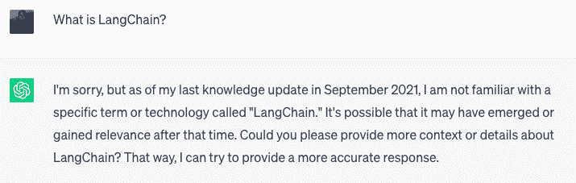
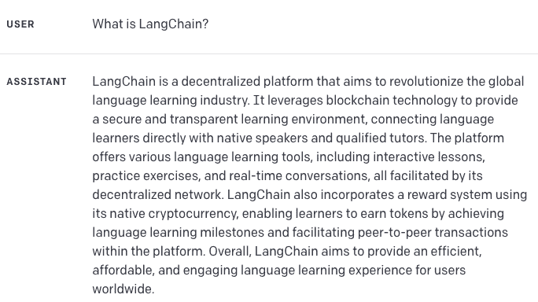
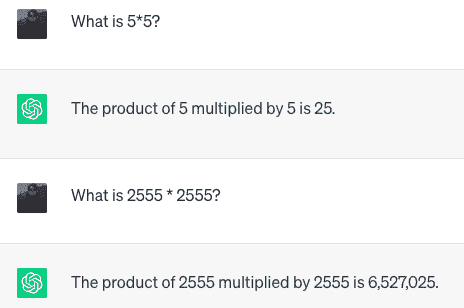
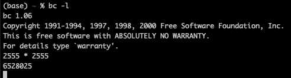
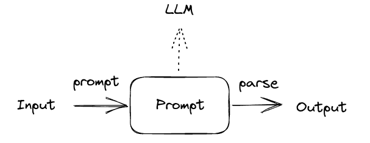
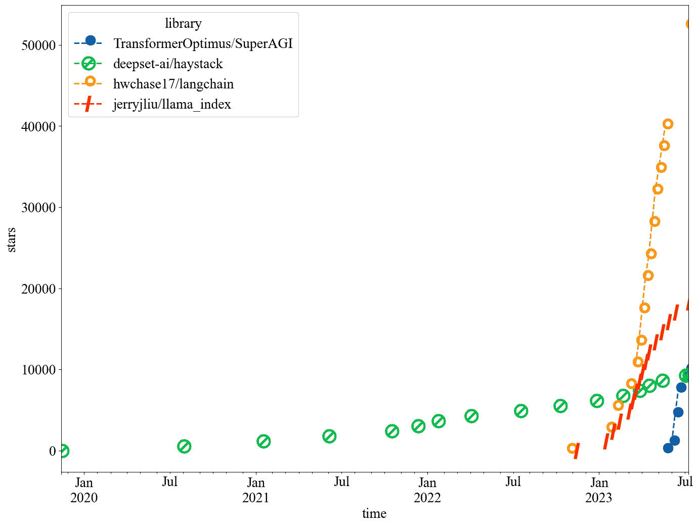
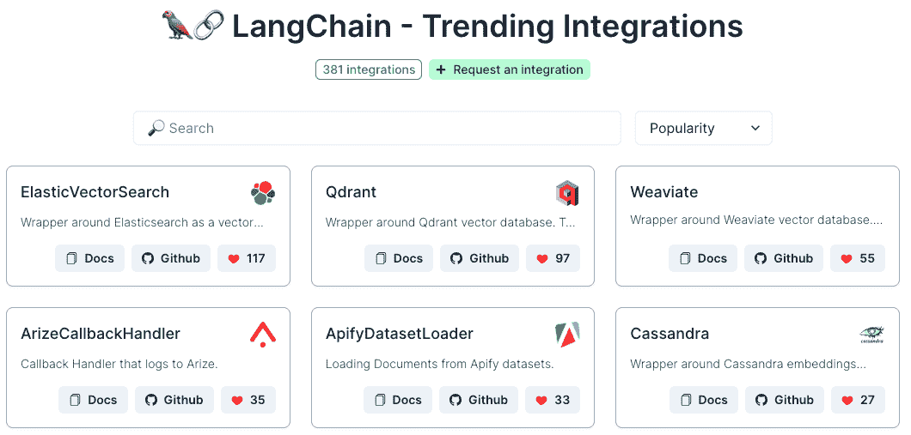
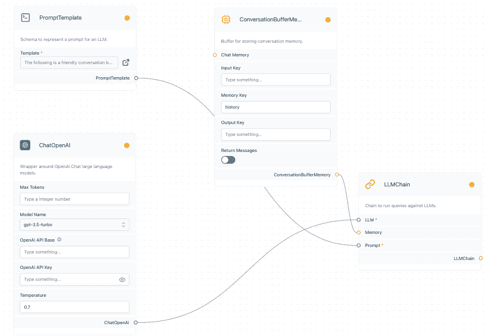
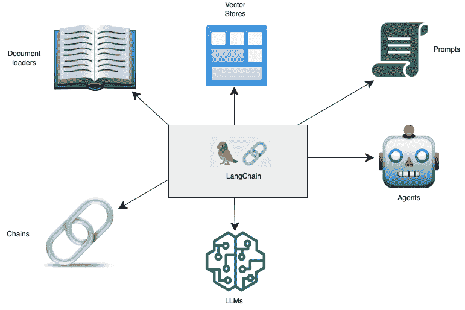
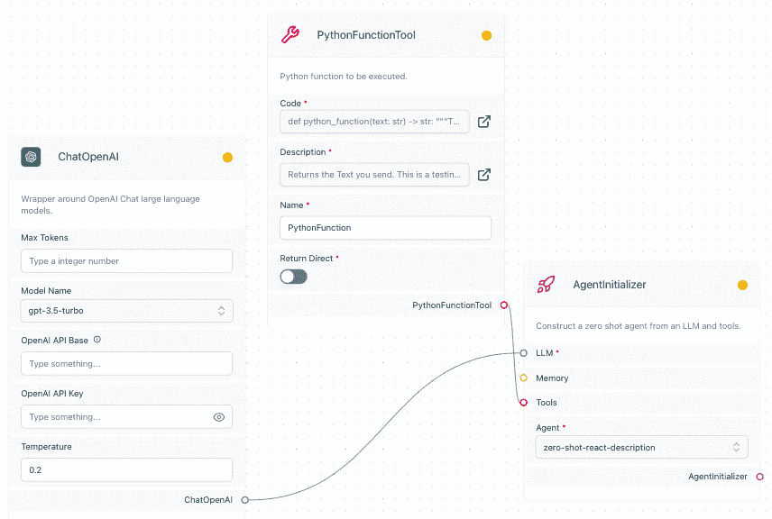

# 第二章：LangChain 简介

## 加入我们在 Discord 上的图书社区

[`packt.link/EarlyAccessCommunity`](https://packt.link/EarlyAccessCommunity)


在本章中，我们讨论了 LLMs 的限制，以及如何将 LLMs 与工具结合起来克服这些挑战，从而构建创新的基于语言的应用程序。有几个强大的框架为开发人员提供了强大的工具，用于快速工程、链式处理、数据检索等。无论您是开发人员、数据科学家，还是对自然语言处理（NLP）或生成式 AI 的技术进展感兴趣，都应该了解这些框架中最强大和流行的 LangChain。LangChain 解决了与使用 LLMs 工作相关的痛点，并提供了一个直观的框架来创建定制的 NLP 解决方案。在 LangChain 中，像 LLMs、网络搜索和数据库查询这样的组件可以链接在一起，这意味着根据数据或任务的需求，按照一定的顺序依次执行不同的任务。通过利用其特性，开发人员可以构建动态的、数据感知的应用程序，利用我们在第一章中讨论的最新技术突破。我们将包括一些用例来说明该框架如何帮助不同领域的企业和组织。LangChain 对代理和内存的支持使得可以构建比仅通过 API 调用语言模型更强大和灵活的各种应用程序。我们将讨论与框架相关的重要概念，如代理、链式处理、行动计划生成和内存。理解这些概念对于理解 LangChain 的工作原理非常重要。主要部分包括：

+   LLMs 的限制是什么？

+   什么是 LLM 应用程序？

+   什么是 LangChain？

+   LangChain 如何工作？

我们将在本章中首先讨论 LLMs 的限制。

## LLMs 的限制是什么？

**大型语言模型**（**LLMs**）因其生成类似人类文本和理解自然语言的能力而受到重视和普及，这使它们在围绕内容生成、文本分类和摘要的场景中非常有用。虽然 **LLMs** 提供了令人印象深刻的功能，但它们也存在一些限制，可能会影响其在某些情景中的有效性。了解这些限制在开发应用程序时至关重要。与大型语言模型相关的一些痛点包括：

1.  **过时知识**：**LLMs** 无法提供实时或最新的数据，因为它们仅依赖于提供给它们的训练数据。

1.  **无法行动**：**LLMs** 不能执行操作或与外部系统交互，限制了它们的功能。例如，它们无法发起网络搜索，实时查询数据库，或使用计算器进行数字乘法。

1.  **缺乏上下文和额外信息**：**LLMs**可能难以理解和整合前面的提示或对话中的上下文。它们可能不记得先前提到的细节或未能提供给定提示之外的相关信息。

1.  **复杂性和学习曲线**：使用大型语言模型开发应用程序通常需要对人工智能概念、复杂算法和 API 有深入的理解。对于可能没有这些领域专业知识的开发人员来说，这可能是一个挑战。

1.  **幻觉**：**LLMs**在它们的权重中含有关于世界的许多常规知识。然而，它们可能对某些主题了解不足，产生不真实或不连贯的响应。例如，它们可能产生不存在的信息或提供不准确的细节。

1.  **偏见和歧视**：根据它们受训数据的不同，LLMs 可能会展现出宗教、意识形态、政治等方面的偏见。

LLMs 没有关于当前事件的信息，因为它们与外部世界没有联系，它们不知道它们没有经过训练的事情，比如截止日期之后的事情。此外，它们在超出训练数据限制的上下文理解方面存在困难。例如，由于这些模型不能执行操作或直接与外部系统交互，它们不会知道天气情况，也无法访问你的文件。在这里，通过 OpenAI ChatGPT 聊天界面询问**LangChain**的 cutoff day 问题得到了正确的反馈：



图 1.1：ChatGPT - 缺乏最新信息。

在这种情况下，模型能够正确地捕捉到问题并给出正确的反馈。然而，如果我们在**GPT-3** playground 中问同样的问题，我们会得到这样的回答：



图 1.2：使用 GPT 3.5 的 OpenAI playground - 幻觉。

在这种情况下，我们可以看到该模型组成术语，并以这个名字发明一个去中心化的平台。这是一种幻觉。需要注意这些问题。访问外部数据，如天气 API、用户喜好或来自网络的相关信息可以解决这个问题，这对于创建个性化和准确的语言驱动应用程序至关重要。**LLMs**擅长生成文本，但缺乏真正的理解和推理能力。然而，它们可能在逻辑推理方面遇到困难。例如，即使是高级**LLMs**在高中数学方面表现不佳，不能执行之前未见过的简单数学运算。我们可以通过简单的演示来说明这一点：



图 1.3：ChatGPT 数学求解。

所以，模型对第一个问题给出了正确的回答，但对第二个问题失败了。以防你想知道真正的结果是什么——如果我们使用计算器，我们得到这个结果：



图 1.4：使用计算器进行乘法（BC）。

LLM 没有存储计算结果或者没有在训练数据中经常遇到，以至于无法可靠地记住它并将其编码到其权重中。因此，它无法正确提出解决方案。在这种情况下，基于变压器的 LLM 不是合适的工具。在部署应用程序之前，**LLMs**的输出可能需要监视和纠正以确保准确性和偏见和不当语言。Chatbot 领域有偏见的例子并不难找到，只需回想一下 Tay Chatbot，因为种族歧视言论和其他仇外言论而使微软陷入公关灾难。出于所有这些问题，**LLMs**需要与外部数据源、记忆和能力集成，以便根据提供的数据动态地与其环境交互并做出适当的响应。然而，连接大型语言模型与不同的数据源和计算可能会很棘手，并且需要开发和仔细测试特定的定制工具。因此，使用生成式 AI 构建数据响应型应用程序可能会很复杂，并且可能需要大量的编码和数据处理。最后，直接使用**LLM**模型可能会具有挑战性和耗时。这从提示工程开始，但更进一步。困难在于导航这些复杂的模型，提供有效的提示，并解析它们的输出。

## 什么是 LLM 应用程序？

为了解决上述挑战和限制，**LLM**可以与其他程序或服务的调用结合使用。主要思想是通过将工具连接在一起，通过使用工具来增强 LLM 的能力。将**LLM**与其他工具结合到使用专门工具的应用程序中，**LLM**驱动的应用程序有潜力改变我们的数字世界。通常，这是通过一个或多个提示调用**LLMs**的链来完成的，但也可以利用其他外部服务（例如 API 或数据源）来完成特定任务。

> **LLM 应用程序**是一种使用大型语言模型（LLMs）如 ChatGPT 来辅助各种任务的应用程序。它通过向语言模型发送提示来生成响应，并且还可以与其他外部服务（如 API 或数据源）集成，以实现特定的目标。

为了说明一个**LLM**应用程序可能是什么样子，这里有一个非常简单的**LLM**应用程序，包括一个提示和一个**LLM**（来源：[`github.com/srush/MiniChain`](https://github.com/srush/MiniChain)）：



图 1.5：一个简单的 LLM 应用，将提示与 LLM 结合起来。

**LLM** 应用对人类具有重要潜力，因为它们增强了我们的能力，简化了流程，并在各个领域提供了宝贵的帮助。以下是一些**LLM**应用重要的原因：

+   **效率和生产力**：**LLM** 应用自动化任务，实现了重复或复杂操作的更快更准确完成。它们可以以超出人类能力的速度和准确度处理数据处理、分析、模式识别和决策。这提高了数据分析、客户服务、内容生成等领域的效率和生产力。

+   **任务简化**：**LLM** 应用通过将复杂任务拆分为可管理的步骤或提供直观界面来简化复杂任务。这些工具可以自动化复杂的工作流程，使其对更广泛的用户群体可用，而无需专业专业知识。

+   **增强决策能力**：**LLM** 应用提供了先进的分析能力，支持基于数据的决策。它们可以快速分析大量信息，发现人类单独可能无法察觉到的趋势或模式，并为战略规划或问题解决提供有价值的见解。

+   **个性化**：AI 驱动的推荐系统根据个人偏好和行为模式个性化用户体验。这些应用程序考虑用户数据，以提供跨多个领域（如电子商务、娱乐和在线平台）的定制建议、推荐和个性化内容。

公司数据的使用，尤其是客户数据，与**LLM**一起的增长特别明显。然而，我们必须小心并考虑隐私和数据保护的影响。我们永远不应将**个人身份可识别**（**PII**）数据输入公共 API 端点。对于这些用例，部署模型到内部基础设施或私有云至关重要，精细调整甚至训练专门的模型提供了重要的改进。这就是我们将在第九章 *LLM 应用在生产环境中* 中讨论的内容。让我们比较一些可以帮助构建**LLM**应用的框架。

### 框架比较

已开发出**LLM** 应用框架，提供了专门的工具，可以有效地利用**LLM**的力量来解决复杂的问题。一些库已经出现，满足了有效地将生成式 AI 模型与其他工具结合起来构建**LLM**应用的要求。有几个开源框架可用于**构建**动态的**LLM**应用。它们在开发尖端的 LLM 应用方面都提供了价值。这张图显示了它们随时间的流行程度（数据来源：github 星历史；[`star-history.com/`](https://star-history.com/)）：



图 1.6：Python 中不同框架的流行度比较。我们可以看到每个项目在 github 上随时间的星星数量。

我们可以在图表中看到，Haystack 是比较的框架中最古老的，始于 2020 年初（根据 github 的提交记录）。从 github 上星星的数量来看，它也是最不受欢迎的。Langchain，**LlamaIndex**（之前称为 GPTIndex），和**SuperAGI**始于 2022 年末或 2023 年初，它们都在很短的时间内迅速走红，其中**LangChain**的增长最为惊人。在本书中，我们会看到为什么它的知名度现在爆炸式增长。**LlamaIndex**注重高级检索，而非**LLM**应用的更广泛方面。同样，Haystack 专注于创建具有专门设计的组件的大型搜索系统，用于可扩展的信息检索，利用检索器、阅读器和其他数据处理程序，通过预训练模型进行语义索引。**LangChain**擅长使用代理将**LLMs**链接在一起，用于委派模型的动作。其用例强调即时优化和上下文感知的信息检索/生成，但使用其 Python 式高度模块化的接口和其庞大的工具集，它是实施复杂业务逻辑的头号工具。**SuperAGI**具有类似于**LangChain**的功能。它甚至配备了一个 Marketplace，一个用于工具和代理的存储库。然而，它不如**LangChain**那样广泛和受支持。我没有包括**AutoGPT**（以及类似的工具如**AutoLlama**），这是一个递归应用，用于解决任务，因为它基于人类和 LLM 的反馈，其推理能力与**LangChain**相比非常有限。因此，它经常陷入逻辑循环，并且经常重复步骤。我也省略了一些集中在提示工程上的库，例如 Promptify。还有其他 LLM 应用程序框架，如 Rust、Javascript、Ruby 和 Java。例如，用 Rust 编写的 Dust 专注于 LLM 应用程序的设计和部署。让我们再看看**LangChain**。

## 什么是 LangChain？

LangChain 是一个用于开发由语言模型驱动的应用程序的框架，使用户能够更有效地使用 LLM 构建应用程序。它提供了一个标准接口，用于将语言模型连接到其他数据源，以及用于构建可以与其环境交互的代理程序。LangChain 被设计为模块化和可扩展的，使得构建适用于各种领域的复杂应用程序变得容易。LangChain 是开源的，用 Python 编写，虽然存在使用 JavaScript 或 - 更准确地说 - TypeScript（LangChain.js）实现的伴生项目，以及为 Ruby 提供代码执行器的初创项目 Langchain.rb。在本书中，我们关注的是框架的 Python 版本。

> **LangChain** 是一个开源框架，允许 AI 开发者将像 ChatGPT 这样的 LLM 与其他计算和信息源结合起来。

2022 年 10 月由哈里森·查斯（Harrison Chase）在 github 上发起的开源项目，使用 MIT 许可证进行许可，这是一种常见的许可证，允许商业使用、修改、分发和私人使用，但限制了责任和保证。LangChain 还是相当新的，但已经拥有数百个集成和工具。在 discord 聊天服务器上有活跃的讨论，有博客，并且定期在旧金山和伦敦举行聚会。甚至有一个聊天机器人，ChatLangChain，可以回答关于使用 LangChain 和 FastAPI 构建的 LangChain 文档的问题，该文档可以通过文档网站在线获取！该项目已经吸引了数百万美元的风险投资，来自 Sequoia Capital 和 Benchmark 等公司，这些公司曾向 Apple、Cisco、Google、WeWork、Dropbox 等许多成功的公司提供过资金支持。LangChain 附带许多扩展和一个正在发展中的更大的生态系统。如前所述，它已经拥有大量的集成，每周都有许多新的集成。这个截图展示了一些集成（来源：`integrations.langchain.com/trending`）：



图 1.7：LangChain 集成。

例如，LangChainHub 是一个存储与**LangChain**相关的工件的仓库，如提示、链和代理，它们组合在一起形成复杂的 LLM 应用程序。受到 HuggingFace Hub 的启发，这是一个模型集合，它旨在成为分享和发现高质量**LangChain**原语和应用程序的中央资源库。当前，该中心仅包含一系列提示，但——希望——随着社区不断添加到此集合，您可能很快就能找到链和代理。此外，**LlamaHub**库通过提供更多的数据加载器和读取器来扩展 LangChain 和 LlamaIndex，例如**Google Docs**、**SQL 数据库**、**PowerPoints**、**Notion**、**Slack**和**Obsidian**。**LangFlow**是一个 UI，它允许通过将侧边栏组件拖放到画布上并将它们连接在一起来创建您的流水线的可执行流程图中连接**LangChain**组件。这是一个快速实验和原型流水线的方法。如下面的基本聊天流水线的屏幕截图所示：



图 1.8：具有基本聊天的 LangFlow UI。

在浏览器界面的侧边栏（此处未显示）中，您可以看到所有不同的**LangChain**组件，如零-shot 提示、数据加载器和语言模型包装器。这些流程可以直接导出并加载到**LangChain**中，或者可以通过 API 调用到本地服务器中调用。**LangChain**和**LangFlow**可以在本地部署，例如使用 Chainlit 库，或在包括 Google Cloud 在内的不同平台上。langchain-serve 库有助于将**LangChain**和**LangFlow**部署到**Jina AI 云**上作为 LLM 应用服务，只需一个命令。**LangChain**提供了一个直观的框架，使开发人员、数据科学家，甚至对 NLP 技术新手来说更容易使用大型语言模型创建应用程序。值得注意的是，**LangChain**既不是模型也不是提供商，而是一个促进与多种模型无缝交互的框架。使用**LangChain**，您不需要成为 AI 或复杂算法方面的专家——它简化了流程并减少了学习曲线。

> 请注意，尽管 LangChain 的主要关注点是 LLMs，这在本书中是我们将要讨论的内容，但也有用于图像生成的集成。

通过具有数据感知性和代理性，**LangChain**可以轻松集成各种数据源，包括**Google Drive**、**Notion**、**Wikipedia**、**Apify Actors**等。这种数据感知性使应用程序能够根据用户喜好或来自外部来源的实时信息生成个性化和情境相关的响应。让我们探讨一下**LangChain**为何重要，然后再看看它的用途。

### 为什么 LangChain 与相关？

**LangChain** 填补了我们在开始时概述的 **LLM** 的限制以及 **LLM** 应用程序的出现的许多需求。简而言之，它简化和优化了使用 **LLM** 开发应用程序的过程。它提供了一种构建比仅通过 API 调用语言模型构建的应用程序更强大和灵活的方式。特别是，**LangChain** 对代理和记忆的支持使开发人员能够构建以更复杂的方式与其环境交互的应用程序，并且可以随时间存储和重复使用信息。**LangChain** 可以用于改进各种领域的应用程序的性能和可靠性。在医疗保健领域，它可以用于构建可以回答患者问题并提供医疗建议的聊天机器人。在这种情况下，我们必须非常小心，关注信息的可靠性和保密性方面的监管和道德约束。在金融领域，该框架可用于构建可以分析金融数据并做出预测的工具。在这里，我们必须考虑这些模型的可解释性。在教育领域，**LangChain** 可用于构建可以帮助学生学习新概念的工具。这可能是最令人兴奋的领域之一，LLMs 可以将完整的教学大纲分解并以定制的交互式会话的形式传递，个性化地适应每个学习者。**LangChain** 的多功能性使其可以以几种动态方式使用，如构建能够回顾以前交互的虚拟个人助理；提取分析结构化数据集；创建提供与提供实时更新的 API 进行交互的问答应用程序；执行代码理解，从 GitHub 提取交互源代码，大大丰富了开发者体验和性能。使用 **LangChain** 有几个好处，包括：

+   **灵活性增强**：它提供了用于构建强大应用程序的各种工具和功能。此外，其模块化设计使其易于构建可以适应各种领域的复杂应用程序。

+   **性能提升**：行动计划生成的支持可以帮助改善应用程序的性能。

+   **可靠性增强**：LangChain 对内存的支持可以通过随时间存储和重复使用信息来改善应用程序的可靠性，并且通过访问外部信息，可以减少幻觉。

+   **开源**：开放的商业友好许可证以及庞大的开发者和用户社区意味着您可以根据自己的需要进行定制，并依赖广泛的支持。

总之：有很多理由使用 **LangChain**。然而，我应该提醒，由于 **LangChain** 还是相当新的，可能还存在一些尚未解决的错误或问题。文档已经相对全面而庞大，但在某些地方还在建设中。

### 我可以用 LangChain 构建什么？

**LangChain** 赋予了各种 NLP 用例的能力，例如虚拟助手、用于摘要或翻译的内容生成模型、问答系统等。它已经被用来解决各种真实世界的问题。例如，**LangChain** 被用来构建聊天机器人、问答系统和数据分析工具。它还被用于许多不同的领域，包括医疗保健、金融和教育。你可以使用 **LangChain** 构建各种各样的应用程序，包括：

+   **聊天机器人**：它可以用来构建可以以自然方式与用户交互的聊天机器人。

+   **问答**：**LangChain** 可以用于构建能够回答各种主题问题的问答系统。

+   **数据分析**：你可以将其用于自动化数据分析和可视化以提取见解。

+   **代码生成**：你可以设置软件对编程助手，帮助解决业务问题。

+   还有更多！

## LangChain 是如何工作的？

利用 **LangChain**，你可以构建利用最近在 **自然语言处理**（**NLP**）领域的突破性成果的动态应用程序。通过连接来自多个模块的组件（串联），你可以创建围绕大型语言模型量身定制的独特应用程序。从情感分析到聊天机器人，可能性是巨大的。LangChain 框架的主要价值主张包括以下几个部分：

+   **组件**：

    +   **模型 I/O**：该组件提供了 LLM 包装器，作为连接到语言模型的标准化接口。

    +   **提示模板**：这允许你管理和优化提示。

    +   **内存**：索引被用于在链/代理的调用之间存储和重用信息。

+   **代理**：代理允许 LLM（Large Language Models）与其环境交互。他们决定要采取的行动并采取行动。

+   **链**：这些组件将组件组合在一起以解决任务。它们可以由对语言模型和其他实用程序的调用序列组成。

这里是这些部分的可视化表示：



图 1.9：LangChain 组件。

这些部分有很多需要探讨的地方。让我们稍微详细地讨论一下！虽然**LangChain**本身不提供模型，但它通过**LLM**包装器支持与各种不同的语言模型提供者的集成，使应用程序能够与聊天模型以及文本嵌入模型提供者进行交互。支持的提供者包括**OpenAI**、HuggingFace、Azure 和 Anthropic。提供标准化接口意味着能够轻松地更换模型，以节省费用和能源或获得更好的性能。**LangChain**的核心构建模块是提示类，它允许用户通过提供简洁的说明或示例与**LLMs**进行交互。提示工程有助于优化提示以获得最佳的模型性能。模板在输入和可用的提示集合方面提供了灵活性，在各种应用中经过了实战测试。当处理大型文档时，向量存储器发挥作用，其中文档需要被切块以便传递给**LLM**。文档的这些部分将存储为嵌入，这意味着它们是信息的向量表示。所有这些工具增强了**LLMs**的知识，并提高了它们在问答和摘要等应用中的性能。有许多用于向量存储的集成。这些包括阿里巴巴云 OpenSearch、AnalyticDB for PostgreSQL、Meta AI 的**近似最近邻**（**ANN**）**搜索**的 Annoy 库、**Cassandra**、**Chroma**、**ElasticSearch**、**Facebook** **AI 相似度搜索**（**Faiss**）、**MongoDB** **Atlas** **向量** **搜索**、作为**Postgres**的向量相似度搜索的**PGVector**、**Pinecone**、**Scikit-Learn**（`SKLearnVectorStore`用于 k 最近邻搜索）等等。还有一些其他模块：

+   **数据连接器和加载器**：这些组件提供了连接到外部数据源的接口。

+   **回调**：回调用于记录和流式传输任何链的中间步骤。

数据连接器包括用于存储数据和与外部系统交互的实用程序模块，例如网络搜索或数据库，最重要的是数据检索。示例包括 Microsoft Doc（docx）、超文本标记语言（HTML）以及其他常见格式，如 PDF、文本文件、JSON 和 CSV。其他工具将向潜在客户发送电子邮件，向您的关注者发送有趣的双关语，或向您的同事发送 Slack 消息。让我们稍微详细地看一下，代理人可以为什么事情做得好以及它们如何做出决策。

### 什么是代理人？

代理人在**LangChain**中用于控制应用程序的执行流程，以与用户、环境和其他代理人进行交互。代理人可用于决定采取哪些行动，与外部数据源进行交互，并随时间存储和重用信息。代理人可以转移资金、预订航班或与您的客户交谈。

> **代理**是可以在世界中执行动作和任务并与其环境交互的软件实体。在**LangChain**中，代理获取工具和链并为任务组合它们，并决定使用哪一个。

代理可以与外部世界建立连接。例如，可以利用搜索引擎或向量数据库找到最新和相关的信息。然后可以将此信息提供给模型。这被称为**检索增强**。通过整合外部信息源，**LLMs**可以从当前信息和扩展知识中汲取。这是代理如何克服**LLMs**固有的弱点并通过将工具与模型结合来增强它们的示例。在有关**LLMs**局限性的部分中，我们已经知道，对于计算而言，简单的计算器胜过了数十亿参数的模型。在这种情况下，代理可以决定将计算传递给计算器或 Python 解释器。我们可以在这里看到一个简单的应用程序，将 OpenAI 语言模型输出连接到 Python 函数：

 图 1.10：在 LangFlow 中将 Python 函数可视化的简单 LLM 应用程序。

我们将在*第三章*的实践中看到这一点，*开始使用 LangChain*。**LangChain**中的代理可用于执行各种任务，例如：

+   搜索信息

+   调用 API

+   访问数据库

+   代码执行

每个代理都可以决定何时使用哪种工具。由于这对于理解**LangChain**如何工作至关重要，让我们稍微详细地看一下。

#### 行动执行

每个代理都配备了这些子组件：

+   工具，即功能组件，

+   工具包（这些是工具的集合），和

+   代理执行者

**Agent Executor** 是一种执行机制，允许在工具之间进行选择。它可以被视为代理和执行环境之间的中介。它接收代理的请求或命令，并将它们转换为可以由底层系统或软件执行的操作。它管理这些操作的执行，并向代理提供反馈或结果。正如我们将看到的，它有不同类型的执行或决策模式。**ReAct 模式**（由普林斯顿大学和 Google DeepMind 的研究人员于 2023 年 5 月发表的“**ReACT**：在语言模型中协同推理和行动 ”）意为推理和行动，代理主动将任务分配给适当的工具，为它定制输入，并解析它的输出以解决任务。在这篇论文中，文档存储被用作答案搜索的地方 - 这是作为 **ReAct 文档存储模式** 实现的。在 LangChain 中，默认情况下，代理遵循 **零-shot ReAct 模式** （`ZERO_SHOT_REACT_DESCRIPTION`），其中决策仅基于工具的描述。可以通过内存扩展这个机制，以考虑整个对话历史。通过 **ReAct**，而不是要求 LLM 自动完成文本，您可以提示它进行思考/行动/观察循环来进行回应。 LLM 的提示是逐步响应并将这些步骤与动作相关联。从这些步骤中得到的结果（例如搜索结果）将被传递回 LLM 以进行下一次审议，因为它朝着目标迭代。对于 ZeroShot 模式，提示非常重要，其由前缀、描述工具及其优点的字符串、格式说明和后缀组成：

```py
PREFIX = """Answer the following questions as best you can. You have access to the following tools:"""
FORMAT_INSTRUCTIONS = """Use the following format:
Question: the input question you must answer
Thought: you should always think about what to do
Action: the action to take, should be one of [{tool_names}]
Action Input: the input to the action
Observation: the result of the action
... (this Thought/Action/Action Input/Observation can repeat N times)
Thought: I now know the final answer
Final Answer: the final answer to the original input question"""
SUFFIX = """Begin!
Question: {input}
Thought:{agent_scratchpad}"""
```

为了将其实践，例如，我们可以询问 **LangChain** agent executor 和 **LangChain** execution plan 之间的差异。以下是在 **LangChain** 中的日志 - 首先将问题发送到语言模型：

```py
I'm not familiar with these terms, so I should search for information about them.
Action: Search
Action Input: "difference between langchain agent executor and langchain execution plan"
Observation: The Concept of Agents in LangChain Action Agents decide an action to take and execute that action one step at a time. They are more conventional and suitable for small tasks. On the other hand, Plan-and-Execute Agents first decide a plan of actions to take, and then execute those actions one at a time.
Thought:Based on the observation, a langchain agent executor is an agent that decides and executes actions one step at a time, while a langchain execution plan is an agent that first decides a plan of actions and then executes them one at a time.
Final Answer: A langchain agent executor executes actions one step at a time, while a langchain execution plan first decides a plan of actions and then executes them.
```

还有一些已实施的机制。在 2022 年 10 月，华盛顿大学、MosaicAI、Meta AI Research 和 Allen Institute（在论文“测量和缩小语言模型中组合性差距”中）发现，**LLMs** 在需要组合推理的问题上常常无法给出正确和完整的答案，需要将多个信息组合在一起才能回答问题。**self-ask with search** 模式将一个问题分解成组件，并调用搜索引擎方法来检索必要的信息以回答问题。LangChain 的用户 nkov 在其 GitHub 上讨论了此强大机制的示例。问题是，穆罕默德·阿里和艾伦·图灵谁活得更久？对话发展如下：

```py
Question: Who lived longer, Muhammad Ali or Alan Turing?
Are follow up questions needed here: Yes.
Follow up: How old was Muhammad Ali when he died?
Intermediate answer: Muhammad Ali was 74 years old when he died.
Follow up: How old was Alan Turing when he died?
Intermediate answer: Alan Turing was 41 years old when he died.
```

```py
So the final answer is: Muhammad Ali
```

在每一步中，**LLM**决定是否需要跟进搜索，并将该信息反馈给**LLM**。最近，OpenAI 模型（gpt-3.5-turbo-0613，gpt-4-0613）已被微调以检测何时应执行**函数调用**以及应将哪个输入馈入这些函数。为了使之生效，函数也可以在这些语言模型的 API 调用中描述。这也在**LangChain**中实现。有一些策略尚未作为**LangChain**的执行机制实现，包括：

+   **递归批判和改进**输出（《语言模型能够解决计算机任务》; Kim 等人，2023 年 6 月）使用**LLM**作为规划者构建代理，前者在执行动作之前使用**LLM**生成思路，而后者促使**LLM**思考学到的经验以改进后续的事件。

+   **思考树**（**ToT**）算法（普林斯顿大学和谷歌 DeepMind 研究人员于 2023 年 5 月发表的 "Tree of Thoughts: Deliberate Problem Solving with Large Language Models"）通过遍历搜索树推进模型推理。基本策略可以是深度优先或广度优先树遍历，但也可以测试和使用许多其他策略，如最佳优先，蒙特卡罗和 A*。这些策略被发现可以显着提高问题解决的成功率。

这些决策可以提前计划或在每个步骤中进行。创建代理可以采取的一系列动作序列来实现目标的过程称为**动作计划生成**。在动作计划生成中有两种不同类型的代理，可以基于任务所需的动态性来选择：

+   **动作代理**在每次迭代中根据所有前一个动作的输出决定下一个动作。

+   **计划和执行代理**在开始时决定所有操作步骤的完整计划。然后它们执行所有这些操作步骤，而不更新序列。该实现在**LangChain**中是受**BabyAGI**启发而来的。

通常，动作代理更灵活，而计划和执行代理更擅长维护长期目标。如果我们希望尽可能灵活，我们可以为我们的代理指定一个零-shot **ReAct**机制，在每个回合做出决策。现在让我们来看看链吧！

### 什么是链？

**LangChain**的核心思想是**LLM**和其他组件的组合可共同工作。例如，用户和开发人员可以将多个**LLM**调用和其他组件组合在序列中，以创建复杂的应用程序，例如聊天重复社交互动，数据提取和数据分析。

> 在最通用的术语中，**链**被认为是一系列对组件的调用，其中可以包括其他链。

例如，提示链是一种可以用来改善 LangChain 应用程序性能的技术。 提示链涉及将多个提示链接在一起以自动完成更复杂的响应。简而言之，链和代理都是组件的包装器。 二者都可以通过使它们与外部系统交互并收集最新信息来扩展 LLMs 的功能。 通过将应用程序模块化为链和代理等构建块，可以更容易地调试和维护它们。 链的最常见示例可能是`PromptTemplate`，它将格式化的响应传递给语言模型。 链的更有趣的例子包括用于与数学查询相关的`LLMMath` 和用于查询数据库的`SQLDatabaseChain`。 这些被称为**实用链**，因为它们将语言模型与特定工具结合在一起。 一些链可以做出自主决定。 与代理类似，路由器链可以根据其描述决定使用哪个工具。 `RouterChain` 可以动态选择要使用的检索系统，例如提示或索引。 **LangChain** 实现链以确保输出内容不会有毒或违反 OpenAI 的调节规则（`OpenAIModerationChain`），或符合道德、法律或自定义原则（`ConstitutionalChain`）。 LLMCheckerChain 可以通过验证提供的语句和问题背后的假设来防止错觉，并减少错误响应。 在 2023 年 5 月的《SELF-REFINE: Iterative Refinement with Self-Feedback》一文中，卡耐基梅隆大学、艾伦研究所、华盛顿大学、NVIDIA、加州大学圣地亚哥分校和谷歌研究的研究人员发现，该策略可以将任务性能平均提高约 20%。 让我们来看看记忆策略！

### 什么是记忆？

**LLMs** 和工具在某种意义上是无状态的，它们不会保留任何关于先前响应和对话的信息。 记忆是 LangChain 中的一个关键概念，可以通过存储先前调用语言模型、用户、代理操作环境的状态以及代理的目标的结果来提高 LangChain 应用程序的性能。 这可以帮助减少语言模型需要调用的次数，并确保即使环境发生变化，代理也能继续运行。

> **记忆** 是一种用于随时间存储和重复使用信息的数据结构。

记忆有助于为应用程序提供上下文，并可以使 LLM 输出更连贯和相关。例如，我们可以存储所有对话（`ConversationBufferMemory`）或使用缓冲区保留对话中的最后一条消息，使用 `ConversationBufferWindowMemory`。记录的消息将在每次调用中包含在模型的历史参数中。但是我们应该注意，这将增加令牌使用量（因此会增加 API 费用）和响应的延迟。这也可能会影响模型的令牌限制。还有一种对话摘要记忆策略，其中 LLM 用于总结对话历史 - 这可能会导致额外的 API 调用费用。关于这些记忆选项有一些令人兴奋的细节。例如，一个有趣的特性是，与 LLM 的对话可以被编码为知识图（`ConversationKGMemory`），这可以集成回提示或用于预测回应而不必去 LLM。

> **知识图**是使用图结构数据模型表示数据的表示形式，通常用三元组的形式，主语、谓语和宾语，例如主语=Sam，谓语=loves，宾语=apples。这个图存储有关实体（如人、地点或事件）及其之间的连接的信息。

总之，在**LangChain**中，记忆可以用来存储各种信息，包括：

+   先前对语言模型的调用结果

+   代理正在操作的环境状态

+   代理正在尝试实现的目标。

现在，我们将看一下我们可以使用的不同工具。

### 有哪些工具？

工具是**LangChain**中可以与模型结合以扩展其能力的组件。**LangChain**提供类似文档加载器、索引和向量存储的工具，这些工具可以促进**LLMs**的数据检索和存储。有许多可用的工具，以下只是一些工具的示例：

+   **机器翻译器**：语言模型可以使用机器翻译器更好地理解和处理多种语言的文本。这个工具使非翻译专用的语言模型能够理解和回答不同语言的问题。

+   **计算器**：语言模型可以利用简单的计算器工具来解决数学问题。计算器支持基本的算术运算，使模型能够准确地解决针对数学问题解决而设计的数据集中的数学查询。

+   **地图**：通过与必应地图 API 或类似服务连接，语言模型可以检索位置信息，辅助路线规划，提供驾驶距离计算，并提供附近景点的详细信息。

+   **天气**：天气 API 为语言模型提供全球各地城市的实时天气信息。模型可以回答关于当前天气状况或特定地点在不同时间范围内的天气预报的查询。

+   **股票**：连接股票市场 API（如 Alpha Vantage）使语言模型能够查询特定股票市场信息，如开盘价、收盘价、最高价、最低价等。

+   **幻灯片**：配备幻灯片制作工具的语言模型可以利用诸如 python-pptx 库提供的高级语义或根据给定主题从互联网检索图像来创建幻灯片。这些工具有助于完成各个专业领域中所需的幻灯片制作任务。

+   **表格处理**：使用 pandas DataFrame 构建的 API 使语言模型能够在表格上执行数据分析和可视化任务。通过连接这些工具，模型可以为用户提供更简洁自然的处理表格数据的体验。

+   **知识图谱**：语言模型可以使用模拟人类查询过程的 API 查询知识图谱，例如查找候选实体或关系，发送 SPARQL 查询，以及检索结果。这些工具有助于基于知识图谱中存储的事实知识回答问题。

+   **搜索引擎**：通过利用类似必应搜索的搜索引擎 API，语言模型可以与搜索引擎交互，提取信息并回答实时查询。这些工具增强了模型从网络上收集信息并提供准确响应的能力。

+   **维基百科**：配备维基百科搜索工具的语言模型可以在维基百科页面上搜索特定实体，查找页面内的关键词，或对具有相似名称的实体进行消歧义。这些工具能够使用从维基百科检索的内容进行问答任务。

+   **在线购物**：将语言模型与在线购物工具连接，使其能够执行诸如搜索商品、加载产品详细信息、选择商品特性、浏览购物页面，并根据特定用户指示做出购买决策的操作。

其他工具包括 AI 绘画，允许语言模型使用 AI 图像生成模型生成图像；3D 模型构建，使用复杂的 3D 渲染引擎使语言模型创建三维（3D）模型；化学性质，通过像 PubChem 这样的 API 协助解决关于化学性质的科学研究；数据库工具，通过自然语言访问数据库数据以执行 SQL 查询和检索结果。这些各种各样的工具为语言模型提供了额外的功能和能力，使其能够执行超越文本处理的任务。通过通过 API 连接这些工具，语言模型可以增强其在诸如翻译、数学问题解决、基于位置的查询、天气预测、股市分析、幻灯片制作、表格处理和分析、图像生成、文本转语音转换等诸多专业任务领域的能力。所有这些工具都可以为我们提供先进的人工智能功能，而且几乎没有限制。我们可以轻松构建定制工具来扩展 LLMs 的能力，正如我们将在下一章节 3 中看到的那样。使用不同的工具扩展了语言模型的应用范围，并使其能够更有效地处理各种各样的现实任务。让我们总结一下！

## 总结

如今，在智能应用的发展以及创造个性化和有效用户体验方面，准确理解和处理语言至关重要。因此，**大型语言模型**（**LLMs**）非常适合赋予应用这种能力。然而，正如我们在本章中讨论的，独立的**LLMs**有其局限性。如果我们为**LLMs**提供工具，我们就能克服其中一些限制，并极大增强它们的性能，创造**LLM**应用程序。这就是 LangChain 的作用所在，它是一个旨在为人工智能开发人员建立代理应用的框架-这些代理由计算实体组成，例如 LLMs 和其他可以自主执行某些任务的工具。我们已经讨论了它的重要概念，首先是代理和链条的概念。总之，LangChain 是一个有价值的开源框架，可简化使用提供者和平台（如 OpenAI 和 Hugging Face 等）的**大型语言模型**（**LLMs**）开发应用程序。这个框架在释放生成式人工智能的力量方面提供了巨大价值。在接下来的章节中，我们将通过构建**LLM**应用程序来进一步完善**LangChain**的核心原则。通过利用**LangChain**的能力，开发人员可以充分发挥**LLMs**的潜力。在*第三章*，*LangChain 入门*中，我们将使用**LangChain**实现我们的第一个应用程序！让我们看看你是否记得本章的一些关键要点！

## 问题

请查看一下，看看你是否能找到这些问题的答案。如果你对任何问题不确定，我建议你回到本章的相应部分查看一下：

1.  LLMs 的局限性是什么？

1.  LLM 应用有哪些？

1.  LangChain 是什么，为什么应该使用它？

1.  LangChain 的关键特点是什么？

1.  什么是 LangChain 中的代理？

1.  什么是行动计划生成？

1.  什么是链？

1.  LangChain 应用程序为什么需要记忆？

1.  有哪些可用工具？

1.  LangChain 是如何工作的？
