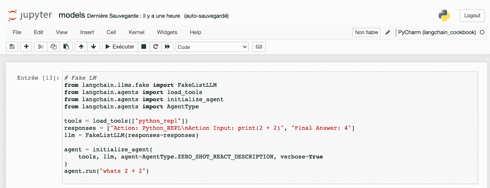
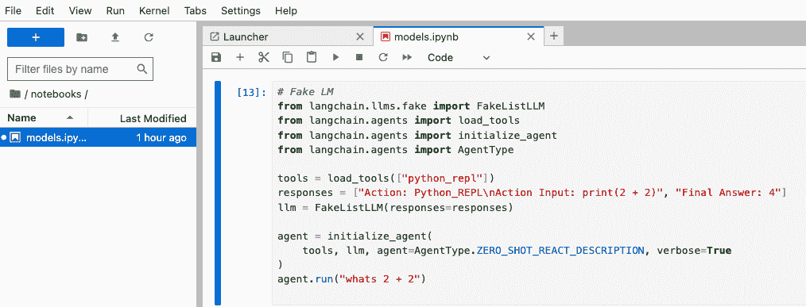
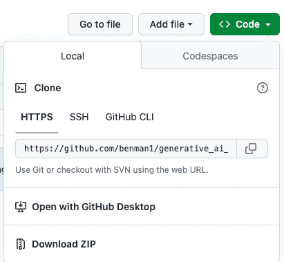
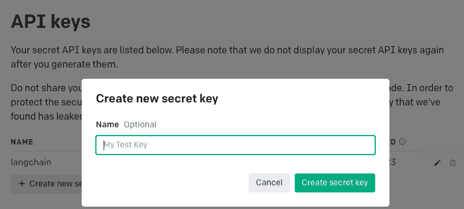
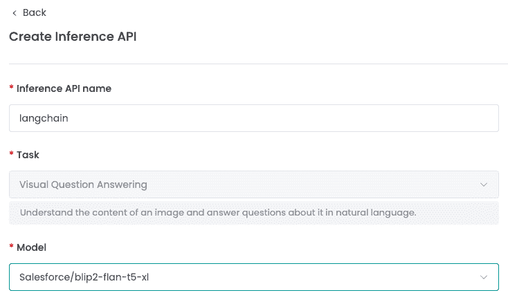

# 第三章：使用 LangChain 入门

## 加入我们的书籍社区 Discord

[`packt.link/EarlyAccessCommunity`](https://packt.link/EarlyAccessCommunity)


在本章中，我们将首先设置**LangChain**和本书所需的库，提供对通用依赖管理工具的说明，例如**Docker**，**Conda**，**Pip**和**Poetry**。然后，我们将逐个介绍、设置和使用我们可以使用的模型集成，例如**OpenAI**的**Chatgpt**，Huggingface 上的模型和 Jina AI，等等。我们将获取 API 密钥令牌，然后进行一个简短的实际示例。这将为我们提供更多关于有效使用**LangChain**的上下文，并介绍使用它的技巧和窍门。作为最后部分，我们将开发一个**LangChain**应用程序，这是一个实际示例，它说明了**LangChain**如何在客户服务的实际业务用例中应用。主要章节包括：

+   如何设置**LangChain**？

+   模型集成

+   客户服务助手

我们将从在您的计算机上设置**LangChain**开始本章。

## 如何设置 LangChain？

在这本书中，我们谈论的是 LangChain。我们可以通过在终端中简单地输入`pip install langchain`来安装 LangChain，但是在这本书中，我们也将在几种不同的用例中使用各种其他工具和集成。为了确保所有的示例和代码片段都能按预期工作，并且不只是在我的机器上能够工作，而是对于任何安装这个的人都能够工作，我提供了设置环境的不同方法。设置 Python 环境有各种不同的方法。在这里，我们描述了四种安装相关依赖的流行方法：Docker，Conda，Pip 和 Poetry。如果您在安装过程中遇到问题，请查阅各自的文档或在本书的 Github 仓库上提出问题。在发布本书时，已经测试了不同的安装方法，然而，事情是会变的，我们将更新 Github 上的 readme，包括可能出现问题的解决方法。请在本书的仓库[`github.com/benman1/generative_ai_with_langchain`](https://github.com/benman1/generative_ai_with_langchain)中找到`Dockerfile`用于 docker，`requirements.txt`用于 pip，`pyproject.toml`用于 poetry，以及`langchain_ai.yml`文件用于**Conda**。让我们从 Python 开始设置我们的环境。

### Python 安装

在设置 Python 环境和安装相关依赖之前，您通常应该安装 Python 本身。我假设购买本书的大多数人都已经安装了 Python，但是以防万一，让我们来看看。您可以从 python.org 下载适合您操作系统的最新版本，或者使用您平台的包管理器。让我们来看看 MacOS 上，使用 Homebrew 可以这样做：

```py
brew install python
```

对于 Ubuntu，我们可以使用 apt-get：

```py
sudo apt-get updatesudo apt-get install python3.10
```

> **提示**：如果您是编程或 Python 新手，请在继续使用 LangChain 和本书中的应用程序之前，建议您先阅读一些初学者级别的教程。

用于交互式尝试数据处理和模型的重要工具是 Jupyter 笔记本和 lab。让我们现在来看一下这个。

### Jupyter Notebook 和 JupyterLab

Jupyter Notebook 和 JupyterLab 是用于创建、共享和协作计算文档的开源基于 Web 的交互式环境。它们使用户能够在单个文档中编写代码、显示可视化效果并包含解释性文本。两者之间的主要区别在于它们的界面和功能。

> **Jupyter Notebook** 的目标是支持 Julia、Python 和 R 等各种编程语言 - 实际上，项目名称是对这三种语言的参考。Jupyter Notebook 提供了一个简单的用户界面，允许用户以线性布局创建、编辑和运行笔记本。它还支持用于额外功能和定制的扩展。
> 
> > 另一方面，**JupyterLab** 是 Jupyter Notebook 的增强版本。JupyterLab 于 2018 年推出，提供了一个更强大、更灵活的环境，用于处理笔记本和其他文件类型。它提供了一个模块化、可扩展和可定制的界面，用户可以在其中并排排列多个窗口（例如笔记本、文本编辑器、终端），从而促进更高效的工作流程。

您可以像这样从终端在您的计算机上启动一个笔记本服务器：

```py
jupyter notebook
```

您应该看到您的浏览器打开一个新选项卡，并显示 Jupyter 笔记本，类似于这样：



图 3.1：带有 LangChain 代理的 Jupyter Notebook。

或者，我们也可以使用 JupyterLab，这是下一代笔记本服务器，它在可用性方面带来了显著的改进。您可以像这样从终端启动 JupyterLab 笔记本服务器：

```py
jupyter lab
```

我们应该看到类似于这样的东西：



图 3.2：带有 LangChain 代理的 Jupyter Lab。

这两个之一，`Jupyter notebook` 或 `JupyterLab`，都将为您提供一个集成开发环境（**IDE**），用于处理本书中将介绍的一些代码。在安装 Python 和笔记本或 lab 之后，让我们快速探索依赖管理工具（**Docker**、**Conda**、**Pip** 和 **Poetry**）之间的差异，并使用它们完全设置我们的环境，用于 LangChain 项目！

### 环境管理

在我们探索各种设置 Python 环境以与 **LangChain** 中的生成模型一起工作的方法之前，了解主要依赖管理工具之间的差异是至关重要的：**Docker**、**Conda**、**Pip** 和 **Poetry**。这四个工具在软件开发和部署领域被广泛使用。

> **Docker**是一个开源平台，通过容器化提供操作系统级别的虚拟化。它自动化了轻量级、便携式容器内应用程序的部署，在任何安装了 Docker 的系统上都可以一致地运行。
> 
> > **Conda**是一个跨平台的包管理器，擅长于从多个通道安装和管理软件包，不局限于 Python。它主要面向数据科学和机器学习项目，并且可以强大地处理复杂依赖树，适用于具有大量依赖项的复杂项目。
> > 
> > **Pip** 是 Python 中最常用的包管理器，可以轻松安装和管理第三方库。但是，在处理复杂依赖关系时，Pip 存在一定的限制，增加了依赖冲突在包安装过程中出现的风险。
> > 
> > **Poetry**是一个结合了 Pip 和 Conda 两种最佳特点的新型包管理器。Poetry 具有现代化和直观的界面、强大的依赖关系解决系统以及虚拟环境创建的支持，同时提供了额外的功能，如依赖隔离、锁定文件和版本控制。

Poetry 和 Conda 都简化了虚拟环境管理，而使用 Pip 通常需要利用类似于 virtualenv 的单独工具。在这里推荐使用 Conda 进行安装。我们还提供了一个 pip 的 requirements 文件和使用 poetry 的说明，但在一些情况下可能需要进行一些调整。我们将依次介绍使用这些不同工具的安装过程。对于所有说明，请确保您已经下载了本书的存储库（使用 Github 用户界面）或在计算机上克隆了存储库，并且已切换到项目的根目录。下面是如何在 Github 上找到下载选项：



图 3.3：Github 用户界面（UI）中的下载选项。

如果您是 git 的新手，可以按“Download ZIP”下载并使用您最喜欢的工具解压缩存档。或者，使用 git 克隆该存储库并进入项目目录，可以输入以下命令：

```py
git clone https://github.com/benman1/generative_ai_with_langchain.git
cd generative_ai_with_langchain
```

现在我们在计算机上拥有了该存储库，让我们从 Docker 开始！

#### Docker

Docker 是一个平台，使开发人员能够自动化应用程序的部署、打包和管理。Docker 使用容器化技术，帮助标准化和隔离环境。使用容器的好处是可以保护你的本地环境免受容器内运行的任何可能不安全的代码的影响。缺点是镜像可能需要时间来构建，并且可能需要大约 10 GB 的存储容量。与其他环境管理工具类似，Docker 很有用，因为你可以为项目创建可重复的环境。你可以使用 Docker 创建包含你项目所需的所有库和工具的环境，并与其他人共享该环境。要开始使用 Docker，请按照以下步骤操作：

1.  在你的机器上安装 Docker。你可以在网页浏览器中访问 Docker 网站，并按照这里的安装说明进行安装：[`docs.docker.com/get-docker/`](https://docs.docker.com/get-docker/)

1.  在终端中运行以下命令来构建 Docker 镜像（请注意：你需要在项目根目录下才能正常工作）。

```py
docker build -t langchain_ai
```

这将从 Docker Hub 拉取 continuumio/miniconda3 镜像，并构建镜像。

1.  以交互方式启动创建的 Docker 容器：

```py
docker run -it langchain_ai
```

这将在容器内启动我们的笔记本。我们应该能够从浏览器导航到`Jupyter Notebook`。我们可以在这个地址找到它：`http://localhost:8080/`接下来让我们看一下 conda。

#### Conda

`Conda` 允许用户为不同的项目管理多个环境。它与 Python、R 和其他语言一起工作，并通过维护与 Python 库关联的库列表来帮助安装系统库。开始使用 conda 的最佳方法是按照此链接的说明安装 anaconda 或 miniconda：[`docs.continuum.io/anaconda/install/`](https://docs.continuum.io/anaconda/install/)尽管从 anaconda 开始，`conda` 环境占用的磁盘空间比 Docker 少，但完整环境仍然需要大约 2.5 GB。miniconda 设置可能会节省一些磁盘空间。还有一个图形界面工具 `conda`，Anaconda Navigator，可以安装在 macOS 和 Windows 上，可以从终端安装任何依赖项以及 `conda` 工具。让我们继续使用 `conda` 工具并安装本书的依赖项。要创建一个新环境，请执行以下命令：

```py
conda env create --file langchain_ai.yml
```

`Conda` 让我们可以创建具有许多不同库的环境，还可以使用不同版本的 Python。我们在本书中始终使用 Python 3.10。通过运行以下命令激活环境：

```py
conda activate langchain_ai
```

就是这样，我们完成了。我们可以看到这应该是简单和直接的。你现在可以在环境中启动一个 `jupyter notebook` 或 `jupyter lab`，例如：

```py
jupyter notebook
```

让我们来看一下 pip，作为`conda`的一个替代方案。

#### Pip

`Pip`是 Python 的默认包管理器。它允许你轻松安装和管理第三方库。我们可以安装单个库，也可以维护完整的 Python 库列表。如果它尚未包含在你的 Python 发行版中，请按照[`pip.pypa.io/`](https://pip.pypa.io/)上的说明安装 pip。要使用 pip 安装库，可以使用以下命令。例如，要安装 NumPy 库，可以使用以下命令：

```py
pip install numpy
```

你也可以使用`pip`安装库的特定版本。例如，要安装 NumPy 库的 1.0 版本，你可以使用以下命令：

```py
pip install numpy==1.0
```

为了设置一个完整的环境，我们可以从一个要求列表开始——按照惯例，该列表在一个名为`requirements.txt`的文件中。我已经在项目的根目录中包含了这个文件，列出了所有必要的库。你可以使用以下命令安装所有这些库：

```py
pip install -r requirements.txt
```

请注意，正如前面提到的，Pip 并不处理环境问题。Virtualenv 是一个可以帮助维护环境的工具，比如不同版本的库。我们来快速看一下这个：

```py
# create a new environment myenv:
virtualenv myenv
# activate the myenv environment:
source myenv/bin/activate
# install dependencies or run python, for example:
python
# leave the environment again:
deactivate
Please note that in Windows, the activation command is slightly different – you'd run a shell script:
# activate the myenv environment:
myenv\Scripts\activate.bat
```

接下来我们来看 Poetry。

#### Poetry

Poetry 是 Python 的一个依赖管理工具，可以简化库的安装和版本控制。安装和使用都很简单，我们来看一下。下面是快速的 Poetry 概述：

1.  按照[`python-poetry.org/`](https://python-poetry.org/)上的说明安装 poetry。

1.  在终端中运行`poetry install`（来自项目根目录，如前所述）

该命令将自动创建一个新的环境（如果你尚未创建），并安装所有依赖项。这完成了 Poetry 的设置。现在我们来看模型提供者。

## 模型整合

在正式开始生成式人工智能之前，我们需要设置访问诸如**大型语言模型**（**LLMs**）或文本到图像模型等模型的权限，以便将它们集成到我们的应用程序中。正如*第一章*，*生成模型是什么*中所讨论的那样，有各种各样的**LLMs**由科技巨头提供，比如**OpenAI**的**GPT-4**，**Google**的**BERT**和**PaLM-2**，**Meta AI**的**LLaMA**等等。借助**LangChain**的帮助，我们可以与所有这些模型进行交互，例如通过**应用程序编程接口**（**APIs**），或者我们可以调用已在计算机上下载的开源模型。其中一些集成支持文本生成和嵌入。在本章中，我们将专注于文本生成，并在*第五章*，*构建像 ChatGPT 这样的聊天机器人*中讨论嵌入，向量数据库和神经搜索。模型托管有许多提供商。目前，**OpenAI**，**Hugging Face**，**Cohere**，**Anthropic**，**Azure**，**Google Cloud Platform Vertex AI**（**PaLM-2**）和**Jina AI**是**LangChain**支持的众多提供商之一，但这个列表一直在不断增加。您可以在[`integrations.langchain.com/llms`](https://integrations.langchain.com/llms)上找到所有支持的**LLMs**的集成。至于图像模型，主要的开发者包括**OpenAI**（**DALL-E**），**Midjourney**，Inc.（Midjourney），和**Stability AI**（**Stable Diffusion**）。**LangChain**目前没有针对非文本模型的开箱即用处理，但其文档描述了如何使用 Replicate 与 Stable Diffusion 模型进行交互。对于这些提供商的每一个，要调用其应用程序编程接口（API），您首先需要创建一个帐户并获取一个 API 密钥。这对于所有人都是免费的。其中一些甚至无需提供信用卡信息。为了在环境中设置 API 密钥，在 Python 中我们可以这样做：

```py
import os
os.environ["OPENAI_API_KEY"] = "<your token>"
```

这里 `OPENAI_API_KEY` 是适用于 OpenAI 的环境密钥。将密钥设置在您的环境中的优点是我们不会将它们包含在我们的代码中。您也可以像这样从终端公开这些变量：

```py
export OPENAI_API_KEY=<your token>
```

让我们依次了解一些著名的模型提供商。我们将为每个模型提供一个示例用法。我们从一个用于测试的 Fake LLM 开始，这样我们就可以展示基本的概念！

### Fake LLM

用于测试的 Fake LM。LangChain 文档中有一个示例，用于与 LLMs 的工具使用。您可以直接在 Python 中或笔记本中执行此示例。

```py
from langchain.llms.fake import FakeListLLM
from langchain.agents import load_tools
from langchain.agents import initialize_agent
from langchain.agents import AgentType
tools = load_tools(["python_repl"])
responses = ["Action: Python_REPL\nAction Input: print(2 + 2)", "Final Answer: 4"]
llm = FakeListLLM(responses=responses)
agent = initialize_agent(
    tools, llm, agent=AgentType.ZERO_SHOT_REACT_DESCRIPTION, verbose=True
)
agent.run("whats 2 + 2")
```

我们连接了一个工具，一个 Python **Read-Eval-Print Loop**（**REPL**），根据**LLM**的输出调用它。Fake List **LLM** 将给出两个响应，`responses`，它们不会根据输入而改变。我们设置了一个代理，它基于我们在第二章介绍的 ReAct 策略做出决策，介绍了 LangChain (`ZERO_SHOT_REACT_DESCRIPTION`)。我们用一个文本运行代理，问题是“2 + 2 等于多少”。我们可以观察到假 LLM 输出导致对 Python 解释器的调用，它返回 4\. 请注意，操作必须与工具的`name`属性匹配，即`PythonREPLTool`，它的开头是这样的：

```py
class PythonREPLTool(BaseTool):
    """A tool for running python code in a REPL."""
    name = "Python_REPL"
    description = (
        "A Python shell. Use this to execute python commands. "
        "Input should be a valid python command. "
        "If you want to see the output of a value, you should print it out "
        "with `print(...)`."
    )
```

工具的名称和描述被传递给**LLM**，然后根据提供的信息做出决定。Python 解释器的输出被传递给 Fake **LLM**，它忽略观察并返回 4\. 很明显，如果我们将第二个响应改为“`最终答案：5`”，那么代理的输出就不会对应问题。在接下来的章节中，我们将通过使用真正的**LLM**而不是假的来使其更有意义。目前，任何人首先想到的提供者之一是 OpenAI。

### OpenAI

正如 *第一章*，*生成模型是什么？* 中所解释的，OpenAI 是一家美国人工智能研究实验室，是当前生成式人工智能模型领域的市场领导者，特别是 LLM。他们提供一系列具有不同功率水平的模型，适用于不同的任务。我们将在本章中看到如何通过 **LangChain** 和 OpenAI Python 客户端库与 OpenAI 模型交互。OpenAI 还为文本嵌入模型提供了 Embedding 类。我们将主要用 OpenAI 来进行我们的应用程序。有几个模型可供选择 - 每个模型都有其自己的优点、令牌使用计数和用例。主要的 LLM 模型是 GPT-3.5 和 GPT-4，具有不同的令牌长度。您可以在[`openai.com/pricing`](https://openai.com/pricing)看到不同模型的定价我们首先需要获得一个 OpenAI API 密钥。为了创建一个 API 密钥，请按照以下步骤操作：

1.  您需要在[`platform.openai.com/`](https://platform.openai.com/)创建一个登录账号。

1.  设置您的计费信息。

1.  您可以在*个人 -> 查看 API 秘钥*下看到**API 秘钥**。

1.  点击**创建新的秘钥**并给它一个**名称**。

下面是在 OpenAI 平台上应该是什么样子：



图 3.4: OpenAI API 平台 - 创建新的秘钥。

按下“**创建秘钥**”后，您应该看到消息“API 秘钥已生成”。您需要将秘钥复制到剪贴板上并保存。我们可以将该秘钥设置为环境变量（`OPENAI_API_KEY`），或者每次构造 OpenAI 调用类时都将其作为参数传递。我们可以使用 `OpenAI` 语言模型类来设置一个**LLM**以进行交互。让我们创建一个使用这个模型进行计算的代理 - 我省略了前面示例中的导入部分：

```py
from langchain.llms import OpenAI
llm = OpenAI(temperature=0., model="text-davinci-003")
agent = initialize_agent(
    tools, llm, agent=AgentType.ZERO_SHOT_REACT_DESCRIPTION, verbose=True
)
agent.run("whats 4 + 4")
```

我们应该看到这个输出：

```py
> Entering new  chain...
 I need to add two numbers
Action: Python_REPL
Action Input: print(4 + 4)
Observation: 8
Thought: I now know the final answer
Final Answer: 4 + 4 = 8
> Finished chain.
'4 + 4 = 8'
```

这看起来相当有前途，我认为。让我们继续下一个提供商和更多示例！

### Hugging Face

Hugging Face 是 NLP 领域中非常突出的参与者，在开源和托管解决方案中具有相当大的影响力。该公司是一家美国公司，开发用于构建机器学习应用程序的工具。其员工开发和维护 Transformers Python 库，该库用于自然语言处理任务，包括最先进和流行的模型实现，如 BERT 和 GPT-2，并兼容 **PyTorch**、**TensorFlow** 和 **JAX**。Hugging Face 还提供了 Hugging Face Hub，这是一个托管 Git 的代码库、机器学习模型、数据集和 Web 应用程序的平台，提供超过 120k 个模型、20k 个数据集和 50k 个演示应用程序（Spaces）用于机器学习。这是一个在线平台，人们可以在其中合作和共同构建 ML。这些工具允许用户加载和使用 Hugging Face 的模型、嵌入和数据集。例如，`HuggingFaceHub` 集成提供了访问不同模型的功能，例如文本生成和文本分类。`HuggingFaceEmbeddings` 集成允许用户使用句子转换模型。他们在其生态系统中还提供了各种其他库，包括用于数据集处理的 Datasets，用于模型评估的 *Evaluate*，用于模拟的 *Simulate* 和用于机器学习演示的 *Gradio*。除了他们的产品之外，Hugging Face 还参与了诸如 BigScience 研究研讨会之类的倡议，他们在其中发布了一个名为 BLOOM 的开放大型语言模型，具有 1760 亿个参数。他们获得了大量资金，包括 4 亿美元的 B 轮融资和最近由 Coatue 和 Sequoia 领投的 C 轮融资，估值为 20 亿美元。Hugging Face 还与 Graphcore 和 Amazon Web Services 等公司建立了合作关系，优化了他们的产品，并使其能够面向更广泛的客户群体。为了将 Hugging Face 用作您的模型提供商，您可以在 [`huggingface.co/settings/profile`](https://huggingface.co/settings/profile) 创建帐户和 API 秘钥。您可以在环境中将令牌设置为 `HUGGINGFACEHUB_API_TOKEN`。让我们看一个例子，我们使用了由谷歌开发的开源模型，即 Flan-T5-XXL 模型：

```py
from langchain.llms import HuggingFaceHub
llm = HuggingFaceHub(
    model_kwargs={"temperature": 0.5, "max_length": 64},
    repo_id="google/flan-t5-xxl"
)
prompt = "In which country is Tokyo?"
completion = llm(prompt)
print(completion)
```

我们得到了响应“`japan`”。LLM 接受文本输入，这里是一个问题，并返回完成。该模型具有许多知识，并可以回答知识问题。我们还可以获得简单的建议：

### Azure

由 Microsoft 运营的云计算平台 Azure 与 OpenAI 集成，提供强大的语言模型，如 GPT-3、Codex 和 Embeddings。它通过全球数据中心提供访问、管理和开发应用程序和服务，用于编写辅助、摘要、代码生成和语义搜索等用例。它提供的功能包括软件即服务(SaaS)、平台即服务(PaaS)和基础设施即服务(IaaS)。通过 Github 或 Microsoft 凭据进行身份验证，我们可以在[`azure.microsoft.com/`](https://azure.microsoft.com/)下创建 Azure 帐户。然后，您可以在*Cognitive Services -> Azure OpenAI*下创建新的 API 密钥。需要进行一些步骤，个人而言，我觉得这个过程很烦人和沮丧，所以我放弃了。设置完成后，模型应通过 LangChain 中的`AzureOpenAI()` LLM 类访问。

### Google Cloud

通过 Google Cloud Platform（GCP）和 Vertex 的机器学习平台，有许多模型和功能可用。 Google Cloud 提供访问 LLM，如 LaMDA、T5 和 PaLM。Google 还通过基于 LLM 的模型更新了 Google Cloud 自然语言（NL）API，以进行内容分类。这个更新的版本提供了一个广泛的预先训练的分类术语表，以帮助广告定向和基于内容的过滤。NL API 的改进版 v2 分类模型配备有超过 1000 个标签，并支持 11 种语言，具有更高的准确性。对于使用 GCP 的模型，您需要安装 gcloud 命令行界面（CLI）。您可以在这里找到指令：[`cloud.google.com/sdk/docs/install`](https://cloud.google.com/sdk/docs/install)然后，您可以使用终端中的此命令进行身份验证并打印密钥令牌：

```py
gcloud auth application-default login
```

您还需要为您的项目启用 Vertex。如果尚未启用，则应收到一条有用的错误消息，指向正确的网站，在该网站上，您必须单击“启用”。让我们运行一个模型！

```py
from langchain.llms import VertexAI
from langchain import PromptTemplate, LLMChain
template = """Question: {question}
Answer: Let's think step by step."""
prompt = PromptTemplate(template=template, input_variables=["question"])
llm = VertexAI()
llm_chain = LLMChain(prompt=prompt, llm=llm, verbose=True)
question = "What NFL team won the Super Bowl in the year Justin Beiber was born?"
llm_chain.run(question)
```

我们应该看到以下的响应：

```py
[1m> Entering new chain...[0m
Prompt after formatting:
[[Question: What NFL team won the Super Bowl in the year Justin Beiber was born?
Answer: Let's think step by step.[0m
[1m> Finished chain.[0m
Justin Beiber was born on March 1, 1994\. The Super Bowl in 1994 was won by the San Francisco 49ers.
```

我已将 verbose 设置为 True，以便查看模型的推理过程。即使名称拼写错误，它也能给出正确的响应，这相当令人印象深刻。一步一步的提示指令是得出正确答案的关键。Vertex 提供了各种模型，例如：

| **模型** | **描述** | **属性** |
| --- | --- | --- |
| text-bison | 被细化以遵循自然语言指令 | 最大输入令牌：8,192 最大输出令牌：1,024 训练数据：截至 2023 年 2 月 |
| chat-bison | 经过精细调整以用于多轮对话 | 最大输入标记数：4,096 最大输出标记数：1,024 训练数据： 至 2023 年 2 月 最大轮数：2,500 |
| code-bison | 经过精细调整，基于自然语言描述生成代码 | 最大输入标记数：4,096 最大输出标记数：2,048 |
| codechat-bison | 经过精细调整，用于帮助解决与代码相关的问题的聊天机器人对话 | 最大输入标记数：4,096 最大输出标记数：2,048 |
| code-gecko | 经过精细调整以建议代码完成  | 最大输入标记数：2,048 最大输出标记数：64 |

表 3.1：Vertex Generative AI 提供的模型。你可以在[`cloud.google.com/vertex-ai/docs/generative-ai`](https://cloud.google.com/vertex-ai/docs/generative-ai)查看文档。我们还可以生成代码。让我们看看**Code-Bison**模型是否能够解决 FizzBuzz，这是入门和中级软件开发人员职位的常见面试问题：

```py
question = """
Given an integer n, return a string array answer (1-indexed) where:
answer[i] == "FizzBuzz" if i is divisible by 3 and 5.
answer[i] == "Fizz" if i is divisible by 3.
answer[i] == "Buzz" if i is divisible by 5.
answer[i] == i (as a string) if none of the above conditions are true.
"""
llm = VertexAI(model_name="code-bison")
llm_chain = LLMChain(prompt=prompt, llm=llm)
print(llm_chain.run(question))
```

我们得到的响应是：

```py
```python（注：不需要翻译，这是内联代码）

answer = []

for i in range(1, n + 1):

    如果 i % 3 == 0 and i % 5 == 0：

        answer.append("FizzBuzz")（注：不需要翻译，这是内联代码）

    否则如果 i % 3 == 0：

        answer.append("Fizz")（注：不需要翻译，这是内联代码）

    否则如果 i % 5 == 0：

        answer.append("Buzz")（注：不需要翻译，这是内联代码）

    否则：

        answer.append(str(i))

return answer

```py
```

你会雇佣 Code-Bison 加入你的团队吗？

### Anthropic

Anthropic 是一家总部位于美国的人工智能初创公司和公共利益公司。它由 OpenAI 的前成员，包括兄弟姐妹 Daniela Amodei 和 Dario Amodei 于 2021 年创立。该公司专注于开发通用人工智能系统和语言模型，并关注负责任的人工智能使用。截至 2023 年 7 月，Anthropic 已经获得了 15 亿美元的资金。他们还参与了类似于 OpenAI's ChatGPT 的 AI 聊天机器人 Claude 的项目，并对机器学习系统的可解释性进行了研究，特别是变形器架构。不幸的是，Claude 目前（尚）不对普通大众开放。你需要申请访问权限来使用 Claude，并设置`ANTHROPIC_API_KEY`环境变量。

### Jina AI

Jina AI 由 Han Xiao 和 Xuanbin He 于 2020 年 2 月创立，是一家位于柏林的德国人工智能公司，专门提供基于云原生的神经搜索解决方案，包括文本、图像、音频和视频模型。他们的开源神经搜索生态系统使企业和开发者能够轻松构建可扩展和高可用的神经搜索解决方案，实现高效的信息检索。最近，**Jina AI**推出了*Finetuner*，这是一款工具，可以根据特定的用例和需求对任何深度神经网络进行精细调整。该公司通过三轮融资共筹集了 3750 万美元，最近一轮融资是在 2021 年 11 月进行的 A 轮融资。**Jina AI**的知名投资者包括**GGV Capital**和**Canaan Partners**。您可以在[`cloud.jina.ai/`](https://cloud.jina.ai/)上设置登录。在平台上，我们可以为不同的用例设置 API，例如图像描述、文本嵌入、图像嵌入、视觉问答、视觉推理、图像放大或中文文本嵌入。在这里，我们正在设置一个视觉问答 API，使用推荐的模型：



图 3.5：Jina AI 中的视觉问答 API。

我们在 Python 和 cURL 中获得了客户端调用的示例，以及一个演示，在演示中我们可以提问。这很酷，不幸的是，这些 API 目前还不透过**LangChain**可用。我们可以通过将`LLM`类子类化为自定义**LLM**接口来实现这样的调用。让我们再设置另一个聊天机器人，这次由 Jina AI 提供支持。我们可以生成 API 令牌，并将其设置为`JINA_AUTH_TOKEN`，网址是[`chat.jina.ai/api`](https://chat.jina.ai/api)。我们在这里将从英语翻译成法语：

```py
from langchain.chat_models import JinaChat
from langchain.schema import HumanMessage
chat = JinaChat(temperature=0.)
messages = [
    HumanMessage(
        content="Translate this sentence from English to French: I love generative AI!"
    )
]
chat(messages)
```

```py
We should be seeing 
```

```py
AIMessage(content="J'adore l'IA générative !", additional_kwargs={}, example=False).
```

我们可以设置不同的温度，低温会使响应更可预测。在这种情况下，几乎没有什么区别。我们从系统消息开始对话，澄清聊天机器人的目的。让我们问一些食物推荐：

```py
chat = JinaChat(temperature=0.)
chat(
    [
        SystemMessage(
            content="You help a user find a nutritious and tasty food to eat in one word."
        ),
        HumanMessage(
            content="I like pasta with cheese, but I need to eat more vegetables, what should I eat?"
        )
    ]
)
```

我在 Jupyter 中看到这个响应：

```py
AIMessage(content='A tasty and nutritious option could be a vegetable pasta dish. Depending on your taste, you can choose a sauce that complements the vegetables. Try adding broccoli, spinach, bell peppers, and zucchini to your pasta with some grated parmesan cheese on top. This way, you get to enjoy your pasta with cheese while incorporating some veggies into your meal.', additional_kwargs={}, example=False)
```

它忽略了单字指令，但我实际上很喜欢这些想法。我想我可以试试这个给我的儿子。使用其他聊天机器人时，我得到了 Ratatouille 的建议。了解 LangChain 中 LLM 和 Chat Models 之间的区别很重要。LLM 是文本完成模型，它将字符串提示作为输入，并输出字符串完成。Chat Models 类似于 LLM，但专门设计用于对话。它们将带有发言者标签的聊天消息列表作为输入，并返回聊天消息作为输出。LLM 和 Chat Models 都实现了 Base Language Model 接口，其中包括`predict()`和`predict_messages()`等方法。这种共享接口允许在应用程序中以及在 Chat 和 LLM 模型之间实现可互换性。

### 复制

成立于 2019 年，Replicate Inc.是一家总部位于旧金山的初创公司，为 AI 开发人员提供简化流程，他们可以通过利用云技术以最少的代码输入实现和发布 AI 模型。该平台可与私人模型和公共模型一起工作，并实现模型推理和微调。该公司最新的资金来自一轮 A 轮融资，总投资额为 1250 万美元，由安德森·霍洛维茨（Andreessen Horowitz）领投，并参与的还有 Y Combinator、Sequoia 和各种独立投资者。本·菲舍曼（Ben Firshman）是 Docker 开源产品负责人，安德烈亚斯·杨松（Andreas Jansson）是 Spotify 的前机器学习工程师，他们共同创立了 Replicate Inc.，共同期望消除 AI 大规模接受的技术障碍。因此，他们创建了 Cog，这是一个开源工具，可以将机器学习模型打包成标准的生产就绪容器，可以在任何当前操作系统上运行，并自动生成 API。这些容器还可以通过复制平台部署在 GPU 集群上。结果，开发人员可以集中精力进行其他重要任务，从而提高其生产力。您可以使用 Github 凭据在[`replicate.com/`](https://replicate.com/)上进行身份验证，然后点击左上角的用户图标，您将找到 API 令牌 - 只需复制 API 密钥并在您的环境中提供为`REPLICATE_API_TOKEN`。为了运行更大的作业，您需要设置您的信用卡（在账单下）。您可以在[`replicate.com/explore`](https://replicate.com/explore)上找到很多可用的模型。这是一个创建图像的简单示例：

```py
from langchain.llms import Replicate
text2image = Replicate(
    model="stability-ai/stable-diffusion:db21e45d3f7023abc2a46ee38a23973f6dce16bb082a930b0c49861f96d1e5bf",
    input={"image_dimensions": "512x512"},
)
image_url = text2image("a book cover for a book about creating generative ai applications in Python")
```

我得到了这张图片：


图 3.7：一本关于使用 Python 进行生成性 AI 的书籍封面 - 稳定扩散。

我认为这是一张不错的图片 - 那是一个创作艺术的 AI 芯片吗？让我们快速看看如何在 Huggingface transformers 或 Llama.cpp 中在本地运行模型！

### 本地模型

我们还可以从 LangChain 运行本地模型。让我们先说明一点注意事项：LLM 很大，这意味着它会占用大量空间。如果您有一台老旧的计算机，可以尝试托管服务，例如谷歌 colab。这些将让您在具有大量内存和不同硬件（包括张量处理单元（TPU）或 GPU）的计算机上运行。由于这两种用例运行时间可能会很长或导致 Jupyter 笔记本崩溃，我没有在笔记本中包含此代码或在安装说明中包含相关依赖项。我认为在这里讨论这点仍然值得。在 Hugging Face 的 transformers 库中首先看看如何在本地运行模型，然后再看看这个。

#### Hugging Face transformers

我将快速展示设置和运行流水线的一般步骤：

```py
from transformers import pipeline
import torch
generate_text = pipeline(
    model="aisquared/dlite-v1-355m",
    torch_dtype=torch.bfloat16,
    trust_remote_code=True,
    device_map="auto",
    framework="pt"
)
generate_text("In this chapter, we'll discuss first steps with generative AI in Python.")
```

这个模型非常小（3.55 亿个参数），但相对性能不错，并且针对对话进行了调整。请注意，我们在本地模型中不需要 API 令牌！这将下载模型所需的一切，例如分词器和模型权重。然后，我们可以运行文本补全，以便为本章提供一些内容。为了将此流水线插入到 LangChain 代理或链中，我们可以像以前一样使用它：

```py
from langchain import PromptTemplate, LLMChain
template = """Question: {question}
Answer: Let's think step by step."""
prompt = PromptTemplate(template=template, input_variables=["question"])
llm_chain = LLMChain(prompt=prompt, llm=generate_text)
question = "What is electroencephalography?"
print(llm_chain.run(question))
```

在这个例子中，我们还看到了使用`PromptTemplate`的例子，它提供了特定的任务说明。我们接下来来看看 Llama.cpp。

#### Llama.cpp

Llama.cpp 是一个基于 Llama 架构的模型执行程序，Llama 是 Meta AI 发布的第一个大型开源模型之一，它衍生出了许多其他模型的开发。请注意，您需要安装一个 md5 校验工具。这在几个 Linux 发行版中默认包含，如 Ubuntu。在 MacOs 上，您可以像这样使用 brew 安装它：

```py
brew install md5sha1sum
```

我们需要从 Github 下载 llama.cpp 仓库。您可以在线选择 Github 上的下载选项之一进行此操作，或者您可以像这样从终端使用 git 命令：

```py
git clone https://github.com/ggerganov/llama.cpp.git
```

然后，我们需要安装 Python 要求，我们可以使用 pip 包安装器来完成 - 为了方便起见，让我们也切换到 llama.cpp 项目的根目录：

```py
cd llama.cpp
pip install -r requirements.txt
```

在安装要求之前，您可能希望创建一个 Python 环境 - 但这取决于您。现在我们需要编译 llama.cpp：

```py
make -C . -j4 # runs make in subdir with 4 processes
```

我们可以使用 4 个进程并行构建。为了获取 Llama 模型权重，您需要注册并等待来自 Meta 的注册电子邮件。有一些工具，如 pyllama 项目中的 llama 模型下载器，但请注意，它们可能不符合 Meta 的许可条款。您可以从 Hugging Face 下载模型 - 这些模型应该与 llama.cpp 兼容，例如 Vicuna 或 Alpaca。假设您已经将 7B Llama 模型的模型权重下载到 models/7B 目录中。您可以下载更大尺寸的模型，如 13B、30B、65B，但在这里需要注意一点：这些模型在内存和磁盘空间方面都相当大。我们必须将模型转换为 llama.cpp 格式，称为**ggml**，使用转换脚本。然后，我们可以选择对模型进行量化，以在进行推理时节省内存。量化是指减少用于存储权重的位数。

```py
python3 convert.py models/7B/
./quantize ./models/ggml-model-f16.bin ./models/7B/ggml-model-q4_0.bin q4_0
```

这个最后的文件比前面的文件小得多，并且在内存中占用的空间也少得多，这意味着你可以在较小的机器上运行它。一旦我们选择了要运行的模型，我们就可以将其集成到代理或链中，例如：

```py
llm = LlamaCpp(
    model_path="./ggml-model-q4_0.bin",
    verbose=True
```

）

这结束了对模型提供者的介绍。让我们构建一个应用程序！

## 客户服务助手

在本节中，我们将为客服代理构建一个文本分类应用程序。给定一个文档，比如一封电子邮件，我们希望将其分类到与意图相关的不同类别中，并提取情绪，并提供摘要。客服代理负责回答客户查询，解决问题和处理投诉。他们的工作对于维护客户满意度和忠诚度至关重要，这直接影响公司的声誉和财务成功。生成式人工智能可以在几个方面帮助客服代理：

+   情感分类：这有助于识别客户情绪，并允许代理进行个性化回应。

+   摘要：这使代理人能够理解冗长的客户消息的要点，并节省时间。

+   意图分类：类似于摘要，这有助于预测客户目的，并可以更快地解决问题。

+   答案建议：这为代理人提供了针对常见查询的建议回复，确保提供准确而一致的消息。

这些结合方法可以帮助客服代理以更准确、及时地回应，最终提高客户满意度。在这里，我们将集中讨论前三点。我们将记录查找，这些可用于*第五章*中的答案建议，*构建类似 ChatGPT 的 Chatbot*。**LangChain**是一个非常灵活的库，拥有许多整合，使我们能够解决各种文本问题。我们可以选择许多不同的整合来执行这些任务。我们可以要求任何 LLM 为我们提供开放领域（任何类别）分类或在多个类别之间选择。特别是由于它们庞大的训练量，LLM 是非常强大的模型，尤其是在给定少量提示时进行情感分析，而不需要任何额外的训练。这是由 Zengzhi Wang 等人在 2023 年 4 月的研究“ChatGPT 是一个好的情感分析器吗？初步研究”中进行的分析。LLM 进行情感分析的提示可能是这样的：

```py
Given this text, what is the sentiment conveyed? Is it positive, neutral, or negative?
Text: {sentence}
Sentiment:
```

LLM 在摘要方面也非常有效，比以前的模型好得多。不利的一面是这些模型调用比传统的机器学习模型更慢，而且成本更高。如果我们想尝试传统或较小的模型。Cohere 和其他提供商将文本分类和情感分析作为其能力的一部分。例如，NLP Cloud 的模型列表包括 spacy 和许多其他模型：[`docs.nlpcloud.com/#models-list`](https://docs.nlpcloud.com/#models-list)许多 Hugging Face 模型都支持这些任务，包括：

+   文档问题回答

+   摘要

+   文本分类

+   文本-问题-回答

+   翻译

我们可以在本地执行这些模型，通过在 transformer 中运行`pipeline`，在 Hugging Face Hub 服务器上远程执行（`HuggingFaceHub`），或者通过`load_huggingface_tool()`加载器作为工具。Hugging Face 包含了成千上万个模型，其中许多都针对特定领域进行了精细调整。例如，`ProsusAI/finbert`是一个在 Financial PhraseBank 数据集上训练的 BERT 模型，可以分析金融文本的情感。我们也可以使用任何本地模型。对于文本分类，模型往往要小得多，因此这对资源的消耗就不那么大了。最后，文本分类也可以使用嵌入，我们将在*第五章*，*构建类似 ChatGPT 的聊天机器人*中讨论。我已经决定尽可能多地使用我在 Hugging Face 上找到的小型模型进行此练习。我们可以通过 huggingface API 列出 Hugging Face Hub 上文本分类的 5 个下载量最高的模型：

```py
def list_most_popular(task: str):
    for rank, model in enumerate(
        list_models(filter=task, sort="downloads", direction=-1)
):
        if rank == 5:
            break
        print(f"{model.id}, {model.downloads}\n")
list_most_popular("text-classification")
```

让我们看看列表：

| **模型** | **下载量** |
| --- | --- |
| nlptown/bert-base-multilingual-uncased-sentiment | 5805259 |
| SamLowe/roberta-base-go_emotions | 5292490 |
| cardiffnlp/twitter-roberta-base-irony | 4427067 |
| salesken/query_wellformedness_score | 4380505 |
| marieke93/MiniLM-evidence-types | 4370524 |

表 3.2：Hugging Face Hub 上最受欢迎的文本分类模型。我们可以看到这些模型涉及的分类范围比较小，例如情感、情绪、讽刺或者格式良好。让我们使用情感模型。

```py
I've asked GPT-3.5 to put together a long rambling customer email complaining about a coffee machine. You can find the email on GitHub. Let's see what our sentiment model has to say:
from transformers import pipeline
sentiment_model = pipeline(
    task="sentiment-analysis",
    model="nlptown/bert-base-multilingual-uncased-sentiment"
)
print(sentiment_model(customer_email))
```

我得到了这个结果：

```py
[{'label': '2 stars', 'score': 0.28999224305152893}]
```

心情不好。我们继续！让我们看看总结的 5 个最受欢迎的模型：

| **模型** | **下载量** |
| --- | --- |
| t5-base | 2710309 |
| t5-small | 1566141 |
| facebook/bart-large-cnn | 1150085 |
| sshleifer/distilbart-cnn-12-6 | 709344 |
| philschmid/bart-large-cnn-samsum | 477902 |

表 3.3：Hugging Face Hub 上最受欢迎的摘要模型。

所有这些模型与大型模型相比占用的空间都比较小。让我们在服务器上远程执行摘要模型：

```py
from langchain import HuggingFaceHub
summarizer = HuggingFaceHub(
    repo_id="facebook/bart-large-cnn",
    model_kwargs={"temperature":0, "max_length":180}
)
def summarize(llm, text) -> str:
    return llm(f"Summarize this: {text}!")
summarize(summarizer, customer_email)
```

请注意，您需要设置您的`HUGGINGFACEHUB_API_TOKEN`才能使此功能正常运行。我看到了这样的摘要：一位顾客的咖啡机不幸损坏，引发了一种深深的不信任和绝望的感觉。 "这令人心碎的疏忽行为粉碎了我对每天完美享用咖啡的梦想，让我情绪低落，难以安慰，" 顾客写道。 "我希望在我写信给你的时候，您能够理解我的情绪纷乱，尽管我内心充满了交织的情感。"他补充道。这个摘要勉强过得去，但并不是非常令人信服。摘要中仍然存在很多冗长的内容。我们可以尝试其他模型，或者直接使用带有总结提示的 LLM。让我们继续吧。知道顾客写了什么样的问题可能会非常有用。让我们问一下**VertexAI**：

```py
from langchain.llms import VertexAI
from langchain import PromptTemplate, LLMChain
template = """Given this text, decide what is the issue the customer is concerned about. Valid categories are these:
* product issues
* delivery problems
* missing or late orders
* wrong product
* cancellation request
* refund or exchange
* bad support experience
* no clear reason to be upset
Text: {email}
Category:
"""
prompt = PromptTemplate(template=template, input_variables=["email"])
llm = VertexAI()
llm_chain = LLMChain(prompt=prompt, llm=llm, verbose=True)
print(llm_chain.run(customer_email))
```

我们得到了“产品问题”的反馈，这在我这里使用的长电子邮件示例中是正确的。我希望看到我们可以多快地将几个模型和工具组合在一起在 LangChain 中得到实际有用的东西是令人兴奋的。我们可以很容易地在界面上展示给客服代理人看。让我们总结一下。

## 摘要

在本章中，我们介绍了四种安装 LangChain 和本书所需其他库作为环境的不同方法。然后，我们介绍了几个文本和图像模型的提供者。对于每一个，我们解释了如何获取 API 令牌，并演示了如何调用模型。最后，我们为客服的一个使用案例开发了一个文本分类的 LLM 应用程序。通过在 LangChain 中连接各种功能，我们可以帮助减少客服的响应时间，并确保答案准确且简洁。在第三和第四章中，我们将更深入地探讨诸如通过增强检索来进行问题回答的用例，使用像网页搜索和依赖于文档搜索的聊天机器人等工具。让我们看看你是否记得本章的一些关键收获！

## 问题

请查看，看看你是否能够回答这些问题。如果你对任何问题不确定，我建议你回到本章的相应部分查看一下：

1.  如何安装 LangChain？

1.  列出除 OpenAI 外至少 4 个 LLM 的云服务提供商！

1.  什么是 Jina AI 和 Hugging Face？

1.  如何使用 LangChain 生成图像？

1.  如何在本地机器上而不是通过服务来运行模型？

1.  如何在 LangChain 中执行文本分类？

1.  如何通过生成式人工智能帮助客服代理人工作？
