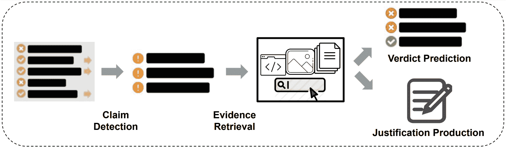
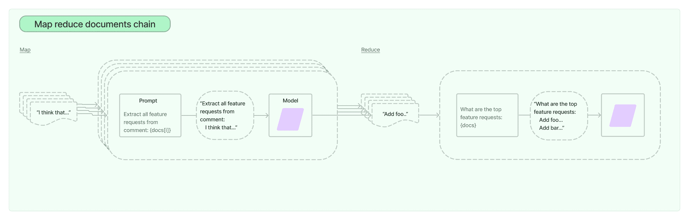
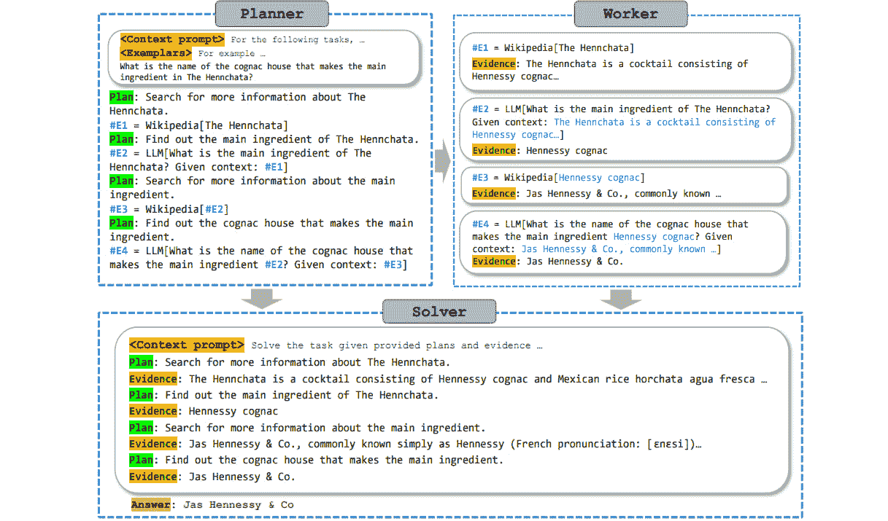
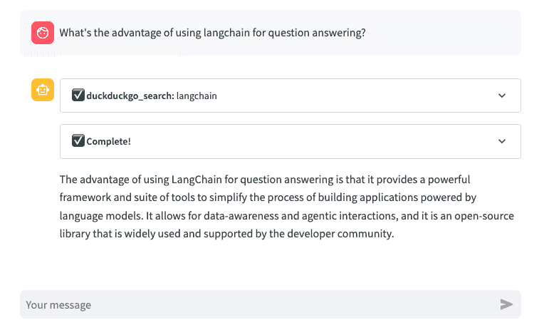
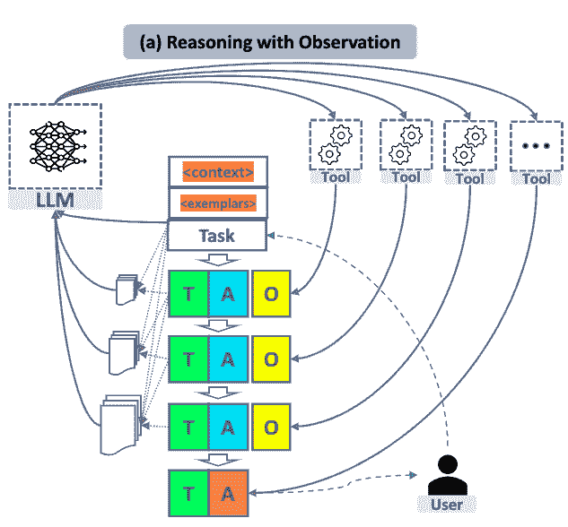
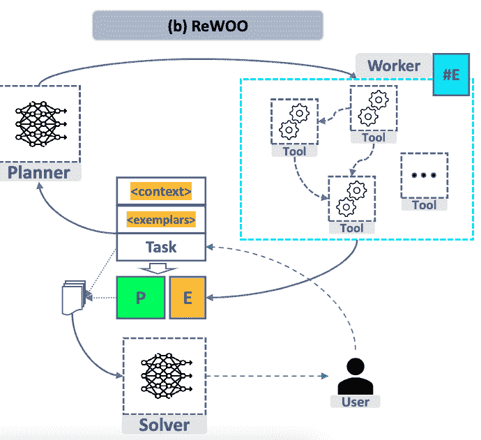
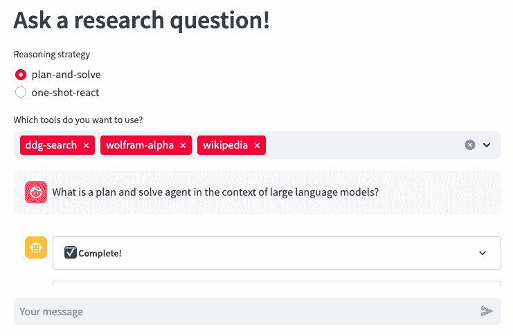

# 第四章：使用工具查询

## 参加我们在 Discord 上的书籍社区

[`packt.link/EarlyAccessCommunity`](https://packt.link/EarlyAccessCommunity)


在当今快节奏的商业和研究环境中，跟上不断增长的信息量可以是一项艰巨的任务。对于计算机科学和人工智能等领域的工程师和研究人员来说，了解最新发展是至关重要的。然而，阅读和理解大量论文可能是耗时和需大量精力的。这就是自动化发挥作用的地方。在本章中，我们将描述一种自动化总结研究论文和回答问题的方法，使研究人员更容易理解和保持知情。通过利用语言模型和一系列问题，我们将开发的总结可以简洁和简化地概括论文的核心论点、含义和机制。这不仅可以节省研究主题的时间和精力，还可以确保我们能有效地驾驭科学进步的加速步伐。我们还会尝试一下 OpenAI 模型的功能，并将其应用于信息提取。我们将看到它们如何（或者尚未）用于解析简历（CVs）。这个函数语法是特定于 OpenAI 的 API，并有许多应用，然而，LangChain 提供了一个平台，允许创建任何大型语言模型（LLMs）的工具，增强它们的功能。这些工具使 LLMs 能够与 API 交互，访问实时信息，并执行各种任务，如检索搜索、数据库查询、撰写电子邮件，甚至打电话。我们将使用检索增强生成（RAG）实现问答应用程序。这是一种通过向上下文注入相关数据来更新大型语言模型（LLMs）如 GPT 的技术。最后，我们将讨论代理决策的不同策略。我们将实现两种策略，即计划和执行（或计划和解决）和一次性代理，并将它们集成到一种视觉界面中，作为浏览器中的视觉应用程序（使用 Streamlit）以回答问题。主要章节包括：

+   什么是幻觉？

+   如何总结长篇文件？

+   从文件中提取信息

+   使用工具回答问题

+   推理策略

我们将从讨论 LLM 可靠性问题开始这一章节。

## 什么是幻觉？

生成语言模型的快速发展，如 GPT-3、Llama 和 Claude 2，引起了人们对其局限性和潜在风险的关注。一个主要关注点是幻觉，即模型生成的输出是荒谬的、不连贯的或不忠实于提供的输入。幻觉在现实世界的应用中会带来性能和安全风险，比如医疗或机器翻译。幻觉的另一个方面是，LLM 生成包含敏感个人信息的文本，比如电子邮件地址、电话号码和实际地址。这引起了重大的隐私问题，因为它表明语言模型可以从其训练语料库中记忆和恢复这些私人数据，尽管它们不存在于源输入中。

> **幻觉**在 LLM 的背景下指的是生成的文本与预期内容不忠实或荒谬的现象。这个术语类比于心理幻觉，后者涉及感知不存在的东西。在 NLG 中，幻觉文本可能在所提供的上下文中看起来流畅和自然，但缺乏具体性或可验证性。**忠实性**，即生成的内容保持与源的一致性和真实性，被认为是幻觉的反义词。
> 
> > **内在幻觉**发生在生成的输出与源内容相矛盾时，而**外在幻觉**涉及生成无法通过源材料验证或支持的信息。外在幻觉有时可能包括事实上正确的外部信息，但它们的不可验证性引起了来自事实安全角度的担忧。

努力解决幻觉问题正在进行中，但需要在不同任务之间有一个全面的理解，以开发有效的缓解方法。LLM 中的幻觉可能由各种因素引起：

1.  编码器的不完美表示学习。

1.  错误解码，包括注意到源输入的错误部分和解码策略的选择。

1.  曝光偏差，即训练和推理时间之间的差异。

1.  参数化知识偏差，其中预训练模型优先考虑自己的知识而不是输入，导致生成过多的信息。

> **幻觉缓解方法**可以分为两组：数据相关方法和建模与推理方法（见“自然语言生成中幻觉的调查”，季子威等，2022 年）：
> 
> > **数据相关方法：**
> > 
> > 构建一个忠实的数据集：从零开始构建具有清洁和忠实目标的数据集，或者在确保语义一致性的同时重写真实句子。
> > 
> > 自动清理数据：识别和过滤现有语料库中的不相关或矛盾信息，以减少语义噪声。
> > 
> > 信息增强：使用外部信息（如检索到的知识或合成数据）来增强输入，以提高语义理解并解决源目标差异。
> > 
> > **建模和推理方法：**
> > 
> > 架构：修改编码器架构以增强语义解释，注意机制以优先处理源信息，解码器结构以减少幻觉并强制实施隐式或显式约束。
> > 
> > 训练：结合规划、强化学习（RL）、多任务学习和可控生成技术，通过改善对齐、优化奖励函数和平衡忠实度与多样性来减轻幻觉。
> > 
> > 后处理：通过生成-再精化策略来纠正输出中的幻觉，或使用后处理校正方法专门优化结果的忠实度。

幻觉的结果是，自动事实核查可以应用的地方，是错误信息的传播危险或政治目的的滥用。 **错误信息**，包括**误导信息**、欺骗性新闻和谣言，对社会构成了重大威胁，尤其是在内容的创建和传播变得更加容易的社交媒体环境中。社会所面临的威胁包括对科学、公共卫生叙事、社会极化和民主进程的不信任。新闻业和档案学已经广泛研究了这个问题，事实核查倡议也在回应中不断增长。致力于事实核查的组织为独立事实核查人员和记者提供培训和资源，从而扩大专家事实核查工作的规模。解决错误信息问题对于维护信息的完整性并通过打击其对社会的有害影响至关重要。在文献中，这种问题被称为文本蕴含，即模型预测文本对之间的方向性真实关系（即如果，通常，一个阅读 t 的人会推断 h 最有可能是真实的）。在本章中，我们将重点关注通过信息增强和后处理进行**自动事实核查**。事实可以从 LLMs 或使用外部工具中检索。在前一种情况下，预训练语言模型可以取代知识库和检索模块的位置，利用其广泛的知识来回答开放领域问题，并使用提示来检索特定事实。我们可以在这个图表中看到这个总体观念（来源：https://github.com/Cartus/Automated-Fact-Checking-Resources by Zhijiang Guo）：



图 4.1：三个阶段的自动事实核查流程。

我们可以区分三个阶段：

1.  主张检测 - 确定需要验证的主张

1.  检索 - 检索证据以查找支持或反驳主张的来源

1.  主张验证 - 根据证据评估主张的真实性

从 2018 年开始，从 24 层 BERT-Large 开始，语言模型已经在诸如维基百科之类的大型知识库上进行预训练，因此能够回答来自维基百科或因为其训练集越来越包括其他来源 - 互联网、教科书、arxiv 和 Github 的知识问题。使用简单的掩蔽提示即可查询事实。例如，为了回答问题“微软的总部在哪里？”，该问题将被重写为“微软的总部在[MASK]”，然后输入到语言模型中获取答案。在这种方法中，最终激活函数引起的东西有趣的是，如果一个没有接收源文本（无条件 LLM）的 LLM 产生比接收源文本（有条件 LLM）的 LLM 更小的生成目标损失，这表明所生成的令牌具有幻觉性（Fillippova,2020）。幻象令牌占目标令牌总数的比率可以作为所生成输出中幻象程度的度量标准。在 LangChain 中，我们有一个链可用于事实检查和提示链，其中模型积极质疑陈述中涉及的假设。在这种自我检查的链中，`LLMCheckerChain`，模型被提示按顺序进行多次操作，首先将假设明确表达出来，看起来像这样：

```py
Here’s a statement: {statement}\nMake a bullet point list of the assumptions you made when producing the above statement.\n
```

请注意，这是一个字符串模板，其中花括号中的元素将被变量替换。接下来，这些假设将被反馈给模型，以便通过这样的提示逐个检查它们：

```py
Here is a bullet point list of assertions:
    {assertions}
    For each assertion, determine whether it is true or false. If it is false, explain why.\n\n
```

最后，模型被要求做出最终判断：

```py
In light of the above facts, how would you answer the question '{question}'
```

`LLMCheckerChain`可以自己完成所有这些操作，正如这个例子所示：

```py
from langchain.chains import LLMCheckerChain
from langchain.llms import OpenAI
llm = OpenAI(temperature=0.7)
text = "What type of mammal lays the biggest eggs?"
checker_chain = LLMCheckerChain.from_llm(llm, verbose=True)
checker_chain.run(text)
```

模型可以返回不同的结果给该问题，其中的一些是错误的，而一些会被正确地标识为假的。当我尝试这个东西时，我得到了像蓝鲸、北美海狸或已灭绝的巨型恐鸟之类的结果。我认为这是正确的答案：

```py
Monotremes, a type of mammal found in Australia and parts of New Guinea, lay the largest eggs in the mammalian world. The eggs of the American echidna (spiny anteater) can grow as large as 10 cm in length, and dunnarts (mouse-sized marsupials found in Australia) can have eggs that exceed 5 cm in length.
• Monotremes can be found in Australia and New Guinea
• The largest eggs in the mammalian world are laid by monotremes
• The American echidna lays eggs that can grow to 10 cm in length
• Dunnarts lay eggs that can exceed 5 cm in length
• Monotremes can be found in Australia and New Guinea – True
• The largest eggs in the mammalian world are laid by monotremes – True
• The American echidna lays eggs that can grow to 10 cm in length – False, the American echidna lays eggs that are usually between 1 to 4 cm in length. 
• Dunnarts lay eggs that can exceed 5 cm in length – False, dunnarts lay eggs that are typically between 2 to 3 cm in length.
The largest eggs in the mammalian world are laid by monotremes, which can be found in Australia and New Guinea. Monotreme eggs can grow to 10 cm in length.
> Finished chain.
```

因此，虽然这不能保证正确的答案，但它可以阻止一些错误的结果。至于扩展检索（或 RAG），我们在本章的问题回答部分中已经看到了这种方法。事实检查方法涉及将声明分解为更小的可检查查询，这些查询可以被构造为问题回答任务。专为搜索领域数据集而设计的工具可以帮助事实检查员有效地查找证据。现成的搜索引擎如 Google 和 Bing 也可以检索涵盖主题和证据的相关内容，以准确捕捉声明的真实性。在下一节中，我们将应用这种方法来返回基于网络搜索和其他工具的结果。在下一节中，我们将实现一个链来总结文档。我们可以问任何问题以从这些文档中得到答案。

## 如何总结长文档？

在本节中，我们将讨论自动化长文本和研究论文摘要的过程。在当今快节奏的商业和研究环境中，跟上不断增长的信息量可能是一项令人望而生畏的任务。对于计算机科学和人工智能等领域的工程师和研究人员，保持最新发展的状态至关重要。然而，阅读和理解大量的论文可能是耗时费力的。这就是自动化发挥作用的地方。作为工程师，我们的愿望是构建和创新，通过创建管道和进程来自动化避免重复的任务。这种方法经常被误解为懒惰，其实它允许工程师集中精力解决更复杂的挑战，并更有效地利用他们的技能。在这里，我们将搭建一个自动化工具，可以快速概括长文本的内容，以更易消化的格式呈现。此工具旨在帮助研究人员跟上每天发表的论文数量，特别是在人工智能等快速发展的领域。通过自动化摘要过程，研究人员可以节省时间和精力，同时也确保他们了解其领域的最新发展。该工具将基于 LangChain，并利用大型语言模型（LLMs）以更简明和简化的方式概述论文的核心主张、含义和机制。它还可以回答有关论文的特定问题，使其成为文献综述和加速科学研究的有价值资源。作者计划进一步开发该工具，以便自动处理多个文档并针对特定研究领域进行定制。总体而言，这种方法旨在通过提供更高效、更易于访问的方式来让研究人员受益于最新研究。LangChain 支持使用 LLMs 处理文档的 Map Reduce 方法，以实现文档的高效处理和分析。当阅读大型文本并将其拆分为适合 LLM 令牌上下文长度的文档（块）时，可以将链逐个应用于每个文档，然后将输出组合成一个文档。核心主张是 Map Reduce 过程涉及两个步骤：

+   映射步骤——将 LLM 链分别应用于每个文档，将输出视为新文档，然后

+   减少步骤——所有新文档都将传递到一个独立的组合文档链中，以获取单个输出。

图中所示：



图 4.2：LangChain 中的映射减少链（来源：LangChain 文档）。

这种方法的影响是它允许对文档进行并行处理，并且能够使用 LLM 进行推理、生成或分析单个文档以及组合它们的输出。该过程的机制涉及压缩或折叠映射文档，以确保它们适合于组合文档链，这也可能涉及到利用 LLM。如果需要，压缩步骤可以递归执行。下面是加载 PDF 文档并对其进行摘要的简单示例：

```py
from langchain.chains.summarize import load_summarize_chain
from langchain import OpenAI
from langchain.document_loaders import PyPDFLoader
pdf_loader = PyPDFLoader(pdf_file_path)
docs = pdf_loader.load_and_split()
llm = OpenAI()
chain = load_summarize_chain(llm, chain_type="map_reduce")
chain.run(docs)
```

变量`pdf_file_path`是一个包含 PDF 文件路径的字符串。映射和减少步骤的默认提示是这样的：

```py
Write a concise summary of the following:
{text}
CONCISE SUMMARY:
```

我们可以为每一步指定任何提示。在为本章开发的文本摘要应用中，我们可以看到如何传递其他提示。在 LangChainHub 上，我们可以看到 qa-with sources 提示，它采用了这样一个 reduce/combine 提示：

```py
Given the following extracted parts of a long document and a question, create a final answer with references (\"SOURCES\"). \nIf you don't know the answer, just say that you don't know. Don't try to make up an answer.\nALWAYS return a \"SOURCES\" part in your answer.\n\nQUESTION: {question}\n=========\nContent: {text}
```

在这个提示中，我们会提出一个具体的问题，但同样我们也可以给 LLM 一个更抽象的指令，提取假设和含义。文本将会是从映射步骤中得到的摘要。这样的指令会有助于避免幻觉。其他指令的示例可能是将文档翻译成不同的语言或以某种风格重新表述。一旦我们开始做很多调用，特别是在映射步骤中，我们会看到成本增加。我们在做很多调用，并且总共使用了很多标记。是时候给这个问题一些关注了！

### 标记使用情况

在使用模型时，特别是在长循环中，比如使用映射操作时，跟踪标记使用情况并了解你花费了多少钱是很重要的。对于任何严肃的生成式人工智能使用，我们需要了解不同语言模型的能力、定价选项和用例。OpenAI 提供了不同的模型，包括 GPT-4、ChatGPT 和 InstructGPT，以满足各种自然语言处理需求。GPT-4 是一个强大的语言模型，适用于解决自然语言处理中的复杂问题。它提供了基于使用的标记大小和数量的灵活定价选项。ChatGPT 模型，如 GPT-3.5-Turbo，专注于对话应用，如聊天机器人和虚拟助手。它们在生成准确和流畅的响应方面表现出色。ChatGPT 模型的定价基于使用的标记数量。InstructGPT 模型专为单轮指令遵循而设计，并针对快速和准确的响应生成进行了优化。InstructGPT 家族中的不同模型，如 Ada 和 Davinci，提供不同水平的速度和功率。Ada 是最快的模型，适用于速度至关重要的应用，而 Davinci 是最强大的模型，能够处理复杂的指令。InstructGPT 模型的定价取决于模型的能力，从像 Ada 这样的低成本选项到像 Davinci 这样的更昂贵的选项。OpenAI 的 DALL·E、Whisper 和 API 服务用于图像生成、语音转录、翻译和访问语言模型。DALL·E 是一种 AI 驱动的图像生成模型，可以无缝集成到应用程序中，用于生成和编辑新颖的图像和艺术品。OpenAI 提供了三个分辨率层次，允许用户选择他们所需的细节级别。更高的分辨率提供更复杂和更详细的图像，而较低的分辨率提供更抽象的表示。每张图像的价格根据分辨率而变化。Whisper 是一个能够将语音转录为文本并将多种语言翻译成英语的 AI 工具。它有助于捕捉对话，促进交流，并提高跨语言理解。使用 Whisper 的成本基于每分钟的费率。OpenAI 的 API 提供了对强大语言模型的访问，如 GPT-3，使开发人员能够创建高级应用程序。当注册 API 时，用户会获得一个初始的标记使用限制，表示在特定时间范围内与语言模型进行交互的标记数量。随着用户的记录和使用增加，OpenAI 可能会增加标记使用限制，为模型提供更多访问权限。如果用户需要更多标记来支持其应用程序，他们也可以请求配额增加。我们可以通过连接到 OpenAI 回调来跟踪 OpenAI 模型中的标记使用：

```py
with get_openai_callback() as cb:
    response = llm_chain.predict(text=”Complete this text!”)
    print(f"Total Tokens: {cb.total_tokens}")
    print(f"Prompt Tokens: {cb.prompt_tokens}")
    print(f"Completion Tokens: {cb.completion_tokens}")
    print(f"Total Cost (USD): ${cb.total_cost}")
```

在这个例子中，带有 `llm_chain` 的那一行可以是任何 OpenAI 模型的用法。 我们应该看到成本和令牌的输出。还有其他两种获得令牌使用情况的方法。 除了 OpenAI 回调外，`llm` 类的 `generate()` 方法返回 `LLMResult` 类型的响应而不是字符串。 这包括令牌使用情况和完成原因，例如 (来自 LangChain 文档)：

```py
input_list = [
    {"product": "socks"},
    {"product": "computer"},
    {"product": "shoes"}
]
llm_chain.generate(input_list)
```

结果看起来像这样：

```py
 LLMResult(generations=[[Generation(text='\n\nSocktastic!', generation_info={'finish_reason': 'stop', 'logprobs': None})], [Generation(text='\n\nTechCore Solutions.', generation_info={'finish_reason': 'stop', 'logprobs': None})], [Generation(text='\n\nFootwear Factory.', generation_info={'finish_reason': 'stop', 'logprobs': None})]], llm_output={'token_usage': {'prompt_tokens': 36, 'total_tokens': 55, 'completion_tokens': 19}, 'model_name': 'text-davinci-003'})
```

最后，OpenAI API 中的聊天完成响应格式包括一个使用对象，其中包含令牌信息，例如可能看起来像这样的 (节选)：

```py
 {
  "model": "gpt-3.5-turbo-0613",
  "object": "chat.completion",
  "usage": {
    "completion_tokens": 17,
    "prompt_tokens": 57,
    "total_tokens": 74
  }
}
```

接下来，我们将看一下如何使用 OpenAI 函数和 LangChain 从文档中提取特定的信息。

## 从文档中提取信息

2023 年 6 月，OpenAI 宣布更新 OpenAI API，包括对函数调用的新功能，这将提供增强的功能。 开发人员现在可以向 gpt-4-0613 和 gpt-3.5-turbo-0613 模型描述功能，并让模型智能生成包含调用这些功能的参数的 JSON 对象。此功能旨在增强 GPT 模型与外部工具和 API 之间的连接，提供了一种可靠的方式来从模型中检索结构化数据。函数调用使开发人员能够创建使用外部工具或 OpenAI 插件回答问题的聊天机器人。 它还允许将自然语言查询转换为 API 调用或数据库查询，并从文本中提取结构化数据。 更新的机制涉及使用新的 API 参数，即 `/v1/chat/completions` 终点的 `functions`。 通过名称、描述、参数和要调用的功能本身对来定义函数。开发人员可以使用 JSON Schema 向模型描述功能，并指定要调用的所需功能。在 LangChain 中，我们可以使用 OpenAI 中的这些函数调用进行信息提取或调用插件。 在信息提取中，我们可以使用 OpenAI 聊天模型中的提取链来指定实体及其属性从文本和文档中提取实体及其属性。 例如，这有助于识别文本中提到的人。 通过使用 OpenAI 函数参数并指定模式，可以确保模型输出所需的实体和属性及其适当的类型。这种方法的意义在于它允许通过定义具有所需属性和类型的模式精确提取实体。 它还能够指定哪些属性是必需的，哪些是可选的。模式的默认格式是字典，但我们还可以在 Pydantic 中定义属性及其类型，以控制和灵活提取过程。这是一个期望的用于 Curricum Vitae（简历）中信息的模式示例：

```py
from typing import Optional
from pydantic import BaseModel
class Experience(BaseModel):
    start_date: Optional[str]
    end_date: Optional[str]
    description: Optional[str]
class Study(Experience):
    degree: Optional[str]
    university: Optional[str]
    country: Optional[str]
    grade: Optional[str]
class WorkExperience(Experience):
    company: str
    job_title: str
class Resume(BaseModel):
    first_name: str
    last_name: str
    linkedin_url: Optional[str]
    email_address: Optional[str]
    nationality: Optional[str]
    skill: Optional[str]
    study: Optional[Study]
    work_experience: Optional[WorkExperience]
    hobby: Optional[str]
```

我们可以利用它来从简历中提取信息。这是来自[`github.com/xitanggg/open-resume`](https://github.com/xitanggg/open-resume)的示例简历。


图 4.3: 示例简历摘录

我们将尝试从这份简历中解析信息。利用 LangChain 中的`create_extraction_chain_pydantic()`函数，我们可以将我们的模式作为输入，并且输出将是一个符合该模式的实例化对象。简而言之，我们可以尝试以下代码片段：

```py
from langchain.chains import create_extraction_chain_pydantic
from langchain.chat_models import ChatOpenAI
from langchain.document_loaders import PyPDFLoader
pdf_loader = PyPDFLoader(pdf_file_path)
docs = pdf_loader.load_and_split()
# please note that function calling is not enabled for all models!
llm = ChatOpenAI(model_name="gpt-3.5-turbo-0613")
chain = create_extraction_chain_pydantic(pydantic_schema=Resume, llm=llm)
return chain.run(docs)
```

我们应该会得到这样的输出：

```py
[Resume(first_name='John', last_name='Doe', linkedin_url='linkedin.com/in/john-doe', email_address='hello@openresume.com', nationality=None, skill='React', study=None, work_experience=WorkExperience(start_date='May 2023', end_date='Present', description='Lead a cross-functional team of 5 engineers in developing a search bar, which enables thousands of daily active users to search content across the entire platform. Create stunning home page product demo animations that drives up sign up rate by 20%. Write clean code that is modular and easy to maintain while ensuring 100% test coverage.', company='ABC Company', job_title='Software Engineer'), hobby=None)]
```

它离完美还差得远 - 只有一个工作经验被解析出来。但考虑到我们迄今为止所付出的少量工作，这是个不错的开始。请在 Github 上查看完整示例。我们可以添加更多功能，例如猜测个性或领导能力。OpenAI 以特定语法将这些函数调用注入系统消息中，他们的模型已经针对此进行了优化。这意味着函数计入上下文限制，并相应地计入输入标记。LangChain 本身具有将函数调用注入为提示的功能。这意味着我们可以在 LLM 应用程序中使用除 OpenAI 之外的模型提供者进行函数调用。我们现在将着眼于这一点，并将其构建成一个交互式 Web 应用程序与 Streamlit。

## 使用工具回答问题

LLMs 是在一般语料库数据上进行训练的，可能对需要特定领域知识的任务效果不佳。单独使用 LLMs 不能与环境交互，并访问外部数据源，然而，LangChain 提供了一个平台，用于创建访问实时信息并执行诸如天气预报、预订、建议菜谱和管理任务等任务的工具。代理和链中的工具允许开发由 LLMs 驱动的数据感知和代理性应用程序，并且为解决问题的各种方法提供了广泛的应用范围，扩展了它们的用例并使它们更加多样和强大。工具的一个重要方面是它们可以在特定领域内或处理特定的输入。例如，LLM 缺乏固有的数学能力。然而，像计算器这样的数学工具可以接受数学表达式或方程作为输入并计算结果。LLM 和这样的数学工具结合起来进行计算并提供准确答案。通常，这种检索方法和 LLMs 的组合被称为**检索增强生成**（**RAG**），并通过从外部源中检索相关数据并将其注入到背景中来解决 LLMs 的局限性。这些检索的数据作为增强提示给 LLMs 的附加信息。通过通过 RAG 用特定用例的信息根植 LLMs，改善了响应的质量和准确性。通过检索相关数据，RAG 有助于减少 LLMs 的错觉响应。例如，将 LLM 用于医疗应用程序，可以在推断期间从外部来源检索相关医学信息，如医学文献或数据库。然后，这些检索的数据可以被合并到上下文中，以增强生成的响应，并确保它们与特定领域的知识一致和准确。在这种情况下，实施 RAG 的好处是双重的。首先，即使模型的训练数据截止日期过去，它也允许将最新信息纳入响应中。这确保用户甚至对于最新事件或不断发展的主题都可以收到准确和相关的信息。其次，RAG 通过利用来自新闻文章或与特定主题相关的网站等来源的具体上下文，增强了 ChatGPT 提供更详细和上下文的答案的能力。通过检索特定上下文的信息，响应将更加准确。

> RAG（检索增强生成）通过从数据源中检索信息，以补充提供给语言模型的提示，为模型提供所需的背景信息以生成准确的响应。RAG 涉及几个步骤：

+   **提示**: 用户向聊天机器人提供提示，描述他们对输出的期望。

+   **研究**：执行上下文搜索，并从各种数据源中检索相关信息。这可能涉及查询数据库，基于关键字搜索索引文档，或调用 API 从外部源检索数据。

+   **更新资源**：检索到的上下文被注入到原始提示中，通过提供访问事实数据，增强提示，提高准确性。

+   **叙述**：基于这个增强输入，LLM 生成包含事实正确信息的响应，并将其发送回聊天机器人以传递给用户。

因此，通过结合外部数据源并将相关上下文注入提示中，RAG 增强了 LLM 生成准确、最新并与特定领域或主题对齐的响应的能力。图示了通过工具和推理增强 LLM 的过程（来源：https://github.com/billxbf/ReWOO，由 Binfeng Xu 等人于 2023 年 5 月编写的论文 “Decoupling Reasoning from Observations for Efficient Augmented Language Models Resources” 的实现）:



图 4.4：工具增强的语言模型范例，利用语言模型的可预见推理能力来提高系统参数和提示效率

让我们看看这个实例！LangChain 中有很多可用的工具，而且 - 如果这还不够 - 自己开发工具也不难。让我们设置一个带有几个工具的代理：

```py
from langchain.agents import (
    AgentExecutor, AgentType, initialize_agent, load_tools
)
from langchain.chat_models import ChatOpenAI
def load_agent() -> AgentExecutor:
    llm = ChatOpenAI(temperature=0, streaming=True)
    # DuckDuckGoSearchRun, wolfram alpha, arxiv search, wikipedia
    # TODO: try wolfram-alpha!
    tools = load_tools(
        tool_names=["ddg-search", "wolfram-alpha", "arxiv", "wikipedia"],
        llm=llm
    )
    return initialize_agent(
        tools=tools, llm=llm, agent=AgentType.ZERO_SHOT_REACT_DESCRIPTION, verbose=True
    )
```

了解一个重要的细节是 `AgentExecutor` 是一个链，因此 - 如果我们想的话 - 我们可以将其集成到更大的链中。我们可以使用不同的语法初始化这个链，就像这样：

```py
return MRKLChain.from_chains(llm, chains, verbose=True)
```

在这种语法中，我们将工具传递为链配置。MRKL 代表模块化推理、知识和语言。零射击代理是 MRKL 框架中最通用的行动代理。请注意 `ChatOpenAI` 构造函数中的参数 `streaming` 设置为 `True`。这样做可以提供更好的使用体验，因为它意味着文本响应将随着其到来而更新，而不是一次性完成所有文本。目前只有 OpenAI、ChatOpenAI 和 ChatAnthropic 实现支持流式处理。所有提到的工具都有其特定的用途，这是描述的一部分，传递给语言模型。这些工具是插入到代理中的：

+   DuckDuckGo - 一个注重隐私的搜索引擎；它的一个额外优势是不需要开发者注册。

+   Wolfram Alpha - 一个结合了自然语言理解和数学能力的集成，用于像“2x+5 = -3x + 7？”这样的问题。

+   Arxiv - 搜索学术预印出版物；这对于研究导向的问题很有用。

+   Wikipedia - 有关任何有重要名声的实体的问题

请注意，要使用 Wolfram Alpha，您必须设置一个帐户，并设置 `WOLFRAM_ALPHA_APPID` 环境变量，其中包含您在 [`developer.wolframalpha.com/`](https://developer.wolframalpha.com/) 创建的开发者令牌。除了 DuckDuckGo 之外，LangChain 还集成了很多其他搜索工具，可以利用 Google 或 Bing 搜索引擎，或者使用元搜索引擎。还有一个用于天气信息的 Open-Meteo 集成，但是这些信息也可以通过搜索获得。让我们将我们的 agent 设计为一个 streamlit 应用。

> **Streamlit**是一个面向机器学习和数据科学团队的开源应用程序框架。它允许用户使用 Python 在几分钟内创建美观的网络应用程序。

让我们使用我们刚刚定义的`load_agent()`函数编写代码：

```py
import streamlit as st
from langchain.callbacks import StreamlitCallbackHandler
chain = load_agent()
st_callback = StreamlitCallbackHandler(st.container())
if prompt := st.chat_input():
    st.chat_message("user").write(prompt)
    with st.chat_message("assistant"):
        st_callback = StreamlitCallbackHandler(st.container())
        response = chain.run(prompt, callbacks=[st_callback])
        st.write(response)
```

请注意，我们在调用链中使用回调处理程序，这意味着我们将在返回结果时立即看到响应。我们可以在终端上像这样本地启动应用：

```py
PYTHONPATH=. streamlit run question_answering/app.py
```

> Streamlit 应用程序的部署可以在本地或服务器上进行。或者，您可以在 Streamlit Community Cloud 上或 Hugging Face Spaces 上部署此应用程序。

+   对于**Streamlit Community Cloud**，请执行以下操作：

+   1\. 创建一个 Github 存储库

+   2\. 前往 Streamlit Community Cloud，点击“New app”，然后选择新的存储库

+   3\. 点击“部署！”

+   至于**Hugging Face Spaces**，它的工作原理如下：

+   1\. 创建一个 Github 仓库

+   2\. 在 https://huggingface.co/ 上创建一个 Hugging Face 账户

+   3\. 前往“Spaces”，然后点击“Create new Space”。在表单中，填写一个名称，将空间类型设置为“Streamlit”，并选择新的存储库。

这是应用程序的截图：



Figure 4.5: 在 Streamlit 中的问答应用程序。

搜索结果相当不错，尽管具体取决于所使用的工具，可能仍然会出现错误结果。对于关于拥有最大蛋的哺乳动物的问题，使用 DuckDuckGo 搜索会返回一篇讨论鸟类和哺乳动物蛋的文章，并有时得出鸵鸟是拥有最大蛋的哺乳动物的结论，尽管鸭嘴兽有时也会出现。以下是正确推理的日志输出（缩写版）：

```py
> Entering new AgentExecutor chain...
I'm not sure, but I think I can find the answer by searching online.
Action: duckduckgo_search
Action Input: "mammal that lays the biggest eggs"
Observation: Posnov / Getty Images. The western long-beaked echidna ...
Final Answer: The platypus is the mammal that lays the biggest eggs.
> Finished chain.
```

你可以看到，拥有一个强大的自动化和问题解决框架，你可以将需要数百小时才能完成的工作压缩到几分钟之内。你可以尝试不同的研究问题，以了解工具的使用方式。书籍仓库中的实际实现允许您尝试不同的工具，并提供了自验证选项。检索增强生成（RAG）与 LLMs 可以通过将来自外部来源的相关数据注入上下文中，显著提高响应的准确性和质量。通过用特定用例的知识基础来奠定 LLMs 的基础，我们可以减少幻觉，并使它们在真实世界情景中更有用。RAG 比重新训练模型更具成本效益和效率。您可以在 BlockAGI 项目中看到使用 LangChain 的增强信息检索的非常高级的示例，该项目受到 BabyAGI 和 AutoGPT 的启发，网址为[`github.com/blockpipe/BlockAGI`](https://github.com/blockpipe/BlockAGI)。在接下来的几节中，我们将通过它们的决策制定策略来比较主要类型的代理。

## 推理策略

当前一代的生成模型，如 LLMs，擅长发现现实世界数据的模式，例如视觉和音频信息，以及非结构化文本，但是它们在涉及结构化知识表示和推理的任务所需的符号操作方面存在困难。推理问题对 LLMs 构成挑战，并且有不同的推理策略可以补充神经网络作为生成模型固有的模式完成能力。通过专注于在提取的信息上实现符号操作，这些混合系统可以增强语言模型的能力。**模块化推理，知识和语言**（**MRKL**）是一个结合语言模型和工具来执行推理任务的框架。在 LangChain 中，这包括三个部分：

1.  工具，

1.  一个`LLMChain`，以及

1.  代理本身。

工具是代理可以使用的可用资源，如搜索引擎或数据库。LLMChain 负责生成文本提示并解析输出以确定下一步操作。代理类使用 LLMChain 的输出来决定采取哪些行动。我们在*第二章*，*LangChain 简介*中讨论了工具使用策略。我们可以在此图表中看到观察模式的推理：



图 4.6：推理观察（来源：https://arxiv.org/abs/2305.18323；许滨峰等人，2023 年 5 月）。

**依赖观察的推理**包括基于当前知识状态或通过观察获取的证据做出判断、预测或选择。在每次迭代中，代理向语言模型（LLM）提供上下文和示例。用户的任务首先与上下文和示例结合，然后交给 LLM 启动推理。LLM 生成一个思考和一个动作，然后等待来自工具的观察。观察结果添加到提示中以启动下一次对 LLM 的调用。在 LangChain 中，这是一个**行动代理**（也称为**零-shot 代理**， `ZERO_SHOT_REACT_DESCRIPTION`），这是创建代理时的默认设置。正如提到的，计划也可以在任何操作之前制定。在 LangChain 中称为**计划和执行代理**的策略在这里示例化：



图 4.7: 从观察中分离推理（来源：https://arxiv.org/abs/2305.18323；许彬锋等人，2023 年 5 月）。

规划器（一个 LLM）可以针对规划和工具使用进行微调，产生一个计划列表（P）并调用一个工作者（在 LangChain 中：代理）通过使用工具来收集证据（E）。P 和 E 与任务结合，然后传递给求解器（一个 LLM）得出最终答案。我们可以编写一个伪算法如下：

+   规划所有步骤（规划器）

+   对于步骤中的每一步：

    +   确定完成步骤所需的适当工具

规划器和求解器可以是不同的语言模型。这样就可以使用更小、更专业的规划器和求解器模型，并针对每次调用使用更少的标记。我们可以在我们的研究应用程序中实现计划和求解，让我们做吧！首先，让我们向`load_agent()`函数添加一个`strategy`变量。它可以取两个值，即“plan-and-solve”或“one-shot-react”。对于“one-shot-react”，逻辑保持不变。对于“plan-and-solve”，我们将定义一个规划器和一个执行器，我们将使用它们来创建一个`PlanAndExecute`代理执行器：

```py
from typing import Literal
from langchain.experimental import load_chat_planner, load_agent_executor, PlanAndExecute
ReasoningStrategies = Literal["one-shot-react", "plan-and-solve"]
def load_agent(
        tool_names: list[str],
        strategy: ReasoningStrategies = "one-shot-react"
) -> Chain:
    llm = ChatOpenAI(temperature=0, streaming=True)
    tools = load_tools(
        tool_names=tool_names,
        llm=llm
    )
    if strategy == "plan-and-solve":
        planner = load_chat_planner(llm)
        executor = load_agent_executor(llm, tools, verbose=True)
        return PlanAndExecute(planner=planner, executor=executor, verbose=True)
    return initialize_agent(
        tools=tools, llm=llm, agent=AgentType.ZERO_SHOT_REACT_DESCRIPTION, verbose=True
    )
```

为了简洁起见，我省略了我们之前已有的导入操作。让我们定义一个通过 Streamlit 中的单选按钮设置的新变量。我们将把这个变量传递给`load_agent()`函数：

```py
strategy = st.radio(
    "Reasoning strategy",
    ("plan-and-solve", "one-shot-react", ))
```

你可能注意到`load_agent()`接受一个字符串列表`tool_names`。这也可以在用户界面（UI）中选择：

```py
tool_names = st.multiselect(
    'Which tools do you want to use?',
    [
        "google-search", "ddg-search", "wolfram-alpha", "arxiv",
        "wikipedia", "python_repl", "pal-math", "llm-math"
    ],
    ["ddg-search", "wolfram-alpha", "wikipedia"])
```

最后，在应用程序中，代理如下加载：

```py
agent_chain = load_agent(tool_names=tool_names, strategy=strategy)
```

我们可以在这里看到 UI：



图 4.8: 在我们的研究应用程序中实现计划和执行。

请查看应用程序，并查看关于“在大型语言模型的背景下什么是计划和求解代理”的不同步骤。简单地说，第一步，计划如下：

1.  定义大型语言模型：大型语言模型是经过大量文本数据训练的人工智能模型，可以根据其接收到的输入生成类似人类的文本。

1.  在大型语言模型的背景下理解计划的概念：在大型语言模型的背景下，计划是指模型生成的解决问题或回答问题的结构化大纲或一组步骤。

1.  在大型语言模型的背景下理解求解代理的概念：求解代理是大型语言模型的组成部分，负责生成解决问题或回答问题的计划。

1.  认识到计划和求解代理在大型语言模型中的重要性：计划和求解代理有助于组织模型的思维过程，并为解决问题或回答问题的任务提供了结构化方法。

1.  给出以上所采取的步骤后，请回答用户的原始问题：在大型语言模型的背景下，计划是由求解代理生成的结构化大纲或一组步骤，用于解决问题或回答问题。求解代理是大型语言模型的组成部分，负责生成这些计划。

因此，第一步是执行 LLMs 的查找：

```py
Action:
{
"action": "Wikipedia",
"action_input": "large language models"
}
```

我们没有讨论这个问题的另一个方面，即在这些步骤中使用的提示策略。例如，不同的提示策略提供了解决 LLM 复杂推理问题挑战的方法。一种方法是**few-shot chain-of-thought**（**CoT**）提示，其中 LLM 通过逐步推理演示进行引导。例如，在算术推理中，可以向 LLM 展示解方程的示例演示，以帮助其理解过程。另一种策略是**zero-shot-CoT**提示，它消除了手动演示的需要。而是，将类似“让我们逐步思考”这样的通用提示附加到提供给 LLM 的问题陈述中。这使模型能够在没有先前明确示例的情况下生成推理步骤。在算术推理中，问题陈述可以附加这个提示并输入 LLM。**Plan-and-Solve (PS)提示**，涉及将复杂任务分解为较小的子任务，并根据计划逐步执行它们。例如，在解方程或涉及多个步骤的单词问题的数学推理问题中，PS 提示使 LLM 能够为接近每个子步骤制定计划，如提取相关变量和计算中间结果。为了进一步提高推理步骤和指导的质量，引入了**PS+**提示。它包括更详细的说明，如强调提取相关变量并考虑计算和常识。PS+提示确保 LLM 更好地理解问题并能够生成准确的推理步骤。例如，在算术推理中，PS+提示可以指导 LLM 识别关键变量，正确执行计算，并在推理过程中应用常识知识。这结束了我们对推理策略的讨论。所有策略都存在问题，可能表现为计算错误、缺少步骤错误和语义误解。然而，它们有助于提高生成的推理步骤的质量，增加问题解决任务的准确性，并增强 LLM 处理各种类型推理问题的能力。

## 总结

在本章中，我们谈到了幻觉问题，自动事实核查以及如何使 LLMs 更加可靠。工具和提示策略特别受到强调。我们首先查看并实施了提示策略，以分解和总结文档。这对于消化大型研究文章或分析非常有帮助。一旦我们开始大量调用 LLMs，这就意味着我们会产生很多成本。因此，我专门为令牌使用分配了一节。工具为 LLMs 在各个领域提供了创造性的解决方案，并开辟了新的可能性。例如，可以开发一个工具，使 LLM 能够执行高级检索搜索，查询数据库以获取特定信息，自动编写电子邮件，甚至处理电话。OpenAI API 实现了我们可以使用的功能，其中包括在文档中进行信息提取等。我们已经实现了一个非常简单的 CV 解析器版本，作为此功能的示例。但是，工具和函数调用并不是 OpenAI 的特有功能。通过 Streamlit，我们可以实现调用工具的不同代理。我们已经实现了一个应用程序，可以通过依赖外部工具（如搜索引擎或维基百科）来回答研究问题。然后，我们查看了代理使用的不同策略来做出决策。主要区别在于决策点。我们将一个计划和解决代理实施到了 Streamlit 应用程序中。我希望这能表明，在几行代码中，我们可以实现在几种情况下非常令人印象深刻的应用程序。然而，重要的是要明确，本章中开发的应用程序具有局限性。它们可以帮助您显著提高效率，但是您 - 作为人类 - 必须运用判断力并改进写作，以确保其连贯和合理。让我们看看您是否记得本章的一些关键要点！

## 问题

请看一下，看看你能否从记忆中得出这些问题的答案。如果对任何一个不确定，请返回本章的相应部分：

1.  什么是幻觉？

1.  自动事实核查是如何工作的？

1.  在 LangChain 中，我们可以采取什么措施来确保输出有效？

1.  LangChain 中的 map-reduce 是什么？

1.  我们如何统计我们使用的令牌数量（以及为什么应该这样做）？

1.  RAG 代表什么，使用它有什么优势？

1.  LangChain 中有哪些工具可用？

1.  请定义计划和解决代理

1.  请定义一次性代理

1.  我们如何在 Streamlit 中实现文本输入字段和单选按钮？
