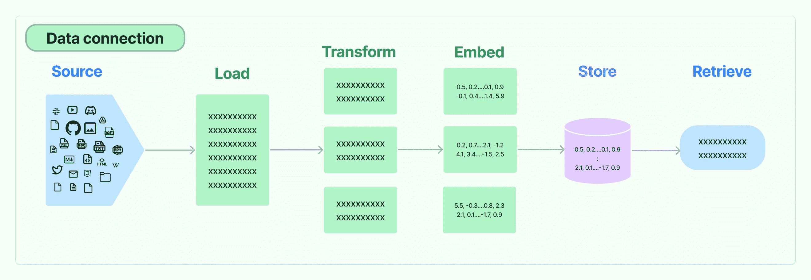
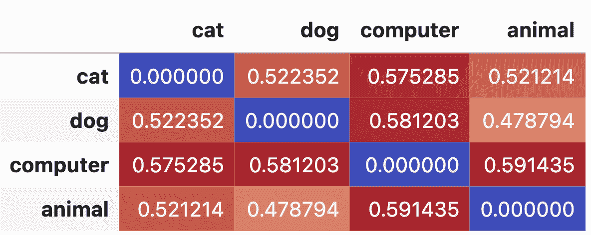
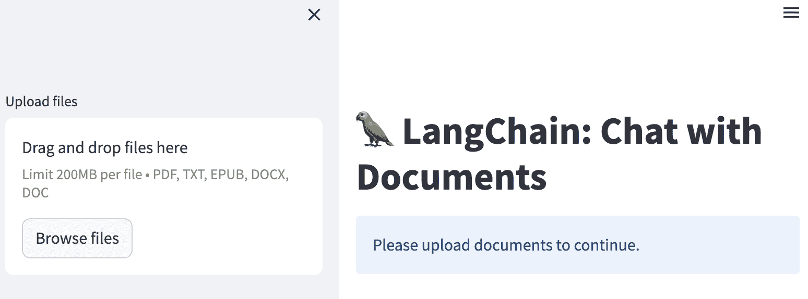

# 5 像 ChatGPT 一样构建聊天机器人

## 加入我们的书籍社区在 Discord 上

[`packt.link/EarlyAccessCommunity`](https://packt.link/EarlyAccessCommunity)


在本章中，我们将讨论聊天机器人，它们是什么，它们能做什么，以及如何实现它们。我们将从讨论聊天机器人的演变和当前技术的最新进展开始本章。理解和增强当前聊天机器人和大型语言模型（LLMs）的能力对它们在包括医学和法律在内的不同领域的安全和有效使用具有实际意义。积极的沟通，对于与客户需求接触很重要，需要在技术上，实现机制来维护上下文和记忆。本章的重点是检索机制，包括矢量存储以提高响应的准确性和聊天机器人对可用信息和当前对话的忠实度。我们将介绍现代聊天机器人的基础知识，如检索增强语言模型（RALMs），我们在 LangChain 中实现它们所需的技术背景。我们将详细讨论加载文档和信息的方法，包括矢量存储和嵌入。我们将进一步讨论关于记忆的更具体的方法，这些方法涉及维护正在进行的对话的知识和状态。最后，我们从声誉和法律的角度讨论另一个重要主题：审查。让我们确保我们的回答不是滥用的，不宽容的，或者违背组织的精神。LangChain 允许您通过一个审查链来通过任何文本，以检查它是否包含有害内容。在整个章节中，我们将使用 Streamlit 中的界面来实现一个聊天机器人，您可以在 [`github.com/benman1/generative_ai_with_langchain`](https://github.com/benman1/generative_ai_with_langchain) 的 Github 仓库中的 `chat_with_retrieval` 目录中找到。主要部分包括：

+   什么是聊天机器人？

+   检索和矢量

+   实现一个聊天机器人

+   不要说傻话！

我们将通过介绍聊天机器人和技术的最新发展开始本章。

## 什么是聊天机器人？

**聊天机器人**是一种可以与用户聊天、提供信息和支持、预订事物以及执行各种其他任务的人工智能程序。它用于重现与用户的强大互动，并可用于不同的行业和不同的目的。聊天机器人有益的原因在于它们可以自动化任务、提供即时响应，并为用户提供个性化体验。它们可以用于客户支持、潜在客户生成、销售、信息检索等。聊天机器人可以节省时间、提高效率、增强客户体验，并简化业务流程。聊天机器人通过利用自然语言处理（NLP）和机器学习算法工作。它们分析用户输入，理解其意图，并生成适当的回应。它们可以设计为与基于文本的消息平台或基于语音的应用程序配合使用。客户服务中聊天机器人的一些用例包括提供全天候支持、处理常见问题、协助产品推荐、处理订单和付款以及解决简单的客户问题。聊天机器人的更多用例包括：

+   预约安排：聊天机器人可以帮助用户安排预约、预订预约并管理其日历。

+   信息检索：聊天机器人可以为用户提供特定信息，如天气更新、新闻文章或股票价格。

+   虚拟助手：聊天机器人可以充当个人助手，帮助用户完成任务，如设置提醒、发送消息或打电话。

+   语言学习：聊天机器人可以通过提供互动对话和语言练习来协助语言学习。

+   心理健康支持：聊天机器人可以提供情感支持，提供资源，并进行心理健康对话。

+   教育：在教育环境中，正在探索虚拟助手作为虚拟导师的潜力，帮助学生学习和评估他们的知识，回答问题，并提供个性化的学习体验。

+   人力资源和招聘：聊天机器人可以协助招聘流程，通过筛选候选人、安排面试并提供有关职位空缺的信息。

+   娱乐：聊天机器人可以让用户参与互动游戏、测验和故事体验。

+   法律：聊天机器人可用于提供基本法律信息，回答常见法律问题，协助法律研究，并帮助用户导航法律程序。它们还可以协助文件准备，如起草合同或创建法律表格。

+   医学：聊天机器人可以协助检查症状，提供基本医疗建议，并提供心理健康支持。它们可以通过提供相关信息和建议，改善临床决策，帮助医疗专业人员。

这些只是一些例子，聊天机器人的用途正在不断扩展到各个行业和领域。任何领域的聊天技术都有潜力使信息更易获取，并为寻求帮助的个人提供初步支持。

### 什么是最先进的技术？

图灵测试，以英国计算机科学家、密码分析师和数学家艾伦·图灵命名，是人工智能（AI）中一种用于确定计算机是否具有像人类一样思考能力的调查方法。尽管关于图灵测试的相关性以及以此为基础的竞赛的有效性存在着很多争论，但这一测试仍然是讨论和研究人工智能的哲学起点。随着我们对人工智能的不断进步，以及对人类大脑功能的更深入理解和映射，图灵测试仍然是定义智能的基础，并且是关于我们对技术期望达到什么程度才能被认为是“思考机器”的辩论的基线。图灵提出，如果计算机可以在特定条件下模仿人类的反应，那么可以说计算机具有人工智能。最初的图灵测试需要三个终端，每个终端在物理上与其他两个终端分开。一个终端由计算机操作，另外两个由人类操作。在测试过程中，一个人类扮演提问者的角色，而另一个人类和计算机扮演回答者的角色。提问者在特定主题领域内使用指定的格式和上下文对回答者进行审问。经过预设的时间或问题数量后，提问者被要求决定哪个回答者是人类，哪个是计算机。自从测试形式形成以来，许多人工智能已经能够通过测试；其中最早的一个是 Joseph Weizenbaum 的 ELIZA。1966 年，他发表了一篇关于他的聊天机器人 ELIZA 的文章，“ELIZA - 一个用于研究人机自然语言交流的计算机程序。”ELIZA 是最早创建的聊天机器人之一，模拟了心理医生的角色。作为一种展示技术局限性的幽默，这个聊天机器人采用了简单的规则和模糊的开放式问题，以在对话中给人一种共情理解的印象，被认为是人工智能的一个具有讽刺意味的里程碑。然而，ELIZA 知识有限，只能在特定话题领域内进行对话。它也无法长时间保持对话或从对话中学习。图灵测试多年来一直备受批评，特别是因为历史上，问询的性质必须受限，以使计算机表现出类似于人类的智能。很多年来，只有当提问者制定查询时，计算机才会获得较高的分数，因此问题只能有“是”或“否”回答，或者与一小范围的知识领域相关。当问题是开放式的，并需要对话回答时，计算机程序能够成功欺骗提问者的可能性就小了。此外，像 ELIZA 这样的程序可以通过操纵它并不完全理解的符号来通过图灵测试。哲学家约翰·西尔尔（John Searle）认为这并不决定与人类相媲美的智能。对许多研究人员来说，计算机是否能通过图灵测试的问题已经变得无关紧要。与其专注于如何说服某人他们正在与一个人而不是一个计算机程序对话，真正的关注应该集中在如何使人机交互更直观和高效。���如，通过使用会话接口。1972 年，另一个重要的聊天机器人 PARRY 被开发出来，它扮演了一名患有精神分裂症的病人。它具有固定的个性，其回答是基于一系列假设，并且情绪反应是由用户表述的变化触发的。在 1979 年的一次实验中，PARRY 被五名精神科医生测试，他们必须确定他们所交流的患者是一个计算机程序还是真正的精神分裂病患者。结果各有不同，有些精神科医生给出了正确的诊断，而有些给出了

> 以下是一些聊天机器人的示例：

+   [ELIZA](https://zh.wikipedia.org/wiki/ELIZA)：ELIZA 是最早的聊天机器人之一，于上世纪 60 年代开发，使用模式匹配来模拟与用户的对话。

+   Siri：Siri 是由苹果开发的流行的基于语音的聊天机器人。它集成在苹果设备中，可以执行任务，回答问题并提供信息。

+   Alexa：Alexa 是亚马逊开发的智能个人助理。它可以响应语音命令，播放音乐，提供天气更新，并控制智能家居设备。

+   Google Assistant：Google Assistant 是由谷歌开发的聊天机器人。它可以回答问题，提供建议，并根据用户命令执行任务。

+   Mitsuku：Mitsuku 是一款多次赢得 Loebner 奖图灵测试的聊天机器人。它以参与自然和类似人类的对话而闻名。

> 这些只是一些示例，各行业和应用中还有许多其他聊天机器人可用。

使用图灵测试及其衍生物的一个关注点是它侧重于模仿和欺骗，而更有意义的测试应该强调开发者需要专注于创建有用和有趣的功能，而不仅仅是执行花招。使用基准测试和学术/专业考试提供了对 AI 系统性能的更具体评估。目前该领域研究人员的目标是为测试人工智能（AI）系统的能力提供更好的基准，特别是对于大型语言模型（LLM）如 GPT-4。他们旨在了解 LLM 的限制并确定可能失败的领域。先进的 AI 系统，包括 GPT-4，在与语言处理相关的任务上表现出色，但在简单的视觉逻辑难题上很难。LLM 可以根据统计相关性生成合理的下一个词，但可能缺乏推理或对抽象概念的理解。研究人员对 LLM 的能力有不同的看法，有些人将其成就归因于有限的推理能力。测试 LLM 并了解其能力具有实际意义。它可以帮助在医学和法律等现实领域安全有效地应用 LLM。通过确定 LLM 的优势和劣势，研究人员可以确定如何最好地利用它们。ChatGPT 的训练使其更擅长处理幻觉，与其前身相比，这意味着它生成荒谬或无关紧要的回应的可能性较小。然而，重要的是要注意，ChatGPT 仍然可以自信地提供不准确的信息，因此用户应谨慎并验证提供的信息。上下文和记忆在确保聊天机器人的对话提供准确信息和对之前互动的准确反映的响应方面起着重要作用，从而使其能够更忠实地与用户互动。我们现在将更详细地讨论这一点。

### 上下文和记忆

上下文和记忆是聊天机器人设计的重要方面。它们使聊天机器人能够保持对话的上下文，回应多个查询，并存储和访问长期记忆。它们是调节聊天机器人响应准确性和忠实度的重要因素。在聊天机器人中，记忆和上下文的重要性可与人与人之间对话中记忆和理解的重要性相比。没有回顾过去的交流或理解或了解更广泛背景的对话可能会杂乱无章，并导致误解，从而导致不令人满意的对话体验。**上下文理解**极大地影响着聊天机器人响应的准确性。它指的是聊天机器人理解整个对话以及一些相关背景的能力，而不仅仅是用户最后一条消息。了解上下文的聊天机器人能够保持对话的整体视角，使对话流程更加自然和人性化。**记忆保持**直接影响着聊天机器人性能的忠实度，这涉及识别和记住以前对话中的事实以供将来使用的一致性。此功能增强了用户的个性化体验。例如，如果用户说：“给我显示最便宜的航班”，然后跟着说：“那个地区的酒店怎么样？”如果没有上下文的前一条消息，聊天机器人将不知道用户指的是哪个地区。在反向场景中，一个具有上下文意识的聊天机器人会理解用户在谈论与飞行目的地相同地区的住宿。记忆缺乏导致对话中的一致性不足（忠实度不足）。例如，如果用户在一次对话中已经通过姓名确定了自己的身份，而机器人在下一次对话中忘记了这些信息，就会导致不自然和不个性化的互动。记忆和上下文对于使聊天机器人的互动更加有效、准确、亲切和令人满意至关重要。如果没有这些元素，机器人可能会显得不足、僵化并且无法与人类对话伙伴建立联系。因此，这些特征对于计算机和人类之间复杂而令人满意的互动至关重要。LLM 聊天机器人的一个新方面是它们不仅可以对意图做出响应，还可以更智能地与用户进行对话。这被称为主动对话。

### **有意**与**主动** 

在语言模型或聊天机器人的背景下，**主动**指的是系统在未明确受到用户提示的情况下启动行动或提供信息的能力。它涉及根据先前的互动或上下文线索预测用户的需求或偏好。另一方面，**有意**意味着聊天机器人被设计为理解并满足用户的意图或请求，并根据这些意图和期望的结果采取具体的行动或提供相关的回应。主动式聊天机器人很有用，因为它可以与客户建立联系并改善他们的体验，从而创建更好的客户旅程。这可以通过节省时间和精力来增强用户体验，还可以通过在问题出现之前快速有效地解决客户查询来提高客户满意度。主动沟通对于企业的成功至关重要，因为它提高了客户的生命周期价值（CLV）并降低了运营成本。通过主动预测客户的需求并主动提供信息，企业可以控制沟通并以有利的方式构建对话。这建立了信任、客户忠诚度，并增强了组织的声誉。此外，主动沟通通过在客户提问之前解决客户查询并减少来电支持电话，有助于提高组织的生产率。技术上，这种能力可以通过上下文、记忆和推理机制实现。这是本章的重点。在下一节中，我们将讨论现代聊天机器人的基础知识，如检索增强语言模型（RALM）以及实现它们所需的技术背景。

## 检索和向量

在第四章中，我们讨论了检索增强生成（RAG），其旨在通过利用外部知识和确保生成的文本准确和上下文适当来增强生成过程。在本章中，我们将进一步讨论如何结合检索和生成技术来提高生成文本的质量和相关性。特别是，我们将讨论检索增强语言模型（RALM），这是 RAG 的特定实现或应用，它指的是在生成过程中条件于一个基准语料库（即一系列书面文本）中的相关文档的语言模型。在检索中，利用语义过滤和向量存储来预过滤大型文档库中的相关信息，并将该信息纳入生成过程。这个检索包括文档的向量存储。

> **检索增强语言模型**（**RALMs**）是具有检索组件以增强性能的语言模型。传统语言模型根据输入提示生成文本，但是 RALMs 通过从大量文档中检索相关信息，并将该信息用于生成更准确和上下文相关的响应而进一步发展。

RALMs 的好处包括：

1.  **提高性能**：通过整合主动检索，LM 可以从外部来源访问相关信息，从而增强其生成准确和信息丰富响应的能力。

1.  **避免输入长度限制**：检索增强 LM 丢弃先前检索的文档，并仅使用当前步骤检索的文档来调节下一生成。这有助于防止达到 LM 的输入长度限制，使它们能够处理更长和更复杂的查询或任务。

更详细地说，检索增强 LM 的工作机制涉及以下步骤：

1.  **检索**：RALMs 从大型语料库中搜索相关文档或段落。LM 根据向量相似性搜索查询和当前上下文来从外部源检索相关信息。

1.  **调节**：检索的信息用于调节 LLM 的下一生成。这意味着 LM 将检索的信息整合到其语言模型中，以生成更准确和上下文适当的响应。

1.  **迭代过程**：检索和调节步骤是迭代执行的，每一步建立在前一步之上。这种迭代过程允许 LLM 通过整合来自外部源的相关信息逐渐提高其理解和生成能力。

检索的信息可以以不同方式使用。它可以作为语言模型的额外上下文，帮助其生成更准确和上下文相关的响应。它还可以用于提供事实信息或在生成的文本中回答特定问题。有两种主要的检索增强生成策略：

1.  **单次检索增强生成**：这一策略涉及使用用户输入作为检索的查询，并一次生成完整的答案。检索的文档与用户输入拼接在一起，用作语言模型生成的输入。

1.  **主动检索增强生成**：这一策略涉及在生成过程中积极决定何时以及检索什么内容。在生成的每个步骤中，根据用户输入和先前生成的输出，制定检索查询。检索的文档随后用作语言模型的输入进行生成。这种策略允许检索和生成交错进行，使模型能够根据需要动态检索信息。

在增强生成框架中，有两种前瞻性方法称为 FLARE（前瞻性增强检索生成）：

+   使用检索指令的 FLARE（检索指令 FLARE）：该方法在生成回答时需要时提示语言模型生成检索查询。它使用鼓励检索的指令，例如“[搜索（查询）]”，以表示需要额外的信息。

+   FLARE Direct（直接 FLARE）：该方法直接使用语言模型生成的内容作为搜索查询。它迭代地生成下一句以了解未来的主题，并且在存在不确定的令牌时，它会检索相关文档以重新生成下一句。

不同于传统方法只检索一次，然后用于生成，FLARE 采取迭代过程。它包括使用即将出现的句子预测作为查询来检索相关文档。如果初始生成的置信度较低，这允许系统重新生成句子。RALM 在诸如问答、对话系统和信息检索等任务中显示出很好的结果。它们可以通过利用外部知识源来提供更准确和有信息的回答。此外，通过在特定领域的文档集上对其进行培训，RALM 可以进行微调，从而增强其在专业应用中的效用。总体而言，通过融合检索，RALM 可以利用文档语料库中丰富的知识，使其在各种自然语言处理任务中更加强大和有用。RALM 利用主动检索来提升性能并克服处理复杂查询或任务的限制。LangChain 实现了构建检索系统的不同构建块的工具链。这包括数据加载器、文档转换器、嵌入模型、向量存储和检索器。它们之间的关系在此图表中显示（来源：LangChain 文档）：



图 5.1：向量存储和数据加载器。

在 LangChain 中，我们首先通过数据加载器加载文档。 然后我们可以转换它们，将这些文档传递给一个向量存储作为嵌入。 然后我们可以查询向量存储或与向量存储相关联的检索器。 LangChain 中的检索器可以将加载和向量存储封装为一个步骤。 在本章中，我们将大多数跳过转换，但是你将在数据加载器、嵌入、存储机制和检索器的示例中找到解释。 由于我们正在讨论向量存储，我们需要讨论向量搜索，这是一种根据它们与查询向量的相似度搜索和检索向量（或嵌入）的技术。 它通常用于诸如推荐系统、图像和文本搜索以及异常检测等应用中。 我们将更深入地了解 RALM 背后的基础知识，现在我们将从嵌入开始。 一旦你理解了嵌入，你就能够构建从搜索引擎到聊天机器人的一切。

### 嵌入

嵌入是以机器可处理和理解的方式对内容进行数字表示。 这个过程的本质是将对象（比如图像或文本）转换为一个向量，尽可能地封装其语义内容，同时丢弃不相关的细节。 嵌入将一段内容，比如一个单词、句子或图像，映射到一个多维向量空间中。 两个嵌入之间的距离表示对应概念（原始内容）之间的语义相似度。

> **嵌入**是机器学习模型生成的数据对象的表示形式。它们可以将单词或句子表示为数字向量（浮点数列表）。 至于 OpenAI 语言嵌入模型，嵌入是一个包含 1536 个浮点数的向量，表示文本。 这些数字来自于一个捕捉语义内容的复杂语言模型。
> 
> > 举个例子 - 比如我们有单词猫和狗 - 这些可以在一个与词汇表中的所有其他单词一起的空间中以数字方式表示。 如果空间是三维的，那么这些可以是如下形式的向量：对于猫是[0.5, 0.2, -0.1]，对于狗是[0.8, -0.3, 0.6]。 这些向量编码了这些概念与其他单词的关系的信息。 粗略地说，我们期望猫和狗的概念与动物的概念更接近（更相似），而不是计算机或嵌入概念。

可以使用不同的方法创建嵌入。对于文本，一个简单的方法是**词袋**方法，其中每个单词由其在文本中出现的次数表示。这种方法在 scikit-learn 库中被实现为`CountVectorizer`，在**word2vec**出现之前很受欢迎。Word2vec 大致上通过预测句子中的单词来学习嵌入，忽略了线性模型中单词顺序。嵌入的总体思想在这张图中有所展示(来源：“解释类比：向理解词嵌入迈进” by 卡尔·艾伦和蒂莫西·霍斯佩代尔, 2019; https://arxiv.org/abs/1901.09813)。


图 5.2：Word2Vec 词嵌入在 3D 空间中。我们可以用这些向量进行简单的向量运算，例如减去男人向量加上女人向量得到更接近女王的向量。

对于图像，嵌入可以来自特征提取阶段，例如边缘检测、纹理分析和颜色组成。这些特征可以在不同的窗口大小上提取，使表示既具有尺度不变性又具有平移不变性（**尺度空间表示**）。如今，通常情况下，**卷积神经网络**（**CNNs**）是在大型数据集（如 ImageNet）上进行预训练，以学习图像属性的良好表示。由于卷积层在输入图像上应用一系列滤波器（或卷积核）来生成特征图，概念上类似于尺度空间。当经过预训练的 CNN 在新图像上运行时，它可以输出一个嵌入向量。如今，对于大多数领域，包括文本和图像，嵌入通常来自基于**变换器的模型**，这些模型考虑了句子和段落中单词的上下文和顺序。根据模型架构，尤其是参数数量，这些模型可以捕捉非常复杂的关系。所有这些模型都是在大型数据集上进行训练，以建立概念及其关系。这些嵌入可以用于各种任务。通过将数据对象表示为数值向量，我们可以对它们进行数学运算，并衡量它们的相似性，或将它们用作其他机器学习模型的输入。通过计算嵌入之间的距离，我们可以执行搜索和相似性评分等任务，或对对象进行分类，例如按主题或类别。例如，我们可以通过检查产品评论的嵌入是否更接近积极或消极的概念来执行简单的情感分类器。

> **嵌入之间的距离度量**
> 
> > 在向量相似性计算中使用了不同的距离度量方法，例如：

+   **余弦距离**是一种相似度度量，它计算向量空间中两个向量之间的夹角的余弦。它的取值范围是从 -1 到 1，其中 1 表示相同的向量，0 表示正交的向量，-1 表示完全相反的向量。

+   **欧氏距离**：它衡量向量空间中两个向量之间的直线距离。它的取值范围是从 0 到无穷大，其中 0 表示相同的向量，较大的值表示越不相似的向量。

+   **点积**：它测量两个向量的大小乘积和它们之间的夹角的余弦。它的取值范围是从 -∞ 到 ∞，其中正值表示指向相同方向的向量，0 表示正交向量，负值表示指向相反方向的向量。

在 LangChain 中，您可以通过使用 `OpenAIEmbeddings` 类的 `embed_query()` 方法来获取嵌入。以下是一个代码示例：

```py
from langchain.embeddings.openai import OpenAIEmbeddings  
embeddings = OpenAIEmbeddings()  
text = "This is a sample query."  
query_result = embeddings.embed_query(text)  
print(query_result)
print(len(query_result))
```

此代码将单个字符串输入传递给 `embed_query` 方法，并检索相应的文本嵌入。结果存储在 `query_result` 变量中。可以使用 `len()` 函数获取嵌入的长度（维度数）。我假设您已经像第三章“LangChain 入门”中建议的那样将 API 密钥设置为环境变量。您也可以使用 `embed_documents()` 方法获取多个文档输入的嵌入。以下是一个示例：

```py
from langchain.embeddings.openai import OpenAIEmbeddings  
words = ["cat", "dog", "computer", "animal"]
embeddings = OpenAIEmbeddings()
doc_vectors = embeddings.embed_documents(words)
```

在这种情况下，`embed_documents()` 方法用于检索多个文本输入的嵌入。结果存储在 `doc_vectors` 变量中。我们本来可以检索长文档的嵌入 - 相反，我们只检索了单个单词的向量。我们还可以在这些嵌入之间进行算术运算，例如计算它们之间的距离：

```py
from scipy.spatial.distance import pdist, squareform
import pandas as pd
X = np.array(doc_vectors)
dists = squareform(pdist(X))
```

这给了我们单词之间的欧氏距离作为一个方阵。让我们来画出它们：

```py
import pandas as pd
df = pd.DataFrame(
    data=dists,
    index=words,
    columns=words
)
df.style.background_gradient(cmap='coolwarm')
```

距离图应该是这样的：



图 5.3：单词 cat、dog、computer、animal 的嵌入之间的欧氏距离。

我们可以确认：猫和狗确实比起计算机更接近动物。这里可能会有很多问题，例如，狗是否比猫更像动物，或者为什么狗和猫与计算机的距离仅比与动物的距离稍远一点。尽管在某些应用中这些问题可能很重要，但让我们记住这只是一个简单的例子。在这些例子中，我们使用了 OpenAI 的嵌入——在接下来的例子中，我们将使用由 Huggingface 提供的模型的嵌入。LangChain 中有一些集成和工具可以帮助这个过程，其中一些我们将在本章后面遇到。此外，LangChain 提供了一个名为 `FakeEmbeddings` 的类，可以用于在不实际调用嵌入提供者的情况下测试您的管道。在本章的上下文中，我们将使用它们来检索相关信息（语义搜索）。但是，我们仍然需要讨论如何将这些嵌入集成到应用程序和更广泛的系统中，这就是向量存储发挥作用的地方。

### 我们如何存储嵌入？

正如前面提到的，在向量搜索中，每个数据点都表示为高维空间中的一个向量。这些向量捕捉数据点的特征或特性。目标是找到与给定查询向量最相似的向量。在向量搜索中，数据集中的每个数据对象都被分配一个向量嵌入。这些嵌入是可以在高维空间中用作坐标的数字数组。可以使用余弦相似度或欧氏距离等距离度量计算向量之间的距离。要执行向量搜索，将查询向量（表示搜索查询）与集合中的每个向量进行比较。计算查询向量与集合中每个向量之间的距离，并将距离较小的对象视为与查询更相似。为了高效执行向量搜索，使用向量数据库等向量存储机制。

> **向量搜索**是指在向量数据库等存储的其他向量中，基于它们与给定查询向量的相似度而搜索相似向量的过程。向量搜索通常用于各种应用，例如推荐系统、图像和文本搜索以及基于相似性的检索。向量搜索的目标是使用诸如点积或余弦相似度等相似性度量，高效准确地检索与查询向量最相似的向量。

向量存储指的是用于存储向量嵌入的机制，这也与它们的检索方式有关。向量存储可以是专门设计的独立解决方案，可高效地存储和检索向量嵌入。另一方面，向量数据库专为管理向量嵌入而构建，并提供多个优势，以便于使用诸如 FAISS 等独立向量索引。下面我们将更深入地探讨其中的一些概念。在这方面有三个层次：

1.  索引

1.  向量库

1.  向量数据库

这些组件共同用于创建、操作、存储和高效检索向量嵌入。索引组织向量以优化检索，将它们结构化，以便快速检索向量。对于此，有不同的算法，如 k-d 树或 Annoy。向量库提供了用于向量操作（如点乘和向量索引）的函数。最后，向量数据库（如 Milvus 或 Pinecone）专为存储、管理和检索大量向量而设计。它们使用索引机制来方便地在这些向量上进行高效的相似度搜索。现在让我们依次看看这些。在 LangChain 中有第四个层次即检索器，我们将在最后介绍它们。

### 向量索引

在向量嵌入的上下文中，索引是一种组织数据以优化检索和/或存储的方法。这与传统数据库系统中的概念类似，其中索引允许更快地访问数据记录。对于向量嵌入，索引旨在结构化向量，即将相似的向量存储在一起，以便进行快速的接近性或相似性搜索 – 粗略地说。在此上下文中应用的典型算法是 K 维树（k-d 树），但许多其他方法，如 Ball Trees，Annoy 和 FAISS 也经常实现，特别是对于传统方法难以解决的高维向量。

> **K 最近邻**（**KNN**）是一种用于分类和回归任务的简单直观的算法。在 KNN 中，算法通过查看训练数据集中 k 个最近邻居来确定数据点的类或值。
> 
> > 这就是 KNN 的工作原理：

+   选择 k 的值：确定在进行预测时将考虑的最近邻居（k）的数量。

+   计算距离：计算要分类的数据点与训练数据集中的所有其他数据点之间的距离。最常用的距离度量标准是欧几里得距离，但还可以使用其他距离度量标准，如曼哈顿距离。

+   查找 k 个最近邻居：选择与要分类的数据点距离最短的 k 个数据点。

+   确定多数类别：对于分类任务，计算在 k 个最近邻居中每个类别中的数据点的数量。具有最高计数的类别成为数据点的预测类别。对于回归任务，取 k 个最近邻居的平均值。

+   进行预测：一旦确定了多数类或平均值，就将其分配为数据点的预测类别或值。

> 注意：KNN 是一种惰性学习算法，这意味着它在训练阶段不会显式构建模型。相反，它会在预测时存储整个训练数据集并进行计算。

至于 KNN 的替代方案，还有几种其他常用于相似性搜索索引的算法。其中一些包括：

1.  产品量化（PQ）：PQ 是一种将向量空间划分为较小子空间并分别量化每个子空间的技术。这降低了向量的维度，从而实现了高效的存储和搜索。PQ 以其快速的搜索速度而闻名，但可能会牺牲一些准确性。

1.  局部敏感哈希（LSH）：这是一种基于哈希的方法，将相似的数据点映射到相同的哈希桶中。它适用于高维数据，但可能具有更高的误报和漏报的概率。

1.  分层可导航小世界（HNSW）：HNSW 是一种基于图的索引算法，它构建了一个分层图结构来组织向量。它使用随机化和贪婪搜索的组合来构建一个可导航网络，从而实现高效的最近邻搜索。HNSW 以其高搜索准确性和可扩展性而闻名。

PQ 的示例包括 KD 树和球树。在 KD 树中，建立了一个二叉树结构，根据特征值对数据点进行分区。它适用于低维数据，但随着维度的增加，效果会变差。球树：一种将数据点划分为嵌套超球体的树结构。它适用于高维数据，但对于低维数据可能比 KD 树慢。除了 HNSW 和 KNN 外，还有其他基于图的方法，如图神经网络（GNN）和图卷积网络（GCN），它们利用图结构进行相似性搜索。Annoy（Approximate Nearest Neighbors Oh Yeah）算法使用随机投影树来索引向量。它构建了一个二叉树结构，其中每个节点表示一个随机超平面。Annoy 使用简单，提供快速的近似最近邻搜索。这些索引算法在搜索速度、准确性和内存使用方面有不同的权衡。算法的选择取决于应用程序的具体要求和向量数据的特性。

### 向量库

**矢量库**，如 Facebook（Meta）Faiss 或 Spotify Annoy，提供了处理矢量数据的功能。在矢量搜索的背景下，矢量库专门设计用来存储和执行矢量嵌入的相似性搜索。这些库使用近似最近邻（ANN）算法来高效地搜索矢量并找到最相似的。它们通常提供 ANN 算法的不同实现，如聚类或基于树的方法，并允许用户为各种应用程序执行矢量相似性搜索。下面是一些开源矢量存储库的快速概述，显示它们随时间的流行程度（来源：star-history.com）：


图 5.4：几种最受欢迎的开源矢量库的 Star 历史。

你可以看到 faiss 在 Github 上被很多用户收藏。Annoy 排名第二。其他库还没有达到相同的流行度。我们快速浏览一下这些：

+   FAISS（Facebook AI 相似性搜索）是 Meta（以前是 Facebook）开发的库，提供了高效的相似性搜索和密集向量的聚类功能。它提供了各种索引算法，包括 PQ、LSH 和 HNSW。FAISS 被广泛应用于大规模矢量搜索任务，并支持 CPU 和 GPU 加速。

+   Annoy 是由 Spotify 维护和开发的一种高维空间近似最近邻搜索的 C++库，实现了 Annoy 算法。它被设计为高效和可扩展的，适用于大规模矢量数据。它可以与一组随机投影树一起工作。

+   hnswlib 是一个使用 Hierarchical Navigable Small World（HNSW）算法进行近似最近邻搜索的 C++库。它为高维度矢量数据提供了快速和内存高效的索引和搜索功能。

+   nmslib（非度量空间库）是一个开源库，提供非度量空间中高效的相似性搜索功能。它支持各种索引算法，如 HNSW、SW-graph 和 SPTAG。

+   Microsoft 的 SPTAG 实现了分布式近似最近邻搜索（ANN）。它配备了 kd-tree 和相对邻域图（SPTAG-KDT）以及平衡的 k-means 树和相对邻域图（SPTAG-BKT）。

nmslib 和 hnswlib 都由 Amazon 的高级研究科学家 Leo Boytsov 和 Yury Malkov 维护。还有许多其他库。你可以在[`github.com/erikbern/ann-benchmarks`](https://github.com/erikbern/ann-benchmarks)上看到一个概述。

### 矢量数据库

**向量数据库**是一种专门设计来处理向量嵌入从而更易于搜索和查询数据对象的数据库类型。它提供了额外的功能，如数据管理、元数据存储和过滤、以及可伸缩性。虽然向量存储专注于存储和检索向量嵌入，但向量数据库提供了更全面的解决方案，用于管理和查询矢量数据。向量数据库对于涉及大量数据并需要灵活和高效的跨各种类型的矢量化数据的搜索能力的应用非常实用，例如文本、图像、音频、视频等。

> **向量数据库**可用于存储和提供机器学习模型及其相应的嵌入。主要应用是**相似性搜索**（又称：**语义搜索**），可以高效地搜索大量文本、图像或视频，根据向量表示来识别与查询匹配的对象。这在文档搜索、逆向图像搜索和推荐系统等应用中特别有用。
> 
> > 向量数据库的其他用例随着技术的发展而不断扩展，但向量数据库的一些常见用例包括：

+   异常检测：向量数据库可通过比较数据点的向量嵌入来检测大型数据集中的异常。这在欺诈检测、网络安全或监控系统中具有重要价值，因为识别异常模式或行为至关重要。

+   个性化：向量数据库可用于创建基于用户喜好或行为的相似向量的个性化推荐系统。

+   自然语言处理（NLP）：向量数据库广泛用于 NLP 任务，如情感分析、文本分类和语义搜索。通过将文本表示为向量嵌入，比较和分析文本数据变得更加容易。

这些数据库之所以受欢迎，是因为它们经过优化，可以在高维向量空间中表示和检索数据。传统数据库无法高效处理大维度向量，比如用于表示图像或文本嵌入的向量。向量数据库的特点包括：

1.  高效检索相似向量：向量数据库擅长在高维空间中寻找接近的嵌入或相似点。这使它们非常适合逆向图像搜索或基于相似性的推荐任务。

1.  专门用于特定任务：向量数据库旨在执行特定任务，比如查找接近的嵌入。它们不是通用数据库，而是专门设计以高效地处理大量向量数据。

1.  高维空间支持：向量数据库可以处理具有数千个维度的向量，从而实现对数据复杂表示。这对于自然语言处理或图像识别等任务至关重要。

1.  实现高级搜索功能：通过向量数据库，可以构建强大的搜索引擎，可以搜索相似的向量或嵌入。这为内容推荐系统或语义搜索等应用程序打开了可能性。

总的来说，向量数据库提供了一种专业高效的解决方案，用于处理大维度向量数据，实现诸如相似性搜索和高级搜索功能。目前，开源软件和数据库市场蓬勃发展，原因有几点。首先，人工智能（AI）和数据管理对企业至关重要，导致对高级数据库解决方案的需求量很高。在数据库市场上，出现了新型数据库并创建了新的市场类别的历史。这些市场创造者通常主导着行业，吸引了风险投资人（VCs）的大量投资。例如，MongoDB、Cockroach、Neo4J 和 Influx 都是成功引入创新数据库技术并获得大量市场份额的公司的例子。流行的 Postgres 具有用于高效向量搜索的扩展：pg_embedding。使用 Hierarchical Navigable Small Worlds（HNSW），它提供了比 IVFFlat 索引更快更高效的 pgvector 扩展的替代方案。风险投资人正在积极寻找下一个开创性的数据库类型，而 Chroma 和 Marqo 等向量数据库有可能成为下一个大事件。这创造了一个竞争激烈的格局，公司可以筹集大量资金来开发和扩展其产品。一些向量数据库的示例列在以下表中：

| **数据库提供商** | **描述** | **商业模式** | **首次发布** | **许可证** | **索引** | **组织** |
| --- | --- | --- | --- | --- | --- | --- |
| Chroma | 商业开源嵌入存储 | (部分开放) SaaS 模型 | 2022 年 | Apache-2.0 | HNSW | Chroma Inc |
| Qdrant | 带有扩展过滤支持的托管/自托管向量搜索引擎和数据库 | (部分开放) SaaS 模型 | 2021 年 | Apache 2.0 | HNSW | Qdrant Solutions GmbH |
| Milvus | 专为可扩展相似性搜索构建的向量数据库 | (部分开放) SaaS | 2019 年 | BSD | IVF，HNSW，PQ 等 | Zilliz |
| Weaviate | 存储对象和向量的云原生向量数据库 | 开放 SaaS | 2018 年作为传统图数据库启动，2019 年首次发布 | BSD | 支持 CRUD 的自定义 HNSW 算法 | SeMI Technologies |
| Pinecone | 使用来自 AI 模型的嵌入进行快速可扩展的应用程序 | SaaS | 2019 年首次发布 | 专有 | 建立在 Faiss 之上 | Pinecone Systems Inc |
| Vespa | 商业开源向量数据库，支持向量搜索、词法搜索和搜索 | 开放 SaaS | 最初是一个网络搜索引擎（alltheweb），在 2003 年被 Yahoo!收购，并在 2017 年作为 Vespa 进行开源 | Apache 2.0 | HNSW，BM25 | 雅虎! |
| Marqo | 云原生商业开源搜索和分析引擎 | 开放 SaaS | 2022 | Apache 2.0 | HNSW | S2Search Australia Pty Ltd |

图 5.5：向量数据库。

我自作主张地为每个搜索引擎突出了以下几个方面：

+   价值主张。是什么独特特点使整个向量搜索引擎脱颖而出？

+   商业模式。此引擎的一般类型：向量数据库，大数据平台。托管/自托管。

+   索引。这个搜索引擎采用了怎样的相似性/向量搜索算法，并提供了哪些独特的能力？

+   许可证：开源还是封闭源？

我省略了其他方面，比如体系结构，例如对分片或内存处理的支持。有许多向量数据库提供商。我省略了许多方案，如 FaissDB 或 Hasty.ai，并专注于一些集成在 LangChain 中的方案。对于开源数据库，Github 星标历史记录可以很好地反映它们的受欢迎程度和吸引力。这是随时间变化的情况（来源：star-history.com）：


图 5.6：Github 上开源向量数据库的星标历史记录。

您可以看到 milvus 非常受欢迎，但其他库如 qdrant、weviate 和 chroma 也在迎头赶上。在 LangChain 中，可以使用 `vectorstores` 模块来实现向量存储。该模块提供了用于存储和查询向量的各种类和方法。LangChain 中向量存储的一个示例是 Chroma 向量存储。让我们看两个示例！

#### Chroma

这个向量存储器被优化用于使用 Chroma 作为后端的向量存储和查询。 Chroma 接管了基于角度相似性对向量进行编码和比较。要在 LangChain 中使用 Chroma，您需要按照以下步骤进行操作：

1.  导入必要的模块：

```py
from langchain.vectorstores import Chroma  
from langchain.embeddings import OpenAIEmbeddings
```

1.  创建一个 Chroma 实例，并提供文档（拆分）和嵌入方法：

```py
vectorstore = Chroma.from_documents(documents=docs, embedding=OpenAIEmbeddings())
```

文档（或在第四章中看到的拆分）将被嵌入并存储在 Chroma 向量数据库中。我们将在本章的另一部分讨论文档加载程序。我们可以使用其他嵌入集成，或者像这样提供嵌入：

```py
vector_store = Chroma()
# Add vectors to the vector store:
vector_store.add_vectors(vectors)
```

在这里，`vectors` 是您想要存储的数值向量（嵌入）的列表。我们可以查询向量存储器以检索相似的向量：

```py
similar_vectors = vector_store.query(query_vector, k)
```

在这里，`query_vector` 是您想要找到相似向量的向量，`k` 是您要检索的相似向量的数量。

#### 松鼠

这是将松鼠与 LangChain 集成的步骤：

1.  开始安装松鼠 Python 客户端库。您可以在终端中运行以下命令来执行此操作：`pip install pinecone`。

1.  在您的 Python 应用程序中导入松鼠：`import pinecone`。

1.  连接到 Pinecone：要连接到 Pinecone 服务，需要提供您的 API 密钥。可以通过在 Pinecone 网站上注册来获得 API 密钥。一旦获得 API 密钥，请将其传递给 pinecone 封装器或将其设置为环境变量：

```py
pinecone.init()
```

1.  创建一个这样的搜索索引：

```py
Docsearch = Pinecone.from_texts([“dog”, “cat”], embeddings)
```

例如，嵌入式信息可能是 OpenAI 嵌入式信息。

1.  现在，我们可以通过相似性找到与查询最相似的文档：

```py
docs = docsearch.similarity_search(“terrier”, include_metadata=True)
```

然后，我们可以再次查询或将这些文档用于问题回答链，就像我们在第四章的问题回答中看到的一样。在 LangChain 中，我们可以通过集成文档加载器从许多源和各种格式中加载文档。可以使用 LangChain 集成中心浏览并选择适合您数据源的合适加载器。选择加载器后，可以使用指定的加载器加载文档。让我们简要地看一下 LangChain 中的文件加载器！

### 文件加载器

文件加载器用于从数据源加载数据作为 **Document** 对象，这些对象由文本和关联元数据组成。可以使用不同类型的集成，例如用于加载简单 `.txt` 文件（`TextLoader`）的文件加载器，用于加载网页文本内容（`WebBaseLoader`），从 Arxiv 中加载文章（`ArxivLoader`），或者加载 YouTube 视频转录（`YoutubeLoader`）等。对于网页，`Diffbot` 集成提供了内容的干净提取。对于图像，可能还有其他的集成，例如提供图像标题（`ImageCaptionLoader`）。文件加载器具有 `load()` 方法，该方法从配置的源中加载数据并将其返回为文档。它们还可能具有 `lazy_load()` 方法，以便在需要它们时将数据加载到内存中。以下是从文本文件加载数据的文档加载器示例：

```py
from langchain.document_loaders import TextLoader
loader = TextLoader(file_path="path/to/file.txt")
documents = loader.load()
```

`documents` 变量将包含加载的文档，可以访问这些文档以进行进一步处理。每个文档由`page_content`（文档的文本内容）和`metadata`（关联元数据，如来源 URL 或标题）组成。同样，我们可以从维基百科中加载文档：

```py
from langchain.document_loaders import WikipediaLoader
loader = WikipediaLoader("LangChain")
documents = loader.load()
```

需要注意的是，文件加载器的具体实现可能因使用的编程语言或框架而异。在 LangChain 中，代理或链中的向量检索通过检索器完成，它们可以访问向量存储。现在让我们看看这是如何工作的。

### LangChain 中的检索器

LangChain 中的检索器是一种组件，用于搜索和检索给定索引中的信息。在 LangChain 的上下文中，主要的检索器类型是向量存储器检索器。这种类型的检索器利用后端向量存储器（如 Chroma）来索引和搜索嵌入式信息。检索器在文档的问题回答中扮演着至关重要的角色，因为它们负责根据给定的查询检索相关信息。以下是一些检索器的示例：

+   BM25 Retriever：这个检索器使用 BM25 算法根据其与给定查询的相关性对文档进行排名。它是一种考虑到词项频率和文档长度的流行信息检索算法。

+   TF-IDF Retriever：这个检索器使用 TF-IDF（词频-逆文档频率）算法根据文档集合中词项的重要性对文档进行排名。它给在集合中罕见但在特定文档中频繁出现的词项分配更高的权重。

+   Dense Retriever：这个检索器使用密集嵌入来检索文档。它将文档和查询编码成密集向量，并使用余弦相似度或其他距离度量计算它们之间的相似度。

+   kNN retriever：这个检索器利用著名的 k-最近邻算法根据它们与给定查询的相似度检索相关文档。

这些只是 LangChain 中可用的检索器的几个例子。每个检索器都有自己的优势和劣势，并且选择检索器取决于特定的用例和需求。例如，要使用 kNN 检索器，您需要创建检索器的新实例并为其提供文本列表。以下是使用来自 OpenAI 的嵌入创建 kNN 检索器的示例：

```py
from langchain.retrievers import KNNRetriever  
from langchain.embeddings import OpenAIEmbeddings  
words = ["cat", "dog", "computer", "animal"]
retriever = KNNRetriever.from_texts(words, OpenAIEmbeddings())
```

创建了检索器后，您可以通过调用 `get_relevant_documents()` 方法并传递查询字符串来使用它来检索相关文档。检索器将返回与查询最相关的文档列表。以下是如何使用 kNN 检索器的示例：

```py
result = retriever.get_relevant_documents("dog")  
print(result)
```

这将输出与查询相关的文档列表。每个文档包含页面内容和元数据：

```py
[Document(page_content='dog', metadata={}),
 Document(page_content='animal', metadata={}),
 Document(page_content='cat', metadata={}),
 Document(page_content='computer', metadata={})]
```

LangChain 中还有一些更专门的检索器，如来自 Arxiv、Pubmed 或 Wikipedia 的检索器。例如，**Arxiv 检索器**的目的是从 Arxiv.org 存档中检索科学文章。它是一个工具，允许用户在物理学、数学、计算机科学等各个领域搜索和下载学术文章。Arxiv 检索器的功能包括指定要下载的文档的最大数量，根据查询检索相关文档以及访问检索文档的元数据信息。**Wikipedia 检索器**允许用户从 Wikipedia 网站检索 Wikipedia 页面或文档。Wikipedia 检索器的目的是为用户提供访问大量信息的便捷途径，并使用户能够从中提取特定信息或知识。**PubMed 检索器**是 LangChain 中的一个组件，有助于将生物医学文献检索纳入他们的语言模型应用程序中。PubMed 包含来自各种来源的数百万篇生物医学文献的引用。在 LangChain 中，`PubMedRetriever`类用于与 PubMed 数据库进行交互，并根据给定的查询检索相关文档。该类的`get_relevant_documents()`方法接受一个查询作为输入，并从 PubMed 返回相关文档的列表。以下是如何在 LangChain 中使用 PubMed 检索器的示例：

```py
from langchain.retrievers import PubMedRetriever  
retriever = PubMedRetriever()  
documents = retriever.get_relevant_documents("COVID")
for document in documents:
    print(document.metadata["title"])
```

在这个例子中，`get_relevant_documents()`方法被查询“COVID”调用。该方法然后从 PubMed 中检索与查询相关的文档，并将它们作为列表返回。我得到了以下标题作为打印输出：

```py
The COVID-19 pandemic highlights the need for a psychological support in systemic sclerosis patients.
Host genetic polymorphisms involved in long-term symptoms of COVID-19.
Association Between COVID-19 Vaccination and Mortality after Major Operations.
```

可以通过创建一个继承自`BaseRetriever`抽象类的类来在 LangChain 中实现自定义检索器。该类应该实现`get_relevant_documents()`方法，该方法接受查询字符串作为输入并返回相关文档的列表。以下是检索器的一个示例实现方式：

```py
from langchain.retriever import BaseRetriever  
from langchain.schema import Document  
class MyRetriever(BaseRetriever):  
    def get_relevant_documents(self, query: str) -> List[Document]:  
        # Implement your retrieval logic here  
        # Retrieve and process documents based on the query  
        # Return a list of relevant documents  
        relevant_documents = []  
        # Your retrieval logic goes here…  
        return relevant_documents
```

你可以根据需要自定义此方法以执行任何检索操作，例如查询数据库或搜索索引文档。一旦你实现了检索器类，就可以创建一个实例并调用`get_relevant_documents()`方法来根据查询检索相关文档。让我们实现一个带检索功能的聊天机器人！

## 实现一个聊天机器人！

我们现在将实现一个聊天机器人。我们将从第四章问答章节中的类似模板开始。与前一章类似，我们假设您已按照第三章*开始使用 LangChain*中的说明安装了必要的库和 API 密钥。要在 LangChain 中实现一个简单的聊天机器人，您可以按照以下步骤进行：

1.  载入文档

1.  创建一个向量存储

1.  设置一个带有来自向量存储的检索的聊天机器人

我们将通过几种格式进行泛化，并通过 Streamlit 在 Web 浏览器中通过界面提供此功能。您将能够放入您的文档并开始提问。在生产中，对于企业部署以进行客户参与，您可以想象这些文档已经被加载，并且您的向量存储可以是静态的。让我们从文档阅读器开始。如前所述，我们希望能够阅读不同的格式：

```py
from typing import Any
from langchain.document_loaders import (
  PyPDFLoader, TextLoader, 
  UnstructuredWordDocumentLoader, 
  UnstructuredEPubLoader
)
class EpubReader(UnstructuredEPubLoader):
    def __init__(self, file_path: str | list[str], ** kwargs: Any):
        super().__init__(file_path, **kwargs, mode="elements", strategy="fast")
class DocumentLoaderException(Exception):
    pass
class DocumentLoader(object):
    """Loads in a document with a supported extension."""
    supported_extentions = {
        ".pdf": PyPDFLoader,
        ".txt": TextLoader,
        ".epub": EpubReader,
        ".docx": UnstructuredWordDocumentLoader,
        ".doc": UnstructuredWordDocumentLoader
    }
```

这使我们能够读取 PDF、文本、EPUB 和带有不同扩展名的 Word 文档的接口。我们现在将实现加载器逻辑。

```py
import logging
import pathlib
from langchain.schema import Document
def load_document(temp_filepath: str) -> list[Document]:
    """Load a file and return it as a list of documents."""
    ext = pathlib.Path(temp_filepath).suffix
    loader = DocumentLoader.supported_extentions.get(ext)
    if not loader:
        raise DocumentLoaderException(
            f"Invalid extension type {ext}, cannot load this type of file"
        )
    loader = loader(temp_filepath)
    docs = loader.load()
    logging.info(docs)
    return docs
```

目前这不能处理很多错误，但如果需要，可以进行扩展。现在我们可以通过界面使这个加载器可用，并将其连接到向量存储。

```py
from langchain.embeddings import HuggingFaceEmbeddings 
from langchain.text_splitter import RecursiveCharacterTextSplitter
from langchain.vectorstores import DocArrayInMemorySearch
from langchain.schema import Document, BaseRetriever
def configure_retriever(docs: list[Document]) -> BaseRetriever:
    """Retriever to use."""
    # Split each document documents:
    text_splitter = RecursiveCharacterTextSplitter(chunk_size=1500, chunk_overlap=200)
    splits = text_splitter.split_documents(docs)
    # Create embeddings and store in vectordb:
    embeddings = HuggingFaceEmbeddings(model_name="all-MiniLM-L6-v2")
    # Single call to the huggingface model with all texts:
    vectordb = DocArrayInMemorySearch.from_documents(splits, embeddings)
    # Define retriever:
    return vectordb.as_retriever(search_type="mmr", search_kwargs={"k": 2, "fetch_k": 4})
```

DocArray 是一个 Python 包，提供了用于表示和操作多模态数据的高级 API。它提供了各种功能，如高级索引、全面的序列化协议、统一的 Python 接口等。此外，它为自然语言处理、计算机视觉和音频处理等任务提供了高效且直观的多模态数据处理。我们可以使用不同的距离度量初始化内存中的 DocArray 向量存储，例如余弦和欧氏距离 - 余弦是默认值。对于检索器，我们有两个主要选项：

1.  相似度搜索：我们可以根据相似性检索文档，或者

1.  最大边际相关性（MMR）：我们可以在检索过程中应用基于多样性的文档重新排序，以获得覆盖到目前为止检索到的文档的不同结果。

在相似性搜索中，我们可以设置相似性得分阈值。我们选择了 MMR，这应该会给我们更好的生成结果。我们将参数`k`设置为 2，这意味着我们可以从检索中获取 2 个文档。检索可以通过**上下文压缩**进行改进，这是一种可以压缩检索到的文档并过滤掉无关信息的技术。上下文压缩使用给定查询的上下文来提取和返回仅相关信息，而不是原封不动地返回完整的文档。这有助于减少处理成本并改善检索系统中响应的质量。基本压缩器负责根据给定查询的上下文压缩各个文档的内容。 它使用语言模型（例如 GPT-3）来执行压缩。压缩器可以过滤掉不相关的信息并仅返回文档的相关部分。基本检索器是存储文档的系统，它根据查询检索文档。 它可以是任何检索系统，例如搜索引擎或数据库。 当在上下文压缩检索器中进行查询时，它首先将查询传递给基本检索器以检索相关文档。 然后，它使用基本压缩器根据查询的上下文压缩这些文档的内容。 最后，包含仅相关信息的压缩文档将作为响应返回。我们有几种上下文压缩选项：

1.  `LLMChainExtractor` – 这个会从返回的文档中提取仅相关的内容。

1.  `LLMChainFilter` – 这个稍微简单一些；它只过滤相关的文档（而不是来自文档的内容）。

1.  `EmbeddingsFilter` - 这个可以基于嵌入数据对文档和查询进行相似性过滤。

前两个压缩器需要调用 LLM，这意味着它可能会很慢，而且代价昂贵。因此，`EmbeddingsFilter` 可能是一种更有效的选择。我们可以在最后加上一个简单的开关语句来整合压缩（替换返回语句）：

```py
if not use_compression:
    return retriever
embeddings_filter = EmbeddingsFilter(
  embeddings=embeddings, similarity_threshold=0.76
)
return ContextualCompressionRetriever(
  base_compressor=embeddings_filter,
  base_retriever=retriever
)
```

对于我们选择的压缩器 `EmbeddingsFilter`，我们需要包含两个额外的导入：

```py
from langchain.retrievers.document_compressors import EmbeddingsFilter
from langchain.retrievers import ContextualCompressionRetriever
```

我们可以通过 `configure_qa_chain()` 方法将 `use_compression` 参数传递到 `configure_retriever()` 方法中（此处未显示）。既然我们有了创建检索器的机制，我们可以设置聊天链：

```py
from langchain.chains import ConversationalRetrievalChain
from langchain.chains.base import Chain
from langchain.chat_models import ChatOpenAI
from langchain.memory import ConversationBufferMemory
def configure_chain(retriever: BaseRetriever) -> Chain:
    """Configure chain with a retriever."""
    # Setup memory for contextual conversation
    memory = ConversationBufferMemory(memory_key="chat_history", return_messages=True)
    # Setup LLM and QA chain; set temperature low to keep hallucinations in check
    llm = ChatOpenAI(
        model_name="gpt-3.5-turbo", temperature=0, streaming=True
    )
    # Passing in a max_tokens_limit amount automatically
    # truncates the tokens when prompting your llm!
    return ConversationalRetrievalChain.from_llm(
        llm, retriever=retriever, memory=memory, verbose=True, max_tokens_limit=4000
    )
```

最终的检索逻辑的最后一步是获取文档并将其传递给检索器设置：

```py
import os
import tempfile
def configure_qa_chain(uploaded_files):
    """Read documents, configure retriever, and the chain."""
    docs = []
    temp_dir = tempfile.TemporaryDirectory()
    for file in uploaded_files:
        temp_filepath = os.path.join(temp_dir.name, file.name)
        with open(temp_filepath, "wb") as f:
            f.write(file.getvalue())
        docs.extend(load_document(temp_filepath))
    retriever = configure_retriever(docs=docs)
    return configure_chain(retriever=retriever)
```

既然我们有了聊天机器人的逻辑，我们需要设置接口。如前所述，我们将再次使用 streamlit：

```py
import streamlit as st
from langchain.callbacks import StreamlitCallbackHandler
st.set_page_config(page_title="LangChain: Chat with Documents", page_icon="🦜")
st.title("🦜 LangChain: Chat with Documents")
uploaded_files = st.sidebar.file_uploader(
    label="Upload files",
    type=list(DocumentLoader.supported_extentions.keys()),
    accept_multiple_files=True
)
if not uploaded_files:
    st.info("Please upload documents to continue.")
    st.stop()
qa_chain = configure_qa_chain(uploaded_files)
assistant = st.chat_message("assistant")
user_query = st.chat_input(placeholder="Ask me anything!")
if user_query:
    stream_handler = StreamlitCallbackHandler(assistant)
    response = qa_chain.run(user_query, callbacks=[stream_handler])
    st.markdown(response)
```

这使我们可以得到一个聊天机器人，可通过可视化界面进行检索，并随时插入需要的自定义文档，您可以向机器人提问。



图 5.7：带有不同格式文档加载器的聊天机器人界面。

您可以在 Github 上查看完整的实现。您可以尝试与聊天机器人互动，并查看其工作原理，以及当它不工作时。值得注意的是，LangChain 对输入大小和成本有限制。您可能需要考虑解决方案来处理更大的知识库或优化 API 使用成本。此外，与使用商业解决方案相比，微调模型或在内部托管 LLM 可能更复杂，精度更低。我们将在第八章*，*调节和微调*和第九章*，*LLM 应用于生产*中讨论这些用例。让我们来看看 LangChain 中可用的记忆机制。

### 记忆机制

记忆是 LangChain 框架中的一个组件，允许聊天机器人和语言模型记住先前的互动和信息。在像聊天机器人这样的应用中是至关重要的，因为它使系统能够在对话中保持上下文和连续性。在聊天机器人中，我们需要记忆来：

1.  记住之前的互动：记忆允许聊天机器人保留与用户之前交换的信息。这有助于理解用户的查询并提供相关的回应。

1.  保持上下文：通过回忆以前的互动，聊天机器人可以在对话中保持上下文和连续性。这使得与用户进行更自然和连贯的对话成为可能。

1.  提取知识：记忆使系统能够从一系列聊天消息中提取知识和见解。然后可以利用这些信息来提高聊天机器人的性能和准确性。

总之，记忆对于聊天机器人至关重要，它通过记住和建立在过去的互动基础上来创建更加个性化和类似人类的对话体验。这里有一个在 Python 中的实际示例，演示了如何使用 LangChain 的记忆功能。

```py
from langchain.memory import ConversationBufferMemory
from langchain.chains import ConversationChain
# Creating a conversation chain with memory
memory = ConversationBufferMemory()
chain = ConversationChain(memory=memory)
# User inputs a message
user_input = "Hi, how are you?"
# Processing the user input in the conversation chain
response = chain.predict(input=user_input)
# Printing the response
print(response)
# User inputs another message
user_input = "What's the weather like today?"
# Processing the user input in the conversation chain
response = chain.predict(input=user_input)
# Printing the response
print(response)
# Printing the conversation history stored in memory
print(memory.chat_memory.messages)
```

在这个例子中，我们使用 ConversationBufferMemory 创建了一个带有记忆的对话链，它是一个简单的包装器，将消息存储在一个变量中。用户的输入使用对话链的`predict()`方法进行处理。对话链保留了之前互动的记忆，使其能够提供上下文感知的响应。而不是将记忆与链分开构建，我们可以简化：

```py
conversation = ConversationChain(
    llm=llm, 
    verbose=True, 
    memory=ConversationBufferMemory()
)
```

我们将 `verbose` 设置为 `True`，以便查看提示信息。在处理用户输入后，我们打印由对话链生成的响应。此外，我们使用 `memory.chat_memory.messages` 打印存储在内存中的对话历史。使用 `save_context()` 方法来存储输入和输出。您可以使用 `load_memory_variables()` 方法来查看存储的内容。为了将历史记录作为消息列表获取，将 `return_messages` 参数设置为 `True`。我们将在本节中看到这方面的示例。`ConversationBufferWindowMemory` 是 LangChain 提供的一种记忆类型，它跟踪对话随时间的交互。与保留所有先前交互的 `ConversationBufferMemory` 不同，`ConversationBufferWindowMemory` 仅保留最后的 K 个交互，其中 K 是指定的窗口大小。以下是如何在 LangChain 中使用 `ConversationBufferWindowMemory` 的简单示例：

```py
from langchain.memory import ConversationBufferWindowMemory
memory = ConversationBufferWindowMemory(k=1)
```

在此示例中，窗口大小设置为 1，意味着仅将最后一次交互存储在内存中。我们可以使用 `save_context()` 方法来保存每个交互的上下文。它接受两个参数：`user_input` 和 `model_output`。这些表示给定交互的用户输入和相应模型的输出。

```py
memory.save_context({"input": "hi"}, {"output": "whats up"})
memory.save_context({"input": "not much you"}, {"output": "not much"})
```

我们可以使用 `memory.load_memory_variables({})` 查看消息。在 LangChain 中，我们可以集成知识图以增强语言模型的能力，并使其在文本生成和推理过程中利用结构化知识。

> **知识图** 是一种结构化的知识表示模型，以实体、属性和关系的形式组织信息。它将知识表示为图形，其中实体表示为节点，实体之间的关系表示为边缘。
> 
> > 知识图的著名示例包括 Wikidata，它从维基百科捕获结构化信息，以及 Google 的知识图，它为搜索结果提供丰富的上下文信息支持。

在知识图中，实体可以是世界上的任何概念、对象或事物，属性描述这些实体的属性或特征。关系捕获实体之间的连接和关联，提供上下文信息并启用语义推理。LangChain 中有用于检索知识图的功能，但 LangChain 也提供了内存组件，根据我们的对话消息自动创建知识图。实例化 `ConversationKGMemory` 类，并将您的语言模型（LLM）实例作为 llm 参数传递：

```py
from langchain.memory import ConversationKGMemory
from langchain.llms import OpenAI
llm = OpenAI(temperature=0)
memory = ConversationKGMemory(llm=llm)
```

随着对话的进行，我们可以使用 ConversationKGMemory 的 save_context() 函数将有关的信息从知识图表保存到内存中。我们还可以自定义 LangChain 中的对话记忆，包括修改用于 AI 和 Human 消息的前缀，以及更新提示模板以反映这些更改。要自定义对话记忆，请按照以下步骤进行：

1.  从 LangChain 导入必要的类和模块：

```py
from langchain.llms import OpenAI
from langchain.chains import ConversationChain
from langchain.memory import ConversationBufferMemory
from langchain.prompts.prompt import PromptTemplate
llm = OpenAI(temperature=0)
```

1.  定义一个新的提示模板，包括定制的前缀。您可以通过创建一个所需的模板字符串的 PromptTemplate 对象来实现这一点。

```py
template = """The following is a friendly conversation between a human and an AI. The AI is talkative and provides lots of specific details from its context. If the AI does not know the answer to a question, it truthfully says it does not know.
Current conversation:
{history}
Human: {input}
AI Assistant:"""
PROMPT = PromptTemplate(input_variables=["history", "input"], template=template)
conversation = ConversationChain(
    prompt=PROMPT,
    llm=llm,
    verbose=True,
    memory=ConversationBufferMemory(ai_prefix="AI Assistant"),
)
```

在本例中，AI 前缀设置为 AI Assistant，而不是默认的 AI。ConversationSummaryMemory 是 LangChain 中一种记忆类型，它在对话进行时生成对话摘要。它不会存储所有消息的原样，而是压缩信息，提供对话的摘要版本。这对于包含所有先前消息可能超过令牌限制的长对话链特别有用。要使用 ConversationSummaryMemory，请首先创建一个实例，并将语言模型（llm）作为参数传递。然后，使用 save_context() 方法保存交互上下文，其中包括用户输入和 AI 输出。要检索摘要对话历史记录，请使用 load_memory_variables() 方法。例如：

```py
from langchain.memory import ConversationSummaryMemory
from langchain.llms import OpenAI
# Initialize the summary memory and the language model
memory = ConversationSummaryMemory(llm=OpenAI(temperature=0))
# Save the context of an interaction
memory.save_context({"input": "hi"}, {"output": "whats up"})
# Load the summarized memory
memory.load_memory_variables({})
```

LangChain 还允许使用 CombinedMemory 类结合多种记忆策略。当你想要保持不同方面的对话历史时，这非常有用。例如，一个记忆可以用于存储完整的对话日志。

```py
from langchain.llms import OpenAI
from langchain.prompts import PromptTemplate
from langchain.chains import ConversationChain
from langchain.memory import ConversationBufferMemory, CombinedMemory, ConversationSummaryMemory
# Initialize language model (with desired temperature parameter)
llm = OpenAI(temperature=0)
# Define Conversation Buffer Memory (for retaining all past messages)
conv_memory = ConversationBufferMemory(memory_key="chat_history_lines", input_key="input")
# Define Conversation Summary Memory (for summarizing conversation)
summary_memory = ConversationSummaryMemory(llm=llm, input_key="input")
# Combine both memory types
memory = CombinedMemory(memories=[conv_memory, summary_memory])
# Define Prompt Template
_DEFAULT_TEMPLATE = """The following is a friendly conversation between a human and an AI. The AI is talkative and provides lots of specific details from its context. If the AI does not know the answer to a question, it truthfully says it does not know.
Summary of conversation:
{history}
Current conversation:
{chat_history_lines}
Human: {input}
AI:"""
PROMPT = PromptTemplate(input_variables=["history", "input", "chat_history_lines"], template=_DEFAULT_TEMPLATE)
# Initialize the Conversation Chain
conversation = ConversationChain(llm=llm, verbose=True, memory=memory, prompt=PROMPT)
# Start the conversation
conversation.run("Hi!")
```

在这个例子中，我们首先实例化语言模型和我们正在使用的不同类型的记忆 - `ConversationBufferMemory` 用于保留完整的对话历史，`ConversationSummaryMemory` 用于创建对话摘要。然后，我们使用 CombinedMemory 结合这些记忆。我们还定义了一个适应我们记忆使用的提示模板，最后，我们通过向其提供语言模型、记忆和提示来创建和运行 `ConversationChain`。`ConversationSummaryBufferMemory` 用于在内存中保持最近交互的缓冲区，并将旧交互编译成摘要而不是完全清除它们。清除交互的阈值由令牌长度决定，而不是交互数量。要使用此功能，内存缓冲区需要使用 LLM 模型和 `max_token_limit` 实例化。`ConversationSummaryBufferMemory` 提供了一个称为 `predict_new_summary()` 的方法，可以直接用来生成对话摘要。Zep 是一个设计用于存储、总结、嵌入、索引和丰富聊天机器人或 AI 应用历史的内存存储和搜索引擎。它为开发人员提供了一个简单且低延迟的 API 来访问和操作存储的数据。使用 Zep 的一个实际例子是将其集成为聊天机器人或 AI 应用的长期内存。通过使用 `ZepMemory` 类，开发人员可以使用 Zep 服务器 URL、API 密钥和用户的唯一会话标识符初始化一个 `ZepMemory` 实例。这允许聊天机器人或 AI 应用存储和检索聊天历史或其他相关信息。例如，在 Python 中，您可以初始化一个 ZepMemory 实例如下：

```py
from langchain.memory import ZepMemory  
# Set this to your Zep server URL  
ZEP_API_URL = "http://localhost:8000"  
ZEP_API_KEY = "<your JWT token>"  # optional  
session_id = str(uuid4())  # This is a unique identifier for the user  
# Set up ZepMemory instance  
memory = ZepMemory(  
    session_id=session_id,  
    url=ZEP_API_URL,  
    api_key=ZEP_API_KEY,  
    memory_key="chat_history",  
)
```

一旦内存设置完成，您可以在您的聊天机器人链或与您的 AI 代理一起使用它来存储和检索聊天历史或其他相关信息。总的来说，Zep 简化了持久化、搜索和丰富聊天机器人或 AI 应用历史的过程，使开发人员能够专注于开发他们的 AI 应用，而不是构建内存基础设施。

## 别说蠢话！

在聊天机器人中，审查的作用是确保机器人的回应和对话是适当的、道德的和尊重的。这涉及到实施机制来过滤出冒犯性或不适当的内容，以及阻止用户的滥用行为。在审查的背景下，宪法是指一套指导聊天机器人行为和回应的规则或准则。它概述了聊天机器人应遵守的标准和原则，如避免使用冒犯性语言、促进尊重性互动和保持道德标准。宪法作为确保聊天机器人在期望的范围内运作并提供良好用户体验的框架。在聊天机器人中进行审查和拥有宪法对于为用户创建安全、尊重和包容的环境、保护品牌声誉并遵守法律义务至关重要。在聊天机器人中进行审查和拥有宪法之所以重要有以下几个原因：

1.  确保道德行为：聊天机器人有与各种用户互动的潜力，包括脆弱的个体。审查有助于确保机器人的回应是道德的、尊重的，不会宣传有害或冒犯性的内容。

1.  保护用户免受不适当内容的侵害：审查有助于防止不适当或冒犯性语言、仇恨言论或可能对用户有害或冒犯性的任何内容的传播。它为用户与聊天机器人互动创造了一个安全和包容的环境。

1.  维护品牌声誉：聊天机器人通常代表一家品牌或组织。通过实施审查，开发人员可以确保机器人的回应与品牌的价值观保持一致，维护良好的声誉。

1.  防止滥用行为：审查可以阻止用户参与滥用或不当行为。通过实施规则和后果，例如示例中提到的“两次警告”规则，开发人员可以阻止用户使用挑衅性语言或参与滥用行为。

1.  合法合规：根据司法管辖区的不同，可能存在对内容进行审查并确保其符合法律法规的法律要求。拥有一部宪法或一套指南有助于开发人员遵守这些法律要求。

您可以将调节链添加到 LLMChain 中，以确保语言模型生成的输出不会有害。如果传递到调节链的内容被认为是有害的，则有不同的处理方式。您可以选择在链中抛出错误并在应用程序中处理它，也可以向用户返回一条消息，解释该文本是有害的。具体的处理方法取决于您的应用程序要求。在 LangChain 中，首先，您将创建"OpenAIModerationChain"类的实例，这是 LangChain 提供的一个预构建的调节链。此链是专门设计用于检测和过滤有害内容的。

```py
from langchain.chains import OpenAIModerationChain  
moderation_chain = OpenAIModerationChain()
```

接下来，您将创建"LLMChain"类的实例，它代表您的语言模型链。这是您定义提示并与语言模型交互的地方。

```py
from langchain.chains import LLMChain  
llm_chain = LLMChain(model_name="gpt-3.5-turbo")
```

要将调节链附加到语言模型链上，您可以使用"SequentialChain"类。此类允许您以连续的方式将多个链连接起来。

```py
from langchain.chains import SequentialChain  
chain = SequentialChain([llm_chain, moderation_chain])
```

现在，当您想使用语言模型生成文本时，您需要先将输入文本通过调节链，然后通过语言模型链。

```py
input_text = "Can you generate a story for me?"  
output = chain.generate(input_text)
```

调节链将评估输入文本并过滤掉任何有害内容。如果输入文本被认为是有害的，则调节链可以抛出错误或返回一条消息表示禁止使用该文本。我在 Github 上的聊天机器人应用程序中添加了调节范例。此外，"守卫栏"还可用于定义语言模型在特定主题上的行为，防止其参与不想要的议题，引导对话沿着预定义的路径进行，执行特定的语言风格，提取结构化数据等。

> 在大型语言模型的上下文中，**守卫栏**（简称为**栏杆**）是指控制模型输出的特定方法。它们提供了一种添加可编程约束和指导方针的方式，以确保语言模型的输出与所需的标准相一致。

下面是一些守卫栏可以使用的方式:

+   主题控制: 守卫栏允许您定义语言模型或聊天机器人在特定主题上的行为。您可以防止它参与不想要的或敏感的主题（例如政治）的讨论。

+   预定义的对话路径: 守卫栏使您能够为对话定义预定义的路径。这可以确保语言模型或聊天机器人遵循特定的流程并提供一致的响应。

+   语言风格: 守卫栏允许您指定语言模型或聊天机器人应使用的语言风格。这可以确保输出与您的期望的语气，正式性或特定的语言要求相吻合。

+   结构化数据提取: 守卫栏可用于从对话中提取结构化数据。这可以帮助捕获特定信息或根据用户输入执行动作。

总的来说，防护栏为大型语言模型和聊天机器人增加了一种可编程规则和约束的方式，使它们在与用户的交互中更加可信、安全和安全。通过将调节链附加到你的语言模型链上，你可以确保生成的文本经过调节，可以安全使用在你的应用程序中。

## 摘要

在第四章中，我们讨论了检索增强生成（RAG），它涉及利用外部工具或知识资源，例如文件语料库。在那一章中，我们关注了过程。在这一章中，重点是与基于 RALMs 构建的聊天机器人相关的方法，特别是使用外部工具来检索相关信息，这些信息可以纳入内容生成中。本章的主要部分包括聊天机器人介绍、检索和向量机制、实现聊天机器人、内存机制以及适当响应的重要性。本章始于对聊天机器人的概述。我们讨论了聊天机器人和语言处理模型（LLMs）的演变和当前状态，强调了当前技术的实际影响和增强能力。然后，我们讨论了积极沟通的重要性以及为上下文、内存和推理所需的技术实现。我们探讨了包括向量存储在内的检索机制，旨在提高聊天机器人响应的准确性。我们详细讨论了加载文档和信息的方法，包括向量存储和嵌入。此外，我们还讨论了用于维护知识和正在进行的对话状态的内存机制。本章最后讨论了调节，强调了确保响应尊重和与组织价值观一致的重要性。我们在本章中实现了一个聊天机器人，它探讨了本章讨论的一些功能，并可以作为研究记忆和上下文、言论调节等问题的起点，但也可以用于探讨幻觉或其他问题。在第九章中，我们将讨论如何在你的文档上训练 LLMs，作为另一种在你的数据上对模型进行条件设定的方式！让我们看看你是否记得本章的一些关键收获！

## 问题

请看看你是否能够从记忆中找到这些问题的答案。如果你对任何一个问题不确定，我建议你回到本章的相应部分：

1.  请列出 5 种不同的聊天机器人！

1.  开发聊天机器人的一些重要方面是什么？

1.  RALMs 代表什么？

1.  什么是嵌入？

1.  什么是向量搜索？

1.  什么是向量数据库？

1.  请列出 5 种不同的向量数据库！

1.  LangChain 中的检索器是什么？

1.  什么是内存，LangChain 中的内存选项有哪些？

1.  什么是调节，什么是宪法，它们是如何工作的？
