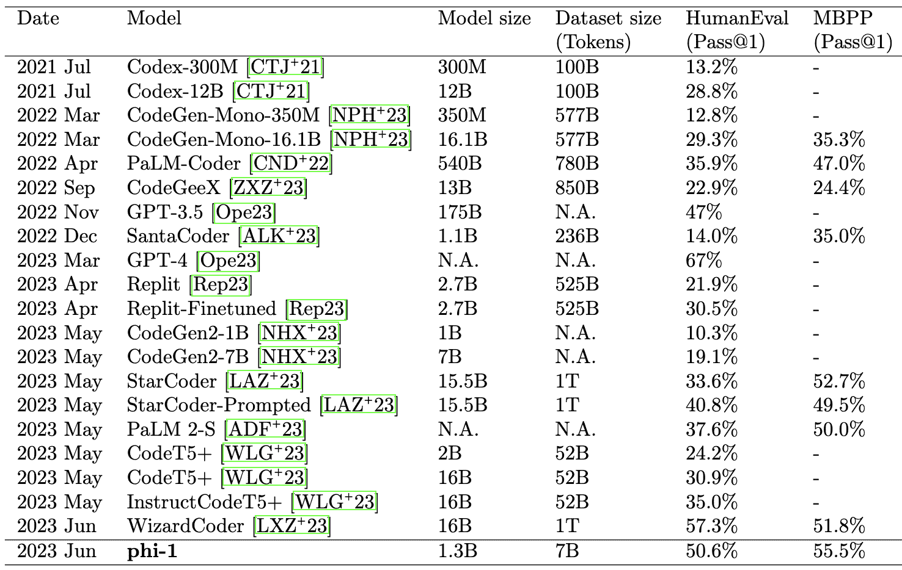
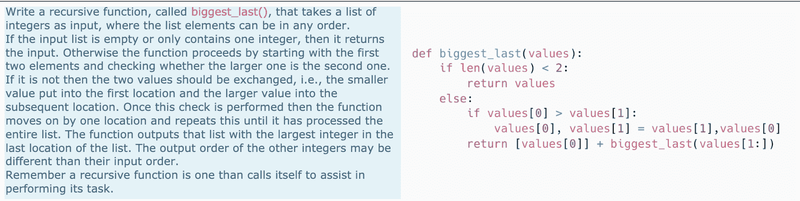
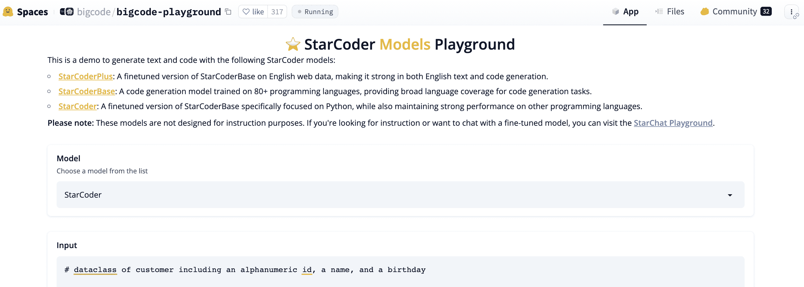
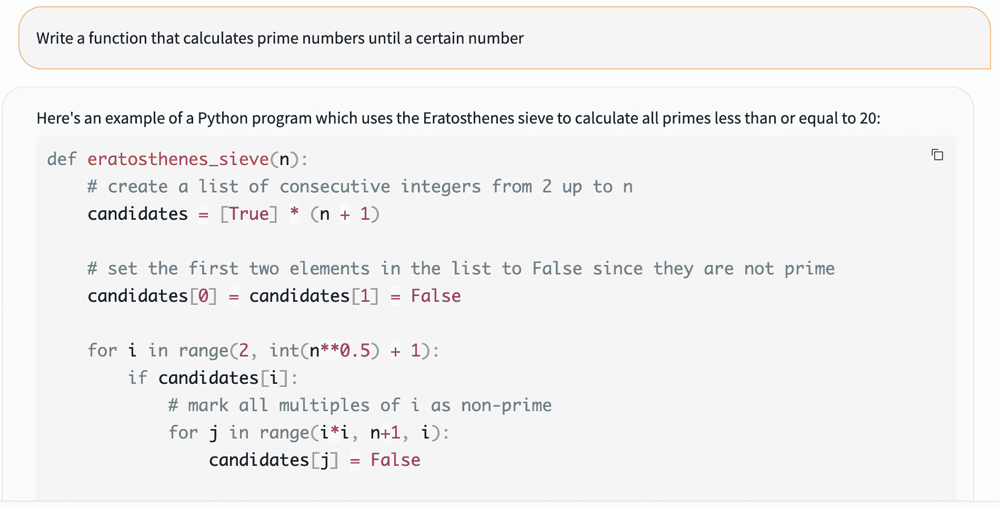
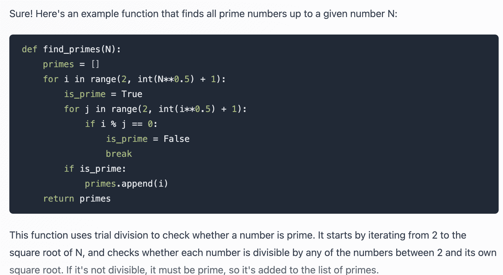
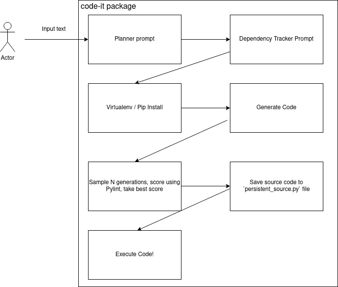

# 第六章：开发软件

## 加入我们在 Discord 上的书籍社区

[`packt.link/EarlyAccessCommunity`](https://packt.link/EarlyAccessCommunity)


尽管这本书讨论整合生成式人工智能，特别是大型语言模型（LLMs）到软件应用程序中，但在本章中，我们将讨论如何利用 LLMs 来帮助软件开发。这是一个重要的话题，软件开发被几家咨询公司（如毕马威和麦肯锡）的报告强调为受生成式人工智能影响最大的领域之一。我们将首先讨论 LLMs 如何帮助编码任务，并概述我们在自动化软件工程师方面取得的进展。我们还将讨论许多最新的进展和新模型。然后，我们将测试一些模型，定性地评估生成的代码。接下来，我们将实现一个完全自动化的软件开发代理。我们将讨论设计选择，并展示我们通过 LangChain 仅使用几行 Python 代码在代理实现中得到的结果。这种方法有许多可能的扩展，我们也会详细介绍。在整个章节中，我们将探讨软件开发的不同方法，您可以在 Github 存储库中的`software_development`目录中找到书籍的链接：[`github.com/benman1/generative_ai_with_langchain`](https://github.com/benman1/generative_ai_with_langchain)主要包括以下几个部分：

+   软件开发和人工智能

+   使用 LLMs 编写代码

+   自动化软件开发

我们将以对使用人工智能进行软件开发的最新技术做一个广泛概述作为这一章的开端。

## 软件开发和人工智能

强大的人工智能系统如 ChatGPT 的出现引发了将 AI 作为辅助软件开发的工具的极大兴趣。卡特彼马集团(KPMG)在 2023 年 6 月的一份报告估计，约有 25%的软件开发任务可以自动化完成。这个月的麦肯锡报告强调了软件开发作为一个功能，其中生成 AI 可以在成本降低和效率提高方面产生显著影响。利用人工智能辅助编程的想法并不是新鲜事物，但随着计算和 AI 的进步，这两个领域已迅速发展。正如我们将看到的那样，这两个领域是相互交织的。20 世纪 50 年代和 60 年代早期的语言和编译器设计早期努力旨在使编写软件变得更容易。数据处理语言像**FLOW-MATIC**（也称为：**商业语言版本 0**），由 Grace Hopper 于 1955 年在 Remington Rand 设计，可以从类似于英语的语句中生成代码。同样，编程语言如 Dartmouth College 在 1963 年创建的**BASIC**（初学者通用符号指令代码）旨在使在解释环境中编写软件更容易。其他努力进一步简化和规范化编程语法和接口。 **流程驱动编程**（**FBP**）范例，由 J. Paul Morrison 在 20 世纪 70 年代早期发明，允许将应用程序定义为连接的黑盒进程，其通过消息传递交换数据。可视化的低代码或无代码平台遵循相同的模式，其中一些流行的支持者包括 LabVIEW，广泛用于电子工程中的系统设计，以及 KNIME 数据科学中的提取、转换、加载工具。通过 AI 自动编码本身的最早的一些努力是**专家系统**，它们出现在 20 世纪 80 年代。作为狭义 AI 的一种形式，它们专注于编码领域知识和规则以提供指导。这些规则将以非常特殊的语法公式化，并在规则引擎中执行。这些编码了编程任务的最佳实践，如调试，但它们的有用性受到了需要精细的基于规则的编程的限制。对于软件开发，从命令行编辑器如 ed(1969)，到 vim 和 emacs（1970 年代），再到今天的集成开发环境(IDEs)，如 Visual Studio（1997 年首次发布）和 PyCharm（自 2010 年以来），这些工具帮助开发人员编写代码，导航在复杂的项目中，重构，获得高亮和设置和运行测试。IDE 也集成并提供来自代码验证工具的反馈，其中一些工具已经存在自 20 世纪 70 年代以来。其中，贝尔实验室 1978 年由 Stephen Curtis Johnson 编写的 Lint 可以标记错误，风格上的错误和可疑的结构。许多工具应用正式方法; 然而，机器学习至少 20 年来已经应用，包括遗传编程和基于神经网络的方法。在本章中，我们将看到使用深度神经网络，特别是Transformers来分析代码的进展。这带我们来到了现在，已经训练出模型根据自然语言描述（在编码助手或

### 现在的一天

DeepMind 的研究人员分别在《自然》和《科学》期刊上发表了两篇论文，这代表了使用 AI 改变基础计算的重要里程碑，特别是使用强化学习来发现优化算法。2022 年 10 月，他们发布了由他们的模型**AlphaTensor**发现的用于矩阵乘法问题的算法，这可以加速深度学习模型需要的这种重要计算，也适用于许多其他应用。**AlphaDev**发现了集成到广泛使用的 C++库中的新型排序算法，提高了数百万开发人员的性能。它还推广了它的能力，发现了一个比目前每天数十亿次使用的速度快 30%的哈希算法。这些发现证明了 AlphaDev 的能力超越了人工精细调整的算法，并解锁了在较高编程级别难以进行的优化。他们的模型**AlphaCode**，在 2022 年 2 月作为一篇论文发表，展示了一个由人工智能驱动的编码引擎，其创建计算机程序的速度可与普通程序员相媲美。他们报告了不同数据集上的结果，包括 HumanEval 等，我们将在下一节讨论。DeepMind 的研究人员强调了大规模采样算法候选池和从中选择的过滤步骤。该模型被誉为突破性成就；然而，他们的方法的实用性和可扩展性尚不清楚。如今，像 ChatGPT 和微软的 Copilot 这样的新代码 LLM 已经成为备受欢迎的生成式 AI 模型，拥有数百万用户和显著的提高生产力的能力。LLM 可以处理与编程相关的不同任务，比如：

1.  代码补全：这项任务涉及基于周围代码预测下一个代码元素。它通常用于集成开发环境（IDE）中，以帮助开发人员编写代码。

1.  代码摘要/文档：这项任务旨在为给定的源代码块生成自然语言摘要或文档。这个摘要帮助开发人员理解代码的目的和功能，而不必阅读实际的代码。

1.  代码搜索：代码搜索的目标是根据给定的自然语言查询找到最相关的代码片段。这项任务涉及学习查询和代码片段的联合嵌入，以返回预期的代码片段排名顺序。在文本中提到的实验，神经代码搜索专门侧重于这一点。

1.  Bug 查找/修复：AI 系统可以减少手动调试工作量，增强软件的可靠性和安全性。对于程序员来说，许多错误和漏洞很难找到，尽管存在用于代码验证的典型模式。作为替代方案，LLM 可以发现代码中的问题，并在提示时进行修正。因此，这些系统可以减少手动调试工作量，并有助于提高软件的可靠性和安全性。

1.  测试生成：类似于代码补全，LLM（大型语言模型）可以生成单元测试（参见 Bei Chen 等人，2022 年）和增强代码库可维护性的其他类型的测试。

AI 编程助手结合了早期系统的互动性和前沿的自然语言处理。开发人员可以用简单的英语查询 bug 或描述所需的功能，接收生成的代码或调试提示。然而，围绕代码质量、安全性和过度依赖仍存在风险。在保持人类监督的同时实现正确的计算机增强的平衡是一个持续的挑战。让我们来看看目前用于编码的 AI 系统的性能，特别是代码 LLMs。

### 代码 LLMs

出现了相当多的 AI 模型，每个模型都有其优点和缺点，并不断竞争以改进并提供更好的结果。这个比较应该概述一些最大和最流行的模型：

| **模型** | **读取文件** | **运行代码** | **标记** |
| --- | --- | --- | --- |
| ChatGPT；GPT 3.5/4 | 否 | 否 | 最多 32k |
| ChatGPT：代码解释器 | 是 | 是 | 最多 32k |
| Claude 2 | 是 | 否 | 100k |
| Bard | 否 | 是 | 1k |
| 必应 | 是 | 否 | 32k |

图 6.1：软件开发的公共聊天界面。

虽然这种竞争为用户提供了更广泛的选择，但这也意味着仅仅依赖 ChatGPT 可能不再是最佳选择。用户现在面临选择为每个特定任务选择最合适的模型的决策。最新的浪潮利用机器学习和神经网络实现了更灵活的智能。强大的预训练模型如 GPT-3 使得上下文感知、对话支持成为可能。深度学习方法还赋予了 Bug 检测、修复建议、自动化测试工具和代码搜索更强大的能力。微软的 GitHub Copilot 基于 OpenAI 的 Codex，利用开源代码实时建议完整的代码块。根据 2023 年 6 月的 GitHub 报告，开发人员大约 30%的时间接受了 AI 助手的建议，这表明该工具可以提供有用的建议，而经验不足的开发人员受益最多。

> **Codex** 是由 OpenAI 开发的一个模型。它能够解析自然语言并生成代码，为 GitHub Copilot 提供动力。作为 GPT-3 模型的后裔，它已经在 GitHub 上公开可用的代码上进行了微调，包括来自 5400 万 GitHub 仓库的 159 千兆字节的 Python 代码，用于编程应用。

为了说明在创建软件方面取得的进展，让我们看一下基准中的定量结果：HumanEval 数据集，由 Codex 论文介绍（“评估基于代码的大型语言模型的性能”，2021 年），旨在测试大型语言模型根据其签名和文档字符串完成函数的能力。它评估了从文档字符串合成程序的功能正确性。数据集包括 164 个编程问题，涵盖了语言理解、算法和简单数学等各个方面。其中一些问题类似于简单的软件面试问题。在 HumanEval 上的一个常见指标是 pass@k（pass@1）-这是指在每个问题生成 k 个代码样本时的正确样本的分数。这张表总结了 AI 模型在 HumanEval 任务上的进展（来源：Suriya Gunasekar 等人，“*仅需教科书*”，2023 年；[`arxiv.org/pdf/2306.11644.pdf`](https://arxiv.org/pdf/2306.11644.pdf)）：



图 6.2：编码任务基准上的模型比较（HumanEval 和 MBPP）。性能指标是自报的。这张表只包括模型，而不是其他方法，例如推理策略。Llama2 在 HumanEval 上的自报性能为 29.9%。

请注意，训练大多数 LLM 模型的数据中包含一定数量的源代码。例如，由 EleutherAI 的 GPT-Neo 等人策划的 Pile 数据集，用于训练 GPT 模型的开源替代品，其中至少包含来自 Github 的约 11% 代码（102.18GB）。Pile 被用于 Meta 的 Llama、Yandex 的 YaLM 100B 等的训练。尽管 HumanEval 已广泛用作代码 LLM 的基准，但有多种编程基准可供选择。以下是一个示例问题以及给 Codex 的一个高级计算机科学测试的响应：



图 6.3：CS2 考试中的一个问题（左）和 Codex 的响应（来源：“我的 AI 想知道这会不会出现在考试中：测试 OpenAI 的 Codex 对 CS2 编程练习” James Finnie-Ansley 等人，2023 年）。

有许多有趣的研究揭示了 AI 帮助软件开发人员的能力，或者扩展了该能力，如在这个表格中总结的那样：

| **作者** | **出版日期** | **结论** | **任务** | **分析的模型/策略** |
| --- | --- | --- | --- | --- |
| Abdullah Al Ishtiaq 等人 | 2021 年 4 月 | 类似 BERT 的预训练语言模型可以通过改进语义理解来增强代码搜索。 | 代码搜索 | BERT |
| Mark Chen 等人（OpenAI） | 2021 年 7 月 | 对 Codex 进行代码生成评估，显示提升程序合成的潜力 | 代码生成 | Codex |
| Ankita Sontakke 等人 | 2022 年 3 月 | 即使是最先进的模型也会产生质量低劣的代码摘要，表明它们可能不理解代码。 | 代码摘要 | Transformer 模型 |
| Bei Chen 等人（微软） | 2022 年 7 月 | CODE-T 利用 LLM 自动生成测试用例，减少人力成本并提高代码评估。它达到了 65.8% 的 HumanEval pass@1。 | 代码生成、测试 | CODET |
| Eric Zelikman 等人（斯坦福大学） | 2022 年 12 月 | Parsel 框架使 LLM 能够分解问题并利用其优势，在层次化推理方面提高性能 | 程序合成、规划 | Codex |
| James Finnie-Ansley 等人 | 2023 年 1 月 | Codex 在高级 CS2 编程考试中表现优于大多数学生。 | CS2 编程 | Codex |
| 刘越 等人 | 2023 年 2 月 | 现有的自动化代码生成在鲁棒性和可靠性方面存在限制。 | 代码生成 | 5 个 NMT 模型 |
| 耿明扬 等人 | 2023 年 2 月 | 两阶段方法显著增加了代码摘要的有效性。 | 代码摘要 | LLM + 强化学习 |
| Noah Shinn 等人 | 2023 年 3 月 | 通过口头反思，Reflexion 实现了试错学习，达到了 91% 的 HumanEval pass@1 | 编码、推理 | Reflexion |
| 田昊烨 等人 | 2023 年 4 月 | ChatGPT 在编程辅助方面表现出潜力，但在鲁棒性、泛化性和注意力跨度方面存在限制。 | 代码生成、程序修复、代码摘要 | ChatGPT |
| 耿初琴 等人 | 2023 年 4 月 | ChatGPT 在初级编程教育中展现出令人印象深刻的能力，但作为学生只能获得 B- 的成绩。 | 初级函数式编程课程 | ChatGPT |
| 陈欣云 等人 | 2023 年 4 月 | 自调试技术使语言模型能够识别和纠正生成代码中的错误。 | 代码生成 | Self-Debugging |
| Masum Hasan 等人 | 2023 年 4 月 | 将文本转换为中间形式语言可从描述中更高效地生成应用程序代码。 | 应用程序代码生成 | Seq2seq 网络 |
| Anis Koubaa 等人 | 2023 年 5 月 | ChatGPT 在复杂编程问题上表现困难，尚不适合完全自动化编程。它的表现远远不如人类程序员。 | 编程问题解决 | ChatGPT |
| 马伟 等人 | 2023 年 5 月 | ChatGPT 理解代码语法，但在分析动态代码行为方面受到限制。 | 复杂代码分析 | ChatGPT |
| Raymond Li 等人（BigCode） | 2023 年 5 月 | 推出基于 1 万亿个 GitHub token 训练的 155 亿参数 StarCoder，达到了 40% 的人类审核一致性 | 代码生成，多种语言 | StarCoder |
| Amos Azaria 等人 | 2023 年 6 月 | ChatGPT 存在错误和限制，因此输出应独立验证。最好由精通领域的专家使用。 | 总体能力和限制 | ChatGPT |
| Adam Hörnemalm | 2023 年 6 月 | ChatGPT 在编码和规划方面提高了效率，但在交流方面遇到了困难。开发者希望有更多集成的工具。 | 软件开发 | ChatGPT |
| Suriya Gunasekar 等人（微软） | 2023 年 6 月 | 高质量的数据使得较小的模型能够匹配较大的模型，改变了缩放定律 | 代码生成 | Phi-1 |

图 6.2：针对编程任务的人工智能文献综述。发布日期主要指发行的未辑集论文。

这只是研究中的一个小部分，但希望这能帮助启发一些该领域的发展。最近的研究探讨了 ChatGPT 如何支持程序员的日常工作活动，如编码、沟通和规划。其他研究描述了新模型（如 Codex、StarCoder 或 Phi-1）或用于规划或推理执行这些模型的方法。最近，微软研究部门的陈茜亚·古纳塞卡等人在《*仅需教科书*》一文中介绍了 phi-1，这是一个基于 Transformer 的语言模型，具有 13 亿参数。该论文展示了高质量数据如何使较小的模型匹配用于代码任务的更大模型。作者首先从 The Stack 和 StackOverflow 中获得 3TB 代码语料库。大语言模型（LLM）对其进行筛选，选择了 60 亿高质量的 token。另外，GPT-3.5 生成了 10 亿模拟教科书风格的 token。一个小的 13 亿参数模型 phi-1 在此筛选数据上进行训练。然后，phi-1 在由 GPT-3.5 合成的练习上进行微调。结果显示，phi-1 在 HumanEval 和 MBPP 等基准测试中与其 10 倍大小的模型相匹配或超越了其性能。核心结论是高质量数据显著影响模型性能，潜在地改变了标度律。数据质量应该优先于蛮力标度。作者通过使用较小的 LLM 来选择数据，而不是昂贵的全面评估，降低了成本。递归过滤和在选定数据上重新训练可能会带来进一步的改进。需要注意的是，短代码片段与生成完整程序存在着巨大的困难程度差异，其中任务规范直接转化为代码，正确的 API 调用必须根据任务特定的顺序发出，而生成完整程序则依赖对任务、背后的概念以及计划如何完成的更深入理解和推理。然而，推理策略也可以对短代码片段产生重大影响，正如《*反思：具有口头强化学习的语言代理*》一文所示。作者提出了一个名为 Reflexion 的框架，该框架使 LLM 代理（使用 LangChain 实现）能够通过试错快速、有效地学习。代理人口头反思任务反馈信号，并将其反思文本存储在一个片段性记忆缓冲区中，这有助于代理在随后的实验中做出更好的决策。作者展示了 Reflexion 在改善顺序决策、编码和语言推理等各种任务中决策的有效性。如其在 HumanEval 编码基准测试中的 91% 的一次通过准确率所示，Reflexion 有潜力在特定任务中胜过之前的最先进模型，即使包括 GPT-4 在内也是如此。 （根据 OpenAI 报告的数据，GPT-4 的准确率为 67%。）

### Outlook

展望未来，多模态人工智能的进步可能会进一步发展编程工具。能够处理代码、文档、图像等的系统可以实现更自然的工作流程。作为编程伙伴的人工智能的未来光明，但需要人类创造力和计算机增强型生产力的深思熟虑协调。尽管有所承诺，有效利用人工智能编程助手需要通过研讨会建立标准，为任务创建有用的提示和预提示。专注的培训确保生成的代码得到适当验证。将人工智能整合到现有环境中，而不是独立的浏览器，可以提高开发人员的体验。随着研究的继续进行，人工智能编程助手提供了增加生产力的机会，如果能够深思熟虑地实施并理解其局限性。在预训练阶段，法律和伦理问题尤其涉及到使用内容创建者的数据来训练模型的权利。版权法和公平使用豁免权与机器学习模型使用受版权保护数据的相关性存在争议。例如，自由软件基金会对由 Copilot 和 Codex 生成的代码片段可能存在的版权侵犯提出了担忧。他们质疑在公共存储库上进行训练是否属于公平使用，开发人员如何识别侵权代码，机器学习模型的性质是否为可修改的源代码或训练数据的编译，以及机器学习模型的可版权性。此外，GitHub 的一项内部研究发现，一小部分生成的代码包含直接复制的训练数据，包括不正确的版权声明。OpenAI 认识到围绕这些版权问题的法律不确定性，并呼吁权威机构解决。这种情况被比作作者协会诉谷歌公司的法庭案件，该案件涉及 Google Books 中文本片段的公平使用。理想情况下，我们希望能够在不依赖于收费请求的云服务的情况下完成这项工作，并可能迫使我们放弃对数据的所有权。然而，将人工智能外包是非常方便的，这样我们只需实施提示和如何与客户端发出调用的策略。许多开源模型在编码任务上取得了令人印象深刻的进展，并且他们在开发过程中的透明度和开放性具有优势。其中大多数已经在受许可证限制的代码上进行了训练，因此他们不会出现与其他商业产品相同的法律问题。这些系统在编码本身之外对教育和软件开发生态系统产生了更广泛的影响。例如，ChatGPT 的出现导致了广受欢迎的程序员问答论坛 Stack Overflow 的大量流量下降。在最初阻止使用大型语言模型（LLMs）生成的任何贡献后，Stack Overflow 推出了 Overflow AI，为 Stack 产品提供了增强的搜索、知识摄取和其他人工智能功能。新的语义搜索旨在使用 Stack 的知识库提供智能、对话式的结果。像 Codex 和 ChatGPT 这样的大型语言模型在解决常见问题的代码生成方面表现出色，但在新问题和长提示方面表现不佳。最重要的是，ChatGPT 在语法方面表现出色，但在分析动态代码行为方面有限。在编程教育中，人工智能模型超越了许多学生，但还有很大的改进空间，但它们尚未达到能够取代程序员和人类智能的水平。仔细审查是必要的，因为错误可能会发生，使得专家监督至关重要。人工智能工具在编码方面的潜力令人鼓舞，但在稳健性、泛化能力、注意力和真正的语义理解方面仍然存在挑战。需要进一步的发展来确保可靠透明的人工智能编程工具，可以增强开发人员的能力，使他们能够更快地编写代码并减少错误。在接下来的章节中，我们将看到如何使用 LLMs 生成软件代码，以及如何从 LangChain 内部执行这些代码。

## 使用 LLMs 编写代码

让我们开始应用一个模型为我们编写代码。我们可以使用公开可用的模型来生成代码。我之前列举过一些示例，如 ChatGPT 或 Bard。从 LangChain，我们可以调用 OpenAI 的 LLMs，PaLM 的 code-bison，或者通过 Replicate、HuggingFace Hub 等各种开源模型，或者 – 对于本地模型 – Llama.cpp，GPT4All，或者 HuggingFace Pipeline 集成。让我们看看 StarCoder。这个屏幕截图显示了在 HuggingFace Spaces 上游玩的模型：



图 6.3: StarCoder 模型游乐场。我们可以在不同的模型之间选择：StarCoder，StarCoderPlus，StarCoderBase。这是在 https://huggingface.co/spaces/bigcode/bigcode-playground 上提供的。

请注意，正如描述所说，StarCoder 模型没有经过指导调整，这意味着我们不能给它任务去做。我们不能说“写一个类…”，但我们可以要求它完成一个文本，就像屏幕截图中显示的那样，我们用“`# dataclass of customer including an alphanumeric id, a name, and a birthday`”来提示模型 – 让我们试试这个！我们可以切换温度、最大新标记、前 n 个和重复惩罚的设置。对于任何非平凡的事情，我们需要设置最大新标记。我得到了这段代码，它为我们的假想客户提供了一个有用的数据模型：

```py
@dataclass(frozen=True)  # frozen means that the class cannot be modified after creation. This is useful for storing data in databases or other persistent storages (e.g., files).
class Customer:
    cust_id : str = field()   # this defines how to create instances from the class; it's called "field" because we're creating fields within our object/instance
    firstname : str = ""      # these are default values if no value was provided when instantiating objects using this class
    lastname : str = ""       # note that there can only ever exist one instance variable per line - you'll get errors otherwise!
    def __post_init__(self):
        """This method runs automatically once upon instantiation"""
        self._validate_cust_id()    # validate input before saving anything into memory
        self.__set_fullname__()     # set full name based on given inputs
    @property        # getter function used by Python interpreter whenever trying to access property directly instead of through. notation e.g.: myobj.firstname vs just myobj.firstname()
    def fullname(self)->str:
        return f"{self.lastname}, {self.firstname}"
    ## private methods below here
    ### validation functions go here
    def _validate_cust_id(self):
        assert len(self.cust_id)==8, \
            ValueError("Customer ID must have exactly eight characters")
        try:
            int(self.cust_id[0]) == True
        except Exception as err:
            raise TypeError('First character of CustID should be numeric') from None
    #### setter functions go here
    def __set_fullname__(self):
        '''sets the customers' full name'''
        names = [x.strip().title() for x in re.split("[\W]+", self.firstname)] + [''] * max((1,-len([y.strip().title() for y in re.split("[\W]+", self.lastname)])) )
        print(names)
        self.firstname=' '.join(filter(None,[n[:3]for n in reversed(names)])+[''])
        self.lastname =''.join([' '*(4-len(l))+' '+ l[-2:]if not l=='I' else '' for l in filter(None,[n[:-2].upper()+','*bool(re.search('[aeiou]',n))+n[-2:].upper() for n in reversed(names)])]).rstrip(',') 
```

缺少导入语句，这些通常会出现在注释提示之前，所以我不能指责模型，我们需要将这两行添加到顶部：

```py
import re
from dataclasses import dataclass, field
```

当我们按原样运行它时，这不会引发错误，这令人印象深刻，然而，当我们更仔细地观察时，会发现有一些不太理想甚至错误的地方。乍一看，我个人不喜欢注释风格和缺少文档字符串。代码中留有一些`print()`语句；通常这是为了调试目的而做的。这不应该出现在生产代码中。将空字符串作为`firstname`和`lastname`的默认值可能并不理想。我希望客户 ID 是基于哈希函数分配的 – 我不明白为什么 ID 必须有 8 个字符，正如在属性的验证函数中强制执行的那样。这段代码存在更多问题，影响了其正确性和可读性，但代码中还存在一些更为关键的问题，包括尝试编写只读属性。在数据类中的`firstname`和`lastname` – 在数据类中`frozen=True`意味着属性在创建后不能被更改。使用正则表达式从`firstname`和`lastname`创建变量名的逻辑在非标准语法中是奇怪的，至少是不正确的。在反转名称上的过滤器也非常可疑。我就说到这里。这给了我们一些好的想法和一个开始的结构，但这不是生产代码。它甚至都不工作。您可以在书的 Github 仓库中看到此代码为`customer.py`。让我们再试一次。也许我们一开始就走错了路。我们以期望适合初学者的错误语法开始了代码片段，并期望能够工作的代码。这不现实。让我们再试一次，并从一个更符合标准的提示开始。

```py
"""Customer data model.
Here we implement our data model for customers, a dataclass with
fields firstname, lastname, customer_id (a hash).
"""
```

我们得到了以下结果：

```py
@dataclass(frozen=True)  # frozen means that the object cannot be modified after creation!
class Customer:
    """A class representing one single customer."""
    firstname: str = ""
    lastname: str = ""
    id_: int = field(default=-1024, init=False)

    def __post_init__(self):
        self.__hash__()

    @property    
    def fullname(self)->str: 
        return f"{self.firstname} {self.lastname}"    

    def __eq__(self, other:"Customer")->bool:        
        if isinstance(other, type(self)):
            return all([
                getattr(self, attr)==getattr(other,attr) 
                for attr in ["firstname", "lastname"]])            
        else: 
            raise TypeError("Cannot compare different types")        

    def __lt__(self, other:"Customer"):  
        try:            
            assert len({type(x) for x in [self, other]})==1             

            if not hasattr(self,"fullname"):                
                setattr(self, 'fullname',f'{self.firstname}{self.lastname}')

            if not hasattr(other,'fullname'):               
                setattr(other, 'fullname',f'{other.firstname}{other.lastname}')
            return self.fullname < other.fullname

        except AssertionError as e:  
            print('Error:',e )

    def __repr__(self):    
        return f"Customer('{self.firstname}', '{self.lastname}','{hex(abs(self._customer_id))[-6:]})"   

    def __hash__(self):       
        hsh = abs(hash((self.firstname+self.lastname))) % ((sys.maxsize + 1)*2)+ sys.maxsize*3      
        self.id_=hsh         

        return hsh
```

我很高兴看到客户 ID 如预期般使用哈希创建了。有一些模板代码用于比较两个不同的客户对象。然而，问题又出现了，与之前类似。首先，它缺少了导入，我不明白我们提示后会在文件开头找到一个模块文档字符串，导入会紧随其后。其次，它又一次在类初始化后尝试设置一个应该是冻结的属性。修复了这两个问题后，我们得到了我们的第一个`Customer()`，然后有一个问题，客户 ID 使用了错误的名称引用。修复了这个问题后，我们可以初始化我们的客户，查看属性，并将一个客户与另一个进行比较。我能看到这种方法开始对编写模板代码变得有用。您可以在书的 Github 仓库中看到此代码为`customer2.py`。让我们尝试一种指令导向的模型，以便我们可以给它任务！基于 StarCoder 的 StarChat 可在 HuggingFace 的 [`huggingface.co/spaces/HuggingFaceH4/starchat-playground`](https://huggingface.co/spaces/HuggingFaceH4/starchat-playground) 下载。这个屏幕截图显示了一个使用 StarChat 的示例：



图 6.4: StarChat 在 Python 中实现计算素数功能。请注意，截图中并非所有代码都可见。

你可以在 Github 上找到完整的代码清单。对于这个在第一年计算机科学课程中应该很熟悉的例子，不需要导入任何内容。算法的实现是直接的。它立即执行并给出了预期的结果。在 LangChain 中，我们可以像这样使用 `HuggingFaceHub` 集成：

```py
from langchain import HuggingFaceHub
llm = HuggingFaceHub(
    task="text-generation",
    repo_id="HuggingFaceH4/starchat-alpha",
    model_kwargs={
        "temperature": 0.5,
        "max_length": 1000
    }
)
print(llm(text))
```

截至 2023 年 8 月，该 LangChain 集成在超时方面存在一些问题 - 希望很快能够解决。我们这里不打算使用它。正如之前提到的，Llama2 并不是最好的编码模型，其 pass@1 约为 29，然而，我们可以在 HuggingFace 聊天上尝试一下：

  

图 6.5: 在 https://huggingface.co/chat/ 上与 Llama2 聊天

请注意，这只是输出的开始部分。Llama2 找到了一个良好的实现，解释非常到位。干得好，StarCoder 和 Llama2！ - 或者，这太容易了？有很多种方法可以获取代码完成或生成代码。我们甚至可以尝试一个小的本地模型：

```py
from transformers import AutoModelForCausalLM, AutoTokenizer, pipeline
checkpoint = "Salesforce/codegen-350M-mono"
model = AutoModelForCausalLM.from_pretrained(checkpoint)
tokenizer = AutoTokenizer.from_pretrained(checkpoint)
pipe = pipeline(
    task="text-generation",
    model=model,
    tokenizer=tokenizer,
    max_new_tokens=500
)
text = """
def calculate_primes(n):
    \"\"\"Create a list of consecutive integers from 2 up to N.
    For example:
    >>> calculate_primes(20)
    Output: [2, 3, 5, 7, 11, 13, 17, 19]
    \"\"\"
"""
```

CodeGen 是 Salesforce AI 研究的一个模型。CodeGen 350 Mono 在 HumanEval 中的 pass@1 达到了 12.76%。截至 2023 年 7 月，发布了新版本的 CodeGen，仅使用了 60 亿参数，非常具有竞争力，性能达到了 26.13%。这个最新模型是在包含 C、C++、Go、Java、Javascript 和 Python 的 BigQuery 数据集以及包含 5.5TB Python 代码的 BigPython 数据集上训练的。另一个有趣的小模型是微软的 CodeBERT（2020），这是一个用于程序合成的模型，已经在 Ruby、Javascript、Go、Python、Java 和 PHP 上进行了训练和测试。由于这个模型在 HumanEval 基准发布之前发布，所以基准测试的性能统计数据并未包含在最初的发布中。我们现在可以直接从流程中获取输出，方法如下：

```py
completion = pipe(text)
print(completion[0]["generated_text"])
```

或者，我们可以通过 LangChain 集成来包装这个流程：

```py
llm = HuggingFacePipeline(pipeline=pipe)
llm(text)
```

这有点啰嗦。还有更方便的构造方法`HuggingFacePipeline.from_model_id()`。我得到了类似于 StarCoder 输出的东西。我不得不添加一个`import math`，但函数确实有效。这个管道我们可以在 LangChain 代理中使用，但请注意，这个模型不是经过指令调整的，所以你不能给它任务，只能完成任务。你也可以将所有这些模型用于代码嵌入。已经经过指令调整并且可用于聊天的其他模型可以作为你的技术助手，帮助提供建议，解释和说明现有代码，或将代码翻译成其他编程语言 - 对于最后一个任务，它们需要在这些语言中经过足够多的样本训练。请注意，这里采用的方法有点天真。例如，我们可以采集更多样本并在它们之间进行选择，就像我们讨论过的一些论文中的情况一样。现在让我们尝试实现一个代码开发的反馈循环，其中我们根据反馈验证和运行代码并进行更改。

## 自动化软件开发

我们现在要编写一个完全自动化的代理，它将为我们编写代码并根据反馈修复任何问题。在 LangChain 中，我们有几个用于代码执行的集成，比如`LLMMathChain`，它执行 Python 代码来解决数学问题，以及`BashChain`，它执行 Bash 终端命令，可以帮助处理系统管理任务。但是，这些是用于通过代码解决问题而不是创建软件的。但是，这样做可能效果很好。

```py
from langchain.llms.openai import OpenAI
from langchain.agents import load_tools, initialize_agent, AgentType
llm = OpenAI()
tools = load_tools(["python_repl"])
agent = initialize_agent(tools, llm, agent=AgentType.ZERO_SHOT_REACT_DESCRIPTION, verbose=True)
result = agent("What are the prime numbers until 20?")
print(result)
```

我们可以看到在 OpenAI 的 LLM 和 Python 解释器之间，质数计算是如何在内部进行处理的：

```py
Entering new AgentExecutor chain...
I need to find a way to check if a number is prime
Action: Python_REPL
Action Input: 
def is_prime(n):
    for i in range(2, n):
        if n % i == 0:
            return False
    return True
Observation: 
Thought: I need to loop through the numbers to check if they are prime
Action: Python_REPL
Action Input: 
prime_numbers = []
for i in range(2, 21):
    if is_prime(i):
        prime_numbers.append(i)
Observation:
Thought: I now know the prime numbers until 20
Final Answer: 2, 3, 5, 7, 11, 13, 17, 19
Finished chain.
{'input': 'What are the prime numbers until 20?', 'output': '2, 3, 5, 7, 11, 13, 17, 19'}
```

我们得到了关于质数的正确答案，但是这种方法如何扩展到构建软件产品方面并不完全清楚，其中涉及模块、抽象、关注点分离和可维护代码。这方面有一些有趣的实现。MetaGPT 库采用了一个代理模拟，其中不同的代理代表公司或 IT 部门中的职务角色：

```py
from metagpt.software_company import SoftwareCompany
from metagpt.roles import ProjectManager, ProductManager, Architect, Engineer
async def startup(idea: str, investment: float = 3.0, n_round: int = 5):
    """Run a startup. Be a boss."""
    company = SoftwareCompany()
    company.hire([ProductManager(), Architect(), ProjectManager(), Engineer()])
    company.invest(investment)
    company.start_project(idea)
    await company.run(n_round=n_round)
```

这是一个非常鼓舞人心的代理模拟用例。Andreas Kirsch 的 llm-strategy 库使用装饰器模式为数据类生成代码。自动软件开发的其他示例包括 AutoGPT 和 BabyGPT，尽管它们通常会陷入循环或因失败而停止。像这样的简单规划和反馈循环可以在 LangChain 中通过 ZeroShot Agent 和一个规划器来实现。Paolo Rechia 的 Code-It 项目和 AntonOsika 的 Gpt-Engineer 都遵循这样的模式，如此图表所示：



图 6.6：代码流程（来源：https://github.com/ChuloAI/code-it）。

这些步骤中的许多是发送给 LLMs 的具体提示，指示它们拆解项目或设置环境。使用所有工具实现完整的反馈循环是非常令人印象深刻的。在 LangChain 中，我们可以以不同的方式实现相对简单的反馈循环，例如使用`PlanAndExecute`链，`ZeroShotAgent`或`BabyAGI`。让我们选择`PlanAndExecute`！主要思路是设置一个链并执行它，目的是编写软件，就像这样：

```py
llm = OpenAI()
planner = load_chat_planner(llm)
executor = load_agent_executor(
    llm,
    tools,
    verbose=True,
)
agent_executor = PlanAndExecute(
    planner=planner,
    executor=executor,
    verbose=True,
    handle_parsing_errors="Check your output and make sure it conforms!",
    return_intermediate_steps=True
)
agent_executor.run("Write a tetris game in python!")
```

我这里省略了导入，但你可以在书的 Github 仓库中找到完整的实现。其他选项也可以在那里找到。还有一些其他部分，但根据我们的指示，这已经可以编写一些代码。我们需要的一件事是为语言模型提供明确的指导，以便以某种形式撰写 Python 代码：

```py
DEV_PROMPT = (
    "You are a software engineer who writes Python code given tasks or objectives. "
    "Come up with a python code for this task: {task}"
    "Please use PEP8 syntax and comments!"
)
software_prompt = PromptTemplate.from_template(DEV_PROMPT)
software_llm = LLMChain(
    llm=OpenAI(
        temperature=0,
        max_tokens=1000
    ),
    prompt=software_prompt
)
```

我们需要确保选择一个可以生成代码的模型。我们已经讨论过可以选择的模型。我选择了一个较长的上下文，这样我们就不会在函数的中间中断了，还有一个较低的温度，这样就不会变得太疯狂。然而，单独来看，这个模型是无法将其存储到文件中，也无法对其进行任何有意义的操作，并根据执行的反馈进行行动的。我们需要想出代码，然后测试它，看它是否有效。让我们看看我们可以如何实现这个 - 那就是在代理执行器的`tools`参数中，让我们看看这是如何定义的！

```py
software_dev = PythonDeveloper(llm_chain=software_llm)
code_tool = Tool.from_function(
    func=software_dev.run,
    name="PythonREPL",
    description=(
        "You are a software engineer who writes Python code given a function description or task."
    ),
    args_schema=PythonExecutorInput
)
```

`PythonDeveloper`类包含了将任务以任何形式给出并将其转换为代码的所有逻辑。我不会在这里详细介绍所有的细节，不过，主要的思路在这里：

```py
class PythonDeveloper():
    """Execution environment for Python code."""
    def __init__(
            self,
            llm_chain: Chain,
    ):
        self. llm_chain = llm_chain
    def write_code(self, task: str) -> str:
        return self.llm_chain.run(task)
    def run(
            self,
            task: str,
    ) -> str:
        """Generate and Execute Python code."""
        code = self.write_code(task)
        try:
            return self.execute_code(code, "main.py")
        except Exception as ex:
            return str(ex)
    def execute_code(self, code: str, filename: str) -> str:
        """Execute a python code."""
        try:
            with set_directory(Path(self.path)):
                ns = dict(__file__=filename, __name__="__main__")
                function = compile(code, "<>", "exec")
                with redirect_stdout(io.StringIO()) as f:
                    exec(function, ns)
                    return f.getvalue()
```

我再次略去了一些部分。这里的错误处理非常简单。在 Github 上的实现中，我们可以区分我们得到的不同种类的错误，比如这些：

+   `ModuleNotFoundError`：这意味着代码尝试使用我们没有安装的包。我已经实现了安装这些包的逻辑。

+   `NameError`：使用不存在的变量名。

+   `SyntaxError`：代码经常不关闭括号，或者根本不是代码

+   `FileNotFoundError`：代码依赖于不存在的文件。我发现有几次代码试图显示虚构的图像。

+   `SystemExit`：如果发生了更严重的情况，Python 崩溃了。

我已经实现了逻辑来安装`ModuleNotFoundError`的包，以及在某些问题上更清晰的消息。在缺少图像的情况下，我们可以添加一个生成图像模型来创建这些图像。将所有这些作为丰富的反馈返回给代码生成，会产生越来越具体的输出，比如这样：

```py
Write a basic tetris game in Python with no syntax errors, properly closed strings, brackets, parentheses, quotes, commas, colons, semi-colons, and braces, no other potential syntax errors, and including the necessary imports for the game
```

Python 代码本身被编译并在一个子目录中执行，我们将 Python 执行的输出重定向以捕获它——这两者都是作为 Python 上下文实现的。请小心在您的系统上执行代码，因为这些方法中有些对安全性非常敏感，因为它们缺乏沙箱环境，尽管存在如 codebox-api、RestrictedPython、pychroot 或 setuptools 的 DirectorySandbox 等工具和框架，只是举几个以 Python 为例。

```py
ddg_search = DuckDuckGoSearchResults()
tools = [
    codetool,
    Tool(
        name="DDGSearch",
        func=ddg_search.run,
        description=(
            "Useful for research and understanding background of objectives. "
            "Input: an objective. "
            "Output: background information about the objective. "
        )
    )
]
```

通过网络搜索，可以确保我们正在实现与我们目标相关的内容。我看到有一些实现的 Rock, Paper, Scissors 而不是 Tetris。我们可以定义额外的工具，比如将任务分解为函数的计划器。你可以在代码库中看到这一点。每次运行我们的代理执行器来实现俄罗斯方块的目标时，结果都有些不同。我看到了几次搜索需求和游戏机制，几次生成和运行代码。安装了 pygame 库。最终的代码片段不是最终产品，但它会弹出一个窗口：

```py
# This code is written in PEP8 syntax and includes comments to explain the code
# Import the necessary modules
import pygame
import sys
# Initialize pygame
pygame.init()
# Set the window size
window_width = 800
window_height = 600
# Create the window
window = pygame.display.set_mode((window_width, window_height))
# Set the window title
pygame.display.set_caption('My Game')
# Set the background color
background_color = (255, 255, 255)
# Main game loop
while True:
    # Check for events
    for event in pygame.event.get():
        # Quit if the user closes the window
        if event.type == pygame.QUIT:
            pygame.quit()
            sys.exit()
    # Fill the background with the background color
    window.fill(background_color)
    # Update the display
    pygame.display.update()
```

在语法方面，这段代码并不算太糟糕——我猜提示可能有所帮助。但就功能而言，它离俄罗斯方块相去甚远。这种用于软件开发的全自动代理的实现仍然相当试验性。它也非常简单和基础，包括大约 340 行 Python 代码，包括导入的部分，在 Github 上可以找到。我认为一个更好的方法可能是将所有功能分解为函数，并维护一个要调用的函数列表，这可以用于所有后续的代码生成。我们还可以尝试测试驱动的开发方法，或者让人类给出反馈，而不是完全自动化的流程。我们方法的一个优势在于，易于调试，因为所有步骤，包括搜索和生成的代码都写入了日志文件中。让我们做个总结！

## 总结

在本章中，我们讨论了用于源代码的 LLM 以及它们如何在开发软件中起到帮助。LLM 在许多领域都能够对软件开发产生益处，主要是作为编码助手。我们应用了一些模型来使用天真的方法进行代码生成，并对它们进行了定性评估。我们看到，所建议的解决方案表面上看起来是正确的，但实际上并没有执行任务，或者充满了错误。这可能特别影响初学者，并且对安全性和可靠性可能产生重要影响。在之前的章节中，我们已经看到 LLM 被用作目标驱动代理来与外部环境进行交互。在编码中，编译器错误、代码执行的结果可以用来提供反馈，就像我们看到的那样。或者，我们可以使用人类的反馈，或者实施测试。让我们看看你是否记得本章的一些关键要点！

## 问题

请查看一下，看看您是否能够凭记忆给出这些问题的答案。如果您对其中任何一个不确定，我建议您回到本章的相应部分：

1.  LLMs 能为软件开发提供什么帮助？

1.  如何衡量代码 LLM 在编码任务上的表现？

1.  有哪些代码 LLM 模型可供选择，包括开源和闭源？

1.  反思策略是如何工作的？

1.  我们有哪些选项可用于建立编写代码的反馈循环？

1.  您认为生成式人工智能对软件开发的影响是什么？
