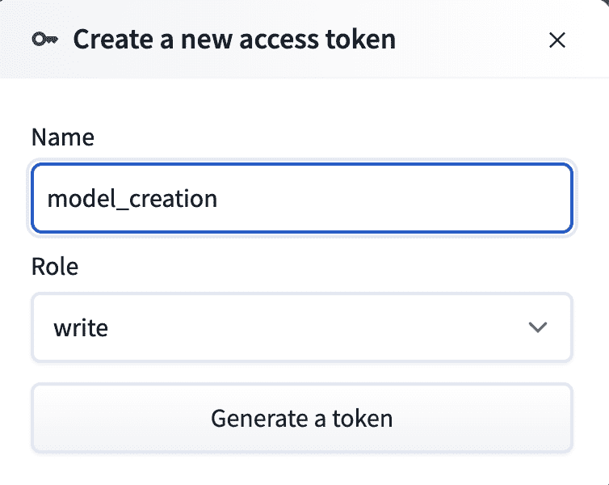
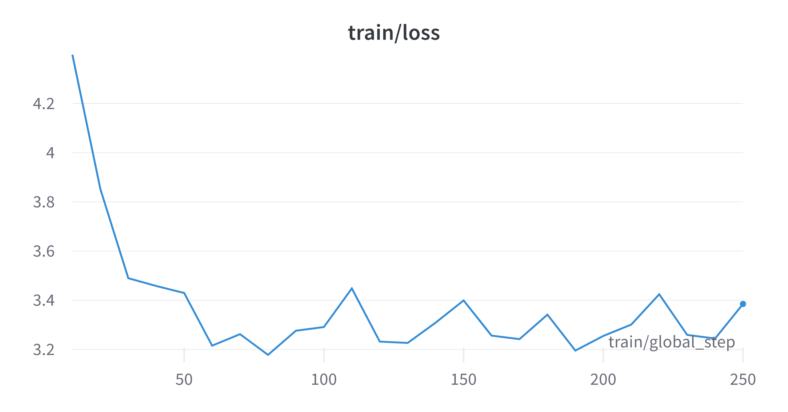
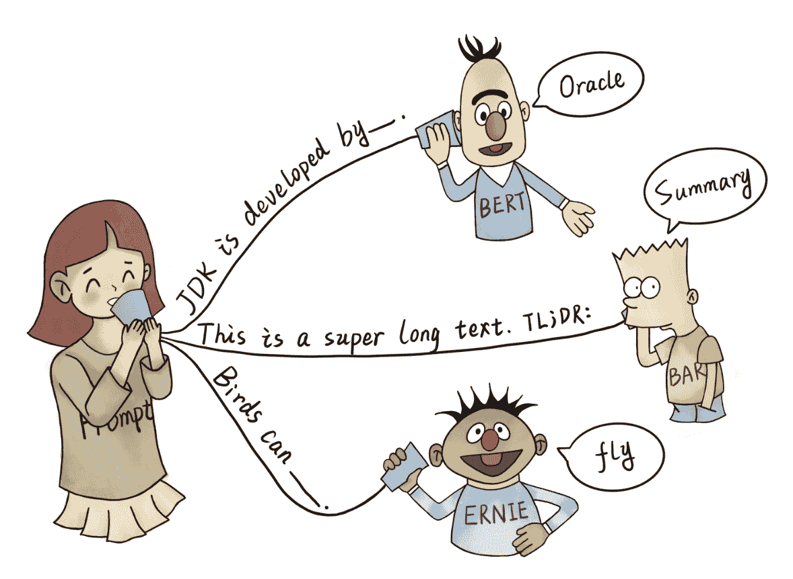

# 第八章：自定义 LLMs 及其输出

## 在 Discord 上加入我们的书籍社区

[`packt.link/EarlyAccessCommunity`](https://packt.link/EarlyAccessCommunity)


本章主要讨论改进大型语言模型（LLMs）在复杂推理和问题解决任务等特定情况下的可靠性和性能的技术和最佳实践。一般来说，使模型适应特定任务或确保模型输出与我们期望的一致的过程称为条件。在本章中，我们将讨论微调和提示作为条件的方法。微调涉及在特定任务或与所需应用相关的数据集上训练预训练基础模型。这个过程允许模型适应并在预期用例中变得更准确和上下文对齐。同样，通过在推断时提供额外的输入或上下文，大型语言模型（LLMs）可以生成适合特定任务或风格的文本。提示设计对于释放 LLM 的推理能力，模型和提示技术未来进展的潜力非常重要，这些原则和技术构成了研究人员和从业者使用大型语言模型的宝贵工具包。了解 LLMs 如何逐个标记地生成文本有助于创建更好的推理提示。提示仍然是一个经验性的艺术——通常需要尝试各种变化来看看什么有效。但一些提示工程的见解可以在模型和任务之间转移。我们将讨论 LangChain 中的工具，以实现高级提示工程策略，如少样本学习、动态示例选择和链式推理。在本章的整个过程中，我们将使用 LLMs 进行微调和提示，您可以在书的 Github 存储库的`notebooks`目录中找到，网址是[`github.com/benman1/generative_ai_with_langchain`](https://github.com/benman1/generative_ai_with_langchain)主要章节包括：

+   条件和对齐

+   微调

+   提示工程

让我们首先讨论条件和对齐，为什么重要，以及如何实现它。

## 条件和对齐

在生成式人工智能模型的背景下，"alignment" 意味着确保这些模型的输出与人类的价值观、意图或期望结果一致。它涉及指导模型的行为与在特定上下文中被认为道德、适当或相关的内容保持一致。"alignment" 概念对于避免生成可能存在偏见、有害或偏离预期目的的输出至关重要。解决"alignment" 问题需要注意训练数据中存在的偏见，涉及人类审阅者的反馈循环，在训练/微调阶段改进客观函数，利用用户反馈，并在部署过程中持续监测以确保持续对齐。一个可能想对大型语言模型进行条件的原因有几个。第一个是控制输出的内容和风格。例如，根据某些关键词或属性如正式程度进行条件，可以产生更相关和高质量的文本。条件还包括安全措施，以防止生成恶意或有害内容。例如，避免生成误导性信息、不当建议或潜在危险指示，或者更一般地对齐模型与某些价值观。对大型语言模型进行条件的潜在好处很多。通过提供更具体和相关的输入，我们可以得到符合我们需求的输出。例如，在客服聊天机器人中，对模型进行条件，允许它生成准确解决用户问题的回应。条件还有助于通过限制模型创造性在特定边界内来控制有偏见或不当的输出。此外，通过对大型语言模型进行条件，我们可以使它们更可控和适应性更强。我们可以根据我们的需求对其进行微调和塑造行为，并创建在特定领域如法律建议或技术写作中可靠的人工智能系统。然而，也有潜在的不利因素需要考虑。过于强烈地对模型进行条件可能导致过拟合，导致模型过分依赖特定输入，在不同环境中难以产生创造性或多样化的输出。此外，应该有责任地利用条件，因为大型语言模型有放大训练数据中存在偏见的倾向。在对这些模型进行条件时，必须小心不要加剧与偏见或有争议话题相关的问题。

> **对齐的好处** 包括：

+   增强用户体验：对齐的模型生成与用户查询或提示相关的输出。

+   建立信任：确保道德行为有助于在用户/客户之间建立信任。

+   品牌声誉：通过与关于品牌一致性和期望的语气/风格指南的业务目标保持一致。

+   缓解有害影响：与安全、保密和隐私考虑的对齐有助于防止生成有害或恶意内容。

    > **潜在的缺点**包括：

+   平衡挑战：在极端对齐（过于保守）和创造性自由（过于宽松）之间取得平衡可能很困难。

+   自动度量标准的限制：定量评估指标可能无法完全捕捉对齐的微妙差异。

+   主观性：对齐判断往往是主观的，需要对所需价值观和指导方针进行认真考虑和共识建立。

预训练大型模型以学习模式和语言理解会导致一个基础模型，该模型具有对各种主题的广泛理解，但缺乏特定上下文的特定性或对齐性。尽管像 GPT-4 这样的基础模型能够在各种主题上生成令人印象深刻的文本，但通过对它们进行调节可以增强它们在任务相关性、特定性和连贯性方面的能力，并使它们的输出更相关和贴切。没有条件的话，这些模型往往会生成与所需上下文不完全一致的文本。通过对其进行调节，我们可以引导语言模型生成更与给定输入或指令相关的输出。调节的主要优势在于它允许在不进行大量重新训练的情况下引导模型。它还可以实现交互式控制和在不同模式之间切换。调节可以在模型开发周期的不同阶段进行——从微调到在各种上下文中生成输出。有几种实现大型语言模型对齐的选择。一种方法是在微调过程中进行条件化，通过对模型进行反映所需输出的数据集进行训练。这样可以使模型专业化，但需要访问相关的训练数据。另一种选择是在推理时动态地对模型进行条件化，通过提供条件输入和主提示。这样更灵活，但在部署过程中引入了一些复杂性。在下一节中，我将总结关键的对齐方法，如微调和提示工程，讨论其原理，并分析它们的相对优缺点。

### 对齐方法

随着像 GPT-3 这样的大型预训练语言模型的出现，人们对调整这些模型以适应下游任务的技术越来越感兴趣。这个过程被称为微调。微调允许预训练模型在利用预训练期间获得的广泛语言知识的同时，为特定应用定制。在 2010 年代初，调整预训练神经网络的想法起源于计算机视觉研究。在自然语言处理领域，Howard 和 Ruder（2018）展示了微调预训练上下文表示（如 ELMo 和 ULMFit）在下游任务上的有效性。开创性的 BERT 模型（Devlin 等人，2019）将微调预训练 transformer 确立为自然语言处理中的事实标准。微调的需求产生的原因是预训练语言模型旨在建模一般语言知识，而不是特定的下游任务。只有当适应特定应用程序时，它们的能力才会显现出来。微调允许更新预训练权重以适应目标数据集和目标。这样可以在定制化专业任务的同时从一般模型中转移知识。已经提出了几种用于对齐的方法，其中在效果和效率方面存在权衡，值得深入研究每种对齐方法的细节。**完全微调**涉及在微调期间更新预训练语言模型的所有参数。该模型在下游任务上端到端地进行训练，允许全局更新权重以最大化目标性能。FFT 在各个任务上一直表现出色，但需要大量的计算资源和大型数据集来避免过拟合或遗忘。在**适配器调整**中，额外的可训练适配器层被插入到预训练模型中，通常是瓶颈层，同时保持原始权重冻结。只有新增的适配器层在下游任务上进行训练。这使得调整参数效率高，因为只有一小部分权重被更新。然而，由于预训练权重保持不变，适配器调整有着低配合任务的风险。适配器的插入点和容量会影响整体的有效性。**前缀调整**：这种方法将可训练向量预置到 LM 的每一层中，在微调期间优化这些向量，而基本权重保持冻结。前缀允许向模型注入归纳偏见。与适配器相比，前缀调整的内存占用较小，但效果没有被发现那么有效。前缀的长度和初始化会影响效果。在**提示调整**中，输入文本附加了可训练提示标记，这些标记提供了对 LM 所需行为的软提示。例如，任务描述可以作为提示提供给模型。只有新增的提示标记在训练期间进行更新，而预训练权重被冻结。性能受提示工程的影响很大。自动提示方法正在被探索。**低秩调整（LoRA）**将一对低秩可训练权重矩阵添加到冻结的 LM 权重中。例如，对于每个权重 W，添加低秩矩阵 B 和 A，使得前向传播使用 W + BA。只有 B 和 A 被训练，基本的 W 保持冻结。LoRA 实现了合理的有效性，而且参数效率比全面调整更高。秩 r 的选择会影响权衡。LoRA 可以在有限的硬件上调整巨大的 LM。确保生成的输出正确对齐的另一种方法是通过**人工监督**方法，例如人机协同系统。这些系统涉及人类审阅员提供反馈，并在必要时进行更正。人的参与有助于使生成的输出与人类设定的期望值或指南相一致。下表总结了不同的技术用于引导生成式 AI 输出：

| **阶段** | **技术** | **示例** |
| --- | --- | --- |
| 训练 | 预训练 | 在多样化数据上进行训练 |
|  | 目标函数 | 训练目标的谨慎设计 |
|  | 架构和训练过程 | 优化模型结构和训练 |
| 微调 | 专业化 | 在特定数据集/任务上进行训练 |
| 推断时间调整 | 动态输入 | 前缀、控制代码、上下文示例 |
| 人类监督 | 人机协同 | 人工审查和反馈 |

图 8.1：引导生成型 AI 输出。

结合这些技术可以为生成型 AI 系统的行为和输出提供更多的控制。最终目标是确保人类价值观在所有阶段，从训练到部署，都得到了体现，以创建负责任和对齐的 AI 系统。此外，在预训练目标函数中进行谨慎设计选择也会影响语言模型最初学习的行为和模式。通过将伦理考量纳入这些目标函数中，开发者可以影响大型语言模型的初始学习过程。我们还可以区分微调的几种方法，例如在线和离线。InstructGPT 被认为是一个改变游戏规则的因素，因为它展示了通过将来自人类反馈的强化学习（RLHF）纳入到语言模型（如 GPT-3）中，可以显著改进语言模型的潜力。让我们谈谈 InstructGPT 为什么会产生如此革命性的影响的原因。

#### 利用人类反馈进行强化学习

在他们 2022 年 3 月的论文中，来自 OpenAI 的欧阳等人展示了使用来自人类反馈的强化学习（RLHF）和近端策略优化（PPO）来调整大型语言模型（如 GPT-3）与人类偏好一致。从人类反馈中进行强化学习（RLHF）是一种在线方法，它使用人类偏好对语言模型进行微调。它有三个主要步骤：

1.  监督预训练：首先通过标准的监督学习在人类示范中对语言模型进行训练。

1.  奖励模型训练：一个奖励模型根据语言模型输出的人类评分进行训练，以估计奖励。

1.  RL 微调：通过强化学习对语言模型进行微调，以最大化奖励模型的预期奖励，使用像 PPO 这样的算法。

主要变化 RLHF，通过学习的奖励模型将细微的人类判断纳入语言模型的训练中。因此，人类反馈可以引导和改进语言模型的能力，超越标准的监督微调。这种新模型可以用于遵循用自然语言给出的指示，并且可以回答问题的准确性和相关性比 GPT-3 更高。尽管参数少了 100 倍，但 InstructGPT 在用户偏好、真实性和减少伤害方面都优于 GPT-3。从 2022 年 3 月开始，OpenAI 开始发布 GPT-3.5 系列模型，这些模型是 GPT-3 的升级版本，包括与 RLHF 微调。这些模型的用户立即发现了微调的三个优势：

1.  Steerability: 模型遵循指示的能力（指令调整）

1.  可靠的输出格式：这对于 API 调用/函数调用变得重要。

1.  自定义语气：这使得可以根据任务和受众的需求调整输出风格。

InstructGPT 通过将人类反馈的强化学习方法纳入传统微调方法之外，开辟了改进语言模型的新途径。尽管强化学习训练可能不稳定且计算成本高昂，但其成功激发了进一步研究，以改进强化学习人机反馈技术，减少对齐的数据需求，以及为各种应用开发更强大和更易于访问的模型。

#### 离线方法

离线方法通过直接利用人类反馈来绕过在线强化学习的复杂性。我们可以区分基于排名和基于语言的方法：

+   基于排名的：人类对语言模型输出进行排名，用于定义微调的优化目标，完全避免了强化学习。这包括 Preference Ranking Optimization (PRO; Song 等人，2023)和 Direct Preference Optimization (DPO; Rafailov 等人，2023)等方法。

+   基于语言：人类通过自然语言提供反馈，并通过标准监督学习利用。例如，Chain of Hindsight (CoH; Liu 等人，2023)将所有类型的反馈转换为句子，并用它们微调模型，利用语言模型的语言理解能力。

直接优化偏好（DPO）是一种简单有效的方法，用于训练语言模型以符合人类偏好，无需显式学习奖励模型或使用强化学习。虽然它优化与现有 RLHF 方法相同的目标，但它实现起来要简单得多，更稳定，并且具有强大的经验性能。Meta 的研究人员在论文“*LIMA：对齐的少即多*”中，通过在对 LLaMa 模型进行精细训练时仅在 1000 个精心策划的提示上最小化监督损失来简化对齐。通过将它们的输出与 DaVinci003（GPT-3.5）进行比较时所得到的有利人类偏好，他们得出结论，精细训练仅具有极小的重要性。他们将这称为表面对齐假设。离线方法提供了更稳定和高效的调整。然而，它们受限于静态人类反馈。最近的方法尝试将离线和在线学习相结合。尽管 DPO 和带有 PPO 的 RLHF 都旨在将 LLMs 与人类偏好对齐，但它们在复杂性、数据需求和实现细节方面存在差异。DPO 提供了简单性，但通过直接优化概率比率实现了强大的性能。另一方面，带有 PPO 的 RLHF 在 InstructGPT 中引入了更多复杂性，但允许通过奖励建模和强化学习优化进行细微的对齐。

#### 低秩适应

LLM（大型语言模型）在自然语言处理方面取得了令人印象深刻的成果，现在也被应用于计算机视觉和音频等其他领域。然而，随着这些模型变得越来越庞大，用消费者硬件训练它们变得困难，并且为每个特定任务部署它们变得昂贵。有几种方法可以减少计算、内存和存储成本，同时提高在低数据和领域外场景下的性能。低秩适应（LoRA）冻结预训练模型的权重，并在 Transformer 架构的每一层中引入可训练的秩分解矩阵，以减少可训练参数的数量。LoRA 在各种语言模型（RoBERTa、DeBERTa、GPT-2 和 GPT-3）上与微调相比，实现了可比较或更好的模型质量，同时具有更少的可训练参数和更高的训练吞吐量。QLORA 方法是 LoRA 的扩展，通过将梯度通过冻结的 4 位量化模型传播到可学习的低秩适配器，实现了对大型模型的有效微调，从而使得在单个 GPU 上对 650 亿参数模型进行微调成为可能。QLORA 模型在 Vicuna 上实现了与 ChatGPT 性能 99%相当的性能，采用了新的数据类型和优化器等创新。特别是，QLORA 将对 650 亿参数模型进行微调的内存需求从大于 780GB 降低到小于 48GB，而不影响运行时或预测性能。

> **量化**指的是降低神经网络中权重和激活的数值精度的技术，例如大型语言模型（LLMs）。量化的主要目的是减少大型模型的内存占用和计算需求。
> 
> > 关于 LLM 量化的一些关键点：

+   它涉及使用比标准单精度浮点（FP32）更少的比特来表示权重和激活。例如，权重可以量化为 8 位整数。

+   这可以通过将可训练向量前置到 LLM 层来缩小模型大小最多 4 倍，并提高专用硬件的吞吐量。

+   量化通常对模型准确度影响不大，尤其是在重新训练时。

+   常见的量化方法包括标量、向量和乘积量化，这些方法将权重分别或分组量化。

+   通过估计激活的分布并适当分组，激活也可以进行量化。

+   量化感知训练在训练过程中调整权重以最小化量化损失。

+   像 BERT 和 GPT-3 之类的 LLM 已经通过微调展示了对 4-8 位量化的良好适应性。

参数高效微调（PEFT）方法使得可以为每个任务使用小检查点，使得模型更具可移植性。这些小训练权重可以添加到 LLM 之上，允许同一模型用于多个任务而无需替换整个模型。在下一节中，我们将讨论在推理时如何为大型语言模型（LLMs）进行条件化的方法。

#### 推理时条件化

一个常用的方法是在推理时进行条件化（输出生成阶段），在这个过程中动态提供特定的输入或条件以引导输出生成过程。在某些场景中，LLM 微调并不总是可行或有益的：

1.  有限的微调服务：一些模型只能通过缺乏或具有受限微调能力的 API 访问。

1.  数据不足：在特定下游任务或相关应用领域缺乏微调所需的数据的情况下。

1.  动态数据：像新闻相关平台这样频繁更改数据的应用可能难以频繁微调模型，导致潜在的缺点。

1.  上下文敏感应用：像个性化聊天机器人这样的动态和特定上下文的应用无法根据个人用户数据执行微调。

在推理阶段进行条件化时，最常见的做法是在文本生成过程开始时提供文本提示或指令。这个提示可以是几句话甚至是一个单词，作为所需输出的明确指示。一些常见的动态推理时条件化技术包括：

+   提示调整：为预期行为提供自然语言指导。对提示设计敏感。

+   前缀调整：在 LLM 层前面添加可训练向量。

+   限制令牌：强制包含/排除某些单词

+   元数据：提供类似类型、目标受众等高层次信息。

提示可以促进生成符合特定主题、风格甚至模仿特定作者写作风格的文本。这些技术涉及在推理时提供上下文信息，比如针对上下文学习或检索增强。一个提示调整的例子是在提示前添加前缀，比如“写一个适合儿童的故事...”，这些指示会被添加到提示的前面。例如，在聊天机器人应用中，用用户消息来调整模型有助于生成与正在进行的对话相关且个性化的回复。更进一步的例子包括在提示之前添加相关文档，以帮助语言模型完成写作任务（如新闻报道、维基百科页面、公司文件），或者在提示 LLM 之前检索并添加用户特定数据（财务记录、健康数据、电子邮件）以确保个性化回答。通过在运行时将 LLM 输出与上下文信息相结合，这些方法可以引导模型而不依赖于传统的微调过程。通常演示是推理任务说明的一部分，其中提供少量示例来诱导期望的行为。强大的 LLM，如 GPT-3，可以通过提示技术解决问题而无需进一步的训练。在这种方法中，要解决的问题被呈现给模型作为文本提示，可能包括一些类似问题及其解决方案的文本示例。模型必须通过推理提供提示的完成。**零次提示**不包含已解决的示例，而少量提示包括一小部分类似（问题、解决方案）对的示例。已经表明提示可以轻松控制像 GPT-3 这样的大型冻结模型，并且可以在不需要大量微调的情况下引导模型行为。提示使模型可以在新知识上进行调整，而开销较低，但是需要谨慎地进行提示工程以获得最佳结果。这将作为本章的一部分进行讨论。在前缀调整中，连续的任务特定向量在推理时被训练并提供给模型。类似的想法也被提出用于适配器方法，例如参数高效的迁移学习（PELT）或梯子侧调整（LST）。在推理时的调整也可以发生在采样过程中，比如基于语法的采样，其中输出可以受到某些定义良好模式的约束，比如编程语言语法。

#### 结论

全面的微调一贯取得强大的结果，但往往需要大量资源，效率与功效之间存在着权衡。像适配器、提示和 LoRA 这样的方法通过稀疏化或冻结减轻了这一负担，但可能效果较差。最佳方法取决于约束条件和目标。未来改进的技术针对大型语言模型定制可能会推动功效和效率的边界。最近的工作将离线和在线学习相结合，以提高稳定性。整合世界知识和可控生成仍是开放挑战。基于提示的技术允许对大型语言模型进行灵活的调节，以引导所需行为而无需进行密集训练。精心设计、优化和评估提示是有效控制大型语言模型的关键。基于提示的技术可通过灵活、低资源的方式对语言模型进行特定行为或知识的调节。

### 评估

对齐在类似 HUMAN 的对齐基准和 FLAN 等泛化测试上进行评估。有一些核心基准可以准确评估模型的优势和劣势，例如：

+   英文知识：MMLU

+   中文知识：C-Eval

+   推理：GSM8k / BBH（算法）

+   编码：HumanEval / MBPP

在平衡了这些方向之后，可以追求像 MATH（高难度推理）和 Dialog 等额外的基准。尤其有趣的评估在数学或推理方面，人们预期泛化能力会非常强大。MATH 基准展示了高级别的难度，而 GPT-4 根据提示方法的不同实现了不同的分数。结果从通过少量样本评估的朴素提示到 PPO + 基于过程的奖励建模都有。如果微调只涉及对话数据，可能会对现有的能力产生负面影响，例如 MMLU 或 BBH。提示工程至关重要，因为偏见和查询难度会影响评估。还有一些定量指标，如困惑度（衡量模型预测数据的能力）或 BLEU 分数（捕捉生成文本与参考文本之间的相似性）。这些指标提供了粗略的估计，但可能无法完全捕捉语义含义或与更高级别目标的一致性。其他指标包括通过人类评估的用户偏好评分，成对偏好，利用预训练奖励模型进行在线小/中型模型的评估或自动化 LLM 评估（例如 GPT-4）。人类评估有时可能存在问题，因为人类可能会受到主观标准的影响，例如回答中的权威语气而不是实际的准确性。进行评估时，用户根据事先设置的特定标准来评估生成文本的质量、相关性和适当性，可以提供更加细致入微的洞见。微调的目的不仅仅是为了改善对给定提示集的用户偏好。其主要目的是通过减少不良输出（如非法、有害、滥用、虚假或欺骗性内容）来解决 AI 安全问题。关注减轻风险行为对于确保 AI 系统的安全性和可靠性至关重要。仅基于用户偏好评估和比较模型，而不考虑它们可能导致的潜在危害，可能会产生误导，并将次优模型优先于更安全的替代方案。总之，评估 LLM 的一致性需要仔细选择基准、考虑可区分性，并结合自动评估方法和人类判断。注意提示工程和特定评估方面对于确保准确评估模型性能至关重要。在下一节中，我们将使用 PEFT 和量化微调一个小型开源 LLM（OpenLLaMa）以进行问答，并将其部署在 HuggingFace 上。

## 微调

正如我们在本章第一节中讨论的那样，对 LLM 进行模型微调的目标是优化模型，使其生成的输出比原始基础模型更具体于任务和上下文。在我们可能想要应用这种方法的众多任务和场景中，包括以下几种：

+   软件开发

+   文档分类

+   问答系统

+   信息检索

+   客户支持

在本节中，我们将微调一个用于问答的模型。这个步骤不专门针对 LangChain，但我们将指出一些自定义内容，其中 LangChain 可能会起作用。出于性能原因，我们将在谷歌 Colab 上运行，而不是通常的本地环境。

> **谷歌 Colab** 是一个计算环境，提供了不同的硬件加速计算任务的手段，如张量处理单元（TPUs）和图形处理单元（GPUs）。这些在免费和专业版中都可用。对于本节中的任务目的，免费版完全足够。您可以在此网址登录到 Colab 环境：[`colab.research.google.com/`](https://colab.research.google.com/)

请确保您在顶部菜单中将您的谷歌 Colab 机器设置为 TPU 或 GPU，以确保您有足够的资源运行此操作并且训练不会太长时间。我们将在谷歌 Colab 环境中安装所有必需的库 - 我正在添加这些库的版本，以便我们的微调是可重复的：

+   peft: Parameter-Efficient Fine-Tuning（PEFT；版本 0.5.0）

+   trl: Proximal Policy Optimization (0.6.0)

+   bitsandbytes: k 位优化器和矩阵乘法例程，用于量化 (0.41.1)

+   accelerate: 使用多 GPU、TPU、混合精度训练和使用 PyTorch 模型 (0.22.0)

+   transformers: HuggingFace transformers library with backends in JAX, PyTorch and TensorFlow (4.32.0)

+   datasets: 社区驱动的开源数据集库 (2.14.4)

+   sentencepiece: 快速标记化的 Python 包装器 (0.1.99)

+   wandb: 用于监视 Weights and Biases（W&B）训练进度的工具 (0.15.8)

+   langchain 用于在训练后将模型加载回 langchain llm (0.0.273)

我们可以从 Colab 笔记本中安装这些库，如下所示：

```py
!pip install -U accelerate bitsandbytes datasets transformers peft trl sentencepiece wandb langchain
```

为了从 HuggingFace 下载和训练模型，我们需要在该平台上进行身份验证。请注意，如果您稍后想要将模型推送到 HuggingFace，则需要在 HuggingFace 上生成一个具有写入权限的新 API 令牌：[`huggingface.co/settings/tokens`](https://huggingface.co/settings/tokens)



图 8.3：在 HuggingFace 上创建新的 API 令牌并授予写入权限。

我们可以像这样从笔记本进行身份验证：

```py
import notebook_login
notebook_login()
```

当提示时，请粘贴您的 HuggingFace 访问令牌。

> 在开始之前，我们需要注意一点：在执行代码时，您需要登录到不同的服务中，所以在运行笔记本时请注意！

Weights and Biases（W&B）是一个 MLOps 平台，可以帮助开发人员从头到尾地监视和记录 ML 训练工作流程。正如前面提到的，我们将使用 W&B 来了解训练的情况，特别是模型是否随时间改进。对于 W&B，我们需要为项目命名；或者，我们可以使用 wandb 的 `init()` 方法：

```py
import os
os.environ["WANDB_PROJECT"] = "finetuning"
```

为了用 W&B 进行身份验证，您需要在他们这里创建一个免费账户：[`www.wandb.ai`](https://www.wandb.ai)您可以在“授权”页面找到您的 API 密钥：[`wandb.ai/authorize`](https://wandb.ai/authorize)再次，我们需要粘贴我们的 API 令牌。如果之前的训练仍然处于活动状态——如果您第二次运行笔记本可能是因为之前的执行——让我们确保开始一个新的！这将确保我们在 W&B 上获得新的报告和仪表板：

```py
if wandb.run is not None:
    wandb.finish()
```

接下来，我们需要选择一个数据集进行优化。我们可以使用许多不同的数据集，这些数据集适用于编码、叙述、工具使用、SQL 生成、小学数学问题（GSM8k）或许多其他任务。HuggingFace 提供了丰富的数据集，可以在此网址查看：[`huggingface.co/datasets`](https://huggingface.co/datasets)，这些数据集涵盖了许多不同，甚至是最小众的任务。我们也可以定制自己的数据集。例如，我们可以使用 langchain 来设置训练数据。有许多可用的过滤方法可以帮助减少数据集中的冗余。本章原本很想展示数据收集作为一个实用的配方。但是，因为复杂性的原因，我决定不在本书范围内讨论这个问题。过滤网络数据的质量可能更难一些，但有很多可能性。对于代码模型，我们可以应用代码验证技术来将部分代码分数化为质量过滤器。如果代码来自 Github，我们可以按星和存储库所有者筛选。对于自然语言的文本，质量过滤并不容易。搜索引擎排名可以作为受欢迎程度的过滤器，因为它通常基于用户对内容的参与度。此外，知识蒸馏技术可以通过事实的密度和准确性调整为一个过滤器。在这个配方中，我们在 Squad V2 数据集上进行了问答性能微调。您可以在 HuggingFace 上查看详细的数据集描述：[`huggingface.co/spaces/evaluate-metric/squad_v2`](https://huggingface.co/spaces/evaluate-metric/squad_v2)

```py
from datasets import load_dataset
dataset_name = "squad_v2" 
dataset = load_dataset(dataset_name, split="train")
eval_dataset = load_dataset(dataset_name, split="validation") 
```

我们正在采用训练和验证集。Squad V2 数据集有一个部分应该在训练中使用，另一个部分应该在验证中使用，正如我们可以在`load_dataset(dataset_name)`的输出中看到的：

```py
DatasetDict({
    train: Dataset({
        features: ['id', 'title', 'context', 'question', 'answers'],
        num_rows: 130319
    })
    validation: Dataset({
        features: ['id', 'title', 'context', 'question', 'answers'],
        num_rows: 11873
    })
}) 
```

我们将使用验证集进行提前停止。当验证错误开始恶化时，提前停止将允许我们停止训练。Squad V2 数据集由各种特征组成，我们可以在这里看到：

```py
{'id': Value(dtype='string', id=None), 
 'title': Value(dtype='string', id=None), 
 'context': Value(dtype='string', id=None), 
 'question': Value(dtype='string', id=None), 
 'answers': Sequence(feature={'text': Value(dtype='string', id=None), 
 'answer_start': Value(dtype='int32', id=None)}, length=-1, id=None)}
```

在训练中的基本思想是用一个问题提示模型，并将答案与数据集进行比较。我们需要一个可以在本地以不错的令牌速率运行的小型模型。LLaMa-2 模型需要您使用您的电子邮件地址签署许可协议并获得确认（公平地说，这可能非常快），因为它受到商业使用限制。LLaMa 衍生产品，如 OpenLLaMa，在 HF 排行榜上表现得相当不错：[`huggingface.co/spaces/HuggingFaceH4/open_llm_leaderboard`](https://huggingface.co/spaces/HuggingFaceH4/open_llm_leaderboard)。OpenLLaMa 版本 1 不能用于编码任务，因为分词器的原因。因此，让我们使用 v2！我们将使用一个 30 亿参数的模型，即使在旧硬件上也能使用：

```py
model_id = "openlm-research/open_llama_3b_v2" 
new_model_name = f"openllama-3b-peft-{dataset_name}"
```

我们甚至可以使用更小的模型，比如 `EleutherAI/gpt-neo-125m`，它也可以在资源使用和性能之间达到很好的折衷。让我们加载模型：

```py
import torch
from transformers import AutoModelForCausalLM, BitsAndBytesConfig
bnb_config = BitsAndBytesConfig(
    load_in_4bit=True,
    bnb_4bit_quant_type="nf4",
    bnb_4bit_compute_dtype=torch.float16,
)
device_map="auto"
base_model = AutoModelForCausalLM.from_pretrained(
    model_id,
    quantization_config=bnb_config,
    device_map="auto",
    trust_remote_code=True,
)
base_model.config.use_cache = False
```

使用 Bits and Bytes 配置，我们可以将模型量化为 8、4、3 甚至 2 位，具有更快的推断速度和更低的内存占用，而不会在性能方面产生大的代价。我们将在 Google Drive 上存储模型检查点；您需要确认您的 Google 账号登录：

```py
from google.colab import drive
drive.mount('/content/gdrive')
```

我们需要通过 Google 进行身份验证才能让它起作用。我们可以将模型检查点和日志的输出目录设置为我们的 Google Drive：

```py
output_dir = "/content/gdrive/My Drive/results"
```

如果您不想使用 Google Drive，只需将其设置为计算机上的目录。对于训练，我们需要设置一个分词器：

```py
from transformers import AutoTokenizer
tokenizer = AutoTokenizer.from_pretrained(model_id, trust_remote_code=True)
tokenizer.pad_token = tokenizer.eos_token
tokenizer.padding_side = "right"
```

现在我们将定义我们的训练配置。我们将设置 LORA 和其他训练参数：

```py
from transformers import TrainingArguments, EarlyStoppingCallback
from peft import LoraConfig
# More info: https://github.com/huggingface/transformers/pull/24906
base_model.config.pretraining_tp = 1
peft_config = LoraConfig(
    lora_alpha=16,
    lora_dropout=0.1,
    r=64,
    bias="none",
    task_type="CAUSAL_LM",
)
training_args = TrainingArguments(
    output_dir=output_dir, 
    per_device_train_batch_size=4,
    gradient_accumulation_steps=4,
    learning_rate=2e-4,
    logging_steps=10,
    max_steps=2000,
    num_train_epochs=100,
    evaluation_strategy="steps",
    eval_steps=5,
    save_total_limit=5 
    push_to_hub=False, 
    load_best_model_at_end=True,
    report_to="wandb"
)
```

有一些注释来解释其中一些参数是有必要的。`push_to_hub` 参数意味着我们可以在训练期间定期将模型检查点推送到 HuggingSpace Hub。为此，您需要设置 HuggingSpace 认证（如前所述，具有写权限）。如果我们选择这样做，作为 `output_dir` 我们可以使用 `new_model_name`。这将是模型在 HuggingFace 上可用的仓库名称：[`huggingface.co/models`](https://huggingface.co/models) 或者，如我在这里所做的，我们可以将模型保存在本地或云端，例如将其保存到 Google Drive 上的一个目录。我将 `max_steps` 和 `num_train_epochs` 设置得非常高，因为我注意到训练仍然可以在许多步骤之后进行改进。我们使用提前停止与最大训练步数的高数量来使模型收敛到更高的性能。对于提前停止，我们需要将 `evaluation_strategy` 设置为 `"steps"` 并将 `load_best_model_at_end=True`。`eval_steps` 是两次评估之间的更新步数。`save_total_limit=5` 意味着只保存最后 5 个模型。最后，`report_to="wandb"` 意味着我们将向 W&B 发送训练统计信息、一些模型元数据和硬件信息，我们可以在那里查看每次运行的图形和仪表板。然后，训练可以使用我们的配置：

```py
from trl import SFTTrainer
trainer = SFTTrainer(
    model=base_model,
    train_dataset=dataset,
    eval_dataset=eval_dataset,
    peft_config=peft_config,
    dataset_text_field="question",  # this depends on the dataset!
    max_seq_length=512,
    tokenizer=tokenizer,
    args=training_args,
    callbacks=[EarlyStoppingCallback(early_stopping_patience=200)]
)
trainer.train()
```

训练可能需要相当长的时间，即使在 TPU 设备上运行也是如此。评估和提前停止会大大减慢训练速度。如果禁用提前停止，您可以加快训练速度。随着训练的进行，我们应该看到一些统计数据，但是通过 W&B，将性能图形化展示更好：



图 8.4：时间（步骤）上的微调训练损失。

训练完成后，我们可以将最终的检查点保存在磁盘上以便重新加载：

```py
trainer.model.save_pretrained(
    os.path.join(output_dir, "final_checkpoint"),
)
```

现在我们可以将最终模型与朋友共享，以炫耀我们通过手动推送到 HuggingFace 所实现的性能：

```py
trainer.model.push_to_hub(
    repo_id=new_model_name
)
```

现在，我们可以使用我们的 HuggingFace 用户名和仓库名称（新模型名称）的组合来加载模型。让我们快速展示如何在 LangChain 中使用这个模型。通常情况下，peft 模型被存储为适配器，而不是完整模型，因此加载方式略有不同：

```py
from peft import PeftModel, PeftConfig
from transformers import AutoModelForCausalLM, AutoTokenizer, pipeline
from langchain.llms import HuggingFacePipeline
model_id = 'openlm-research/open_llama_3b_v2'
config = PeftConfig.from_pretrained("benji1a/openllama-3b-peft-squad_v2")
model = AutoModelForCausalLM.from_pretrained(model_id)
model = PeftModel.from_pretrained(model, "benji1a/openllama-3b-peft-squad_v2")
tokenizer = AutoTokenizer.from_pretrained(model_id, trust_remote_code=True)
tokenizer.pad_token = tokenizer.eos_token
pipe = pipeline(
    "text-generation",
    model=model,
    tokenizer=tokenizer,
    max_length=256
)
llm = HuggingFacePipeline(pipeline=pipe)
```

到目前为止，我们一直在 Google Colab 上完成所有操作，但我们同样可以在本地执行这些操作，只需注意您需要安装 HuggingFace peft 库！到目前为止，我们已经展示了如何微调和部署开源 LLM。一些商业模型也可以根据自定义数据进行微调。例如，OpenAI 的 GPT-3.5 和 Google 的 PaLM 模型都具备这个功能。这已经集成到了一些 Python 库中。使用 Scikit-LLM 库，在任何情况下，这都只是几行代码：像这样对 PaLM 模型进行文本分类的微调：

```py
from skllm.models.palm import PaLMClassifier
clf = PaLMClassifier(n_update_steps=100)
clf.fit(X_train, y_train) # y_train is a list of labels
labels = clf.predict(X_test)
```

类似地，您可以这样微调 GPT-3.5 模型进行文本分类：

```py
from skllm.models.gpt import GPTClassifier
clf = GPTClassifier(
        base_model = "gpt-3.5-turbo-0613",
        n_epochs = None, # int or None. When None, will be determined automatically by OpenAI
        default_label = "Random", # optional
)
clf.fit(X_train, y_train) # y_train is a list of labels
labels = clf.predict(X_test)
```

有趣的是，在 OpenAI 提供的微调中，所有输入都要通过一套审查系统，以确保输入符合安全标准。这样完成了微调。而在极端情况下，LLMs 可以在没有任何任务特定调整的情况下部署和查询。通过提示，我们可以实现少样本学习甚至零样本学习，这将在下一节讨论。

## 提示工程

提示对于引导大型语言模型（LLMs）的行为很重要，因为它们可以在不需要昂贵的重新训练的情况下，将模型的输出与人类意图对齐。精心设计的提示可以使 LLMs 适用于各种超出其原始训练范围的任务。提示充当指示，向 LLM 展示所需的输入-输出映射。下面的图片展示了为不同语言模型提供提示的几个示例（来源：“预训练、提示和预测-自然语言处理中提示方法的系统调查”作者刘和同事，2021 年）：



图 8.5：提示示例，特别是使用填空形式的知识调查和摘要。

提示工程，也被称为上下文学习，指的是通过精心设计的提示技术来引导大型语言模型（LLM）的行为，而无需改变模型权重。其目标是使模型输出与给定任务的人类意图一致。通过设计良好的提示模板，模型可以取得良好的结果，有时可以与微调相媲美。但良好的提示是什么样子呢？

### 提示的结构

提示由三个主要组成部分组成：

+   描述任务要求、目标和输入/输出格式的指示

+   展示所需的输入-输出对的例子

+   模型必须作用于以生成输出的输入

说明清楚地向模型解释任务。示例提供了不同输入应该如何映射到输出的多样化演示。输入是模型必须进行泛化的内容。基本提示方法包括零样本提示，仅使用输入文本，以及少样本提示，其中有几个演示示例显示所需的输入输出对。研究人员已经确定了诸如多数标签偏差和最近偏差等偏见，这些偏见导致少样本性能的可变性。通过示例选择、排序和格式化等仔细的提示设计可以帮助减轻这些问题。更高级的提示技术包括指令提示，其中任务要求明确描述而不仅仅是演示。自洽性抽样生成多个输出，并选择与示例最匹配的输出。思维链（CoT）提示生成导致最终输出的明确推理步骤。这对于复杂的推理任务特别有益。思维链提示可以通过手动编写或通过增广-修剪-选择等方法自动生成。这个表格简要概述了几种提示方法与微调的比较：

| **技术** | **方法** | **关键想法** | **结果** |
| --- | --- | --- | --- |
| 微调 | 在通过提示生成的解释数据集上进行微调 | 提高模型的推理能力 | 在常识问答数据集上的准确率为 73% |
| 零样本提示 | 简单地将任务文本提供给模型并要求结果。 | 文本："我打赌视频游戏比电影更有趣。"<br>- 情感： |  |
| 思维链（CoT） | 在响应前加上"让我们一步一步地思考" | 给模型提供推理空间以在回答之前推理 | 在数学数据集上的准确率增加了四倍 |
| 少样本提示 | 提供由输入和期望输出组成的少量演示来帮助模型理解 | 显示所需的推理格式 | 在小学数学上的准确率提高了两倍 |
| 由浅入深提示 | 逐步提示模型解决较简单的子任务。"要解决{问题}，我们首先需要解决：" | 将问题分解为较小的部分 | 在某些任务中的准确度从 16%提高到 99.7% |
| 选择推理提示 | 交替选择和推理提示 | 引导模型通过推理步骤 | 提高了长推理任务的性能 |
| 自洽性抽样 | 从多个样本中选择最频繁的答案 | 增加冗余性 | 在各项基准测试中提升了 1-24 个百分点 |
| 核查器 | 训练独立模型评估响应 | 过滤出错误响应 | 提高了小学数学准确度约 20 个百分点 |

图 8.6：LLMs 的提示技术。

一些提示技术包括获取外部信息来提供缺失的上下文给 LLM，然后在生成输出之前。对于开放领域的问答，可以通过搜索引擎检索相关段落并纳入提示。对于闭卷问答，拥有证据-问题-答案格式的少样本示例比问题-答案格式更有效。对于复杂推理任务，有不同的技术来提高大型语言模型（LLMs）的可靠性：

1.  提问和解释：在回答之前，通过提示模型一步一步解释其推理过程，例如使用"让我们一步一步思考"（如在 CoT 中），可以显著提高推理任务的准确性。

1.  提供少样本推理链的例子有助于展示所需的格式，并指导 LLM 生成连贯的解释。

1.  交替选择和推理提示：利用专门的选择提示（缩小答案空间）和推理提示（生成最终响应）的组合，与仅使用通用推理提示相比，会得到更好的结果。

1.  问题分解：使用逐步提示的方法，将复杂问题分解为较小的子任务或组件，有助于提高可靠性，因为这样可以进行更有结构化和可管理的问题解决过程。

1.  多次响应采样：在生成过程中从 LLMs 中采样多个响应，并选择最常见的答案，可以增加一致性，减少对单一输出的依赖。特别是，训练单独的验证模型来评估 LLMs 生成的候选响应有助于过滤出不正确或不可靠的答案，提高总体可靠性。

最后，通过提示在解释数据集上进行 LLMs 的微调，增强其在推理任务中的表现和可靠性。

> **少样本学习**向 LLM 提供与任务相关的仅有少量输入-输出示例，而不包含明确的说明。这使得模型能够纯粹从示范中推断出意图和目标。精心选择、排序和格式化的示例可以极大地提高模型的推理能力。然而，少样本学习可能容易受到偏见和试验间的变异影响。添加明确的说明可以使模型更透明地了解意图并提高鲁棒性。总的来说，提示结合了说明和示例的优势，以最大程度地引导 LLM 完成手头的任务。

与手工设计提示不同，诸如自动提示调整之类的方法通过直接优化嵌入空间上的前缀标记来学习最佳提示。其目标是增加在给定输入情况下所需输出的可能性。总的来说，提示工程是一个积极研究的领域，用于将大型预训练的 LLM 与各种任务的人类意图保持一致。仔细设计提示可以在不昂贵的重新训练的情况下引导模型。在本节中，我们将讨论之前提到的一些（但不是所有）技术。让我们讨论 LangChain 提供的用于在 Python 中创建提示模板的工具！

### 模板化

提示是我们向语言模型提供的指令和示例，以引导其行为。提示模板化是指创建可重用的提示模板，可以使用不同的参数进行配置。LangChain 提供了用于在 Python 中创建提示模板的工具。模板允许使用变量输入动态生成提示。我们可以像这样创建一个基本提示模板：

```py
from langchain import PromptTemplate
prompt = PromptTemplate("Tell me a {adjective} joke about {topic}")
```

此模板有两个输入变量 - {adjective} 和 {topic}。我们可以使用值格式化这些变量：

```py
prompt.format(adjective="funny", topic="chickens")
# Output: "Tell me a funny joke about chickens"
```

模板格式默认为 Python f-strings，但也支持 Jinja2。提示模板可以组合成管道，其中一个模板的输出作为下一个模板的输入传递。这允许模块化重用。

#### 聊天提示模板

对于会话代理，我们需要聊天提示模板：

```py
from langchain.prompts import ChatPromptTemplate 
template = ChatPromptTemplate.from_messages([
  ("human", "Hello, how are you?"),
  ("ai", "I am doing great, thanks!"),
  ("human", "{user_input}"),
])
template.format_messages(user_input="What is your name?")
```

这会格式化聊天消息列表而不是字符串。这对考虑对话历史可能会有所帮助。我们在第五章已经研究了不同的记忆方法。在此上下文中，这些方法同样相关，以确保模型输出相关且准确。提示模板化可以实现可重用的、可配置的提示。LangChain 提供了一个 Python API，方便地创建模板并动态格式化它们。模板可以组合成管道以实现模块化。高级提示工程可以进一步优化提示。

### 高级提示工程

LangChain 提供了一些工具，以实现高级提示工程策略，如少样本学习、动态示例选择和链式推理。

#### 少样本学习

`FewShotPromptTemplate` 允许仅向模型展示任务的几个演示示例以引导它，而无需明确的说明。例如：

```py
from langchain.prompts import FewShotPromptTemplate, PromptTemplate 
example_prompt = PromptTemplate("{input} -> {output}")
examples = [
  {"input": "2+2", "output": "4"},
  {"input": "3+3", "output": "6"}
]
prompt = FewShotPromptTemplate(
  examples=examples,
  example_prompt=example_prompt
)
```

模型必须仅通过示例推断出要做什么。

#### 动态示例选择

要选择适合每个输入的示例，`FewShotPromptTemplate` 可以接受一个 `ExampleSelector` 而不是硬编码的示例：

```py
from langchain.prompts import SemanticSimilarityExampleSelector
selector = SemanticSimilarityExampleSelector(...) 
prompt = FewShotPromptTemplate(
   example_selector=selector,
   example_prompt=example_prompt
)
```

`ExampleSelector` 的实现，如 `SemanticSimilarityExampleSelector`，会自动为每个输入找到最相关的示例。

#### 链式推理

在要求 LLM 推理问题时，让其在陈述最终答案之前解释其推理通常更有效。例如：

```py
from langchain.prompts import PromptTemplate
reasoning_prompt = "Explain your reasoning step-by-step. Finally, state the answer: {question}"
prompt = PromptTemplate(
  reasoning_prompt=reasoning_prompt,
  input_variables=["questions"]
)
```

这鼓励 LLM 首先通过逻辑来思考问题，而不是只是猜测答案，然后试图在之后证明它。这被称为**零射链思维**。要求 LLM 解释其思维过程与其核心能力很好地吻合。**少射链思维**提示是少射提示，其中推理被解释为示例解决方案的一部分，旨在鼓励 LLM 在做出决定之前解释其推理。已经证明这种提示可以导致更准确的结果，但是，发现这种性能提升与模型大小成正比，而且在较小的模型中改进似乎是微不足道甚至是负面的。在**Tree of Thoughts (ToT)**提示中，我们正在为给定提示生成多个解决步骤或方法，然后使用 AI 模型对这些步骤进行批判。评价将基于模型对解决方案是否适用于问题的判断。让我们通过使用 LangChain 来实现 ToT 的更详细示例。首先，我们将使用`PromptTemplates`定义我们的 4 个链组件。我们需要一个解决方案模板、一个评估模板、一个推理模板和一个排名模板。让我们首先生成解决方案：

```py
solutions_template = """
Generate {num_solutions} distinct solutions for {problem}. Consider factors like {factors}.
Solutions:
"""
solutions_prompt = PromptTemplate(
   template=solutions_template,
   input_variables=["problem", "factors", "num_solutions"]
)
```

让我们让 LLM 评估这些解决方案：

```py
evaluation_template = """
Evaluate each solution in {solutions} by analyzing pros, cons, feasibility, and probability of success.
Evaluations:
"""
evaluation_prompt = PromptTemplate(
  template=evaluation_template,
  input_variables=["solutions"]  
)
```

现在我们将更多地推理一下它们：

```py
reasoning_template = """
For the most promising solutions in {evaluations}, explain scenarios, implementation strategies, partnerships needed, and handling potential obstacles. 
Enhanced Reasoning: 
"""
reasoning_prompt = PromptTemplate(
  template=reasoning_template,
  input_variables=["evaluations"]
)
```

最后，根据我们迄今为止的推理，我们可以对这些解决方案进行排名：

```py
ranking_template = """
Based on the evaluations and reasoning, rank the solutions in {enhanced_reasoning} from most to least promising.
Ranked Solutions:
"""
ranking_prompt = PromptTemplate(
  template=ranking_template, 
  input_variables=["enhanced_reasoning"]
)
```

接下来，我们从这些模板创建链，然后我们将所有内容放在一起：

```py
chain1 = LLMChain(
   llm=SomeLLM(),
   prompt=solutions_prompt,
   output_key="solutions"  
)
chain2 = LLMChain(
   llm=SomeLLM(),
   prompt=evaluation_prompt,
   output_key="evaluations"
)
```

最后，我们将这些链连接成一个`SequentialChain`：

```py
tot_chain = SequentialChain(
   chains=[chain1, chain2, chain3, chain4],
   input_variables=["problem", "factors", "num_solutions"], 
   output_variables=["ranked_solutions"]
)
tot_chain.run(
   problem="Prompt engineering",
   factors="Requirements for high task performance, low token use, and few calls to the LLM",
   num_solutions=3
)
```

这使我们能够在推理过程的每个阶段利用 LLM。 ToT 方法有助于通过促进探索来避免死胡同。这些技术共同增强了大型语言模型在复杂任务上推理能力的准确性、一致性和可靠性，方法包括提供更清晰的指导、使用定向数据进行微调、采用问题分解策略、结合多样化的抽样方法、整合验证机制，以及采用概率建模框架。Prompt 设计对于释放 LLM 的推理能力、模型和 Prompt 技术未来发展的潜力以及这些原则和技术对于与大型语言模型一起工作的研究人员和从业者都具有重要意义。让我们总结一下！

## 总结

在第一章中，我们讨论了生成模型的基本原理，特别是 LLMs（大型语言模型）及其训练。我们主要关注的是预训练阶段，通常是调整模型以符合单词和文本更广泛段落之间的相关性。对齐（alignment）是对模型输出进行评估，确保输出符合预期，而条件化（conditioning）是确保输出符合预期的过程。条件化可以引导生成式人工智能以提高安全性和质量，但它并不是一个完整的解决方案。本章重点介绍了条件化，特别是通过微调和提示进行。在微调中，语言模型通过许多以自然语言指令形式表述的任务示例以及相应的回答进行训练。通常情况下，这是通过强化学习和人类反馈（RLHF）来完成的，这涉及对人类生成的（提示，回答）对数据集进行训练，然后通过人类反馈进行强化学习，然而，已经开发出其他技术，证明其能够以更低的资源占用量产生具有竞争力的结果。在本章的第一个配方中，我们实现了一个小型开源模型用于问答的微调。有许多技术可以提高 LLMs 在复杂推理任务中的可靠性，包括分步提示，备选选择和推理提示，问题分解，抽样多个响应以及使用单独的验证模型。这些方法已被证明可以提高推理任务中的准确性和一致性。我们已经讨论并比较了几种技术。LangChain 提供了解锁高级提示策略的构建模块，例如少样本学习，动态示例选择和链式推理分解，正如我们在示例中所展示的。仔细的提示工程是对齐语言模型与复杂目标的关键。通过分解问题和添加冗余可以提高推理的可靠性。本章讨论的原则和技术为与 LLMs 一起工作的专家提供了工具包。我们可以期待模型训练和提示技术的未来发展。随着这些方法和 LLMs 的持续发展，它们可能会变得更加有效，并且对更广泛的应用范围更加有用。让我们看看你是否记得本章的一些关键点！

## 问题

请看一下，看看你是否能够凭记忆回答这些问题。如果你对其中任何一个不确定，我建议你回到本章的相应部分去查看一下：

1.  LLM（语言模型）的背景下，什么是对齐（alignment）？

1.  有哪些不同的条件化方法，我们如何区分它们？

1.  调节（moderation）与条件化有何关联？

1.  什么是指令调整（instruction tuning），以及它的重要性是什么？

1.  量化是什么？

1.  有哪些微调的方法？

1.  什么是少样本学习（few-shot learning）？

1.  什么是思维链提示（Chain of Thought prompting）？

1.  解释一下思维树提示（Tree of Thought prompting）！
