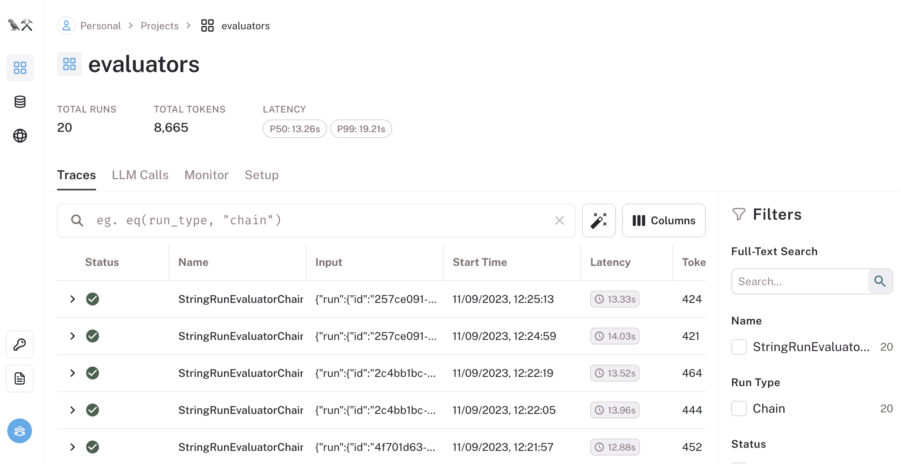
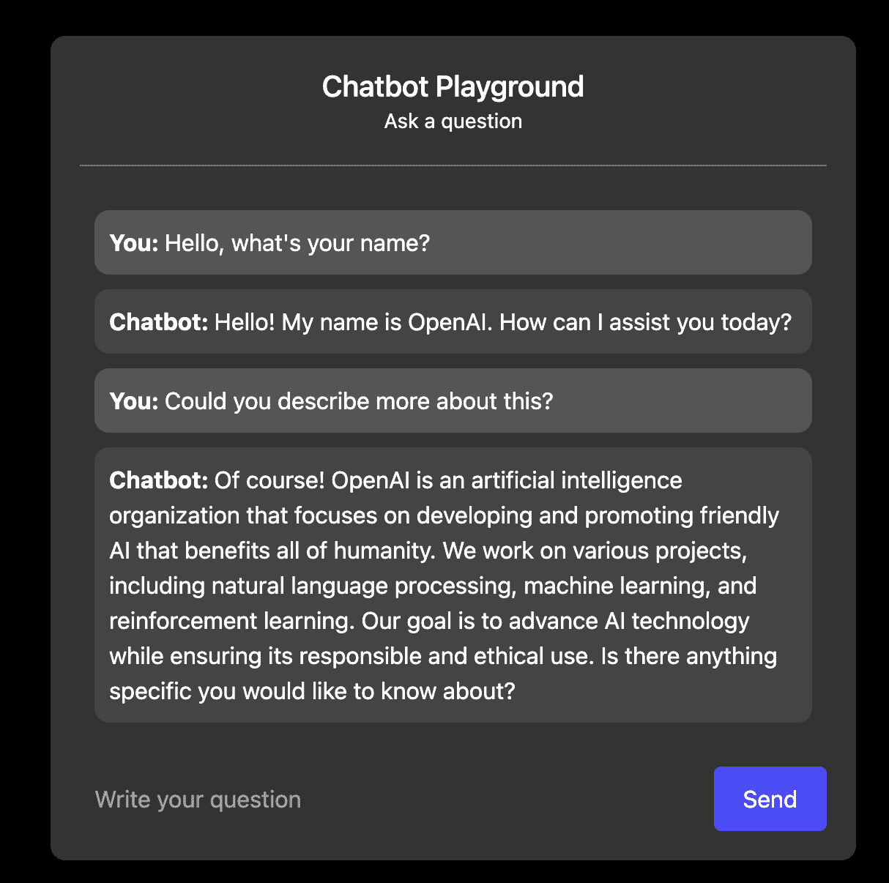
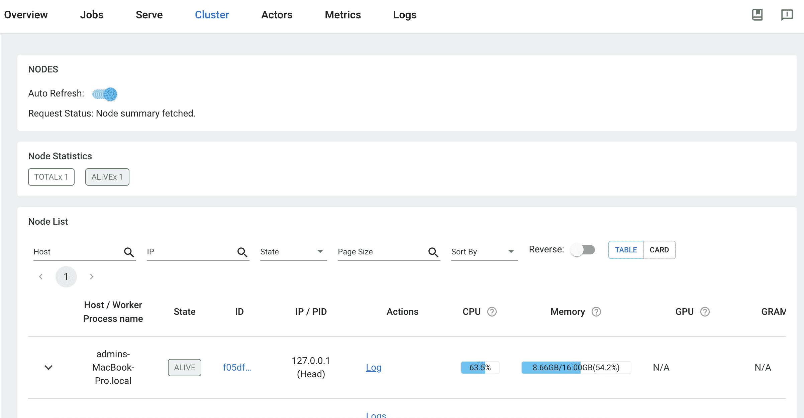
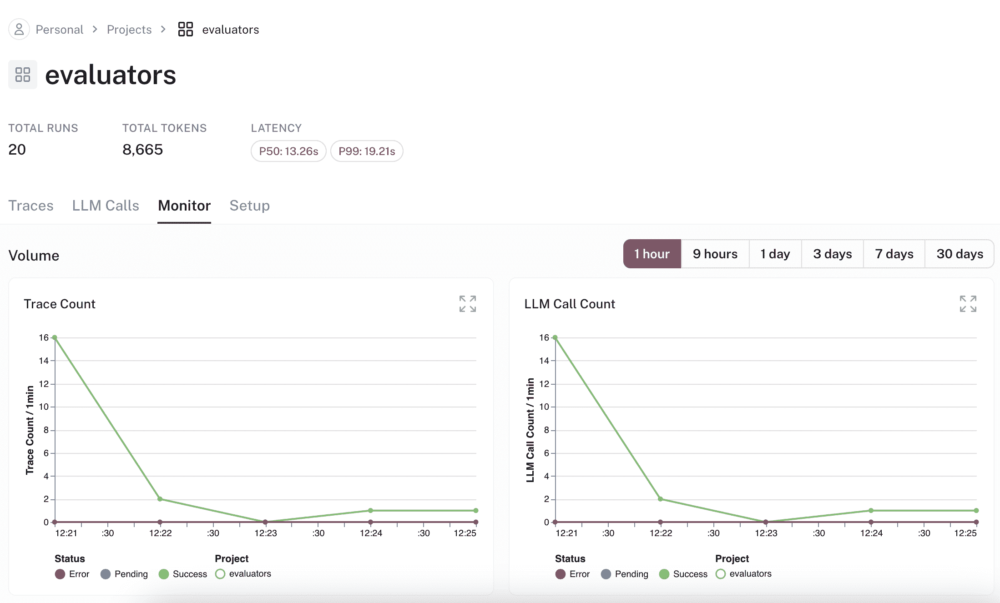
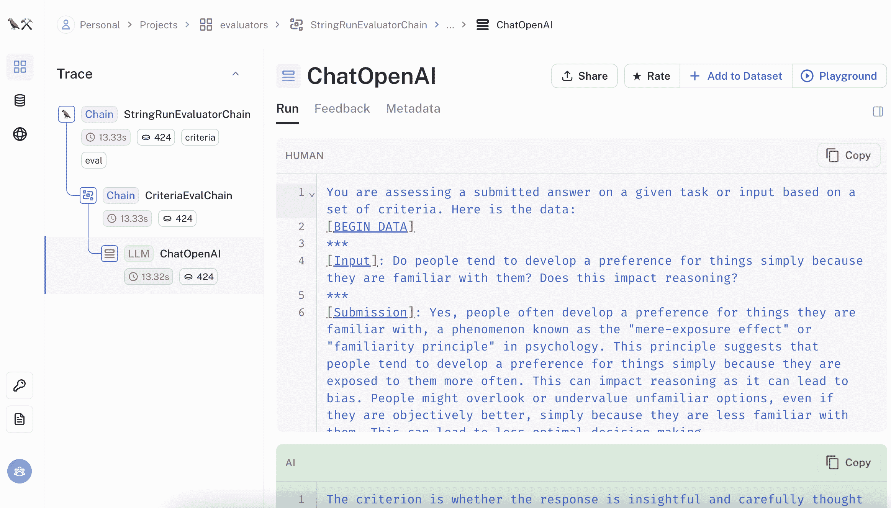
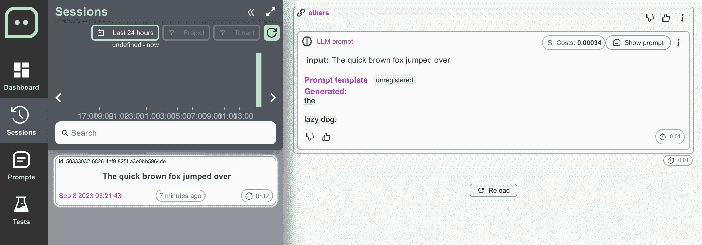

# 第九章：生成 AI 在生产中

## 在 Discord 上加入我们的书籍社区

[`packt.link/EarlyAccessCommunity`](https://packt.link/EarlyAccessCommunity)


到目前为止，我们在本书中已经讨论了模型、代理和 LLM 应用程序以及不同的用例，但是当需要确保性能和监管要求时，模型和应用程序需要大规模部署，并且最终需要进行监视，许多问题就变得重要起来。在本章中，我们将讨论评估和可观察性，总结涵盖运行中的 AI 和决策模型的治理和生命周期管理的广泛主题，包括生成 AI 模型。虽然离线评估在受控环境中提供了对模型能力的初步理解，但是在生产中的可观察性提供了对其在实时环境中性能的持续洞察。两者在模型生命周期的不同阶段都至关重要，并相互补充，以确保大型语言模型的最佳运行和结果。我们将讨论一些用于这两种情况的工具，并举例说明。我们还将讨论围绕 LLMs 构建的模型和应用程序的部署，概述可用工具和使用 Fast API 和 Ray Serve 进行部署的示例。在整个章节中，我们将使用...与 LLMs 进行合作，您可以在书的 GitHub 存储库中找到它们：[`github.com/benman1/generative_ai_with_langchain`](https://github.com/benman1/generative_ai_with_langchain)本章的主要内容包括：

+   介绍

+   如何评估您的 LLM 应用程序？

+   如何部署您的 LLM 应用程序？

+   如何观察您的 LLM 应用程序？

让我们从介绍 MLOps 对 LLMs 和其他生成模型开始，了解它的含义和包含内容。

## 介绍

正如我们在本书中所讨论的，LLMs 近年来因其生成类似人类文本的能力而受到了重视。从创意写作到对话式聊天机器人，这些生成 AI 模型在各个行业都有着多样化的应用。然而，将这些复杂的神经网络系统从研究转化为实际部署到现实世界中会面临重大挑战。本章探讨了负责任地将生成 AI 技术投入生产的实际考虑和最佳实践。我们讨论了推理和服务的计算需求、优化技术以及围绕数据质量、偏见和透明度的关键问题。当规模扩大到数千用户时，架构和基础设施决策可能成败。与此同时，保持严格的测试、审计和道德保障对于可信赖的部署至关重要。将由模型和代理及其工具组成的应用程序部署到生产环境中涉及几个关键挑战，需要解决以确保其有效且安全的使用：

+   **数据质量和偏见**：训练数据可能引入偏见，反映在模型输出中。谨慎的数据策划和监控模型输出至关重要。

+   **道德/合规考虑**：LLMs 可能生成有害、偏见或误导性的内容。必须建立审查流程和安全准则，以防止滥用。遵守针对特定行业如医疗保健的 HIPAA 等法规。

+   **资源需求**：LLMs 需要大量计算资源进行训练和服务。高效基础设施对成本效益的大规模部署至关重要。

+   **漂移或性能下降**：模型需要持续监控，以便检测数据漂移或随时间的性能下降等问题。

+   **可解释性不足**：LLMs 通常是黑匣子，使其行为和决策不透明。解释性工具对于透明度至关重要。

将经过培训的 LLM 从研究转化为真实世界的生产，需要解决诸多复杂挑战，涉及可扩展性、监控和意外行为等方面。负责地部署功能强大但不可靠的模型需要认真规划可扩展性、可解释性、测试和监控等方面。精细调整、安全干预和防御性设计等技术，能够开发出有益、无害和诚实的应用程序。通过细心和准备，生成式 AI 在医学到教育等行业中具有巨大潜力。以下几个关键模式可以帮助解决上述挑战：

+   **评估**：可靠的基准数据集和指标对于衡量模型能力、回归和与目标的一致性至关重要。应根据任务仔细选择指标。

+   **检索增强**：检索外部知识可提供有用的上下文，以减少幻觉，并在预训练数据之外添加最新信息。

+   **精细调整**：在任务特定数据上进一步调整 LLMs，可以提高目标使用案例的性能。类似适配器模块的技术可以减少开销。

+   **缓存**：存储模型输出可以显著减少重复查询的延迟和成本。但缓存有效性需要仔细考虑。

+   **防护栏**：在句法和语义上验证模型输出，以确保可靠性。指导技术直接塑造输出结构。

+   **防御性用户体验**：设计时要预见到不准确性，例如在限制、属性和收集丰富的用户反馈等方面进行免责声明。

+   **监控**：持续追踪指标、模型行为和用户满意度，可以洞察模型问题和业务影响。

在第五章中，我们已经介绍了诸如宪法 AI 之类的与安全对齐的技术，用于减轻生成有害输出的风险。此外，LLM 具有生成有害或误导性内容的潜力。建立伦理指南和审查流程以防止误导信息、仇恨言论或任何其他有害输出的传播至关重要。人类审阅员在评估和过滤生成的内容以确保符合伦理标准方面发挥着至关重要的作用。我们不仅需要不断评估模型性能和输出以便检测数据漂移或能力丧失等问题，而且还需要为了维护性能。我们将讨论解释模型行为和决策的技术。改进高风险领域的透明度。由于 LLM 或生成性 AI 模型的规模和复杂性，部署需要大量的计算资源。这包括高性能硬件，如 GPU 或 TPU，用于处理涉及的大量计算。由于其资源密集的特性，扩展大型语言模型或生成性 AI 模型可能具有一定的挑战性。随着模型规模的增加，训练和推断的计算要求也将呈指数级增加。通常使用分布式技术，如数据并行性或模型并行性，来在多台机器或 GPU 上分发工作负载。这可以加快训练和推断时间。扩展还涉及管理与这些模型相关的大量数据的存储和检索。需要高效的数据存储和检索系统来处理庞大的模型规模。部署还涉及优化推断速度和延迟的考虑。可以采用模型压缩、量化或硬件特定优化等技术，以确保高效的部署。我们在*第八章*中已经讨论了一些这方面的内容。LLM 或生成性 AI 模型通常被视为黑匣子，这意味着很难理解它们是如何做出决定或生成输出的。解释性技术旨在提供对这些模型内部运作的洞察。这可能涉及方法如注意力可视化、特征重要性分析，或为模型输出生成解释。在健康、金融或法律系统等领域，解释性至关重要，因此透明度和问责制是重要的。正如我们在*第八章*中讨论的那样，可以对大型语言模型进行特定任务或领域的微调，以提高其在特定用例中的性能。迁移学习允许模型利用预训练知识并将其适应新任务。迁移学习和对领域特定数据的微调在需要额外的审慎的同时，也打开了新的用例。通过深思熟虑的规划和准备，生成性 AI 承诺将从创意写作到客户服务等领域中改变行业。然而，在这些系统继续渗透各种领域的同时，深思熟虑地应对这些系统的复杂性仍然至关重要。本章旨在为团队提供一种实用指南，以构建具有影响力和负责任的生成性 AI 应用。我们提到了有关数据筛选、模型开发、基础设施、监控和透明度的策略。在我们继续讨论之前，对术语的一些解释是必要的。

### 术语

**MLOps** 是一种范式，专注于可靠高效地在生产环境中部署和维护机器学习模型。它将 DevOps 的实践与机器学习结合起来，将算法从实验性系统过渡到生产系统。MLOps 旨在增加自动化，提高生产模型的质量，并解决业务和监管要求。**LLMOps** 是 MLOps 的一种专业子类别。它指的是作为产品的一部分对大型语言模型进行微调和运行的操作能力和基础设施。虽然它可能与 MLOps 的概念没有显著不同，但区别在于与处理、精炼和部署像 GPT-3 这样的庞大语言模型相关的具体要求。术语**LMOps**比 LLMOps 更具包容性，因为它涵盖了各种类型的语言模型，包括大型语言模型和较小的生成模型。该术语承认了语言模型的不断扩展的景观以及它们在操作环境中的相关性。**FOMO（基础模型编排）**专门解决了在使用基础模型时面临的挑战。它强调了管理多步骤流程、与外部资源集成以及协调涉及这些模型的工作流程的需求。术语**ModelOps**专注于部署的 AI 和决策模型的治理和生命周期管理。更广泛地说，**AgentOps**涉及 LLMs 和其他 AI 代理的运行管理，确保它们的适当行为，管理它们的环境和资源访问，并促进代理之间的互动，同时解决与意外结果和不兼容目标相关的问题。虽然 FOMO 强调了专门与基础模型合作时面临的独特挑战，但 LMOps 提供了对除基础模型之外更广泛范围的语言模型的更具包容性和全面的覆盖。LMOps 承认了语言模型在各种操作用例中的多功能性和日益重要性，同时仍然属于更广泛的 MLOps 的范畴。最后，AgentOps 明确强调了由带有某些启发式操作的生成模型组成的代理的互动性质，并包括工具。所有这些非常专业的术语的出现都突显了该领域的快速发展；然而，它们的长期普及尚不清楚。MLOps 是一个在业界广泛使用的已建立的术语，得到了很大的认可和采用。因此，在本章的其余部分我们将坚持使用 MLOps。在将任何代理或模型投入生产之前，我们应该首先评估其输出，因此我们应该从这开始。我们将重点关注 LangChain 提供的评估方法。

## 如何评估你的 LLM 应用程序？

对 LLMs 进行评估，无论是作为独立实体还是与代理链结合使用，都是确保它们正确运行并产生可靠结果的关键，并且是机器学习生命周期的组成部分。评估过程确定了模型在有效性、可靠性和效率方面的性能。评估大型语言模型的目标是了解它们的优点和缺点，提高准确性和效率，减少错误，从而最大限度地提高它们在解决实际问题中的用途。这个评估过程通常在开发阶段离线进行。离线评估在受控测试条件下提供了模型性能的初步见解，并包括超参数调整、与同行模型或已建立标准的基准比较等方面。它们提供了在部署之前对模型进行改进的必要第一步。评估提供了关于 LLM 能否生成相关、准确和有用输出的见解。在 LangChain 中，有多种评估 LLMs 输出的方法，包括比较链输出、两两字符串比较、字符串距离和嵌入距离。评估结果可用于根据输出的比较确定首选模型。还可以计算置信区间和 p 值以评估评估结果的可靠性。LangChain 提供了几种工具来评估大型语言模型的输出。一个常见的方法是使用`PairwiseStringEvaluator`比较不同模型或提示的输出。这提示评估模型在相同输入上选择两个模型输出，并汇总结果以确定整体首选模型。其他评估器允许根据特定标准（如正确性、相关性和简洁性）评估模型输出。`CriteriaEvalChain`可以根据自定义或预定义的原则对输出进行评分，而无需参考标签。还可以通过指定不同的聊天模型（如 ChatGPT）来配置评估模型。让我们使用`PairwiseStringEvaluator`比较不同提示或 LLMs 的输出，该评估器提示 LLM 根据特定输入选择首选输出。

### 比较两个输出

此评估需要一个评估器、一个输入数据集以及两个或更多的 LLMs、链或代理来比较。评估将汇总结果以确定首选模型。评估过程涉及多个步骤：

1.  创建评估器：使用`load_evaluator()`函数加载评估器，指定评估器的类型（在本例中为`pairwise_string`）。

1.  选择数据集：使用`load_dataset()`函数加载输入数据集。

1.  定义要比较的模型：使用必要的配置初始化要比较的 LLMs、Chains 或 Agents。这涉及初始化语言模型以及任何额外所需的工具或代理。

1.  生成响应：为每个模型生成输出，然后再进行评估。通常会批量处理以提高效率。

1.  评估成对：通过比较每个输入的不同模型的输出来评估结果。经常使用随机选择顺序来减少位置偏差。

这里有一个来自成对字符串比较文档的示例：

```py
from langchain.evaluation import load_evaluator
evaluator = load_evaluator("labeled_pairwise_string")
evaluator.evaluate_string_pairs(
    prediction="there are three dogs",
    prediction_b="4",
    input="how many dogs are in the park?",
    reference="four",
)
```

评估器的输出应如下所示：

```py
 {'reasoning': 'Both responses are relevant to the question asked, as they both provide a numerical answer to the question about the number of dogs in the park. However, Response A is incorrect according to the reference answer, which states that there are four dogs. Response B, on the other hand, is correct as it matches the reference answer. Neither response demonstrates depth of thought, as they both simply provide a numerical answer without any additional information or context. \n\nBased on these criteria, Response B is the better response.\n',
     'value': 'B',
     'score': 0}
```

评估结果包括一个介于 0 和 1 之间的分数，表示代理的有效性，有时还包括概述评估过程并证明分数的推理。在这个反对参考资料的例子中，基于输入，两个结果事实上都是不正确的。我们可以移除参考资料，让一个 LLM 来评判输出，但是这样做可能是危险的，因为指定的也可能是不正确的。

### 根据标准比较

LangChain 为不同的评估标准提供了几个预定义的评估器。这些评估器可用于根据特定的评分标准或标准集合评估输出。一些常见的标准包括简洁性、相关性、正确性、连贯性、帮助性和争议性。`CriteriaEvalChain`允许您根据自定义或预定义标准评估模型输出。它提供了一种验证 LLM 或 Chain 的输出是否符合一组定义的标准的方法。您可以使用此评估器评估正确性、相关性、简洁性和生成的输出的其他方面。`CriteriaEvalChain`可以配置为使用或不使用参考标签。没有参考标签，评估器依赖于 LLM 的预测答案，并根据指定的标准对其进行评分。有了参考标签，评估器将预测的答案与参考标签进行比较，并确定其是否符合标准。LangChain 中默认使用的评估 LLM 是 GPT-4。但是，您可以通过指定其他聊天模型（例如 ChatAnthropic 或 ChatOpenAI）和所需的设置（例如温度）来配置评估 LLM。通过将 LLM 对象作为参数传递给`load_evaluator()`函数，可以使用自定义 LLM 加载评估器。LangChain 支持自定义标准和预定义原则进行评估。可以使用`criterion_name: criterion_description`对的字典定义自定义标准。这些标准可以根据特定要求或标准来评估输出。这里有一个简单的示例：

```py
custom_criteria = {
    "simplicity": "Is the language straightforward and unpretentious?",
    "clarity": "Are the sentences clear and easy to understand?",
    "precision": "Is the writing precise, with no unnecessary words or details?",
    "truthfulness": "Does the writing feel honest and sincere?",
    "subtext": "Does the writing suggest deeper meanings or themes?",
}
evaluator = load_evaluator("pairwise_string", criteria=custom_criteria)
evaluator.evaluate_string_pairs(
    prediction="Every cheerful household shares a similar rhythm of joy; but sorrow, in each household, plays a unique, haunting melody.",
    prediction_b="Where one finds a symphony of joy, every domicile of happiness resounds in harmonious,"
    " identical notes; yet, every abode of despair conducts a dissonant orchestra, each"
    " playing an elegy of grief that is peculiar and profound to its own existence.",
    input="Write some prose about families.",
)
```

我们可以得到这两个输出的非常微妙的比较，如下结果所示：

```py
{'reasoning': 'Response A is simple, clear, and precise. It uses straightforward language to convey a deep and sincere message about families. The metaphor of music is used effectively to suggest deeper meanings about the shared joys and unique sorrows of families.\n\nResponse B, on the other hand, is less simple and clear. The language is more complex and pretentious, with phrases like "domicile of happiness" and "abode of despair" instead of the simpler "household" used in Response A. The message is similar to that of Response A, but it is less effectively conveyed due to the unnecessary complexity of the language.\n\nTherefore, based on the criteria of simplicity, clarity, precision, truthfulness, and subtext, Response A is the better response.\n\n[[A]]', 'value': 'A', 'score': 1}
```

或者，您可以使用 LangChain 中提供的预定义原则，比如来自宪法人工智能的原则。这些原则旨在评估输出的道德、有害和敏感方面。在评估中使用原则可以更专注地评估生成的文本。

### 字符串和语义比较

LangChain 支持字符串比较和距离度量来评估 LLM 输出。像 Levenshtein 和 Jaro 这样的字符串距离度量提供了一个量化的相似度衡量标准，用于在预测和参考字符串之间的相似性。使用像 SentenceTransformers 这样的模型计算语义相似性的嵌入距离，计算生成和期望文本之间的语义相似性。嵌入距离评估器可以使用嵌入模型，如基于 GPT-4 或 Hugging Face 嵌入的模型，来计算预测字符串和参考字符串之间的向量距离。这可以衡量两个字符串之间的语义相似性，并提供有关生成文本质量的见解。以下是文档中的一个快速示例：

```py
from langchain.evaluation import load_evaluator
evaluator = load_evaluator("embedding_distance")
evaluator.evaluate_strings(prediction="I shall go", reference="I shan't go")
```

评估器返回得分 0.0966466944859925。您可以通过`load_evaluator()`调用中的`embeddings`参数更改所使用的嵌入。这通常比旧的字符串距离度量方法效果更好，但这些方法也可用，从而可以进行简单的单元测试和准确性评估。字符串比较评估器将预测的字符串与参考字符串或输入进行比较。字符串距离评估器使用诸如 Levenshtein 或 Jaro 距离之类的距离度量来衡量预测和参考字符串之间的相似性或不相似性。这提供了预测字符串与参考字符串的相似性的定量衡量。最后，还有一个 agent 轨迹评估器，其中使用`evaluate_agent_trajectory()`方法来评估输入、预测和 agent 轨迹。我们还可以使用 LangSmith 与数据集比较我们的性能。我们将在关于可观测性部分更多地讨论 LangChain 的伴侣项目 LangSmith。

### 基准数据集

使用 LangSmith，我们可以评估模型在数据集上的性能。让我们通过一个示例来了解。首先，请确保您在此处创建 LangSmith 账户：[`smith.langchain.com/`](https://smith.langchain.com/) 您可以获取 API 密钥，并将其设置为环境中的`LANGCHAIN_API_KEY`。我们还可以设置项目 ID 和跟踪的环境变量：

```py
import os
os.environ["LANGCHAIN_TRACING_V2"] = "true"
os.environ["LANGCHAIN_PROJECT"] = "My Project"
```

这将配置 LangChain 记录跟踪。如果我们不告诉 LangChain 项目 ID，它将对`default`项目进行记录。设置完成后，当我们运行 LangChain agent 或 chain 时，我们将能够在 LangSmith 上看到跟踪。让我们记录一次运行吧！

```py
from langchain.chat_models import ChatOpenAI
llm = ChatOpenAI()
llm.predict("Hello, world!")
```

我们将在 LangSmith 上看到如下内容：LangSmith 允许我们在 LangSmith 项目页面上列出到目前为止所有的运行：[`smith.langchain.com/projects`](https://smith.langchain.com/projects)

```py
from langsmith import Client
client = Client()
runs = client.list_runs()
print(runs)
```

我们可以按照特定项目或`run_type`列出运行，例如"chain"。每个运行都有输入和输出，就像我们在这里看到的那样：

```py
print(f"inputs: {runs[0].inputs}")
print(f"outputs: {runs[0]. outputs}")
```

我们可以使用`create_example_from_run()`函数从现有的 agent 运行中创建数据集，或者从其他任何东西创建数据集。以下是如何使用一组问题创建数据集的方法：

```py
questions = [
    "A ship's parts are replaced over time until no original parts remain. Is it still the same ship? Why or why not?",  # The Ship of Theseus Paradox
    "If someone lived their whole life chained in a cave seeing only shadows, how would they react if freed and shown the real world?",  # Plato's Allegory of the Cave
    "Is something good because it is natural, or bad because it is unnatural? Why can this be a faulty argument?",  # Appeal to Nature Fallacy
    "If a coin is flipped 8 times and lands on heads each time, what are the odds it will be tails next flip? Explain your reasoning.",  # Gambler's Fallacy
    "Present two choices as the only options when others exist. Is the statement \"You're either with us or against us\" an example of false dilemma? Why?",  # False Dilemma
    "Do people tend to develop a preference for things simply because they are familiar with them? Does this impact reasoning?",  # Mere Exposure Effect
    "Is it surprising that the universe is suitable for intelligent life since if it weren't, no one would be around to observe it?",  # Anthropic Principle
    "If Theseus' ship is restored by replacing each plank, is it still the same ship? What is identity based on?",  # Theseus' Paradox
    "Does doing one thing really mean that a chain of increasingly negative events will follow? Why is this a problematic argument?",  # Slippery Slope Fallacy
    "Is a claim true because it hasn't been proven false? Why could this impede reasoning?",  # Appeal to Ignorance
]
shared_dataset_name = "Reasoning and Bias"
ds = client.create_dataset(
    dataset_name=shared_dataset_name, description="A few reasoning and cognitive bias questions",
)
for q in questions:
    client.create_example(inputs={"input": q}, dataset_id=ds.id)
```

然后我们可以以这样的方式在数据集上运行 LLM agent 或 chain：

```py
from langchain.chat_models import ChatOpenAI
from langchain.chains import LLMChain
llm = ChatOpenAI(model="gpt-4", temperature=0.0)
def construct_chain():
    return LLMChain.from_string(
        llm,
        template="Help out as best you can.\nQuestion: {input}\nResponse: ",
    )
```

我们使用构造函数来为每个输入进行初始化。为了评估模型在该数据集上的性能，我们需要定义一个评估器，正如我们在前一节中所见。

```py
from langchain.evaluation import EvaluatorType
from langchain.smith import RunEvalConfig
evaluation_config = RunEvalConfig(
    evaluators=[
        # Arbitrary criterion as a key: value pair in the criteria dict:
        RunEvalConfig.Criteria({"helpfulness": "Is the response helpful?"}),
        RunEvalConfig.Criteria({"insightful": "Is the response carefully thought out?"})
    ]
)
```

我们将一个数据集和评估器传递给`run_on_dataset()`来生成指标和反馈：

```py
from langchain.smith import run_on_dataset
results = run_on_dataset(
  client=client,
  dataset=dataset,
  llm_factory=lambda: my_agent, 
  evaluation=evaluation_config
)
```

同样地，我们可以传递一个数据集和评估器给`run_on_dataset()`来异步生成指标和反馈。我们可以在 LangSmith UI 中查看评估器反馈，以确定改进的方向。



图 9.1：LangSmith 中的评估器。

我们可以单击其中任何一个评估器来查看一些细节，例如，对于仔细思考的评估器，我们得到了这个包含了由 LLM 提供的原始答案的提示：

```py
You are assessing a submitted answer on a given task or input based on a set of criteria. Here is the data:
[BEGIN DATA]
***
[Input]: Is something good because it is natural, or bad because it is unnatural? Why can this be a faulty argument?
***
[Submission]: The argument that something is good because it is natural, or bad because it is unnatural, is often referred to as the "appeal to nature" fallacy. This argument is faulty because it assumes that what is natural is automatically good or beneficial, and what is unnatural is automatically bad or harmful. However, this is not always the case. For example, many natural substances can be harmful or deadly, such as certain plants or animals. Conversely, many unnatural things, such as modern medicine or technology, can greatly benefit our lives. Therefore, whether something is natural or unnatural is not a reliable indicator of its value or harm.
***
[Criteria]: insightful: Is the response carefully thought out?
***
[END DATA]
Does the submission meet the Criteria? First, write out in a step by step manner your reasoning about each criterion to be sure that your conclusion is correct. Avoid simply stating the correct answers at the outset. Then print only the single character "Y" or "N" (without quotes or punctuation) on its own line corresponding to the correct answer of whether the submission meets all criteria. At the end, repeat just the letter again by itself on a new line.
```

我们得到了这个评估：

```py
The criterion is whether the response is insightful and carefully thought out. 
The submission provides a clear and concise explanation of the "appeal to nature" fallacy, demonstrating an understanding of the concept. It also provides examples to illustrate why this argument can be faulty, showing that the respondent has thought about the question in depth. The response is not just a simple yes or no, but a detailed explanation that shows careful consideration of the question. 
Therefore, the submission does meet the criterion of being insightful and carefully thought out.
Y
Y
```

提高一些类型问题的性能的一种方式是进行少量提示。LangSmith 也可以帮助我们。您可以在 LangSmith 文档中找到更多此类示例。这就结束了评估。现在我们已经评估了我们的代理，假设我们对性能感到满意，我们就部署它！

## 如何部署您的大型语言模型应用？

鉴于大型语言模型在各个领域的广泛使用，了解如何有效地将模型和应用程序部署到生产环境中是至关重要的。部署服务和框架可以帮助解决技术障碍。有很多不同的方法可以将大型语言模型应用或具有生成能力的应用程序投入生产。生产部署需要对生成式人工智能生态系统进行研究和了解，这包括不同方面，包括：

+   模型和语言模型即服务：LLMs 和其他模型可以直接运行，也可以作为 API 提供在供应商提供的基础设施上。

+   推理启发式：检索增强生成（RAG），思维之树等等。

+   向量数据库：用于检索上下文相关信息以供提示使用。

+   提示工程工具：这些工具可以在不需要昂贵的微调或敏感数据的情况下进行上下文学习。

+   预训练和微调：适用于专门用于特定任务或领域的模型。

+   提示日志，测试和分析：一种新兴的领域，灵感来自于对大型语言模型性能的理解和改进的愿望。

+   自定义的语言模型堆栈：一组用于塑造和部署在开源模型上构建解决方案的工具。

我们在*第一章*和*第三章*讨论了模型，第 4-7 章的推理启发式，第五章的向量数据库以及第八章的提示和微调。在本章中，我们将重点关注部署的日志记录、监控和自定义工具。LLM 通常使用外部 LLM 提供商或自托管模型来利用。对于外部提供商，计算负担由类似于 OpenAI 或 Anthropic 的公司承载，而 LangChain 则促进业务逻辑实现。然而，自托管开源 LLM 可以显着降低成本、延迟和隐私问题。一些拥有基础设施的工具提供完整的包。例如，您可以使用 Chainlit 部署 LangChain 代理，并创建带有 Chainlit 的 ChatGPT UI。一些关键特点包括中间步骤可视化、元素管理和显示（图像、文本、走马灯等）以及云部署。BentoML 是一个框架，可以将机器学习应用程序容器化，以便于使用它们作为独立运行和扩展的微服务，自动生成 OpenAPI 和 gRPC 端点。您还可以将 LangChain 部署到不同的云服务节点，例如 Azure Machine Learning Online Endpoint。使用 Steamship，LangChain 开发人员可以快速部署其应用程序，其中包括：生产就绪的端点、依赖项的水平扩展、应用程序状态的持久性存储、多租户支持等。下表总结了部署大型语言模型应用程序的服务和框架：

| **名称** | **描述** | **类型** |
| --- | --- | --- |
| Streamlit | 用于构建和部署 Web 应用程序的开源 Python 框架 | 框架 |
| Gradio | 允许您在 Hugging Face 上封装模型并进行托管的框架 | 框架 |
| Chainlit | 构建和部署对话式 ChatGPT 应用程序 | 框架 |
| Apache Beam | 用于定义和编排数据处理工作流程的工具 | 框架 |
| Vercel | 用于部署和扩展 Web 应用程序的平台 | 云服务 |
| FastAPI | 用于构建 API 的 Python Web 框架 | 框架 |
| Fly.io | 具有自动缩放和全球 CDN 的应用程序托管平台 | 云服务 |
| DigitalOcean 应用程序平台 | 构建、部署和扩展应用程序的平台 | 云服务 |
| Google Cloud | 提供像 Cloud Run 这样的服务，可托管和扩展容器化的应用程序 | 云服务 |
| Steamship | 用于部署和扩展模型的 ML 基础设施平台 | 云服务 |
| Langchain-serve | 用于将 LangChain 代理作为 Web API 提供的工具 | 框架 |
| BentoML | 模型服务、打包和部署的框架 | 框架 |
| OpenLLM | 提供商业 LLM 的开放 API | 云服务 |
| Databutton | 无代码平台，用于构建和部署模型工作流程 | 框架 |
| Azure ML | Azure 上的托管 ML 操作服务，用于模型 | 云服务 |

图 9.2：部署大型语言模型应用程序的服务和框架。

所有这些都有不同的用例很好地记录，通常直接引用 LLM。我们已经展示了使用 Streamlit 和 Gradio 的示例，并讨论了如何以 HuggingFace Hub 为例部署它们。运行 LLM 应用程序有几个主要要求：

+   可扩展的基础设施，以处理计算密集型模型和潜在的流量激增。

+   实时为模型输出提供服务的低延迟

+   用于管理长对话和应用程序状态的持久存储

+   用于集成到最终用户应用程序的 API

+   监控和日志记录以跟踪指标和模型行为

维持成本效益在大量用户交互和与 LLM 服务相关的高成本的情况下可能具有挑战性。管理效率的策略包括自托管模型、根据流量自动调整资源分配、使用抢占式实例、独立扩展和批处理请求以更好地利用 GPU 资源。工具和基础设施的选择决定了这些需求之间的权衡。灵活性和便利性非常重要，因为我们希望能够快速迭代，这对于 ML 和 LLM 领域的动态性是至关重要的。避免被绑定在一个解决方案上是至关重要的。一个灵活的、可扩展的服务层对各种模型都很关键。模型组合和云提供商的选择构成了这种灵活性方程的一部分。对于最大的灵活性，Infrastructure as Code（IaC）工具如 Terraform、CloudFormation 或 Kubernetes YAML 文件可以可靠且快速地重新创建您的基础设施。此外，持续集成和持续交付（CI/CD）流水线可以自动化测试和部署过程，以减少错误并促进更快的反馈和迭代。设计健壮的 LLM 应用服务可能是一个复杂的任务，需要在评估服务框架时了解权衡和关键考虑因素。利用这些解决方案之一进行部署使开发人员能够专注于开发有影响力的 AI 应用，而不是基础设施。如前所述，LangChain 与几个开源项目和框架（如 Ray Serve、BentoML、OpenLLM、Modal 和 Jina）很好地配合。在下一节中，我们将基于 FastAPI 部署一个聊天服务 Web 服务器。

### Fast API Web 服务器

FastAPI 是部署 Web 服务器非常受欢迎的选择。设计快速、易于使用和高效，它是一个用 Python 构建 API 的现代高性能 Web 框架。Lanarky 是一个小型的开源库，用于部署 LLM 应用程序，它提供了方便的封装，使您能够同时获得 REST API 端点和浏览器中的可视化，而且您只需要几行代码。

> **REST API**（表征状态传输应用程序编程接口）是一组规则和协议，允许不同的软件应用程序通过互联网相互通信。它遵循 REST 的原则，这是一种用于设计网络应用程序的体系结构风格。REST API 使用 HTTP 方法（例如 GET、POST、PUT、DELETE）对资源执行操作，通常以标准化格式（例如 JSON 或 XML）发送和接收数据。

在库文档中，有几个示例，包括具有源链的检索 QA、会话检索应用程序和零射击代理。跟随另一个示例，我们将使用 Lanarky 实现一个带有聊天机器人的 Web 服务器。我们将使用 Lanarky 设置一个与 Gradio 集成的 Web 服务器，创建一个带有 LLM 模型和设置的 `ConversationChain` 实例，并定义用于处理 HTTP 请求的路由。首先，我们将导入必要的依赖项，包括用于创建 Web 服务器的 FastAPI，用于与 Gradio 集成的 `mount_gradio_app`，用于处理 LLM 对话的 `ConversationChain` 和 `ChatOpenAI`，以及其他所需模块：

```py
from fastapi import FastAPI
from lanarky.testing import mount_gradio_app
from langchain import ConversationChain
from langchain.chat_models import ChatOpenAI
from lanarky import LangchainRouter
from starlette.requests import Request
from starlette.templating import Jinja2Templates
```

请注意，您需要根据第三章的说明设置环境变量。定义了一个`create_chain()`函数来创建`ConversationChain`的一个实例，指定了 LLM 模型及其设置：

```py
def create_chain():
    return ConversationChain(
        llm=ChatOpenAI(
            temperature=0,
            streaming=True,
        ),
        verbose=True,
    )
```

我们将链设置为`ConversationChain`。

```py
chain = create_chain()
```

将变量`app`分配给`mount_gradio_app`，它创建一个名为*ConversationChainDemo*的`FastAPI`实例，并将其与 Gradio 集成：

```py
app = mount_gradio_app(FastAPI(title="ConversationChainDemo"))
```

变量模板被设置为`Jinja2Templates`类，指定了用于渲染模板的目录。这指定了网页将如何显示，允许各种自定义：

```py
templates = Jinja2Templates(directory="webserver/templates")
```

使用 FastAPI 装饰器`@app.get`定义了用于处理根路径（`/`）的 HTTP GET 请求的端点。与此端点关联的函数返回一个模板响应，用于渲染 index.xhtml 模板：

```py
@app.get("/")
async def get(request: Request):
    return templates.TemplateResponse("index.xhtml", {"request": request})
```

创建了一个`LangchainRouter`类的路由器对象。该对象负责定义和管理与`ConversationChain`实例相关联的路由。我们可以向路由器添加其他路由，用于处理基于 JSON 的聊天，甚至可以处理 WebSocket 请求：

```py
langchain_router = LangchainRouter(
    langchain_url="/chat", langchain_object=chain, streaming_mode=1
)
langchain_router.add_langchain_api_route(
    "/chat_json", langchain_object=chain, streaming_mode=2
)
langchain_router.add_langchain_api_websocket_route("/ws", langchain_object=chain)
app.include_router(langchain_router)
```

现在我们的应用程序知道如何处理请求，这些请求是针对路由器中定义的指定路由发出的，并将它们定向到适当的函数或处理程序进行处理。我们将使用 Uvicorn 来运行我们的应用程序。Uvicorn 擅长支持高性能、异步框架，如 FastAPI 和 Starlette。由于其异步特性，它能够处理大量的并发连接，并在负载较重时表现良好。我们可以像这样从终端运行 Web 服务器：

```py
uvicorn webserver.chat:app –reload
```

这个命令启动了一个 Web 服务器，在本地地址 [`127.0.0.1:8000`](http://127.0.0.1:8000) 可以在浏览器中查看。`--reload` 开关特别方便，因为这意味着一旦你做出任何更改，服务器将自动重新启动。以下是我们刚刚部署的聊天机器人应用的快照：



图 9.3: Flask/Lanarky 中的聊天机器人

我认为我们的工作量相当小，这看起来相当不错。它还拥有一些很棒的功能，比如 REST API，Web UI 和 WebSocket 接口。虽然 Uvicorn 本身并不提供内置的负载平衡功能，但它可以与其他工具或技术（如 Nginx 或 HAProxy）一起工作，以在部署设置中实现负载平衡，从而将传入的客户端请求分发给多个工作进程或实例。Uvicorn 与负载平衡器的使用可以实现横向扩展，处理大量流量，为客户端提供改进的响应时间，增强容错能力。在下一节，我们将看到如何使用 Ray 构建稳健且经济高效的生成式 AI 应用。我们将使用 LangChain 进行文本处理，并使用 Ray 进行索引和服务方面的扩展，构建一个简单的搜索引擎。

### Ray

Ray 提供了一个灵活的框架，以满足在生产环境中扩展复杂神经网络的基础设施挑战，通过在集群中扩展生成式 AI 工作负载。Ray 通过在低延迟服务、分布式训练和大规模批量推断等方面帮助解决常见的部署需求。Ray 还能够轻松地按需启动微调或将现有工作负载从一台机器扩展到多台机器。具体的功能包括：

+   使用 Ray Train 在 GPU 集群上调度分布式训练任务

+   使用 Ray Serve 在规模上部署预训练模型，以实现低延迟服务

+   使用 Ray Data 在 CPU 和 GPU 上并行运行大批推断

+   编排端到端的生成式 AI 工作流，包括训练、部署和批处理

我们将使用 LangChain 和 Ray 来构建一个简单的搜索引擎，以此跟随 Waleed Kadous 在 anyscale 博客和 Github 上的 langchain-ray 仓库实现的示例。你可以把这看作是 *Channel 5* 中实现的一个扩展。你可以在这里看到这个示例的完整代码：[`github.com/benman1/generative_ai_with_langchain`](https://github.com/benman1/generative_ai_with_langchain) 你也可以看到如何将其作为 FastAPI 服务器运行。首先，我们将摄取并索引 Ray 文档，以便能够快速找到搜索查询的相关段落：

```py
# Load the Ray docs using the LangChain loader
loader = RecursiveUrlLoader("docs.ray.io/en/master/") 
docs = loader.load()
# Split docs into sentences using LangChain splitter
chunks = text_splitter.create_documents(
    [doc.page_content for doc in docs],
    metadatas=[doc.metadata for doc in docs])
# Embed sentences into vectors using transformers
embeddings = LocalHuggingFaceEmbeddings('multi-qa-mpnet-base-dot-v1')  
# Index vectors using FAISS via LangChain
db = FAISS.from_documents(chunks, embeddings) 
```

通过摄取文档、拆分成句子、将句子嵌入和索引向量来构建我们的搜索索引。另外，我们也可以通过并行化嵌入步骤来加速索引：

```py
# Define shard processing task
@ray.remote(num_gpus=1)  
def process_shard(shard):
  embeddings = LocalHuggingFaceEmbeddings('multi-qa-mpnet-base-dot-v1')
  return FAISS.from_documents(shard, embeddings)
# Split chunks into 8 shards
shards = np.array_split(chunks, 8)  
# Process shards in parallel
futures = [process_shard.remote(shard) for shard in shards]
results = ray.get(futures)
# Merge index shards
db = results[0]
for result in results[1:]:
  db.merge_from(result)
```

通过在每个分片中并行运行嵌入，我们可以显著减少索引时间。然后将数据库索引保存到磁盘：

```py
db.save_local(FAISS_INDEX_PATH)
```

`FAISS_INDEX_PATH` 是一个任意的文件名。我已将其设置为 `faiss_index.db`。接下来，我们将看到如何使用 Ray Serve 提供搜索查询服务。

```py
# Load index and embedding
db = FAISS.load_local(FAISS_INDEX_PATH)
embedding = LocalHuggingFaceEmbeddings('multi-qa-mpnet-base-dot-v1')
@serve.deployment
class SearchDeployment:
  def __init__(self):
    self.db = db
    self.embedding = embedding

  def __call__(self, request):   
    query_embed = self.embedding(request.query_params["query"])
    results = self.db.max_marginal_relevance_search(query_embed) 
    return format_results(results) 
deployment = SearchDeployment.bind()
# Start service
serve.run(deployment)
```

这让我们可以将搜索查询作为 Web 端点提供！运行后，我得到了这个输出：

```py
Started a local Ray instance. 
View the dashboard at 127.0.0.1:8265
```

我们现在可以从 Python 进行查询：

```py
import requests
query = "What are the different components of Ray"
         " and how can they help with large language models (LLMs)?”
response = requests.post("http://localhost:8000/", params={"query": query})
print(response.text)
```

对我而言，服务器在[`https://docs.ray.io/en/latest/ray-overview/use-cases.xhtml`](http://https://docs.ray.io/en/latest/ray-overview/use-cases.xhtml)获取了 Ray 的用例页面。我真的很喜欢 Ray 仪表板上的监控，它看起来像这样：



图 9.4：Ray 仪表板。

这个仪表板非常强大，因为它可以为您提供大量的指标和其他信息。收集指标真的很容易，因为您所需做的就是设置和更新部署对象或者 actor 类型的变量，例如 `Counter`、`Gauge`、`Histogram` 或其他类型。对于时序图表，您应该安装 Prometheus 或 Grafana 服务器。正如您在 Github 上的完整实现中所看到的，我们也可以将其作为 FastAPI 服务器运行。这结束了我们带有 LangChain 和 Ray 的简单语义搜索引擎。随着模型和 LLM 应用程序变得越来越复杂，并与业务应用程序的结构密切交织，生产中的可观察性和监控变得必不可少，以确保它们的准确性、效率和可靠性。接下来的部分将重点放在监视 LLM 的重要性，并突出了全面监控策略中要跟踪的关键指标。

## 如何观察 LLM 应用程序？

现实世界运营的动态性意味着离线评估中评估的条件几乎不可能涵盖 LLM 在生产系统中可能遇到的所有潜在场景。因此，生产中需要可观察性 - 更持续的、实时的观察，以捕捉离线测试无法预料的异常情况。可观察性允许监视模型与实际输入数据和用户在生产中交互时的行为和结果。它包括日志记录、跟踪、追踪和警报机制，以确保系统功能良好、优化性能，并及早发现诸如模型漂移之类的问题。正如所讨论的，LLM 已成为医疗、电子商务和教育等许多行业应用程序中越来越重要的组成部分。

> 跟踪、追踪和监控是软件运行和管理领域的三个重要概念。虽然都与理解和改进系统性能有关，但它们各自扮演着不同的角色。跟踪和追踪都是为了保持详细的历史记录以进行分析和调试，而监控旨在实时观察和及时发现问题，以确保系统功能始终处于最佳状态。这三个概念都属于可观察性的范畴。
> 
> > **监控**是持续监视系统或应用程序性能的过程。这可能涉及持续收集和分析与系统健康相关的指标，如内存使用、CPU 利用率、网络延迟以及整体应用程序/服务性能（如响应时间）。有效的监控包括设置异常或意外行为的警报系统 - 在超出某些阈值时发送通知。虽然跟踪和追踪是关于保留详细的历史记录以进行分析和调试，但监控旨在实时观察和立即意识到问题，以确保系统功能始终处于最佳状态。

监控和可观测性的主要目标是通过实时数据提供对模型性能和行为的洞察。这有助于：

+   **预防模型漂移**：模型可能随着时间的推移而因输入数据或用户行为特征的变化而恶化。定期监控可以早期识别这种情况并采取纠正措施。

+   **性能优化**：通过跟踪推理时间、资源使用情况和吞吐量等指标，您可以调整以提高 LLM 在生产中的效率和效果。

+   **A/B 测试**：它有助于比较模型中轻微差异可能导致不同结果的情况，从而有助于决策改进模型。

+   **调试问题**：监控有助于识别运行时可能发生的未预料问题，从而快速解决。

考虑监控策略时，有几点需要考虑：

+   **监控的指标**：根据所需的模型性能，定义关键的感兴趣的指标，如预测准确性、延迟、吞吐量等。

+   **监控频率**：应根据模型对操作的关键程度来确定频率 - 高度关键的模型可能需要近实时监控。

+   **日志记录**：日志应提供关于 LLM 执行的每个相关操作的详细信息，以便分析人员可以追踪任何异常情况。

+   **警报机制**：如果检测到异常行为或性能急剧下降，系统应该提出警报。

通过验证、阴影启动和解释以及可靠的离线评估等方式持续评估 LLM 的行为和性能，组织可以识别和消除潜在风险，保持用户信任，并提供最佳体验。以下是相关指标的列表：

+   **推断延迟**：衡量 LLM 处理请求并生成响应所需的时间。较低的延迟确保了更快和更具响应性的用户体验。

+   **每秒查询（QPS）**：计算 LLM 可以在给定时间内处理的查询或请求数量。监控 QPS 有助于评估可伸缩性和容量规划。

+   **每秒标记数（TPS）**：跟踪 LLM 生成标记的速率。TPS 指标对于估计计算资源需求和了解模型效率很有用。

+   **标记使用**：标记数量与资源使用（如硬件利用、延迟和成本）相关。

+   **错误率**：监控 LLM 响应中错误或失败的发生，确保错误率保持在可接受的范围内，以保持输出的质量。

+   **资源利用**：测量计算资源（如 CPU、内存和 GPU）的消耗，以优化资源分配并避免瓶颈。

+   **模型漂移**：通过将其输出与基线或基本事实进行比较，以检测 LLM 行为随时间的变化，确保模型保持准确性并符合预期结果。

+   **超出分布范围的输入**：识别落在 LLM 训练数据意图分布范围之外的输入或查询，这可能导致意外或不可靠的响应。

+   **用户反馈指标**：监控用户反馈渠道，获取关于用户满意度的见解，找到改进的领域，并验证 LLM 的有效性。

数据科学家和机器学习工程师应该使用如 LIME 和 SHAP 这样的模型解释工具检查数据的陈旧性、错误学习和偏见。最具预测性的特征突然变化可能表明数据泄漏。离线指标如 AUC 并不总是与在线转化率的影响相关，因此找到可信赖的离线指标非常重要，这些指标可以转化为业务上的在线收益，最好是系统直接影响的点击和购买等直接指标。有效的监控可以实现 LLM 的成功部署和利用，增强对它们能力的信心，建立用户信任。不过，当依赖云服务平台时，应当注意研究隐私和数据保护政策。在接下来的部分，我们将来看看一个代理的轨迹监控。

### 跟踪和追踪

> **跟踪** 通常指的是记录和管理应用程序或系统中特定操作或一系列操作的信息的过程。例如，在机器学习应用程序或项目中，跟踪可能涉及在不同实验或运行中记录参数、超参数、度量标准、结果等。这提供了一种记录进展和随时间变化的方式。
> 
> > **追踪（Tracing）**是跟踪的一种更专业的形式。它涉及通过软件/系统记录执行流程。特别是在单个交易可能涉及多个服务的分布式系统中，追踪有助于保持审计或面包屑路径，详细信息包括请求路径通过系统的详细信息。这种细粒度的视图使开发人员能够理解各种微服务之间的交互，并通过确定它们在事务路径中发生的确切位置来解决延迟或故障等问题。

跟踪代理的轨迹可能具有挑战性，因为它们广泛的行动范围和生成能力。LangChain 提供了用于轨迹跟踪和评估的功能。实际上，看到代理的迹象非常容易！你只需在初始化代理或 LLM 时将 return_`intermediate_steps`参数设置为`True`。让我们快速看一下这个。我会跳过导入和设置环境。您可以在 github 上找到完整的列表，在此地址下的监控：[`github.com/benman1/generative_ai_with_langchain/`](https://github.com/benman1/generative_ai_with_langchain/)我们将定义一个工具。使用`@tool`装饰器非常方便，它将使用函数文档字符串作为工具的描述。第一个工具向网站地址发送一个 ping，并返回有关传输包和延迟的信息，或者（在出现错误的情况下）返回错误消息：

```py
@tool
def ping(url: HttpUrl, return_error: bool) -> str:
    """Ping the fully specified url. Must include https:// in the url."""
    hostname = urlparse(str(url)).netloc
    completed_process = subprocess.run(
        ["ping", "-c", "1", hostname], capture_output=True, text=True
    )
    output = completed_process.stdout
    if return_error and completed_process.returncode != 0:
        return completed_process.stderr
    return output]
```

现在我们设置了一个代理，使用这个工具和 LLM 来调用给定的提示：

```py
llm = ChatOpenAI(model="gpt-3.5-turbo-0613", temperature=0)
agent = initialize_agent(
    llm=llm,
    tools=[ping],
    agent=AgentType.OPENAI_MULTI_FUNCTIONS,
    return_intermediate_steps=True,  # IMPORTANT!
)
result = agent("What's the latency like for https://langchain.com?")
```

代理报告如下：

```py
The latency for https://langchain.com is 13.773 ms
```

在`results[`"`intermediate_steps`"`]`中，我们可以看到有关代理动作的大量信息：

```py
[(_FunctionsAgentAction(tool='ping', tool_input={'url': 'https://langchain.com', 'return_error': False}, log="\nInvoking: `ping` with `{'url': 'https://langchain.com', 'return_error': False}`\n\n\n", message_log=[AIMessage(content='', additional_kwargs={'function_call': {'name': 'tool_selection', 'arguments': '{\n  "actions": [\n    {\n      "action_name": "ping",\n      "action": {\n        "url": "https://langchain.com",\n        "return_error": false\n      }\n    }\n  ]\n}'}}, example=False)]), 'PING langchain.com (35.71.142.77): 56 data bytes\n64 bytes from 35.71.142.77: icmp_seq=0 ttl=249 time=13.773 ms\n\n--- langchain.com ping statistics ---\n1 packets transmitted, 1 packets received, 0.0% packet loss\nround-trip min/avg/max/stddev = 13.773/13.773/13.773/0.000 ms\n')]
```

通过提供对系统的可见性，并协助问题识别和优化工作，这种跟踪和评估可以非常有帮助。LangChain 文档演示了如何使用轨迹评估器来检查它们生成的完整动作和响应序列，并对 OpenAI 函数代理进行评分。让我们超越 LangChain，看看观测能提供什么！

### 观测工具

LangChain 中或通过回调可用的集成工具有相当多：

+   **Argilla**：Argilla 是一个开源数据整理平台，可以将用户反馈（人在回路工作流程）与提示和响应集成，以整理数据集进行精细调整。

+   **Portkey**：Portkey 将基本的 MLOps 功能添加到 LangChain 中，例如监视详细指标、追踪链、缓存和通过自动重试确保可靠性。

+   **Comet.ml**：Comet 为跟踪实验、比较模型和优化 AI 项目提供了强大的 MLOps 能力。

+   **LLMonitor**：跟踪大量指标，包括成本和使用情况分析（用户跟踪）、追踪和评估工具（开源）。

+   **DeepEval**：记录默认指标，如相关性、偏见和毒性。还可以帮助测试和监视模型漂移或退化。

+   **Aim**：一个用于 ML 模型的开源可视化和调试平台。它记录输入、输出和组件的序列化状态，可以对单个 LangChain 执行进行视觉检查，并将多个执行进行比较。

+   **Argilla**：一个用于跟踪训练数据、验证准确性、参数等的开源平台，可跨机器学习实验进行。

+   **Splunk**：Splunk 的机器学习工具包可以提供对生产中机器学习模型的可观察性。

+   **ClearML**：一个用于自动化训练流水线的开源工具，可无缝地从研究转向生产。

+   **IBM Watson OpenScale**：提供对 AI 健康状况的洞察，快速识别和解决问题，以帮助减轻风险的平台。

+   **DataRobot MLOps**：监控和管理模型，以在影响性能之前检测问题。

+   **Datadog APM Integration**：此集成允许您捕获 LangChain 请求、参数、提示完成，并可视化 LangChain 操作。您还可以捕获指标，如请求延迟、错误和令牌/成本使用。

+   **权重和偏差（W&B）跟踪**：我们已经展示了使用（W&B）监控微调收敛的示例，但它还可以承担跟踪其他指标、记录和比较提示的作用。

+   **Langfuse**：使用这个开源工具，我们可以方便地监视关于我们的 LangChain 代理和工具的跟踪的详细信息，如延迟、成本和分数。

这些集成大多很容易集成到 LLM 流水线中。例如，对于 W&B，您可以通过将`LANGCHAIN_WANDB_TRACING`环境变量设置为`True`来启用跟踪。或者，您可以使用`wandb_tracing_enabled()`上下文管理器来跟踪特定的代码块。使用 Langfuse，我们可以将`langfuse.callback.CallbackHandler()`作为参数传递给`chain.run()`调用。这些工具中的一些是开源的，而这些平台的优点在于它允许完全定制和本地部署，适用于隐私重要的用例。例如，Langfuse 是开源的，并提供自托管选项。选择最适合您需求的选项，并按照 LangChain 文档中提供的说明启用代理的跟踪。虽然该平台只是最近发布的，但我相信它还有更多的功能，但已经很棒了，可以看到代理执行的迹象，检测到循环和延迟问题。它允许与合作者共享跟踪和统计数据，以讨论改进。

### LangSmith

LangSmith 是由 LangChain AI 开发和维护的用于调试、测试、评估和监控 LLM 应用程序的框架。LangSmith 通过提供覆盖 MLOps 过程多个方面的特性，成为 LLM 的 MLOps 的有效工具。它可以通过提供调试、监控和优化功能，帮助开发人员将 LLM 应用程序从原型制作阶段推进到生产。LangSmith 旨在为没有软件背景的人提供简单直观的用户界面，降低进入门槛。LangSmith 是构建在 LangChain 上的大型语言模型（LLMs）的调试、测试和监控平台。它允许你： 

+   记录你的 LangChain 代理、链和其他组件的运行日志

+   创建数据集以对模型表现进行基准测试

+   配置 AI 辅助评估器来为你的模型评分

+   查看指标、可视化和反馈，迭代和改进你的 LLM 应用

LangSmith 通过提供可用于调试、测试、评估、监控和优化语言模型应用程序的功能和能力，满足代理的 MLOps 要求。其在 LangChain 框架中的集成增强了整个开发体验，并促进了语言模型应用程序的全部潜力。通过同时使用两个平台，开发人员可以将 LLM 应用程序从原型制作阶段推进到生产阶段，并优化延迟、硬件效率和成本。我们可以获得一系列重要统计数据的大量图表，如下所示：



图 9.5：LangSmith 中的评估器指标

监控仪表板包括以下图表，可以按不同时间间隔进行分解：

| 统计数据 | 类别 |
| --- | --- |
| 溯源计数、LLM 调用计数、溯源成功率、LLM 调用成功率 | 体积 |
| 溯源延迟（秒）、LLM 延迟（秒）、每个溯源的 LLM 调用次数、每秒令牌数 | 延迟 |
| 总令牌数、每个溯源的令牌数、每个 LLM 调用的令牌数 | 令牌 |
| % 具有流处理的溯源、% 具有流处理的 LLM 调用，溯源第一个令牌时间（毫秒）、LLM 第一个令牌时间（毫秒） | 流处理 |

图 9.6：LangSmith 中的统计数据

这是一个示例，展示了在评估章节中看到的基准数据集运行的 LangSmith 跟踪：



图 9.7：LangSmith 中的跟踪

该平台本身并非开源，但是 LangSmith 和 LangChain 背后的公司 LangChain AI 为有隐私顾虑的组织提供了一些自托管支持。不过，有几个 LangSmith 的替代方案，例如 Langfuse、Weights and Biases、Datadog APM、Portkey 和 PromptWatch，它们的功能有一些重叠。我们将在这里重点关注 LangSmith，因为它具有用于评估和监控的大量功能，并且可以与 LangChain 集成。在接下来的章节中，我们将演示在生产环境中使用 PromptWatch.io 进行 LLM 的提示跟踪。

### PromptWatch

PromptWatch 记录了此交互过程中关于提示和生成输出的信息。让我们先把输入搞定。

```py
from langchain import LLMChain, OpenAI, PromptTemplate
from promptwatch import PromptWatch
from config import set_environment
set_environment()
```

正如第三章中所述，我已将所有 API 密钥设置在 `set_environment()` 函数中的环境中。

```py
prompt_template = PromptTemplate.from_template("Finish this sentence {input}")
my_chain = LLMChain(llm=OpenAI(), prompt=prompt_template)
```

使用 `PromptTemplate` 类，将提示模板设置为一个变量 `input`，指示用户输入应放置在提示中的位置。在 `PromptWatch` 块内，使用一个输入提示作为模型生成响应的示例来调用 `LLMChain`。

```py
with PromptWatch() as pw:
    my_chain("The quick brown fox jumped over")
```



图 9.8：在 PromptWatch.io 上的提示跟踪。

这似乎非常有用。通过利用 PromptWatch.io，开发人员和数据科学家可以在实际场景中有效地监视和分析 LLMs 的提示、输出和成本。PromptWatch.io 提供了全面的链式执行跟踪和监控功能。通过 PromptWatch.io，您可以跟踪 LLM 链、操作、检索文档、输入、输出、执行时间、工具详情等方面的所有内容，以完全了解您的系统。该平台通过提供用户友好的可视化界面，使用户能够识别问题的根本原因并优化提示模板，实现了深入分析和故障排除。PromptWatch.io 还可以帮助进行单元测试和提示模板的版本管理。让我们总结一下本章！

## 总结

成功在生产环境中部署 LLMs 和其他生成式 AI 模型是一个复杂但可控的任务，需要仔细考虑许多因素。它需要解决与数据质量、偏见、伦理、法规合规性、解释性、资源需求以及持续监控和维护等挑战相关的问题。LLMs 的评估是评估它们的性能和质量的重要步骤。LangChain 支持模型之间的比较评估，通过对输出进行标准检查、简单的字符串匹配和语义相似性度量。这些提供了不同的模型质量、准确性和适当生成的见解。系统化的评估是确保大型语言模型产生有用、相关和合理输出的关键。监控 LLMs 是部署和维护这些复杂系统的重要方面。随着 LLMs 在各种应用中的不断采用，确保它们的性能、有效性和可靠性至关重要。我们已经讨论了监视 LLMs 的重要性，重点介绍了全面监控策略所需追踪的关键指标，并举例说明了如何在实践中追踪指标。LangSmith 提供了强大的能力，可以跟踪、基准测试和优化使用 LangChain 构建的大型语言模型。它的自动评估器、指标和可视化帮助加速 LLM 的开发和验证。让我们看看你是否记得本章的重点！

## 问题

请看看你能否从中得出这些问题的答案。如果你对其中任何一个不确定，你可能需要参考本章对应的部分：

1.  在你看来，描述语言模型、LLM 应用程序或一般依赖于生成模型的应用程序的运行化最佳术语是什么？

1.  我们如何评估 LLMs 应用程序？

1.  有哪些工具可以帮助评估 LLM 应用程序？

1.  代理的生产部署需要考虑哪些因素？

1.  说出几个部署工具的名字？

1.  监控 LLMs 在生产环境中的重要指标是什么？

1.  我们如何监视这些模型？

1.  什么是 LangSmith？
