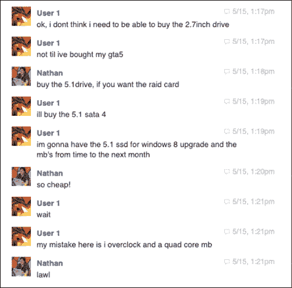
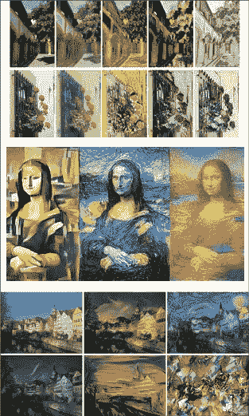
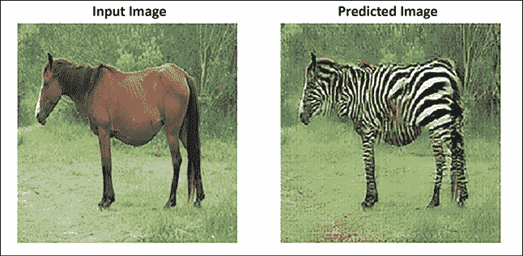
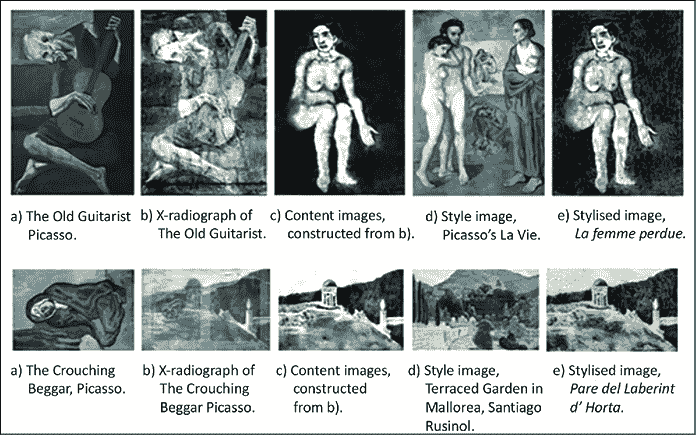
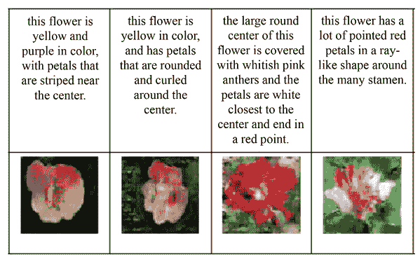

# 第一章：生成人工智能简介：“从模型中“勾画”数据

在本章中，我们将深入探讨生成模型的各种应用。在此之前，我们将退后一步，详细研究生成模型与其他类型的机器学习的区别。区别在于任何机器学习算法的基本单位：概率以及我们用数学量化我们遇到的数据的形状和分布的各种方法。

在本章的其余部分，我们将 covers：

+   AI 的应用

+   判别和生成模型

+   实施生成模型

+   概率的规则

+   为什么使用生成模型？

+   生成模型的独特挑战

# AI 的应用

在 2018 年 10 月的纽约，国际拍卖行佳士得在**印刷品与多重品**展销会上以 43.25 万美元的价格出售了**埃德蒙·贝拉米的肖像**(*图 1.1*)。这次销售之所以引人注目，既因为销售价格比这件作品的初步估计高出 45 倍，也因为这幅肖像的非同寻常的起源。与佳士得自 18 世纪以来出售的大多数其他艺术品不同，**埃德蒙·贝拉米的肖像**既不是用油画或水彩画完成的，其创作者甚至不是人类；相反，它是由一个复杂的机器学习算法完全产生的数字图像。创作者——一个名为 Obvious 的巴黎集体利用了从 14 世纪到 20 世纪创作的 1.5 万幅肖像的集合来调整一个能够生成美学上类似但合成的图像的人工神经网络模型。

图 1.1：埃德蒙·贝拉米的肖像¹

画像远非唯一一个展示机器学习惊人成果的领域。事实上，如果你在过去几年关注新闻，你可能已经看到许多关于现代 AI 系统应用于各种问题的开创性成果的故事，从硬科学到数字艺术。像 Obvious 创建的深度神经网络模型现在可以在训练有素的医生水平上对人体解剖的 X 光图像进行分类，²在传统棋类游戏如围棋（一种类似国际象棋的亚洲游戏）³和多人游戏⁴中战胜人类大师，并且对法语翻译成英语时对语法细微差别表现出惊人的敏感性。⁵

## 判别模型和生成模型

这些人工智能的其他示例与生成**埃德蒙·贝拉米的肖像**的模型在一个重要的方面有所不同。在所有这些其他应用中，模型被呈现一组输入数据，例如英文文本、X 射线图像或游戏棋盘上的位置，这些数据与目标输出配对，例如翻译句子中的下一个词、X 射线图的诊断分类或游戏中的下一步。事实上，这可能是您在以往预测建模经验中最熟悉的 AI 模型类型；它们被广泛称为**判别**模型，其目的是在一组输入变量和目标输出之间创建映射。目标输出可以是一组离散类别（例如在翻译中下一个出现的英文单词），也可以是连续结果（例如预期一个客户在接下来的 12 个月内在在线商店中的消费金额）。

应该注意的是，这种模型，其中数据被**标记**或**评分**，仅代表了现代机器学习能力的一半。另一类算法，比如生成了在佳士得拍卖会上出售的人造肖像的算法，不会从输入变量中计算得分或标签，而是**生成新数据**。与判别模型不同，输入变量通常是与现实世界值无关的数字向量，甚至经常是随机生成的。这种模型——被称为**生成模型**——可以从随机噪声中产生复杂的输出，例如文本、音乐或图像，并且是本书的主题。

即使您当时不知道，您可能也曾在新闻中看到其他生成模型的实例，与前面提到的判别示例并列。一个突出的例子是深度伪造，这是一种视频，其中一个人的脸被系统地替换为另一个人的脸，通过使用神经网络重新映射像素。⁶

图 1.2：一个深度伪造图像⁷

也许您还看到过关于 AI 模型生成**虚假新闻**的报道，最初由 OpenAI 公司的科学家因担心其可能被用于在线制造宣传和误导而感到恐慌。⁸

图 1.3：使用 GPT-2 创建的聊天机器人对话⁹

在这些以及其他应用中，例如谷歌的语音助手 Duplex，它可以通过与人类实时动态创建对话来进行餐厅预订¹⁰，或者可以生成原创音乐作品的软件¹¹，我们被环绕着生成式人工智能算法的输出。

图 1.4：使用生成对抗网络（GANs）进行风格迁移的示例¹²

这些模型能够处理各种领域的复杂信息：创建逼真的图像或照片上的**滤镜** (*图 1.4*)，合成声音，对话文本，甚至是最佳玩视频游戏的规则。你可能会问，这些模型从哪里来？我如何能自己实现它们？我们将在下一节中更多地讨论这个问题。

## 实现生成模型

尽管生成模型理论上可以使用各种机器学习算法来实现，但在实践中，它们通常是通过深度神经网络构建的，这些网络非常适合捕捉图像或语言等数据的复杂变化。

在本书中，我们将专注于使用**TensorFlow 2.0**来实现这些深度生成模型的许多不同应用。TensorFlow 是一个 C++框架，有 Python 编程语言的 API，用于开发和应用深度学习模型。它是谷歌在 2013 年开源的，并且已经成为研发和部署神经网络模型的最受欢迎的库之一。

随着 2.0 版的发布，以前版本中开发的那些样板代码得到了清理，使用了高级抽象层，使我们能够专注于模型而不是计算过程的其它部分。最新版本还引入了**即时执行**的概念，允许网络计算按需运行，这将是我们实现某些模型的重要好处。

在接下来的章节中，你将学习不仅是这些模型背后的理论，还有在流行的编程框架中实现它们所需的实际技能。在*第二章*，*建立一个 TensorFlow 实验室*中，你将学习如何设置一个云环境，以便你可以使用**Kubeflow**框架来分布式运行 TensorFlow，并记录你的实验。

实际上，正如我将在*第三章*，*深度神经网络的构建模块*中更详细地描述的那样，自 2006 年以来，大规模神经网络模型的**深度学习**研究已经产生了各种各样的生成模型应用。其中第一个是**受限玻尔兹曼机**，它被堆叠在多个层中以创建**深度信念网络**。我将在*第四章*，*教网络生成数字*中描述这两种模型。后来的创新包括**变分自动编码器**（**VAEs**），它们可以有效地从随机数生成复杂的数据样本，我将在*第五章*，*使用 VAEs 用神经网络绘制图片*中描述这些技术。

我们还将在本书的*第六章*，*使用 GAN 生成图像*中更详细地讨论用于创建**埃德蒙·贝拉米的肖像**的算法 GAN。从概念上讲，GAN 模型在两个神经网络之间创建竞争。一个（称为**生成器**）从一组随机数开始生成逼真的（或者在 Obvious 的实验中，艺术性的）图像，并应用数学变换。在某种意义上，生成器就像一名艺术学生，从笔触和创意灵感中创作新的绘画。

第二个网络，被称为**判别器**，试图分类一幅图片是否来自一组真实世界的图片，还是由生成器创建。因此，判别器就像一个老师，评分学生是否产生了与他们试图模仿的绘画相媲美的作品。随着生成器变得越来越擅长欺骗判别器，它的输出越来越接近于它被设计来复制的历史示例。

有许多类 GAN 模型，附加变体在*第七章*，*使用 GAN 进行风格迁移*，和*第十一章*，*使用生成模型创作音乐*，在我们讨论高级模型时涵盖。生成模型中的另一个关键创新是在自然语言数据领域。通过以一种计算可扩展的方式代表句子中单词之间的复杂相互关系，Transformer 网络及其基于其之上构建的**双向编码器 Transformer**（**BERT**）模型呈现了在应用中生成文本数据的强大构建模块，如聊天机器人，在*第九章*，*文本生成方法的崛起*，和*第十章*，*NLP 2.0：使用 Transformer 生成文本*中我们将更详细地讨论。

在*第十二章*，*使用生成式 AI 玩视频游戏：GAIL* 中，您还将看到诸如 GAN 和 VAE 等模型如何被用于生成不仅仅是图像或文本，而是一组允许使用强化学习算法开发的游戏网络更高效地处理和导航其环境的规则集——本质上，学会学习。生成模型是一个不断增长的巨大研究领域，所以遗憾的是，我们无法在本书中涵盖每一个主题。对于感兴趣的读者，进一步主题的参考资料将在*第十三章*，*生成式 AI 的新兴应用*中提供。

要开始一些背景信息，让我们讨论一下概率规则。

# 概率规则

在最简单的层面上，模型，无论是用于机器学习还是更经典的方法，如线性回归，都是关于各种数据如何相互关联的数学描述。

在建模任务中，我们通常考虑将数据集的变量分成两大类：

1.  **独立数据**，主要是指模型的 **输入**，用 *X* 表示。这些可以是分类特征（例如某学生所在的六所学校中的“0”或“1”），连续的（例如相同学生的身高或考试成绩），或序数的（班级中学生的排名）。

1.  **依赖数据** 相反，则是我们模型的输出，用 *Y* 表示。（请注意，在某些情况下，*Y* 是一个 **标签**，可用于条件产生输出，例如在条件 GAN 中。）与自变量一样，这些可以是连续的、分类的或序数的，它们可以是数据集每个元素的个体元素或多维矩阵（张量）。

那么如何使用统计描述我们模型中的数据呢？换句话说，我们如何定量描述我们可能看到的值，以及频率如何，哪些值更有可能一起出现？一种方式是询问数据中观察特定值的可能性，或者该值的概率。例如，如果我们想知道掷六面骰子出现 4 的概率是多少，答案是平均来说，我们会在六次掷骰子中看到一次 4。我们写为：

*P(X=4) =* *⅙* *= 16.67%*

其中 *P* 表示 *概率为*。

什么定义了特定数据集的允许概率值？如果我们想象数据集所有可能值的集合，比如掷骰子的所有值，那么概率将每个值映射到 0 和 1 之间的数。最小值是 0，因为我们不可能有看到结果的负概率；最不可能的结果是我们永远不会看到特定值的机会，或者是 0%的概率，比如在六面骰子上掷出 7。同样，我们也不可能有大于 100%的观察结果概率，其值为 1；概率为 1 的结果是绝对确定的。与数据集相关联的这组概率值属于离散类（例如骰子的面）或无限潜在值的集合（例如身高或体重的变化）。不过，在任一情况下，这些值必须遵循某些规则，这些规则是由数学家安德烈·科尔莫戈洛夫在 1933 年描述的 **概率公理**。

1.  观察的概率（掷骰子点数、特定身高等）是 0 到 1 之间的非负有限数。

1.  在所有可能观察空间中至少出现一项观察结果的概率是 1。

1.  不同、互斥事件的联合概率是各个事件概率的总和。

尽管这些规则可能看起来抽象，但你将会在*第三章*，*深度神经网络的基础组件*中看到，它们与开发神经网络模型直接相关。例如，规则 1 的一个应用是在预测目标类别的**softmax**函数中生成介于 1 和 0 之间的概率。规则 3 用于将这些结果归一化到 0-1 范围内，保证它们是深度神经网络的相互独立的预测（换句话说，实际世界中的图像逻辑上不能同时被分类为狗和猫，而只能是狗或猫，这两个结果的概率是可加的）。最后，第二条规则提供了我们可以使用这些模型生成数据的理论保证。

然而，在机器学习和建模的背景下，我们通常不只是对观察到一条输入数据的概率*X*感兴趣；我们更想知道，基于这些数据，*Y*的**条件**概率是多少。换句话说，我们想知道基于数据对一组数据的标签有多大可能性。我们将此表示为*给定 X 的 Y 的概率*，或者*给定 X 条件下的 Y 的概率*：

*P(Y|X)*

我们还可以询问关于*Y*和*X*的另一个问题，即它们一起发生或它们的**联合概率**有多大，这可以使用前面的条件概率表达式表示如下：

*P(X, Y) = P(Y|X)P(X) = P(X|Y)(Y)*

此公式表示*X 和 Y 的概率*。在*X*和*Y*完全独立的情况下，这就是它们的乘积：

*P(X|Y)P(Y) = P(Y|X)P(X) = P(X)P(Y)*

你会发现，这些表达式在我们讨论*第四章*，*教授网络生成数字*中的**补充先验**和**受限玻尔兹曼机**模拟独立数据样本的能力中变得重要。它们也是贝叶斯定理的构建模块，我们将在下一节中讨论。

## 判别建模和生成建模以及贝叶斯定理

现在让我们考虑这些条件和联合概率规则如何与我们为各种机器学习应用构建的预测模型相关联。在大多数情况下——比如预测电子邮件是否欺诈性或客户未来生命周期价值的美元金额——我们对条件概率*P(Y|X=x)*感兴趣，其中*Y*是我们试图建模的结果集，*X*表示输入特征，*x*是输入特征的特定值。如前所述，这种方法被称为**判别建模**。¹⁴判别建模试图学习数据*X*与结果*Y*之间的直接映射。

另一种理解判别建模的方法是在贝叶斯定理的背景下，¹⁵它关联了数据集的条件和联合概率：

*P(Y|X) = P(X|Y)P(Y)/P(X) = P(X, Y)/P(X)*

在贝叶斯公式中，表达式*P(X|Y)/P(X)*被称为**似然**或观察到的*X*给出*Y*观察概率的支持证据。*P(Y)*是**先验**或结果的合理性，*P(Y|X)*是**后验**或给出到目前为止与结果相关的所有独立数据的观察概率。概念上，贝叶斯定理表明结果的概率是其基线概率与此结果的输入数据条件概率的乘积。

这个定理是作者去世两年后发表的，在前言中理查德·普赖斯描述它为上帝存在的一个数学论证，这或许是适当的，因为托马斯·贝叶斯在生前是一位牧师。

在判别学习的背景下，我们可以看到判别模型直接计算后验概率；我们可以有似然或先验模型，但在这种方法中并不需要。即使你可能没有意识到，你可能在机器学习工具包中使用的大多数模型都是判别模型，例如以下模型：

+   线性回归

+   逻辑回归

+   随机森林

+   梯度提升决策树（GBDT）

+   支持向量机（SVM）

前两种（线性回归和逻辑回归）是在数据*X*的条件下模型结果*Y*，使用正态或高斯函数（线性回归）或 S 型函数（逻辑回归）。相比之下，最后三种没有正式的概率**模型**—它们计算将*X*映射到*Y*的函数（一组树用于随机森林或 GDBT，或者 SVM 的内积分布），使用损失或错误函数来调整这些估计值。鉴于这种非参数性质，一些作者认为这构成了一类**非模型**判别算法。(16)

相比之下，**生成模型**试图学习标签和输入数据的联合分布*P(Y, X)*。回想一下通过联合概率的定义：

*P(X, Y) = P(X|Y)P(Y)*

我们可以将贝叶斯定理重写如下：

*P(Y|X) = P(X, Y)/P(X)*

与判别情况不同，我们的目标不是使用*P(Y|X)*直接映射*X*到*Y*，而是模拟*X*和*Y*的联合概率*P(X, Y)*。虽然我们可以使用*X*和*Y*的联合分布来计算后验概率*P(Y|X)*并学习一个**目标**模型，但我们也可以使用此分布来通过联合采样新的元组*(x, y)*或使用目标标签*Y*采样新的数据输入，使用以下表达式：

*P(X|Y=y) = P(X, Y)/P(Y)*

生成模型的例子包括以下内容：

+   朴素贝叶斯分类器

+   高斯混合模型

+   潜在狄利克雷分配（LDA）

+   隐马尔可夫模型

+   深度波尔兹曼机

+   变分自动编码器（VAEs）

+   生成对抗网络（GANs）

朴素贝叶斯分类器，虽然被称为判别模型，但利用贝叶斯定理来学习*X*和*Y*的联合分布，假设*X*变量是独立的。同样，高斯混合模型描述了数据点属于一组正态分布之一的可能性，使用标签和这些分布的联合概率。

LDA 将文档表示为单词和一组潜在关键字列表（主题）的联合概率，这些关键字列表在文档中使用。隐马尔可夫模型表示数据的状态和下一个状态的联合概率，例如一周中连续几天的天气。正如你将在*第四章*中看到的，*教网络生成数字*，深度波尔兹曼机学习标签和与之相关的数据向量的联合概率。我们将在*第 5、6、7 和 11 章*中涵盖的 VAE 和 GAN 模型也利用联合分布来映射复杂的数据类型。这种映射允许我们从随机向量生成数据，或者将一种数据转换为另一种。

如前所述，生成模型的另一个观点是，如果我们知道一个结果*Y*，它们允许我们生成*X*的样本。在前述列表中的前四个模型中，这种条件概率只是模型公式的一个组成部分，而后验估计仍然是最终目标。然而，在最后三个示例中，它们都是深度神经网络模型，学习关于一个隐藏或**潜在**变量*Z*的*X*的条件是实际上的主要目标，以便生成新的数据样本。利用多层神经网络所允许的丰富结构，这些模型可以近似表示复杂数据类型的分布，如图像、自然语言和声音。此外，*Z*不再是目标值，而在这些应用中通常是一个随机数，仅用作从中生成大量假设数据点的输入。在我们有标签的程度上（比如一个生成的图像应该是狗还是海豚，或者一个生成的歌曲的流派），模型就是*P(X|Y=y, Z=z)*，其中标签*Y*控制着除了*Z*的随机性外其他数据的生成。

# 为什么使用生成模型？

现在我们已经回顾了生成模型的内容，并在概率语言中更正式地定义了它们，为什么我们首先需要这样的模型呢？它们在实际应用中提供了什么价值？为了回答这个问题，让我们简要地浏览一下我们将在本书的其余部分更详细地讨论的主题。

## 深度学习的承诺

正如已经指出的，我们将在本书中调查的许多模型都是深度的、多级的神经网络。过去 15 年来，深度学习模型在图像分类、自然语言处理和理解以及强化学习方面取得了复兴。这些进展是由于在调整和优化非常复杂的模型方面的传统挑战的突破，再加上对更大的数据集、分布式计算能力的访问以及诸如 TensorFlow 这样的框架，使得原型设计和复制研究变得更加容易。

## 构建更好的数字分类器

用于在机器学习和计算机视觉中基准算法的一个经典问题是对来自 MNIST 数据集的像素化图像中表示的 0-9 之间的哪个手写数字进行分类的任务。¹⁷ 在这个问题上取得的一个重大突破发生在 2006 年，当时多伦多大学和新加坡国立大学的研究人员发现了一种训练深度神经网络执行此任务的方法。¹⁸

他们的一个关键观察是，与其训练一个网络直接预测给定图像(*X*)的最可能的数字(*Y*)，不如首先训练一个可以**生成图像**的网络，然后作为第二步对它们进行分类。在*第四章*，*教网络生成数字*中，我将描述这个模型是如何改进过去的尝试的，并且如何创建自己的**受限玻尔兹曼机**和**深度玻尔兹曼机**模型，这些模型可以生成新的 MNIST 数字图像。

## 生成图像

使用 MNIST 数据集的方法生成像**Edmond Belamy 的肖像**这样的图像的一个挑战是，图像通常没有标签（如数字）；相反，我们想要使用一个潜在向量*Z*将随机数空间映射到一组人工图像，就像我在本章中早些时候描述的那样。

另一个限制是我们希望促进这些图像的**多样性**。如果我们输入在某个范围内的数字，我们希望知道它们生成不同的输出，并且能够调整生成的图像特征。为此，VAE 被开发出来生成多样化和逼真的图像（*图 1.5*）。

图 1.5：来自 VAE 的样本图像¹⁹

在图像分类任务的背景下，能够生成新图像可以帮助我们增加现有数据集中的示例数量，或者如果我们现有数据集严重偏向于特定类型的照片，则减少**偏差**。应用可能包括为时尚电子商务网站的产品照片生成替代姿势（角度、色调或透视镜头）（*图 1.6*）：

图 1.6：使用深度生成模型模拟替代姿势²⁰

# 风格转移和图像变换

除了将人工图像映射到随机数空间之外，我们还可以使用生成模型学习将一种图像映射到另一种图像。这种模型可以用于将一幅马的图像转换为斑马的图像（*图 1.7*），创建**深度伪造视频**，其中一个演员的脸被另一个演员的脸替换，或将照片转换为绘画（*图 1.2*和*1.4*）：²¹

图 1.7：CycleGAN 将条纹应用于马身上以生成斑马²²

应用生成建模的另一个引人注目的例子是一项研究，该研究发现了艺术家巴勃罗·毕加索的失落杰作被另一幅图像所覆盖的情况。在对**《老吉他手》**和**《蹲着的乞丐》**进行 X 射线成像后，显示了一个女人和一个风景的早期图像位于其下面（*图 1.8*），研究人员使用了毕加索蓝色时期的其他绘画或其他彩色照片（*图 1.8*）来训练**神经风格转移**模型，该模型将黑白图像（覆盖绘画的 X 射线放射图）转换为原始艺术作品的着色。然后，将这种转换模型应用于**隐藏**图像使他们能够重建**着色版本**的丢失绘画：

图 1.8：深度学习被用于给绘画场景的 X 射线图着色（中），通过从示例中学习颜色模式（列 d）生成失落艺术品的着色版本（极右）²³

所有这些模型都使用了之前提到的 GAN，这是一种在 2014 年提出的深度学习模型²⁴。除了改变图像的内容（如前面斑马的例子中），这些模型还可以用于将一幅图像映射到另一幅图像，比如成对的图像（例如具有相似面部特征的狗和人，如*图 1.9*），或者从图像生成文本描述（*图 1.10*）：

图 1.9：Sim-GAN 用于将人类映射到动物或动漫脸部²⁵

图 1.10：Caption-GAN 用于从图像生成描述²⁶

我们还可以根据一些辅助信息如标签来调节生成图像的属性，这是 GAN-Gogh 算法中采用的方法，它通过将期望的艺术家作为输入提供给生成模型来合成不同艺术家风格的图像（*图 1.4*）。²⁷我将在*第六章*，*使用 GAN 生成图像*和*第七章*，*使用 GAN 进行风格转移*中描述这些应用。

## 虚假新闻和聊天机器人

人类一直想要与机器交谈；第一个聊天机器人，ELIZA，²⁸是在 1960 年代在麻省理工学院编写的，它使用一个简单的程序来转换用户的输入并生成一个回应，以**心理治疗师**的方式频繁地以问题形式回应。

更复杂的模型可以生成全新的文本，例如谷歌的 BERT 和 GPT-2，^(29 30)它们使用一种称为**Transformers**的单元。神经网络中的Transformers模块允许网络在文本中的前导词汇上提出新词汇，在生成合理的语言片段时强调更相关的词汇。然后，BERT 模型将Transformers单元结合成自然语言模式和上下文重要性的强大多维编码。此方法可用于**自然语言处理**（**NLP**）任务的文档创建，或用于聊天机器人对话系统（*图 1.3*）。

## 声音合成

声音，如图像或文本，是一种复杂的、高维度的数据。音乐尤其复杂：它可能涉及一个或多个音乐家，具有时间结构，并且可以分为主题相关的段落。所有这些组成部分都被纳入到先前提到的模型中，比如 MuseGAN，该模型使用 GAN 生成这些各种组件，并将它们合成为逼真但合成的音乐曲目。我将在*第十一章*“用生成模型创作音乐”中描述 MuseGAN 及其变种的实施。

## 游戏规则

前述应用涉及我们可以看到、听到或阅读的数据类型。然而，生成模型还可以用于生成规则。这在深度学习的一种流行应用中很有用：使用算法玩棋盘游戏或 Atari 视频游戏。³¹

虽然这些应用传统上使用**强化学习**（**RL**）技术来训练网络以在这些游戏中采用最佳策略，但新的研究表明使用 GAN 来提出新规则作为训练过程的一部分，³²或生成合成数据来激发整体学习过程。³³我们将在*第十二章*“用生成 AI 玩视频游戏：GAIL”中研究这两种应用。

# 生成模型的独特挑战

鉴于生成模型具有的强大应用，实施它们的主要挑战是什么？正如所述，这些模型大多利用复杂数据，需要我们拟合大型模型来捕捉其特征和分布的所有细微差别。这对于我们必须收集的示例数量以充分代表我们试图生成的数据类型，以及构建模型所需的计算资源都有影响。我们将在*第二章*“设置 TensorFlow 实验室”中讨论使用云计算框架和**图形处理单元**（**GPU**）并行训练这些模型的技术。

由于数据复杂性及我们试图生成数据而不是数字标签或值的事实，我们对模型**准确度**的概念变得更加复杂：我们不能简单地计算到单个标签或分数的距离。

我们将在*第五章*，*使用 VAE 进行神经网络绘图*，以及*第六章*，*使用 GAN 进行图像生成*中讨论深度生成模型（如 VAE 和 GAN 算法）采用不同方法来确定生成图像是否与真实世界图像可比。最后，正如提到的，我们的模型需要允许我们生成大量和**多样化**的样本，而我们将讨论的各种方法采用不同的方法来控制数据的多样性。

# 摘要

在本章中，我们讨论了生成建模是什么，以及它如何适应更熟悉的机器学习方法的格局。我使用概率论和贝叶斯定理来描述这些模型如何以与判别式学习相反的方式进行预测。

我们审查了生成式学习的用例，既针对特定类型的数据，也针对一般性的预测任务。最后，我们还研究了构建这些模型所面临的一些专门挑战。

在下一章中，我们将通过探索如何使用 Docker 和 Kubeflow 为 TensorFlow 2.0 设置开发环境，开始实际实现这些模型。

# 参考文献

1.  [`www.christies.com/features/A-collaboration-between-two-artists-one-human-one-a-machine-9332-1.aspx`](https://www.christies.com/features/A-collaboration-between-two-artists-one-human-one-a-machine-9332-)

1.  Baltruschat, I.M., Nickisch, H., Grass, M.等（2019）。*多标签胸部 X 射线分类的深度学习方法比较*。Sci Rep 9, 6381。[`doi.org/10.1038/s41598-019-42294-8`](https://doi.org/10.1038/s41598-019-42294-8)

1.  *AlphaGo*（无日期）。DeepMind。2021 年 4 月 20 日检索自[`deepmind.com/research/case-studies/alphago-the-story-so-far`](https://deepmind.com/research/case-studies/alphago-the-story-so-far)

1.  AlphaStar 团队（2019 年 10 月）。*AlphaStar：使用多智能体强化学习在《星际争霸 II》中达到大师级水平*。DeepMind。[`deepmind.com/blog/article/AlphaStar-Grandmaster-level-in-StarCraft-II-using-multi-agent-reinforcement-learning`](https://deepmind.com/blog/article/AlphaStar-Grandmaster-level-in-StarCraft-II-using-multi-agent-reinforcement-learning)

1.  Devlin, J., Chang, M., Lee, K., Toutanova, K.（2019）。*BERT：用于语言理解的深度双向转换器的预训练*。arXiv。[`arxiv.org/abs/1810.04805v2`](https://arxiv.org/abs/1810.04805v2)

1.  Brandon, J.（2018 年 2 月 16 日）。*可怕的高科技色情：令人毛骨悚然的“深度假视频”正在兴起*。福克斯新闻。[`www.foxnews.com/tech/terrifying-high-tech-porn-creepy-deepfake-videos-are-on-the-rise`](https://www.foxnews.com/tech/terrifying-high-tech-porn-creepy-deepfake-videos-are-on-the-rise)

1.  [`seanbmcgregor.com/DeepfakeDetectionGame.html`](https://seanbmcgregor.com/DeepfakeDetectionGame.html)

1.  *更好的语言模型及其影响*。（2019 年 2 月 14 日）。OpenAI。[`openai.com/blog/better-language-models/`](https://openai.com/blog/better-language-models/)

1.  [`devopstar.com/static/2293f764e1538f357dd1c63035ab25b0/d024a/fake-facebook-conversation-example-1.png`](https://devopstar.com/static/2293f764e1538f357dd1c63035ab25b0/d024a/fake-facebook-conversation-examp)

1.  Leviathan Y., Matias Y. (2018 年 5 月 8 日)。*Google Duplex：用于电话实现真实世界任务的 AI 系统*。Google AI 博客。 [`ai.googleblog.com/2018/05/duplex-ai-system-for-natural-conversation.html`](https://ai.googleblog.com/2018/05/duplex-ai-system-for-natural-conversation.html)

1.  Hao-Wen Dong, Wen-Yi Hsiao, Li-Chia Yang 和 Yi-Hsuan Yang。*MuseGAN*。[`salu133445.github.io/musegan/`](https://salu133445.github.io/musegan/)

1.  [`neurohive.io/wp-content/uploads/2018/06/neural-style-transfer-example-e1530287419338.jpg`](https://neurohive.io/wp-content/uploads/2018/06/neural-style-transfer-example-e1530287419338.jpg)

1.  Kolmogorov A. N., (1956). *概率论基础*.（第 2 版）。纽约：切尔西出版公司。 [`www.york.ac.uk/depts/maths/histstat/kolmogorov_foundations`](https://www.york.ac.uk/depts/maths/histstat/kolmogorov_foundations)

1.  Jebara, Tony., (2004). *机器学习：判别式与生成式*。Kluwer Academic (Springer)。[`www.springer.com/gp/book/9781402076473`](https://www.springer.com/gp/book/9781402076473)

1.  Bayes Thomas, (1763) *LII. 解决机会命理学问题的尝试*。由已故牧师 Bayes 先生 F.R.S.与约翰坎顿先生的信交流。R. Soc.53370–418\. [`royalsocietypublishing.org/doi/10.1098/rstl.1763.0053`](https://royalsocietypublishing.org/doi/10.1098/rstl.1763.0053)

1.  Jebara, Tony., (2004). *机器学习：判别式与生成式*。Kluwer Academic (Springer)。[`www.springer.com/gp/book/9781402076473`](https://www.springer.com/gp/book/9781402076473)

1.  [`yann.lecun.com/exdb/mnist/`](http://yann.lecun.com/exdb/mnist/)

1.  G. Hinton, S. Osindero, & Y.-W. Teh. (2005). *用于深度信念网络的快速学习算法*。[www.cs.toronto.edu/~fritz/absps/ncfast.pdf](http://www.cs.toronto.edu/~fritz/absps/ncfast.pdf)

1.  [`jaan.io/images/variational-autoencoder-faces.jpg`](https://jaan.io/images/variational-autoencoder-faces.jpg) 和 [`miro.medium.com/max/2880/1*jcCjbdnN4uEowuHfBoqITQ.jpeg`](https://miro.medium.com/max/2880/1*jcCjbdnN4uEowuHfBoqITQ.jpeg)

1.  Esser, P., Haux, J., Ommer, B., (2019). *用于图像合成的无监督稳健潜在特征分解*. arXiv。[`arxiv.org/abs/1910.10223`](https://arxiv.org/abs/1910.10223)

1.  *CycleGAN*。TensorFlow Core。2021 年 4 月 26 日检索自 [`www.tensorflow.org/tutorials/generative/cyclegan`](https://www.tensorflow.org/tutorials/generative/cyclegan)

1.  [`www.tensorflow.org/tutorials/generative/images/horse2zebra_2.png`](https://www.tensorflow.org/tutorials/generative/images/horse2zebra_2.png)

1.  Bourached, A., Cann, G. (2019). *失落的艺术品*. arXiv:1909.05677\. [`arxiv.org/pdf/1909.05677.pdf`](https://arxiv.org/pdf/1909.05677.pdf)

1.  Goodfellow, I. J., Pouget-Abadie, J., Mirza, M., Xu, B., Warde-Farley, D., Ozair, S., Courville, A., Bengio, Y. (2014). *生成对抗网络*. arXiv. [`arxiv.org/abs/1406.2661`](https://arxiv.org/abs/1406.2661)

1.  Goodfellow, I. J., Pouget-Abadie, J., Mirza, M., Xu, B., Warde-Farley, D., Ozair, S., Courville, A., Bengio, Y. (2014). *生成对抗网络*. arXiv. [`arxiv.org/abs/1406.2661`](https://arxiv.org/abs/1406.2661)

1.  Gorti, S. K., Ma, Jeremy (2018). *使用循环一致性对抗网络的文本-图像-文本翻译*. arXiv. [`arxiv.org/abs/1808.04538`](https://arxiv.org/abs/1808.04538)

1.  rkjones4, adam-hanna, erincr & rodrigobdz (2020). GANGogh. GitHub 代码库. [`github.com/rkjones4/GANGogh`](https://github.com/rkjones4/GANGogh )

1.  Weizenbaum Joseph. (1976) *计算机与人类的思维*. W. H. Freeman and company. [blogs.evergreen.edu/cpat/files/2013/05/Computer-Power-and-Human-Reason.pdf](http://blogs.evergreen.edu/cpat/files/2013/05/Computer-Power-and-Human-Reason.pdf)

1.  Schwartz B., (2019, October 25). *欢迎 BERT：谷歌最新的搜索算法，以更好地理解自然语言*. Search Engine Land. [`searchengineland.com/welcome-bert-google-artificial-intelligence-for-understanding-search-queries-323976`](https://searchengineland.com/welcome-bert-google-artificial-intelligence-for-understanding-search-qu)

1.  *更好的语言模型及其影响*. (2019, February 14). OpenAI. [`openai.com/blog/better-language-models/`](https://openai.com/blog/better-language-models/)

1.  Mnih V., Kavukcuoglu K., Silver D., Graves A., Antonoglou I., Wierstra D., Riedmiller M. (2013, January 01). *使用深度强化学习玩 Atari 游戏*. DeepMind. [`deepmind.com/research/publications/playing-atari-deep-reinforcement-learning`](https://deepmind.com/research/publications/playing-atari-deep-reinforcement-learning)

1.  Liu, Yang; Zeng, Yifeng; Chen, Yingke; Tang, Jing; Pan, Yinghui (2019). *自我改进的生成对抗强化学习*. AAMS 2019\. [`www.ifaamas.org/Proceedings/aamas2019/pdfs/p52.pdf`](http://www.ifaamas.org/Proceedings/aamas2019/pdfs/p52.pdf)

1.  Kasgari, A T Z, Saad, W., Mozaffari, M., Poor, H V (2020). *经验丰富的深度生成对抗强化学习用于无模型超可靠低延迟通信*. arXiv. [`arxiv.org/abs/1911.03264`](https://arxiv.org/abs/1911.03264)
