# 2

# 设置 TensorFlow 实验室

现在你已经在 *第一章* 中看到了生成模型的所有令人惊叹的应用，你可能想知道如何开始实施这些使用这些算法的项目。在本章中，我们将介绍一些工具，这些工具将在本书的其余部分中用于实现各种生成式 AI 模型中使用的深度神经网络。我们的主要工具是由 Google^(1 2) 开发的 *TensorFlow 2.0* 框架；然而，我们还将使用其他一些资源来简化实现过程（在 *2.1 表格* 中总结）。

我们可以广泛分类这些工具：

+   用于可复制的依赖管理的资源（Docker，Anaconda）

+   数据整理和算法开发的探索性工具（Jupyter）

+   部署这些资源到云端并管理其生命周期的工具（Kubernetes，Kubeflow，Terraform）

| 工具 | 项目网址 | 用途 |
| --- | --- | --- |
| Docker | [`www.docker.com/`](https://www.docker.com/) | 应用程序运行时依赖封装 |
| Anaconda | [`www.anaconda.com/`](https://www.anaconda.com/) | Python 语言包管理 |
| Jupyter | [`jupyter.org/`](https://jupyter.org/) | 交互式 Python 运行时和绘图/数据探索工具 |
| Kubernetes | [`kubernetes.io/`](https://kubernetes.io/) | Docker 容器编排和资源管理 |
| Kubeflow | [`www.kubeflow.org/`](https://www.kubeflow.org/) | 基于 Kubernetes 开发的机器学习工作流引擎 |
| Terraform | [`www.terraform.io/`](https://www.terraform.io/) | 用于可配置和一致部署 Kubeflow 和 Kubernetes 的基础设施脚本语言 |
| VSCode | [`code.visualstudio.com/`](https://code.visualstudio.com/) | 集成开发环境（IDE） |

表格 2.1：用于生成对抗模型开发的技术栈

在本章中，我们将在我们将我们的代码从笔记本电脑移到云端的旅程中，首先描述一些有关 TensorFlow 在本地运行时的背景知识。然后，我们将描述一系列软件工具，这些工具将使在本地或云端运行全面的 TensorFlow 实验更加容易，如笔记本、容器和集群管理器等。最后，我们将通过一个简单的实例来介绍如何建立一个可重现的研究环境，运行本地和分布式训练，并记录我们的结果。我们还将探讨如何在一台机器内的多个 CPU/GPU 单元（纵向扩展）和云端的多台机器（横向扩展）上并行化 TensorFlow 以加速训练。通过本章的学习，我们将准备好扩展这个实验室框架，用各种生成式 AI 模型来实施项目。

首先，让我们深入了解 TensorFlow 的细节，这是本书剩余部分将用于开发模型的库。 TensorFlow 解决了神经网络模型开发中的哪些问题？它采用了哪些方法？它在多年来如何发展？为了回答这些问题，让我们回顾一些促成 TensorFlow 发展的深度神经网络库的历史。

# 深度神经网络的发展和 TensorFlow

正如我们将在 *第三章* *深度神经网络的构建模块* 中看到的那样，深度神经网络本质上由矩阵运算（加法、减法、乘法）、非线性变换和使用这些组件的导数进行的基于梯度的更新组成。

在学术界，研究人员通常使用诸如 MATLAB³ 这样的高效原型工具来运行模型和准备分析。虽然这种方法允许进行快速实验，但它缺乏工业软件开发的元素，例如 **面向对象**（**OO**）开发，它可以实现可重现性和干净的软件抽象，从而使工具可以被大型组织所采用。这些工具对于大型数据集的扩展也存在困难，并且对于此类工业用途可能会带来繁重的许可费用。然而，在 2006 年之前，这种计算工具在大多数情况下仍然足够。然而，随着应用深度神经网络算法处理的数据集的增长，取得了突破性的成果，如：

+   ImageNet 数据集上的图像分类⁴

+   在 YouTube 视频中大规模无监督地发现图像模式⁵

+   创造了能够像人类一样能够玩雅达利视频游戏和围棋的人工智能代理^(6 7)

+   通过 Google 开发的 BERT 模型实现的最先进的语言翻译⁸

在这些研究中开发的模型随着它们应用到的数据集的规模而变得复杂起来（*请参阅*表 2.2 *以了解其中一些模型的巨大规模*）。由于工业用例需要稳健且可扩展的框架来开发和部署新的神经网络，一些学术团体和大型技术公司投资于通用工具包的开发，用于实现深度学习模型。这些软件库将常见模式编码为可重用的抽象，使即使复杂的模型通常也可以体现在相对简单的实验脚本中。

| 模型名称 | 年份 | # 参数 |
| --- | --- | --- |
| AlexNet | 2012 | 61M |
| YouTube CNN | 2012 | 1B |
| Inception | 2014 | 5M |
| VGG-16 | 2014 | 138M |
| BERT | 2018 | 340M |
| GPT-3 | 2020 | 175B |

表 2.2：按年份分类的模型参数数量

这些框架的早期示例包括 Theano，⁹ 蒙特利尔大学开发的 Python 包，以及 Torch，¹⁰ 由 Facebook 的研究人员在 Lua 语言中编写，后来被转移到 Python，以及由 Google¹¹开发的具有 Python 绑定的 C++运行时的 TensorFlow。

在本书中，我们将主要使用 TensorFlow 2.0，因为它被广泛采用，并且它具有方便的高级界面**Keras**，可以抽象出大部分关于定义常规层和模型架构的重复工作。

TensorFlow 是 Google 内部称为**DistBelief**的工具的开源版本。¹²DistBelief 框架由分布式工作者（在一组机器上运行的独立计算过程）组成，这些工作者会对网络进行正向和反向梯度下降处理（我们将在*第三章*，*深度神经网络的构建基块*中讨论训练神经网络的常见方式），并将结果发送给**参数服务器**进行更新。DistBelief 框架中的神经网络被表示为一个**有向无环图**（**DAG**），以损失函数结束，产生与观察目标（如图像类别或代表翻译模型中句子中最可能的下一个词的词汇概率分布）进行比较的标量（数值）。

DAG 是一种软件数据结构，由节点（**操作**）和数据（**边**）组成，信息仅沿着边的单向流动（因此`有向`），而且没有循环（因此`无环`）。

尽管 DistBelief 允许 Google 生产出多个大型模型，但它有一些限制：

+   首先，Python 脚本接口是使用一组对应 C++中底层实现的预定义层开发的；添加新颖的层类型需要在 C++中编码，这对生产力构成了障碍。

+   其次，虽然该系统非常适合使用基本的**随机梯度下降**（**SGD**）（我们将在*第三章*，*深度神经网络的构建基块*中更详细地描述的算法）在大规模数据上训练前馈网络，但它缺乏灵活性，无法容纳循环、强化学习或对抗学习范式 —— 后者对于我们在本书中实现的许多算法贯穿全文非常重要。

+   最后，这个系统难以*缩小规模*，比如在具有 GPU 的台式机和具有多个核心的分布式环境中运行相同的作业，部署还需要不同的技术栈。

这些考虑共同促使 TensorFlow 作为一种通用的深度学习计算框架的发展：一种可以让科学家灵活地尝试新的层架构或前沿的训练范式，同时还允许这种实验在笔记本电脑（用于早期工作）和计算集群（用于扩展更成熟的模型）上使用相同的工具运行，同时还通过为两者提供一个公共运行时来简化研究和开发代码之间的过渡。

尽管这两个库都共享计算图的概念（将网络表示为操作（节点）和数据（边缘）的图形）和数据流编程模型（其中矩阵操作通过图的有向边缘传递并对其应用操作），但 TensorFlow 与 DistBelief 不同，设计为图的边缘是张量（n 维矩阵），图的节点是原子操作（加法、减法、非线性卷积或队列和其他高级操作），而不是固定的层操作——这允许在定义新计算时具有更大的灵活性，甚至允许进行突变和有状态更新（这些仅是图中的附加节点）。

数据流图本质上充当一个“占位符”，其中数据被插入到定义的变量中，并可以在单台或多台机器上执行。TensorFlow 在 C++运行时优化构建的数据流图，允许优化，例如向 GPU 发送命令。图的不同计算也可以在多台机器和硬件上执行，包括 CPU、GPU 和 TPU（Google 开发的自定义张量处理芯片，在 Google Cloud 计算环境中可用）¹¹，因为在 TensorFlow 中以高层次描述的相同计算被实现为在多个后端系统上执行。

因为数据流图允许可变状态，本质上，不再像 DistBelief 那样有一个集中的参数服务器（尽管 TensorFlow 也可以以参数服务器配置的方式分布式运行），因为持有状态的不同节点可以执行与任何其他工作节点相同的操作。此外，控制流操作（例如循环）允许对可变长度输入进行训练，例如在循环网络中（参见*第三章*，*深度神经网络的构建模块*）。在训练神经网络的情况下，每一层的梯度简单地表示为图中的附加操作，允许使用相同框架包含像速度这样的优化（如 RMSProp 或 ADAM 优化器，在*第三章*，*深度神经网络的构建模块*中描述）而不是修改参数服务器逻辑。在分布式训练的情况下，TensorFlow 还具有几个检查点和冗余机制（“备份”工作节点以防单个任务失败），使其适用于在分布式环境中进行稳健的训练。

## TensorFlow 2.0

尽管在数据流图中表示操作原语可以灵活定义 Python 客户端 API 内的新层，但也可能导致大量“样板”代码和重复的语法。出于这个原因，高级 API *Keras*¹⁴被开发出来提供高级抽象；层使用 Python 类表示，而特定运行环境（例如 TensorFlow 或 Theano）是执行该层的“后端”，就像原子 TensorFlow 运算符可以在 CPU、GPU 或 TPU 上具有不同的底层实现一样。尽管作为与框架无关的库开发，Keras 已包含在 TensorFlow 2.0 版本的主要发布中。为了可读性的目的，我们将在本书中大部分模型使用 Keras 来实现，而在需要实现特定操作或突出基础逻辑时，将恢复到底层的 TensorFlow 2.0 代码。请参阅*表 2.3*以比较这些库在低（TensorFlow）或高（Keras）级别上如何实现各种神经网络算法概念。

| 对象 | TensorFlow 实现 | Keras 实现 |
| --- | --- | --- |
| 神经网络层 | 张量计算 | Python 层类 |
| 梯度计算 | 图运行操作符 | Python 优化器类 |
| 损失函数 | 张量计算 | Python 损失函数 |
| 神经网络模型 | 图运行会话 | Python 模型类实例 |

表 2.3：TensorFlow 和 Keras 比较

为了向您展示 Keras 和 TensorFlow 1.0 在实现基本神经网络模型时所做的抽象的区别，让我们看一下使用这两个框架编写卷积层的示例（请参阅*第三章*，*深度神经网络的构建块*）。在第一种情况下，在 TensorFlow 1.0 中，您可以看到很多代码涉及显式指定变量、函数和矩阵操作，以及梯度函数和运行时会话来计算网络的更新。

这是 TensorFlow 1.0 中的多层感知器¹⁵：

```py
X = tf.placeholder(dtype=tf.float64)
Y = tf.placeholder(dtype=tf.float64)
num_hidden=128
# Build a hidden layer
W_hidden = tf.Variable(np.random.randn(784, num_hidden))
b_hidden = tf.Variable(np.random.randn(num_hidden))
p_hidden = tf.nn.sigmoid( tf.add(tf.matmul(X, W_hidden), b_hidden) )
# Build another hidden layer
W_hidden2 = tf.Variable(np.random.randn(num_hidden, num_hidden))
b_hidden2 = tf.Variable(np.random.randn(num_hidden))
p_hidden2 = tf.nn.sigmoid( tf.add(tf.matmul(p_hidden, W_hidden2), b_hidden2) )
# Build the output layer
W_output = tf.Variable(np.random.randn(num_hidden, 10))
b_output = tf.Variable(np.random.randn(10))
p_output = tf.nn.softmax( tf.add(tf.matmul(p_hidden2, W_output), 
           b_output) )
loss = tf.reduce_mean(tf.losses.mean_squared_error(
        labels=Y,predictions=p_output))
accuracy=1-tf.sqrt(loss)
minimization_op = tf.train.AdamOptimizer(learning_rate=0.01).minimize(loss)
feed_dict = {
    X: x_train.reshape(-1,784),
    Y: pd.get_dummies(y_train)
}
with tf.Session() as session:
    session.run(tf.global_variables_initializer())
    for step in range(10000):
        J_value = session.run(loss, feed_dict)
        acc = session.run(accuracy, feed_dict)
        if step % 100 == 0:
            print("Step:", step, " Loss:", J_value," Accuracy:", acc)
            session.run(minimization_op, feed_dict)
    pred00 = session.run([p_output], feed_dict={X: x_test.reshape(-1,784)}) 
```

相比之下，Keras 中相同卷积层的实现通过使用在 Python 类中体现的抽象概念（如层、模型和优化器）大大简化了。这些类封装了计算的底层细节，使代码逻辑更易读。

还要注意，在 TensorFlow 2.0 中，运行会话的概念（**惰性执行**，即仅在显式编译和调用时才计算网络）已经被弃用，而采用了渴望执行的方式，在调用网络函数（如 `call` 和 `compile`）时动态调用会话和图，网络行为就像任何其他 Python 类一样，而无需显式创建 `session` 作用域。使用 `tf.Variable()` 声明变量的全局命名空间概念也已被替换为**默认垃圾收集机制**。

这是 Keras 中的多层感知器层¹⁵：

```py
import TensorFlow as tf
from TensorFlow.keras.layers import Input, Dense
from keras.models import Model
l = tf.keras.layers
model = tf.keras.Sequential([
    l.Flatten(input_shape=(784,)),
    l.Dense(128, activation='relu'),
    l.Dense(128, activation='relu'),
    l.Dense(10, activation='softmax')
])
model.compile(loss='categorical_crossentropy', 
              optimizer='adam',
              metrics = ['accuracy'])
model.summary()
model.fit(x_train.reshape(-1,784),pd.get_dummies(y_train),nb_epoch=15,batch_size=128,verbose=1) 
```

现在我们已经了解了 TensorFlow 库的一些细节以及它为深度神经网络模型的开发（包括我们将在本书中实现的生成模型）而非常合适的原因，让我们开始建立我们的研究环境。虽然我们可以简单地使用像 pip 这样的 Python 包管理器在我们的笔记本电脑上安装 TensorFlow，但我们希望确保我们的过程尽可能健壮和可复制 - 这将使我们更容易将我们的代码打包到不同的机器上运行，或者通过指定我们在实验中使用的每个 Python 库的确切版本来保持我们的计算一致。我们将首先安装一个**集成开发环境**（**IDE**），这将使我们的研究更容易 - VSCode。

# VSCode

**Visual Studio Code**（**VSCode**）是由微软公司开发的开源代码编辑器，可用于许多编程语言，包括 Python。它允许调试，并与诸如 Git 等版本控制工具集成; 我们甚至可以在 VSCode 中运行 Jupyter 笔记本（我们将在本章后面描述）。安装说明因您使用的是 Linux、macOS 还是 Windows 操作系统而异：请查看您系统的单独说明，网址为 [`code.visualstudio.com`](https://code.visualstudio.com)。安装完成后，我们需要使用 Git 克隆本书项目的源代码副本，命令如下：

```py
git clone git@github.com:PacktPublishing/Hands-On-Generative-AI-with-Python-and-TensorFlow-2.git 
```

此命令将把本书项目的源代码复制到我们的笔记本电脑上，允许我们本地运行和修改代码。一旦您复制了代码，请使用 VSCode 打开此书的 GitHub 存储库（*图 2.1*）。我们现在准备开始安装我们将需要的一些工具；打开`install.sh`文件。

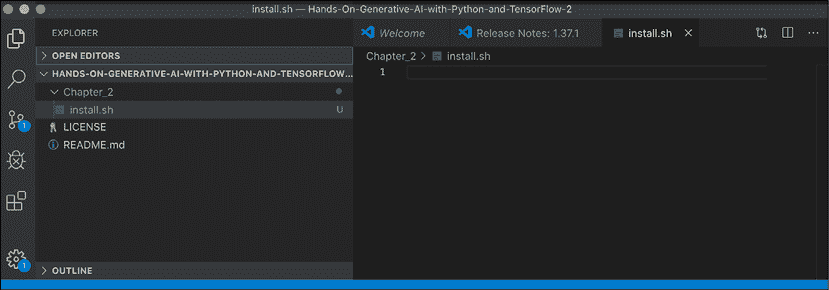

图 2.1：VSCode IDE

对于我们来说特别有用的一个功能是，VSCode 具有集成（*图 2.2*）终端，我们可以在其中运行命令：您可以通过选择**View**，然后从下拉列表中选择**Terminal**来访问此功能，这将打开一个命令行提示：

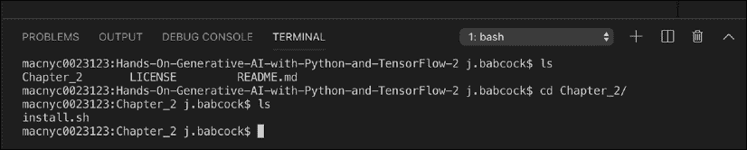

图 2.2：VSCode 终端

选择**TERMINAL**选项卡，并选择解释器为**bash**；现在您应该能够输入正常的命令。将目录更改为`Chapter_2`，我们将在其中运行我们的安装脚本，您可以在 VSCode 中打开该脚本。

我们将运行的安装脚本将下载并安装我们在最后几章中将使用到的各种组件；我们将使用的全面框架是`Kubeflow`库，它处理我们在本卷的后几章中将使用到的各种数据和培训流水线。在本章的其余部分，我们将介绍 Kubeflow 是如何构建在 Docker 和 Kubernetes 之上的，以及如何在几个流行的云提供商上设置 Kubeflow。

**Kubernetes**（Kubeflow 基于此技术）本质上是一种管理使用**Docker**创建的容器化应用程序的方式，它允许创建和持久化可重现、轻量级的执行环境以适用于各种应用。虽然我们将使用 Docker 创建可重复的实验运行时，以了解其在虚拟化解决方案整体景观中的位置以及为什么它对现代应用程序开发如此重要，让我们稍微偏离一下，详细描述 Docker 的背景。

# Docker：一个轻量级的虚拟化解决方案

开发强大的软件应用程序的一个持续挑战是使它们在与开发它们的机器不同的机器上运行相同。这些环境上的差异可能涵盖多个变量：操作系统、编程语言库版本和硬件，如 CPU 型号。

在处理这种异构性时，传统上一种方法是使用**虚拟机**（**VM**）。虽然虚拟机能够在多样化的硬件和操作系统上运行应用程序，但它们也受到资源密集型的限制（*图 2.3*）：每个运行在主机上的虚拟机都需要资源开销来运行完全独立的操作系统，以及所有来宾系统中的应用程序或依赖项。

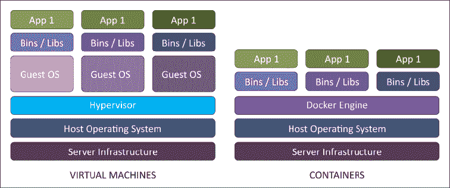

图 2.3：虚拟机与容器¹⁶

然而，在某些情况下，这是一种不必要的开销级别；我们不一定需要运行一个完全独立的操作系统，而只需要一个一致的环境，包括一个操作系统内的库和依赖项。对于指定运行时环境的**轻量级框架**的需求促使了 2013 年**Docker 项目**的创建，用于容器化。本质上，容器是运行应用程序的环境，包括所有依赖项和库，允许可重现部署 Web 应用程序和其他程序，例如数据库或机器学习流水线中的计算。对于我们的用例，我们将使用它提供一个可重现的 Python 执行环境（Python 语言版本和库）来运行我们生成式机器学习流水线中的步骤。

本章余下部分的许多示例和本书中的项目需要安装 Docker。有关如何为您的特定操作系统安装 Docker 的说明，请参阅[此处](https://docs.docker.com/install/)的指南。要验证您已成功安装该应用程序，请在终端上运行以下命令，该命令将打印出可用的选项：

```py
docker run hello-world 
```

## 重要的 Docker 命令和语法

要了解 Docker 的工作原理，了解用于所有 Docker 容器的模板**Dockerfile**是有用的。作为示例，我们将使用 Kubeflow 项目中的 TensorFlow 容器笔记本示例（[链接](https://github.com/kubeflow/kubeflow/blob/master/components/example-notebook-servers/jupyter-tensorflow-full/cpu.Dockerfile)）。

此文件是 Docker 应如何采用基本操作环境、添加依赖项并在打包后执行软件的一组说明：

```py
FROM public.ecr.aws/j1r0q0g6/notebooks/notebook-servers/jupyter-tensorflow:master-abf9ec48
# install - requirements.txt
COPY --chown=jovyan:users requirements.txt /tmp/requirements.txt
RUN python3 -m pip install -r /tmp/requirements.txt --quiet --no-cache-dir \
 && rm -f /tmp/requirements.txt 
```

虽然容器之间的确切命令会有所不同，但这将让您了解我们可以如何使用容器来管理应用程序——在这种情况下，使用一致的库集运行 Jupyter 笔记本进行交互式机器学习实验。一旦我们为我们的特定操作系统安装了 Docker 运行时，我们将通过运行以下命令来执行这样一个文件：

```py
Docker build -f <Dockerfilename> -t <image name:tag> 
```

当我们这样做时，会发生一些事情。首先，我们从远程存储库中检索`base`文件系统或 `image`，这有点类似于我们在使用 Java 构建工具（如 Gradle 或 Maven）或 Python 的 pip 安装程序时，从 Artifactory 收集 JAR 文件的方式。有了这个文件系统或 `image`，然后我们为 Docker `build` 命令设置所需的变量，比如用户名和 TensorFlow 版本，以及容器的运行时环境变量。我们确定将用于运行命令的 shell 程序，然后安装我们需要运行 TensorFlow 和笔记本应用程序的依赖项，并指定在启动 Docker 容器时要运行的命令。然后，我们使用由基本 `image 名称`和一个或多个 `tags`（比如版本号，或者在许多情况下，简单地用时间戳来唯一标识这个 image）组成的标识符保存这个快照。最后，要实际启动运行这个容器的笔记本服务器，我们将发出以下命令：

```py
Docker run <image name:tag> 
```

默认情况下，Docker 会运行在 `Dockerfile` 文件中的可执行命令；在我们目前的示例中，这是启动笔记本服务器的命令。然而，并非一定如此；我们也可以有一个 `Dockerfile`，它只是为应用程序构建一个执行环境，并发出在该环境内运行的命令。在这种情况下，命令看起来会像这样：

```py
Docker run <image name:tag> <command> 
```

`Docker` run 命令允许我们测试我们的应用程序是否可以成功在 `Dockerfile` 指定的环境中运行；然而，通常我们希望在云中运行此应用程序，以便利用分布式计算资源或能够托管向全球公开的 Web 应用程序，而不是在本地。要做到这一点，我们需要将构建的镜像移到一个远程存储库，使用 push 命令，这个远程存储库可能与我们最初拉取初始镜像的存储库相同，也可能不同。

```py
Docker push <image name:tag> 
```

注意，image 名称可以包含对特定注册表的引用，比如本地注册表或在主要云提供商（如 AWS 的 **弹性容器服务（ECS）**，Azure 的 **Azure Kubernetes 服务（AKS）** 或 Google 的容器注册表）上托管的注册表。将镜像发布到远程注册表允许开发人员共享镜像，并使我们可以在云中部署容器。

## 使用 Docker-compose 连接 Docker 容器

到目前为止，我们只讨论了一些基本的 Docker 命令，这些命令可以让我们在单个容器中运行单个服务。然而，你也许能够理解，在“现实世界”中，我们通常需要同时运行一个或多个应用程序 – 例如，一个网站将同时有一个获取和处理用户活动数据的网络应用程序和一个用于记录信息的数据库实例。在复杂的应用程序中，网站甚至可能由多个专门用于特定用例的小型网络应用程序或**微服务**组成，比如前端、用户数据或订单管理系统。对于这些类型的应用程序，我们需要多个容器彼此通信。Docker-compose 工具（[`docs.docker.com/compose/`](https://docs.docker.com/compose/)）就是为此类应用程序而设计的：它允许我们使用`YAML`格式在应用文件中指定多个 Docker 容器。例如，一个具有 Redis 数据库实例的网站配置可能如下：

```py
version: '3'
services:
  web:
    build: .
    ports:
    - "5000:5000"
    volumes:
    - .:/code
    - logvolume01:/var/log
    links:
    - redis
  redis:
    image: redis
volumes:
  logvolume01: {} 
```

代码 2.1：Docker Compose 的 yaml 输入文件

这里的两个应用程序容器分别是`web`和`redis`数据库。文件还指定了与这两个应用程序相关联的卷（磁盘）。使用这个配置，我们可以运行以下命令：

```py
docker-compose up 
```

这将启动 YAML 文件中指定的所有容器，并允许它们彼此通信。然而，即使 Docker 容器和 docker-compose 允许我们使用一致的执行环境构建复杂的应用程序，当我们将这些服务部署到云端时，我们可能会遇到鲁棒性问题。例如，在一个网站应用程序中，我们无法保证应用程序运行的虚拟机会持续长时间，因此我们需要管理自愈和冗余的进程。这也与分布式机器学习流水线有关，其中我们不希望因为集群中的一个节点出现问题就不得不终止整个作业，因此我们需要备份逻辑来重新启动工作的一部分。此外，虽然 Docker 具有 docker-compose 功能来链接应用程序中的几个容器，但它没有健壮的规则来控制这些容器之间的通信，或者如何将它们作为一个单元进行管理。出于这些目的，我们转向 Kubernetes 库。

# Kubernetes：强大的多容器应用程序管理

Kubernetes 项目-有时缩写为 k8s-诞生于谷歌内部称为**Borg**的容器管理项目。Kubernetes 来自希腊词 navigator，如项目标识的七条辐射轮所示。¹⁸ Kubernetes 使用 Go 编程语言编写，提供了一个强大的框架，在由云提供商管理的底层资源上部署和管理 Docker 容器应用程序（例如**亚马逊网络服务**（**AWS**）、Microsoft Azure 和**Google 云平台**（**GCP**））。

Kubernetes 基本上是用来控制由一个或多个部署在云中的 Docker 容器组成的应用程序的工具；这个容器的集合称为**Pod**。每个 Pod 可以有一个或多个副本（以实现冗余），这称为**资源副本集**。Kubernetes 部署的两个主要组件是**控制平面**和**节点**。控制平面承载了部署和管理 Pod 的集中逻辑，由(*图 2.4*)组成：

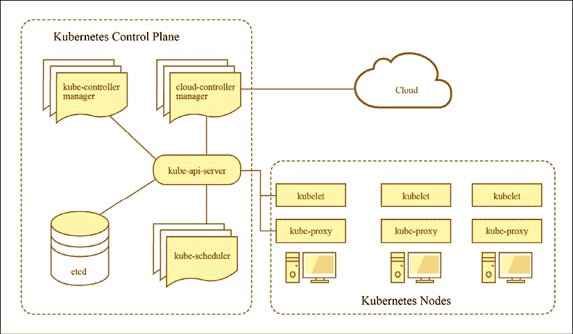

图 2.4：Kubernetes 组件¹⁸

+   **Kube-api-server**：这是主要的应用程序，它侦听用户的命令以部署或更新 Pod，或通过`ingress`管理对 Pod 的外部访问。

+   **Kube-controller-manager**：管理每个 Pod 副本数量等功能的应用程序。

+   **Cloud-controller-manager**：管理特定于云提供商的功能。

+   **Etcd**：维护不同 Pod 的环境和状态变量的键值存储。

+   **Kube-scheduler**：负责找到运行 Pod 的工作进程的应用程序。

虽然我们可以设置自己的控制平面，但在实践中，通常我们会将此功能由我们的云提供商管理，例如谷歌的**Google Kubernetes 引擎**（**GKE**）或亚马逊的**弹性 Kubernetes 服务**（**EKS**）。Kubernetes 节点-集群中的各个单独的机器-每个都运行一个名为**kubelet**的应用程序，该应用程序监视运行在该节点上的 Pod。

现在，我们已经对 Kubernetes 系统有了一个高层次的了解，接下来让我们来看一下你将需要与 Kubernetes 集群进行交互、更新其组件以及启动和停止应用程序的重要命令。

## 重要的 Kubernetes 命令

为了与在云中运行的 Kubernetes 集群进行交互，我们通常使用**Kubernetes 命令行工具**（**kubectl**）。有关在您的操作系统上安装 kubectl 的说明可以在[`kubernetes.io/docs/tasks/tools/install-kubectl/`](https://kubernetes.io/docs/tasks/tools/install-kubectl/)找到。要验证您是否成功安装了 kubectl，可以在终端中再次运行`help`命令：

```py
kubectl --help 
```

与 Docker 一样，kubectl 有许多命令；我们将使用的一个重要命令是`apply`命令，它与`docker-compose`类似，它将一个 YAML 文件作为输入并与 Kubernetes 控制平面通信以启动、更新或停止 Pod：

```py
kubectl apply -f <file.yaml> 
```

作为 `apply` 命令运行方式的示例，让我们看一下用于部署 web 服务器 (`nginx`) 应用程序的 YAML 文件：

```py
apiVersion: v1
kind: Service
metadata:
  name: my-nginx-svc
  labels:
    app: nginx
spec:
  type: LoadBalancer
  ports:
  - port: 80
  selector:
    app: nginx
---
apiVersion: apps/v1
kind: Deployment
metadata:
  name: my-nginx
  labels:
    app: nginx
spec:
  replicas: 3
  selector:
    matchLabels:
      app: nginx
  template:
    metadata:
      labels:
        app: nginx
    spec:
      containers:
      - name: nginx
        image: nginx:1.7.9
        ports:
        - containerPort: 80 
```

此文件中指定的资源将按照文件中列出的顺序在 Kubernetes 集群节点上创建。首先，我们创建负载均衡器，它在`nginx` web 服务器的副本之间路由外部流量。`metadata` 用于为这些应用程序打标签，以便稍后使用 kubectl 进行查询。其次，我们使用一致的容器（镜像为 `1.7.9`）创建一组 `3` 个 `nginx` pod 的副本，它们分别使用其容器上的端口 `80`。

Kubernetes 集群的同一组物理资源可以在多个**虚拟**集群中共享，使用**命名空间** – 这使我们可以将资源分隔到多个用户或组之间。例如，这可以让每个团队运行自己的一组应用程序，并在逻辑上表现得好像他们是唯一的用户。稍后，在我们对 **Kubeflow** 的讨论中，我们将看到如何使用此功能在同一 Kubeflow 实例上逻辑分区项目。

## 用于配置管理的 Kustomize

像大多数代码一样，我们最终可能希望将用于向 Kubernetes 发出命令的 YAML 文件存储在版本控制系统中，例如 Git。这导致一些情况下这种格式可能不理想：例如，在机器学习管道中，我们可能执行超参数搜索，其中相同的应用程序以稍微不同的参数运行，导致大量重复的命令文件。

或者，我们可能有一些参数，例如 AWS 账户密钥，出于安全原因，我们不希望将其存储在文本文件中。我们还可能希望通过将我们的命令拆分为 `base` 和附加部分来增加重用性；例如，在 *代码 2.1* 中显示的 YAML 文件中，如果我们想要在不同的数据库中运行 ngnix，或者指定 Amazon、Google 和 Microsoft Azure 提供的不同云对象存储中的文件存储。

对于这些用例，我们将使用 Kustomize 工具（[`kustomize.io`](https://kustomize.io)），也可通过 kubectl 使用：

```py
kubectl apply -k <kustomization.yaml> 
```

或者，我们可以使用 Kustomize 命令行工具。`kustomization.yaml` 是一个 Kubernetes 应用程序的模板；例如，考虑以下模板，用于 Kubeflow 示例存储库中的训练作业（[`github.com/kubeflow/pipelines/blob/master/manifests/kustomize/sample/kustomization.yaml`](https://github.com/kubeflow/pipelines/blob/master/manifests/kustomize/sample/kustomization.yaml)）：

```py
apiVersion: kustomize.config.k8s.io/v1beta1
kind: Kustomization
bases:
  # Or
# github.com/kubeflow/pipelines/manifests/kustomize/env/gcp?ref=1.0.0
  - ../env/gcp
  # Kubeflow Pipelines servers are capable of 
  # collecting Prometheus metrics.
  # If you want to monitor your Kubeflow Pipelines servers 
  # with those metrics, you'll need a Prometheus server 
  # in your Kubeflow Pipelines cluster.
  # If you don't already have a Prometheus server up, you 
  # can uncomment the following configuration files for Prometheus.
  # If you have your own Prometheus server up already 
  # or you don't want a Prometheus server for monitoring, 
  # you can comment the following line out.
  # - ../third_party/prometheus
  # - ../third_party/grafana
# Identifier for application manager to apply ownerReference.
# The ownerReference ensures the resources get garbage collected
# when application is deleted.
commonLabels:
  application-crd-id: kubeflow-pipelines
# Used by Kustomize
configMapGenerator:
  - name: pipeline-install-config
    env: params.env
    behavior: merge
secretGenerator:
  - name: mysql-secret
    env: params-db-secret.env
    behavior: merge
# !!! If you want to customize the namespace,
# please also update 
# sample/cluster-scoped-resources/kustomization.yaml's 
# namespace field to the same value
namespace: kubeflow
#### Customization ###
# 1\. Change values in params.env file
# 2\. Change values in params-db-secret.env 
# file for CloudSQL username and password
# 3\. kubectl apply -k ./
#### 
```

我们可以看到此文件引用了位于相对路径 `../base` 的单独的 `kustomization.yaml` 文件中的 `base` 配置集。要编辑此文件中的变量，例如，要更改应用程序的命名空间，我们将执行：

```py
kustomize edit set namespace mykube 
```

我们还可以添加配置映射以传递给训练作业，使用键-值格式，例如：

```py
kustomize edit add configmap configMapGenerator --from-literal=myVar=myVal 
```

最后，当我们准备在 Kubernetes 上执行这些命令时，我们可以动态地`build`并应用所需的`kubectl`命令，假设`kustomization.yaml`在当前目录中。

```py
kustomize build . |kubectl apply -f - 
```

希望这些示例演示了 Kustomize 如何提供一种灵活的方式来使用模板生成我们在本书后面的工作流程中经常需要的 kubectl YAML；我们将经常利用它来参数化我们的工作流程。

现在我们已经了解了 Kubernetes 如何在云中管理 Docker 应用程序，以及 Kustomize 如何允许我们灵活地重用`kubectl yaml`命令，让我们看看这些组件如何在 Kubeflow 中联系在一起，以运行我们稍后将进行的创建 TensorFlow 生成式 AI 模型的实验。

# Kubeflow：一个端到端的机器学习实验室

正如本章开始时所描述的，端到端机器学习研究和开发的`lab`有许多组件（*表 2.1*），例如：

+   管理和版本化库依赖，例如 TensorFlow，并将其打包为可复现的计算环境

+   可视化数据并尝试不同设置的交互式研究环境

+   指定管道步骤的系统化方式 – 数据处理、模型调优、评估和部署

+   分布式运行建模过程所需资源的供应

+   具有快照历史版本的研究过程的强大机制

正如我们在本章前面所描述的，TensorFlow 被设计用于利用分布式资源进行训练。为了利用这一能力，我们将使用 Kubeflow 项目。Kubeflow 建立在 Kubernetes 之上，具有几个在管理端到端机器学习应用程序过程中有用的组件。要安装 Kubeflow，我们需要拥有现有的 Kubernetes 控制平面实例，并使用 kubectl 启动 Kubeflow 的各个组件。设置步骤会略有不同，取决于我们是使用本地实例还是主要云服务提供商之一。

## 通过 MiniKF 在本地运行 Kubeflow

如果我们想快速开始或在本地原型化我们的应用程序，我们可以避免设置云账户，而是使用虚拟机模拟我们在云中配置资源的方式。要在本地设置 Kubeflow，我们首先需要安装 VirtualBox ([`www.virtualbox.org/wiki/Downloads`](https://www.virtualbox.org/wiki/Downloads)) 以运行虚拟机，以及 Vagrant 以在 VirtualBox 虚拟机上运行配置，用于设置 Kubernetes 控制平面和 Kubeflow（[`www.vagrantup.com/downloads.html`](https://www.vagrantup.com/downloads.html)）。

安装了这两个依赖项后，创建一个新目录，切换到该目录并运行：

```py
vagrant init arrikto/minikf
vagrant up 
```

这将初始化 VirtualBox 配置并启动应用程序。现在，您可以导航到`http://10.10.10.10/`并按照说明启动 Kubeflow 和 Rok（Arrikto 创建，用于 Kubeflow 实验中使用的数据的存储卷）。一旦这些被提供，你应该看到一个像这样的屏幕（*图 2.5*）：

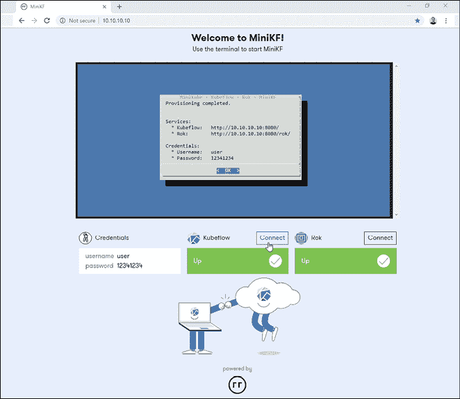

图 2.5：在虚拟盒子中的 MiniKF 安装界面¹⁹

登录到 Kubeflow 查看各个组件的仪表板（*图 2.6*）：

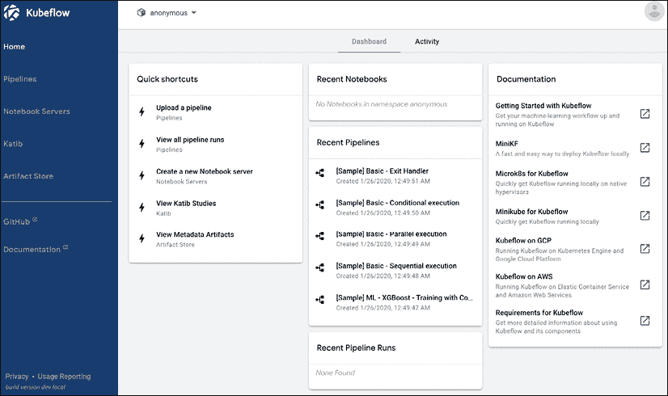

图 2.6：MiniKF 中的 Kubeflow 仪表板

我们将在后面回到这些组件，并了解 Kubeflow 提供的各种功能，但首先，让我们一起看看如何在云中安装 Kubeflow。

## 在 AWS 中安装 Kubeflow

在 AWS 上运行 Kubeflow，我们需要在云中提供一个 Kubernetes 控制平面。幸运的是，亚马逊提供了一个名为 EKS 的托管服务，它可以方便地提供一个控制平面来部署 Kubeflow。按照以下步骤在 AWS 上部署 Kubeflow：

1.  **注册 AWS 账户并安装 AWS 命令行界面**

    这是与各种 AWS 服务进行交互所需的，根据您平台上的说明位于[`docs.aws.amazon.com/cli/latest/userguide/cli-chap-install.html`](https://docs.aws.amazon.com/cli/latest/userguide/cli-chap-install.html)。安装完成后，输入：

    ```py
    aws configure 
    ```

    为了设置您的账户和密钥信息来提供资源。

1.  **安装 eksctl**

    这个命令行实用程序允许我们从命令行在亚马逊中提供一个 Kubernetes 控制平面。按照[`docs.aws.amazon.com/cli/latest/userguide/cli-chap-install.html`](https://docs.aws.amazon.com/cli/latest/userguide/cli-chap-install.html)上的说明进行安装。

1.  **安装 iam-authenticator**

    为了允许 kubectl 与 EKS 进行交互，我们需要使用 IAM 验证器提供正确的权限来修改我们的 kubeconfig。请参考[`docs.aws.amazon.com/eks/latest/userguide/install-aws-iam-authenticator.html`](https://docs.aws.amazon.com/eks/latest/userguide/install-aws-iam-authenticator.html)上的安装说明。

1.  **下载 Kubeflow 命令行工具**

    链接位于 Kubeflow 发布页面([`github.com/kubeflow/kubeflow/releases/tag/v0.7.1`](https://github.com/kubeflow/kubeflow/releases/tag/v0.7.1))。下载其中一个目录，并使用以下命令解压 tarball：

    ```py
    tar -xvf kfctl_v0.7.1_<platform>.tar.gz 
    ```

1.  **构建配置文件**

    输入 Kubeflow 应用程序目录（`${KF_DIR}`）、部署名称（`${KF_NAME}`）和部署的基本配置文件的路径（`${CONFIG_URI}`）的环境变量，位于[`raw.githubusercontent.com/kubeflow/manifests/v0.7-branch/kfdef/kfctl_aws.0.7.1.yaml`](https://raw.githubusercontent.com/kubeflow/manifests/v0.7-branch/kfdef/kfctl_aws.0.7.1.yaml)用于 AWS 部署，运行以下命令生成配置文件：

    ```py
    mkdir -p ${KF_DIR}
    cd ${KF_DIR}
    kfctl build -V -f ${CONFIG_URI} 
    ```

    这将在本地生成一个名为`kfctl_aws.0.7.1.yaml`的本地配置文件。如果这看起来像 Kustomize，那是因为`kfctl`在内部使用 Kustomize 来构建配置。我们还需要为本地配置文件的位置添加一个环境变量`${CONFIG_FILE}`，在这种情况下是：

    ```py
    export CONFIG_FILE=${KF_DIR}/kfctl_aws.0.7.1.yaml 
    ```

1.  **在 EKS 上启动 Kubeflow**

    使用以下命令启动 Kubeflow：

    ```py
    cd ${KF_DIR}
    rm -rf kustomize/ 
    kfctl apply -V -f ${CONFIG_FILE} 
    ```

    所有 Kubeflow 组件变为可用将需要一些时间；您可以通过使用以下命令来检查进度：

    ```py
    kubectl -n kubeflow get all 
    ```

    一旦它们都可用，我们可以使用以下命令获取 Kubeflow 仪表板的 URL 地址：

    ```py
    kubectl get ingress -n istio-system 
    ```

这将带我们到上面的 MiniKF 示例中显示的仪表盘视图。请注意，在默认配置中，此地址对公众开放；对于安全应用程序，我们需要按照[`www.kubeflow.org/docs/aws/authentication/`](https://www.kubeflow.org/docs/aws/authentication/)中的说明添加身份验证。

## 在 GCP 中安装 Kubeflow

像 AWS 一样，**Google 云平台**（**GCP**）提供了一个托管的 Kubernetes 控制平面 GKE。我们可以使用以下步骤在 GCP 中安装 Kubeflow：

1.  **注册 GCP 账户并在控制台上创建一个项目**

    该项目将是与 Kubeflow 相关的各种资源所在的位置。

1.  **启用所需服务**

    在 GCP 上运行 Kubeflow 所需的服务包括：

    +   计算引擎 API

    +   Kubernetes 引擎 API

    +   身份和访问管理（IAM）API

    +   部署管理器 API

    +   云资源管理器 API

    +   云文件存储 API

    +   AI 平台培训和预测 API

1.  **设置 OAuth（可选）**

    如果您希望进行安全的部署，那么，与 AWS 一样，您必须按照说明添加身份验证到您的安装中，位于([`www.kubeflow.org/docs/gke/deploy/oauth-setup/`](https://www.kubeflow.org/docs/gke/deploy/oauth-setup/))。或者，您可以只使用 GCP 账户的用户名和密码。

1.  **设置 GCloud CLI**

    这类似于前一节中涵盖的 AWS CLI。安装指南可在[`cloud.google.com/sdk/`](https://cloud.google.com/sdk/)找到。您可以通过运行以下命令来验证您的安装：

    ```py
    gcloud --help 
    ```

1.  **下载 Kubeflow 命令行工具**

    链接位于 Kubeflow 发行版页面（[`github.com/kubeflow/kubeflow/releases/tag/v0.7.1`](https://github.com/kubeflow/kubeflow/releases/tag/v0.7.1)）。下载其中一个目录并使用以下命令解压 tar 文件：

    ```py
    tar -xvf kfctl_v0.7.1_<platform>.tar.gz 
    ```

1.  **登录 Google 云并创建用户凭据**

    接下来，我们需要创建一个登录账户和凭据令牌，用于与我们的账户中的资源进行交互。

    ```py
    gcloud auth login
    gcloud auth application-default login 
    ```

1.  **设置环境变量并部署 Kubeflow**

    与 AWS 一样，我们需要为一些关键环境变量输入值：包含 Kubeflow 配置文件的应用程序（`${KF_DIR}`），Kubeflow 部署的名称（`${KF_NAME}`），基本配置 URI 的路径（`${CONFIG_URI}`- 对于 GCP，这是[`raw.githubusercontent.com/kubeflow/manifests/v0.7-branch/kfdef/kfctl_gcp_iap.0.7.1.yaml`](https://raw.githubusercontent.com/kubeflow/manifests/v0.7-branch/kfdef/kfctl_gcp_iap.0.7.1.yaml)），Google 项目的名称（`${PROJECT}`）以及它所在的区域（`${ZONE}`）。

1.  **启动 Kubeflow**

    与 AWS 一样，我们使用 Kustomize 构建模板文件并启动 Kubeflow：

    ```py
    mkdir -p ${KF_DIR}
    cd ${KF_DIR}
    kfctl apply -V -f ${CONFIG_URI} 
    ```

    一旦启动了 Kubeflow，您可以使用以下命令获取仪表板的 URL：

    ```py
    kubectl -n istio-system get ingress 
    ```

## 在 Azure 上安装 Kubeflow

Azure 是微软公司的云服务，和 AWS 和 GCP 一样，我们可以利用它来安装 Kubeflow，利用在 Azure 云中驻留的 Kubernetes 控制平面和计算资源。

1.  **在 Azure 上注册账户**

    在[`azure.microsoft.com`](https://azure.microsoft.com)注册账号-可用于实验的免费层。

1.  **安装 Azure 命令行实用程序**

    请参阅[`docs.microsoft.com/en-us/cli/azure/install-azure-cli?view=azure-cli-latest`](https://docs.microsoft.com/en-us/cli/azure/install-azure-cli?view=azure-cli-latest)上平台的安装说明。您可以通过在本地计算机的命令行上运行以下命令来验证安装：

    ```py
    az 
    ```

    这应该会打印出您可以在控制台上使用的命令列表。首先，通过以下命令登录您的帐户：

    ```py
    az login 
    ```

    并输入您在*步骤 1*中注册的帐户凭据。您将被重定向到浏览器以验证您的帐户，之后您应该会看到类似以下的响应：

    ```py
    "You have logged in. Now let us find all the subscriptions to which you have access": …
    [
    { 
        "cloudName": …
        "id" ….
    …
        "user": {
    …
    }
    }
    ] 
    ```

1.  **为新集群创建资源组**

    我们首先需要创建新应用所在的资源组，使用以下命令：

    ```py
    az group create -n ${RESOURCE_GROUP_NAME} -l ${LOCATION} 
    ```

1.  **在 AKS 上创建 Kubernetes 资源**

    现在，在您的资源组上部署 Kubernetes 控制平面：

    ```py
    az aks create -g ${RESOURCE_GROUP_NAME} -n ${NAME} -s ${AGENT_SIZE} -c ${AGENT_COUNT} -l ${LOCATION} --generate-ssh-keys 
    ```

1.  **安装 Kubeflow**

    首先，我们需要获取凭据以在我们的 AKS 资源上安装 Kubeflow：

    ```py
    az aks get-credentials -n ${NAME}  -g ${RESOURCE_GROUP_NAME} 
    ```

1.  **安装 kfctl**

    安装并解压缩 tarball 目录：

    ```py
    tar -xvf kfctl_v0.7.1_<platform>.tar.gz 
    ```

1.  **设置环境变量**

    与 AWS 一样，我们需要为一些关键环境变量输入值：包含 Kubeflow 配置文件的应用程序（`${KF_DIR}`），Kubeflow 部署的名称（`${KF_NAME}`），和基本配置 URI 的路径（`${CONFIG_URI}`- 对于 Azure，这是[`raw.githubusercontent.com/kubeflow/manifests/v0.7-branch/kfdef/kfctl_k8s_istio.0.7.1.yaml`](https://raw.githubusercontent.com/kubeflow/manifests/v0.7-branch/kfdef/kfctl_k8s_istio.0.7.1.yaml)）。

1.  **启动 Kubeflow**

    与 AWS 一样，我们使用 Kustomize 构建模板文件并启动 Kubeflow：

    ```py
    mkdir -p ${KF_DIR}
    cd ${KF_DIR}
    kfctl apply -V -f ${CONFIG_URI} 
    ```

    一旦启动 Kubeflow，您可以使用端口转发将本地端口`8080`的流量重定向到集群中的端口`80`，以使用以下命令在`localhost:8080`上访问 Kubeflow 仪表板：

    ```py
    kubectl port-forward svc/istio-ingressgateway -n istio-system 8080:80 
    ```

## 使用 Terraform 安装 Kubeflow

对于这些云提供商，你可能会注意到我们有一套共同的命令；创建一个 Kubernetes 集群，安装 Kubeflow，并启动应用程序。虽然我们可以使用脚本来自动化这个过程，但想要像我们的代码一样，有一种方法来版本控制和持久化不同的基础设施配置，允许创建运行 Kubeflow 所需资源集合的可重现的配方，这将是可取的。这也有助于我们在不完全重写安装逻辑的情况下，潜在地在不同的云提供商之间移动。

模板语言**Terraform** ([`www.terraform.io/`](https://www.terraform.io/))是由 HashiCorp 创建的一种用于**基础设施即服务**（**IaaS**）的工具。就像 Kubernetes 有一个 API 来更新集群上的资源一样，**Terraform**允许我们使用 API 和模板语言来抽象不同的底层云提供商的交互，使用命令行工具和用 GoLang 编写的核心组件。Terraform 可以使用用户编写的插件进行扩展。

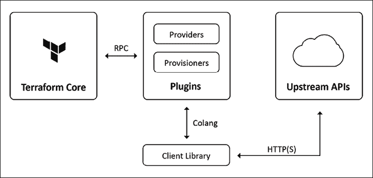

图 2.7：Terraform 架构²⁰

让我们以安装 Kubeflow 在 AWS 上使用 Terraform 指南的一个例子，位于[`github.com/aws-samples/amazon-eks-machine-learning-with-terraform-and-kubeflow`](https://github.com/aws-samples/amazon-eks-machine-learning-with-terraform-and-kubeflow)上。一旦你在 EC2 容器上建立所需的 AWS 资源并安装了 terraform，`aws-eks-cluster-and-nodegroup.tf` Terraform 文件用于使用命令创建 Kubeflow 集群： 

```py
terraform apply 
```

这个文件中有一些关键组件。一个是指定部署方面的变量：

```py
variable "efs_throughput_mode" {
   description = "EFS performance mode"
   default = "bursting"
   type = string
} 
```

另一个是指定我们正在使用的云提供商的规范：

```py
provider "aws" {
  region                  = var.region
  shared_credentials_file = var.credentials
resource "aws_eks_cluster" "eks_cluster" {
  name            = var.cluster_name
  role_arn        = aws_iam_role.cluster_role.arn
  version         = var.k8s_version

  vpc_config {
    security_group_ids = [aws_security_group.cluster_sg.id]
    subnet_ids         = flatten([aws_subnet.subnet.*.id])
  }

  depends_on = [
    aws_iam_role_policy_attachment.cluster_AmazonEKSClusterPolicy,
    aws_iam_role_policy_attachment.cluster_AmazonEKSServicePolicy,
  ]

  provisioner "local-exec" {
    command = "aws --region ${var.region} eks update-kubeconfig --name ${aws_eks_cluster.eks_cluster.name}"
  }

  provisioner "local-exec" {
    when    = destroy
    command = "kubectl config unset current-context"
  }

}
  profile   = var.profile
} 
```

还有另一个是诸如 EKS 集群这样的资源：

```py
resource "aws_eks_cluster" "eks_cluster" {
  name     = var.cluster_name
  role_arn = aws_iam_role.cluster_role.arn
  version  = var.k8s_version

  vpc_config {
    security_group_ids = [aws_security_group.cluster_sg.id]
    subnet_ids         = flatten([aws_subnet.subnet.*.id])
  }

  depends_on = [
    aws_iam_role_policy_attachment.cluster_AmazonEKSClusterPolicy,
    aws_iam_role_policy_attachment.cluster_AmazonEKSServicePolicy,
  ]

  provisioner "local-exec" {
    command = "aws --region ${var.region} eks update-kubeconfig --name ${aws_eks_cluster.eks_cluster.name}"
  }

  provisioner "local-exec" {
    when    = destroy
    command = "kubectl config unset current-context"
  }

} 
```

每次运行 Terraform `apply` 命令时，它都会遍历这个文件，确定要创建哪些资源，调用哪些底层 AWS 服务来创建它们，以及他们应该使用哪组配置进行配置。这为编排诸如 Kubeflow 之类的复杂安装提供了一种清晰的方式，这是一种版本化的、可扩展的模板语言。

现在我们已经成功地在本地或在云端的托管 Kubernetes 控制面板上安装了 Kubeflow，让我们看看平台上有哪些可用的工具。

# Kubeflow 组件简介

现在我们已经在本地或云端安装了 Kubeflow，让我们再次看看 Kubeflow 仪表板（*图 2.8*）：

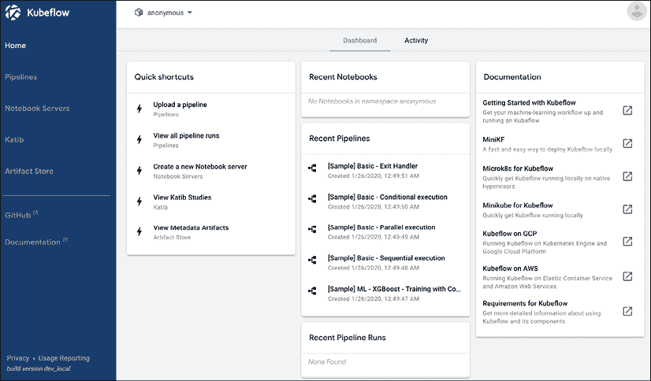

图 2.8：Kubeflow 仪表板

让我们来看看这个工具包提供了什么。首先，注意到在上面的面板中，我们有一个下拉菜单，其中指定了名称为`anonymous` – 这是前面提到的 Kubernetes 的`namespace`。虽然我们的默认值是`anonymous`，但我们可以在我们的 Kubeflow 实例上创建多个命名空间，以容纳不同的用户或项目。这可以在登录时完成，我们在那里设置一个个人资料（*图 2.9*）：

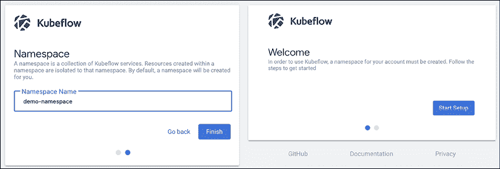

图 2.9：Kubeflow 登录页面

或者，与 Kubernetes 中的其他操作一样，我们可以使用 YAML 文件应用一个命名空间：

```py
apiVersion: kubeflow.org/v1beta1
kind: Profile
metadata:
  name: profileName  
spec:
  owner:
    kind: User
    name: userid@email.com 
```

使用`kubectl`命令：

```py
kubectl create -f profile.yaml 
```

一旦我们有了命名空间，我们可以做些什么呢？让我们看看可用的工具。

## Kubeflow 笔记本服务器

我们可以使用 Kubeflow 在一个命名空间中启动一个 Jupyter 笔记本服务器，在这里我们可以运行实验性的代码；我们可以通过用户界面中的**Notebook Servers**选项卡并选择**NEW SERVER**来启动笔记本（*图 2.10*）：

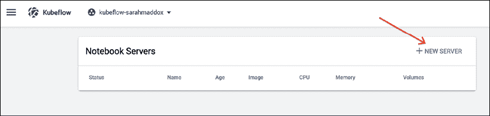

图 2.10：Kubeflow 笔记本创建

然后我们可以指定参数，比如要运行哪个容器（可能包括我们在之前关于 Docker 讨论中检查过的 TensorFlow 容器），以及分配多少资源（*图 2.11*）。

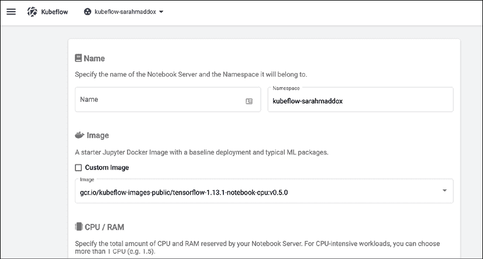

图 2.11：Kubeflow Docker 资源面板

您还可以指定一个**持久卷**（**PV**）来存储数据，即使笔记本服务器被关闭，数据仍然保留，以及特殊资源，比如 GPU。

一旦启动，如果您已经指定了一个包含 TensorFlow 资源的容器，您可以在笔记本服务器中开始运行模型。

# Kubeflow 流水线

对于笔记本服务器，我们举了一个单一容器（笔记本实例）应用的例子。Kubeflow 还通过**pipelines**功能为我们提供了运行多容器应用工作流（如输入数据、训练和部署）的能力。Pipelines 是遵循**领域特定语言**（**DSL**）的 Python 函数，用于指定将编译为容器的组件。

如果我们在用户界面上点击 pipelines，我们会被带到一个仪表盘（*图 2.12*）：

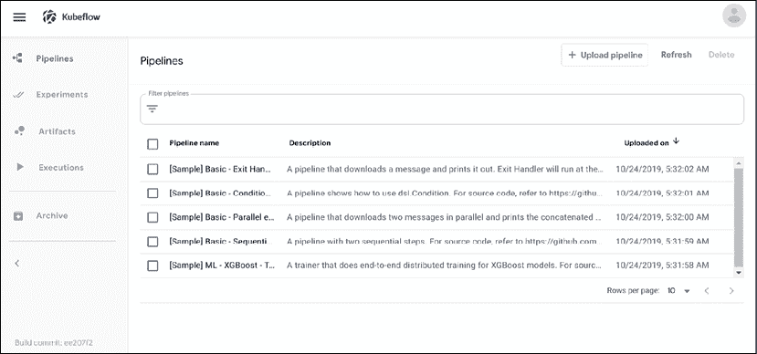

图 2.12：Kubeflow 流水线仪表盘

选择其中一个流水线，我们可以看到组件容器的视觉概览（*图 2.13*）。

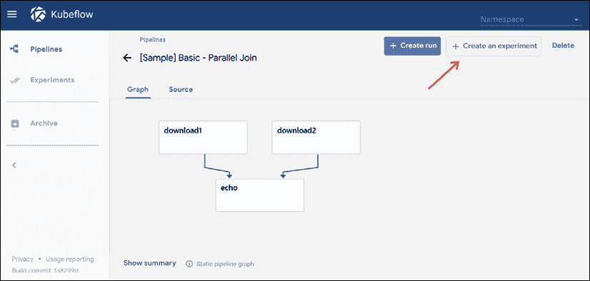

图 2.13：Kubeflow 流水线可视化

创建新的运行之后，我们可以为该流水线的特定实例指定参数（*图 2.14*）。

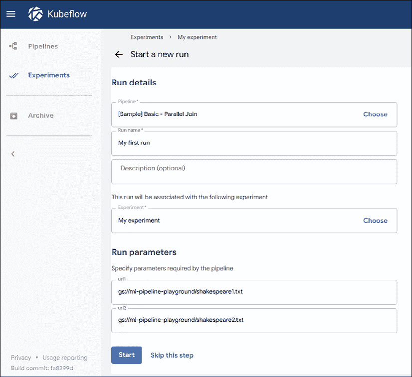

图 2.14：Kubeflow 流水线参数

一旦流水线创建完毕，我们可以使用用户界面来可视化结果（*图 2.15*）：

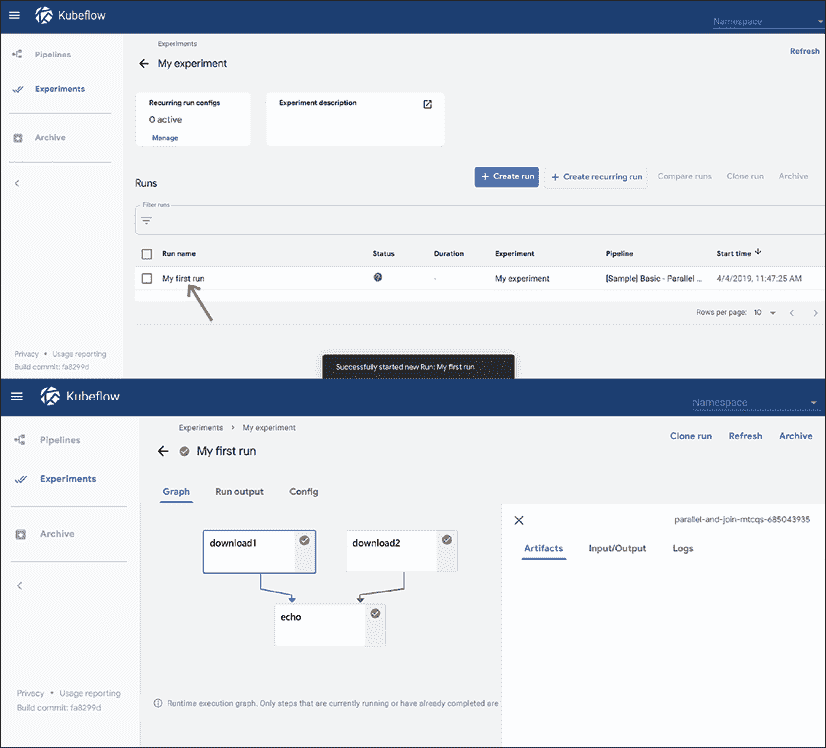

图 2.15：Kubeflow 流水线结果可视化

在幕后，用于生成此流水线的 Python 代码是使用流水线 SDK 编译的。我们可以指定组件来自具有 Python 代码的容器：

```py
@kfp.dsl.component
def my_component(my_param):
  ...
  return kfp.dsl.ContainerOp(
    name='My component name',
    image='gcr.io/path/to/container/image'
  )
or a function written in Python itself:
@kfp.dsl.python_component(
  name='My awesome component',
  description='Come and play',
)
def my_python_func(a: str, b: str) -> str: 
```

对于纯 Python 函数，我们可以使用编译器将其转换为一个操作：

```py
my_op = compiler.build_python_component(
  component_func=my_python_func,
  staging_gcs_path=OUTPUT_DIR,
  target_image=TARGET_IMAGE) 
```

然后我们使用 `dsl.pipeline` 装饰器将此操作添加到流水线中：

```py
@kfp.dsl.pipeline(
  name='My pipeline',
  description='My machine learning pipeline'
)
def my_pipeline(param_1: PipelineParam, param_2: PipelineParam):
  my_step = my_op(a='a', b='b') 
```

我们使用以下代码进行编译：

```py
kfp.compiler.Compiler().compile(my_pipeline, 'my-pipeline.zip') 
```

运行此代码：

```py
client = kfp.Client()
my_experiment = client.create_experiment(name='demo')
my_run = client.run_pipeline(my_experiment.id, 'my-pipeline', 
  'my-pipeline.zip') 
```

我们还可以将此 ZIP 文件上传到流水线 UI，在那里 Kubeflow 可以使用编译生成的 YAML 实例化作业。

现在你已经看到了生成单个流水线结果的过程，我们下一个问题是如何生成这样一个流水线的最佳参数。正如你将在*第三章*，*深度神经网络的构建模块*中看到的那样，神经网络模型通常具有多个配置，称为**超参数**，它们管理着它们的体系结构（例如层数、层大小和连接性）和训练范式（例如学习率和优化器算法）。Kubeflow 具有用于优化此类参数网格的内置实用程序，称为**Katib**。

# 使用 Kubeflow Katib 优化模型超参数

Katib 是一个框架，用于使用不同的输入运行同一作业的多个实例，例如神经架构搜索（用于确定神经网络中正确的层数和大小）和超参数搜索（例如为算法找到正确的学习率）。与我们见过的其他 Kustomize 模板一样，TensorFlow 作业指定了一个通用的 TensorFlow 作业，并为参数留有占位符：

```py
apiVersion: "kubeflow.org/v1alpha3"
kind: Experiment
metadata:
  namespace: kubeflow
  name: tfjob-example
spec:
  parallelTrialCount: 3
  maxTrialCount: 12
  maxFailedTrialCount: 3
  objective:
    type: maximize
    goal: 0.99
    objectiveMetricName: accuracy_1
  algorithm:
    algorithmName: random
  metricsCollectorSpec:
    source:
      fileSystemPath:
        path: /train
        kind: Directory
    collector:
      kind: TensorFlowEvent
  parameters:
    - name: --learning_rate
      parameterType: double
      feasibleSpace:
        min: "0.01"
        max: "0.05"
    - name: --batch_size
      parameterType: int
      feasibleSpace:
        min: "100"
        max: "200"
  trialTemplate:
    goTemplate:
        rawTemplate: |-
          apiVersion: "kubeflow.org/v1"
          kind: TFJob
          metadata:
            name: {{.Trial}}
            namespace: {{.NameSpace}}
          spec:
           tfReplicaSpecs:
            Worker:
              replicas: 1 
              restartPolicy: OnFailure
              template:
                spec:
                  containers:
                    - name: tensorflow 
                      image: gcr.io/kubeflow-ci/tf-mnist-with-
                             summaries:1.0
                      imagePullPolicy: Always
                      command:
                        - "python"
                        - "/var/tf_mnist/mnist_with_summaries.py"
                        - "--log_dir=/train/metrics"
                        {{- with .HyperParameters}}
                        {{- range .}}
                        - "{{.Name}}={{.Value}}"
                        {{- end}}
                        {{- end}} 
```

我们可以使用熟悉的 `kubectl` 语法来运行它：

```py
kubectl apply -f https://raw.githubusercontent.com/kubeflow/katib/master/examples/v1alpha3/tfjob-example.yaml 
```

或通过 UI（*图 2.16*）：

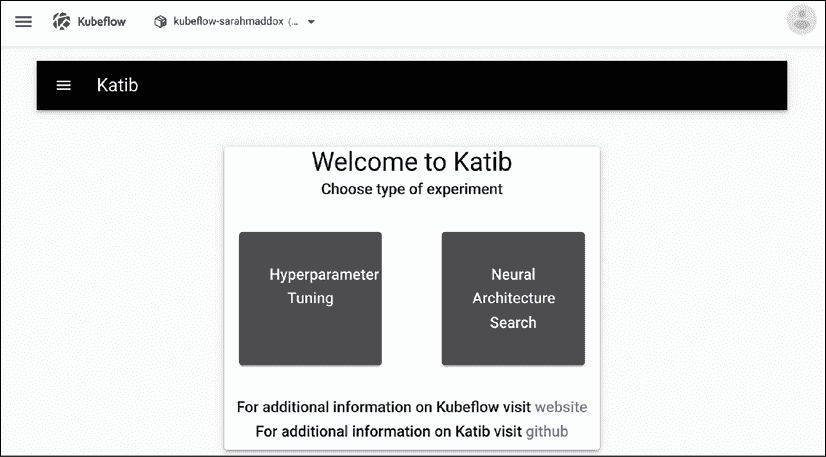

图 2.16：Kubeflow 上的 Katib UI

在这里你可以看到这些多参数实验的结果可视化，或者一个表格（*图 2.17*和*2.18*）。

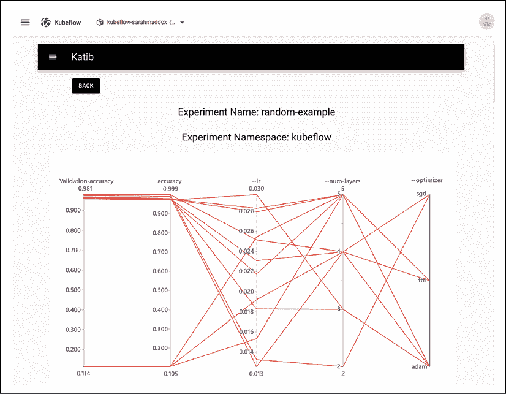

图 2.17：Kubeflow 多维参数优化的可视化

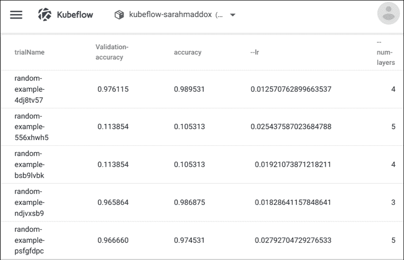

图 2.18：Kubeflow 多结果实验的 UI

# 总结

在本章中，我们概述了 TensorFlow 是什么，以及它如何作为深度学习研究的改进，我们还探讨了设置 IDE、VSCode 和可重现应用程序的基础，Docker 容器。为了编排和部署 Docker 容器，我们讨论了 Kubernetes 框架，以及如何使用其 API 扩展容器组。最后，我描述了 Kubeflow，一个建立在 Kubernetes 上的机器学习框架，它允许我们运行端到端的流水线、分布式训练和参数搜索，并为训练后的模型提供服务。然后，我们使用 Terraform，一种 IaaS 技术，设置了 Kubeflow 部署。

在深入具体项目之前，我们将介绍神经网络理论的基础知识以及你需要编写基本训练作业的 TensorFlow 和 Keras 命令，在 Kubeflow 上。

# 参考资料

1.  Abadi, Martín 等（2016 年）*TensorFlow：异构分布式系统上的大规模机器学习*。arXiv:1603.04467。[`arxiv.org/abs/1603.04467`](https://arxiv.org/abs/1603.04467)。

1.  谷歌。*TensorFlow*。检索日期为 2021 年 4 月 26 日，网址：[`www.tensorflow.org/`](https://www.tensorflow.org/)

1.  MATLAB，马萨诸塞州南提克：The MathWorks Inc。[`www.mathworks.com/products/matlab.html`](https://www.mathworks.com/products/matlab.html)

1.  Krizhevsky A., Sutskever I., & Hinton G E. *使用深度卷积神经网络的 ImageNet 分类*。[`papers.nips.cc/paper/4824-imagenet-classification-with-deepconvolutional-neural-networks.pdf`](https://papers.nips.cc/paper/4824-imagenet-classification-with-deepconvolutional-neural-networks.pdf)

1.  Dean J., Ng A. (2012 年 6 月 26 日)。*利用大规模脑模拟进行机器学习和 AI*。Google | The Keyword。[`blog.google/technology/ai/using-large-scale-brain-simulations-for/`](https://blog.google/technology/ai/using-large-scale-brain-simulations-for/)

1.  Mnih, V., Kavukcuoglu, K., Silver, D., Graves, A., Antonoglou, I., Wierstra, D., Riedmiller, M. (2013)。*使用深度强化学习玩 Atari 游戏*。arXiv:1312.5602。[`arxiv.org/abs/1312.5602`](https://arxiv.org/abs/1312.5602)

1.  Silver D, Schrittwieser J, Simonyan K, Antonoglou I, Huang A, Guez A, Hubert T, Baker L, Lai M, Bolton A, Chen Y, Lillicrap T, Hui F, Sifre L, van den Driessche G, Graepel T, Hassabis D. (2017)。*在没有人类知识的情况下掌握围棋*。*自然*。550(7676)：354-359。[`pubmed.ncbi.nlm.nih.gov/29052630/`](https://pubmed.ncbi.nlm.nih.gov/29052630/)

1.  Devlin, J., Chang, M. W., Lee, K., & Toutanova, K. (2018)。*Bert：用于语言理解的深度双向 transformers 的预训练*。arXiv:1810.04805。[`arxiv.org/abs/1810.04805`](https://arxiv.org/abs/1810.04805)

1.  Al-Rfou, R.,等人 (2016)。*Theano：快速计算数学表达的 Python 框架*。arXiv。[`arxiv.org/pdf/1605.02688.pdf`](https://arxiv.org/pdf/1605.02688.pdf)

1.  Collobert R., Kavukcuoglu K., & Farabet C. (2011)。*Torch7：一个类似 Matlab 的机器学习环境*。[`ronan.collobert.com/pub/matos/2011_torch7_nipsw.pdf`](http://ronan.collobert.com/pub/matos/2011_torch7_nipsw.pdf)

1.  Abadi M.,等人 (2015)。*TensorFlow：异构分布式系统上的大规模机器学习*。[download.tensorflow.org/paper/whitepaper2015.pdf](http://download.tensorflow.org/paper/whitepaper2015.pdf)

1.  Abadi, Martín，等人 (2016)。*TensorFlow：异构分布式系统上的大规模机器学习*。arXiv:1603.04467。[`arxiv.org/abs/1603.04467`](https://arxiv.org/abs/1603.04467 )

1.  Jouppi, N P，等人 (2017)。*数据中心张量处理单元的性能分析*。arXiv:1704.04760。[`arxiv.org/abs/1704.04760`](https://arxiv.org/abs/1704.04760)

1.  van Merriënboer, B., Bahdanau, D., Dumoulin, V., Serdyuk, D., Warde-Farley, D., Chorowski, J., Bengio, Y. (2015)。*Blocks 和 Fuel：深度学习框架*。arXiv:1506.00619。[`arxiv.org/pdf/1506.00619.pdf`](https://arxiv.org/pdf/1506.00619.pdf)

1.  [`stackoverflow.com/questions/57273888/keras-vs-TensorFlow-code-comparison-sources`](https://stackoverflow.com/questions/57273888/keras-vs-TensorFlow-code-comparison-sources)

1.  Harris M. (2016). *Docker vs. 虚拟机*. Nvidia developer blog. [`developer.nvidia.com/blog/nvidia-docker-gpu-server-application-deployment-made-easy/vm_vs_docker/`](https://developer.nvidia.com/blog/nvidia-docker-gpu-server-application-deployment-made-easy/vm_vs_do)

1.  一个视觉双关语 - 该项目的原始代码名称为 *Seven of Nine*，来自电视剧星际迷航：航海家号中的博格角色。

1.  Kubernetes 组件。 (2021 年 3 月 18 日) Kubernetes. [`kubernetes.io/docs/concepts/overview/components/`](https://kubernetes.io/docs/concepts/overview/components/)

1.  Pavlou C. (2019). *在本地端到端的 ML 管道：Notebooks 和 Kubeflow Pipelines 在新 MiniKF 上*. Medium | Kubeflow. [`medium.com/kubeflow/an-end-to-end-ml-pipeline-on-prem-notebooks-kubeflow-pipelines-on-the-new-minikf-33b7d8e9a836`](https://medium.com/kubeflow/an-end-to-end-ml-pipeline-on-prem-notebooks-kubeflow-pipelines-on-the-ne)

1.  Vargo S. (2017). *使用 Terraform 管理 Google 日历*. HashiCorp. [`www.hashicorp.com/blog/managing-google-calendar-with-terraform`](https://www.hashicorp.com/blog/managing-google-calendar-with-terraform)
