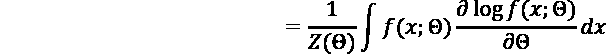

# 4

# 教授网络生成数字

在前一章中，我们涵盖了神经网络模型的构建基块。在这一章中，我们的第一个项目将重新创建深度学习历史上最具突破性的模型之一- **深度信念网络**（**DBN**）。DBN 是一个最早的多层网络，为其开发了一个可行的学习算法。除了具有历史意义外，该模型与本书主题有关，因为学习算法利用生成模型来预先将神经网络权重调整到合理配置，然后进行反向传播。

在本章中，我们将涵盖：

+   如何加载**修改的国家标准技术研究所**（**MNIST**）数据集并使用 TensorFlow 2 的数据集 API 进行转换。

+   如何通过最小化类似于物理公式的“能量”方程来训练**受限玻尔兹曼机**（**RBM**）- 一个简单的神经网络- 以生成图像。

+   如何堆叠多个 RBM 来生成 DBN 并应用前向和后向传递来预训练此网络以生成图像数据。

+   如何通过将这种预训练与使用 TensorFlow 2 API 的反向传播“微调”相结合来实现端到端的分类器。

# MNIST 数据库

在开发 DBN 模型时，我们将使用之前讨论过的数据集 - MNIST 数据库，其中包含手绘数字 0 到 9 的数字图像¹。该数据库是两组早期图像的组合，分别来自**国家标准技术研究所**（**NIST**）: 特殊数据库 1（由美国高中学生书写）和特殊数据库 3（由美国人口普查局员工书写）²，总共分为 60,000 个训练图像和 10,000 个测试图像。

原始数据集中的图像全部为黑白，而修改后的数据集将其标准化以适应 20x20 像素的边界框，并使用抗锯齿技术去除锯齿状边缘，导致清洁图像中间灰度值；它们被填充以获得最终分辨率为 28x28 像素。

在原始的 NIST 数据集中，所有的训练图像都来自局务员，而测试数据集来自高中学生，修改后的版本将这两组人群混合在训练和测试集中，以为机器学习算法提供一个更少偏见的人口。


图 4.1：NIST 数据集中的数字（左）³ 和 MNIST（右）⁴

将**支持向量机**（**SVMs**）早期应用于此数据集的结果显示出了 0.8%的错误率，⁵而最新的深度学习模型的错误率低至 0.23%。⁶ 你应该注意到，这些数字的获得不仅是由于使用的判别算法，还有"数据增强"技巧，如创建额外的翻译图像，其中数字已经偏移了几个像素，从而增加了算法学习的数据示例数量。由于其广泛的可用性，这个数据集已经成为许多机器学习模型的基准，包括深度神经网络。

该数据集也是 2006 年多层神经网络训练突破的基准，该突破实现了 1.25%的错误率（与前述示例不同，没有图像翻译）。⁷ 在本章中，我们将详细研究如何使用生成模型实现这一突破，并探讨如何构建我们自己的 DBN，以生成 MNIST 数字。

## 检索和加载 TensorFlow 中的 MNIST 数据集

训练自己的 DBN 的第一步是构造我们的数据集。本节将向您展示如何将 MNIST 数据转换为一种方便的格式，以便您可以使用一些 TensorFlow 2 的内置函数来训练神经网络，以简化操作。

让我们从 TensorFlow 中加载 MNIST 数据集开始。由于 MNIST 数据已经用于许多深度学习基准测试，TensorFlow 2 已经为加载和格式化此数据提供了方便的实用程序。为此，我们首先需要安装`tensorflow-datasets`库：

```py
pip install tensorflow-datasets 
```

安装完软件包后，我们需要导入它以及所需的依赖项：

```py
from __future__ import absolute_import
from __future__ import division
from __future__ import print_function
import matplotlib.pyplot as plt
import numpy as np
import tensorflow.compat.v2 as tf
import tensorflow_datasets as tfds 
```

现在我们可以使用构建器功能从**Google Cloud Storage**（**GCS**）本地下载 MNIST 数据：

```py
mnist_builder = tfds.builder("mnist")
mnist_builder.download_and_prepare() 
```

现在数据集将在我们的计算机磁盘上可用。正如前面所述，这些数据被分为训练数据集和测试数据集，您可以通过查看`info`命令来验证：

```py
info = mnist_builder.info
print(info) 
```

这给出了以下输出：

```py
tfds.core.DatasetInfo(
    name='mnist',
    version=3.0.1
    description='The MNIST database of handwritten digits.',
    homepage='http://yann.lecun.com/exdb/mnist/',
    features=FeaturesDict({
        'image': Image(shape=(28, 28, 1), dtype=tf.uint8),
        'label': ClassLabel(shape=(), dtype=tf.int64, num_classes=10),
    }),
    total_num_examples=70000,
    splits={
        'test': 10000,
        'train': 60000,
    },
    supervised_keys=('image', 'label'),
    citation="""@article{lecun2010mnist,
      title={MNIST handwritten digit database},
      author={LeCun, Yann and Cortes, Corinna and Burges, CJ},
      journal={ATT Labs [Online]. Available: http://yann. lecun. com/exdb/mnist},
      volume={2},
      year={2010}
    }""",
    redistribution_info=,
) 
```

正如您所看到的，测试数据集有 10,000 个示例，训练数据集有 60,000 个示例，图像为 28x28 像素，具有 10 个类别中的一个标签（0 到 9）。

让我们首先来看看训练数据集：

```py
mnist_train = mnist_builder.as_dataset(split="train") 
```

我们可以使用`show_examples`函数可视化绘制一些示例：

```py
fig = tfds.show_examples(info, mnist_train) 
```

这给出了以下图表：


图 4.2：来自 TensorFlow 数据集的 MNIST 数字示例

在这里，您还可以更清楚地看到应用了抗锯齿处理的灰度边缘，以使原始数据集的边缘看起来不那么锯齿状（颜色也已从*图 4.1*中的原始示例翻转）。

我们还可以通过从数据集中取一个元素，将其重新塑形为 28x28 数组，将其强制转换为 32 位浮点数，并以灰度形式绘制来绘制单个图像：

```py
flatten_image = partial(flatten_image, label=True)

for image, label in mnist_train.map(flatten_image).take(1):
    plt.imshow(image.numpy().reshape(28,28).astype(np.float32), 
               cmap=plt.get_cmap("gray"))
    print("Label: %d" % label.numpy()) 
```

这给出了以下图表：


图 4.3：TensorFlow 中的 MNIST 数字

这对于视觉检查很好，但是在本章的实验中，我们实际上需要将这些图像展平成向量。为了做到这一点，我们可以使用`map（）`函数，并验证数据集现在已经被展平；请注意，我们还需要将其转换为浮点数以便稍后在 RBM 中使用。RBM 还假设输入是二进制（0 或 1），所以我们需要重新缩放像素，范围从 0 到 256 到范围从 0 到 1：

```py
def flatten_image(x, label=True):
    if label:
        return (tf.divide(tf.dtypes.cast(tf.reshape(x["image"], (1,28*28)), tf.float32), 256.0) , x["label"])
    else:
        return (tf.divide(tf.dtypes.cast(tf.reshape(x["image"], (1,28*28)), tf.float32), 256.0))
for image, label in mnist_train.map(flatten_image).take(1):
    plt.imshow(image.numpy().astype(np.float32), cmap=plt.get_cmap("gray"))
    print("Label: %d" % label.numpy()) 
```

这得到了一个 784x1 的向量，这是数字"4"的"展平"版本的像素：


图 4.4: 在 TensorFlow 中将 MNIST 数字展平

现在我们已经将 MNIST 数据处理成一系列向量，我们准备开始实现一个 RBM 来处理这些数据，最终创建一个能够生成新图像的模型。

# 受限玻尔兹曼机：用统计力学生成像素

我们将应用于 MNIST 数据的神经网络模型的起源可以追溯到对哺乳动物大脑中的神经元如何一起传递信号并编码模式作为记忆的早期研究。通过使用物理学中的统计力学类比，本节将向您展示简单的网络如何"学习"图像数据的分布，并且可以用作更大网络的构建模块。

## 霍普菲尔德网络和神经网络的能量方程

正如我们在*第三章*讨论的*深度神经网络的基本组成部分*中所提到的，**赫布学习法**陈述："发射的神经元会产生联系"⁸，并且许多模型，包括多层感知器，都利用了这个想法来开发学习规则。其中一个模型就是**霍普菲尔德网络**，由几位研究人员在 1970-80 年代开发^(9 10)。在这个网络中，每个"神经元"都通过对称权重与其他所有神经元相连，但没有自连接（只有神经元之间的连接，没有自环）。

与我们在*第三章*学习的多层感知器和其他架构不同，霍普菲尔德网络是一个无向图，因为边是"双向的"。


图 4.5: 霍普菲尔德网络

霍普菲尔德网络中的神经元采用二进制值，要么是(-1, 1)，要么是(0, 1)，作为双曲正切或 Sigmoid 激活函数的阈值版本：


阈值（sigma）在训练过程中不会发生变化；为了更新权重，可以使用"**赫布学习法**"来使用一组*n*个二进制模式（所有神经元的配置）进行更新：


其中*n*是模式数，*e*是特定配置中神经元*i*和*j*的二进制激活。观察这个方程，你会发现如果神经元共享一个配置，它们之间的连接会被加强，而如果它们是相反的符号（一个神经元的符号为+1，另一个的符号为-1），它们之间的连接就会被削弱。按照这个规则迭代地加强或削弱连接，导致网络收敛到一个稳定的配置，类似于网络的特定激活的“记忆”，给定一些输入。这代表了生物有机体中的联想记忆模型——将不相关的思想链接在一起的记忆，就像 Hopfield 网络中的神经元被链接在一起一样。^(11 12)

除了表示生物记忆外，Hopfield 网络还与电磁学有一个有趣的相似点。如果我们将每个神经元视为粒子或“电荷”，我们可以用一个“自由能”方程描述该模型，表示该系统中的粒子如何相互排斥/吸引，以及系统在潜在配置分布上相对于平衡点的位置：


这里，w 是神经元*i*和*j*之间的权重，*s*是这些神经元的“状态”（要么是 1，“开”，要么是-1，“关”），sigma 是每个神经元的阈值（例如，它的总输入必须超过的值，才能将其设置为“开”）。当 Hopfield 网络处于其最终配置中时，它还最小化了为网络计算的能量函数的值，其中具有相同状态的单元通过强连接（*w*）连接。与特定配置相关联的概率由**Gibbs 测度**给出：


这里，*Z(B)*是一个归一化常数，表示与*“Chapter 1”，生成 AI 的介绍：“从模型中“绘制”数据* 中的贝叶斯概率函数中的归一化常数相同，表示网络的所有可能配置。

还要注意能量函数的定义中，神经元的状态只受到本地连接的影响（而不是受到所有网络中其他神经元的状态影响，无论它是否连接）；这也被称为**马尔科夫性质**，因为状态是“无记忆”的，仅取决于其立即“过去”（邻居）。实际上，*Hammersly-Clifford 定理*表明，任何具有相同无记忆属性的分布都可以使用 Gibbs 测度来表示。¹³

## 用受限玻尔兹曼机建模不确定性数据

我们可能对其他种类的分布感兴趣吗？虽然 Hopfield 网络从理论角度来看很有用，但其缺点之一是无法纳入实际物理或生物系统中存在的不确定性；与确定性的打开或关闭不同，现实世界的问题通常涉及一定程度的偶然性 - 磁铁可能会翻转极性，或者神经元可能会随机发射。

这种不确定性，或者*随机性*，反映在*Boltzmann 机器*中¹⁴——这是 Hopfield 网络的变体，其中一半的神经元（“可见”单元）从环境接收信息，而另一半（“隐藏”单元）只从可见单元接收信息。


图 4.6：Boltzmann 机器

Boltzmann 机器通过抽样随机打开（1）或关闭（0）每个神经元，并在许多迭代中收敛到能量函数的最小值所代表的稳定状态。这在*图 4.6*中以示意图的形式显示，网络的白色节点为“关闭”，蓝色节点为“开启”；如果我们模拟网络中的激活，这些值将随时间波动。

从理论上讲，像这样的模型可以用来模拟图像的分布，例如使用隐藏节点作为表示图像中每个像素的基础概率模型的“条形码”。然而，在实践中，这种方法存在问题。首先，随着 Boltzmann 网络中单元的数量增加，连接的数量呈指数增长（例如，必须在 Gibbs 测度的归一化常数中考虑的潜在配置数量激增），同样需要采样网络到平衡状态所需的时间也随之增加。其次，具有中间激活概率的单元的权重往往会呈现随机行走模式（例如，概率会随机增加或减少，但永远不会稳定到平衡值），直到神经元收敛，这也延长了训练时间。¹⁵

一个实用的修改是删除 Boltzmann 机器中的一些连接，即可见单元之间的连接和隐藏单元之间的连接，仅保留两种类型神经元之间的连接。这种修改称为 RBM，如*图 4.7*所示¹⁶：


图 4.7：RBM

正如之前描述的那样，可见单元是来自 MNIST 数据集的输入像素，而隐藏单元是该图像的编码表示。通过来回采样直到收敛，我们可以创建一个图像的生成模型。我们只需要一个学习规则，告诉我们如何更新权重以使能量函数收敛到其最小值；这个算法就是**对比散度**（**CD**）。为了理解为什么我们需要一个特殊的算法来处理 RBM，有助于重新思考能量方程以及我们如何采样获得网络的平衡。

## 对比散度：梯度的近似

如果我们回顾*第一章* *生成式人工智能简介：从模型中“生成”数据*，使用 RBM 创建图像的生成模型本质上涉及找到图像的概率分布，使用能量方程¹⁷：


其中*x*是一个图像，theta 是模型的参数（权重和偏置），*Z*是分区函数：


为了找到优化这个分布的参数，我们需要基于数据最大化似然（每个数据点在密度函数下的概率乘积）：


在实践中，使用负对数似然稍微容易一些，因为它表示为一个和：


如果分布*f*的形式简单，那么我们可以对*f*的参数进行导数。例如，如果*f*是一个单一的正态分布，那么最大化*E*关于 mu（平均值）和 sigma（标准差）的值分别是样本均值和标准差；分区函数*Z*不会影响这个计算，因为积分是 1，一个常数，一旦我们取了对数，它就变成了 0。

如果分布代替一个正态分布的总和，则*mu(i)*（这些分布中的一个）关于*f*（所有*N*个正态分布的总和）的偏导数同样涉及到每个其他分布的 mu 和 sigma。由于这种依赖关系，对于最优值没有封闭形式解法（例如，我们可以通过重新排列项或应用代数转换写出的解方程）；相反，我们需要使用梯度搜索方法（例如我们在*第三章* *深度神经网络的构建基块*中讨论的反向传播算法）迭代地找到这个函数的最优值。同样，每个这些*N*个分布的积分都是 1，意味着分区函数是常数*log(N)*，使得导数为 0。

如果分布*f*是正态分布的乘积而不是和，会发生什么？对于参数θ来说，分区函数*Z*不再是该方程中的常数；其值将取决于这些函数在计算积分时如何重叠和在何处重叠——它们可能通过相互排斥（0）或重叠（产生大于 1 的值）相互抵消。为了评估梯度下降步骤，我们需要能够使用数值方法计算此分区函数。在 RBM 示例中，这种 28x28 MNIST 数字配置的分区函数将具有 784 个逻辑单元和大量可能的配置（2⁷⁸⁴），使其在每次我们想要进行梯度计算时评估变得不方便。

除了采用完整梯度之外，我们还能优化此能量方程的值吗？回到能量方程，让我们明确地写出梯度：


分区函数*Z*还可以进一步写成涉及*X*和*f*的参数的积分函数：



其中*< >*表示对从*x*的分布中采样的观察数据的平均值。换句话说，我们可以通过从数据中进行采样并计算平均值来近似积分，这使我们能够避免计算或近似高维积分。

虽然我们不能直接从*p(x)*中采样，但我们可以使用一种称为**马尔可夫链蒙特卡洛**（**MCMC**）采样的技术从目标分布*p(x')*生成数据。正如我们在讨论 Hopfield 网络时所描述的那样，“马尔可夫”属性意味着此采样仅使用上一个样本作为模拟中下一个数据点的概率的输入——这形成了一个“链”，其中每个连续采样的数据点成为下一个数据点的输入。

这个技术名称中的“蒙特卡罗”是指摩纳哥公国的一个赌场，并表示，与赌博的结果一样，这些样本是通过随机过程生成的。通过生成这些随机样本，您可以使用*N*个 MCMC 步骤作为对难以或不可能积分的分布的平均值的近似。当我们把所有这些都放在一起时，我们得到以下梯度方程：


其中*X*表示 MCMC 链中每一步的数据，其中*X*⁰是输入数据。尽管在理论上您可能会认为需要大量步骤才能使链收敛，但实践中观察到，甚至*N=1*步就足以得到一个不错的梯度近似。¹⁸

注意，最终结果是输入数据和抽样数据之间的*对比*；因此，该方法被命名为**对比散度**，因为它涉及两个分布之间的差异。

将这一方法应用于我们的 RBM 示例中，我们可以按照以下步骤生成所需的样本：

1.  取输入向量*v*

1.  计算“隐藏”激活*h*

1.  使用（*2*）中的激活生成一个抽样的可见状态*v'*

1.  使用（*3*）生成一个抽样的隐藏状态*h'*

1.  计算更新，这仅仅是可见和隐藏单元的相关性：

其中*b*和*c*分别是可见单元和隐藏单元的偏置项，*e*是学习率。

这种抽样被称为**吉布斯抽样**，这是一种方法，在这种方法中，我们一次只对分布的一个未知参数进行抽样，而将其他所有参数保持不变。在这里，我们在每一步中保持可见或隐藏的固定，并对单元进行抽样。

使用 CD，我们现在有了一种方法来执行梯度下降以学习我们的 RBM 模型的参数；事实证明，通过堆叠 RBM，我们可以潜在地计算出一个更好的模型，这就是所谓的 DBN。

# 堆叠受限玻尔兹曼机以生成图像：深度信念网络

你已经看到，具有单个隐藏层的 RBM 可用于学习图像的生成模型；事实上，理论工作表明，具有足够多的隐藏单元，RBM 可以近似表示*任何*具有二进制值的分布。¹⁹然而，在实践中，对于非常大的输入数据，添加额外的层可能比添加单个大层更有效，这允许对数据进行更“紧凑”的表示。

开发 DBNs 的研究人员还注意到，添加额外的层只会降低由生成模型重构的数据近似的下界的对数似然性。²⁰在这种情况下，第一层的隐藏层输出*h*成为第二个 RBM 的输入；我们可以继续添加其他层来构建一个更深的网络。此外，如果我们希望使此网络能够学习不仅图像（*x*）的分布，还包括标签 - 它代表从 0 到 9 的哪个数字（*y*）-我们可以将另一个层添加到连接的 RBM 堆栈中，这是 10 个可能数字类的概率分布（softmax）。

训练非常深的图形模型，如堆叠 RBM，存在一个问题，即我们在第三章“深度神经网络的基本构件”中讨论过的“解释效果”。请注意，变量之间的依赖关系可能会使对隐藏变量状态的推断变得复杂：


图 4.8：贝叶斯网络中的解释效果²¹

在*图 4.8*中，知道路面潮湿可以被解释为打开了洒水器，以至于下雨与否变得无关紧要，这意味着我们无法有意义地推断下雨的概率。这相当于说隐藏单元的后验分布（*第一章*，*生成式人工智能简介："从模型中抽取"数据*）无法被可计算，因为它们是相关的，这会干扰对 RBM 的隐藏状态进行轻松抽样。

一种解决方案是在似然函数中将每个单元视为独立的，这被称为*变分推断*；虽然这在实践中有效，但鉴于我们知道这些单元实际上是相关的，这并不是一个令人满意的解决方案。

但这种相关性是从哪里来的呢？如果我们在单层 RBM 中对可见单元的状态进行抽样，我们会将每个隐藏单元的状态随机设置，因为它们是独立的；因此，隐藏单元的*先验分布*是独立的。那么后验为何会相关呢？正如知道（数据）路面潮湿会导致洒水器和下雨天气的概率之间存在相关性一样，像素值之间的相关性导致隐藏单元的后验分布不是独立的。这是因为图像中的像素并非随机设置；根据图像代表的数字，像素组更有可能是明亮或黑暗的。在 2006 年的论文*A Fast Learning Algorithm for Deep Belief Nets*中，作者假设可以通过计算一个*互补先验*来解决这个问题，该先验与似然完全相反，从而抵消这种相关性，并使后验也独立。

要计算这个*互补先验*，我们可以使用一个更高层次的隐藏单元的后验分布。生成这种分布的技巧在一个贪婪的、逐层的程序中，用于在多层生成模型中“初始化”堆叠的 RBM 网络，从而可以将权重微调为分类模型。例如，让我们考虑一个用于 MNIST 数据的三层模型（*图 4.9*）：


图 4.9：基于 "A fast learning algorithm for deep belief nets" 的 DBN 架构由 Hinton 等人提出。

两个 500 单元层形成了 MNIST 数字的表示，而 2000 和 10 单元层是“关联记忆”，将标签与数字表示相关联。前两层具有定向连接（不同的权重）用于上采样和下采样，而顶层具有无向权重（前向和后向传递使用相同的权重）。

这个模型可以分阶段学习。对于第一个 500 单元 RBM，我们会将其视为一个无向模型，强制前向和反向权重相等；然后我们将使用 CD 来学习这个 RBM 的参数。然后，我们会固定这些权重，并学习一个*第二个*（500 单元）RBM，它使用第一层的隐藏单元作为输入“数据”，然后重复这个过程，直到 2000 层。

在我们“启动”网络之后，我们就不再需要强制底层的权重是绑定的，并且可以使用称为“wake-sleep”的算法来微调权重。²³

首先，我们接受输入数据（数字）并计算其他层的激活，一直到 2000 个单元和 10 个单元层之间的连接。我们使用先前给出的梯度方程计算指向下的“生成权重”（计算从网络生成图像数据的激活）的更新。这是“唤醒”阶段，因为如果我们将网络视为类似生物感知系统，则它通过这个前向传递从环境中接收输入。 

对于 2000 个单元和 10 个单元的层，我们使用 CD 的采样过程，使用第二个 500 单元层的输出作为“数据”来更新无向权重。

然后我们取 2000 层单元的输出并向下计算激活，更新指向上的“识别权重”（计算激活以将图像分类为数字类别之一的权重）。这被称为“睡眠”阶段，因为它显示的是网络的“记忆”，而不是从外部获取数据。

然后我们重复*这些步骤*直到收敛。

注意在实践中，我们可以在网络的顶层替换最后一层的无向权重为有向连接和 softmax 分类器。这个网络在技术上就不再是 DBN，而是一个可以用反向传播优化的普通深度神经网络。这是我们在自己的代码中要采取的方法，因为我们可以利用 TensorFlow 内置的梯度计算，并且它符合模型 API 的范例。

现在我们已经了解了 DBN 的训练方式以及预训练方法如何解决“解释”效应的问题的理论背景，我们将在代码中实现整个模型，展示如何利用 TensorFlow 2 的梯度带功能来实现 CD 作为自定义学习算法。

# 使用 TensorFlow Keras 层 API 创建 RBM

现在您已经了解了 RBM 的一些理论基础，让我们看看如何使用 TensorFlow 2.0 库实现它。为此，我们将使用 Keras 层 API 将 RBM 表示为自定义层类型。

本章的代码是从 deeplearning.net 的原始 Theano 代码转换到 TensorFlow 2 的。

首先，我们扩展`tf.keras.layer`：

```py
from tensorflow.keras import layers
import tensorflow_probability as tfp
class RBM(layers.Layer):
    def __init__(self, number_hidden_units=10, number_visible_units=None, learning_rate=0.1, cd_steps=1):
        super().__init__()
        self.number_hidden_units = number_hidden_units
        self.number_visible_units = number_visible_units
        self.learning_rate = learning_rate
        self.cd_steps = cd_steps 
```

我们输入一定数量的隐藏单元、可见单元、用于 CD 更新的学习率以及每次 CD 传递中采取的步骤数。对于层 API，我们只需要实现两个函数：`build()` 和 `call()`。当我们调用 `model.compile()` 时执行 `build()`，并用于初始化网络的权重，包括根据输入维度推断权重的正确大小：

```py
def build(self, input_shape):
    if not self.number_visible_units:
        self.number_visible_units = input_shape[-1]
        self.w_rec = self.add_weight(shape=(self.number_visible_units, self.number_hidden_units),
                          initializer='random_normal',
                          trainable=True)
        self.w_gen = self.add_weight(shape=(self.number_hidden_units, self.number_visible_units),
                           initializer='random_normal',
                           trainable=True)
        self.hb = self.add_weight(shape=(self.number_hidden_units, ),
                           initializer='random_normal',
                           trainable=True)
        self.vb = self.add_weight(shape=(self.number_visible_units, ),
                           initializer='random_normal',
                           trainable=True) 
```

我们还需要一种方法来执行模型的前向和反向采样。对于前向传播，我们需要从输入计算 S 型激活，然后根据由该 S 型激活给出的介于 1 和 0 之间的激活概率，随机打开或关闭隐藏单元：

```py
def forward(self, x):
    return tf.sigmoid(tf.add(tf.matmul(x, self.w), self.hb))
def sample_h(self, x):
    u_sample = tfp.distributions.Uniform().sample((x.shape[1], 
                                                   self.hb.shape[-1]))
    return tf.cast((x) > u_sample, tf.float32) 
```

同样，我们需要一种方式来为可见单元进行反向采样：

```py
def reverse(self, x):
    return tf.sigmoid(tf.add(tf.matmul(x, self.w_gen), self.vb))
def sample_v(self, x):
    u_sample = tfp.distributions.Uniform().sample((x.shape[1],
                                           self.vb.shape[-1]))
    return tf.cast(self.reverse(x) > u_sample, tf.float32) 
```

我们还在 RBM 类中实现了 `call()`，它提供了我们将在深度信念模型的微调中使用 `fit()` 方法时使用的前向传播：

```py
def call(self, inputs):
    return tf.sigmoid(tf.add(tf.matmul(inputs, self.w), self.hb)) 
```

要为每个受限玻尔兹曼机实际实现 CD 学习，我们需要创建一些额外的函数。第一个函数计算自由能，就像你在本章前面看到的 Gibbs 测度那样：

```py
def free_energy(self, x):
    return -tf.tensordot(x, self.vb, 1)\
    -tf.reduce_sum(tf.math.log(1+tf.math.exp(tf.add(tf.matmul(x, self.w), self.hb))), 1) 
```

请注意，我们本可以使用 `tensorflow_probability` 中的伯努利分布来执行此采样，使用 S 型激活作为概率；然而，这样做速度很慢，在进行 CD 学习时会导致性能问题。相反，我们使用了一种加速方法，在这种方法中，我们对与 S 型数组大小相同的均匀随机数数组进行采样，然后如果隐藏单元大于随机数，则将其设置为 1。因此，如果 S 型激活为 0.9，则它有 90% 的概率大于随机抽样的均匀数，并被设置为“打开”。这与以概率 0.9 采样伯努利变量的行为相同，但在计算上要高效得多。反向和可见样本的计算方式类似。最后，将这些放在一起允许我们执行前向和后向 Gibbs 采样：

```py
def reverse_gibbs(self, x):
    return self.sample_h(self.sample_v(x)) 
```

要执行 CD 更新，我们利用 TensorFlow 2 的即时执行和 *第三章*，*深度神经网络的构建块* 中看到的 `GradientTape` API：

```py
def cd_update(self, x):
    with tf.GradientTape(watch_accessed_variables=False) as g:
        h_sample = self.sample_h(x)
        for step in range(self.cd_steps):
            v_sample = tf.constant(self.sample_v(h_sample))
            h_sample = self.sample_h(v_sample) 
        g.watch(self.w_rec)
        g.watch(self.hb)
        g.watch(self.vb)
        cost = tf.reduce_mean(self.free_energy(x)) - tf.reduce_mean(self.free_energy(v_sample))
        w_grad, hb_grad, vb_grad = g.gradient(cost, [self.w_rec, self.hb, self.vb])
        self.w_rec.assign_sub(self.learning_rate * w_grad)
        self.w_gen = tf.Variable(tf.transpose(self.w_rec)) # force
                                                           # tieing
        self.hb.assign_sub(self.learning_rate * hb_grad)
        self.vb.assign_sub(self.learning_rate * vb_grad)
        return self.reconstruction_cost(x).numpy() 
```

我们执行一步或多步样本，并使用数据的自由能与重建数据之间的差异计算成本（使用 `tf.constant` 将其转换为常数，以便在自动梯度计算期间不将其视为变量）。然后，我们计算三个权重矩阵的梯度并更新其值，然后返回我们的重建成本作为监视进度的一种方式。重建成本只是输入和重建数据之间的交叉熵损失：

```py
def reconstruction_cost(self, x):
        return tf.reduce_mean(
            tf.reduce_sum(tf.math.add(
            tf.math.multiply(x,tf.math.log(self.reverse(self.forward(x)))),
tf.math.multiply(tf.math.subtract(1,x),tf.math.log(tf.math.subtract(1,self.reverse(self.forward(x)))))
        ), 1),) 
```

这代表着公式：


这里 *y* 是目标标签，*y-hat* 是从 softmax 函数估计的标签，*N* 是数据集中元素的数量。

请注意，我们通过将更新（识别）权重的转置值复制到生成权重中来强制权重相等。在后续的唤醒-睡眠过程中，保持两组权重分开将会很有用，因为我们只会对识别（前向）或生成（反向）权重进行更新。

将所有这些放在一起，我们可以像在 Hinton 的论文 24 中那样初始化一个具有 500 个单位的 RBM，调用 `build()` 并传递 MNIST 数字的扁平化形状，并运行连续的训练周期：

```py
rbm = RBM(500)
rbm.build([784])
num_epochs=100
def train_rbm(rbm=None, data=mnist_train, map_fn=flatten_image, 
              num_epochs=100, tolerance=1e-3, batch_size=32, shuffle_buffer=1024):
    last_cost = None

    for epoch in range(num_epochs):
        cost = 0.0
        count = 0.0
        for datapoints in data.map(map_fn).shuffle(shuffle_buffer).batch(batch_size):
            cost += rbm.cd_update(datapoints)
            count += 1.0
        cost /= count
        print("epoch: {}, cost: {}".format(epoch, cost))
        if last_cost and abs(last_cost-cost) <= tolerance:
            break
        last_cost = cost

    return rbm

rbm = train_rbm(rbm, mnist_train, partial(flatten_image, label=False), 100, 0.5, 2000) 
```

大约 25 步后，模型应该会收敛，我们可以检查结果。一个感兴趣的参数是权重矩阵 *w*；形状为 784（28x28）乘以 500，因此我们可以将每个“列”看作是一个 28x28 的滤波器，类似于我们在 *第三章*，*深度神经网络的构建块* 中学习的卷积网络中的卷积核。我们可以可视化其中一些，看看它们在图像中识别出了什么样的模式：

```py
fig, axarr = plt.subplots(10,10)
plt.axis('off')
for i in range(10):
    for j in range(10):
        fig.axes[i*10+j].get_xaxis().set_visible(False)
        fig.axes[i*10+j].get_yaxis().set_visible(False)
        axarr[i,j].imshow(rbm.w_rec.numpy()[:,i*10+j].reshape(28,28), cmap=plt.get_cmap("gray")) 
```

这提供了一组滤波器：


图 4.10：训练后的 DBN 滤波器

我们可以看到这些滤波器似乎代表了我们在数字图像中找到的不同形状，比如曲线或线条。我们还可以通过从我们的数据中进行采样观察图像的重建：

```py
i=0
for image, label in mnist_train.map(flatten_image).batch(1).take(10):
    plt.figure(i)
    plt.imshow(rbm.forward_gibbs(image).numpy().reshape(28,28).astype(np.float32), cmap=plt.get_cmap("gray"))
    i+=1
    plt.figure(i)
    plt.imshow(image.numpy().reshape(28,28).astype(np.float32), 
               cmap=plt.get_cmap("gray"))
    i+=1 
```


图 4.11：DBN 中的原始（右）和重建（左）数字

我们可以在 *图 4.11* 中看到，网络已经很好地捕捉到了底层的数据分布，因为我们的样本代表了输入图像的可识别的二进制形式。现在我们已经有了一个工作层，让我们继续将多个 RBM 结合在一起以创建一个更强大的模型。

# 使用 Keras 模型 API 创建 DBN

现在你已经看到如何创建一个单层 RBM 来生成图像；这是创建一个完整的 DBN 所需的基本模块。通常情况下，对于 TensorFlow 2 中的模型，我们只需要扩展 `tf.keras.Model` 并定义一个初始化（其中定义了层）和一个 `call` 函数（用于前向传播）。对于我们的 DBN 模型，我们还需要一些自定义函数来定义其行为。

首先，在初始化中，我们需要传递一个包含我们的 RBM 层参数的字典列表（`number_hidden_units`、`number_visible_units`、`learning_rate`、`cd_steps`）：

```py
class DBN(tf.keras.Model):
    def __init__(self, rbm_params=None, name='deep_belief_network', 
                 num_epochs=100, tolerance=1e-3, batch_size=32, shuffle_buffer=1024, **kwargs):
        super().__init__(name=name, **kwargs)
        self._rbm_params = rbm_params
        self._rbm_layers = list()
        self._dense_layers = list()
        for num, rbm_param in enumerate(rbm_params):
            self._rbm_layers.append(RBM(**rbm_param))
            self._rbm_layers[-1].build([rbm_param["number_visible_units"]])
            if num < len(rbm_params)-1:
                self._dense_layers.append(
                    tf.keras.layers.Dense(rbm_param["number_hidden_units"], activation=tf.nn.sigmoid))
            else:
                self._dense_layers.append(
                    tf.keras.layers.Dense(rbm_param["number_hidden_units"], activation=tf.nn.softmax))
            self._dense_layers[-1].build([rbm_param["number_visible_units"]])
        self._num_epochs = num_epochs
        self._tolerance = tolerance
        self._batch_size = batch_size
        self._shuffle_buffer = shuffle_buffer 
```

与此同时请注意，我们还初始化了一组带有 softmax 的 sigmoid 密集层，我们可以在使用之前概述的生成过程训练模型后通过反向传播进行微调。要训练 DBN，我们开始一个新的代码块来启动 RBM 堆栈的生成学习过程：

```py
# pretraining:

        inputs_layers = []
        for num in range(len(self._rbm_layers)):
            if num == 0:
                inputs_layers.append(inputs)
                self._rbm_layers[num] = \
                    self.train_rbm(self._rbm_layers[num],
                                   inputs)
            else:  # pass all data through previous layer
                inputs_layers.append(inputs_layers[num-1].map(
                    self._rbm_layers[num-1].forward))
                self._rbm_layers[num] = \
                    self.train_rbm(self._rbm_layers[num],
                                   inputs_layers[num]) 
```

为了计算效率，我们通过使用 Dataset API 中的 `map()` 函数，在前向传递中将每个数据点通过前一层传递以生成除第一层以外每一层的输入，而不是反复生成这些前向样本。尽管这需要更多的内存，但大大减少了所需的计算量。预训练循环中的每一层都会回调到你之前看到的 CD 循环，它现在是 DBN 类的成员函数：

```py
def train_rbm(self, rbm, inputs,
              num_epochs, tolerance, batch_size, shuffle_buffer):
    last_cost = None
    for epoch in range(num_epochs):
        cost = 0.0
        count = 0.0
        for datapoints in inputs.shuffle(shuffle_buffer).batch(batch_size).take(1):
            cost += rbm.cd_update(datapoints)
            count += 1.0
        cost /= count
        print("epoch: {}, cost: {}".format(epoch, cost))
        if last_cost and abs(last_cost-cost) <= tolerance:
            break
        last_cost = cost
    return rbm 
```

一旦我们以贪婪的方式进行了预训练，我们就可以进行`wake-sleep`步骤。我们从向上传递开始：

```py
# wake-sleep:

    for epoch in range(self._num_epochs):
        # wake pass
        inputs_layers = []
        for num, rbm in enumerate(self._rbm_layers):
            if num == 0:
                inputs_layers.append(inputs)
            else:
                inputs_layers.append(inputs_layers[num-1].map(self._rbm_layers[num-1].forward))
        for num, rbm in enumerate(self._rbm_layers[:-1]):
            cost = 0.0
            count = 0.0
            for datapoints in inputs_layers[num].shuffle(
                self._shuffle_buffer).batch(self._batch_size):
                cost += self._rbm_layers[num].wake_update(datapoints)
                count += 1.0
            cost /= count
            print("epoch: {}, wake_cost: {}".format(epoch, cost)) 
```

再次注意，我们收集了在每个阶段转换的前向传递的列表，以便我们具有更新公式所需的必要输入。我们现在已经向 RBM 类添加了一个函数，`wake_update`，它将仅为生成（向下）权重计算更新，即除了最后一层（关联的，无向连接）之外的每一层：

```py
def wake_update(self, x):
    with tf.GradientTape(watch_accessed_variables=False) as g:
        h_sample = self.sample_h(x)
        for step in range(self.cd_steps):
            v_sample = self.sample_v(h_sample)
            h_sample = self.sample_h(v_sample)
        g.watch(self.w_gen)
        g.watch(self.vb)
        cost = tf.reduce_mean(self.free_energy(x)) - tf.reduce_mean(self.free_energy_reverse(h_sample))
    w_grad, vb_grad = g.gradient(cost, [self.w_gen, self.vb])

    self.w_gen.assign_sub(self.learning_rate * w_grad)
    self.vb.assign_sub(self.learning_rate * vb_grad)
    return self.reconstruction_cost(x).numpy() 
```

这与 CD 更新几乎相同，不同之处在于我们仅更新生成权重和可见单元偏置项。一旦我们计算了前向传递，然后对顶层的关联内存执行对比更新：

```py
# top-level associative:
        self._rbm_layers[-1] = self.train_rbm(self._rbm_layers[-1],
            inputs_layers[-2].map(self._rbm_layers[-2].forward), 
            num_epochs=self._num_epochs, 
            tolerance=self._tolerance, batch_size=self._batch_size, 
            shuffle_buffer=self._shuffle_buffer) 
```

然后我们需要计算`wake-sleep`算法的逆向传递数据；我们通过再次对最后一层的输入应用映射来实现这一点：

```py
reverse_inputs = inputs_layers[-1].map(self._rbm_layers[-1].forward) 
```

对于睡眠传递，我们需要反向遍历 RBM，仅更新非关联（无向）连接。我们首先需要逆向映射每一层所需的输入：

```py
reverse_inputs_layers = []
        for num, rbm in enumerate(self._rbm_layers[::-1]):
            if num == 0:
                reverse_inputs_layers.append(reverse_inputs)
            else:
                reverse_inputs_layers.append(
                    reverse_inputs_layers[num-1].map(
                    self._rbm_layers[len(self._rbm_layers)-num].reverse)) 
```

然后我们对层进行反向遍历，仅更新非关联连接：

```py
for num, rbm in enumerate(self._rbm_layers[::-1]):
            if num > 0:
                cost = 0.0
                count = 0.0
                for datapoints in reverse_inputs_layers[num].shuffle(
                    self._shuffle_buffer).batch(self._batch_size):
                    cost += self._rbm_layers[len(self._rbm_layers)-1-num].sleep_update(datapoints)
                    count += 1.0
                cost /= count
                print("epoch: {}, sleep_cost: {}".format(epoch, cost)) 
```

一旦我们对训练进展满意，我们就可以使用常规反向传播进一步调整模型。`wake-sleep`过程中的最后一步是将所有稠密层设置为来自 RBM 层的训练权重的结果：

```py
for dense_layer, rbm_layer in zip(dbn._dense_layers, dbn._rbm_layers):
    dense_layer.set_weights([rbm_layer.w_rec.numpy(), rbm_layer.hb.numpy()] 
```

我们已经在 DBN 类中使用 `function()` 调用包含了神经网络的前向传递：

```py
def call(self, x, training):
    for dense_layer in self._dense_layers:
        x = dense_layer(x)
    return x 
```

这可以在 TensorFlow API 中的 `fit()` 调用中使用：

```py
dbn.compile(loss=tf.keras.losses.CategoricalCrossentropy())
dbn.fit(x=mnist_train.map(lambda x: flatten_image(x, label=True)).batch(32), ) 
```

这开始使用反向传播来训练现在预先训练过的权重，以微调模型的判别能力。概念上理解这种微调的一种方式是，预训练过程引导权重到一个合理的配置，以捕捉数据的“形状”，然后反向传播可以调整这些权重以适应特定的分类任务。否则，从完全随机的权重配置开始，参数距离捕捉数据中的变化太远，无法通过单独的反向传播有效地导航到最佳配置。

您已经了解了如何将多个 RBM 结合在层中创建 DBN，并如何使用 TensorFlow 2 API 在端到端模型上运行生成式学习过程；特别是，我们利用梯度磁带允许我们记录和重放梯度使用非标准优化算法（例如，不是 TensorFlow API 中的默认优化器之一），使我们能够将自定义梯度更新插入 TensorFlow 框架中。

# 摘要

在本章中，您了解了深度学习革命开始时最重要的模型之一，即 DBN。您看到 DBN 是通过堆叠 RBM 构建的，以及如何使用 CD 训练这些无向模型。

该章节随后描述了一种贪婪的逐层过程，通过逐个训练一堆 RBM 来启动 DBN，然后可以使用唤醒-睡眠算法或反向传播进行微调。然后，我们探讨了使用 TensorFlow 2 API 创建 RBM 层和 DBN 模型的实际示例，说明了使用`GradientTape`类计算使用 CD 更新的方法。

您还学习了如何根据唤醒-睡眠算法，将 DBN 编译为正常的深度神经网络，并对其进行监督训练的反向传播。我们将这些模型应用于 MNIST 数据，并看到 RBM 在训练收敛后如何生成数字，并具有类似于第三章*深度神经网络的构建基块*中描述的卷积滤波器的特征。

虽然本章中的示例显著扩展了 TensorFlow Keras API 的基本层和模型类，但它们应该能够让你了解如何实现自己的低级替代训练过程。未来，我们将主要使用标准的`fit()`和`predict()`方法，从我们的下一个主题开始，变分自动编码器，这是一种复杂且计算效率高的生成图像数据的方式。

# 参考文献

1.  LeCun, Yann; Léon Bottou; Yoshua Bengio; Patrick Haffner (1998). *基于梯度的学习应用于文档识别*。IEEE 会议录。86 (11): 2278–2324

1.  LeCun, Yann; Corinna Cortes; Christopher J.C. Burges。 *MNIST 手写数字数据库，Yann LeCun，Corinna Cortes 和 Chris Burges*

1.  NIST 的原始数据集：[`www.nist.gov/system/files/documents/srd/nistsd19.pdf`](https://www.nist.gov/system/files/documents/srd/nistsd19.pdf)

1.  [`upload.wikimedia.org/wikipedia/commons/thumb/2/27/MnistExamples.png/440px-MnistExamples.png`](https://upload.wikimedia.org/wikipedia/commons/thumb/2/27/MnistExamples.png/440px-MnistExamples.png)

1.  LeCun, Yann; Léon Bottou; Yoshua Bengio; Patrick Haffner (1998). *基于梯度的学习应用于文档识别*。IEEE 会议录。86 (11): 2278–2324

1.  D. Ciregan, U. Meier 和 J. Schmidhuber, (2012) *用于图像分类的多列深度神经网络*，2012 年 IEEE 计算机视觉和模式识别会议，pp. 3642-3649\. [`ieeexplore.ieee.org/document/6248110`](https://ieeexplore.ieee.org/document/6248110)

1.  Hinton GE, Osindero S, Teh YW (2006) *深度信念网络的快速学习算法*。神经计算。18(7):1527-54\. [`www.cs.toronto.edu/~hinton/absps/fastnc.pdf`](https://www.cs.toronto.edu/~hinton/absps/fastnc.pdf)

1.  Hebb, D. O. (1949). *行为的组织：一个神经心理学理论*。纽约：Wiley and Sons

1.  Gurney, Kevin (2002). *神经网络简介*. Routledge

1.  Sathasivam, Saratha (2008). *霍普菲尔德网络中的逻辑学习*.

1.  Hebb, D. O.。*行为的组织：一个神经心理学理论*。劳伦斯埃尔巴姆出版，2002 年

1.  Suzuki, Wendy A. (2005). *联想学习与海马体*. 心理科学日程。美国心理协会。[`www.apa.org/science/about/psa/2005/02/suzuki`](https://www.apa.org/science/about/psa/2005/02/suzuki)

1.  Hammersley, J. M.; Clifford, P. (1971)，有限图和晶格上的马尔可夫场；Clifford, P. (1990)，*统计学中的马尔可夫随机场*，在 Grimmett, G. R.; Welsh, D. J. A. (eds.)，*物理系统中的无序：纪念约翰 M. Hammersley 专著*，牛津大学出版社，pp. 19-32

1.  Ackley, David H; Hinton, Geoffrey E; Sejnowski, Terrence J (1985)，*玻尔兹曼机的学习算法* (PDF)，认知科学，9(1)：147–169

1.  *玻尔兹曼机*. 维基百科. 检索日期：2021 年 4 月 26 日，来自[`en.wikipedia.org/wiki/Boltzmann_machine`](https://en.wikipedia.org/wiki/Boltzmann_machine)

1.  Smolensky, Paul (1986). *第六章：动力系统中的信息处理：谐和理论的基础* (PDF). 在 Rumelhart，David E.; McLelland, James L. (eds.) *平行分布式处理：认知微结构探索*，第 1 卷：基础。麻省理工学院出版社。pp.194–281

1.  Woodford O. *对比散度笔记*. [`www.robots.ox.ac.uk/~ojw/files/NotesOnCD.pdf`](http://www.robots.ox.ac.uk/~ojw/files/NotesOnCD.pdf)

1.  Hinton, G E. (2000). *通过最小化对比散度来训练专家乘积*. [`www.cs.utoronto.ca/~hinton/absps/nccd.pdf`](http://www.cs.utoronto.ca/~hinton/absps/nccd.pdf)

1.  Roux, N L.，Bengio, Y. (2008). *受限玻尔兹曼机和深度信念网络的表示能力*. 在神经计算，卷 20，第 6 期，pp. 1631-1649\. [`www.microsoft.com/en-us/research/wp-content/uploads/2016/02/representational_power.pdf`](https://www.microsoft.com/en-us/research/wp-content/uploads/2016/02/representational_power.pdf)

1.  Hinton, G E. (2000). *通过最小化对比散度来训练专家乘积*. [`www.cs.utoronto.ca/~hinton/absps/nccd.pdf`](http://www.cs.utoronto.ca/~hinton/absps/nccd.pdf)

1.  Pearl J., Russell S. (2000). *贝叶斯网络*. [`ftp.cs.ucla.edu/pub/stat_ser/r277.pdf`](https://ftp.cs.ucla.edu/pub/stat_ser/r277.pdf)

1.  Hinton GE, Osindero S, Teh YW. (2006) *深信念网络的快速学习算法*. Neural Comput. 18(7):1527-54\. [`www.cs.toronto.edu/~hinton/absps/fastnc.pdf`](https://www.cs.toronto.edu/~hinton/absps/fastnc.pdf)

1.  Hinton GE, Osindero S, Teh YW. (2006) *深信念网络的快速学习算法*. Neural Comput. 18(7):1527-54\. [`www.cs.toronto.edu/~hinton/absps/fastnc.pdf`](https://www.cs.toronto.edu/~hinton/absps/fastnc.pdf)

1.  Hinton GE, Osindero S, Teh YW. (2006) *深信念网络的快速学习算法*. Neural Comput. 18(7):1527-54\. [`www.cs.toronto.edu/~hinton/absps/fastnc.pdf`](https://www.cs.toronto.edu/~hinton/absps/fastnc.pdf)
