# 第五章：使用 VAEs 用神经网络绘制图片

正如您在 *第四章* 中所看到的，*教网络生成数字*，深度神经网络是创建复杂数据的生成模型的强大工具，允许我们开发一个网络，该网络可以从 MNIST 手写数字数据库生成图像。在那个例子中，数据相对简单；图像只能来自一组有限的类别（数字 0 到 9），并且是低分辨率灰度数据。

更复杂的数据呢，比如来自现实世界的彩色图像呢？这类“现实世界”的数据的一个例子是加拿大高级研究所 10 类数据集，简称为 CIFAR-10。¹ 它是来自 8000 万张图像更大数据集的 60,000 个样本的子集，分为十个类别——飞机、汽车、鸟、猫、鹿、狗、青蛙、马、船和卡车。虽然在真实世界中我们可能会遇到的图像多样性方面仍然是一个极为有限的集合，但是这些类别具有一些特性，使它们比 MNIST 更复杂。例如，MNIST 数字可以在宽度、曲率和其他几个属性上变化；而 CIFAR-10 类别的动物或车辆照片有着更广泛的潜在变化范围，这意味着我们可能需要更复杂的模型来捕捉这种变化。

在本章中，我们将讨论一类称为**变分自动编码器**（**VAEs**）的生成模型，这些模型旨在使生成这些复杂的现实世界图像更易于处理和调节。它们通过使用许多巧妙的简化方法来使得在复杂的概率分布上进行采样成为可能，从而可扩展。

我们将探讨以下主题以揭示 VAEs 的工作原理：

+   神经网络如何创建数据的低维表示，以及这些表示的一些理想属性

+   变分方法如何允许我们使用这些表示从复杂数据中进行采样

+   如何使用重新参数化技巧来稳定基于变分采样的神经网络的方差 —— 一个 VAE

+   我们如何使用**逆自回归流**（**IAF**）来调整 VAE 的输出

+   如何在 TensorFlow 中实现 VAE/IAF

# 创建图像的可分离编码

在 *图 5.1* 中，您可以看到 CIFAR-10 数据集的图像示例，以及一个可以根据随机数输入生成这些图像模糊版本的早期 VAE 算法示例：

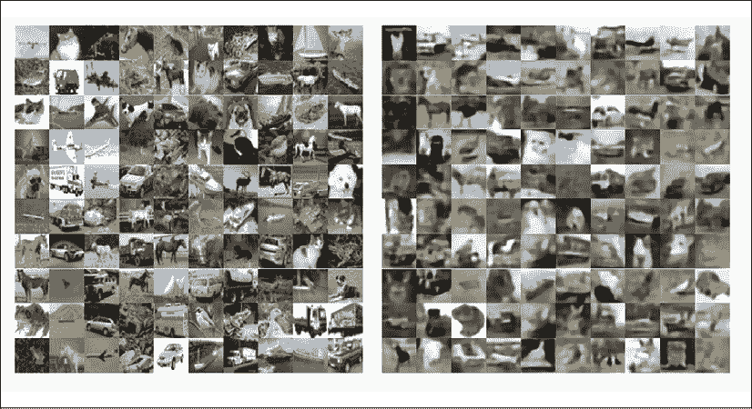

图 5.1：CIFAR-10 样本（左），VAE（右）²

对 VAE 网络的最新工作已经使得这些模型能够生成更好的图像，正如您将在本章后面看到的那样。首先，让我们重新审视生成 MNIST 数字的问题以及我们如何将这种方法扩展到更复杂的数据。

从*第一章*，*生成式人工智能简介：“从模型中”绘制数据*和*第四章*，*教网络生成数字*中回想起，RBM（或 DBN）模型本质上涉及学习给定一些潜在“代码”（*z*）的图像(*x*)的后验概率分布，由网络的隐藏层表示，*x*的“边际可能性”：³

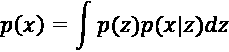

我们可以将*z*视为图像*x*的“编码”（例如，RBM 中二进制隐藏单元的激活），可以解码（例如，反向运行 RBM 以对图像进行采样）以获得*x*的重构。如果编码“好”，重构将接近原始图像。因为这些网络对其输入数据的表示进行编码和解码，它们也被称为“自编码器”。

深度神经网络捕捉复杂数据的基本结构的能力是它们最吸引人的特征之一；正如我们在*第四章*，*教网络生成数字*中所看到的 DBN 模型一样，它使我们能够通过为数据的分布创建更好的基础模型来提高分类器的性能。它还可以用于简单地创建一种更好的方法来“压缩”数据的复杂性，类似于经典统计学中的**主成分分析**（**PCA**）。在*图 5.2*中，您可以看到堆叠的 RBM 模型如何用作编码面部分布的一种方式，例如。

我们从“预训练”阶段开始，创建一个 30 单位的编码向量，然后通过强制它重构输入图像来校准它，然后使用标准反向传播进行微调：

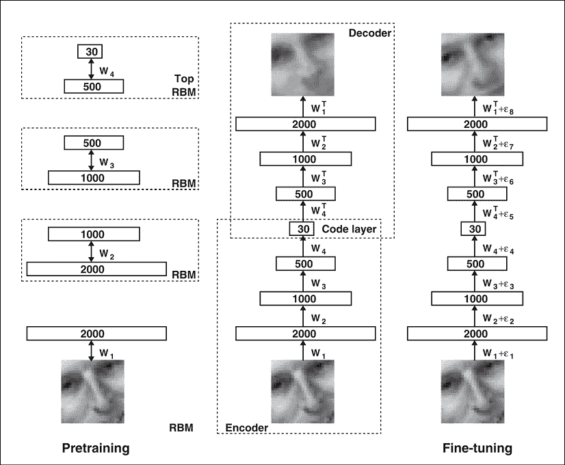

图 5.2：使用 DBN 作为自编码器⁴

作为堆叠的 RBM 模型如何更有效地表示图像分布的示例，从*图 5.2*派生的论文*用神经网络减少数据的维数*的作者演示了使用两个单位代码来对比 MNIST 数字的 PCA：

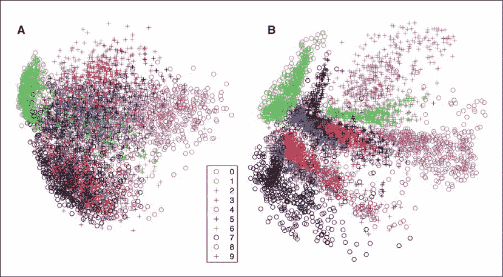

图 5.3：MNIST 数字的 PCA 与 RBM 自编码器对比⁵

在左边，我们看到使用二维 PCA 编码的数字 0-9（由不同的阴影和形状表示）。回想一下，PCA 是使用数据的协方差矩阵的低维分解生成的：

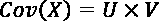

*Cov(X)* 的高度/宽度与数据相同（例如，在 MNIST 中为 28 x 28 像素），而 *U* 和 *V* 都是较低维度的（*M* x *k* 和 *k* x *M*），其中 *k* 远小于 *M*。由于它们在一个维度上具有较少的行/列数 *k*，*U* 和 *V* 是数据的低维表示，我们可以通过将其投影到这些 *k* 向量上来获得对单个图像的编码，从而给出了数据的 *k* 单位编码。由于分解（和投影）是线性变换（两个矩阵的乘积），PCA 组件有效区分数据的能力取决于数据是否线性可分（我们可以通过组之间的空间绘制一个超平面—该空间可以是二维的或 *N* 维的，例如 MNIST 图像中的 784 个像素）。

如 *图 5.3* 所示，PCA 为图像生成了重叠的代码，表明使用二分量线性分解来表示数字是具有挑战性的，其中表示相同数字的向量彼此靠近，而表示不同数字的向量明显分开。从概念上讲，神经网络能够捕捉更多表示不同数字的图像之间的变化，如其在二维空间中更清晰地分离这些数字的表示所示。

为了理解这一现象，可以将其类比为一个非常简单的二维数据集，由平行双曲线（二次多项式）组成（*图 5.4*）：

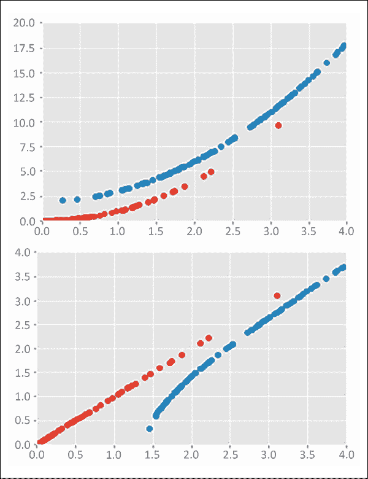

图 5.4：平行双曲线和可分离性

在顶部，即使我们有两个不同的类别，我们也无法在二维空间中画一条直线将两个组分开；在神经网络中，单个层中的权重矩阵在 sigmoid 或 tanh 的非线性转换之前本质上是这种类型的线性边界。然而，如果我们对我们的 2D 坐标应用非线性变换，比如取超半径的平方根，我们可以创建两个可分离的平面（*图 5.4*，*底部*）。

在 MNIST 数据中存在类似的现象：我们需要一个神经网络来将这些 784 位数的图像放置到不同的、可分离的空间区域中。这个目标通过对原始的、重叠的数据执行非线性变换来实现，其中的目标函数奖励增加编码不同数字图像的向量之间的空间分离。因此，可分离的表示增加了神经网络利用这些表示区分图像类别的能力。因此，在 *图 5.3* 中，我们可以看到右侧应用 DBN 模型创建所需的非线性变换以分离不同的图像。

现在我们已经讨论了神经网络如何将数据压缩为数值向量以及这些向量表示的一些理想特性，我们将探讨如何在这些向量中最佳压缩信息。为此，向量的每个元素应该从其他元素中编码出不同的信息，我们可以使用变分目标这一属性来实现。这个变分目标是创建 VAE 网络的基础。

# 变分目标

我们之前讨论了几个例子，展示了如何使用神经网络将图像压缩成数值向量。这一部分将介绍能够让我们从随机数值向量空间中采样新图像的要素，主要是有效的推理算法和适当的目标函数。让我们更加严谨地量化什么样的编码才能让其“好”，并且能够很好地重现图像。我们需要最大化后验概率：

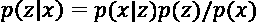

当*x*的概率非常高维时会出现问题，如你所见，在甚至是简单的数据中，如二元 MNIST 数字中，我们有*2^*（像素数）可能的配置，我们需要对其进行积分（在概率分布意义上进行积分）以得到对单个图像概率的度量；换句话说，密度*p*(*x*)是棘手的，导致了依赖于*p*(*x*)的后验*p*(*z*|*x*)也同样不容易处理。

在某些情况下，正如你在*第四章*中看到的，*训练网络生成数字*，我们可以使用简单的二元单元，例如对比散度来计算近似，这使我们可以计算梯度，即使我们无法计算封闭形式。然而，在处理非常大的数据集时也可能具有挑战性，我们需要对数据进行多次传递以计算使用**对比散度**（**CD**）计算平均梯度，就像之前在*第四章*中看到的那样。

如果我们无法直接计算编码器*p*(*z*|*x*)的分布，也许我们可以优化一个足够“接近”的近似——让我们称之为*q*(*z*|*x*)。然后，我们可以使用一种度量来确定这两个分布是否足够接近。一个有用的接近度量是这两个分布是否编码了类似的信息；我们可以使用香农信息方程来量化信息：

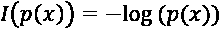

考虑一下这为什么是一个很好的度量：随着*p*(*x*)的减少，事件变得更加罕见，因此事件的观察向系统或数据集传达更多信息，导致*log*(*p*(*x*))的正值。相反，当事件的概率接近 1 时，该事件对数据集的编码信息变少，而*log*(*p*(*x*))的值变为 0（*图 5.5*）：

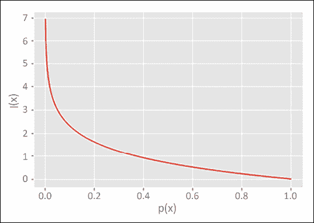

图 5.5：香农信息

因此，如果我们想要衡量两个分布*p*和*q*中编码的信息之间的差异，我们可以使用它们的信息之差：

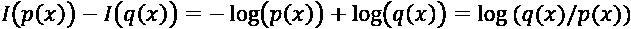

最后，如果我们想要找到分布在*x*的所有元素上的信息差异的期望值，我们可以对*p*(*x*)取平均：

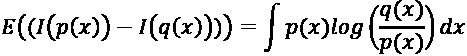

这个量被称为**Kullback Leibler** (**KL**) **散度**。它有一些有趣的特性：

1.  它不是对称的：*KL*(*p*(*x*), *q*(*x*))一般来说不等于*KL*(*q*(*x*), *p*(*x*))，所以“接近程度”是通过将一个分布映射到另一个分布的特定方向来衡量的。

1.  每当*q*(*x*)和*p*(*x*)匹配时，这个项就是 0，意味着它们彼此之间的距离是最小的。同样，只有当*p*和*q*是相同的时候，*KL*(*p*(*x*), *q*(*x*))才为 0。

1.  如果*q*(*x*)为 0 或者*p*(*x*)为 0，那么*KL*是未定义的；按照定义，它仅计算两个分布在*x*的范围内匹配的相对信息。

1.  *KL*始终大于 0。

如果我们要使用*KL*散度来计算近似值*q*(*z,x*)对于我们不可计算的*p*(*z*|*x*)的拟合程度，我们可以写成：

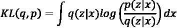

和：

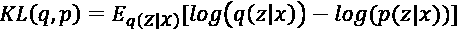

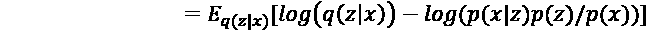

现在我们也可以写出我们不可计算的*p*(*x*)的表达式了：由于*log*(*p*(*x*))不依赖于*q*(*z*|*x*)，对*p*(*x*)的期望值简单地是*log*(*p*(*x*))。因此，我们可以用*KL*散度表示 VAE 的目标，学习*p*(*x*)的边际分布：

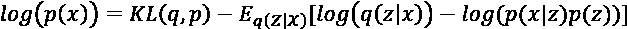

第二项也被称为**变分下限**，也被称为**证据下界**（**ELBO**）；由于*KL*(*q,p*)严格大于 0，*log*(*p(x*))严格大于或者（如果*KL*(*q,p*)为 0）等于这个值。

要解释这个目标在做什么，注意到期望引入了*q*(*z*|*x*)（*编码 x*）和*p*(*x*|*z*)*p*(*z*)（数据和编码的联合概率）之间的差异；因此，我们想要最小化一个下界，它实质上是编码的概率和编码与数据的联合概率之间的差距，误差项由*KL*(*q,p*)给出，这是一个可计算的近似和不可计算的编码器*p*(*z*|*x*)形式之间的差异。我们可以想象函数*Q*(*z*|*x*)和*P*(*x*|*z*)由两个深度神经网络表示；一个生成潜在代码*z*（*Q*），另一个从这个代码重建*x*（*P*）。我们可以把这看作是一个自动编码器设置，就像上面的堆叠 RBM 模型一样，有一个编码器和解码器：

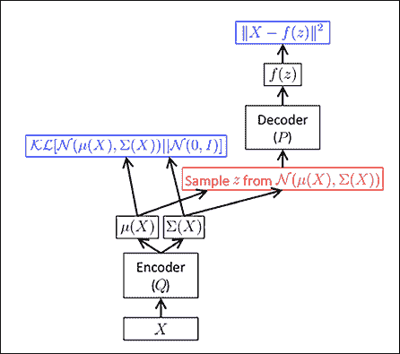

图 5.6：无再参数化 VAE 的自动编码器/解码器⁷

我们希望优化编码器 *Q* 和解码器 *P* 的参数，以最小化重构成本。其中一种方法是构造蒙特卡洛样本来使用梯度下降优化 *Q* 的参数：

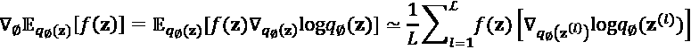

我们从哪里抽样 *z*：

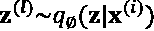

然而，在实践中发现，可能需要大量的样本才能使这些梯度更新的方差稳定下来。

我们在这里也遇到了一个实际问题：即使我们可以选择足够的样本来获得对编码器的梯度的良好近似，但我们的网络包含一个随机的、不可微分的步骤（抽样 *z*），我们无法通过反向传播来处理，就像我们无法通过反向传播来处理 *第四章* 中 RBN 中的随机单元一样。因此，我们的重构误差取决于 *z* 的样本，但我们无法通过生成这些样本的步骤进行端到端的网络调整。有没有办法我们可以创建一个可微分的解码器/编码器架构，同时减少样本估计的方差？VAE 的主要见解之一就是通过 "重新参数化技巧" 实现这一点。

## 重新参数化技巧

为了使我们能够通过我们的自编码器进行反向传播，我们需要将 *z* 的随机样本转换为一个确定性的、可微分的变换。我们可以通过将 *z* 重新参数化为一个噪声变量的函数来实现这一点：

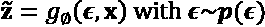

一旦我们从 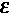 中抽样，*z* 中的随机性就不再取决于变分分布 *Q*（编码器）的参数，我们可以进行端到端的反向传播。我们的网络现在看起来像 *图 5.7*，我们可以使用 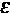 的随机样本（例如，标准正态分布）来优化我们的目标。这种重新参数化将 "随机" 节点移出了编码器/解码器框架，使我们能够通过整个系统进行反向传播，但它还有一个更微妙的优点；它减少了这些梯度的方差。请注意，在未重新参数化的网络中，*z* 的分布取决于编码器分布 *Q* 的参数；因此，当我们改变 *Q* 的参数时，我们也在改变 *z* 的分布，并且我们可能需要使用大量样本才能得到一个合理的估计。

通过重新参数化，*z* 现在仅取决于我们更简单的函数 *g*，通过从标准正态分布中进行抽样引入随机性（这不依赖于 *Q*）；因此，我们已经消除了一个有些循环的依赖，并使我们正在估计的梯度更加稳定：

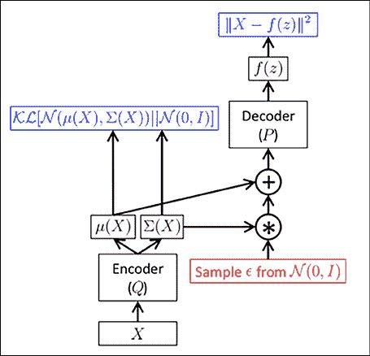

图 5.7：重新参数化 VAE 的自编码器/解码器

现在你已经看到 VAE 网络是如何构建的，让我们讨论一种进一步改进这一算法的方法，使得 VAE 能够从复杂分布中取样：**逆自回归流**（**IAF**）。

# 逆自回归流

在我们之前的讨论中，我们指出希望使用*q*(*z*|*x*)来近似“真实”的*p*(*z*|*x*)，这会允许我们生成数据的理想编码，并从中取样生成新的图像。到目前为止，我们假设*q*(*z*|*x*)有一个相对简单的分布，比如独立的高斯分布随机变量的向量（对角协方差矩阵上的非对角元素为 0）。这种分布有许多好处；因为它很简单，我们可以轻松地从随机正态分布中进行抽样生成新数据，并且因为它是独立的，我们可以分别调整潜在向量*z*的各个元素，以影响输出图像的各个部分。

然而，这样一个简单的分布可能不能很好地适应数据的期望输出分布，增加了*p*(*z*|*x*)和*q*(*z*|*x*)之间的*KL*散度。我们能不能以某种方式保留*q*(*z*|*x*)的良好特性，但“变换”*z*，以便它更多地捕捉表示*x*所需的复杂性呢？

一种方法是对*z*应用一系列自回归变换，将其从一个简单分布转变为一个复杂分布；通过“自回归”，我们指的是每个变换利用了前一次变换和当前数据来计算*z*的更新版本。相比之下，我们上面介绍的基本 VAE 形式只有一个“变换”：从*z*到输出（虽然*z*可能经过多层，但没有递归网络链接来进一步完善输出）。我们之前已经见过这样的变换，比如*第三章*中的 LSTM 网络，其中网络的输出是当前输入和先前时间步加权版本的组合。

我们之前讨论过的独立*q*(*z*|*x*)分布的吸引人之处是，例如独立的正态分布，它们在对数似然函数上有一个非常简单的表达式。这一特性对于 VAE 模型非常重要，因为其目标函数取决于对整个似然函数进行积分，而对于更复杂的对数似然函数来说，这可能是繁琐的。然而，通过约束一个经过一系列自回归变换的*z*，我们得到了一个很好的特性，即第*t*步的对数似然仅取决于*t-1*，因此雅可比矩阵（*t*和*t-1*之间的偏导数的梯度矩阵）是下三角的，可以计算为一个和：

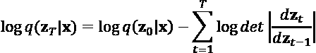

可以使用哪些种类的变换 *f*？记住，在参数化技巧之后，*z* 是编码器 *Q* 输出的均值和标准差以及一个噪声元素 *e* 的函数：

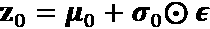

如果我们应用连续的转换层，步骤 *t* 就变成了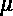和前一层 *z* 与 sigmoid 输出 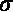 的逐元素乘积之和：

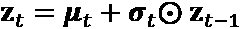

在实践中，我们使用神经网络转换来稳定每一步的均值估计：

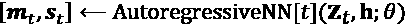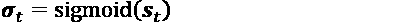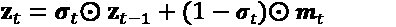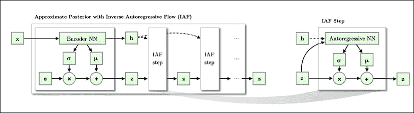

图 5.8：IAF 网络⁶

再次注意，这种转换与*第三章*，*深度神经网络的基本构件*中讨论的 LSTM 网络的相似性。在*图 5.8*中，除了均值和标准差之外，编码器 *Q* 还有另一个输出 (*h*)，用于对 *z* 进行采样。*H* 本质上是“辅助数据”，它被传递到每一个连续的转换中，并且与在每一步计算的加权和一起，以一种类似 LSTM 的方式，表示网络的“持久记忆”。

# 导入 CIFAR

现在我们已经讨论了 VAE 算法的基本理论，让我们开始使用真实世界的数据集构建一个实际的例子。正如我们在介绍中讨论的，对于本章的实验，我们将使用加拿大高级研究所（CIFAR）10 数据集。¹⁰ 这个数据集中的图像是 8000 万个“小图像”数据集¹¹的一部分，其中大多数没有像 CIFAR-10 这样的类标签。对于 CIFAR-10，标签最初是由学生志愿者创建的¹²，而更大的小图像数据集允许研究人员为数据的部分提交标签。

像 MNIST 数据集一样，可以使用 TensorFlow 数据集的 API 下载 CIFAR-10：

```py
import tensorflow.compat.v2 as tf
import tensorflow_datasets as tfds
cifar10_builder = tfds.builder("cifar10")
cifar10_builder.download_and_prepare() 
```

这将把数据集下载到磁盘并使其可用于我们的实验。要将其拆分为训练集和测试集，我们可以使用以下命令：

```py
cifar10_train = cifar10_builder.as_dataset(split="train")
cifar10_test = cifar10_builder.as_dataset(split="test") 
```

让我们检查一下其中一幅图像，看看它是什么格式：

```py
cifar10_train.take(1) 
```

输出告诉我们数据集中每个图像的格式是 `<DatasetV1Adapter shapes: {image: (32, 32, 3), label: ()}`, `types: {image: tf.uint8, label: tf.int64}>:` 不像我们在*第四章*，*教网络生成数字*中使用的 MNIST 数据集，CIFAR 图像有三个颜色通道，每个通道都有 32 x 32 个像素，而标签是一个从 0 到 9 的整数（代表 10 个类别中的一个）。我们也可以绘制图像来进行视觉检查：

```py
from PIL import Image
import numpy as np
import matplotlib.pyplot as plt
for sample in cifar10_train.map(lambda x: flatten_image(x, label=True)).take(1):
    plt.imshow(sample[0].numpy().reshape(32,32,3).astype(np.float32), 
               cmap=plt.get_cmap("gray")
              )
    print("Label: %d" % sample[1].numpy()) 
```

这给出了以下输出：

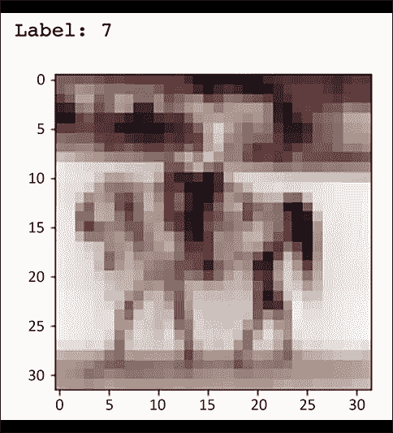

图 5.9：输出

像 RBM 模型一样，在这个示例中我们将构建的 VAE 模型的输出被缩放在 1 到 0 之间，并且接受图像的扁平版本，因此我们需要将每个图像转换为一个向量，并将其缩放到最大为 1：

```py
def flatten_image(x, label=False):
    if label:
        return (tf.divide(
            tf.dtypes.cast(
                tf.reshape(x["image"], (1, 32*32*3)), tf.float32), 
                    256.0),
                x["label"])
    else:
        return (
            tf.divide(tf.dtypes.cast(
                tf.reshape(x["image"], (1, 32*32*3)), tf.float32), 
                    256.0)) 
```

这导致每个图像都是长度为 3072 (32*32*3) 的向量，在运行模型后，我们可以重塑它们以检查生成的图像。

# 从 TensorFlow 2 创建网络

现在我们已经下载了 CIFAR-10 数据集，将其拆分为测试和训练数据，并对其进行了重塑和重新缩放，我们已经准备好开始构建我们的 VAE 模型了。我们将使用 TensorFlow 2 中的 Keras 模块的相同 Model API。TensorFlow 文档中包含了使用卷积网络实现 VAE 的示例（[`www.tensorflow.org/tutorials/generative/cvae`](https://www.tensorflow.org/tutorials/generative/cvae)），我们将在此代码示例的基础上构建；然而，出于我们的目的，我们将使用基于原始 VAE 论文《自编码变分贝叶斯》(Auto-Encoding Variational Bayes)¹³ 的 MLP 层实现更简单的 VAE 网络，并展示如何将 TensorFlow 示例改进为也允许解码中的 IAF 模块。

在原始文章中，作者提出了两种用于 VAE 的模型，都是 MLP 前馈网络：高斯和伯努利，这些名称反映了 MLP 网络输出中使用的概率分布函数在它们的最终层中。伯努利 MLP 可以用作网络的解码器，从潜在向量 *z* 生成模拟图像 *x*。伯努利 MLP 的公式如下：

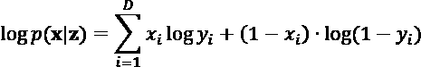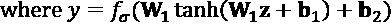

第一行是我们用于确定网络是否生成原始图像近似重建的交叉熵函数，而 *y* 是一个前馈网络，有两层：一个双曲正切变换，然后是一个 sigmoid 函数将输出缩放到 0 到 1 之间。回想一下，这种缩放是我们不得不将 CIFAR-10 像素从其原始值归一化的原因。

我们可以很容易地使用 Keras API 创建这个伯努利 MLP 网络：

```py
class BernoulliMLP(tf.keras.Model):
    def __init__(self, input_shape, name='BernoulliMLP', hidden_dim=10, latent_dim=10, **kwargs):
        super().__init__(name=name, **kwargs)
        self._h = tf.keras.layers.Dense(hidden_dim, 
                                        activation='tanh')
        self._y = tf.keras.layers.Dense(latent_dim, 
                                        activation='sigmoid')
    def call(self, x):
        return self._y(self._h(x)), None, None 
```

我们只需要指定单隐藏层和潜在输出 (*z*) 的维度。然后，我们将前向传递指定为这两个层的组合。请注意，在输出中，我们返回了三个值，第二和第三个值均设置为 `None`。这是因为在我们的最终模型中，我们可以使用 BernoulliMLP 或 GaussianMLP 作为解码器。如果我们使用 GaussianMLP，则返回三个值，正如我们将在下文中看到的；本章中的示例利用了二进制输出和交叉熵损失，因此我们可以只使用单个输出，但我们希望两个解码器的返回签名匹配。

原始 VAE 论文中作者提出的第二种网络类型是高斯 MLP，其公式为：

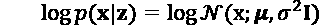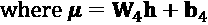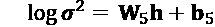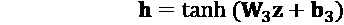

此网络可以在网络中作为编码器（生成潜在向量*z*）或解码器（生成模拟图像*x*）使用。上述方程假定它用作解码器，对于编码器，我们只需交换*x*和*z*变量。如您所见，这个网络有两种类型的层，一个隐藏层由输入的 tanh 变换给出，并且两个输出层，每个输出层由隐藏层的线性变换给出，这些输出层被用作对数正态似然函数的输入。像 Bernoulli MLP 一样，我们可以轻松使用 TensorFlow Keras API 实现这个简单网络：

```py
class GaussianMLP(tf.keras.Model):
    def __init__(self, input_shape, name='GaussianMLP', hidden_dim=10, latent_dim=10, iaf=False, **kwargs):
        super().__init__(name=name, **kwargs)
        self._h = tf.keras.layers.Dense(hidden_dim, 
                                        activation='tanh')
        self._mean = tf.keras.layers.Dense(latent_dim)
        self._logvar = tf.keras.layers.Dense(latent_dim)
        self._iaf_output = None
        if iaf:
            self._iaf_output = tf.keras.layers.Dense(latent_dim)
    def call(self, x):
        if self._iaf_output:
            return self._mean(self._h(x)), self._logvar(self._h(x)), 
                self._iaf_output(self._h(x))
        else:
            return self._mean(self._h(x)), self._logvar(self._h(x)), 
                None 
```

如您所见，要实现`call`函数，我们必须返回模型的两个输出（我们将用来计算*z*或*x*的正态分布的均值和对数方差）。然而，请注意，对于 IAE 模型，编码器必须具有额外的输出*h*，它被馈送到每一步的正规流中：

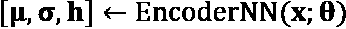

要允许额外的输出，我们在输出中包括了第三个变量，如果我们将 IAF 选项设置为`True`，它将被设置为输入的线性变换，如果为`False`，则为`none`，因此我们可以在具有和不具有 IAF 的网络中使用 GaussianMLP 作为编码器。

现在我们已经定义了我们的两个子网络，让我们看看如何使用它们来构建一个完整的 VAE 网络。像子网络一样，我们可以使用 Keras API 定义 VAE：

```py
class VAE(tf.keras.Model):    
    def __init__(self, input_shape, name='variational_autoencoder',
                 latent_dim=10, hidden_dim=10, encoder='GaussianMLP', 
                 decoder='BernoulliMLP', iaf_model=None,
                 number_iaf_networks=0,
                 iaf_params={},
                 num_samples=100, **kwargs):
        super().__init__(name=name, **kwargs)
        self._latent_dim = latent_dim
        self._num_samples = num_samples
        self._iaf = []
        if encoder == 'GaussianMLP':
            self._encoder = GaussianMLP(input_shape=input_shape, 
                                        latent_dim=latent_dim, 
                                        iaf=(iaf_model is not None), 
                                        hidden_dim=hidden_dim)
        else:
            raise ValueError("Unknown encoder type: {}".format(encoder))
        if decoder == 'BernoulliMLP':
            self._decoder = BernoulliMLP(input_shape=(1,latent_dim),
                                         latent_dim=input_shape[1], 
                                         hidden_dim=hidden_dim)
        elif decoder == 'GaussianMLP':
            self._encoder = GaussianMLP(input_shape=(1,latent_dim), 
                                        latent_dim=input_shape[1], 
                                        iaf=(iaf_model is not None), 
                                        hidden_dim=hidden_dim)
        else:
            raise ValueError("Unknown decoder type: {}".format(decoder))
        if iaf_model:
            self._iaf = []
            for t in range(number_iaf_networks):
                self._iaf.append(
                    iaf_model(input_shape==(1,latent_dim*2), 
                              **iaf_params)) 
```

如您所见，此模型被定义为包含编码器和解码器网络。此外，我们允许用户指定我们是否在模型中实现 IAF，如果是的话，我们需要一个由`iaf_params`变量指定的自回归变换的堆栈。因为这个 IAF 网络需要将*z*和*h*作为输入，输入形状是`latent_dim` (*z*)的两倍。我们允许解码器是 GaussianMLP 或 BernoulliMLP 网络，而编码器是 GaussianMLP。

此模型类还有一些其他函数需要讨论；首先是 VAE 模型类的编码和解码函数：

```py
def encode(self, x):
        return self._encoder.call(x)
    def decode(self, z, apply_sigmoid=False):
        logits, _, _ = self._decoder.call(z)
        if apply_sigmoid:
            probs = tf.sigmoid(logits)
            return probs
        return logits 
```

对于编码器，我们只需调用（运行前向传递）编码器网络。解码时，您会注意到我们指定了三个输出。介绍了 VAE 模型的文章《自编码变分贝叶斯》提供了解码器的例子，指定为**高斯多层感知器**（**MLP**）或 Benoulli 输出。如果我们使用了高斯 MLP，解码器将为输出值、均值和标准差向量，我们需要使用 sigmoidal 变换将该输出转换为概率（0 到 1）。在伯努利情况下，输出已经在 0 到 1 的范围内，我们不需要这种转换（`apply_sigmoid`=`False`）。

一旦我们训练好了 VAE 网络，我们就需要使用抽样来产生随机潜在向量（*z*）并运行解码器来生成新图像。虽然我们可以将其作为 Python 运行时类的正常函数运行，但我们将使用`@tf.function`注释装饰这个函数，这样它就可以在 TensorFlow 图形运行时执行（就像任何 tf 函数一样，比如 `reduce_sum` 和 `multiply`），如果可用的话可以使用 GPU 和 TPU 等设备。我们从一个随机正态分布中抽取一个值，对于指定数量的样本，然后应用解码器来生成新图像：

```py
@tf.function
    def sample(self, eps=None):
        if eps is None:
            eps = tf.random.normal(shape=(self._num_samples, 
                                          self.latent_dim))
        return self._decoder.call(eps, apply_sigmoid=False) 
```

最后，回想一下，“重新参数化技巧”是用来使我们能够反向传播 *z* 的值，并减少 *z* 的似然的方差。我们需要实现这个变换，它的给定形式如下：

```py
def reparameterize(self, mean, logvar):
        eps = tf.random.normal(shape=mean.shape)
        return eps * tf.exp(logvar * .5) + mean 
```

在原始论文《Autoencoding Variational Bayes》中，给出了：

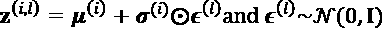

其中*i*是*x*中的一个数据点，l 是从随机分布中抽样的一个样本，这里是一个正常分布。在我们的代码中，我们乘以 0.5，因为我们在计算**log variance**（或标准差的平方），*log*(*s²*)=*log*(*s*)*2*，所以 0.5 取消了 2，给我们留下了*exp*(*log*(*s*))=*s*，正如我们在公式中需要的那样。

我们还将包括一个类属性（使用`@property`装饰器），这样我们就可以访问归一化变换的数组，如果我们实现了 IAF:

```py
@property
    def iaf(self):
        return self._iaf 
```

现在，我们将需要一些额外的函数来实际运行我们的 VAE 算法。第一个计算 lognormal 概率密度函数（**pdf**），用于计算变分下限或 ELBO：

```py
def log_normal_pdf(sample, mean, logvar, raxis=1):
    log2pi = tf.math.log(2\. * np.pi)
    return tf.reduce_sum(
          -.5 * ((sample - mean) ** 2\. * tf.exp(-logvar) + \
            logvar + log2pi), axis=raxis) 
```

现在我们需要利用这个函数作为在训练 VAE 的过程中每个小批量梯度下降传递的一部分来计算损失。和样本方法一样，我们将使用`@tf.function`注释装饰这个函数，以便它在图形运行时执行：

```py
@tf.function
def compute_loss(model, x):
    mean, logvar, h = model.encode(x)
    z = model.reparameterize(mean, logvar)
    logqz_x = log_normal_pdf(z, mean, logvar)
    for iaf_model in model.iaf:
        mean, logvar, _ = iaf_model.call(tf.concat([z, h], 2))
        s = tf.sigmoid(logvar)
        z = tf.add(tf.math.multiply(z,s), tf.math.multiply(mean,(1-s)))
        logqz_x -= tf.reduce_sum(tf.math.log(s))

    x_logit = model.decode(z)
    cross_ent = tf.nn.sigmoid_cross_entropy_with_logits(logits=x_logit, labels=x)
    logpx_z = -tf.reduce_sum(cross_ent, axis=[2])
    logpz = log_normal_pdf(z, 0., 0.)
    return -tf.reduce_mean(logpx_z + logpz - logqz_x) 
```

让我们来解开这里发生的一些事情。首先，我们可以看到我们在输入上调用编码器网络（在我们的情况下是扁平图像的小批量），生成所需的均值、`logvariance`，以及如果我们在网络中使用 IAF，我们将在归一化流变换的每一步传递的辅助输入`h`。

我们对输入应用“重新参数化技巧”，以生成潜在向量 `z`，并应用对得到的* logq*(*z*|*x*)的 lognormal pdf。

如果我们使用 IAF，我们需要通过每个网络迭代地变换`z`，并在每一步从解码器传入`h`（辅助输入）。然后我们将这个变换的损失应用到我们计算的初始损失上，就像在 IAF 论文中给出的算法中一样：¹⁴

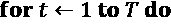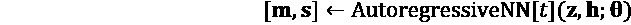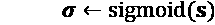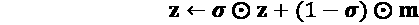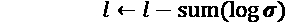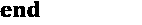

一旦我们有了转换或未转换的*z*，我们使用解码器网络解码它，得到重构数据*x*，然后我们计算交叉熵损失。我们对小批量求和，并计算在标准正态分布（先验）处评估的*z*的对数正态 pdf，然后计算期望的下界。

请记住，变分下界或 ELBO 的表达式是：

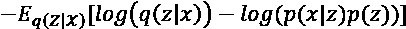

因此，我们的小批量估计器是这个值的样本：

现在我们有了这些要素，我们可以使用`GradientTape` API 运行随机梯度下降，就像我们在*第四章*，*教授网络生成数字*中为 DBN 所做的那样，传入一个优化器、模型和数据的小批量(*x*)：

```py
@tf.function
def compute_apply_gradients(model, x, optimizer):
    with tf.GradientTape() as tape:
        loss = compute_loss(model, x)
    gradients = tape.gradient(loss, model.trainable_variables)
    optimizer.apply_gradients(zip(gradients, model.trainable_variables)) 
```

要运行训练，首先我们需要指定一个使用我们构建的类的模型。如果我们不想使用 IAF，我们可以这样做：

```py
model = VAE(input_shape=(1,3072), hidden_dim=500, latent_dim=500) 
```

如果我们想要使用 IAF 变换，我们需要包含一些额外的参数：

```py
model = VAE(input_shape=(1,3072), hidden_dim=500, latent_dim=500, 
    iaf_model=GaussianMLP, number_iaf_networks=3, 
    iaf_params={'latent_dim': 500, 'hidden_dim': 500, 'iaf': False}) 
```

创建好模型后，我们需要指定一定数量的 epochs，一个优化器（在这个例子中，是 Adam，正如我们在*第三章*，*深度神经网络的构建基块*中描述的那样）。我们将数据分成 32 个元素的小批量，并在每个小批量后应用梯度更新，更新的次数为我们指定的 epochs 数。定期输出 ELBO 的估计值以验证我们的模型是否在改善：

```py
import time as time
epochs = 100
optimizer = tf.keras.optimizers.Adam(1e-4)
for epoch in range(1, epochs + 1):
    start_time = time.time()
    for train_x in cifar10_train.map(
            lambda x: flatten_image(x, label=False)).batch(32):
        compute_apply_gradients(model, train_x, optimizer)
    end_time = time.time()
    if epoch % 1 == 0:
        loss = tf.keras.metrics.Mean()
        for test_x in cifar10_test.map(
            lambda x: flatten_image(x, label=False)).batch(32):
            loss(compute_loss(model, test_x))
    elbo = -loss.result()
    print('Epoch: {}, Test set ELBO: {}, '
          'time elapse for current epoch {}'.format(epoch,
                                                elbo,
                                                end_time - start_time)) 
```

我们可以通过查看更新来验证模型是否在改善，这些更新应该显示 ELBO 正在增加：

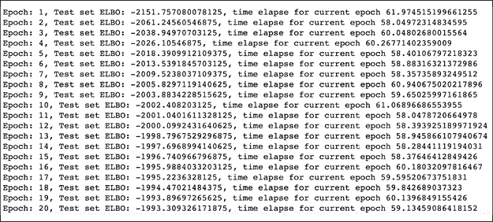

要检查模型的输出，我们可以首先查看重构误差；网络对输入图像的编码是否大致捕捉到了输入图像中的主要模式，从而使其能够从其向量*z*的编码中重构出来？我们可以将原始图像与通过编码器传递图像、应用 IAF，然后解码得到的重构进行比较：

```py
for sample in cifar10_train.map(lambda x: flatten_image(x, label=False)).batch(1).take(10):
    mean, logvar, h = model.encode(sample)
    z = model.reparameterize(mean, logvar)
    for iaf_model in model.iaf:
        mean, logvar, _ = iaf_model.call(tf.concat([z, h], 2))
        s = tf.sigmoid(logvar)
        z = tf.add(tf.math.multiply(z,s), tf.math.multiply(mean,(1-s)))    

    plt.figure(0)
    plt.imshow((sample.numpy().reshape(32,32,3)).astype(np.float32), 
               cmap=plt.get_cmap("gray"))
    plt.figure(1)
    plt.imshow((model.decode(z).numpy().reshape(32,32,3)).astype(np.float32), cmap=plt.get_cmap("gray")) 
```

对于前几个 CIFAR-10 图像，我们得到以下输出，显示我们已经捕捉到了图像的总体模式（尽管它是模糊的，这是 VAE 的一个普遍缺点，我们将在将来章节中讨论的**生成对抗网络（GANs）**中解决）：

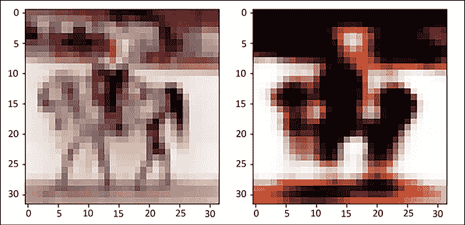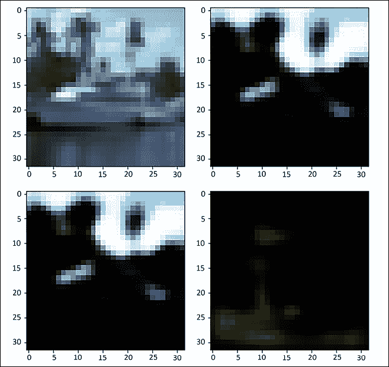

图 5.10：CIFAR-10 图像的输出

如果我们想要创建全新的图像怎么办？在这里，我们可以使用我们之前在*从 TensorFlow 2 创建网络*中定义的“sample”函数，从随机生成的*z*向量而不是 CIFAR 图像的编码产品中创建新图像的批次：

```py
plt.imshow((model.sample(10)).numpy().reshape(32,32,3)).astype(np.float32), cmap=plt.get_cmap("gray")) 
```

此代码将生成类似于以下内容的输出，显示了从随机数向量生成的一组图像：


图 5.11：从随机数向量生成的图像

诚然，这些图像可能有些模糊，但您可以欣赏到它们显示的结构，并且看起来与您之前看到的一些“重建”CIFAR-10 图像相当。在这里的部分挑战，就像我们将在随后的章节中讨论的那样，是损失函数本身：交叉熵函数本质上对每个像素惩罚，以衡量其与输入像素的相似程度。虽然这在数学上可能是正确的，但它并不能捕捉到我们所认为的输入和重建图像之间的“相似性”的概念。例如，输入图像可能有一个像素设为无穷大，这将导致它与将该像素设为 0 的重建图像之间存在很大差异；然而，一个人观看这个图像时，会认为它们两者完全相同。GANs 所使用的目标函数，如*第六章*中描述的*用 GAN 生成图像*，更准确地捕捉到了这种微妙之处。

# 总结

在本章中，您看到了如何使用深度神经网络来创建复杂数据的表示，例如图像，捕捉到比传统的降维技术如 PCA 更多的变化。这是通过 MNIST 数字进行演示的，其中神经网络可以在二维网格上更干净地分离不同数字，而不像这些图像的主成分那样。本章展示了如何使用深度神经网络来近似复杂的后验分布，例如图像，使用变分方法从不可约分布的近似中进行采样，形成了一种基于最小化真实和近似后验之间的变分下界的 VAE 算法。

您还学会了如何重新参数化这个算法生成的潜在向量，以降低方差，从而使随机小批量梯度下降收敛更好。您还看到了这些模型中编码器生成的潜在向量通常是相互独立的，可以使用 IAF 将其转换为更真实的相关分布。最后，我们在 CIFAR-10 数据集上实现了这些模型，并展示了它们如何用于重建图像和从随机向量生成新图像。

下一章将介绍 GANs，并展示我们如何使用它们为输入图像添加风格滤镜，使用 StyleGAN 模型。

# 参考文献

1.  Eckersley P., Nasser Y. *衡量 AI 研究的进展*。EFF。检索日期 2021 年 4 月 26 日，[`www.eff.org/ai/metrics#Measuring-the-Progress-of-AI-Research`](https://www.eff.org/ai/metrics#Measuring-the-Progress-of-AI-Research) 和 CIFAR-10 数据集，[`www.cs.toronto.edu/~kriz/`](https://www.cs.toronto.edu/~kriz/)

1.  Malhotra P. (2018). 自编码器实现。GitHub 仓库。[`www.piyushmalhotra.in/Autoencoder-Implementations/VAE/`](https://www.piyushmalhotra.in/Autoencoder-Implementations/VAE/)

1.  Kingma, D P., Welling, M. (2014). *自动编码变分贝叶斯*. arXiv:1312.6114\. [`arxiv.org/pdf/1312.6114.pdf`](https://arxiv.org/pdf/1312.6114.pdf)

1.  Hinton G. E., Salakhutdinov R. R. (2006). *使用神经网络降低数据维度*. ScienceMag. [`www.cs.toronto.edu/~hinton/science.pdf`](https://www.cs.toronto.edu/~hinton/science.pdf)

1.  Hinton G. E., Salakhutdinov R. R. (2006). *使用神经网络降低数据维度*. ScienceMag. [`www.cs.toronto.edu/~hinton/science.pdf`](https://www.cs.toronto.edu/~hinton/science.pdf)

1.  Kingma, D P., Welling, M. (2014). *自动编码变分贝叶斯*. arXiv:1312.6114\. [`arxiv.org/pdf/1312.6114.pdf`](https://arxiv.org/pdf/1312.6114.pdf)

1.  Doersch, C. (2016). *变分自动编码器教程*. arXiv:1606.05908\. [`arxiv.org/pdf/1606.05908.pdf`](https://arxiv.org/pdf/1606.05908.pdf)

1.  Paisley, J., Blei, D., Jordan, M. (2012). *随机搜索的变分贝叶斯推断*. [`icml.cc/2012/papers/687.pdf`](https://icml.cc/2012/papers/687.pdf)

1.  Doersch, C. (2016). *变分自动编码器教程*. arXiv:1606.05908\. [`arxiv.org/pdf/1606.05908.pdf`](https://arxiv.org/pdf/1606.05908.pdf)

1.  Angelov, Plamen; Gegov, Alexander; Jayne, Chrisina; Shen, Qiang (2016-09-06). *计算智能系统的进展: 2016 年 9 月 7-9 日英国兰开斯特举办的第 16 届英国计算智能研讨会的贡献*. Springer International Publishing. pp. 441–. ISBN 9783319465623\. 检索于 2018 年 1 月 22 日。

1.  TinyImages: [麻省理工学院小图像](http://groups.csail.mit.edu/vision/TinyImages/)

1.  Krizhevsky A. (2009). *从小图像中学习多层特征*. [`citeseerx.ist.psu.edu/viewdoc/download?doi=10.1.1.222.9220&rep=rep1&type=pdf`](http://citeseerx.ist.psu.edu/viewdoc/download?doi=10.1.1.222.9220&rep=rep1&type=pdf)

1.  Kingma, D P., Welling, M. (2014). *自动编码变分贝叶斯*. arXiv:1312.6114\. [`arxiv.org/pdf/1312.6114.pdf`](https://arxiv.org/pdf/1312.6114.pdf)

1.  Kingma, D P., Salimans, T., Jozefowicz, R., Chen, X., Sutskever, I., Welling, M. (2016). *用逆自回归流改进变分推断*. arXiv:1606.04934\. [`arxiv.org/pdf/1606.04934.pdf`](https://arxiv.org/pdf/1606.04934.pdf)
