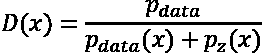

# 第六章：使用 GAN 生成图像

生成建模是一个强大的概念，它为我们提供了巨大的潜力来逼近或建模生成数据的基本过程。在前几章中，我们涵盖了与深度学习一般以及更具体地与**受限玻尔兹曼机**（**RBMs**）和**变分自编码器**（**VAEs**）相关的概念。本章将介绍另一类生成模型家族，称为**生成对抗网络**（**GANs**）。

在受博弈理论概念的强烈启发并吸取了先前讨论的一些最佳组件的基础上，GANs 为在生成建模空间中工作提供了一个强大的框架。自从它们于 2014 年由 Goodfellow 等人发明以来，GANs 受益于巨大的研究，并且现在被用于探索艺术、时尚和摄影等创造性领域。

以下是 GANs 的一个变体（StyleGAN）的两个惊人高质量样本（*图 6.1*）。儿童的照片实际上是一个虚构的不存在的人物。艺术样本也是由类似的网络生成的。通过使用渐进增长的概念，StyleGANs 能够生成高质量清晰的图像（我们将在后面的部分中详细介绍）。这些输出是使用在数据集上训练的 StyleGAN2 模型生成的，如**Flickr-Faces-HQ**或**FFHQ**数据集。


图 6.1：GAN（StyleGAN2）想象出的图像（2019 年 12 月）- Karras 等人和 Nvidia²

本章将涵盖：

+   生成模型的分类

+   一些改进的 GAN，如 DCGAN、条件-GAN 等。

+   渐进式 GAN 设定及其各个组件

+   与 GANs 相关的一些挑战

+   实例操作

# 生成模型的分类

生成模型是无监督机器学习领域的一类模型。它们帮助我们对生成数据集的潜在分布进行建模。有不同的方法/框架可以用来处理生成模型。第一组方法对应于用显式密度函数表示数据的模型。在这里，我们明确定义一个概率密度函数，，并开发一个增加从这个分布中采样的最大似然的模型。

在显式密度方法中，还有两种进一步的类型，即*可计算*和*近似*密度方法。 PixelRNNs 是可计算密度方法的一个活跃研究领域。当我们试图对复杂的现实世界数据分布建模时，例如自然图像或语音信号，定义参数函数变得具有挑战性。为了克服这一点，你在第四章“教网络生成数字”和第五章“使用 VAEs 绘制图像”中分别学习了关于 RBMs 和 VAEs。这些技术通过明确地逼近概率密度函数来工作。VAEs 通过最大化下界的似然估计来工作，而 RBMs 则使用马尔可夫链来估计分布。生成模型的整体景观可以使用*图 6.2*来描述：


图 6.2：生成模型的分类³

GANs 属于隐式密度建模方法。隐式密度函数放弃了明确定义潜在分布的属性，但通过定义方法来从这些分布中抽样的方法来工作。 GAN 框架是一类可以直接从潜在分布中抽样的方法。这减轻了到目前为止我们所涵盖的方法的某些复杂性，例如定义底层概率分布函数和输出的质量。现在你已经对生成模型有了高层次的理解，让我们深入了解 GAN 的细节。

# 生成对抗网络

GANs 有一个非常有趣的起源故事。一切始于在酒吧里讨论/争论与伊恩·古德费洛和朋友们讨论使用神经网络生成数据相关的工作。争论以每个人都贬低彼此的方法而告终。古德费洛回家编写了现在我们称之为 GAN 的第一个版本的代码。令他惊讶的是，代码第一次尝试就成功了。古德费洛本人在接受《连线》杂志采访时分享了一份更详细的事件链描述。

如前所述，GANs 是隐式密度函数，直接从底层分布中抽样。它们通过定义一个双方对抗的两人游戏来实现这一点。对抗者在定义良好的奖励函数下相互竞争，每个玩家都试图最大化其奖励。不涉及博弈论的细节，该框架可以解释如下。

## 判别器模型

这个模型代表了一个可微分函数，试图最大化从训练分布中抽样得到样本的概率为 1。这可以是任何分类模型，但我们通常偏爱使用深度神经网络。这是一种一次性模型（类似于自动编码器的解码器部分）。

鉴别器也用于分类生成器输出是真实的还是假的。这个模型的主要作用是帮助开发一个强大的生成器。我们将鉴别器模型表示为*D*，其输出为*D*(*x*)。当它用于分类生成器模型的输出时，鉴别器模型被表示为*D*(*G*(*z*))，其中*G*(*z*)是生成器模型的输出。


图 6.3：鉴别器模型

## 生成器模型

这是整个游戏中主要关注的模型。这个模型生成样本，意图是与我们的训练集中的样本相似。该模型将随机的非结构化噪声作为输入（通常表示为*z*），并尝试创建各种输出。生成器模型通常是一个可微分函数；它通常由深度神经网络表示，但不局限于此。

我们将生成器表示为*G*，其输出为*G*(*z*)。通常相对于原始数据*x*的维度，我们使用一个较低维度的*z*，即。这是对真实世界信息进行压缩或编码的一种方式。


图 6.4：生成器模型

简单来说，生成器的训练是为了生成足够好的样本以欺骗鉴别器，而鉴别器的训练是为了正确地区分真实（训练样本）与假的（输出自生成器）。因此，这种对抗游戏使用一个生成器模型*G*，试图使*D*(*G*(*z*))尽可能接近 1。而鉴别器被激励让*D*(*G*(*z*))接近 0，其中 1 表示真实样本，0 表示假样本。当生成器开始轻松地欺骗鉴别器时，生成对抗网络模型达到均衡，即鉴别器达到鞍点。虽然从理论上讲，生成对抗网络相对于之前描述的其他方法有几个优点，但它们也存在自己的一系列问题。我们将在接下来的章节中讨论其中一些问题。

## 训练生成对抗网络

训练生成对抗网络就像玩这个两个对手的游戏。生成器正在学习生成足够好的假样本，而鉴别器正在努力区分真实和假的。更正式地说，这被称为极小极大游戏，其中价值函数*V*(*G*, *D*)描述如下：


这也被称为零和游戏，其均衡点与纳什均衡相同。我们可以通过分离每个玩家的目标函数来更好地理解价值函数*V*(*G*, *D*)。以下方程描述了各自的目标函数：


其中是传统意义上的鉴别器目标函数，是生成器目标等于鉴别器的负值，是训练数据的分布。其余项具有其通常的含义。这是定义博弈或相应目标函数的最简单方式之一。多年来，已经研究了不同的方式，其中一些我们将在本章中讨论。

目标函数帮助我们理解每个参与者的目标。如果我们假设两个概率密度在任何地方都非零，我们可以得到*D*(*x*)的最优值为：



我们将在本章后面重新讨论这个方程。现在，下一步是提出一个训练算法，其中鉴别器和生成器模型分别朝着各自的目标进行训练。训练 GAN 的最简单但也是最广泛使用的方法（迄今为止最成功的方法）如下。

重复以下步骤*N*次。*N*是总迭代次数：

1.  重复*k*次步骤：

    +   从生成器中抽取大小为*m*的小批量：*{z*[1]*, z*[2]*, … z*[m]*} = p*[model]*(z)*

    +   从实际数据中抽取大小为*m*的小批量：*{x*[1]*, x*[2]*, … x*[m]*} = p*[data]*(x)*

    +   更新鉴别器损失，

1.  将鉴别器设为不可训练

1.  从生成器中抽取大小为*m*的小批量：*{z*[1]*, z*[2]*, … z*[m]*} = p*[model]*(z)*

1.  更新生成器损失，

在他们的原始论文中，Goodfellow 等人使用了*k*=1，也就是说，他们交替训练鉴别器和生成器模型。有一些变种和技巧，观察到更频繁地训练鉴别器比生成器有助于更好地收敛。

下图（*图 6.5*）展示了生成器和鉴别器模型的训练阶段。较小的虚线是鉴别器模型，实线是生成器模型，较大的虚线是实际训练数据。底部的垂直线示意从*z*的分布中抽取数据点，即*x*=*p*[model]*(z)*。线指出了生成器在高密度区域收缩而在低密度区域扩张的事实。部分**(a)**展示了训练阶段的初始阶段，此时鉴别器*(D)*是部分正确的分类器。部分**(b)**和**(c)**展示了*D*的改进如何引导*G*的变化。最后，在部分**(d)**中，你可以看到*p*[model]* = p*[data]，鉴别器不再能区分假样本和真样本，即：


图 6.5：GAN 的训练过程⁴

### 非饱和生成器成本

在实践中，我们不训练生成器最小化*log*(*1* – *D*(*G*(*z*)))，因为该函数不能提供足够的梯度用于学习。在*G*表现较差的初始学习阶段，鉴别器能够以高置信度区分假的和真实的。这导致*log*(*1* – *D*(*G*(*z*)))饱和，阻碍了生成模型的改进。因此，我们调整生成器改为最大化*log*(*D*(*G*(*z*)))：


这为生成器提供了更强的梯度进行学习。这在*图 6.6*中显示。*x*轴表示*D*(*G*(*z*))。顶部线显示目标，即最小化鉴别器正确的可能性。底部线（更新的目标）通过最大化鉴别器错误的可能性来工作。


图 6.6：生成器目标函数⁵

*图 6.6*说明了在训练的初始阶段，轻微的变化如何帮助实现更好的梯度。

### 最大似然游戏

极小极大游戏可以转化为最大似然游戏，其目的是最大化生成器概率密度的可能性。这是为了确保生成器的概率密度类似于真实/训练数据的概率密度。换句话说，游戏可以转化为最小化*p*[z]和*p*[data]之间的离散度。为此，我们利用**Kullback-Leibler 散度**（**KL 散度**）来计算两个感兴趣的分布之间的相似性。总的价值函数可以表示为：


生成器的成本函数转化为：


一个重要的要点是 KL 散度不是对称度量，也就是说，。模型通常使用来获得更好的结果。

迄今为止讨论过的三种不同成本函数具有略有不同的轨迹，因此在训练的不同阶段具有不同的特性。这三个函数可以如*图 6.7*所示可视化：


图 6.7：生成器成本函数⁶

# 基本 GAN

我们已经在理解 GAN 的基础知识方面取得了相当大的进展。在本节中，我们将应用这些理解，从头开始构建一个 GAN。这个生成模型将由一个重复的块结构组成，类似于原始论文中提出的模型。我们将尝试使用我们的网络复制生成 MNIST 数字的任务。

整体的 GAN 设置可以在*图 6.8*中看到。图中概述了一个以噪声向量*z*作为输入的生成器模型，并且利用重复块来转换和扩展向量以达到所需的尺寸。每个块由一个密集层后跟一个 Leaky ReLU 激活和一个批量归一化层组成。我们简单地将最终块的输出重新塑造以将其转换为所需的输出图像大小。

另一方面，判别器是一个简单的前馈网络。该模型以图像作为输入（真实图像或来自生成器的伪造输出）并将其分类为真实或伪造。这两个竞争模型的简单设置有助于我们训练整体的 GAN。


图 6.8：Vanilla GAN 架构

我们将依赖于 TensorFlow 2 并尽可能使用高级 Keras API。第一步是定义判别器模型。在此实现中，我们将使用一个非常基本的**多层感知器**（**MLP**）作为判别器模型：

```py
def build_discriminator(input_shape=(28, 28,), verbose=True):
    """
    Utility method to build a MLP discriminator
    Parameters:
        input_shape:
            type:tuple. Shape of input image for classification.
                        Default shape is (28,28)->MNIST
        verbose:
            type:boolean. Print model summary if set to true.
                        Default is True
    Returns:
        tensorflow.keras.model object
    """
    model = Sequential()
    model.add(Input(shape=input_shape))
    model.add(Flatten())
    model.add(Dense(512))
    model.add(LeakyReLU(alpha=0.2))
    model.add(Dense(256))
    model.add(LeakyReLU(alpha=0.2))
    model.add(Dense(1, activation='sigmoid'))
    if verbose:
        model.summary()
    return model 
```

我们将使用顺序 API 来准备这个简单的模型，仅含有四层和具有 sigmoid 激活的最终输出层。由于我们有一个二元分类任务，因此最终层中只有一个单元。我们将使用二元交叉熵损失来训练判别器模型。

生成器模型也是一个多层感知器，其中含有多层将噪声向量*z*扩展到所需的尺寸。由于我们的任务是生成类似于 MNIST 的输出样本，最终的重塑层将把平面向量转换成 28x28 的输出形状。请注意，我们将利用批次归一化来稳定模型训练。以下代码片段显示了构建生成器模型的实用方法：

```py
def build_generator(z_dim=100, output_shape=(28, 28), verbose=True):
    """
    Utility method to build a MLP generator
    Parameters:
        z_dim:
            type:int(positive). Size of input noise vector to be
                        used as model input.
                        Default value is 100
        output_shape:   type:tuple. Shape of output image .
                        Default shape is (28,28)->MNIST
        verbose:
            type:boolean. Print model summary if set to true.
                        Default is True
    Returns:
        tensorflow.keras.model object
    """
    model = Sequential()
    model.add(Input(shape=(z_dim,)))
    model.add(Dense(256, input_dim=z_dim))
    model.add(LeakyReLU(alpha=0.2))
    model.add(BatchNormalization(momentum=0.8))
    model.add(Dense(512))
    model.add(LeakyReLU(alpha=0.2))
    model.add(BatchNormalization(momentum=0.8))
    model.add(Dense(1024))
    model.add(LeakyReLU(alpha=0.2))
    model.add(BatchNormalization(momentum=0.8))
    model.add(Dense(np.prod(output_shape), activation='tanh'))
    model.add(Reshape(output_shape))
    if verbose:
        model.summary()
    return model 
```

我们简单地使用这些实用方法来创建生成器和判别器模型对象。以下代码片段还使用这两个模型对象来创建 GAN 对象：

```py
discriminator = build_discriminator()
discriminator.compile(loss='binary_crossentropy',
                      optimizer=Adam(0.0002, 0.5),
                      metrics=['accuracy'])
generator=build_generator()
z_dim = 100 #noise
z = Input(shape=(z_dim,))
img = generator(z)
# For the combined model we will only train the generator
discriminator.trainable = False
# The discriminator takes generated images as input 
# and determines validity
validity = discriminator(img)
# The combined model  (stacked generator and discriminator)
# Trains the generator to fool the discriminator
gan_model = Model(z, validity)
gan_model.compile(loss='binary_crossentropy', optimizer=Adam(0.0002, 0.5)) 
```

最后一部分是定义训练循环。正如前一节中所描述的，我们将交替训练（判别器和生成器）模型。通过高级 Keras API，这样做非常简单。以下代码片段首先加载 MNIST 数据集并将像素值缩放到-1 到+1 之间：

```py
# Load MNIST train samples
(X_train, _), (_, _) = datasets.mnist.load_data()
# Rescale to [-1, 1]
  X_train = X_train / 127.5 – 1 
```

对于每次训练迭代，我们首先从 MNIST 数据集中随机选择实际图像，数量等于我们定义的批量大小。下一步涉及对相同数量的*z*向量进行采样。我们使用这些采样的*z*向量来从我们的生成器模型中生成输出。最后，我们计算真实样本和生成样本的判别器损失。这些步骤在下面的代码片段中有详细说明：

```py
idx = np.random.randint(0, X_train.shape[0], batch_size)
real_imgs = X_train[idx]
# pick random noise samples (z) from a normal distribution
noise = np.random.normal(0, 1, (batch_size, z_dim))
# use generator model to generate output samples
fake_imgs = generator.predict(noise)
# calculate discriminator loss on real samples
disc_loss_real = discriminator.train_on_batch(real_imgs, real_y)

# calculate discriminator loss on fake samples
disc_loss_fake = discriminator.train_on_batch(fake_imgs, fake_y)

# overall discriminator loss
discriminator_loss = 0.5 * np.add(disc_loss_real, disc_loss_fake) 
```

训练生成器非常简单。我们准备了一个堆叠模型对象，类似于我们以前讨论过的 GAN 架构。简单地使用`train_on_batch`帮助我们计算生成器损失并改善它，如下面的代码片段所示：

```py
# train generator
# pick random noise samples (z) from a normal distribution
noise = np.random.normal(0, 1, (batch_size, z_dim))
# use trained discriminator to improve generator
gen_loss = gan_model.train_on_batch(noise, real_y) 
```

我们训练我们的普通 GAN 大约 30,000 次迭代。以下（*图 6.9*）是训练不同阶段的模型输出。您可以清楚地看到随着我们从一个阶段移到另一个阶段，样本质量是如何提高的。


图 6.9：普通 GAN 在训练的不同阶段的输出

普通 GAN 的结果令人鼓舞，但也留下了进一步改进的空间。在下一节中，我们将探讨一些改进的架构，以增强 GAN 的生成能力。

# 改进的 GAN

普通 GAN 证明了对抗网络的潜力。建立模型的简易性和输出的质量引发了该领域的很多兴趣。这导致了对改进 GAN 范式的大量研究。在本节中，我们将涵盖几个主要的改进，以发展 GAN。

## 深度卷积 GAN

2016 年发表的这项由 Radford 等人完成的工作引入了几项关键改进，以改善 GAN 输出，除了关注卷积层之外，还讨论了原始 GAN 论文。2016 年的论文强调使用更深的架构。*图 6.10* 展示了**深度卷积 GAN**（**DCGAN**）的生成器架构（如作者所提出的）。生成器将噪声向量作为输入，然后通过一系列重复的上采样层、卷积层和批量归一化层来稳定训练。


图 6.10：DCGAN 生成器架构⁷

直到 DCGAN 的引入，输出图像的分辨率相当有限。提出了拉普拉斯金字塔或 LAPGAN 来生成高质量的图像，但它在输出中也存在一定程度的模糊。DCGAN 论文还利用了另一个重要的发明，即批量归一化层。批量归一化是在原始 GAN 论文之后提出的，并且通过将每个单元的输入归一化为零均值和单位方差来稳定整体训练。为了获得更高分辨率的图像，它利用了大于 1 的步长移动卷积滤波器。

让我们首先准备鉴别器模型。基于 CNN 的二元分类器是简单的模型。我们在这里做的一个修改是在层之间使用比 1 更长的步长来对输入进行下采样，而不是使用池化层。这有助于为生成器模型的训练提供更好的稳定性。我们还依赖批量归一化和泄漏整流线性单元来实现相同的目的（尽管这些在原始 GAN 论文中未被使用）。与普通 GAN 鉴别器相比，这个鉴别器的另一个重要方面是没有全连接层。

生成器模型与普通 GAN 所见的截然不同。这里我们只需要输入向量的维度。我们利用重塑和上采样层将向量修改为二维图像，并增加其分辨率。类似于 DCGAN 的判别器，我们除了输入层被重塑为图像外，没有任何全连接层。以下代码片段展示了如何为 DCGAN 构建生成器模型：

```py
def build_dc_generator(z_dim=100, verbose=True):
    model = Sequential()
    model.add(Input(shape=(z_dim,)))
    model.add(Dense(128 * 7 * 7, activation="relu", input_dim=z_dim))
    model.add(Reshape((7, 7, 128)))
    model.add(UpSampling2D())
    model.add(Conv2D(128, kernel_size=3, padding="same"))
    model.add(BatchNormalization(momentum=0.8))
    model.add(Activation("relu"))
    model.add(UpSampling2D())
    model.add(Conv2D(64, kernel_size=3, padding="same"))
    model.add(BatchNormalization(momentum=0.8))
    model.add(Activation("relu"))
    model.add(Conv2D(1, kernel_size=3, padding="same"))
    model.add(Activation("tanh"))
    if verbose:
        model.summary()
    return model 
Figure 6.11).
```


图 6.11：DCGAN 在不同训练阶段的输出

结果显示，DCGAN 能够在较少的训练周期内生成所需的输出。虽然很难从生成的图像质量中得出太多结论（考虑到 MNIST 数据集的性质），但原则上，DCGAN 应该能够生成比普通 GAN 更高质量的输出。

### 向量算术

通过加法、减法等操作操纵潜在向量以生成有意义的输出变换是一种强大的工具。DCGAN 论文的作者们表明，生成器的*Z*表示空间确实具有如此丰富的线性结构。类似于 NLP 领域的向量算术，word2vec 在执行"国王" - "男人" + "女人"的操作后生成类似于"女王"的向量，DCGAN 在视觉领域也能实现相同的功能。以下是 DCGAN 论文的一个例子（*图 6.12*）：


图 6.12：DCGAN 向量算术⁸

这个例子显示，我们可以通过执行"带眼镜的男人" - "不带眼镜的男人" + "不带眼镜的女人"的简单操作来生成"带眼镜的女人"的示例。这打开了无需大量训练数据就能生成复杂样本的可能性。尽管不像 word2vec 那样只需一个向量就足够，但在这种情况下，我们需要平均至少三个样本才能实现稳定的输出。

## 条件 GAN

GAN 是可以从训练领域生成逼真样本的强大系统。在前面的章节中，您看到普通 GAN 和 DCGAN 可以从 MNIST 数据集生成逼真样本。这些架构也被用于生成类似人脸甚至真实世界物品的样本（从对 CIFAR10 的训练等）。但它们无法控制我们想要生成的样本。

简单来说，我们可以使用训练过的生成器生成任意数量所需的样本，但我们不能控制它生成特定类型的示例。**条件 GAN**（**CGANs**）是提供我们精确控制生成特定类别示例所需的 GAN 类别。由 Mirza 等人于 2014 年⁹开发，它们是对 Goodfellow 等人原始 GAN 架构的最早改进之一。

CGAN 的工作方式是通过训练生成器模型生成伪造样本，同时考虑所需输出的特定特征。另一方面，鉴别器需要进行额外的工作。它不仅需要学会区分真实和伪造的样本，还需要在生成的样本和其条件特征不匹配时标记出伪造的样本。

在他们的工作 *Conditional Adversarial Networks* 中，Mirza 等人指出了使用类标签作为生成器和鉴别器模型的附加条件输入。我们将条件输入标记为 *y*，并将 GAN 极小极大游戏的价值函数转换如下：


*log log D* (*x*|*y*) 是对真实样本 *x* 在条件 *y* 下的鉴别器输出，而 *log log* (1 - *D* (*G*(*z*|*y*))) 则是对伪造样本 *G*(*z*) 在条件 *y* 下的鉴别器输出。请注意，价值函数与普通 GAN 的原始极小极大方程仅略有变化。因此，我们可以利用改进的生成器成本函数以及我们在前几节讨论过的其他增强功能来加强生成器。条件信息 *y*（例如，类标签）作为两个模型的额外输入，GAN 设置本身负责处理其余部分。*图 6.13* 展示了条件 GAN 的架构设定。


图：6.13 CGAN 生成器架构¹⁰

尽可能保持实现与原始 CGAN 实现的接近，现在我们将开发条件生成器和鉴别器模型作为 MLPs。建议您尝试基于类标签的 DCGAN 类似的架构。由于每个成分模型都将有多个输入，我们将使用 Keras 函数 API 来定义我们的模型。我们将开发 CGAN 以生成 MNIST 数字。

```py
z and the class label *y*'s embedding output, using the multiply layer. Please note that this is different from the original implementation, which concatenates vectors *z* and *y*. Changes as compared to vanilla GAN's generator have been highlighted for ease of understanding:
```

```py
def build_conditional_generator(z_dim=100, output_shape=(28, 28),
                                **num_classes=****10**, verbose=True):
    """
    Utility method to build a MLP generator
    Parameters:
        z_dim:
            type:int(positive). Size of input noise vector to be
                        used as model input.
                        Default value is 100
        output_shape:   type:tuple. Shape of output image .
                        Default shape is (28,28)->MNIST
        num_classes:    type:int. Number of unique class labels.
                        Default is 10->MNIST digits
        verbose:
            type:boolean. Print model summary if set to true.
                        Default is True
    Returns:
        tensorflow.keras.model object
    """
    **noise = Input(shape=(z_dim,))**
    **label = Input(shape=(****1****,), dtype=****'int32'****)**
    **label_embedding = Flatten()(Embedding(num_classes, z_dim)(label))**
    **model_input = multiply([noise, label_embedding])**
    mlp = Dense(256, input_dim=z_dim)(model_input)
    mlp = LeakyReLU(alpha=0.2)(mlp)
    mlp = BatchNormalization(momentum=0.8)(mlp)
    mlp = Dense(512)(mlp)
    mlp = LeakyReLU(alpha=0.2)(mlp)
    mlp = Dense(1024)(mlp)
    mlp = LeakyReLU(alpha=0.2)(mlp)
    mlp = BatchNormalization(momentum=0.8)(mlp)
    mlp = Dense(np.prod(output_shape), activation='tanh')(mlp)
    mlp = Reshape(output_shape)(mlp)
    **model = Model([noise, label], mlp)**
    if verbose:
        model.summary()
    return model 
 network. Changes as compared to vanilla GAN's discriminator have been highlighted:
```

```py
def build_conditional_discriminator(input_shape=(28, 28,),
                                    **num_classes=****10**, verbose=True):
    """
    Utility method to build a conditional MLP discriminator
    Parameters:
        input_shape:
            type:tuple. Shape of input image for classification.
                        Default shape is (28,28)->MNIST
        num_classes:    type:int. Number of unique class labels.
                        Default is 10->MNIST digits
        verbose:
            type:boolean. Print model summary if set to true.
                        Default is True
    Returns:
        tensorflow.keras.model object
    """
    **img = Input(shape=input_shape)**
    **flat_img = Flatten()(img)**
    **label = Input(shape=(****1****,), dtype=****'int32'****)**
    **label_embedding = Flatten()(Embedding(num_classes,**
                                      **np.prod(input_shape))(label))**
    **model_input = multiply([flat_img, label_embedding])**
    mlp = Dense(512, input_dim=np.prod(input_shape))(model_input)
    mlp = LeakyReLU(alpha=0.2)(mlp)
    mlp = Dense(512)(mlp)
    mlp = LeakyReLU(alpha=0.2)(mlp)
    mlp = Dropout(0.4)(mlp)
    mlp = Dense(512)(mlp)
    mlp = LeakyReLU(alpha=0.2)(mlp)
    mlp = Dropout(0.4)(mlp)
    mlp = Dense(1, activation='sigmoid')(mlp)
    **model = Model([img, label], mlp)**
    if verbose:
        model.summary()
    return model 
training loop:
```

```py
def train(generator=None,discriminator=None,gan_model=None,
          epochs=1000, batch_size=128, sample_interval=50,
          z_dim=100):
    # Load MNIST train samples
    **(X_train, y_train), (_, _) = datasets.mnist.load_data()**
    # Rescale -1 to 1
    X_train = X_train / 127.5 - 1
    X_train = np.expand_dims(X_train, axis=3)
    **y_train = y_train.reshape(****-1****,** **1****)**
    # Prepare GAN output labels
    real_y = np.ones((batch_size, 1))
    fake_y = np.zeros((batch_size, 1))
    for epoch in range(epochs):
        # train disriminator
        # pick random real samples from X_train
        idx = np.random.randint(0, X_train.shape[0], batch_size)
        **real_imgs, labels = X_train[idx], y_train[idx]**
        # pick random noise samples (z) from a normal distribution
        noise = np.random.normal(0, 1, (batch_size, z_dim))
        # use generator model to generate output samples
        **fake_imgs = generator.predict([noise, labels])**
        # calculate discriminator loss on real samples
        **disc_loss_real = discriminator.train_on_batch([real_imgs, labels], real_y)**

        # calculate discriminator loss on fake samples
        **disc_loss_fake = discriminator.train_on_batch([fake_imgs, labels], fake_y)**

        # overall discriminator loss
        discriminator_loss = 0.5 * np.add(disc_loss_real, disc_loss_fake)

        # train generator
        # pick random noise samples (z) from a normal distribution
        noise = np.random.normal(0, 1, (batch_size, z_dim))

        # pick random labels for conditioning
        **sampled_labels = np.random.randint(****0****,** **10****, batch_size).reshape(****-1****,** **1****)**
        # use trained discriminator to improve generator
        **gen_loss = gan_model.train_on_batch([noise, sampled_labels], real_y)**
        # training updates
        print ("%d [Discriminator loss: %f, acc.: %.2f%%] [Generator loss: %f]" % (epoch, discriminator_loss[0], 
              100*discriminator_loss[1], gen_loss))
        # If at save interval => save generated image samples
        if epoch % sample_interval == 0:
            sample_images(epoch,generator) 
```

训练完成后，可以要求 CGAN 生成特定类别的示例。*图 6.14* 展示了横跨训练周期的不同类别标签的输出。


图 6.14: CGAN 在不同训练阶段的输出

从 *图 6.14* 明显可见的一个主要优势是 CGAN 提供给我们的额外控制功能。如讨论所述，通过使用额外输入，我们能够轻松控制生成器生成特定的数字。这开启了长长的用例列表，其中一些将在本书的后续章节中介绍。

## Wasserstein GAN

到目前为止，我们所涵盖的改进 GAN 主要集中在增强架构以改进结果。GAN 设置的两个主要问题是极小极大游戏的稳定性和生成器损失的不直观性。这些问题是由于我们交替训练鉴别器和生成器网络，并在任何给定时刻，生成器损失表明鉴别器到目前为止的表现。

沃瑟斯坦 GAN（或 W-GAN）是 Arjovsky 等人为克服 GAN 设置中的一些问题而提出的尝试。这是一些深度学习论文中深深植根于理论基础以解释其工作影响的论文之一（除了经验证据）。典型 GAN 和 W-GAN 之间的主要区别在于 W-GAN 将判别器视为评论家（来源于强化学习；参见第十一章《用生成模型创作音乐》）。因此，W-GAN 判别器（或评论家）不仅仅将输入图像分类为真实或伪造，还生成一个分数来告诉生成器输入图像的真实性或伪造性。

我们在本章的初始部分讨论的最大似然游戏解释了这样一个任务，我们试图通过 KL 散度来最小化*p*[z]和*p*[data]之间的差异，即。除了是非对称的，KL 散度在分布相距太远或完全不相交时也存在问题。为了克服这些问题，W-GAN 使用**地球移动者**（**EM**）距离或 Wasserstein 距离。简单地说，EM 距离是从分布*p*到*q*移动或转运质量的最小成本。对于 GAN 设置，我们可以将其想象为从生成器分布（*p*[z]）移动到实际分布（*p*[data]）的最小成本。在数学上，这可以被陈述为任何传输计划（表示为*W*（*source*，*destination*））的下确界（或最大下界，表示为*inf*）的方式：


由于这是无法计算的，作者使用了康托洛维奇-鲁宾斯坦二元性来简化计算。简化形式表示为：


其中*sup*是最大值或最小上界，*f*是一个 1-Lipschitz 函数，施加了一定的约束条件。要完全理解使用 Wasserstein 距离的细节和影响，需要许多细节。建议您阅读论文以深入了解相关概念，或参考[`vincentherrmann.github.io/blog/wasserstein/`](https://vincentherrmann.github.io/blog/wasserstein/)。

为了简洁起见，我们将重点放在实现层级的改变上，以帮助实现稳定的可训练体系结构。*图 6.15*展示了 GAN 和 W-GAN 之间的梯度更新对比：


图 6.15：W-GAN 对比 GAN¹¹

该图解释了当输入为双峰高斯分布时，GAN 判别器中的梯度消失，而 W-GAN 评论家的梯度始终平滑。

为了将这种理解转化为实现层级的细节，W-GAN 的关键变化如下：

+   判别器被称为评论家，它生成并输出真实性或伪造性的分数。

+   评论家/判别器中的最后一层是一个线性层（而不是 sigmoid）。

+   -1 表示真标签，而 1 表示假标签。这在文献中被表达为积极和消极的评论家。否则，我们分别使用 1 和 0 表示真和假标签。

+   我们用 Wasserstein 损失替换了分类损失（二元交叉熵）。

+   与生成器模型相比，评论家模型被允许进行更多次的训练周期。这是因为在 W-GANs 的情况下，稳定的评论家更好地指导生成器；梯度要平稳得多。作者每个生成器周期训练了评论家模型五次。

+   评论家层的权重被剪切在一个范围内。这是为了保持 1-李普希兹约束所必需的。作者使用了-0.01 到 0.01 的范围。

+   RMSProp 是推荐的优化器，以保证稳定的训练。这与典型情况下使用 Adam 作为优化器的情况形成对比。

经过这些改变，作者注意到训练稳定性有了显著的改善，并且生成器得到了更好的反馈。*图 6.16*（来自论文）展示了生成器如何从稳定的评论家中获得提示来进行更好的训练。随着训练轮数的增加，结果也会得到改善。作者们尝试了基于 MLP 的生成器和卷积生成器，发现了类似的结果。


图 6.16：W-GAN 生成器损失和输出质量¹²

由于我们可以对任何生成器和鉴别器进行微小修改，让我们来看一些实现细节。首先，最重要的是 Wasserstein 损失。我们通过取评论家评分和真实标签的平均值来计算它。这在下面的片段中显示：

```py
def wasserstein_loss(y_true, y_pred):
    """
    Custom loss function for W-GAN
    Parameters:
        y_true: type:np.array. Ground truth
        y_pred: type:np.array. Predicted score
    """
    return K.mean(y_true * y_pred) 
```

对鉴别器的主要改变是它的最后一层和它的权重裁剪。虽然最后一层的激活函数的变化很直接，但权重裁剪在开头可能有些挑战。通过 Keras API，这可以通过两种方式来完成：通过对`Constraint`类进行子类化，并将其作为所有层的附加参数使用，或者在训练循环期间遍历层。虽然第一种方法更清晰，但我们将使用第二种方法，因为更容易理解。

```py
# Clip critic weights
for l in discriminator.layers:
       weights = l.get_weights()
       weights = [np.clip(w, -clip_value, clip_value) for w in weights]
       l.set_weights(weights) 
```

经过这些改变，我们训练我们的 W-GAN 来生成 MNIST 数字。以下（*图 6.17*）是训练不同阶段的输出样本：


图 6.17：W-GAN 训练不同阶段的输出

承诺的稳定训练受到理论证明的支持，但也并非没有自身一套问题。大部分问题是由于保持计算的可处理性的限制。其中一些问题是在 Gulrajani 等人于 2017 年撰写的一篇名为*改良的 Wasserstein GAN 的训练*（13）的最近工作中得到解决。该工作提出了一些技巧，最重要的是梯度惩罚（或者，如作者称呼它的，W-GAN-GP）。你也被鼓励去阅读这个有趣的工作，以更好地理解其贡献。

现在我们已经涵盖了相当多的改进，让我们转向一个稍微更复杂的设置，称为 Progressive GAN。在下一节中，我们将详细介绍这种高效的架构，以生成高质量的输出。

# Progressive GAN

GAN 是生成高质量样本的强大系统，我们在前几节中已经看到了一些例子。不同的工作已经利用了这种对抗性设置来从不同的分布生成样本，比如 CIFAR10，celeb_a，LSUN-bedrooms 等（我们使用 MNIST 的例子来解释）。有一些工作集中于生成更高分辨率的输出样本，比如 Lap-GANs，但它们缺乏感知输出质量，并且提出了更多的训练挑战。Progressive GANs 或 Pro-GANs 或 PG-GANs 是由 Karras 等人在他们的名为*用于改善质量、稳定性和变化的 GAN*（14）的 ICLR-2018 工作中提出的，是一种生成高质量样本的高效方法。

本文提出的方法不仅缓解了早期工作中存在的许多挑战，而且还提出了一个非常简单的解决方案来解决生成高质量输出样本的问题。该论文还提出了一些非常有影响力的贡献，其中一些我们将在接下来的子章节中详细介绍。

## 整体方法

解决技术难题的软件工程方法通常是将其分解为更简单的颗粒任务。Pro-GANs 也针对生成高分辨率样本的复杂问题，通过将任务拆分为更小更简单的问题来解决。高分辨率图像的主要问题是具有大量模式或细节。这使得很容易区分生成的样本和真实数据（感知质量问题）。这本质上使得构建一个具有足够容量在这样的数据集上训练良好并具有内存需求的生成器的任务非常艰巨。

为了解决这些问题，Karras 等人提出了一种方法，逐渐从低分辨率向高分辨率发展的过程中，使生成器和判别器模型逐渐增长。这在*图 6.18*中有所展示。他们指出这种模型的渐进增长具有各种优点，例如能够生成高质量的样本，训练速度更快，通常所需的内存要求更少（与直接训练 GAN 生成高分辨率输出相比）。


图 6.18：逐步增加判别器和生成器模型的分辨率¹⁵

逐步生成高分辨率图像并不是一个全新的想法。许多先前的工作使用了类似的技术，但作者指出他们的工作与自动编码器的逐层训练*最相似*。

系统通过从低分辨率样本和反映图像的生成器-判别器设置（在架构上）学习。在较低的分辨率下（比如 4x4），训练要简单得多且稳定，因为要学习的模式较少。然后我们逐步增加分辨率，为两个模型引入额外的层。逐步增加分辨率的步骤限制了所面临任务的复杂性，而不是迫使生成器一次性学习所有模式。这最终使得 Pro-GAN 能够生成百万像素大小的输出，这些都是从非常低分辨率的初始点开始的。

在接下来的小节中，我们将涵盖重要贡献和实现层面的细节。需要注意的是，尽管 Pro-GAN 的训练时间和计算需求有所改进，但仍然很庞大。作者提到在多个 GPU 上生成所述的百万像素输出可能需要长达一周的训练时间。在满足要求的基础上，我们将涵盖组件层面的细节，但使用 TensorFlow Hub 来呈现经过训练的模型（而不是从头开始训练）。这将使我们能够专注于重要细节，并根据需要利用预构建的模块。

## 渐进增长-平滑淡入

Pro-GAN 被引入为逐步增加分辨率的网络，通过向生成器和判别器模型添加额外的层来实现。但实际上是怎么工作的呢？下面是逐步说明：

+   生成器和判别器模型的起始分辨率分别为 4x4。两个网络执行它们指定的生成和鉴别预缩放样本的任务。

+   我们对这些模型进行多个轮次的训练，直到性能达到饱和。在这一点上，两个网络都添加了额外的层。

+   生成器在获得额外的上采样层以生成 8x8 的样本，而判别器则获得额外的下采样层。

+   从一个步骤到下一个步骤（从 4x4 到 8x8）是逐渐进行的，使用了一个覆盖因子，。*图 6.19*以图表形式展示了这个过渡。

图 6.19：平滑淡入¹⁷

+   现有的层通过乘以 1- 进行扩大，并且逐渐过渡到新增层；而新增的层则乘以  进行缩小。 的值在 0 和 1 之间，逐渐从 0 增加到 1，以增加新增层的贡献。

+   使用同样的过程对判别器进行操作，其中过渡逐渐将其从现有设置过渡到新增的层。

+   需要注意的是，在整个训练过程中，所有层都会被训练（现有的增加和新增的层）。

作者从 4x4 分辨率开始，逐步增加到最终达到百万像素级别。

## 小批量标准偏差

现有的方法依赖于诸如批量归一化、虚拟归一化等归一化技术。这些技术使用可训练参数来计算小批量级别的统计数据，以保持样本之间的相似性。除了增加额外的参数和计算负载外，这些归一化方法并不能完全缓解问题。

Pro-GAN 的作者提出了一种简化的解决方案，不需要任何可训练参数。提出的小批量标准偏差方法旨在提高小批量的多样性。从判别器的最后一层开始，该方法计算每个空间位置（像素位置 *x*、*y*）的标准偏差。对于大小为 *B* 的批次，图像的形状为 *H* x *W* x *C*（高度、宽度和通道），计算了共 *B * H * W * C* 个标准偏差。下一步包括对这些标准偏差进行平均，并将它们连接到层的输出。这是为了保证每个示例在小批量中都相同。

## 等化学习率

Pro-GAN 的作者简要提到，他们专注于比当前流行的自定义初始化方法更简单的权重初始化方法。他们使用标准正态分布 *N*(0,1) 来初始化权重，然后在运行时明确进行了缩放。缩放是以的形式进行的，其中 *c* 是来自 *He's* 初始化器的每层归一化常数。他们还指出了动量优化器（如 Adam 和 RMSProp）存在的问题，这些问题通过这种等化的学习率方法得以缓解。

## 逐像素归一化

到目前为止提到的增强功能要么专注于判别器，要么是整个 GAN 训练。这种归一化技术是应用于生成器模型的。作者指出，这种方法有助于防止训练过程中的不稳定以及模式崩溃问题。正如名称所示，他们建议对每个空间位置（或每个像素，表示为 (*x*, *y*)）应用归一化。归一化方程如下：


其中 ，*N* 是特征图的数量，*a* 和 *b* 分别是原始特征向量和归一化特征向量。这个看起来奇怪的归一化方程有助于有效地防止幅度的巨大随机变化。

## TensorFlow Hub 实现

正如前面提到的，尽管 Pro-GAN 在产生高质量结果方面有着长列表的有效贡献，但需要大量计算资源。GitHub 的官方实现¹⁸提到在 CelebA-HQ 数据集上单个 GPU 训练两周时间。这已经超出了大多数人可用的时间和精力。以下（*图 6.20*）是生成器和鉴别器模型架构的快照；每个模型约有 2300 万参数！


图 6.20：生成器和鉴别器模型摘要¹⁹

因此，我们将专注于通过 TensorFlow Hub 可用的预训练 Pro-GAN 模型。TensorFlow Hub 是一个包含大量深度学习模型的存储库，可以轻松下载并在 TensorFlow 生态系统中用于各种下游任务。以下是一个小例子，展示了我们如何使用 Pro-GAN 模型。

第一步是加载所需的库。使用 TensorFlow Hub，唯一需要额外 `import` 的是：

```py
import tensorflow_hub as hub 
```

我们使用 TensorFlow Hub 版本 0.12.0 和 TensorFlow 版本 2.4.1\. 确保您的版本同步，否则语法可能会有轻微变化。下一步是加载模型。我们为 TensorFlow 会话设置了一个种子，以确保结果的可重现性：

```py
tf.random.set_seed(12)
pro_gan = hub.load("https://tfhub.dev/google/progan-128/1").signatures['default'] 
```

使用 TensorFlow Hub 加载预训练模型与前述代码一样简单。下一步是从正态分布中随机采样潜在向量 (*z*)。模型要求潜在向量的大小为 512\. 一旦我们有了潜在向量，我们就将其传递给生成器以获得输出：

```py
vector = tf.random.normal([1, 512])
sample_image = pro_gan(vector)['default'][0]
np_img = sample_image.numpy()
plt.figure(figsize=(6,6))
plt.imshow(np_img) 
```

以下是预训练的 Pro-GAN 模型生成的样本人脸（*图 6.21*）：


图 6.21：使用 TensorFlow Hub 中的预训练 Pro-GAN 生成的样本人脸

我们编写了一个简单的采样函数，类似于本章一直在使用的函数，以生成一些额外的面孔。这个额外的实验帮助我们了解这个模型能够捕捉到的人脸多样性，当然，它在解决模式崩溃等问题上取得了成功（更多内容将在下一节介绍）。以下图像（*图 6.22*）是 25 张这样的面孔样本：


图 6.22：使用 Pro-GAN 生成的 25 张面孔

如果你好奇，TensorFlow Hub 提供了一个训练机制，可以从头开始训练这样的模型。此外，Pro-GAN 的作者已经开源了他们的实现。建议你去研究一下。

我们已经涵盖了很多内容来了解不同的架构及其生成图像的能力。在下一节中，我们将涵盖与 GANs 相关的一些挑战。

# 挑战

GANs 提供了一种开发生成模型的替代方法。它们的设计固有地有助于缓解我们使用其他技术时讨论的问题。然而，GANs 并不是没有自己一套问题。使用博弈论概念开发模型的选择令人着迷，但难以控制。我们有两个试图优化对立目标的代理/模型，这可能导致各种问题。与 GANs 相关的一些最常见的挑战如下。

## 训练不稳定

GANs 通过对立的目标进行极小极大博弈。难怪这导致生成器和判别器模型在批次间产生振荡的损失。一个训练良好的 GAN 设置通常最初会有更高的损失变化，但最终会稳定下来，两个竞争模型的损失也会如此。然而，GANs（特别是原始的 GANs）很常见地会失控。很难确定何时停止训练或估计一个平衡状态。

## 模式坍塌

模式坍塌是指生成器找到一个或仅有少数足以愚弄鉴别器的样本的失败状态。为了更好地理解这一点，让我们以两个城市的温度的假设数据集为例，城市**A**和城市**B**。我们还假设城市**A**位于较高的海拔处，大部分时间保持寒冷，而城市**B**位于赤道附近，气温较高。这样的数据集可能具有如*图 6.23*所示的温度分布。该分布是双峰的，即有两个峰值：一个是城市**A**的，另一个是城市**B**的（由于它们不同的天气条件）。


图 6.23：两个城市温度的双峰分布

现在我们有了我们的数据集，假设我们的任务是训练一个能够模仿这个分布的 GAN。在完美的情况下，我们将有 GAN 生成来自城市**A**和城市**B**的温度样本，其概率大致相等。然而，一个常见的问题是模式坍塌：生成器最终只生成来自一个模式（比如，只有城市**B**）。当：

+   生成器通过仅从城市**B**生成看起来逼真的样本来愚弄鉴别器

+   鉴别器试图通过学习所有城市**A**的输出都是真实的，并试图将城市**B**的样本分类为真实或伪造来抵消这一点

+   生成器然后转向城市**A**，放弃城市**B**的模式

+   现在，鉴别器假定所有城市**B**的样本都是真实的，并试图代替城市**A**的样本进行分类

+   这个周期不断重复

这种循环重复，因为生成器永远没有足够的动力来覆盖两种模式。这限制了生成器的实用性，因为它展示了样本输出的贫乏多样性。在实际应用中，模式崩溃会从完全崩溃（即，所有生成的样本都相同）到部分崩溃（即，捕捉到一些模式）不等。

到目前为止，在本章中我们已经训练了不同的 GAN 架构。MNIST 数据集也是多模态的特性。对于这样的数据集，完全崩溃将导致 GAN 生成的只有一个数字，而部分崩溃意味着只生成了一些数字（共 10 个）。*图 6.24* 展示了普通 GAN 的两种情况：


图 6.24：GAN 的失败模式 - 模式崩溃

*图 6.24* 展示了模式崩溃如何导致 GAN 能够生成的样本的多样性受限。

## 无信息量的损失和评估指标

神经网络使用梯度下降进行训练，并改善损失值。然而在 GAN 的情况下（除了 W-GAN 和相关架构），损失值大多无信息量。我们会假设随着训练的进行，生成器损失会持续减少，而鉴别器会达到一个鞍点，但事实并非如此。主要原因是交替训练生成器和鉴别器模型。在任何给定点上，生成器的损失与到目前为止已经训练的鉴别器进行比较，因此很难在训练周期内比较生成器的性能。需要注意的是，在 W-GAN 的情况下，批评者的损失尤其是用来指导改进生成器模型的信号。

除了这些问题，GAN 还需要一个严格的评估指标来了解样本输出的质量。Inception 分数就是计算输出质量的一种方式，然而在这一领域还有识别更好的评估指标的空间。

# 总结

在本章中，我们介绍了一种名为生成对抗网络（GAN）的新生成模型。受博弈论概念的启发，GAN 提出了一种隐式的建模数据生成概率密度的方法。我们首先将 GAN 放在生成模型的总体分类中，并对比了这些与我们在早期章节介绍过的其他一些方法的不同之处。然后，我们继续通过涵盖极小极大博弈的价值函数以及一些变种，如非饱和生成器损失和最大似然博弈，来了解 GAN 实际上是如何工作的。我们使用 TensorFlow Keras API 开发了基于多层感知器的普通 GAN 来生成 MNIST 数字。

在下一节中，我们触及了一些改进的 GAN，如深度卷积 GAN、条件 GAN 和最后的 Wasserstein GAN。我们不仅探讨了主要的贡献和增强，还建立了一些代码库来训练这些改进的版本。下一节涉及一个称为渐进式 GAN 的高级变体。我们深入讨论了这个高级设置的细节，并使用预训练模型生成了假面孔。在最后一节中，我们讨论了与 GAN 相关的一些常见挑战。

这一章是我们在后续章节中跳入更高级架构之前所需的基础。我们将涵盖计算机视觉领域的其他主题，如风格转移方法、人脸交换/深度伪造等。我们还将涵盖文本和音频等领域的主题。请继续关注！

# 参考文献

1.  Goodfellow, I J., Pouget-Abadie, J., Mirza, M., Xu, B., Warde-Farley, D., Ozair, S., Courville, A., Bengio, Y. (2014). *生成对抗网络*. arXiv:1406.2661\. [`arxiv.org/abs/1406.2661`](https://arxiv.org/abs/1406.2661)

1.  样本：[`thispersondoesnotexist.com/`](https://thispersondoesnotexist.com/)（左）和 [`thisartworkdoesnotexist.com/`](https://thisartworkdoesnotexist.com/)（右）

1.  改编自 *Ian Goodfellow, 2017 年生成对抗网络教程*

1.  Goodfellow, I J., Pouget-Abadie, J., Mirza, M., Xu, B., Warde-Farley, D., Ozair, S., Courville, A., Bengio, Y. (2014). *生成对抗网络*. arXiv:1406.2661\. [`arxiv.org/abs/1406.2661`](https://arxiv.org/abs/1406.2661)

1.  改编自 CS231 讲座 13: [`cs231n.stanford.edu/slides/2017/cs231n_2017_lecture13.pdf`](http://cs231n.stanford.edu/slides/2017/cs231n_2017_lecture13.pdf)

1.  Goodfellow, I J., Pouget-Abadie, J., Mirza, M., Xu, B., Warde-Farley, D., Ozair, S., Courville, A., Bengio, Y. (2014). *生成对抗网络*. arXiv:1406.2661\. [`arxiv.org/abs/1406.2661`](https://arxiv.org/abs/1406.2661)

1.  Radford, A., Metz, L., Chintala, S. (2015). *深度卷积生成对抗网络的无监督表示学习*. arXiv:1511.06434\. [`arxiv.org/abs/1511.06434`](https://arxiv.org/abs/1511.06434)

1.  Radford, A., Metz, L., Chintala, S. (2015). *深度卷积生成对抗网络的无监督表示学习*. arXiv:1511.06434\. [`arxiv.org/abs/1511.06434`](https://arxiv.org/abs/1511.06434)

1.  Mirza, M., Osindero, S. (2014). *条件生成对抗网络*. arXiv:1411.1784\. [`arxiv.org/abs/1411.1784`](https://arxiv.org/abs/1411.1784)

1.  Mirza, M., Osindero, S. (2014). *条件生成对抗网络*. arXiv:1411.1784\. [`arxiv.org/abs/1411.1784`](https://arxiv.org/abs/1411.1784)

1.  Arjovsky, M., Chintala, S., Bottou, L. (2017). *Wasserstein GAN*. arXiv:1701.07875\. [`arxiv.org/abs/1701.07875`](https://arxiv.org/abs/1701.07875)

1.  Arjovsky, M., Chintala, S., Bottou, L. (2017). *Wasserstein GAN*。arXiv:1701.07875。[`arxiv.org/abs/1701.07875`](https://arxiv.org/abs/1701.07875)

1.  Gulrajani, I., Ahmed, F., Arjovsky, M., Courville, A. (2017). *改善 Wasserstein GANs 的训练*。arXiv:1704.00028。[`arxiv.org/abs/1704.00028`](https://arxiv.org/abs/1704.00028)

1.  Karras, T., Aila, T., Laine, S., Lehtinen, J. (2017). "*渐进增长的 GANs 以提高质量、稳定性和变化*"。arXiv:1710.10196。[`arxiv.org/abs/1710.10196`](https://arxiv.org/abs/1710.10196)

1.  Karras, T., Aila, T., Laine, S., Lehtinen, J. (2017). *渐进增长的 GANs 以提高质量、稳定性和变化*。arXiv:1710.10196。[`arxiv.org/abs/1710.10196`](https://arxiv.org/abs/1710.10196)

1.  Bengio Y., Lamblin P., Popovici D., Larochelle H. (2006). *深度网络的贪婪逐层训练*。在第 19 届国际神经信息处理系统会议论文集（NIPS'06）中。MIT 出版社，剑桥，MA，美国，153-160。[`dl.acm.org/doi/10.5555/2976456.2976476`](https://dl.acm.org/doi/10.5555/2976456.2976476)

1.  Karras, T., Aila, T., Laine, S., Lehtinen, J. (2017). *渐进增长的 GANs 以提高质量、稳定性和变化*。arXiv:1710.10196。[`arxiv.org/abs/1710.10196`](https://arxiv.org/abs/1710.10196)

1.  渐进式 GAN 官方实现：[`github.com/tkarras/progressive_growing_of_gans`](https://github.com/tkarras/progressive_growing_of_gans)

1.  Karras, T., Aila, T., Laine, S., Lehtinen, J. (2017). *渐进增长的 GANs 以提高质量、稳定性和变化*。arXiv:1710.10196。[`arxiv.org/abs/1710.10196`](https://arxiv.org/abs/1710.10196)
