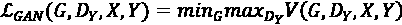
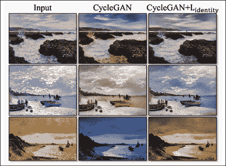

# 第七章：使用 GAN 进行风格转移

神经网络在涉及分析和语言技能的各种任务中正在取得进步。创造力是人类一直占有优势的领域，艺术不仅是主观的，没有明确定义的边界，而且很难量化。然而，这并没有阻止研究人员探索算法的创造能力。多年来有过几次成功试图创建、理解甚至模仿艺术或艺术风格的尝试，例如*深梦¹*和*神经风格转移*²。

生成模型非常适合于想象和创作相关的任务。特别是，生成对抗网络（GAN）在多年来的风格转移任务中得到了深入研究和探索。一个典型的例子是在*图 7.1*中展示的，CycleGAN 架构成功地使用莫奈和梵高等著名艺术家的风格将照片转换成绘画。


图 7.1：基于 CycleGAN³使用四位著名画家艺术风格的风格转移

*图 7.1*给我们展示了风格转移的视觉效果。样本表明 CycleGAN 模型能够保留输入图像的细节和结构，同时以模仿著名画家作品的方式进行转换。换句话说，风格转移是一种技术，它能够改变输入图像，使其采用另一个/参考图像的视觉风格。

在本章中，我们将介绍使用不同 GAN 架构进行风格转移的方法。我们将重点关注以下方面：

+   图像对图像配对风格转移技术

+   图像对图像无配对风格转移技术

+   相关工作

我们将涵盖不同 GAN 架构的内部工作原理和使风格转移设置得以实现的重要贡献。我们还将从头开始构建和训练这些架构，以更好地理解它们的工作原理。

本章中介绍的所有代码片段都可以直接在 Google Colab 中运行。出于篇幅的考虑，未包含依赖项的导入语句，但读者可以参考 GitHub 存储库获取完整的代码：[`github.com/PacktPublishing/Hands-On-Generative-AI-with-Python-and-TensorFlow-2`](https://github.com/PacktPublishing/Hands-On-Generative-AI-with-Python-and-TensorFlow-2)

让我们开始看配对风格转移吧。

# 使用 pix2pix GAN 进行配对风格转移

在*第六章*《使用 GAN 生成图像》中，我们讨论了与 GAN 架构相关的多项创新，这些创新导致了改进的结果和更好的输出类别控制。其中之一是条件 GAN。将这个简单但强大的添加到 GAN 设置中，使我们能够浏览潜在的向量空间，并控制生成器生成特定的输出。我们尝试了一个简单的 MNIST 条件 GAN，在那里我们能够生成我们选择的输出。

在本节中，我们将在风格迁移的背景下介绍条件 GAN 的一种变体。我们将详细讨论 pix2pix 架构的重要组件，并训练我们自己的成对风格迁移网络。我们将结束本节，介绍一些这种能力的惊人而创新的用例。

风格迁移是一个引人入胜的研究领域，将创造力和深度学习推向极限。在他们的作品《具有条件对抗网络的图像到图像翻译》中，Isola 和 Zhu 等人提出了一个有条件的 GAN 网络，能够学习任务特定的损失函数，因此可以跨数据集工作。正如其名称所示，这个 GAN 架构接受特定类型的图像作为输入，并将其转换为不同的域。它被称为成对的风格迁移，因为训练集需要同时具有来自源域和目标域的匹配样本。这种通用方法已被证明能够有效地从标签映射和边缘映射中合成高质量的图像，甚至着色图像。作者强调了开发一种能够理解手头数据集并学习映射函数的架构的重要性，而无需手工工程（通常情况下是这样）。

本文在条件 GAN 架构的基础上提出了一些贡献。其中一些贡献也被其他作品采用，并在其作品中引用了必要的参考文献。我们鼓励读者仔细阅读这些内容以深入理解。现在我们将详细介绍 pix2pix GAN 设置的每个组件。

## U-Net 生成器

深度卷积生成器是作为 DC-GAN 设置的一部分在《第六章，使用 GAN 生成图像》中探索的。由于 CNN 针对计算机视觉任务进行了优化，因此将它们用于生成器和鉴别器架构具有许多优势。本文专注于生成器设置的两种相关架构。两种选择是基本的编码器-解码器架构和带有跳跃连接的编码器-解码器架构。具有跳跃连接的架构与 U-Net 模型比基本的编码器-解码器设置更相似。因此，pix2pix GAN 中的生成器被称为 U-Net 生成器。参见*图 7.2*作为参考：


图 7.2：（左）编码器-解码器生成器。 （右）带有跳跃连接的编码器-解码器，或者是 U-Net 生成器。

典型的编码器（在编码-解码设置中）接受输入并通过一系列下采样层生成一个紧凑的向量形式。这个紧凑的向量被称为瓶颈特征。解码器部分然后将瓶颈特征上采样到生成最终输出。这种设置在许多场景中非常有用，比如语言翻译和图像重建。瓶颈特征将整体输入压缩到较低维度的空间。

理论上，瓶颈特征捕获所有所需信息，但当输入空间足够大时，实际上变得困难。

此外，对于我们的图像到图像翻译任务，存在许多需要在输入和输出图像之间保持一致的重要特征。例如，如果我们正在训练我们的 GAN 从轮廓地图生成航拍照片，与道路、水体和其他低级信息相关的信息需要在输入和输出之间保持一致，如*图 7.3*所示：


图 7.3：U-Net 架构使生成器能够确保输入和生成的输出之间的特征一致

U-Net 架构使用跳跃连接在输入和输出之间传递重要特征（见*图 7.2*和*图 7.3*）。在 pix2pix GAN 的情况下，跳跃连接被添加在每个第 *i* 个下采样层和（*n - i*）个上采样层之间，其中 n 是生成器中的总层数。跳跃连接导致从第 *i* 层到（*n - i*）层的所有通道被串联在一起，*i* 层被追加到（*n - i*）层：


图 7.4：U-Net 生成器的编码器和解码器块

文中提到的生成器针对编码器和解码器部分采用了重复的块结构。每个编码器块由卷积层、后跟批量归一化层、辍学层和泄漏的 ReLU 激活组成。每个这样的块通过步幅为 2 下采样 2 倍。

解码器块使用转置卷积层，后跟批量归一化和泄漏的 ReLU 激活。每个块上采样 2 倍。编码器和解码器块的简化设置如*图 7.4*所示。 如前所述，每个块之间也使用跳跃连接。掌握了生成器的这些知识后，让我们进入实现细节。

首先，让我们为 U-Net 生成器的下采样和上采样块准备一些实用的方法。下采样块使用由卷积层组成的堆栈，后跟泄漏的 ReLU 激活，最后是可选的批量归一化层。

下面的`downsample_block`辅助函数接受所需的滤波器数量、内核大小以及是否需要批归一化的输入参数：

```py
def downsample_block(incoming_layer,
                     num_filters,
                     kernel_size=4,
                     batch_normalization=True):
    downsample_layer = Conv2D(num_filters,
                              kernel_size=kernel_size,
                              strides=2, padding='same')(incoming_layer)
    downsample_layer = LeakyReLU(alpha=0.2)(downsample_layer)
    if batch_normalization:
        downsample_layer = BatchNormalization(momentum=0.8)(downsample_layer)
    return downsample_layer 
```

下一个辅助函数是上采样块。每个上采样块都是由一个上采样层、一个二维卷积层、一个可选的丢失层和最后一个批归一化层组成的堆栈。

```py
upsample_block function:
```

```py
def upsample_block(incoming_layer,
                   skip_input_layer,
                   num_filters,
                   kernel_size=4,
                   dropout_rate=0):
    upsample_layer = UpSampling2D(size=2)(incoming_layer)
    upsample_layer = Conv2D(num_filters,
                            kernel_size=kernel_size,
                            strides=1,
                            padding='same',
                            activation='relu')(upsample_layer)
    if dropout_rate:
        upsample_layer = Dropout(dropout_rate)(upsample_layer)
    upsample_layer = BatchNormalization(momentum=0.8)(upsample_layer)
    upsample_layer = Concatenate()([upsample_layer, skip_input_layer])
    return upsample_layer 
downsample_block(). We stack seven such blocks with an increasing number of filters.
```

最后一部分的关键是准备解码器。为此，我们使用`upsample_block()`函数堆叠了七个解码器块，并从编码器层获取跳跃连接。以下代码片段实现了这一点：

```py
def build_generator(img_shape,channels=3,num_filters=64):
    # Image input
    input_layer = Input(shape=img_shape)
    # Downsampling
    down_sample_1 = downsample_block(input_layer, 
                                     num_filters, 
                                     batch_normalization=False)
    # rest of the downsampling blocks have batch_normalization=true
    down_sample_2 = downsample_block(down_sample_1, num_filters*2)
    down_sample_3 = downsample_block(down_sample_2, num_filters*4)
    down_sample_4 = downsample_block(down_sample_3, num_filters*8)
    down_sample_5 = downsample_block(down_sample_4, num_filters*8)
    down_sample_6 = downsample_block(down_sample_5, num_filters*8)
    down_sample_7 = downsample_block(down_sample_6, num_filters*8)
    # Upsampling blocks with skip connections
    upsample_1 = upsample_block(down_sample_7, down_sample_6, 
                                               num_filters*8)
    upsample_2 = upsample_block(upsample_1, down_sample_5, 
                                            num_filters*8)
    upsample_3 = upsample_block(upsample_2, down_sample_4, 
                                            num_filters*8)
    upsample_4 = upsample_block(upsample_3, down_sample_3, 
                                            num_filters*8)
    upsample_5 = upsample_block(upsample_4, down_sample_2, 
                                            num_filters*2)
    upsample_6 = upsample_block(upsample_5, down_sample_1, num_filters)
    upsample_7 = UpSampling2D(size=2)(upsample_6)
    output_img = Conv2D(channels, 
                        kernel_size=4, 
                        strides=1, 
                        padding='same', 
                        activation='tanh')(upsample_7)
    return Model(input_layer, output_img) 
```

这展示了我们可以利用构建模块轻松形成复杂架构，如 U-Net 生成器。现在让我们了解与 pix2pix 的鉴别器相关的详细信息。

## 补丁-GAN 鉴别器

典型的鉴别器通过获取输入图像并将其分类为假或真来工作，即生成单个输出标量。在有条件的鉴别器的情况下，有两个输入，第一个是条件输入，第二个是用于分类的生成样本（来自生成器）。对于我们的图像到图像转换用例，鉴别器提供了源图像（条件输入）以及生成的样本，并且其目的是预测生成的样本是否是源的合理转换。

pix2pix 的作者提出了一个 Patch-GAN 设置用于鉴别器，它接受两个所需输入并生成大小为*N* x *N*的输出。*图 7.5*以简化的方式说明了 Patch-GAN 的概念。

```py
N x *N* input:
```


图 7.5: 简化的图示，以了解 Patch-GAN 鉴别器的工作原理

文章中提出的配置使用了三个 Patch-GAN 层，使用了 4 x 4 的内核大小和 2 的步幅。最后两层使用了 4 x 4 的内核大小和 1 的步幅。这导致了一个 70 x 70 的 Patch-GAN 设置，也就是说，*N* x *N*输出矩阵中的每个输出像素/单元/元素对应于输入图像的 70 x 70 补丁。每个这样的 70 x 70 补丁具有高度的重叠，因为输入图像的大小为 256 x 256。为了更好地理解这一点，让我们通过以下代码片段计算有效感受野的计算：

```py
def get_receptive_field(output_size, ksize, stride):
    return (output_size - 1) * stride + ksize
last_layer = get_receptive_field(output_size=1, ksize=4, stride=1)
# Receptive field: 4
fourth_layer = get_receptive_field(output_size=last_layer, ksize=4, stride=1)
# Receptive field: 7
third_layer = get_receptive_field(output_size=fourth_layer, ksize=4, stride=2)
# Receptive field: 16
second_layer = get_receptive_field(output_size=third_layer, ksize=4, stride=2)
# Receptive field: 34
first_layer = get_receptive_field(output_size=second_layer, ksize=4, stride=2)
# Receptive field: 70
print(first_layer) 
```

代码片段显示了理解每个输出像素如何对应于初始输入图像中大小为 70 x 70 的补丁的计算。

直观理解这一点的方式是假设模型准备了输入图像的多个重叠补丁，并试图将每个补丁分类为假或真，然后对其进行平均以准备整体结果。这已被证明能够提高生成图像的整体输出质量。

作者尝试了不同的补丁大小，范围从 1 x 1（Pixel-GAN）到 256 x 256（Image-GAN），但他们报告 70 x 70 配置（Patch-GAN）取得了最佳结果，而且在这之后几乎没有改进。

直观上，我们或许可以推断：在样式转移中，目标是从源图像复制局部特征到目标图像，因此补丁大小需要最好地为此目标服务；像素级补丁大小太窄，失去了更大特征的视野，而图像级补丁大小对图像内部的局部变化不敏感。

现在让我们使用 TensorFlow 2 来准备我们的 Patch-GAN 鉴别器。第一步是准备一个用于定义鉴别器模块的实用程序，包括卷积层、泄漏 ReLU 和可选的批量标准化层：

```py
def discriminator_block(incoming_layer,
                        num_filters,
                        kernel_size = 4,
                        batch_normalization=True):

    disc_layer = Conv2D(num_filters,
                        kernel_size = kernel_size,
                        strides=2,
                        padding='same')(incoming_layer)
    disc_layer = LeakyReLU(alpha = 0.2)(disc_layer)
    if batch_normalization:
        disc_layer = BatchNormalization(momentum = 0.8)(disc_layer)
    return disc_layer 
```

我们将使用这些模块来准备 Patch-GAN 鉴别器，步骤如下。下面的片段准备了一个鉴别器模型，它接受两个输入（生成器的输出和调节图像），然后是四个鉴别器模块，带有越来越多的滤波器：

```py
def build_discriminator(img_shape,num_filters=64):
    input_img = Input(shape=img_shape)
    cond_img = Input(shape=img_shape)
    # Concatenate input and conditioning image by channels 
    # as input for discriminator
    combined_input = Concatenate(axis=-1)([input_img, cond_img])
    # First discriminator block does not use batch_normalization
    disc_block_1 = discriminator_block(combined_input, 
                                       num_filters, 
                                       batch_normalization=False)
    disc_block_2 = discriminator_block(disc_block_1, num_filters*2)
    disc_block_3 = discriminator_block(disc_block_2, num_filters*4)
    disc_block_4 = discriminator_block(disc_block_3, num_filters*8)
    output = Conv2D(1, kernel_size=4, strides=1, padding='same')(disc_block_4)
    return Model([input_img, cond_img], output) 
```

与生成器类似，我们现在有一个构建所需的 Patch-GAN 鉴别器的函数。下一步是了解用于训练整体设置的目标函数。

## 损失

在*第六章*《基于 GAN 的图像生成》中，我们详细讨论了条件 GAN，介绍了总体条件 GAN 目标函数。在这里再次提到：


作者观察到，利用 L1 和 L2 正则化方法改进输出质量的典型方式仅通过捕捉低频率的局部结构，即对生成图像整体清晰度的贡献。与 L2 正则化相比，L1 正则化有助于防止模糊。因此，我们可以将 L1 正则化公式化为：


其中*x*是源图像，*y*是条件输入，*z*是噪音向量。将 U-Net 设置与 L1 正则化相结合可以生成清晰的输出图像，其中 GAN 处理高频率，而 L1 协助低频率。更新后的目标函数可以表述为：


与原始 GAN 论文中建议的改进类似，pix2pix 也最大化*log(D(G(z|y)))*，而不是最小化*log(1 – D(G(z|y)))*。这会导致梯度曲线反馈更好（参见*第六章*《基于 GAN 的图像生成》的*训练 GANs*部分）。

## 训练 pix2pix

我们现在已经准备好所有必需的组件。拼图的最后一块就是将生成器和鉴别器组合成一个训练循环，为准备好的 pix2pix GAN 网络做准备。

我们还将相关的损失函数附加到每个组件网络上：

```py
def train(generator, 
          discriminator, 
          gan, 
          patch_gan_shape, 
          epochs,
          path='/content/maps',
          batch_size = 1, 
          sample_interval = 50):

    # Ground truth shape/Patch-GAN outputs
    real_y = np.ones((batch_size,) + patch_gan_shape)
    fake_y = np.zeros((batch_size,) + patch_gan_shape)
    for epoch in range(epochs):
      print("Epoch={}".format(epoch))
      for idx, (imgs_source, imgs_cond) in enumerate(batch_generator(path=path, batch_size=batch_size,
                     img_res=[IMG_HEIGHT, IMG_WIDTH])):
            # train discriminator
            # generator generates outputs based on 
            # conditioned input images
            fake_imgs = generator.predict([imgs_cond])
            # calculate discriminator loss on real samples
            disc_loss_real = discriminator.train_on_batch([imgs_source,
                                                           imgs_cond], 
                                                           real_y)
            # calculate discriminator loss on fake samples
            disc_loss_fake = discriminator.train_on_batch([fake_imgs, 
                                                           imgs_cond], 
                                                           fake_y)
            # overall discriminator loss
            discriminator_loss = 0.5 * np.add(disc_loss_real, 
                                              disc_loss_fake)
            # train generator
            gen_loss = gan.train_on_batch([imgs_source, imgs_cond],
                                          [real_y, imgs_source])
            # training updates every 50 iterations
            if idx % 50 == 0:
              print ("[Epoch {}/{}] [Discriminator loss: {}, accuracy: {}] [Generator loss: {}]".format(epoch, epochs,                                         discriminator_loss[0],                                         100*discriminator_loss[1],
                                        gen_loss[0]))
            # Plot and Save progress every few iterations
            if idx % sample_interval == 0:
              plot_sample_images(generator=generator,
                                 path=path,
                                 epoch=epoch,
                                 batch_num=idx,
                                 output_dir='images') 
```

上述函数接受生成器、鉴别器和组合 pix2pix GAN 模型对象作为输入。根据 Patch-GAN 鉴别器的大小，我们定义用于保存假和真输出预测的 NumPy 数组。

与我们在前一章中训练 GAN 的方式类似，我们通过首先使用生成器生成假样本，然后使用这个样本来获取鉴别器输出来循环多次迭代。最后，这些输出用于计算损失并更新相应的模型权重。

现在我们有了训练循环，以下片段准备了鉴别器和 GAN 网络：

```py
IMG_WIDTH = 256
IMG_HEIGHT = 256
# build discriminator
discriminator = build_discriminator(img_shape=(IMG_HEIGHT,IMG_WIDTH,3),
                                    num_filters=64)
discriminator.compile(loss='mse',
                      optimizer=Adam(0.0002, 0.5),
                      metrics=['accuracy'])
# build generator and GAN objects
generator = build_generator(img_shape=(IMG_HEIGHT,IMG_WIDTH,3),
                            channels=3,
                            num_filters=64)
source_img = Input(shape=(IMG_HEIGHT,IMG_WIDTH,3))
cond_img = Input(shape=(IMG_HEIGHT,IMG_WIDTH,3))
fake_img = generator(cond_img)
discriminator.trainable = False
output = discriminator([fake_img, cond_img])
gan = Model(inputs=[source_img, cond_img], outputs=[output, fake_img])
gan.compile(loss=['mse', 'mae'],
            loss_weights=[1, 100],
            optimizer=Adam(0.0002, 0.5)) 
```

训练循环简单且类似于我们在前一章中使用的内容：每个时代，我们在训练鉴别器和生成器之间交替。使用的超参数如 pix2pix 论文中所述。在训练的不同阶段模型的输出在*图 7.6*中展示：


图 7.6：不同训练阶段的 pix2pix 生成输出

与我们在*第六章*中训练的更简单的架构不同，尽管更复杂，但 pix2pix GAN 的训练速度更快，而且在更少的迭代中稳定到更好的结果。在*图 7.6*中展示的输出显示了模型学习映射并从第一个时代开始生成高质量输出的能力。所有这些都可以归因于前几节讨论的一些创新。

现在我们已经看到了如何为配对风格转换设置和训练 pix2pix GAN，让我们看看它可以用于哪些事情。

## 使用案例

图像到图像翻译设置在现实世界中开启了许多用例和应用。pix2pix 设置提供了一个通用框架，可应用于许多图像到图像翻译用例，而无需专门设计架构或损失函数。在他们的工作中，Isola 和 Zhu 等人展示了许多有趣的研究来展示这些功能。

这个 pix2pix GAN 的有条件 GAN 设置能够执行诸如：

+   从标签输入生成建筑立面

+   黑白图像的彩色化

+   将卫星/航拍地图输入图像转换为类似 Google 地图的输出

+   语义分割任务，如街景到分割标签

+   将草图转换为图像任务，如草图转照片，草图转肖像，草图转猫，草图转彩色宝可梦，甚至轮廓转时尚物品，如鞋子、包等

+   背景去除

+   修补或图像完成

+   热图到 RGB 图像的转换

+   白天到夜晚场景和夏季到冬季场景转换

论文中执行的一些翻译类型在*图 7.7*中供参考：


图 7.7：使用 pix2pix 进行不同图像到图像翻译任务的几个示例

如前所述，pix2pix 架构经过高度优化，即使在非常小的数据集上也能训练。这使社区和其他研究人员尝试了更多创造性的用例；作者为论文开发了一个展示此类用例的网站。我们鼓励读者访问网站了解更多细节：[`phillipi.github.io/pix2pix/`](https://phillipi.github.io/pix2pix/)。

讨论了配对样式转移后，接下来我们将看看不配对样式转移。

# 使用 CycleGAN 进行不配对样式转移

配对样式转移是一个强大的设置，有许多用例，我们在前一节中讨论了其中一些。它提供了在给定一对源和目标领域数据集的情况下执行跨域转换的能力。pix2pix 设置还展示了 GAN 理解和学习所需的损失函数的能力，无需手动指定。

虽然相对于手工制作的损失函数和以往的作品而言，配对样式转移是一个巨大的改进，但它受到配对数据集的限制。配对样式转移要求输入和输出图像在结构上完全相同，即使领域不同（从航空到地图，从标签到场景等）。在本节中，我们将重点关注一种名为 CycleGAN 的改进样式转移架构。

CycleGAN 通过放宽输入和输出图像的约束来改进配对样式转移架构。CycleGAN 探索了模型尝试学习源和目标域之间风格差异的不配对样式转移范式，而不需要明确地对输入和输出图像进行配对。

朱和朴等人将这种不配对样式转移描述为类似于我们能够想象梵高或莫奈会如何画一个特定场景，而没有确实看到并列示例。引用自该论文³：

> 相反，我们了解到了莫奈绘画集和风景照片集。我们可以推理出这两组之间的风格差异，因此可以想象如果我们将一个场景从一组转换到另一组会是什么样子。

这不仅提供了一个很好的优势，也开拓了额外的用例，其中源和目标领域的精确配对要么不可用，要么我们没有足够的训练示例。

## CycleGAN 的整体设置

在配对样式转移的情况下，训练数据集由配对样本组成，表示为{*x*[i]，*y*[i]}，其中*x*[i]和*y*[i]之间存在对应关系。如参考*图 7.8（a）*所示：


图 7.8：（a）配对训练示例。（b）不配对训练示例。（来源：朱和朴等人《使用循环一致对抗网络进行不配对图像到图像转换》，图 2）

对于 CycleGAN，训练数据集包括来自源集的不成对样本，表示为，以及目标集，没有关于哪个*x*[i]匹配哪个*y*[j]的具体信息。 参考*图 7.8 (b)*。

在前一章中，我们讨论了 GAN 是如何学习一个映射，使得输出与无法区分。 尽管这对其他场景有效，但对于无配对的图像到图像转换任务却不太好。 由于缺乏配对样本，我们无法像以前那样使用 L1 损失来学习*G*，因此我们需要为无配对风格转换制定不同的损失。 一般来说，当我们学习函数*G*(*x*)时，这是学习*Y*的众多可能性之一。 换句话说，对于给定的*X*和*Y*，存在无限多个*G*会在上具有相同的分布。

为了减少搜索空间并在寻找最佳生成器*G*时增加更多约束，作者引入了一种称为**循环一致性**的特性。 从数学上讲，假设我们有两个生成器*G*和*F*，使得和。 在最佳设置中，*G*和*F*将相互逆转并且应该是双射，即一对一。 对于 CycleGAN，作者同时训练两个生成器*G*和*F*，以促进对抗损失以及循环一致性约束以鼓励和。 这导致成功训练无配对风格转换 GAN 设置。

请注意，与生成器类似，我们在这个设置中也有两组判别器，*D*[Y]用于*G*，*D*[X]用于*F*。 这个设置背后的直觉是，只有在能够以相反顺序执行相同的操作时，我们才能从源域到目标域学习出最佳的翻译。 *图 7.9*生动地演示了循环一致性的概念：


图 7.9：CycleGAN³的高级示意图

*图 7.9*的第一部分（最左侧）描述了 CycleGAN 的设置。 这个设置显示了两对生成器和判别器，*G*和*D*[Y]，*F*和*D*[X]。

*图 7.9*的中间部分显示了 CycleGAN 的前向循环训练。 输入*x*通过*G*转换为，然后*F*试图再生原始输入为。 这一步更新*G*和*D*[Y]。循环一致性损失有助于减少*x*和其再生形式之间的距离。

同样，*图 7.9*的第三部分（最右边）展示了向后传递，其中*y*被转换为*X*，然后*G*尝试再生原始输入，如。

为了更好地理解无配对训练设置是如何工作的，让我们通过一个通用示例来走一遍。假设任务是从英语到法语的翻译。一个模型已经学会了从英语到法语的最佳映射的设置将是当它被反转（即，法语到英语）时产生原始句子的结果。

现在让我们深入了解并详细了解接下来的小节中的每个组件。

## 对抗损失

典型的 GAN 使用对抗损失来训练一个足够聪明的生成器以欺骗鉴别器。在 CycleGAN 的情况下，由于我们有两组生成器和鉴别器，我们需要对对抗损失进行一些调整。让我们一步一步来。

对于我们的 CycleGAN 中的第一组生成器-鉴别器，即，对抗损失可以定义为：



同样，第二个生成器-鉴别器集合给出为：


这两个目标一起形成了 CycleGAN 的总体目标的前两项。对于生成器-鉴别器的两组，还有一个额外的变化是最小化部分。选择不是使用标准的负对数似然，而是选择最小二乘损失。表示为：


最小二乘损失被观察到更稳定，并导致更好质量的输出样本。

## 循环损失

我们之前介绍了循环一致性的概念；现在我们将看到如何明确实现它。在 CycleGAN 的论文中，作者朱和朴等人强调，对抗损失对于无配对图像到图像的翻译任务是不够的。不仅搜索空间太广，而且有足够的容量，生成器可以陷入模式坍塌而不学习源域和目标域的实际特征。

为了减少搜索空间并确保学习到的映射足够好，CycleGAN 设置应该能够生成原始输入*x*经过*G*和*F*处理后，即以及的反向路径。这些分别称为前向和后向循环一致性。总循环一致性损失是定义为 L1 损失：


此损失确保从生成的输出中重建原始输入尽可能接近。

## 身份损失

CycleGAN 的作者们还观察到了关于彩色对象的整体设置的特定问题。在没有特定颜色约束的情况下，*G* 和 *F* 生成器在前向和后向循环中会引入不同的色调，而这并不是必要的。为了减少这种不必要的行为，引入了一项称为**身份损失**的正则化项。查看 *Figure 7.10* 展示了这种特定效果的实际情况：



Figure 7.10 身份损失对 CycleGAN 性能的影响。输出对应于生成器 G(x) 的输出。（来源：Zhu 和 Park 等人。使用循环一致对抗网络进行非配对图像到图像的翻译，图 9）

正如在 *Figure 7.10* 中间列所显示的那样，没有身份损失的附加约束，CycleGAN 在其输出中引入了不必要的色调。因此，身份损失，定义为 ，可以表述为：


简单来说，这个损失将生成器正则化为当来自目标域的真实样本被用作生成的输入时的近似身份映射。

## 整体损失

CycleGAN 的整体目标简单地是前面子节中讨论的不同损失的加权和，即对抗损失、循环一致性损失和身份损失。整体目标定义为：


论文强调了不同实验中  和  的不同值。当我们从头开始准备我们的模型时，我们将明确说明这些正则化项的值。

## 实践操作：使用 CycleGAN 进行非配对式风格转换

我们讨论了 CycleGAN 的整体设置及其关键创新，即循环一致性损失和身份损失，这些使得非配对式风格转换成为可能。在本节中，我们将逐部分实施它，并训练一对 CycleGANs 将苹果转换为橙子，并将照片转换为梵高的绘画作品。

### 生成器设置

让我们从生成器开始。与 pix2pix GAN 类似，CycleGAN 也使用 U-Net 生成器（注意，此设置中有两个生成器）。

第一步是准备上采样和下采样块的实用方法。这里的一个重要区别是使用 **实例归一化** 替代批量归一化层。实例归一化的工作方式是对每个训练样本中的每个通道进行归一化。这与批量归一化相反，批量归一化是在整个小批量和所有输入特征上进行归一化的。有关实例归一化的更多详细信息，请参阅 *第六章*，*使用 GAN 生成图像*。

```py
downsample_block() prepares a stack composed of a convolutional layer followed by leaky ReLU activation and an instance normalization layer. The function takes the number of filters and kernel size as inputs:
```

```py
def downsample_block(incoming_layer,
                     num_filters,
                     kernel_size=4):
    downsample_layer = Conv2D(num_filters,
                              kernel_size=kernel_size,
                              strides=2, padding='same')(incoming_layer)
    downsample_layer = LeakyReLU(alpha=0.2)(downsample_layer)
    downsample_layer = InstanceNormalization()(downsample_layer)
    return downsample_layer 
upsample_block() function. This function prepares a stack consisting of an upsampling layer followed by a convolutional layer, optional dropout, and instance normalization layer. Each upsampling block takes input from the previous layer as well as a skip connection as input:
```

```py
def upsample_block(incoming_layer,
                   skip_input_layer,
                   num_filters,
                   kernel_size=4,
                   dropout_rate=0):

    upsample_layer = UpSampling2D(size=2)(incoming_layer)
    upsample_layer = Conv2D(num_filters,
                            kernel_size=kernel_size,
                            strides=1,
                            padding='same',
                            activation='relu')(upsample_layer)
    if dropout_rate:
        upsample_layer = Dropout(dropout_rate)(upsample_layer)
    upsample_layer = InstanceNormalization()(upsample_layer)
    upsample_layer = Concatenate()([upsample_layer, skip_input_layer])
    return upsample_layer 
```

这里使用的 U-Net 生成器与 pix2pix 设置相比要较浅，但表现同样出色（请参阅 *Cycle loss* 部分）。以下代码片段演示了构建生成器的方法：

```py
def build_generator(img_shape, channels=3, num_filters=32):
    # Image input
    input_layer = Input(shape=img_shape)
    # Downsampling
    down_sample_1 = downsample_block(input_layer, num_filters)
    down_sample_2 = downsample_block(down_sample_1, num_filters*2)
    down_sample_3 = downsample_block(down_sample_2,num_filters*4)
    down_sample_4 = downsample_block(down_sample_3,num_filters*8)
    # Upsampling
    upsample_1 = upsample_block(down_sample_4, down_sample_3, 
                                               num_filters*4)
    upsample_2 = upsample_block(upsample_1, down_sample_2, 
                                            num_filters*2)
    upsample_3 = upsample_block(upsample_2, down_sample_1, num_filters)
    upsample_4 = UpSampling2D(size=2)(upsample_3)
    output_img = Conv2D(channels, 
                        kernel_size=4, 
                        strides=1, 
                        padding='same', 
                        activation='tanh')(upsample_4)
    return Model(input_layer, output_img) 
```

如我们所见，生成器由四个下采样和四个上采样块组成，然后是一个输出目标图像的 Conv2D 层。现在让我们构建辨别器。

### 辨别器设置

与生成器一样，CycleGAN 中使用的辨别器也利用了来自 pix2pix 论文的内容。辨别器是 Patch-GAN，并且以下代码清单展示了构建辨别器块的方法以及构建辨别器的方法：

```py
def discriminator_block(incoming_layer,
                        num_filters,
                        kernel_size=4,
                        instance_normalization=True):

    disc_layer = Conv2D(num_filters,
                        kernel_size=kernel_size,
                        strides=2,
                        padding='same')(incoming_layer)
    disc_layer = LeakyReLU(alpha=0.2)(disc_layer)
    if instance_normalization:
        disc_layer = InstanceNormalization()(disc_layer)
    return disc_layer
def build_discriminator(img_shape,num_filters=64):
    input_layer = Input(shape=img_shape)
    disc_block_1 = discriminator_block(input_layer, 
                                       num_filters, 
                                       instance_normalization=False)
    disc_block_2 = discriminator_block(disc_block_1, num_filters*2)
    disc_block_3 = discriminator_block(disc_block_2, num_filters*4)
    disc_block_4 = discriminator_block(disc_block_3, num_filters*8)
    output = Conv2D(1, kernel_size=4, strides=1, padding='same')(disc_block_4)
    return Model(input_layer, output) 
```

现在我们已经准备好了构建模块。让我们使用它们来建立整体的 CycleGAN 架构。

### GAN 设置

我们使用这些方法准备了两套生成器和辨别器，用于从域 *A* 映射到 *B*，然后再从 *B* 回映射到 *A*。以下代码片段正是如此：

```py
generator_filters = 32
discriminator_filters = 64
# input shape
channels = 3
input_shape = (IMG_HEIGHT, IMG_WIDTH, channels)
# Loss weights
lambda_cycle = 10.0            
lambda_identity = 0.1 * lambda_cycle
optimizer = Adam(0.0002, 0.5)
patch = int(IMG_HEIGHT / 2**4)
patch_gan_shape = (patch, patch, 1)
# Discriminators
disc_A = build_discriminator(input_shape,discriminator_filters)
disc_A.compile(loss='mse',
    optimizer=optimizer,
    metrics=['accuracy'])
disc_B = build_discriminator(input_shape,discriminator_filters)
disc_B.compile(loss='mse',
    optimizer=optimizer,
    metrics=['accuracy'])
# Generators
gen_AB = build_generator(input_shape,channels, generator_filters)
gen_BA = build_generator(input_shape, channels, generator_filters)
# CycleGAN
img_A = Input(shape=input_shape)
img_B = Input(shape=input_shape)
# generate fake samples from both generators
fake_B = gen_AB(img_A)
fake_A = gen_BA(img_B)
# reconstruct original samples from both generators
reconstruct_A = gen_BA(fake_B)
reconstruct_B = gen_AB(fake_A)
# generate identity samples
identity_A = gen_BA(img_A)
identity_B = gen_AB(img_B)
# disable discriminator training
disc_A.trainable = False
disc_B.trainable = False
# use discriminator to classify real vs fake
output_A = disc_A(fake_A)
output_B = disc_B(fake_B)
# Combined model trains generators to fool discriminators
gan = Model(inputs=[img_A, img_B],
            outputs=[output_A, output_B,
                     reconstruct_A, reconstruct_B,
                     identity_A, identity_B ])
gan.compile(loss=['mse', 'mse','mae', 'mae','mae', 'mae'],
            loss_weights=[1, 1,
                          lambda_cycle, lambda_cycle,
                          lambda_identity, lambda_identity ],
            optimizer=optimizer) 
```

我们刚刚为两对生成器和辨别器创建了对象。通过定义必须的输入和输出，我们将它们组合在 `gan` 对象中。接下来实现训练循环。

### 训练循环

最后完整的画面是编写自定义训练循环。该循环首先使用两个生成器生成假样本，然后用它们更新两个方向的辨别器（即，`A` 到 `B` 和 `B` 到 `A`）。最后使用更新后的辨别器来训练整体的 CycleGAN。以下代码片段展示了训练循环：

```py
def train(gen_AB, 
          gen_BA, 
          disc_A, 
          disc_B, 
          gan, 
          patch_gan_shape, 
          epochs, 
          path='/content/{}'.format(dataset_name),
          batch_size=1, 
          sample_interval=50):
    # Adversarial loss ground truths
    real_y = np.ones((batch_size,) + patch_gan_shape)
    fake_y = np.zeros((batch_size,) + patch_gan_shape)
    for epoch in range(epochs):
        print("Epoch={}".format(epoch))
        for idx, (imgs_A, imgs_B) in enumerate(batch_generator(path,
                                                         batch_size,
                                image_res=[IMG_HEIGHT, IMG_WIDTH])):
            # train discriminators
            # generate fake samples from both generators
            fake_B = gen_AB.predict(imgs_A)
            fake_A = gen_BA.predict(imgs_B)
            # Train the discriminators 
            # (original images = real / translated = Fake)
            disc_A_loss_real = disc_A.train_on_batch(imgs_A, real_y)
            disc_A_loss_fake = disc_A.train_on_batch(fake_A, fake_y)
            disc_A_loss = 0.5 * np.add(disc_A_loss_real, 
                                       disc_A_loss_fake)
            disc_B_loss_real = disc_B.train_on_batch(imgs_B, real_y)
            disc_B_loss_fake = disc_B.train_on_batch(fake_B, fake_y)
            disc_B_loss = 0.5 * np.add(disc_B_loss_real, 
                                       disc_B_loss_fake)
            # Total disciminator loss
            discriminator_loss = 0.5 * np.add(disc_A_loss, disc_B_loss)
            # train generator
            gen_loss = gan.train_on_batch([imgs_A, imgs_B],
                                          [
                                           real_y, real_y,
                                           imgs_A, imgs_B,
                                           imgs_A, imgs_B
                                           ]
                                          )
            # training updates every 50 iterations
            if idx % 50 == 0:
              print ("[Epoch {}/{}] [Discriminator loss: {}, accuracy: {}][Generator loss: {}, Adversarial Loss: {}, Reconstruction Loss: {}, Identity Loss: {}]".format(idx, 
                           epoch,
                           discriminator_loss[0], 
                           100*discriminator_loss[1],
                           gen_loss[0],
                           np.mean(gen_loss[1:3]),
                           np.mean(gen_loss[3:5]),
                           np.mean(gen_loss[5:6])))

            # Plot and Save progress every few iterations
            if idx % sample_interval == 0:
              plot_sample_images(gen_AB,
                                 gen_BA,
                                 path=path,
                                 epoch=epoch,
                                 batch_num=idx,
                                 output_dir='images') 
```

CycleGAN 的训练循环与 pix2pix 的大致相似，但有一些补充。由于我们有两对生成器和辨别器，该函数将所有四个模型作为输入，以及一个合并的 `gan` 对象。训练循环从两个生成器生成的假样本开始，然后使用它们来更新相应的辨别器的权重。然后将它们合并以训练整体的 GAN 模型。

使用本节介绍的组件，我们对两组风格转移数据集进行了实验，将苹果转变成橙子并将照片转变为梵高画作。*图 7.11* 展示了苹果转变成橙子实验在不同训练阶段的输出：


图 7.11：循环生成对抗网络在苹果到橙子实验不同训练阶段生成的输出

类似地，*Figure 7.12* 展示了 CycleGAN 如何学习将照片转换为梵高风格的艺术作品：


图 7.12：循环生成对抗网络在将照片转变为梵高风格画作实验不同训练阶段生成的输出

正如上述示例所示（*图 7.11* 和 *7.12*），CycleGAN 似乎已经从两个域中学会了一些细微差别，而没有匹配的训练样本。这在难以获得匹配样本的情况下是一个很好的进展。

从这两个实验中另一个重要的观察是所需的训练量。虽然两个实验都使用了完全相同的设置和超参数，但与将照片转换为梵高风格绘画设置相比，苹果转橘子实验的训练速度要快得多。这可能归因于第二个实验中模式的数量很大，以及训练样本的多样性。

这结束了我们关于无配对风格迁移的部分。现在我们将探讨一些与配对和无配对风格迁移相关并有所分支的工作。

# 相关工作

风格迁移是一个有趣的领域，不同研究组之间正在进行大量的并行研究，以改进现有技术。迄今为止，在配对和无配对风格迁移领域中，最有影响力的两项工作已在本章中讨论过。在这个空间中还有一些其他相关工作值得讨论。

在本节中，我们将简要讨论无配对图像到图像转换领域中另外两个与 CycleGAN 类似的工作。具体而言，我们将涉及 DiscoGAN 和 DualGAN 设置，因为它们提出了类似的想法，但存在细微的变化。

重要的是要注意，同一领域还有许多其他工作。为了完整性和一致性，我们将我们的讨论限制在其中的几个上。鼓励读者也探索其他有趣的架构。

## DiscoGAN

Kim 和 Cha 等人提出了一种使用 GANs 发现跨域关系的模型，称为 DiscoGAN。⁶ 将黑白图像转换为彩色图像、卫星图像转换为地图样式图像等任务也可以称为*跨域转换*，以及风格迁移。

正如我们已经看到的，跨域转换在现实世界中具有许多应用。诸如自动驾驶和医疗保健等领域已经开始利用深度学习技术，然而许多用例因为缺乏更大的数据集而受阻。无配对跨域转换工作，如 DiscoGAN（和 CycleGAN），可以在这些领域提供巨大帮助。


图 7.13：DiscoGAN 设置⁶

与 CycleGAN 几乎同时发布的 DiscoGAN 在执行无配对风格迁移时具有许多相似之处，以及一些轻微的差异。与 CycleGAN 一样，DiscoGAN 利用两对生成器和判别器来实现跨域转换。第一对生成器将图像从域 *A* 转换为 *B*（表示为 *G*[AB]），而判别器（表示为 *D*[B]）则分类生成的输出（表示为 *x*[A][B]）是真实的还是伪造的。

第二个生成器-判别器对是论文的关键。通过强制系统从生成的输出（*x*[A][B]）中再生生成原始输入图像，DiscoGAN 能够学习所需的跨域表示，而无需明确的配对。使用第二个生成器（标记为 G[B][A]）及其对应的判别器（*D*[A]）实现了对原始样本的重构。整体设置如*图 7.13*所示，仅供参考。

如*图 7.13*所示，为了学习跨域表示，DiscoGAN 不仅将图像从域*A*转换为*x*[AB]，然后重构回来，还对域*B*中的图像做同样的操作（即，*B*到*x*[BA]然后重构回来）。这种双向映射，也称为双射，以及重构损失和对抗损失，有助于实现最先进的结果。作者指出，仅依赖重构损失而没有附加管道（*B*到*x*[BA]和重构）的设置仍会导致模式崩溃等故障模式。

与 CycleGAN 不同，我们注意到重构损失是 L1 损失和前向、后向重构的加权和，DiscoGAN 以略微不同的方式探索和使用重构损失。DiscoGAN 论文提到，重构损失可以是任何距离度量，例如均方误差、余弦距离或铰链损失。如下方方程所示，生成器然后单独在训练中使用重构损失：


其中代表原始的对抗损失，是每个 GAN 对的重构损失。

生成器使用具有卷积和反卷积层（或转置卷积）的编码器-解码器设置来对中间表示/特征图进行下采样和上采样。另一方面，解码器类似于生成器的编码器部分，由卷积层组成，最后一层是用于分类的 sigmoid 函数。

DiscoGAN 的作者提出了许多经过充分记录的实验，以了解他们提出的架构如何处理模式崩溃。其中一项实验是汽车到汽车的映射实验。在这个设置中，作者探索了原始 GAN、带重构损失的 GAN 和 DiscoGAN 这三种架构如何处理各种模式。映射实验将具有特定旋转（方位角）的汽车输入图像转换为不同的旋转角度。


图 7.14：汽车到汽车的映射实验，以了解不同设置下的模式崩溃情况。(a) 原始 GAN，(b) 带重构损失的 GAN，(c) DiscoGAN 设置。

如*图 7.14（a）*和*(b)*所示，无论是 GAN 还是带重建损失的 GAN 都遭受模式崩溃；在这两种情况下，聚类的点表示这些架构只能学习少数模式，或者是汽车方向（线是真实情况）。相反，*图 7.14（c）*显示 DiscoGAN 学习了各种模式的更好表示，点分布在线附近。

设置 DiscoGAN 相当简单。利用本章介绍的工具，我们训练了一个 DiscoGAN 设置，学习边缘到鞋子的映射。


图 7.15：DiscoGAN 在边缘到鞋子实验中的训练过程

*图 7.15*显示了我们模型的训练进展。从随机映射开始，以了解边界形状和一些颜色。训练更长时间可以获得更好的结果，作者在他们的论文中展示了这一点。

## DualGAN

DualGAN 是非配对图像到图像转换架构家族中的最新成员。与 DiscoGAN 和 CycleGAN 相比，它以略微不同的角度处理这个任务。作者 Yi 和 Zhang 等人发布了名为*DualGAN: 图像到图像转换的无监督双学习*⁷的作品，灵感来自一篇关于*机器翻译的双学习*的重要论文。⁸从论文中引用，将图像到图像转换视为双学习任务的想法如下：

> 我们的方法受到自然语言处理中的双学习的启发。双学习同时训练两个“相反的”语言翻译器（例如，英语到法语和法语到英语），通过最小化由两个翻译器的嵌套应用产生的重建损失。这两个翻译器代表原始-双对，并且嵌套应用形成一个闭环，允许应用强化学习。具体来说，在单语数据（英语或法语）上测量的重建损失将生成信息反馈，以训练双语翻译模型。

尽管 CycleGAN 论文中没有明确引用，但这些想法似乎有相当多的重叠。如预期的那样，DualGAN 的设置也使用了两对生成器-判别器。这两对被称为原始 GAN 和双 GAN。*图 7.16*展示了 DualGAN 的整体设置：


图 7.16：DualGAN 设置⁷

原始 GAN（表示为*G*[A]）从域 U 接收输入 u 并学习将其转换为来自域 V 的*v*，而双 GAN 进行相反操作。这个设置的两个反馈信号称为重建错误和成员评分。成员评分类似于 CycleGAN 中的对抗损失，其中*G*[A]的目标是生成足够优秀的输出*G*A 以欺骗*D*[A]。

重建损失表示了 *G*[B] 从生成的输出 *G*A 中重构原始输入 *u* 的学习能力。重建损失类似于 CycleGAN 的循环一致性损失，除了在问题制定方面与 CycleGAN 的差异之外，训练设置也略有不同。DualGAN 设置使用 Wasserstein 损失进行训练。他们报告说使用 Wasserstein 损失有助于轻松获得稳定的模型。*图 7.17* 显示了 DualGAN 论文中的一些实验：


图 7.17：使用 DualGAN 进行非配对图像到图像的翻译⁷

DualGAN 设置还利用了 U-Net 风格的生成器和 Patch-GAN 风格的鉴别器，这些技巧对输出质量产生了影响。

# 摘要

在本章中，我们通过图像到图像的翻译任务的视角探索了 GAN 研究的创新一面。尽管创新的影响是显而易见的，但这些技术也为改进计算机视觉模型的研究和开发开辟了途径，尤其是在数据集难以获取的领域。

我们从理解配对图像到图像的翻译任务开始了本章。这个任务提供了训练数据，其中源域和目标域有配对的训练样本。我们使用 pix2pix GAN 架构探索了这个任务。通过这种架构，我们探索了编码器-解码器架构如何有助于开发可以产生高保真输出的生成器。pix2pix 论文通过利用跳跃连接或 U-Net 风格生成器将编码器-解码器架构推进了一步。

这种设置还提出了另一个强大的概念，称为 Patch-GAN 鉴别器，它可以优雅地帮助整体 GAN 获得更好的反馈信号，适用于不同的风格转换用例。我们利用这些概念从零开始构建和训练了我们自己的 pix2pix GAN，将卫星图像转换为类似 Google 地图的输出。我们的训练结果是使用很少的训练样本和训练迭代得到的高质量输出。观察到这种更快速和稳定的训练是这项工作的作者们贡献的不同创新直接影响的结果。我们还探索了使用 pix2pix 风格架构可以实现的各种其他用例。

在本章的第二部分中，我们将图像到图像的翻译任务扩展到了非配对的设置中。非配对的训练设置无疑是一个更加复杂的问题，但它开辟了更多的可能性。配对设置适用于在源域和目标域中都有明确样本对的情况，但大多数现实场景下并没有这样的数据集。

我们通过 CycleGAN 架构探索了非配对图像到图像的翻译设置。CycleGAN 的作者提出了许多直观但强大的贡献，使得非配对设置能够工作。我们讨论了循环一致性损失和身份损失作为整体对抗损失的正则化项的概念。我们特别讨论了身份损失如何改善样本的整体重构，从而提高输出的整体质量。利用这些概念，我们使用 TensorFlow-Keras API 从头开始构建了 CycleGAN 设置。我们对两个数据集进行了实验，一个是苹果到橙子，另一个是照片到梵高风格的绘画。在这两种情况下，结果都非常好。

在本章的最后一节中，我们讨论了一些相关工作，即 DiscoGAN 和 DualGAN 架构。与 CycleGAN 一起，这两种架构构成了整体非配对图像到图像翻译 GAN 的家族。我们讨论了这些架构如何从略有不同的角度呈现相似的思想。我们还讨论了问题表述和整体架构中细微差异如何影响最终结果。

在这一章中，我们在 *第六章*，*使用 GAN 生成图像* 中讨论的与 GAN 及特别是条件 GAN 相关的概念基础上进行了拓展。我们讨论了许多创新和贡献，利用简单的构建模块实现了一些惊人的用例。接下来的一系列章节将进一步将生成模型的边界推向文本和音频等领域。系好安全带吧！

# 参考文献

1.  Mordvintsev，A.，麦克唐纳，K.，鲁道夫，L.，金，J-S.，李，J.，以及 daviga404。 （2015）。deepdream。GitHub 代码库。[`github.com/google/deepdream`](https://github.com/google/deepdream)

1.  Gatys，L.A.，Ecker，A.S.，以及 Bethge，M.（2015）。*一种艺术风格的神经算法*。arXiv。[`arxiv.org/abs/1508.06576`](https://arxiv.org/abs/1508.06576)

1.  朱，J-Y.，帕克，T.，伊索拉，P.，以及埃弗罗斯，A.A.（2017）。*使用循环一致性对抗网络进行非配对图像到图像的翻译*。arXiv。[`arxiv.org/abs/1703.10593`](https://arxiv.org/abs/1703.10593)

1.  伊索拉，P.，朱，J-Y.，周，T.，以及埃弗罗斯，A.A.（2017）。*带条件对抗网络的图像到图像翻译*。2017 年 IEEE 计算机视觉与模式识别会议（CVPR），2017，pp. 5967-5976。[`ieeexplore.ieee.org/document/8100115`](https://ieeexplore.ieee.org/document/8100115)

1.  Ronneberger，O.，Fisher，P.，以及 Brox，T.（2015）。*U-net：用于生物医学图像分割的卷积网络*。MICCAI，2015。[`arxiv.org/abs/1505.04597`](https://arxiv.org/abs/1505.04597)

1.  金，T.，查，M.，金，H.，李，J.K.，以及金，J.（2017）。*用生成对抗网络学习发现跨域关系*。2017 年国际机器学习会议（ICML）。[`arxiv.org/abs/1703.05192`](https://arxiv.org/abs/1703.05192)

1.  Yi, Z., Zhang, H., Tan, P., & Gong, M. (2017). *DualGAN: 无监督的图像到图像翻译的双向学习*. ICCV 2017\. [`arxiv.org/abs/1704.02510v4`](https://arxiv.org/abs/1704.02510v4)

1.  Xia, Y., He, D., Qin, T., Wang, L., Yu, N., Liu, T-Y., & Ma, W-Y. (2016). *机器翻译的双向学习*. NIPS 2016\. [`arxiv.org/abs/1611.00179`](https://arxiv.org/abs/1611.00179)
