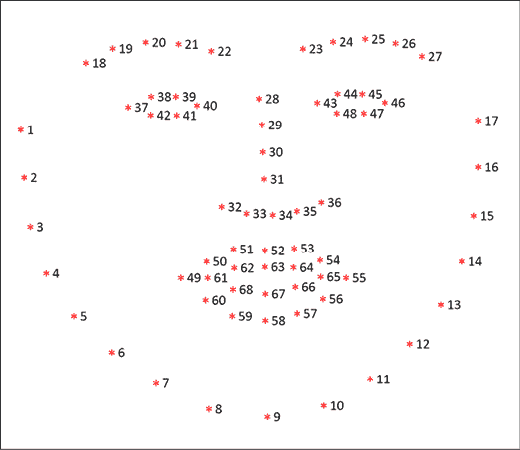

# 第八章：使用 GANs 进行 deepfakes

对视频和照片进行编辑以编辑文物已经有很长一段时间了。如果你看过《阿甘正传》或《速度与激情 7》，很有可能你甚至没有注意到这些电影中约翰·F·肯尼迪或保罗·沃克的场景是假的，是根据需要编辑到电影中的。

你可能还记得电影《阿甘正传》中的一个场景，阿甘会见约翰·F·肯尼迪。该场景是使用复杂的视觉效果和档案素材创建的，以确保高质量的结果。好莱坞制片厂、世界各地的间谍机构和媒体机构一直在利用诸如 Photoshop、After Effects 和复杂的自定义视觉效果/CGI（计算机生成图像）流水线等编辑工具来获得如此引人入胜的结果。虽然在大多数情况下结果或多或少是可信的，但要编辑每一个细节，如场景光线、面部、眼睛和唇部运动以及每一帧的阴影，需要大量的人工工作和时间。

同样，在 BuzzFeed 的一个视频中，你很有可能见过前美国总统巴拉克·奥巴马说“基尔蒙格是对的”（基尔蒙格是漫威电影宇宙的一个反派角色）。虽然显然是假的，但从视觉和音频方面看，视频似乎是真实的。还有许多其他例子，突出人物可以被看到发表他们通常不会说的评论。

不考虑伦理问题，阿甘见到约翰·F·肯尼迪和巴拉克·奥巴马谈论基尔蒙格之间有一个主要区别。如前所述，前者是通过使用复杂的视觉效果/CGI 进行的繁琐手工工作的结果。而后者，则是一种名为**deepfakes**的技术的结果。*deep learning*和*fake*的混成词，*deepfake*是一个广泛的术语，用于描述生成我们讨论的示例的 AI 能力技术。

在本章中，我们将涵盖与 deepfakes 相关的不同概念、架构和组件。我们将重点关注以下主题：

+   深度伪造技术景观概览

+   Deepfaking 的不同形式：替换、重新演绎和编辑

+   不同架构利用的关键特性

+   高级 deepfakes 工作流程

+   使用自动编码器交换面孔

+   使用 pix2pix 重新演绎奥巴马的面部动作

+   挑战和道德问题

+   关于现成实现的简要讨论

我们将介绍不同 GAN 架构的内部工作原理和使 deepfakes 成为可能的主要贡献。我们还将从头构建和训练这些架构，以更好地理解它们。Deepfakes 不仅限于视频或照片，还用于生成假文本（新闻文章，书籍）甚至语音（语音片段，电话录音）。在本章中，我们只关注视频/图像，术语*deepfakes*指相关用例，除非另有说明。

本章中呈现的所有代码片段都可以直接在 Google Colab 中运行。出于空间原因，依赖项的导入语句未包含在内，但读者可以参考 GitHub 存储库获取完整的代码：[`github.com/PacktPublishing/Hands-On-Generative-AI-with-Python-and-TensorFlow-2`](https://github.com/PacktPublishing/Hands-On-Generative-AI-with-Python-and-TensorFlow-2)。

让我们从 deepfakes 的概述开始。

# Deepfakes 概述

Deepfakes 是一个总括性术语，代表使用人工智能（特别是深度学习）生成的内容，对人类看来真实和可信。生成假内容或操纵现有内容以适应参与方的需求和议程并不是什么新鲜事。在前言中，我们讨论了一些通过 CGI 和费力的手工努力来生成逼真结果的电影。随着深度学习和更具体地说，生成模型的进步，越来越难区分真实与虚假。

**生成对抗网络**（**GANs**）在这一领域发挥了非常重要的作用，使得能够生成清晰、高质量的图像和视频。诸如[`thispersondoesnotexist.com`](https://thispersondoesnotexist.com)等基于 StyleGAN 的作品真正推动了生成高质量逼真内容的界限。其他一些关键架构（我们在*第六章*，*使用 GAN 生成图像*和*第七章*，*使用 GAN 进行风格转换*中讨论过）已成为不同 deepfake 设置的重要构建基块。

Deepfakes 有许多应用，可以分类为创造性、生产性和不道德或恶意的用例。以下是几个例子，突出了 deepfakes 的不同用例。

创造性和生产性用例：

+   **重现历史和著名人物**：有许多历史人物，我们很乐意与之互动并学习。有能力操纵和生成逼真内容的深度伪造技术正是这种用例所需的技术。一项大规模的此类实验是为了让著名超现实主义画家萨尔瓦多·达利重生。达利博物馆与广告公司 GS&P 合作，开发了一个名为《达利永生》的展览。² 该展览利用存档的视频素材和访谈来训练一个深度伪造设置，观看者被达利所迎接，然后与他分享了他的一生故事。最后，达利甚至提出与观众自拍，输出的照片确实是逼真的自拍照。

+   **电影翻译**：随着 Netflix 等平台变得越来越普遍，观众们观看跨语言内容的次数比以往任何时候都要多。虽然字幕和手动配音是可行的选择，但它们还有很多需要改进的地方。利用深度伪造技术，使用人工智能自动生成任何视频的配音翻译比以往任何时候都更加容易。被称为 *疟疾必须消灭* 的社会倡议利用了类似的技术，创建了一个强大的运动，帮助著名足球运动员大卫·贝克汉姆以九种不同的语言传播意识。³ 同样地，深度伪造技术已经被印度的一个政党使用，其中候选人在竞选活动中被看到使用不同的语言发言。⁴

+   **时尚**：利用 GANs 和其他生成模型创建新的风格和时尚内容并不是什么新鲜事。随着深度伪造技术的出现，研究人员、博客作者和时尚品牌将时尚产业推向了新的高度。现在我们有了由人工智能生成的数字模特，她们穿着新的时尚系列，并帮助降低成本。这项技术甚至被用来创建可以个性化模仿买家体型的模特渲染，以提高购买的机会。⁵

+   **视频游戏角色**：多年来，视频游戏已经取得了很大进步，许多现代游戏展现了电影级的图形。传统上，人类演员被利用来在这些游戏中扮演角色。然而，现在有一个越来越流行的趋势，就是利用深度伪造和相关技术来开发角色和故事情节。游戏 *使命召唤* 的开发者发布了一段预告片，展示了前美国总统罗纳德·里根在游戏中扮演一个角色。⁶

+   **库存图像**：营销传单、广告和官方文件有时需要把某些人放在其他内容旁边。传统上，使用实际的演员和模特。也有库存图像服务授权此类内容进行商业使用。有了[`thispersondoesnotexist.com`](https://thispersondoesnotexist.com)这样的作品，现在非常容易根据我们的需求生成一个新的面孔或个性，而不需要任何实际的演员或模特。

恶意使用案例：

+   **色情内容**：根据我们的需求生成虚假内容具有严重后果。事实上，deepfakes 引起公众注意时，是因为在 2017 年，一位 Reddit 用户发布了一个臭名昭著的伪造色情视频，视频中一位名人的面孔被替换了⁷。此后，已经有整个社区致力于生成这样的虚假视频，这对他们描绘的人物的公众形象可能造成非常严重的破坏。

+   **冒充**：我们已经讨论过一个前美国总统巴拉克·奥巴马演讲的伪造视频，他谈论了许多他通常会避免的话题和事物。制作这样的视频来冒充公众人物、政治家等可能会产生巨大的后果。

Deepfakes 包括类似真实的内容，可以被归类为多个子类别。在下一节中，我们将讨论不同类别，以更好地理解整体情况。

# 操作模式

生成可信的虚假内容需要注意多个方面，以确保结果尽可能地真实。典型的 deepfake 设置需要一个**源**、**一个目标**和**生成的内容**。

+   源（用下标*s*表示）是控制所需输出的驱动身份。

+   目标（用下标*t*表示）是正在伪造的身份。

+   生成的内容（用下标*g*表示）是通过将源转换为目标得到的结果。

现在我们已经了解了一些基本术语，让我们深入了解生成虚假内容的不同方式。

## 替换

这是生成虚假内容的最常用形式。目的是用源（*x*[s]）的特定内容替换目标（*x*[t]）的内容。面部替换已经是一个长期以来的研究领域。*图 8.1*显示了唐纳德·特朗普的面孔被尼古拉斯·凯奇的面孔替换的例子。图中展示了源（*x*[s]）和目标（*x*[t]）的身份，而生成的内容（*x*[g]）显示在最后一列：


图 8.1：面部替换⁸

替换技术可以大致分为以下几类：

+   **转移**：这是一种基本的替换形式，其中*x*[s]的内容（例如，脸部替换的情况下）转移到*x*[t]。转移方法在粗略的上下文中大多被利用，换句话说，替换并不如人们所期望的那样干净或平滑。例如，对于购物服装，用户可能有兴趣在不同的服装中进行可视化。这类应用可以省略非常详细的信息但仍然为用户提供所需的体验。

+   **交换**：这是一种略微复杂一点的替换类型，其中对*x*[t]的转移受到*x*[t]本身特定特征的引导。例如，在*图 8.1*中，底部一行显示了尼古拉斯·凯奇的脸被换到唐纳德·特朗普的脸上。替换图像保持了特朗普（目标图像）的头发、姿势等特征。

替换模式，尽管听起来很琐碎，但并不简单，因为任何模型都需要关注与图像照明、肤色、遮挡和阴影相关的许多因素。本章后面的部分将讨论其中一些方面的处理。

## 重新表演

替换方法产生令人印象深刻的结果，但生成的内容仍有改进的空间。再演绎方法被用来捕捉目标的姿势、表情和凝视等特征，以改进生成内容的可信度。再演绎技术侧重于以下方面以提高虚假内容的质量：

+   **凝视**：重点是关注眼睛和眼皮的位置。该领域的技术试图根据源的眼部运动/凝视重新演绎生成输出的凝视。这对于改进照片或保持视频中的眼神联系非常有用。

+   **口部**：重新演绎面部的嘴唇和口部区域可以提高生成内容的可信度。在这种情况下，*x*[t]的口部运动取决于*x*[s]的口部运动。在某些情况下，源输入*x*[s]可能是语音或其他音频。口部重新演绎方法也被称为 Bol 方法。

+   **表情**：这是再演绎的一种更通用形式，通常包括其他再演绎方面，如眼睛、嘴巴和姿势。它们被用来根据*x*[s]驱动*x*[t]的表达。

+   **姿势**：姿势再现，无论是头部还是身体，都是一种全面考虑头部和整个身体定位的方法。在这种情况下，源驱动目标，并产生更有信服力的结果。

这些再现在 *图 8.2* 中得到了更好的描述，在图的左侧我们有源（*x*[s]）和目标（*x*[t]），图的右侧显示了源的不同方面如何影响生成的内容。请注意，*图 8.2* 仅用于举例说明，结果并不仅仅是目标内容的简单复制粘贴。随着我们在本章中的深入，我们还会看到更进化的例子。


图 8.2: 再现方法。受影响的区域在每次再现中都有所突出

特定地区虚拟不同类型的再现在 *图 8.2* 中被特别突出。 正如前面提到的，很显然表情再现包括眼部和口部区域。

## 编辑

深伪造并不一定涉及替换或再现。深伪造的另一个应用是为了实现特定目标而添加、删除或更改目标实体的某些方面。编辑可能涉及对服装、年龄、种族、性别、头发等进行操纵。以下图示了一些可能的编辑:


图 8.3: 编辑模式下的深伪造。左图是变换的基础输入。右图展示了三种不同的编辑: 头发、眼镜和年龄。

*图 8.3* 右侧的编辑展示了如何将输入图像的某些属性转换为生成虚假内容。有许多良性的用例，要么是为了好玩（如**FaceApp**和**REFACE**这样的应用程序），要么具有商业价值（眼镜和化妆品品牌）。然而，也有许多恶意的应用程序（色情作品、虚假身份等），这些恶意应用程序削弱并引发了对此类工具的使用引发的问题。

我们已经介绍了生成虚假内容的不同模式的基础知识，并讨论了每种模式的主要关注领域。在下一节中，我们将讨论在训练此类模型中发挥作用的特征以及我们如何利用它们。

# 关键特征集

人脸和身体是虚假内容生成任务中的关键实体。尽管深度学习架构通常不需要手工制作的特征，在处理复杂实体时，小小的推动会产生深远影响。特别是在处理人脸时，除了在给定图像或视频中检测整体脸部之外，深伪造解决方案还需要关注眼睛、嘴巴和其他特征。在上一节中，我们讨论了不同的操作模式，强调了脸部不同部分的重要性以及它们对改善所生成虚假内容的可信度的影响。

在本节中，我们将简要介绍一些不同深伪造解决方案利用的重要特征。这些特征包括:

+   面部行为编码系统 (FACS)

+   三维可塑模型 (3DMM)

+   面部标志

我们还将进行一些实际操作，以更好地理解这些特征集。

## 面部动作编码系统（FACS）

胡尔特绍在 1969 年开发了 FACS，并在 1978 年由埃克曼等人采用和完善。面部动作编码系统，或 FACS，是一种基于解剖学的系统，用于理解面部运动。它是用于分析面部肌肉以理解表情和情绪的最详尽和准确的编码系统之一。

*图 8.4*描述了一些特定的肌肉动作及其相关含义。


图 8.4：使用 FACS 进行动作标记的样本集

FACS 包括一份详细的手册，由人类编码员用来手动编码每个面部表情。肌肉活动被分为被称为行动单元（AU）的组。这些 AU 代表与面部表情对应的肌肉活动。 *图 8.4* 描述了一些示例 AU，指向眉毛、嘴唇和面部其他部分的运动。

尽管最初的 FACS 系统需要人工编码员，现在已经有自动化系统可计算确定正确的 AU。像下面这样的作品利用自动的 AU 生成逼真的结果：

+   *GANimation:解剖学感知的* *来自单个图像的面部动画*⁹

+   *视觉效果的高分辨率* *人脸换装*¹⁰

+   *3D* *引导的细粒度人脸操作*¹¹

尽管 FACS 可以对给定面部表情提供细粒度的理解，但整个系统的复杂性限制了它在专业动画/CGI/VFX 工作室之外的使用。

## 3D 可塑模型

三维可塑模型，简称 3DMM，是一种从 2D 图像推断完整三维面部表面的方法。最初由 Blanz、Vetter 等人在其名为*用于合成 3D 面部的可塑模型*的作品中提出¹²，这是一种强大的统计方法，可以模拟人脸形状和质地以及姿势和照明。

该技术通过将输入图像转换为面部网格来工作。面部网格由确定面部每个部分的形状和质地的顶点和边组成。网格有助于使用一组向量和矩阵对姿势和表情进行参数化。然后，这些向量或 3D 重建本身可以用作我们的伪造内容生成模型的输入特征。

## 面部标记

基于 FACS 和 3DMM 的特征在定义人脸（以及总体身体）特征方面具有高度准确性和表现力。然而，这些方法在计算方面是昂贵的，有时甚至需要人类干预（例如，FACS 编码）才能得到良好的结果。面部标记是另一种特征集，简单而强大，并且被一些最近的作品使用以取得最先进的结果。

面部标记是一系列重要的面部特征，如鼻子、眉毛、嘴巴和眼睛的角落。 目标是使用某种回归模型检测这些关键特征。 最常见的方法是利用预定义的一组在面部或身体上可以使用训练模型进行有效跟踪的位置。

面部标记检测任务可以分解为以下两步骤：

+   第一步涉及定位给定图像中的一个或多个面孔。

+   第二步需要细化，识别已识别的面孔的关键面部结构。

这两个步骤可以看作是形状预测的特殊案例。 我们可以使用几种不同的方法来检测面部标记作为生成虚假内容任务的特征。 在接下来的小节中，我们将介绍三种最广泛使用的方法：OpenCV、dlib 和 MTCNN。

### 使用 OpenCV 进行面部标记检测

OpenCV 是一个旨在处理实时任务的计算机视觉库。 它是最受欢迎和广泛使用的库之一，可在许多语言中使用包装器，包括 Python。 它包括许多扩展和 contrib-packages，例如用于人脸检测、文本处理和图像处理的扩展。 这些包增强了它的整体功能。

使用 OpenCV 可以以几种不同的方式执行面部标记检测。 其中一种方法是利用 Haar Cascade 过滤器，它们利用直方图然后是 SVM 进行对象检测。 OpenCV 还支持基于 DNN 的执行相同任务的方法。

### 使用 dlib 进行面部标记检测

Dlib 是另一个跨平台库，提供的功能与 OpenCV 大体相似。 Dlib 的主要优势在于提供了一系列用于人脸和标记的预训练检测器。 在我们深入实现细节之前，让我们更多地了解一下标记特征。

面部标记是给定面部的细节。 即使每张脸都是独特的，但有些属性可以帮助我们识别给定形状为面孔。 这个精确的常见特征列表被编码成所谓的 **68 坐标** 或 **68 点系统**。 此点系统被设计用于注释 iBUG-300W 数据集。 这个数据集是 dlib 提供的许多标记检测器的基础。 每个特征都被赋予一个特定的索引（在 68 个之中）并且有它自己的 (*x*, *y*) 坐标。 在 *图 8.5* 中指示了这 68 个索引。



图 8.5：来自 iBUG-300W 数据集的 68 个点标注

如图所示，每个索引对应于特定的坐标，一组索引标记了面部标记。 例如，索引 28-31 对应于鼻子的桥梁，检测器尝试检测并预测这些索引的相应坐标。

设置 dlib 是一个有点复杂的过程，特别是如果你使用的是 Windows 机器。请参考以下设置指南：

+   [`www.pyimagesearch.com/2017/03/27/how-to-install-dlib/`](https://www.pyimagesearch.com/2017/03/27/how-to-install-dlib/)

+   [`medium.com/analytics-vidhya/how-to-install-dlib-library-for-python-in-windows-10-57348ba1117f`](https://medium.com/analytics-vidhya/how-to-install-dlib-library-for-python-in-windows-10-57348ba1117)

现在，让我们利用这个 68 个面部地标的坐标系来开发一个简短的演示应用程序，用于检测面部特征。我们将利用 dlib 和 OpenCV 中的预训练检测器来构建这个演示。以下代码片段显示了如何用几行代码轻松地识别不同的面部地标：

```py
detector = dlib.get_frontal_face_detector() 
predictor = dlib.shape_predictor("shape_predictor_68_face_landmarks.dat")
image = cv2.imread('nicolas_ref.png')
# convert to grayscale
gray = cv2.cvtColor(image, cv2.COLOR_BGR2GRAY) 
faces = detector(gray)
# identify and mark features
for face in faces:  
    x1 = face.left() 
    y1 = face.top() 
    x2 = face.right() 
    y2 = face.bottom() 
    landmarks = predictor(gray, face) 
    for n in range(0, 68): 
        x = landmarks.part(n).x 
        y = landmarks.part(n).y 
        cv2.circle(image, (x, y), 2, (255, 0, 0), -1) 
```

上述代码接受面部图像作为输入，将其转换为灰度，并使用 dlib 检测器和预测器在脸上标出上述 68 个点。一旦我们准备好这些功能，就可以执行整个脚本。该脚本弹出一个视频捕获窗口。视频输出叠加了面部地标，如*图 8.6*所示：


图 8.6：使用预训练检测器进行面部地标检测的样本视频捕获

如你所看到的，预训练的面部地标检测器似乎做得很好。通过几行代码，我们能够获得具体的面部特征。在本章的后续部分，我们将利用这些特征来训练我们自己的深度伪造架构。

### 使用 MTCNN 进行面部地标检测

对于面部和面部地标检测任务，OpenCV 和 dlib 有很多替代方案。其中最突出、表现最好的之一叫做**MTCNN**，全称**多任务级联卷积网络**。由张, 张等¹³开发，MTCNN 是一个由三个级联网络组成的复杂深度学习架构。这三个网络共同帮助完成面部和地标识别的任务。对于 MTCNN 的详细讨论超出了本书的范围，但我们将简要介绍其显著的方面并构建一个快速演示。有兴趣的读者请阅读原始引用的工作了解详情。

如前所述，MTCNN 设置使用了三个级联网络，称为 P-Net、R-Net 和 O-Net。不多说，设置首先建立了输入图像的金字塔，即将输入图像缩放到不同的分辨率。然后，提议网络（P-Net）将其作为输入，并输出可能包含面部的潜在边界框。在中间进行一些预处理步骤后，精化网络（R-Net）通过将其缩小到最可能的边界框来精化结果。

最终输出由 Output-Net 或 O-Net 生成。O-Net 输出包含面部的最终边界框，以及眼睛、鼻子和嘴巴的地标坐标。

现在让我们尝试一下这个最先进的架构来识别脸部和相应的标志。幸运的是，MTCNN 可以作为一个 pip 软件包，非常容易使用。在下面的代码清单中，我们将构建一个实用函数来利用 MTCNN 进行我们所需的任务：

```py
def detect_faces(image, face_list):
    plt.imshow(cv2.cvtColor(image, cv2.COLOR_BGR2RGB))
    ax = plt.gca()
    for face in face_list:
        # mark faces
        x, y, width, height = face['box']
        rect = Rectangle((x, y), width, height, fill=False, 
                                                color='orange')
        ax.add_patch(rect)
        # mark landmark features
        for key, value in face['keypoints'].items():
            dot = Circle(value, radius=12, color='red')
            ax.add_patch(dot)
    plt.show()
# instantiate the detector
detector = MTCNN()
# load sample image
image = cv2.imread('trump_ref.png')
# detect face and facial landmarks
faces = detector.detect_faces(image)
# visualize results
detect_faces(image, faces) 
```

正如代码清单所展示的，MTCNN 检测器的预测为每个检测到的脸部输出两个项目 - 脸部的边界框和每个面部标志的五个坐标。利用这些输出，我们可以利用 OpenCV 在输入图像上添加标记以可视化预测。

*图 8.7*展示了这次练习的样本输出。


图 8.7：基于 MTCNN 的人脸和面部标志检测

正如图所示，MTCNN 似乎已经正确地检测出图像中的所有面部以及面部标志。我们只需几行代码，就能够使用最先进的复杂深度学习网络快速生成所需的输出。类似于上一节中的 dlib/OpenCV 练习，我们可以利用 MTCNN 识别关键特征，这些特征可以用作我们虚假内容生成模型的输入。

另一个易于使用的基于深度学习的人脸检测和识别库名为`face_recognition`。这是一个可以通过 pip 进行安装的软件包，为这两项任务提供了直接的 API。对于人脸识别的任务（主要目的是识别一个人而不仅仅是检测脸部），它使用了 VGGFace。VGGFace 是牛津大学视觉几何组开发的深度学习架构。它使用了 VGG 风格的主干来提取面部特征。这些特征然后可以用于相似性匹配。我们将在本章的后续部分使用这个软件包。

现在我们已经了解了不同模式以及识别和提取相关特征的不同方式，让我们开始从头开始构建自己的一些这样的架构。在接下来的部分中，我们将讨论构建深伪造模型的高级流程以及为此目的使用的常见架构，接着从头开始操作训练其中几个。

# 高级工作流程

虚假内容生成是一个复杂的任务，包含许多组件和步骤来帮助生成可信的内容。虽然这个领域正在经历很多改进整体结果的研究和技巧，但整体设置主要可以用一些常见的构造块来解释。在本节中，我们将讨论一个描述深伪造设置如何使用数据来训练和生成虚假内容的常见高级流程。我们还将简要介绍一些在许多作品中用作基础构造块的常见架构。

正如前面讨论的，深度伪造设置需要一个源身份（*x*[s]），它驱动目标身份（*x*[t]）生成虚假内容（*x*[g]）。为了理解高级流程，我们将继续使用这个符号，以及与前一节讨论的关键特征集相关的概念。步骤如下：

+   **输入处理**

    +   使用识别和裁剪面孔的面部检测器处理输入图像（*x*[s]或*x*[t]）。

    +   然后使用裁剪的面孔来提取中间表示或特征。

+   **生成**

    +   中间表示（*x*[s]或另一张脸）与驱动信号一起用于生成新的面孔。

+   **混合**

    +   然后，混合函数将生成的面孔尽可能清晰地合并到目标中。

相应的工作采用额外的中间或后处理步骤来改善整体结果。*图 8.8*详细描述了主要步骤：


图 8.8：创建深度伪造的高级流程

如图所示，我们使用尼古拉斯·凯奇的照片作为输入，并将其转换为一个类似于唐纳德·特朗普的假照片。每个步骤中使用的关键组件可以是本章中已经介绍过的各种组件中的任何一个。例如，面部裁剪步骤可以利用 dlib 或 MTCNN，同样，用于生成过程的关键特征可以是 FACS AUs、面部标志或 3DMM 向量中的任何一个。

到目前为止，我们已经涵盖了与面部裁剪和关键特征相关的方面，这些特征可以在这个虚假内容生成过程中使用。深度伪造的下一步是最终输出图像或视频的生成。生成建模是我们在以前的章节中已经相当深入讨论过的内容，从变分自编码器到不同类型的 GANs。对于虚假内容生成的任务，我们将建立在这些架构之上。读者应该注意，deepfakes 任务是我们在这些先前章节中涵盖的不同模型的特殊情况，或者说是受限制的用例。

现在让我们来看一下一些不同 deepfake 作品中常用的一些架构。

## 常见架构

大多数 deepfake 设置利用已知的架构并进行一定的调整，作为生成虚假内容的构建模块。我们在*第 4、5、6 和 7 章*中详细讨论了大多数这些架构。以下是用于生成图像或视频的最常用架构的简要重述。

### 编码器-解码器（ED）

编码器-解码器架构包括两个组件，编码器和解码器。编码器组件由一系列层组成，从实际的高维输入（如图像）开始。然后将输入缩小到较低维度空间或向量表示，称为**瓶颈特征**。解码器组件需要瓶颈特征，并将其解码或转换为不同或相同的向量空间作为输入。典型的 ED 架构如下所示：


图 8.9：典型的编码器-解码器架构

编码器解码器架构的特殊情况被称为**自编码器**。自编码器将输入转换为瓶颈特征，然后将原始输入重构为输出。这样的网络在学习输入特征表示上很有用。编码器-解码器架构的另一种变体称为**变分自编码器**，或者 VAE。VAE 学习给定输入空间的解码器的后验分布。在*第五章*，*使用 VAE 的神经网络绘画图像*中，我们看到 VAE 在学习和解开表示方面更好，并且在总体上生成内容更好（与自编码器相比）。

### 生成对抗网络（GANs）

GANs 是隐式密度建模网络，在最近的研究中被用来生成非常高质量的输出。不详细介绍，GAN 的设置包括两个竞争模型，一个生成器和一个鉴别器。生成器的任务是根据驱动信号（噪音向量，条件输入等）生成看起来真实的内容。另一方面，鉴别器的任务是区分假的和真的。两个网络进行最小最大博弈，直到达到均衡状态，生成器能够生成足够好的样本来愚弄鉴别器。

典型的 GAN 如*图 8.10*所示：


图 8.10：典型的 GAN 架构

GANs 在生成高质量输出方面非常有效，并且多年来一直是重要研究的对象。改进已经带来了一些真正强大的变体，使其进一步推动了边界。在深度伪造的上下文中，两个最广泛使用的变体是**CycleGAN**和**pix2pix**。两种架构都是为图像到图像的转换任务设计的。Pix2pix 是一个配对翻译网络，而 CycleGAN 不需要对训练样本进行任何配对。这两种架构的有效性和简单性使它们成为深度伪造任务的完美候选者。我们在*第七章*，*使用 GANs 进行风格转移*中详细讨论了这两种架构；我们鼓励你快速浏览前一章，以更好地理解本章剩余部分。

到目前为止，我们已经相当详细地涵盖了所有所需的基本组件。现在让我们利用这种理解，从头开始实现几个深度伪造的设置。

# 使用自动编码器进行替换

深度伪造是技术的一个有趣而强大的应用，既有用又危险。在前几节中，我们讨论了可以利用的不同操作模式和关键特性，以及常见的架构。我们还简要涉及了实现最终结果所需的不同任务的高层流程。在这一节中，我们将专注于使用自动编码器作为我们的主要架构来开发面部交换设置。让我们开始吧。

## 任务定义

本次练习的目标是开发一个面部交换设置。如前所述，面部交换是深度伪造术语下的一种替换模式操作。在此设置中，我们将专注于将好莱坞演员尼古拉斯·凯奇 (Nicolas Cage) 变身为前美国总统唐纳德·J·特朗普 (Donald J. Trump)。在接下来的章节中，我们将介绍为准备数据、训练模型以及最终生成交换的假图片而需要完成的每个子任务。

## 数据集准备

首要任务是数据准备。由于目标是为尼古拉斯·凯奇和唐纳德·特朗普开发一个面部交换器，我们需要包含每个人图像的数据集。出于许多原因，这个数据收集任务本身可能非常耗时和具有挑战性。首先，照片可能受到许可和隐私问题的限制。其次，公开可用的高质量数据集很难找到。最后，在照片中识别特定面孔也是一个具有挑战性的任务，因为在给定照片中可能存在属于不同人的多张面孔。

由于版权原因，我们无法发布用于获取本章精确输出的训练数据集，因为它们是从各种在线来源中获取的。但可能会对获取类似数据集有用的网站是：

+   [`github.com/deepfakes/faceswap/`](https://github.com/deepfakes/faceswap/)

+   [`cs.binghamton.edu/~ncilsal2/DeepFakesDataset/`](http://cs.binghamton.edu/~ncilsal2/DeepFakesDataset/)

+   [`www.kaggle.com/c/deepfake-detection-challenge/overview`](https://www.kaggle.com/c/deepfake-detection-challenge/overview)

假设我们已经收集了原始数据集，我们可以继续进行下一组任务：面部检测和识别。

第一个任务是定义一个实体类来保存与面部相关的对象。我们需要这样一个类，因为我们需要通过管道传递图像、提取的脸部和面部标志，以及变换。我们定义一个类，`DetectedFace`，如下面的代码片段所示：

```py
# Entity class
class DetectedFace(object):
    def __init__(self, image, x, w, y, h, landmarks):
        self.image = image
        self.x = x
        self.w = w
        self.y = y
        self.h = h
        self.landmarks = landmarks
    def landmarksAsXY(self):
        return [(p.x, p.y) for p in self.landmarks.parts()] 
```

将这些经常使用的属性抽象成一个对象（类）使我们能够减少在不同的实用程序之间需要传递的单独参数的数量。我们在*关键特征集*部分讨论了`face_recognition`库。我们将利用这个库中的姿势预测模型来使用 dlib 的`shape_predictor`来预测面部位置。下面的代码片段实例化了预测器对象：

```py
predictor_68_point_model = face_recognition_models.pose_predictor_model_location()
pose_predictor = dlib.shape_predictor(predictor_68_point_model) 
detect_faces utility method:
```

```py
def detect_faces(frame):
    face_locations = face_recognition.face_locations(frame)
    landmarks = _raw_face_landmarks(frame, face_locations)
    for ((y, right, bottom, x), landmarks) in zip(face_locations, landmarks):
        yield DetectedFace(frame[y: bottom, x: right], 
                           x, right - x, y, bottom - y, landmarks) 
```

这种方法接受图像作为输入，并生成`DetectedFace`对象作为输出。读者应该注意，我们正在产生`DetectedFace`类型的对象。`yield`关键字确保了延迟执行，这意味着在需要时创建对象。这可以确保较小的内存需求。另一方面，`DetectedFace`对象将提取的面部和相应的标志抽象化。

```py
detect_faces function to extract all the faces in the input image:
```

```py
# Load Sample Image
image = cv2.imread('sample_image.jpg')
plt.imshow(cv2.cvtColor(image , cv2.COLOR_BGR2RGB))
plt.axis('off');
# Detect faces and visualize them all
detected_faces = [face for face in detect_faces(image)] 
```

我们迭代由`detect_faces`方法返回的生成器对象，以可视化所有识别到的面部。在下面的代码片段中，我们执行这个可视化：

```py
for face in detected_faces:
  plt.imshow(cv2.cvtColor(face.image , cv2.COLOR_BGR2RGB))
  plt.axis('off');
  plt.show() 
```

用于面部识别和提取的示例图像如下图所示：


图 8.11：用于面部识别和提取的示例图像

正如*图 8.11*所示，有两张脸对应于唐纳德·特朗普和纳伦德拉·莫迪。使用`detect_faces`实用方法提取的面部显示在*图 8.12*中：


图 8.12：从示例图像中提取的面部

```py
FaceFilter, which helps us to do so:
```

```py
class FaceFilter():
    def __init__(self, reference_file_path, threshold=0.65):
        """
        Works only for single face images
        """
        image = face_recognition.load_image_file(reference_file_path)
        self.encoding = face_recognition.face_encodings(image)[0]
        self.threshold = threshold
    def check(self, detected_face):
        encodings = face_recognition.face_encodings(detected_face.image)
        if len(encodings) > 0:
            encodings = encodings[0]
            score = face_recognition.face_distance([self.encoding],                                                    encodings)
        else:
            print("No faces found in the image!")
            score = 0.8
        return score <= self.threshold 
```

在前面的代码中，`FaceFilter`类需要一个参考图像作为输入。这是直观的；这个参考图像用作对比的基准，以确认我们是否找到了正确的面部。正如前面提到的，`face_recognition`包使用 VGGFace 为任何图像生成编码。我们对参考图像执行这个操作，并提取其矢量表示。然后在`FaceFilter`类中使用`check`函数来执行新图像与参考图像之间的相似性检查（使用欧氏距离或余弦相似性等度量）。如果相似度低于一定阈值，则返回`False`。

```py
FaceFilter using a reference image. We then iterate through the list of detected_faces to see which faces actually belong to Donald Trump:
```

```py
face_filter = FaceFilter('trump_ref.png')
for face in detected_faces:
  if face_filter.check(face):
    plt.title("Matching Face")
    plt.imshow(cv2.cvtColor(face.image , cv2.COLOR_BGR2RGB))
    plt.axis('off');
    plt.show() 
```

示例图像、参考图像和识别的面部显示在*图 8.13*中：


图 8.13：示例图像，参考图像，匹配的脸和不匹配的脸

正如图中所示，我们的`FaceFilter`类能够识别哪个脸属于唐纳德·特朗普，哪个脸不属于他。这对于创建我们的数据集非常有用。

```py
Extract class, which takes in the extracted face as input and generates an aligned output; in other words, we align the orientation of the cropped/extracted face with that of the reference image:
```

```py
class Extract(object):
    def extract(self, image, face, size):
        if face.landmarks is None:
            print("Warning! landmarks not found. Switching to crop!")
            return cv2.resize(face.image, (size, size))
        alignment = get_align_mat(face)
        return self.transform(image, alignment, size, padding=48)
    def transform(self, image, mat, size, padding=0):
        mat = mat * (size - 2 * padding)
        mat[:, 2] += padding
        return cv2.warpAffine(image, mat, (size, size)) 
```

`Extract`类中的`extract`方法将整个图像以及`DetectFace`对象作为输入。它还接受一个大小参数，以将图像调整为所需的尺寸。我们利用了 cv2 的`warpAffine`和 skimage 的`transform`方法来执行对齐。感兴趣的读者请查阅这些库的官方文档以获取更多详情。目前，我们可以将这些视为帮助函数，允许我们提取和对齐检测到的面部。*图 8.14*显示了对齐后的输出：


图 8.14：从输入图像到提取的面部，最后到对齐的面部的变换

图中所示的变换突显了原始提取的面部与对齐后的面部之间的细微差别。这个变换适用于任何面部姿势，并有助于对齐面部以获得更好的结果。

现在我们了解了逐步任务，让我们将所有内容整理起来以生成所需的数据集。以下代码片段将所有这些步骤合并为一个单一方法以便使用：

```py
def get_faces(reference_image,image,extractor,debug=False):
    faces_count = 0
    facefilter = FaceFilter(reference_image)
    for face in detect_faces(image):
        if not facefilter.check(face):
            print('Skipping not recognized face!')
            continue
        resized_image = extractor.extract(image, face, 256)
        if debug:
          imgplot = plt.imshow(cv2.cvtColor(resized_image,                                             cv2.COLOR_BGR2RGB))
          plt.show()
        yield faces_count, face
        faces_count +=1 
```

接下来，我们使用`get_faces`方法编写一个高级函数，该函数以原始图像作为输入，以及其他所需对象，来提取并将相关面部转储到输出目录。如下所示：

```py
def create_face_dataset(reference_face_filepath,
                        input_dir,
                        output_dir,
                        extractor,
                        included_extensions=included_extensions):
  image_list = [fn for fn in glob.glob(input_dir+"/*.*") \
              if any(fn.endswith(ext) for ext in included_extensions)]
  print("Total Images to Scan={}".format(len(image_list)))
  positive_ctr = 0
  try:
    for filename in image_list:
        image = cv2.imread(filename)
        for idx, face in get_faces(reference_face_filepath,image,extractor):
            resized_image = extractor.extract(image, face, 256)
            output_file = output_dir+"/"+str(filename).split("/")[-1]
            cv2.imwrite(output_file, resized_image)
            positive_ctr += 1
  except Exception as e:
      print('Failed to extract from image: {}. Reason: {}'.format(filename, e))
  print("Images with reference face={}".format(positive_ctr)) 
```

我们使用`create_face_dataset`扫描唐纳德·特朗普和尼古拉斯·凯奇的原始图像，为我们创建所需的数据集。

## 自编码器架构

我们使用前一节中提供的工具为唐纳德·特朗普和尼古拉斯·凯奇准备了数据集。现在让我们朝着一个学习人脸交换任务的模型架构努力。

我们在本书的前几节介绍了一些常见的架构。编码器-解码器设置是其中一个广泛用于深度伪造任务的设置。对于我们当前的人脸交换任务，我们将开发一个自编码器设置来学习和交换面部。一如既往，我们将利用 TensorFlow 和 Keras 来准备所需的模型。

在我们深入实际架构代码之前，让我们简要回顾一下这个设置是如何工作的。一个典型的自编码器有两个组件，编码器和解码器。编码器将图像作为输入并将其压缩到一个较低维度的空间。这个压缩表示被称为嵌入，或者瓶颈特征。解码器以相反的方式工作。它以嵌入向量作为输入，并试图将图像重建为输出。简而言之，自编码器可以描述为：


自编码器以*x*作为输入，并尝试生成一个重建，使得。

通过对自编码器架构的简要概述，让我们开始为两个编码器和解码器开发所需的函数。以下片段显示了用于编码器部分创建下采样块的函数：

```py
def conv(x, filters):
    x = Conv2D(filters, kernel_size=5, strides=2, padding='same')(x)
    x = LeakyReLU(0.1)(x)
    return x 
```

下采样块使用一个二维卷积层，后跟泄漏的 ReLU 激活。编码器将利用多个这样的重复块，然后是全连接和重塑层。最后，我们使用上采样块将输出转换为具有 512 个通道的 8x8 图像。以下片段显示了上采样块：

```py
def upscale(x, filters):
    x = Conv2D(filters * 4, kernel_size=3, padding='same')(x)
    x = LeakyReLU(0.1)(x)
    x = UpSampling2D()(x)
    return x 
```

上采样块由二维卷积，`LeakyReLU`，最后是一个`UpSampling2D`层组成。我们使用上采样块和下采样块来创建编码器架构，如下片段所示：

```py
def Encoder(input_shape, encoder_dim):
    input_ = Input(shape=input_shape)
    x = input_
    x = conv(x, 128)
    x = conv(x, 256)
    x = conv(x, 512)
    x = conv(x, 1024)
    x = Dense(encoder_dim)(Flatten()(x))
    x = Dense(4 * 4 * 1024)(x)
    # Passed flattened X input into 2 dense layers, 1024 and 1024*4*4
    x = Reshape((4, 4, 1024))(x)
    # Reshapes X into 4,4,1024
    x = upscale(x, 128)
    return Model(input_, x) 
```

另一方面，解码器具有更简单的设置。我们使用几个上采样块，然后是一个卷积层来重构输入图像作为其输出。以下片段显示了解码器的函数：

```py
def Decoder(input_shape=(8, 8, 512)):
    input_ = Input(shape=input_shape)
    x = input_
    x = upscale(x, 256)
    x = upscale(x, 128)
    x = upscale(x, 64)
    x = Conv2D(3, kernel_size=5, padding='same', activation='sigmoid')(x)
    return Model(input_, x) 
```

对于我们的人脸交换任务，我们开发了两个自编码器，一个用于每个身份，换句话说，一个用于唐纳德·特朗普，一个用于尼古拉斯·凯奇。唯一的技巧是两个自编码器共享相同的编码器。是的，这种架构设置要求我们开发具有特定解码器但共同编码器的两个自编码器。

这个技巧之所以有效是因为有几个简单的原因。我们稍微讨论一下这一点。假设我们有两个自编码器，Autoencoder-A 和 Autoencoder-B，由一个公共编码器组成，但分别具有 Decoder-A 和 Decoder-B 的解码器。这个设置如下图所示：


图 8.15：使用自编码器进行替换

关于这个设置如何工作的详细信息如下：

+   两个自编码器在训练过程中使用反向传播学习重构它们各自的输入。

+   每个自编码器都试图最小化重构误差。在我们的情况下，我们将使用**平均绝对误差**（**MAE**）作为我们的度量标准。

+   由于两个自编码器具有相同的编码器，编码器学习理解两种类型的人脸并将它们转换为嵌入空间。

+   通过对输入图像进行对齐和变形，确保编码器能够学习两种类型人脸的表示。

+   另一方面，相应的解码器经过训练，利用嵌入来重构图像。

一旦两个编码器都训练得令我们满意，我们就进行人脸交换。让我们考虑这样一个场景：我们要将人物 B 的脸换到人物 A 的脸上：

+   我们从一个人物 B 的图像开始。输入由编码器编码为低维空间。现在，我们不再使用 B 的解码器，而是将其与 A 的解码器交换，即 Decoder-A。这本质上是使用了来自人物 B 数据集的 Autoencoder-A 的输入。

+   使用 B 作为 Autoencoder-A 的输入进行面部交换是可行的，因为 Autoencoder-A 将 B 的面部视为 A 本身的扭曲版本（因为存在公共编码器）。

+   因此，Autoencoder-A 的解码器生成一个看起来像 A 的外观，但具有 B 的特征的输出图像。

让我们利用这一理解来创建所需的自动编码器。以下代码片段展示了两种类型面孔的自动编码器：

```py
ENCODER_DIM = 1024
IMAGE_SHAPE = (64, 64, 3)
encoder = Encoder(IMAGE_SHAPE,ENCODER_DIM)
decoder_A = Decoder()
decoder_B = Decoder()
optimizer = Adam(lr=5e-5, beta_1=0.5, beta_2=0.999) #orig adam 5e-5
x = Input(shape=IMAGE_SHAPE)
autoencoder_A = Model(x, decoder_A(encoder(x)))
autoencoder_B = Model(x, decoder_B(encoder(x)))
autoencoder_A.compile(optimizer=optimizer, loss='mean_absolute_error')
autoencoder_B.compile(optimizer=optimizer, loss='mean_absolute_error') 
```

我们有两个接受 3 通道输入图像的自动编码器，每个图像大小为 64x64。编码器将这些图像转换为大小为 8x8x512 的嵌入，而解码器使用这些嵌入来重建形状为 64x64x3 的输出图像。在下一节中，我们将训练这些自动编码器。

## 训练我们自己的面部交换程序

现在我们已经准备好了自动编码器，我们需要准备一个自定义训练循环来一起训练这两个网络。然而，在进行训练循环之前，我们需要定义一些其他实用程序。

我们为两种个性创建的输入数据集包含它们在不同的光照条件、面部位置和其他设置下的面部。然而这些并不是穷尽的。为了确保我们捕获每种面孔的更大变化，我们将使用一些增强方法。以下代码片段展示了一个向输入图像施加随机变换的函数：

```py
def random_transform(image,
                     rotation_range,
                     zoom_range,
                     shift_range,
                     random_flip):
    h, w = image.shape[0:2]
    rotation = np.random.uniform(-rotation_range, rotation_range)
    scale = np.random.uniform(1 - zoom_range, 1 + zoom_range)
    tx = np.random.uniform(-shift_range, shift_range) * w
    ty = np.random.uniform(-shift_range, shift_range) * h
    mat = cv2.getRotationMatrix2D((w // 2, h // 2), rotation, scale)
    mat[:, 2] += (tx, ty)
    result = cv2.warpAffine(image, mat, (w, h), 
                            borderMode=cv2.BORDER_REPLICATE)
    if np.random.random() < random_flip:
        result = result[:, ::-1]
    return result 
```

`random_transform` 函数帮助我们生成同一输入面部的不同扭曲。这种方法确保我们有足够的变化来训练我们的网络。

下一个需要的函数是批量生成器。由于我们处理图像和大型网络，务必记住资源要求。我们利用诸如`yield`这样的延迟执行实用程序来尽可能保持内存/GPU 要求低。以下代码片段显示了我们训练过程的批量生成器：

```py
def minibatch(image_list, batchsize):
    length = len(image_list)
    epoch = i = 0
    shuffle(image_list)
    while True:
        size = batchsize
        if i + size > length:
            shuffle(image_list)
            i = 0
            epoch += 1
        images = np.float32([read_image(image_list[j])
                             for j in range(i, i + size)])
        warped_img, target_img = images[:, 0, :, :, :],                                  images[:, 1, :, :, :]
        i += size
        yield epoch, warped_img, target_img
def minibatchAB(image_list, batchsize):
    batch = minibatch(image_list, batchsize)
    for ep1, warped_img, target_img in batch:
        yield ep1, warped_img, target_img 
```

现在我们有了批量生成器和增强函数，让我们准备一个训练循环。下面是展示的：

```py
def train_one_step(iter,batch_genA,batch_genB,autoencoder_A,autoencoder_B):
    epoch, warped_A, target_A = next(batch_genA)
    epoch, warped_B, target_B = next(batch_genB)
    loss_A = autoencoder_A.train_on_batch(warped_A, target_A)
    loss_B = autoencoder_B.train_on_batch(warped_B, target_B)
    print("[#{0:5d}] loss_A: {1:.5f}, loss_B: {2:.5f}".format(iter, loss_A, loss_B))
ctr = 10000
batchsize = 64
save_interval = 100
model_dir = "models"
fn_imgA = get_image_paths('nicolas_face')
fn_imgB = get_image_paths('trump_face')
batch_genA = minibatchAB(fn_imgA, batchsize)
batch_genB = minibatchAB(fn_imgB, batchsize)
for epoch in range(0, ctr):
    save_iteration = epoch % save_interval == 0
    train_one_step(epoch,batch_genA,batch_genB,autoencoder_A,autoencoder_B)
    if save_iteration:
        print("{}/{}".format(epoch,ctr))
        save_weights('models',encoder,decoder_A,decoder_B) 
```

我们训练两个自动编码器大约 10,000 步，或者直到损失稳定。我们使用批量大小为 64 并且每 100 个周期保存检查点权重。读者可根据其基础架构设置自由调整这些参数。

## 结果和局限性

现在，我们已经为尼古拉斯·凯奇（自动编码器-A）和唐纳德·特朗普（自动编码器-B）分别训练了对应的自动编码器。最后一步是将尼古拉斯·凯奇转换为唐纳德·特朗普。我们之前描述了这些步骤；我们将使用唐纳德·特朗普的自动编码器，输入为尼古拉斯·凯奇，从而生成一个看起来像尼古拉斯·凯奇版本的唐纳德·特朗普的输出。

但在进入输出生成任务之前，我们需要一些额外的实用程序。我们讨论了一个称为**混合**的额外步骤。这一步是在输出生成后执行的，以确保生成的替换和原始面孔无缝地融合成一幅图像。回头看*图 8.8*，对于混合概念的视觉提醒。对于我们的任务，我们准备了一个名为`Convert`的混合类。该类在以下片段中呈现：

```py
class Convert():
    def __init__(self, encoder,
                 blur_size=2,
                 seamless_clone=False,
                 mask_type="facehullandrect",
                 erosion_kernel_size=None,
                 **kwargs):
        self.encoder = encoder
        self.erosion_kernel = None
        if erosion_kernel_size is not None:
            self.erosion_kernel = cv2.getStructuringElement(
                cv2.MORPH_ELLIPSE, (erosion_kernel_size, erosion_kernel_size))
        self.blur_size = blur_size
        self.seamless_clone = seamless_clone
        self.mask_type = mask_type.lower()
    def patch_image(self, image, face_detected):

        size = 64
        image_size = image.shape[1], image.shape[0]
        # get face alignment matrix
        mat = np.array(get_align_mat(face_detected)).reshape(2, 3) * size
        # perform affine transformation to 
        # transform face as per alignment matrix
        new_face = self.get_new_face(image, mat, size)
        # get face mask matrix
        image_mask = self.get_image_mask(image, new_face, 
                                         face_detected, mat, 
                                         image_size)

        return self.apply_new_face(image,
                                   new_face,
                                   image_mask,
                                   mat,
                                   image_size,
                                   size) 
```

`patch_image`方法依赖于该类中还定义的几个实用函数，`get_new_face`、`apply_new_face`和`get_image_mask`：

```py
 def apply_new_face(self,
                       image,
                       new_face,
                       image_mask,
                       mat,
                       image_size,
                       size):
        base_image = np.copy(image)
        new_image = np.copy(image)
        # perform affine transformation for better match
        cv2.warpAffine(new_face, mat, image_size, new_image,
                       cv2.WARP_INVERSE_MAP, cv2.BORDER_TRANSPARENT)
        outimage = None
        if self.seamless_clone:
            masky, maskx = cv2.transform(np.array([size / 2, size / 2]).reshape(1, 1, 2), cv2.invertAffineTransform(mat)).reshape(2).astype(int)
            outimage = cv2.seamlessClone(new_image.astype(np.uint8), base_image.astype(np.uint8), (image_mask * 255).astype(np.uint8), (masky, maskx), cv2.NORMAL_CLONE)
        else:            
            # apply source face on the target image's mask
            foreground = cv2.multiply(image_mask, 
                                      new_image.astype(float))
            # keep background same 
            background = cv2.multiply(1.0 - image_mask, 
                                      base_image.astype(float))
            # merge foreground and background components
            outimage = cv2.add(foreground, background)
        return outimage
    def get_new_face(self, image, mat, size):
        # function to align input image based on
        # base image face matrix
        face = cv2.warpAffine(image, mat, (size, size))
        face = np.expand_dims(face, 0)
        new_face = self.encoder(face / 255.0)[0]
        return np.clip(new_face * 255, 0, 255).astype(image.dtype)
    def get_image_mask(self, image, new_face, face_detected, mat, image_size):
        # function to get mask/portion of image covered by face
        face_mask = np.zeros(image.shape, dtype=float)
        if 'rect' in self.mask_type:
            face_src = np.ones(new_face.shape, dtype=float)
            cv2.warpAffine(face_src, mat, image_size, face_mask,
                           cv2.WARP_INVERSE_MAP, cv2.BORDER_TRANSPARENT)
        hull_mask = np.zeros(image.shape, dtype=float)
        if 'hull' in self.mask_type:
            hull = cv2.convexHull(np.array(face_detected.landmarksAsXY()).reshape(
                (-1, 2)).astype(int)).flatten().reshape((-1, 2))
            cv2.fillConvexPoly(hull_mask, hull, (1, 1, 1))
        if self.mask_type == 'rect':
            image_mask = face_mask
        elif self.mask_type == 'faceHull':
            image_mask = hull_mask
        else:
            image_mask = ((face_mask * hull_mask))
        # erode masked image to improve blending
        if self.erosion_kernel is not None:
            image_mask = cv2.erode(image_mask, self.erosion_kernel, 
                                   iterations=1)
        # blur masked image to improve blending
        if self.blur_size != 0:
            image_mask = cv2.blur(image_mask, (self.blur_size, 
                                               self.blur_size))
        return image_mask 
```

该类接收多个参数以改善混合结果。这些参数控制诸如模糊核大小、补丁类型（如矩形或多边形）和侵蚀核大小等方面。该类还接收编码器作为输入。类方法`patch_image`在实例化期间使用来自 cv2 库的变换函数和我们设置的参数来进行其神奇操作。我们使用以下`convert`函数来处理每个 A 类型输入面孔并将其转换为 B 类型：

```py
def convert(converter, item,output_dir):
    try:
        (filename, image, faces) = item
        image1 = None
        for idx, face in faces:
            image1 = converter.patch_image(image, face)
        if np.any(image1):
          output_file = output_dir+"/"+str(filename).split("/")[-1]
          cv2.imwrite(str(output_file), image1)
    except Exception as e:
        print('Failed to convert image: {}. Reason: {}'.format(filename, e)) 
Convert class and an inference loop to generate output:
```

```py
conv_name = "Masked"
swap_model = False
blur_size = 2
seamless_clone = False
mask_type = "facehullandrect"
erosion_kernel_size = None
smooth_mask = True
avg_color_adjust = True
faceswap_converter = Convert(model_swapper(False,autoencoder_A,autoencoder_B),
    blur_size = blur_size,
    seamless_clone = seamless_clone,
    mask_type = mask_type,
    erosion_kernel_size = erosion_kernel_size,
    smooth_mask = smooth_mask,
    avg_color_adjust = avg_color_adjust
)
list_faces=get_list_images_faces('nicolas_face',                                 'nicolas_ref.png',extractor)
for item in list_faces:
    #print(item)
    convert(faceswap_converter, item,'face_swaps_trump') 
```

生成的输出如下图所示：


图 8.16: 尼古拉斯·凯奇变成唐纳德·特朗普

交换后的输出面孔令人鼓舞，但并不像我们预期的那样无缝。但我们可以看到模型已学会识别和交换面部的正确部分。混合步骤还尝试匹配肤色、面部姿势和其他方面，使结果尽可能真实。

这似乎是一个良好的开始，但留下了很多需要改进的地方。以下是我们设置的几个限制：

+   交换输出的质量直接与训练的自动编码器的能力相关。由于没有组件来跟踪重建输出的真实性，很难将自动编码器引导到正确的方向。使用 GAN 可能是提供正面反馈以增强整个训练过程的一种可能的增强。

+   输出有点模糊。这是由于实际输入分辨率和生成的输出（64x64）之间的差异。造成模糊输出的另一个原因是使用 MAE 作为简单的损失函数。研究表明，复合和复杂的损失有助于提高最终的输出质量。

+   有限的数据集是输出质量受限的另一个原因。我们利用增强技术来解决限制，但这并不能替代更大的数据集。

在本节中，我们从零开始开发了一个人脸交换 deepfake 架构。我们以逐步的方式来理解将尼古拉斯·凯奇与唐纳德·特朗普交换的整体流程中的每个组件和步骤。在下一节中，我们将使用更复杂的设置来尝试不同的操作模式。

本节中的代码基于原始 deepfake 工作以及 Olivier Valery 的代码的简化实现，该代码可在 GitHub 的以下链接找到：[`github.com/OValery16/swap-face`](https://github.com/OValery16/swap-face)。

现在我们已经训练好了自己的人脸交换器，演示了替换模式的操作，我们可以继续进行再现模式。

# 使用 pix2pix 进行再现

再现是深度假像设置的另一种操作模式。与替换模式相比，它据说更擅长生成可信的虚假内容。在前面的章节中，我们讨论了执行再现的不同技术，即通过关注凝视、表情、嘴巴等。

我们还在*第七章*，*使用 GAN 进行风格转移*中讨论了图像到图像翻译体系结构。特别是，我们详细讨论了 pix2pix GAN 是一种强大的架构，可以实现成对翻译任务。在本节中，我们将利用 pix2pix GAN 从零开始开发一个人脸再现设置。我们将努力构建一个网络，我们可以使用我们自己的面部、嘴巴和表情来控制巴拉克·奥巴马（前美国总统）的面部。我们将逐步进行每一步，从准备数据集开始，到定义 pix2pix 架构，最后生成输出再现。让我们开始吧。

## 数据集准备

我们将使用 pix2pix GAN 作为我们当前再现任务的骨干网络。虽然 pix2pix 是一个训练样本非常少的强大网络，但有一个限制，即需要训练样本成对出现。在本节中，我们将利用这个限制来达到我们的目的。

由于目标是分析目标面孔并使用源面孔进行控制，我们可以利用不同面孔之间的共同之处来为我们的用例开发数据集。不同面孔之间的共同特征是面部地标的存在和位置。在*关键特征集*部分，我们讨论了如何使用诸如 dlib、cv2 和 MTCNN 等库构建简单易用的面部地标检测模块。

对于我们当前的用例，我们将准备成对的训练样本，包括一对地标和其对应的图像/照片。要生成再现内容，我们只需提取源脸部/控制实体的面部地标，然后使用 pix2pix 基于目标人物生成高质量的实际输出。

在我们的情况下，源/控制人格可以是您或任何其他人，而目标人格是巴拉克·奥巴马。

为了准备我们的数据集，我们将从视频中提取每帧的帧和相应的标志。由于我们希望训练我们的网络能够基于标志输入生成高质量的彩色输出图像，我们需要一段 Barack Obama 的视频。您可以从互联网上的各种不同来源下载此视频。请注意，此练习再次仅用于学术和教育目的。请谨慎使用任何视频。

生成一个标志和视频帧的配对数据集是*面部标志* 部分给出的代码片段的直接应用。为了避免重复，我们将其留给读者作为练习。请注意，本书的代码仓库中提供了完整的代码。我们从 Barack Obama 的一次演讲中生成了近 400 个配对样本。*图 8.17* 展示了其中的一些样本：


图 8.17：由面部标志和相应视频帧组成的配对训练样本

我们可以看到标志如何捕捉头部的位置以及嘴唇、眼睛和其他面部标志的移动。因此，我们几乎可以立即生成配对的训练数据集。现在让我们继续进行网络设置和训练。

## Pix2pix GAN 设置和训练

我们在*第七章* *用 GAN 进行风格转移* 中详细讨论了 pix2pix 架构及其子组件和目标函数。在本节中，我们将简要介绍它们以确保完整性。

```py
build_generator, that prepares the generator network:
```

```py
def build_generator(img_shape,channels=3,num_filters=64):
    # Image input
    input_layer = Input(shape=img_shape)
    # Downsampling
    down_sample_1 = downsample_block(input_layer, 
                                     num_filters, 
                                     batch_normalization=False)
    # rest of the downsampling blocks have batch_normalization=true
    down_sample_2 = downsample_block(down_sample_1, num_filters*2)
    down_sample_3 = downsample_block(down_sample_2, num_filters*4)
    down_sample_4 = downsample_block(down_sample_3, num_filters*8)
    down_sample_5 = downsample_block(down_sample_4, num_filters*8)
    down_sample_6 = downsample_block(down_sample_5, num_filters*8)
    down_sample_7 = downsample_block(down_sample_6, num_filters*8)
    # Upsampling blocks with skip connections
    upsample_1 = upsample_block(down_sample_7, down_sample_6, 
                                               num_filters*8)
    upsample_2 = upsample_block(upsample_1, down_sample_5, 
                                            num_filters*8)
    upsample_3 = upsample_block(upsample_2, down_sample_4, 
                                            num_filters*8)
    upsample_4 = upsample_block(upsample_3, down_sample_3, 
                                            num_filters*8)
    upsample_5 = upsample_block(upsample_4, down_sample_2, 
                                            num_filters*2)
    upsample_6 = upsample_block(upsample_5, down_sample_1, num_filters)
    upsample_7 = UpSampling2D(size=2)(upsample_6)
    output_img = Conv2D(channels, 
                        kernel_size=4, 
                        strides=1, 
                        padding='same', 
                        activation='tanh')(upsample_7)
    return Model(input_layer, output_img) 
```

请注意，我们正在重用作为*第七章* *用 GAN 进行风格转移* 的一部分准备的实用函数。与具有特定设置的生成器不同，pix2pix 的判别器网络是一个相当简单的实现。我们在以下片段中介绍了判别器网络：

```py
def build_discriminator(img_shape,num_filters=64):
    input_img = Input(shape=img_shape)
    cond_img = Input(shape=img_shape)
    # Concatenate input and conditioning image by channels 
    # as input for discriminator
    combined_input = Concatenate(axis=-1)([input_img, cond_img])
    # First discriminator block does not use batch_normalization
    disc_block_1 = discriminator_block(combined_input, 
                                       num_filters, 
                                       batch_normalization=False)
    disc_block_2 = discriminator_block(disc_block_1, num_filters*2)
    disc_block_3 = discriminator_block(disc_block_2, num_filters*4)
    disc_block_4 = discriminator_block(disc_block_3, num_filters*8)
    output = Conv2D(1, kernel_size=4, strides=1, padding='same')(disc_block_4)
    return Model([input_img, cond_img], output) 
discriminator network uses repeating blocks consisting of convolutional, LeakyReLU, and batch normalization layers. The output is a *patch-GAN* kind of setup that divides the whole output into several overlapping patches to calculate fake versus real. The patch-GAN ensures high-quality outputs that feel more realistic.
```

我们使用这两个函数来准备我们的生成器、判别器和 GAN 网络对象。对象的创建如下片段所示：

```py
IMG_WIDTH = 256
IMG_HEIGHT = 256
discriminator = build_discriminator(img_shape=(IMG_HEIGHT,IMG_WIDTH,3),
                                    num_filters=64)
discriminator.compile(loss='mse',
                      optimizer=Adam(0.0002, 0.5),
                      metrics=['accuracy'])
generator = build_generator(img_shape=(IMG_HEIGHT,IMG_WIDTH,3),
                            channels=3,
                            num_filters=64)
source_img = Input(shape=(IMG_HEIGHT,IMG_WIDTH,3))
cond_img = Input(shape=(IMG_HEIGHT,IMG_WIDTH,3))
fake_img = generator(cond_img)
discriminator.trainable = False
output = discriminator([fake_img, cond_img])
gan = Model(inputs=[source_img, cond_img], outputs=[output, fake_img])
gan.compile(loss=['mse', 'mae'],
            loss_weights=[1, 100],
            optimizer=Adam(0.0002, 0.5)) 
```

训练循环很简单；我们利用三个网络对象（判别器、生成器和整体 GAN 模型），并交替训练生成器和判别器。请注意，面部标志数据集用作输入，而视频帧则是此训练过程的输出。训练循环如下片段所示：

```py
def train(generator, 
          discriminator, 
          gan, 
          patch_gan_shape, 
          epochs,
          path='/content/data',
          batch_size=1, 
          sample_interval=50):

    # Ground truth shape/Patch-GAN outputs
    real_y = np.ones((batch_size,) + patch_gan_shape)
    fake_y = np.zeros((batch_size,) + patch_gan_shape)
    for epoch in range(epochs):
      print("Epoch={}".format(epoch))
      for idx, (imgs_source, imgs_cond) in enumerate(batch_generator(path=path,
          batch_size=batch_size,
          img_res=[IMG_HEIGHT, IMG_WIDTH])):
            # train discriminator
            # generator generates outputs based on 
            # conditioned input images
            fake_imgs = generator.predict([imgs_cond])
            # calculate discriminator loss on real samples
            disc_loss_real = discriminator.train_on_batch([imgs_source, 
                                                           imgs_cond], 
                                                           real_y)
            # calculate discriminator loss on fake samples
            disc_loss_fake = discriminator.train_on_batch([fake_imgs, 
                                                           imgs_cond], 
                                                           fake_y)
            # overall discriminator loss
            discriminator_loss = 0.5 * np.add(disc_loss_real, disc_loss_fake)
            # train generator
            gen_loss = gan.train_on_batch([imgs_source, imgs_cond], [real_y, imgs_source])
            # training updates every 50 iterations
            if idx % 50 == 0:
              print ("[Epoch {}/{}] [Discriminator loss: {}, accuracy: {}] [Generator loss: {}]".format(epoch, epochs, 
                                        discriminator_loss[0], 
                                        100*discriminator_loss[1],
                                        gen_loss[0]))
            # Plot and Save progress every few iterations
            if idx % sample_interval == 0:
              plot_sample_images(generator=generator,
                                 path=path,
                                 epoch=epoch,
                                 batch_num=idx,
                                 output_dir='images') 
with paired training examples. Pix2pix is a highly optimized GAN which requires very few resources overall. With only 400 samples and 200 epochs, we trained our landmarks-to-video frame GAN. 
```

*图 8.18* 和 *8.19* 展示了此设置的训练进度：


图 8.18：用于面部再现的 pix2pix GAN 的训练进度（第 1 个纪元）


图 8.19：用于面部再现的 pix2pix GAN 的训练进度（第 40 个纪元）

正如我们在前面的图中所看到的，模型能够捕捉关键的面部特征及其位置，以及背景细节。在初始迭代中（*图 8.18*），模型似乎在生成嘴部区域方面遇到了困难，但随着训练的进行，它学会了用正确的一组细节填充它（*图 8.19*）。

现在我们已经为所需任务训练了我们的 GAN，让我们在下一节中进行一些再现。

## 结果和局限性

到目前为止，我们在本章中主要处理图像或照片作为输入。由于 pix2pix GAN 是一个非常高效的实现，它可以用来在几乎实时地生成输出。因此，这种能力意味着我们可以使用这样一个训练好的模型来使用实时视频来进行再现。换句话说，我们可以使用自己的实时视频来再现巴拉克·奥巴马的面部动作和表情。

```py
get_landmarks and get_obama functions:
```

```py
CROP_SIZE = 256
DOWNSAMPLE_RATIO = 4
def get_landmarks(black_image,gray,faces):
    for face in faces:
        detected_landmarks = predictor(gray, face).parts()
        landmarks = [[p.x * DOWNSAMPLE_RATIO, p.y * DOWNSAMPLE_RATIO] for p in detected_landmarks]
        jaw = reshape_for_polyline(landmarks[0:17])
        left_eyebrow = reshape_for_polyline(landmarks[22:27])
        right_eyebrow = reshape_for_polyline(landmarks[17:22])
        nose_bridge = reshape_for_polyline(landmarks[27:31])
        lower_nose = reshape_for_polyline(landmarks[30:35])
        left_eye = reshape_for_polyline(landmarks[42:48])
        right_eye = reshape_for_polyline(landmarks[36:42])
        outer_lip = reshape_for_polyline(landmarks[48:60])
        inner_lip = reshape_for_polyline(landmarks[60:68])
        color = (255, 255, 255)
        thickness = 3
        cv2.polylines(black_image, [jaw], False, color, thickness)
        cv2.polylines(black_image, [left_eyebrow], False, color, 
                      thickness)
        cv2.polylines(black_image, [right_eyebrow], False, color, 
                      thickness)
        cv2.polylines(black_image, [nose_bridge], False, color, 
                      thickness)
        cv2.polylines(black_image, [lower_nose], True, color, 
                      thickness)
        cv2.polylines(black_image, [left_eye], True, color, thickness)
        cv2.polylines(black_image, [right_eye], True, color, thickness)
        cv2.polylines(black_image, [outer_lip], True, color, thickness)
        cv2.polylines(black_image, [inner_lip], True, color, thickness)
    return black_image
def get_obama(landmarks):
    landmarks = (landmarks/127.5)-1
    landmarks = tf.image.resize(landmarks, [256,256]).numpy()
    fake_imgs = generator.predict(np.expand_dims(landmarks,axis=0))
    return fake_imgs 
```

这些函数帮助从给定帧中提取并绘制面部标志，并使用这些标志来使用 pix2pix GAN 生成彩色帧的输出。

下一步是使用这些函数处理实时视频并生成再现的输出样本。这种操作足够快速，以增强虚假内容的可信度。以下代码段展示了操作循环：

```py
cap = cv2.VideoCapture(0)
fps = video.FPS().start()
k = 0
display_plots = True
display_cv2 = True
while True:
    k += 1
    ret, frame = cap.read(0)
    if np.all(np.array(frame.shape)):
        frame_resize = cv2.resize(frame, None, fx=1 / DOWNSAMPLE_RATIO, fy=1 / DOWNSAMPLE_RATIO)
        gray = cv2.cvtColor(frame_resize, cv2.COLOR_BGR2GRAY)
        faces = detector(gray, 1)
        black_image = np.zeros(frame.shape, np.uint8)
        landmarks = get_landmarks(black_image.copy(),gray,faces)
        img_tgt = (landmarks/127.5)-1
        img_tgt = tf.image.resize(img_tgt, [256,256]).numpy()
        obama = generator.predict(np.expand_dims(img_tgt,axis=0))[0]
        try:
            obama = 0.5 * obama + 0.5
            gen_imgs = np.concatenate([np.expand_dims(cv2.cvtColor(rescale_frame(frame_resize), cv2.COLOR_RGB2BGR),axis=0), 
                     np.expand_dims(rescale_frame(obama),axis=0), 
                     np.expand_dims(rescale_frame(landmarks),axis=0)])
            if display_plots:
                titles = ['Live', 'Generated', 'Landmarks']
                rows, cols = 1, 3
                fig, axs = plt.subplots(rows, cols)
                for j in range(cols):
                    if j!=1:
                        axs[j].imshow(gen_imgs[j].astype(int))
                    else:
                        axs[j].imshow(gen_imgs[j])
                    axs[j].set_title(titles[j])
                    axs[j].axis('off')
                plt.show()
            if display_cv2:
                cv2.imshow('synthetic obama', cv2.cvtColor(gen_imgs[1], cv2.COLOR_BGR2RGB))
                #cv2.imshow('landmark', rescale_frame(landmarks))
        except Exception as ex:
            print(ex)
        fps.update()
        if cv2.waitKey(1) & 0xFF == ord('q'):
            break
fps.stop()
print('[INFO] elapsed time (total): {:.2f}'.format(fps.elapsed()))
print('[INFO] approx. FPS: {:.2f}'.format(fps.fps()))
cap.release()
cv2.destroyAllWindows() 
using the pix2pix GAN. Upon executing the video capture and manipulation loop, we are able to generate some promising results. Some of the re-enactments are depicted in the following figure:
```


图 8.20: 使用实时视频作为源，奥巴马作为目标，使用 pix2pix GAN 进行再现

*图 8.20*展示了整体设置如何无缝工作。我们能够捕捉到实时视频，将其转换为面部标志，然后使用 pix2pix GAN 生成再现。在实时视频中，背景中没有物体，但我们的网络能够正确生成美国国旗。样本还展示了模型如何很好地捕捉表情和头部倾斜。

尽管结果令人鼓舞，但远远不能被认为是真实或可信的。以下是我们在本节讨论的方法中所涉及的一些限制：

+   *图 8.20*中的输出有点模糊。如果头部倾斜得太多，或者直播视频中的人离摄像头太近或太远，它们会完全变成空白或难以理解。这个问题主要是因为 pix2pix GAN 学会了相对大小和位置的面部标志物，相对于训练数据集。通过进行面部对齐并在输入和推理阶段使用更紧凑的裁剪，可以改善这一问题。

+   模型生成的内容高度依赖于训练数据。由于我们的训练数据集来自演讲，因此头部移动有限，面部表情也非常有限。因此，如果你试图移动头部太多或展示训练数据集中不存在的表情，模型会做出非常糟糕的猜测。更大的数据集和更多的变化可以帮助解决这个问题。

我们已经看到了一个强大的图像到图像翻译 GAN 架构可以被重新用于再现任务。

在前两节中，我们介绍了一些有趣的从零开始开发替换和再现架构的实际练习。我们讨论了我们的设置中的一些问题以及如何改进它们。在接下来的一节中，我们将讨论与深度伪造系统相关的一些挑战。

# 挑战

在本节中，我们将讨论与深度伪造架构相关的一些常见挑战，首先简要讨论与这项技术相关的道德问题。

## 道德问题

尽管生成虚假内容并不是一个新概念，但“deepfake”一词在 2017 年成为众所关注的焦点，那时 Reddit 用户 u/deepfakes 发布了用深度学习将名人面孔叠加在色情视频上的虚假视频。这些视频的质量和用户能够轻松生成它们的方式在全球新闻频道上掀起了轩然大波。很快，u/deepfakes 发布了一个名为**FakeApp**的易于设置的应用程序，使用户能够在对深度学习工作原理几乎一无所知的情况下生成此类内容。这导致了大量虚假视频和令人反感的内容。结果，人们开始对涉及身份盗用、冒充、假新闻等问题产生关注。

很快，学术界对此产生了浓厚兴趣，这不仅有助于改善技术，还坚持其道德使用。尽管一些恶意和令人反感的内容创作者利用这些技术，但也有许多工业和研究项目正在进行中，以检测此类虚假内容，如微软的深度伪造检测工具和 Deepware。^(14 15)

## 技术挑战

尽管道德问题暂且不提，让我们也讨论一下典型深度伪造设置中明显存在的一些挑战：泛化、遮挡和时间问题。

### 泛化

深度伪造架构本质上是生成式模型，高度依赖于使用的训练数据集。这些架构通常也需要大量的训练样本，这可能很难获得，特别是对于目标（或在恶意使用的情况下的受害者）而言。另一个问题是配对的训练设置。通常针对一个源和目标配对训练的模型不易用于另一对源和目标人物。

研究的一个活跃领域是致力于全新高效架构的开发，这些架构能够使用更少的训练数据。CycleGAN 和其他无配对翻译架构的发展也有助于克服配对训练的瓶颈。

### 遮挡

源或目标输入可能围绕它们存在妨碍某些特征的残留物。这可能是由于手部运动、头发、眼镜或其他物体造成的。另一种遮挡发生在口部和眼部区域的动态变化上。这可以导致不一致的面部特征或奇怪的裁剪图像。某些作品正在致力于通过使用分割、修补和其他相关技术来避免这些问题。其中一项作品的例子是 Siarohin 等人的*First Order Motion Model for Image Generation*¹⁶

### 时间问题

深度伪造架构基于逐帧处理（对于视频输入）。这导致了视频帧之间的抖动、闪烁，或者完全不连贯。我们在上一节使用 pix2pix GAN 进行再现练习时看到了一个例子。该模型无法为未见过的场景生成连贯的输出。为了改进这一点，一些研究人员正尝试使用带有 GANs 的 RNNs（循环神经网络）来生成连贯的输出。这方面的例子包括：

+   *MoCoGAN：分解运动和内容以进行视频生成*¹⁷

+   *Video-to-Video Synthesis*¹⁸

# 现成的实现

在本章中，我们介绍了一种逐步开发用于替换和再现的两种不同深度伪造架构的方法。尽管这些实现易于理解和执行，但它们需要相当多的理解和资源来生成高质量的结果。

自 2017 年发布 u/deepfakes 内容以来，已经推出了许多开源实现以简化这项技术的使用。尽管危险，这些项目大多强调了道德意义和警告开发人员以及普通用户不要恶意采用这些项目。虽然这超出了本章的范围，但我们在本节列举了一些设计良好并受欢迎的实现。鼓励读者查看特定项目以获取更多细节。

+   **FaceSwap**¹⁹ 该项目的开发人员声称这一实现接近 u/deepfakes 的原始实现，并经过多年的改进以提高输出内容质量。该项目提供了详细的文档和逐步指南，用于准备训练数据集和生成虚假内容。他们还分享了用于加速培训过程的预训练网络。该项目拥有一个图形界面，适合完全新手用户。

+   **DeepFaceLab**²⁰ 这是互联网上最全面、详细和受欢迎的深伪造项目之一。该项目基于 2020 年 5 月提出的同名论文。该项目包括详细的用户指南、视频教程、非常成熟的 GUI、预训练模型、Colab 笔记本、数据集，甚至是用于快速部署的 Docker 镜像。

+   **FaceSwap-GAN**²¹ 采用了一种简单而有效的技术，使用了 ED+GAN 设置。该项目提供了用于快速训练自己模型的实用程序和现成的笔记本。该项目还提供了预训练模型，供直接使用或迁移学习。

有许多 Android 和 iOS 应用程序都以同样的方式工作，并将入门门槛降到最低。如今，几乎任何拥有智能手机或一点技术概念的人都可以轻松使用或训练这些设置。

# 摘要

*Deepfakes*在伦理和技术上都是一个复杂的课题。在本章中，我们首先讨论了 deepfake 技术总体情况。我们概述了 deepfakes 的内容以及简要介绍了一些有益的和恶意的使用案例。我们详细讨论了不同 deepfake 设置的不同操作模式以及这些操作模式如何影响生成内容的整体可信度。虽然 deepfakes 是一个与视频、图像、音频、文本等等相关的全面术语，但在本章中我们只关注视觉使用案例。

在我们的范围内，我们讨论了在这一领域中不同作品中利用的各种特征集。特别是，我们讨论了面部表情编码系统（FACS）、3D 可塑模型（3DMM）和面部标志。我们还讨论了如何使用诸如 dlib 和 MTCNN 之类的库进行面部标志检测。然后，我们介绍了一种要在 deepfakes 管道中执行的高级任务流程。与此同时，我们还讨论了一些开发这种系统所广泛使用的常见架构。

本章的第二部分利用这一理解，提出了两个实际操作的练习，从零开始开发 deepfake 管道。我们首先致力于开发基于自动编码器的人脸交换架构。通过这项练习，我们逐步进行了准备数据集、训练网络，并最终生成交换输出的步骤。第二个练习涉及使用 pix2pix GAN 执行重新演绎，将实时视频用作源，将巴拉克·奥巴马用作目标。我们讨论了每个实施的问题以及克服这些问题的方法。

在最后一节中，我们提出了有关 deepfake 架构相关的伦理问题和挑战的讨论。我们还简要介绍了一些流行的现成项目，这些项目允许任何拥有计算机或智能手机的人生成虚假内容。

我们在本章中涵盖了很多内容，并且涉及一些非常令人兴奋的使用案例。重要的是要再次强调，当我们使用这样强大的技术时，要非常小心。所涉及的影响和后果对涉及的实体可能非常危险，因此我们应该注意如何使用这些知识。

虽然本章主要关注视觉方面，但我们将转变方向，接下来的两章将讨论文本内容。自然语言处理领域涌现了一些激动人心的研究和应用案例。我们将重点关注一些开创性的文本生成作品。敬请期待。

# 参考文献

1.  BuzzFeedVideo. (2018 年 4 月 17 日)。 *你绝对不会相信这个视频中奥巴马说了什么！;)* [视频]. YouTube。 [`www.youtube.com/watch?v=cQ54GDm1eL0&ab_channel=BuzzFeedVideo`](https://www.youtube.com/watch?v=cQ54GDm1eL0&ab_channel=BuzzFeedVideo)

1.  Lee, D. (2019 年 5 月 10 日)。 *Deepfake 萨尔瓦多·达利与博物馆参观者自拍*. The Verge. [`www.theverge.com/2019/5/10/18540953/salvador-dali-lives-deepfake-museum`](https://www.theverge.com/2019/5/10/18540953/salvador-dali-lives-deepfake-museum)

1.  Malaria Must Die. (2020 年)。 *没有疟疾的世界*. Malaria Must Die. [`malariamustdie.com/`](https://malariamustdie.com/)

1.  Lyons, K. (2020 年 2 月 18 日)。 *一名印度政治家使用 AI 将演讲翻译成其他语言，以吸引更多选民*. The Verge. [`www.theverge.com/2020/2/18/21142782/india-politician-deepfakes-ai-elections`](https://www.theverge.com/2020/2/18/21142782/india-politician-deepfakes-ai-elections)

1.  Dietmar, J. (2019 年 5 月 21 日)。 *GAN 和深假技术可能会引领时尚业的革命*。福布斯。 [`www.forbes.com/sites/forbestechcouncil/2019/05/21/gans-and-deepfakes-could-revolutionize-the-fashion-industry/?sh=2502d4163d17`](https://www.forbes.com/sites/forbestechcouncil/2019/05/21/gans-and-deepfakes-could-revolutionize-the)

1.  Statt, N. (2020 年 8 月 27 日)。 *罗纳德·里根在最新的使命召唤：黑色行动冷战预告片中派你去犯战争罪*。The Verge。 [`www.theverge.com/2020/8/27/21403879/call-of-duty-black-ops-cold-war-gamescom-2020-trailer-ronald-reagan`](https://www.theverge.com/2020/8/27/21403879/call-of-duty-black-ops-cold-war-gamescom-2020-trailer-ro)

1.  Cole, S. (2017 年 12 月 11 日)。 *AI 辅助的深假色情已经出现，我们都完蛋了*。Vice。 [`www.vice.com/en/article/gydydm/gal-gadot-fake-ai-porn`](https://www.vice.com/en/article/gydydm/gal-gadot-fake-ai-porn)

1.  dfaker & czfhhh. (2020 年). df. GitHub 代码库. [`github.com/dfaker/df`](https://github.com/dfaker/df)

1.  Pumarola, A., Agudo, A., Martinez, A.M., Sanfeliu, A., & Moreno-Noguer, F. (2018 年). *GANimation: 来自单个图像的解剖学感知面部动画*。ECCV 2018。[`arxiv.org/abs/1807.09251`](https://arxiv.org/abs/1807.09251)

1.  Naruniec, J., Helminger, L., Schroers, C., & Weber, R.M. (2020 年). *用于视觉效果的高分辨率神经面部交换。Eurographics 渲染研讨会 2020*。[`s3.amazonaws.com/disney-research-data/wp-content/uploads/2020/06/18013325/High-Resolution-Neural-Face-Swapping-for-Visual-Effects.pdf`](https://s3.amazonaws.com/disney-research-data/wp-content/uploads/2020/06/18013325/High-Resolution-Ne)

1.  Geng, Z., Cao, C., & Tulyakov, S. (2019). *3D 引导的细粒度面部操作*。arXiv。[`arxiv.org/abs/1902.08900`](https://arxiv.org/abs/1902.08900)

1.  Blanz, V., & Vetter, T. (1999). *用于合成 3D 面部的可塑模型*。SIGGRAPH '99：第 26 届计算机图形学和交互技术年会。187-194。[`cseweb.ucsd.edu/~ravir/6998/papers/p187-blanz.pdf`](https://cseweb.ucsd.edu/~ravir/6998/papers/p187-blanz.pdf)

1.  Kaipeng，Z.，Zhang，Z.，Li，Z.和 Qiao，Y. (2016). *使用多任务级联卷积网络进行联合面部检测和对齐*。IEEE 信号处理通信（SPL），第 23 卷，第 10 期，pp. 1499-1503，2016。[`kpzhang93.github.io/MTCNN_face_detection_alignment/`](https://kpzhang93.github.io/MTCNN_face_detection_alignment/)

1.  Burt, T., & Horvitz, E. (2020 年 9 月 1 日). *打击虚假信息的新步骤*。微软博客。[`blogs.microsoft.com/on-the-issues/2020/09/01/disinformation-deepfakes-newsguard-video-authenticator/`](https://blogs.microsoft.com/on-the-issues/2020/09/01/disinformation-deepfakes-newsguard-video-authen)

1.  Deepware。 (2021). *Deepware - 使用简单工具扫描和检测深度伪造视频*。[`deepware.ai/`](https://deepware.ai/)

1.  Siarohin, A., Lathuiliere, S., Tulyakov, S., Ricci, E., & Sebe, N. (2019). *图像动画的一阶运动模型*。NeurIPS 2019。[`aliaksandrsiarohin.github.io/first-order-model-website/`](https://aliaksandrsiarohin.github.io/first-order-model-website/)

1.  Tulyakov, S., Liu, M-Y., Yang, X., & Kautz, J. (2017). *MoCoGAN：视频生成的运动和内容分解*。arXiv。[`arxiv.org/abs/1707.04993`](https://arxiv.org/abs/1707.04993)

1.  Wang, T-C., Liu, M-Y., Zhu, J-Y., Liu, G., Tao, A., Kautz, J., Catanzaro, B. (2018). *视频到视频的合成*。NeurIPS，2018。[`arxiv.org/abs/1808.06601`](https://arxiv.org/abs/1808.06601)

1.  torzdf 和 77 位其他贡献者。 (2021). faceswap。GitHub 仓库。[`github.com/Deepfakes/faceswap`](https://github.com/Deepfakes/faceswap)

    20. iperov 和其他 18 位贡献者。 (2021). DeepFaceLab。GitHub 仓库。[`github.com/iperov/DeepFaceLab`](https://github.com/iperov/DeepFaceLab)

1.  shaoanlu，silky，clarle 和 Ja1r0。 (2019). faceswap-GAN。GitHub 仓库。[`github.com/shaoanlu/faceswap-GAN`](https://github.com/shaoanlu/faceswap-GAN)
