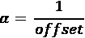

# 第九章：文本生成方法的崛起

在前几章中，我们讨论了不同的方法和技术来开发和训练生成模型。特别是在*第六章*“使用 GAN 生成图像”中，我们讨论了生成模型的分类以及介绍了显式和隐式类。在整本书中，我们的重点一直是在视觉空间中开发生成模型，利用图像和视频数据集。深度学习在计算机视觉领域的发展以及易于理解性是引入这样一个专注介绍的主要原因。

然而，在过去几年中，**自然语言处理**（**NLP**）或文本数据处理受到了极大的关注和研究。文本不只是另一种无结构类型的数据；其背后还有更多东西超出了表面所见。文本数据代表了我们的思想、想法、知识和交流。

在本章和下一章中，我们将专注于理解与 NLP 和文本数据的生成模型相关的概念。我们将在本章中涵盖与文本数据生成模型相关的不同概念、架构和组件，重点关注以下主题：

+   传统表示文本数据方式的简要概述

+   分布式表示方法

+   基于 RNN 的文本生成

+   LSTM 变体和文本卷积

我们将介绍不同架构的内部工作原理和使文本生成用例成为可能的关键贡献。我们还将构建和训练这些架构，以更好地理解它们。读者还应该注意，虽然我们将在*第九章*“文本生成方法的崛起”和*第十章*“NLP 2.0:使用 Transformer 生成文本”中深入研究关键贡献和相关细节，但这些模型中的一些非常庞大，无法在常规硬件上进行训练。我们将在必要时利用某些高级 Python 包，以避免复杂性。

本章中呈现的所有代码片段都可以直接在 Google Colab 中运行。由于篇幅原因，未包含依赖项的导入语句，但读者可以参考 GitHub 存储库获取完整的代码：[`github.com/PacktPublishing/Hands-On-Generative-AI-with-Python-and-TensorFlow-2`](https://github.com/PacktPublishing/Hands-On-Generative-AI-with-Python-and-TensorFlow-2)。

在我们深入建模方面之前，让我们先了解如何表示文本数据。

# 表示文本

语言是我们存在中最复杂的方面之一。我们使用语言来传达我们的思想和选择。每种语言都有一个叫做字母表的字符列表，一个词汇表和一组叫做语法的规则。然而，理解和学习一门语言并不是一项微不足道的任务。语言是复杂的，拥有模糊的语法规则和结构。

文本是语言的一种表达形式，帮助我们交流和分享。这使得它成为研究的完美领域，以扩展人工智能可以实现的范围。文本是一种无结构数据，不能直接被任何已知算法使用。机器学习和深度学习算法通常使用数字、矩阵、向量等进行工作。这又引出了一个问题：我们如何为不同的与语言相关的任务表示文本？

## 词袋

正如我们之前提到的，每种语言都包括一个定义的字符列表（字母表），这些字符组合在一起形成单词（词汇表）。传统上，**词袋**（**BoW**）一直是表示文本信息的最流行方法之一。

词袋是将文本转换为向量形式的一种简单灵活的方法。这种转换不仅有助于从原始文本中提取特征，还使其适用于不同的算法和架构。正如其名称所示，词袋表示模型将每个单词作为一种基本的度量单位。词袋模型描述了在给定文本语料库中单词的出现情况。为了构建一个用于表示的词袋模型，我们需要两个主要的东西：

+   **词汇表**：从要分析的文本语料库中已知单词的集合。

+   **出现的度量**：根据手头的应用/任务选择的东西。例如，计算每个单词的出现次数，称为词频，就是一种度量。

与词袋模型相关的详细讨论超出了本章的范围。我们正在呈现一个高级概述，作为在本章后面引入更复杂主题之前的入门。

词袋模型被称为“袋子”，以突显其简单性和我们忽略出现次数的任何排序的事实。换句话说，词袋模型舍弃了给定文本中单词的任何顺序或结构相关信息。这听起来可能是一个很大的问题，但直到最近，词袋模型仍然是表示文本数据的一种流行和有效的选择。让我们快速看几个例子，了解这种简单方法是如何工作的。

> "有人说世界将在火中终结，有人说在冰中。从我尝到的欲望中，我同意那些赞成火的人。"

```py
Fire and Ice by Robert Frost. We'll use these few lines of text to understand how the BoW model works. The following is a step-by-step approach:
```

1.  **定义词汇表**：

    首先且最重要的步骤是从我们的语料库中定义一个已知单词列表。为了便于理解和实际原因，我们现在可以忽略大小写和标点符号。因此，词汇或唯一单词为 {some, say, the, world, will, end, in, fire, ice, from, what, i, have, tasted, of, desire, hold, with, those, who, favour}。

    这个词汇表是一个包含 26 个词中的 21 个唯一单词的语料库。

1.  **定义出现的度量**：

    一旦我们有了词汇集，我们需要定义如何衡量词汇中每个单词的出现次数。正如我们之前提到的，有很多种方法可以做到这一点。这样的一个指标就是简单地检查特定单词是否存在。如果单词不存在，则使用 0，如果存在则使用 1。因此，句子“some say ice”可以得分为：

    +   some: 1

    +   say: 1

    +   the: 0

    +   world: 0

    +   will: 0

    +   end: 0

    +   in: 0

    +   fire: 0

    +   ice: 1

    因此，总向量看起来像[1, 1, 0, 0, 0, 0, 0, 0, 1]。

    多年来已经发展了一些其他指标。最常用的指标是：

    +   词频

    +   TF-IDF，如*第七章*，*使用 GAN 进行风格转移*

    +   哈希化

这些步骤提供了词袋模型如何帮助我们将文本数据表示为数字或向量的高层次概述。诗歌摘录的总体向量表示如下表所示：


图 9.1：词袋表示

矩阵中的每一行对应诗歌中的一行，而词汇表中的唯一单词构成了列。因此，每一行就是所考虑文本的向量表示。

改进此方法的结果涉及一些额外的步骤。这些优化与词汇和评分方面有关。管理词汇非常重要；通常，文本语料库的规模会迅速增大。处理词汇的一些常见方法包括：

+   忽略标点符号

+   忽略大小写

+   移除常见单词（或停用词）如 a, an, the, this 等

+   使用单词的词根形式的方法，如*stop*代替*stopping*。词干提取和词形还原是两种这样的方法

+   处理拼写错误

我们已经讨论了不同的评分方法以及它们如何帮助捕捉某些重要特征。词袋模型简单而有效，是大多数自然语言处理任务的良好起点。然而，它存在一些问题，可以总结如下：

+   **缺失的上下文**：

    正如我们之前提到的，词袋模型不考虑文本的排序或结构。通过简单地丢弃与排序相关的信息，向量失去了捕捉基础文本使用上下文的机会。例如，“我肯定”和“我怀疑我肯定”这两句话将具有相同的向量表示，然而它们表达了不同的思想。扩展词袋模型以包括 n-gram（连续词组）而不是单个词确实有助于捕捉一些上下文，但在非常有限的范围内。

+   **词汇和稀疏向量**：

    随着语料库的规模增加，词汇量也在增加。管理词汇量大小所需的步骤需要大量的监督和手动工作。由于这种模型的工作方式，大量的词汇导致非常稀疏的向量。稀疏向量对建模和计算需求（空间和时间）造成问题。激进的修剪和词汇管理步骤在一定程度上确实有所帮助，但也可能导致重要特征的丢失。

在这里，我们讨论了词袋模型如何帮助将文本转换为向量形式，以及这种设置中的一些问题。在下一节，我们将转向一些更多涉及的表示方法，这些方法缓解了一些这些问题。

## 分布式表示

词袋模型是将单词转换为向量形式的易于理解的方法。这个过程通常被称为*向量化*。虽然这是一种有用的方法，但在捕获上下文和与稀疏相关的问题方面，词袋模型也有它的局限性。由于深度学习架构正在成为大多数空间的事实上的最先进系统，显而易见的是我们应该在 NLP 任务中也利用它们。除了前面提到的问题，词袋模型的稀疏和大（宽）向量是另一个可以使用神经网络解决的方面。

一种处理稀疏问题的简单替代方案是将每个单词编码为唯一的数字。继续上一节的示例，“有人说冰”，我们可以将“有人”赋值为 1，“说”赋值为 2，“冰”赋值为 3，以此类推。这将导致一个密集的向量，[1, 2, 3]。这是对空间的有效利用，并且我们得到了所有元素都是完整的向量。然而，缺失上下文的限制仍然存在。由于数字是任意的，它们几乎不能单独捕获任何上下文。相反，将数字任意映射到单词并不是非常可解释的。

**可解释性**是 NLP 任务的重要要求。对于计算机视觉用例，视觉线索足以成为理解模型如何感知或生成输出的良好指标（尽管在那方面的量化也是一个问题，但我们现在可以跳过它）。对于 NLP 任务，由于文本数据首先需要转换为向量，因此重要的是理解这些向量捕获了什么，以及模型如何使用它们。

在接下来的章节中，我们将介绍一些流行的向量化技术，尝试捕捉上下文，同时限制向量的稀疏性。请注意，还有许多其他方法（例如基于 SVD 的方法和共现矩阵）也有助于向量化文本数据。在本节中，我们将只涉及那些有助于理解本章后续内容的方法。

### Word2vec

英国牛津词典大约有 60 万个独特的单词，并且每年都在增长。然而，这些单词并非独立的术语；它们彼此之间存在一些关系。word2vec 模型的假设是学习高质量的向量表示，以捕获上下文。这更好地总结了 J.R. 菲斯的著名引文：“*你可以通过它搭配的伙伴来认识一个词*”。

在他们名为“Vector Space 中单词表示的高效估计”的工作中，Mikolov 等人¹介绍了两种学习大型语料库中单词向量表示的模型。Word2Vec 是这些模型的软件实现，属于学习这些嵌入的迭代方法。与一次性考虑整个语料库不同，这种方法尝试迭代地学习编码每个单词的表示及其上下文。学习词表示作为密集上下文向量的这一概念并不新鲜。这最初是由 Rumelhart 等人于 1990²年提出的。他们展示了神经网络如何学习表示，使类似的单词最终处于相同的聚类中。拥有捕获某种相似性概念的单词向量形式的能力是非常强大的。让我们详细看看 word2vec 模型是如何实现这一点的。

#### 连续词袋 (CBOW) 模型

连续词袋模型是我们在上一节讨论的词袋模型的扩展。该模型的关键方面是上下文窗口。上下文窗口被定义为沿着句子移动的固定大小的滑动窗口。中间的词称为*目标*，窗口内的左右术语称为*上下文术语*。CBOW 模型通过给定其上下文术语来预测目标术语。

例如，让我们考虑一句参考句子，“some say the *world* will end in fire”。如果我们的窗口大小为 4，目标术语为*world*，那么上下文术语将会是{say, the}和{will, end}。模型的输入是形式为（上下文术语，目标术语）的元组，然后将其通过神经网络学习嵌入向量。

这个过程如下图所示：


图 9.2：连续词袋模型设置

如前面的图表所示，上下文术语，表示为，被作为输入传递给模型，以预测目标术语，表示为*w*[t]。CBOW 模型的整体工作可以解释如下：

1.  对于大小为*V*的词汇表，定义了大小为*C*的上下文窗口。*C*可以是 4、6 或任何其他大小。我们还定义了两个矩阵*W*和*W'*来生成输入和输出向量。矩阵*W*是*VxN*，而*W'*是*NxV*的维度。*N*是嵌入向量的大小。

1.  上下文术语（）和目标术语（*y*）被转化为独热编码（或标签编码），并且训练数据以元组的形式准备：（，*y*）。

1.  我们对上下文向量进行平均以得到 。

1.  最终的输出评分向量 *z* 是平均向量 *v'* 和输出矩阵 *W'* 的点积。

1.  输出评分向量经过 softmax 函数转换为概率值；也就是说，*y' = softmax(z)*，其中 *y'* 应该对应词汇表中的一个术语。

1.  最终的目标是训练神经网络，使得 *y'* 和实际目标 *y* 尽可能接近。

作者建议使用诸如交叉熵之类的成本函数来训练网络并学习这样的嵌入。

#### skip-gram 模型

skip-gram 模型是该论文中用于学习词嵌入的第二个变体。本质上，该模型的工作方式与 CBOW 模型完全相反。换句话说，在 skip-gram 的情况下，我们输入一个词（中心/目标词），预测上下文术语作为模型的输出。让我们用之前的例子进行说明，“some say the *world* will end in fire”。在这里，我们将用 *world* 作为输入术语，并训练一个模型以高概率预测 {say, the, will, end}，作为上下文术语。

下图显示了 skip-gram 模型；如预期的那样，这是我们在 *图 9.2* 中讨论的 CBOW 设置的镜像：


图 9.3：skip-gram 模型设置

skip-gram 模型的逐步工作可以解释如下：

1.  对于一个大小为 *V* 的词汇表，定义一个大小为 *C* 的上下文窗口。*C* 可以是 4、6 或其他任意大小。我们还定义了两个矩阵 *W* 和 *W'*，分别用于生成输入向量和输出向量。矩阵 *W* 是 *VxN* 的，而 *W'* 的维度是 *NxV*。*N* 是嵌入向量的大小。

1.  生成中心词 *x* 的独热编码表示。

1.  通过 *x* 和 *W* 的点积来获取 *x* 的词嵌入表示。嵌入表示为 *v = W.x*。

1.  我们通过将 *W'* 和 *v* 的点积得到输出评分向量 *z*；也就是说，*z = W'.v*。

1.  评分向量通过 softmax 层转换为输出概率，生成 *y'*。

1.  最终的目标是训练神经网络，使得 *y'* 和实际上的上下文 *y* 尽可能接近。

在 skip-gram 的情况下，对于任何给定的中心词，我们有多个输入-输出训练对。该模型将所有上下文术语都视为同等重要，无论它们与上下文窗口中的中心词之间的距离如何。这使我们能够使用交叉熵作为成本函数，并假设具有强条件独立性。

为了改善结果并加快训练过程，作者们引入了一些简单但有效的技巧。*负采样、噪声对比估计*和*分层 softmax*等概念是一些被利用的技术。要详细了解 CBOW 和 skip-gram，请读者阅读 Mikolov 等人引用的文献¹，作者在其中详细解释了每个步骤。

```py
nltk to clean up this dataset and prepare it for the next steps. The text cleanup process is limited to lowercasing, removing special characters, and stop word removal only:
```

```py
# import statements and code for the function normalize_corpus 
# have been skipped for brevity. See corresponding 
# notebook for details.
cats = ['alt.atheism', 'sci.space']
newsgroups_train = fetch_20newsgroups(subset='train', 
                                      categories=cats,
                                      remove=('headers', 'footers', 
                                              'quotes'))
norm_corpus = normalize_corpus(newsgroups_train.data) 
gensim to train a skip-gram word2vec model:
```

```py
# tokenize corpus
tokenized_corpus = [nltk.word_tokenize(doc) for doc in norm_corpus]
# Set values for various parameters
embedding_size = 32  # Word vector dimensionality
context_window = 20  # Context window size
min_word_count = 1   # Minimum word count
sample = 1e-3        # Downsample setting for frequent words
sg = 1               # skip-gram model
w2v_model = word2vec.Word2Vec(tokenized_corpus, size=embedding_size, 
                              window=context_window, 
                              min_count =min_word_count,
                              sg=sg, sample=sample, iter=200) 
```

只需几行代码，我们就可以获得我们词汇表的 word2vec 表示。检查后，我们发现我们的词汇表中有 19,000 个独特单词，并且我们为每个单词都有一个向量表示。以下代码片段显示了如何获得任何单词的向量表示。我们还将演示如何获取与给定单词最相似的单词：

```py
# get word vector
w2v_model.wv['sun'] 
```

```py
array([ 0.607681, 0.2790227, 0.48256198, 0.41311446, 0.9275479,
       -1.1269532, 0.8191313, 0.03389674, -0.23167856, 0.3170586,
        0.0094937, 0.1252524, -0.5247988, -0.2794391, -0.62564677,
       -0.28145587, -0.70590997, -0.636148, -0.6147065, -0.34033248,
        0.11295943, 0.44503215, -0.37155458, -0.04982868, 0.34405553,
        0.49197063, 0.25858226, 0.354654, 0.00691116, 0.1671375,
        0.51912665,  1.0082873 ], dtype=float32) 
```

```py
# get similar words
w2v_model.wv.most_similar(positive=['god']) 
```

```py
[('believe', 0.8401427268981934),
 ('existence', 0.8364629149436951),
 ('exists', 0.8211747407913208),
 ('selfcontradictory', 0.8076522946357727),
 ('gods', 0.7966105937957764),
 ('weak', 0.7965559959411621),
 ('belief', 0.7767481803894043),
 ('disbelieving', 0.7757835388183594),
 ('exist', 0.77425217628479),
 ('interestingly', 0.7742466926574707)] 
```

前述输出展示了*sun*这个单词的 32 维向量。我们还展示了与单词*god*最相似的单词。我们可以清楚地看到，诸如 believe、existence 等单词似乎是最相似的，这是合乎逻辑的，考虑到我们使用的数据集。对于感兴趣的读者，我们在对应的笔记本中展示了使用 TensorBoard 的 3 维向量空间表示。TensorBoard 表示帮助我们直观地理解嵌入空间，以及这些向量是如何相互作用的。

### GloVe

word2vec 模型有助于改进各种自然语言处理任务的性能。在相同的动力下，另一个重要的实现叫做 GloVe 也出现了。GloVe 或*全局词向量表示*于 2014 年由 Pennington 等人发表，旨在改进已知的单词表示技术。³

正如我们所见，word2vec 模型通过考虑词汇表中单词的局部上下文（定义的窗口）来工作。即使这是非常有效的，但还不够完善。单词在不同上下文中可能意味着不同的东西，这要求我们不仅要理解局部上下文，还要理解全局上下文。GloVe 试图在学习单词向量的同时考虑全局上下文。

有一些经典的技术，例如**潜在语义分析**（**LSA**），这些技术基于矩阵分解，在捕获全局上下文方面做得很好，但在向量数学等方面做得不太好。

GloVe 是一种旨在学习更好的词表示的方法。GloVe 算法包括以下步骤：

1.  准备一个词共现矩阵*X*，使得每个元素*x*[i][j]表示单词*i*在单词*j*上下文中出现的频率。GloVe 使用了两个固定尺寸的窗口，这有助于捕捉单词之前和之后的上下文。

1.  共现矩阵*X*使用衰减因子进行更新，以惩罚上下文中距离较远的术语。衰减因子定义如下：，其中 offset 是考虑的单词的距离。

1.  然后，我们将准备 GloVe 方程如下软约束条件：

    这里，*w*[i]是主要单词的向量，*w*[j]是上下文单词的向量，*b*[i]，*b*[j]是相应的偏差项。

1.  最后一步是使用前述约束条件来定义成本函数，其定义如下：

    这里，*f*是一个加权函数，定义如下：

    

    该论文的作者使用获得了最佳结果。

类似于 word2vec 模型，GloVe 嵌入也取得了良好的结果，作者展示了 GloVe 胜过 word2vec 的结果。他们将此归因于更好的问题表述和全局上下文的捕捉。

在实践中，这两种模型的性能差不多。由于需要更大的词汇表来获得更好的嵌入（对于 word2vec 和 GloVe），对于大多数实际应用情况，预训练的嵌入是可用且被使用的。

预训练的 GloVe 向量可以通过多个软件包获得，例如`spacy`。感兴趣的读者可以探索`spacy`软件包以获得更多详情。

### FastText

Word2Vec 和 GloVe 是强大的方法，在将单词编码为向量空间时具有很好的特性。当涉及到获取在词汇表中的单词的向量表示时，这两种技术都能很好地工作，但对于词汇表之外的术语，它们没有明确的答案。

在 word2vec 和 GloVe 方法中，单词是基本单位。这一假设在 FastText 实现中受到挑战和改进。FastText 的单词表示方面基于 2017 年 Bojanowski 等人的论文*使用子词信息丰富化词向量*。⁴ 该工作将每个单词分解为一组 n-grams。这有助于捕捉和学习字符组合的不同向量表示，与早期技术中的整个单词不同。

例如，如果我们考虑单词“India”和*n=3*用于 n-gram 设置，则它将将单词分解为{<india>, <in, ind, ndi, dia, ia>}。符号“<”和“>”是特殊字符，用于表示原始单词的开始和结束。这有助于区分<in>，它代表整个单词，和<in，它代表一个 n-gram。这种方法有助于 FastText 生成*超出词汇表*的术语的嵌入。这可以通过添加和平均所需 n-gram 的向量表示来实现。

FastText 在处理可能有大量新/词汇表之外术语的用例时，被显示明显提高性能。FastText 是由**Facebook AI Research**（**FAIR**）的研究人员开发的，这应该不足为奇，因为在 Facebook 等社交媒体平台上生成的内容是巨大且不断变化的。

随着它的改进，也有一些缺点。由于这种情况下的基本单位是一个 n-gram，因此训练/学习这种表示所需的时间比以前的技术更长。 n-gram 方法还增加了训练这种模型所需的内存量。然而，论文的作者指出，散列技巧在一定程度上有助于控制内存需求。

为了便于理解，让我们再次利用我们熟悉的 Python 库`gensim`。我们将扩展上一节中 word2vec 模型练习所使用的相同数据集和预处理步骤。以下片段准备了 FastText 模型对象：

```py
# Set values for various parameters
embedding_size = 32    # Word vector dimensionality
context_window = 20    # Context window size
min_word_count = 1   # Minimum word count
sample = 1e-3        # Downsample setting for frequent words
sg = 1               # skip-gram model
ft_model = FastText(tokenized_corpus, size=embedding_size, 
                     window=context_window, min_count = min_word_count, sg=sg, sample=sample, iter=100) 
```

word2vec 模型无法返回单词"sunny"的矢量表示，因为它不在训练词汇表中。以下片段显示了 FastText 仍能生成矢量表示的方法：

```py
# out of vocabulary
ft_model.wv['sunny'] 
```

```py
array([-0.16000476, 0.3925578, -0.6220364, -0.14427347, -1.308504,
        0.611941, 1.2834805, 0.5174112, -1.7918613, -0.8964722,
       -0.23748468, -0.81343293, 1.2371198 , 1.0380564, -0.44239333,
        0.20864521, -0.9888209, 0.89212966, -1.1963437, 0.738966,
       -0.60981965, -1.1683533, -0.7930039, 1.0648874, 0.5561004,
       -0.28057176, -0.37946936, 0.02066167, 1.3181996, 0.8494686,
       -0.5021836, -1.0629338], dtype=float32) 
```

这展示了 FastText 如何改进基于 word2vec 和 GloVe 的表示技术。我们可以轻松处理词汇表之外的术语，同时确保基于上下文的密集表示。

现在让我们利用这个理解来开发文本生成模型。

# 文本生成和 LSTM 的魔法

在前几节中，我们讨论了不同的表示文本数据的方法，以使其适合不同的自然语言处理算法使用。在本节中，我们将利用这种对文本表示的理解来构建文本生成模型。

到目前为止，我们已经使用由不同种类和组合的层组成的前馈网络构建了模型。这些网络一次处理一个训练示例，这与其他训练样本是独立的。我们说这些样本是**独立同分布**的，或**IID**。语言，或文本，有点不同。

正如我们在前几节中讨论的，单词根据它们被使用的上下文而改变它们的含义。换句话说，如果我们要开发和训练一种语言生成模型，我们必须确保模型理解其输入的上下文。

**递归神经网络**（**RNNs**）是一类允许先前输出用作输入的神经网络，同时具有记忆或隐藏单元。对先前输入的意识有助于捕捉上下文，并使我们能够处理可变长度的输入序列（句子很少长度相同）。下图显示了典型的 RNN，既实际形式又展开形式：


图 9.4：一个典型的 RNN

如*图 9.4*所示，在时间 *t*[1]，输入 *x*[1] 生成输出 *y*[1]。在时间 *t*[2]，*x*[2] 和 *y*[1]（前一个输出）一起生成输出 *y*[2]，以此类推。与 typcial feedforward 网络不同，其中的每个输入都独立于其他输入，RNN 引入了前面的输出对当前和将来的输出的影响。

RNN 还有一些不同的变体，即**门控循环单元**（**GRUs**）和**长短期记忆**（**LSTMs**）。之前描述的原始 RNN 在自回归环境中工作良好。但是，它在处理更长上下文窗口（梯度消失）时存在问题。GRUs 和 LSTMs 通过使用不同的门和记忆单元来尝试克服此类问题。LSTMs 由 Hochreiter 和 Schmidhuber 于 1997 年引入，可以记住非常长的序列数据中的信息。LSTMs 由称为输入、输出和遗忘门的三个门组成。以下图表显示了这一点。

图 9.5：LSTM 单元的不同门

有关 LSTMs 的详细了解，请参阅[`colah.github.io/posts/2015-08-Understanding-LSTMs/`](http://colah.github.io/posts/2015-08-Understanding-LSTMs/)。

现在，我们将重点介绍更正式地定义文本生成任务。

## 语言建模

基于 NLP 的解决方案非常有效，我们可以在我们周围看到它们的应用。最突出的例子是手机键盘上的自动完成功能，搜索引擎（Google，Bing 等）甚至文字处理软件（如 MS Word）。

自动完成是一个正式概念称为*语言建模*的常见名称。简单来说，语言模型以某些文本作为输入上下文，以生成下一组单词作为输出。这很有趣，因为语言模型试图理解输入的上下文，语言结构和规则，以预测下一个单词。我们经常在搜索引擎，聊天平台，电子邮件等上使用它作为文本完成工具。语言模型是 NLP 的一个完美实际应用，并展示了 RNN 的威力。在本节中，我们将致力于建立对 RNN 基于语言模型的文本生成的理解以及训练。

让我们从理解生成训练数据集的过程开始。我们可以使用下面的图像来做到这一点。该图像描绘了一个基于单词的语言模型，即以单词为基本单位的模型。在同样的思路下，我们可以开发基于字符，基于短语甚至基于文档的模型：


图 9.6：用于语言模型的训练数据生成过程

正如我们之前提到的，语言模型通过上下文来生成接下来的单词。这个上下文也被称为一个滑动窗口，它在输入的句子中从左到右（从右到左对于从右往左书写的语言）移动。 *图 9.6*中的滑动窗口跨越三个单词，作为输入。每个训练数据点的对应输出是窗口后面紧跟的下一个单词（或一组单词，如果目标是预测下一个短语）。因此，我们准备我们的训练数据集，其中包括({上下文词汇}, 下一个单词)这种形式的元组。滑动窗口帮助我们从训练数据集中的每个句子中生成大量的训练样本，而无需显式标记。

然后使用这个训练数据集来训练基于 RNN 的语言模型。在实践中，我们通常使用 LSTM 或 GRU 单元来代替普通的 RNN 单元。我们之前讨论过 RNN 具有自动回归到先前时间步的数值的能力。在语言模型的上下文中，我们自动回归到上下文词汇，模型产生相应的下一个单词。然后我们利用**时间反向传播**（**BPTT**）通过梯度下降来更新模型权重，直到达到所需的性能。我们在 *第三章*，*深度神经网络的构建模块*中详细讨论了 BPTT。

现在我们对语言模型以及准备训练数据集和模型设置所涉及的步骤有了一定的了解。现在让我们利用 TensorFlow 和 Keras 来实现其中一些概念。

## 实践操作：字符级语言模型

我们在之前的部分中讨论了语言建模的基础知识。在这一部分中，我们将构建并训练自己的语言模型，但是有一点不同。与之前部分的讨论相反，在这里，我们将在字符级别而不是词级别工作。简单来说，我们将着手构建一个模型，将少量字符作为输入（上下文）来生成接下来的一组字符。选择更细粒度的语言模型是为了便于训练这样的模型。字符级语言模型需要考虑的词汇量（或独特字符的数量）要比词级语言模型少得多。

为了构建我们的语言模型，第一步是获取一个数据集用作训练的来源。古腾堡计划是一项志愿者工作，旨在数字化历史著作并提供免费下载。由于我们需要大量数据来训练语言模型，我们将选择其中最大的一本书，列夫·托尔斯泰的 *战争与和平*。该书可在以下网址下载：

[`www.gutenberg.org/ebooks/2600`](https://www.gutenberg.org/ebooks/2600)

以下代码片段载入了作为我们源数据集的书籍内容：

```py
datafile_path = r'warpeace_2600-0.txt'
# Load the text file
text = open(datafile_path, 'rb').read().decode(encoding='utf-8')
print ('Book contains a total of {} characters'.format(len(text))) 
```

```py
Book contains a total of 3293673 characters 
```

```py
vocab = sorted(set(text))
print ('{} unique characters'.format(len(vocab))) 
```

```py
108 unique characters 
```

下一步是准备我们的数据集用于模型。正如我们在*表示文本*部分讨论的那样，文本数据被转换为向量，使用词表示模型。一种方法是首先将它们转换为独热编码向量，然后使用诸如 word2vec 之类的模型将其转换为密集表示。另一种方法是首先将它们转换为任意数值表示，然后在 RNN-based 语言模型的其余部分中训练嵌入层。在这种情况下，我们使用了后一种方法，即在模型的其余部分一起训练一个嵌入层。

下面的代码片段准备了单个字符到整数映射的映射：

```py
char2idx = {u:i for i, u in enumerate(vocab)}
idx2char = np.array(vocab)
text_as_int = np.array([char2idx[c] for c in text])
print('{')
for char,_ in zip(char2idx, range(20)):
    print('  {:4s}: {:3d},'.format(repr(char), char2idx[char]))
print('  ...\n}') 
```

```py
{
  '\n':   0,
  '\r':   1,
  ' ' :   2,
  '!' :   3,
... 
```

如你所见，每个唯一的字符都映射到一个整数；例如，`\n`映射为 0，`!`映射为 3，依此类推。

为了最佳的内存利用，我们可以利用`tf.data` API 将我们的数据切片为可管理的片段。我们将我们的输入序列限制在 100 个字符长度，并且这个 API 帮助我们创建这个数据集的连续片段。这在下面的代码片段中展示：

```py
seq_length = 100
examples_per_epoch = len(text)//(seq_length+1)
# Create training examples / targets
char_dataset = tf.data.Dataset.from_tensor_slices(text_as_int)
for i in char_dataset.take(10):
    print(idx2char[i.numpy()]) 
```

```py
B
O
O
K

O
N
E
... 
split_input_target to prepare the target output as a one-position-shifted transformation of the input itself. In this way, we will be able to generate consecutive (input, output) training pairs using just a single shift in position:
```

```py
def split_input_target(chunk):
    """
    Utility which takes a chunk of input text and target 
    as one position shifted form of input chunk.
    Parameters:
        chunk: input list of words
    Returns:
        Tuple-> input_text(i.e. chunk minus 
        last word),target_text(input chunk minus the first word)
    """
    input_text = chunk[:-1]
    target_text = chunk[1:]
    return input_text, target_text
dataset = sequences.map(split_input_target)
for input_example, target_example in  dataset.take(1):
    print ('Input data: ', repr(''.join(idx2char[input_example.numpy()])))
    print ('Target data:', repr(''.join(idx2char[target_example.numpy()]))) 
```

```py
Input data:  '\r\nBOOK ONE: 1805\r\n\r\n\r\n\r\n\r\n\r\nCHAPTER I\r\n\r\n"Well, Prince, so Genoa and Lucca are now just family estat'
Target data: '\nBOOK ONE: 1805\r\n\r\n\r\n\r\n\r\n\r\nCHAPTER I\r\n\r\n"Well, Prince, so Genoa and Lucca are now just family estate' 
build_model that prepares a single layer LSTM-based language model:
```

```py
def build_model(vocab_size, embedding_dim, rnn_units, batch_size):
    """
    Utility to create a model object.
    Parameters:
        vocab_size: number of unique characters
        embedding_dim: size of embedding vector. 
        This typically in powers of 2, i.e. 64, 128, 256 and so on
        rnn_units: number of GRU units to be used
        batch_size: batch size for training the model
    Returns:
        tf.keras model object
    """
    model = tf.keras.Sequential([
    tf.keras.layers.Embedding(vocab_size, embedding_dim,
                              batch_input_shape=[batch_size, None]),
    tf.keras.layers.LSTM(rnn_units,
                        return_sequences=True,
                        stateful=True,
                        recurrent_initializer='glorot_uniform'),
    tf.keras.layers.Dense(vocab_size)
  ])
    return model
# Length of the vocabulary in chars
vocab_size = len(vocab)
# The embedding dimension
embedding_dim = 256
# Number of RNN units
rnn_units = 1024
model = build_model(
  vocab_size = len(vocab),
  embedding_dim=embedding_dim,
  rnn_units=rnn_units,
  batch_size=BATCH_SIZE) 
```

我们已经创建了模型对象。从代码片段中可以看出，模型是一堆嵌入层、LSTM 层和稠密层。嵌入层有助于将原始文本转换为向量形式，然后是 LSTM 和稠密层，它们学习上下文和语言语义。

下一组步骤涉及定义损失函数和编译模型。我们将使用稀疏分类交叉熵作为我们的损失函数。下面的代码片段定义了损失函数和编译模型；我们使用 Adam 优化器进行最小化：

```py
def loss(labels, logits):
    return tf.keras.losses.sparse_categorical_crossentropy(labels, logits, from_logits=True)
model.compile(optimizer='adam', loss=loss) 
```

由于我们使用 TensorFlow 和高级 Keras API，训练模型就像调用`fit`函数一样简单。我们只训练了 10 个时代，使用`ModelCheckpoint`回调来保存模型的权重，如下面的代码片段所示：

```py
# Directory where the checkpoints will be saved
checkpoint_dir = r'data/training_checkpoints'
# Name of the checkpoint files
checkpoint_prefix = os.path.join(checkpoint_dir, "ckpt_{epoch}")
checkpoint_callback=tf.keras.callbacks.ModelCheckpoint(
    filepath=checkpoint_prefix,
    save_weights_only=True)
EPOCHS = 10
history = model.fit(dataset, epochs=EPOCHS, callbacks=[checkpoint_callback]) 
```

```py
Epoch 1/10
254/254 [==============================] - 38s 149ms/step - loss: 2.4388
Epoch 2/10
254/254 [==============================] - 36s 142ms/step - loss: 1.7407
.
.
.
Epoch 10/10
254/254 [==============================] - 37s 145ms/step - loss: 1.1530 
```

恭喜，你已经训练了你的第一个语言模型。现在，我们将使用它来生成一些假文本。在我们做到这一点之前，我们需要了解如何解码我们模型生成的输出。

## 解码策略

早些时候，我们将所有文本数据转换为适合训练和推理的向量形式。现在我们有了一个训练好的模型，下一步是输入一些上下文词，以及生成下一个词作为输出。这个输出生成步骤正式被称为**解码步骤**。它被称为"解码"，因为模型输出一个向量，必须经过处理才能得到实际的词作为输出。有一些不同的解码技术；让我们简要讨论一下流行的：贪婪解码、束搜索和抽样。

### 贪婪解码

这是最简单和最快的解码策略。正如其名，贪婪解码是一种在每次预测步骤中选择最高概率项的方法。

尽管这样快速高效，但贪婪会在生成文本时产生一些问题。通过仅关注最高概率的输出，模型可能会生成不一致或不连贯的输出。在字符语言模型的情况下，这甚至可能导致非词典词的输出。贪婪解码还限制了输出的差异性，这也可能导致重复的内容。

### 波束搜索

波束搜索是广泛使用的贪婪解码的替代方法。该解码策略不是选择最高概率的术语，而是在每个时间步长跟踪*n*个可能的输出。下图说明了波束搜索解码策略。它展示了从步骤 0 开始形成的多个波束，创建了一个树状结构：


图 9.7：基于波束搜索的解码策略

如*图 9.7*所示，波束搜索策略通过在每个时间步长跟踪*n*个预测，并最终选择具有**总体**最高概率的路径来工作，在图中用粗线突出显示。让我们逐步分析在上述图中使用的波束搜索解码示例，假设波束大小为 2。

在时间步骤*t*[0]：

1.  模型预测以下三个单词（带概率）为(**the**, 0.3)，(**when**, 0.6)和(**and**, 0.1)。

1.  在贪婪解码的情况下，我们将选择"when"，因为它的概率最高。

1.  在这种情况下，由于我们的波束大小为 2，我们将跟踪前两个输出。

在时间步骤*t*[2]：

1.  我们重复相同的步骤；即，我们跟踪两个波束中的前两个输出。

1.  通过沿着分支计算分支的概率，计算波束分数如下：

    +   *(when, 0.6) –> (the, 0.4) = 0.6*0.4 = 0.24*

    +   *(the, 0.3) –> (war, 0.9) = 0.3*0.9 = 0.27*

根据上述讨论，生成的最终输出是"It was July, 1805 *the war*"。与"它是 1805 年 7 月，*当时的*战争"这样的输出相比，它的最终概率为 0.27，而"它是 1805 年 7 月，*当时*的"这样的输出的分数为 0.24，这是贪婪解码给我们的结果。

这种解码策略大大改进了我们在前一节讨论的天真贪婪解码策略。这在某种程度上为语言模型提供了额外的能力，以选择最佳的可能结果。

### 抽样

抽样是一个过程，在此过程中从更大的总体中选择了预定义数量的观察结果。作为对贪婪解码的改进，可以采用随机抽样解码方法来解决变化/重复问题。一般来说，基于抽样的解码策略有助于根据迄今为止的上下文选择下一个词，即：


在这里，*w*[t]是在时间步*t*上的输出，已经根据在时间步*t-1*之前生成的单词进行了条件化。延续我们之前解码策略的示例，以下图像突出显示了基于采样的解码策略将如何选择下一个单词：


图 9.8：基于采样的解码策略

正如*图 9.8*所示，该方法在每个时间步从给定的条件概率中随机选择一个单词。在我们的示例中，模型最终通过随机选择**in**，然后选择**Paris**作为随后的输出。如果你仔细观察，在时间步*t*[1]，模型最终选择了概率最低的单词。这带来了与人类使用语言方式相关的非常必要的随机性。 Holtzman 等人在其题为*神经文本退化的奇特案例*的作品⁵中通过陈述人类并不总是简单地使用概率最高的单词来提出了这个确切的论点。他们提出了不同的场景和示例，以突显语言是单词的随机选择，而不是由波束搜索或贪婪解码形成的典型高概率曲线。

这将引入一个重要的参数称为*温度*。

#### 温度

正如我们之前讨论的，基于采样的解码策略有助于改善输出的随机性。然而，过多的随机性也不理想，因为它可能导致无意义和不连贯的结果。为了控制这种随机性的程度，我们可以引入一个可调参数称为温度。该参数有助于增加高概率项的概率，同时减少低概率项的概率，从而产生更尖锐的分布。高温度导致更多的随机性，而较低的温度则带来可预测性。值得注意的是，这可以应用于任何解码策略。

#### Top-k 采样

波束搜索和基于采样的解码策略都有各自的优缺点。Top-*k* 采样是一种混合策略，它兼具两者的优点，提供了更复杂的解码方法。简单来说，在每个时间步，我们不是选择一个随机单词，而是跟踪*前 k 个条目*（类似于波束搜索），并在它们之间重新分配概率。这给了模型生成连贯样本的额外机会。

### 实践操作：解码策略

现在，我们对一些最广泛使用的解码策略有了足够的理解，是时候看看它们的实际效果了。

第一步是准备一个实用函数`generate_text`，根据给定的解码策略生成下一个单词，如下面的代码片段所示：

```py
def generate_text(model, mode='greedy', context_string='Hello',
   num_generate=1000, 
                   temperature=1.0):
    """
    Utility to generate text given a trained model and context
    Parameters:
        model: tf.keras object trained on a sufficiently sized corpus
        mode: decoding mode. Default is greedy. Other mode is
              sampling (set temperature)
        context_string: input string which acts as context for the                         model
        num_generate: number of characters to be generated
        temperature: parameter to control randomness of outputs
    Returns:
        string : context_string+text_generated
    """
    # vectorizing: convert context string into string indices
    input_eval = [char2idx[s] for s in context_string]
    input_eval = tf.expand_dims(input_eval, 0)
    # String for generated characters
    text_generated = []
    model.reset_states()
    # Loop till required number of characters are generated
    for i in range(num_generate):
        predictions = model(input_eval)
        predictions = tf.squeeze(predictions, 0)
        if mode == 'greedy':
          predicted_id = np.argmax(predictions[0])

        elif mode == 'sampling':
          # temperature helps control the character 
          # returned by the model.
          predictions = predictions / temperature
          # Sampling over a categorical distribution
          predicted_id = tf.random.categorical(predictions, 
                                           num_samples=1)[-1,0].numpy()
        # predicted character acts as input for next step
        input_eval = tf.expand_dims([predicted_id], 0)
        text_generated.append(idx2char[predicted_id])
    return (context_string + ''.join(text_generated)) 
```

代码首先将原始输入文本转换为整数索引。然后我们使用模型进行预测，根据所选择的模式进行操作，贪婪或采样。我们已经从前面的练习中训练了一个字符语言模型，以及一个辅助工具，帮助我们根据所选择的解码策略生成下一个词。我们在以下片段中使用了这两者来理解使用不同策略生成的不同输出：

```py
# greedy decoding
print(generate_text(model, context_string=u"It was in July, 1805
",num_generate=50,mode="greedy"))
# sampled decoding with different temperature settings
print(generate_text(model, context_string=u"It was in July, 1805
",num_generate=50, mode="sampling", temperature=0.3))
print(generate_text(model, context_string=u"It was in July, 1805
",num_generate=50, mode="sampling",temperature=0.9)) 
```

使用相同种子与不同解码策略的结果在以下屏幕截图中展示：


图 9.9：基于不同解码策略的文本生成。粗体文本是种子文本，后面是模型生成的输出文本。

这个输出突显了我们迄今讨论的所有解码策略的一些问题以及显著特征。我们可以看到温度的增加如何使模型更具表现力。我们还可以观察到模型已经学会了配对引号甚至使用标点符号。模型似乎还学会了如何使用大写字母。温度参数的增加表现力是以牺牲模型稳定性为代价的。因此，通常在表现力和稳定性之间存在权衡。

这就是我们生成文本的第一种方法的总结；我们利用了 RNNs（特别是 LSTMs）来使用不同的解码策略生成文本。接下来，我们将看一些 LSTM 模型的变体，以及卷积。

# LSTM 变体和文本的卷积

当处理序列数据集时，RNNs 非常有用。我们在前一节中看到，一个简单的模型有效地学会了根据训练数据集学到的内容生成文本。

多年来，我们在对 RNNs 建模和使用的方式方面取得了许多改进。在本节中，我们将讨论前一节中讨论的单层 LSTM 网络的两种广泛使用的变体：堆叠和双向 LSTMs。

## 堆叠的 LSTMs

我们非常清楚神经网络的深度在处理计算机视觉任务时如何帮助其学习复杂和抽象的概念。同样，一个堆叠的 LSTM 架构，它有多个 LSTMs 层依次堆叠在一起，已经被证明能够带来相当大的改进。堆叠的 LSTMs 首次由格雷夫斯等人在他们的工作中提出*使用深度递归神经网络进行语音识别*⁶。他们强调了深度-多层 RNNs-与每层单位数目相比，对性能的影响更大。

尽管没有理论证明可以解释这种性能提升，经验结果帮助我们理解影响。这些增强可以归因于模型学习复杂特征甚至输入的抽象表示的能力。由于 LSTM 和 RNNs 一般具有时间成分，更深的网络学习在不同时间尺度上运行的能力。⁷

```py
build_model function to do just that:
```

```py
def build_model(vocab_size, embedding_dim, rnn_units, batch_size,is_bidirectional=False):
    """
    Utility to create a model object.
    Parameters:
        vocab_size: number of unique characters
        embedding_dim: size of embedding vector. This typically in                        powers of 2, i.e. 64, 128, 256 and so on
        rnn_units: number of LSTM units to be used
        batch_size: batch size for training the model
    Returns:
        tf.keras model object
    """
    model = tf.keras.Sequential()
    model.add(tf.keras.layers.Embedding(vocab_size, embedding_dim,
                              batch_input_shape=[batch_size, None]))
    if is_bidirectional:
      model.add(tf.keras.layers.Bidirectional(tf.keras.layers.LSTM(rnn_units,
                        return_sequences=True,
                        stateful=True,
                        recurrent_initializer='glorot_uniform')))
    else:
      model.add(tf.keras.layers.LSTM(rnn_units,
                        return_sequences=True,
                        stateful=True,
                        recurrent_initializer='glorot_uniform'))
      model.add(tf.keras.layers.LSTM(rnn_units,
                        return_sequences=True,
                        stateful=True,
                        recurrent_initializer='glorot_uniform'))
      model.add(tf.keras.layers.Dense(vocab_size))
    return model 
```

数据集、训练循环，甚至推理工具保持不变。为了简洁起见，我们跳过了再次展示这些代码摘录。我们不久将讨论我们在这里引入的双向参数。

现在，让我们看看这个更深的基于 LSTM 的语言模型的结果是如何的。下面的截图展示了这个模型的结果：


图 9.10: 基于不同解码策略的堆叠 LSTM 的语言模型的文本生成

我们可以清楚地看到，生成的文本如何更好地捕捉到书中的书写风格、大写、标点等方面，比*图 9.9*中显示的结果更好。这突出了我们讨论过的关于更深的 RNN 结构的一些优势。

## 双向 LSTM

现在非常广泛使用的第二个变体是双向 LSTM。我们已经讨论过 LSTMs 和 RNNs 生成它们的输出通过利用之前的时间步。当涉及到文本或任何序列数据时，这意味着 LSTM 能够利用过去的上下文来预测未来的时间步。虽然这是一个非常有用的特性，但这并不是我们可以达到的最好水平。让我们通过一个例子来说明为什么这是一个限制：


图 9.11: 查看给定单词的过去和未来上下文窗口

从这个例子可以明显看出，不看目标单词“Teddy”右侧的内容，模型无法正确地获取上下文。为了处理这种情况，引入了双向 LSTM。它们的背后的想法非常简单和直接。双向 LSTM（或者 biLSTM）是两个 LSTM 层同时工作的组合。第一个是通常的前向 LSTM，它按照原始顺序接受输入序列。第二个被称为后向 LSTM，它接受**倒置的一份复制**作为输入序列。下面的图表展示了一个典型的双向 LSTM 设置：


图 9.12: 双向 LSTM 设置

如*图 9.12*所示，前向和后向 LSTM 协作处理输入序列的原始和反转副本。由于在任何给定的时间步上有两个 LSTM 单元在不同的上下文上工作，我们需要一种定义输出的方式，以供网络中的下游层使用。输出可以通过求和、乘积、连接，甚至隐藏状态的平均值来组合。不同的深度学习框架可能会设置不同的默认值，但最常用的方法是双向 LSTM 输出的连接。请注意，与双向 LSTM 类似，我们可以使用双向 RNN 或甚至双向 GRU（**门控循环单元**）。

与普通 LSTM 相比，双向 LSTM 设置具有优势，因为它可以查看未来的上下文。当无法窥视未来时，这种优势也变成了限制。对于当前的文本生成用例，我们利用双向 LSTM 在编码器-解码器类型的架构中。我们利用双向 LSTM 来学习更好地嵌入输入，但解码阶段（我们使用这些嵌入去猜测下一个单词）只使用普通的 LSTM。与早期的实践一样，我们可以使用相同的一套工具来训练这个网络。我们把这留给你来练习；现在我们将继续讨论卷积。

## 卷积和文本

RNN 在*序列对序列*任务（例如文本生成）方面非常强大和表现出色。但它们也面临一些挑战：

1.  当上下文窗口非常宽时，RNN 会受到消失梯度的影响。虽然 LSTM 和 GRU 在一定程度上克服了这一问题，但是与我们在正常用法中看到的非局部交互的典型情况相比，上下文窗口仍然非常小。

1.  RNN 的反复出现使其变得顺序且最终在训练和推断时变得缓慢。

1.  我们在上一节介绍的架构试图将整个输入语境（或种子文本）编码成单个向量，然后由解码器用于生成下一组单词。这在种子/语境非常长时会受到限制，正如 RNN 更多地关注上下文中最后一组输入的事实一样。

1.  与其他类型的神经网络架构相比，RNN 具有更大的内存占用空间；也就是说，在实现过程中需要更多的参数和更多的内存。

另一方面，我们有卷积网络，在计算机视觉领域经过了战斗的检验。最先进的架构利用 CNN 提取特征，在不同的视觉任务上表现良好。CNN 的成功使研究人员开始探索它们在自然语言处理任务中的应用。

使用 CNN 处理文本的主要思想是首先尝试创建**一组单词**的向量表示，而不是单个单词。更正式地说，这个想法是在给定句子中生成每个单词子序列的向量表示。

让我们考虑一个示例句子，“流感爆发迫使学校关闭”。首先的目标将是将这个句子分解为所有可能的子序列，比如“流感爆发迫使”，“爆发迫使学校”，…，“学校关闭”，然后为每个子序列生成一个向量表示。虽然这样的子序列可能或可能不带有太多含义，但它们为我们提供了一种理解不同上下文中的单词以及它们的用法的方式。由于我们已经了解如何准备单词的密集向量表示（参见*Distributed representation*一节），让我们在此基础上了解如何利用 CNNs。

继续前面的例子，*图 9.13（A）* 描述了每个单词的向量形式。为了方便理解，向量仅为 4 维：


图 9.13：（A）示例句子中每个单词的向量表示（1x4）。 （B）两个大小为 3 的内核/过滤器。 （C）取 Hadamard 乘积后的每个内核的维度为 1x2 的短语向量，然后进行步幅为 1 的求和。

两个大小为 3 的内核分别显示在*图 9.13（B）* 中。在文本/NLP 用例中，内核的选择为单词向量维度的宽度。大小为 3 表示每个内核关注的上下文窗口。由于内核宽度与单词向量宽度相同，我们将内核沿着句子中的单词移动。这种尺寸和单向移动的约束是这些卷积滤波器被称为 1-D 卷积的原因。输出短语向量显示在*图 9.13（C）* 中。

类似于用于计算机视觉用例的深度卷积神经网络，上述设置也使我们能够为自然语言处理用例堆叠 1-D 卷积层。更大的深度不仅允许模型捕获更复杂的表示，还允许捕获更广泛的上下文窗口（这类似于增加视觉模型的感受野随深度增加）。

使用 CNNs 用于自然语言处理用例还提高了计算速度，同时减少了训练这种网络所需的内存和时间。事实上，这些都是以下研究中探索的一些使用 1-D CNNs 的自然语言处理任务的优势：

+   *自然语言处理（几乎）从零开始*，Collobert 等⁸

+   *用于文本分类的字符级卷积网络*，Zhang 等⁹

+   *用于句子分类的卷积神经网络*，Kim¹⁰

+   *用于文本分类的循环卷积神经网络*，Lai 和 Xu 等¹¹

到目前为止，我们已经讨论了 CNNs 如何用于提取特征并为自然语言处理用例捕获更大的上下文。与语言相关的任务，特别是文本生成，与之相关的有一定的时间方面。因此，下一个显而易见的问题是，我们是否可以利用 CNNs 来理解时间特征，就像 RNNs 一样？

研究人员已经探索使用 CNN 进行时间或序贯处理已经有一段时间了。虽然我们讨论了 CNN 如何是捕捉给定单词上下文的好选择，但这对于某些用例来说存在问题。例如，像语言建模/文本生成这样的任务需要模型理解上下文，但只需来自一侧。简单来说，语言模型通过查看已处理的单词（过去上下文）来生成未来单词。但 CNN 也可以覆盖未来的时间步。

从 NLP 领域稍微偏离，Van den Oord 等人关于 PixelCNNs¹²和 WaveNets¹³的作品对于理解 CNN 在时间设置中的应用特别重要。他们提出了因果卷积的概念，以确保 CNN 只利用过去而不是未来上下文。这一概念在下图中得到了突出：


图 9.14：基于 Van den Oord 等人¹³的 CNN 的因果填充。 图 2

因果卷积确保模型在任何给定的时间步*t*都会进行*p*(*x*[t+1] *|* *x*[1:][t])类型的预测，并且不依赖于未来的时间步*x*[t+1]，*x*[t+2] … *x*[t+][T]，正如 *图 9.14*所示。在训练过程中，可以并行地为所有时间步进行条件预测；但生成/推理步骤是顺序的；每个时间步的输出都会反馈给模型以进行下一个时间步的预测。

由于这个设置没有任何循环连接，模型训练速度更快，哪怕是更长序列也一样。因果卷积的设置最初来源于图像和音频生成用例，但也已扩展到 NLP 用例。WaveNet 论文的作者此外利用了一个称为*dilated convolutions*的概念，以提供更大的感知域，而不需要非常深的架构。

这种利用 CNN 捕捉和使用时间组件的想法已经为进一步探索打开了大门。

在我们进入下一章涉及更复杂的注意力和变换器架构之前，有必要强调一些先前的重要作品：

+   Kalchbrenner 等人¹⁴的*时间内神经机器翻译*介绍了基于编码器-解码器架构的 ByteNet 神经翻译模型。总体设置利用 1-D 因果卷积，以及扩张核，以在英德翻译任务上提供最先进的性能。

+   Dauphin 等人在他们名为*具有门控卷积的语言建模*的作品中提出了一个基于门控卷积的语言模型。(15) 他们观察到他们的门控卷积提供了显着的训练加速和更低的内存占用。

+   Gehring 等人¹⁶和 Lea 等人¹⁷的作品进一步探讨了这些想法，并提供了更好的结果。

+   感兴趣的读者还可以探索 Bai 等人的一篇题为*基于序列建模的通用卷积和循环网络的实证评估*的论文¹⁸。该论文为基于循环神经网络（RNN）和卷积神经网络（CNN）的架构提供了一个很好的概述，用于序列建模任务。

这结束了我们对语言建模旧架构的基本要素的讨论。

# 总结

祝贺你完成了涉及大量概念的复杂章节。在本章中，我们涵盖了处理文本数据以进行文本生成任务的各种概念。我们首先了解了不同的文本表示模型。我们涵盖了大多数广泛使用的表示模型，从词袋到 word2vec 甚至 FastText。

本章的下一部分重点讨论了发展对基于循环神经网络（RNN）的文本生成模型的理解。我们简要讨论了什么构成了语言模型以及我们如何为这样的任务准备数据集。之后我们训练了一个基于字符的语言模型，生成了一些合成文本样本。我们涉及了不同的解码策略，并用它们来理解我们 RNN 模型的不同输出。我们还深入探讨了一些变种，比如堆叠 LSTM 和双向 LSTM 的语言模型。最后，我们讨论了在 NLP 领域使用卷积网络的情况。

在下一章中，我们将重点关注 NLP 领域一些最新和最强大架构的基本构件，包括注意力和变压器。

# 参考文献

1.  Mikolov, T., Chen, K., Corrado, G., & Dean, J. (2013). *词向量的高效估计*. arXiv. [`arxiv.org/abs/1301.3781`](https://arxiv.org/abs/1301.3781)

1.  Rumelhart, D.E., & McClelland, J.L. (1987). *分布表示*, in 并行分布式处理: 认知微结构探索：基础, pp.77-109\. MIT Press. [`web.stanford.edu/~jlmcc/papers/PDP/Chapter3.pdf`](https://web.stanford.edu/~jlmcc/papers/PDP/Chapter3.pdf)

1.  Pennington, J., Socher, R., & Manning, C.D. (2014). *GloVe: 全局词向量表示*. Proceedings of the 2014 Conference on Empirical Methods in Natural Language Processing (EMNLP). [`nlp.stanford.edu/pubs/glove.pdf`](https://nlp.stanford.edu/pubs/glove.pdf)

1.  Bojanowski, P., Grave, E., Joulin, A., & Mikolov, T. (2017). *使用子词信息丰富词向量*. arXiv. [`arxiv.org/abs/1607.04606`](https://arxiv.org/abs/1607.04606)

1.  Holtzman, A., Buys, J., Du, L., Forbes, M., & Choi, Y. (2019). *神经文本退化的好奇案例*. arXiv. [`arxiv.org/abs/1904.09751`](https://arxiv.org/abs/1904.09751)

1.  Graves, A., Mohamed, A., & Hinton, G. (2013). *深度递归神经网络语音识别*. arXiv. [`arxiv.org/abs/1303.5778`](https://arxiv.org/abs/1303.5778)

1.  Pascanu, R., Gulcehre, C., Cho, K., & Bengio, Y. (2013). *如何构建深度循环神经网络*. arXiv. [`arxiv.org/abs/1312.6026`](https://arxiv.org/abs/1312.6026)

1.  Collobert, R., Weston, J., Karlen, M., Kavukcuoglu, K., & Kuksa, P. (2011). *几乎从零开始的自然语言处理*. arXiv. [`arxiv.org/abs/1103.0398`](https://arxiv.org/abs/1103.0398)

1.  Zhang, X., Zhao, J., & LeCun, Y. (2015). *用于文本分类的字符级卷积网络*. arXiv. [`arxiv.org/abs/1509.01626`](https://arxiv.org/abs/1509.01626)

1.  Kim, Y. (2014). *用于句子分类的卷积神经网络*. arXiv. [`arxiv.org/abs/1408.5882`](https://arxiv.org/abs/1408.5882)

1.  Lai, S., Xu, L., Liu, K., & Zhao, J. (2015). *用于文本分类的循环卷积神经网络*. 第二十九届 AAAI 人工智能大会论文集。[`zhengyima.com/my/pdfs/Textrcnn.pdf`](http://zhengyima.com/my/pdfs/Textrcnn.pdf)

1.  van den Oord, A., Kalchbrenner, N., Vinyals, O., Espeholt, L., Graves, A., & Kavukcuoglu, K. (2016). *具有 PixelCNN 解码器的条件图像生成*. arXiv. [`arxiv.org/abs/1606.05328`](https://arxiv.org/abs/1606.05328)

1.  van den Oord, A., Dieleman, S., Simonyan, K., Vinyals, O., Graves, A., Kalchbrenner, N., Senior, A., Kavukcuoglu, K. (2016). *WaveNet：用于原始音频的生成模型*. [`arxiv.org/abs/1609.03499`](https://arxiv.org/abs/1609.03499)

1.  Kalchbrenner, N., Espeholt, L., Simonyan, K., van den Oord, A., Graves, A., & Kavukcuoglu, K. (2016). *线性时间内的神经机器翻译*. arXiv. [`arxiv.org/abs/1609.03499`](https://arxiv.org/abs/1609.03499)

1.  Dauphin, Y.N., Fan, A., Auli, M., & Grangier, D. (2016). *带门卷积网络的语言建模*. arXiv. [`arxiv.org/abs/1612.08083`](https://arxiv.org/abs/1612.08083)

1.  Gehring, J., Auli, M., Grangier, D., Yarats, D., & Dauphin, Y.N. (2017). *卷积序列到序列学习*. arXiv. [`arxiv.org/abs/1705.03122`](https://arxiv.org/abs/1705.03122)

1.  Lea, C., Flynn, M.D., Vidal, R., Reiter, A., & Hager, G.D. (2016). *用于动作分割和检测的时态卷积网络*. arXiv. [`arxiv.org/abs/1611.05267`](https://arxiv.org/abs/1611.05267)

1.  Bai, S., Kolter, J.Z., & Koltun, V. (2018). *对序列建模的通用卷积和循环网络的经验评估*. arXiv. [`arxiv.org/abs/1803.01271`](https://arxiv.org/abs/1803.01271)
