# 第十章：NLP 2.0：使用 Transformers 生成文本

正如我们在上一章中看到的，NLP 领域在我们理解、表示和处理文本数据的方式上取得了一些显著的飞跃。从使用 LSTMs 和 GRUs 处理长距离依赖/序列到使用 word2vec 和相关技术构建密集向量表示，该领域整体上取得了显著的改进。随着词嵌入几乎成为事实上的表示方法，以及 LSTMs 成为 NLP 任务的主力军，我们在进一步增强方面遇到了一些障碍。将嵌入与 LSTM 结合使用的这种设置充分利用了编码器-解码器（以及相关体系结构）风格模型。

我们在上一章中简要地看到了由于基于 CNN 的体系结构在 NLP 用例中的研究和应用而实现的某些改进。在本章中，我们将涉及导致当前最先进的 transformer 架构开发的下一组增强功能。我们将重点关注：

+   注意力的概述以及 transformers 如何改变 NLP 领域

+   GPT 系列模型，提供基于 GPT-2 的文本生成流程的逐步指南

我们将涵盖注意力、自注意力、上下文嵌入，最后是 transformer 架构等主题。

本章中呈现的所有代码片段都可以直接在 Google Colab 中运行。由于空间原因，未包含依赖项的导入语句，但读者可以参考 GitHub 存储库获取完整的代码：[`github.com/PacktPublishing/Hands-On-Generative-AI-with-Python-and-TensorFlow-2`](https://github.com/PacktPublishing/Hands-On-Generative-AI-with-Python-and-TensorFlow-2)。

让我们首先把注意力转向注意力。

## 注意力

我们用于准备第一个文本生成语言模型的基于 LSTM 的架构存在一个主要限制。RNN 层（一般来说，可能是 LSTM 或 GRU 等）以定义大小的上下文窗口作为输入，并将其全部编码为单个向量。在解码阶段可以使用它开始生成下一个标记之前，这个瓶颈向量需要在自身中捕获大量信息。

注意力是深度学习空间中最强大的概念之一，真正改变了游戏规则。注意力机制背后的核心思想是在解码阶段使用之前利用 RNN 的所有中间隐藏状态来决定要关注哪个。更正式地表达注意力的方式是：

> 给定一组值的向量（所有 RNN 的隐藏状态）和一个查询向量（这可能是解码器的状态），注意力是一种计算值的加权和的技术，依赖于查询。

加权和作为隐藏状态（值向量）中包含的信息的选择性摘要，而查询决定了要关注哪些值。注意机制的根源可以在与**神经机器翻译**（**NMT**）架构相关的研究中找到。NMT 模型特别在对齐问题上遇到困难，而注意力在这方面大大帮助了。例如，从英语翻译成法语的句子可能不是单词一对一匹配的。注意力不仅限于 NMT 用例，而且广泛应用于其他 NLP 任务，如文本生成和分类。

这个想法非常简单，但我们如何实现和使用它呢？*图 10.1*展示了注意力机制的工作示例。图表展示了时间步*t*上展开的 RNN。

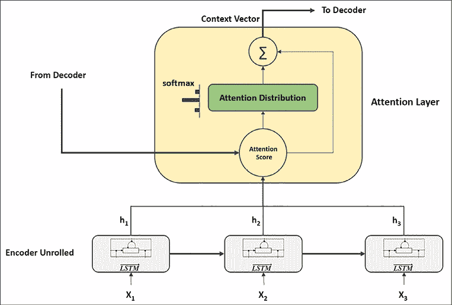

图 10.1：带有注意机制的简单 RNN

提到图表，我们来逐步了解注意力是如何计算的：

1.  让 RNN 编码器隐藏状态表示为*h*[1]、*h*[2]…、*h*[N]，当前输出向量为*s*[t]。

1.  首先，我们计算时间步*t*的*注意分数* *e*^t 如下：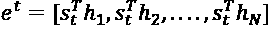

    这一步也被称为对齐步骤。

1.  然后，我们将这个分数转换成*注意力分布*：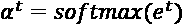。

1.  使用 softmax 函数帮助我们将分数转换为总和为 1 的概率分布。

1.  最后一步是计算注意力向量*a*[t]，也称为上下文向量，方法是将编码器隐藏状态加权求和：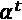: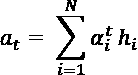

一旦我们得到了注意向量，我们就可以简单地将其与先前时间步的解码器状态向量连接起来，并像以前一样继续解码向量。

到目前为止，各种研究人员已经探索了注意机制的不同变体。需要注意的一些重要点包括：

+   注意计算的前述步骤在所有变体中都相同。

+   然而，区别在于计算注意力分数（表示为*e*^t）的方式。

广泛使用的注意力评分函数有基于内容的注意力，加法注意力，点积和缩放的点积。鼓励读者进一步探索以更好地了解这些。

## 上下文嵌入

从基于 BoW 的文本表示模型到无监督的密集表示技术（如 word2vec、GloVe、fastText 等）的大跨越是改善深度学习模型在 NLP 任务上表现的秘密武器。然而，这些表示方法也有一些局限性，我们会提醒自己：

+   单词的含义取决于使用的上下文。这些技术导致无论上下文如何，都会得到相同的向量表示。虽然可以通过使用非常强大的词义消歧方法（例如使用监督学习算法消除单词歧义）来解决这个问题，但从本质上来讲，这并没有被任何已知技术所捕捉到。

+   单词可以有不同的用法、语义和句法行为，但单词表示保持不变。

仔细思考一下，我们在上一章中使用 LSTMs 准备的架构正试图在内部解决这些问题。为了进一步阐述，让我们快速回顾一下我们建立的架构：

+   我们开始将输入文本转换为字符或单词嵌入。

+   然后，这些嵌入向量通过一个 LSTM 层（或者一组 LSTM 层，甚至是双向 LSTM 层），最终的隐藏状态被转换和解码以生成下一个标记。

虽然起始点利用了预训练嵌入，这些嵌入在每个上下文中具有相同的表示，但 LSTM 层引入了上下文。一组 LSTM 层分析令牌序列，每一层都试图学习与*语言句法*、*语义*等相关的概念。这为每个令牌（单词或字符）的表示提供了非常重要的上下文。

Peters 等人在 2017 年提出的**TagLM**架构是第一批提供见解的工作之一，说明了如何将预训练的词嵌入与预训练的神经语言模型结合起来，为下游 NLP 任务生成具有上下文意识的嵌入向量。

改变了 NLP 领域的巨大突破是**ELMo**，即**来自语言模型的嵌入**。ELMo 架构由 Peters 等人在他们 2018 年的作品*Deep Contextualized Word Representations*中提出。不详细展开，ELMo 架构的主要亮点是：

+   模型使用基于双向 LSTM 的语言模型。

+   Character CNNs 被用来生成嵌入向量，取代了预训练的词向量，这些向量利用了 4096 个 LSTM 单元，但通过前向传播层转换成了更小的 512 大小的向量。

+   模型利用剩余层来帮助在架构的深层之间传递梯度。这有助于防止梯度消失等问题。

+   主要创新之处在于利用所有隐藏的双向 LSTM 层来生成输入表示。与以前的作品不同，在以前的作品中，只使用最终的 LSTM 层来获取输入表示，这项工作对所有隐藏层的隐藏状态进行加权平均。这有助于模型学习上下文词嵌入，其中每一层都有助于语法和语义等方面。

ELMo 备受关注的原因并不是它帮助提高了性能，而是 ELMo 学习的上下文嵌入帮助它在以往的架构上改进了最先进的性能，不仅在几个 NLP 任务上，而且*几乎所有*的任务上（详见论文）。

Howard 和 Ruder 在 2018 年提出的**ULMFiT**模型基于类似的概念，并帮助推广了在 NLP 领域的*迁移学习*的广泛应用。³

## 自注意力

我们已经简要讨论了注意力机制及其对改进 NLP 模型的影响。在本节中，我们将讨论关于注意力机制的后续改进，即自注意力。

自注意力是由程先生等人在他们 2016 年题为*用于机器阅读的长短期记忆网络*的论文中提出的。⁴ 自注意力概念是建立在注意力的一般思想之上的。自注意力使得模型能够学习当前标记（字符、单词或句子等）与其上下文窗口之间的相关性。换句话说，它是一种注意力机制，相关于给定序列的不同位置，以生成相同序列的表示。可以将其想象为一种将单词嵌入转换为给定句子/序列的方式。原始论文中呈现的自注意力概念如同 *图 10.2* 所示。

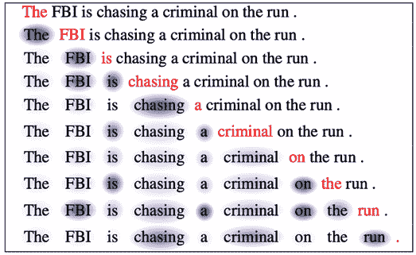

图 10.2：自注意力⁴

让我们尝试理解这张图中展示的自注意力输出。每一行/句子表示模型在每个时间步的状态，当前单词用红色突出显示。蓝色表示模型的注意力，其集中程度由蓝色的深浅表示。因此，上下文中的每个单词都有一定程度地影响当前单词的嵌入。

感兴趣的读者可以探索 Google Brain 团队制作的一个展示名为 Tensor2Tensor（现已废弃，改用 JAX）的框架的 notebook，这个 notebook 呈现了一个交互式可视化，帮助理解自注意力的概念：[`colab.research.google.com/github/tensorflow/tensor2tensor/blob/master/tensor2tensor/notebooks/hello_t2t.ipynb`](https://colab.research.google.com/github/tensorflow/tensor2tensor/blob/master/tensor2tensor/notebook)。

这个概念是我们即将讨论的 Transformer 架构的核心构建模块之一。

## Transformer

注意、上下文嵌入和无循环体系结构等概念的结合导致了我们现在所谓的**变压器体系结构**的诞生。变压器体系结构是由瓦斯瓦尼等人于 2017 年在具有里程碑意义的论文*注意力就是你所需要的*中提出的。⁵ 这项工作代表了自然语言处理领域的完全范式转变；它不仅提出了一个强大的体系结构，还巧妙地利用了一些最近发展的概念，帮助它在不同基准测试中击败了最先进的模型。

我们将简要介绍变压器体系结构的内部。欲了解逐步说明，请参阅 Jay Alammar 的*插图变压器*：[`jalammar.github.io/illustrated-transformer/`](https://jalammar.github.io/illustrated-transformer/)。

在核心部分，变压器是一种无循环和无卷积的基于注意力的编码器-解码器架构。它*完全依赖于注意机制*来学习局部和全局依赖关系，从而实现了大规模并行化。现在让我们来看看这项工作的主要贡献。

### 总体架构

如前所述，变压器在其核心是一个编码器-解码器架构。但与 NLP 领域已知的编码器-解码器体系结构不同，这项工作呈现了一个堆叠的编码器-解码器设置。

*图 10.3* 展示了高级变压器设置。

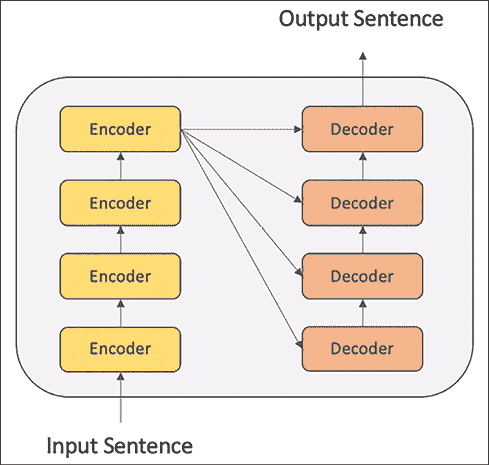

图 10.3：变压器体系结构的高级示意图

如图所示，该架构利用多个堆叠在一起的编码器块。解码器本身由堆叠的解码块组成，并且最后一个编码器块馈送到每个解码器块中。这里要注意的重要一点是，编码器和解码器块都不包含循环或卷积层。*图 10.4 (A)* 概述了编码器块，而 *图 10.4 (B)* 概述了解码器块。虚线表示不同层之间的残差连接。原始论文以相同的 6 个编码器块和解码器块呈现了变压器体系结构。

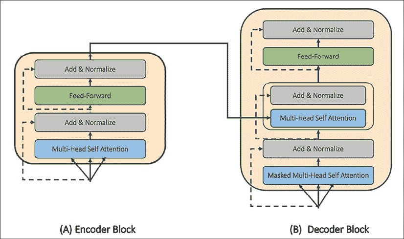

图 10.4：A) 编码器块，B) 在变压器体系结构中使用的解码器块

编码器块，如*图 10.4 (A)*所示，包括一个用于计算自注意力的层，然后是归一化和前馈层。这些层之间有跳跃连接。解码器块与编码器块几乎相同，只是多了一个由自注意力和归一化层组成的子块。这个额外的子块从最后一个编码器块获取输入，以确保编码器的注意力传播到解码块。

解码器块中的第一层进行了轻微修改。这个多头自注意力层对未来的时间步/上下文进行了屏蔽。这确保了模型在解码当前标记时不会关注目标的未来位置。让我们花点时间来理解多头自注意力组件。

### 多头自注意力

我们在上一节讨论了自注意力的概念。在本节中，我们将讨论变换器架构如何实现自注意力及其相关参数。在介绍注意力概念时，我们将其描述为查询向量（解码器状态，表示为*q*）和值向量（编码器的隐藏状态，表示为*v*）。

对于变换器而言，这有所修改。我们使用编码器状态或输入标记作为查询和值向量（自注意力），以及一个额外的向量称为*键*向量（表示为*k*）。在这种情况下，键、值和查询向量的维度相同。

变换器架构使用*缩放点积*作为其注意力机制。这个评分函数定义如下：

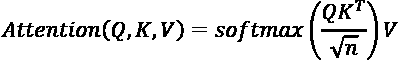

其中注意力输出首先计算为查询向量*Q*和键向量*K*（实际上这些是矩阵，但我们稍后会解释）的点积*QK*^T。点积试图捕捉查询与编码器状态的相似性，然后乘以输入向量的维度*n*的平方根进行缩放。引入这个缩放因子是为了确保梯度能够正确传播，因为对于大的嵌入向量观察到了梯度消失。Softmax 操作将分数转换为总和为 1 的概率分布。最后一步是计算编码器状态（这次是值向量*V*）的加权和与 Softmax 输出的乘积。整个操作在*图 10.5*中表示：

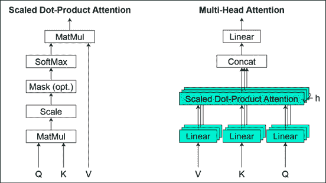

图 10.5：（左）缩放点积注意力，（右）多头自注意力，将几个自注意力层并行组合在一起。

在每个编码器块中使用单个注意头的位置，模型使用多个注意头并行进行操作（如 *图 10.5（右）* 所示）。作者在论文中提到，“多头注意力使模型能够同时关注不同位置的不同表示子空间的信息。使用单个注意头，平均会抑制这种情况。”换句话说，多头注意力使模型能够学习输入中每个单词的不同方面，即，一个注意头可能捕捉与介词的关系的影响，另一个可能专注于它与动词的交互作用，依此类推。由于每个注意头都有自己的 *Q*、*K* 和 *V* 向量集，实际上这些被实现为矩阵，每行对应于一个特定的头。

这里提供了多头自注意的高度直观的可视化解释，供参考：[`www.youtube.com/watch?v=-9vVhYEXeyQ&ab_channel=Peltarion`](https://www.youtube.com/watch?v=-9vVhYEXeyQ&ab_channel=Peltarion)。

有人可能会认为，由于多头设置，参数数量会突然激增并减慢训练过程。为了抵消这一点，作者们首先将较大的输入嵌入投影到较小的维度向量（大小为 64），然后使用 8 个头在原始实现中进行操作。这导致最终的连接向量（来自所有注意头）与具有较大输入嵌入向量的单个注意头的维度相同。这个巧妙的技巧帮助模型在相同的空间中捕捉更多的语义，而不会对整体训练速度产生影响。整体变压器架构使用多个这样的编码器块，每个编码器块都包含多头注意层。

### 位置编码

变压器模型不包含任何循环或卷积层，因此为了确保模型理解输入序列的重要性，使用了“位置嵌入”的概念。作者选择使用以下方法生成位置编码：

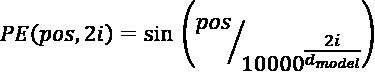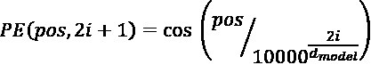

其中 *pos* 是输入令牌的位置，*i* 是维度，*d*[model] 是输入嵌入向量的长度。作者在偶数位置使用正弦，奇数位置使用余弦。位置编码向量的维度与输入向量相同，并且在输入编码器或解码器块之前将两个向量相加。

多头自注意力机制与位置编码的结合帮助变压器网络构建输入序列的高度上下文表示。这个结合着完全基于注意力机制的架构，使得变压器不仅能够在许多基准测试中超越现有模型，还能够构建一整个基于变压器的模型系列。在下一节中，我们将简要介绍这一系列变压器。

## BERT-ology

变压器架构在自然语言处理领域引入了完全前所未有的性能基准。这种无循环设置导致了对基于变压器的完整系列架构的研究和开发。最初和最成功的其中之一是 BERT 模型。**BERT**，或者**来自变压器的双向编码器表示**，是由 Google AI 的 Devlin 等人于 2018 年提出的。⁶

该模型在变压器模型设定的基准上取得了显著的改进。BERT 还通过展示如何对预训练模型进行微调以提供最先进的性能，推动了自然语言处理领域的迁移学习的发展。在计算机视觉用例中，我们可以使用类似 VGG 或 ResNet 这样的大型预训练网络作为特征提取器并带有分类层，或者我们可以对给定任务微调整个网络。我们也可以使用 BERT 来实现相同的功能。

BERT 模型采用具有不同数量的编码器块的变压器式编码器。作者提出了两个模型，BERT-base 包含 12 个块，BERT-large 包含 24 个块。这两个模型相比原始变压器设置具有更大的前馈网络（分别为 768 和 1024）和更多的注意力头（分别为 12 和 16）。

与原始变压器实现的另一个主要变化是双向掩码语言模型目标。典型的语言模型确保因果关系，即解码过程只关注过去的上下文而不是未来的时间步。BERT 的作者调整了这个目标，以从两个方向构建上下文，即 *预测掩码词* 和 *下一个句子预测*。这在 *图 10.6* 中有所描述：

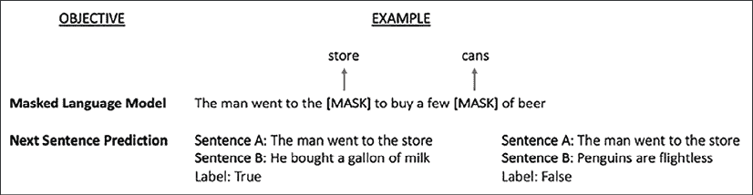

图 10.6：BERT 训练目标，包括掩码语言模型和下一个句子预测

如图所示，*掩码语言模型*随机掩码了训练过程中的 15% 的标记。他们在大规模语料库上训练模型，然后在 GLUE ([`gluebenchmark.com/`](https://gluebenchmark.com/)) 和其他相关基准上对其进行微调。据报告，该模型在性能上明显优于所有先前的架构。

BERT 的成功导致一系列改进模型，通过调整嵌入、编码器层等方面的某些方面来提供渐进性能提升。像 RoBERTa⁷、ALBERT⁸、DistilBERT⁹、XLNet¹⁰ 等模型共享核心思想并在此基础上提供改进。

由于 BERT 不符合因果关系，因此不能用于典型的语言建模任务，如文本生成。在接下来的章节中，我们将讨论 OpenAI 提出的变压器并行架构系列。

# GPT 1, 2, 3…

OpenAI 是一个人工智能研究团体，由于他们的具有新闻价值的作品，如 GPT、GPT-2 和最近发布的 GPT-3，一直备受关注。在本节中，我们将讨论与这些架构及其新颖贡献相关的简要讨论。最后，我们将使用 GPT-2 的预训练版本来执行我们的文本生成任务。

## 生成式预训练: GPT

这个系列中的第一个模型被称为**GPT**，或**生成式预训练**。它于 2018 年发布，大约与 BERT 模型同时。该论文¹¹ 提出了一个基于变压器和无监督学习思想的任务无关架构。GPT 模型被证明在 GLUE 和 SST-2 等多个基准测试中取得了胜利，虽然其性能很快被 BERT 超越，后者在此后不久发布。

GPT 本质上是基于我们在上一章节中提出的*transformer-decoder*的语言模型（参见*Transformers*部分）。由于语言模型可以以无监督方式进行训练，该模型的作者利用了这种无监督方法在非常大的语料库上进行训练，然后针对特定任务进行了微调。作者使用了包含超过 7,000 本不同流派的独特未发表书籍的**BookCorpus**数据集¹²。作者声称，该数据集使得模型能够学习到长距离信息，这是由于存在着长串连续文本。这被认为比之前使用的 1B Word Benchmark 数据集更好，后者由于句子被打乱而丧失了长距离信息。GPT 的整体设置如下图所示：

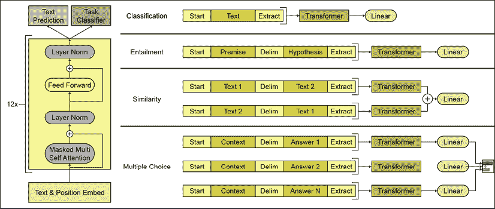

图 10.7: GPT 架构（左）, 使用 GPT 的基于任务的设置（右）

如*图 10.7 (左)*所示，GPT 模型与原始变压器-解码器类似。作者使用了 12 个解码器块（而不是原始变压器中的 6 个），每个块具有 768 维状态和 12 个自注意头。由于该模型使用了掩码自注意力，它保持了语言模型的因果属性，因此还可以用于文本生成。对于*图 10.7 (右)*展示的其余任务，基本上使用相同的预训练语言模型，并对输入进行最小的任务特定预处理和最终任务特定的层/目标。

## GPT-2

GPT 被一个更加强大的模型 GPT-2 取代。Radford 等人在 2019 年的论文*Language Models are Unsupervised Multi-task Learners*中展示了 GPT-2 模型。¹³ 最大的 GPT-2 变体是一个庞大的 15 亿参数的基于 transformer 的模型，在各种 NLP 任务上表现出色。

这项工作最引人注目的是，作者展示了一个以无监督方式训练的模型（语言建模）如何在*few-shot*设置中实现了最先进的性能。这一点特别重要，因为与 GPT 甚至 BERT 相比，GPT-2 在特定任务上不需要进行任何微调。

与 GPT 类似，GPT-2 的秘密武器是它的数据集。作者们通过对一个名为 Reddit 的社交网站的 4500 万个外链进行爬取，准备了一个庞大的 40 GB 数据集。他们进行了一些基于启发式的清理、去重和移除维基百科文章（当然，为什么不呢？）最终得到了大约 800 万个文档。这个数据集被称为**WebText**数据集。

GPT-2 的总体结构与 GPT 相同，只是稍微更改了一些地方，比如在每个次块的开头放置层归一化，并在最终的自注意力块之后添加了额外的层归一化。模型的四个变体分别利用了 12、24、36 和 48 层。词汇量也扩展到了 50000 个词，并且上下文窗口扩展到了 1024 个标记（而 GPT 为 512）。

GPT-2 作为一种语言模型表现非常出色，以至于作者最初决定不释放预训练模型以造福大众¹⁴。最终他们还是释放了它，理由是迄今为止还没有发现恶意使用。需注意的是，这不仅仅是道德问题。数据和模型的庞大规模使得大多数人甚至无法想象训练这样的模型的可能性。*Figure 10.8* 描述了一些最近的 NLP 模型的规模和训练所需的计算量：

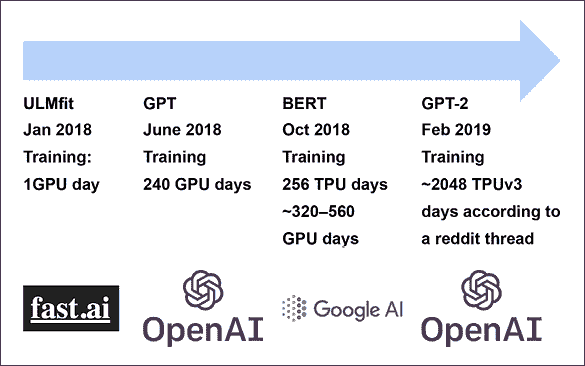

Figure 10.8: NLP 模型的规模¹⁵

TPU 的速度比典型的 GPU 快多次，如图所示，GPT-2 需要在报告的数据集上进行 2048 TPU 天的训练。与大型 BERT 模型的 256 TPU 天相比是相当大的差距。

有兴趣的读者可以在这里探索 GPT-2 的官方实现：[`github.com/openai/gpt-2`](https://github.com/openai/gpt-2).

虽然官方实现是基于 TensorFlow 1.14，但此链接提供了使用 TensorFlow 2.x 的非官方实现：

[`akanyaani.github.io/gpt-2-tensorflow2.0/`](https://akanyaani.github.io/gpt-2-tensorflow2.0/)

幸运的是，由于预训练模型的发布，Hugging Face 的研究人员决定致力于使变压器架构民主化。来自 Hugging Face 的 `transformer` 包是一个高级包装器，使我们能够使用几行代码就可以使用这些大规模的自然语言处理模型。该库还提供了一个 Web 应用程序，用于探索不同的基于变压器的模型。*图 10.9* 是当提供了一个 "GPT is" 种子时，由该 Web 应用程序生成的段落的快照：

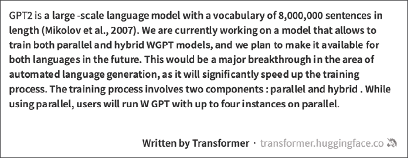

图 10.9：使用基于 Hugging Face transformer 包的 GPT-2 的示例输出¹⁶

图中生成的文本显示了 GPT-2 的惊人效果。在第一句中，模型表现出色，甚至遵循了正确引用先前工作的惯例（尽管引用本身并不正确）。内容并不是很有意义，但在语法上是准确的，相对于我们提供的最小种子文本而言，它是相当连贯的。

现在，我们将利用 `transformers` 包来构建一个基于 GPT-2 的文本生成流水线，看看我们的模型能做多好。

### 亲身体验 GPT-2

保持与之前某些章节主题的一致性，在那些章节中，我们使用各种复杂的架构生成了一些虚假内容，让我们使用 GPT-2 生成一些虚假新闻标题。百万条新闻标题数据集包含了澳大利亚广播公司的一百多万条新闻标题，历时 17 年收集。该数据集可在以下链接处获得：

[`dataverse.harvard.edu/dataset.xhtml?persistentId=doi:10.7910/DVN/SYBGZL`](https://dataverse.harvard.edu/dataset.xhtml?persistentId=doi:10.7910/DVN/SYBGZL)

[`www.kaggle.com/therohk/million-headlines`](https://www.kaggle.com/therohk/million-headlines)

我们将使用 Hugging Face 的 `transformers` 库来对这个数据集上的 GPT-2 进行微调。从高层次来看，这个假新闻生成任务与我们在 *第九章* 的初始部分中进行的语言建模任务是一样的。由于我们使用的是 `transformers` 包，与训练数据集的创建、标记化和最终训练模型相关的步骤都是使用高级 API 进行抽象化的。

`transformers` 库与 TensorFlow 和 PyTorch 后端都兼容。对于这种特殊情况，我们使用基于 PyTorch 的默认重新训练设置。该库不断改进，在撰写本文时，稳定版本 3.3.1 在使用 TensorFlow 对 GPT-2 进行微调时存在问题。由于 `transformers` 是一个高级库，读者在以下代码片段中不会注意到太大的差异。

如往常一样，第一步是读取手头的数据集，并将其转换为所需的格式。我们不需要自己准备单词到整数和反向映射。`transformers`库中的`Tokenizer`类会为我们处理这些。以下代码片段准备了数据集和所需的对象：

```py
import pandas as pd
from sklearn.model_selection import train_test_split
from transformers import AutoTokenizer
from transformers import TextDataset,DataCollatorForLanguageModeling
# Get dataset
news = pd.read_csv('abcnews-date-text.csv')
X_train, X_test= train_test_split(news.headline_text.tolist(),test_size=0.33, random_state=42)
# Write the headlines from training dataset
with open('train_dataset.txt','w') as f:
  for line in X_train:
    f.write(line)
    f.write("\n")
# Write the headlines from testing dataset
with open('test_dataset.txt','w') as f:
  for line in X_test:
    f.write(line)
    f.write("\n")
# Prepare tokenizer object
tokenizer = AutoTokenizer.from_pretrained("gpt2",pad_token='<pad>')
train_path = 'train_dataset.txt'
test_path = 'test_dataset.txt'
# Utility method to prepare DataSet objects
def load_dataset(train_path,test_path,tokenizer):
    train_dataset = TextDataset(
          tokenizer=tokenizer,
          file_path=train_path,
          block_size=4)

    test_dataset = TextDataset(
          tokenizer=tokenizer,
          file_path=test_path,
          block_size=4)   

    data_collator = DataCollatorForLanguageModeling(
        tokenizer=tokenizer, mlm=False,
    )
    return train_dataset,test_dataset,data_collator
train_dataset,test_dataset,data_collator = load_dataset(train_path, test_path, tokenizer) 
sklearn to split our dataset into training and test segments, which are then transformed into usable form using the TextDataset class. The train_dataset and test_dataset objects are simple generator objects that will be used by the Trainer class to fine-tune our model. The following snippet prepares the setup for training the model:
```

```py
from transformers import Trainer,TrainingArguments,AutoModelWithLMHead
model = AutoModelWithLMHead.from_pretrained("gpt2")
training_args = TrainingArguments(
    output_dir="./headliner",  # The output directory
    overwrite_output_dir=True, # overwrite the content of 
                               # the output directory
    num_train_epochs=1,        # number of training epochs
    per_device_train_batch_size=4, # batch size for training
    per_device_eval_batch_size=2,  # batch size for evaluation
    eval_steps = 400, # Number of update steps 
                      # between two evaluations.
    save_steps=800,   # after # steps model is saved 
    warmup_steps=500, # number of warmup steps for 
                      # learning rate scheduler
    )
trainer = Trainer(
    model=model,
    args=training_args,
    data_collator=data_collator,
    train_dataset=train_dataset,
    eval_dataset=test_dataset,
    prediction_loss_only=True,
) 
```

我们使用`AutoModelWithLMHead`类作为对 GPT-2 的高级封装，具有语言模型目标。`Trainer`类根据`TrainingArguments`类设置的参数简单地迭代训练步骤。

下一步只需调用`train`函数，让微调开始。以下代码片段展示了 GPT-2 的训练步骤：

```py
trainer.train() 
```

```py
{'loss': 6.99887060546875, 'learning_rate': 5e-05, 'epoch': 0.0010584004182798454, 'total_flos': 5973110784000, 'step': 500}
{'loss': 6.54750146484375, 'learning_rate': 4.994702390916932e-05, 'epoch': 0.0021168008365596907, 'total_flos': 11946221568000, 'step': 1000}
{'loss': 6.5059072265625, 'learning_rate': 4.989404781833863e-05, 'epoch': 0.003175201254839536, 'total_flos': 17919332352000, 'step': 1500}
{'loss': 6.46778125, 'learning_rate': 4.9841071727507945e-05, 'epoch': 0.0042336016731193814, 'total_flos': 23892443136000, 'step': 2000}
{'loss': 6.339587890625, 'learning_rate': 4.978809563667726e-05, 'epoch': 0.005292002091399226, 'total_flos': 29865553920000, 'step': 2500}
{'loss': 6.3247421875, 'learning_rate': 4.973511954584657e-05, 'epoch': 0.006350402509679072, 'total_flos': 35838664704000, 'step': 3000} 
pipeline object along with the utility function get_headline, which we need to generate headlines using this fine-tuned model:
```

```py
from transformers import pipeline
headliner = pipeline('text-generation',
                model='./headliner', 
                tokenizer='gpt2',
                config={'max_length':8})
# Utility method
def get_headline(headliner_pipeline, seed_text="News"):
  return headliner_pipeline(seed_text)[0]['generated_text'].split('\n')[0] 
```

现在让我们生成一些虚假的新闻标题，看看我们的 GPT-2 模型的表现好坏。*图 10.10*展示了使用我们的模型生成的一些虚假新闻标题：


图 10.10：使用微调 GPT-2 生成的虚假新闻标题。粗体文本是种子文本。

生成的输出展示了 GPT-2 和基于 transformer 的架构的潜力。读者应该将此与我们在《第九章 文本生成方法的兴起》的初始部分中训练的基于 LSTM 的变体进行比较。这里展示的模型能够捕捉到与新闻标题相关的一些细微差别。例如，它生成了简短而精练的句子，捕捉到了像*袋鼠*、*土著*甚至*墨尔本*这样在澳大利亚环境中都相关的词语，这些都存在于我们的训练数据集的领域。所有这些都是模型在仅经过几个 epoch 的训练后所捕获的。可能性是无穷无尽的。

## [猛犸 GPT-3](https://wiki.example.org/mammoth_gpt-3)

OpenAI 小组并未在 GPT-2 取得巨大成功后就止步不前。相反，GPT-2 展示了模型容量（参数大小）和更大数据集如何可能导致令人印象深刻的结果。Brown 等人在 2020 年 5 月发布了题为*语言模型是少样本学习者*的论文。¹⁷此论文介绍了巨大的 1750 亿参数 GPT-3 模型。

GPT-3 比以往任何语言模型都要庞大（大约 10 倍），并且将 transformer 架构发挥到了极限。在这项工作中，作者展示了模型的 8 个不同变体，从一个拥有 1.25 亿参数，12 层的“GPT-3 小”到一个拥有 1750 亿参数，96 层的 GPT-3 模型。

模型架构与 GPT-2 相同，但有一个主要变化（除了嵌入尺寸、注意头和层数的增加之外）。这个主要变化是在变压器块中使用交替的密集和局部带状稀疏注意力模式。这种稀疏注意技术类似于为稀疏变换器（参见*使用稀疏变换器生成长序列*，Child 等人¹⁸））提出的技术。

与之前的 GPT 模型类似，作者们不得不为这第三次迭代准备一个更大的数据集。他们基于类似 Common Crawl（过滤了更好的内容）、WebText2（WebText 的更大版本，用于 GPT-2）、Books1 和 Books2，以及维基百科数据集准备了一个 3000 亿标记的数据集。他们按各自数据集的质量比例抽样。

作者比较了 NLP 模型和总体机器学习的学习范式与人类学习方式。尽管语言模型在这些年来的性能和容量上有所改进，但最先进模型仍需要特定于任务的精细调整。为展示 GPT-3 的能力，他们评估了该模型的 *少例学习*、*一例学习* 和 *零例学习* 模式。精细调整模式暂时留给未来练习。

这三种评估模式可以总结如下：

+   **零-shot**：仅凭任务的自然语言描述，即在没有展示任何正确输出示例的情况下，模型就能预测答案。

+   **一例**：除了任务描述外，模型还展示了一个任务示例。

+   **少例学习**：除了任务描述外，模型还展示了一些任务示例。

在每种情况下，都不进行梯度更新（因为我们只是评估模型，在任何这些模式中都不是在训练）。*图 10.11* 显示了每种评估模式的示例设置，任务是将文本从英语翻译成西班牙语。

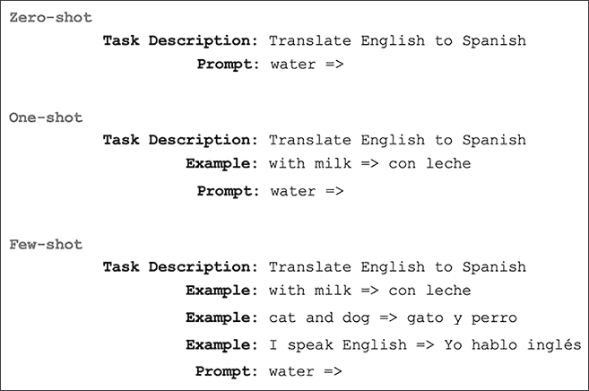

图 10.11: GPT-3 的评估模式

如图所示，在零-shot 模式下，模型展示了任务描述和一个用于翻译的提示。类似地，在一例和少例模式下，模型分别展示了一个和一些示例，然后展示了实际翻译提示。作者观察到 GPT-3 在零-shot 和一例设置下取得了有希望的结果。在少例设置中，该模型大多数情况下是竞争性的，甚至在某些任务中超过了当前的最先进水平。

除了通常的 NLP 任务外，GPT-3 似乎展示了一些在其他情况下需要快速适应或即兴推理的非凡能力。作者观察到 GPT-3 能够在一些任务上表现良好，如拼词、进行三位数的算术，甚至在看到一次定义后就能在句子中使用新词。作者还观察到，在少例学习设置下，GPT-3 生成的新闻文章足够好，以至于在区分它们与人为生成的文章时会给人类评估者带来困难。有趣的是，在之前部分准备的 GPT-2 上测试一下 GPT-3。

该模型足够庞大，需要一个专门的高性能集群来训练，正如论文中所描述的。作者就训练这个巨大模型所需的计算量和能量进行了讨论。在当前状态下，这个模型对我们大多数人来说还是难以企及的。OpenAI 计划以 API 的形式展示这个模型，但在撰写本章时，细节尚不明朗。

# 摘要

在本章中，我们介绍了近期 NLP 模型中一些主要的概念，如*attention*机制、*contextual embeddings*和*self-attention*。然后我们使用这个基础来学习*transformer*架构及其内部组件。我们简要地讨论了 BERT 及其系列架构。

在本章的下一节中，我们对 OpenAI 的基于 transformer 的语言模型进行了讨论。我们讨论了 GPT 和 GPT-2 的架构和数据集相关的选择。我们还使用了 Hugging Face 的`transformer`包来开发我们自己的基于 GPT-2 的文本生成流水线。最后，我们对最新、最尖端的语言模型 GPT-3 进行了简要讨论。我们讨论了开发这样一个巨大模型的各种动机以及它超越传统测试基准列表的功能清单。

本章和*第九章* *文本生成方法的兴起* 展示了自然语言处理(NLP)是自己的研究领域。然而，来自计算机视觉和深度学习/机器学习的概念通常相互交叉，以推动技术边界。

在下一章中，我们将把我们的焦点转移到理解音频领域以及生成模型在音频领域中的工作。

# 参考文献

1.  Peters, M.E., Ammar, W., Bhagavatula, C., & Power, R. (2017). *Semi-supervised sequence tagging with bidirectional language models*. arXiv. [`arxiv.org/abs/1705.00108`](https://arxiv.org/abs/1705.00108)

1.  Peters, M.E., Neumann, M., Iyyer, M., Gardner, M., Clark, C., Lee, K., & Zettlemoyer, L. (2018). *Deep contexualized word representations*. arXiv. [`arxiv.org/abs/1802.05365`](https://arxiv.org/abs/1802.05365)

1.  Howard, J., & Ruder, S. (2018). *Universal Language Model Fine-tuning for Text Classification*. arXiv. [`arxiv.org/abs/1801.06146`](https://arxiv.org/abs/1801.06146)

1.  Cheng, J., Dong, L., & Lapata, M. (2016). *Long Short-Term Memory-Networks for Machine Reading*. arXiv. [`arxiv.org/abs/1601.06733`](https://arxiv.org/abs/1601.06733)

1.  Vaswani, A., Shazeer, N., Parmar, N., Uszkoreit, J., Jones, L., Gomez, A.N., Kaiser, L., & Polosukhin, I. (2017). *Attention Is All You Need*. arXiv. [`arxiv.org/abs/1706.03762`](https://arxiv.org/abs/1706.03762)

1.  Devlin, J., Chang, M-W., Lee, K., & Toutanova, K. (2018). *BERT: Pre-training of Deep Bidirectional Transformers for Language Understanding*. arXiv. [`arxiv.org/abs/1810.04805`](https://arxiv.org/abs/1810.04805)

1.  Liu, Y., Ott, M., Goyal, N., Du, J., Joshi, M., Chen, D., Levy, O., Lewis, M., Zettlemoyer, L., & Stoyanov, V. (2019)。*RoBERTa: A Robustly Optimized BERT Pretaining Approach*。arXiv。[`arxiv.org/abs/1907.11692`](https://arxiv.org/abs/1907.11692)

1.  Lan, Z., Chen, M., Goodman, S., Gimpel, K., Sharma, P., & Soricut, R. (2019)。*ALBERT: A Lite BERT for Self-supervised Learning of Language Representations*。arXiv。[`arxiv.org/abs/1909.11942`](https://arxiv.org/abs/1909.11942)

1.  Sanh, V., Debut, L., Chaumond, J., & Wolf, T. (2019)。*DistilBERT, a distilled version of BERT: smaller, faster, cheaper and lighter*。arXiv。[`arxiv.org/abs/1910.01108`](https://arxiv.org/abs/1910.01108)

1.  Yang, Z., Dai, Z., Yang, Y., Carbonell, J., Salakhutdinov, R., & Le, Q.V. (2019)。*XLNet: Generalized Autoregressive Pretraining for Language Understanding*。arXiv。[`arxiv.org/abs/1906.08237`](https://arxiv.org/abs/1906.08237)

1.  Radford, A. (2018 年 6 月 11 日)。*Improving Language Understanding with Unsupervised Learning*。OpenAI。[`openai.com/blog/language-unsupervised/`](https://openai.com/blog/language-unsupervised/)

1.  Zhu, Y., Kiros, R., Zemel, R., Salakhutdinov, R., Urtasun, R., Torralba, A., & Fidler, S. (2015)。*Aligning Books and Movies: Towards Story-like Visual Explanations by Watching Movies and Reading Books*。arXiv。[`arxiv.org/abs/1506.06724`](https://arxiv.org/abs/1506.06724)

1.  Radford, A., Wu, J., Child, R., Luan, D., Amodei, D., & Sutskever, I. (2019)。*Language Models are Unsupervised Multitask Learners*。OpenAI。[`cdn.openai.com/better-language-models/language_models_are_unsupervised_multitask_learners.pdf`](https://cdn.openai.com/better-language-models/language_models_are_unsupervised_multitask_learners.pd)

1.  Radford, A., Wu, J., Amodei, D., Amodei, D., Clark, J., Brundage, M., & Sutskever, I. (2019 年 2 月 14 日)。*Better Language Models and Their Implications*。OpenAI。[`openai.com/blog/better-language-models/`](https://openai.com/blog/better-language-models/)

1.  stanfordonline. (2019 年 3 月 21 日)。*斯坦福 CS224N: NLP with Deep Learning | Winter 2019 | Lecture 13 – Contextual Word Embeddings* [视频]。YouTube。[`www.youtube.com/watch?v=S-CspeZ8FHc&ab_channel=stanfordonline`](https://www.youtube.com/watch?v=S-CspeZ8FHc&ab_channel=stanfordonline)

1.  Hugging Face。 (无日期)。*gpt2 abstract*。检索于 2021 年 4 月 22 日，来源：[`transformer.huggingface.co/doc/arxiv-nlp/ByLHXHhnBJtBLOpRENZmulqc/edit`](https://transformer.huggingface.co/doc/arxiv-nlp/ByLHXHhnBJtBLOpRENZmulqc/edit)

1.  Brown, T.B., Mann, B., Ryder, N., Subbiah, M., Kaplan, J., Dhariwal, P., Neelakantan, A., Shyam, P., Sastry, G., Askell, A., Agarwal, S., Herbert-Voss, A., Krueger, G., Henighan, T., Child, R., Ramesh, A., Ziegler, D., Wu, J., Winter, C., Hesse, C., Chen, M., Sigler, E., Litwin, M., Gray, S., Chess, B., Clark, J., Berner, C., McCandlish, S., Radford, A., Sutskever, I., & Amodei, D. (2020). "*语言模型是少样本学习器*". arXiv. [`arxiv.org/abs/2005.14165`](https://arxiv.org/abs/2005.14165)

1.  Child, R., Gray, S., Radford, A., & Sutskever, I. (2019). *使用稀疏 Transformer 生成长序列*. arXiv. [`arxiv.org/abs/1904.10509`](https://arxiv.org/abs/1904.10509)
