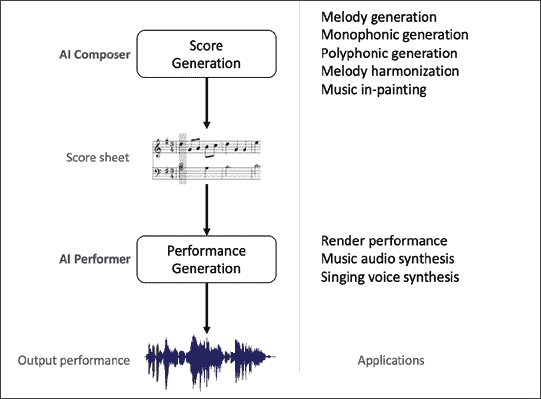
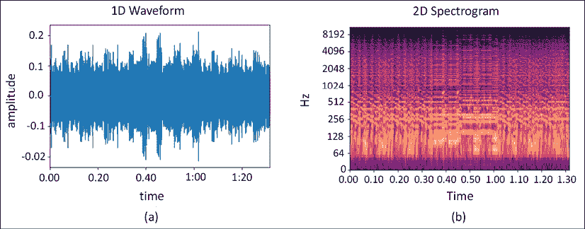
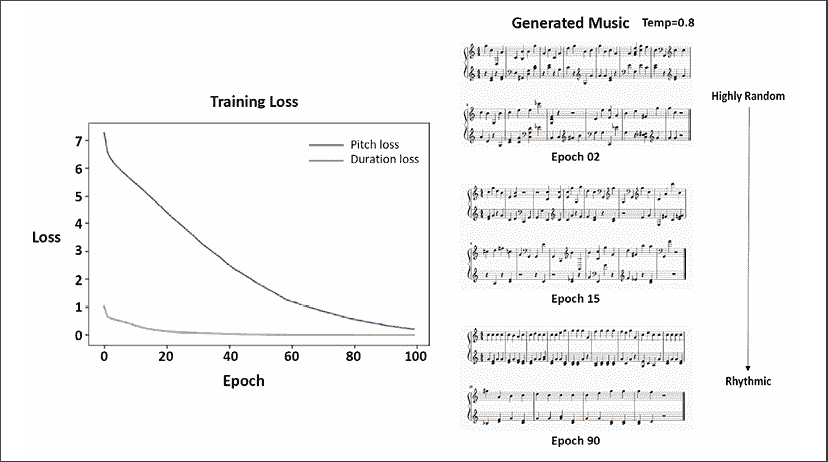
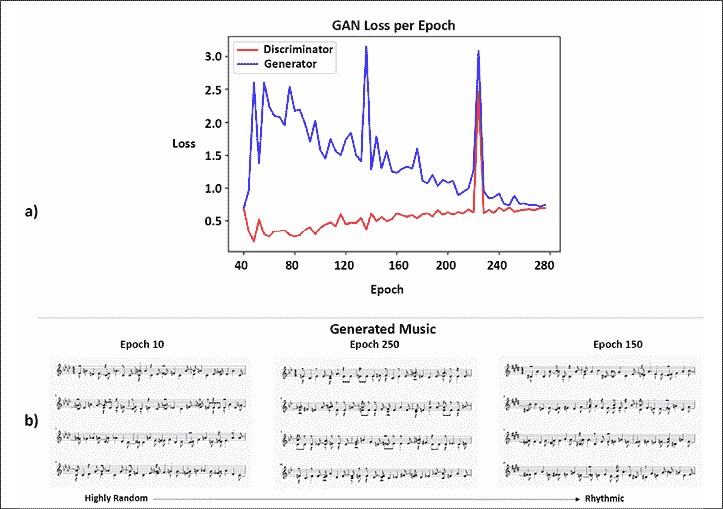
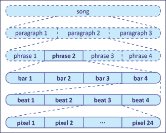
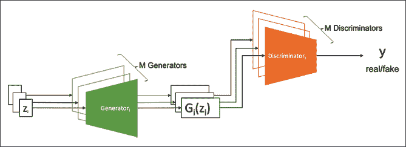
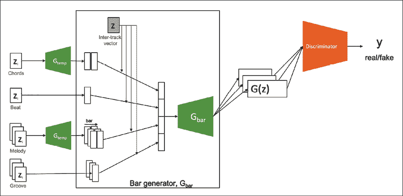

# 11

# 使用生成模型作曲音乐

在之前的章节中，我们讨论了许多以图像、文本和视频生成为重点的生成模型。从非常基本的 MNIST 数字生成到像模仿巴拉克·奥巴马这样更复杂的任务，我们探讨了许多复杂的作品及其新颖的贡献，并花时间了解所涉及的任务和数据集的细微差别。

我们看到，在之前关于文本生成的章节中，计算机视觉领域的改进如何帮助促进自然语言处理领域的显著进步。同样，音频是另一个领域，在这个领域，来自计算机视觉和自然语言处理领域的思想交叉已经扩大了视角。音频生成并不是一个新领域，但由于深度学习领域的研究，这个领域近年来也取得了一些巨大的进步。

音频生成有许多应用。如今最突出和流行的是一系列智能助手（谷歌助手、苹果 Siri、亚马逊 Alexa 等等）。这些虚拟助手不仅试图理解自然语言查询，而且还以非常人性化的声音作出回应。音频生成还在辅助技术领域找到应用，在那里，文本到语音引擎用于为阅读障碍者阅读屏幕上的内容。

在音乐生成领域利用这样的技术越来越受到关注。字节跳动（社交网络 TikTok 的母公司）收购了基于人工智能的免版税音乐生成服务 Jukedeck，这一举动充分展示了这个领域的潜在价值和影响力。¹

实际上，基于人工智能的音乐生成是一个不断增长的趋势，有许多竞争性的解决方案和研究工作。诸如苹果的 GarageBand² 等商业化产品提供了许多易于使用的界面，供新手只需点击几下即可创作出高质量音乐曲目。谷歌的 Magenta³ 项目的研究人员正在通过尝试不同的技术、工具和研究项目，将音乐生成的边界推向新的极限，使对这些复杂主题几乎没有知识的人也能够自己生成令人印象深刻的音乐作品。

在本章中，我们将介绍与音频数据生成模型相关的不同概念、架构和组件。特别是，我们将把焦点限制在音乐生成任务上。我们将专注于以下主题：

+   音乐表示的简要概述

+   基于 RNN 的音乐生成

+   一个简单的设置，以了解如何利用 GANs 进行音乐生成

+   基于 MuseGAN 的复音音乐生成

本章中介绍的所有代码片段都可以直接在 Google Colab 中运行。出于空间原因，依赖项的导入语句没有包含在内，但读者可以参考 GitHub 存储库获取完整的代码：[`github.com/PacktPublishing/Hands-On-Generative-AI-with-Python-and-TensorFlow-2`](https://github.com/PacktPublishing/Hands-On-Generative-AI-with-Python-and-TensorFlow-2)。

我们将从音乐生成任务的介绍开始。

# 开始学习音乐生成

音乐生成是一个固有复杂且困难的任务。通过算法（机器学习或其他方式）进行这样的任务甚至更具挑战性。尽管如此，音乐生成是一个有趣的研究领域，有许多待解决的问题和令人着迷的作品。

在本节中，我们将建立对这一领域的高层次理解，并了解一些重要且基础的概念。

计算机辅助音乐生成或更具体地说是深度音乐生成（由于使用深度学习架构）是一个由生成乐谱和表现生成两个主要组成部分组成的多层学习任务。让我们简要讨论每个组件：

+   **生成乐谱**：乐谱是音乐的符号表示，可供人类或系统使用/阅读以生成音乐。类比一下，我们可以将乐谱与音乐之间的关系安全地视为文本与言语之间的关系。音乐乐谱由离散符号组成，可以有效地传达音乐。一些作品使用术语*AI 作曲家*来表示与生成乐谱任务相关的模型。

+   **表现生成**：延续文本-语音类比，表现生成（类似于言语）是表演者使用乐谱以其自己的节奏、韵律等特征生成音乐的地方。与表现生成任务相关的模型有时也被称为*AI 表演者*。

我们可以根据目标组件针对不同的用例或任务来实现。*图 11.1*强调了在音乐生成的上下文中正在研究的一些任务：



图 11.1：音乐生成的不同组件及相关任务列表

如图所示，通过仅关注乐谱生成，我们可以致力于诸如旋律生成和旋律和声化以及音乐修补（与填补音乐中缺失或丢失的信息相关联）等任务。除了作曲家和表演者之外，还有研究正在进行中，旨在构建 AI DJ。与人类唱片骑师（DJ）类似，AI DJ 利用现有的音乐组件创建串烧、混搭、混音，甚至高度个性化的播放列表。

在接下来的章节中，我们将主要致力于构建我们自己的乐谱生成模型或 AI 作曲家。既然我们对整体音乐生成的景观有了高层次的理解，让我们专注于理解音乐的表示方式。

## 表示音乐

音乐是代表情绪、节奏、情感等的艺术作品。类似于文本，文本是字母和语法规则的集合，音乐谱有自己的符号和一套规则。在前几章中，我们讨论了如何在任何自然语言处理任务之前，将文本数据首先转换为可用的向量形式。在音乐的情况下，我们也需要做类似的事情。

音乐表示可以分为两大类：连续和离散。连续表示也称为**音频领域表示**。它将音乐数据处理为波形。如图 11.2（a）所示，音频领域表示捕捉丰富的声学细节，如音色和发音。



图 11.2：音乐的连续或音频领域表示。a）1D 波形是音频信号的直接表示。b）音频数据的二维表示可以是以时间为一轴，频率为第二轴的频谱图形式。

如图所示，音频领域表示可以直接是 1D 波形或 2D 频谱图：

+   一维波形是音频信号的直接表示，其中*x*轴表示时间，*y*轴表示信号的变化。

+   二维频谱图将时间作为*x*轴，频率作为*y*轴。

我们通常使用**短时傅里叶变换**（**STFT**）将一维波形转换为二维频谱图。根据我们如何获得最终的频谱图，有不同的变体，如梅尔频谱图或幅度频谱图。

另一方面，离散或**符号表示**使用离散符号来捕获与音高、持续时间、和弦等相关的信息。尽管不如音频域表示那样具有表现力，但符号表示被广泛应用于不同的音乐生成工作中。这种流行程度主要是由于易于理解和处理这种表示形式。*图 11.3*展示了音乐谱的一个示例符号表示：


图 11.3：音乐的离散或符号表示

如图所示，符号表示使用各种符号/位置捕获信息。**MIDI**，或**音乐乐器数字接口**，是音乐家用来创建、谱写、演奏和分享音乐的可互操作格式。它是各种电子乐器、计算机、智能手机甚至软件用来读取和播放音乐文件的常用格式。

符号表示可以设计成捕捉诸如*note-on*、*note-off*、*时间偏移*、*小节*、*轨道*等许多事件。为了理解即将出现的部分和本章的范围，我们只会关注两个主要事件，即*note-on*和*note-off*。MIDI 格式捕捉了 16 个通道（编号为 0 到 15）、128 个音符和 128 个响度设置（也称为速度）。还有许多其他格式，但为了本章的目的，我们将仅使用基于 MIDI 的音乐文件，因为它们被广泛使用、富有表现力、可互操作且易于理解。

```py
music21. We then use its utility function to visualize the information in the file:
```

```py
from music21 import converter
midi_filepath = 'Piano Sonata No.27.mid'
midi_score = converter.parse(midi_filepath).chordify()
# text-form
print(midi_score.show('text'))
# piano-roll form
print(midi_score.show()) 
```

到目前为止，我们在理解整体音乐生成格局和一些重要的表示技术方面已经取得了相当大的进展。接下来，我们将开始进行音乐生成本身。

# 使用 LSTM 进行音乐生成

歌曲是连续信号，由各种乐器和声音的组合构成，这一点我们在前一节已经看到。另一个特点是结构性的循环模式，我们在听歌时要注意。换句话说，每首音乐都有其独特的连贯性、节奏和流畅性。

这样的设置与我们在 *第九章* *文本生成方法的兴起* 中看到的文本生成情况类似。在文本生成的情况下，我们看到了基于 LSTM 的网络的力量和有效性。在本节中，我们将扩展堆叠 LSTM 网络来执行音乐生成任务。

为了保持简单和易于实现，我们将专注于单个乐器/单声部音乐生成任务。让我们先看看数据集，然后考虑如何为我们的音乐生成任务准备它。

## 数据集准备

MIDI 是一种易于使用的格式，可以帮助我们提取文件中包含的音乐的符号表示。在本章的实践练习中，我们将利用 reddit 用户*u/midi_man*收集并分享的大规模公共 MIDI 数据集的子集，该数据集可以在以下链接中找到：

[`www.reddit.com/r/WeAreTheMusicMakers/comments/3ajwe4/the_largest_midi_collection_on_the_inte`](https://www.reddit.com/r/WeAreTheMusicMakers/comments/3ajwe4/the_largest_midi_collection_on_the_inte)

基于贝多芬、巴赫、巴托克等伟大音乐家的古典钢琴作品。该子集可以在压缩文件`midi_dataset.zip`中找到，并且连同本书的代码一起放在 GitHub 存储库中。

正如前面提到的，我们将利用 `music21` 来处理此数据集的子集，并准备我们的数据来训练模型。由于音乐是各种乐器和声音/歌手的集合，因此为了本练习的目的，我们将首先使用 `chordify()` 函数从歌曲中提取和弦。以下代码片段可以帮助我们以所需格式获取 MIDI 分数的列表：

```py
from music21 import converter
data_dir = 'midi_dataset'
# list of files
midi_list = os.listdir(data_dir)
# Load and make list of stream objects
original_scores = []
for midi in tqdm(midi_list):
    score = converter.parse(os.path.join(data_dir,midi))
    original_scores.append(score)
# Merge notes into chords
original_scores = [midi.chordify() for midi in tqdm(original_scores)] 
```

一旦我们有了分数列表，下一步就是提取音符及其对应的时间信息。为了提取这些细节，`music21`具有诸如`element.pitch`和`element.duration`之类的简单易用的接口。

以下代码片段帮助我们从 MIDI 文件中提取这样的信息，并准备两个并行的列表：

```py
# Define empty lists of lists
original_chords = [[] for _ in original_scores]
original_durations = [[] for _ in original_scores]
original_keys = []
# Extract notes, chords, durations, and keys
for i, midi in tqdm(enumerate(original_scores)):
    original_keys.append(str(midi.analyze('key')))
    for element in midi:
        if isinstance(element, note.Note):
            original_chords[i].append(element.pitch)
            original_durations[i].append(element.duration.quarterLength)
        elif isinstance(element, chord.Chord):
            original_chords[i].append('.'.join(str(n) for n in element.pitches))
            original_durations[i].append(element.duration.quarterLength) 
C major key:
```

```py
# Create list of chords and durations from songs in C major
major_chords = [c for (c, k) in tqdm(zip(original_chords, original_keys)) if (k == 'C major')]
major_durations = [c for (c, k) in tqdm(zip(original_durations, original_keys)) if (k == 'C major')] 
mapping and presents a sample output as well:
```

```py
def get_distinct(elements):
    # Get all pitch names
    element_names = sorted(set(elements))
    n_elements = len(element_names)
    return (element_names, n_elements)
def create_lookups(element_names):
    # create dictionary to map notes and durations to integers
    element_to_int = dict((element, number) for number, element in enumerate(element_names))
    int_to_element = dict((number, element) for number, element in enumerate(element_names))
    return (element_to_int, int_to_element)
# get the distinct sets of notes and durations
note_names, n_notes = get_distinct([n for chord in major_chords for n in chord])
duration_names, n_durations = get_distinct([d for dur in major_durations for d in dur])
distincts = [note_names, n_notes, duration_names, n_durations]
with open(os.path.join(store_folder, 'distincts'), 'wb') as f:
    pickle.dump(distincts, f)
# make the lookup dictionaries for notes and durations and save
note_to_int, int_to_note = create_lookups(note_names)
duration_to_int, int_to_duration = create_lookups(duration_names)
lookups = [note_to_int, int_to_note, duration_to_int, int_to_duration]
with open(os.path.join(store_folder, 'lookups'), 'wb') as f:
    pickle.dump(lookups, f)
print("Unique Notes={} and Duration values={}".format(n_notes,n_durations)) 
```

```py
Unique Notes=2963 and Duration values=18 
```

我们现在准备好映射。在以下代码片段中，我们将训练数据集准备为长度为 32 的序列，并将它们的对应目标设为序列中紧接着的下一个标记：

```py
# Set sequence length
sequence_length = 32
# Define empty array for training data
train_chords = []
train_durations = []
target_chords = []
target_durations = []
# Construct train and target sequences for chords and durations
# hint: refer back to Chapter 9 where we prepared similar 
# training data
# sequences for an LSTM-based text generation network
for s in range(len(major_chords)):
    chord_list = [note_to_int[c] for c in major_chords[s]]
    duration_list = [duration_to_int[d] for d in major_durations[s]]
    for i in range(len(chord_list) - sequence_length):
        train_chords.append(chord_list[i:i+sequence_length])
        train_durations.append(duration_list[i:i+sequence_length])
        target_chords.append(chord_list[i+1])
        target_durations.append(duration_list[i+1]) 
```

正如我们所看到的，数据集准备阶段除了与处理 MIDI 文件相关的一些细微差别之外，大部分都是直截了当的。生成的序列及其对应的目标在下面的输出片段中供参考：

```py
print(train_chords[0]) 
```

```py
array([ 935, 1773, 2070, 2788,  244,  594, 2882, 1126,  152, 2071, 
        2862, 2343, 2342,  220,  221, 2124, 2123, 2832, 2584, 939, 
        1818, 2608, 2462,  702,  935, 1773, 2070, 2788,  244, 594,
        2882, 1126]) 
```

```py
print(target_chords[0]) 
```

```py
1773 
```

```py
print(train_durations[0]) 
```

```py
array([ 9,  9,  9, 12,  5,  8,  2,  9,  9,  9,  9,  5,  5,  8,  2,
        5,  5,  9,  9,  7,  3,  2,  4,  3,  9,  9,  9, 12,  5,  8,
        2,  9]) 
```

```py
print(target_durations[0]) 
```

```py
9 
```

转换后的数据集现在是一系列数字，就像文本生成的情况一样。列表中的下一项是模型本身。

## 用于音乐生成的 LSTM 模型

如前所述，我们的第一个音乐生成模型将是*第九章*，*文本生成方法的崛起*中基于 LSTM 的文本生成模型的扩展版本。然而，在我们可以将该模型用于这项任务之前，有一些注意事项需要处理和必要的变更需要进行。

不像文本生成（使用 Char-RNN）只有少数输入符号（小写和大写字母、数字），音乐生成的符号数量相当大（~500）。在这个符号列表中，还需要加入一些额外的符号，用于时间/持续时间相关的信息。有了这个更大的输入符号列表，模型需要更多的训练数据和学习能力（学习能力以 LSTM 单元数量、嵌入大小等方面来衡量）。

我们需要处理的下一个明显变化是模型能够在每个时间步骤上接受两个输入的能力。换句话说，模型应能够在每个时间步骤上接受音符和持续时间信息，并生成带有相应持续时间的输出音符。为此，我们利用功能性的`tensorflow.keras` API，构建一个多输入多输出的架构。

正如在*第九章*，*文本生成方法的崛起*中详细讨论的那样，堆叠的 LSTM 在能够学习更复杂特征方面具有明显优势，这超过了单个 LSTM 层网络的能力。除此之外，我们还讨论了**注意机制**以及它们如何帮助缓解 RNN 所固有的问题，比如难以处理长距离依赖关系。由于音乐由在节奏和连贯性方面可感知的局部和全局结构组成，注意机制肯定可以起作用。下面的代码片段按照所讨论的方式准备了一个多输入堆叠的 LSTM 网络：

```py
def create_network(n_notes, n_durations, embed_size = 100,                                          rnn_units = 256):
    """ create the structure of the neural network """
    notes_in = Input(shape = (None,))
    durations_in = Input(shape = (None,))
    x1 = Embedding(n_notes, embed_size)(notes_in)
    x2 = Embedding(n_durations, embed_size)(durations_in) 
    x = Concatenate()([x1,x2])
    x = LSTM(rnn_units, return_sequences=True)(x)
    x = LSTM(rnn_units, return_sequences=True)(x)
    # attention
    e = Dense(1, activation='tanh')(x)
    e = Reshape([-1])(e)
    alpha = Activation('softmax')(e)
    alpha_repeated = Permute([2, 1])(RepeatVector(rnn_units)(alpha))
    c = Multiply()([x, alpha_repeated])
    c = Lambda(lambda xin: K.sum(xin, axis=1), output_shape=(rnn_units,))(c)

    notes_out = Dense(n_notes, activation = 'softmax', name = 'pitch')(c)
    durations_out = Dense(n_durations, activation = 'softmax', name = 'duration')(c)

    model = Model([notes_in, durations_in], [notes_out, durations_out])
    model.compile(loss=['sparse_categorical_crossentropy', 
                        'sparse_categorical_crossentropy'], optimizer=RMSprop(lr = 0.001))
    return model 
network (one input each for notes and durations respectively). Each of the inputs is transformed into vectors using respective embedding layers. We then concatenate both inputs and pass them through a couple of LSTM layers followed by a simple attention mechanism. After this point, the model again diverges into two outputs (one for the next note and the other for the duration of that note). Readers are encouraged to use keras utilities to visualize the network on their own.
```

训练这个模型就像在 `keras` 模型对象上调用 `fit()` 函数一样简单。我们将模型训练约 100 个周期。*图 11.4* 描述了模型在不同周期下的学习进展：



图 11.4：模型输出随着训练在不同周期下的进展

如图所示，模型能够学习一些重复模式并生成音乐。在这里，我们使用基于温度的抽样作为我们的解码策略。正如在 *第九章*，*文本生成方法的兴起* 中讨论的，读者可以尝试诸如贪婪解码、纯抽样解码等技术，以了解输出音乐质量如何变化。

这是使用深度学习模型进行音乐生成的一个非常简单的实现。我们将之前两章学到的概念与之进行了类比，那两章是关于文本生成的。接下来，让我们使用对抗网络进行一些音乐生成。

# 使用 GAN 进行音乐生成

在前一节中，我们尝试使用一个非常简单的基于 LSTM 的模型进行音乐生成。现在，让我们提高一点标准，看看如何使用 GAN 生成音乐。在本节中，我们将利用我们在前几章学到的与 GAN 相关的概念，并将它们应用于生成音乐。

我们已经看到音乐是连续且序列化的。LSTM 或 RNN 等模型非常擅长处理这样的数据集。多年来，已经提出了各种类型的 GAN，以有效地训练深度生成网络。

Mogren 等人于 2016 年提出了 *连续循环神经网络与对抗训练：C-RNN-GAN*⁴，结合了 LSTM 和基于 GAN 的生成网络的能力，作为音乐生成的方法。这是一个直接但有效的音乐生成实现。与前一节一样，我们将保持简单，并且只关注单声道音乐生成，尽管原始论文提到了使用音调长度、频率、强度和音符之间的时间等特征。论文还提到了一种称为 *特征映射* 的技术来生成复调音乐（使用 C-RNN-GAN-3 变体）。我们将只关注理解基本架构和预处理步骤，而不试图按原样实现论文。让我们开始定义音乐生成 GAN 的各个组件。

## 生成器网络

```py
tensorflow.keras to prepare our generator model:
```

```py
def build_generator(latent_dim,seq_shape):
  model = Sequential()
  model.add(Dense(256, input_dim=latent_dim))
  model.add(LeakyReLU(alpha=0.2))
  model.add(BatchNormalization(momentum=0.8))
  model.add(Dense(512))
  model.add(LeakyReLU(alpha=0.2))
  model.add(BatchNormalization(momentum=0.8))
  model.add(Dense(1024))
  model.add(LeakyReLU(alpha=0.2))
  model.add(BatchNormalization(momentum=0.8))
  model.add(Dense(np.prod(seq_shape), activation='tanh'))
  model.add(Reshape(seq_shape))
  model.summary()
  noise = Input(shape=(latent_dim,))
  seq = model(noise)
  return Model(noise, seq) 
```

生成器模型是一个相当简单的实现，突显了基于 GAN 的生成模型的有效性。接下来，让我们准备判别器模型。

## 判别器网络

在 GAN 设置中，判别器的任务是区分真实和生成的（或虚假的）样本。在这种情况下，由于要检查的样本是一首音乐作品，所以模型需要有处理序列输入的能力。

为了处理顺序输入样本，我们使用一个简单的堆叠 RNN 网络。第一个递归层是一个具有 512 个单元的 LSTM 层，后面是一个双向 LSTM 层。第二层的双向性通过查看特定和弦或音符之前和之后的内容来帮助判别器更好地学习上下文。递归层后面是一堆密集层和一个用于二元分类任务的最终 sigmoid 层。判别器网络如下代码片段所示：

```py
def build_discriminator(seq_shape):
  model = Sequential()
  model.add(LSTM(512, input_shape=seq_shape, return_sequences=True))
  model.add(Bidirectional(LSTM(512)))
  model.add(Dense(512))
  model.add(LeakyReLU(alpha=0.2))
  model.add(Dense(256))
  model.add(LeakyReLU(alpha=0.2))
  model.add(Dense(1, activation='sigmoid'))
  model.summary()
  seq = Input(shape=seq_shape)
  validity = model(seq)
  return Model(seq, validity) 
```

如代码片段所示，判别器也是一个非常简单的模型，由几个递归和密集层组成。接下来，让我们将所有这些组件组合起来并训练整个 GAN。

## 训练与结果

第一步是使用我们在前几节介绍的实用程序实例化生成器和判别器模型。一旦我们有了这些对象，我们将生成器和判别器组合成一个堆栈，形成整体的 GAN。以下片段展示了三个网络的实例化：

```py
rows = 100
seq_length = rows
seq_shape = (seq_length, 1)
latent_dim = 1000
optimizer = Adam(0.0002, 0.5)
# Build and compile the discriminator
discriminator = build_discriminator(seq_shape)
discriminator.compile(loss='binary_crossentropy', optimizer=optimizer, metrics=['accuracy'])
# Build the generator
generator = build_generator(latent_dim,seq_shape)
# The generator takes noise as input and generates note sequences
z = Input(shape=(latent_dim,))
generated_seq = generator(z)
# For the combined model we will only train the generator
discriminator.trainable = False
# The discriminator takes generated images as input and determines validity
validity = discriminator(generated_seq)
# The combined model  (stacked generator and discriminator)
# Trains the generator to fool the discriminator
gan = Model(z, validity)
gan.compile(loss='binary_crossentropy', optimizer=optimizer) 
```

就像我们在前几章中所做的那样，在堆叠到 GAN 模型对象之前，首先将鉴别器训练设置为`false`。这确保只有在生成周期期间更新生成器权重，而不是鉴别器权重。我们准备了一个自定义训练循环，就像我们在之前的章节中多次介绍的那样。

为了完整起见，我们在此提供参考：

```py
def train(latent_dim, 
          notes, 
          generator, 
          discriminator, 
          gan,
          epochs, 
          batch_size=128, 
          sample_interval=50):
  disc_loss =[]
  gen_loss = []
  n_vocab = len(set(notes))
  X_train, y_train = prepare_sequences(notes, n_vocab)
  # ground truths
  real = np.ones((batch_size, 1))
  fake = np.zeros((batch_size, 1))
  for epoch in range(epochs):
      idx = np.random.randint(0, X_train.shape[0], batch_size)
      real_seqs = X_train[idx]
      noise = np.random.normal(0, 1, (batch_size, latent_dim))
      # generate a batch of new note sequences
      gen_seqs = generator.predict(noise)
      # train the discriminator
      d_loss_real = discriminator.train_on_batch(real_seqs, real)
      d_loss_fake = discriminator.train_on_batch(gen_seqs, fake)
      d_loss = 0.5 * np.add(d_loss_real, d_loss_fake)
      #  train the Generator
      noise = np.random.normal(0, 1, (batch_size, latent_dim))
      g_loss = gan.train_on_batch(noise, real)
      # visualize progress
      if epoch % sample_interval == 0:
        print ("%d [D loss: %f, acc.: %.2f%%] [G loss: %f]" % (epoch, d_loss[0],100*d_loss[1],g_loss))
        disc_loss.append(d_loss[0])
        gen_loss.append(g_loss)
  generate(latent_dim, generator, notes)
  plot_loss(disc_loss,gen_loss) 
```

我们使用了与上一节相同的训练数据集。我们将我们的设置训练了大约 200 个时代，批量大小为 64。*图 11.5*展示了鉴别器和生成器在训练周期中的损失以及在不同时间间隔内的一些输出：



图 11.5：a）随着训练的进行，鉴别器和生成器损失。b）在不同训练间隔内生成器模型的输出

图中显示的输出突显了基于 GAN 的音乐生成设置的潜力。读者可以选择尝试不同的数据集，甚至是 Mogren 等人在 C-RNN-GAN 论文中提到的细节。生成的 MIDI 文件可以使用 MuseScore 应用程序播放。

与上一节中基于 LSTM 的模型相比，基于这个 GAN 的模型的输出可能会感觉更加精致一些（尽管这纯粹是主观的，考虑到我们的数据集很小）。这可能归因于 GAN 相对于基于 LSTM 的模型更好地建模生成过程的固有能力。有关生成模型拓扑结构及其各自优势的更多细节，请参阅*第六章*，*使用 GAN 生成图像*。

现在我们已经看到了两种单声部音乐生成的变体，让我们开始尝试使用 MuseGAN 进行复声音乐生成。

# MuseGAN – 复声音乐生成

到目前为止，我们训练的两个模型都是音乐实际感知的简化版本。虽然有限，但基于注意力的 LSTM 模型和基于 C-RNN-GAN 的模型都帮助我们很好地理解了音乐生成过程。在本节中，我们将在已学到的基础上进行拓展，朝着准备一个尽可能接近实际音乐生成任务的设置迈出一步。

在 2017 年，Dong 等人在他们的作品《MuseGAN: 多轨序列生成对抗网络用于符号音乐生成和伴奏》中提出了一种多轨音乐生成的 GAN 类型框架⁵。这篇论文详细解释了各种与音乐相关的概念，以及 Dong 和他的团队是如何应对它们的。为了使事情保持在本章的范围内，又不失细节，我们将涉及这项工作的重要贡献，然后继续进行实现。在我们进入“如何”部分之前，让我们先了解 MuseGAN 工作试图考虑的与音乐相关的三个主要属性：

+   **多轨互依性**：大多数我们听的歌曲通常由多种乐器组成，如鼓，吉他，贝斯，人声等。在这些组件的演奏方式中存在着很高的互依性，使最终用户/听众能够感知到连贯性和节奏。

+   **音乐结构**：音符常常被分成和弦和旋律。这些分组以高度重叠的方式进行，并不一定是按照时间顺序排列的（这种对时间顺序的简化通常适用于大多数与音乐生成相关的已知作品）。时间顺序的排列不仅是出于简化的需要，也是从 NLP 领域，特别是语言生成的概括中得出的。

+   **时间结构**：音乐具有分层结构，一首歌可以看作是由段落组成（在最高级别）。段落由各种短语组成，短语又由多个小节组成，如此类推。*图 11.6*以图像方式描述了这种层级结构：

图 11.6：一首歌的时间结构

+   如图所示，一根小节进一步由节拍组成，在最低的级别上，我们有像素。MuseGAN 的作者们提到小节作为作曲的单位，而不是音符，这是为了考虑多轨设置中的音符分组。

MuseGAN 通过基于三种音乐生成方法的独特框架来解决这三个主要挑战。这三种基本方法分别采用即兴演奏，混合和作曲家模型。我们现在简要解释一下这些方法。

## 即兴演奏模型

如果我们将前一节中的简化单声部 GAN 设置外推到多声部设置，最简单的方法是利用多个发电机-鉴别器组合，每个乐器一个。干扰模型正是这个设定，其中*M*个独立的发电机从各自的随机向量准备音乐。每个发电机都有自己的评论家/鉴别器，有助于训练整体 GAN。此设置如*图 11.7*所示：



图 11.7: 由 M 个发电机和鉴别器对组成的干扰模型，用于生成多轨道输出

如上图所示，干扰设置模拟了一群音乐家的聚合，他们通过独立即兴创作音乐，没有任何预定义的安排。

## 作曲家模型

如其名称所示，此设置假设发生器是一个典型的能够创建多轨钢琴卷的人类作曲家，如*图 11.8*所示：


图 11.8: 单发电机组成的作曲家模型，能够生成 M 轨道，一个用于检测假样本和真实样本的鉴别器

如图所示，这个设置只有一个鉴别器来检测真实或假的（生成的）样本。与前一个干扰模型设置中的*M*个随机向量不同，这个模型只需要一个公共随机向量*z*。

## 混合模型

这是通过将干扰和作曲家模型结合而产生的有趣想法。混合模型有*M*个独立的发电机，它们利用各自的随机向量，也被称为*轨内随机向量*。每个发电机还需要另一个称为*轨间随机向量*的额外随机向量。这个额外的向量被认为是模仿作曲家并帮助协调独立的发电机。*图 11.9*描述了混合模型，每个发电机都需要轨内和轨间随机向量作为输入：


图 11.9: 由 M 个发电机和一个单一鉴别器组成的混合模型。每个发电机需要两个输入，即轨间和轨内随机向量的形式。

如图所示，混合模型的*M*发电机仅与一个鉴别器一起工作，以预测一个样本是真实的还是假的。将演奏和作曲家模型结合的优势在于生成器端的灵活性和控制。由于我们有*M*个不同的发电机，这个设定允许在不同的轨道上选择不同的架构（不同的输入大小、过滤器、层等），以及通过轨间随机向量的额外控制来管理它们之间的协调。

除了这三个变体，MuseGAN 的作者还提出了一个时间模型，我们将在下面讨论。

## 临时模型

音乐的时间结构是我们讨论的 MuseGAN 设置的三个重要方面之一。我们在前几节中解释的三个变体（即即兴、作曲家和混合模型）都在小节级别上工作。换句话说，每个模型都是一小节一小节地生成多音轨音乐，但可能两个相邻小节之间没有连贯性或连续性。这与分层结构不同，分层结构中一组小节组成一个乐句等等。

为了保持生成歌曲的连贯性和时间结构，MuseGAN 的作者提出了一个时间模型。在从头开始生成时（作为其中一种模式），该额外的模型通过将小节进行为一个附加维度来生成固定长度的乐句。该模型由两个子组件组成，时间结构生成器 *G*[时间] 和小节生成器 *G*[小节]。该设置在 *图 11.10* 中呈现：


图 11.10：时间模型及其两个子组件，时间结构生成器 G[时间] 和小节生成器 G[小节]

时间结构生成器将噪声向量 *z* 映射到一个潜在向量序列 。这个潜在向量  携带时间信息，然后由 *G*[小节] 用于逐小节生成音乐。时间模型的整体设置如下所示：


作者指出，该设置类似于一些关于视频生成的作品，并引用了进一步了解的参考文献。作者还提到了另一种情况，其中呈现了一个条件设置，用于通过学习来生成由人类生成的音轨序列的时间结构。

我们已经介绍了 MuseGAN 设置的具体构建块的细节。现在让我们深入了解这些组件如何构成整个系统。

## MuseGAN

MuseGAN 的整体设置是一个复杂的架构，由多个活动部分组成。为了使时间结构保持连贯，该设置使用了我们在前一节中讨论的两阶段时间模型方法。*图 11.11* 展示了 MuseGAN 架构的简化版本：



图 11.11：简化的 MuseGAN 架构，由 M 个生成器和一个判别器组成，以及一个用于生成短语连贯输出的两阶段时间模型。

如图所示，该设置使用时间模型用于某些音轨和直接的随机向量用于其他音轨。时间模型和直接输入的输出然后在传递给小节生成器模型之前进行连接（或求和）。

然后小节生成器逐小节创建音乐，并使用评论者或鉴别器模型进行评估。在接下来的部分，我们将简要触及生成器和评论者模型的实现细节。

请注意，本节介绍的实现与原始工作接近，但并非完全复制。为了简化并便于理解整体架构，我们采取了某些捷径。有兴趣的读者可以参考官方实现详情和引文工作中提到的代码库。

### 生成器

如前一节所述，生成器设置取决于我们是使用即兴演奏、作曲家还是混合方法。为简单起见，我们只关注具有多个生成器的混合设置，其中每个音轨都有一个生成器。

一组生成器专注于需要时间连贯性的音轨；例如，旋律这样的组件是长序列（超过一小节长），它们之间的连贯性是一个重要因素。对于这样的音轨，我们使用如下片段所示的时间架构：

```py
def build_temporal_network(z_dim, n_bars, weight_init):
    input_layer = Input(shape=(z_dim,), name='temporal_input')
    x = Reshape([1, 1, z_dim])(input_layer)
    x = Conv2DTranspose(
        filters=512,
        kernel_size=(2, 1),
        padding='valid',
        strides=(1, 1),
        kernel_initializer=weight_init
    )(x)
    x = BatchNormalization(momentum=0.9)(x)
    x = Activation('relu')(x)
    x = Conv2DTranspose(
        filters=z_dim,
        kernel_size=(n_bars - 1, 1),
        padding='valid',
        strides=(1, 1),
        kernel_initializer=weight_init
    )(x)
    x = BatchNormalization(momentum=0.9)(x)
    x = Activation('relu')(x)
    output_layer = Reshape([n_bars, z_dim])(x)
    return Model(input_layer, output_layer) 
```

如图所示，时间模型首先将随机向量重塑为所需的维度，然后通过转置卷积层将其传递，以扩展输出向量，使其跨越指定小节的长度。

对于我们不需要小节间连续性的音轨，我们直接使用随机向量 *z*。在实践中，与节奏或节拍相关的信息涵盖了这些音轨。

时序生成器和直接随机向量的输出首先被连结在一起，以准备一个更大的协调向量。然后，这个向量作为输入传递给下面片段所示的小节生成器 *G*[bar]：

```py
def build_bar_generator(z_dim, n_steps_per_bar, n_pitches, weight_init):
    input_layer = Input(shape=(z_dim * 4,), name='bar_generator_input')
    x = Dense(1024)(input_layer)
    x = BatchNormalization(momentum=0.9)(x)
    x = Activation('relu')(x)
    x = Reshape([2, 1, 512])(x)
    x = Conv2DTranspose(
        filters=512,
        kernel_size=(2, 1),
        padding='same',
        strides=(2, 1),
        kernel_initializer=weight_init
    )(x)
    x = BatchNormalization(momentum=0.9)(x)
    x = Activation('relu')(x)
    x = Conv2DTranspose(
        filters=256,
        kernel_size=(2, 1),
        padding='same',
        strides=(2, 1),
        kernel_initializer=weight_init
    )(x)
    x = BatchNormalization(momentum=0.9)(x)
    x = Activation('relu')(x)
    x = Conv2DTranspose(
        filters=256,
        kernel_size=(2, 1),
        padding='same',
        strides=(2, 1),
        kernel_initializer=weight_init
    )(x)
    x = BatchNormalization(momentum=0.9)(x)
    x = Activation('relu')(x)
    x = Conv2DTranspose(
        filters=256,
        kernel_size=(1, 7),
        padding='same',
        strides=(1, 7),
        kernel_initializer=weight_init
    )(x)
    x = BatchNormalization(momentum=0.9)(x)
    x = Activation('relu')(x)
    x = Conv2DTranspose(
        filters=1,
        kernel_size=(1, 12),
        padding='same',
        strides=(1, 12),
        kernel_initializer=weight_init
    )(x)
    x = Activation('tanh')(x)
    output_layer = Reshape([1, n_steps_per_bar, n_pitches, 1])(x)
    return Model(input_layer, output_layer) 
shows that the bar generator consists of a dense layer followed by batch-normalization, before a stack of transposed convolutional layers, which help to expand the vector along time and pitch dimensions.
```

### 评论者

评论者模型相对于我们在前一节中构建的生成器来说更简单。评论者基本上是一个卷积 WGAN-GP 模型（类似于 WGAN，在 *第六章* *使用 GAN 生成图像* 中涵盖的），它从小节生成器的输出以及真实样本中获取信息，以检测生成器输出是伪造的还是真实的。以下片段呈现了评论者模型：

```py
def build_critic(input_dim, weight_init, n_bars):
    critic_input = Input(shape=input_dim, name='critic_input')
    x = critic_input
    x = conv_3d(x,
                num_filters=128,
                kernel_size=(2, 1, 1),
                stride=(1, 1, 1),
                padding='valid',
                weight_init=weight_init)
    x = conv_3d(x,
                num_filters=64,
                kernel_size=(n_bars - 1, 1, 1),
                stride=(1, 1, 1),
                padding='valid',
                weight_init=weight_init)
    x = conv_3d(x,
                num_filters=64,
                kernel_size=(1, 1, 12),
                stride=(1, 1, 12),
                padding='same',
                weight_init=weight_init)
    x = conv_3d(x,
                num_filters=64,
                kernel_size=(1, 1, 7),
                stride=(1, 1, 7),
                padding='same',
                weight_init=weight_init)
    x = conv_3d(x,
                num_filters=64,
                kernel_size=(1, 2, 1),
                stride=(1, 2, 1),
                padding='same',
                weight_init=weight_init)
    x = conv_3d(x,
                num_filters=64,
                kernel_size=(1, 2, 1),
                stride=(1, 2, 1),
                padding='same',
                weight_init=weight_init)
    x = conv_3d(x,
                num_filters=128,
                kernel_size=(1, 4, 1),
                stride=(1, 2, 1),
                padding='same',
                weight_init=weight_init)
    x = conv_3d(x,
                num_filters=256,
                kernel_size=(1, 3, 1),
                stride=(1, 2, 1),
                padding='same',
                weight_init=weight_init)
    x = Flatten()(x)
    x = Dense(512, kernel_initializer=weight_init)(x)
    x = LeakyReLU()(x)
    critic_output = Dense(1,
                          activation=None,
                          kernel_initializer=weight_init)(x)
    critic = Model(critic_input, critic_output)
    return critic 
```

一个需要注意的重点是使用 3D 卷积层。对于大多数任务，我们通常使用 2D 卷积。在这种情况下，由于我们有 4 维输入，需要使用 3D 卷积层来正确处理数据。

我们使用这些实用工具来为四个不同的音轨准备一个通用的生成器模型对象。在下一步中，我们准备训练设置并生成一些示例音乐。

### 训练和结果

所有组件都准备就绪。最后一步是将它们组合在一起，并按照典型 WGAN-GP 的训练方式进行训练。论文的作者提到，如果他们每更新 5 次鉴别器，就更新一次生成器，模型将达到稳定的性能。我们遵循类似的设置来实现 *图 11.12* 中显示的结果：


图 11.12：从 MuseGAN 设置中得到的结果展示了多轨输出，这在各个小节之间似乎是连贯的，并且具有一致的节奏。

如图所示，MuseGAN 产生的多轨多声部输出确实令人印象深刻。我们鼓励读者使用 MIDI 播放器（甚至是 MuseScore 本身）播放生成的音乐样本，以了解输出的复杂性及其相较于前几节中准备的简单模型的改进。

# 总结

恭喜你完成了另一个复杂的章节。在本章中，我们覆盖了相当多的内容，旨在建立对音乐作为数据源的理解，然后使用生成模型生成音乐的各种方法。

在本章的第一部分，我们简要讨论了音乐生成的两个组成部分，即*乐谱*和*表演生成*。我们还涉及了与音乐生成相关的不同用例。下一部分集中讨论了音乐表示的不同方法。在高层次上，我们讨论了连续和离散的表示技术。我们主要关注*1D 波形*和*2D 频谱图*作为音频或连续域中的主要表示形式。对于符号或离散表示，我们讨论了基于*音符/和弦*的乐谱。我们还使用`music21`库进行了一个快速的动手练习，将给定的 MIDI 文件转换成可读的乐谱。

当我们对音乐如何表示有了基本的了解后，我们开始构建音乐生成模型。我们首先研究的最简单方法是基于堆叠的 LSTM 架构。该模型利用注意力机制和符号表示来生成下一组音符。这个基于 LSTM 的模型帮助我们窥探了音乐生成的过程。

下一部分集中使用 GAN 设置来生成音乐。我们设计的 GAN 类似于 Mogren 等人提出的*C-RNN-GAN*。结果非常鼓舞人心，让我们深入了解了对抗网络如何被用于音乐生成任务。

在前两个动手练习中，我们将我们的音乐生成过程仅限于单声音乐，以保持简单。在本章的最后一节，我们的目标是理解生成复音轨/多轨音乐所需的复杂性和技术。我们详细讨论了* MUSEGAN*，这是 2017 年由 Dong 等人提出的基于 GAN 的复音轨/多轨音乐生成架构。Dong 和他的团队讨论了*多轨相互依赖*，*音乐纹理*和*时间结构*三个主要方面，这些方面应该由任何多轨音乐生成模型处理。他们提出了音乐生成的三种变体，即*即兴演奏*，*作曲家*和*混合模型*。他们还讨论了*时间*和*小节*生成模型，以便更好地理解这些方面。MUSEGAN 论文将混音音乐生成模型作为这些更小组件/模型的复杂组合来处理多轨/复音轨音乐的生成。我们利用了这一理解来构建这项工作的简化版本，并生成了我们自己的复音轨音乐。

本章让我们进一步了解了可以使用生成模型处理的另一个领域。在下一章中，我们将升级并专注于令人兴奋的强化学习领域。使用 RL，我们也将构建一些很酷的应用程序。请继续关注。

# 参考

1.  Butcher, M. (2019 年 7 月 23 日). *看起来 TikTok 已经收购了英国创新音乐人工智能初创公司 Jukedeck。* TechCrunch. [`techcrunch.com/2019/07/23/it-looks-like-titok-has-acquired-jukedeck-a-pioneering-music-ai-uk-startup/`](https://techcrunch.com/2019/07/23/it-looks-like-titok-has-acquired-jukedeck-a-pioneering-music-ai-uk-startup/)

1.  Apple. (2021). *GarageBand for Mac - Apple*. [`www.apple.com/mac/garageband/`](https://www.apple.com/mac/garageband/)

1.  Magenta. (未知发布日期) *使用机器学习创作音乐和艺术*. [`magenta.tensorflow.org/`](https://magenta.tensorflow.org/)

1.  Mogren, O. (2016). *C-RNN-GAN：带对抗性训练的连续循环神经网络*. NIPS 2016 年 12 月 10 日，在西班牙巴塞罗那举办的建设性机器学习研讨会(CML)。[`arxiv.org/abs/1611.09904`](https://arxiv.org/abs/1611.09904)

1.  Dong, H-W., Hsiao, W-Y., Yang, L-C., & Yang, Y-H. (2017). *MuseGAN：用于符号音乐生成和伴奏的多轨序列生成对抗网络*. 第 32 届 AAAI 人工智能会议(AAAI-18)。[`salu133445.github.io/musegan/pdf/musegan-aaai2018-paper.pdf`](https://salu133445.github.io/musegan/pdf/musegan-aaai2018-paper.pdf)
