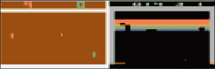
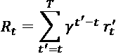
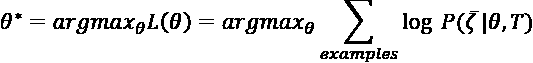
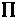
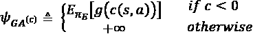

# 12

# 用生成式人工智能玩视频游戏：GAIL

在之前的章节中，我们已经看到如何使用生成式人工智能来生成简单的（受限玻尔兹曼机器）和复杂的（变分自动编码器，生成式对抗模型）图像，音符（MuseGAN）和新颖文本（BERT，GPT-3）。

在所有先前的示例中，我们着重于使用深度神经网络生成复杂数据。然而，神经网络也可以用于学习实体（如视频游戏角色或车辆）如何响应环境以优化奖励的*规则*；正如我们将在本章描述的那样，这个领域被称为**强化学习**（**RL**）。虽然 RL 并不是与深度学习或生成式人工智能有内在联系，但这些领域的结合已经创造出了一套优化复杂行为函数的强大技术。

在本章中，我们将向您展示如何将 GANs 应用于学习不同角色在 OpenAI 模拟环境中导航的最佳策略。为了理解这些方法与 RL 传统方法的强大组合，我们将首先回顾 RL 要解决的更一般问题：如何确定给定 *状态* 的实体的正确 *动作*，产生一个新的 *状态* 和一个 *奖励*。优化这些奖励的规则称为 *策略*。我们将讨论以下主题：

+   深度神经网络如何用于学习高维数据（如 Atari 视频游戏的原始像素）的复杂策略。

+   **逆强化学习**（**IRL**）的问题 – 如何从观察“专家”智能体给出的策略示例中学习奖励函数 – 这种算法因此也被称为*模仿学习*，我们将更详细地描述。

+   我们如何使用 GAN 训练函数来区分专家和非专家行为（就像我们在以前的示例中区分模拟数据和自然数据）来优化奖励函数。

# 强化学习：动作，智能体，空间，策略和奖励

从 *第一章* 《生成式人工智能导论：“从模型中“绘制”数据》》中回忆起，多数*判别式人工智能*示例都涉及将连续或离散标签应用于一条数据。在本书中我们讨论的图像示例中，这可以是应用深度神经网络来确定 MNIST 图像代表的数字，或者 CIFAR-10 图像是否包含一匹马。在这些情况下，模型产生了一个单一输出，一个最小误差的预测。在强化学习中，我们也希望进行这种点预测，但要经过多个步骤，并且在重复使用中优化总误差。



图 12.1：Atari 视频游戏示例¹

以一个具体的例子来说明，考虑一个玩家控制太空船击落外星飞船的视频游戏。在这个例子中，玩家操纵的太空船是*代理*；游戏中任意时间点屏幕上的像素集合就是*状态*。基于这个环境，玩家需要做出正确的*动作*（例如向右移动，按下开火），这将最大化*奖励* – 这里确实是游戏的得分。我们不只需要考虑接下来的即时动作，而是所有动作直到游戏结束，因为只要我们不用完生命值，我们就可以累积额外的分数。专业的视频游戏玩家学会如何在不同情况下做出反应，一个*策略*，用以面对游戏过程中不同的情况。RL 的问题是确定一个机器学习算法，能够通过接收一组输入（游戏的当前状态）并输出最优动作来增加胜率，来复制这样一个人类专家的行为。

要使用数学符号正式描述这一情况，我们可以将*环境*，比如视频游戏，在其中代理作为  来表示，这个代理在每个时间点输出一组数据（像素）作为*状态* *x*[t]。在游戏的每个时间点，玩家（算法）从*动作*集合中选择 *a*[t]，该集合包括*n*个动作 *A* = {1, 2, …. *N*}；这也被称为“动作集”或“动作空间”。虽然为了清晰起见，我们在本章中限制了对离散动作空间的讨论，但理论上并没有这样的限制，这个理论同样适用于连续动作（尽管由此产生的 RL 问题会更加复杂，因为有无穷无尽的可能性）。对于这些动作中的每一个，代理会获得奖励 *r*[t]，这可能会改变游戏得分。

如果我们只考虑当前屏幕 *x*[t] 作为系统的“状态”，那么我们的决策只依赖于当前，并且 RL 问题就成为了**马尔可夫决策过程**（**MDP**），因为下一步动作的选择只依赖于即时可用的数据，而不依赖于历史（*图 12.2*）。然而，在上述给定的视频游戏例子中，仅仅考虑当前屏幕可能不足以确定最优动作，因为它只是*局部可观测* – 我们不知道敌方星际飞船是否已经移出屏幕（因此它可能会重新出现）。我们也不知道我们的飞船移动的方向，而不经过比较之前的例子我们就无法得知，这可能会影响我们是否需要改变方向。如果环境的当前状态包含了我们需要知道的游戏的所有信息 – 比如一场扑克游戏，所有玩家都展示自己的牌 – 那么我们就说这个环境是*完全可观测*的。²


图 12.2：马尔可夫决策过程（MDP）³。通过具有一定概率的行动（橙色圆圈）之间的状态（绿色圆圈）的转移（黑色箭头）得到奖励（橙色箭头）。

的确，人类的视频游戏玩家并不仅仅依赖游戏的当前状态来确定下一步该做什么；他们还依赖游戏之前的提示，比如敌人离开屏幕的时间点，以便预料它们再次出现。

类似地，我们的算法将受益于使用导致当前状态*s*={*x*[1]…，*x*[t];*a*[1]...*a*[t-1]}的一系列状态和行动作为当前决策的输入。换句话说，“状态”变成了以前状态和行动的这个序列，并且我们仍然可以使用为 MDP 开发的方法来解决这个 RL 问题。

在每个时间点，基于这个状态（历史），我们希望做出决定，以最大化游戏结束时的*未来奖励* *R*。直觉上，我们通常更擅长估计我们即将采取的行动的结果，而不是它们对未来的长期影响，因此我们需要使用一个*贴现*项，，在计算预期奖励时对近期和长期采取行动的影响进行估计：



这里，*t'*是当前时间点*t*和游戏结束*T*之间的时间点。我们可以看到基于的值，未来奖励函数有三种潜在的解释：

+   . 未来的奖励对我们的决策没有影响，我们只关心当前的奖励。

+   . 随着*t'*和*t*之间的距离增加，这个乘法因子的指数会变得更大，贴现项变得更小，将未来奖励缩小到无限远处为 0。在这种情况下，我们更加重视近期目标而不是远期目标。

+   . 在这种情况下，我们的环境可能是确定性的，因此我们不需要贴现未来的奖励，因为结果没有不确定性，但即使在随机环境中，使用或可以看作是在奖励计算之间进行正则化的选择（或者选择不进行正则化）。当贴现因子<1 时，该算法受到（潜在稀疏的）长期数据的影响较小，因此可以帮助解决行动空间非常大且在没有进行贴现的情况下训练很多未来步骤可能导致在该空间中单个路径上过拟合的情况。

我们在这里描述的 RL 问题的目标是学习一个*值函数*Q，它在给定一个序列和一个*策略*的情况下最大化奖励-将这写成"Q"函数的约定来自于这个函数评估 RL 算法做出的决策的“质量”。


换句话说，给定一个状态（或者，在我们的情况下，一系列状态）和一个提议的动作，Q 函数根据最大的总未来奖励 R 对提议的动作进行评分。这个 Q 函数通常是未知的，我们需要解决它 - 然而，最优的 Q 函数遵循一条基于*动态规划*的重要规则，称为*最优性原则*：

> “最优策略具有这样的性质：无论初始状态和初始决策是什么，剩余的决策必须构成一个对于第一个决策产生的状态而言的最优策略。”⁶

换句话说，无论起始状态如何，一旦我们由于第一个动作而转移到新状态，所有后续动作都必须在最优策略下是最优的。如果我们将这个原则以数学形式写出，它将值函数分成两部分，形成一个递归表达式，称为*贝尔曼方程*：


其中 *Q** 是“最优”的 Q 函数，*E* 是期望值，而  是从中采样未来状态 *s'* 的环境。这个表达式表示最优的 Q 函数应该给出当前序列和提议动作的期望值，作为当前奖励 *r* 和下一系列动作的折现未来值 *Q**(*s'*, *a'*) 之和的期望值。这个表达式也被称为函数表达式，因为解决方案是函数 *Q**，因此这个一般类问题称为“Q 学习”。⁷ 在 Q 学习中解决 *Q** 的一种方法是通过*值迭代*：


其中  是一个*学习速率*，决定了如何快速地根据新信息修改函数。如果我们对足够大的*i*和*s*运行此更新，我们可以收敛到*Q*的最优值，*Q**。 ^(8, 9) 对于简单问题，我们只有少量的动作和状态，我们可以创建一个表格，给出任何潜在动作的*Q*值。该表中的条目对于每个*Q*(*s*, *a*)都是随机初始化的，并使用值迭代公式进行更新：

| 状态/动作 | A1 | A2 | A3 | A4 |
| --- | --- | --- | --- | --- |
| S1 | Q(S1, A1) |  |  |  |
| S2 |  |  |  |  |
| S3 |  |  |  |  |

表 12.1：Q 学习的查找表。每个单元格包含特定状态（S）和动作（A）对的 Q 值。值是随机初始化的，并使用值迭代进行更新。

然而，正如之前的作者所指出的¹，对于我们所描述的视频游戏场景这样的问题，几乎不可能枚举所有潜在的序列和动作。此外，由于任何特定序列-动作对的可能性非常低，我们需要采样大量示例才能准确地估计使用值迭代来估计 *Q* 值。

为了使这个问题更具有计算可行性，我们需要将 *Q* 从查找表转变为一个可以对它没有见过的状态-动作对的值进行推广估计的函数。为了做到这一点， *Q* 可以用一些参数  表示：该函数可以是线性的，树模型的，或者在现代应用程序中甚至是我们在本书的其他部分中学习的深度神经网络。在这种情况下，我们的目标更像是一个经典的学习算法，我们尝试最小化:


使用 

而 *p* 是代理在环境中执行的潜在非常大空间的行动和序列的分布 。由于 L 是可微分的，我们可以像 *第三章* 中讨论过的深度学习算法一样使用随机梯度下降来优化它:


通过固定参数并优化 *L*，然后从 *p* 和 *s* 构建新的样本，我们得到了一个类似于上面给出的值迭代 Q-学习的迭代更新算法。¹⁰

这种方法在 RL 方法的层次结构中属于哪个位置？一般来说，RL 方法根据以下几点进行分类：

+   是否使用静态（离线）数据集，还是持续交付给系统的新数据进行训练（在线）。¹¹

+   策略函数是否使用 *Q* 进行更新（on-policy）或独立更新（off-policy）。¹²

+   过渡方程是否明确建模（基于模型）或不是（无模型）。¹²

在所有可能的 RL 算法变体中，上面描述的 Q-学习版本被分类为*off-policy*, *online, and model-free*。虽然我们可以使用 *Q* 的值作为选择下一个行动的策略，我们从 *p*(*]*) 的样本不需要遵循这个策略。

在实践中，一个 epsilon-贪婪分布通常用于想要为算法引入一些随机性以防止其陷入局部最小值的问题，比如深度 Q-学习（稍后介绍），它选择“贪婪”（最大化 Q）的行动概率为 *e*，以及随机行动概率为 *1-e*。因此，我们正在学习的策略（Q）不严格用于选择具有这种随机性的行动（a）。这种方法是无模型的，因为神经网络近似了过渡模型，并且是在线的，因为它是在动态生成的数据集上学习的，尽管也可以使用静态离线视频游戏会话历史进行训练。

相比之下，在*on-policy*的 Q 学习算法中，比如**状态-动作-奖励-状态-动作**（**SARSA**）¹³，我们使用直接更新 Q 函数的方法，就像上面描述的值迭代步骤那样。与离策略示例不同，我们不是根据从分布*p*（有时称为*行为策略*）生成的样本或探索性选择的动作来计算最优*Q*；相反，我们是根据策略选择动作，并可能在学习 Q 的过程中更新该策略。

## 深度 Q 学习

尽管深度学习领域独立于强化学习方法，如 Q 学习算法，但这两种方法的强大组合被应用于训练算法以接近人类水平地玩街机游戏。¹ 在这项研究中的一个重要见解是将深度神经网络应用于从视频游戏的原始像素生成向量表示，而不是试图显式地表示游戏状态的一些特征；这个神经网络是这个 RL 算法的 Q 函数。

另一个关键的发展是一种称为*经验回放*的技术，其中状态的历史（在这里，是游戏中的视频帧像素）、行动和奖励被存储在一个固定长度的列表中，并且反复随机重新采样，通过使用上述的ε-贪心方法来以一定的随机可能性选择一个非最优结果。结果是，对于相同数据的许多样本，值函数的更新被平均化，并且连续样本之间的相关性（可能使算法仅探索解空间的有限集合）被打破。此外，这种“深度”Q 学习算法是*离策略*实现的，以避免使用联合优化策略函数生成最优样本的潜在循环反馈。

深度 Q 学习也是*无模型*的，即我们没有环境*E*的表示或模型（比如一个可以模拟游戏新帧的生成模型）。事实上，就像视频游戏的例子一样，它可能只是表示被玩家观察到的游戏的“内部状态”的历史数据样本。

将这些部分组合在一起，深度 Q 学习算法使用以下步骤来学习玩 Atari 游戏¹⁴：

1.  创建一个列表，以存储（当前状态、动作、奖励、下一个状态）的样本作为“回放内存”。

1.  随机初始化表示 Q 函数的神经网络中的权重。

1.  对于一定数量的游戏序列，初始化一个起始游戏屏幕（像素）和对这个输入的转换（比如最后四个屏幕）。这个固定长度历史的“窗口”很重要，因为否则 Q 网络将需要容纳任意大小的输入（非常长或非常短的游戏屏幕序列），这个限制使得将卷积神经网络应用于这个问题变得更容易。

1.  对于游戏中的一定步骤（屏幕），使用ε-greedy 采样来选择给定当前屏幕和通过 Q 计算的奖励函数的下一个动作。

1.  更新状态后，将这个转换（当前状态，动作，奖励，动作，下一个状态）保存到重播记忆中。

1.  从重播记忆中随机选择一组（当前状态，动作，奖励，下一个状态）的转换，并使用 Q 函数计算它们的奖励。使用随机梯度下降来基于这些转换更新 Q。

1.  对许多游戏和游戏步骤继续*步骤 3-6*，直到 Q 网络中的权重收敛。

虽然 Q-learning 的其他应用与其特定领域有关，但是使用深度神经网络来近似大量可能结果的 Q 函数的一般方法（而不是可以在表中表示的一小部分状态和动作）在许多情况下都被证明是有效的。其他应用深度 Q-learning 的例子包括：

+   使用 CNN 处理围棋（一种类似于国际象棋的东亚游戏）游戏板上的位置，并应用 Q-learning 来确定游戏中基于人类玩家的历史例子的下一个最佳移动；2015 年发布了名为“AlphaGo”的模型。¹⁵

+   对 2017 年 AlphaGo 发布的创新，命名为“AlphaGo Zero”，该程序完全是从合成游戏（两个 RL 代理相互对弈）中学习，而不是从人类玩家的历史示例中学习。¹⁶

+   AlphaGo Zero 的更一般形式“AlphaZero”，也使用自我对弈掌握了国际象棋和将棋。¹⁷

+   AlphaStar 是一种 RL 算法，可以在多人实时战略游戏星际争霸中击败人类大师。¹⁸

+   一个名为“AlphaFold”的模型，可以根据其 2D 序列预测蛋白质的 3D 结构 - 我们将在*第十三章*，*生成 AI 的新兴应用*中更详细地描述 AlphaFold。

我们迄今为止描述了 Q-learning 及其变体，以及如何通过深度学习增强 Q-learning 以应对复杂的环境和数据集。然而，我们描述的问题都共享一个共同特征，即我们能够用定义明确的数学术语表达奖励函数（例如游戏中的得分）。在许多现实场景中 - 例如训练 RL 代理驾驶汽车 - 这个奖励函数并不容易定义。在这些情况下，我们可能不是编写奖励函数，而是使用人类驾驶员的示例作为奖励的隐式表示 - 这是一种称为逆强化学习的方法，我们将在下面更详细地描述。

## 逆强化学习：从专家中学习

上面的深度 Q 学习示例依赖于一个明确的奖励函数——游戏中的分数。然而，我们并不总是能够访问明确的奖励函数，包括在重要的现实场景中，比如自动驾驶汽车。在驾驶员根据道路上的环境选择导航的情况下，我们会给予什么“奖励”值呢？虽然我们对“正确”决定有直观的感觉，但为这样的奖励函数量化详尽的规则将是具有挑战性的。

我们可以不必尝试确定奖励函数，而是观察专业驾驶员执行复杂的操作，比如在多车道交通中合并，并优化一个行为模仿专家的代理。这是一个更一般的问题，被称为*模仿学习*。模仿学习的一种形式是*行为克隆*，¹⁹它遵循以下算法：

1.  从专家行为中收集一组状态、动作对！[](img/B16176_12_066.png)。

1.  学习一个策略函数！[](img/B16176_12_021.png)，其中是一种监督分类算法。

虽然这种方法很直接，但需要大量数据才能创建一个能够推广到未知环境的分类器，特别是当潜在环境的数量很大时（例如自动驾驶汽车的情况）。²⁰

特别是，行为克隆的成功取决于未来环境的分布与训练数据的相似性，当模型的结果能够影响后续观察结果的分布时，这一点尤其困难。例如，自动驾驶汽车在道路上的选择成为重新训练模型的进一步数据，导致潜在的复合错误和数据漂移的反馈循环。²¹

另一种方法是学习一个代理，试图匹配专家的*整个轨迹*的结果，而不是单个动作，就像行为克隆中一样。然后，该算法的输出是一个在轨迹上将"专家行为"评分高于新手行为的函数。这种方法被称为**逆强化学习**（**IRL**），因为它颠倒了常见的模式（*图 12.3*）-在左侧，我们看到了一个典型的反馈循环，如我们为 Atari 玩深度 Q 网络描述的那样，其中一个代理（蓝色）观察到一个状态（*s*）并使用奖励函数（*R*）选择一个动作（*a*）产生一个转移（*T*）到一个新状态和一个奖励（*r*）。相比之下，在右侧，从这些状态、动作和转移中产生的奖励隐含地由来自专家（*E*）的例子表示，代理（蓝色）学习复制这个序列通过一个学习到的奖励函数（*R*[E]），而不是显式地"在算法的循环中"。换句话说，我们不是从显式奖励函数中学习策略，而是观察专家的行为并推断出一个会导致他们观察到的动作的奖励函数。


图 12.3：强化学习（a）和逆强化学习（b）²²

如何通过从头开始学习奖励函数来量化"专家"的行为呢？如果我们重新审视我们之前的视频游戏示例，我们可以检查专家人类游戏的像素屏幕 *x* 和动作 *a*（*x*[1]，*a*[1]，*x*[2]，*a*[2]...）序列，这些序列构成了一个完整的会话，并尝试找到一个函数 *f*，该函数会为给定的游戏给出总奖励：


然后，我们可以询问给定的函数 *f* 是否倾向于复制专家玩家的行为，而不是其他替代方案。然而，存在固有的问题-多个 *f* 可能会给出相同的奖励结果，使得不清楚哪一个（可能性很多）最能泛化到新数据。²³

或者，我们可以尝试优化一个代理，使其产生的观察轨迹与专家的概率相同；换句话说，我们从跟随该代理产生的序列中看到的分布与从专家行为中随机抽取的序列相同，而优化算法基于最小化提出的和从专家处观察到的序列的经验分布之间的差异。²⁴ 这个预期分布（无论是观察到的还是由代理生成的）可以用以下方式表示：


这里*P*是轨迹()的概率，*f*是状态的特征，例如视频游戏示例中的观察像素。我们已经解决了解决模糊奖励函数的问题，但我们仍然面临着许多代理可能导致相同行为的可能性。我们甚至可能需要混合不同的策略或奖励函数来模拟给定的专家行为，并且目前尚不清楚如何选择这些。


图 12.4：来自（非）确定性 MDP 的路径轨迹。(*b*)是确定性 MDP(a)的特定路径(轨迹)，而(*d*)是来自非确定性 MDP(c)的样本路径，其中对于状态动作*a*[4]可能导致的情况存在歧义。(23)

当研究受限玻尔兹曼机时，我们可以引用我们在*第四章*，*教网络生成数字*中看到的分区函数和玻尔兹曼分布。如果我们将由 RL 代理表示的 MDP 并“展开”沿着对一组状态作出反应的一组特定动作的轨迹，我们将得到一组树形图中的变长路径，如*图 12.4*所示。

通过遵循不同策略，可以获得对这些路径发生的不同分布，即使具有相同的像素特征分布，某些策略可能也会根据特定的奖励函数更喜欢一条路径而不是另一条路径。为了解决这种歧义，我们可以优化具有参数的奖励函数，以使基于这些特征的相同奖励函数值的路径获得相同的偏好，但我们指数地偏爱更高的奖励：


这种方法被称为*最大熵*;从*第四章*，*教网络生成数字*中回忆，*Z*是分区函数，将*P*归一化为关于由线性奖励函数评估的步骤*s*[j]组成的平均轨迹*f*的概率密度。(25)即使在非确定性结果(*图 12.4*，(*b*)和(*d*))的情况下，这也可能是可能的，例如，在计算机随机生成敌方太空船行为的视频游戏中，我们可以将此方程参数化为过渡分布*T*的条件。(23)


这里，分布与以前相似，但我们增加了基于行动*a*和状态*s*使用过渡模型*T*观察结果*o*的概率*P*[T]。  表示指示函数，当 时评估为 1，否则为 0。然后，我们可以优化此方程以找到最大化此函数概率的奖励函数参数：



此似然的梯度仅是期望的特征计数（例如，像素分布）来自专家游戏和通过遵循提出的代理人获得的特征计数之间的差异，根据访问给定状态*D*的频率：


这给了我们一个优化的目标，但是我们可以选择使用什么样的*P*。 我们将研究的是*最大因果熵*，在其中给定行动的概率（因此，状态和路径分布）条件于先前的状态和行动集，就像我们先前的视频游戏示例中一样^(26 27)：


因为如果路径永远不终止，这个熵值可能是无限的，所以我们可以应用一个折现因子使其有限²⁶：


其中折现因子*B*应用于每个时间步*t*，期望值为初始状态*P*[0]的分布和随后状态*P*的分布，受到策略的影响；表示因果熵；而是因果条件概率= （在序列中先前行动的条件概率）。

因此，在这一点上，我们有一个优化目标（折现因果熵），以及计算为特定代理人制定奖励函数的概念，使其行为类似于专家。 这个目标与生成式人工智能有什么联系呢？ 答案在于我们如何在*区分*专家和学习者之间进行类比，并从学习者中生成样本——与我们在*第 6*、*第 7*和*第 8*章中研究过的 GAN 类似！

## 对抗学习和模仿

给定一组专家观察（驾驶员或冠军电子游戏玩家），我们希望找到一个奖励函数，为与专家行为匹配的代理人分配高奖励，并为不匹配的代理人分配低奖励。 同时，我们希望在此奖励函数下选择这样一个代理人的策略，，使其尽可能地信息丰富，通过最大化熵和偏好专家而不是非专家的选择。 我们将展示如何通过一种名为**生成对抗性模仿学习**（**GAIL**）的算法在 2016 年发表的方法来实现这两点。²⁰

在接下来的内容中，我们使用“成本”函数而不是“奖励”函数来匹配此主题的参考文献中使用的约定，但它只是奖励函数的负值。

将这些约束放在一起，我们得到²⁰：


在内部项中，我们试图找到一种最大化折现熵的策略：


因此导致一个大的负值，并最小化成本项。我们希望通过选择一个不仅满足内部约束而且提供低成本专家样式行为的成本函数来最大化不同潜在成本函数的整体表达式。请注意，该内部项也等价于一个寻求其行为优化目标的 RL 问题：


在可能策略空间上  上，记为 。然而，为了限制 *c* 的可能选择空间，我们应用一个正则化函数 ，它在许多可能选择中寻找低复杂度的 *c*，并将此约束添加到整体目标中：


我们可以看到我们可以在给定策略（IRL）下交替优化 *c*，并在该 *c* 下优化策略（RL） - 这正是我们将要采取的方法。我们可以用前面描述的方法表达最优策略，作为对在该策略下不同状态的 **占用度** () 的度量：


然后，RL 和 IRL 问题的最优点等价于最小化学习和专家占用之间的差异：


其中  表示函数合成，，这里表示 RL 代理将 IRL 输出作为其参数之一。然而，我们收到的专家行为示例通常是有限的，因此我们不希望完全模仿它们的分布，因为那可能导致代理过度拟合。相反，我们希望使用距离度量，例如我们在 *第六章* 中看到的 KL 散度或 JS 散度，来量化观察到的专家行为分布与试图近似该行为的 IRL 代理采取的动作分布之间的差异：


在这个算法中应该使用什么样的正则化函数，？GAIL 算法的作者提出了一个函数，如果成本低则分配低惩罚，反之则分配高惩罚。在论文《生成对抗模仿学习》中给出了满足此属性的正则化函数的完整推导：

 其中 

这个函数的直观解释是，它最小化了策略 *H* 的因果熵与惩罚项 （例如，学习策略的可能性）之间的差异，以及专家和学习策略状态的占用差异 ：


这个  或  可以写成一个二元分类器的负对数损失，用于区分专家（0）和学习（1）的行动状态对：


这个表达式可能看起来非常熟悉，因为它类似于 *第六章* *使用 GAN 生成图像* 的目标函数，也用于区分生成和真实数据！将这些术语组合在一起（正则化器和因果熵），我们可以看到完整的目标函数是：


要优化这个目标函数，GAIL 算法利用以下步骤：

1.  准备一组专家轨迹并随机初始化鉴别器和策略参数。

1.  为 RL 代理生成一组轨迹。

1.  使用随机梯度下降步骤更新鉴别器参数。

1.  使用 2015 年发布的名为**Trust Region Policy Optimization**（**TRPO**）的算法，使用基于梯度的更新来更新策略参数 - 请参阅原始文章"Trust Region Policy Optimization"了解有关此梯度更新形式的更多详细信息。²⁸

1.  重复算法的 *步骤 2-4* 直到策略和鉴别器参数的值收敛。

现在我们已经解释了使用生成式 AI 进行强化学习的直觉，让我们深入到在虚拟环境中训练步行人形的一个实际示例中。

# 在 PyBullet Gym 上运行 GAIL

在本章的代码示例中，我们将训练一个虚拟代理在一个模拟环境中导航 - 在许多 RL 论文中，这个环境是使用 Mujoco 框架 ([`www.mujoco.org/`](http://www.mujoco.org/)) 进行模拟的。**Mujoco** 代表 **Multi joint dynamics with contacts** - 这是一个物理“引擎”，可以让您创建一个人工代理（如摆锤或双足人形），其中“奖励”可能是通过模拟环境移动的能力。

尽管它是用于开发强化学习基准的流行框架，例如由研究小组 OpenAI 使用（请参阅[`github.com/openai/baselines`](https://github.com/openai/baselines)以了解其中一些实现），但它也是闭源的，并且需要许可证才能使用。对于我们的实验，我们将使用 PyBullet Gymperium ([`github.com/benelot/pybullet-gym`](https://github.com/benelot/pybullet-gym))，这是一个用于模拟 Mujoco 环境中的代理的物理模拟器和导入代理的替代品。


图 12.5: 来自 Mujoco 模拟环境的示例（http://www.mujoco.org/）

要安装 Pybullet-Gym，您需要先安装 OpenAI Gym，使用以下命令：

```py
git clone https://github.com/openai/gym.git 
cd gym 
pip install -e . 
```

然后安装 Pybullet：

```py
git clone https://github.com/benelot/pybullet-gym.git 
cd pybullet-gym 
pip install -e . 
```

为了展示这个模拟环境是如何工作的，让我们创建一个“hopper”，这是您可以使用库实例化的许多虚拟代理之一：

```py
import gym  
import pybulletgym  
env = gym.make('HopperMuJoCoEnv-v0')
env.render("human")
env.reset() 
```

如果命令执行正确，我们将看到以下输出，即给出行走者当前观察（11 维向量）的数组。


图 12.6：行走者的观察向量

对 `render("human")` 的调用将创建一个窗口，显示“蹦床”，这是一个简单的单脚人物，在模拟的 3D 环境中移动（*图 12.7*）：


图 12.7：PyGym 蹦床

我们可以运行几次原始的蹦床迭代，以了解其外观。在这个模拟中，我们最多进行 1,000 步，并使用弹出窗口进行可视化：

```py
env.reset() 
for t in range(1000):
    action = env.action_space.sample()
    _, _, done, _ = env.step(action)
    env.render("human")
    if done:
        break 
```

我们首先使用 `reset()` 清除环境。然后，在最多 1,000 个时间步长内，我们会对动作空间进行采样（例如，表示行走图形在虚拟环境中移动的 *x*、*y* 和 *z* 坐标）。然后，我们使用该动作获取更新的奖励和观察，并渲染结果，直到移动完成。

这个演示来自完全未经训练的蹦床。对于我们的 GAIL 实现，我们将需要一个已成功训练行走的蹦床，作为算法的“专家”轨迹样本。为此，我们将从 OpenAI 网站下载一组蹦床数据，网址为：

[`drive.google.com/drive/folders/1h3H4AY_ZBx08hz-Ct0Nxxus-V1melu1U`](https://drive.google.com/drive/folders/1h3H4AY_ZBx08hz-Ct0Nxxus-V1melu1U)

这些包含一组 NumPy 文件，例如`deterministic.trpo.Hopper.0.00.npz`，其中包含使用前面我们讨论过的 GAIL 算法中的 TRPO 算法训练的增强学习代理的数据样本。

如果我们加载这些数据，我们还可以使用 Pybullet 模拟器进行可视化，但这次我们将看到专家的步骤，而不是随机基线代理：

```py
import numpy as np
mujoco_hopper_np = np.load('deterministic.trpo.Hopper.0.00.npz')
for i_episode in range(20):
    observation = env.reset()
    episode = np.random.choice(mujoco_hopper_np['acs'].shape[0])
    for t in range(1000):
        env.render("human")
        action = mujoco_hopper_np = \
        np.load('deterministic.trpo.Hopper.0.00.npz')['acs'][episode][t]
        observation, reward, done, info = env.step(action)
        if done:
            print("Episode finished after {} timesteps".format(t+1))
            break
env.close() 
```

此代码加载了预先训练的蹦床，初始化了虚拟环境，并在其中最多进行 1,000 步，在这些步骤中，动作（蹦床的下一个移动）是使用蹦床的训练策略函数确定的，根据该动作更新环境状态（蹦床的位置）。注意，这里的策略函数是确定性的，导致在任何给定时间 *t* 的任何给定动作都会产生相同的结果。您现在可以看到蹦床迈出了许多步：


图 12.8：由 TRPO 训练的专家策略的蹦床移动

让我们更仔细地看一下我们加载的这个 NumPy 对象中有哪些数据。您会注意到，格式 `.npz` 是一组压缩文件的 gzip 存档。我们可以通过使用对象 `mujoco_hopper_np` 的 files 参数来查看这些存档的名称：

```py
print(mujoco_hopper_np.files) 
```

得到：

```py
['ep_rets', 'obs', 'rews', 'acs'] 
```

观察是 11 维对象，您可以通过查看 `obs` 的维度来验证：

```py
print(mujoco_hopper_np['obs'].shape) 
```

该数组有 1,500 个示例，每个 1,000 个时间步长，每个时间步长有 11 个表示不同物理量（铰链位置、扭矩等）的维度。蹦跶者任务的目标是尽可能快地向前移动，所以当代理学会向前移动时，奖励函数会更高。如果我们检查`acs`数据，我们会发现它有三个维度，对应于三维空间中的点。这是一个连续的动作空间，不同于我们之前讨论的离散示例。

```py
print(mujoco_hopper_np ['acs'].shape) 
```

`ep_rets`对应于在时间 t 执行动作的未来预测奖励，而奖励`rews`是奖励函数的输出。

## 代理：演员-评论家网络

要创建我们的 GAIL 实现，首先我们需要指定一个代理。（29）这是演员-评论家架构，由两个网络组成：一个学习观察结果的“值”（评论家），另一个（演员）基于观察结果进行动作采样。这些网络可以是独立的，也可以共享参数；对于我们的实验，我们让它们共享隐藏层和输入层，但有单独的输出层（*图 12.9*）。


图 12.9：演员-评论家架构

注意，本章 GAIL 实现的代码基于[`github.com/fangihsiao/GAIL-Tensorflow/blob/master/tf_gail.ipynb`](https://github.com/fangihsiao/GAIL-Tensorflow/blob/master/tf_gail.ipynb)。

下面我们定义`ActorCritic`类：

```py
import tensorflow_probability as tfp
import tensorflow as tf
tfd = tfp.distributions
class ActorCritic(tf.keras.Model):
    def __init__(self, name='actor_critic', dim_actions=3, num_layers=2, input_shape=(11), num_units=100, **kwargs):
        super().__init__(name=name, **kwargs)
        self._num_layers = num_layers
        self._num_units = num_units
        self._dim_actions = dim_actions
        self._layers = list()
        for n, l in enumerate(range(self._num_layers)):
            self._layers.append(tf.keras.layers.Dense(
                                          self._num_units,
                                          activation=tf.nn.relu))
            if n == 0:
                self._layers[-1].build(input_shape)
            else:
                self._layers[-1].build((num_units))
            self._layers.append(tf.keras.layers.BatchNormalization())
        self._value_output = tf.keras.layers.Dense(1,activation=None)
        self._value_output.build((num_units))
        self._action_output = tf.keras.layers.Dense(
                                          self._dim_actions,
                                          activation=tf.nn.tanh)
        self._action_output.build((num_units))
        self._action_dist_std = tf.Variable([1., 1, 1], 
                                            trainable=False)
        self._action_dist =  None
    def get_params(self):
        weights = []
        for layer in self.layers:
            weights += layer.trainable_weights
        return weights+\
            self._action_output.trainable_weights + \
            self._value_output.trainable_weights + \
            [self._action_dist_std]
    def call(self, inputs):
        x = self._layers0
        for layer in self._layers[1:self._num_layers]:
            x = layer(x)
        return self._value_output(x)
    def log_prob(self, x):
        return self._action_dist.log_prob(x)
    def sample(self, inputs, output='action'):
        x = self._layers0
        for layer in self._layers[1:self._num_layers]:
            x = layer(x)
        self._action_dist = tfd.Normal(self._action_output(x),
                                       [1,1,1])
        if output == 'action':
            return self._action_dist.sample()
        elif output == 'entropy':
            return tf.reduce_mean(self._action_dist.entropy())
        else:
            raise ValueError("unknown sample type: {}".format(output)) 
```

该类初始化一个接受输入状态和动作对并生成两个输出的网络-一个生成新动作（代表虚拟空间中蹦跶者的下一步移动的 3D 坐标）-演员-另一个生成值（表示蹦跶者在虚拟空间中移动的成功程度）-评论家。值输出是一个单一标量，随着蹦跶者运动质量的提高而增加，而动作是一个 3 单元向量，表示在 3D 空间中移动的每个坐标的均值和标准偏差。

因为我们的网络有多个输出，所以在设置输入层和初始化它们时需要小心。请注意，我们明确调用了两个输出层的`build`，而不是让它们在前向传递中自动实例化，因为这将导致模型编译错误。我们还实例化了一个变量`_action_dist_std`，包含动作维度的标准偏差，我们将在模型中用它来采样新坐标。我们还包括了`BatchNormalization`层，以防止我们网络中的梯度爆炸或消失。（29）

我们还需要能够返回模型中可训练的参数，以便进行梯度计算，使用`Actor-Critic`网络的`get_params`方法：

```py
 def get_params(self):
        weights = []
        for layer in self.layers:
            weights += layer.trainable_weights
        return weights+\
            self._action_output.trainable_weights + \
            self._value_output.trainable_weights + \
            [self._action_dist_std] 
```

在我们的前向传递中，我们计算了评论家的输出：

```py
 def call(self, inputs):
        x = self._layers0
        for layer in self._layers[1:self._num_layers]:
            x = layer(x)
        return self._value_output(x) 
```

为了从 Actor 中抽样新的动作（3D 移动），我们使用参数 `'action'` 运行样本函数 - 如果我们提供 `'entropy'` 替代，则返回动作分布的熵：

```py
def sample(self, inputs, output='action'):
        x = self._layers0
        for layer in self._layers[1:self._num_layers]:
            x = layer(x)
        self._action_dist = tfd.Normal(self._action_output(x), [1,1,1])

        if output == 'action':
            return self._action_dist.sample()
        elif output == 'entropy':
            return tf.reduce_mean(self._action_dist.entropy())
        else:
            raise ValueError("unknown sample type: {}".format(output)) 
```

最后，我们需要能够返回 PPO 网络中动作分布的对数概率（用于我们的损失函数），如下所述：

```py
 def log_prob(self, x):
        return self._action_dist.log_prob(x) 
```

我们的 IRL 代理 - 我们将使用 **Proximal Policy Optimization** (**PPO**) 策略更新，这是 2017 年发表的 TRPO 的改进²⁹ - 利用这个 Actor-Critic 网络作为“策略”函数。

```py
class PPO(tf.keras.Model):

    def __init__(self, name='ppo', dim_actions=3, num_layers=2, num_units=100, eps=0.2, v_coeff=0.5, ent_coeff=0.01, lr=3e-2, **kwargs):
        super().__init__(name=name, *kwargs)
        self._dim_actions = dim_actions
        self._num_layers = num_layers
        self._num_units = num_units
        self._eps = eps
        self._v_coeff = v_coeff
        self._ent_coeff = ent_coeff
        self._policy = ActorCritic(num_layers=self._num_layers, 
                                   num_units=self._num_units,
                                   dim_actions=self._dim_actions)
        self._new_policy = ActorCritic(num_layers=self._num_layers, 
                                       num_units=self._num_units,
                                       dim_actions=self._dim_actions)
        self._policy.compile(run_eagerly=True)
        self._new_policy.compile(run_eagerly=True)
        self._optimizer = tf.keras.optimizers.Adam(lr) 
```

这个类初始化一个神经网络（`_policy`）并为该网络的更新提供了一个占位符（`_new_policy`），以便在算法的每一步中，我们都可以参照其相对于上一策略的改进来更新新策略。

在 `train_policy` 循环内的损失函数使用梯度下降算法进行优化，其中梯度的大小被限制在一个固定范围内（“剪辑”），以便大梯度不会导致损失函数（和权重）在训练轮次之间发生 drastical 改变：

```py
def loss(self, actions, observations, advantages, returns):
        ratio = tf.exp(self._new_policy.log_prob(actions) - 
                       self._policy.log_prob(actions))
        surr = ratio * advantages
        actor_loss = tf.reduce_mean(
                tf.minimum(surr, tf.clip_by_value(ratio, 1 - self._eps,
                                    1 + self._eps) * advantages))
        critic_loss = tf.reduce_mean(tf.square(returns - self._new_policy.call(observations)))
        return -1*actor_loss - self._ent_coeff * \
    tf.reduce_mean(self._new_policy.sample(observations, 'entropy'))\
                         + self._v_coeff * critic_loss 
```

在这个损失函数中，我们首先取旧策略（Actor-Critic 网络的当前参数）与潜在更新（新策略）之间的比率 - 两者的对数概率差的指数给出了一个比率（这是观察到的动作在每个网络的动作分布下的概率）。如果新的提议网络是一个改进（其参数更好地适应了观察到的动作序列），比率大于 1。否则，建议的质量保持不变（比率为 1）或比当前的 Actor-Critic 参数更差（比率小于 1）。

我们将这个比率乘以“优势”，优势是回报（我们之前描述的 Q 函数）与 Actor-Critic 现有状态的当前值之间的差异。在这个 GAIL 实现中，我们通过广义优势估计²⁹来计算优势，它使用 Q 函数的指数平滑估计，其中 `gamma`（系数）和 `tau`（指数）控制了未来奖励估计在未来的衰减程度相对于没有未来信息（`tau` = 0）或未来数据与现在数据相比的重要性没有衰减（`tau` = 1）：

```py
def compute_gae(next_value, rewards, masks, values, gamma=0.99, tau=0.95):
    values = values + [next_value]
    gae = 0
    returns = []
    for step in reversed(range(len(rewards))):
        delta = rewards[step] + gamma * values[step + 1] * \ 
                    masks[step] - values[step]
        gae = delta + gamma * tau * masks[step] * gae
        returns.insert(0, gae + values[step])
    return returns 
```

上面的损失函数然后使用优势乘以`surr`（"替代"项），并计算两个值——第一个是演员损失，它将由优势给出的损失项约束在给定范围内，由`clip_by_value`函数表示。这可以防止新旧策略的概率比率的极端值（远小于 1 或大于 1）使损失函数不稳定。除此之外，我们还加上评论者的损失，评论者值与我们上面计算的优势函数之间的平方差。对演员和评论者函数以及行动概率分布的熵（它是否为位置子集分配高值，从而包含关于潜在行动分布的“信息”）进行加权求和，得到损失函数的总体策略质量作为目标。

请注意`actor_loss`乘以负 1（因为它是旧策略概率与新策略概率之间的比率——因此如果它改善了，它大于 1，但损失函数应该最小化，因此一个更大的负值）。同样，熵项如果更大，它含有更多信息，我们也要取它的负值，因为我们要最小化损失函数。评论者的损失越接近 0，它就变得更好，所以我们保留这个项为正。

要使用这个损失函数，我们定义了一个名为`train_policy`的自定义训练函数：

```py
def train_policy(self, actions, observations, advantages, returns):
    params = self._new_policy.get_params()
    with tf.GradientTape(watch_accessed_variables=False) as g:
        g.watch(params)
        def loss(actions, observations, advantages, returns):
            ...

        cost = loss(actions, observations, advantages, returns)
    grads = g.gradient(cost, params)
    grads = [grad if grad is not None else tf.zeros_like(var)
        for var, grad in zip(params, grads)]
    self._optimizer.apply_gradients(zip(grads, params),
        experimental_aggregate_gradients=False) 
```

我们使用`get_params()`函数提取 PPO 策略网络的可训练参数，使用`GradientTape`对它们进行“监视”，并使用上面的损失函数计算损失。此外，由于演员-评论者有两个输出（动作和值），只有一个输出（值）受到奖励更新的影响，我们可能会有不存在的梯度，所以我们用 0 替换任何空的梯度。

在我们上面描述的 GAIL 内循环的每一步中，我们还需要能够用深拷贝（创建一个具有相同值的新变量，而不是指向原始变量的指针）来替换旧策略为新策略：

```py
def update_policy(self):
    self._policy = copy.deepcopy(self._new_policy) 
```

最后，我们可以使用对演员-评论者策略网络的调用来获得价值（奖励）估计和采样新的行动：

```py
def get_action(self, x):
    return self._new_policy.sample(x, output='action')
def get_value(self, x):
    return self._new_policy.call(x) 
```

## 鉴别器

通过我们的 PPO 算法，我们有了需要教会表现得像一个专家的“代理人”。我们可以从我们以“生成器”形式下载的 TRPO 训练示例的弹跳者中抽样。

现在我们只需要一个鉴别器网络，它旨在区分专家行为和我们正在训练的代理者：

```py
class Discriminator(tf.keras.Model):

    def __init__(self, name='discriminator', dim_actions=3, num_layers=2, num_units=100, lr=3e-2, **kwargs):
        super().__init__(name=name, **kwargs)
        self._dim_actions = dim_actions
        self._num_layers = num_layers
        self._num_units = num_units
        self._layers = list()
        for l in range(self._num_layers):
            self._layers.append(tf.keras.layers.Dense(
                                          self._num_units,
                                          activation=tf.nn.relu))
            self._layers.append(tf.keras.layers.BatchNormalization())
        self._layers.append(tf.keras.layers.Dense(1,activation=None))
        self._optimizer = tf.keras.optimizers.Adam(lr) 
        return self._new_policy.call(x) 
```

就像演员-评论者一样，这是一个 3 层神经网络，层与层之间应用了`BatchNormalization`。它的单个输出指示输入的质量（就像演员-评论者的价值函数），当网络更像“专家”时，输出应该更低。请注意，为了使“奖励”输出与演员-评论者值输出的符号匹配，我们反转了鉴别器的符号，因为它对专家观察预测得更接近 0：

```py
def get_reward(self, x):
    return -1 *tf.squeeze(tf.math.log(tf.sigmoid(self.call(x)))) 
```

此转换应用于我们之前为 Actor-Critic 网络看到的相同 `call` 函数。

```py
 def call(self, x):
        for layer in self._layers:
            x = layer(x)
        return x 
```

## 训练和结果

训练网络时，我们应用一个损失函数，试图将专家（观察，动作）对分类为 0，并将代理（观察，动作）对分类为 1。当代理学会生成高质量的（观察，动作）对，类似于专家时，鉴别器将越来越难区分来自代理和专家的样本，并且也会将代理样本标记为 0：

```py
def loss(self, x):
    expert_out, policy_out = tf.sigmoid(tf.split(self.call(x), 
                               num_or_size_splits=2, axis=0))
    return (tf.nn.sigmoid_cross_entropy_with_logits(tf.ones_like(policy_out), policy_out) + tf.nn.sigmoid_cross_entropy_with_logits(tf.zeros_like(expert_out), expert_out)) 
```

与之前一样，我们通过 `get_params()` 提取网络的参数：

```py
 def get_params(self):
        weights = []
        for layer in self.layers:
            weights += layer.trainable_weights
        return weights 
```

然后我们使用 `train_discriminator` 将我们的损失函数应用于这些参数：

```py
def train_discriminator(self, x):
    params = self.get_params()
    with tf.GradientTape(watch_accessed_variables=False) as g:
        g.watch(params)
        cost = self.loss(x)
    grads = g.gradient(cost, params)
    grads = [grad if grad is not None else tf.zeros_like(var)
          for var, grad in zip(params, grads)]
    self._optimizer.apply_gradients(zip(grads, params),
        experimental_aggregate_gradients=False) 
```

最后，我们需要一个更新函数用于我们的 PPO 小批量步骤，在 GAIL 算法的每个内循环中从代理中随机采样观察：

```py
def ppo_iteration(mini_batch_size, observations, actions, returns, advantages):
    batch_size = observations.shape[0]
    for _ in range(batch_size // mini_batch_size):
        rand_ids = np.random.randint(0, batch_size, mini_batch_size)
        yield (observations[rand_ids, :], actions[rand_ids, :],
               returns[rand_ids, :], advantages[rand_ids, :]) 
```

我们还希望能够绘制我们训练代理的进展，为此，我们将使用模型从环境中取样，并绘制平均奖励和鉴别器的性能（代理和专家的鉴别器奖励匹配程度）：

```py
from IPython.display import clear_output
import matplotlib.pyplot as plt
def plot(frame_idx, rewards, policy_ob_ac_rew, expert_ob_ac_rew):
    clear_output(True)
    plt.figure(figsize=(20,5))
    plt.subplot(131)
    plt.title('frame %s. reward: %s' % (frame_idx, rewards[-1]))
    plt.ylabel('Agent Reward')
    plt.xlabel('Step in Training')
    plt.plot(rewards)
    plt.subplot(132)
    plt.title('frame %s.' % (frame_idx))
    plt.plot(policy_ob_ac_rew)
    plt.plot(expert_ob_ac_rew)
    plt.legend(['Agent','Expert'])
    plt.xlabel('Steps in Test Simulation')
    plt.ylabel('Discriminator Reward')
    plt.show() 
```

此函数生成两个图表，显示在*图 12.10*中。左侧是代理的一组测试观察的奖励，随着代理在移动跳跃器方面变得更好，奖励应该增加。右侧绘制了每个 n 步样本代理和专家跳跃器运动的鉴别器如何区分两者的情况（橙色和蓝色线是否重叠，这是最优的，或者彼此之间是否很远，这种情况下 GAIL 算法尚未收敛）：


图 12.10：一系列测试观察的代理奖励（左），鉴别器奖励（右）。图由 plot() 生成。

测试样本是使用 `test_env` 函数生成的，该函数类似于我们上面看到的 Pybullet 仿真 - 它使用当前代理并计算当前策略下仿真的 n 步，返回平均奖励：

```py
def test_env(model, vis=False):
    ob = env.reset()
    ob = tf.reshape(tf.convert_to_tensor(ob), (1,11))
    done = False
    total_reward = 0
    while not done:
        if vis:
            env.render()
        ac = model.get_action(ob)[0]
        ac = tf.reshape(tf.convert_to_tensor(ac), (3, 1))
        next_ob, reward, done, _ = env.step(ac)
        ob = next_ob
        ob = tf.reshape(tf.convert_to_tensor(ob), (1,11))
        total_reward += reward
    return total_reward 
```

对于我们的主函数，我们将设置最大仿真步数和算法的超参数，包括 ADAM 优化器的学习率 (`lr`)，每个网络隐藏层中的单位数，每个步数在代理中运行每个跳跃仿真的步数 (`num_steps`)，在每个代理更新中选择的样本数量（小批量大小），在每个内部循环更新代理时运行的步数 (`ppo_epochs`)，算法中的总最大步数 (`max_frames`)，以及一个容器来保存我们上面展示如何绘制的外样本奖励估计 (`test_rewards`)：

```py
ppo_hidden_size           = 32
discriminator_hidden_size = 32
lr                        = 3e-4
num_steps                 = 1000
mini_batch_size           = 50
ppo_epochs                = 5
max_frames = 100000000
frame_idx  = 0
test_rewards = [] 
```

首先，我们初始化鉴别器和 PPO 网络，设置内部循环计数器以进行代理更新 (`i_update`)，并设置 Pybullet 环境：

```py
ob = env.reset()
ppo = PPO(lr=lr, num_units=ppo_hidden_size)
discriminator = Discriminator(lr=lr, num_units=discriminator_hidden_size)
i_update = 0 
```

在每一步，我们将使用当前策略计算一定数量的时间步，并创建这些观察、动作和奖励的列表。在固定的间隔内，我们将使用我们上面描述的函数绘制结果：

```py
while frame_idx < max_frames:
    i_update += 1

    values = []
    obs = []
    acs = []
    rewards = []
    masks = []
    entropy = 0
    for _ in range(num_steps):
        ob = tf.reshape(tf.convert_to_tensor(ob), (1,11))
        ac = ppo.get_action(ob)
        ac = tf.reshape(tf.convert_to_tensor(ac), (3, 1))
        next_ob, _, done, _ = env.step(ac)
        reward = discriminator.get_reward(np.concatenate([ob, 
                     tf.transpose(ac)], axis=1))
        value = ppo.get_value(ob)
        values.append(value)
        rewards.append(reward)
        masks.append((1-done))
        obs.append(ob)
        acs.append(np.transpose(ac))
        ob = next_ob
        frame_idx += 1
        if frame_idx % 1000 == 0 and i_update > 1:
            test_reward = np.mean([test_env(ppo) for _ in range(10)])
            test_rewards.append(test_reward)
            plot(frame_idx, test_rewards, 
                 discriminator.get_reward(policy_ob_ac), 
                 discriminator.get_reward(expert_ob_ac))

    next_ob = tf.reshape(tf.convert_to_tensor(next_ob), (1,11))

    next_value = ppo.get_value(next_ob)
    returns = compute_gae(next_value, rewards, masks, values)
    returns = np.concatenate(returns)
    values = np.concatenate(values)
    obs = np.concatenate(obs)
    acs = np.concatenate(acs)
    advantages = returns - values 
```

请注意，如果我们的仿真被终止，我们会“屏蔽”完成后的任何观察，以便它们不影响我们的梯度计算。还要注意，我们正在使用 `tf.convert_to_tensor` 和 `tf.reshape` 函数将样本中的 NumPy 数据转换为张量。我们使用上述描述的 `compute_gae` 函数平滑估计的优势函数。

然后，我们周期性地（这里是每 3 个周期）使用小批量更新计算 PPO 策略的更新。

```py
 # Policy Update
    if i_update % 3 == 0:
        ppo.update_policy()
        for _ in range(ppo_epochs):
            for ob_batch, ac_batch, return_batch, adv_batch in ppo_iteration(mini_batch_size, obs, acs, returns, advantages):
                ppo.train_policy(ac_batch, ob_batch, adv_batch,                     return_batch) 
```

最后，我们从之前加载的 TRPO 策略中对专家轨迹进行采样，将专家和新策略的观察和动作连接起来，并对鉴别器进行梯度更新：

```py
 # Discriminator Update
    expert_samples = np.random.randint(0, mujoco_hopper_np['acs'].\
                                       shape[0], 1)
    expert_ob_ac = np.concatenate([
mujoco_hopper_np['obs'][expert_samples,:num_steps,:].reshape(num_steps,11), 
mujoco_hopper_np['acs'][expert_samples,:num_steps,:].reshape(num_steps,3)],1)
    policy_ob_ac = np.concatenate([obs, acs], 1)
    discriminator.train_discriminator(np.concatenate([expert_ob_ac, policy_ob_ac], axis=0)) 
```

请注意，您可以在算法运行时观察仿真窗口中的跳跃器正在训练 - 找到“奖励”的数学定义的难度表现在于，我们可以看到跳跃器进行创造性运动（例如爬行，*图 12.11*），以便在仿真空间中移动（从而获得奖励），但不像专家的“跳跃”动作。


图 12.11: GAIL 训练期间跳跃器“爬行”

# 摘要

在本章中，我们探讨了生成模型在强化学习中的另一个应用。首先，我们描述了强化学习如何允许我们学习环境中代理的行为，以及深度神经网络如何使 Q-learning 能够适用于具有极大观察和动作空间的复杂环境。

然后，我们讨论了逆强化学习，并且它通过“反转”问题并尝试“通过示例学习”与强化学习有所不同。我们讨论了如何使用熵来评分尝试与专家网络进行比较的问题，以及这种熵损失的特定、正则化版本如何与我们在*第六章*中学习的 GAN 问题具有类似的形式，称为 GAIL（生成对抗性模仿学习）。我们看到 GAIL 只是这个通用想法的许多可能表述之一，使用不同的损失函数。最后，我们使用 bullet-gym 物理模拟器和 OpenAI Gym 实现了 GAIL。

在最后一章，我们将通过探索生成式人工智能在不同问题领域的最新研究来总结，包括生物信息学和流体力学，为您继续探索这一发展领域提供进一步阅读的参考文献。

# 参考文献

1.  Mnih, V., Kavukcuoglu, K., Silver, D., Graves, A., Antonoglou, I., Wierstra, D., & Riedmiller, M. (2013). *使用深度强化学习玩雅达利*. arXiv. [`arxiv.org/abs/1312.5602`](https://arxiv.org/abs/1312.5602)

1.  Bareketain, P. (2019 年 3 月 10 日)。理解*用于深度多智能体强化学习的稳定经验重播*。Medium。[`medium.com/@parnianbrk/understanding-stabilising-experience-replay-for-deep-multi-agent-reinforcement-learning-84b4c04886b5`](https://medium.com/@parnianbrk/understanding-stabilising-experience-replay-for-deep-multi-agent-rein)

1.  维基百科用户 waldoalverez，采用 CC BY-SA 4.0 许可证（[`creativecommons.org/licenses/by-sa/4.0/`](https://creativecommons.org/licenses/by-sa/4.0/)）。

1.  Amit, R., Meir, R., & Ciosek, K. (2020)。*折扣因子作为强化学习的正则化器*。第 37 届国际机器学习大会论文集，维也纳，奥地利，PMLR 119，2020。[`proceedings.mlr.press/v119/amit20a/amit20a.pdf`](http://proceedings.mlr.press/v119/amit20a/amit20a.pdf)

1.  Matiisen, T. (2015 年 12 月 19 日)。*揭秘深度强化学习*。计算神经科学实验室。[`neuro.cs.ut.ee/demystifying-deep-reinforcement-learning/`](https://neuro.cs.ut.ee/demystifying-deep-reinforcement-learning/)

1.  Bellman, R.E. (2003 年)[1957]。*动态规划*。多佛。

1.  Watkins, C.J.C.H. (1989)。*从延迟奖励中学习*（PDF）（博士论文），剑桥大学，[`www.cs.rhul.ac.uk/~chrisw/new_thesis.pdf`](http://www.cs.rhul.ac.uk/~chrisw/new_thesis.pdf)

1.  Sutton, R., & Barto, A. (1998). *强化学习：一种介绍*。麻省理工学院出版社。

1.  Melo, F.S. *Q-learning 的收敛性：一个简单的证明*。[`users.isr.ist.utl.pt/~mtjspaan/readingGroup/ProofQlearning.pdf`](http://users.isr.ist.utl.pt/~mtjspaan/readingGroup/ProofQlearning.pdf)

1.  Watkins, C.J.C.H., & Dayan, P. (1992). *Q-learning*。机器学习，8(3-4)：279-292。

1.  Nair, A., Dalal, M., Gupta, A., & Levine, S. (2020)。*利用离线数据集加速在线强化学习*。arXiv。[`arxiv.org/abs/2006.09359`](https://arxiv.org/abs/2006.09359)

1.  Sutton, R.S. & Barto A.G. (2018)。*强化学习：一种介绍*（第 2 版）。麻省理工学院出版社。

1.  Rummery, G.A., & Niranjan, M. (1994)。*使用连接系统的在线 Q-learning*。剑桥大学工程系。

1.  Mnih, V., Kavukcuoglu, K., Silver, D., Graves, A., Antonoglou, I., Wierstra, D., & Riedmiller, M. (2013)。*使用深度强化学习玩 Atari*。arXiv。[`arxiv.org/abs/1312.5602`](https://arxiv.org/abs/1312.5602)

1.  Silver, D., Huang, A., Maddison, C.J., Guez, A., Sifre, L., van den Driessche, G., Schrittwieser, J., Antonoglou, I., Panneershelvam, V., Lanctot, M., Dieleman, S., Grewe, D., Nham, J., Kalchbrenner, N., Sutskever, I., Lillicrap, T., Leach, M., Kavukcuoglu, K., Graepel, T., & Hassabis, D. (2016). *用深度神经网络和树搜索掌握围棋游戏*。*自然* 529, 484–489。[`www.nature.com/articles/nature16961`](https://www.nature.com/articles/nature16961)

1.  Silver, D., Schrittwieser, J., Simonyan, K., Antonoglou, I., Huang, A., Guez, A., Hubert, T., Baker, L., Lai, M., Bolton, A., Chen, Y., Lillicrap, T., Hui, F., Sifre, L., van den Driessche, G., Graepel, T., & Hassabis, D. (2017). *无需人类知识的围棋掌握*。《自然》550, 354-359。[`www.nature.com/articles/nature24270`](https://www.nature.com/articles/nature24270)

1.  Silver, D., Hubert, T., Schrittwieser, J., Antonoglou, I., Lai, M., Guez, A., Lanctot, M., Sifre, L., Kumaran, D., Graepel, T., Lillicrap, T., Simonyan, K., & Hassabis, D. (2017). *通过自我对弈掌握国际象棋和将棋的通用强化学习算法*。arXiv。[`arxiv.org/abs/1712.01815`](https://arxiv.org/abs/1712.01815)

1.  Vinyals, O., Babuschkin, I., Silver. D. et al. (2019). *使用多智能体强化学习在星际争霸 II 中达到国际大师级*。《自然》575, 350-354。[`www.nature.com/articles/s41586-019-1724-z`](https://www.nature.com/articles/s41586-019-1724-z)

1.  Pomerleau, D.A. (1991). *自主导航的人工神经网络高效训练*。《神经计算》, 3(1):88-97。

1.  Ho, J., & Ermon, S. (2016). *生成对抗学习*。arXiv。[`arxiv.org/abs/1606.03476`](https://arxiv.org/abs/1606.03476)

1.  Ross, S., & Bagnell, J.A. (2010). *Imitation Learning 的高效约简*。《第十三届国际人工智能与统计学会议论文集》, PMLR 9:661-668

1.  基于 Arora, S., & Doshi, P. (2018). *逆强化学习概述：挑战、方法和进展*，arXiv 一图。[`arxiv.org/abs/1806.06877`](https://arxiv.org/abs/1806.06877)

1.  基于 Ziebart, B.D., Maas, A., Bagnell, J.A., & Dey, A.K. (2008). *最大熵逆强化学习*。《第二十三届 AAAI 人工智能会议论文集》。 

1.  Abbeel, P., & Ng, A. Y. (2004). *逆强化学习的学徒学习*。《ICML 会议录》, 1–8。

1.  Jaynes, E. T. (1957). *信息理论与统计力学*。《物理评论》106:620–630。

1.  M. Bloem and N. Bambos, *无限时间范围的最大因果熵逆强化学习*, 2014 年第 53 届 IEEE 决策与控制会议, pp. 4911-4916, doi: 10.1109/CDC.2014.7040156。[`citeseerx.ist.psu.edu/viewdoc/download?doi=10.1.1.720.5621&rep=rep1&type=pdf`](http://citeseerx.ist.psu.edu/viewdoc/download?doi=10.1.1.720.5621&rep=rep1&type=pdf)

1.  Kramer, G. (1998). *有反馈通道的信道的指向信息*。瑞士苏黎世联邦理工学院博士论文。[`citeseerx.ist.psu.edu/viewdoc/download;jsessionid=91AB2ACCC7B3CD1372C2BC2EA267ECEF?doi=10.1.1.728.3888&rep=rep1&type=pdf`](http://citeseerx.ist.psu.edu/viewdoc/download;jsessionid=91AB2ACCC7B3CD1372C2BC2EA267ECEF?doi=10.1.1)

1.  Schulman, J., Levine, S., Moritz, P., Jordan, M.I., & Abbeel, P. (2015). *信任区域策略优化*. arXiv. [`arxiv.org/abs/1502.05477`](https://arxiv.org/abs/1502.05477)

1.  Ioffe, S., & Szegedy, C. (2015). *批量归一化：通过减少内部协变量转移加速深度网络训练*. arXiv. [`arxiv.org/abs/1502.03167`](https://arxiv.org/abs/1502.03167)

1.  Schulman, J., Wolski, F., Dhariwal, P., Radford, A., & Klimov, O. (2017). *近端策略优化算法*. arXiv. [`arxiv.org/abs/1707.06347`](https://arxiv.org/abs/1707.06347)

1.  Schulman, J., Moritz, P., Levine, S., Jordan, M., & Abbeel, P. (2015). *使用广义优势估计进行高维连续控制*. arXiv. [`arxiv.org/abs/1506.02438`](https://arxiv.org/abs/1506.02438)
