# 第十三章：新兴的生成型人工智能应用

在前面的章节中，我们研究了使用生成型人工智能的大量应用，包括生成图片和文字，甚至音乐。然而，这是一个庞大且不断扩张的领域；在 Google 学术搜索中，与“生成对抗网络”匹配的论文数量为 27,200 篇，其中有 16,200 篇发表于 2020 年！对于一个从根本上始于 2014 年的领域来说，这是令人惊讶的指数增长，这也可以在 Google n-gram 查看器中得到体现（*图 13.1*）：

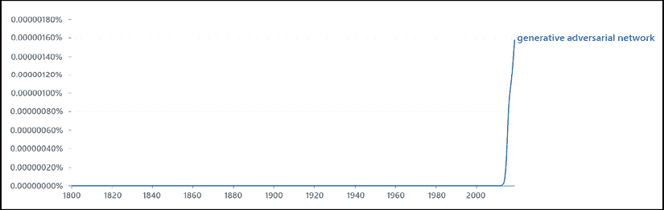

图 13.1：Google n-gram of "generative adversarial networks"

正如我们在本卷中看到的，生成对抗网络只是更广泛的生成型人工智能领域中一类模型，该领域还包括变分自动编码器、BERT 和 GPT-3 等模型。因为单个书籍无法覆盖所有这些领域，所以我们在这一卷中以讨论该领域中的一些新兴主题来结束本卷：药物发现和蛋白质折叠、求解数学方程、从图像生成视频，以及生成食谱。鼓励感兴趣的读者参考所引用的文献，以获得对每个主题的更详细讨论。

# 利用生成模型发现新药物

我们在本卷中未涉及的一个领域，即生成型人工智能正在对生物技术研究产生巨大影响。我们讨论两个领域：药物发现和预测蛋白质结构。

## 用生成分子图网络搜索化学空间

在根本上，一种药物——无论是药店里的阿司匹林还是医生开的抗生素——都是由节点（原子）和边（键）组成的*化学图*（*图 13.2*）。与用于文本数据的生成模型（*第 3、9 和 10 章*）一样，图形具有不固定长度的特殊属性。有许多方法可以对图进行编码，包括基于单个片段的数值代码的二进制表示法（*图 13.2*）以及"SMILES"字符串，它们是 3D 分子的线性表示法（*图 13.3*）。你可能会意识到，化学图中潜在特征的数量是非常庞大的；事实上，已经估计¹化学结构的潜在数量达到了 10⁶⁰，这甚至比生成模型的论文数量还要大；作为参考，可观测宇宙中分子的数量²约为 10⁷⁸。

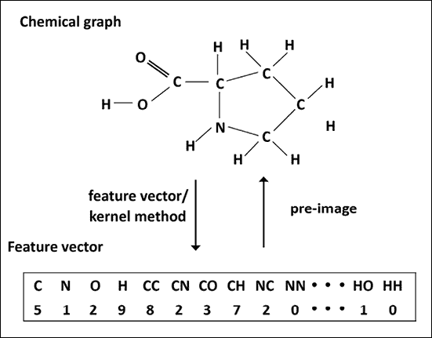

图 13.2：化学图³

人们因此可以理解，药物发现的一大挑战——为现有和新出现的疾病寻找新药物——是需要搜索潜在空间的规模之大。虽然实验性方法"药物筛选"——在高通量实验中测试成千上万甚至数十亿的化合物，以寻找具有潜在治疗特性的化学"稻草堆"中的化学针——已经被用了几十年，但是机器学习等计算方法的发展为规模更大的"虚拟筛选"打开了大门。使用现代计算方法，科学家可以测试完全虚拟化合物库，看它们是否具有与疾病研究中感兴趣的蛋白质相互作用的能力。那么，如何生成这样一个大型的虚拟分子库呢？

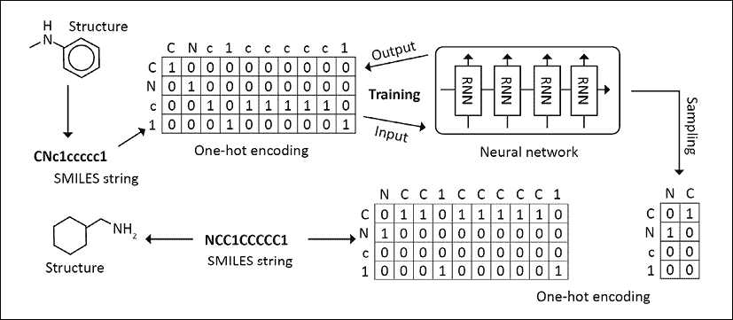

图 13.3：小分子的生成模型⁶

回到化学图的编码，也许不足为奇，我们可以使用基于递归神经网络（如 LSTM）的生成模型，从可能的分子图构型的巨大空间中采样。因为分子遵循特定的结构主题，这个问题比简单地独立采样原子集合更复杂，因为它们必须按照化学结构约束形成一个连贯的分子。*图 13.3*说明了这个过程可能是什么样子；将 2D 结构编码成二进制特征向量（有点类似我们在早期章节看到的文本表示），然后通过递归神经网络运行这些向量，训练一个根据先前的原子/键预测下一个原子或键的模型。一旦模型在输入数据上训练完成，它就可以被用来通过从这个生成器中一次次采样新结构来生成新的分子。变分自动编码器（*第五章*，*使用 VAE 画图*）也已经被用来生成分子⁴（*图 13.4*），同样生成对抗网络⁵（*图 13.5*），我们在*第六章*，*使用 GAN 生成图像*中介绍过。

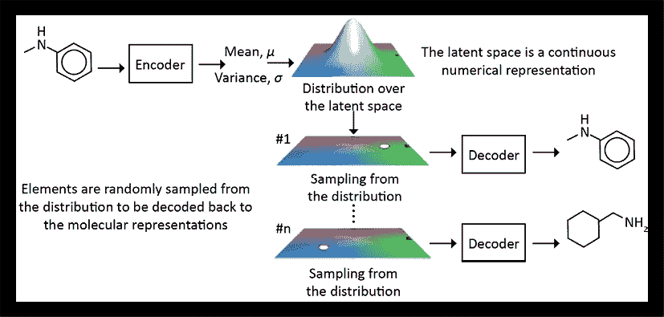

图 13.4：小分子的变分自动编码器⁶

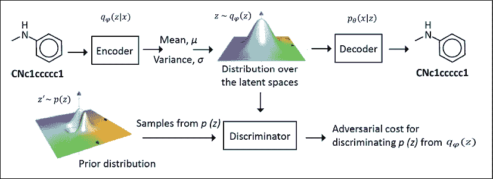

图 13.5：小分子的生成对抗模型⁶

## 使用生成模型折叠蛋白质

一旦我们从这样的模型得到了虚拟分子集合，下一个挑战是弄清楚它们当中是否有潜在成为药物的可能。科学家们通过"虚拟对接"进行测试，这需要测试一大库模拟分子，看它们是否适配在计算机中表示的蛋白质结构的口袋中。

分子动力学模拟用于近似评估潜在药物和可能影响体内疾病的蛋白质之间的能量吸引力/排斥力，其基于蛋白质和化学物质的相对化学结构。一个挑战是，在这些模拟中，药物“对接”到的蛋白质结构通常是通过 X 射线晶体学实验获得的，这是一种通过蛋白质结构衍射 X 射线以获得其三维形态表示的繁琐过程。

此外，这个过程仅适用于在液体悬浮液中稳定的一部分蛋白质，这排除了许多与疾病相关的分子，这些分子在细胞表面表达，在那里它们被细胞膜中的脂质粒子包围和稳定。

在这里，生成式人工智能也可以帮助：DeepMind（谷歌的研究子公司，也负责 AlphaGo 和其他突破性成果）的研究人员最近发布了一个名为**AlphaFold**的程序，它可以直接从蛋白质的遗传序列解决蛋白质的三维结构，使研究人员可以绕过实验晶体学的繁琐过程。*图 13.6* 说明了这是如何实现的：首先，一个网络被训练来从蛋白质的线性序列代码中预测蛋白质内的三维氨基酸（蛋白质的组成单位）之间的距离，表示折叠结构中各部分之间最可能的角度和距离：

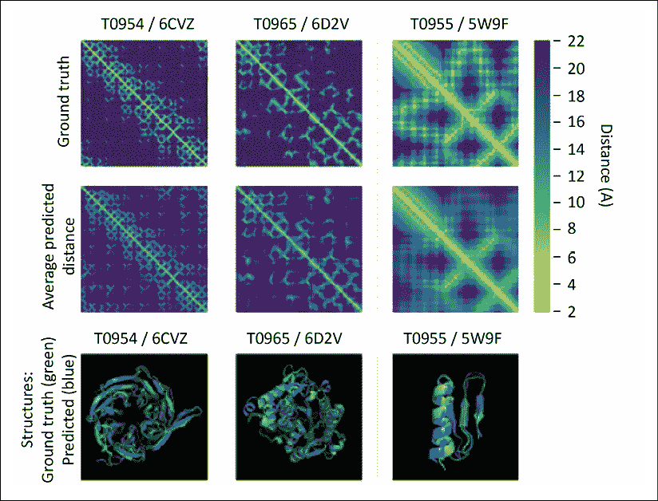

图 13.6：训练神经网络预测蛋白质序列中氨基酸之间的距离⁷

然后，对于没有结构的蛋白质，AlphaFold 使用生成模型提出新的蛋白质片段（*图 13.7*），并评分哪些片段具有形成稳定三维结构的高可能性：

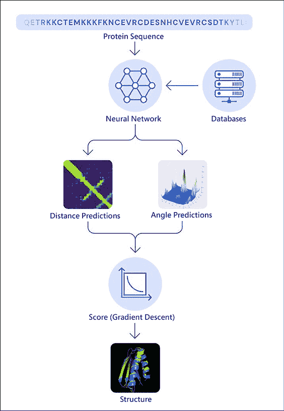

图 13.7：生成模型预测蛋白质构象⁷

这些示例展示了如何使用生成式人工智能在人体中模拟药物和其潜在靶点的结构，将现实世界中难以或不可能的实验转化为潜在发现新药物的新模型的大规模计算能力。

# 使用生成建模求解偏微分方程

另一个深度学习在一般领域以及生成学习在特定领域引领最新突破的领域是**偏微分方程**（**PDEs**），这是一种用于各种应用的数学模型，包括流体动力学、天气预测和理解物理系统行为。更正式地说，偏微分方程对函数的偏导数施加某些条件，问题是找到一个满足这个条件的函数。通常在函数上放置一些初始条件或边界条件，以限制在特定网格内的搜索空间。例如，考虑 Burger 方程⁸，它控制着诸如给定位置和时间的流体速度之类的现象（*图 13.8*）：

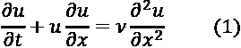

其中 *u* 是速度，*t* 是时间，*x* 是位置坐标，而 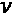 是流体的黏性（"油腻度"）。如果黏性为 0，则简化为*无黏*方程：

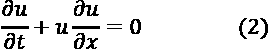

此方程的解取决于函数 *u* 的形式及其在 *t=0* 时的初始条件；例如，如果 *u* 是一个线性函数，则它有一个封闭的解析解（换句话说，可以仅使用数学公式的操作和变量替换来导出解，而无需使用数值方法来最小化误差函数，以选择潜在的解算法进行解析）。在大多数情况下，然而，需要数值方法，一个流行的方法是使用**有限元方法**（**FEMs**）将输出（*x*，*t*）划分为一个"网格"，并在每个网格内数值求解 *u*。这类似于使用一组"基础"函数，如余弦和正弦（傅立叶分析）或小波将复杂函数分解为更简单的基础函数的总和。¹⁰

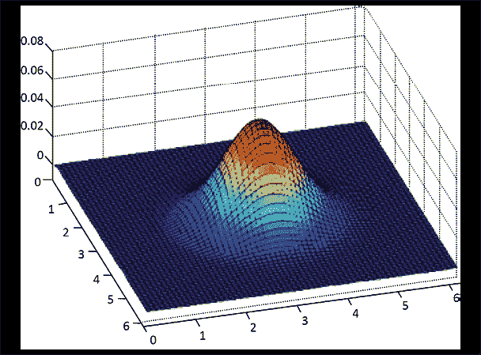

图 13.8：二维中 Burger 方程的可视化¹¹

然而，现在考虑我们所面临的问题：对于一组给定条件（边界条件），我们希望在网格上输出一个函数值，从而在空间和时间的每个点上创建一个函数值的热图，不完全像我们之前在生成应用中看到的图像！事实上，卷积生成模型已被用于将边界条件映射到输出网格（*图 13.9*）¹²：

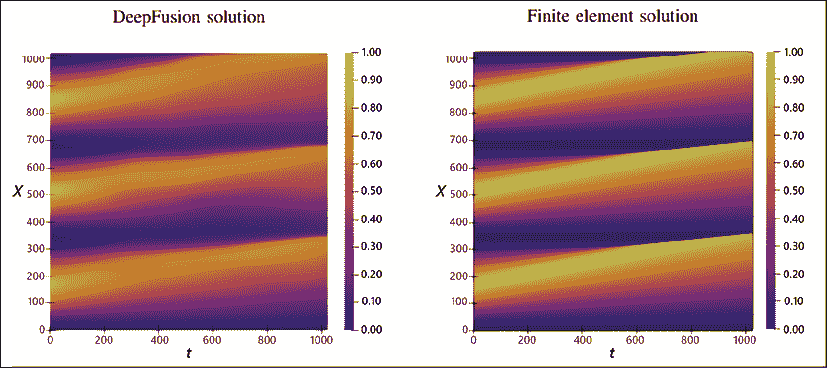

图 13.9：使用 FEM 方法解决 Burger 的无黏方程（右）和深度学习（左）¹²

如前所述，使用 FEM 的典型策略是在网格中对每个元素数值求解*u*，其中大部分的计算负担来自于重复计算解而不是检查解¹²；因此，生成式 AI 可以通过抽样大量可能的解（该集合受初始条件或每个变量的数值范围的限制）并检查它们是否满足 PDE 的条件，完全规避了需要在网格的每个元素中求解函数的需要。*图 13.10*显示了将一组边界条件（*b*）和粘度变量（*v*）输入到卷积网络中，然后生成 PDE 的解。

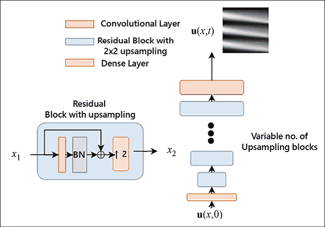

图 13.10：DiffNet 用于对 Burger 方程的潜在解进行抽样¹²

该示例中的网络称为**DiffNet**。其误差函数有两个项；一个（*L*[p]，方程 4）鼓励生成的网格与 PDE 曲面匹配（误差较小），而另一个则强制解在*x*和*t*上再现所需的边界条件（*L*[b]，方程 5）。

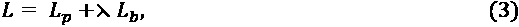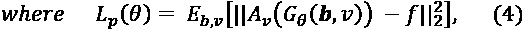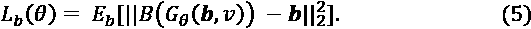

这两个约束共同类似于我们在过去章节中看到的其他对抗生成示例；一个项试图最小化误差（如鉴别器），而另一个试图近似一个分布（这里是变量上的边界条件）。

# 从图像创建视频的少样本学习方式

在之前的章节中，我们已经看到 GANs 在接受一组示例照片的训练后可以生成新颖的逼真图像。这种技术也可以用来创建图像的变体，无论是应用“滤镜”还是基础图像的新姿势或角度。将这种方法推向逻辑极限，我们是否可以从单个或有限数量的图像中创建一个“说话的头”？这个问题非常具有挑战性——对图像应用“扭曲”转换的传统（或深度学习）方法会产生明显的伪影，从而降低输出的逼真度^(13,14)。另一种替代方法是使用生成模型从输入图像(*图 13.11*)中抽样潜在的角度和位置变化，正如 Zakharov 等人在他们的论文*Few Shot Adversarial Learning of Realistic Neural Talking Head Models*中所做的那样。¹⁵

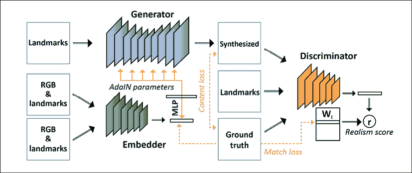

图 13.11：用于从单个图像创建运动帧的生成架构（基于 Zakharov 等人的第 2 张图。）

这个架构有三个处理一组输入视频的网络。第一个生成地标特征的嵌入（面部的简化表示，例如轮廓和重要特征的位置，如眼睛和鼻子的位置），以及原始图像的像素，生成数值向量。第二个使用这个嵌入和图像和地标数据作为输入生成新的视频帧。最后，通过鉴别器将下一帧视频与这个生成的图像进行比较。

这被称为*few shot*学习，因为它只使用少量视频帧来学习生成新的视频序列，这些序列的长度可能是无限的。然后，这个模型可以应用于仅有一个示例的输入数据，例如静止照片，从历史照片生成“说话的头像”，甚至是像《蒙娜丽莎》这样的绘画¹⁶。读者可以参考引用的论文了解示例输出。

这些“活肖画像”在某种程度上是 deepfakes 的演变 - 不是将一个移动的面部图像复制到另一个图像中，而是从没有与之相关的运动数据的图片中模拟出栩栩如生的动作。就像我们在*第一章*中讨论的画像拍卖，*生成 AI 简介：“从模型中提取”数据*，这是一个真正将生成 AI 带入新生活的例子。

# 使用深度学习生成食谱

我们将讨论的最后一个例子与本书中较早的例子有关，即使用 GAN 生成图像的文本描述。这个问题的一个更复杂的版本是生成图像的结构化描述，该图像具有多个组件，例如图像中所描述的食物的配方。这个描述也更复杂，因为它依赖于这些组件（说明）的*特定顺序*才能连贯（*图 13.12*）：

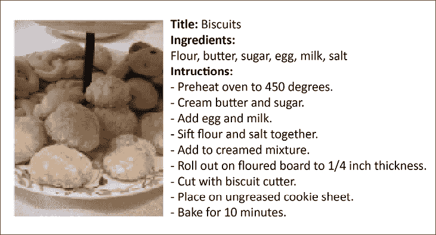

图 13.12: 从食物图像生成的食谱¹⁷

如*图 13.13*所示，这个“逆向烹饪”问题也已经使用生成模型¹⁷（Salvador 等人）进行了研究。

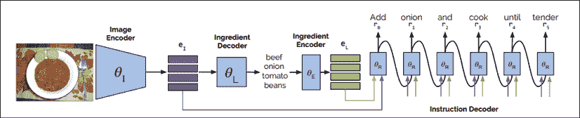

图 13.13: 逆向烹饪生成模型的架构¹⁷

像我们在前几章看到的许多例子一样，“编码器”网络接收图像作为输入，然后使用序列模型“解码”成食物成分的文本表示，这些成分与图像嵌入组合在一起，创建由网络的第三层解码的一组指令。这个“指令解码器”使用了我们在*第十章*中描述的 transformer 架构，*NLP 2.0: 使用 Transformer 生成文本*，在我们讨论 BERT 时，对图像的不同部分应用加权相关性，并输出成分清单。

# 摘要

在本章中，我们研究了许多生成模型的新兴应用。其中之一是在生物技术领域，它们可以用于创建大量新的潜在药物结构。同样在生物技术领域，生成模型被用于创建可以用于计算药物发现的潜在蛋白质折叠结构。

我们探讨了生成模型如何可以用于解决数学问题，特别是偏微分方程，通过将流体力学方程组一系列边界条件映射到解决方案网格。我们还研究了一个具有挑战性的问题，即如何从有限的输入图像集生成视频，最后从食物图像生成复杂的文本描述（组件和说明的顺序），用于制作食谱。

恭喜您到达本书的最后。作为最终总结，让我们回顾一下我们学到的所有内容：

+   *第一章*，*生成式 AI 简介：从模型“绘制”数据*：生成模型是什么

+   *第二章*，*建立一个 TensorFlow 实验室*：如何在云端建立 TensorFlow 2 的环境

+   *第三章*，*深度神经网络的基本构件*：生成式 AI 中使用的神经网络模型的基本构件

+   *第四章*，*教网络生成数字*：限制玻尔兹曼机（最早的生成模型之一）如何生成手写数字

+   *第五章*，*使用 VAEs 利用神经网络绘画图片*：变分自编码器如何从随机数据生成图像

+   *第六章*，*使用 GAN 生成图片*：了解 GAN 的基本组成以及它们如何用于从随机噪声生成高分辨率图像

+   *第七章*，*使用 GAN 进行风格迁移*：如何利用 GAN（CycleGAN 和 pix2pix）将风格从一个领域转移到另一个领域

+   *第八章*，*使用 GAN 进行 Deepfakes*：生成深假的基本构件，生成虚假照片和视频

+   *第九章*，*文本生成方法的兴起*：使用深度学习模型进行语言生成的基础知识

+   *第十章*，*NLP 2.0：使用变形金刚生成文本*：变形金刚以及不同的最先进架构（如 GPT-x）如何改变了语言生成和 NLP 领域的革命

+   *第十一章*，*利用生成模型进行音乐作曲*：如何利用生成模型从随机数据生成音乐

+   *第十二章*，*用生成式 AI 玩视频游戏：GAIL*：生成模型如何用于训练可以通过强化学习在虚拟环境中导航的“代理”

+   *第十三章*，*生成式 AI 的新兴应用*：生成式 AI 的一些令人兴奋的新兴应用

我们希望本书展示了传统和尖端用例中生成建模的多样性，并且您对通过阅读引用的背景或甚至尝试自己实施一些模型更加感兴趣！

# 参考资料

1.  Kirkpatrick, P., & Ellis, C. (2004)。*化学空间*。*自然* 432，823。[`www.nature.com/articles/432823a`](https://www.nature.com/articles/432823a)

1.  Villanueva, J.C. (2009 年 7 月 30 日)。*宇宙中有多少个原子？* 《今日宇宙》。[`www.universetoday.com/36302/atoms-in-the-universe/#:~:text=At%20this%20level%2C%20it%20is,hundred%20thousand%20quadrillion%20vigintillion%20atoms`](https://www.universetoday.com/36302/atoms-in-the-universe/#:~:text=At%20this%20level%2C%20it%20is,hu)

1.  基于 Akutsu, T., & Nagamochi, H. (2013 年)的一幅图。*化学图的比较与枚举*。计算与结构生物技术杂志，Vol. 5 Issue 6

1.  Gómez-Bombarelli R., Wei, J. N., Duvenaud, D., Hernández-Lobato, J. M., Sánchez-Lengeling, B., Sheberla, D., Aguilera-Iparraguirre, J., Hirzel, T. D., Adams, R. P., Aspuru-Guzik, A. (2018)。*使用数据驱动的分子连续表示进行自动化学设计*。ACS 中央科学 2018，4，268-276。

1.  Blaschke, T., Olivecrona, M., Engkvist, O., Bajorath, J., Chen, H.。*应用生成自动编码器进行全新分子设计*。分子信息学 2018，37，1700123。

1.  Bian Y., & Xie, X-Q. (2020)。*生成化学：用深度学习生成模型进行药物发现*。arXiv。[`arxiv.org/abs/2008.09000`](https://arxiv.org/abs/2008.09000)

1.  Senior, A., Jumper, J., Hassabis, D., & Kohli, P. (2020 年 1 月 15 日)。*AlphaFold：利用 AI 进行科学发现*。DeepMind 博客。[`deepmind.com/blog/article/AlphaFold-Using-AI-for-scientific-discovery`](https://deepmind.com/blog/article/AlphaFold-Using-AI-for-scientific-discovery)

1.  Cameron, M. Burgers 方程笔记。[`www.math.umd.edu/~mariakc/burgers.pdf`](https://www.math.umd.edu/~mariakc/burgers.pdf)

1.  Chandrasekhar, S. (1943)。*平面激波衰变论*（No. 423）。弹道研究实验室。

1.  COMSOL Multiphysics 百科全书。(2016 年 3 月 15 日)。*有限元法（FEM）*。[`www.comsol.com/multiphysics/finite-element-method`](https://www.comsol.com/multiphysics/finite-element-method)

1.  Wikipedia. (2021 年 4 月 14 日)。*Burgers 方程*。[`en.wikipedia.org/wiki/Burgers%27_equation#%20Inviscid_Burgers'_%20equation`](https://en.wikipedia.org/wiki/Burgers%27_equation#%20Inviscid_Burgers'_%20equation)

1.  Botelho, S., Joshi, A., Khara, B., Sarkar, S., Hegde, C., Adavani, S., & Ganapathysubramanian, B. (2020)。*解 PDE 的深度生成模型：用于训练大型无数据模型的分布式计算*。arXiv。[`arxiv.org/abs/2007.12792`](https://arxiv.org/abs/2007.12792)

1.  Averbuch-Elor, H., Cohen-Or, D., Kopf, J., & Cohen, M.F. (2017)。*给肖像栩栩如生的魔法*。《ACM 图形学交易（TOG）》，36(6):196

1.  Ganin, Y., Kononenko, D., Sungatullina, D., & Lempitsky, V. (2016)。*DeepWarp：用于凝视操作的照片逼真图像合成*。欧洲计算机视觉会议，311-326。Springer。

1.  Zakharov，E.，Shysheya，A.，Burkov，E.，& Lempitsky，V. (2019)。*Few-Shot Adversarial Learning of Realistic Neural Talking Head Models。* arXiv。[`arxiv.org/abs/1905.08233`](https://arxiv.org/abs/1905.08233)

1.  Hodge，M. (2019 年 5 月 24 日)。*【真正的】谈论三星的'深度伪造'视频显示了假新闻的可怕新前沿。* The Sun。[`www.thesun.co.uk/news/9143575/deepfake-talking-mona-lisa-samsung/`](https://www.thesun.co.uk/news/9143575/deepfake-talking-mona-lisa-samsung/)

1.  Salvador，A.，Drozdzal，M.，Giro-i-Nieto，X.，& Romero，A. (2019)。*反向烹饪：从食物图像生成食谱。* arXiv。[`arxiv.org/abs/1812.06164`](https://arxiv.org/abs/1812.06164)

| **分享您的经验**感谢您抽出时间阅读本书。如果您喜欢这本书，请帮助其他人找到它。在[`www.amazon.com/dp/1800200889`](https://www.amazon.com/dp/1800200889)上留下评论。 |
| --- |

[packt.com](http://packt.com)

订阅我们的在线数字图书馆，以完全访问超过 7,000 本书籍和视频，以及行业领先的工具，帮助您规划个人发展并推动您的职业发展。有关更多信息，请访问我们的网站。

# 为什么订阅？

+   花更少的时间学习，更多的时间编码，使用来自超过 4,000 名行业专业人士的实用电子书和视频

+   通过专门为您建立的技能计划学习更好

+   每月获取一个免费电子书或视频

+   完全可搜索，轻松访问重要信息

+   复制并粘贴，打印并书签内容

在[www.Packt.com](http://www.Packt.com)，您还可以阅读一系列免费的技术文章，注册一系列免费的通讯，以及获得 Packt 图书和电子书的独家折扣和优惠。
