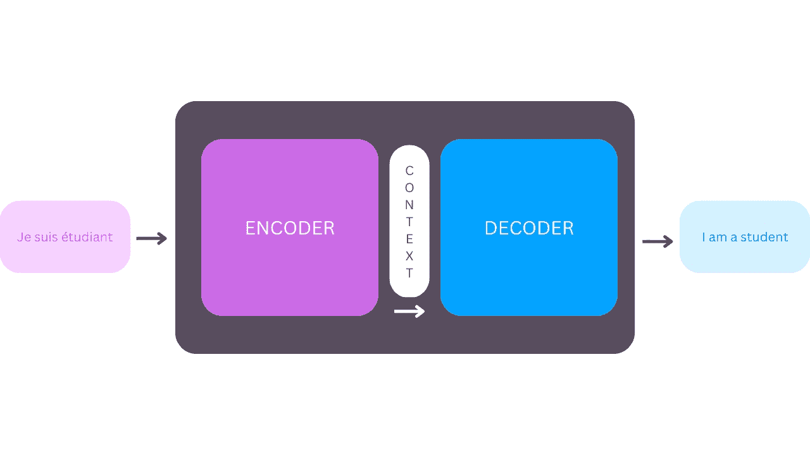

# 第三章

章节 1：大型语言模型革命

"艺术是灵魂和世界碰撞的残骸" [#gpt3](https://twitter.com/hashtag/gpt3?src=hashtag_click)

"科技现在是现代世界的神话" [#gpt3](https://twitter.com/hashtag/gpt3?src=hashtag_click)

"革命始于一个问题，但不以一个答案结束" [#gpt3](https://twitter.com/hashtag/GPT3?src=hashtag_click)

"大自然用多样性装饰世界" [#gpt3](https://twitter.com/hashtag/GPT3?src=hashtag_click)

想象一下醒来的美丽、阳光明媚的早晨。今天是星期一，你知道这一周将会很忙碌。你的公司即将推出一款新的个人生产力应用程序 Taskr，并启动一场社交媒体宣传活动，告知世界你们的创造性产品。

本周，你的主要任务是编写并发布一系列引人入胜的博客文章。

你开始列出一份待办事项清单：

●        写一篇关于提高生产力的有趣信息性的文章，包括 Taskr。字数限制在 500 字以内。

●        创建 5 个引人注目的文章标题清单。

●        选择图片。

你按下回车键，抿一口咖啡，看着文章在屏幕上一句一句、一段一段地展开。30 秒钟后，你就有了一篇有意义、高质量的博客文章，是社交媒体系列的完美开端。视觉效果有趣，能吸引注意。完成了！你选择最好的标题并开始发布流程。

这不是一个遥远的、未来的幻想，而是通过人工智能技术的进步实现的新现实的一瞥。在我们撰写本书的同时，许多这样的应用正在被创建和部署到更广泛的受众中。

GPT-3 是由 OpenAI 公司创建的尖端语言模型，该公司处于人工智能研发的前沿。OpenAI 在 2020 年 5 月发布了宣布 GPT-3 的[研究论文](https://arxiv.org/abs/2005.14165)，并于 2020 年 6 月通过[OpenAI API](https://openai.com/blog/openai-api/)提供了对 GPT-3 的访问权限。自 GPT-3 发布以来，来自不同背景的人，包括技术、艺术、文学、市场营销等领域的人，已经发现了该模型数以百计令人兴奋的应用，这些应用有潜力提升我们沟通、学习和娱乐的方式。

GPT-3 可以轻松解决一般的基于语言的任务，比如生成和分类文本，自由地在不同的文本风格和目的之间移动。它可以解决的问题范围是广阔的。

在本书中，我们邀请你考虑用 GPT-3 解决什么问题。我们将向你展示它是什么以及如何使用它，但首先，我们想给你一些背景知识。本章的其余部分将讨论这项技术的来源，它是如何构建的，它擅长解决哪些任务，以及它的潜在风险。让我们直奔主题，先看一看自然语言处理（NLP）领域，以及大型语言模型（LLMs）和 GPT-3 是如何融入其中的。

背后的自然语言处理观察

NLP 是专注于计算机与人类语言交互的一个子领域。其目标是构建能够处理自然语言的系统，即人们相互交流的方式。NLP 结合了语言学、计算机科学和人工智能技术来实现这一目标。

NLP 将计算语言学（基于规则的人类语言建模）领域与机器学习相结合，创建出能够识别上下文并理解自然语言意图的智能机器。机器学习是人工智能的一个分支，专注于研究如何使机器通过经验提高其在任务上的表现，而不需要明确编程。深度学习是机器学习的一个子领域，涉及使用模仿人脑的神经网络来进行复杂任务，减少人为干预。

2010 年代见证了深度学习的出现，随着该领域的成熟，出现了由数千甚至数百万个简单处理单元（称为人工神经元）组成的密集神经网络的大型语言模型。神经网络通过使得执行复杂自然语言任务成为可能，成为了 NLP 领域的首个重大变革者，而这些任务迄今为止仅在理论上可能。第二个重要里程碑是引入了可以在各种下游任务上进行微调的预训练模型（如 GPT-3），从而节省了大量训练时间。（我们在本章后面讨论预训练模型。）

NLP 是许多现实世界人工智能应用的核心，例如：

垃圾邮件检测

电子邮件收件箱中的垃圾邮件过滤将一部分收到的电子邮件分配到垃圾邮件文件夹中，使用 NLP 来评估哪些电子邮件看起来可疑。

机器翻译

Google 翻译、DeepL 等机器翻译程序使用自然语言处理（NLP）评估由不同语言对的人类讲话者翻译的数百万句子。

虚拟助手和聊天机器人

所有世界上的 Alexa、Siri、Google Assistant 和客户支持聊天机器人都属于这一类。它们使用 NLP 来理解、分析、优先处理用户的问题和请求，并迅速正确地回复它们。

社交媒体情感分析

市场营销人员收集特定品牌、话题和关键词的社交媒体帖子，然后使用 NLP 分析用户对每个主题的感受，以及整体感受。它有助于品牌进行客户调查、形象评估和社会动态检测。

文本摘要

对文本进行摘要意味着减小其大小，同时保留关键信息和基本含义。文本摘要的一些日常示例包括新闻标题、电影预告片、通讯简报制作、金融研究、法律合同分析、电子邮件摘要以及提供新闻订阅、报告和电子邮件的应用程序。

语义搜索

语义搜索利用深度神经网络智能地搜索数据。每当您在 Google 上搜索时，您都在与之互动。语义搜索在基于上下文而不是特定关键词搜索某物时非常有用。

“我们与其他人类的交流方式是通过语言”，一位在自然语言处理领域最受欢迎的 YouTuber 和影响者[Yannic Kilcher](https://www.youtube.com/channel/UCZHmQk67mSJgfCCTn7xBfew)说道。 “语言是每一笔业务交易、我们与其他人类的每一次交互，甚至在与机器的部分交互中，我们也在某种程度上使用某种语言，无论是通过编程还是用户界面。” 因此，不足为奇，NLP 作为一个领域已经成为过去十年中一些最激动人心的人工智能发现和实施的地方。

语言模型越来越大、越来越好

语言建模是将文本中一系列单词赋予特定语言中的概率的任务。根据对现有文本序列的统计分析，简单的语言模型可以查看一个词并预测最有可能跟随的下一个词（或词组）。要创建一个成功预测单词序列的语言模型，您必须在大型数据集上对其进行训练。

语言模型是自然语言处理应用程序的重要组成部分。您可以将它们视为统计预测机器，给定文本作为输入并得到预测作为输出。您可能从手机上的自动完成功能中熟悉这一点。例如，如果您输入 good，自动完成可能会提供“morning”或“luck”等建议。

在 GPT-3 之前，没有一种通用的语言模型能够在各种 NLP 任务上表现良好。语言模型被设计用于执行一种 NLP 任务，如文本生成、摘要或分类。因此，在本书中，我们将讨论 GPT-3 作为通用语言模型的非凡能力。我们将从介绍“GPT”每个字母开始，以展示它们代表什么以及构建这个著名模型的元素是什么。我们将简要概述该模型的历史以及今天我们看到的序列到序列模型是如何出现的。之后，我们将向您介绍 API 访问的重要性以及它如何根据用户需求进行了演进。我们建议在继续阅读本书的其余章节之前注册一个 OpenAI 账号。

生成式预训练转换器：GPT-3

GPT-3 这个名字代表“生成式预训练转换器 3”。让我们逐一通过所有这些术语来理解 GPT-3 的制作过程。

生成模型

GPT-3 是一种生成模型，因为它生成文本。生成建模是统计建模的一个分支。它是一种用数学方法近似世界的方法。

我们被一个难以置信的大量易于访问的信息所包围，无论是在物理世界还是数字世界中。棘手的部分是开发能够分析和理解这些宝库数据的智能模型和算法。生成模型是实现这一目标最有前途的方法之一。

要训练一个模型，您必须准备和预处理一个数据集，这是一系列示例，帮助模型学习执行给定任务。通常，数据集是某个特定领域的大量数据：例如，数百万张车辆图像，以教会模型汽车是什么。数据集也可以采用句子或音频样本的形式。一旦向模型展示了许多示例，您必须训练它生成类似的数据。

预训练模型

您听说过一万小时理论吗？在他的书《异类》中，马尔科姆·格拉德威尔建议练习任何技能一万小时就足以使您成为专家。这种“专家”知识体现在您的人脑发展的神经元之间的连接中。人工智能模型也在做类似的事情。

要创建一个表现良好的模型，您需要使用一组特定的变量（称为参数）对其进行训练。确定模型的理想参数的过程称为训练。模型通过连续的训练迭代吸收参数值。

深度学习模型需要很长时间来找到这些理想参数。训练是一个漫长的过程，具体取决于任务，可能持续几个小时到几个月，并且需要大量的计算资源。重新利用部分长时间的学习过程以应对其他任务将会极大地帮助。这就是预训练模型发挥作用的地方。

预训练模型，与格拉德威尔的“一万小时理论”保持一致，是帮助您更快地获得另一种技能的第一个技能。例如，掌握解决数学问题的技能可以让您更快地获得解决工程问题的技能。预训练模型是针对更一般任务进行训练的（由您或他人训练），可以针对不同的任务进行微调。您可以使用已经针对更一般问题进行了训练的预训练模型，而不是创建全新的模型来解决您的问题。通过使用定制的数据集提供额外的训练，可以微调预训练模型以满足您的特定需求。这种方法更快，更高效，并且与从头开始构建模型相比，可以实现更好的性能。

在机器学习中，模型是在数据集上训练的。数据样本的大小和类型取决于您想要解决的任务。GPT-3 是在五个数据集的文本语料库上预训练的：Common Crawl，WebText2，Books1，Books2 和 Wikipedia。

Common Crawl

Common Crawl 语料库包含了宠字节的数据，包括原始网页数据、元数据和八年网络爬虫收集的文本数据。OpenAI 研究人员使用这个数据集的策划和过滤版本。

WebText2

WebText2 是 WebText 数据集的扩展版本，是 OpenAI 的一个内部语料库，通过对特别高质量的网页进行抓取而创建。为了确保质量，作者们从 Reddit 抓取了所有至少有三个 karma（指其他用户是否认为链接有趣、教育性或仅仅是有趣）的出站链接。WebText 包含来自这 4500 万个链接的 40 GB 文本，以及 800 多万个文档。

Books1 和 Books2

Books1 和 Books2 是两个语料库，包含了数以万计的各种主题的书籍文本。

维基百科

一个集合，包括[GPT-3 数据集](https://github.com/openai/gpt-3/blob/master/dataset_statistics/languages_by_document_count.csv)最终确定时的所有英语文章。这个数据集大约有[580 万](https://en.wikipedia.org/wiki/Wikipedia:Size_of_Wikipedia)英语文章。

这个语料库总共包含近一万亿字。

GPT-3 还能够生成并成功处理英语以外的语言。表 1-1 展示了数据集中[排名前十位](https://github.com/openai/gpt-3/blob/master/dataset_statistics/languages_by_document_count.csv)的其他语言。

|

排名

|

语言

|

文件数量

|

总文档的百分比

|

|

1.

|

英语

|

235987420

|

93.68882%

|

|

2.

|

德语

|

3014597

|

1.19682%

|

|

3.

|

法语

|

2568341

|

1.01965%

|

|

4.

|

葡萄牙语

|

1608428

|

0.63856%

|

|

5.

|

意大利语

|

1456350

|

0.57818%

|

|

6.

|

西班牙语

|

1284045

|

0.50978%

|

|

7.

|

荷兰语

|

934788

|

0.37112%

|

|

8.

|

波兰语

|

632959

|

0.25129%

|

|

9.

|

日语

|

619582

|

0.24598%

|

|

10.

|

丹麦语

|

396477

|

0.15740%

|

表 1-1\. GPT-3 数据集中的前十种语言

尽管英语和其他语言之间的差距很大 - 英语位居榜首，占数据集的 93％；德语排名第二，仅占 1％ - 但这 1％足以创建德语的完美文本，并进行风格转换和其他任务。对于列表中的其他语言也是一样。

由于 GPT-3 是在广泛而多样的文本语料库上进行预训练的，因此它可以成功地执行令人惊讶的多个 NLP 任务，而无需用户提供任何额外的示例数据。

变压器模型

神经网络是深度学习的核心，其名称和结构受到了人脑的启发。它们由一组一起工作的神经元组成。神经网络的进展可以增强人工智能模型在各种任务上的性能，导致人工智能科学家不断为这些网络开发新的架构。其中一项进展是转换器，这是一个机器学习模型，可以一次处理一段文本的所有内容，而不是逐个单词处理，并且非常擅长理解这些单词之间的关系。这一发明对自然语言处理领域产生了巨大影响。

序列到序列模型

谷歌和多伦多大学的研究人员在 2017 年的一篇论文中介绍了转换器模型：

我们提出了一种新的简单网络架构，即转换器，它仅基于注意机制，完全摒弃了循环和卷积。对两个机器翻译任务的实验表明，这些模型在质量上优于其他模型，同时更易并行化，需要的训练时间显著减少。[[3]](xhtml-0-12.xhtml#aid_55)

转换器模型的基础是序列到序列架构。序列到序列（Seq2Seq）模型对将一个序列，比如句子中的单词，转换成另一个序列，比如另一种语言中的句子，非常有用。这在翻译任务中特别有效，其中一个语言中的单词序列被翻译成另一种语言中的单词序列。谷歌翻译在 2016 年开始使用基于 Seq2Seq 模型的模型。

图 1-1。序列到序列模型（神经机器翻译）[[4]](xhtml-0-12.xhtml#aid_75)

Seq2Seq 模型由两个组件组成：编码器和解码器。编码器可以被看作是以法语为母语、以韩语为第二语言的翻译人员。解码器则是一位以英语为母语、以韩语为第二语言的翻译人员。要将法语翻译成英语，编码器将法语句子转换为韩语（也称为上下文），然后传递给解码器。由于解码器理解韩语，它可以将句子从韩语翻译成英语。编码器和解码器可以成功地将法语翻译成英语[[5]](xhtml-0-12.xhtml#aid_17)，如图 1-1 所示。

转换器注意机制

转换器架构是为了改进人工智能在机器翻译任务上的表现而发明的。“转换器最初是作为语言模型出现的，”基尔彻解释说，“起初并不大，但后来变得更大了。”

要有效地使用转换器模型，了解注意力的概念至关重要。注意机制模仿人脑如何集中注意力于输入序列的特定部分，使用概率确定在每个步骤中哪些部分的序列最相关。

例如，看看这个句子，“猫坐在垫子上，一旦吃掉了老鼠。” 在这个句子中，"it" 是指“猫”还是“垫子”？Transformer 模型可以将 "it" 强烈地与 "猫" 连接起来。这就是注意力。

编码器和解码器共同工作的一个例子是，当编码器记录下与句子含义相关的重要关键词并将其与翻译一起提供给解码器时。这些关键词使得解码器更容易理解翻译，因为它现在更好地理解了句子的关键部分和提供上下文的术语。

Transformer 模型有两种注意力机制：自注意力（句子内单词之间的连接）和编码器-解码器注意力（源句子中的单词与目标句子中的单词之间的连接）。

注意机制帮助 Transformer 模型过滤噪音，聚焦于相关内容：将两个语义关联的单词连接起来，而这些单词之间没有明显的指向彼此的标记。

Transformer 模型受益于更大的架构和更多的数据。在大型数据集上进行训练，并针对特定任务进行微调可以提高结果。相比于其他类型的神经网络，Transformer 更好地理解句子中单词的语境。GPT 只是 Transformer 的解码器部分。

现在你知道“GPT”的含义了，让我们谈谈那个“3”——以及 1 和 2。

GPT-3：简史

GPT-3 由旧金山的人工智能研究先驱 OpenAI 创建，并且是一个重要的里程碑。OpenAI 的 [声明任务](https://openai.com/about/#:~:text=Our%20mission%20is%20to%20ensure,work%E2%80%94benefits%20all%20of%20humanity.) 是“确保人工智能造福全人类”，以及其创造人工通用智能的愿景：一种不仅限于特定任务，而是在各种任务中表现良好的人工智能类型，就像人类一样。

GPT-1

OpenAI 在 2018 年 6 月发布了 GPT-1。开发者的 [主要发现](https://cdn.openai.com/research-covers/language-unsupervised/language_understanding_paper.pdf) 是将 Transformer 架构与无监督的预训练相结合可以产生有希望的结果。他们写道，GPT-1 经过特定任务的微调，实现了“强大的自然语言理解”。

GPT-1 是通向具有通用语言能力的语言模型的重要里程碑。它证明了语言模型可以被有效地预训练，这可以帮助它们很好地泛化。该架构可以通过极少的微调执行各种自然语言处理任务。

GPT-1 模型使用了[BooksCorpus](https://yknzhu.wixsite.com/mbweb)数据集，该数据集包含约 7000 本未发表的书籍，并在变压器解码器中使用了自注意力机制来训练模型。其架构与原始变压器相似，有 1.17 亿个参数。该模型为未来具有更大数据集和更多参数的模型利用其潜力铺平了道路。

其中一个值得注意的能力是它在自然语言处理的零样本任务中表现良好，例如问答和情感分析，这要归功于预训练。零样本学习是模型在没有先前看到该任务示例的情况下执行任务的能力。在零样本任务转移中，模型几乎没有例子，必须根据说明和少量例子理解任务。

GPT-2

在 2019 年 2 月，OpenAI 推出了 GPT-2，它比以前的版本更大，但其他方面非常相似。其显著区别在于 GPT-2 可以多任务处理。它成功地 [证明](https://cdn.openai.com/better-language-models/language_models_are_unsupervised_multitask_learners.pdf) 了语言模型可以在不接收任何训练样本的情况下在多个任务上表现良好。

GPT-2 显示，使用更大的数据集并拥有更多的参数可以提高语言模型理解任务的能力，并在零样本设置下超越许多任务的最新技术水平。它还显示，甚至更大的语言模型将更好地理解自然语言。

为了创建一个广泛的、高质量的数据集，作者们从 Reddit 中抓取数据，并从该平台上投票的文章的出站链接中提取数据。得到的数据集，WebText，有超过 8 百万份文档的 40GB 文本数据，远远大于 GPT-1 的数据集。GPT-2 是在 WebText 数据集上进行训练的，有 150 亿个参数，比 GPT-1 多了十倍。

GPT-2 在几个下游任务的数据集上进行了评估，如阅读理解、摘要、翻译和问答。

GPT-3

在建立一个更加强大和稳健的语言模型的探索中，OpenAI 建立了 GPT-3 模型。它的数据集和模型都比 GPT-2 使用的要大两个数量级：GPT-3 有 1750 亿个参数，并且是在五种不同的文本语料库混合数据上进行训练的，这是一个比 GPT-2 训练数据集要大得多的数据集。GPT-3 的架构与 GPT-2 基本相同。它在零样本和少样本设置下在下游自然语言处理任务上表现良好。

GPT-3 具有撰写与人类撰写的文章难以区分的能力。它还可以针对从未明确训练的任务进行即时处理，例如汇总数字、编写 SQL 查询，甚至根据任务的简要英语描述编写 React 和 JavaScript 代码。

注意：少量、一量和零量设置是零样本任务转移的特殊情况。在少量设置中，模型提供了任务描述和适合模型上下文窗口的尽可能多的示例。在一量设置中，模型提供了一个示例，而在零量设置中则没有示例。

OpenAI 在其使命声明中关注 AI 的民主和伦理影响。这可以从他们决定通过公共 API 提供其模型 GPT-3 的第三个版本中看出。应用程序编程接口允许软件中介在网站或应用程序与用户之间进行通信。

API 充当了开发者和应用程序之间通信的手段，使它们能够与用户建立新的程序化交互。通过 API 发布 GPT-3 是一项革命性的举措。直到 2020 年，由领先研究实验室开发的强大 AI 模型仅供少数研究人员和工程师使用。OpenAI API 通过简单的登录，让全世界的用户首次获得了对世界上最强大的语言模型的无与伦比的访问权限。（OpenAI 对此举的商业原因是创建一个称为“[模型即服务](https://arxiv.org/abs/1706.03762)”的新范式，在其中开发者可以按 API 调用付费；我们将在第三章中更仔细地研究这一点。）

在研发 GPT-3 时，OpenAI 的研究人员尝试了不同的模型大小。他们采用了现有的 GPT-2 架构，并增加了参数数量。实验结果是产生了一种具有新的和非凡能力的模型，即 GPT-3。虽然 GPT-2 在下游任务上显示出了一些零样本能力，但是当提供示例上下文时，GPT-3 能够执行更多的新颖任务。

[OpenAI 的研究人员发现令人吃惊的是](https://arxiv.org/abs/2102.02503)，仅仅通过扩大模型参数和训练数据集的规模就能取得如此非凡的进步。他们普遍乐观地认为，即使是比 GPT-3 大得多的模型，这些趋势也将继续，从而实现通过对小样本进行微调即可进行少量或零量学习的越来越强大的学习模型。

当您阅读本书时，专家们[估计](https://arxiv.org/abs/2101.03961)可能已经构建和部署了超过一万亿个基于参数的语言模型。我们已经进入了大型语言模型的黄金时代，现在是您成为其中一员的时候了。

GPT-3 已经吸引了大量的公众关注。《麻省理工科技评论》认为 GPT-3 是[2021 年的十项突破技术之一](https://www.technologyreview.com/2021/02/24/1014369/10-breakthrough-technologies-2021/)。它在执行通用任务方面的出色灵活性，几乎接近人类的效率和准确性，使人们感到非常激动。作为早期采用者，Arram Sabeti 发推文如下（见图 1-2）：

图 1-2\. 来自 [Arram Sabeti](https://twitter.com/arram/status/1281258647566217216?lang=en) 的推文

API 发布在自然语言处理领域引起了范式转变，并吸引了许多测试者。创新和初创公司以惊人的速度涌现，许多评论者称 GPT-3 为“[第五次工业革命](https://twitter.com/gpt_three)”。

OpenAI 表示，API 推出仅九个月后，就有超过三百家企业开始使用它。尽管如此突然，一些专家认为这种兴奋并不夸张。Bakz Awan 是一位从开发者转型为企业家和影响者的人，也是 OpenAI API 开发者社区的主要声音之一。他拥有一个 [YouTube 频道“Bakz T. Future”](https://www.youtube.com/user/bakztfuture) 和一个 [播客](https://open.spotify.com/show/7qrWSE7ZxFXYe8uoH8NIFV?si=0e1170c9d7944c9b)。Awan 认为，GPT-3 和其他模型实际上“在可用性、友好性、趣味性和强大性方面被低估了。这几乎是令人震惊的。”

Viable 的首席执行官 Daniel Erickson 称赞了该模型通过所谓的基于提示的开发从大型数据集中提取见解的能力：

走上这条道路的公司涵盖了生成广告和网站文案等用例。设计哲学相对简单：公司将您的数据传入，将其发送到提示中，并显示 API 生成的结果。它解决了一个可以由单个 API 提示轻松完成的任务，并将 UI 包装起来传递给用户。

Erickson 觉得这类用例的问题在于已经过度拥挤，吸引了许多雄心勃勃的初创公司创始人竞争相似的服务。相反，Erickson 建议看看另一个用例，就像 Viable 做的那样。基于数据的用例并没有像提示生成用例那样拥挤，但它们更有利可图，而且可以轻松创建一道护城河。

Erickson 表示，关键是建立一个可以不断添加数据并提供潜在见解的大型数据集。GPT-3 将帮助您从中提取有价值的见解。在 Viable，这是让他们轻松实现货币化的模型。“人们为数据付出的比为提示输出付出的多得多，” Erickson 解释道。

值得注意的是，技术革命也会引发争议和挑战。GPT-3 在任何试图创造叙述的人手中都是一个强大的工具。没有充分的关怀和善意意图，我们将面临的挑战之一就是抑制试图使用该算法传播误导性宣传活动。另一个挑战是根除其用于生成大量低质量数字内容的用途，这将污染互联网上的可用信息。还有一个挑战就是其数据集的局限性，这些数据集充满各种偏见，而这些偏见可能会被这项技术放大。在第六章中，我们将更详细地讨论这些挑战以及 OpenAI 为解决这些挑战所做的各种努力。

访问 OpenAI API

截至 2021 年，市场已经生产了几种拥有比 GPT-3 更多参数的专有 AI 模型。然而，对这些模型的访问仅限于公司研发部门内的少数人，这使得不可能评估它们在真实的自然语言处理任务中的性能。

使 GPT-3 变得易于访问的另一个因素是其简单直观的“文本输入，文本输出”用户界面。它不需要复杂的梯度微调或更新，你也不需要是一个专家来使用它。这种可扩展参数与相对开放的访问结合使得 GPT-3 成为迄今为止最令人兴奋的、可能也是最相关的语言模型。

由于 GPT-3 的非凡能力，开源存在着与安全和滥用相关的重大风险，在最后一章中我们将会讨论到—考虑到这一点，OpenAI 决定不公开发布 GPT-3 的源代码，而是通过 API 提出了一个独特的、前所未见的访问共享模式。

公司最初决定以有限的测试版用户列表形式发布 API 访问。人们必须填写一份详细说明其背景和申请 API 访问原因的申请表。只有被批准的用户才被授予对名为 Playground 的 API 私人测试版的访问权限。

在早期，GPT-3 的测试版访问等待列表包含数以万计的人。OpenAI 迅速处理了涌入的申请，并分批添加开发人员。它还密切监测他们对 API 用户体验的活动和反馈，以不断改进。

由于有了保障措施的进展，OpenAI 于 2021 年 11 月取消了等待列表。现在可以通过[简单的注册](https://openai.com/blog/api-no-waitlist)公开访问 GPT-3。这是 GPT-3 历史上的一个重要里程碑，也是社区强烈要求的一步。要获得 API 访问权限，只需到[注册页面](https://beta.openai.com/signup)，注册一个免费帐户，立即开始尝试。[。](https://beta.openai.com/signup)

新用户最初会获得一定数量的免费积分，可以自由地尝试 API。积分数量相当于创作长度为三部普通长度小说的文本内容。使用完免费积分后，用户开始支付使用费用，或者如果有需求的话，可以向 OpenAI API 客户支持请求额外的积分。

OpenAI 致力于确保基于 API 的应用程序的负责任构建。为此，它提供了[工具](https://beta.openai.com/docs/guides/moderation)、[最佳实践](https://beta.openai.com/docs/guides/safety-best-practices)和[使用指南](https://beta.openai.com/docs/usage-policies)，以帮助开发人员快速而安全地将其应用程序投入生产。

公司还创建了[内容指南](https://beta.openai.com/docs/usage-policies/content-guidelines)，以明确 OpenAI API 可用于生成哪种类型的内容。为了帮助开发人员确保其应用程序用于预期目的，防止潜在的滥用，并遵守内容指南，OpenAI 提供了免费的内容过滤器。OpenAI 政策禁止将 API 用于违反其[宪章](https://openai.com/charter/)中描述的原则的方式，包括宣扬仇恨、暴力或自残的内容，或者意图骚扰、影响政治进程、传播错误信息、发送垃圾内容等。

一旦您注册了 OpenAI 账户，您可以继续阅读第二章，在那里我们将讨论 API 的不同组成部分、GPT-3 游乐场，以及如何针对不同的使用情况最大限度地利用 API 的能力。
