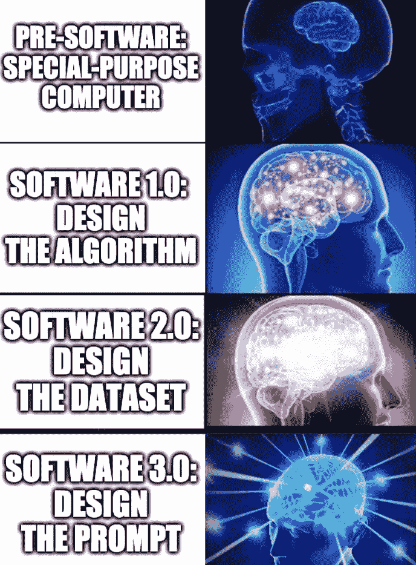
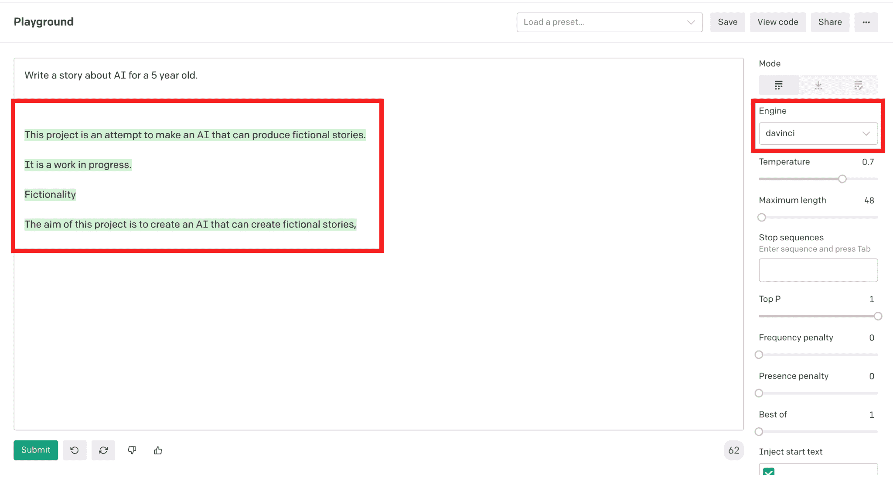

# 第二章：开始使用 OpenAI API

尽管 GPT-3 是世界上最复杂和复杂的语言模型，但其功能被抽象为简单的“文本输入-文本输出”接口提供给最终用户。本章将帮助您开始使用该接口、Playground，并深入涵盖 OpenAI API 的技术细微差别，因为细节总是揭示真正的宝石。

要完成本章的学习，您必须在[https：//beta.openai.com/signup](https://beta.openai.com/signup)注册 OpenAI 帐户。如果您还没有这样做，请现在注册。

OpenAI Playground

您的 OpenAI 开发人员帐户提供对 API 和无限可能性的访问。我们将从 Playground 开始，这是一个私人基于 Web 的沙箱环境，让您可以尝试 API，了解其组件的工作原理，并访问开发人员文档和 OpenAI 社区。然后，我们将向您展示如何构建强大的提示，以生成应用程序的良好回应。最后，本章将演示 GPT-3 执行四项自然语言处理任务的示例：分类、命名实体识别（NER）、摘要和文本生成。

在与 OpenAI 产品副总裁彼得·韦琳德进行的一次采访中，我们问及了关于首次使用 Playground 的关键建议。他告诉我们，他的建议取决于用户的角色。如果用户具有机器学习背景，彼得鼓励他们“首先忘记他们已经知道的事情，然后只需前往 Playground 并尝试让 GPT-3 做到你要求的事情”。他建议用户“想象 GPT-3 是你要求做某事的朋友或同事。你会如何描述你想让他们做的任务？然后看看 GPT-3 如何回应。如果它的回应不符合你的期望，就调整你的指示。”

正如 YouTube 博主和 NLP 影响者[Bakz Awan](https://www.youtube.com/user/bakztfuture)所说，“非技术人员会问：我需要学位才能使用吗？我需要懂编程才能使用吗？绝对不需要。您可以使用 Playground。您无需编写一行代码。您将立即获得结果。任何人都可以做到这一点。”

在您开始使用 Playground 之前，我们建议阅读 OpenAI 的“[入门指南](https://beta.openai.com/docs/developer-quickstart)”和开发人员文档。您可以使用您的 OpenAI 帐户访问它。

以下是开始使用 Playground 的步骤：

1.  登录 https://openai.com。身份验证后，从主菜单中转到 Playground。

1.  查看 Playground 屏幕（图 2-1）。

● 标记为 1 的大文本框是您提供文本输入（提示）的位置。

● 标记为 2 的右侧框是参数设置窗格，允许您调整参数。

● 标记为 3 的框允许您加载现有的预设：示例提示和 Playground 设置。您可以提供您的培训提示或加载现有的预设。

图 2-1\. Playground 界面，截图于 2022 年 1 月 10 日

1.  选择一个现有的 QA 预设（标记为 3）。这将自动加载训练提示以及关联的参数设置。点击生成按钮（见图 2-1 中的标记 4）。

1.  API 处理您的输入，并在同一文本框中提供响应（称为完成）。它还显示您所使用的令牌数量。令牌是用于确定 API 调用定价的单词的数值表示；我们将在本章后面讨论它们。

1.  在屏幕底部，您可以看到右侧的令牌计数，左侧是一个生成按钮（见图 2-2）。

图 2-2\. Q/A 提示完成及标记令牌计数

1.  每次您点击生成按钮时，GPT-3 都会考虑文本输入字段中的提示和完成，并将它们视为下一个完成的一部分。

这是您在图 2-2 中可以看到的提示：  

我是一个高度智能的问答机器人。如果您问我一个根植于真相的问题，我会给您答案。如果您问我一个荒谬、欺诈或没有明确答案的问题，我会回答“未知”。

Q：美国的人类预期寿命是多少？

A：美国的人类预期寿命为 78 岁。

Q：1955 年美国总统是谁？

A：1955 年，德怀特·D·艾森豪威尔担任美国总统。

Q：他属于哪个政党？

A：他属于共和党。

Q：香蕉的平方根是多少？

A：未知

Q：望远镜是如何工作的？

A：望远镜使用透镜或镜子聚焦光线，使物体看起来更近。

Q：1992 年奥运会在哪里举行？

这是完成：

A：1992 年奥运会在西班牙的巴塞罗那举办。

现在你已经了解了 Playground 的基本概述，让我们深入了解一下提示工程和设计的要点。

提示工程与设计

OpenAI API 彻底改变了我们与 AI 模型互动的方式，剥离了复杂的编程语言和框架。特斯拉人工智能主管安德烈·卡帕西（Andrej Karpathy）开玩笑地说，GPT-3 发布后，编程 3.0 全部都是关于提示设计的（他发布的梗见图 2-3）。您提供的训练提示与您获得的完成质量之间存在直接关系。您的词汇结构和排列方式会严重影响输出。理解提示设计是释放 GPT-3 真正潜力的关键。

图 2-3\. 梗源未知；[安德烈·卡帕西在 2020 年 6 月 18 日推文](https://twitter.com/karpathy/status/1273788774422441984/photo/1)

在设计训练提示时，要以零追问的方式获取模型的响应：看看你是否能在无需向模型提供外部训练例子的情况下获得你想要的响应。如果不能，那么请向模型展示一些例子，而不是整个数据集。设计训练提示的标准流程是首先尝试零追问，然后尝试一些追问，并进行基于语料库的精细调整（如下所述）。

GPT-3 是通往通用人工智能的第一步，因此它有其局限性。它不知道所有事情，也无法像人类一样思考，但当你知道如何与它交流时，它很有能力。这就是提示工程的艺术所在。

GPT-3 不是一个讲真话的人，而是一个出色的讲故事者。它接受文本输入并尝试以它认为最好的方式作出回应。如果你给它你最喜欢的小说中的几行文字，它会试图以相同的风格继续故事。它通过理解上下文来进行工作；没有合适的上下文，它可能产生不一致的回应。让我们通过一个例子来了解 GPT-3 如何处理输入提示并生成输出：

Q: 美国的人类预期寿命是多少？

A:

如果你向 GPT-3 提供这样的提示而没有任何上下文，你要求它从其训练数据的范围中寻找一般性的答案。这将导致一般化和不一致的回应，因为模型不知道如何从训练数据的哪一部分中回答这些问题。[[6]](xhtml-0-12.xhtml#aid_54)

另一方面，提供正确的上下文将指数级地提高回应的质量。它简单地限制了模型必须检查来回答问题的训练数据的范围，从而产生更具体和点到为止的回应。

我是一个非常聪明的答疑机器人。如果你问我一个根植于事实的问题，我会给你答案。如果你问我一个毫无意义、诡计多端或者没有明确答案的问题，我会回答“未知”。

Q: 美国的人类预期寿命是多少？

A:

你可以把 GPT-3 处理输入的方式想象成类似于人脑。在没有合适上下文的情况下，当有人问我们问题时，我们往往会给出随机的回应。这是因为没有合适的指引或上下文，很难给出精确的回应。GPT-3 也是一样的情况。它的训练数据范围非常大，这使得它在没有外部上下文或指引的情况下很难导航到正确的响应。

像 GPT-3 这样的语言模型能够在正确的上下文中创造性地写作和回答事实性问题。以下是我们创建高效有效的训练提示的五步公式：

1\. 确定你要解决的问题以及这是什么类型的自然语言处理任务，比如分类、问答、文本生成或创意写作。

2\. 问问自己是否有零追问解决方案。如果你需要外部示例来为你的使用案例引导模型，就要认真思考。

3\. 现在考虑一下，通过 GPT-3 的“文本输入，文本输出”界面，您可能如何以文本方式遇到问题。考虑表示问题的所有可能情景。例如，您想构建一个广告文案助手，它可以通过查看产品名称和描述来生成创意文案。要将此目标框定为“文本输入，文本输出”格式，您可以将输入定义为产品名称和描述，输出为广告文案：

输入：贝蒂自行车，适用于价格敏感的购物者

输出：低价和丰富选择。免费快速送货。今天在线订购！

4\. 如果您最终使用外部示例，请尽可能少地使用，并尝试包含多样性，捕捉所有表示以避免过度拟合模型或偏倚预测。

这些步骤将成为每当您从头开始创建培训提示时的标准框架。在您可以为您的数据问题构建端到端解决方案之前，您需要更多了解 API 的工作方式。让我们通过查看其组件来深入了解。

拆解 OpenAI API

图 2-4\. API 的组件

表格 2-1 显示了 OpenAI API 中组件的概述。

|

组件

|

功能

|

|

执行引擎

|

确定用于执行的语言模型

|

|

响应长度

|

设置 API 在其完成中包含的文本量的限制

|

|

温度和 Top P

|

温度控制响应的随机性，表示为 0 到 1 的范围。

Top P 控制模型应考虑的随机结果数量，正如

温度；它决定了随机性的范围。

|

|

频率惩罚和

存在惩罚

|

频率惩罚减少了模型完全重复相同行的可能性

“惩罚”它。

存在惩罚增加了它谈论新话题的可能性。

|

|

最佳完成

|

允许您指定要在服务器端生成的完成数量（n），并返回“n”个完成中的最佳完成

|

|

停止序列

|

指定一组字符，表示 API 停止生成完成

|

|

注入起始和重启

文本

|

注入起始文本允许您在完成的开头插入文本。

注入重启文本允许您在完成的末尾插入文本。

|

|

显示概率

|

通过显示模型可以为给定输入生成的令牌的概率来调试文本提示。

|

表 2-1\. OpenAI API 中的组件

这是 GPT-3 API 组件的概述。我们将在整章中更详细地讨论所有这些组件。

执行引擎

执行引擎决定了用于执行的语言模型。选择正确的引擎是确定模型能力并获得正确输出的关键。GPT-3 具有四种不同尺寸和能力的执行引擎：达芬奇、艾达、巴贝奇和居里。达芬奇是最强大的，也是 Playground 的默认引擎。

响应长度

响应长度限制了 API 在其完成中包含的文本量。因为 OpenAI 根据每次 API 调用生成的文本长度收费（值得注意的是，这被转换为标记或单词的数值表示），响应长度对于预算有限的任何人来说都是至关重要的参数。较高的响应长度将使用更多的标记并且成本更高。例如，假设您做一个分类任务。在这种情况下，将响应文本调节器设置为 100 不是一个好主意：API 可能会生成无关的文本并使用额外的标记，这将导致您的账户产生费用。 API 支持在提示和完成中最多使用 2048 个标记。因此，在使用 API 时，您需要注意提示和预期完成不要超过最大响应长度，以避免突然的完成。如果您的使用案例涉及大量文本提示和完成，解决方法是想出创造性的方式来在标记限制内解决问题，例如简化您的提示，将文本拆分为较小的部分，链式发送多个请求。

温度和 Top P

温度调节器控制响应的创造力，表示为从 0 到 1 的范围。较低的温度值意味着 API 将预测模型所见的第一件事情，导致正确文本，但相当乏味，变化微小。另一方面，较高的温度值意味着模型在预测结果之前评估可能符合上下文的响应。生成的文本将更加多样化，但有更高的语法错误和无意义生成的可能性。

Top P 控制模型在完成时应考虑多少个随机结果，如温度调节器所示；它确定了随机性的范围。 Top P 的范围从 0 到 1。接近零的值意味着随机响应将受限于某个比例：例如，如果值为 0.1，则只有 10% 的随机响应将被视为完成。这使得引擎具有确定性，这意味着对于给定的输入文本，它将始终生成相同的输出。如果值设置为 1，则 API 将考虑所有响应以进行完成，承担风险并提出创新性的响应。较低的值限制了创造力；较高的值扩展了视野。

温度和 Top P 对输出具有非常显著的影响。有时，要弄清楚何时以及如何使用它们以获得正确的输出会令人困惑。两者是相关的：更改一个值将影响另一个值。因此，通过将 Top P 设置为 1，您可以允许模型通过探索完整的响应谱来释放其创造力，并通过使用温度旋钮来控制随机性。

小贴士：我们建议始终更改 Top P 或温度，并将另一个旋钮保持在 1 的位置。

大型语言模型依赖概率方法而不是传统逻辑。根据您设置模型的参数方式，它们可以为相同的输入生成各种响应。模型试图在其被训练的数据宇宙中找到最佳的概率匹配，而不是每次寻求完美的解决方案。

正如我们在第一章中提到的，GPT-3 的大量训练数据宇宙包括各种公开可用的书籍，互联网论坛和由 OpenAI 专门策划的维基百科文章，使其能够根据提示生成各种完成。这就是温度和 Top P，有时被称为“创造力旋钮”的地方：您可以调整它们以产生更自然或抽象的响应，并带有一些俏皮的创造力。

假设你要使用 GPT-3 为你的创业公司创建名字。你可以将温度设置更高以获得最有创意的回应。当我们日日夜夜地努力想出我们创业公司的完美名称时，我们拨动了温度。GPT-3 挺身而出，帮助我们找到了一款我们喜欢的名字：Kairos Data Labs。

在其他情况下，你的任务可能需要很少或没有创造力：例如分类和问答任务。对于这些任务，要将温度设置较低。

让我们看一个简单的分类例子，根据他们的名字将公司分为常规的类别或类别。

图 2-5. 温度组件

正如您在图 2-5 中所看到的，我们再次使用温度来控制随机程度。您也可以通过更改 Top P 来实现此目的，同时将温度旋钮设置为 1。

频率和存在惩罚

就像温度和 Top P 旋钮一样，频率惩罚和存在惩罚旋钮考虑文本提示（先前完成加上新的输入）而不是内部模型参数来决定输出。现有文本因此会影响新的完成。频率惩罚通过“惩罚”来减少模型重复相同行的可能性。存在惩罚增加了它会谈论新主题的可能性。

这在防止完全完成文本在多个完成中重复出现时非常有用。虽然这些刻度类似，但有一个关键区别。如果建议的文本输出重复（例如，模型在以前的完成中使用了相同的标记或在同一会话期间选择旧的输出），则应用频率惩罚。如果一个标记在给定文本中存在，则应用存在惩罚。

最佳

GPT-3 使用最佳功能在服务器端生成多个完成，并在幕后评估它们，然后为您提供最佳的概率结果。使用“最佳”参数，您可以指定在服务器端生成的完成次数（n）。模型将返回 n 次完成中的最佳完成（每个标记的对数概率最低的那个）。

这使您可以在单个 API 调用中评估多个提示完成，而不是重复调用 API 来检查相同输入的不同完成的质量。但是，“最佳”使用是昂贵的：它的成本是输入提示中的标记的 n 倍。例如，如果您将“最佳”值设置为 2，那么您将被收取输入提示中标记数量的两倍，因为在后台，API 将生成两个完成，并显示给您最佳的一个。

“最佳”值可以从 1 到 20 不等，具体取决于您的用例。如果您的用例为客户提供需要一致质量的输出，那么可以将“最佳”值设为更高的数字。另一方面，如果您的用例涉及太多的 API 调用，那么将“最佳”值设为更低的数字可以避免不必要的延迟和成本。我们建议在使用“最佳”参数生成多个提示时，尽量保持响应长度最小，以避免额外收费。

停止序列

停止序列是一组字符，用于通知 API 停止生成完成。这有助于避免不必要的标记，是常规用户不可或缺的节省成本的功能。

您可以为 API 提供最多 4 个序列，以停止生成进一步的标记。

让我们来看看图 2-6 中的示例语言翻译任务，以了解停止序列的工作原理。在这个示例中，英文短语被翻译成法语。我们使用重新启动序列“English:”作为停止序列：每当 API 遇到该短语时，它将停止生成新的标记。

图 2-6\. 停止序列组件

注入开始文本和注入重新启动文本

注入起始文本和注入重启文本参数允许您分别在完成的开头或结尾插入文本。您可以使用它们来保持所需的模式。通常，这些设置与停止序列一起工作，就像我们的示例中一样。提示具有模式，其中提供了一个带有前缀“英语：”（重启文本）的英语句子，并且生成的翻译输出具有前缀“法语：”（起始文本）。因此，任何人都可以轻松区分两者，并创建一个模型和用户都可以清楚理解的训练提示。

每当我们为这样的提示运行模型时，模型会自动在输出前注入一个起始文本“法语：”，在下一个输入前注入一个重启文本“英语：”，以便保持这种模式的持续性。

展示概率

“显示概率”参数位于 Playground 设置窗格的底部。在传统软件工程中，开发人员使用调试器来调试一段代码。您可以使用“显示概率”参数来调试您的文本提示。每当您选择此参数时，将会看到突出显示的文本。将鼠标悬停在上面，将显示一个列表，其中包含模型可以为特定指定输入生成的标记，以及它们各自的概率。

您可以使用此参数来检查您的选项。此外，它可以使更有效的替代方案更容易看到。 “显示概率”参数有三个设置：

最有可能

按概率降序列出最可能用于完成的标记。

最不可能

按概率降序列出最不可能用于完成的标记。

完整频谱

显示可以选择用于完成的所有标记的完整宇宙。

让我们在简单提示的上下文中查看此参数。我们想要以简单、众所周知的短语“从前有个人”开始输出句子。我们向 API 提供提示“从前有个” ，然后在显示概率选项卡中选择最有可能选项。

如图 2-7 所示，它生成“时间”作为响应。因为我们将“显示概率”参数设置为“最有可能”，所以 API 指示响应和可能的选项列表以及它们的概率。

现在您已经有了一个概述，让我们更详细地查看这些组件。

图 2-7\. 展示概率组件显示最可能的标记

执行引擎

如图 2-7 所示，OpenAI API 提供了四种不同的执行引擎，通过参数和性能能力区分。执行引擎驱动 OpenAI API。它们作为“autoML”解决方案，提供自动化的 ML 方法和流程，使机器学习对非专家可用。它们易于配置，并适应给定的数据集和任务。

这四个主要的执行引擎按照字母顺序以著名科学家命名：艾达（以艾达·洛夫莱斯命名）、巴贝奇（以查尔斯·巴贝奇命名）、居里（以玛丽·居里夫人命名）和达芬奇（以莱昂纳多·达·芬奇命名）。让我们深入了解每个执行引擎，以便了解在使用 GPT-3 时何时使用哪个执行引擎：

达芬奇

达芬奇是最大的执行引擎，在您首次打开 Playground 时是默认选项。它可以做任何其他引擎可以做的事情，通常需要更少的指令并获得更好的结果。然而，这样做的代价是每次 API 调用的成本更高，而且比其他引擎更慢。您可能希望使用其他引擎来优化成本和运行时间。

提示：我们建议从达芬奇开始，因为它在测试新想法和提示时具有卓越的能力。尝试达芬奇是了解 API 能做什么的好方法。随着您对问题陈述的理解逐渐加深，您可以逐渐降低预算和运行时间以优化。一旦您确定了想要实现的目标，您可以选择继续使用达芬奇（如果成本和速度不是问题）或转向居里或其他成本较低的引擎，并尝试根据其能力优化输出。您可以使用[OpenAI 的比较工具](https://gpttools.com/comparisontool)生成一个 Excel 电子表格，比较引擎的输出、设置和响应时间。

达芬奇应该是您处理需要理解内容的任务的首选，比如总结会议记录或生成创意广告文案。它擅长解决逻辑问题并解释虚构角色的动机。它可以编写故事。达芬奇也已经能够解决一些涉及因果关系的最具挑战性的 AI 问题。[[7]](xhtml-0-12.xhtml#aid_85)

居里

居里旨在找到功率和速度之间的最佳平衡，这对于执行大规模分类或将模型投入生产等高频任务非常重要。

居里也非常擅长回答问题、执行问答和作为通用聊天机器人。例如，如果您构建了一个客服聊天机器人，您可能会选择居里来更快地处理高流量请求。

当涉及分析复杂文本时，达芬奇更擅长，而居里则能以低延迟和闪电般的速度执行任务。在选择在生产中使用达芬奇而不是居里之前，理清您的用例并进行成本效益分析总是明智的。

巴贝奇

巴贝奇比居里更快，但不能执行涉及理解复杂意图的任务。然而，它非常能干，且在语义搜索排名和分析文档与搜索查询匹配程度方面表现出色。它比居里和达芬奇便宜，并且在涉及频繁 API 调用的简单问题上更受欢迎。

艾达

Ada 是所有可用引擎中速度最快且价格最低的。它可以执行一些不需要细致理解上下文的简单任务，比如解析文本、纠正语法或简单分类。通过在输入中提供更多上下文，通常可以改善 Ada 的性能。Ada 可以成为频繁调用 API 的使用案例的首选模型，因为它可以通过合适的设置实现与更大模型类似的结果。您对 API 参数进行的实验越多，就越能理解哪些设置适用于您的使用案例。

指令系列

基于四个主要模型，OpenAI 推出了一系列[InstructGPT](https://openai.com/blog/instruction-following/) 模型，它们在理解说明并遵循说明方面比原始的 GPT-3 更好，同时 less toxic and more truthful。它们是使用 OpenAI 对齐研究中的技术进行开发的。这些模型是在人类参与的情况下进行训练的，现在已经作为 OpenAI API 的默认语言模型部署。

图 2-8\. InstructGPT Davinci 生成的输出

图 2-9\. GPT Davinci 生成的输出

我们的输入：

“为一个 5 岁的孩子写一个关于人工智能的故事。”

InstructGPT 输出：

“机器人非常快乐。他刚刚出生，他已经是世界上最聪明的机器人了。他可以做任何其他机器人能做的事情，但他也可以为自己思考。”

GPT 输出：

“这个项目是尝试制造一个能够产生虚构故事的 AI。这是一个正在进行中的工作。虚构性这个项目的目标是创建一个可以创作虚构故事的 AI。”

为了使构建提示的过程更加高效，OpenAI 决定公开启动 text-davinci-001、text-curie-001、text-babbage-001 和 text-ada-001。通过清晰的说明，这些模型可以产生比它们的基本版本更好的结果，并且现在是 [API 的默认模型](https://help.openai.com/en/articles/5832130-what-s-changed-with-engine-names-and-best-practices) 。这个系列对于弥合人类思维方式和模型操作方式之间的差距具有重要意义。

TIP: 我们建议将这个模型系列作为您所有与文本相关的任务的默认选择。GPT-3 模型的基本版本包括 davinci、curie、babbage 和 ada，它们的使用适用于微调、搜索、分类和答案终端。 

终端点

游乐场是一个图形化的 web 接口，它在幕后调用 OpenAI API，但还有其他一些调用 API 的方式。为此，您需要熟悉其终端点：即在调用时来回通信的远程 API。本节将使您熟悉六个 API 终端点的功能和用法。

列出引擎

列出引擎端点，也称为“元数据 API”，提供了可用引擎的列表以及与每个引擎相关的特定元数据，例如所有者和可用性。要访问它，您可以使用 HTTP GET 方法命中以下 URI，而无需传递任何请求参数：

GET https://api.openai.com/v1/engines

检索引擎

当您向检索引擎端点提供引擎名称时，它将返回有关该引擎的详细元数据信息。要访问，请使用 HTTP GET 方法命中以下 URI，而无需传递任何请求参数：

GET [`api.openai.com/v1/engines/{engine_id`](https://api.openai.com/v1/engines/%7Bengine_id)}

完成

完成是 GPT-3 最著名和广泛使用的端点。它只需将文本提示作为输入，并将完成的响应作为输出返回。它使用 HTTP POST 方法，并且作为 URI 路径的一部分需要一个引擎 ID。作为 HTTP Body 的一部分，完成端点接受在前一节中讨论的几个附加参数。其签名是：

POST https://api.openai.com/v1/engines/{engine_id}/completions

语义搜索

语义搜索端点使您能够提供自然语言查询以搜索一组文档，这些文档可以是单词、句子、段落，甚至更长的文本。它将根据文档与输入查询的语义相关性对文档进行评分和排名。例如，如果您提供文档["学校"、"医院"、"公园"]和查询"医生"，则每个文档将获得不同的相似性分数。

相似性分数是一个正分数，通常范围从 0 到 300（但有时可能更高），其中分数超过 200 通常表示文档在语义上与查询相似。相似性分数越高，文档与查询的语义相似性就越高（在此示例中，“医院”将与“医生”最相似）。您可以作为 API 请求的一部分提供最多 200 个文档。

以下是语义搜索端点的签名：

POST [`api.openai.com/v1/engines/{engine_id}/search`](https://api.openai.com/v1/engines/%7Bengine_id%7D/search)

文件

文件端点可以用于不同的端点，如答案、分类和语义搜索。它用于将文档或文件上传到 OpenAI 存储，该存储可通过 API 功能访问。相同的端点可以使用不同的签名来执行以下任务：

列出文件

它简单地返回属于用户组织或链接到特定用户帐户的文件列表。这是一个 HTTP GET 调用，不需要传递任何请求参数。

GET https://api.openai.com/v1/files

上传文件

用于上传包含要在各种端点中使用的文档的文件。它将文档上传到 OpenAI 为用户组织分配的内部空间。它是一个需要将文件路径添加到 API 请求中的 HTTP POST 调用。

​POST https://api.openai.com/v1/files

检索文件

仅通过提供文件 ID 作为请求参数即可返回关于特定文件的信息。以下是 Retrieve 端点的签名：

​GET https://api.openai.com/v1/files/{file_id}

删除文件

通过提供文件作为请求参数来删除特定文件。以下是 Delete 端点的签名：

​DELETE https://api.openai.com/v1/files/{file_id}

嵌入

API 的另一个实验性端点是嵌入。嵌入是任何机器学习模型的核心，并允许通过将其转换为高维向量从文本中捕获语义。目前，开发人员倾向于使用开源模型，如 BERT 系列，为其数据创建嵌入，这些数据可以用于各种任务，如推荐、主题建模、语义搜索等。

OpenAI 发现 GPT-3 具有驱动基于嵌入的用例并产生最先进结果的巨大潜力。为输入数据生成嵌入向量非常简单，只需通过 API 调用即可包装。要创建代表输入文本的嵌入向量，您可以使用以下 API 签名：

POST [`api.openai.com/v1/engines/{engine_id}/embeddings`](https://api.openai.com/v1/engines/%7Bengine_id%7D/embeddings)

要调用嵌入端点，您可以根据您的用例选择引擎类型，参考[嵌入文档](https://beta.openai.com/docs/guides/embeddings/what-are-embeddings)。每个引擎都有其特定的嵌入维度，Davinci 是最大的，而 Ada 是最小的。所有嵌入引擎都是从四个基本模型派生出来的，并根据用例进行分类，以允许高效和经济实惠的使用。

定制 GPT-3

OpenAI 的研究论文“[适应社会的语言模型过程（PALMS）与面向价值的数据集](https://cdn.openai.com/palms.pdf)”由 Irene Solaiman 和 Christy Dennison（2021 年 6 月）领导公司推出了一个首创的微调端点，该端点允许您定制模型以符合您特定的用例，从而使您能够从 GPT-3 中获得比以前更多的东西。定制 GPT-3 可以提高 GPT-3 能够执行的任何自然语言任务在您特定用例中的性能。

让我们首先解释它是如何工作的。

OpenAI 以半监督方式在一个 [特别准备的数据集](https://arxiv.org/pdf/2005.14165.pdf) 上对 GPT-3 进行了预训练。当只提供了几个示例的提示时，它通常能直觉到你试图执行的任务，并生成一个合理的完成。这被称为"少样本学习"，正如你在第一章中学到的。

通过在自己的数据上微调 GPT-3，用户可以创建一个根据其特定项目需求定制的模型版本。这种定制化使 GPT-3 在各种用例中更可靠和高效。微调模型涉及调整它以便始终以期望的方式执行。这可以使用任何大小的现有数据集完成，也可以根据用户反馈逐步添加数据完成。

调整模型的过程将专注于使模型的知识和能力集中于用于训练的数据的内容和语义，这将限制它可以生成的主题范围和创造力。对于需要专业知识的后续任务，如分类内部文件或处理内部行话，这可能很有用。对模型进行微调还将注意力集中在用于训练的具体数据上，限制其整体知识库。

一旦模型经过微调，就不再需要提示中的示例，这可以节省成本，并提高输出的速度和质量。以这种方式定制化 GPT-3 似乎比仅使用提示设计更有效，因为它可以使用更多的训练示例。

少于 100 个示例，你就可以开始看到微调模型的好处。随着添加更多数据，其性能将继续提高。在 PALMS 研究论文中，OpenAI 展示了如何使用少于 100 个示例进行微调可以提高模型在许多任务上的性能。他们还发现，将示例数量翻倍往往会线性提高输出的质量。

通过定制化 GPT-3 可以提高其输出的可靠性，并提供更一致的结果，可应用于生产用例。现有的 OpenAI API 客户发现，定制化 GPT-3 可以大大减少不可靠输出的频率 - 有越来越多的客户可以凭借他们的性能数据为此作证。

应用程序由定制化 GPT-3 模型提供支持

Keeper Tax 帮助独立承包商和自由职业者处理他们的税务。它使用各种模型来提取文本并分类交易，然后识别易被忽视的税务减免，从而帮助客户直接从应用程序中申报税款。通过定制化 GPT-3，Keeper Tax 的准确度由 85%提高到 93%。并且由于每周向他们的模型添加 500 个新的训练示例，所以它不断改进，导致每周约 1%的准确度提高。

Viable 帮助公司从客户反馈中获得洞察。通过定制 GPT-3，Viable 能够将海量非结构化数据转化为可读的自然语言报告。定制 GPT-3 提高了 Viable 报告的可靠性。通过使用定制版 GPT-3，总结客户反馈的准确性从 66%提高到 90%。要深入了解 Viable 的旅程，请参阅我们在第四章对 Viable 首席执行官的采访。

Sana Labs 是 AI 在学习领域开发和应用方面的全球领先者。他们的平台利用最新的机器学习突破技术为企业提供个性化学习体验。通过使用他们的数据定制 GPT-3，Sana 的问题和内容生成从语法正确但一般化的回答变得高度准确。这带来了 60%的改进，为他们的用户提供了更个性化的体验。

Elicit 是一个 AI 研究助手，可以使用学术论文的发现直接回答研究问题。助手从大量研究论文中找到最相关的摘要，然后应用 GPT-3 生成有关问题的论文所做声明。定制版 GPT-3 在三个方面优于提示设计，分别是结果更易于理解 24%，准确性提高了 17%，整体表现提高了 33%。

如何为您的应用定制 GPT-3

要开始，只需使用 OpenAI 命令行工具和您选择的文件。您的个性化版本将立即开始训练，并可立即通过我们的 API 访问。

从非常高的层面来看，为您的应用定制 GPT-3 包括以下三个步骤：

●       准备新的训练数据并将其上传到 OpenAI 服务器

●       使用新的训练数据对现有模型进行微调

●       使用经过微调的模型

准备并上传训练数据

训练数据是模型用作微调的输入。您的训练数据必须是一个 JSONL 文档，其中每一行都是一个与训练示例对应的提示-完成对。对于模型的微调，您可以提供任意数量的示例，强烈建议创建一个以价值为目标的数据集，以向模型提供优质且广泛代表性的数据。通过提供更多示例进行微调可以改进性能，因此您提供的示例越多，结果就会更好。

您的 JSONL 文档应该长这样：

{"prompt": "<提示文本>", "completion": "<理想生成的文本>"}

{"prompt": "<提示文本>", "completion": "<理想生成的文本>"}

{"prompt": "<提示文本>", "completion": "<理想生成的文本>"}

…

在提示文本中，应包括您要完成的确切提示文本，而理想生成的文本应包括您希望 GPT-3 生成的理想完成文本的示例。

您可以使用 OpenAI 的 CLI 数据准备工具轻松将数据转换为此文件格式。CLI 数据准备工具接受不同格式的文件，唯一的要求是它们包含一个提示和一个完成列/键。您可以传递 CSV、TSV、XLSX、JSON 或 JSONL 文件，它将把输出保存到一个 JSONL 文件中，准备好进行精调。为此，您可以使用以下命令：

openai tools fine_tunes.prepare_data -f <LOCAL_FILE>

LOCAL_FILE 是您为转换准备的文件。

训练一个新的精调模型

一旦您按上述描述准备好培训数据，您就可以借助 OpenAI CLI 进行精调作业的帮助。为此，您需要以下命令：

openai api fine_tunes.create -t <TRAIN_FILE_ID_OR_PATH> -m <BASE_MODEL>

BASE_MODEL 是您从中开始的基础模型的名称（ada、babbage 或 curie）。运行此命令会执行几个操作：

●  使用文件端点上传文件（如本章前述）；

●  使用命令中的请求配置精调模型；

●  流式传输事件日志，直到完成精调作业为止。

日志流式传输有助于实时了解发生的情况，并在发生任何事件/故障时做出响应。流式传输可能需要几分钟到几小时，具体取决于队列中的作业数量和您的数据集大小。

使用精调模型

一旦模型成功进行了精调，您就可以开始使用它！您现在可以将此模型指定为完成端点的参数，并使用 Playground 向其发出请求。

提示：在精调作业完成后，您的模型可能需要几分钟才能准备好处理请求。如果向您的模型发出的完成请求超时，则可能是因为您的模型仍在加载中。如果出现此情况，请稍后再试。

您可以通过以下命令将模型名称作为完成请求的模型参数来开始发出请求：

openai api completions.create -m <FINE_TUNED_MODEL> -p <YOUR_PROMPT>

FINE_TUNED_MODEL 是您的模型名称，YOUR_PROMPT 是您想要在此请求中完成的提示。

您可以继续在这些请求中使用本章讨论的所有完成端点参数，如温度、频率惩罚、存在惩罚等，也可以将这些请求用于新精调的模型。

注意：在这些请求中未指定引擎。这是预期的设计，也是 OpenAI 打算在将来标准化其他 API 端点的内容。

更多信息，请参阅 OpenAI 的[精调文档](https://beta.openai.com/docs/guides/fine-tuning)。

Tokens

在深入了解不同提示如何消耗令牌之前，让我们更仔细地看一下令牌是什么。

我们告诉过你，标记是单词或字符的数值表示。使用标记作为标准度量，GPT-3 可以处理从几个词到整个文档的训练提示。

对于普通英文文本，1 个标记大约包含 4 个字符。这大致相当于 ¾ 个单词，因此 100 个标记大约包含 75 个单词。作为参考，莎士比亚的全部作品大约有 900,000 个词，大致翻译为 1.2M 个标记。

为了保持 API 调用的延迟，OpenAI 对提示和完成设置了 2,048 个标记（约 ~1,500 个词）的限制。

为了进一步理解标记在 GPT-3 上是如何计算/消耗的，并且要在 API 设置的限制内，让我们为你介绍以下几种衡量标记计数的方式。

在 Playground 中，当你在界面中输入文本时，你可以在右下角的页脚实时看到标记计数的更新。它显示在点击提交按钮后文本提示将要消耗的标记数量。你可以使用它来监视每次与 Playground 交互时的标记消耗（参见图 2-10）。

图 2-10\. Playground 中的 Token 计数

衡量标记消耗的另一种方法是使用显式的 GPT-3 分词器工具（见图 2-11），它让你可以可视化地看到标记是如何从单词字符中形成的。你可以通过一个简单的文本框与分词器工具交互，在那里你写下提示文本，分词器会显示给你标记和字符的计数以及详细的可视化。

图 2-11\. OpenAI 的分词器

为了在 API 调用中集成标记计数度量到不同端点，你可以在 API 请求中一并传递 logprobs 和 echo 属性，以获取已消耗的标记的完整列表。

在接下来的部分中，我们将介绍如何基于不同执行引擎定价标记。

定价

在上一节中，我们谈论了标记，它是 OpenAI 用来确定 API 调用定价的最小可交换单位。标记比测量训练提示中使用的单词或句子数量具有更大的灵活性，由于标记的极端细粒度，因此可以轻松处理并用于测量广泛范围的训练提示的定价。

每次从 Playground 或以编程方式调用 API 时，API 在后台计算训练提示和生成的完成中使用的标记数，并根据使用的标记总数收取每次调用的费用。

OpenAI 通常按每 1,000 个标记收取固定费用，费用取决于 API 调用中使用的执行引擎。Davinci 是最强大和最昂贵的，而 Curie、Babbage 和 Ada 则更便宜和更快。

表 2-2 显示了本章撰写时（2022 年 12 月）各种 API 引擎的定价。

|

模型

|

每 1k 令牌的价格

|

|

达芬奇（最强大的）

|

$0.0200

|

|

居里

|

$0.0020

|

|

巴贝奇

|

$0.0005

|

|

艾达（最快的）

|

$0.0004

|

表 2-2\. 模型定价

该公司采用“按需付费”的云计价模式。有关最新价格，请查看[在线定价计划](https://beta.openai.com/pricing)。

OpenAI 提供了[报告仪表板](https://beta.openai.com/account/usage)，用于监控每日累积令牌使用情况，而不是监视每个 API 调用的令牌。根据你的使用情况，它可能看起来像图 2-12。

图 2-12\. API 使用仪表板

在图 2-12 中，你可以看到一个条形图，显示了来自 API 使用的每日令牌消耗量。该仪表板帮助你监控组织的令牌使用情况和定价。这有助于你调节 API 使用量，并保持预算内。还有一个选项可以监控累积使用量和每个 API 调用的令牌计数的细分。这应该给你足够的灵活性来围绕令牌消耗和定价为你的组织制定政策。现在你已经了解了 Playground 和 API 的方方面面，我们将看一下 GPT-3 在典型语言建模任务中的表现。

小贴士：对于刚开始使用 GPT-3 并且发现很难理解令牌消耗的初学者。许多用户输入了过长的提示文本，导致信用额度的过度使用，随后是不计划的费用。为了避免这种情况，在你的初始阶段尝试使用 API 仪表板观察令牌的消耗数量，并查看提示文本和完成的长度如何影响令牌使用情况。这可以帮助你防止信用额度的不受控制使用，并保持一切在预算范围内。

GPT-3 在标准 NLP 任务上的表现

GPT-3 是 NLP 领域的高度先进和复杂的继任者，使用核心 NLP 方法和深度神经网络构建和训练。对于任何基于 AI 的建模方法，模型性能都是通过以下方式评估的：首先，你使用训练数据为特定任务（如分类、问答、文本生成等）训练模型；然后，你使用测试数据（未见数据）验证模型性能。

类似地，有一套标准的 NLP 基准用于评估 NLP 模型的性能，并提供相对模型排名或比较。这种比较或相对排名，允许你为特定的 NLP 任务（业务问题）选择最佳模型。

在本节中，我们将讨论 GPT-3 在一些标准 NLP 任务中的表现，如图 2-13 所示，并将其与相似模型在相应 NLP 任务中的表现进行比较。

图 2-13\. 传统的 NLP 任务

文本分类

NLP 强力文本分类涉及使用算法自动分析文本，并根据其上下文将其分配到预定义的类别或标签中。这个过程有助于组织和分类文本到相关的组。

文本分类涉及分析提供的文本并为其分配标签、分数或其他表征文本的属性。一些常见的文本分类例子包括情感分析、主题标注、意图检测等。你可以采用多种方法让 GPT-3 对文本进行分类，从零样本分类（不向模型提供任何示例）到单样本和少样本分类（向模型展示一些示例）都可以。

零样本分类

现代人工智能长期以来一直致力于开发能够在从未见过的数据上执行预测功能的模型。这一重要的研究领域被称为零样本学习。同样，零样本分类是一种分类任务，模型在对文本进行分类时无需进行先前的训练和在标记数据上的微调。GPT-3 目前为未见过的数据生成的结果要么优于要么与针对该特定目的进行微调的最先进的 AI 模型持平。为了使用 GPT-3 进行零样本分类，我们必须提供一个兼容的提示。在第二章中，我们将讨论提示工程。

这里是一个零样本分类的例子，目标是执行事实核对分析，以确定推文中包含的信息是否正确。图 2-14 展示了基于零样本示例的相当令人印象深刻的信息正确性分类结果。

图 2-14。零样本分类示例

这是我们的提示：

以信息正确性为标准分析推文。

推文：“全球超过 50% 的科学家不相信气候变化。”

分析：

并且输出为：

这条推文是错误的。

单样本和少样本文本分类

文本分类的另一种方法是通过在少量或单个训练示例上对 AI 模型进行微调，也称为单样本或少样本文本分类。当你提供如何对文本进行分类的示例时，模型可以根据你提供的样本学习对象类别的信息。这是零样本分类的超集，允许你通过向模型提供三到四个多样化的示例来对文本进行分类。这特别适用于需要一定程度上下文设置的下游用例。

让我们来看一个少样本分类的例子。我们要求模型执行推文情感分析分类，并给出三个推文示例来说明每个可能的标签：积极的、中立的和消极的。正如你在图 2-15 中所看到的，配备了这样详细的上下文的模型，基于少量示例，能够非常轻松地执行下一个推文的情感分析。

注意：当你从书中重新创建提示示例或创建你自己的示例时，确保在你的提示中有足够的行间距。段落之后的额外一行可能会导致完全不同的结果，因此你需要尝试并看看哪种方式最适合你。

图 2-15\. few-shot 分类示例

这是我们的提示：

根据情感分析 tweet。根据情感，将它分类为积极、中性或消极。

Tweet："我真的很担心超智能人工智能会对人类感到失望。"

情感分析（积极、中性、消极）：消极

Tweet："我迫不及待地希望超智能人工智能出现，并加深我们对宇宙的理解。"

情感分析（积极、中性、消极）：积极

Tweet："我认为超智能人工智能出现的可能性既不是很大，也不是很小。"

情感分析（积极、中性、消极）：中性

Tweet："超智能人工智能将是人类历史上最激动人心的发现。"

情感分析（积极、中性、消极）：

这是输出：

积极

批量分类

在理解了 GPT-3 的 few-shot 分类之后，让我们更深入地探讨批量分类，它允许你以单个 API 调用的方式对批量输入样本进行分类，而不是仅仅对单个示例进行分类。它适用于你想一次性对多个示例进行分类的应用，就像我们所检验的 tweet 情感分析任务一样，但是分析一系列 tweet。

与 few shots 分类一样，你希望为模型提供足够的上下文以达到期望的结果，但是在批量配置格式中。在这里，我们使用批量配置格式定义了 tweet 情感分类的不同类别，然后要求模型分析下一批 tweet。

图 2-16\. 批量分类示例（第一部分）

图 2-17\. 批量分类示例（第二部分）

这是我们的提示：

根据它们的情感分析 tweet。根据情感，将它们分类为积极、中性或消极。

Tweet："我真的很担心超智能人工智能会对人类感到失望。"

情感分析（积极、中性、消极）：消极

###

Tweet："我迫不及待地希望超智能人工智能出现，并加深我们对宇宙的理解。"

情感分析（积极、中性、消极）：积极

###

Tweet："我认为超智能人工智能出现的可能性既不是很大，也不是很小。"

情感分析（积极、中性、消极）：中性

###

Tweet："超智能人工智能将是人类历史上最激动人心的发现。"

情感分析（积极、中性、消极）：积极

###

Tweet：

1\. "我真的很担心超智能人工智能会对人类感到失望。"

2\. "我迫不及待地等待超智能人工智能的出现，深化我们对宇宙的理解。"

3\. "我认为超智能人工智能出现是既不太可能也不太不可能的。"

4\. "超智能人工智能将是人类历史上最令人兴奋的发现"

5\. "这是 AI 状况的最新报告"

推文情感：

1\. 负面

2\. 积极

3\. 中性

4\. 积极

5\. 中性

推文：

1\. "我受不了糟糕的电子音乐"

2\. "这是一条推文"

3\. "我迫不及待地去月球！！！"

4\. "AI 太可爱了 ❤️"

5\. "现在非常生气了！​​​​ ��"

推文情感：

1\.

并且输出：

1\. 负面

2\. 中性

3\. 积极

4\. 积极

5\. 负面

如您所见，该模型还原了批量情感分析格式，并成功分类了推文。现在让我们继续看看它在命名实体识别任务中的表现如何。

命名实体识别

命名实体识别（NER）是一项涉及在非结构化文本中识别和分类命名实体的信息提取任务。这些实体可能包括人、组织、地点、日期、数量、货币值和百分比。这项任务有助于从文本中提取重要信息。

NER 有助于使回复更加个性化和相关，但当前的最先进方法要求在开始预测之前进行大量的训练数据。另一方面，GPT-3 可以直接识别人、地点和组织等一般实体，而无需人类提供任何训练示例。

在下面的示例中，我们使用了一种处于 beta 测试阶段的 davinci-instruct-series 版本的模型，该模型在撰写本书时处于 beta 测试阶段，并且该模型获取提示来训练和改进未来的 OpenAI API 模型。我们给了它一个简单的任务：从示例电子邮件中提取联系信息。它第一次尝试就成功完成了任务（图 2-18）。

图 2-18\. NER 示例

这是我们的输入：

从这封电子邮件中提取姓名和邮寄地址：

Shubham，

很高兴前几天和你交谈！

我非常期待开始我们的书的工作。

这是我的地址：1307 Roosevelt Street, San Francisco CA​94107

最好，

Sandra Kublik

姓名和邮寄地址：

并且输出：

Sandra Kublik

1307 Roosevelt Street, San Francisco CA 94107

文本摘要

文本摘要的目标是在准确表示原始内容并保持其整体含义的同时创建原始文本的缩短版本。这是通过识别和突出文本中最重要的信息来实现的。基于 GPT-3 的文本摘要旨在将长篇文本转化为简化的 tl;dr[[10]](xhtml-0-12.xhtml#aid_41)版本。这样的任务通常难以且成本高昂。而 GPT-3 只需要一个输入和几秒钟！

NLP 模型可以训练以理解文档，并确定传达重要事实和信息的部分，然后才生成所需的摘要文本。然而，这样的模型在能够学习上下文并开始总结未见输入之前，需要大量的训练样本。

GPT-3 的抽象摘要是解决信息提取问题的关键。通过产生摘要而不仅仅提取关键信息，GPT-3 可以更全面和准确地理解文本。它采用零射击或少射击方法对文本进行摘要，使其适用于各种用例。使用 GPT-3，您可以根据您的用例以多种方式对文本进行摘要，包括基本摘要、一行摘要和年级摘要。让我们快速浏览这些方法。

大多数时候，该模型能够产生出色的审查摘要，但有时根据先前的上下文可能会输出不相关的结果。为了避免获得不想要的结果，您可以将 Best of 参数设置为 3，这将始终给您 API 生成的三个最佳结果之一。在图 2-18 所示的示例中，经过几次尝试和微小参数调整，我们得到了不错的结果。

这是我们的提示：

问题在于它工作时确实很有效，但当它不起作用时，它确实不起作用。幸运的是，游戏的低点，比如可怕的二进制潜行系统以及错误和缺乏 QoL，要么可以修复，要么被好东西远远超过，并且总体得分仍远高于其他许多游戏的平均水平。这在很大程度上得到了实时游戏性的帮助，这与故事情节一样有益;移动系统让您几乎可以爬上任何短物体，车辆驾驶沉重，并具有出色的内部和外部设计，枪支声音真实而沉重。它的故事和叙事让我沉迷于屏幕，而一切——从性场景和浪漫选择到基努·里维斯试图杀死你或在整个游戏中帮助你——都做得非常出色。《赛博朋克 2077》是一款用爱心打造的游戏，这一点是显而易见的。

简而言之：

输出结果如下：

《赛博朋克 2077》是一款用爱心打造的游戏，这一点是显而易见的。故事很棒，游戏很棒，世界构建很棒。它并不完美，但仍是我玩过的最好的游戏之一。

优点：

了不起的故事和角色

- 令人惊叹的世界构建

- 出色的枪战和移动系统

缺点：

- 二进制潜行系统（有时无论如何都会被发现）-错误

图 2-19\. 文本摘要示例

由于许多人每天花费数小时阅读和写邮件，对其进行摘要是 GPT-3 广泛期待的用例。让我们看看 GPT-3 如何将三段邮件总结成一条简洁的句子（图 2-19）。

图 2-20. 电子邮件摘要示例

为了达到预期的结果，我们复制粘贴了完整的电子邮件，然后简单地在末尾添加了“一句总结：”，我们还包括了一个“。”停止序列，告诉模型在生成一句摘要后应该停止生成。

我们的提示：

嗨，格雷格，

我们是桑德拉和舒布汉。我们是一本以 GPT-3 为基础的书的合著者，旨在成为 API 用户的必备手册。它将为读者提供开始使用 GPT-3 以及围绕其不断增长的生态系统背景的知识。这本书将由 O’Reilly 出版社于 2022 年初出版。

我们希望能够与 OpenAI 建立联系，探讨与各种背景的人士推广 API 访问以及让他们能够利用 GPT-3 构建令人兴奋的新解决方案的可能性。我们将感谢您的意见，以确保我们准确地代表 OpenAI 对 GPT-3 的立场，并告知我们的读者 API 的即将推出的进展/功能。

如果我们能在本周某个时候见面讨论一下，那就太好了？

致敬，

S&S

一句总结：

并且输出：

我们正在撰写一本关于 GPT-3 的书，并希望与 OpenAI 建立联系，以更好地了解 API 和未来的发展。

文本生成

在引入 GPT-3 之前，人们普遍认为 AI 模型能够与人类进行短暂对话，回答特定问题或处理特定任务。然而，这些模型还不够复杂，无法处理复杂的文本生成任务，并且一旦遇到复杂或抽象的内容就开始失去跟踪。

在复杂的自然语言生成世界中，GPT-3 颠覆了语言模型仅限于琐碎任务的观念。文本生成是 GPT-3 的最大优势。它能够生成几乎和人类写的文本一样的文本内容。GPT-3 受训于来自训练数据集的数十亿字，以对各种提示生成文本。根据 OpenAI 的说法，它每天平均生成 45 亿字。

在接下来的两个示例中，我们尝试使用 GPT-3 为个人生产力应用创业公司和社交媒体发布内容。我们只给模型提供了最少的上下文，它在第一次尝试中就生成了图 2-21 和图 2-22 中许多响应中的大部分。

文章生成

图 2-21. 文章生成示例

我们的提示：

以下是个人生产力的前 5 个提示。

并且输出：

1. 建立例行程序

工作可能会让人感到不堪重负。你不需要记住每一个小细节。通过建立一个例行程序，你将能够更有效地工作。

2. 避免同时处理多项任务

如果你在同时做多项任务，你很可能会错过一些事情。最好一次只处理一个任务。

3. 休息一下

诚然，如果不休息，你会更有效率。然而，如果你过于频繁地休息，你会感到疲劳和压力。如果你工作更有效率，你可以缩短完成任务所需的时间。

4. 学习委派

如果你有很多工作要做，你不应该自己做完所有事情。将一些工作委派给他人。

5. 优先排序

优先处理必须做的事情，并首先完成最重要的任务。不要担心小事情。

社交媒体帖子生成

图 2-22. 社交媒体帖子生成示例

这是我们的提示：

为 Facebook、Twitter 和 Instagram 编写关于发布个人生产力应用程序新测试版本的社交媒体帖子。

Facebook 帖子：

输出：

“经过广泛的用户测试，我们很高兴宣布我们的最新更新现已可以下载！我们的团队努力创造了迄今为止我们应用程序的最佳版本。立即免费下载 www.app.com。”

推特帖子：

“我们正在推出您最喜爱的生产力应用程序的更新版本！现在在 iOS 和 Android 上推出。#productivity #beta”

Instagram 帖子：

“我们刚刚发布了您最喜爱的生产力应用程序的新测试版本！今天在 iOS 和 Android 上免费下载。#productivity #beta”

结论

在本章中，我们介绍了 OpenAI Playground、提示工程以及 OpenAI API 的不同组件，然后通过覆盖主要 NLP 任务的 Playground 示例。现在，您已经了解了 API 如何与不同组件协同工作，以及如何使用 Playground 作为基础来设计和尝试不同的训练提示。

在下一章中，我们将带您了解如何使用 GPT-3 与不同编程语言协同工作，以将 API 集成到您的产品中或从头开始构建一个全新的应用程序。
