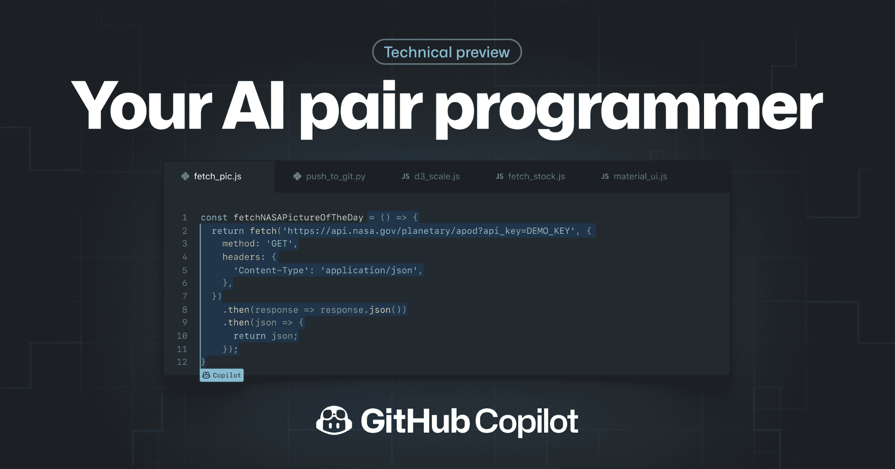
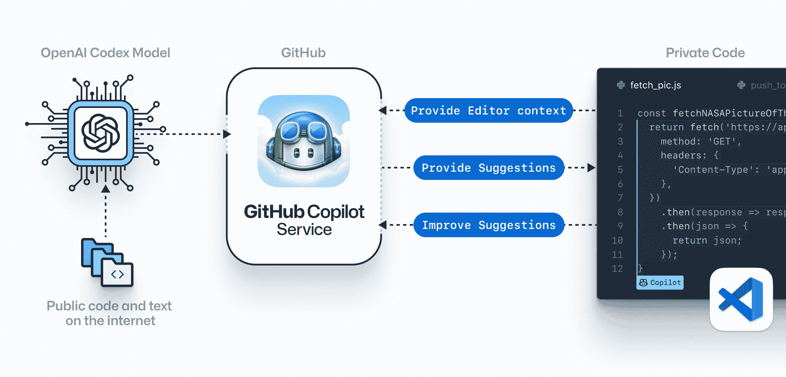

第五章：GPT-3 作为企业创新的下一步

当一个新的创新或技术转变发生时，大公司通常是最后一个采纳的。它们的等级结构由各种各样的权威级别组成，而标准的法律批准和文书工作流程经常限制了实验的自由，使得企业难以成为早期采用者。但是，对于 GPT-3 似乎并非如此。一旦 API 发布，公司就开始尝试。然而，他们遇到了一个重大障碍：数据隐私。

在其最简单的形式中，一个语言模型所做的就是预测给定一系列前置词的下一个词。正如您在第二章中了解到的，OpenAI 已经设计了几种技术，将语言模型（如 GPT-3）的功能从简单的下一个词预测转变为更有用的自然语言处理任务，例如回答问题、summarizing 文档和生成特定上下文的文本。通常，通过‘微调’一个语言模型或通过提供一些使用特定领域数据的示例来调节它以模仿特定行为，可以实现最佳结果。您可以提供训练提示的示例，但更强大的解决方案是使用微调 API 创建自定义训练模型。

OpenAI 以开放式 API 的形式提供 GPT-3，用户提供输入数据，API 返回输出数据。对于希望使用 GPT-3 的公司来说，正确保护、处理和处理用户数据是一个关键问题。OpenAI 的 Welinder 指出，虽然企业领导人对 GPT-3 表达了各种担忧，但“SOC2 合规性、地理围栏和在私人网络内运行 API 的能力是其中最重要的。”

OpenAI 针对模型安全和滥用的措施因此旨在涵盖数据隐私和安全的各种问题。例如，Stenography 的创始人亚当斯告诉我们关于 OpenAI API 的隐私和安全方面的内容。"目前，Stenography 是一个直通 API——就像一个收费公路。所以人们会传递他们的代码，然后收到一个信号，表示他们已经使用了 API，然后它会在任何地方都不保存或记录输入。"除了这些防护栏之外，Stenography 是[OpenAI 使用条款](https://openai.com/api/policies/terms/)的超集。

我们与几家公司的代表谈到了什么阻止他们在生产中使用 OpenAI API。大多数人都强调了两个常见的担忧：

●        由 OpenAI 公开的 GPT-3 API 端点不应保留或保存作为模型微调/训练过程的一部分提供给它的训练数据的任何部分。

●        在将其数据发送到 OpenAI API 之前，公司希望确保没有第三方可以通过向 API 提供任何输入来提取或访问数据的方式。

OpenAI 对以上客户关注的问题和对数据处理和隐私的疑问做出了回应，提供了安全审查、企业合同、数据处理协议、第三方安全认证工作等。一些客户和 OpenAI 讨论的问题包括客户的数据是否可以用来改进 OpenAI 模型，这可能会提高客户所需用例的性能，但也带来了数据隐私和内部合规义务方面的担忧；关于客户数据存储和保留的限制，以及对数据的安全处理和处理的义务。

本章的其余部分深入探讨了三个案例研究，展示了像 GitHub、微软和 Algolia 这样的全球企业如何应对这些问题，并在规模上使用 GPT-3。您还将了解 OpenAI 如何通过与微软 Azure 的 OpenAI 服务合作来适应企业级产品的需求。

案例研究：GitHub Copilot

让我们从 GitHub Copilot 开始这段旅程，它是 2021 年最热门的产品之一。GitHub Copilot（图 5-1）是一款首创的 AI 配对编程工具，可以帮助用户更快地编写代码，减少工作量。GitHub Next 的副总裁 Oege De Moor 表示，其使命是“触及所有开发者，最终目标是使编程对每个人都可访问。” 自动化繁琐的任务，如编写冗余代码和编写单元测试用例，使开发者可以“专注于工作中真正有创造力的部分，即决定软件实际应该做什么”，并且可以“更多地思考产品概念，而不是陷在编码中无法自拔。”

正如 Awan 告诉我们的：“我现在很兴奋地参与更多的副业项目，因为我知道我将有 GitHub Copilot 的帮助。这几乎就像我现在有了一个联合创始人。Codex 和 copilot 正在写我的代码的 2 到 10%，大约是这样。所以它已经让我加速了 2 到 10%。而且所有这些都是按指数增长的。那么明年 GPT-3 会是什么样子？明年 Codex 会是什么样子？我可能加速了 30%。” 让我们深入了解 Copilot 的内部工作原理。

图 5-1\. GitHub Copilot

工作原理

GitHub Copilot 从您正在处理的代码中提取上下文，基于 docstrings、注释和函数名称等信息。[[14]](xhtml-0-12.xhtml#aid_77) 然后，在您的编辑器中自动建议下一行，甚至整个函数，以生成样板代码并建议与代码实现相匹配的测试用例。通过使用插件到用户代码编辑器的方式，它可以与广泛的框架和编程语言一起使用，使其几乎是语言无关的，同时又轻量级且易于使用。

OpenAI 研究科学家 Harri Edwards 指出，Copilot 也是对于使用新语言或框架编程的程序员的一个有用工具：“试图通过 Google 搜索一切来编写不熟悉的语言的代码就像只带着一本小短语手册在一个陌生的国家中航行。使用 GitHub Copilot 就像雇佣了一位翻译。”

GitHub Copilot 由 OpenAI 的 Codex 提供支持，Codex 是 GPT-3 模型的一个后裔，正如我们在第四章中所提到的，它专门设计用于解释和编写代码。“GitHub 是超过 7300 万开发者的家园，其中包括了大量体现了社区集体知识的公开数据，”De Moor 说道。这意味着 Codex 有数十亿行公开可用的代码供其训练。它理解编程语言和人类语言。

Codex 根据简单英语中的支持性注释或说明提出相关的代码，如图 5-2 所示。Copilot 编辑器扩展智能地选择要发送到 GitHub Copilot 服务的上下文，后者再运行 OpenAI 的 Codex 模型来综合建议。尽管 Copilot 生成了代码，但用户仍然处于控制之中：你可以循环浏览建议的选项，选择接受或拒绝，以及手动编辑建议的代码。GitHub Copilot 会适应你所做的编辑，并匹配你的编码风格。De Moor 解释道，“它将自然语言与源代码联系起来，因此你可以在两个方向上使用它。你可以使用源代码生成注释，也可以使用注释生成源代码，使其具有极大的强大性。”

图 5-2\. GitHub Copilot 的工作原理

这项功能也间接改变了开发者编写代码的方式。当他们知道他们的代码注释在人类语言，比如英语中，将成为模型训练的一部分时，他们会写“更好更准确的注释，以获得 Copilot 更好的结果，”De Moor 表示。

许多批评者担心将这个工具交给不能判断代码质量的人可能会导致代码库中引入 bug 或错误。与此相反，De Moor 告诉我们，“我们收到了很多开发者的反馈，说 Copilot 让他们写出更好更高效的代码。”在当前的技术预览版中，只有当你理解软件中不同部分如何工作时，Copilot 才能帮助你编写代码，你可以准确地告诉 Copilot 你希望它做什么。Copilot 鼓励健康的开发者实践，比如编写更准确的注释，并用更好的代码生成奖励开发者。

Copilot 不仅仅局限于编程的一般规则，而且还可以找出特定领域的细节，比如编写作曲程序。为了做到这一点，你需要理解音乐理论来编写这样的程序，“从它庞大的训练数据中某种程度上学到这一点的 Copilot 实在令人惊讶，” De Moor 补充道。

Copilot 的开发

De Moor 表示 Copilot 设计的一个挑战是创建正确的用户体验，一个“让您以一种不具侵入性的方式共同使用此模型”的体验。目标是让它感觉像是与一个编程伙伴或同事一起工作，他“更了解琐碎的编码内容，因此您可以更专注于创建重要的内容。” 开发者不断地在寻找现有问题的解决方案，通常会参考 StackOverflow、搜索引擎和博客以查找实现和代码语法细节，这意味着编辑器和浏览器之间来回移动。正如 De Moor 指出的那样，“作为开发者，当您可以留在自己的环境中，只需考虑问题而不是一直切换上下文时，您会更有生产力。” 这就是为什么 GitHub 团队设计 Copilot 以在开发环境内提供建议的原因。

低代码/无代码编程是什么意思？

现在，开发与软件相关的产品或服务需要技术或科学背景——例如，您必须至少学习一种编程语言。而这只是一个开始。甚至要用传统技术开发最小可行产品（MVP），您也必须了解开发前端（用户如何与软件交互）和后端（处理逻辑如何工作）所涉及的软件工程的不同要素。这给那些没有技术或工程背景的人造成了进入的障碍。

De Moor 将 Copilot 视为使技术更易接触和包容的一步。如果开发者“越来越不用担心开发细节，只需解释设计，解释[他们]想要做的事情的目的”，让 Copilot 处理细节，那么更多的人将能够使用这些工具来创建新产品和服务。

已经有几个无代码编程平台，但许多用户发现它们的限制限制很大，本质上是通过“大大简化编程体验”，使其“更可视化、更图形化、更易于使用”，根据 De Moor 的说法。 “这些东西很适合入门，但不幸的是，它们在使用这些平台构建的事物上有一个限制。” De Moor 认为，Copilot 使用完全操作性的编程工具而不是简化版本，同样易于使用，但提供了更多选项。

通过 API 进行扩展

就语言模型而言，长期以来都低估了扩展的潜力，因为像[奥卡姆剃刀](https://zh.wikipedia.org/wiki/%E5%A5%A5%E5%8D%A1%E5%A7%86%E5%89%83%E5%88%80)这样的理论概念以及当你将神经网络扩展到相当规模时结果消失的问题。使用传统的深度学习，一直以来都是保持模型规模小，参数较少，以避免梯度消失问题，并在模型训练过程中引入复杂性。奥卡姆剃刀的原则是 - “一个简单的模型是最好的模型”，自其诞生以来一直是人工智能社区的圣经。它一直是训练新模型的参考中心，限制了人们尝试扩展的范围。

在 2020 年，当 OpenAI 推出其标志性语言模型 GPT-3 时，扩展的潜力开始受到关注。这是人工智能社区的共识开始转变，人们开始意识到“规模的恩赐”可以催生出更广义的人工智能，其中像 GPT-3 这样的单一模型可以执行一系列任务。

托管和管理像 GPT-3 这样的模型需要在许多不同层面上进行复杂的处理，包括优化模型架构、部署以及公众如何访问它。De Moor 告诉我们，“当我们推出 Copilot 时，在最初阶段使用的是 OpenAI API 基础设施，然后在推出后，我们迎来了大量用户的回应，有很多人注册并希望使用该产品。”

尽管 API 能够处理大量的请求，但请求的数量和频率仍然让 OpenAI 团队感到惊讶。De Moor 和他的团队“意识到了部署需要更高效和更大规模基础设施的需求，幸运的是，这正是微软 Azure OpenAI 被提出的时候”，使他们能够进行所需的切换到 Azure 部署基础设施。

当我们询问 De Moor 关于构建和扩展 Copilot 的经验时，他分享道，“早期我们错误地认为准确性是最重要的事情，但在产品发展的某个时候，我们意识到这实际上是强大的 AI 模型和无缺陷用户体验之间的权衡。” Copilot 团队很快意识到，在任何足够规模的深度学习模型中，速度和建议的准确性之间存在权衡。

通常，深度学习模型的层数越多，准确性就越高。然而，更多的层数也意味着运行速度会变慢。Copilot 团队必须在两者之间找到平衡，正如 de Moor 所解释的：“我们的用例要求模型以极快的速度提供响应，并提供多个备选建议；如果速度不够快，用户很容易超过模型并自行编写代码。因此，我们发现，一个稍微不那么强大但能够快速提供响应并保持结果质量的模型”是答案。

GitHub Copilot 的快速用户采用和兴趣让团队中的每个人都感到意外，但事情并没有就此结束。由于产品的用处和代码建议的质量，团队看到使用 Copilot 生成的代码量呈指数增长，其中“平均而言，35% 的新编写的代码是由 Copilot 建议的。随着我们接近找到模型能力和建议速度之间的正确平衡，这个数字还将继续增长。”De Moor 说。

当被问及作为请求的一部分提交的代码的数据安全性和隐私方面时，Moor 告诉我们，“Copilot 的架构设计使得当用户输入代码到 Copilot 时，不会有任何可能的代码泄霩到另一个用户之间。GitHub Copilot 是一个代码合成器而不是搜索引擎，它根据独特的算法生成大部分建议。在极少数情况下，大约 0.1% 的建议可能包含与训练集中发现的代码片段相同的片段。”

GitHub Copilot 的未来展望是什么？

 De Moor 认为 Copilot 在代码审查和编写方面有很大的潜力。 “想象一下自动代码审查员，它会自动查看您的更改并提出建议，使您的代码更好、更高效。 GitHub 的代码审查过程今天由人类审查员完成，我们也在探索 Copilot 审查的想法。”

另一个正在探讨的功能是代码解释。 De Moor 解释说，用户可以选择代码片段，“Copilot 可以用简单的英语解释它。” 这具有潜力成为一个有用的学习工具。此外，De Moor 表示，Copilot 希望提供辅助“将代码从一种编程语言翻译为另一种”的工具。

Copilot 打开了无限可能的世界，不仅仅是为开发人员，还为任何想要创造并构建一个软件来实现他们的想法的人。在 GitHub Copilot 和 OpenAI 的 Codex 之前，生成生产级代码、AI 辅助代码审查以及将代码从一种语言翻译为另一种语言的功能一直是一个遥不可及的梦想。大型语言模型的出现结合了无代码和低代码平台，将使人们释放创造力，并构建有趣和意想不到的应用程序。

案例研究：Algolia Answers

Algolia 是一家著名的搜索解决方案提供商，客户群从财富 500 强公司到新一代初创公司。它提供一个符号化的，基于关键词的搜索 API，可与任何现有产品或应用程序集成。在 2020 年，Algolia 与 OpenAI 合作，将 GPT-3 与其已经存在的搜索技术连接起来。下一代产品推出导致 Algolia Answers 的产生，该产品使客户能够构建一个智能的、以语义驱动的单一搜索终点，用于搜索查询。Algolia 产品经理 Dustin Coates 表示：“我们开发其他公司使用的技术。”

Coates 表示，他的团队所谓的智能搜索是指“您搜索某物并立刻收到回应 - 不仅是回到记录，不仅是回到文章 - 而是回到实际回答问题的内容。”简言之，这是“人们不必准确输入单词的搜索体验。”

评估 NLP 选项

Algolia 成立了一个专门团队来在这个领域工作，Claire Helme-Guizon 是最初的成员之一。当 OpenAI 与他们联系，询问 Algolia 是否对 GPT-3 感兴趣时，Coates 的团队将其与竞争技术进行了比较。Algolia ML 工程师 Claire Helme-Guizon 是最初 Algolia Answers 团队的成员之一，解释说：“我们研究了类似 BERT 的模型，以优化速度，DistilBERT，以及更稳定的像 RoBERTa 之类的模型，以及 GPT-3 的不同变体如 DaVinci，Ada 等。” 他们创建了一个评分系统来比较不同模型的质量，并了解它们的优势和劣势。他们发现，Coates 表示“它在检索结果质量方面表现得非常出色。” 速度和成本是弱点，但 API 最终是决定因素，因为它允许 Algolia 使用模型而无需维护基础设施。 Algolia 询问现有客户是否对这样的搜索体验感兴趣，反馈非常积极。

即使有了这样优质的结果，Algolia 仍然有很多问题：它如何适用于客户？架构是否可扩展？财政上是否可行？为了回答这些问题，Coates 解释说：“我们设计了具有更长文本内容的特定用例”，例如出版和帮助台。

对于某些使用案例，仅依靠 GPT-3 来获取搜索结果就足够了，但对于其他复杂的使用案例，您可能需要将 GPT-3 与其他模型集成。由于 GPT-3 只是在某个时间点之前的数据上进行训练，因此在涉及新鲜度、流行度或个性化结果的使用案例中，它会遇到困难。在结果质量方面，Algolia 团队面临的挑战是，GPT-3 生成的语义相似性得分并不是他们的客户关心的唯一指标。他们需要以某种方式将相似性得分与其他指标结合起来，以确保客户获得满意的结果。因此，他们引入了其他开源模型，以与 GPT-3 结合以突出最佳结果。

数据隐私

Algolia 在引入这项新技术时面临的最大挑战，Coates 表示，是法律方面的问题。“在整个项目中，通过法律、安全和采购可能是我们做的最困难的事情，因为你正在发送这些客户数据，它正在为这个 ML 模型提供数据。我们如何删除这些数据？我们如何确保它符合 GDPR 的要求？我们如何处理所有这些事情？我们怎么知道 OpenAI 不会拿这些数据并用它来喂其他人的模型呢？因此，有很多问题需要回答，有很多协议需要制定。”

成本

到目前为止，我们见过的大多数 GPT-3 使用案例都是面向消费者的产品，但对于像 Algolia 这样的企业对企业（B2B）公司来说，情况就不同了。他们不仅需要 OpenAI 的定价适用于他们，而且还需要优化他们的定价以满足客户的需求，以便“我们可以盈利并且客户仍然对我们所构建的内容感兴趣。”

在搜索解决方案业务中，成功是以吞吐量为基础来衡量的。因此，自然而然地会考虑质量、成本和速度之间的权衡。Coates 说：“即使在我们知道成本之前，Ada 对我们来说也是正确的模型，因为速度很快。但是即使，比如说，Davinci 足够快，我们也可能因为成本问题而最终选择 Ada。”

Helme-Guizon 指出，影响成本的因素包括“代币数量以及您发送的文档数量和长度。” Algolia 的方法是构建“尽可能小的上下文窗口”——这意味着一次发送到 API 的数据量足够“质量上还是足够相关的”。

那么他们是如何解决这个问题的呢？“我们在 OpenAI 宣布定价之前就开始使用了，我们已经做了很多工作，并且看到了质量足够好，而我们又不知道定价是多少。所以那段时间我们睡不好觉，不知道定价是多少。然后一旦我们知道了定价，就要想办法降低成本。因为当我们第一次看到定价时，我们不确定我们是否能够承受。”

他们确实在优化价格方面做了很多工作，因为根据 Coates 的说法，定价将对每个试图在其基础上构建业务的人来说都是一个“普遍的挑战”。因此，强烈建议在产品开发的早期阶段开始考虑价格优化。

速度和延迟

速度对 Algolia 尤为重要；该公司承诺为其客户提供闪电般快速的搜索能力，延迟仅限于毫秒级别。当团队评估 Open AI 的提案时，他们对结果的质量感到满意，但是 GPT-3 的延迟是无法接受的。Coates 说：“在我们的传统搜索中，结果往返时间少于 50 毫秒。”“我们在数亿个文档中进行搜索，必须是实时的。当我们早期与 OpenAI 合作时，每个查询都需要几分钟。”

Algolia 确实决定尝试 GPT-3，并开始了 Algolia Answers 的初始实验和测试阶段。然而，为了降低延迟和成本，需要付出很多努力。 “我们开始时的总延迟约为 300 毫秒，有时候到 400 毫秒，我们必须将其降低到 50 到 100 毫秒的范围内，以使我们的客户能够使用。”最终，Algolia 提出了语义突出显示，这是一种使用在 GPT-3 之上的训练问答模型的技术，用于执行迷你搜索并找出正确答案。结合 GPT-3 和其他开源模型，可以减少总体延迟。Helme-Guizon 补充说，他们的结果质量更好，因为“这些模型被训练来找到答案，而不仅仅是相关的单词。”

Algolia Answers 体系结构的一个关键方面，Helme-Guizon 说，是读者检索体系结构，在这个体系结构中，一个 AI 读者会“浏览子集文件，并阅读它们，借助 Ada 理解它们，并为语义值给出信心分数。”虽然这是一个“不错的解决方案”，但是她补充说，它有很多挑战-“特别是延迟问题，因为你有一个依赖关系，无法异步处理第一批和第二批”。

GPT-3 使用预测结果的嵌入来计算余弦相似度，这是一种用于确定两篇文档相似程度的数学度量，与其大小无关。Coates 总结了这些挑战：首先，“你不能发送太多文件，否则响应速度将太慢，或者成本将过高”。 第二个挑战是“在保持时间和成本可控的同时，将网梳得足够宽以获取所有相关文档”。

启示与教训

那么，如果 Algolia Answers 今天必须从零开始，他们会有什么不同的做法呢？“与 GPT-3 一起工作有时会让人不知所措，”Coates 说。“我们会在产品开发的早期阶段提出一些原则性问题，比如‘我们是否愿意在语义理解方面有所损失，因为我们在其他方面的提升大了许多？’我认为我们在初期应该更多地考虑延迟和不同排序因素的融合。”他补充说，他可以设想这个项目“回到基于 BERT 模型。我们可能会说，原始质量与我们从 GPT-3 得到的不一样。这是不可否认的。但是我认为，尽管我们爱上了这项技术，但我们发现了一些我们没有解决的客户问题，技术必须跟随客户问题，而不是相反。”

那么 Algolia 对搜索的未来有何看法？“我们认为没有人真正解决了文本相关性和语义相关性的融合问题。这是一个非常困难的问题，因为有时虽然事物在文本上相关，却并不能真正回答问题，”Coates 说道。他设想“将更传统的、文本基础、更可理解和可解释的一面与这些更高级的语言模型结合起来。”

案例研究：微软的 Azure OpenAI 服务

Algolia 在 OpenAI API 上已经成熟，但很快他们想要扩展他们的业务到欧洲 - 这意味着他们需要遵守 GDPR 合规性。他们开始与微软合作，微软当时正在推出 Azure OpenAI 服务。在下一个案例研究中，我们将了解该服务。

一场注定的合作伙伴关系

微软和 OpenAI 在 2019 年宣布合作伙伴关系，目标是让微软 Azure 的客户能够使用 GPT-3 的能力。这个合作伙伴关系基于双方对确保人工智能和通用人工智能的安全部署的共同愿景。微软对 OpenAI 进行了 10 亿美元的投资，为 API 的推出提供了资金支持，该 API 运行在 Azure 上。这个合作伙伴关系最终导致了 API 的发布，以使更多人能够访问大型语言模型。

Dominic Divakaruni，Azure OpenAI 服务总产品经理兼负责人表示，他一直认为这种合作伙伴关系就像是注定的合作伙伴关系，他指出微软 CEO Satya Nadella 和 OpenAI CEO Sam Altman 都经常谈到确保 AI 的好处是可访问和广泛分发的。两家公司都关注 AI 创新的安全性。

Divakaruni 表示，目标是“利用彼此的优势”，特别是 OpenAI 的用户体验和建模进展以及 Microsoft 与公司、大型销售人员和云基础设施之间的现有关系。鉴于其客户基础，Microsoft Azure 在合规性、认证、网络安全和相关问题方面了解企业云客户的基本要求。

对于 Microsoft 来说，对 GPT-3 的兴趣主要在于它在 LLM 类别中独占鳌头，并在其他任何模型之前提供。Microsoft 投资的另一个关键因素是其获得了独家使用 OpenAI 的知识产权资产的能力。虽然存在 GPT-3 的替代方案，但 Divarakuni 表示，OpenAI API 的中心化是独一无二的。他指出，像文本分析或翻译这样的服务模型需要云提供商做“相当多的工作”来适应 API 服务。然而，OpenAI 提供的是“用于各种任务的相同 API”，而不是为特定任务创建的“特别定制的 API”。

Azure 本机 OpenAI API

OpenAI 知道云基础架构对于他们的扩展非常重要。从 OpenAI API 的初始阶段开始，其想法一直是在 Azure 中拥有 API 的实例，以便更多地接触到客户。Divakaruni 提到，OpenAI API 和 Azure OpenAI Service 平台之间存在更多的相似之处而不是差异。从技术角度来看，目标非常相似：为人们提供相同的 API 和对相同模型的访问。Azure OpenAI Service 的形态将更加本机 Azure，但他们希望匹配 OpenAI 客户的开发者体验，特别是当其中一些客户从 OpenAI API 过渡到 Azure OpenAI Service 时。

在编写本书的时候，我们捕捉到 Azure OpenAI 服务团队仍在全面启动平台，还有很多问题需要解决，然后才能向广大客户发布。OpenAI Service 现在正在向其服务中添加越来越多的模型，并希望在可用模型方面最终与 OpenAI API 保持平衡或只落后几个月。

资源管理

这两个服务之间的一个区别在于它们如何处理资源管理。资源是通过服务（无论是 OpenAI API 还是 Microsoft Azure）提供的可管理的项目。在 OpenAI 的情况下，资源的示例可以是 API 帐户或与帐户相关联的积分池。Azure 提供了一组更复杂的资源，例如虚拟机、存储帐户、数据库、虚拟网络、订阅和管理组。

虽然 OpenAI 为每个组织提供单个 API 帐户，但在 Azure 中，公司可以创建多个不同的资源，可以对其进行跟踪、监视和分配给不同的成本中心。“它基本上只是另一个通用的 Azure 资源。” 微软 Azure OpenAI 服务的高级项目经理 Christopher Hoder 表示，这使得它易于开箱即用。

Azure 中的资源管理是一种部署和管理功能，使客户能够在 Azure 帐户中创建、更新和删除资源。它提供访问控制、锁定和标记等功能，以在部署后安全组织和管理客户资源。

Azure 具有多个层次的资源管理，使公司和组织能够更好地管理定价和资源，Hoder 表示。在较高层次上，有一个组织级别的 Azure 帐户，然后在该帐户中，有多个 Azure 订阅。在其中，有资源组，然后是资源本身。“所有这些都可以进行监控、分段和访问控制，” Hoder 补充道，这在规模化部署中变得尤为重要。

安全和数据隐私

尽管微软到目前为止对其安全性没有公开过多的信息，但 Divakaruni 告诉我们，公司专注于三个主要方面：内容过滤器、滥用监控和以安全为首要考虑的方法。团队正在努力开发更多的安全强制元素，并计划利用客户反馈来了解哪些元素对用户最有意义，然后在正式推出之前加以实施。

他们还正在编写文档，概述隐私政策实施的架构，他们将与客户共享这些文档，以提供保证，即他们正在保护客户数据，同时确保他们履行了对人工智能的负责任使用的义务。“许多来找我们的客户对目前在 OpenAI 上的实现方式表示担忧，因为它更加开放，而我们正在解决[这些担忧]，” Divakaruni 表示。

内容过滤器以 PII（个人身份信息）过滤器、阻止性和其他类型内容的过滤器的形式引入，他们目前仍在确定其范围。“这里的理念是为客户提供合适的旋钮，以调整和迭代其特定领域的内容，” Divakaruni 表示。

微软的企业客户对安全性要求严格。Azure OpenAI API 服务团队正在利用其为其他产品（如必应和 Office）所做的工作。微软在模型开发和突破方面有着丰富的经验。“Office 已经提供了一段时间的语言产品。因此，在这个空间中我们有相当广泛的内容审查能力……我们还有一个专门负责为这些模型构建合适的过滤器的科学团队，” Divakaruni 说道。

OpenAI API 的用户经常请求地理围栏技术，这是一种在真实地理区域周围设置虚拟边界的技术。如果数据移动到指定半径之外，它可以触发地理启用手机或其他便携式电子设备中的操作。例如，它可以在人员进入或退出地理围栏时向管理员发出警报，并以推送通知或电子邮件的形式向用户的移动设备生成警报。地理围栏使企业能够准确跟踪、营销和有效地向管理员发出警报，当地理围栏创建存储数据的特定位置时， Azure 的地理围栏功能仍在积极研发中，但 Divakaruni 表示，已经根据一些特选客户的实验性实施，例如 GitHub Copilot。

在企业级别的模型即服务

尽管 Azure OpenAI 服务已经与许多大型企业客户在平台上合作，但公司尚未准备公开讨论它们，理由是隐私问题和公众舆论的敏感性。他们现在可以提及的是一些内部服务的例子。GitHub Copilot 最初是基于 OpenAI API，但现在，主要是出于规模考虑，已经过渡到 Azure OpenAI 服务。在 Azure 上运行的其他内部服务的例子包括 Dynamics 365 客户服务、Power Apps、ML to code 以及 Power BI 服务。

Divakaruni 表示，他们看到了金融服务行业和传统企业对提升客户体验的浓厚兴趣。“需要处理大量文本信息，并且需要摘要和帮助分析师，例如，快速锁定对他们有意义和相关的文本。客户服务行业，我认为，也是一个巨大的未开发领域。有大量信息被锁定在音频中，可以被转录，呼叫中心信息可能是对试图改善客户体验的公司有意义的见解。” 他们正在看到的另一组用例是公司通过为其内部 API 和软件开发工具培训 GPT-3 来加速开发人员的生产力，以使这些工具更易于员工使用。

Divakaruni 指出，许多业务的核心实力不在于人工智能或机器学习的企业希望以增加业务流程的有意义的方式应用人工智能，或者增强他们的客户体验。他们利用微软的领域实力帮助他们构建解决方案。Azure OpenAI Service 团队完全期待其复杂的模型即服务方法成为主流，Hoder 说。他指出，微软通过将其嵌入到 Office 和 Dynamics 等消费应用程序中提供了其即用即用的体验。需要更独特或定制支持的客户会下降到像 Power 平台这样的服务层，该平台旨在面向企业用户和开发人员，提供无代码或低代码方式来定制机器学习和人工智能。“如果你进一步降低一点，更加定制化，更加专注于开发人员，你最终会到达认知服务。通过 REST API 为服务提供 AI 能力一直是我们的模式。现在我们正在引入一个更加细化的层次，即 OpenAI Service。...然后在底层，我们有面向数据科学的工具，即 Azure Machine Learning。” Hoder 解释。

微软认为 Azure OpenAI Service 有很大的客户需求，但也可以为其迄今在其他服务方面的成功作保证，比如语音服务和表单识别器。“我们看到很多客户需要的能力是能够获取图像，以结构化方式提取信息并从 PDF 中提取表格和其他信息以进行自动化数据摄入，然后结合分析和搜索能力。” Hoder 说。（例如，查看此[案例研究](https://news.microsoft.com/transform/progressive-gives-voice-to-flos-chatbot-and-its-as-no-nonsense-and-reassuring-as-she-is/)，了解客户如何使用其基于 REST API 的人工智能/机器学习服务。）

其他微软人工智能和机器学习服务

Azure OpenAI Service 会影响微软产品线中的其他人工智能/机器学习服务吗，比如 Azure ML Studio？Divakaruni 告诉我们市场上对两者都有需求：“绝对不是一家独大。市场上需要提供满足特定客户需求的多种解决方案。”他告诉我们。客户的需求可能大相径庭。他们可能需要生成然后标记特定于其特定用例的数据。他们可以使用 Azure Machine Learning、SageMaker 等平台从头开始构建模型，然后为此目的训练一个精简的、更小的模型。

当然，这是大多数人无法接触的一个利基市场。霍德尔指出，将数据科学能力带给客户“扩大了接触面，使其民主化。”迪瓦卡鲁尼同意：“你会越来越多地看到一个趋势，即最大、最复杂的模型通过服务公开，而不是人们去构建自己的模型。”为什么呢？“根本的事实是，训练这些模型需要大量的计算和大量的数据。能够开发这些模型的公司很少。但作为我们所做的，我们有责任使它们对世界可用。”

通常，能够负担昂贵资源的公司的数据科学团队强烈倾向于为其特定用例构建自己的 IP，使用像 Azure ML Studio 这样的低级 ML 平台。迪瓦卡鲁尼认为，这种需求不太可能消失。

企业建议

研究 Azure OpenAI Service 的企业可以像研究其他任何云服务一样，迪瓦卡鲁尼说：你从最合适你的地方开始，然后看看各种技术是否满足你的需求。“虽然技术很酷，这确实有一种哇的因素，但你仍然必须从‘这对我作为企业，对我的团队最适用的地方是哪里开始’。然后用一系列技术来解决这个问题。”

下一步是审查如何从实验转入生产：“你需要构建什么其他东西？”迪瓦卡鲁尼将这一步称为“需要有人注入的应用粘合剂，确保这些模型实际上能够发挥作用并在实际应用场景中使用”。这是一项非常重要的任务，但企业需要考虑这一点，以了解基于 GPT-3 的应用程序将需要什么样的投资。迪瓦卡鲁尼建议问：“当您有自动化环绕时，该模型实际上是否产生了相关的东西？当它实际内置到一个应用程序中时，它是否在做它应该做的事情？”

OpenAI 还是 Azure OpenAI Service：你应该使用哪个？

那么，对于有兴趣探索 GPT-3 的公司来说，问题是：OpenAI API 还是 Azure OpenAI Service？迪瓦卡鲁尼认为，OpenAI API 版本更适合正在探索其选择但没有任何具体项目实施计划的公司。在访问方面，OpenAI 显然走在前面，其 Playground 使个人用户和公司更容易在那里进行实验。OpenAI API 还允许访问最新的实验模型和扩展 API 功能的 API 端点。

另一方面，Azure OpenAI 服务正针对一批具有生产用例的用户群，这些用户“毕业”于 OpenAI API，或需要满足不同的合规性和隐私法规。这两家组织鼓励客户进行实验，并验证其用例，并使用 OpenAI API 加以巩固。如果该平台满足其需求，微软鼓励客户继续使用 OpenAI API，但当他们的生产需求变得更加成熟，并且开始需要更多的合规性时，他们应考虑过渡到 Azure。

结论

在本章中，您看到了企业如何大规模使用基于 GPT-3 的产品，以及新的 Microsoft Azure OpenAI 服务如何为有意加入 GPT-3 生态系统的企业铺平道路。我们深入探讨了扩展 GPT-3 驱动产品的细微差别，并分享了一些来自大规模企业级产品旅程的技巧。在第六章中，我们将探讨围绕 OpenAI API 和 LLMs 的一些争议和挑战。
