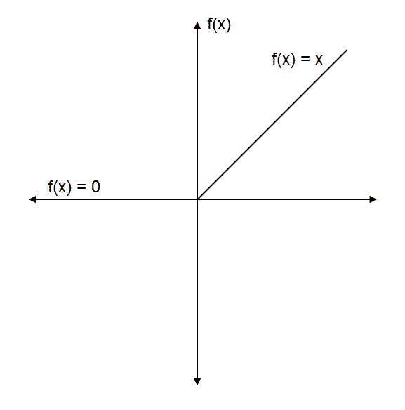
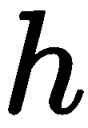
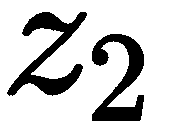

# 深度学习简介

深度学习是机器学习的一个子集，灵感来自人类大脑中的神经网络。它已经存在了十年，但现在之所以如此流行，是由于计算能力的提升和大量数据的可用性。有了大量的数据，深度学习算法表现优于经典的机器学习。它已经在计算机视觉、**自然语言处理**（**NLP**）、语音识别等多个跨学科科学领域得到广泛应用和变革。

在本章中，我们将学习以下主题：

+   深度学习的基本概念

+   生物和人工神经元

+   人工神经网络及其层次

+   激活函数

+   人工神经网络中的前向和后向传播

+   梯度检查算法

+   从头开始构建人工神经网络

# 什么是深度学习？

深度学习其实只是具有多层的人工神经网络的现代称谓。那么深度学习中的“深”指的是什么？基本上是由于**人工神经网络**（**ANN**）的结构。ANN 由若干层组成，用于执行任何计算。我们可以建立一个具有数百甚至数千层深度的网络。由于计算能力的提升，我们可以构建一个具有深层次的网络。由于 ANN 使用深层进行学习，我们称之为深度学习；当 ANN 使用深层进行学习时，我们称之为深度网络。我们已经了解到，深度学习是机器学习的一个子集。深度学习与机器学习有何不同？什么使深度学习如此特别和流行？

机器学习的成功取决于正确的特征集。特征工程在机器学习中起着至关重要的作用。如果我们手工制作了一组合适的特征来预测某一结果，那么机器学习算法可以表现良好，但是找到和设计合适的特征集并非易事。

在深度学习中，我们无需手工制作这些特征。由于深层次的人工神经网络采用了多层，它可以自动学习复杂的内在特征和多层次的抽象数据表示。让我们通过一个类比来探讨这个问题。

假设我们想执行一个图像分类任务。比如说，我们要学习识别一张图像是否包含狗。使用机器学习时，我们需要手工设计能帮助模型理解图像是否包含狗的特征。我们将这些手工设计的特征作为输入发送给机器学习算法，然后它们学习特征与标签（狗）之间的映射关系。但是从图像中提取特征是一项繁琐的任务。使用深度学习，我们只需将一堆图像输入到深度神经网络中，它将自动充当特征提取器，通过学习正确的特征集。正如我们所学到的，人工神经网络使用多个层次；在第一层中，它将学习表征狗的基本特征，例如狗的体态，而在后续层次中，它将学习复杂的特征。一旦学习到正确的特征集，它将查找图像中是否存在这些特征。如果这些特征存在，则说明给定的图像包含狗。因此，与机器学习不同的是，使用深度学习时，我们不必手动设计特征，而是网络自己学习任务所需的正确特征集。

由于深度学习的这一有趣特性，在提取特征困难的非结构化数据集中，例如语音识别、文本分类等领域中，它被广泛应用。当我们拥有大量的大型数据集时，深度学习算法擅长提取特征并将这些特征映射到它们的标签上。话虽如此，深度学习并不仅仅是将一堆数据点输入到深度网络中并获得结果。这也并非那么简单。我们将会探索的下一节内容中会讨论到，我们会有许多超参数作为调节旋钮，以获得更好的结果。

尽管深度学习比传统的机器学习模型表现更好，但不建议在较小的数据集上使用 DL。当数据点不足或数据非常简单时，深度学习算法很容易对训练数据集过拟合，并且在未见过的数据集上泛化能力不佳。因此，我们应仅在有大量数据点时应用深度学习。

深度学习的应用是多种多样且几乎无处不在的。一些有趣的应用包括自动生成图像标题，为无声电影添加声音，将黑白图像转换为彩色图像，生成文本等等。谷歌的语言翻译、Netflix、亚马逊和 Spotify 的推荐引擎以及自动驾驶汽车都是由深度学习驱动的应用程序。毫无疑问，深度学习是一项颠覆性技术，在过去几年取得了巨大的技术进步。

在本书中，我们将通过从头开始构建一些有趣的深度学习应用来学习基本的深度学习算法，这些应用包括图像识别、生成歌词、预测比特币价格、生成逼真的人工图像、将照片转换为绘画等等。已经兴奋了吗？让我们开始吧！

# 生物和人工神经元

在继续之前，首先我们将探讨什么是神经元以及我们的大脑中的神经元实际工作原理，然后我们将了解人工神经元。

**神经元**可以被定义为人类大脑的基本计算单位。神经元是我们大脑和神经系统的基本单元。我们的大脑大约有 1000 亿个神经元。每一个神经元通过一个称为**突触**的结构相互连接，突触负责从外部环境接收输入，从感觉器官接收运动指令到我们的肌肉，以及执行其他活动。

神经元还可以通过称为**树突**的分支结构从其他神经元接收输入。这些输入根据它们的重要性加强或减弱，然后在称为**细胞体**的细胞体内汇总在一起。从细胞体出发，这些汇总的输入被处理并通过**轴突**发送到其他神经元。

单个生物神经元的基本结构如下图所示：


现在，让我们看看人工神经元是如何工作的。假设我们有三个输入![], ![], 和 ![], 来预测输出![]。这些输入分别乘以权重![], ![], 和 ![]，并按以下方式求和：


但是为什么我们要用权重乘以这些输入呢？因为在计算输出时，并不是所有的输入都同等重要！。假设在计算输出时比其他两个输入更重要。那么，我们给![]赋予比其他两个权重更高的值。因此，在将权重与输入相乘后，![]将比其他两个输入具有更高的值。简单来说，权重用于加强输入。在用权重乘以输入之后，我们将它们加在一起，再加上一个叫做偏置的值，：


如果你仔细观察前面的方程式，它看起来可能很熟悉？![] 看起来像线性回归的方程式吗？难道它不就是一条直线的方程式吗？我们知道直线的方程式如下所示：


这里，*m* 是权重（系数），*x* 是输入，*b* 是偏置（截距）。

好吧，是的。那么，神经元和线性回归之间有什么区别呢？在神经元中，我们通过应用称为**激活**或**传递函数**的函数 ，引入非线性到结果 。因此，我们的输出变为：


下图显示了单个人工神经元：


因此，一个神经元接收输入 *x*，将其乘以权重 *w*，加上偏置 *b*，形成 ，然后我们在  上应用激活函数，并得到输出 。

# ANN 及其层

尽管神经元非常强大，但我们不能仅使用一个神经元执行复杂任务。这就是为什么我们的大脑有数十亿个神经元，排列成层，形成一个网络的原因。同样，人工神经元也被排列成层。每一层都将以信息从一层传递到另一层的方式连接起来。

典型的人工神经网络由以下层组成：

+   输入层

+   隐藏层

+   输出层

每一层都有一组神经元，而且一层中的神经元会与其他层中的所有神经元进行交互。然而，同一层中的神经元不会相互作用。这是因为相邻层的神经元之间有连接或边缘；然而，同一层中的神经元之间没有任何连接。我们使用术语**节点**或**单元**来表示人工神经网络中的神经元。

下图显示了典型的人工神经网络（ANN）：


# 输入层

**输入层**是我们向网络提供输入的地方。输入层中的神经元数量等于我们向网络提供的输入数量。每个输入都会对预测输出产生一定影响。然而，输入层不进行任何计算；它只是用于将信息从外部世界传递到网络中。

# 隐藏层

输入层和输出层之间的任何层称为**隐藏层**。它处理从输入层接收到的输入。隐藏层负责推导输入和输出之间的复杂关系。也就是说，隐藏层识别数据集中的模式。它主要负责学习数据表示并提取特征。

隐藏层可以有任意数量；然而，我们根据使用情况选择隐藏层的数量。对于非常简单的问题，我们可以只使用一个隐藏层，但在执行像图像识别这样的复杂任务时，我们使用许多隐藏层，每个隐藏层负责提取重要特征。当我们有许多隐藏层时，网络被称为**深度神经网络**。

# 输出层

在处理输入后，隐藏层将其结果发送到输出层。顾名思义，输出层发出输出。输出层的神经元数量基于我们希望网络解决的问题类型。

如果是二元分类，则输出层的神经元数量为 1，告诉我们输入属于哪个类别。如果是多类分类，比如五类，并且我们想要得到每个类别的概率作为输出，则输出层的神经元数量为五个，每个神经元输出概率。如果是回归问题，则输出层有一个神经元。

# 探索激活函数

**激活函数**，也称为**传递函数**，在神经网络中起着至关重要的作用。它用于在神经网络中引入非线性。正如我们之前学到的，我们将激活函数应用于输入，该输入与权重相乘并加上偏置，即，，其中*z = (输入 * 权重) + 偏置*，是激活函数。如果不应用激活函数，则神经元简单地类似于线性回归。激活函数的目的是引入非线性变换，以学习数据中的复杂潜在模式。

现在让我们看看一些有趣的常用激活函数。

# Sigmoid 函数

**Sigmoid 函数**是最常用的激活函数之一。它将值缩放到 0 到 1 之间。Sigmoid 函数可以定义如下：


这是一个如下所示的 S 形曲线：


它是可微的，意味着我们可以找到任意两点处曲线的斜率。它是**单调**的，这意味着它要么完全非递减，要么非递增。Sigmoid 函数也称为**logistic**函数。由于我们知道概率介于 0 和 1 之间，由于 Sigmoid 函数将值压缩在 0 和 1 之间，因此用于预测输出的概率。

Python 中可以定义 sigmoid 函数如下：

```py
def sigmoid(x):

    return 1/ (1+np.exp(-x))
```

# 双曲正切函数

**双曲正切（tanh）**函数将值输出在 -1 到 +1 之间，表达如下：


它也类似于 S 形曲线。与 Sigmoid 函数以 0.5 为中心不同，tanh 函数是以 0 为中心的，如下图所示：


与 sigmoid 函数类似，它也是一个可微且单调的函数。tanh 函数的实现如下：

```py
def tanh(x):
    numerator = 1-np.exp(-2*x)
    denominator = 1+np.exp(-2*x)

    return numerator/denominator
```

# 矫正线性单元函数

**矫正线性单元（ReLU）**函数是最常用的激活函数之一。它输出从零到无穷大的值。它基本上是一个**分段函数**，可以表达如下：


即当 *x* 的值小于零时， 返回零，当 *x* 的值大于或等于零时， 返回 *x*。也可以表达如下：


ReLU 函数如下图所示：



如前图所示，当我们将任何负输入传入 ReLU 函数时，它将其转换为零。所有负值为零的这种情况被称为**dying ReLU**问题，如果神经元总是输出零，则称其为死神经元。ReLU 函数的实现如下：

```py
def ReLU(x):
    if x<0:
        return 0
    else:
        return x
```

# 泄漏 ReLU 函数

**泄漏 ReLU**是 ReLU 函数的一个变种，可以解决 dying ReLU 问题。它不是将每个负输入转换为零，而是对负值具有小的斜率，如下所示：


泄漏 ReLU 可以表达如下：


 的值通常设置为 0.01。泄漏 ReLU 函数的实现如下：

```py
def leakyReLU(x,alpha=0.01):
    if x<0:
        return (alpha*x)
    else:
        return x
```

不要将一些默认值设置为 ，我们可以将它们作为神经网络的参数发送，并使网络学习  的最优值。这样的激活函数可以称为**Parametric ReLU**函数。我们也可以将  的值设置为某个随机值，这被称为**Randomized ReLU**函数。

# 指数线性单元函数

**指数线性单元** (**ELU**)，类似于 Leaky ReLU，在负值时具有小的斜率。但是它不是直线，而是呈现对数曲线，如下图所示：


可以表达如下：


`ELU` 函数在 Python 中的实现如下：

```py
def ELU(x,alpha=0.01):
    if x<0:
        return ((alpha*(np.exp(x)-1))
    else:
        return x
```

# Swish 函数

**Swish** 函数是 Google 最近引入的激活函数。与其他激活函数不同，Swish 是非单调函数，即它既不总是非递减也不总是非增加。它比 ReLU 提供更好的性能。它简单且可以表达如下：


这里， 是 sigmoid 函数。Swish 函数如下图所示：


我们还可以重新参数化 Swish 函数，并将其表达如下：


当  的值为 0 时，我们得到恒等函数 。

它变成了一个线性函数，当  的值趋于无穷大时， 变成了 ，这基本上是 ReLU 函数乘以某个常数值。因此， 的值在线性和非线性函数之间起到了很好的插值作用。Swish 函数的实现如下所示：

```py
def swish(x,beta):
    return 2*x*sigmoid(beta*x)
```

# Softmax 函数

**Softmax 函数** 基本上是 sigmoid 函数的一般化。它通常应用于网络的最后一层，并在执行多类别分类任务时使用。它给出每个类别的概率作为输出，因此 softmax 值的总和始终等于 1。

可以表示如下：


如下图所示，softmax 函数将它们的输入转换为概率：


可以在 Python 中如下实现 `softmax` 函数：

```py
def softmax(x):
    return np.exp(x) / np.exp(x).sum(axis=0)
```

# 人工神经网络中的前向传播

在本节中，我们将看到神经网络学习的过程，其中神经元堆叠在层中。网络中的层数等于隐藏层数加上输出层数。在计算网络层数时，我们不考虑输入层。考虑一个具有一个输入层 、一个隐藏层  和一个输出层  的两层神经网络，如下图所示：


假设我们有两个输入，  和 ，我们需要预测输出，。由于有两个输入，输入层中的神经元数为两个。我们设置隐藏层中的神经元数为四个，输出层中的神经元数为一个。现在，输入将与权重相乘，然后加上偏置，并将结果传播到隐藏层，在那里将应用激活函数。

在此之前，我们需要初始化权重矩阵。在现实世界中，我们不知道哪些输入比其他输入更重要，因此我们会对它们进行加权并计算输出。因此，我们将随机初始化权重和偏置值。输入层到隐藏层之间的权重和偏置值分别由  和  表示。那么权重矩阵的维度是多少呢？权重矩阵的维度必须是 *当前层中的神经元数* x *下一层中的神经元数*。为什么呢？

因为这是基本的矩阵乘法规则。要将任意两个矩阵 *AB* 相乘，矩阵 *A* 的列数必须等于矩阵 *B* 的行数。因此，权重矩阵  的维度应为 *输入层中的神经元数* x *隐藏层中的神经元数*，即 2 x 4：


上述方程表示，。现在，这将传递到隐藏层。在隐藏层中，我们对  应用激活函数。让我们使用 sigmoid  激活函数。然后，我们可以写成：


应用激活函数后，我们再次将结果  乘以一个新的权重矩阵，并添加一个在隐藏层和输出层之间流动的新偏置值。我们可以将这个权重矩阵和偏置表示为  和 ，分别。权重矩阵  的维度将是 *隐藏层神经元的数量* x *输出层神经元的数量*。由于我们隐藏层有四个神经元，输出层有一个神经元，因此  矩阵的维度将是 4 x 1。所以，我们将  乘以权重矩阵，，并添加偏置，，然后将结果  传递到下一层，即输出层：


现在，在输出层，我们对  应用 sigmoid 函数，这将产生一个输出值：


从输入层到输出层的整个过程被称为 **前向传播**。因此，为了预测输出值，输入被从输入层传播到输出层。在这个传播过程中，它们在每一层上都乘以各自的权重，并在其上应用一个激活函数。完整的前向传播步骤如下所示：


前向传播的步骤可以在 Python 中实现如下：

```py
def forward_prop(X):
    z1 = np.dot(X,Wxh) + bh
    a1 = sigmoid(z1)
    z2 = np.dot(a1,Why) + by
    y_hat = sigmoid(z2)

    return y_hat
```

前向传播很酷，不是吗？但是我们如何知道神经网络生成的输出是否正确？我们定义一个称为 **代价函数** () 或者 **损失函数** () 的新函数，这个函数告诉我们神经网络的表现如何。有许多不同的代价函数。我们将使用均方误差作为一个代价函数，它可以定义为实际输出和预测输出之间平方差的均值：


这里， 是训练样本的数量， 是实际输出， 是预测输出。

好的，所以我们学到了成本函数用于评估我们的神经网络；也就是说，它告诉我们我们的神经网络在预测输出方面表现如何。但问题是我们的网络实际上是在哪里学习的？在前向传播中，网络只是尝试预测输出。但是它如何学习预测正确的输出呢？在接下来的部分，我们将探讨这个问题。

# ANN 如何学习？

如果成本或损失非常高，那么意味着我们的网络没有预测出正确的输出。因此，我们的目标是最小化成本函数，这样我们神经网络的预测就会更好。我们如何最小化成本函数呢？也就是说，我们如何最小化损失？我们学到神经网络使用前向传播进行预测。因此，如果我们能在前向传播中改变一些值，我们就可以预测出正确的输出并最小化损失。但是在前向传播中可以改变哪些值呢？显然，我们不能改变输入和输出。我们现在只剩下权重和偏置值。请记住，我们只是随机初始化了权重矩阵。由于权重是随机的，它们不会是完美的。现在，我们将更新这些权重矩阵（ 和  ），使得我们的神经网络能够给出正确的输出。我们如何更新这些权重矩阵呢？这就是一个新技术，称为**梯度下降**。

通过梯度下降，神经网络学习随机初始化权重矩阵的最优值。有了最优的权重值，我们的网络可以预测正确的输出并最小化损失。

现在，我们将探讨如何使用梯度下降学习最优的权重值。梯度下降是最常用的优化算法之一。它用于最小化成本函数，使我们能够最小化误差并获得可能的最低误差值。但是梯度下降如何找到最优权重呢？让我们用一个类比来开始。

想象我们站在一个山顶上，如下图所示，我们想要到达山上的最低点。可能会有很多区域看起来像山上的最低点，但我们必须到达实际上是所有最低点中最低的点。

即，我们不应该固守在一个点上，认为它是最低点，当全局最低点存在时：


类似地，我们可以将成本函数表示如下。它是成本对权重的绘图。我们的目标是最小化成本函数。也就是说，我们必须到达成本最低的点。下图中的实心黑点显示了随机初始化的权重。如果我们将这一点向下移动，那么我们可以到达成本最低的点：


但是我们如何将这个点（初始权重）向下移动？我们如何下降并达到最低点？梯度用于从一个点移动到另一个点。因此，我们可以通过计算成本函数相对于该点（初始权重）的梯度来移动这个点（初始权重），即 。

梯度是实际上是切线斜率的导数，如下图所示。因此，通过计算梯度，我们向下移动并达到成本最低点。梯度下降是一种一阶优化算法，这意味着在执行更新时只考虑一阶导数：


因此，通过梯度下降，我们将权重移动到成本最小的位置。但是，我们如何更新权重呢？

由于前向传播的结果，我们处于输出层。现在我们将从输出层向输入层进行**反向传播**，并计算成本函数对输出层和输入层之间所有权重的梯度，以便最小化误差。在计算梯度之后，我们使用权重更新规则来更新旧权重：


这意味着 *weights = weights -α * gradients*。

什么是 ？它被称为**学习率**。如下图所示，如果学习率很小，那么我们将小步向下移动，我们的梯度下降可能会很慢。

如果学习率很大，那么我们会迈大步，梯度下降会很快，但我们可能无法达到全局最小值，并在局部最小值处卡住。因此，学习率应该被选择得最优：


从输出层到输入层反向传播网络并使用梯度下降更新网络权重以最小化损失的整个过程称为**反向传播**。现在我们对反向传播有了基本理解，我们将通过逐步学习详细了解，加深理解。我们将看一些有趣的数学内容，所以戴上你们的微积分帽子，跟随这些步骤。

因此，我们有两个权重，一个是，输入到隐藏层的权重，另一个是，隐藏到输出层的权重。我们需要找到这两个权重的最优值，以减少误差。因此，我们需要计算损失函数对这些权重的导数。因为我们正在反向传播，即从输出层到输入层，我们的第一个权重将是。所以，现在我们需要计算对的导数。我们如何计算导数？首先，让我们回顾一下我们的损失函数，：


从前述方程式中我们无法直接计算导数，因为没有

项。因此，我们不是直接计算导数，而是计算偏导数。让我们回顾一下我们的前向传播方程式：


首先，我们将计算对![]的偏导数，然后从![]中计算对![]的偏导数。从![]中，我们可以直接计算我们的导数![]。这基本上是链式法则。因此，对于![]对的导数如下所示：


现在，我们将计算前述方程式中的每一项：


这里，是我们的 sigmoid 激活函数的导数。我们知道 sigmoid 函数是![]，因此 sigmoid 函数的导数为![]：


因此，将方程式*(1)*中的所有前述项代入，我们可以写成：


现在我们需要计算对于下一个权重![]的导数![]。

类似地，我们无法直接从  对  进行导数计算，因为我们在  中没有任何  项。所以，我们需要使用链式法则。让我们再次回顾前向传播的步骤：


现在，根据链式法则， 对  的导数如下：


我们已经看到如何计算前述方程式中的第一项；现在，让我们看看如何计算其余的项：


因此，将前述所有项代入方程 *(3)*，我们可以写成：


在计算了  和  的梯度之后，我们将根据权重更新规则更新我们的初始权重：


就是这样！这就是我们如何更新网络的权重并最小化损失。如果你还不理解梯度下降，别担心！在第三章，*梯度下降及其变体*，我们将更详细地讨论基础知识并学习梯度下降及其多种变体。现在，让我们看看如何在 Python 中实现反向传播算法。

在方程 *(2)* 和 *(4)* 中，我们有项 ，所以我们不需要反复计算它们，只需称之为 `delta2`：

```py
delta2 = np.multiply(-(y-yHat),sigmoidPrime(z2))
```

现在，我们计算相对于  的梯度。参考方程 *(2)*：

```py
dJ_dWhy = np.dot(a1.T,delta2)
```

我们计算相对于  的梯度。参考方程 *(4)*：

```py
delta1 = np.dot(delta2,Why.T)*sigmoidPrime(z1)

dJ_dWxh = np.dot(X.T,delta1)
```

我们将根据我们的权重更新规则方程 *(5)* 和 *(6)* 更新权重如下：

```py
Wxh = Wxh - alpha * dJ_dWhy
Why = Why - alpha * dJ_dWxh 
```

后向传播的完整代码如下：

```py
def backword_prop(y_hat, z1, a1, z2):
    delta2 = np.multiply(-(y-y_hat),sigmoid_derivative(z2))
    dJ_dWhy = np.dot(a1.T, delta2)

    delta1 = np.dot(delta2,Why.T)*sigmoid_derivative(z1)
    dJ_dWxh = np.dot(X.T, delta1) 

    Wxh = Wxh - alpha * dJ_dWhy
    Why = Why - alpha * dJ_dWxh

    return Wxh,Why
```

在继续之前，让我们熟悉神经网络中一些经常使用的术语：

+   **前向传播**：前向传播意味着从输入层向输出层进行前向传播。

+   **后向传播**：后向传播意味着从输出层向输入层进行反向传播。

+   **轮次**：轮次指定了神经网络看到我们整个训练数据的次数。因此，我们可以说一轮次等于所有训练样本的一次前向传播和一次反向传播。

+   **批量大小**：批量大小指定了在一次前向传播和一次反向传播中使用的训练样本数。

+   **迭代次数**：迭代次数意味着传递的次数，其中*一次传递 = 一次前向传播 + 一次反向传播*。

假设我们有 12,000 个训练样本，并且我们的批量大小为 6,000。我们将需要两次迭代才能完成一个轮次。也就是说，在第一次迭代中，我们传递前 6,000 个样本，并执行一次前向传播和一次反向传播；在第二次迭代中，我们传递接下来的 6,000 个样本，并执行一次前向传播和一次反向传播。两次迭代后，我们的神经网络将看到全部 12,000 个训练样本，这构成了一个轮次。

# 使用梯度检查调试梯度下降

我们刚刚学习了梯度下降的工作原理，以及如何为简单的两层网络从头开始编写梯度下降算法。但是，实现复杂神经网络的梯度下降并不是一件简单的任务。除了实现之外，调试复杂神经网络架构的梯度下降又是一项繁琐的任务。令人惊讶的是，即使存在一些有缺陷的梯度下降实现，网络也会学到一些东西。然而，显然，与无缺陷实现的梯度下降相比，它的表现不会很好。

如果模型没有给出任何错误并且即使在梯度下降算法的有缺陷实现下也能学到东西，那么我们如何评估和确保我们的实现是正确的呢？这就是我们使用梯度检查算法的原因。它将通过数值检查导数来验证我们的梯度下降实现是否正确。

梯度检查主要用于调试梯度下降算法，并验证我们是否有正确的实现。

好了。那么，梯度检查是如何工作的呢？在梯度检查中，我们基本上比较数值梯度和解析梯度。等等！什么是数值梯度和解析梯度？

**解析梯度**意味着我们通过反向传播计算的梯度。**数值梯度**是梯度的数值近似。让我们通过一个例子来探讨这个问题。假设我们有一个简单的平方函数，。

上述函数的解析梯度使用幂次法则计算如下：


现在，让我们看看如何数值近似梯度。我们不使用幂次法则来计算梯度，而是使用梯度的定义来计算梯度。我们知道，函数的梯度或斜率基本上给出了函数的陡峭程度。

因此，函数的梯度或斜率定义如下：


函数的梯度可以表示如下：


我们使用上述方程并在数值上近似计算梯度。这意味着我们手动计算函数的斜率，而不是像以下图表中显示的幂次法则一样：


通过幂次法则 *(7)* 计算梯度，并在 Python 中近似计算梯度 *(8)* 本质上给出了相同的值。让我们看看如何在 Python 中 *(7)* 和 *(8)* 给出相同的值。

定义平方函数：

```py
def f(x):
    return x**2
```

定义 epsilon 和输入值：

```py
epsilon = 1e-2
x=3
```

计算解析梯度：

```py
analytical_gradient = 2*x

print analytical_gradient

6
```

计算数值梯度：

```py
numerical_gradient = (f(x+epsilon) - f(x-epsilon)) / (2*epsilon)

print numerical_gradient

6.000000000012662
```

正如您可能已经注意到的那样，计算平方函数的数值和解析梯度本质上给出了相同的值，即当 *x =3* 时为 `6`。

在反向传播网络时，我们计算解析梯度以最小化成本函数。现在，我们需要确保我们计算的解析梯度是正确的。因此，让我们验证我们近似计算成本函数数值梯度。

相对于 ， 的梯度可以按如下数值近似：


它的表示如下：


我们检查解析梯度和近似数值梯度是否相同；如果不是，则我们的解析梯度计算存在错误。我们不想检查数值和解析梯度是否完全相同；因为我们只是近似计算数值梯度，我们检查解析梯度和数值梯度之间的差异作为错误。如果差异小于或等于一个非常小的数字，比如 *1e-7*，那么我们的实现是正确的。如果差异大于 *1e-7*，那么我们的实现是错误的。

而不是直接计算数值梯度和解析梯度之间的差异作为错误，我们计算相对误差。它可以定义为差异的比率与梯度绝对值的比率：


当相对误差的值小于或等于一个小的阈值值，比如 *1e-7*，那么我们的实现是正确的。如果相对误差大于 *1e-7*，那么我们的实现是错误的。现在让我们逐步看看如何在 Python 中实现梯度检查算法。

首先，我们计算权重。参考方程 *(9)*：

```py
weights_plus = weights + epsilon 
weights_minus = weights - epsilon 
```

计算 `J_plus` 和 `J_minus`。参考方程 *(9)*：

```py
J_plus = forward_prop(x, weights_plus) 
J_minus = forward_prop(x, weights_minus) 
```

现在，我们可以按 *(9)* 给出的方式计算数值梯度如下：

```py
numerical_grad = (J_plus - J_minus) / (2 * epsilon) 
```

可以通过反向传播获得解析梯度：

```py
analytical_grad = backword_prop(x, weights)
```

计算相对误差，如方程 *(10)* 所示：

```py
numerator = np.linalg.norm(analytical_grad - numerical_grad) 
denominator = np.linalg.norm(analytical_grad) + np.linalg.norm(numerical_grad) 
relative_error = numerator / denominator 
```

如果相对误差小于一个小的阈值，比如`1e-7`，则我们的梯度下降实现是正确的；否则，是错误的：

```py
if relative_error < 1e-7:
       print ("The gradient is correct!")
else:
       print ("The gradient is wrong!")
```

因此，借助梯度检查，我们确保我们的梯度下降算法没有错误。

# 将所有内容整合在一起

将我们迄今为止学到的所有概念综合起来，我们将看到如何从头开始构建一个神经网络。我们将了解神经网络如何学习执行 XOR 门操作。XOR 门只在其输入中恰好有一个为 1 时返回 1，否则返回 0，如下表所示：


# 从头开始构建神经网络

要执行 XOR 门操作，我们构建了一个简单的两层神经网络，如下图所示。您可以看到，我们有一个具有两个节点的输入层，一个具有五个节点的隐藏层和一个包含一个节点的输出层：


我们将逐步理解神经网络如何学习 XOR 逻辑：

1.  首先，导入库：

```py
import numpy as np
import matplotlib.pyplot as plt
%matplotlib inline
```

1.  根据前面的 XOR 表准备数据：

```py
X = np.array([ [0, 1], [1, 0], [1, 1],[0, 0] ])
y = p.array([ [1], [1], [0], [0]])
```

1.  定义每层中的节点数：

```py
num_input = 2
num_hidden = 5
num_output = 1
```

1.  随机初始化权重和偏置。首先，我们初始化输入到隐藏层的权重：

```py
Wxh = np.random.randn(num_input,num_hidden)
bh = np.zeros((1,num_hidden))
```

1.  现在，我们将隐藏层到输出层的权重初始化：

```py
Why = np.random.randn (num_hidden,num_output)
by = np.zeros((1,num_output))
```

1.  定义 sigmoid 激活函数：

```py
def sigmoid(z):
    return 1 / (1+np.exp(-z))
```

1.  定义 sigmoid 函数的导数：

```py
def sigmoid_derivative(z):
     return np.exp(-z)/((1+np.exp(-z))**2)
```

1.  定义前向传播：

```py
def forward_prop(X,Wxh,Why):
    z1 = np.dot(X,Wxh) + bh
    a1 = sigmoid(z1)
    z2 = np.dot(a1,Why) + by
    y_hat = sigmoid(z2)

    return z1,a1,z2,y_hat
```

1.  定义反向传播：

```py
def backword_prop(y_hat, z1, a1, z2):
    delta2 = np.multiply(-(y-y_hat),sigmoid_derivative(z2))
    dJ_dWhy = np.dot(a1.T, delta2)
    delta1 = np.dot(delta2,Why.T)*sigmoid_derivative(z1)
    dJ_dWxh = np.dot(X.T, delta1) 

    return dJ_dWxh, dJ_dWhy
```

1.  定义成本函数：

```py
def cost_function(y, y_hat):
    J = 0.5*sum((y-y_hat)**2)

    return J
```

1.  设置学习率和训练迭代次数：

```py
alpha = 0.01
num_iterations = 5000
```

1.  现在，让我们用以下代码开始训练网络：

```py
cost =[]

for i in range(num_iterations):
    z1,a1,z2,y_hat = forward_prop(X,Wxh,Why)    
    dJ_dWxh, dJ_dWhy = backword_prop(y_hat, z1, a1, z2)

    #update weights
    Wxh = Wxh -alpha * dJ_dWxh
    Why = Why -alpha * dJ_dWhy

    #compute cost
    c = cost_function(y, y_hat)

    cost.append(c)
```

1.  绘制成本函数：

```py
plt.grid()
plt.plot(range(num_iteratins),cost)

plt.title('Cost Function')
plt.xlabel('Training Iterations')
plt.ylabel('Cost')
```

正如您可以在下面的图中观察到的那样，损失随着训练迭代次数的增加而减少：


因此，在本章中，我们对人工神经网络及其学习方式有了全面的了解。

# 摘要

我们从理解深度学习是什么及其与机器学习的区别开始本章。后来，我们学习了生物和人工神经元的工作原理，然后探讨了 ANN 中的输入、隐藏和输出层，以及几种激活函数。

接下来，我们学习了前向传播是什么，以及 ANN 如何使用前向传播来预测输出。在此之后，我们学习了 ANN 如何使用反向传播来学习和优化。我们学习了一种称为梯度下降的优化算法，帮助神经网络最小化损失并进行正确预测。我们还学习了梯度检查，一种用于评估梯度下降的技术。在本章的结尾，我们实现了一个从头开始的神经网络来执行 XOR 门操作。

在下一章中，我们将学习一个名为**TensorFlow**的最强大和最广泛使用的深度学习库。

# 问题

让我们通过回答以下问题来评估我们新获得的知识：

1.  深度学习与机器学习有何不同？

1.  *deep* 在深度学习中是什么意思？

1.  我们为什么使用激活函数？

1.  解释 dying ReLU 问题。

1.  定义前向传播。

1.  什么是反向传播？

1.  解释梯度检查。

# 进一步阅读

您还可以查看以下一些资源以获取更多信息：

+   从这个精彩的视频了解更多关于梯度下降的知识：[`www.youtube.com/watch?v=IHZwWFHWa-w`](https://www.youtube.com/watch?v=IHZwWFHWa-w)

+   学习如何从头开始实现一个神经网络来识别手写数字：[`github.com/sar-gupta/neural-network-from-scratch`](https://github.com/sar-gupta/neural-network-from-scratch)
