# 认识 TensorFlow

在本章中，我们将学习 TensorFlow，这是最流行的深度学习库之一。在本书中，我们将使用 TensorFlow 从头开始构建深度学习模型。因此，在本章中，我们将了解 TensorFlow 及其功能。我们还将学习 TensorFlow 提供的用于模型可视化的工具 TensorBoard。接下来，我们将学习如何使用 TensorFlow 执行手写数字分类，以构建我们的第一个神经网络。随后，我们将了解 TensorFlow 2.0，这是 TensorFlow 的最新版本。我们将学习 TensorFlow 2.0 与其早期版本的区别，以及它如何使用 Keras 作为其高级 API。

在本章中，我们将涵盖以下主题：

+   TensorFlow

+   计算图和会话

+   变量、常量和占位符

+   TensorBoard

+   TensorFlow 中的手写数字分类

+   TensorFlow 中的数学运算

+   TensorFlow 2.0 和 Keras

# TensorFlow 是什么？

TensorFlow 是来自 Google 的开源软件库，广泛用于数值计算。它是构建深度学习模型的最流行的库之一。它高度可扩展，可以运行在多个平台上，如 Windows、Linux、macOS 和 Android。最初由 Google Brain 团队的研究人员和工程师开发。

TensorFlow 支持在包括 CPU、GPU 和 TPU（张量处理单元）在内的所有设备上执行，还支持移动和嵌入式平台。由于其灵活的架构和易于部署，它已成为许多研究人员和科学家构建深度学习模型的流行选择。

在 TensorFlow 中，每个计算都由数据流图表示，也称为**计算图**，其中节点表示操作，如加法或乘法，边表示张量。数据流图也可以在许多不同的平台上共享和执行。TensorFlow 提供了一种称为 TensorBoard 的可视化工具，用于可视化数据流图。

**张量**只是一个多维数组。因此，当我们说 TensorFlow 时，它实际上是在计算图中流动的多维数组（张量）。

你可以通过在终端中输入以下命令轻松地通过`pip`安装 TensorFlow。我们将安装 TensorFlow 1.13.1：

```py
pip install tensorflow==1.13.1
```

我们可以通过运行以下简单的`Hello TensorFlow!`程序来检查 TensorFlow 的成功安装：

```py
import tensorflow as tf

hello = tf.constant("Hello TensorFlow!")
sess = tf.Session()
print(sess.run(hello))
```

前面的程序应该打印出`Hello TensorFlow!`。如果出现任何错误，那么您可能没有正确安装 TensorFlow。

# 理解计算图和会话

正如我们所学到的，TensorFlow 中的每个计算都由计算图表示。它们由多个节点和边缘组成，其中节点是数学操作，如加法和乘法，边缘是张量。计算图非常有效地优化资源并促进分布式计算。

计算图由几个 TensorFlow 操作组成，排列成节点图。

让我们考虑一个基本的加法操作：

```py
import tensorflow as tf

x = 2
y = 3
z = tf.add(x, y, name='Add')
```

上述代码的计算图将如下所示：

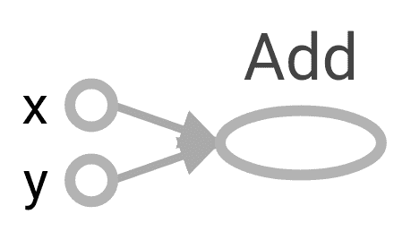

当我们在构建一个非常复杂的神经网络时，计算图帮助我们理解网络架构。例如，让我们考虑一个简单的层，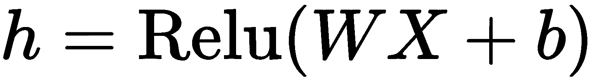。其计算图将表示如下：

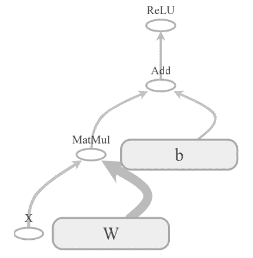

计算图中有两种依赖类型，称为直接和间接依赖。假设我们有`b`节点，其输入依赖于`a`节点的输出；这种依赖称为**直接依赖**，如下所示的代码：

```py
a = tf.multiply(8,5)
b = tf.multiply(a,1)
```

当`b`节点的输入不依赖于`a`节点时，这被称为**间接依赖**，如下所示的代码：

```py
a = tf.multiply(8,5)
b = tf.multiply(4,3)
```

因此，如果我们能理解这些依赖关系，我们就能在可用资源中分配独立的计算，并减少计算时间。每当我们导入 TensorFlow 时，会自动创建一个默认图，并且我们创建的所有节点都与默认图相关联。我们还可以创建自己的图而不是使用默认图，当在一个文件中构建多个不相互依赖的模型时，这非常有用。可以使用`tf.Graph()`创建 TensorFlow 图，如下所示：

```py
graph = tf.Graph()

with graph.as_default():
     z = tf.add(x, y, name='Add')
```

如果我们想要清除默认图（即清除先前定义的变量和操作），可以使用`tf.reset_default_graph()`。

# 会话

将创建一个包含节点和边缘张量的计算图，为了执行该图，我们使用 TensorFlow 会话。

可以使用`tf.Session()`创建 TensorFlow 会话，如下所示的代码，它将分配内存以存储变量的当前值：

```py
sess = tf.Session()
```

创建会话后，我们可以使用`sess.run()`方法执行我们的图。

TensorFlow 中的每个计算都由计算图表示，因此我们需要为所有事物运行计算图。也就是说，为了在 TensorFlow 上计算任何内容，我们需要创建一个 TensorFlow 会话。

让我们执行以下代码来执行两个数字的乘法：

```py
a = tf.multiply(3,3)
print(a)
```

而不是打印`9`，上述代码将打印一个 TensorFlow 对象，`Tensor("Mul:0", shape=(), dtype=int32)`。

正如我们之前讨论的，每当导入 TensorFlow 时，将自动创建一个默认计算图，并且所有节点都将附加到该图中。因此，当我们打印 `a` 时，它只返回 TensorFlow 对象，因为尚未计算 `a` 的值，因为尚未执行计算图。

为了执行图，我们需要初始化并运行 TensorFlow 会话，如下所示：

```py
a = tf.multiply(3,3)
with tf.Session as sess:
    print(sess.run(a))
```

上述代码将打印 `9`。

# 变量、常量和占位符

变量、常量和占位符是 TensorFlow 的基本元素。但是，总会有人对这三者之间感到困惑。让我们逐个看看每个元素，并学习它们之间的区别。

# 变量

变量是用来存储值的容器。变量作为计算图中几个其他操作的输入。可以使用 `tf.Variable()` 函数创建变量，如下面的代码所示：

```py
x = tf.Variable(13)
```

让我们使用 `tf.Variable()` 创建一个名为 `W` 的变量，如下所示：

```py
W = tf.Variable(tf.random_normal([500, 111], stddev=0.35), name="weights")
```

如前面的代码所示，我们通过从标准差为 `0.35` 的正态分布中随机抽取值来创建变量 `W`。

`tf.Variable()` 中的参数 `name` 被称为什么？

它用于在计算图中设置变量的名称。因此，在上述代码中，Python 将变量保存为 `W`，但在 TensorFlow 图中，它将保存为 `weights`。

我们还可以使用 `initialized_value()` 从另一个变量中初始化新变量的值。例如，如果我们想要创建一个名为 `weights_2` 的新变量，并使用先前定义的 `weights` 变量的值，可以按以下方式完成：

```py
W2 = tf.Variable(weights.initialized_value(), name="weights_2")
```

然而，在定义变量之后，我们需要初始化计算图中的所有变量。可以使用 `tf.global_variables_initializer()` 完成此操作。

一旦我们创建了会话，首先运行初始化操作，这将初始化所有已定义的变量，然后才能运行其他操作，如下所示：

```py
x = tf.Variable(1212)
init = tf.global_variables_initializer()

with tf.Session() as sess:
  sess.run(init) 
  print sess.run(x)
```

我们还可以使用 `tf.get_variable()` 创建 TensorFlow 变量。它需要三个重要参数，即 `name`、`shape` 和 `initializer`。

与 `tf.Variable()` 不同，我们不能直接将值传递给 `tf.get_variable()`；相反，我们使用 `initializer`。有几种初始化器可用于初始化值。例如，`tf.constant_initializer(value)` 使用常量值初始化变量，`tf.random_normal_initializer(mean, stddev)` 使用指定均值和标准差的随机正态分布初始化变量。

使用 `tf.Variable()` 创建的变量不能共享，每次调用 `tf.Variable()` 时都会创建一个新变量。但是 `tf.get_variable()` 会检查计算图中是否存在指定参数的现有变量。如果变量已存在，则将重用它；否则将创建一个新变量：

```py
W3 = tf.get_variable(name = 'weights', shape = [500, 111], initializer = random_normal_initializer()))
```

因此，上述代码检查是否存在与给定参数匹配的任何变量。如果是，则将重用它；否则，将创建一个新变量。

由于我们使用`tf.get_variable()`重用变量，为了避免名称冲突，我们使用`tf.variable_scope`，如下面的代码所示。变量作用域基本上是一种命名技术，在作用域内为变量添加前缀以避免命名冲突：

```py
with tf.variable_scope("scope"):
 a = tf.get_variable('x', [2])

with tf.variable_scope("scope", reuse = True):
 b = tf.get_variable('x', [2])
```

如果您打印`a.name`和`b.name`，则它将返回相同的名称`scope/x:0`。正如您所见，我们在名为`scope`的变量作用域中指定了`reuse=True`参数，这意味着变量可以被共享。如果我们不设置`reuse=True`，则会出现错误，提示变量已经存在。

建议使用`tf.get_variable()`而不是`tf.Variable()`，因为`tf.get_variable`允许您共享变量，并且可以使代码重构更容易。

# 常量

常量与变量不同，不能改变其值。也就是说，常量是不可变的。一旦为它们分配了值，就不能在整个过程中更改它们。我们可以使用`tf.constant()`创建常量，如下面的代码所示：

```py
 x = tf.constant(13)
```

# 占位符和 feed 字典

我们可以将占位符视为变量，其中仅定义类型和维度，但不分配值。占位符的值将在运行时通过数据填充到计算图中。占位符是没有值的定义。

可以使用`tf.placeholder()`来定义占位符。它接受一个可选参数`shape`，表示数据的维度。如果`shape`设置为`None`，则可以在运行时提供任意大小的数据。占位符可以定义如下：

```py
 x = tf.placeholder("float", shape=None)
```

简单来说，我们使用`tf.Variable`存储数据，使用`tf.placeholder`来提供外部数据。

让我们通过一个简单的例子来更好地理解占位符：

```py
x = tf.placeholder("float", None)
y = x +3

with tf.Session() as sess:
    result = sess.run(y)
    print(result)
```

如果我们运行上述代码，则会返回错误，因为我们试图计算`y`，其中`y = x + 3`，而`x`是一个占位符，其值尚未分配。正如我们所学的，占位符的值将在运行时分配。我们使用`feed_dict`参数来分配占位符的值。`feed_dict`参数基本上是一个字典，其中键表示占位符的名称，值表示占位符的值。

如您在下面的代码中所见，我们设置`feed_dict = {x:5}`，这意味着`x`占位符的值为`5`：

```py
with tf.Session() as sess:
    result = sess.run(y, feed_dict={x: 5})
    print(result)
```

前面的代码返回`8.0`。

如果我们想为`x`使用多个值会怎样？由于我们没有为占位符定义任何形状，它可以接受任意数量的值，如下面的代码所示：

```py
with tf.Session() as sess:
    result = sess.run(y, feed_dict={x: [3,6,9]})
    print(result)
```

它将返回以下内容：

```py
[ 6\.  9\. 12.]
```

假设我们将`x`的形状定义为`[None,2]`，如下面的代码所示：

```py
x = tf.placeholder("float", [None, 2])
```

这意味着 `x` 可以取任意行但列数为 `2` 的矩阵，如以下代码所示：

```py
with tf.Session() as sess:
    x_val = [[1, 2,], 
              [3,4],
              [5,6],
              [7,8],]
    result = sess.run(y, feed_dict={x: x_val})
    print(result)
```

上述代码返回以下内容：

```py
[[ 4\.  5.]
 [ 6\.  7.]
 [ 8\.  9.]
 [10\. 11.]]
```

# 介绍 TensorBoard

TensorBoard 是 TensorFlow 的可视化工具，可用于显示计算图。它还可以用来绘制各种定量指标和几个中间计算的结果。当我们训练一个非常深的神经网络时，如果需要调试网络，会变得很困惑。因此，如果我们能在 TensorBoard 中可视化计算图，就能轻松理解这些复杂模型，进行调试和优化。TensorBoard 还支持共享。

如以下截图所示，TensorBoard 面板由几个选项卡组成： SCALARS，IMAGES，AUDIO，GRAPHS，DISTRIBUTIONS，HISTOGRAMS 和 EMBEDDINGS：


选项卡的含义很明显。 SCALARS 选项卡显示有关程序中使用的标量变量的有用信息。例如，它显示标量变量名为损失的值如何随着多次迭代而变化。

GRAPHS 选项卡显示计算图。 DISTRIBUTIONS 和 HISTOGRAMS 选项卡显示变量的分布。例如，我们模型的权重分布和直方图可以在这些选项卡下看到。 EMBEDDINGS 选项卡用于可视化高维向量，如词嵌入（我们将在第七章，*学习文本表示*中详细学习）。

让我们构建一个基本的计算图，并在 TensorBoard 中进行可视化。假设我们有四个变量，如下所示：

```py
x = tf.constant(1,name='x')
y = tf.constant(1,name='y')
a = tf.constant(3,name='a')
b = tf.constant(3,name='b')
```

让我们将 `x` 和 `y` 以及 `a` 和 `b` 相乘，并将它们保存为 `prod1` 和 `prod2`，如以下代码所示：

```py
prod1 = tf.multiply(x,y,name='prod1')
prod2 = tf.multiply(a,b,name='prod2')
```

将 `prod1` 和 `prod2` 相加并存储在 `sum` 中：

```py
sum = tf.add(prod1,prod2,name='sum')
```

现在，我们可以在 TensorBoard 中可视化所有这些操作。为了在 TensorBoard 中进行可视化，我们首先需要保存我们的事件文件。可以使用 `tf.summary.FileWriter()` 来完成。它需要两个重要参数，`logdir` 和 `graph`。

如其名称所示，`logdir` 指定我们希望存储图形的目录，`graph` 指定我们希望存储的图形：

```py
with tf.Session() as sess:
    writer = tf.summary.FileWriter(logdir='./graphs',graph=sess.graph)
    print(sess.run(sum))
```

在上述代码中，`graphs` 是我们存储事件文件的目录，`sess.graph` 指定了我们 TensorFlow 会话中的当前图。因此，我们正在将 TensorFlow 会话中的当前图存储在 `graphs` 目录中。

要启动 TensorBoard，请转到您的终端，找到工作目录，并键入以下内容：

```py
tensorboard --logdir=graphs --port=8000
```

`logdir` 参数指示事件文件存储的目录，`port` 是端口号。运行上述命令后，打开浏览器并输入 `http://localhost:8000/`。

在 TensorBoard 面板中，GRAPHS 选项卡下，您可以看到计算图：

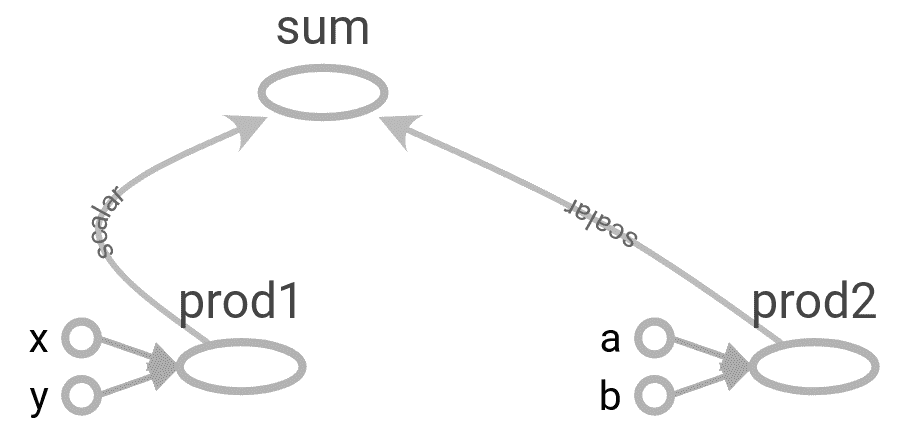

正如您可能注意到的，我们定义的所有操作都清楚地显示在图中。

# 创建一个命名作用域

作用域用于降低复杂性，并帮助我们通过将相关节点分组在一起来更好地理解模型。使用命名作用域有助于在图中分组相似的操作。当我们构建复杂的架构时，它非常方便。可以使用 `tf.name_scope()` 创建作用域。在前面的示例中，我们执行了两个操作，`Product` 和 `sum`。我们可以简单地将它们分组为两个不同的命名作用域，如 `Product` 和 `sum`。

在前面的部分中，我们看到了 `prod1` 和 `prod2` 如何执行乘法并计算结果。我们将定义一个名为 `Product` 的命名作用域，并将 `prod1` 和 `prod2` 操作分组，如以下代码所示：

```py
with tf.name_scope("Product"):
    with tf.name_scope("prod1"):
        prod1 = tf.multiply(x,y,name='prod1')

    with tf.name_scope("prod2"):
        prod2 = tf.multiply(a,b,name='prod2')
```

现在，为 `sum` 定义命名作用域：

```py
with tf.name_scope("sum"):
    sum = tf.add(prod1,prod2,name='sum')
```

将文件存储在 `graphs` 目录中：

```py
with tf.Session() as sess:
    writer = tf.summary.FileWriter('./graphs', sess.graph)
    print(sess.run(sum))
```

在 TensorBoard 中可视化图形：

```py
tensorboard --logdir=graphs --port=8000
```

正如你可能注意到的，现在我们只有两个节点，**sum** 和 **Product**：

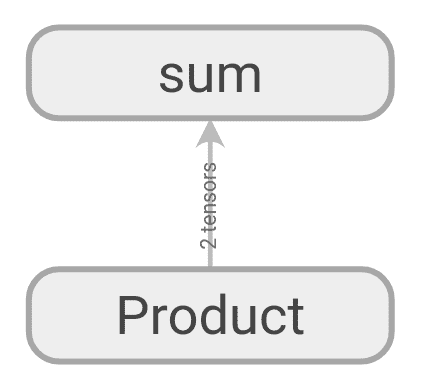

一旦我们双击节点，我们就能看到计算是如何进行的。正如你所见，**prod1** 和 **prod2** 节点被分组在 **Product** 作用域下，它们的结果被发送到 **sum** 节点，在那里它们将被相加。你可以看到 **prod1** 和 **prod2** 节点如何计算它们的值：

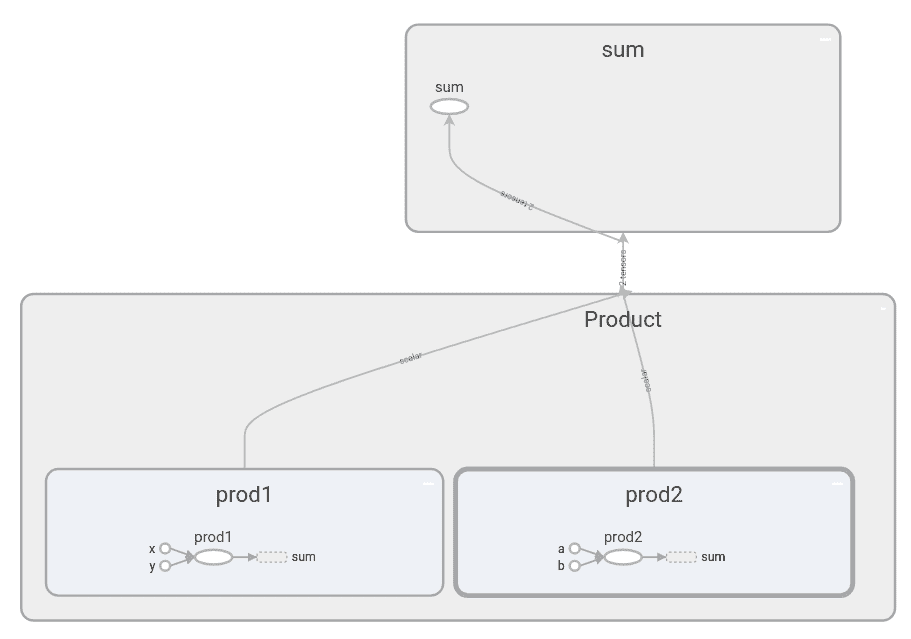

前面的例子只是一个简单的示例。当我们在处理包含大量操作的复杂项目时，命名作用域帮助我们将相似的操作分组在一起，并且能够更好地理解计算图。

# 使用 TensorFlow 进行手写数字分类

将我们迄今学到的所有概念整合在一起，我们将看到如何使用 TensorFlow 构建一个神经网络来识别手写数字。如果你最近一直在玩深度学习，那么你一定听说过 MNIST 数据集。它被称为深度学习的*hello world*。它包含了 55000 个手写数字数据点（0 到 9）。

在这一节中，我们将看到如何使用我们的神经网络来识别这些手写数字，并且我们会掌握 TensorFlow 和 TensorBoard。

# 导入所需的库

作为第一步，让我们导入所有所需的库：

```py
import warnings
warnings.filterwarnings('ignore')

import tensorflow as tf
from tensorflow.examples.tutorials.mnist import input_data
tf.logging.set_verbosity(tf.logging.ERROR)

import matplotlib.pyplot as plt
%matplotlib inline
```

# 加载数据集

加载数据集，使用以下代码：

```py
mnist = input_data.read_data_sets("data/mnist", one_hot=True)
```

在前面的代码中，`data/mnist` 表示我们存储 MNIST 数据集的位置，而 `one_hot=True` 表示我们正在对标签（0 到 9）进行 one-hot 编码。

通过执行以下代码，我们将看到我们的数据中包含什么：

```py
print("No of images in training set {}".format(mnist.train.images.shape))
print("No of labels in training set {}".format(mnist.train.labels.shape))

print("No of images in test set {}".format(mnist.test.images.shape))
print("No of labels in test set {}".format(mnist.test.labels.shape))

No of images in training set (55000, 784)
No of labels in training set (55000, 10)
No of images in test set (10000, 784)
No of labels in test set (10000, 10)
```

我们在训练集中有 `55000` 张图像，每个图像的大小是 `784`，我们有 `10` 个标签，实际上是从 0 到 9。类似地，我们在测试集中有 `10000` 张图像。

现在，我们将绘制一个输入图像，看看它的样子：

```py
img1 = mnist.train.images[0].reshape(28,28)
plt.imshow(img1, cmap='Greys')
```

因此，我们的输入图像看起来如下：

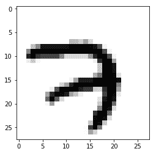

# 定义每个层中神经元的数量

我们将构建一个具有三个隐藏层和一个输出层的四层神经网络。由于输入图像的大小为 `784`，我们将 `num_input` 设置为 `784`，并且由于有 10 个手写数字（0 到 9），我们在输出层设置了 `10` 个神经元。我们如下定义每一层的神经元数量：

```py
#number of neurons in input layer
num_input = 784

#num of neurons in hidden layer 1
num_hidden1 = 512

#num of neurons in hidden layer 2
num_hidden2 = 256

#num of neurons in hidden layer 3
num_hidden_3 = 128

#num of neurons in output layer
num_output = 10
```

# 定义占位符

正如我们所学，我们首先需要为 `input` 和 `output` 定义占位符。占位符的值将通过 `feed_dict` 在运行时传入：

```py
with tf.name_scope('input'):
    X = tf.placeholder("float", [None, num_input])

with tf.name_scope('output'):
    Y = tf.placeholder("float", [None, num_output])
```

由于我们有一个四层网络，我们有四个权重和四个偏置。我们通过从标准偏差为 `0.1` 的截断正态分布中抽取值来初始化我们的权重。记住，权重矩阵的维度应该是*前一层神经元的数量* x *当前层神经元的数量*。例如，权重矩阵 `w3` 的维度应该是*隐藏层 2 中的神经元数* x *隐藏层 3 中的神经元数*。

我们通常将所有权重定义在一个字典中，如下所示：

```py
with tf.name_scope('weights'):

 weights = {
 'w1': tf.Variable(tf.truncated_normal([num_input, num_hidden1], stddev=0.1),name='weight_1'),
 'w2': tf.Variable(tf.truncated_normal([num_hidden1, num_hidden2], stddev=0.1),name='weight_2'),
 'w3': tf.Variable(tf.truncated_normal([num_hidden2, num_hidden_3], stddev=0.1),name='weight_3'),
 'out': tf.Variable(tf.truncated_normal([num_hidden_3, num_output], stddev=0.1),name='weight_4'),
 }
```

偏置的形状应该是当前层中的神经元数。例如，`b2` 偏置的维度是隐藏层 2 中的神经元数。我们在所有层中将偏置值设置为常数 `0.1`：

```py
with tf.name_scope('biases'):

    biases = {
        'b1': tf.Variable(tf.constant(0.1, shape=[num_hidden1]),name='bias_1'),
        'b2': tf.Variable(tf.constant(0.1, shape=[num_hidden2]),name='bias_2'),
        'b3': tf.Variable(tf.constant(0.1, shape=[num_hidden_3]),name='bias_3'),
        'out': tf.Variable(tf.constant(0.1, shape=[num_output]),name='bias_4')
    }
```

# 前向传播

现在我们将定义前向传播操作。我们在所有层中使用 ReLU 激活函数。在最后一层中，我们将应用 `sigmoid` 激活函数，如下所示的代码：

```py
with tf.name_scope('Model'):

    with tf.name_scope('layer1'):
        layer_1 = tf.nn.relu(tf.add(tf.matmul(X, weights['w1']), biases['b1']) ) 

    with tf.name_scope('layer2'):
        layer_2 = tf.nn.relu(tf.add(tf.matmul(layer_1, weights['w2']), biases['b2']))

    with tf.name_scope('layer3'):
        layer_3 = tf.nn.relu(tf.add(tf.matmul(layer_2, weights['w3']), biases['b3']))

    with tf.name_scope('output_layer'):
         y_hat = tf.nn.sigmoid(tf.matmul(layer_3, weights['out']) + biases['out'])
```

# 计算损失和反向传播

接下来，我们将定义我们的损失函数。我们将使用 softmax 交叉熵作为我们的损失函数。TensorFlow 提供了 `tf.nn.softmax_cross_entropy_with_logits()` 函数来计算 softmax 交叉熵损失。它接受两个参数作为输入，`logits` 和 `labels`：

+   `logits` 参数指定了网络预测的 `logits`；例如，`y_hat`

+   `labels` 参数指定了实际的标签；例如，真实标签 `Y`

我们使用 `tf.reduce_mean()` 取 `loss` 函数的均值：

```py
with tf.name_scope('Loss'):
        loss = tf.reduce_mean(tf.nn.softmax_cross_entropy_with_logits(logits=y_hat,labels=Y))
```

现在，我们需要使用反向传播来最小化损失。别担心！我们不必手动计算所有权重的导数。相反，我们可以使用 TensorFlow 的优化器。在本节中，我们使用 Adam 优化器。它是我们在《第一章》*深度学习导论*中学到的梯度下降优化技术的一个变体。在《第三章》*梯度下降及其变体*中，我们将深入探讨细节，看看 Adam 优化器和其他几种优化器的工作原理。现在，让我们说我们使用 Adam 优化器作为我们的反向传播算法：

```py
learning_rate = 1e-4
optimizer = tf.train.AdamOptimizer(learning_rate).minimize(loss)
```

# 计算精度

我们计算模型的精度如下：

+   参数 `y_hat` 表示我们模型每个类别的预测概率。由于我们有 `10` 类别，我们将有 `10` 个概率。如果在位置 `7` 处的概率很高，则表示我们的网络以高概率预测输入图像为数字 `7`。函数 `tf.argmax()` 返回最大值的索引。因此，`tf.argmax(y_hat,1)` 给出概率高的索引位置。因此，如果索引 `7` 处的概率很高，则返回 `7`。

+   参数 `Y` 表示实际标签，它们是独热编码的值。也就是说，除了实际图像的位置处为 `1` 外，在所有位置处都是 `0`。例如，如果输入图像是 `7`，则 `Y` 在索引 `7` 处为 `1`，其他位置为 `0`。因此，`tf.argmax(Y,1)` 返回 `7`，因为这是我们有高值 `1` 的位置。

因此，`tf.argmax(y_hat,1)` 给出了预测的数字，而 `tf.argmax(Y,1)` 给出了实际的数字。

函数 `tf.equal(x, y)` 接受 `x` 和 `y` 作为输入，并返回 *(x == y)* 的逻辑值。因此，`correct_pred = tf.equal(predicted_digit,actual_digit)` 包含了当实际和预测的数字相同时为 `True`，不同时为 `False`。我们使用 TensorFlow 的 `cast` 操作将 `correct_pred` 中的布尔值转换为浮点值，即 `tf.cast(correct_pred, tf.float32)`。将它们转换为浮点值后，我们使用 `tf.reduce_mean()` 取平均值。

因此，`tf.reduce_mean(tf.cast(correct_pred, tf.float32))` 给出了平均正确预测值：

```py
with tf.name_scope('Accuracy'):

    predicted_digit = tf.argmax(y_hat, 1)
    actual_digit = tf.argmax(Y, 1)

    correct_pred = tf.equal(predicted_digit,actual_digit)
    accuracy = tf.reduce_mean(tf.cast(correct_pred, tf.float32))
```

# 创建摘要

我们还可以可视化模型在多次迭代过程中损失和准确率的变化。因此，我们使用 `tf.summary()` 来获取变量的摘要。由于损失和准确率是标量变量，我们使用 `tf.summary.scalar()`，如下所示：

```py
tf.summary.scalar("Accuracy", accuracy)
tf.summary.scalar("Loss", loss)
```

接下来，我们合并图中使用的所有摘要，使用 `tf.summary.merge_all()`。我们这样做是因为当我们有许多摘要时，运行和存储它们会变得低效，所以我们在会话中一次性运行它们，而不是多次运行：

```py
merge_summary = tf.summary.merge_all()
```

# 训练模型

现在，是时候训练我们的模型了。正如我们所学的，首先，我们需要初始化所有变量：

```py
init = tf.global_variables_initializer()
```

定义批大小、迭代次数和学习率，如下所示：

```py
learning_rate = 1e-4
num_iterations = 1000
batch_size = 128
```

启动 TensorFlow 会话：

```py
with tf.Session() as sess:
```

初始化所有变量：

```py
    sess.run(init)
```

保存事件文件：

```py
    summary_writer = tf.summary.FileWriter('./graphs', graph=sess.graph)
```

训练模型一定数量的迭代次数：

```py
    for i in range(num_iterations):
```

根据批大小获取一批数据：

```py
        batch_x, batch_y = mnist.train.next_batch(batch_size)
```

训练网络：

```py
        sess.run(optimizer, feed_dict={ X: batch_x, Y: batch_y})
```

每 100 次迭代打印一次 `loss` 和 `accuracy`：

```py
        if i % 100 == 0:

            batch_loss, batch_accuracy,summary = sess.run(
                [loss, accuracy, merge_summary], feed_dict={X: batch_x, Y: batch_y}
                )

            #store all the summaries    
            summary_writer.add_summary(summary, i)

            print('Iteration: {}, Loss: {}, Accuracy: {}'.format(i,batch_loss,batch_accuracy))
```

如您从以下输出中注意到的那样，损失减少，准确率在各种训练迭代中增加：

```py
Iteration: 0, Loss: 2.30789709091, Accuracy: 0.1171875
Iteration: 100, Loss: 1.76062202454, Accuracy: 0.859375
Iteration: 200, Loss: 1.60075569153, Accuracy: 0.9375
Iteration: 300, Loss: 1.60388696194, Accuracy: 0.890625
Iteration: 400, Loss: 1.59523034096, Accuracy: 0.921875
Iteration: 500, Loss: 1.58489584923, Accuracy: 0.859375
Iteration: 600, Loss: 1.51407408714, Accuracy: 0.953125
Iteration: 700, Loss: 1.53311181068, Accuracy: 0.9296875
Iteration: 800, Loss: 1.57677125931, Accuracy: 0.875
Iteration: 900, Loss: 1.52060437202, Accuracy: 0.9453125
```

# 在 TensorBoard 中可视化图表

训练后，我们可以在 TensorBoard 中可视化我们的计算图，如下图所示。正如您所见，我们的**模型**接受输入、权重和偏差作为输入，并返回输出。我们根据模型的输出计算损失和准确性。通过计算梯度和更新权重来最小化损失。我们可以在下图中观察到所有这些：

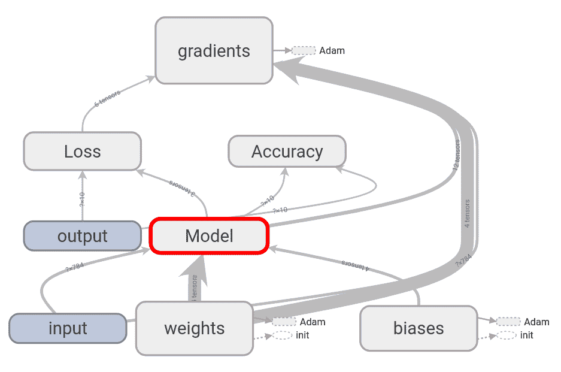

如果我们双击并展开**模型**，我们可以看到我们有三个隐藏层和一个输出层：

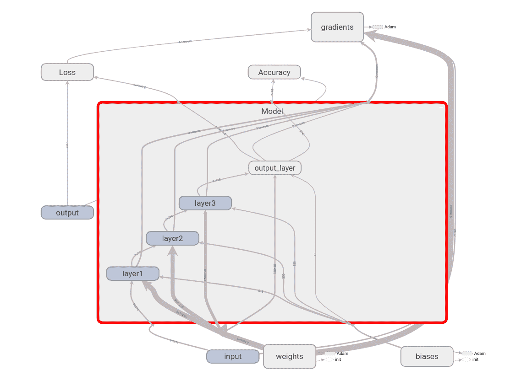

同样地，我们可以双击并查看每个节点。例如，如果我们打开**权重**，我们可以看到四个权重如何使用截断正态分布进行初始化，并且如何使用 Adam 优化器进行更新：

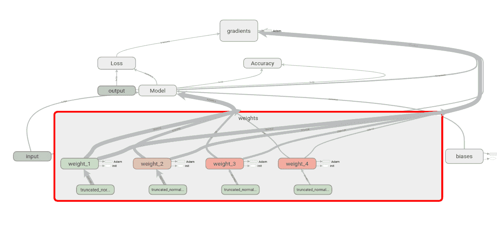

正如我们所学到的，计算图帮助我们理解每个节点发生的情况。我们可以通过双击**准确性**节点来查看如何计算准确性：

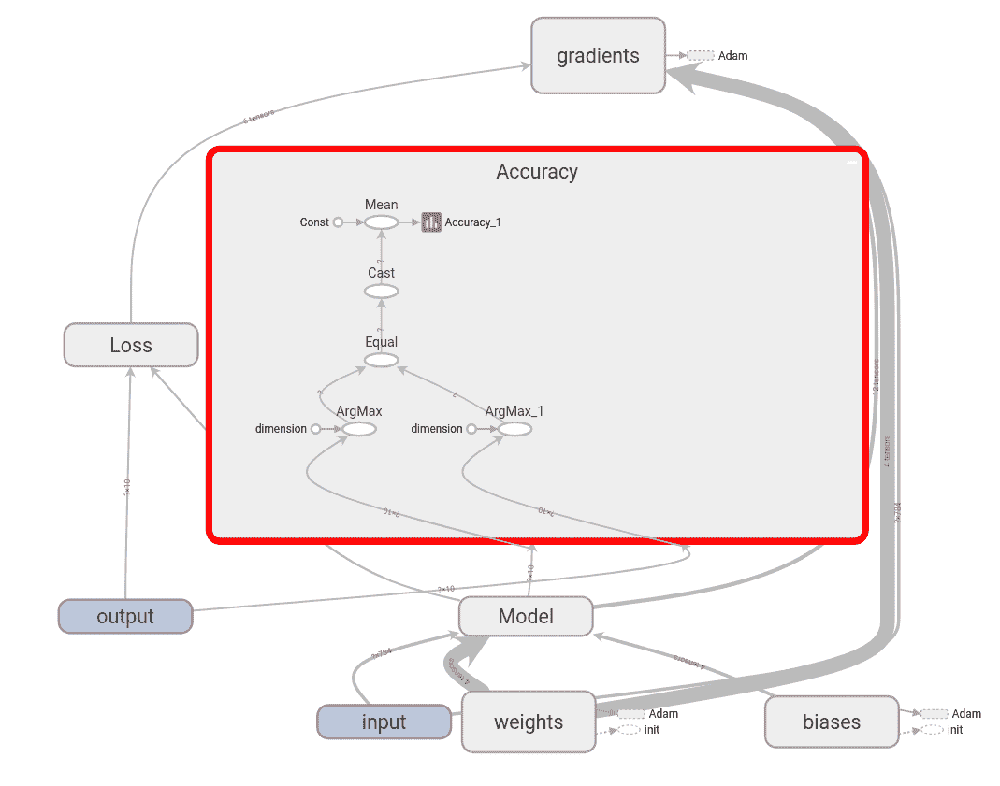

记住，我们还存储了`loss`和`accuracy`变量的摘要。我们可以在 TensorBoard 的 SCALARS 选项卡下找到它们，如下面的截图所示。我们可以看到损失如何随迭代而减少，如下图所示：

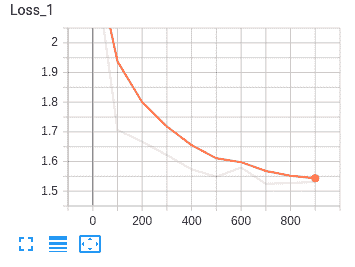

下面的截图显示准确性随迭代次数增加的情况：

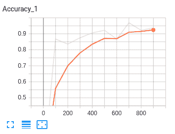

# 引入急切执行

TensorFlow 中的急切执行更符合 Python 风格，允许快速原型设计。与图模式不同，在图模式中，我们每次执行操作都需要构建一个图，而急切执行遵循命令式编程范式，可以立即执行任何操作，无需创建图，就像在 Python 中一样。因此，使用急切执行，我们可以告别会话和占位符。与图模式不同，它还通过立即运行时错误使得调试过程更加简单。

例如，在图模式中，要计算任何内容，我们需要运行会话。如下面的代码所示，要评估`z`的值，我们必须运行 TensorFlow 会话：

```py
x = tf.constant(11)
y = tf.constant(11)
z = x*y

with tf.Session() as sess:
    print sess.run(z)
```

使用急切执行，我们无需创建会话；我们可以像在 Python 中一样简单地计算`z`。为了启用急切执行，只需调用`tf.enable_eager_execution()`函数：

```py
x = tf.constant(11)
y = tf.constant(11)
z = x*y

print z
```

它将返回以下内容：

```py
<tf.Tensor: id=789, shape=(), dtype=int32, numpy=121>
```

为了获取输出值，我们可以打印以下内容：

```py
z.numpy()

121
```

# TensorFlow 中的数学操作

现在，我们将使用急切执行模式探索 TensorFlow 中的一些操作：

```py
x = tf.constant([1., 2., 3.])
y = tf.constant([3., 2., 1.])
```

让我们从一些基本算术操作开始。

使用`tf.add`来添加两个数：

```py
sum = tf.add(x,y)
sum.numpy()

array([4., 4., 4.], dtype=float32)
```

`tf.subtract` 函数用于找出两个数之间的差异：

```py
difference = tf.subtract(x,y)
difference.numpy()

array([-2.,  0.,  2.], dtype=float32)
```

`tf.multiply` 函数用于两个数的乘法：

```py
product = tf.multiply(x,y)
product.numpy()

array([3., 4., 3.], dtype=float32)
```

使用`tf.divide`除两个数：

```py
division = tf.divide(x,y)
division.numpy()

array([0.33333334, 1\.        , 3\.        ], dtype=float32)
```

点积可以计算如下：

```py
dot_product = tf.reduce_sum(tf.multiply(x, y))
dot_product.numpy()

10.0
```

下面，让我们找到最小和最大元素的索引：

```py
x = tf.constant([10, 0, 13, 9])
```

最小值的索引是使用`tf.argmin()`计算的：

```py
tf.argmin(x).numpy()

1
```

最大值的索引是使用`tf.argmax()`计算的：

```py
tf.argmax(x).numpy()

2
```

运行以下代码以找到`x`和`y`之间的平方差：

```py
x = tf.Variable([1,3,5,7,11])
y = tf.Variable([1])

tf.math.squared_difference(x,y).numpy()

[  0,   4,  16,  36, 100]
```

让我们尝试类型转换；即，从一种数据类型转换为另一种。

打印`x`的类型：

```py
print x.dtype

tf.int32
```

我们可以使用`tf.cast`将`x`的类型（`tf.int32`）转换为`tf.float32`，如下所示：

```py
x = tf.cast(x, dtype=tf.float32)
```

现在，检查`x`的类型。它将是`tf.float32`，如下所示：

```py
print x.dtype

tf.float32
```

按列连接两个矩阵：

```py
x = [[3,6,9], [7,7,7]]
y = [[4,5,6], [5,5,5]]
```

按行连接矩阵：

```py
tf.concat([x, y], 0).numpy()

array([[3, 6, 9],
       [7, 7, 7],
       [4, 5, 6],
       [5, 5, 5]], dtype=int32)
```

使用以下代码按列连接矩阵：

```py
tf.concat([x, y], 1).numpy()

array([[3, 6, 9, 4, 5, 6],
       [7, 7, 7, 5, 5, 5]], dtype=int32)
```

使用`stack`函数堆叠`x`矩阵：

```py
tf.stack(x, axis=1).numpy()

array([[3, 7],
       [6, 7],
       [9, 7]], dtype=int32)
```

现在，让我们看看如何执行`reduce_mean`操作：

```py
x = tf.Variable([[1.0, 5.0], [2.0, 3.0]])

x.numpy()

array([[1., 5.],
       [2., 3.]]
```

计算`x`的均值；即，*(1.0 + 5.0 + 2.0 + 3.0) / 4*：

```py
tf.reduce_mean(input_tensor=x).numpy() 

2.75
```

计算行的均值；即，*(1.0+5.0)/2, (2.0+3.0)/2*：

```py
tf.reduce_mean(input_tensor=x, axis=0).numpy() 

array([1.5, 4\. ], dtype=float32)
```

计算列的均值；即，*(1.0+5.0)/2.0, (2.0+3.0)/2.0*：

```py
tf.reduce_mean(input_tensor=x, axis=1, keepdims=True).numpy()

array([[3\. ],
       [2.5]], dtype=float32)
```

从概率分布中绘制随机值：

```py
tf.random.normal(shape=(3,2), mean=10.0, stddev=2.0).numpy()

tf.random.uniform(shape = (3,2), minval=0, maxval=None, dtype=tf.float32,).numpy()
```

计算 softmax 概率：

```py
x = tf.constant([7., 2., 5.])

tf.nn.softmax(x).numpy()

array([0.8756006 , 0.00589975, 0.11849965], dtype=float32)
```

现在，我们将看看如何计算梯度。

定义`square`函数：

```py
def square(x):
  return tf.multiply(x, x)
```

可以使用`tf.GradientTape`计算前述`square`函数的梯度，如下所示：

```py
with tf.GradientTape(persistent=True) as tape:
     print square(6.).numpy()

36.0
```

更多 TensorFlow 操作可在 GitHub 上的 Notebook 中查看，网址为[`bit.ly/2YSYbYu`](http://bit.ly/2YSYbYu)。

TensorFlow 远不止如此。随着我们在本书中的学习，我们将了解 TensorFlow 的各种重要功能。

# TensorFlow 2.0 和 Keras

TensorFlow 2.0 具有一些非常酷的功能。它默认设置为即时执行模式。它提供了简化的工作流程，并使用 Keras 作为构建深度学习模型的主要 API。它还与 TensorFlow 1.x 版本向后兼容。

要安装 TensorFlow 2.0，请打开您的终端并输入以下命令：

```py
pip install tensorflow==2.0.0-alpha0
```

由于 TensorFlow 2.0 使用 Keras 作为高级 API，我们将在下一节中看看 Keras 的工作原理。

# Bonjour Keras

Keras 是另一个广泛使用的深度学习库。它由谷歌的 François Chollet 开发。它以快速原型设计而闻名，使模型构建简单。它是一个高级库，意味着它本身不执行任何低级操作，如卷积。它使用后端引擎来执行这些操作，比如 TensorFlow。Keras API 在`tf.keras`中可用，TensorFlow 2.0 将其作为主要 API。

在 Keras 中构建模型涉及四个重要步骤：

1.  定义模型

1.  编译模型

1.  拟合模型

1.  评估模型

# 定义模型

第一步是定义模型。Keras 提供了两种不同的 API 来定义模型：

+   顺序 API

+   函数式 API

# 定义一个序列模型

在序列模型中，我们将每个层堆叠在一起：

```py
from keras.models import Sequential
from keras.layers import Dense
```

首先，让我们将我们的模型定义为`Sequential()`模型，如下所示：

```py
model = Sequential()
```

现在，定义第一层，如下所示：

```py
model.add(Dense(13, input_dim=7, activation='relu'))
```

在上述代码中，`Dense` 表示全连接层，`input_dim` 表示输入的维度，`activation` 指定我们使用的激活函数。我们可以堆叠任意多层，一层叠在另一层之上。

定义带有 `relu` 激活的下一层，如下所示：

```py
model.add(Dense(7, activation='relu'))
```

定义带有 `sigmoid` 激活函数的输出层：

```py
model.add(Dense(1, activation='sigmoid'))
```

顺序模型的最终代码块如下所示。正如您所见，Keras 代码比 TensorFlow 代码简单得多：

```py
model = Sequential()
model.add(Dense(13, input_dim=7, activation='relu'))
model.add(Dense(7, activation='relu'))
model.add(Dense(1, activation='sigmoid'))
```

# 定义函数式模型

函数式模型比顺序模型更灵活。例如，在函数式模型中，我们可以轻松连接任意一层到另一层，而在顺序模型中，每一层都是堆叠在另一层之上的。当创建复杂模型时，如有向无环图、具有多个输入值、多个输出值和共享层的模型时，函数式模型非常实用。现在，我们将看看如何在 Keras 中定义函数式模型。

第一步是定义输入维度：

```py
input = Input(shape=(2,))
```

现在，我们将在测试集上评估我们的模型，首先定义第一个具有 `10` 个神经元和 `relu` 激活函数的全连接层，使用 `Dense` 类，如下所示：

```py
layer1 = Dense(10, activation='relu')
```

我们已经定义了 `layer1`，但是 `layer1` 的输入从哪里来？我们需要在末尾的括号符号中指定 `layer1` 的输入，如下所示：

```py
layer1 = Dense(10, activation='relu')(input)
```

我们使用 `13` 个神经元和 `relu` 激活函数定义下一层 `layer2`。`layer2` 的输入来自 `layer1`，因此在代码末尾加上括号，如下所示：

```py
layer2 = Dense(10, activation='relu')(layer1)
```

现在，我们可以定义具有 `sigmoid` 激活函数的输出层。输出层的输入来自 `layer2`，因此在括号中添加了这一部分：

```py
output = Dense(1, activation='sigmoid')(layer2)
```

在定义完所有层之后，我们使用 `Model` 类定义模型，需要指定 `inputs` 和 `outputs`，如下所示：

```py
model = Model(inputs=input, outputs=output)
```

函数式模型的完整代码如下所示：

```py
input = Input(shape=(2,))
layer1 = Dense(10, activation='relu')(input)
layer2 = Dense(10, activation='relu')(layer1)
output = Dense(1, activation='sigmoid')(layer2)
model = Model(inputs=input, outputs=output)
```

# 编译模型

现在我们已经定义了模型，下一步是编译它。在这个阶段，我们设置模型学习的方式。在编译模型时，我们定义了三个参数：

+   `optimizer` 参数：这定义了我们想要使用的优化算法，例如在这种情况下的梯度下降。

+   `loss` 参数：这是我们试图最小化的目标函数，例如均方误差或交叉熵损失。

+   `metrics` 参数：这是我们想通过哪种度量来评估模型性能，例如 `accuracy`。我们也可以指定多个度量。

运行以下代码来编译模型：

```py
model.compile(loss='binary_crossentropy', optimizer='sgd', metrics=['accuracy'])
```

# 训练模型

我们已经定义并编译了模型。现在，我们将训练模型。使用 `fit` 函数可以完成模型的训练。我们指定特征 `x`、标签 `y`、训练的 `epochs` 数量和 `batch_size`，如下所示：

```py
model.fit(x=data, y=labels, epochs=100, batch_size=10)
```

# 评估模型

训练完模型后，我们将在测试集上评估模型：

```py
model.evaluate(x=data_test,y=labels_test)
```

我们还可以在相同的训练集上评估模型，这将帮助我们了解训练准确性：

```py
model.evaluate(x=data,y=labels)
```

# 使用 TensorFlow 2.0 进行 MNIST 数字分类

现在，我们将看到如何使用 TensorFlow 2.0 执行 MNIST 手写数字分类。与 TensorFlow 1.x 相比，它只需要少量代码。正如我们所学的，TensorFlow 2.0 使用 Keras 作为其高级 API；我们只需在 Keras 代码中添加`tf.keras`。

让我们从加载数据集开始：

```py
mnist = tf.keras.datasets.mnist
```

使用以下代码创建训练集和测试集：

```py
(x_train,y_train), (x_test, y_test) = mnist.load_data()
```

将训练集和测试集标准化，通过将`x`的值除以最大值`255.0`来完成：

```py
x_train, x_test = tf.cast(x_train/255.0, tf.float32), tf.cast(x_test/255.0, tf.float32)
y_train, y_test = tf.cast(y_train,tf.int64),tf.cast(y_test,tf.int64)
```

如下定义序列模型：

```py
model = tf.keras.models.Sequential()
```

现在，让我们为模型添加层次。我们使用一个三层网络，其中最后一层采用`relu`函数和`softmax`：

```py
model.add(tf.keras.layers.Flatten())
model.add(tf.keras.layers.Dense(256, activation="relu"))
model.add(tf.keras.layers.Dense(128, activation="relu"))
model.add(tf.keras.layers.Dense(10, activation="softmax"))
```

通过运行以下代码行来编译模型：

```py
model.compile(optimizer='sgd', loss='sparse_categorical_crossentropy', metrics=['accuracy'])
```

训练模型：

```py
model.fit(x_train, y_train, batch_size=32, epochs=10)
```

评估模型：

```py
model.evaluate(x_test, y_test)
```

就是这样！使用 Keras API 编写代码就是这么简单。

# 我们应该使用 Keras 还是 TensorFlow？

我们了解到 TensorFlow 2.0 使用 Keras 作为其高级 API。使用高级 API 可以进行快速原型设计。但是当我们想要在低级别上构建模型时，或者当高级 API 无法提供所需功能时，我们就不能使用高级 API。

除此之外，从头开始编写代码可以加深我们对算法的理解，并帮助我们更好地理解和学习概念，远胜于直接使用高级 API。这就是为什么在这本书中，我们将使用 TensorFlow 编写大部分算法，而不使用 Keras 等高级 API。我们将使用 TensorFlow 版本 1.13.1。

# 总结

我们从本章开始学习 TensorFlow 及其如何使用计算图。我们了解到，在 TensorFlow 中，每个计算都表示为一个计算图，该图由多个节点和边组成，其中节点是数学运算，如加法和乘法，边是张量。

我们学到了变量是用来存储值的容器，并且它们作为计算图中多个其他操作的输入。稍后，我们了解到占位符类似于变量，其中我们只定义类型和维度，但不会分配值，占位符的值将在运行时提供。

未来，我们学习了 TensorBoard，这是 TensorFlow 的可视化工具，可用于可视化计算图。它还可以用来绘制各种定量指标和多个中间计算结果的结果。

我们还学习了急切执行，它更符合 Python 风格，允许快速原型设计。我们了解到，与图模式不同，我们无需每次执行操作时都构建一个图来执行任何操作，急切执行遵循命令式编程范式，可以立即执行任何操作，就像我们在 Python 中所做的那样，而无需创建图形。

在下一章中，我们将学习梯度下降及其变种算法。

# 问题

通过回答以下问题来评估你对 TensorFlow 的了解：

1.  定义一个计算图。

1.  会话是什么？

1.  我们如何在 TensorFlow 中创建一个会话？

1.  变量和占位符之间有什么区别？

1.  我们为什么需要 TensorBoard？

1.  名称作用域是什么，它是如何创建的？

1.  什么是即时执行？

# 进一步阅读

您可以通过查看官方文档[`www.tensorflow.org/tutorials`](https://www.tensorflow.org/tutorials)来了解更多关于 TensorFlow 的信息。
