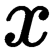
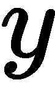
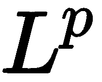
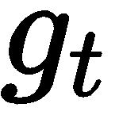

# 梯度下降及其变体

梯度下降是最流行和广泛使用的优化算法之一，是一种一阶优化算法。一阶优化意味着我们只计算一阶导数。正如我们在第一章中看到的，*深度学习简介*，我们使用梯度下降计算损失函数相对于网络权重的一阶导数以最小化损失。

梯度下降不仅适用于神经网络，它还用于需要找到函数最小值的情况。在本章中，我们将深入探讨梯度下降，从基础知识开始，并学习几种梯度下降算法的变体。有各种各样的梯度下降方法用于训练神经网络。首先，我们将了解**随机梯度下降**（**SGD**）和小批量梯度下降。然后，我们将探讨如何通过动量加速梯度下降以达到收敛。本章后期，我们将学习如何使用各种算法（如 Adagrad、Adadelta、RMSProp、Adam、Adamax、AMSGrad 和 Nadam）以自适应方式执行梯度下降。我们将使用简单的线性回归方程，并看看如何使用各种梯度下降算法找到线性回归成本函数的最小值。

在本章中，我们将学习以下主题：

+   解析梯度下降

+   梯度下降与随机梯度下降的区别

+   动量和 Nesterov 加速梯度

+   梯度下降的自适应方法

# 解析梯度下降

在深入细节之前，让我们先了解基础知识。数学中的函数是什么？函数表示输入和输出之间的关系。我们通常用表示一个函数。例如， 表示一个以 为输入并返回 为输出的函数。它也可以表示为。

这里，我们有一个函数，，我们可以绘制并查看函数的形状：


函数的最小值称为**函数的最小值**。正如您在上图中看到的， 函数的最小值位于 0 处。前述函数称为**凸函数**，在这种函数中只有一个最小值。当存在多个最小值时，函数称为**非凸函数**。如下图所示，非凸函数可以有许多局部最小值和一个全局最小值，而凸函数只有一个全局最小值：


通过观察  函数的图表，我们可以很容易地说它在  处有其最小值。但是，如何在数学上找到函数的最小值？首先，让我们假设 *x = 0.7*。因此，我们处于一个 *x = 0.7* 的位置，如下图所示：


现在，我们需要走向零，这是我们的最小值，但我们如何达到它？我们可以通过计算函数的导数，，来达到它。因此，关于 ，函数的导数为：


由于我们在 *x = 0.7* 处，并将其代入前述方程，我们得到以下方程：


计算导数后，我们根据以下更新规则更新  的位置：


如我们在下图中所见，我们最初位于 *x = 0.7* 处，但在计算梯度后，我们现在处于更新位置 *x = -0.7*。然而，这并不是我们想要的，因为我们错过了我们的最小值 *x = 0*，而是达到了其他位置：


为了避免这种情况，我们引入了一个称为学习率的新参数，，在更新规则中。它帮助我们减慢梯度下降的步伐，以便我们不会错过最小点。我们将梯度乘以学习率，并更新  的值，如下所示：


假设 ；现在，我们可以写出以下内容：


正如我们在下图中看到的那样，在将更新后的 *x* 值的梯度乘以学习率后，我们从初始位置 *x = 0.7* 下降到 *x = 0.49*：


然而，这仍然不是我们的最优最小值。我们需要进一步下降，直到达到最小值，即 *x = 0*。因此，对于一些 *n* 次迭代，我们必须重复相同的过程，直到达到最小点。也就是说，对于一些 *n* 次迭代，我们使用以下更新规则更新 *x* 的值，直到达到最小点：


好的，为什么在前面的方程中有一个减号？也就是说，为什么我们要从*x*中减去？为什么不能将它们加起来，将我们的方程变为？

这是因为我们在寻找函数的最小值，所以我们需要向下。如果我们将*x*加上，那么我们在每次迭代时都会向上移动，无法找到最小值，如下图所示：

|  |  |
| --- | --- |
|  |  |

因此，在每次迭代中，我们计算*y*相对于*x*的梯度，即，将梯度乘以学习率，即，然后从*x*值中减去它以获得更新后的*x*值，如下所示：


通过在每次迭代中重复此步骤，我们从成本函数向下移动，并达到最小点。正如我们在下图中所看到的，我们从初始位置 0.7 向下移动到 0.49，然后从那里到达 0.2。

然后，在多次迭代之后，我们达到了最小点，即 0.0：


当我们达到函数的最小值时，我们称之为**收敛**。但问题是：我们如何知道我们已经达到了收敛？在我们的例子中，，我们知道最小值是 0。因此，当我们达到 0 时，我们可以说我们找到了最小值，即我们已经达到了收敛。但是我们如何在数学上表达 0 是函数的最小值呢？

让我们仔细观察下面的图表，显示了*x*在每次迭代中的变化。正如您可能注意到的那样，第五次迭代时*x*的值为 0.009，第六次迭代时为 0.008，第七次迭代时为 0.007。正如您所见，第五、六和七次迭代之间几乎没有什么差异。当*x*在迭代中的值变化很小时，我们可以得出我们已经达到了收敛：


好了，但这一切有什么用？我们为什么要找到一个函数的最小值？当我们训练模型时，我们的目标是最小化模型的损失函数。因此，通过梯度下降，我们可以找到成本函数的最小值。找到成本函数的最小值给我们提供了模型的最优参数，从而可以获得最小的损失。一般来说，我们用来表示模型的参数。以下方程称为参数更新规则或权重更新规则：


在这里，我们有以下内容：

+   是模型的参数

+   是学习率

+   是梯度

我们根据参数更新规则多次迭代更新模型的参数，直到达到收敛。

# 在回归中执行梯度下降

到目前为止，我们已经理解了梯度下降算法如何找到模型的最优参数。在本节中，我们将了解如何在线性回归中使用梯度下降，并找到最优参数。

简单线性回归的方程可以表达如下：


因此，我们有两个参数，和。现在，我们将看看如何使用梯度下降找到这两个参数的最优值。

# 导入库

首先，我们需要导入所需的库：

```py
import warnings
warnings.filterwarnings('ignore')

import random
import math
import numpy as np
from matplotlib import pyplot as plt
%matplotlib inline
```

# 准备数据集

接下来，我们将生成一些随机数据点，有`500`行和`2`列（*x*和*y*），并将它们用于训练：

```py
data = np.random.randn(500, 2)
```

正如你所看到的，我们的数据有两列：

```py
print data[0]

array([-0.08575873,  0.45157591])
```

第一列表示值：

```py
print data[0,0]

-0.08575873243708057
```

第二列表示值：

```py
print data[0,1]

0.4515759149158441
```

我们知道简单线性回归方程的表达如下：


因此，我们有两个参数，和。我们将这两个参数都存储在名为`theta`的数组中。首先，我们将`theta`初始化为零，如下所示：

```py
theta = np.zeros(2)
```

函数`theta[0]`表示的值，而函数`theta[1]`表示的值：

```py
print theta

array([0., 0.])
```

# 定义损失函数

线性回归的**均方误差**（**MSE**）如下所示：


这里， 是训练样本的数量， 是实际值， 是预测值。

上述损失函数的实现如下所示。我们将`data`和模型参数`theta`输入损失函数，返回均方误差（MSE）。请记住，`data[,0]`具有一个  值，而`data[,1]`具有一个  值。类似地，`theta [0]`的值为`m`，而`theta[1]`的值为 。

让我们定义损失函数：

```py
def loss_function(data,theta):
```

现在，我们需要获取  和  的值：

```py
    m = theta[0]
    b = theta[1]

    loss = 0
```

我们对每个迭代执行此操作：

```py
    for i in range(0, len(data)):
```

现在，我们得到  和  的值：

```py
        x = data[i, 0]
        y = data[i, 1]
```

然后，我们预测  的值：

```py
        y_hat = (m*x + b)
```

这里，我们按照方程 *(3)* 计算损失：

```py
        loss = loss + ((y - (y_hat)) ** 2)
```

然后，我们计算均方误差：

```py
    mse = loss / float(len(data))

    return mse
```

当我们将随机初始化的`data`和模型参数`theta`输入`loss_function`时，会返回均方损失，如下所示：

```py
loss_function(data, theta)

1.0253548008165727
```

现在，我们需要最小化这个损失。为了最小化损失，我们需要计算损失函数  关于模型参数  和  的梯度，并根据参数更新规则更新参数。首先，我们将计算损失函数的梯度。

# 计算损失函数的梯度

损失函数关于参数  的梯度如下：


损失函数关于参数  的梯度如下：


我们定义了一个名为`compute_gradients`的函数，该函数接受输入参数`data`和`theta`，并返回计算得到的梯度：

```py
def compute_gradients(data, theta):
```

现在，我们需要初始化梯度：

```py
    gradients = np.zeros(2)
```

然后，我们需要保存数据点的总数`N`：

```py
    N = float(len(data))  
```

现在，我们可以得到  和  的值：

```py
    m = theta[0]
    b = theta[1]
```

我们对每个迭代执行相同操作：

```py
    for i in range(0, len(data)):
```

然后，我们得到  和  的值：

```py
        x = data[i, 0]
        y = data[i, 1]
```

现在，我们按照方程 *(4)* 计算损失关于  的梯度：

```py
        gradients[0] += - (2 / N) * x * (y - (( m* x) + b))
```

然后，我们根据方程 *(5)* 计算损失相对于  的梯度：

```py
        gradients[1] += - (2 / N) * (y - ((theta[0] * x) + b))
```

我们需要添加`epsilon`以避免零除错误：

```py
    epsilon = 1e-6 
    gradients = np.divide(gradients, N + epsilon)

    return gradients
```

当我们输入我们随机初始化的`data`和`theta`模型参数时，`compute_gradients`函数返回相对于  即 ，以及相对于  即  的梯度，如下所示：

```py
compute_gradients(data,theta)

array([-9.08423989e-05,  1.05174511e-04])
```

# 更新模型参数

现在我们已经计算出梯度，我们需要根据我们的更新规则更新我们的模型参数，如下所示：


因为我们在`theta[0]`中存储了 ，在`theta[1]`中存储了 ，所以我们可以写出我们的更新方程如下：


正如我们在前一节中学到的，仅在一个迭代中更新梯度不会导致我们收敛到成本函数的最小值，因此我们需要计算梯度并对模型参数进行多次迭代更新。

首先，我们需要设置迭代次数：

```py
num_iterations = 50000
```

现在，我们需要定义学习率：

```py
lr = 1e-2
```

接下来，我们将定义一个名为`loss`的列表来存储每次迭代的损失：

```py
loss = []
```

在每次迭代中，我们将根据我们的参数更新规则从方程 *(8)* 计算并更新梯度：

```py
theta = np.zeros(2)

for t in range(num_iterations):

    #compute gradients
    gradients = compute_gradients(data, theta)

    #update parameter
    theta = theta - (lr*gradients)

    #store the loss
    loss.append(loss_function(data,theta))
```

现在，我们需要绘制`loss`（`Cost`）函数：

```py
plt.plot(loss)
plt.grid()
plt.xlabel('Training Iterations')
plt.ylabel('Cost')
plt.title('Gradient Descent')
```

下图显示了损失（**Cost**）随训练迭代次数减少的情况：


因此，我们学会了梯度下降可以用来找到模型的最优参数，然后我们可以用它来最小化损失。在下一节中，我们将学习梯度下降算法的几种变体。

# 梯度下降与随机梯度下降的对比

我们使用我们的参数更新方程 *(1)* 多次更新模型参数，直到找到最优参数值。在梯度下降中，为了执行单个参数更新，我们遍历训练集中的所有数据点。因此，每次更新模型参数时，我们都要遍历训练集中的所有数据点。仅在遍历训练集中的所有数据点后更新模型参数使得梯度下降非常缓慢，并且会增加训练时间，特别是当数据集很大时。

假设我们有一个包含 100 万数据点的训练集。我们知道，我们需要多次更新模型的参数才能找到最优参数值。因此，即使是执行单次参数更新，我们也需要遍历训练集中的所有 100 万数据点，然后更新模型参数。这无疑会使训练变慢。这是因为我们不能仅通过单次更新找到最优参数；我们需要多次更新模型参数才能找到最优值。因此，如果我们对训练集中的每个参数更新都进行 100 万次数据点的迭代，这肯定会减慢我们的训练速度。

因此，为了应对这一情况，我们引入了**随机梯度下降**（**SGD**）。与梯度下降不同，我们无需等待在训练集中迭代所有数据点后更新模型参数；我们只需在遍历训练集中的每一个数据点后更新模型参数。

由于我们在随机梯度下降中在遍历每个单独数据点后更新模型参数，相比梯度下降，它将更快地学习到模型的最优参数，从而缩短训练时间。

SGD 的作用是什么？当我们有一个巨大的数据集时，使用传统的梯度下降方法，我们只在遍历完整个数据集中的所有数据点后更新参数。因此，在整个数据集上进行多次迭代后，我们才能达到收敛，并且显然这需要很长时间。但是，在随机梯度下降中，我们在遍历每个单独的训练样本后更新参数。也就是说，我们从第一个训练样本开始就学习到寻找最优参数，这有助于相比传统的梯度下降方法更快地达到收敛。

我们知道，周期指的是神经网络查看整个训练数据的次数。因此，在梯度下降中，每个周期我们执行参数更新。这意味着，在每个周期结束后，神经网络看到整个训练数据。我们按以下方式每个周期执行参数更新：


然而，在随机梯度下降中，我们无需等到每个周期完成后才更新参数。也就是说，我们不需要等到神经网络看到整个训练数据后才更新参数。相反，我们在每个周期中从看到单个训练样本开始就更新网络的参数：


下图显示了梯度下降和随机梯度下降如何执行参数更新并找到最小成本。图中心的星号符号表示我们最小成本的位置。正如您所见，随机梯度下降比普通梯度下降更快地达到收敛。您还可以观察到随机梯度下降中梯度步骤的振荡；这是因为我们在每个训练样本上更新参数，因此与普通梯度下降相比，SGD 中的梯度步骤变化频繁：


还有另一种称为**小批量梯度下降**的梯度下降变体。它吸取了普通梯度下降和随机梯度下降的优点。在 SGD 中，我们看到我们为每个训练样本更新模型的参数。然而，在小批量梯度下降中，我们不是在每个训练样本迭代后更新参数，而是在迭代一些数据点的批次后更新参数。假设批量大小为 50，这意味着我们在迭代 50 个数据点后更新模型的参数，而不是在迭代每个单独数据点后更新模型的参数。

下图显示了 SGD 和小批量梯度下降的轮廓图：


这些梯度下降类型之间的差异如下：

+   **梯度下降**：在训练集中迭代所有数据点后更新模型参数

+   **随机梯度下降**：在训练集中迭代每个单独数据点后更新模型的参数

+   **小批量梯度下降**：在训练集中迭代*n*个数据点后更新模型参数

对于大型数据集，小批量梯度下降优于普通梯度下降和 SGD，因为小批量梯度下降的表现优于其他两种方法。

小批量梯度下降的代码如下所示。

首先，我们需要定义`minibatch`函数：

```py
def minibatch(data, theta, lr = 1e-2, minibatch_ratio = 0.01, num_iterations = 1000):
```

接下来，我们将通过将数据长度乘以`minibatch_ratio`来定义`minibatch_size`：

```py
    minibatch_size = int(math.ceil(len(data) * minibatch_ratio))
```

现在，在每次迭代中，我们执行以下操作：

```py
    for t in range(num_iterations):
```

接下来，选择`sample_size`：

```py
        sample_size = random.sample(range(len(data)), minibatch_size)
        np.random.shuffle(data)
```

现在，基于`sample_size`对数据进行抽样：

```py
        sample_data = data[0:sample_size[0], :]
```

计算`sample_data`相对于`theta`的梯度：

```py
        grad = compute_gradients(sample_data, theta)
```

在计算了给定小批量大小的抽样数据的梯度后，我们按以下方式更新模型参数`theta`：

```py
        theta = theta - (lr * grad)

 return theta
```

# 基于动量的梯度下降

在本节中，我们将学习两种新的梯度下降变体，称为**动量**和 Nesterov 加速梯度。

# 带有动量的梯度下降

我们在 SGD 和小批量梯度下降中遇到了问题，因为参数更新中存在振荡。看看下面的图表，展示了小批量梯度下降是如何达到收敛的。正如您所见，梯度步骤中存在振荡。振荡由虚线表示。您可能注意到，它朝一个方向迈出梯度步骤，然后朝另一个方向，依此类推，直到达到收敛：


这种振荡是由于我们在迭代每个*n*个数据点后更新参数，更新方向会有一定的变化，从而导致每个梯度步骤中的振荡。由于这种振荡，很难达到收敛，并且减慢了达到收敛的过程。

为了缓解这个问题，我们将介绍一种称为**动量**的新技术。如果我们能够理解梯度步骤达到更快收敛的正确方向，那么我们可以使我们的梯度步骤在那个方向导航，并减少不相关方向上的振荡；也就是说，我们可以减少采取不导致收敛的方向。

那么，我们该如何做呢？基本上，我们从前一梯度步骤的参数更新中获取一部分，并添加到当前梯度步骤中。在物理学中，动量在施加力后使物体保持运动。在这里，动量使我们的梯度保持朝向导致收敛的方向运动。

如果您看一下以下方程，您会看到我们基本上是从上一步的参数更新中取参数更新，，并将其添加到当前梯度步骤，。我们希望从前一个梯度步骤中获取多少信息取决于因子，即，，以及学习率，用表示：


在前述方程中， 被称为速度，它加速梯度朝向收敛方向的更新。它还通过在当前步骤中添加来自上一步参数更新的一部分，来减少不相关方向上的振荡。

因此，具有动量的参数更新方程如下表达：


通过这样做，使用动量进行小批量梯度下降有助于减少梯度步骤中的振荡，并更快地达到收敛。

现在，让我们来看看动量的实现。

首先，我们定义`momentum`函数，如下所示：

```py
def momentum(data, theta, lr = 1e-2, gamma = 0.9, num_iterations = 1000):
```

然后，我们用零初始化`vt`：

```py
    vt = np.zeros(theta.shape[0])
```

下面的代码用于每次迭代覆盖范围：

```py
    for t in range(num_iterations):
```

现在，我们计算相对于`theta`的`gradients`：

```py
        gradients = compute_gradients(data, theta)
```

接下来，我们更新`vt`为：

```py
        vt = gamma * vt + lr * gradients
```

现在，我们更新模型参数`theta`，如下所示：

```py
        theta = theta - vt

 return theta
```

# Nesterov 加速梯度

动量法的一个问题是可能会错过最小值。也就是说，当我们接近收敛（最小点）时，动量的值会很高。当动量值在接近收敛时很高时，实际上动量会推动梯度步长变高，并且可能错过实际的最小值；也就是说，当动量在接近收敛时很高时，它可能会超出最小值，如下图所示：


为了克服这一问题，Nesterov 引入了一种新的方法，称为**Nesterov 加速梯度**（**NAG**）。

Nesterov 动量背后的基本动机是，我们不是在当前位置计算梯度，而是在动量将带我们到的位置计算梯度，我们称之为前瞻位置。

那么，这到底意味着什么呢？在*带动量的梯度下降*部分，我们了解到以下方程：


上述方程告诉我们，我们基本上是用前一步参数更新的一部分来推动当前的梯度步长`vt`到一个新位置，这将帮助我们达到收敛。然而，当动量很高时，这个新位置实际上会超过最小值。

因此，在使用动量进行梯度步进并到达新位置之前，如果我们理解动量将带我们到哪个位置，我们就可以避免超出最小值。如果我们发现动量会带我们到实际错过最小值的位置，那么我们可以减缓动量并尝试达到最小值。

但是我们如何找到动量将带我们到的位置呢？在方程*(2)*中，我们不是根据当前梯度步长`vt`计算梯度，而是根据`vt`的前瞻位置计算梯度。术语`1`基本上告诉我们我们下一个梯度步长的大致位置，我们称之为前瞻位置。这给了我们一个关于下一个梯度步长将在哪里的想法。

因此，我们可以根据 NAG 重新编写我们的方程`vt`如下：


我们更新我们的参数如下：


使用上述方程更新参数可以通过在梯度步骤接近收敛时减慢动量来防止错过最小值。Nesterov 加速方法的实现如下。

首先，我们定义`NAG`函数：

```py
def NAG(data, theta, lr = 1e-2, gamma = 0.9, num_iterations = 1000):
```

然后，我们用零初始化`vt`的值：

```py
    vt = np.zeros(theta.shape[0])
```

对于每次迭代，我们执行以下步骤：

```py
    for t in range(num_iterations):
```

现在，我们需要计算相对于的梯度：

```py
        gradients = compute_gradients(data, theta - gamma * vt)
```

然后，我们将`vt`更新为：

```py
        vt = gamma * vt + lr * gradients
```

现在，我们将模型参数`theta`更新为：

```py
        theta = theta - vt

    return theta
```

# 梯度下降的自适应方法

在本节中，我们将学习几种梯度下降的自适应版本。

# 使用 Adagrad 自适应设置学习率

当我们构建深度神经网络时，会有很多参数。参数基本上是网络的权重，所以当我们构建具有多层的网络时，会有很多权重，比如。我们的目标是找到所有这些权重的最优值。在我们之前学到的所有方法中，网络参数的学习率是一个常见值。然而，**Adagrad**（自适应梯度的简称）会根据参数自适应地设置学习率。

经常更新或梯度较大的参数将具有较慢的学习率，而更新不频繁或梯度较小的参数也将具有较慢的学习率。但是我们为什么要这样做？这是因为更新不频繁的参数意味着它们没有被充分训练，所以我们为它们设置较高的学习率；而频繁更新的参数意味着它们已经足够训练，所以我们为它们设置较低的学习率，以防止超出最小值。

现在，让我们看看 Adagrad 如何自适应地改变学习率。之前，我们用表示梯度。为简单起见，在本章中，我们将用代表梯度。因此，参数在迭代时的梯度可以表示为：


因此，我们可以用来重新编写我们的更新方程，作为梯度符号表示如下：


现在，对于每次迭代，要更新参数，我们将学习率除以参数的所有先前梯度的平方和，如下所示：


在这里， 表示参数所有先前梯度的平方和。我们添加 只是为了避免除以零的错误。通常将 的值设置为一个小数。这里出现的问题是，为什么我们要把学习率除以所有先前梯度的平方和？

我们了解到，具有频繁更新或高梯度的参数将具有较慢的学习率，而具有不频繁更新或小梯度的参数也将具有较高的学习率。

总和，，实际上缩放了我们的学习率。也就是说，当过去梯度的平方和值较高时，我们基本上将学习率除以一个高值，因此我们的学习率将变得较低。类似地，如果过去梯度的平方和值较低，则我们将学习率除以一个较低的值，因此我们的学习率值将变高。这意味着学习率与参数的所有先前梯度的平方和成反比。

在这里，我们的更新方程表示如下：


简而言之，在 Adagrad 中，当先前梯度值高时，我们将学习率设置为较低的值，当过去梯度值较低时，我们将学习率设置为较高的值。这意味着我们的学习率值根据参数的过去梯度更新而变化。

现在我们已经学习了 Adagrad 算法的工作原理，让我们通过实现它来加深我们的知识。Adagrad 算法的代码如下所示。

首先，定义`AdaGrad`函数：

```py
def AdaGrad(data, theta, lr = 1e-2, epsilon = 1e-8, num_iterations = 10000):
```

定义名为`gradients_sum`的变量来保存梯度和，并将它们初始化为零：

```py
    gradients_sum = np.zeros(theta.shape[0])
```

对于每次迭代，我们执行以下步骤：

```py
    for t in range(num_iterations):
```

然后，我们计算损失对`theta`的梯度：

```py
        gradients = compute_gradients(data, theta) 
```

现在，我们计算梯度平方和，即：

```py
        gradients_sum += gradients ** 2
```

之后，我们计算梯度更新，即：

```py
        gradient_update = gradients / (np.sqrt(gradients_sum + epsilon))
```

现在，更新`theta`模型参数，使其为 ：

```py
        theta = theta - (lr * gradient_update)

    return theta
```

然而，Adagrad 方法存在一个缺点。在每次迭代中，我们都会累积和求和所有过去的平方梯度。因此，在每次迭代中，过去平方梯度值的总和将会增加。当过去平方梯度值的总和较高时，分母中会有一个较大的数。当我们将学习率除以一个非常大的数时，学习率将变得非常小。因此，经过几次迭代后，学习率开始衰减并变成一个无限小的数值——也就是说，我们的学习率将单调递减。当学习率降至一个非常低的值时，收敛需要很长时间。

在下一节中，我们将看到 Adadelta 如何解决这个缺点。

# 采用 Adadelta 方法摒弃学习率

Adadelta 是 Adagrad 算法的增强版。在 Adagrad 中，我们注意到学习率减小到一个非常低的数字的问题。虽然 Adagrad 能够自适应地学习学习率，但我们仍然需要手动设置初始学习率。然而，在 Adadelta 中，我们根本不需要学习率。那么，Adadelta 算法是如何学习的呢？

在 Adadelta 中，我们不是取所有过去的平方梯度的总和，而是设定一个大小为  的窗口，并仅从该窗口中取过去的平方梯度的总和。在 Adagrad 中，我们取所有过去的平方梯度的总和，并导致学习率减小到一个低数字。为了避免这种情况，我们只从一个窗口内取过去的平方梯度的总和。

如果  是窗口大小，则我们的参数更新方程如下所示：


然而，问题在于，虽然我们仅从一个窗口内取梯度，，但在每次迭代中将窗口内所有梯度进行平方并存储是低效的。因此，我们可以采取梯度的运行平均值，而不是这样做。

我们通过将先前的梯度的运行平均值  和当前梯度  相加来计算迭代 *t* 的梯度的运行平均值 ：


不仅仅是取运行平均值，我们还采取梯度的指数衰减运行平均值，如下所示：


在这里， 被称为指数衰减率，类似于我们在动量中看到的那个——用于决定从前一次梯度的运行平均值中添加多少信息。

现在，我们的更新方程如下所示：


为了简化符号，让我们将记作，这样我们可以将前一个更新方程重写为如下形式：


根据前述方程，我们可以推断如下：


如果你观察前一个方程中的分母，我们基本上在计算迭代过程中梯度的均方根，，因此我们可以简单地用以下方式写出：


通过将方程 *(13)* 代入方程 *(12)*，我们可以写出如下：


然而，在我们的方程中仍然有学习率，，术语。我们如何摆脱它？我们可以通过使参数更新的单位与参数相符来实现。正如你可能注意到的那样，和的单位并不完全匹配。为了解决这个问题，我们计算参数更新的指数衰减平均值，，正如我们在方程 *(10)* 中计算了梯度的指数衰减平均值，。因此，我们可以写出如下：


它类似于梯度的 RMS，，类似于方程 *(13)*。我们可以将参数更新的 RMS 写成如下形式：


然而，参数更新的 RMS 值，，是未知的，即是未知的，因此我们可以通过考虑直到上一个更新，，来近似计算它。

现在，我们只需用参数更新的 RMS 值取代学习率。也就是说，我们在方程 *(14)* 中用取代，并写出如下：


将方程 *(15)* 代入方程 *(11)*，我们的最终更新方程如下：


现在，让我们通过实现了解 Adadelta 算法。

首先，我们定义`AdaDelta`函数：

```py
def AdaDelta(data, theta, gamma = 0.9, epsilon = 1e-5, num_iterations = 1000):
```

然后，我们将`E_grad2`变量初始化为零，用于存储梯度的运行平均值，并将`E_delta_theta2`初始化为零，用于存储参数更新的运行平均值，如下所示：

```py
    # running average of gradients
    E_grad2 = np.zeros(theta.shape[0])

    #running average of parameter update
    E_delta_theta2 = np.zeros(theta.shape[0])
```

每次迭代，我们执行以下步骤：

```py
    for t in range(num_iterations):
```

现在，我们需要计算相对于`theta`的`gradients`：

```py
        gradients = compute_gradients(data, theta) 
```

然后，我们可以计算梯度的运行平均值：

```py
        E_grad2 = (gamma * E_grad2) + ((1\. - gamma) * (gradients ** 2))
```

在这里，我们将计算`delta_theta`，即，：

```py
        delta_theta = - (np.sqrt(E_delta_theta2 + epsilon)) / (np.sqrt(E_grad2 + epsilon)) * gradients
```

现在，我们可以计算参数更新的运行平均值，：

```py
        E_delta_theta2 = (gamma * E_delta_theta2) + ((1\. - gamma) * (delta_theta ** 2))
```

接下来，我们将更新模型参数`theta`，使其变为：

```py
        theta = theta + delta_theta

    return theta
```

# 通过 RMSProp 克服 Adagrad 的限制

与 Adadelta 类似，RMSProp 被引入来解决 Adagrad 的学习率衰减问题。因此，在 RMSProp 中，我们如下计算梯度的指数衰减运行平均值：


而不是取所有过去梯度的平方和，我们使用这些梯度的运行平均值。这意味着我们的更新方程如下：


建议将学习率设置为`0.9`。现在，我们将学习如何在 Python 中实现 RMSProp。

首先，我们需要定义`RMSProp`函数：

```py
def RMSProp(data, theta, lr = 1e-2, gamma = 0.9, epsilon = 1e-6, num_iterations = 1000):
```

现在，我们需要用零来初始化`E_grad2`变量，以存储梯度的运行平均值：

```py
    E_grad2 = np.zeros(theta.shape[0])
```

每次迭代时，我们执行以下步骤：

```py
    for t in range(num_iterations):
```

然后，我们计算相对于`theta`的`gradients`：

```py
        gradients = compute_gradients(data, theta) 
```

接下来，我们计算梯度的运行平均值，即，：

```py
        E_grad2 = (gamma * E_grad2) + ((1\. - gamma) * (gradients ** 2))
```

现在，我们更新模型参数`theta`，使其变为：

```py
        theta = theta - (lr / (np.sqrt(E_grad2 + epsilon)) * gradients)
    return theta
```

# 自适应矩估计

**自适应矩估计**，简称**Adam**，是优化神经网络中最常用的算法之一。在阅读有关 RMSProp 的内容时，我们了解到，为了避免学习率衰减问题，我们计算了平方梯度的运行平均值：


RMSprop 的最终更新方程如下所示：


类似于此，在 Adam 中，我们还计算平方梯度的运行平均值。然而，除了计算平方梯度的运行平均值外，我们还计算梯度的运行平均值。

梯度的运行平均值如下所示：


平方梯度的运行平均值如下所示：


由于许多文献和库将 Adam 中的衰减率表示为 ，而不是 ，我们也将使用  来表示 Adam 中的衰减率。因此，在方程式 *(16)* 和 *(17)* 中， 和  分别表示梯度运行平均值和平方梯度的指数衰减率。

因此，我们的更新方程式变为以下形式：


梯度运行平均值和平方梯度的运行平均值基本上是这些梯度的第一和第二时刻。也就是说，它们分别是我们梯度的均值和未中心化方差。为了符号简洁起见，让我们将  表示为 ，将  表示为 。

因此，我们可以将方程 *(16)* 和 *(17)* 重写如下：


我们首先将初始时刻估计设置为零。也就是说，我们用零初始化  和 。当初始估计设置为 0 时，即使经过多次迭代后它们仍然非常小。这意味着它们会偏向 0，特别是当  和  接近 1 时。因此，为了抵消这种影响，我们通过仅将它们除以  来计算  和  的偏差校正估计，如下所示：


在这里， 和  分别是  和  的偏差校正估计。

因此，我们的最终更新方程式如下：


现在，让我们了解如何在 Python 中实现 Adam。

首先，让我们定义 `Adam` 函数如下：

```py
def Adam(data, theta, lr = 1e-2, beta1 = 0.9, beta2 = 0.9, epsilon = 1e-6, num_iterations = 1000):
```

然后，我们用 `zeros` 初始化第一时刻 `mt` 和第二时刻 `vt`：

```py
    mt = np.zeros(theta.shape[0])
    vt = np.zeros(theta.shape[0])
```

每次迭代，我们执行以下步骤：

```py
    for t in range(num_iterations):
```

接下来，我们计算相对于 `theta` 的 `gradients`：

```py
        gradients = compute_gradients(data, theta) 
```

然后，我们更新第一时刻 `mt`，使其为 ：

```py
        mt = beta1 * mt + (1\. - beta1) * gradients
```

接下来，我们更新第二矩`vt`，使其为：

```py
        vt = beta2 * vt + (1\. - beta2) * gradients ** 2
```

现在，我们计算偏差校正估计的`mt`，即：

```py
        mt_hat = mt / (1\. - beta1 ** (t+1))
```

接下来，我们计算偏差校正估计的`vt`，即：

```py
        vt_hat = vt / (1\. - beta2 ** (t+1))
```

最后，我们更新模型参数`theta`，使其为：

```py
        theta = theta - (lr / (np.sqrt(vt_hat) + epsilon)) * mt_hat

    return theta
```

# Adamax – 基于无穷范数的 Adam

现在，我们将看一个叫**Adamax**的 Adam 算法的一个小变体。让我们回忆一下 Adam 中的二阶矩方程：


正如您从上述方程看到的那样，我们将梯度按当前和过去梯度的范数的倒数进行缩放（范数基本上是值的平方）：


而不仅仅是有，我们能将它推广到范数吗？一般情况下，当我们有大范数时，我们的更新会变得不稳定。然而，当我们设置值为，即时，方程变得简单且稳定。我们不仅仅是对梯度参数化，，我们还对衰减率，，进行参数化。因此，我们可以写出以下内容：


当我们设置限制时，趋向于无穷大，然后我们得到以下最终方程：


您可以查阅本章末尾列出的*进一步阅读*部分的论文，了解这是如何推导出来的。

我们可以将上述方程重写为一个简单的递归方程，如下所示：


计算类似于我们在*自适应动量估计*部分看到的，因此我们可以直接写出以下内容：


通过这样做，我们可以计算偏差校正估计的：


因此，最终的更新方程变为以下形式：


为了更好地理解 Adamax 算法，让我们逐步编写代码。

首先，我们定义`Adamax`函数，如下所示：

```py
def Adamax(data, theta, lr = 1e-2, beta1 = 0.9, beta2 = 0.999, epsilon = 1e-6, num_iterations = 1000):
```

然后，我们用零来初始化第一时刻`mt`和第二时刻`vt`：

```py
    mt = np.zeros(theta.shape[0])
    vt = np.zeros(theta.shape[0])
```

对于每次迭代，我们执行以下步骤：

```py
    for t in range(num_iterations):
```

现在，我们可以计算关于`theta`的梯度，如下所示：

```py
        gradients = compute_gradients(data, theta) 
```

然后，我们计算第一时刻`mt`，如下所示：

```py
        mt = beta1 * mt + (1\. - beta1) * gradients
```

接下来，我们计算第二时刻`vt`，如下所示：

```py
        vt = np.maximum(beta2 * vt, np.abs(gradients))
```

现在，我们可以计算`mt`的偏差校正估计，即：

```py
        mt_hat = mt / (1\. - beta1 ** (t+1))
```

更新模型参数`theta`，使其为：

```py
        theta = theta - ((lr / (vt + epsilon)) * mt_hat)

    return theta
```

# 使用 AMSGrad 的自适应矩估计

Adam 算法的一个问题是有时无法达到最优收敛，或者它达到次优解。已经注意到，在某些情况下，Adam 无法实现收敛，或者达到次优解，而不是全局最优解。这是由于指数移动平均梯度。记得我们在 Adam 中使用梯度的指数移动平均来避免学习率衰减的问题吗？

然而，问题在于由于我们采用梯度的指数移动平均，我们错过了不经常出现的梯度信息。

为了解决这个问题，AMSGrad 的作者对 Adam 算法进行了微小的修改。回想一下我们在 Adam 中看到的二阶矩估计，如下所示：


在 AMSGrad 中，我们使用稍微修改过的的版本。我们不直接使用，而是取直到前一步的的最大值，如下所示：


保留了由于指数移动平均而保留信息梯度，而不是逐步淘汰。

因此，我们的最终更新方程式如下所示：


现在，让我们了解如何在 Python 中编写 AMSGrad。

首先，我们定义`AMSGrad`函数，如下所示：

```py
def AMSGrad(data, theta, lr = 1e-2, beta1 = 0.9, beta2 = 0.9, epsilon = 1e-6, num_iterations = 1000):
```

然后，我们初始化第一时刻`mt`、第二时刻`vt`以及修改后的`vt`，即`vt_hat`，均为`zeros`，如下所示：

```py
    mt = np.zeros(theta.shape[0])
    vt = np.zeros(theta.shape[0])
    vt_hat = np.zeros(theta.shape[0])
```

对于每次迭代，我们执行以下步骤：

```py
    for t in range(num_iterations):
```

现在，我们可以计算关于`theta`的梯度：

```py
        gradients = compute_gradients(data, theta) 
```

然后，我们计算第一时刻`mt`，如下所示：

```py
        mt = beta1 * mt + (1\. - beta1) * gradients
```

接下来，我们更新第二时刻`vt`，如下所示：

```py
       vt = beta2 * vt + (1\. - beta2) * gradients ** 2
```

在 AMSGrad 中，我们使用稍微修改过的的版本。我们不直接使用，而是取直到前一步的的最大值。因此，的实现如下：

```py
        vt_hat = np.maximum(vt_hat,vt)
```

在这里，我们将计算`mt`的偏差校正估计，即：

```py
        mt_hat = mt / (1\. - beta1 ** (t+1))
```

现在，我们可以更新模型参数`theta`，使其为：

```py
          theta = theta - (lr / (np.sqrt(vt_hat) + epsilon)) * mt_hat

    return theta
```

# Nadam – 将 NAG 添加到 ADAM 中

Nadam 是 Adam 方法的另一个小扩展。正如其名称所示，在这里，我们将 NAG 合并到 Adam 中。首先，让我们回顾一下我们在 Adam 中学到的内容。

我们按以下方式计算第一和第二时刻：


然后，我们计算第一和第二时刻的偏差校正估计，如下：


我们 Adam 的最终更新方程式表达如下：


现在，我们将看看 Nadam 如何修改 Adam 以使用 Nesterov 动量。在 Adam 中，我们计算第一时刻如下：


我们将这个第一时刻更改为 Nesterov 加速动量。也就是说，我们不再使用先前的动量，而是使用当前的动量，并将其用作前瞻：


我们无法像在 Adam 中计算偏差校正估计那样在这里计算，因为这里的来自当前步骤，而来自后续步骤。因此，我们改变偏差校正估计步骤如下：


因此，我们可以将我们的第一时刻方程重写为以下形式：


因此，我们的最终更新方程变为以下形式：


现在让我们看看如何在 Python 中实现 Nadam 算法。

首先，我们定义`nadam`函数：

```py
def nadam(data, theta, lr = 1e-2, beta1 = 0.9, beta2 = 0.999, epsilon = 1e-6, num_iterations = 500):
```

然后，我们用零初始化第一时刻`mt`和第二时刻`vt`：

```py
    mt = np.zeros(theta.shape[0])
    vt = np.zeros(theta.shape[0])
```

接下来，我们将`beta_prod`设置为`1`：

```py
    beta_prod = 1
```

对于每次迭代，我们执行以下步骤：

```py
    for t in range(num_iterations):
```

然后，我们计算相对于`theta`的梯度：

```py

        gradients = compute_gradients(data, theta)
```

然后，我们计算第一时刻`mt`，使其为：

```py
        mt = beta1 * mt + (1\. - beta1) * gradients
```

现在，我们可以更新第二时刻`vt`，使其为：

```py
       vt = beta2 * vt + (1\. - beta2) * gradients ** 2
```

现在，我们计算`beta_prod`，即：

```py
        beta_prod = beta_prod * (beta1)
```

接下来，我们计算`mt`的偏差校正估计，使其为：

```py
        mt_hat = mt / (1\. - beta_prod)
```

然后，我们计算`gt`的偏差校正估计，使其为：

```py
        g_hat = grad / (1\. - beta_prod)
```

从这里开始，我们计算`vt`的偏差校正估计，使其为：

```py
        vt_hat = vt / (1\. - beta2 ** (t))
```

现在，我们计算`mt_tilde`，使其为：

```py
        mt_tilde = (1-beta1**t+1) * mt_hat + ((beta1**t)* g_hat)
```

最后，我们通过使用来更新模型参数`theta`：

```py
        theta = theta - (lr / (np.sqrt(vt_hat) + epsilon)) * mt_hat

 return theta
```

通过这样做，我们学习了用于训练神经网络的各种流行的梯度下降算法变体。执行包含所有回归变体的完整代码的 Jupyter Notebook 可以在[`bit.ly/2XoW0vH`](http://bit.ly/2XoW0vH)找到。

# 摘要

我们从学习什么是凸函数和非凸函数开始本章。然后，我们探讨了如何使用梯度下降找到函数的最小值。我们学习了梯度下降通过计算最优参数来最小化损失函数。后来，我们看了 SGD，其中我们在迭代每个数据点之后更新模型的参数，然后我们学习了小批量 SGD，其中我们在迭代一批数据点之后更新参数。

继续前进，我们学习了如何使用动量来减少梯度步骤中的振荡并更快地达到收敛。在此之后，我们了解了 Nesterov 动量，其中我们不是在当前位置计算梯度，而是在动量将我们带到的位置计算梯度。

我们还学习了 Adagrad 方法，其中我们为频繁更新的参数设置了低学习率，对不经常更新的参数设置了高学习率。接下来，我们了解了 Adadelta 方法，其中我们完全放弃了学习率，而是使用梯度的指数衰减平均值。然后，我们学习了 Adam 方法，其中我们使用第一和第二动量估计来更新梯度。

在此之后，我们探讨了 Adam 的变体，如 Adamax，我们将 Adam 的范数泛化为，以及 AMSGrad，我们解决了 Adam 达到次优解的问题。在本章的最后，我们学习了 Nadam，其中我们将 Nesterov 动量整合到 Adam 算法中。

在下一章中，我们将学习一种最广泛使用的深度学习算法之一，称为**循环神经网络**（**RNNs**），以及如何使用它们来生成歌词。

# 问题

通过回答以下问题来回顾梯度下降：

1.  SGD 与普通梯度下降有什么区别？

1.  解释小批量梯度下降。

1.  我们为什么需要动量？

1.  NAG 背后的动机是什么？

1.  Adagrad 如何自适应地设置学习率？

1.  Adadelta 的更新规则是什么？

1.  RMSProp 如何克服 Adagrad 的局限性？

1.  定义 Adam 的更新方程。

# 进一步阅读

更多信息，请参考以下链接：

+   *用于在线学习和随机优化的自适应次梯度方法*，作者：John Duchi 等，[`www.jmlr.org/papers/volume12/duchi11a/duchi11a.pdf`](http://www.jmlr.org/papers/volume12/duchi11a/duchi11a.pdf)

+   *Adadelta：一种自适应学习率方法*，作者：Matthew D. Zeiler，[`arxiv.org/pdf/1212.5701.pdf`](https://arxiv.org/pdf/1212.5701.pdf)

+   *Adam：一种用于随机优化的方法*，作者：Diederik P. Kingma 和 Jimmy Lei Ba，[`arxiv.org/pdf/1412.6980.pdf`](https://arxiv.org/pdf/1412.6980.pdf)

+   *Adam 及其扩展算法的收敛性研究*，作者：Sashank J. Reddi, Satyen Kale, 和 Sanjiv Kumar，[`openreview.net/pdf?id=ryQu7f-RZ`](https://openreview.net/pdf?id=ryQu7f-RZ)

+   *将 Nesterov 动量整合到 Adam 中*，作者：Timothy Dozat，[`cs229.stanford.edu/proj2015/054_report.pdf`](http://cs229.stanford.edu/proj2015/054_report.pdf)
