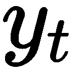
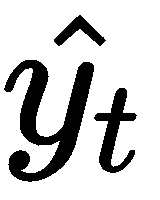
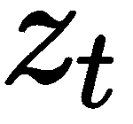
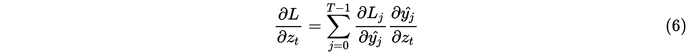
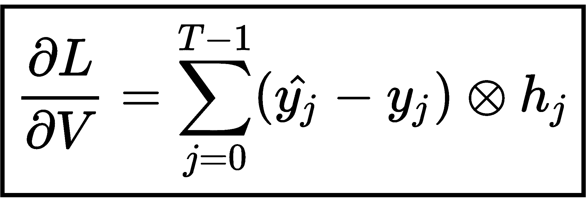
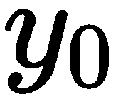
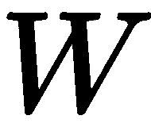

# 使用 RNN 生成歌词

在普通前馈神经网络中，每个输入都是独立的。但是对于序列数据集，我们需要知道过去的输入以进行预测。序列是一组有序的项目。例如，一个句子是一个单词序列。假设我们想要预测句子中的下一个单词；为此，我们需要记住之前的单词。普通的前馈神经网络无法预测出正确的下一个单词，因为它不会记住句子的前面单词。在这种需要记住先前输入的情况下（在这种情况下，我们需要记住先前输入以进行预测），为了进行预测，我们使用**递归神经网络**（**RNNs**）。

在本章中，我们将描述如何使用 RNN 对序列数据集进行建模以及如何记住先前的输入。我们将首先研究 RNN 与前馈神经网络的区别。然后，我们将检查 RNN 中的前向传播是如何工作的。

继续，我们将研究**时域反向传播**（**BPTT**）算法，该算法用于训练 RNN。随后，我们将讨论梯度消失和爆炸问题，在训练递归网络时会出现这些问题。您还将学习如何使用 TensorFlow 中的 RNN 生成歌词。

在本章末尾，我们将研究不同类型的 RNN 架构，以及它们在各种应用中的使用。

在本章中，我们将学习以下主题：

+   递归神经网络

+   RNN 中的前向传播

+   时域反向传播

+   梯度消失和爆炸问题

+   使用 RNN 生成歌词

+   不同类型的 RNN 架构

# 引入 RNNs

*太阳在 ____ 中升起。*

如果我们被要求预测前面句子中的空白处，我们可能会说东方。为什么我们会预测东方是正确的词汇在这里？因为我们读了整个句子，理解了上下文，并预测东方是一个适合完成句子的合适词汇。

如果我们使用前馈神经网络来预测空白，它将不能预测出正确的单词。这是因为在前馈网络中，每个输入都是独立的，并且它们仅基于当前输入进行预测，它们不记住前面的输入。

因此，网络的输入将仅仅是前一个空白处的单词，这个单词是 *the*。仅凭这个单词作为输入，我们的网络无法预测出正确的单词，因为它不知道句子的上下文，也就是说它不知道前面一组单词来理解句子的语境并预测合适的下一个单词。

这就是我们使用 RNN 的地方。它们不仅基于当前输入预测输出，还基于先前的隐藏状态。为什么它们必须基于当前输入和先前的隐藏状态来预测输出呢？为什么不能只使用当前输入和先前的输入呢？

这是因为前一个输入仅存储有关前一个单词的信息，而前一个隐藏状态将捕捉到网络迄今所见的句子中所有单词的上下文信息。基本上，前一个隐藏状态 acts like a memory，并捕捉句子的上下文。有了这个上下文和当前输入，我们可以预测相关的单词。

例如，让我们拿同样的句子 *The sun rises in the ____.* 举例。如下图所示，我们首先将单词 *the* 作为输入传递，然后将下一个单词 *sun* 作为输入；但与此同时，我们也传递了上一个隐藏状态，。因此，每次传递输入单词时，我们也会传递前一个隐藏状态作为输入。

在最后一步，我们传递单词 *the*，同时传递前一个隐藏状态 ，它捕捉到了网络迄今为止所见的单词序列的上下文信息。因此， 充当了记忆，存储了网络已经看到的所有先前单词的信息。有了  和当前输入单词 (*the*)，我们可以预测出相关的下一个单词：


简言之，RNN 使用前一个隐藏状态作为记忆，捕捉并存储网络迄今所见的上下文信息（输入）。

RNN 广泛应用于涉及序列数据的用例，如时间序列、文本、音频、语音、视频、天气等等。它们在各种自然语言处理（**NLP**）任务中被广泛使用，如语言翻译、情感分析、文本生成等。

# 前馈网络和 RNN 之间的区别

RNN 和前馈网络的比较如下图所示：


正如您可以在前面的图表中观察到的那样，RNN 在隐藏层中包含一个循环连接，这意味着我们使用前一个隐藏状态与输入一起来预测输出。

仍然感到困惑吗？让我们看看下面展开的一个 RNN 版本。但等等，什么是 RNN 的展开版本？

这意味着我们展开网络以完成一个完整的序列。假设我们有一个包含  个单词的输入句子；那么我们将有  到  层，每层对应一个单词，如下图所示：


如您在前图中所见，在时间步 ，基于当前输入  和先前的隐藏状态  预测输出 。同样，在时间步 ，基于当前输入  和先前的隐藏状态 ，预测 。这就是 RNN 的工作原理；它利用当前输入和先前的隐藏状态来预测输出。

# 循环神经网络的前向传播

让我们看看循环神经网络如何使用前向传播来预测输出；但在我们深入探讨之前，让我们熟悉一下符号：


前述图示明了以下：

+    表示输入到隐藏层的权重矩阵

+    表示隐藏到隐藏层的权重矩阵

+    表示隐藏到输出层的权重矩阵

在时间步 ，隐藏状态  可以计算如下：


也就是说，*时间步 t 的隐藏状态 = tanh([输入到隐藏层权重 x 输入] + [隐藏到隐藏层权重 x 先前隐藏状态])*。

在时间步 ，输出可以如下计算：


也就是说，*时间步 t 的输出 = softmax(隐藏到输出层权重 x 时间步 t 的隐藏状态)*。

我们还可以如下图所示表示循环神经网络（RNN）。正如您所看到的，隐藏层由一个 RNN 块表示，这意味着我们的网络是一个 RNN，并且先前的隐藏状态用于预测输出：


下图显示了 RNN 展开版本中前向传播的工作原理：


我们用随机值初始化初始隐藏状态 。如前图所示，输出  基于当前输入  和先前的隐藏状态（即初始隐藏状态）  使用以下公式预测：


类似地，看看输出  是如何计算的。它使用当前输入  和先前的隐藏状态 ：


因此，在前向传播中，为了预测输出，RNN 使用当前输入和先前的隐藏状态。

为了明确起见，让我们看看如何在 RNN 中实现前向传播以预测输出：

1.  通过从均匀分布中随机抽取，初始化所有权重 ，，和 ：

```py
U = np.random.uniform(-np.sqrt(1.0 / input_dim), np.sqrt(1.0 / input_dim), (hidden_dim, input_dim))

W = np.random.uniform(-np.sqrt(1.0 / hidden_dim), np.sqrt(1.0 / hidden_dim), (hidden_dim, hidden_dim))

V = np.random.uniform(-np.sqrt(1.0 / hidden_dim), np.sqrt(1.0 / hidden_dim), (input_dim, hidden_dim))
```

1.  定义时间步长的数量，这将是我们输入序列的长度 ：

```py
num_time_steps = len(x)
```

1.  定义隐藏状态：

```py
hidden_state = np.zeros((num_time_steps + 1, hidden_dim))
```

1.  用零初始化初始隐藏状态 ：

```py
hidden_state[-1] = np.zeros(hidden_dim)
```

1.  初始化输出：

```py
YHat = np.zeros((num_time_steps, output_dim))
```

1.  对于每个时间步长，我们执行以下操作：

```py
for t in np.arange(num_time_steps):

    #h_t = tanh(UX + Wh_{t-1})
    hidden_state[t] = np.tanh(U[:, x[t]] + W.dot(hidden_state[t - 1]))

    # yhat_t = softmax(vh)
    YHat[t] = softmax(V.dot(hidden_state[t]))
```

# 通过时间反向传播

我们刚刚学习了 RNN 中的前向传播如何工作以及如何预测输出。现在，我们计算损失 ，在每个时间步  上，以确定 RNN 预测输出的效果。我们使用交叉熵损失作为我们的损失函数。时间步  处的损失  可以如下给出：


这里， 是实际输出，而  是时间步长为  时的预测输出。

最终损失是所有时间步长上的损失之和。假设我们有  层；那么，最终损失可以如下给出：


如下图所示，最终损失是所有时间步长上损失的总和：


我们计算了损失，现在我们的目标是最小化损失。我们如何最小化损失？我们可以通过找到 RNN 的最优权重来最小化损失。正如我们所学的，RNN 中有三个权重：输入到隐藏的权重 ，隐藏到隐藏的权重 ，以及隐藏到输出的权重 。

我们需要找到所有这三个权重的最优值以最小化损失。我们可以使用我们喜爱的梯度下降算法来找到最优权重。我们首先计算损失函数相对于所有权重的梯度，然后根据权重更新规则更新权重，如下所示：


如果您不想理解梯度计算背后的数学，可以跳过接下来的几节。但是，这将有助于您更好地理解循环神经网络中的 BPTT 工作原理。

首先，我们计算损失相对于最终层  的梯度，即 ，以便我们可以在接下来的步骤中使用它。

正如我们所学的，时间步骤  处的损失  可以表示如下：


因为我们知道：


我们可以写成：


因此，损失  相对于  的梯度变为：


现在，我们将学习如何逐个计算损失相对于所有权重的梯度。

# 针对隐藏到输出权重 V 的梯度

首先，让我们回顾一下前向传播涉及的步骤：


假设 ，将其代入方程 *(2)*，我们可以重写上述步骤如下：


在预测输出  后，我们处于网络的最终层。由于我们正在进行反向传播，即从输出层到输入层，我们的第一个权重将是 ，即隐藏到输出层的权重。

我们已经看到，最终损失是所有时间步长上的损失之和，类似地，最终梯度是所有时间步长上梯度的总和：


因此，我们可以写成：


回顾我们的损失函数，；我们不能计算相对于的梯度

直接来自，因为其中没有项。因此，我们应用链式法则。回顾前向传播方程；在中有一个项：

，其中

首先，我们计算损失对的偏导数，然后从中计算对的偏导数。从中，我们可以计算对的导数。

因此，我们的方程如下：


由于我们知道，损失函数对的梯度可以计算如下：


将方程*(4)*代入方程*(3)*，我们可以写成以下形式：


为了更好地理解，让我们逐个从前述方程中取出每个项并逐个计算：



根据方程*(1)*，我们可以将的值代入前述方程*(6)*中，如下所示：


现在，我们将计算项。因为我们知道，计算给出 softmax 函数的导数：


softmax 函数的导数可以表示如下：


将方程*(8)*代入方程*(7)*，我们可以写成以下形式：


因此，最终方程如下：


现在，我们可以将方程*(9)*代入方程*(5)*：


因为我们知道，我们可以写成：


将前述方程代入方程*(10)*，我们得到我们的最终方程，即损失函数对的梯度如下：



# 对隐藏到隐藏层权重 W 的梯度

现在，我们将计算损失相对于隐藏到隐藏层权重  的梯度。与  类似，最终的梯度是所有时间步长上梯度的总和：


因此，我们可以写成：


首先，让我们计算损失的梯度  对  的导数，即 。

我们不能直接从中计算  对  的导数，因为其中没有  项。因此，我们使用链式法则计算损失对  的梯度。让我们重新回顾前向传播方程：


首先，我们计算损失  对  的偏导数；然后，从  开始，计算对  的偏导数；然后，从  开始，我们可以计算对 *W* 的导数，如下所示：


现在，让我们计算损失的梯度  对  的导数，即 。因此，我们再次应用链式法则，得到以下结果：


如果您看看前述等式，我们如何计算项 ？让我们回顾一下  的方程：


正如您在前述等式中所看到的那样，计算  取决于  和 ，但  并非常数；它再次是一个函数。因此，我们需要计算其相对于该函数的导数。

然后方程变为：


下图显示了计算 ；我们可以注意到  如何依赖于 ：


现在，让我们计算损失函数的梯度，即关于的梯度。因此，我们再次应用链式法则，得到以下结果：


在前述方程中，我们无法直接计算。回顾方程：


正如您所观察到的，计算取决于一个函数，而再次是取决于函数的函数。如下图所示，为了计算关于的导数，我们需要遍历直到，因为每个函数彼此依赖：


这可以用下图来形象地表示：


这适用于任何时间步长的损失；比如说，。因此，我们可以说，要计算任何损失，我们需要遍历到，如下图所示：


这是因为在循环神经网络中，时间的隐藏状态取决于时间的隐藏状态，这意味着当前隐藏状态始终依赖于先前的隐藏状态。

因此，任何损失可以如下图所示地计算：


因此，我们可以写出损失函数关于的梯度如下：


在前述方程中，前述方程中的总和意味着所有隐藏状态的总和。在前述方程中，可以使用链式法则计算。因此，我们可以说：


假设*j=3*和*k=0*；那么，前述方程变为：


将方程*(12)*代入方程*(11)*将得到以下结果：


我们知道最终损失是所有时间步长上损失的总和：


将方程 *(13)* 代入前述方程，我们得到以下结果：


在前述方程中，我们有两个求和，其中：

+    暗示了所有时间步长上损失的总和

+    是隐藏状态的总和

因此，我们计算损失关于 *W* 的梯度的最终方程为：


现在，我们将逐一看如何计算上述方程中的每个术语。从方程 *(4)* 和方程 *(9)*，我们可以说：


让我们看下一个术语：


我们知道隐藏状态  的计算为：


 的导数为 ，因此我们可以写成：


让我们来看最后一个术语 。我们知道隐藏状态  的计算如下： 。因此，损失  关于  的导数为：


将所有计算出的项代入方程 *(15)*，我们得到了关于损失梯度  关于  的最终方程如下：


# 关于隐藏层权重输入的梯度 U

计算损失函数对  的梯度与  相同，因为这里我们也是对  进行顺序导数。类似于 ，为了计算任何损失  关于  的导数，我们需要沿着一直回到 。

计算损失关于  的梯度的最终方程如下。正如你所注意到的那样，它基本上与方程 *(15)* 相同，只是我们有项  而不是显示为 ：


我们已经在前一节中看到如何计算前两项。

让我们看看最终项 。我们知道隐藏状态  计算如下，。因此， 对  的导数推导如下：


因此，我们对损失  对  的最终梯度方程可以写成如下形式：


# 梯度消失和梯度爆炸问题

我们刚刚学习了 BPTT 的工作原理，看到了如何计算 RNN 中所有权重的损失梯度。但在这里，我们将遇到一个称为**梯度消失和梯度爆炸**的问题。

在计算损失对  和  的导数时，我们看到我们必须遍历直到第一个隐藏状态，因为每个隐藏状态  都依赖于其前一个隐藏状态 。

例如，损失  对  的梯度给出如下：


如果你看一下前述方程中的项 ，我们无法计算导数

关于  对  的直接推导。正如我们所知， 是一个依赖于  和  的函数。因此，我们也需要计算对  的导数。即使  也是一个依赖于  和  的函数。因此，我们还需要计算对  的导数。

如下图所示，为了计算  的导数，我们需要一直追溯到初始隐藏状态 ，因为每个隐藏状态都依赖于其前一个隐藏状态：


因此，为了计算任何损失 ，我们需要一直回溯到初始隐藏状态。

状态 ，因为每个隐藏状态都依赖于其前一个隐藏状态。假设我们有一个具有 50 层的深度递归网络。为了计算损失 ，我们需要一直回溯到 ，如下图所示：


所以，问题究竟出在哪里？在向初始隐藏状态反向传播时，我们丢失了信息，RNN 将不能完美地反向传播。

记得  吗？每次向后移动时，我们计算  的导数。tanh 的导数被限制在 1\. 我们知道，当两个介于 0 和 1 之间的值相乘时，结果将会更小。我们通常将网络的权重初始化为一个小数。因此，当我们在反向传播时乘以导数和权重时，实质上是在乘以较小的数。

当我们在向后移动时，每一步乘以较小的数，我们的梯度变得无限小，导致计算机无法处理的数值；这被称为**梯度消失问题**。

回顾我们在 *关于隐藏层到隐藏层权重 W 的梯度* 部分看到的关于损失的梯度方程式：


正如你所看到的，我们在每个时间步长上乘以权重和 tanh 函数的导数。这两者的重复乘法会导致一个很小的数，从而引起梯度消失问题。

梯度消失问题不仅出现在 RNN 中，还出现在其他使用 sigmoid 或 tanh 作为激活函数的深层网络中。因此，为了克服这个问题，我们可以使用 ReLU 作为激活函数，而不是 tanh。

然而，我们有一种称为**长短期记忆**（**LSTM**）网络的 RNN 变体，它可以有效地解决梯度消失问题。我们将在第五章 *RNN 的改进* 中看看它是如何工作的。

同样地，当我们将网络的权重初始化为非常大的数时，在每一步中梯度会变得非常大。在反向传播时，我们在每个时间步长上乘以一个大数，导致梯度爆炸。这被称为**梯度爆炸问题**。

# 梯度裁剪

我们可以使用梯度裁剪来避免梯度爆炸问题。在这种方法中，我们根据向量范数（比如 *L2* 范数）来归一化梯度，并将梯度值裁剪到某个范围内。例如，如果我们将阈值设为 0.7，那么我们保持梯度在 -0.7 到 +0.7 的范围内。如果梯度值超过 -0.7，我们将其更改为 -0.7；同样地，如果超过 0.7，我们将其更改为 +0.7。

假设  是损失函数 L 关于 W 的梯度：


首先，我们使用 L2 范数对梯度进行归一化，即 。如果归一化的梯度超过了定义的阈值，我们更新梯度如下：


# 使用 RNN 生成歌词

我们已经学习了关于 RNN 的足够知识；现在，让我们看看如何使用 RNN 生成歌词。为此，我们简单地构建一个字符级 RNN，也就是说，在每个时间步，我们预测一个新字符。

让我们考虑一个小句子，*What a beautiful d*。

在第一个时间步，RNN 预测一个新字符 *a*。句子将更新为 *What a beautiful* *d**a**.*。

在下一个时间步，它预测一个新字符 *y*，句子变成了 *What a beautiful da**y**.*。

这样，我们每个时间步预测一个新字符并生成一首歌曲。除了每次预测一个新字符外，我们还可以每次预测一个新单词，这称为**词级 RNN**。为简单起见，让我们从字符级 RNN 开始。

但是，RNN 如何在每个时间步预测一个新字符呢？假设在时间步 t=0 时，我们输入一个字符 *x*。现在 RNN 根据给定的输入字符 *x* 预测下一个字符。为了预测下一个字符，它会预测我们词汇表中所有字符成为下一个字符的概率。一旦得到这个概率分布，我们根据这个概率随机选择下一个字符。有点糊涂吗？让我们通过一个例子更好地理解这个过程。

例如，如下图所示，假设我们的词汇表包含四个字符 *L, O, V,* 和 *E*；当我们将字符 *L* 作为输入时，RNN 计算词汇表中所有单词成为下一个字符的概率：


因此，我们得到概率 **[0.0, 0.9, 0.0, 0.1]**，对应词汇表中的字符 *[L,O,V,E]*。通过从这个概率分布中抽样来预测下一个字符，给输出增加了一些随机性。

在下一个时间步上，我们将上一时间步预测的字符和先前的隐藏状态作为输入，预测下一个字符，如下图所示：


因此，在每个时间步上，我们将上一时间步预测的字符和先前的隐藏状态作为输入，并预测下一个字符，如下所示：


正如您在前面的图中所见，在时间步 *t=2*，*V* 作为输入传递，并预测下一个字符为 *E*。但这并不意味着每次将字符 *V* 作为输入发送时都应始终返回 *E* 作为输出。由于我们将输入与先前的隐藏状态一起传递，RNN 记住了到目前为止看到的所有字符。

因此，先前的隐藏状态捕捉了前面输入字符的精髓，即 *L* 和 *O*。现在，使用此前的隐藏状态和输入 *V*，RNN 预测下一个字符为 *E*。

# 在 TensorFlow 中实现

现在，我们将看看如何在 TensorFlow 中构建 RNN 模型来生成歌词。该数据集以及本节中使用的完整代码和逐步说明可以在 GitHub 上的 [`bit.ly/2QJttyp`](http://bit.ly/2QJttyp) 获取。下载后，解压缩档案，并将 `songdata.csv` 放在 `data` 文件夹中。

导入所需的库：

```py
import warnings
warnings.filterwarnings('ignore')

import random
import numpy as np
import tensorflow as tf

tf.logging.set_verbosity(tf.logging.ERROR)

import warnings
warnings.filterwarnings('ignore')
```

# 数据准备

读取下载的输入数据集：

```py
df = pd.read_csv('data/songdata.csv')
```

让我们看看我们的数据集中有什么：

```py
df.head()
```

前述代码生成如下输出：


我们的数据集包含约 57,650 首歌曲：

```py
df.shape[0]

57650
```

我们有约 `643` 位艺术家的歌词：

```py
len(df['artist'].unique())

643
```

每位艺术家的歌曲数量如下所示：

```py
df['artist'].value_counts()[:10]

Donna Summer        191
Gordon Lightfoot    189
George Strait       188
Bob Dylan           188
Loretta Lynn        187
Cher                187
Alabama             187
Reba Mcentire       187
Chaka Khan          186
Dean Martin         186
Name: artist, dtype: int64
```

平均每位艺术家有约 `89` 首歌曲：

```py
df['artist'].value_counts().values.mean()

89
```

我们在 `text` 列中有歌词，因此我们将该列的所有行组合起来，并将其保存为名为 `data` 的变量中的 `text`，如下所示：

```py
data = ', '.join(df['text'])
```

让我们看看一首歌的几行：

```py
data[:369]

"Look at her face, it's a wonderful face  \nAnd it means something special to me  \nLook at the way that she smiles when she sees me  \nHow lucky can one fellow be?  \n  \nShe's just my kind of girl, she makes me feel fine  \nWho could ever believe that she could be mine?  \nShe's just my kind of girl, without her I'm blue  \nAnd if she ever leaves me what could I do, what co"
```

由于我们正在构建字符级 RNN，我们将数据集中所有唯一字符存储在名为 `chars` 的变量中；这基本上就是我们的词汇表：

```py
chars = sorted(list(set(data)))
```

将词汇表大小存储在名为 `vocab_size` 的变量中：

```py
vocab_size = len(chars)
```

由于神经网络只接受数字输入，因此我们需要将词汇表中的所有字符转换为数字。

我们将词汇表中的所有字符映射到它们的对应索引，形成一个唯一的数字。我们定义了一个 `char_to_ix` 字典，其中包含所有字符到它们索引的映射。为了通过字符获取索引，我们还定义了 `ix_to_char` 字典，其中包含所有索引到它们相应字符的映射：

```py
char_to_ix = {ch: i for i, ch in enumerate(chars)}
ix_to_char = {i: ch for i, ch in enumerate(chars)}
```

如您在下面的代码片段中所见，字符 `'s'` 在 `char_to_ix` 字典中映射到索引 `68`：

```py
print char_to_ix['s']

68
```

类似地，如果我们将 `68` 作为输入给 `ix_to_char`，那么我们得到相应的字符，即 `'s'`：

```py
print ix_to_char[68]

's'
```

一旦我们获得字符到整数的映射，我们使用独热编码将输入和输出表示为向量形式。**独热编码向量** 基本上是一个全为 0 的向量，除了对应字符索引位置为 1。

例如，假设 `vocabSize` 是 `7`，而字符 *z* 在词汇表中的第四个位置。那么，字符 *z* 的独热编码表示如下所示：

```py
vocabSize = 7
char_index = 4

print np.eye(vocabSize)[char_index]

array([0., 0., 0., 0., 1., 0., 0.])
```

如您所见，我们在对应字符的索引位置有一个 1，其余值为 0。这就是我们将每个字符转换为独热编码向量的方式。

在以下代码中，我们定义了一个名为 `one_hot_encoder` 的函数，该函数将根据字符的索引返回一个独热编码向量：

```py
def one_hot_encoder(index):
    return np.eye(vocab_size)[index]
```

# 定义网络参数

接下来，我们定义所有网络参数：

1.  定义隐藏层中的单元数：

```py
hidden_size = 100
```

1.  定义输入和输出序列的长度：

```py
seq_length = 25
```

1.  定义梯度下降的学习率：

```py
learning_rate = 1e-1
```

1.  设置种子值：

```py
seed_value = 42
tf.set_random_seed(seed_value)
random.seed(seed_value)
```

# 定义占位符

现在，我们将定义 TensorFlow 的占位符：

1.  输入和输出的 `placeholders` 定义如下：

```py
inputs = tf.placeholder(shape=[None, vocab_size],dtype=tf.float32, name="inputs")
targets = tf.placeholder(shape=[None, vocab_size], dtype=tf.float32, name="targets")
```

1.  定义初始隐藏状态的 `placeholder`：

```py
init_state = tf.placeholder(shape=[1, hidden_size], dtype=tf.float32, name="state")
```

1.  定义用于初始化 RNN 权重的 `initializer`：

```py
initializer = tf.random_normal_initializer(stddev=0.1)
```

# 定义前向传播

让我们定义涉及 RNN 的前向传播，数学表达如下：


 和  是隐藏层和输出层的偏置项，简单起见，在前面的方程中我们没有添加它们。前向传播可以实现如下：

```py
with tf.variable_scope("RNN") as scope:
    h_t = init_state
    y_hat = []

    for t, x_t in enumerate(tf.split(inputs, seq_length, axis=0)):
        if t > 0:
            scope.reuse_variables() 

        #input to hidden layer weights
        U = tf.get_variable("U", [vocab_size, hidden_size], initializer=initializer)

        #hidden to hidden layer weights
        W = tf.get_variable("W", [hidden_size, hidden_size], initializer=initializer)

        #output to hidden layer weights
        V = tf.get_variable("V", [hidden_size, vocab_size], initializer=initializer)

        #bias for hidden layer
        bh = tf.get_variable("bh", [hidden_size], initializer=initializer)

        #bias for output layer
        by = tf.get_variable("by", [vocab_size], initializer=initializer)

        h_t = tf.tanh(tf.matmul(x_t, U) + tf.matmul(h_t, W) + bh)

        y_hat_t = tf.matmul(h_t, V) + by

        y_hat.append(y_hat_t) 
```

对输出应用 `softmax` 并获取概率：

```py
output_softmax = tf.nn.softmax(y_hat[-1])
outputs = tf.concat(y_hat, axis=0)
```

计算交叉熵损失：

```py
loss = tf.reduce_mean(tf.nn.softmax_cross_entropy_with_logits(labels=targets, logits=outputs))
```

将 RNN 的最终隐藏状态存储在 `hprev` 中。我们使用这个最终隐藏状态来进行预测：

```py
hprev = h_t
```

# 定义 BPTT

现在，我们将执行 BPTT，使用 Adam 作为优化器。我们还将进行梯度裁剪以避免梯度爆炸问题：

1.  初始化 Adam 优化器：

```py
minimizer = tf.train.AdamOptimizer()
```

1.  使用 Adam 优化器计算损失的梯度：

```py
gradients = minimizer.compute_gradients(loss)
```

1.  设置梯度裁剪的阈值：

```py
threshold = tf.constant(5.0, name="grad_clipping")
```

1.  裁剪超过阈值的梯度并将其带入范围内：

```py
clipped_gradients = []
for grad, var in gradients:
    clipped_grad = tf.clip_by_value(grad, -threshold, threshold)
    clipped_gradients.append((clipped_grad, var))
```

1.  使用裁剪后的梯度更新梯度：

```py
updated_gradients = minimizer.apply_gradients(clipped_gradients)
```

# 开始生成歌曲

开始 TensorFlow 会话并初始化所有变量：

```py
sess = tf.Session()

init = tf.global_variables_initializer()

sess.run(init)
```

现在，我们将看看如何使用 RNN 生成歌词。RNN 的输入和输出应该是什么？它是如何学习的？训练数据是什么？让我们逐步理解这一解释，并附上代码。

我们知道在 RNN 中，在时间步  预测的输出将作为下一个时间步的输入；也就是说，每个时间步，我们需要将前一个时间步预测的字符作为输入。因此，我们以同样的方式准备我们的数据集。

例如，请看下表。假设每一行代表一个不同的时间步；在时间步 ，RNN 预测一个新字符 *g* 作为输出。这将作为下一个时间步  的输入发送。

然而，如果你注意到时间步  中的输入，我们从输入 `o` 中删除了第一个字符，并在序列末尾添加了新预测的字符 *g*。为什么要删除输入中的第一个字符？因为我们需要保持序列长度。

假设我们的序列长度是八；将新预测的字符添加到序列中会将序列长度增加到九。为了避免这种情况，我们从输入中移除第一个字符，同时将前一个时间步的新预测字符添加进来。

类似地，在输出数据中，我们也会在每个时间步删除第一个字符，因为一旦预测了新字符，序列长度就会增加。为了避免这种情况，在每个时间步从输出中删除第一个字符，如下表所示：


现在，我们将看看如何准备我们的输入和输出序列，类似于前面的表格。

定义一个名为 `pointer` 的变量，它指向数据集中的字符。我们将 `pointer` 设置为 `0`，这意味着它指向第一个字符：

```py
pointer = 0
```

定义输入数据：

```py
input_sentence = data[pointer: pointer + seq_length]
```

这是什么意思？使用指针和序列长度切片数据。假设 `seq_length` 是 `25`，指针是 `0`。它将返回前 25 个字符作为输入。因此，`data[pointer:pointer + seq_length]` 返回以下输出：

```py
"Look at her face, it's a "
```

定义输出，如下所示：

```py
output_sentence = data[pointer + 1: pointer + seq_length + 1]
```

我们将输出数据切片，从输入数据移动一个字符。因此，`data[pointer + 1:pointer + seq_length + 1]` 返回以下内容：

```py
"ook at her face, it's a w"
```

正如你所看到的，我们在前一句中添加了下一个字符并删除了第一个字符。因此，每次迭代时，我们增加指针并遍历整个数据集。这就是我们为训练 RNN 获取输入和输出句子的方法。

就像我们学到的那样，RNN 仅接受数字作为输入。一旦我们切片了输入和输出序列，我们使用之前定义的 `char_to_ix` 字典获取相应字符的索引：

```py
input_indices = [char_to_ix[ch] for ch in input_sentence]
target_indices = [char_to_ix[ch] for ch in output_sentence]
```

使用我们之前定义的 `one_hot_encoder` 函数将索引转换为 one-hot 编码向量：

```py
input_vector = one_hot_encoder(input_indices)
target_vector = one_hot_encoder(target_indices)
```

这 `input_vector` 和 `target_vector` 成为训练 RNN 的输入和输出。现在，让我们开始训练。

`hprev_val`变量存储了我们训练的 RNN 模型的最后隐藏状态，我们用它来进行预测，并将损失存储在名为`loss_val`的变量中：

```py
hprev_val, loss_val, _ = sess.run([hprev, loss, updated_gradients], feed_dict={inputs: input_vector,targets: target_vector,init_state: hprev_val})
```

我们训练模型进行*n*次迭代。训练后，我们开始进行预测。现在，我们将看看如何进行预测并使用我们训练的 RNN 生成歌词。设置`sample_length`，即我们想要生成的句子（歌曲）的长度：

```py
sample_length = 500
```

随机选择输入序列的起始索引：

```py
random_index = random.randint(0, len(data) - seq_length)
```

选择具有随机选择索引的输入句子：

```py
sample_input_sent = data[random_index:random_index + seq_length]
```

正如我们所知，我们需要将输入作为数字进行馈送；将所选输入句子转换为索引：

```py
sample_input_indices = [char_to_ix[ch] for ch in sample_input_sent]
```

记住，我们将 RNN 的最后隐藏状态存储在`hprev_val`中。我们使用它来进行预测。我们通过从`hprev_val`复制值来创建一个名为`sample_prev_state_val`的新变量。

`sample_prev_state_val`用作进行预测的初始隐藏状态：

```py
sample_prev_state_val = np.copy(hprev_val)
```

初始化用于存储预测输出索引的列表：

```py
predicted_indices = []
```

现在，对于`t`在`sample_length`的范围内，我们执行以下操作并为定义的`sample_length`生成歌曲：

将`sampled_input_indices`转换为 one-hot 编码向量：

```py
sample_input_vector = one_hot_encoder(sample_input_indices)
```

将`sample_input_vector`和初始隐藏状态`sample_prev_state_val`馈送给 RNN，并获得预测。我们将输出概率分布存储在`probs_dist`中：

```py
probs_dist, sample_prev_state_val = sess.run([output_softmax, hprev],
 feed_dict={inputs: sample_input_vector,init_state: sample_prev_state_val})
```

使用由 RNN 生成的概率分布随机选择下一个字符的索引：

```py
ix = np.random.choice(range(vocab_size), p=probs_dist.ravel())
```

将新预测的索引`ix`添加到`sample_input_indices`中，并从`sample_input_indices`中删除第一个索引以保持序列长度。这将形成下一个时间步的输入：

```py
sample_input_indices = sample_input_indices[1:] + [ix]
```

存储所有预测的`chars`索引在`predicted_indices`列表中：

```py
predicted_indices.append(ix)
```

将所有的`predicted_indices`转换为它们对应的字符：

```py
predicted_chars = [ix_to_char[ix] for ix in predicted_indices]
```

将所有的`predicted_chars`组合起来，并保存为`text`：

```py
 text = ''.join(predicted_chars)
```

在每 50,000^(th)次迭代时打印预测文本：

```py
print ('\n')
print (' After %d iterations' %(iteration))
print('\n %s \n' % (text,)) 
print('-'*115)
```

增加`pointer`和`iteration`：

```py
pointer += seq_length
iteration += 1
```

在初始迭代中，您可以看到 RNN 生成了随机字符。但是在第 50,000^(th)次迭代中，它开始生成有意义的文本：

```py
 After 0 iterations

 Y?a6C.-eMSfk0pHD v!74YNeI 3YeP,h- h6AADuANJJv:HA(QXNeKzwCjBnAShbavSrGw7:ZcSv[!?dUno Qt?OmE-PdY wrqhSu?Yvxdek?5Rn'Pj!n5:32a?cjue  ZIj
Xr6qn.scqpa7)[MSUjG-Sw8n3ZexdUrLXDQ:MOXBMX EiuKjGudcznGMkF:Y6)ynj0Hiajj?d?n2Iapmfc?WYd BWVyB-GAxe.Hq0PaEce5H!u5t: AkO?F(oz0Ma!BUMtGtSsAP]Oh,1nHf5tZCwU(F?X5CDzhOgSNH(4Cl-Ldk? HO7 WD9boZyPIDghWUfY B:r5z9Muzdw2'WWtf4srCgyX?hS!,BL GZHqgTY:K3!wn:aZGoxr?zmayANhMKJsZhGjpbgiwSw5Z:oatGAL4Xenk]jE3zJ?ymB6v?j7(mL[3DFsO['Hw-d7htzMn?nm20o'?6gfPZhBa
NlOjnBd2n0 T"d'e1k?OY6Wwnx6d!F 

----------------------------------------------------------------------------------------------

 After 50000 iterations

 Hem-:]  
[Ex" what  
Akn'lise  
[Grout his bring bear.  
Gnow ourd?  
Thelf  
As cloume  
That hands, Havi Musking me Mrse your leallas, Froking the cluse (have: mes.  
I slok and if a serfres me the sky withrioni flle rome.....Ba tut get make ome  
But it lives I dive.  
[Lett it's to the srom of and a live me it's streefies  
And is.  
As it and is me dand a serray]  
zrtye:"  
Chay at your hanyer  
[Every rigbthing with farclets  

[Brround.  
Mad is trie  
[Chare's a day-Mom shacke?

, I  

-------------------------------------------------------------------------------------------------
```

# 不同类型的 RNN 架构

现在我们已经了解了 RNN 的工作原理，我们将看看基于输入和输出数量的不同类型的 RNN 架构。

# 一对一架构

在**一对一架构**中，单个输入映射到单个输出，时间步*t*的输出作为下一个时间步的输入。我们已经在最后一节中看到了这种架构，用于使用 RNN 生成歌曲。

例如，在文本生成任务中，我们将当前时间步生成的输出作为下一个时间步的输入，以生成下一个单词。这种架构在股票市场预测中也被广泛使用。

下图展示了一对一的 RNN 架构。如您所见，时间步*t*预测的输出被发送为下一个时间步的输入：

![# 一对多架构在**一对多架构**中，单个输入映射到多个隐藏状态和多个输出值，这意味着 RNN 接受单个输入并映射到输出序列。尽管我们只有一个输入值，但我们在时间步之间共享隐藏状态以预测输出。与前述一对一架构不同，这里我们只在时间步之间共享上一个隐藏状态，而不是上一个输出。这种架构的一个应用是图像标题生成。我们传递单个图像作为输入，输出是构成图像标题的单词序列。如下图所示，将单个图像作为输入传递给 RNN，在第一个时间步，预测单词*Horse*；在下一个时间步，使用上一个隐藏状态预测下一个单词*standing*。类似地，它持续一系列步骤并预测下一个单词，直到生成标题：

# 多对一架构

一个**多对一架构**，顾名思义，接受一个输入序列并将其映射到单个输出值。多对一架构的一个流行示例是**情感分类**。一句话是一个单词序列，因此在每个时间步，我们将每个单词作为输入传递，并在最终时间步预测输出。

假设我们有一个句子：*Paris is a beautiful city.* 如下图所示，在每个时间步，一个单词作为输入传递，并且在最终时间步预测句子的情感：


# **多对多架构**

在**多对多架构**中，我们将任意长度的输入序列映射到任意长度的输出序列。这种架构已被用于各种应用中。多对多架构的一些流行应用包括语言翻译、对话机器人和音频生成。

假设我们正在将一句英语句子转换成法语。考虑我们的输入句子：*What are you doing?* 如下图所示，它将映射为*Que faites vous*：


# 总结

我们首先介绍了什么是 RNN，以及 RNN 与前馈网络的区别。我们了解到 RNN 是一种特殊类型的神经网络，广泛应用于序列数据；它根据当前输入和先前的隐藏状态预测输出，隐藏状态充当记忆，存储到目前为止网络所见到的信息序列。

我们学习了 RNN 中的前向传播工作原理，然后详细推导了用于训练 RNN 的 BPTT 算法。接着，我们通过在 TensorFlow 中实现 RNN 来生成歌词。在本章末尾，我们了解了 RNN 的不同架构，如一对一、一对多、多对一和多对多，它们被用于各种应用中。

在下一章中，我们将学习关于 LSTM 单元的内容，它解决了 RNN 中的梯度消失问题。我们还将学习不同变体的 RNN。

# 问题

尝试回答以下问题：

1.  RNN 与前馈神经网络有什么区别？

1.  RNN 中的隐藏状态是如何计算的？

1.  递归网络有什么用途？

1.  梯度消失问题是如何发生的？

1.  什么是爆炸梯度问题？

1.  梯度裁剪如何缓解爆炸梯度问题？

1.  不同类型的 RNN 架构有哪些？

# 进一步阅读

参考以下链接了解更多关于 RNN 的内容：

+   *循环神经网络（RNN）和长短期记忆（LSTM）网络基础*，作者 Alex Sherstinsky，[`arxiv.org/pdf/1808.03314.pdf`](https://arxiv.org/pdf/1808.03314.pdf)

+   利用 TensorFlow 进行手写生成的 RNN，基于 Alex Graves 的*用循环神经网络生成序列*，[`github.com/snowkylin/rnn-handwriting-generation`](https://github.com/snowkylin/rnn-handwriting-generation)
