# 第五章：RNN 的改进

**递归神经网络**（**RNN**）的缺点是它不能长时间保持信息在内存中。我们知道 RNN 将信息序列存储在其隐藏状态中，但是当输入序列过长时，由于消失梯度问题，它无法将所有信息保留在内存中，这是我们在前一章节讨论过的。

为了应对这个问题，我们引入了一种称为**长短期记忆**（**LSTM**）单元的 RNN 变体，通过使用称为**门**的特殊结构来解决消失梯度问题。门会根据需要保持信息在内存中。它们学会了什么信息应该保留，什么信息应该丢弃。

我们将从探索 LSTM 和它如何克服 RNN 的缺点开始这一章节。接下来，我们将学习如何使用 LSTM 单元在 TensorFlow 中执行前向和后向传播，并且了解如何使用它们来预测比特币的价格。

接下来，我们将掌握**门控循环单元**（**GRU**）单元，它是 LSTM 单元的简化版本。我们将学习 GRU 单元中的前向和后向传播的工作原理。接下来，我们将基本了解双向 RNNs 的工作原理及其如何利用过去和未来的信息进行预测；我们还将了解深层 RNNs 的工作方式。

在章节结束时，我们将学习关于序列到序列模型的内容，该模型将长度可变的输入映射到长度可变的输出。我们将深入探讨序列到序列模型的架构和注意力机制。

为了确保对这些主题有清晰的理解，本章节按以下方式组织：

+   LSTM 来拯救

+   LSTM 中的前向和后向传播

+   使用 LSTM 预测比特币价格

+   GRUs

+   GRUs 中的前向和后向传播

+   双向 RNNs

+   深层 RNNs

+   序列到序列模型

# LSTM 来拯救

在反向传播 RNN 时，我们发现了一个称为**消失梯度**的问题。由于消失梯度问题，我们无法正确训练网络，导致 RNN 无法在记忆中保留长序列。为了更好地理解我们所说的，让我们考虑一个简短的句子：

*天空是 __*。

基于它所见的信息，RNN 可以轻松预测空白为 *蓝色*，但它无法涵盖长期依赖关系。这意味着什么？让我们考虑以下句子以更好地理解这个问题：

*阿奇在中国生活了 13 年。他喜欢听好音乐。他是漫画迷。他精通 ____。*

现在，如果我们被要求预测前述句子中的缺失词，我们会预测它为*Chinese*，但是我们是如何预测的呢？我们简单地记住了前面的句子，并理解阿奇在中国生活了 13 年。这使我们得出结论，阿奇可能会说流利的中文。另一方面，RNN 无法在其记忆中保留所有这些信息以表明阿奇能说流利的中文。由于梯度消失问题，它无法长时间保留信息。也就是说，当输入序列很长时，RNN 的记忆（隐藏状态）无法容纳所有信息。为了缓解这一问题，我们使用 LSTM 单元。

LSTM 是 RNN 的一种变体，解决了梯度消失问题，并在需要时保留信息在内存中。基本上，图中的隐藏单元中的 RNN 单元被替换为 LSTM 单元：

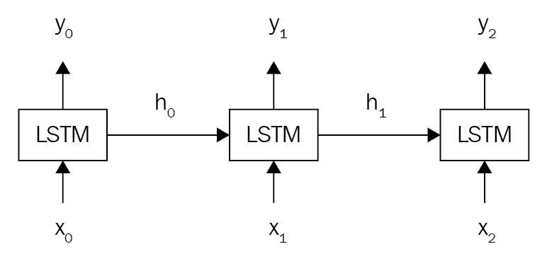

# 理解 LSTM 单元

是什么使 LSTM 单元如此特殊？LSTM 单元如何实现长期依赖？它如何知道什么信息需要保留，什么信息需要从记忆中丢弃？

这一切都是通过称为**门**的特殊结构实现的。如下图所示，典型的 LSTM 单元包括三个特殊的门，称为输入门、输出门和遗忘门：

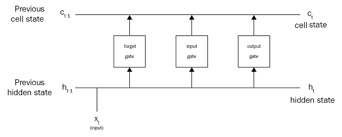

这三个门负责决定什么信息需要添加、输出和从记忆中遗忘。有了这些门，LSTM 单元可以有效地只在需要时保留信息在记忆中。

在 RNN 单元中，我们使用隐藏状态，，有两个目的：一个是存储信息，另一个是进行预测。不像 RNN，在 LSTM 单元中，我们将隐藏状态分解为两个状态，称为**单元状态**和**隐藏状态**：

+   单元状态也称为内部存储器，所有信息将存储在这里

+   隐藏状态用于计算输出，也就是进行预测。

单元状态和隐藏状态在每个时间步共享。现在，我们将深入研究 LSTM 单元，看看这些门如何使用以及隐藏状态如何预测输出。

# 遗忘门

遗忘门，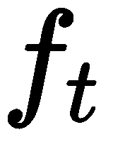，负责决定应该从单元状态（记忆）中移除哪些信息。考虑以下句子：

*哈里* *是一位好歌手*。*他住在纽约。赛恩也是一位好歌手*。

一旦我们开始谈论赛恩，网络就会理解主题已从哈里变为赛恩，关于哈里的信息不再需要。现在，遗忘门将从单元状态中删除/遗忘有关哈里的信息。

遗忘门由 sigmoid 函数控制。在时间步，我们将输入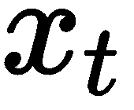和上一个隐藏状态传递给遗忘门。如果细胞状态中的特定信息应该被移除，则返回`0`，如果不应该被移除，则返回`1`。在时间步，遗忘门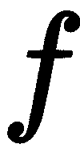的表达如下：

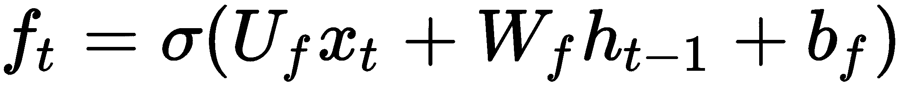

在这里，适用以下内容：

+   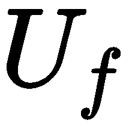是遗忘门的输入到隐藏层权重。

+   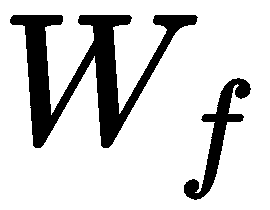是遗忘门的隐藏到隐藏层权重。

+   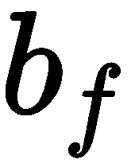是遗忘门的偏置。

以下图示显示了遗忘门。正如你所见，输入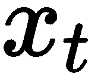与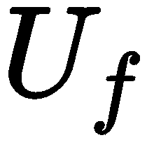以及上一个隐藏状态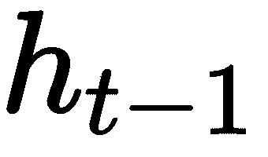与相乘，然后两者相加并发送到 sigmoid 函数，返回，如下所示：

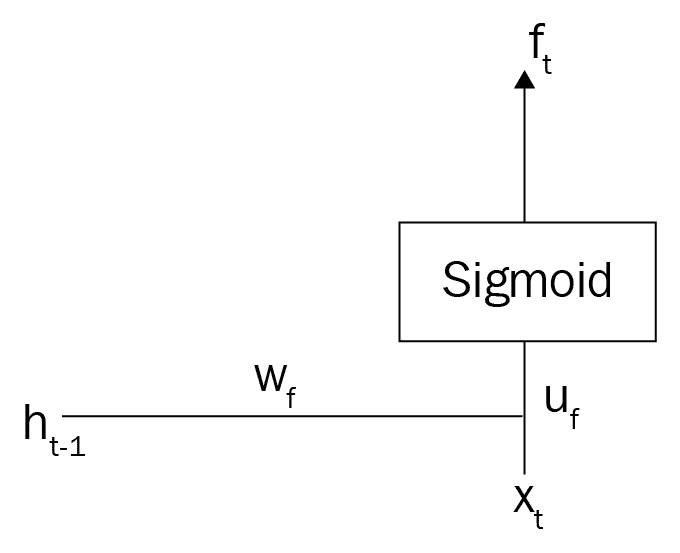

# 输入门

输入门负责决定应该存储在细胞状态中的信息。让我们考虑相同的例子：

*Harry is a good singer. He lives in New York. Zayn is also a good singer.*

在遗忘门从细胞状态中移除信息后，输入门决定保留在记忆中的信息。在这里，由于遗忘门已从细胞状态中移除了关于 Harry 的信息，输入门决定用*Zayn*的信息更新细胞状态。

类似于遗忘门，输入门由 sigmoid 函数控制，返回 0 到 1 范围内的输出。如果返回`1`，则特定信息将被存储/更新到细胞状态中，如果返回`0`，则不会将信息存储到细胞状态中。在时间步，输入门的表达如下：

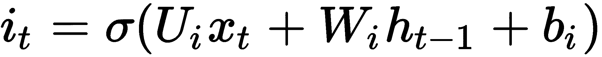

在这里，适用以下内容：

+   是输入门的输入到隐藏层权重。

+   是输入门的隐藏到隐藏权重。

+   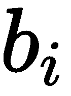是输入门的偏置。

以下图示显示了输入门：

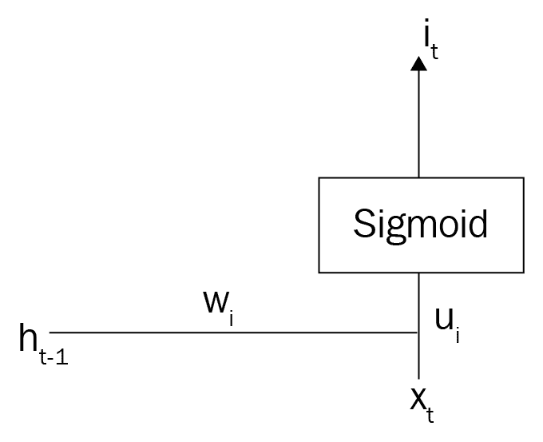

# 输出门

我们将在细胞状态（记忆）中有大量信息。输出门负责决定从细胞状态中取出哪些信息作为输出。考虑以下句子：

*赞恩的首张专辑取得了巨大成功。祝贺 ____*。

输出门将查找细胞状态中的所有信息，并选择正确的信息填补空白。在这里，`congrats` 是用来描述名词的形容词。因此，输出门将预测填补空白的是 *Zayn*（名词）。与其他门类似，它也由一个 sigmoid 函数控制。在时间步，输出门 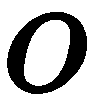 的表示如下：

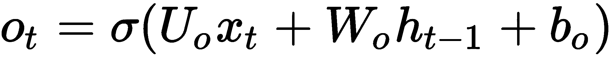

在这里，适用以下规则：

+   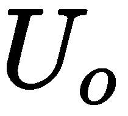是输出门的输入到隐藏层权重

+   是输出门的隐藏到隐藏层权重

+   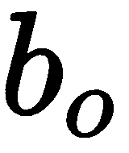是输出门的输入到隐藏层权重

输出门如下图所示：

是输出门的偏置

# 更新细胞状态

我们刚刚学习了 LSTM 网络中所有三个门是如何工作的，但问题是，我们如何实际通过门来更新细胞状态，添加相关的新信息并删除不需要的信息？

首先，我们将看看如何向细胞状态添加新的相关信息。为了容纳可以添加到细胞状态（记忆）中的所有新信息，我们创建一个新的向量称为 。它被称为 **候选状态** 或 **内部状态向量**。与由 sigmoid 函数调节的门不同，候选状态由 tanh 函数调节，但为什么呢？Sigmoid 函数返回范围在 `0` 到 `1` 之间的值，即始终为正。我们需要允许  的值可以是正或负。因此，我们使用 tanh 函数，它返回范围在 `-1` 到 `+1` 之间的值。

在时间步，候选状态 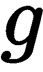 的表示如下：

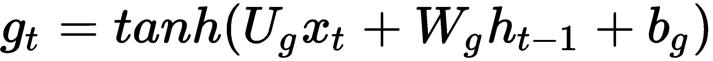

在这里，适用以下规则：

+   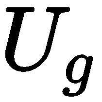是候选状态的输入到隐藏层权重

+   是候选状态的隐藏到隐藏层权重

+   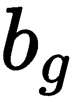是候选状态的偏置

因此，候选状态包含了所有可以添加到细胞状态（记忆）中的新信息。下图显示了候选状态：

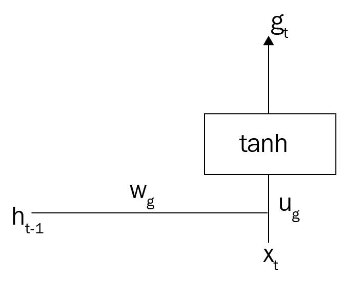

我们如何决定候选状态中的信息是否相关？我们如何决定是否将候选状态中的新信息添加到细胞状态中？我们学到，输入门负责决定是否添加新信息，因此如果我们将  和  相乘，我们只获得应添加到记忆中的相关信息。

换句话说，我们知道如果信息不需要，则输入门返回 0，如果信息需要则返回 1。例如 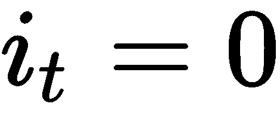，那么将  和  相乘得到 0，这意味着  中的信息不需要更新细胞状态的 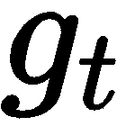。当 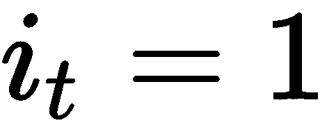 时，将  和 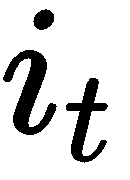 相乘得到 ，这意味着我们可以更新  中的信息到细胞状态。

将新信息添加到细胞状态的输入门  和候选状态  在下图中显示：

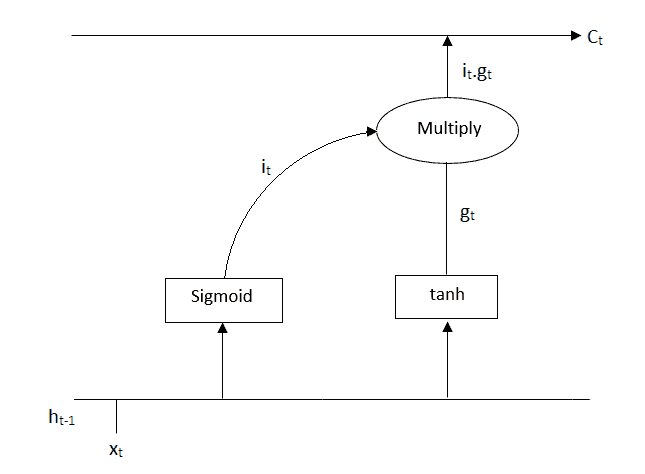

现在，我们将看到如何从先前的细胞状态中移除不再需要的信息。

我们学到，遗忘门用于删除细胞状态中不需要的信息。因此，如果我们将先前的细胞状态 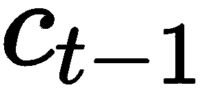 和遗忘门  相乘，那么我们只保留细胞状态中的相关信息。

例如 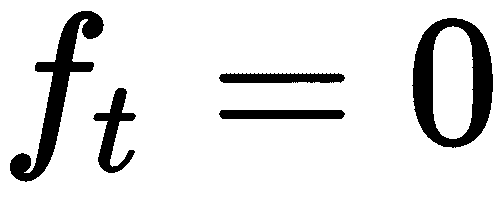，那么将  和  相乘得到 0，这意味着细胞状态中的信息  不需要，并且应该被移除（遗忘）。当 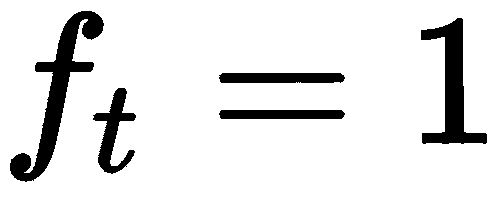 时，将  和  相乘得到 ，这意味着先前细胞状态中的信息是必需的，不应被移除。

使用遗忘门  从先前的细胞状态  中移除信息如下图所示：

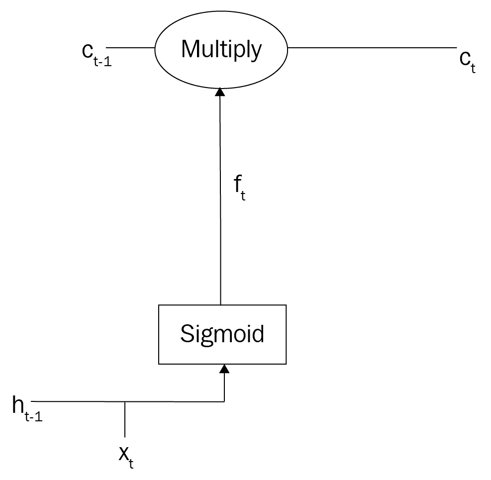

因此，简言之，我们通过乘以  和  来添加新信息，乘以 **** 和  来移除信息，从而更新我们的细胞状态。我们可以将细胞状态方程表达如下：


# 更新隐藏状态

我们刚刚学习了如何更新细胞状态中的信息。现在，我们将看到如何更新隐藏状态中的信息。我们知道隐藏状态  用于计算输出，但是我们如何计算输出呢？

我们知道输出门负责决定从细胞状态中获取什么信息作为输出。因此，将  和细胞状态 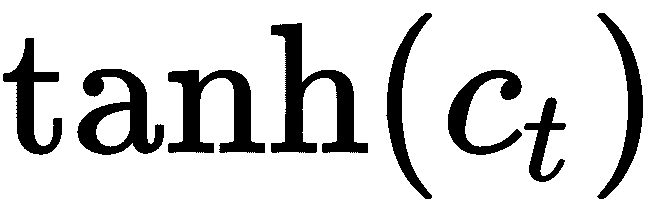 的双曲正切乘积（将其压缩在 -1 和 +1 之间）给出输出。

因此，隐藏状态 ，可以表达如下：


下图显示了隐藏状态 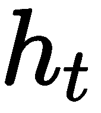 如何通过乘以 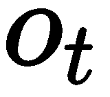 和  来计算：

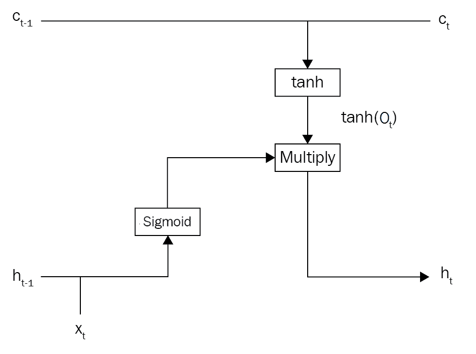

最后，一旦我们有了隐藏状态值，我们可以应用 softmax 函数并计算 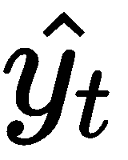 如下：


这里， 是隐藏到输出层的权重。

# LSTM 中的前向传播

将所有部分整合起来，所有操作后的最终 LSTM 细胞显示在以下图表中。 细胞状态和隐藏状态在时间步骤间共享，这意味着 LSTM 在时间步骤  计算细胞状态  和隐藏状态 ，并将其发送到下一个时间步骤：


LSTM 细胞中完整的前向传播步骤如下所示：

1.  **输入门**：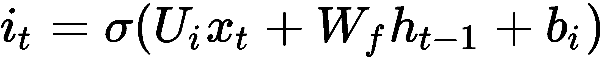

1.  **遗忘门**：

1.  **输出门**：

1.  **候选状态**：

1.  **细胞状态**：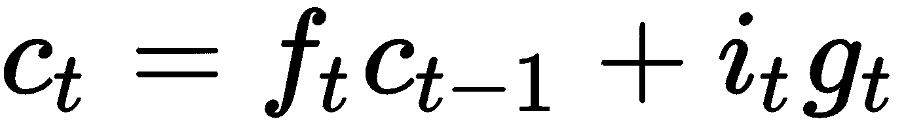

1.  **隐藏状态**：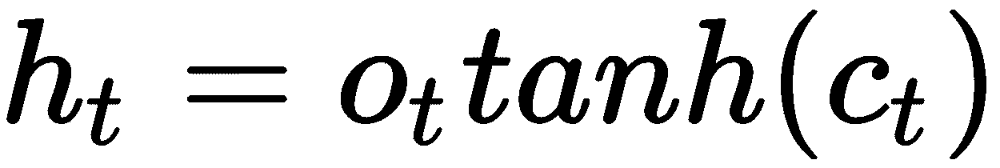

1.  **输出**：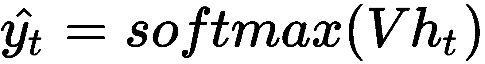

# LSTM 中的反向传播

我们在每个时间步计算损失，以确定我们的 LSTM 模型预测输出的好坏。假设我们使用交叉熵作为损失函数，则在时间步  的损失  如下方程所示：

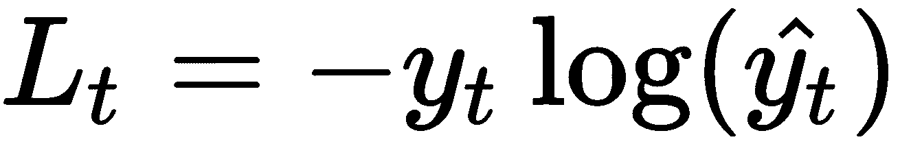

这里，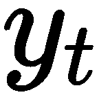 是实际输出， 是时间步  的预测输出。

我们的最终损失是所有时间步的损失之和，可以表示为：


我们使用梯度下降来最小化损失。我们找到损失对网络中所有权重的导数，并找到最优权重以最小化损失：

+   我们有四个输入到隐藏层的权重，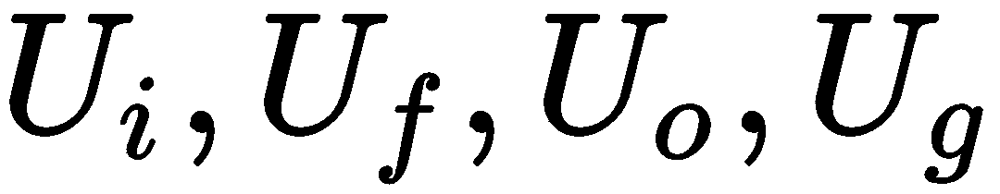，分别是输入门、遗忘门、输出门和候选状态的输入到隐藏层权重。

+   我们有四个隐藏到隐藏层的权重，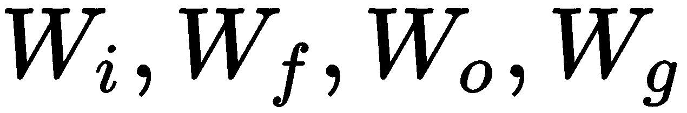，分别对应输入门、遗忘门、输出门和候选状态的隐藏到隐藏层权重。

+   我们有一个隐藏到输出层的权重，

我们通过梯度下降找到所有这些权重的最优值，并根据权重更新规则更新权重。权重更新规则如下方程所示：

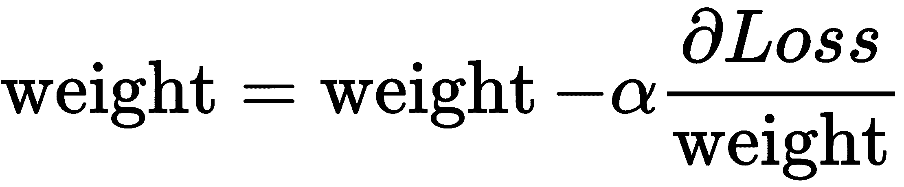

在下一节中，我们将逐步查看如何计算 LSTM 单元中所有权重相对于损失的梯度。

如果你对推导所有权重的梯度不感兴趣，可以跳过即将到来的部分。然而，这将加强你对 LSTM 单元的理解。

# 相对于门的梯度

计算 LSTM 单元中所有权重相对于损失的梯度需要计算所有门和候选状态的梯度。因此，在本节中，我们将学习如何计算损失函数相对于所有门和候选状态的梯度。

在我们开始之前，让我们回顾以下两件事：

+   sigmoid 函数的导数表达如下：

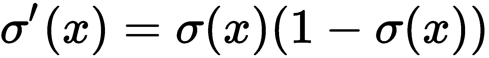

+   tanh 函数的导数表达如下：

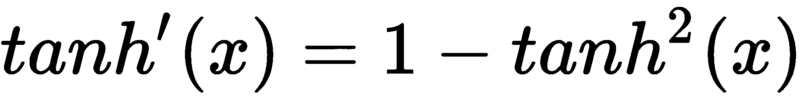

在即将进行的计算中，我们将在多个地方使用损失相对于隐藏状态  和细胞状态 **** 的梯度。因此，首先，我们将看看如何计算损失相对于隐藏状态  和细胞状态 **** 的梯度。

首先，让我们看看如何计算**损失相对于隐藏状态的梯度**，。

我们知道输出  的计算如下：


假设 。我们在  中有  项，因此根据链式法则，我们可以写出以下内容：


我们已经看到如何在 第四章，*使用 RNN 生成歌词* 中计算 ，因此直接从 第四章 的方程 *(9)* 中，*使用 RNN 生成歌词*，我们可以写出以下内容：


现在，让我们看看如何计算**损失相对于细胞状态的梯度**，。

要计算损失相对于细胞状态的梯度，请查看前向传播的方程，并找出哪个方程中有  项。在隐藏状态的方程中，我们有如下的  项：


因此，根据链式法则，我们可以写出以下内容：


我们知道 tanh 的导数是 ，因此我们可以写出以下内容：


现在我们已经计算出损失相对于隐藏状态和细胞状态的梯度，让我们看看如何逐个计算损失相对于所有门的梯度。

首先，我们将看看如何计算**损失相对于输出门的梯度**，。

要计算损失相对于输出门的梯度，请查看前向传播的方程，并找出哪个方程中有  项。在隐藏状态的方程中，我们有如下的  项：


因此，根据链式法则，我们可以写出以下内容：


现在我们将看到如何计算对输入门的损失梯度，。

我们在细胞状态方程中有项用于：


根据链式法则，我们可以写成以下形式：


现在我们学习如何计算对遗忘门的损失梯度，。

我们还在细胞状态方程中有项用于：


根据链式法则，我们可以写成以下形式：


最后，我们学习如何计算对候选状态的损失梯度，。

我们还在细胞状态方程中有项用于：


因此，根据链式法则，我们可以写成以下形式：


因此，我们已经计算出了损失对所有门和候选状态的梯度。在接下来的部分中，我们将看到如何计算损失对 LSTM 单元中所有权重的梯度。

# 对权重的梯度

现在让我们看看如何计算损失对 LSTM 单元中所有权重的梯度。

# 对 V 的梯度

在预测输出后，我们处于网络的最后一层。因为我们在进行反向传播，即从输出层到输入层，我们的第一个权重将是隐藏到输出层的权重，。

我们一直学到最后的损失是所有时间步长的损失之和。类似地，我们最终的梯度是所有时间步骤的梯度之和，如下所示：


如果我们有层，那么我们可以将损失对的梯度写成如下形式：


由于 LSTM 的最终方程式，即，与 RNN 相同，计算与相关的损失梯度与我们在 RNN 中计算的完全相同。因此，我们可以直接写出以下内容：


# 与 W 相关的梯度

现在我们将看看如何计算隐藏到隐藏层权重对所有门和候选状态的损失梯度。

让我们计算**与相关的损失梯度**。

回想一下输入门的方程式，如下所示：


因此，根据链式法则，我们可以写出以下内容：


让我们计算前述方程中的每一项。

我们已经看到如何计算第一项，即损失关于输入门的梯度，，在*门梯度*部分。参考方程式(*2*)。

因此，让我们看看第二项：


由于我们知道 sigmoid 函数的导数，即，因此我们可以写出以下内容：


但是已经是 sigmoid 的结果，即，因此我们可以直接写出，因此，我们的方程式变为以下内容：


因此，我们计算损失关于梯度的最终方程变为以下内容：


现在，让我们找出与相关的**损失梯度**。

回想一下遗忘门的方程式，如下所示：


因此，根据链式法则，我们可以写出以下内容：


我们已经看到如何在门梯度部分计算。参考方程式*(3)*。因此，让我们看看计算第二项：


因此，我们计算梯度损失与相关的最终方程式如下：


让我们计算**与相关的损失梯度**。

回想一下输出门的方程式，如下所示：


因此，使用链式法则，我们可以写成以下形式：


检查方程式 *(1)* 的第一项。第二项可以计算如下：


因此，我们计算损失相对于  梯度的最终方程式如下：


让我们继续计算**相对于**  的梯度。

回想一下候选状态方程式：


因此，使用链式法则，我们可以写成以下形式：


参考方程 *(4)* 的第一项。第二项可以计算如下：


我们知道 tanh 的导数是 ，因此我们可以写成以下形式：


因此，我们计算损失相对于  的梯度的最终方程式如下：


# 关于 U 的梯度

让我们计算损失相对于隐藏到输入层权重  对所有门和候选状态的梯度。相对于  的损失梯度计算与我们相对于  计算的梯度完全相同，只是最后一项是  而不是 。让我们详细探讨一下这是什么意思。

让我们找出**相对于**  的梯度。

输入门的方程式如下：


因此，使用链式法则，我们可以写成以下形式：


让我们计算前述方程式中的每一项。我们已经从方程 *(2)* 知道了第一项。因此，第二项可以计算如下：


因此，我们计算损失相对于  梯度的最终方程式如下：


正如您所看到的，前述方程式与  完全相同，只是最后一项是  而不是 。对于所有其他权重也适用，因此我们可以直接写出方程式如下：

+   **相对于**  的梯度：


+   损失关于的梯度：


+   损失关于的梯度：


计算梯度后，针对所有这些权重，我们使用权重更新规则更新它们，并最小化损失。

# 使用 LSTM 模型预测比特币价格

我们已经了解到 LSTM 模型广泛用于序列数据集，即有序的数据集。在本节中，我们将学习如何使用 LSTM 网络进行时间序列分析。我们将学习如何使用 LSTM 网络预测比特币价格。

首先，我们按如下方式导入所需的库：

```py
import numpy as np
import pandas as pd
from sklearn.preprocessing import StandardScaler

import matplotlib.pyplot as plt
%matplotlib inline 
plt.style.use('ggplot')

import tensorflow as tf
tf.logging.set_verbosity(tf.logging.ERROR)

import warnings
warnings.filterwarnings('ignore')
```

# 数据准备

现在，我们将看到如何准备我们的数据集，以便我们的 LSTM 网络需要。首先，我们按如下方式读取输入数据集：

```py
df = pd.read_csv('data/btc.csv')
```

然后我们展示数据集的几行：

```py
df.head()
```

上述代码生成如下输出：


如前述数据框所示，`Close`列表示比特币的收盘价。我们只需要`Close`列来进行预测，因此我们只取该特定列：

```py
data = df['Close'].values
```

接下来，我们标准化数据并将其缩放到相同的尺度：

```py
scaler = StandardScaler()
data = scaler.fit_transform(data.reshape(-1, 1))
```

然后，我们绘制并观察比特币价格变化的趋势。由于我们缩放了价格，它不是一个很大的数值：

```py
plt.plot(data)
plt.xlabel('Days')
plt.ylabel('Price')
plt.grid()
```

生成如下图所示的绘图：


现在，我们定义一个称为`get_data`函数的函数，它生成输入和输出。它以数据和`window_size`作为输入，并生成输入和目标列。

这里的窗口大小是多少？我们将*x*值向前移动`window_size`次，并得到*y*值。例如，如下表所示，当`window_size`等于 1 时，*y*值恰好比*x*值提前一步：

| **x** | **y** |
| --- | --- |
| 0.13 | 0.56 |
| 0.56 | 0.11 |
| 0.11 | 0.40 |
| 0.40 | 0.63 |

函数`get_data()`的定义如下：

```py
def get_data(data, window_size):
    X = []
    y = []

    i = 0

    while (i + window_size) <= len(data) - 1:
        X.append(data[i:i+window_size])
        y.append(data[i+window_size])

        i += 1
    assert len(X) == len(y)
    return X, y
```

我们选择`window_size`为`7`并生成输入和输出：

```py
X, y = get_data(data, window_size = 7)
```

将前`1000`个点视为训练集，其余点视为测试集：

```py
#train set
X_train = np.array(X[:1000])
y_train = np.array(y[:1000])

#test set
X_test = np.array(X[1000:])
y_test = np.array(y[1000:])
```

`X_train`的形状如下所示：

```py
X_train.shape

(1000,7,1)
```

前面的形状表示什么？它意味着`sample_size`、`time_steps`和`features`函数及 LSTM 网络需要的输入正是如下所示：

+   `1000`设置数据点数目（`sample_size`）

+   `7`指定窗口大小（`time_steps`）

+   `1`指定我们数据集的维度（`features`）

# 定义参数

定义网络参数如下：

```py
batch_size = 7
window_size = 7
hidden_layer = 256
learning_rate = 0.001
```

为我们的输入和输出定义占位符：

```py
input = tf.placeholder(tf.float32, [batch_size, window_size, 1])
target = tf.placeholder(tf.float32, [batch_size, 1])
```

现在，让我们定义我们在 LSTM 单元中将使用的所有权重。

输入门的权重定义如下：

```py
U_i = tf.Variable(tf.truncated_normal([1, hidden_layer], stddev=0.05))
W_i = tf.Variable(tf.truncated_normal([hidden_layer, hidden_layer], stddev=0.05))
b_i = tf.Variable(tf.zeros([hidden_layer]))
```

忘记门的权重定义如下：

```py
U_f = tf.Variable(tf.truncated_normal([1, hidden_layer], stddev=0.05))
W_f = tf.Variable(tf.truncated_normal([hidden_layer, hidden_layer], stddev=0.05))
b_f = tf.Variable(tf.zeros([hidden_layer]))
```

输出门的权重定义如下：

```py
U_o = tf.Variable(tf.truncated_normal([1, hidden_layer], stddev=0.05))
W_o = tf.Variable(tf.truncated_normal([hidden_layer, hidden_layer], stddev=0.05))
b_o = tf.Variable(tf.zeros([hidden_layer]))
```

候选状态的权重定义如下：

```py
U_g = tf.Variable(tf.truncated_normal([1, hidden_layer], stddev=0.05))
W_g = tf.Variable(tf.truncated_normal([hidden_layer, hidden_layer], stddev=0.05))
b_g = tf.Variable(tf.zeros([hidden_layer]))
```

输出层的权重如下所示：

```py
V = tf.Variable(tf.truncated_normal([hidden_layer, 1], stddev=0.05))
b_v = tf.Variable(tf.zeros([1]))
```

# 定义 LSTM 单元

现在，我们定义名为`LSTM_cell`的函数，它将细胞状态和隐藏状态作为输出返回。回顾我们在 LSTM 前向传播中看到的步骤，它的实现如下所示。`LSTM_cell`接受输入、先前隐藏状态和先前细胞状态作为输入，并返回当前细胞状态和当前隐藏状态作为输出：

```py
def LSTM_cell(input, prev_hidden_state, prev_cell_state):

    it = tf.sigmoid(tf.matmul(input, U_i) + tf.matmul(prev_hidden_state, W_i) + b_i)

    ft = tf.sigmoid(tf.matmul(input, U_f) + tf.matmul(prev_hidden_state, W_f) + b_f)

    ot = tf.sigmoid(tf.matmul(input, U_o) + tf.matmul(prev_hidden_state, W_o) + b_o)

    gt = tf.tanh(tf.matmul(input, U_g) + tf.matmul(prev_hidden_state, W_g) + b_g)

    ct = (prev_cell_state * ft) + (it * gt)

    ht = ot * tf.tanh(ct)

    return ct, ht
```

# 定义前向传播

现在我们将执行前向传播并预测输出，，并初始化一个名为`y_hat`的列表以存储输出：

```py
y_hat = []
```

对于每次迭代，我们计算输出并将其存储在`y_hat`列表中：

```py
for i in range(batch_size):
```

我们初始化隐藏状态和细胞状态：

```py
    hidden_state = np.zeros([1, hidden_layer], dtype=np.float32) 
    cell_state = np.zeros([1, hidden_layer], dtype=np.float32)
```

我们执行前向传播，并计算每个时间步长的 LSTM 单元的隐藏状态和细胞状态：

```py
    for t in range(window_size):
        cell_state, hidden_state = LSTM_cell(tf.reshape(input[i][t], (-1, 1)), hidden_state, cell_state)
```

我们知道输出  可以计算如下：


计算`y_hat`，并将其附加到`y_hat`列表中：

```py
    y_hat.append(tf.matmul(hidden_state, V) + b_v)
```

# 定义反向传播

在执行前向传播并预测输出之后，我们计算损失。我们使用均方误差作为我们的损失函数，总损失是所有时间步长上损失的总和：

```py
losses = []

for i in range(len(y_hat)):
    losses.append(tf.losses.mean_squared_error(tf.reshape(target[i], (-1, 1)), y_hat[i]))

loss = tf.reduce_mean(losses)
```

为了避免梯度爆炸问题，我们执行梯度裁剪：

```py
gradients = tf.gradients(loss, tf.trainable_variables())
clipped, _ = tf.clip_by_global_norm(gradients, 4.0)
```

我们使用 Adam 优化器并最小化我们的损失函数：

```py
optimizer = tf.train.AdamOptimizer(learning_rate).apply_gradients(zip(gradients, tf.trainable_variables()))
```

# 训练 LSTM 模型

开始 TensorFlow 会话并初始化所有变量：

```py
session = tf.Session()
session.run(tf.global_variables_initializer())
```

设置`epochs`的数量：

```py
epochs = 100
```

然后，对于每次迭代，执行以下操作：

```py
for i in range(epochs):

    train_predictions = []
    index = 0
    epoch_loss = []
```

然后对数据批次进行抽样并训练网络：

```py
    while(index + batch_size) <= len(X_train):

        X_batch = X_train[index:index+batch_size]
        y_batch = y_train[index:index+batch_size]

        #predict the price and compute the loss
        predicted, loss_val, _ = session.run([y_hat, loss, optimizer], feed_dict={input:X_batch, target:y_batch})

        #store the loss in the epoch_loss list
        epoch_loss.append(loss_val)

        #store the predictions in the train_predictions list
        train_predictions.append(predicted)
        index += batch_size
```

在每`10`次迭代上打印损失：

```py
     if (i % 10)== 0:
        print 'Epoch {}, Loss: {} '.format(i,np.mean(epoch_loss))
```

正如您可以在以下输出中看到的，损失随着 epochs 的增加而减少：

```py
Epoch 0, Loss: 0.0402321927249 
Epoch 10, Loss: 0.0244581680745 
Epoch 20, Loss: 0.0177710317075 
Epoch 30, Loss: 0.0117778982967 
Epoch 40, Loss: 0.00901956297457 
Epoch 50, Loss: 0.0112476013601 
Epoch 60, Loss: 0.00944950990379 
Epoch 70, Loss: 0.00822851061821 
Epoch 80, Loss: 0.00766260037199 
Epoch 90, Loss: 0.00710930628702 
```

# 使用 LSTM 模型进行预测

现在我们将开始对测试集进行预测：

```py
predicted_output = []
i = 0
while i+batch_size <= len(X_test): 

    output = session.run([y_hat],feed_dict={input:X_test[i:i+batch_size]})
    i += batch_size
    predicted_output.append(output)
```

打印预测输出：

```py
predicted_output[0]
```

我们将得到如下结果：

```py
[[array([[-0.60426176]], dtype=float32),
  array([[-0.60155034]], dtype=float32),
  array([[-0.60079575]], dtype=float32),
  array([[-0.599668]], dtype=float32),
  array([[-0.5991149]], dtype=float32),
  array([[-0.6008351]], dtype=float32),
  array([[-0.5970466]], dtype=float32)]]
```

正如您所见，测试预测值的值是嵌套列表，因此我们将它们展开：

```py
predicted_values_test = []
for i in range(len(predicted_output)):
  for j in range(len(predicted_output[i][0])):
    predicted_values_test.append(predicted_output[i][0][j])
```

现在，如果我们打印预测值，它们不再是嵌套列表：

```py
predicted_values_test[0]

array([[-0.60426176]], dtype=float32)
```

由于我们将前`1000`个点作为训练集，我们对大于`1000`的时间步长进行预测：

```py
predictions = []
for i in range(1280):
      if i >= 1000:
        predictions.append(predicted_values_test[i-1019])
      else:
        predictions.append(None)
```

我们绘制并查看预测值与实际值的匹配程度：

```py
plt.figure(figsize=(16, 7))
plt.plot(data, label='Actual')
plt.plot(predictions, label='Predicted')
plt.legend()
plt.xlabel('Days')
plt.ylabel('Price')
plt.grid()
plt.show()
```

正如您在以下图中所见，实际值显示为红色，预测值显示为蓝色。由于我们对大于`1000`时间步长进行预测，您可以看到在时间步骤**1000**之后，红色和蓝色线条彼此交错，这表明我们的模型正确预测了实际值：


# 门控循环单元

到目前为止，我们已经学习了 LSTM 单元如何使用不同的门，并解决了 RNN 的梯度消失问题。但是，正如您可能注意到的，由于存在许多门和状态，LSTM 单元具有太多的参数。

因此，在反向传播 LSTM 网络时，我们需要在每次迭代中更新大量参数。这增加了我们的训练时间。因此，我们引入了**门控循环单元（GRU）**，它作为 LSTM 单元的简化版本。与 LSTM 单元不同，GRU 单元只有两个门和一个隐藏状态。

RNN 中使用 GRU 单元如下图所示：


# 理解 GRU 单元

如下图所示，GRU 单元只有两个门，称为更新门和重置门，以及一个隐藏状态：


让我们深入了解这些门是如何使用的，以及如何计算隐藏状态。

# 更新门

更新门有助于决定前一时间步的哪些信息可以传递到下一时间步。它基本上是输入门和遗忘门的组合，我们在 LSTM 单元中学到的内容。与 LSTM 单元的门类似，更新门也由 sigmoid 函数调节。

在时间步骤，更新门表达如下：


在这里，应用以下内容：

+   是更新门的输入到隐藏权重

+   是更新门的隐藏到隐藏权重

+   是更新门的偏置

以下图示显示了更新门。如您所见，输入与相乘，并且先前的隐藏状态，，0 和 1：


# 重置门

重置门帮助决定如何将新信息添加到内存中，即它可以忘记多少过去信息。在时间步骤，重置门表达如下：


在这里，应用以下内容：

+   是重置门的输入到隐藏权重

+   是重置门的隐藏到隐藏权重

+   是重置门的偏置

重置门如下图所示：


# 更新隐藏状态

我们刚刚学习了更新和重置门的工作原理，但这些门如何帮助更新隐藏状态呢？也就是说，如何利用重置门和更新门向隐藏状态添加新信息，以及如何利用它们从隐藏状态中删除不需要的信息？

首先，我们将看到如何向隐藏状态添加新信息。

我们创建一个名为**内容状态**的新状态，，用于保存信息。我们知道重置门用于删除不需要的信息。因此，利用重置门，我们创建一个仅包含所需信息的内容状态，。

在时间步骤 ，内容状态  表示如下：


下图显示了如何使用重置门创建内容状态：


现在我们将看到如何从隐藏状态中删除信息。

我们了解到更新门  帮助确定上一个时间步  中哪些信息可以传递到下一个时间步 。将  和  相乘，我们仅获取上一步骤中的相关信息。而不是使用新门，我们只是使用  的补集，即 ，并将其与  相乘。

随后，隐藏状态更新如下：


一旦计算出隐藏状态，我们可以应用 softmax 函数并计算输出如下：


# GRU 单元的前向传播

将所有这些内容结合起来，我们在前一节中学到，GRU 单元中完整的前向传播步骤可以表示如下：

+   **更新门**：

+   **重置门**：

+   **内容状态**：

+   **隐藏状态**：

+   **输出**：

# GRU 单元中的反向传播

总损失，，是所有时间步骤上损失的总和，可以表示如下：


为了通过梯度下降最小化损失，我们找出 GRU 单元中所有权重的损失导数如下：

+   我们有三个输入到隐藏层权重，，分别是更新门、重置门和内容状态的输入到隐藏层权重

+   我们有三个隐藏到隐藏层权重，，分别是更新门、重置门和内容状态的隐藏到隐藏层权重

+   我们有一个隐藏到输出层权重，

通过梯度下降找到所有这些权重的最优值，并根据权重更新规则更新权重。

# 门的梯度

正如我们在讨论 LSTM 单元时看到的那样，计算所有权重的损失梯度需要考虑所有门和内容状态的梯度。因此，首先我们将看看如何计算它们。

在接下来的计算中，我们将使用损失相对于隐藏状态的梯度，，在多个地方为，因此我们将看看如何计算它。计算损失相对于隐藏状态的梯度，，与我们在 LSTM 单元中看到的完全相同，可以如下给出：


首先，让我们看看如何计算与**内容状态相关的损失梯度**，****。

要计算与内容状态相关的损失梯度，请查看正向传播的方程，并找出哪个方程式有项。在隐藏状态方程式中，也就是方程 *(8)* 中，我们有项，如下所示：


因此，根据链式法则，我们可以写成如下形式：


让我们看看如何计算**重置门**的损失梯度。

我们在内容状态方程中有****项，并且可以表示如下：


因此，根据链式法则，我们可以写成如下形式：


最后，我们看到与更新门相关的**损失梯度**，****。

在我们的隐藏状态方程  中，我们有一个项， ，该方程可以表示如下：


因此，根据链式法则，我们可以写出以下内容：


我们已经计算了对所有门和内容状态的损失梯度，现在我们将看看如何计算对我们的 GRU 单元中所有权重的损失梯度。

# 权重的梯度

现在，我们将看到如何计算 GRU 单元中使用的所有权重的梯度。

# 相对于 V 的梯度

由于 GRU 的最终方程，即 ，与 RNN 相同，计算损失相对于隐藏到输出层权重  的梯度与我们在 RNN 中计算的完全相同。因此，我们可以直接写出以下内容：


# 相对于 W 的梯度

现在，我们将看看如何计算对所有门和内容状态中使用的隐藏到隐藏层权重  的损失梯度。

让我们计算**相对于**  的损失梯度。

回想一下重置门方程，如下所示：


使用链式法则，我们可以写出以下内容：


让我们计算前述方程中的每个项。第一项， ，我们在方程 *(11)* 中已经计算过。第二项计算如下：


因此，我们计算  的损失梯度的最终方程如下：


现在，让我们继续找出**相对于**  的损失梯度。

回想一下更新门方程，如下所示：


使用链式法则，我们可以写出以下内容：


我们已经计算了方程 *(12)* 中的第一项。第二项计算如下：


因此，我们计算  的损失梯度的最终方程如下：


现在，我们将找出**相对于**  的损失梯度。

回想一下内容状态方程：


使用链式法则，我们可以写出如下内容：


参考方程 *(10)* 的第一项。第二项如下所示：


因此，我们计算损失相对于  的梯度的最终方程如下：


# 相对于 U 的梯度

现在我们将看到如何计算损失相对于隐藏权重输入  的梯度，适用于所有门和内容状态。相对于  的梯度与相对于  的计算完全相同，除了最后一项将是  而不是 ，这与我们在学习 LSTM 单元时学到的类似。

我们可以将损失相对于  的梯度写成：


**损失相对于**  的梯度表示如下：


**损失相对于**  的梯度表示如下：


# 在 TensorFlow 中实现 GRU 单元

现在，我们将看到如何在 TensorFlow 中实现 GRU 单元。而不是查看代码，我们只会看到如何在 TensorFlow 中实现 GRU 的前向传播。

# 定义权重

首先，让我们定义所有权重。更新门的权重定义如下：

```py
 Uz = tf.get_variable("Uz", [vocab_size, hidden_size], initializer=init)
 Wz = tf.get_variable("Wz", [hidden_size, hidden_size], initializer=init)
 bz = tf.get_variable("bz", [hidden_size], initializer=init)
```

重置门的权重如下定义：

```py
Ur = tf.get_variable("Ur", [vocab_size, hidden_size], initializer=init)
Wr = tf.get_variable("Wr", [hidden_size, hidden_size], initializer=init)
br = tf.get_variable("br", [hidden_size], initializer=init)
```

内容状态的权重定义如下：

```py
Uc = tf.get_variable("Uc", [vocab_size, hidden_size], initializer=init)
Wc = tf.get_variable("Wc", [hidden_size, hidden_size], initializer=init)
bc = tf.get_variable("bc", [hidden_size], initializer=init)
```

输出层的权重定义如下：

```py
V = tf.get_variable("V", [hidden_size, vocab_size], initializer=init)
by = tf.get_variable("by", [vocab_size], initializer=init)
```

# 定义前向传播

将更新门定义为方程 *(5)* 中所给定的：

```py
zt = tf.sigmoid(tf.matmul(x_t, Uz) + tf.matmul(h_t, Wz) + bz)
```

将重置门定义为方程 *(6)* 中所给定的：

```py
rt = tf.sigmoid(tf.matmul(x_t, Ur) + tf.matmul(h_t, Wr) + br)
```

将内容状态定义为方程 *(7)* 中所给定的：

```py
ct = tf.tanh(tf.matmul(x_t, Uc) + tf.matmul(tf.multiply(rt, h_t), Wc) + bc)
```

将隐藏状态定义为方程 *(8)* 中所给定的：

```py
 h_t = tf.multiply((1 - zt), ct) + tf.multiply(zt, h_t)
```

根据方程 *(9)* 计算输出：

```py
 y_hat_t = tf.matmul(h_t, V) + by
```

# 双向 RNN

在双向 RNN 中，我们有两个不同的隐藏单元层。这两层从输入层到输出层连接。在一层中，隐藏状态从左到右共享，在另一层中，它们从右到左共享。

但这意味着什么？简单地说，一个隐藏层从序列的起始点向前移动通过时间，而另一个隐藏层从序列的末尾向后移动通过时间。

如下图所示，我们有两个隐藏层：前向隐藏层和后向隐藏层，具体描述如下：

+   在前向隐藏层中，隐藏状态值是从过去的时间步共享的，即， 被共享到， 被共享到，依此类推。

+   在后向隐藏层中，隐藏起始值是从未来的时间步共享的，即，到，到，依此类推。

前向隐藏层和后向隐藏层如下图所示：


双向循环神经网络的用途是什么？在某些情况下，从两个方向读取输入序列非常有用。因此，双向循环神经网络包括两个 RNN，一个从前向读取句子，另一个从后向读取句子。

例如，考虑以下句子：

*阿奇在 _____ 待了 13 年。所以他擅长说中文。*

如果我们使用 RNN 来预测上述句子中的空白，这将是模棱两可的。正如我们所知，RNN 只能根据它迄今为止看到的一组词来进行预测。在上述句子中，要预测空白，RNN 只看到*阿奇*、*待了*、*13*、*年*、*在*，*但*这些词汇单独并不提供足够的上下文，也不能清楚地预测出正确的单词。它只是说*阿奇在待了 13 年在.*仅仅凭这些信息，我们无法正确预测接下来的单词。

但是，如果我们也阅读空白后面的单词，如*所以，他，是，擅长，说，中文*和*中国*，那么我们可以说阿奇在*中国*待了 13 年，因为他擅长说中文。因此，在这种情况下，如果我们使用双向循环神经网络来预测空白，它将能够正确预测，因为它在做出预测之前会同时从前向和后向读取句子。

双向循环神经网络已经在各种应用中使用，例如**词性标注（POS）**，在这种情况下，知道目标词前后的词汇是至关重要的，语言翻译，预测蛋白质结构，依赖句法分析等。然而，双向循环神经网络在不知道未来信息的在线设置中不适用。

双向循环神经网络的前向传播步骤如下所示：

+   前向隐藏层：


+   后向隐藏层：


+   输出：


使用 TensorFlow 实现双向递归神经网络很简单。假设我们在双向递归神经网络中使用 LSTM 单元，我们可以按以下步骤操作：

1.  从 TensorFlow 的 `contrib` 中导入 `rnn`，如下所示：

```py
from tensorflow.contrib import rnn
```

1.  定义前向和后向隐藏层：

```py
forward_hidden_layer = rnn.BasicLSTMCell(num_hidden, forget_bias=1.0)

backward_hidden_layer = rnn.BasicLSTMCell(num_hidden, forget_bias=1.0)
```

1.  使用`rnn.static_bidirectional_rnn`来定义双向递归神经网络：

```py
outputs, forward_states, backward_states = rnn.static_bidirectional_rnn(forward_hidden_layer, backward_hidden_layer, input)                                         
```

# 深入理解深度递归神经网络（deep RNN）

我们知道，深度神经网络是具有多个隐藏层的网络。类似地，深度递归神经网络具有多个隐藏层，但当我们有多个隐藏层时，隐藏状态如何计算呢？我们知道，递归神经网络通过接收输入和先前的隐藏状态来计算隐藏状态，但当我们有多个隐藏层时，后续层的隐藏状态如何计算呢？

例如，让我们看看隐藏层 2 中的  如何计算。它接收前一个隐藏状态  和前一层的输出  作为输入来计算 。

因此，当我们有多个隐藏层的递归神经网络时，后续层的隐藏层将通过接收前一个隐藏状态和前一层的输出作为输入来计算，如下图所示：


# 使用 seq2seq 模型进行语言翻译

**序列到序列模型**（**seq2seq**）基本上是 RNN 的一对多架构。它已被用于各种应用，因为它能够将任意长度的输入序列映射到任意长度的输出序列。seq2seq 模型的一些应用包括语言翻译、音乐生成、语音生成和聊天机器人。

在大多数实际场景中，输入和输出序列的长度是变化的。例如，让我们考虑语言翻译任务，在这个任务中，我们需要将一种语言的句子转换为另一种语言。假设我们将英语（源语言）转换为法语（目标语言）。

假设我们的输入句子是*what are you doing?*，那么它将被映射为*que faites vous?* 如我们所见，输入序列由四个单词组成，而输出序列由三个单词组成。seq2seq 模型可以处理这种不同长度的输入和输出序列，并将源序列映射到目标序列。因此，在输入和输出序列长度变化的应用中广泛使用它们。

seq2seq 模型的架构非常简单。它包括两个关键组件，即编码器和解码器。让我们考虑同样的语言翻译任务。首先，我们将输入句子馈送给编码器。

编码器学习输入句子的表示（嵌入），但是什么是表示？表示或嵌入基本上是包含句子意义的向量。它也被称为**思想向量**或**上下文向量**。一旦编码器学习了嵌入，它将嵌入发送到解码器。解码器将这个嵌入（思想向量）作为输入，并试图构造目标句子。因此，解码器尝试为英语句子生成法语翻译。

如下图所示，编码器接收输入的英语句子，学习嵌入，并将嵌入馈送给解码器，然后解码器使用这些嵌入生成翻译后的法语句子：


但这是如何真正工作的呢？编码器如何理解句子？解码器如何使用编码器的嵌入翻译句子？让我们深入探讨一下，看看这是如何运作的。

# 编码器

编码器基本上是带有 LSTM 或 GRU 单元的 RNN。它也可以是双向 RNN。我们将输入句子馈送给编码器，而不是获取输出，而是从最后一个时间步获取隐藏状态作为嵌入。让我们通过一个示例更好地理解编码器。

考虑我们使用的是带有 GRU 单元的 RNN，输入句子是*what are you doing.* 让我们用*e*表示编码器的隐藏状态：


前面的图示展示了编码器如何计算思想向量；下文将详细解释：

+   在第一个时间步中，我们传递输入， 给一个 GRU 单元，这是输入句子中的第一个词*what*，以及初始隐藏状态，，它是随机初始化的。使用这些输入，GRU 单元计算第一个隐藏状态，，如下所示：


+   在下一个时间步中，我们传递输入，，这是输入句子中的下一个词*are*，给编码器。除此之外，我们还传递上一个隐藏状态，，并计算隐藏状态，：


+   在下一个时间步中，我们传递输入，，这是下一个词*you*，给编码器。除此之外，我们还传递上一个隐藏状态，，并计算隐藏状态， 如下所示：


+   在最后一个时间步  中，我们输入 *doing.* 作为输入单词。同时传递前一个隐藏状态 ，计算隐藏状态 ：


因此， 是我们的最终隐藏状态。我们了解到 RNN 在其隐藏状态中捕捉到目前为止看到的所有单词的上下文。由于  是最终隐藏状态，它包含了网络看到的所有单词的上下文，即我们输入句子中的所有单词，即 *what, are, you* 和 *doing.* 

由于最终隐藏状态  包含了输入句子中所有单词的上下文，因此它包含了输入句子的上下文，并且这实质上形成了我们的嵌入 ，也称为思考向量或上下文向量，如下所示：


我们将上下文向量  传递给解码器，以将其转换为目标句子。

因此，在编码器中，每个时间步 ，我们输入一个单词，并与之前的隐藏状态  一起计算当前的隐藏状态 。最终步骤中的隐藏状态  包含了输入句子的上下文，并将成为嵌入 ，该嵌入将发送到解码器以将其转换为目标句子。

# 解码器

现在，我们将学习如何使用编码器生成的思考向量  来生成目标句子。解码器是一个带有 LSTM 或 GRU 单元的 RNN。我们的解码器的目标是为给定的输入（源）句子生成目标句子。

我们知道，我们通过使用随机值初始化 RNN 的初始隐藏状态来启动它，但对于解码器的 RNN，我们初始化隐藏状态的方式是使用由编码器生成的思考向量，，而不是使用随机值。解码器网络如下图所示：


但是，解码器的输入应该是什么？我们简单地将**<sos>**作为解码器的输入，表示句子的开始。因此，一旦解码器收到**<sos>**，它尝试预测目标句子的实际起始词。让我们用表示解码器的隐藏状态。

在第一个时间步骤，，我们将第一个输入**<sos>**传递给解码器，并且还传递思考向量作为初始隐藏状态，如下所示：


好的。我们到底在做什么？我们需要预测输出序列，即我们输入的英语句子的法语等价物。我们的词汇表中有很多法语单词。解码器如何决定输出哪个单词？也就是说，它如何确定输出序列的第一个单词？

我们将解码器隐藏状态馈送到，它返回所有词汇表中的分数，作为第一个输出词。也就是说，在时间步骤的输出词计算如下：


我们不是直接使用原始分数，而是将它们转换为概率。由于我们了解到 softmax 函数将值压缩到 0 到 1 之间，我们使用 softmax 函数将分数转换为概率：


因此，我们得到了所有法语词汇中第一个输出词的概率。我们使用 argmax 函数选择具有最高概率的词作为第一个输出词：


因此，我们预测第一个输出词为*Que*，如前图所示。

在下一个时间步骤，我们将前一个时间步骤预测的输出词作为解码器的输入。同时，我们还传递上一个隐藏状态：


接着，我们计算所有词汇表中的分数，作为下一个输出词，即时间步骤的输出词：


然后，我们使用 softmax 函数将分数转换为概率：


接下来，我们选择具有最高概率的单词作为输出词，，在时间步骤：


因此，我们使用  初始化解码器的初始隐藏状态，并且在每个时间步  中，我们将来自上一个时间步的预测输出词  和先前的隐藏状态  作为解码器当前时间步骤的输入 ，并预测当前输出 。

但是解码器何时停止？因为我们的输出序列必须在某处停止，我们不能不断将前一个时间步的预测输出词作为下一个时间步的输入。当解码器预测输出词为 **<sos>** 时，这意味着句子的结束。然后，解码器学习到输入源句子被转换为一个有意义的目标句子，并停止预测下一个词。

因此，这就是 seq2seq 模型如何将源句子转换为目标句子。

# 注意力就是我们所需的一切

我们刚刚学习了 seq2seq 模型的工作原理以及它如何将源语言的句子翻译成目标语言的句子。我们了解到上下文向量基本上是来自编码器最终时间步的隐藏状态向量，它捕捉了输入句子的含义，并由解码器用于生成目标句子。

但是当输入句子很长时，上下文向量不能捕捉整个句子的含义，因为它只是来自最终时间步的隐藏状态。因此，我们不再将最后一个隐藏状态作为上下文向量并用于解码器，而是取编码器所有隐藏状态的总和作为上下文向量。

假设输入句子有 10 个单词；那么我们将有 10 个隐藏状态。我们将所有这些 10 个隐藏状态求和，并将其用于解码器生成目标句子。然而，并非所有这些隐藏状态在生成时间步骤  时都可能有帮助。有些隐藏状态比其他隐藏状态更有用。因此，我们需要知道在时间步骤  时哪个隐藏状态比另一个更重要来预测目标词。为了获得这种重要性，我们使用注意力机制，它告诉我们在时间步骤  时哪个隐藏状态更重要以生成目标词。因此，注意力机制基本上为编码器的每个隐藏状态在时间步骤  生成目标词提供重要性。

注意力机制如何工作？假设我们有编码器的三个隐藏状态 、 和 ，以及解码器的隐藏状态 ，如下图所示：


现在，我们需要了解编码器所有隐藏状态在时间步  生成目标词的重要性。因此，我们取每个编码器隐藏状态  和解码器隐藏状态 ，并将它们输入到一个称为**分数函数**或**对齐函数**的函数  中，它返回每个编码器隐藏状态的分数，指示它们的重要性。但这个分数函数是什么？分数函数有多种选择，如点积、缩放点积、余弦相似度等。

我们使用简单的点积作为分数函数；即编码器隐藏状态和解码器隐藏状态之间的点积。例如，要了解生成目标词  的重要性，我们简单地计算  和  之间的点积，这给我们一个指示  和  相似程度的分数。

一旦我们得到分数，我们将它们使用 softmax 函数转换为概率，如下所示：


这些概率  被称为**注意力权重**。

如下图所示，我们计算每个编码器隐藏状态与解码器隐藏状态之间的相似性分数，使用一个函数 。然后，使用 softmax 函数将相似性分数转换为概率，称为注意力权重：


因此，我们得到每个编码器隐藏状态的注意力权重（概率）。现在，我们将注意力权重乘以它们对应的编码器隐藏状态，即 。如下图所示，编码器的隐藏状态  乘以 **0.106**， 乘以 **0.106**， 乘以 **0.786**：


但是，为什么我们要将注意力权重乘以编码器的隐藏状态？

将编码器的隐藏状态乘以它们的注意力权重表示我们正在赋予那些具有更多注意力权重的隐藏状态更重要的重视，而对具有较少注意力权重的隐藏状态则不那么重视。如前图所示，将**0.786**乘以隐藏状态意味着我们比其他两个隐藏状态更重视。

因此，这就是注意机制如何决定哪个隐藏状态在时间步骤生成目标词。在将编码器的隐藏状态乘以它们的注意力权重后，我们简单地将它们相加，这现在形成我们的上下文/思想向量：


如下图所示，上下文向量是通过将编码器的隐藏状态乘以其相应的注意力权重后得到的总和：


因此，为了在时间步骤生成目标词，解码器使用时间步骤的上下文向量。通过注意机制，我们不再将最后一个隐藏状态作为上下文向量并用于解码器，而是取所有编码器隐藏状态的总和作为上下文向量。

# 总结

在本章中，我们学习了 LSTM 单元如何使用多个门来解决梯度消失问题。然后，我们看到如何在 TensorFlow 中使用 LSTM 单元来预测比特币的价格。

在查看了 LSTM 单元之后，我们了解了 GRU 单元，它是 LSTM 的简化版本。我们还学习了双向 RNN，其中我们有两层隐藏状态，一层从序列的起始时间向前移动，另一层从序列的末尾时间向后移动。

在本章末尾，我们了解了 seq2seq 模型，它将一个长度不同的输入序列映射到一个长度不同的输出序列。我们还了解了注意机制如何在 seq2seq 模型中使用，以及它如何集中关注重要信息。

在下一章中，我们将学习卷积神经网络及其在识别图像中的应用。

# 问题

让我们将新学到的知识付诸实践。回答以下问题：

1.  LSTM 如何解决 RNN 的梯度消失问题？

1.  LSTM 单元中所有不同门及其功能是什么？

1.  细胞状态的用途是什么？

1.  GRU 是什么？

1.  双向 RNN 如何工作？

1.  深层 RNN 如何计算隐藏状态？

1.  在 seq2seq 架构中，编码器和解码器是什么？

1.  注意机制有什么用途？

# 进一步阅读

在 GitHub 上查看一些很酷的项目：

+   使用 LSTM 进行人体活动识别：[`github.com/guillaume-chevalier/LSTM-Human-Activity-Recognition`](https://github.com/guillaume-chevalier/LSTM-Human-Activity-Recognition)

+   使用 seq2seq 构建聊天机器人：[`github.com/tensorlayer/seq2seq-chatbot`](https://github.com/tensorlayer/seq2seq-chatbot)

+   使用双向 GRU 进行文本摘要：[`github.com/harpribot/deep-summarization`](https://github.com/harpribot/deep-summarization)
