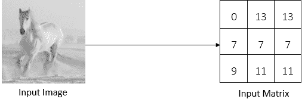
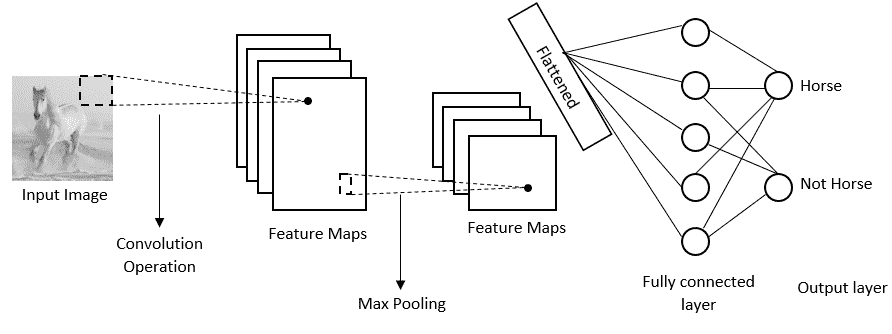
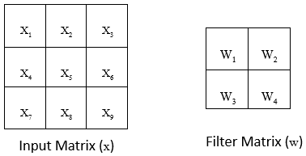
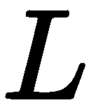
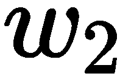
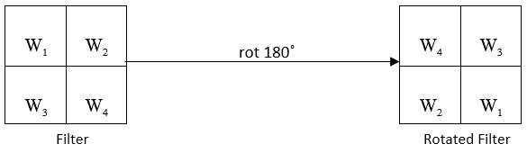
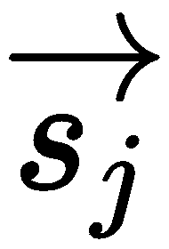

# 第六章：揭秘卷积网络

**卷积神经网络** (**CNNs**) 是最常用的深度学习算法之一。它们广泛应用于与图像相关的任务，如图像识别、物体检测、图像分割等。CNNs 的应用无所不在，从自动驾驶汽车中的视觉处理到我们在 Facebook 照片中自动标记朋友。尽管 CNNs 广泛用于图像数据集，但它们也可以应用于文本数据集。

在本章中，我们将详细了解 CNNs，并掌握 CNNs 及其工作原理。首先，我们将直观地了解 CNNs，然后深入探讨其背后的数学原理。随后，我们将学习如何逐步在 TensorFlow 中实现 CNN。接下来，我们将探索不同类型的 CNN 架构，如 LeNet、AlexNet、VGGNet 和 GoogleNet。在本章末尾，我们将研究 CNNs 的不足之处，并学习如何使用胶囊网络解决这些问题。此外，我们还将学习如何使用 TensorFlow 构建胶囊网络。

在本章中，我们将讨论以下主题：

+   什么是 CNNs？

+   CNNs 的数学原理

+   在 TensorFlow 中实现 CNNs

+   不同的 CNN 架构

+   胶囊网络

+   在 TensorFlow 中构建胶囊网络

# 什么是 CNNs？

CNN，也称为**ConvNet**，是用于计算机视觉任务的最常用的深度学习算法之一。假设我们正在执行一个图像识别任务。考虑以下图像。我们希望我们的 CNN 能够识别其中包含一匹马。


如何做到这一点？当我们将图像输入计算机时，它基本上会将其转换为一个像素值矩阵。像素值的范围从 0 到 255，而此矩阵的尺寸将是 [*图像宽度* x *图像高度* x *通道数*]。灰度图像有一个通道，彩色图像有三个通道 **红色、绿色和蓝色** (**RGB**)。

假设我们有一个宽度为 11、高度为 11 的彩色输入图像，即 11 x 11，那么我们的矩阵维度将是 *[11 x 11 x 3]*。如你所见，*[11 x 11 x 3]* 中，11 x 11 表示图像的宽度和高度，3 表示通道数，因为我们有一张彩色图像。因此，我们将得到一个 3D 矩阵。

但是，对于理解来说，很难将 3D 矩阵可视化，因此让我们以灰度图像作为输入来考虑。由于灰度图像只有一个通道，我们将得到一个 2D 矩阵。

如下图所示，输入的灰度图像将被转换为一个像素值矩阵，其像素值介于 0 到 255 之间，像素值表示该点的像素强度：



输入矩阵中给出的值仅仅是为了帮助我们理解而随意给出的。

现在，我们有一个像素值矩阵的输入矩阵。接下来会发生什么？CNN 由以下三个重要的层组成：

+   卷积层

+   池化层

+   全连接层

通过这三个层的帮助，CNN 可以识别出图像中包含一匹马。现在我们将详细探讨每一个这些层。

# 卷积层

卷积层是 CNN 的第一个核心层，也是 CNN 的构建块之一，用于从图像中提取重要的特征。

我们有一幅马的图像。您认为有哪些特征将帮助我们理解这是一幅马的图像？我们可以说是身体结构、面部、腿部、尾巴等。但是 CNN 如何理解这些特征？这就是我们使用卷积操作的地方，它将从图像中提取出表征马的所有重要特征。因此，卷积操作帮助我们理解图像的内容。

好的，这个卷积操作到底是什么？它是如何执行的？它如何提取重要的特征？让我们详细看一下。

我们知道，每个输入图像都由像素值矩阵表示。除了输入矩阵外，我们还有另一个称为**滤波器矩阵**的矩阵。滤波器矩阵也被称为**核**或简称**滤波器**，如下图所示：


我们取滤波器矩阵，将其沿着输入矩阵向右滑动一个像素，执行逐元素乘法，将结果求和，生成一个单一的数字。这相当令人困惑，不是吗？让我们通过以下图示来更好地理解：


正如您在前面的图示中所看到的，我们取了滤波器矩阵，将其放在输入矩阵的顶部，执行逐元素乘法，将它们的结果相加，并生成单一数字。示例如下：


现在，我们将滤波器沿着输入矩阵向右滑动一个像素，并执行相同的步骤，如下图所示：


示例如下：


再次，我们将滤波器矩阵向右滑动一个像素，并执行相同的操作，如下图所示：


示例如下：


现在，再次将滤波器矩阵沿着输入矩阵向右滑动一个像素，并执行相同的操作，如下图所示：


就是这样：


好的。我们在这里做什么？我们基本上是将滤波器矩阵按一个像素滑动到整个输入矩阵上，执行逐元素乘法并求和它们的结果，从而创建一个称为**特征映射**或**激活映射**的新矩阵。这就是**卷积操作**。

正如我们所学到的，卷积操作用于提取特征，并且新矩阵，即特征映射，代表了通过卷积操作提取的特征。如果我们绘制特征映射，那么我们可以看到通过卷积操作提取的特征。

下图显示了实际图像（输入图像）和卷积图像（特征映射）。我们可以看到我们的滤波器已将实际图像中的边缘检测为特征：


不同的滤波器用于从图像中提取不同特征。例如，如果我们使用一个锐化滤波器，，那么它将使我们的图像变得更锐利，如下图所示：


因此，我们学到了使用滤波器可以通过卷积操作从图像中提取重要特征。所以，我们可以不只使用一个滤波器，而是使用多个滤波器从图像中提取不同特征，并生成多个特征映射。因此，特征映射的深度将等于滤波器的数量。如果我们使用七个滤波器从图像中提取不同特征，那么我们特征映射的深度将为七：


好的，我们已经学到了不同的滤波器从图像中提取不同的特征。但问题是，我们如何设置滤波器矩阵的正确值，以便从图像中提取重要特征？别担心！我们只需随机初始化滤波器矩阵，通过反向传播学习可以从图像中提取重要特征的优化滤波器矩阵的最佳值。但是，我们只需要指定滤波器的大小和要使用的滤波器数量。

# 步幅

我们刚刚学习了卷积操作的工作原理。我们通过滑动滤波器矩阵一个像素来扫描输入矩阵并执行卷积操作。但我们不仅可以仅滑动一个像素扫描输入矩阵，也可以按任意数量的像素滑动。

我们通过滤波器矩阵在输入矩阵上滑动的像素数称为**步幅**。

如果我们将步幅设置为 2，那么我们将以两个像素的步幅滑动输入矩阵与滤波器矩阵。下图显示了步幅为 2 的卷积操作：


但是我们如何选择步幅数字呢？我们刚学到步幅是我们移动滤波器矩阵的像素数。因此，当步幅设置为一个小数字时，我们可以编码比步幅设置为大数字更详细的图像表示。然而，具有高值步幅的步幅计算时间少于具有低值步幅的步幅。

# 填充

在卷积操作中，我们通过滤波器矩阵滑动输入矩阵。但在某些情况下，滤波器并不完全适合输入矩阵。什么意思？例如，假设我们使用步幅为 2 进行卷积操作。存在这样一种情况，即当我们将我们的滤波器矩阵移动两个像素时，它达到边界，滤波器矩阵不适合输入矩阵。也就是说，我们的滤波器矩阵的某部分位于输入矩阵之外，如下图所示：


在这种情况下，我们进行填充。我们可以简单地用零填充输入矩阵，以便滤波器可以适合输入矩阵，如下图所示。在输入矩阵上用零填充被称为**相同填充**或**零填充**：


与其用零填充它们，我们也可以简单地丢弃输入矩阵中滤波器不适合的区域。这称为**有效填充**：


# 池化层

好的。现在，我们完成了卷积操作。作为卷积操作的结果，我们得到了一些特征映射。但是特征映射的维度太大了。为了减少特征映射的维度，我们进行池化操作。这样可以减少特征映射的维度，并保留必要的细节，从而减少计算量。

例如，要从图像中识别出一匹马，我们需要提取并保留马的特征；我们可以简单地丢弃不需要的特征，比如图像的背景等。池化操作也称为**下采样**或**子采样**操作，使得卷积神经网络具有平移不变性。因此，池化层通过保留重要的特征来减少空间维度。

池化操作不会改变特征映射的深度；它只会影响高度和宽度。

池化操作有不同的类型，包括最大池化、平均池化和求和池化。

在最大池化中，我们在输入矩阵上滑动滤波器，并从滤波器窗口中简单地取最大值，如下图所示：


正如其名，平均池化中，我们取滤波器窗口内输入矩阵的平均值，在求和池化中，我们对滤波器窗口内的输入矩阵的所有值求和，如下图所示：


最大池化是最常用的池化操作之一。

# 全连接层

到目前为止，我们已经学习了卷积和池化层的工作原理。CNN 可以拥有多个卷积层和池化层。然而，这些层只会从输入图像中提取特征并生成特征映射；也就是说，它们只是特征提取器。

针对任何图像，卷积层会从图像中提取特征并生成特征映射。现在，我们需要对这些提取出的特征进行分类。因此，我们需要一种算法来对这些提取出的特征进行分类，并告诉我们这些提取出的特征是否是马的特征，或者其他什么东西的特征。为了进行这种分类，我们使用一个前向神经网络。我们将特征映射展平并将其转换为向量，并将其作为输入馈送到前向网络中。前向网络将这个展平的特征映射作为输入，应用激活函数（如 sigmoid），并返回输出，说明图像是否包含马；这称为全连接层，如下图所示：



# CNN 的架构

CNN 的架构如下图所示：


正如你所注意到的，首先我们将输入图像馈送到卷积层，其中我们对图像应用卷积操作以从图像中提取重要特征并创建特征映射。然后，我们将特征映射传递给池化层，其中特征映射的维度将被减少。正如前面的图所示，我们可以有多个卷积和池化层，并且还应注意到池化层并不一定需要在每个卷积层之后；可以有多个卷积层后跟一个池化层。

因此，在卷积和池化层之后，我们将展平产生的特征映射，并将其馈送到全连接层，这基本上是一个前向神经网络，根据特征映射对给定的输入图像进行分类。

# CNN 的数学背后

到目前为止，我们已经直观地理解了 CNN 的工作原理。但是 CNN 到底是如何学习的呢？它如何使用反向传播找到滤波器的最优值？为了回答这个问题，我们将从数学角度探讨 CNN 的工作原理。与《第五章》中的循环神经网络改进不同，CNN 的数学背后非常简单而且非常有趣。

# 前向传播

让我们从前向传播开始。我们已经看到了前向传播的工作原理以及 CNN 如何对给定的输入图像进行分类。让我们从数学角度来描述这个过程。让我们考虑一个输入矩阵*X*和滤波器*W*，其值如下所示：



首先，让我们熟悉符号。每当我们写，这意味着输入矩阵中第行和第列的元素。滤波器和输出矩阵同理，即和分别表示滤波器和输出矩阵中第行和第列的值。在前一图中， = ，即是输入矩阵中第一行第一列的元素。

如下图所示，我们取滤波器，在输入矩阵上滑动，执行卷积操作，并生成输出矩阵（特征图），就像我们在前一节中学到的那样：


因此，输出矩阵（特征图）中的所有值计算如下：


好的，现在我们知道了卷积操作的执行方式以及如何计算输出。我们可以用一个简单的方程表示这个过程吗？假设我们有一个输入图像*X*，宽度为*W*，高度为*H*，滤波器大小为*P* x *Q*，那么卷积操作可以表示如下：


此方程基本表示了如何使用卷积操作计算输出，（即输出矩阵中第行和第列的元素）。

卷积操作完成后，我们将结果，，馈送给前馈网络，，并预测输出，：


# 反向传播

预测输出后，我们计算损失，。我们使用均方误差作为损失函数，即实际输出，，与预测输出，，之间差值的平均值，如下所示：


现在，我们将看看如何使用反向传播来最小化损失 。为了最小化损失，我们需要找到我们的滤波器 *W* 的最优值。我们的滤波器矩阵包括四个值，*w1*、*w2*、*w3* 和 *w4*。为了找到最优的滤波器矩阵，我们需要计算损失函数相对于这四个值的梯度。我们该如何做呢？

首先，让我们回顾输出矩阵的方程式，如下所示：


不要被即将出现的方程式吓到；它们实际上非常简单。

首先，让我们计算关于  的梯度。正如您所见， 出现在所有输出方程中；我们按如下方式计算损失关于  的偏导数：


类似地，我们计算损失关于  权重的偏导数如下所示：


关于  权重的损失梯度计算如下：


关于  权重的损失梯度如下所示：


因此，总结一下，我们关于所有权重的损失梯度的最终方程式如下所示：


结果发现，计算损失关于滤波器矩阵的导数非常简单——它只是另一个卷积操作。如果我们仔细观察前述方程式，我们会注意到它们看起来像输入矩阵与损失关于输出的梯度作为滤波器矩阵的卷积操作的结果，如下图所示：


例如，让我们看看损失关于权重  的梯度如何通过输入矩阵与损失关于输出的梯度作为滤波器矩阵的卷积操作计算，如下图所示：


因此，我们可以写成以下形式：


因此，我们了解到，计算损失对滤波器（即权重）的梯度，其实就是输入矩阵和损失对输出的梯度作为滤波器矩阵之间的卷积操作。

除了计算对滤波器的损失梯度之外，我们还需要计算对某个输入的损失梯度。但是为什么要这样做？因为它用于计算上一层中滤波器的梯度。

我们的输入矩阵包括从 到 的九个值，因此我们需要计算对这九个值的损失梯度。让我们回顾一下输出矩阵是如何计算的：


如您所见， 仅出现在，因此我们可以单独计算对 的损失梯度，其他项为零：


现在，让我们计算对*;* 的梯度；因为 仅出现在 和 中，我们仅计算对 和 的梯度：


以非常类似的方式，我们计算对所有输入的损失梯度如下：


就像我们用卷积操作表示损失对权重的梯度一样，我们能在这里做同样的事情吗？答案是肯定的。实际上，我们可以用卷积操作来表示前述方程，即损失对输入的梯度，其中输入矩阵作为一个滤波器矩阵，损失对输出矩阵的梯度作为一个滤波器矩阵。但诀窍在于，我们不直接使用滤波器矩阵，而是将它们旋转 180 度，并且不进行卷积，而是执行完全卷积。我们这样做是为了能够用卷积操作推导出前述方程。

下图展示了旋转 180 度的核心滤波器的样子：



好的，那么什么是完全卷积？与卷积操作类似，完全卷积中，我们使用一个滤波器并将其滑动到输入矩阵上，但我们滑动滤波器的方式与我们之前看到的卷积操作不同。下图展示了完全卷积操作的工作方式。正如我们所见，阴影矩阵表示滤波器矩阵，未阴影的矩阵表示输入矩阵；我们可以看到滤波器如何逐步滑动到输入矩阵上，如图所示：


所以，我们可以说，损失对输入矩阵的梯度可以通过滤波器矩阵旋转 180 度作为输入矩阵，并且损失对输出的梯度作为滤波器矩阵来计算，使用完全卷积操作来计算：


例如，如下图所示，我们将注意到损失对输入的梯度，，是通过滤波器矩阵旋转 180 度和损失对输出的梯度作为滤波器矩阵之间的完全卷积操作来计算的：


这里展示如下：


因此，我们知道计算损失对输入的梯度就是完全卷积操作。因此，我们可以说 CNN 中的反向传播只是另一种卷积操作。

# 在 TensorFlow 中实现 CNN

现在我们将学习如何使用 TensorFlow 构建 CNN。我们将使用 MNIST 手写数字数据集，了解 CNN 如何识别手写数字，并且我们还将可视化卷积层如何从图像中提取重要特征。

首先，让我们加载所需的库：

```py
import warnings
warnings.filterwarnings('ignore')

import numpy as np
import tensorflow as tf
from tensorflow.examples.tutorials.mnist import input_data
tf.logging.set_verbosity(tf.logging.ERROR)

import matplotlib.pyplot as plt
%matplotlib inline
```

加载 MNIST 数据集：

```py
mnist = input_data.read_data_sets('data/mnist', one_hot=True)
```

# 定义辅助函数

现在我们定义初始化权重和偏置的函数，以及执行卷积和池化操作的函数。

通过截断正态分布绘制来初始化权重。请记住，这些权重实际上是我们在执行卷积操作时使用的滤波器矩阵：

```py
def initialize_weights(shape):
    return tf.Variable(tf.truncated_normal(shape, stddev=0.1))
```

使用常量值（例如`0.1`）初始化偏置：

```py
def initialize_bias(shape):
    return tf.Variable(tf.constant(0.1, shape=shape))
```

我们定义一个名为`convolution`的函数，使用`tf.nn.conv2d()`执行卷积操作；即输入矩阵（`x`）与滤波器（`W`）的逐元素乘法，步长为`1`，相同填充。我们设置`strides = [1,1,1,1]`。步长的第一个和最后一个值设为`1`，表示我们不希望在训练样本和不同通道之间移动。步长的第二个和第三个值也设为`1`，表示我们在高度和宽度方向上将滤波器移动`1`个像素：

```py
def convolution(x, W):
    return tf.nn.conv2d(x, W, strides=[1,1,1,1], padding='SAME')
```

我们定义一个名为`max_pooling`的函数，使用`tf.nn.max_pool()`执行池化操作。我们使用步长为`2`的最大池化，并且使用相同的填充和`ksize`指定我们的池化窗口形状：

```py
def max_pooling(x):
    return tf.nn.max_pool(x, ksize=[1,2,2,1], strides=[1,2,2,1], padding='SAME')
```

定义输入和输出的占位符。

输入图像的占位符定义如下：

```py
X_ = tf.placeholder(tf.float32, [None, 784])
```

重塑后输入图像的占位符定义如下：

```py
X = tf.reshape(X_, [-1, 28, 28, 1])
```

输出标签的占位符定义如下：

```py
y = tf.placeholder(tf.float32, [None, 10])
```

# 定义卷积网络

我们的网络架构包括两个卷积层。每个卷积层后面跟着一个池化层，并且我们使用一个全连接层，其后跟一个输出层；即`conv1->pooling->conv2->pooling2->fully connected layer-> output layer`。

首先，我们定义第一个卷积层和池化层。

权重实际上是卷积层中的滤波器。因此，权重矩阵将初始化为`[ filter_shape[0], filter_shape[1], number_of_input_channel, filter_size ]`。

我们使用`5 x 5`的滤波器。由于我们使用灰度图像，输入通道数将为`1`，并且我们将滤波器大小设置为`32`。因此，第一个卷积层的权重矩阵将是`[5,5,1,32]`：

```py
W1 = initialize_weights([5,5,1,32])
```

偏置的形状只是滤波器大小，即`32`：

```py
b1 = initialize_bias([32])
```

使用 ReLU 激活执行第一个卷积操作，然后进行最大池化：

```py
conv1 = tf.nn.relu(convolution(X, W1) + b1)
pool1 = max_pooling(conv1)
```

接下来，我们定义第二个卷积层和池化层。

由于第二个卷积层从具有 32 通道输出的第一个卷积层接收输入，因此第二个卷积层的输入通道数变为 32，并且我们使用尺寸为`5 x 5`的滤波器，因此第二个卷积层的权重矩阵变为`[5,5,32,64]`：

```py
W2 = initialize_weights([5,5,32,64])
```

偏置的形状只是滤波器大小，即`64`：

```py
b2 = initialize_bias([64])
```

使用 ReLU 激活执行第二次卷积操作，然后进行最大池化：

```py
conv2 = tf.nn.relu(convolution(pool1, W2) + b2)
pool2 = max_pooling(conv2)
```

在两个卷积和池化层之后，我们需要在馈送到全连接层之前展平输出。因此，我们展平第二个池化层的结果并馈送到全连接层。

展平第二个池化层的结果：

```py
flattened = tf.reshape(pool2, [-1, 7*7*64])
```

现在我们为全连接层定义权重和偏置。我们设置权重矩阵的形状为 `[当前层中的神经元数，下一层中的神经元数]`。这是因为在展平之后，输入图像的形状变为 `7x7x64`，我们在隐藏层中使用 `1024` 个神经元。权重的形状变为 `[7x7x64, 1024]`：

```py
W_fc = initialize_weights([7*7*64, 1024])
b_fc = initialize_bias([1024])
```

这里是一个具有 ReLU 激活函数的全连接层：

```py
fc_output = tf.nn.relu(tf.matmul(flattened, W_fc) + b_fc)
```

定义输出层。当前层有 `1024` 个神经元，由于我们需要预测 10 类，所以下一层有 10 个神经元，因此权重矩阵的形状变为 `[1024 x 10]`：

```py
W_out = initialize_weights([1024, 10])
b_out = initialize_bias([10])
```

使用 softmax 激活函数计算输出：

```py
YHat = tf.nn.softmax(tf.matmul(fc_output, W_out) + b_out)
```

# 计算损失

使用交叉熵计算损失。我们知道交叉熵损失如下所示：


这里， 是实际标签， 是预测标签。因此，交叉熵损失实现如下：

```py
cross_entropy = -tf.reduce_sum(y*tf.log(YHat))
```

使用 Adam 优化器最小化损失：

```py
optimizer = tf.train.AdamOptimizer(1e-4).minimize(cross_entropy)
```

计算准确率：

```py
predicted_digit = tf.argmax(y_hat, 1)
actual_digit = tf.argmax(y, 1)

correct_pred = tf.equal(predicted_digit,actual_digit)
accuracy = tf.reduce_mean(tf.cast(correct_pred, tf.float32))
```

# 开始训练

启动 TensorFlow 的 `Session` 并初始化所有变量：

```py
sess = tf.Session()
sess.run(tf.global_variables_initializer())
```

对模型进行 `1000` 个 epochs 的训练。每 `100` 个 epochs 打印结果：

```py
for epoch in range(1000):

    #select some batch of data points according to the batch size (100)
    X_batch, y_batch = mnist.train.next_batch(batch_size=100)

    #train the network
    loss, acc, _ = sess.run([cross_entropy, accuracy, optimizer], feed_dict={X_: X_batch, y: y_batch})

    #print the loss on every 100th epoch
    if epoch%100 == 0:
        print('Epoch: {}, Loss:{} Accuracy: {}'.format(epoch,loss,acc))
```

您会注意到随着 epochs 的增加，损失减少，准确率增加：

```py
Epoch: 0, Loss:631.2734375 Accuracy: 0.129999995232
Epoch: 100, Loss:28.9199733734 Accuracy: 0.930000007153
Epoch: 200, Loss:18.2174377441 Accuracy: 0.920000016689
Epoch: 300, Loss:21.740688324 Accuracy: 0.930000007153
```

# 可视化提取的特征

现在我们已经训练好了我们的 CNN 模型，我们可以看看我们的 CNN 提取了哪些特征来识别图像。正如我们学到的，每个卷积层从图像中提取重要特征。我们将看看我们的第一个卷积层提取了什么特征来识别手写数字。

首先，让我们从训练集中选择一张图片，比如说数字 1：

```py
plt.imshow(mnist.train.images[7].reshape([28, 28]))
```

输入图像显示如下：


将该图像馈送到第一个卷积层 `conv1` 中，并获取特征图：

```py
image = mnist.train.images[7].reshape([-1, 784])
feature_map = sess.run([conv1], feed_dict={X_: image})[0]
```

绘制特征图：

```py
for i in range(32):
    feature = feature_map[:,:,:,i].reshape([28, 28])
    plt.subplot(4,8, i + 1)
    plt.imshow(feature)
    plt.axis('off')
plt.show()

```

如您在下图中看到的，第一个卷积层已经学会从给定图像中提取边缘：


因此，这就是 CNN 如何使用多个卷积层从图像中提取重要特征，并将这些提取的特征馈送到全连接层以对图像进行分类。现在我们已经学习了 CNN 的工作原理，在接下来的部分，我们将学习一些有趣的 CNN 架构。

# CNN 架构

在本节中，我们将探索不同类型的 CNN 架构。当我们说不同类型的 CNN 架构时，我们基本上是指如何在一起堆叠卷积和池化层。此外，我们将了解使用的卷积层、池化层和全连接层的数量，以及滤波器数量和滤波器大小等信息。

# LeNet 架构

LeNet 架构是 CNN 的经典架构之一。如下图所示，该架构非常简单，仅包含七个层。在这七个层中，有三个卷积层、两个池化层、一个全连接层和一个输出层。它使用 5 x 5 的卷积和步幅为 1，并使用平均池化。什么是 5 x 5 卷积？这意味着我们正在使用一个 5 x 5 的滤波器进行卷积操作。

如下图所示，LeNet 由三个卷积层（`C1`、`C3`、`C5`）、两个池化层（`S2`、`S4`）、一个全连接层（`F6`）和一个输出层（`OUTPUT`）组成，每个卷积层后面都跟着一个池化层：


# 理解 AlexNet

AlexNet 是一个经典而强大的深度学习架构。它通过将错误率从 26%降低到 15.3%而赢得了 2012 年 ILSVRC 竞赛。ILSVRC 代表 ImageNet 大规模视觉识别竞赛，这是一个专注于图像分类、定位、物体检测等计算机视觉任务的重大竞赛。ImageNet 是一个包含超过 1500 万标记高分辨率图像的巨大数据集，具有超过 22000 个类别。每年，研究人员竞争使用创新架构来赢得比赛。

AlexNet 是由包括 Alex Krizhevsky、Geoffrey Hinton 和 Ilya Sutskever 在内的先驱科学家设计的。如下图所示，它由五个卷积层和三个全连接层组成。它使用 ReLU 激活函数而不是 tanh 函数，并且每一层之后都应用 ReLU。它使用 dropout 来处理过拟合，在第一个和第二个全连接层之前执行 dropout。它使用图像平移等数据增强技术，并使用两个 GTX 580 GPU 进行 5 到 6 天的批次随机梯度下降训练：


# VGGNet 的架构

VGGNet 是最流行的 CNN 架构之一。它由牛津大学的**视觉几何组**（**VGG**）发明。当它成为 2014 年 ILSVRC 的亚军时，它开始变得非常流行。

它基本上是一个深度卷积网络，广泛用于物体检测任务。该网络的权重和结构由牛津团队公开，因此我们可以直接使用这些权重来执行多个计算机视觉任务。它还广泛用作图像的良好基准特征提取器。

VGG 网络的架构非常简单。它由卷积层和池化层组成。它在整个网络中使用 3 x 3 的卷积和 2 x 2 的池化。它被称为 VGG-*n*，其中*n*对应于层数，不包括池化层和 softmax 层。以下图显示了 VGG-16 网络的架构：


正如您在下图中所看到的，AlexNet 的架构以金字塔形状为特征，因为初始层宽度较大，而后续层次较窄。您会注意到它由多个卷积层和一个池化层组成。由于池化层减少了空间维度，随着网络深入，网络变窄：


VGGNet 的一个缺点是计算开销大，有超过 1.6 亿个参数。

# GoogleNet

**GoogleNet**，也被称为**Inception 网络**，是 2014 年 ILSVRC 竞赛的获胜者。它包括各种版本，每个版本都是前一版本的改进版。我们将逐一探索每个版本。

# Inception v1

Inception v1 是网络的第一个版本。图像中的对象以不同的大小和不同的位置出现。例如，看看第一张图像；正如您所看到的，当鹦鹉近距离观察时，它占据整个图像的一部分，但在第二张图像中，当鹦鹉从远处观察时，它占据了图像的一个较小区域：


因此，我们可以说对象（在给定的图像中，是一只鹦鹉）可以出现在图像的任何区域。它可能很小，也可能很大。它可能占据整个图像的一个区域，也可能只占据一个非常小的部分。我们的网络必须精确识别对象。但是问题在哪里呢？记得我们学习过，我们使用滤波器从图像中提取特征吗？现在，因为我们感兴趣的对象在每个图像中的大小和位置都不同，所以选择合适的滤波器大小是困难的。

当对象大小较大时，我们可以使用较大的滤波器大小，但是当我们需要检测图像角落中的对象时，较大的滤波器大小就不合适了。由于我们使用的是固定的感受野，即固定的滤波器大小，因此在图像中位置变化很大的图像中识别对象是困难的。我们可以使用深度网络，但它们更容易过拟合。

为了克服这个问题，Inception 网络不使用相同大小的单个滤波器，而是在同一输入上使用多个不同大小的滤波器。一个 Inception 块由九个这样的块堆叠而成。下图显示了一个单独的 Inception 块。正如您将看到的，我们对给定图像使用三种不同大小的滤波器进行卷积操作，即 1 x 1、3 x 3 和 5 x 5。一旦所有这些不同的滤波器完成卷积操作，我们将结果连接起来并输入到下一个 Inception 块中：


当我们连接多个滤波器的输出时，连接结果的深度将增加。虽然我们只使用填充来使输入和输出的形状相匹配，但我们仍然会有不同的深度。由于一个 Inception 块的结果是另一个的输入，深度会不断增加。因此，为了避免深度增加，我们只需在 3 x 3 和 5 x 5 卷积之前添加一个 1 x 1 卷积，如下图所示。我们还执行最大池化操作，并且在最大池化操作后添加了一个 1 x 1 卷积：


每个 Inception 块提取一些特征并将其馈送到下一个 Inception 块。假设我们试图识别一张鹦鹉的图片。在前几层中，Inception 块检测基本特征，而后续的 Inception 块则检测高级特征。正如我们所看到的，在卷积网络中，Inception 块仅提取特征，并不执行任何分类。因此，我们将 Inception 块提取的特征馈送给分类器，该分类器将预测图像是否包含鹦鹉。

由于 Inception 网络很深，具有九个 Inception 块，因此容易受到梯度消失问题的影响。为了避免这种情况，我们在 Inception 块之间引入分类器。由于每个 Inception 块学习图像的有意义特征，我们尝试在中间层进行分类并计算损失。如下图所示，我们有九个 Inception 块。我们将第三个 Inception 块的结果  和第六个 Inception 块的结果  馈送到一个中间分类器，最终的 Inception 块后也有另一个分类器。这个分类器基本上由平均池化、1 x 1 卷积和具有 softmax 激活函数的线性层组成：


中间分类器实际上被称为辅助分类器。因此，Inception 网络的最终损失是辅助分类器损失和最终分类器（真实损失）损失的加权和，如下所示：


# Inception v2 和 v3

Inception v2 和 v3 是由 Christian Szegedy 在 *Going Deeper with Convolutions* 论文中介绍的，如 *Further reading* 部分所述。作者建议使用分解卷积，即将具有较大滤波器大小的卷积层分解为具有较小滤波器大小的一组卷积层。因此，在 Inception 块中，具有 5 x 5 滤波器的卷积层可以分解为两个具有 3 x 3 滤波器的卷积层，如下图所示。使用分解卷积可以提高性能和速度：


作者还建议将大小为 *n* x *n* 的卷积层分解为大小为 *1* x *n* 和 *n* x *1* 的卷积层堆叠。例如，在前面的图中，我们有 *3* x *3* 的卷积，现在将其分解为 *1* x *3* 的卷积，然后是 *3* x *1* 的卷积，如下图所示：


正如您在前面的图表中所注意到的，我们基本上是以更深入的方式扩展我们的网络，这将导致我们丢失信息。因此，我们不是让网络更深，而是让我们的网络更宽，如下所示：


在 inception net v3 中，我们使用因子化的 7 x 7 卷积和 RMSProp 优化器。此外，我们在辅助分类器中应用批归一化。

# 胶囊网络

**胶囊网络** (**CapsNets**) 是由 Geoffrey Hinton 提出的，旨在克服卷积网络的局限性。

Hinton 表示如下：

"卷积神经网络中使用的池化操作是一个大错误，而它如此有效地工作实际上是一场灾难。"

但是池化操作有什么问题呢？记得当我们使用池化操作来减少维度和去除不必要的信息时吗？池化操作使我们的 CNN 表示对输入中的小平移具有不变性。

CNN 的这种平移不变性特性并不总是有益的，而且可能容易导致错误分类。例如，假设我们需要识别一幅图像是否有一个面部；CNN 将查找图像是否有眼睛、鼻子、嘴巴和耳朵。它不关心它们的位置。如果找到所有这些特征，它就将其分类为面部。

考虑两幅图像，如下图所示。第一幅图像是实际的面部图像，第二幅图像中，眼睛位于左侧，一个在另一个上方，耳朵和嘴巴位于右侧。但是 CNN 仍然会将这两幅图像都分类为面部，因为它们都具备面部的所有特征，即耳朵、眼睛、嘴巴和鼻子。CNN 认为这两幅图像都包含一个面部。它并不学习每个特征之间的空间关系；例如眼睛应该位于顶部，并且应该跟随一个鼻子等等。它只检查构成面部的特征是否存在。

当我们有一个深度网络时，这个问题会变得更糟，因为在深度网络中，特征将变得抽象，并且由于多次池化操作，它的尺寸也会缩小：


为了克服这一点，Hinton 引入了一种称为胶囊网络的新网络，它由胶囊而不是神经元组成。像卷积神经网络一样，胶囊网络检查图像中特定特征的存在，但除了检测特征外，它还会检查它们之间的空间关系。也就是说，它学习特征的层次结构。以识别面部为例，胶囊网络将学习到眼睛应该在顶部，鼻子应该在中部，接着是嘴巴等。如果图像不符合这种关系，那么胶囊网络将不会将其分类为面部：


胶囊网络由几个连接在一起的胶囊组成。但是，请稍等。什么是胶囊？

一个胶囊是一组学习在图像中检测特定特征的神经元；比如眼睛。与返回标量的神经元不同，胶囊返回矢量。矢量的长度告诉我们特定位置是否存在特定特征，矢量的元素表示特征的属性，如位置、角度等。

假设我们有一个向量，，如下所示：


向量的长度可以计算如下：


我们已经了解到矢量的长度表示特征存在的概率。但是前面的长度并不表示概率，因为它超过了 1。因此，我们使用一个称为压缩函数的函数将该值转换为概率。压缩函数具有一个优点。除了计算概率，它还保留了矢量的方向：


就像卷积神经网络一样，较早层中的胶囊检测基本特征，包括眼睛、鼻子等，而较高层中的胶囊检测更高级别的特征，比如整体面部。因此，较高层中的胶囊从较低层中的胶囊获取输入。为了让较高层中的胶囊检测到面部，它们不仅检查鼻子和眼睛等特征是否存在，还会检查它们的空间关系。

现在我们对胶囊的基本理解已经有了，我们将更详细地探讨它，并看看胶囊网络的工作原理。

# 理解胶囊网络

假设我们有两层， 和 。 将是较低层，它有  个胶囊，而  将是较高层，它有  个胶囊。来自较低层的胶囊将其输出发送到较高层的胶囊。 将是来自较低层胶囊的激活，。 将是来自较高层胶囊的激活，。

以下图表示一个胶囊，，正如你所看到的，它接收来自前一个胶囊  的输出作为输入，并计算其输出 ：


我们将继续学习如何计算 。

# 计算预测向量

在前面的图中，、 和  表示来自前一个胶囊的输出向量。首先，我们将这些向量乘以权重矩阵并计算预测向量：


好的，那么我们在这里究竟在做什么，预测向量又是什么呢？让我们考虑一个简单的例子。假设胶囊  正试图预测图像是否有一张脸。我们已经了解到，早期层中的胶囊检测基本特征，并将结果发送到更高层的胶囊。因此，早期层中的胶囊 、 和  检测到基本低级特征，如眼睛、鼻子和嘴，并将结果发送到高层次层的胶囊，即胶囊 ，它检测到脸部。

因此，胶囊  将前面的胶囊 、 和  作为输入，并乘以权重矩阵 。

权重矩阵 表示低级特征和高级特征之间的空间及其他关系。例如，权重 告诉我们眼睛应该在顶部。 告诉我们鼻子应该在中间。 告诉我们嘴应该在底部。注意，权重矩阵不仅捕捉位置（即空间关系），还捕捉其他关系。

因此，通过将输入乘以权重，我们可以预测脸部的位置：

+    暗示了基于眼睛预测的脸部位置。

+    暗示了基于鼻子预测的脸部位置。

+    暗示了基于嘴预测的脸部位置

当所有预测的脸部位置相同时，即彼此一致时，我们可以说图像包含人脸。我们使用反向传播来学习这些权重。

# 耦合系数

接下来，我们将预测向量 乘以耦合系数。耦合系数存在于任意两个胶囊之间。我们知道，来自较低层的胶囊将它们的输出发送到较高层的胶囊。耦合系数帮助较低层的胶囊理解它必须将其输出发送到哪个较高层的胶囊。

例如，让我们考虑同样的例子，我们试图预测一幅图像是否包含人脸。 表示了 和 之间的一致性。

 表示了眼睛和脸之间的一致性。由于我们知道眼睛在脸上，因此 的值将会增加。我们知道预测向量 暗示了基于眼睛预测的脸部位置。将 乘以 意味着我们增加了眼睛的重要性，因为 的值很高。

 代表鼻子和脸之间的一致性。由于我们知道鼻子在脸上， 的值将会增加。我们知道预测向量  暗示了基于鼻子的脸部预测位置。将  乘以  意味着我们正在增加鼻子的重要性，因为  的值很高。

让我们考虑另一个低级特征，比如说，，它用于检测手指。现在， 表示手指和脸之间的一致性，这个值会很低。将  乘以  意味着我们正在降低手指的重要性，因为  的值很低。

但是这些耦合系数是如何学习的呢？与权重不同，耦合系数是在前向传播中学习的，并且它们是使用一种称为动态路由的算法来学习的，我们将在后面的部分讨论。

将  乘以  后，我们将它们加总，如下：


因此，我们可以将我们的方程写成：


# 压缩函数

我们开始时说，胶囊  尝试在图像中检测脸部。因此，我们需要将  转换为概率，以获取图像中存在脸的概率。

除了计算概率之外，我们还需要保留向量的方向，因此我们使用了一种称为压缩函数的激活函数。其表达式如下：


现在，（也称为活动向量）给出了在给定图像中存在脸的概率。

# 动态路由算法

现在，我们将看到动态路由算法如何计算耦合系数。让我们引入一个称为  的新变量，它只是一个临时变量，并且与耦合系数  相同。首先，我们将  初始化为 0。这意味着低层中的胶囊  与高层中的胶囊  之间的耦合系数被设为 0。

让  为  的向量表示。给定预测向量 ，在 *n* 次迭代中，我们执行以下操作：

1.  对于图层中的所有胶囊 ，计算以下内容：


1.  对于图层中的所有胶囊 ，计算以下内容：


1.  对于  中的所有胶囊 ，以及  中的所有胶囊，按如下方式计算 ：


前述方程式需仔细注意。这是我们更新耦合系数的地方。点积  意味着低层胶囊的预测向量  与高层胶囊的输出向量  的点积。如果点积较高， 将增加相应的耦合系数 ，使得  更强。

# 胶囊网络的架构

假设我们的网络试图预测手写数字。我们知道早期层中的胶囊检测基本特征，而后期层中的胶囊检测数字。因此，让我们称早期层中的胶囊为**初级胶囊**，后期层中的胶囊为**数字胶囊**。

胶囊网络的架构如下所示：


在上图中，我们可以观察到以下内容：

1.  首先，我们取输入图像并将其馈送到标准卷积层，我们称其为卷积输入。

1.  然后，我们将卷积输入馈送到主胶囊层，并获得主胶囊。

1.  接下来，我们使用动态路由算法计算具有主胶囊作为输入的数字胶囊。

1.  数字胶囊由 10 行组成，每行代表预测数字的概率。即，第 1 行表示输入数字为 0 的概率，第 2 行表示数字 1 的概率，依此类推。

1.  由于输入图像是前述图像中的数字 3，表示数字 3 的第 4 行在数字胶囊中将具有较高的概率。

# 损失函数

现在我们将探讨胶囊网络的损失函数。损失函数是两个称为边际损失和重构损失的损失函数的加权和。

# 边际损失

我们学到了胶囊返回一个向量，向量的长度表示特征存在的概率。假设我们的网络试图识别图像中的手写数字。为了在给定图像中检测多个数字，我们为每个数字胶囊使用边际损失，，如下所示：


这里是案例：

+   ，如果一个类别的数字  存在

+    是边缘， 设置为 0.9， 设置为 0.1

+    防止初始学习使所有数字胶囊的向量长度缩小，通常设置为 0.5

总边际损失是所有类别的损失的总和，，如下所示：


# 重构损失

为了确保网络已经学习了胶囊中的重要特征，我们使用重构损失。这意味着我们使用一个称为解码器网络的三层网络，它试图从数字胶囊中重建原始图像：


重构损失被定义为重构图像与原始图像之间的平方差，如下所示：


最终的损失如下所示：


这里，alpha 是一个正则化项，因为我们不希望重构损失比边际损失更重要。因此，alpha 乘以重构损失来降低其重要性，通常设置为 0.0005。

# 在 TensorFlow 中构建胶囊网络

现在我们将学习如何在 TensorFlow 中实现胶囊网络。我们将使用我们喜爱的 MNIST 数据集来学习胶囊网络如何识别手写图像。

导入所需的库：

```py
import warnings
warnings.filterwarnings('ignore')

import numpy as np
import tensorflow as tf

from tensorflow.examples.tutorials.mnist import input_data
tf.logging.set_verbosity(tf.logging.ERROR)
```

载入 MNIST 数据集：

```py
mnist = input_data.read_data_sets("data/mnist",one_hot=True)
```

# 定义`squash`函数

我们学到了，`squash`函数将向量的长度转换为概率，并且定义如下：


可以将`squash`函数定义如下：

```py
def squash(sj):

    sj_norm = tf.reduce_sum(tf.square(sj), -2, keep_dims=True)
    scalar_factor = sj_norm / (1 + sj_norm) / tf.sqrt(sj_norm + epsilon)

    vj = scalar_factor * sj 

    return vj
```

# 定义动态路由算法

现在我们将查看动态路由算法如何实现。我们使用我们在动态路由算法中学到的相同符号的变量名，以便我们可以轻松地跟随步骤。我们将逐步查看函数中的每一行。您还可以在 GitHub 上查看完整代码，网址为[`bit.ly/2HQqDEZ`](http://bit.ly/2HQqDEZ)。

首先，定义名为`dynamic_routing`的函数，该函数接受前一胶囊`ui`、耦合系数`bij`和路由迭代次数`num_routing`作为输入，如下所示：

```py
def dynamic_routing(ui, bij, num_routing=10):
```

通过从随机正态分布中绘制`wij`权重，并使用常数值初始化`biases`：

```py
    wij = tf.get_variable('Weight', shape=(1, 1152, 160, 8, 1), dtype=tf.float32,

                        initializer=tf.random_normal_initializer(0.01))

    biases = tf.get_variable('bias', shape=(1, 1, 10, 16, 1))
```

定义主要胶囊`ui`（`tf.tile`复制张量*n*次）：

```py
    ui = tf.tile(ui, [1, 1, 160, 1, 1])
```

计算预测向量，，如下所示：

```py
    u_hat = tf.reduce_sum(wij * ui, axis=3, keep_dims=True)
```

重塑预测向量：

```py
    u_hat = tf.reshape(u_hat, shape=[-1, 1152, 10, 16, 1])
```

停止预测向量中的梯度计算：

```py
    u_hat_stopped = tf.stop_gradient(u_hat, name='stop_gradient')
```

执行多次路由迭代的动态路由，如下所示：

```py
    for r in range(num_routing):

        with tf.variable_scope('iter_' + str(r)):

            #step 1
            cij = tf.nn.softmax(bij, dim=2)

            #step 2
            if r == num_routing - 1:

                sj = tf.multiply(cij, u_hat)

                sj = tf.reduce_sum(sj, axis=1, keep_dims=True) + biases

                vj = squash(sj)

            elif r < num_routing - 1: 

                sj = tf.multiply(cij, u_hat_stopped)

                sj = tf.reduce_sum(sj, axis=1, keep_dims=True) + biases

                vj = squash(sj)

                vj_tiled = tf.tile(vj, [1, 1152, 1, 1, 1])

                coupling_coeff = tf.reduce_sum(u_hat_stopped * vj_tiled, axis=3, keep_dims=True)

                #step 3
                bij += coupling_coeff
   return vj
```

# 计算主要和数字胶囊

现在我们将计算提取基本特征的主要胶囊和识别数字的数字胶囊。

启动 TensorFlow `Graph`：

```py
graph = tf.Graph()
with graph.as_default() as g:
```

定义输入和输出的占位符：

```py
    x = tf.placeholder(tf.float32, [batch_size, 784])
    y = tf.placeholder(tf.float32, [batch_size,10])
    x_image = tf.reshape(x, [-1,28,28,1])
```

执行卷积操作并获得卷积输入：

```py
    with tf.name_scope('convolutional_input'):
        input_data = tf.contrib.layers.conv2d(inputs=x_image, num_outputs=256, kernel_size=9, padding='valid')
```

计算提取基本特征（如边缘）的主要胶囊。首先，使用卷积操作计算胶囊如下：

```py
 capsules = []

 for i in range(8):

 with tf.name_scope('capsules_' + str(i)):

 #convolution operation 
 output = tf.contrib.layers.conv2d(inputs=input_data, num_outputs=32,kernel_size=9, stride=2, padding='valid')

 #reshape the output
 output = tf.reshape(output, [batch_size, -1, 1, 1])

 #store the output which is capsule in the capsules list
 capsules.append(output)
```

连接所有胶囊并形成主要胶囊，对主要胶囊进行压缩，并获得概率，如下所示：

```py
 primary_capsule = tf.concat(capsules, axis=2)
```

对主要胶囊应用`squash`函数，并获得概率：

```py
 primary_capsule = squash(primary_capsule)
```

使用动态路由算法计算数字胶囊如下：

```py
    with tf.name_scope('dynamic_routing'):

        #reshape the primary capsule
        outputs = tf.reshape(primary_capsule, shape=(batch_size, -1, 1, primary_capsule.shape[-2].value, 1))

        #initialize bij with 0s
        bij = tf.constant(np.zeros([1, primary_capsule.shape[1].value, 10, 1, 1], dtype=np.float32))

        #compute the digit capsules using dynamic routing algorithm which takes 
        #the reshaped primary capsules and bij as inputs and returns the activity vector 
        digit_capsules = dynamic_routing(outputs, bij)

 digit_capsules = tf.squeeze(digit_capsules, axis=1)
```

# 屏蔽数字胶囊

为什么我们需要屏蔽数字胶囊？我们学到了，为了确保网络学到了重要特征，我们使用一个称为解码器网络的三层网络，试图从数字胶囊中重构原始图像。如果解码器能够成功从数字胶囊中重构图像，则意味着网络已经学到了图像的重要特征；否则，网络没有学到图像的正确特征。

数字胶囊包含所有数字的活动向量。但解码器只想重构给定的输入数字（输入图像）。因此，我们掩盖了除正确数字以外所有数字的活动向量。然后我们使用这个掩盖的数字胶囊来重构给定的输入图像：

```py
with graph.as_default() as g:
    with tf.variable_scope('Masking'):

        #select the activity vector of given input image using the actual label y and mask out others
        masked_v = tf.multiply(tf.squeeze(digit_capsules), tf.reshape(y, (-1, 10, 1)))
```

# 定义解码器

定义解码器网络以重构图像。它由三个完全连接的网络组成，如下所示：

```py
with tf.name_scope('Decoder'):

    #masked digit capsule
    v_j = tf.reshape(masked_v, shape=(batch_size, -1))

    #first fully connected layer 
    fc1 = tf.contrib.layers.fully_connected(v_j, num_outputs=512)

    #second fully connected layer
    fc2 = tf.contrib.layers.fully_connected(fc1, num_outputs=1024)

    #reconstructed image
    reconstructed_image = tf.contrib.layers.fully_connected(fc2, num_outputs=784, activation_fn=tf.sigmoid)
```

# 计算模型的准确性

现在我们计算模型的准确性：

```py
with graph.as_default() as g:
    with tf.variable_scope('accuracy'):
```

计算数字胶囊中每个活动向量的长度：

```py
        v_length = tf.sqrt(tf.reduce_sum(tf.square(digit_capsules), axis=2, keep_dims=True) + epsilon)
```

对长度应用`softmax`并获得概率：

```py
        softmax_v = tf.nn.softmax(v_length, dim=1)
```

选择具有最高概率的索引；这将给我们预测的数字：

```py
        argmax_idx = tf.to_int32(tf.argmax(softmax_v, axis=1)) 
        predicted_digit = tf.reshape(argmax_idx, shape=(batch_size, ))
```

计算`accuracy`：

```py
        actual_digit = tf.to_int32(tf.argmax(y, axis=1))

        correct_pred = tf.equal(predicted_digit,actual_digit)
        accuracy = tf.reduce_mean(tf.cast(correct_pred, tf.float32))
```

# 计算损失

我们知道，我们计算两种类型的损失—边界损失和重构损失。

# 边界损失

我们知道边界损失定义如下：


计算左侧的最大值和右侧的最大值：

```py
max_left = tf.square(tf.maximum(0.,0.9 - v_length))
max_right = tf.square(tf.maximum(0., v_length - 0.1))
```

将  设置为 ：

```py
T_k = y

lambda_ = 0.5
L_k = T_k * max_left + lambda_ * (1 - T_k) * max_right
```

总边界损失如下计算：

```py
margin_loss = tf.reduce_mean(tf.reduce_sum(L_k, axis=1))
```

# 重构损失

通过以下代码重塑并获取原始图像：

```py
original_image = tf.reshape(x, shape=(batch_size, -1))
```

计算重建图像与原始图像之间的平方差的平均值：

```py
squared = tf.square(reconstructed_image - original_image)

```

计算重构损失：

```py
reconstruction_loss = tf.reduce_mean(squared) 
```

# 总损失

定义总损失，即边界损失和重建损失的加权和：

```py
alpha = 0.0005
total_loss = margin_loss + alpha * reconstruction_loss
```

使用 Adam 优化器优化损失：

```py
optimizer = tf.train.AdamOptimizer(0.0001)
train_op = optimizer.minimize(total_loss)
```

# 训练胶囊网络

设置 epoch 数和步数：

```py
num_epochs = 100
num_steps = int(len(mnist.train.images)/batch_size)
```

现在开始 TensorFlow `Session`并进行训练：

```py
with tf.Session(graph=graph) as sess:

    init_op = tf.global_variables_initializer()
    sess.run(init_op)

    for epoch in range(num_epochs):
        for iteration in range(num_steps):
            batch_data, batch_labels = mnist.train.next_batch(batch_size)
            feed_dict = {x : batch_data, y : batch_labels}

            _, loss, acc = sess.run([train_op, total_loss, accuracy], feed_dict=feed_dict)

            if iteration%10 == 0:
                print('Epoch: {}, iteration:{}, Loss:{} Accuracy: {}'.format(epoch,iteration,loss,acc))
```

您可以看到损失如何在各个迭代中减少：

```py
Epoch: 0, iteration:0, Loss:0.55281829834 Accuracy: 0.0399999991059
Epoch: 0, iteration:10, Loss:0.541650533676 Accuracy: 0.20000000298
Epoch: 0, iteration:20, Loss:0.233602654934 Accuracy: 0.40000007153
```

因此，我们逐步学习了胶囊网络的工作原理，以及如何在 TensorFlow 中构建胶囊网络。

# 摘要

我们从理解 CNNs 开始这一章节。我们了解了 CNN 的不同层次，例如卷积和池化；从图像中提取重要特征，并将其馈送到完全连接的层；提取的特征将被分类。我们还使用 TensorFlow 可视化了从卷积层提取的特征，通过分类手写数字。

后来，我们学习了包括 LeNet、AlexNet、VGGNet 和 GoogleNet 在内的几种 CNN 架构。在章节结束时，我们学习了胶囊网络，这种网络克服了卷积网络的缺点。我们了解到胶囊网络使用动态路由算法来对图像进行分类。

在下一章中，我们将学习用于学习文本表示的各种算法。

# 问题

让我们尝试回答以下问题，以评估我们对 CNN 的知识：

1.  CNN 的不同层次是什么？

1.  定义步长。

1.  为什么需要填充？

1.  定义池化。有哪些不同类型的池化操作？

1.  解释 VGGNet 的架构。

1.  什么是 inception 网络中的因式卷积？

1.  胶囊网络与 CNN 有何不同？

1.  定义 squash 函数。

# 进一步阅读

欲了解更多信息，请参考以下内容：

+   *Very Deep Convolutional Networks for Large-Scale Image Recognition* 由 Karen Simonyan 和 Andrew Zisserman 撰写，可在 [`arxiv.org/pdf/1409.1556.pdf`](https://arxiv.org/pdf/1409.1556.pdf) 查阅。

+   inception 网络的论文，*Going Deeper with Convolutions* 由 Christian Szegedy 等人撰写，可在 [`www.cv-foundation.org/openaccess/content_cvpr_2015/papers/Szegedy_Going_Deeper_With_2015_CVPR_paper.pdf`](https://www.cv-foundation.org/openaccess/content_cvpr_2015/papers/Szegedy_Going_Deeper_With_2015_CVPR_paper.pdf) 查阅。

+   *Dynamic Routing Between Capsules* 由 Sara Sabour、Nicholas Frosst 和 Geoffrey E. Hinton 撰写，可在 [`arxiv.org/pdf/1710.09829.pdf`](https://arxiv.org/pdf/1710.09829.pdf) 查阅。
