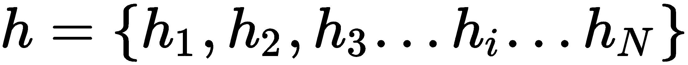
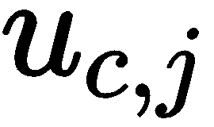
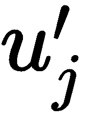
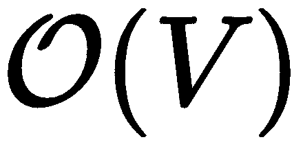
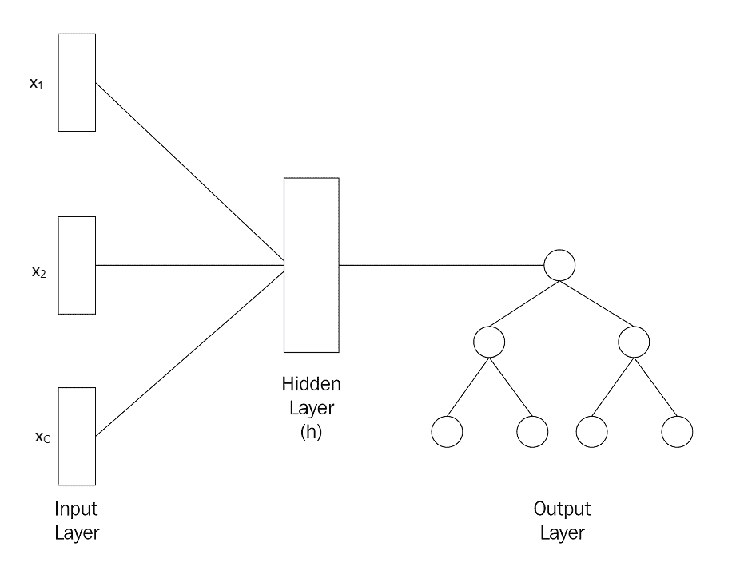
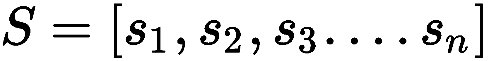

# 学习文本表示

神经网络只接受数字输入。因此，当我们有文本数据时，我们将其转换为数值或向量表示并将其馈送给网络。有多种方法可以将输入文本转换为数值形式。一些流行的方法包括**词频-逆文档频率**（**tf-idf**）、**词袋模型（BOW）**等。然而，这些方法不能捕捉单词的语义。这意味着这些方法不会理解单词的含义。

在本章中，我们将学习一个称为**word2vec**的算法，它将文本输入转换为有意义的向量。它们学习给定输入文本中每个单词的语义向量表示。我们将从理解 word2vec 模型开始，并了解两种不同类型的 word2vec 模型，即**连续词袋模型**（**CBOW**）和 skip-gram 模型。接下来，我们将学习如何使用 gensim 库构建 word2vec 模型以及如何在 tensorboard 中可视化高维词嵌入。

接下来，我们将学习**doc2vec**模型，它用于学习文档的表示。我们将了解 doc2vec 中的两种不同方法，称为**段落向量 - 分布式内存模型**（**PV-DM**）和**段落向量 - 分布式词袋模型**（**PV-DBOW**）。我们还将看到如何使用 doc2vec 进行文档分类。在本章的最后，我们将学习关于 skip-thoughts 算法和 quick thoughts 算法，这两者都用于学习句子表示。

在本章中，我们将了解以下主题：

+   word2vec 模型

+   使用 gensim 构建 word2vec 模型

+   在 TensorBoard 中可视化词嵌入

+   Doc2vec 模型

+   使用 doc2vec 找到相似文档

+   Skip-thoughts

+   Quick-thoughts

# 理解 word2vec 模型

word2vec 是生成词嵌入最流行和广泛使用的模型之一。那么什么是词嵌入？词嵌入是词在向量空间中的向量表示。word2vec 模型生成的嵌入捕捉了词的句法和语义含义。拥有一个有意义的词向量表示有助于神经网络更好地理解单词。

例如，让我们考虑以下文本：*Archie used to live in New York, he then moved to Santa Clara. He loves apples and strawberries.*

Word2vec 模型为前文中的每个单词生成向量表示。如果我们在嵌入空间中投影和可视化这些向量，我们可以看到所有相似的单词都被放在一起。如下图所示，单词*apples*和*strawberries*被放在一起，*New York*和*Santa Clara*也被放在一起。它们被放在一起是因为 word2vec 模型学习到了*apples*和*strawberries*是相似的实体，即水果，以及*New York*和*Santa Clara*是相似的实体，即城市，因此它们的向量（嵌入）相似，因此它们之间的距离较小：


因此，通过 word2vec 模型，我们可以学习单词的有意义的向量表示，这有助于神经网络理解单词的含义。拥有一个良好的单词表示在各种任务中都非常有用。由于我们的网络能够理解单词的上下文和语法含义，这将分支到各种用例，如文本摘要、情感分析、文本生成等等。

好的。但是 word2vec 模型是如何学习单词嵌入的呢？有两种类型的 word2vec 模型用于学习单词的嵌入：

1.  CBOW 模型

1.  Skip-gram 模型

我们将详细介绍并学习这些模型如何学习单词的向量表示。

# 理解 CBOW 模型

假设我们有一个神经网络，包括一个输入层、一个隐藏层和一个输出层。网络的目标是预测给定其周围单词的一个单词。我们试图预测的单词称为**目标单词**，周围的单词称为**上下文单词**。

我们使用大小为  的窗口来选择上下文单词，以预测目标单词。如果窗口大小为 2，则使用目标单词前两个单词和后两个单词作为上下文单词。

让我们考虑句子*The Sun rises in the east*，以*rise*作为目标单词。如果我们将窗口大小设为 2，则我们取目标单词*rise*之前的两个单词*the*和*sun*，以及之后的两个单词*in*和*the*作为上下文单词，如下图所示：


因此，网络的输入是上下文单词，输出是目标单词。我们如何将这些输入馈送到网络中？神经网络只接受数值输入，因此我们不能直接将原始上下文单词作为网络的输入。因此，我们使用一种称为一热编码的技术将给定句子中的所有单词转换为数值形式，如下图所示：


CBOW 模型的结构如下图所示。您可以看到，我们将上下文单词*the, sun, in*和*the,*作为输入送入网络，它预测出*the, sun, in*和*the,*的目标单词*rises*和*an*：


在初始迭代中，网络无法正确预测目标单词。但经过一系列迭代，它学会了使用梯度下降预测正确的目标单词。通过梯度下降，我们更新网络的权重，并找到能够预测正确目标单词的最优权重。

正如前面的图所示，我们有一个输入层，一个隐藏层和一个输出层，因此我们将有两组权重：

+   输入层到隐藏层的权重，

+   隐藏层到输出层的权重，

在训练过程中，网络将尝试找到这两组权重的最优值，以便能够预测正确的目标单词。

结果表明，输入到隐藏层的最优权重形成了单词的向量表示。它们基本上构成了单词的语义含义。因此，在训练后，我们只需移除输出层，并取输入层和隐藏层之间的权重，并将其分配给相应的单词。

训练后，如果我们查看矩阵，它表示每个单词的嵌入。因此，单词*sun*的嵌入是[0.0, 0.3, 0.3, 0.6, 0.1]：


因此，CBOW 模型学会了使用给定的上下文单词预测目标单词。它通过梯度下降学习预测正确的目标单词。在训练过程中，它通过梯度下降更新网络的权重，并找到能够预测正确目标单词的最优权重。输入层和隐藏层之间的最优权重形成了单词的向量表示。因此，在训练后，我们只需取输入层和隐藏层之间的权重，并将其分配为相应单词的向量。

现在我们对 CBOW 模型有了直观的理解，我们将详细学习数学上如何计算单词嵌入的过程。

我们学到了输入层和隐藏层之间的权重基本上形成了单词的向量表示。但 CBOW 模型如何准确预测目标单词呢？它如何使用反向传播学习最优权重？让我们在下一节中探讨这个问题。

# CBOW 模型使用单个上下文单词

我们了解到，在 CBOW 模型中，我们试图根据上下文词预测目标词，因此它以一定数量的上下文词  作为输入，并返回一个目标词作为输出。在只有一个上下文词的 CBOW 模型中，我们只有一个上下文词，即 。因此，网络只接受一个上下文词作为输入，并返回一个目标词作为输出。

在继续之前，首先让我们熟悉一下符号。我们语料库中的所有唯一词称为**词汇表**。考虑我们在*理解 CBOW 模型*部分看到的例子，句子中有五个唯一词——*the*、*sun*、*rises*、*in* 和 *east*。这五个词是我们的词汇表。

让  表示词汇表的大小（即词的数量）， 表示隐藏层中神经元的数量。我们学到我们有一个输入层、一个隐藏层和一个输出层：

+   输入层由  表示。当我们说  时，它表示词汇表中的第  个输入词。

+   隐藏层由  表示。当我们说  时，表示隐藏层中的第  个神经元。

+   输出层由  表示。当我们说  时，它表示词汇表中的第  个输出词。

输入到隐藏层权重的维度  是 （即*我们词汇表的大小乘以隐藏层神经元的数量*），隐藏到输出层权重的维度  是 （即*隐藏层神经元的数量乘以词汇表的大小*）。矩阵元素的表示如下：

+    表示输入层节点  到隐藏层节点  之间矩阵中的一个元素。

+    表示隐藏层节点  到输出层节点  之间矩阵中的一个元素。

下图将帮助我们更清楚地理解这些符号：


# 前向传播

为了预测给定上下文单词的目标单词，我们需要执行前向传播。

首先，我们将输入与输入到隐藏层权重相乘：


我们知道每个输入单词都是独热编码的，因此当我们将与相乘时，我们基本上得到了行的到的向量表示。因此，我们可以直接写成如下形式：


基本上意味着输入单词的向量表示。让我们用表示输入单词的向量表示。因此，前述方程可以写成如下形式：


现在我们处于隐藏层，我们有另一组权重，即隐藏到输出层的权重，。我们知道词汇表中有个单词，我们需要计算词汇表中每个单词作为目标单词的概率。

让表示我们词汇表中单词成为目标单词的分数。分数通过将隐藏层值与隐藏到输出层权重相乘来计算。由于我们正在计算单词的分数，我们将隐藏层与矩阵的列相乘：


权重矩阵的列基本上表示单词的向量表示。我们用来表示该单词的向量表示。因此，前述方程可以写成如下形式：


将方程*(1)*代入方程*(2)*，我们可以写成如下形式：


你能推断出前述方程式试图表达什么吗？我们基本上在计算输入上下文词表示  与我们词汇表中词  表示之间的点积。

计算任意两个向量之间的点积有助于我们理解它们有多相似。因此，计算  和  的点积告诉我们词汇表中的  词与输入上下文词有多相似。因此，当词汇表中  词的分数  高时，意味着该词  与给定的输入词相似且是目标词。同样地，当词汇表中  词的分数  低时，意味着该词  不与给定的输入词相似且不是目标词。

因此， 基本上给出了单词  成为目标词的分数。但是我们不使用原始分数 ，而是将它们转换为概率。我们知道 softmax 函数将值压缩在 0 到 1 之间，因此我们可以使用 softmax 函数将  转换为概率。

我们可以将输出写成如下形式：


在这里， 告诉我们给定输入上下文词时，单词  是目标词的概率。我们计算我们词汇表中所有单词的概率，并选择具有高概率的单词作为目标词。

好的，我们的目标函数是什么？也就是说，我们如何计算损失？

我们的目标是找到正确的目标词。让  表示正确目标词的概率。因此，我们需要最大化这个概率：


不是最大化原始概率，而是最大化对数概率：


但是，为什么我们要最大化对数概率而不是原始概率？因为机器在表示分数的浮点数时存在限制，当我们乘以许多概率时，会导致一个无限小的值。因此，为了避免这种情况，我们使用对数概率，这将确保数值稳定性。

现在我们有一个最大化目标，我们需要将其转换为最小化目标，以便应用我们喜爱的梯度下降算法来最小化目标函数。我们如何将我们的最大化目标转换为最小化目标？我们可以通过简单地添加负号来做到这一点。因此，我们的目标函数变为以下形式：


损失函数可以表示如下：


将方程 *(3)* 替换到方程 *(4)* 中，我们得到以下结果：


根据对数商规则，*log(a/b) = log(a) - log(b)*，我们可以将上一个方程重写如下：


我们知道 *log* 和 *exp* 互相抵消，因此我们可以在第一项中取消 *log* 和 *exp*，因此我们最终的损失函数变为以下形式：


# 反向传播

我们使用梯度下降算法来最小化损失函数。因此，我们进行网络反向传播，计算损失函数对权重的梯度，并更新权重。我们有两组权重，从输入到隐藏层的权重 ，以及从隐藏到输出层的权重 。我们计算损失相对于这些权重的梯度，并根据权重更新规则更新它们。


为了更好地理解反向传播，让我们回顾一下正向传播中涉及的步骤：


首先，我们计算损失对隐藏到输出层的权重  的梯度。我们无法直接从损失函数  中直接计算损失对  的梯度，因此我们应用链式法则如下：


请参考正向传播的方程以了解如何计算导数。

第一项的导数如下所示：


这里，是误差项，即实际单词与预测单词之间的差异。

现在，我们将计算第二项的导数。

由于我们知道：

****

因此，损失函数关于的**梯度**如下所示：


现在，我们计算关于隐藏层输入到输出的权重的梯度。我们不能直接从计算的导数，因此我们应用链式法则如下：


为了计算上述方程中第一项的导数，我们再次应用链式法则，因为我们不能直接从计算关于的导数：


从方程*(5)*，我们可以写成：


由于我们知道：


与其对求和，我们可以写成：


表示加权后所有词汇表中的输出向量之和。

现在让我们计算第二项的导数。

由于我们知道，：


因此，损失函数关于和的**梯度**如下所示：


因此，我们的权重更新方程如下：


我们使用上述方程更新网络的权重，并在训练期间获得最佳权重。隐藏层输入到输出的最优权重，成为我们词汇表中单词的向量表示。

`Single_context_CBOW`的 Python 代码如下：

```py
 def Single_context_CBOW(x, label, W1, W2, loss):

    #forward propagation
    h = np.dot(W1.T, x)
    u = np.dot(W2.T, h)
    y_pred = softmax(u)

    #error
    e = -label + y_pred

    #backward propagation
    dW2 = np.outer(h, e)
    dW1 = np.outer(x, np.dot(W2.T, e))

    #update weights
    W1 = W1 - lr * dW1
    W2 = W2 - lr * dW2

    #loss function
    loss += -float(u[label == 1]) + np.log(np.sum(np.exp(u)))

    return W1, W2, loss
```

# 含有多个上下文词的 CBOW

现在我们了解了 CBOW 模型如何处理单个单词作为上下文时，我们将看看在多个单词作为上下文单词时它是如何工作的。具有多个输入单词作为上下文的 CBOW 架构显示在以下图中：


多个单词作为上下文与单个单词作为上下文之间没有太大差别。不同之处在于，当有多个上下文单词作为输入时，我们取所有输入上下文单词的平均值。也就是说，作为第一步，我们向前传播网络并通过乘以输入  和权重  来计算 ，就像我们在 *单个上下文单词的 CBOW* 部分看到的一样：


但是，由于我们有多个上下文单词，我们将有多个输入（即 ），其中  是上下文单词的数量，我们简单地取它们的平均值，并与权重矩阵相乘，如下所示：


类似于我们在 *单个上下文单词的 CBOW* 部分学到的， 表示输入上下文单词  的向量表示。 表示输入单词  的向量表示，依此类推。

我们将输入上下文单词  的表示称为 ，输入上下文单词  的表示称为 ，以此类推。因此，我们可以将前述方程重写为：


这里， 表示上下文单词的数量。

计算  的值与我们在前一节中看到的相同：


这里， 表示词汇中的  的向量表示。

将方程 *(6)* 替换到方程 *(7)* 中，我们得到如下内容：


上述方程给出了词汇中的  与给定输入上下文单词的平均表示之间的相似度。

损失函数与我们在单词上下文中看到的相同，如下所示：


现在，在反向传播中有一个小小的区别。我们知道，在反向传播中，我们计算梯度并根据权重更新规则更新我们的权重。回想一下，在前面的章节中，这是我们更新权重的方式：


由于这里我们有多个上下文词作为输入，在计算时，我们取上下文词的平均值：


计算与我们在上一节中看到的方式相同：


简而言之，在多词上下文中，我们只需取多个上下文输入词的平均值，并像在 CBOW 的单词上下文中那样构建模型。

# 理解跳字模型

现在，让我们看看另一种有趣的 word2vec 模型类型，称为跳字模型。跳字模型只是 CBOW 模型的反向。也就是说，在跳字模型中，我们试图预测给定目标词的上下文词。正如下图所示，我们可以注意到我们有目标词为*rises*，我们需要预测的上下文词为*the, sun, in*和*the*：


与 CBOW 模型类似，我们使用窗口大小来确定需要预测多少上下文单词。跳字模型的架构如下图所示。

正如我们所看到的，它以单个目标词作为输入，并尝试预测多个上下文词：


在跳字模型中，我们试图基于目标词预测上下文词。因此，它以一个目标词作为输入，并返回上下文词作为输出，如上图所示。因此，在训练跳字模型以预测上下文词之后，我们输入到隐藏层之间的权重成为词的向量表示，就像我们在 CBOW 模型中看到的那样。

现在我们对跳字模型有了基本的理解，让我们深入细节，学习它们是如何工作的。

# 跳字模型中的前向传播

首先，我们将了解跳字模型中的前向传播如何工作。让我们使用我们在 CBOW 模型中使用的相同符号。跳字模型的架构如下图所示。正如你所看到的，我们只传入一个目标词作为输入，并返回上下文词作为输出：


类似于我们在 CBOW 中看到的，在*前向传播*部分，首先我们将输入  与输入到隐藏层的权重  相乘：


我们可以直接将上述方程重写为：


在这里， 暗示着输入单词  的向量表示。

接下来，我们计算 ，这意味着我们的词汇中单词  与输入目标单词之间的相似性分数。类似于 CBOW 模型中看到的那样， 可以表示为：


我们可以直接将上述方程重写为：


在这里， 暗示着词汇中的  的向量表示。

但是，与 CBOW 模型不同，我们不仅预测一个目标单词，而是预测  个上下文单词。因此，我们可以将上述方程重写为：


因此， 暗示着词汇中的  单词得分将作为上下文单词 。

+    暗示着单词  的得分将作为第一个上下文单词

+    暗示着单词  的得分将作为第二个上下文单词

+    暗示着单词  的得分将作为第三个上下文单词

由于我们希望将得分转换为概率，我们应用 softmax 函数并计算 ：


在这里， 暗示着词汇中的  单词成为上下文单词  的概率。

现在，让我们看看如何计算损失函数。让  表示正确上下文单词的概率。因此，我们需要最大化这个概率：


不是最大化原始概率，而是最大化对数概率：


类似于我们在 CBOW 模型中看到的，通过添加负号，我们将其转换为最小化目标函数：


将等式 *(8)* 代入前述等式，我们可以写成以下形式：


由于我们有  上下文词，我们将概率的乘积和作为：


因此，根据对数规则，我们可以重写上述方程，我们的最终损失函数变为：


看看 CBOW 模型和 skip-gram 模型的损失函数。您会注意到 CBOW 损失函数和 skip-gram 损失函数之间唯一的区别是添加了上下文词 。

# 反向传播

我们使用梯度下降算法最小化损失函数。因此，我们反向传播网络，计算损失函数相对于权重的梯度，并根据权重更新规则更新权重。

首先，我们计算损失函数对隐藏到输出层权重  的梯度。我们无法直接从  计算损失对  的导数，因此我们如下应用链式法则。这基本上与我们在 CBOW 模型中看到的相同，只是在所有上下文词上求和：


首先，让我们计算第一项：


我们知道  是误差项，即实际单词与预测单词之间的差异。为了简化符号，我们可以将所有上下文词的总和表示为：


因此，我们可以说：


现在，让我们计算第二项。由于我们知道 ，我们可以写成：

****

因此，损失函数 **梯度  关于 ** 如下所示：


现在，我们计算损失函数对输入到隐藏层权重  的梯度。这与我们在 CBOW 模型中看到的完全相同：


因此，损失函数 **梯度  关于 ** 如下给出：


计算梯度后，我们更新我们的权重*W*和*W'*为：


因此，在训练网络时，我们使用前述方程更新网络的权重，并获得最优权重。输入到隐藏层之间的最优权重，，成为我们词汇表中单词的向量表示。

# 各种训练策略

现在，我们将看一些不同的训练策略，这些策略可以优化和提高我们的 word2vec 模型的效率。

# 分层 softmax

在 CBOW 和 skip-gram 模型中，我们使用 softmax 函数计算单词出现的概率。但使用 softmax 函数计算概率是计算上昂贵的。比如，在构建 CBOW 模型时，我们计算目标词在我们词汇表中作为目标词的概率为：


如果您看前面的方程，我们基本上驱动指数与词汇表中所有单词的指数。我们的复杂度将是，其中是词汇表的大小。当我们用包含数百万单词的词汇表训练 word2vec 模型时，这显然会变得计算上昂贵。因此，为了解决这个问题，我们不使用 softmax 函数，而是使用分层 softmax 函数。

分层 softmax 函数使用霍夫曼二叉搜索树，将复杂度显著降低到。如下图所示，在分层 softmax 中，我们用二叉搜索树替换输出层：



树中的每个叶子节点代表词汇表中的一个单词，所有中间节点表示它们子节点的相对概率。

如何计算给定上下文单词的目标单词的概率？我们简单地遍历树，根据需要向左或向右转向。如下图所示，给定一些上下文单词，单词*flew*成为目标单词的概率计算为沿路径的概率乘积：


目标词的概率如下所示：


但是我们如何计算这些概率呢？每个节点  都与一个嵌入相关联（比如，）。要计算一个节点的概率，我们将节点的嵌入  与隐藏层的值  相乘，并应用 sigmoid 函数。例如，给定上下文词 ，节点  右侧的概率计算如下：


一旦我们计算了右侧概率的概率，我们可以通过简单地从 1 中减去右侧概率来轻松计算左侧概率：


如果我们把所有叶子节点的概率加起来，那么它等于 1，这意味着我们的树已经被归一化了，为了找到一个单词的概率，我们只需要评估  节点。

# 负采样

我们假设正在构建一个 CBOW 模型，我们有一个句子*Birds are flying in the sky.* 让上下文词为*birds*, *are*, *in*, *the*，目标词为*flying*。

每次预测不正确的目标词时，我们都需要更新网络的权重。因此，除了单词 *flying* 之外，如果预测出现不同的单词作为目标词，我们就更新网络。

但这只是一个小词汇集。考虑一种情况，词汇表中有数百万个词。在这种情况下，我们需要进行大量的权重更新，直到网络预测出正确的目标词。这是耗时的，而且也不是一个高效的方法。因此，我们不是这样做，我们将正确的目标词标记为正类，并从词汇表中抽样几个词并标记为负类。

我们在这里实际上正在做的是将我们的多项式类问题转换为二元分类问题（即，不再试图预测目标词，而是模型分类给定的词是否是目标词）。

选择负样本作为单词的概率如下：


# 对频繁出现的词进行子采样

在我们的语料库中，会有一些非常频繁出现的词，比如*the*, *is*等等，还有一些很少出现的词。为了在这两者之间保持平衡，我们使用一种子采样技术。因此，我们以概率  删除那些频繁出现超过某个阈值的词，可以表示为：


这里，是阈值，是词的频率。

# 使用 gensim 构建 word2vec 模型

现在我们已经理解了 word2vec 模型的工作原理，让我们看看如何使用`gensim`库构建 word2vec 模型。Gensim 是广泛用于构建向量空间模型的流行科学软件包之一。它可以通过`pip`安装。因此，我们可以在终端中输入以下命令来安装`gensim`库：

```py
pip install -U gensim
```

现在我们已经安装了 gensim，我们将看看如何使用它构建 word2vec 模型。您可以从 GitHub 下载本节使用的数据集以及包含逐步说明的完整代码：[`bit.ly/2Xjndj4`](http://bit.ly/2Xjndj4)。

首先，我们将导入必要的库：

```py
import warnings
warnings.filterwarnings(action='ignore')

#data processing
import pandas as pd
import re
from nltk.corpus import stopwords
stopWords = stopwords.words('english')

#modelling
from gensim.models import Word2Vec
from gensim.models import Phrases
from gensim.models.phrases import Phraser
```

# 加载数据集

加载数据集：

```py
data = pd.read_csv('data/text.csv',header=None)
```

让我们看看我们的数据中有什么：

```py
data.head()
```

上述代码生成以下输出：


# 预处理和准备数据集

定义一个用于预处理数据集的函数：

```py
def pre_process(text):

    # convert to lowercase
    text = str(text).lower()

    # remove all special characters and keep only alpha numeric characters and spaces
    text = re.sub(r'[^A-Za-z0-9\s.]',r'',text)

    #remove new lines
    text = re.sub(r'\n',r' ',text)

    # remove stop words
    text = " ".join([word for word in text.split() if word not in stopWords])

    return text
```

我们可以通过运行以下代码来查看预处理文本的样子：

```py
pre_process(data[0][50])
```

我们的输出如下：

```py
'agree fancy. everything needed. breakfast pool hot tub nice shuttle airport later checkout time. noise issue tough sleep through. awhile forget noisy door nearby noisy guests. complained management later email credit compd us amount requested would return.'
```

预处理整个数据集：

```py
data[0] = data[0].map(lambda x: pre_process(x))
```

Gensim 库要求输入以列表的列表形式提供：

`*text = [ [word1, word2, word3], [word1, word2, word3] ]*`

我们知道我们的数据中的每一行包含一组句子。因此，我们通过 `'.'` 将它们分割并将它们转换为列表：

```py
data[0][1].split('.')[:5]
```

上述代码生成以下输出：

```py
['stayed crown plaza april april ',
 ' staff friendly attentive',
 ' elevators tiny ',
 ' food restaurant delicious priced little high side',
 ' course washington dc']
```

因此，如图所示，现在我们的数据是以列表的形式呈现的。但是我们需要将它们转换为列表的列表。所以，我们现在再次使用空格`' '`来分割它们。也就是说，我们首先通过 `'.'` 分割数据，然后再通过 `' '` 分割它们，这样我们就可以得到我们的数据以列表的列表形式：

```py
corpus = []
for line in data[0][1].split('.'):
    words = [x for x in line.split()]
    corpus.append(words)
```

您可以看到我们的输入以列表的形式呈现：

```py
corpus[:2]

[['stayed', 'crown', 'plaza', 'april', 'april'], ['staff', 'friendly', 'attentive']]
```

将我们数据集中的整个文本转换为列表的列表：

```py
data = data[0].map(lambda x: x.split('.'))

corpus = []
for i in (range(len(data))):
    for line in data[i]:
        words = [x for x in line.split()]
        corpus.append(words)

print corpus[:2]
```

正如所示，我们成功地将数据集中的整个文本转换为列表的列表：

```py
[['room', 'kind', 'clean', 'strong', 'smell', 'dogs'],

 ['generally', 'average', 'ok', 'overnight', 'stay', 'youre', 'fussy']]
```

现在，我们的问题是，我们的语料库仅包含单个词和它不会在我们给出大量输入时给我们结果，例如，*san francisco*。

所以我们使用 gensim 的`Phrases`函数，它收集所有一起出现的单词，并在它们之间添加下划线。所以现在*san francisco*变成了*san_francisco*。

我们将`min_count`参数设置为`25`，这意味着我们会忽略出现次数少于`min_count`的所有单词和双词组：

```py
phrases = Phrases(sentences=corpus,min_count=25,threshold=50)
bigram = Phraser(phrases)

for index,sentence in enumerate(corpus):
    corpus[index] = bigram[sentence]
```

正如您所见，现在我们的语料库中的双词组已经添加了下划线：

```py
corpus[111]

[u'connected', u'rivercenter', u'mall', u'downtown', u'san_antonio']
```

我们检查语料库中的另一个值，以查看如何为双词组添加下划线：

```py
corpus[9]

[u'course', u'washington_dc']
```

# 构建模型

现在让我们构建我们的模型。让我们定义一些模型需要的重要超参数：

+   `size` 参数表示向量的大小，即表示一个词的维度。根据我们的数据大小可以选择大小。如果我们的数据很小，那么可以将大小设为一个较小的值，但是如果数据集显著大，则可以将大小设为 `300`。在我们的案例中，我们将大小设为 `100`。

+   `window_size` 参数表示应该考虑目标词与其相邻词之间的距离。超出目标词的窗口大小的词将不被考虑为学习的一部分。通常情况下，较小的窗口大小是首选。

+   `min_count` 参数表示词的最小出现频率。如果特定词的出现次数少于 `min_count`，则可以简单地忽略该词。

+   `workers` 参数指定训练模型所需的工作线程数。

+   设置 `sg=1` 意味着我们使用 skip-gram 模型进行训练，但如果设置为 `sg=0`，则意味着我们使用 CBOW 模型进行训练。

使用以下代码定义所有超参数：

```py
size = 100
window_size = 2
epochs = 100
min_count = 2
workers = 4
sg = 1
```

让我们使用 gensim 的 `Word2Vec` 函数来训练模型：

```py
model = Word2Vec(corpus, sg=1,window=window_size,size=size, min_count=min_count,workers=workers,iter=epochs)
```

一旦成功训练了模型，我们就保存它们。保存和加载模型非常简单；我们可以简单地使用 `save` 和 `load` 函数，分别进行保存和加载模型：

```py
model.save('model/word2vec.model')
```

我们还可以使用以下代码 `load` 已保存的 `Word2Vec` 模型：

```py
model = Word2Vec.load('model/word2vec.model')
```

# 评估嵌入：

现在让我们评估我们的模型学习了什么，以及我们的模型多么好地理解了文本的语义。`gensim` 库提供了 `most_similar` 函数，该函数给出与给定词相关的前几个相似词。

正如您在下面的代码中所看到的，给定 `san_diego` 作为输入，我们得到了所有其他相关的城市名，这些城市名与输入最相似：

```py
model.most_similar('san_diego')

[(u'san_antonio', 0.8147615790367126),
 (u'indianapolis', 0.7657858729362488),
 (u'austin', 0.7620342969894409),
 (u'memphis', 0.7541092038154602),
 (u'phoenix', 0.7481759786605835),
 (u'seattle', 0.7471771240234375),
 (u'dallas', 0.7407466769218445),
 (u'san_francisco', 0.7373261451721191),
 (u'la', 0.7354192137718201),
 (u'boston', 0.7213659286499023)]
```

我们还可以对我们的向量应用算术操作，以检查我们的向量有多准确：

```py
model.most_similar(positive=['woman', 'king'], negative=['man'], topn=1)

[(u'queen', 0.7255150675773621)]
```

我们还可以找到与给定词集不匹配的词；例如，在名为 `text` 的以下列表中，除了词 `holiday` 外，所有其他词都是城市名。由于 Word2Vec 理解了这种差异，它返回词 `holiday` 作为与列表中其他词不匹配的词。

```py
text = ['los_angeles','indianapolis', 'holiday', 'san_antonio','new_york']

model.doesnt_match(text)

'holiday'
```

# 在 TensorBoard 中可视化词嵌入

在前面的部分中，我们学习了如何使用 gensim 构建 Word2Vec 模型来生成词嵌入。现在，我们将看到如何使用 TensorBoard 来可视化这些嵌入。可视化词嵌入帮助我们理解投影空间，并帮助我们轻松验证嵌入。TensorBoard 提供了一个内置的可视化工具称为 **embedding projector**，用于交互式地可视化和分析高维数据，例如我们的词嵌入。我们将学习如何逐步使用 TensorBoard 的投影仪来可视化词嵌入。

导入所需的库：

```py
import warnings
warnings.filterwarnings(action='ignore')

import tensorflow as tf 
from tensorflow.contrib.tensorboard.plugins import projector tf.logging.set_verbosity(tf.logging.ERROR)

import numpy as np
import gensim 
import os
```

加载保存的模型：

```py
file_name = "model/word2vec.model"
model = gensim.models.keyedvectors.KeyedVectors.load(file_name)
```

加载模型后，我们将单词数量保存到`max_size`变量中：

```py
max_size = len(model.wv.vocab)-1
```

我们知道单词向量的维度将是 。因此，我们用形状为我们的`max_size`（词汇量大小）和模型第一层大小（隐藏层中的神经元数）的矩阵`w2v`来初始化：

```py
w2v = np.zeros((max_size,model.layer1_size))
```

现在，我们创建一个名为`metadata.tsv`的新文件，在其中保存我们模型中的所有单词，并将每个单词的嵌入存储在`w2v`矩阵中：

```py
if not os.path.exists('projections'):
    os.makedirs('projections')

with open("projections/metadata.tsv", 'w+') as file_metadata:

    for i, word in enumerate(model.wv.index2word[:max_size]):

        #store the embeddings of the word
        w2v[i] = model.wv[word]

        #write the word to a file 
        file_metadata.write(word + '\n')
```

接下来，我们初始化 TensorFlow 会话：

```py
sess = tf.InteractiveSession()
```

初始化名为`embedding`的 TensorFlow 变量，用于保存单词嵌入：

```py
with tf.device("/cpu:0"):
    embedding = tf.Variable(w2v, trainable=False, name='embedding')
```

初始化所有变量：

```py
tf.global_variables_initializer().run()
```

创建一个到`saver`类的对象，该类实际上用于将变量保存和从检查点恢复：

```py
saver = tf.train.Saver()
```

使用`FileWriter`，我们可以将摘要和事件保存到我们的事件文件中：

```py
writer = tf.summary.FileWriter('projections', sess.graph)
```

现在，我们初始化投影仪并添加`embeddings`：

```py
config = projector.ProjectorConfig()
embed = config.embeddings.add()
```

接下来，我们将我们的`tensor_name`指定为`embedding`，并将`metadata_path`设置为`metadata.tsv`文件，其中包含我们的单词：

```py
embed.tensor_name = 'embedding'
embed.metadata_path = 'metadata.tsv'
```

最后，保存模型：

```py
projector.visualize_embeddings(writer, config)

saver.save(sess, 'projections/model.ckpt', global_step=max_size)
```

现在，打开终端并输入以下命令以打开`tensorboard`：

```py
tensorboard --logdir=projections --port=8000
```

打开 TensorBoard 后，转到 PROJECTOR 选项卡。我们可以看到输出，如下图所示。您会注意到，当我们键入单词`delighted`时，我们可以看到所有相关的单词，例如`pleasant`、`surprise`等等，都与之相邻：


# Doc2vec

到目前为止，我们已经看到如何为单词生成嵌入。但是如何为文档生成嵌入呢？一种简单的方法是计算文档中每个单词的单词向量并取平均值。Mikilow 和 Le 提出了一种新的方法，用于生成文档的嵌入，而不仅仅是取单词嵌入的平均值。他们引入了两种新方法，称为 PV-DM 和 PV-DBOW。这两种方法都引入了一个称为**段落 id**的新向量。让我们看看这两种方法的工作原理。

# 段落向量 - 分布式内存模型

PV-DM 类似于 CBOW 模型，我们尝试根据上下文单词预测目标单词。在 PV-DM 中，除了单词向量外，我们还引入了一个称为段落向量的额外向量。顾名思义，段落向量学习整个段落的向量表示，并捕捉段落的主题。

如下图所示，每个段落都映射到一个唯一的向量，每个单词也映射到一个唯一的向量。因此，为了预测目标单词，我们通过连接或平均单词向量和段落向量来组合它们：


但说了这么多，段落向量在预测目标单词方面有什么用处呢？拥有段落向量真的有什么用呢？我们知道，我们试图基于上下文单词预测目标单词。上下文单词长度固定，并且在一个段落的滑动窗口中抽样。

除了上下文单词，我们还利用段落向量来预测目标单词。因为段落向量包含段落主题的信息，它们包含上下文单词不包含的含义。也就是说，上下文单词只包含关于特定单词本身的信息，而段落向量包含整个段落的信息。因此，我们可以将段落向量视为与上下文单词一起用于预测目标单词的新单词。

来自同一段落抽样的所有上下文单词共享相同的段落向量，并且跨段落不共享。假设我们有三个段落，*p1*，*p2*和*p3*。如果上下文是从段落*p1*中抽样的，则使用*p1*向量来预测目标单词。如果上下文是从段落*p2*中抽样的，则使用*p2*向量。因此，段落向量在段落之间不共享。然而，单词向量在所有段落中共享。也就是说，*sun*的向量在所有段落中是相同的。我们称我们的模型为分布式记忆模型的段落向量，因为我们的段落向量充当了一种存储信息的记忆，这些信息在当前上下文单词中是缺失的。

所以，段落向量和单词向量都是使用随机梯度下降学习的。在每次迭代中，我们从一个随机段落中抽样上下文单词，尝试预测目标单词，计算误差并更新参数。训练结束后，段落向量捕捉了段落（文档）的嵌入。

# 段落向量 - 分布式袋模型

PV-DBOW 类似于 skip-gram 模型，我们试图基于目标单词预测上下文单词：


不同于以前的方法，我们这里不试图预测下一个单词。相反，我们使用段落向量来分类文档中的单词。但是它们是如何工作的呢？我们训练模型以理解单词是否属于某个段落。我们抽样一些单词集，并将其馈送到分类器中，该分类器告诉我们单词是否属于特定段落，通过这种方式我们学习段落向量。

# 使用 doc2vec 查找相似文档

现在，我们将看到如何使用 doc2vec 进行文档分类。在本节中，我们将使用 20 个`news_dataset`。它包含 20 个不同新闻类别的 20,000 篇文档。我们只使用四个类别：`Electronics`、`Politics`、`Science`和`Sports`。因此，每个类别下有 1,000 篇文档。我们将这些文档重新命名，以`category_`为前缀。例如，所有科学文档都重命名为`Science_1`、`Science_2`等。重命名后，我们将所有文档组合并放置在一个单独的文件夹中。完整的数据以及完整的代码可以在 GitHub 的 Jupyter Notebook 上找到，网址为[`bit.ly/2KgBWYv`](http://bit.ly/2KgBWYv)。

现在，我们训练我们的 doc2vec 模型来对这些文档进行分类并找出它们之间的相似性。

首先，我们导入所有必要的库：

```py
import warnings
warnings.filterwarnings('ignore')

import os
import gensim
from gensim.models.doc2vec import TaggedDocument

from nltk import RegexpTokenizer
from nltk.corpus import stopwords

tokenizer = RegexpTokenizer(r'\w+')
stopWords = set(stopwords.words('english'))
```

现在，我们加载所有文档并将文档名称保存在`docLabels`列表中，将文档内容保存在名为`data`的列表中：

```py
docLabels = []
docLabels = [f for f in os.listdir('data/news_dataset') if f.endswith('.txt')]

data = []
for doc in docLabels:
      data.append(open('data/news_dataset/'+doc).read()) 
```

您可以在`docLabels`列表中看到我们所有文档的名称：

```py
docLabels[:5]

['Electronics_827.txt',
 'Electronics_848.txt',
 'Science829.txt',
 'Politics_38.txt',
 'Politics_688.txt']
```

定义一个名为`DocIterator`的类，作为遍历所有文档的迭代器：

```py
class DocIterator(object):
    def __init__(self, doc_list, labels_list):
        self.labels_list = labels_list
        self.doc_list = doc_list

    def __iter__(self):
        for idx, doc in enumerate(self.doc_list):
            yield TaggedDocument(words=doc.split(), tags=                        [self.labels_list[idx]])
```

创建一个名为`it`的`DocIterator`类对象：

```py
it = DocIterator(data, docLabels)
```

现在，让我们构建模型。首先，定义模型的一些重要超参数：

+   `size`参数表示我们的嵌入大小。

+   `alpha`参数表示我们的学习率。

+   `min_alpha`参数意味着我们的学习率`alpha`在训练期间会衰减到`min_alpha`。

+   设置`dm=1`意味着我们使用分布式内存（PV-DM）模型，如果设置`dm=0`，则表示我们使用分布式词袋（PV-DBOW）模型进行训练。

+   `min_count`参数表示单词的最小出现频率。如果特定单词的出现少于`min_count`，我们可以简单地忽略该单词。

这些超参数被定义为：

```py
size = 100
alpha = 0.025
min_alpha = 0.025
dm = 1
min_count = 1
```

现在让我们使用`gensim.models.Doc2ec()`类定义模型：

```py
model = gensim.models.Doc2Vec(size=size, min_count=min_count, alpha=alpha, min_alpha=min_alpha, dm=dm)
model.build_vocab(it)
```

训练模型：

```py
for epoch in range(100):
    model.train(it,total_examples=120)
    model.alpha -= 0.002
    model.min_alpha = model.alpha
```

训练后，我们可以保存模型，使用`save`函数：

```py
model.save('model/doc2vec.model')
```

我们可以使用`load`函数加载保存的模型：

```py
d2v_model = gensim.models.doc2vec.Doc2Vec.load('model/doc2vec.model')
```

现在，让我们评估模型的性能。以下代码显示，当我们将`Sports_1.txt`文档作为输入时，它将输出所有相关文档及其相应的分数：

```py
d2v_model.docvecs.most_similar('Sports_1.txt')

[('Sports_957.txt', 0.719024658203125),
 ('Sports_694.txt', 0.6904895305633545),
 ('Sports_836.txt', 0.6636477708816528),
 ('Sports_869.txt', 0.657712459564209),
 ('Sports_123.txt', 0.6526877880096436),
 ('Sports_4.txt', 0.6499642729759216),
 ('Sports_749.txt', 0.6472041606903076),
 ('Sports_369.txt', 0.6408025026321411),
 ('Sports_167.txt', 0.6392412781715393),
 ('Sports_104.txt', 0.6284008026123047)]
```

# 理解 skip-thoughts 算法

Skip-thoughts 是一种流行的无监督学习算法，用于学习句子嵌入。我们可以将 skip-thoughts 视为 skip-gram 模型的类比。我们了解到在 skip-gram 模型中，我们试图预测给定目标词的上下文词，而在 skip-thoughts 中，我们试图预测给定目标句子的上下文句子。换句话说，我们可以说 skip-gram 用于学习单词级别的向量，而 skip-thoughts 用于学习句子级别的向量。

跳跃思想的算法非常简单。它由一个编码器-解码器架构组成。编码器的角色是将句子映射到一个向量，而解码器的角色是生成给定输入句子的前后句子。如下图所示，跳跃思想向量包括一个编码器和两个解码器，称为前一个解码器和后一个解码器：


下面讨论编码器和解码器的工作：

+   **编码器**：编码器按顺序处理句子中的单词并生成嵌入。假设我们有一系列句子。 。 表示句子中的第 个单词，而 表示其单词嵌入。因此，编码器的隐藏状态被解释为句子的表示。

+   **解码器**：有两个解码器，称为前一个解码器和后一个解码器。顾名思义，前一个解码器用于生成前一个句子，后一个解码器用于生成下一个句子。假设我们有一个句子 及其嵌入为 。这两个解码器都将嵌入 作为输入，前一个解码器尝试生成前一个句子， ，而后一个解码器尝试生成下一个句子， 。

因此，我们通过最小化前后解码器的重构误差来训练我们的模型。因为当解码器正确重构/生成前后句子时，这意味着我们有一个有意义的句子嵌入 。我们将重构误差发送到编码器，以便编码器可以优化嵌入并向解码器发送更好的表示。一旦我们训练好我们的模型，我们就可以使用编码器为新句子生成嵌入。

# 句子嵌入的快速思考

快速思考是另一种有趣的学习句子嵌入的算法。在跳跃思想中，我们看到如何使用编码器-解码器架构来学习句子嵌入。在快速思考中，我们尝试学习给定句子是否与候选句子相关联。因此，我们不使用解码器，而是使用分类器来学习给定输入句子是否与候选句子相关。

让  为输入句子， 为包含与给定输入句子  相关的有效上下文和无效上下文句子集合。让 **** 是来自于  的任意候选句子。

我们使用两个编码函数， 和 。这两个函数的作用分别是学习给定句子  和候选句子  的嵌入，即学习它们的向量表示。

一旦这两个函数生成嵌入，我们使用分类器 ，它返回每个候选句子与给定输入句子相关的概率。

如下图所示，第二候选句子的概率  较高，因为它与给定的输入句子  有关：


因此， 是正确句子的概率，即  与给定输入句子  相关的计算公式为：


在这里， 是一个分类器。

我们分类器的目标是识别与给定输入句子  相关的有效上下文句子。因此，我们的成本函数是最大化找到给定输入句子正确上下文句子的概率 。如果它正确分类句子，则表示我们的编码器学习了更好的句子表示。

# 摘要

我们从理解词嵌入开始本章，看了两种不同类型的 Word2Vec 模型，称为 CBOW，我们试图预测上下文词给定目标词，以及 Skip-gram，我们试图预测目标词给定上下文词。

然后，我们学习了 Word2Vec 中的各种训练策略。我们讨论了分层 softmax，其中我们用哈夫曼二叉树替换网络的输出层，并将复杂度降低到 。我们还学习了负采样和子采样频繁词汇的方法。然后我们了解了如何使用 gensim 库构建 Word2Vec 模型，以及如何将高维词嵌入投影到 TensorBoard 中进行可视化。接下来，我们研究了 doc2vec 模型如何使用 PV-DM 和 PV-DBOW 两种类型的 doc2vec 模型。在此之后，我们学习了 skip-thoughts 模型的工作原理，通过预测给定句子的前后句子来学习句子的嵌入，并在章节末尾探索了 quick-thoughts 模型。

在下一章中，我们将学习生成模型以及生成模型如何用于生成图像。

# 问题

让我们通过回答以下问题来评估我们新获得的知识：

1.  skip-gram 和 CBOW 模型之间的区别是什么？

1.  CBOW 模型的损失函数是什么？

1.  负采样的必要性是什么？

1.  定义 PV-DM 是什么？

1.  在 skip-thoughts 向量中，编码器和解码器的角色是什么？

1.  快速思想向量是什么？

# 进一步阅读

探索以下链接，以深入了解文本表示学习：

+   *单词和短语的分布式表示及其组成性*, 作者 Tomas Mikolov 等, [`papers.nips.cc/paper/5021-distributed-representations-of-words-and-phrases-and-their-compositionality.pdf`](https://papers.nips.cc/paper/5021-distributed-representations-of-words-and-phrases-and-their-compositionality.pdf)

+   *句子和文档的分布式表示*, 作者 Quoc Le 和 Tomas Mikolov, [`cs.stanford.edu/~quocle/paragraph_vector.pdf`](https://cs.stanford.edu/~quocle/paragraph_vector.pdf)

+   *Skip-thought Vectors*, 作者 Ryan Kiros 等, [`arxiv.org/pdf/1506.06726.pdf`](https://arxiv.org/pdf/1506.06726.pdf)

+   *学习句子表示的高效框架*, 作者 Lajanugen Logeswaran 和 Honglak Lee, [`arxiv.org/pdf/1803.02893.pdf`](https://arxiv.org/pdf/1803.02893.pdf)
