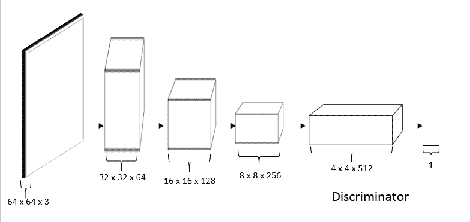
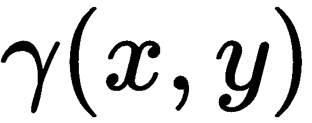
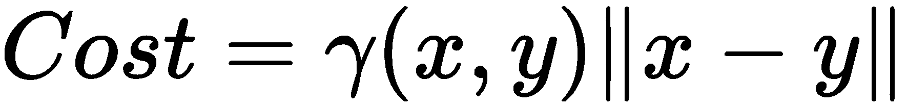
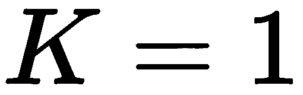

# 使用 GANs 生成图像

到目前为止，我们已经学习了判别模型，它学习区分不同类别。也就是说，给定一个输入，它告诉我们它属于哪个类别。例如，要预测一封电子邮件是垃圾邮件还是正常邮件，该模型学习最佳分隔两类（垃圾邮件和正常邮件）的决策边界，当有新的电子邮件进来时，它们可以告诉我们新邮件属于哪个类别。

在本章中，我们将学习一种生成模型，该模型学习类分布，即学习类的特征，而不是学习决策边界。顾名思义，生成模型可以生成与训练集中现有数据点类似的新数据点。

我们将从深入理解判别模型和生成模型的差异开始本章。然后，我们将深入探讨最广泛使用的生成算法之一，称为**生成对抗网络**（**GANs**）。我们将了解 GANs 的工作原理以及它们如何用于生成新的数据点。接下来，我们将探索 GANs 的架构，并学习其损失函数。随后，我们将看到如何在 TensorFlow 中实现 GANs 以生成手写数字。

我们还将详细研究**深度卷积生成对抗网络**（**DCGAN**），它作为普通 GAN 的小扩展，使用卷积网络进行架构设计。接下来，我们将探索**最小二乘生成对抗网络**（**LSGAN**），它采用最小二乘损失来生成更好和更质量的图像。

在本章末尾，我们将了解**Wasserstein 生成对抗网络**（**WGAN**），它在 GAN 的损失函数中使用 Wasserstein 度量以获得更好的结果。

本章将涵盖以下主题：

+   生成模型和判别模型的区别

+   GANs

+   生成对抗网络的架构

+   在 TensorFlow 中构建 GANs

+   深度卷积 GANs

+   使用 DCGAN 生成 CIFAR 图像

+   最小二乘生成对抗网络

+   Wasserstein 生成对抗网络

# 判别模型和生成模型的区别

给定一些数据点，判别模型学习将数据点分类到它们各自的类别中，通过学习最优的决策边界来分隔类别。生成模型也可以对给定的数据点进行分类，但是它们不是学习决策边界，而是学习每个类别的特征。

例如，让我们考虑图像分类任务，预测给定图像是苹果还是橙子。如下图所示，为了区分苹果和橙子，判别模型学习最优的决策边界来分隔苹果和橙子类别，而生成模型则通过学习苹果和橙子类别的特征分布来学习它们的分布：


简而言之，判别模型学习如何以最优方式找到分隔类别的决策边界，而生成模型则学习每个类别的特征。

判别模型预测输入条件下的标签 ，而生成模型学习联合概率分布 。判别模型的例子包括逻辑回归、**支持向量机**（**SVM**）等，我们可以直接从训练集中估计 。生成模型的例子包括**马尔可夫随机场**和**朴素贝叶斯**，首先我们估计  来确定 ：


# 说一声你好，GAN！

GAN 最初由 Ian J Goodfellow、Jean Pouget-Abadie、Mehdi Mirza、Bing Xu、David Warde-Farley、Sherjil Ozair、Aaron Courville 和 Yoshua Bengio 在 2014 年的论文《生成对抗网络》中首次提出。

GAN 广泛用于生成新数据点。它们可以应用于任何类型的数据集，但通常用于生成图像。GAN 的一些应用包括生成逼真的人脸，将灰度图像转换为彩色图像，将文本描述转换为逼真图像等。

Yann LeCun 这样评价 GAN：

"过去 20 年来深度学习中最酷的想法。"

GAN 在最近几年已经发展得非常成熟，能够生成非常逼真的图像。下图展示了 GAN 在五年间生成图像的演变：


对 GAN 已经感到兴奋了吗？现在，我们将看看它们如何工作。在继续之前，让我们考虑一个简单的类比。假设你是警察，你的任务是找到伪钞，而伪造者的角色是制造假钞并欺骗警察。

伪造者不断尝试以一种逼真到无法与真钱区分的方式创建假钱。但警察必须识别钱是真还是假。因此，伪造者和警察实质上是在一个两人游戏中互相竞争。GAN 的工作原理就类似于这样。它们由两个重要组成部分组成：

+   生成器

+   鉴别器

你可以将生成器视为伪造者的类比，而鉴别器则类似于警察。换句话说，生成器的角色是创造假钱，而鉴别器的角色是判断钱是假的还是真的。

在进入细节之前，我们先基本了解一下 GAN。假设我们想让我们的 GAN 生成手写数字。我们如何做到这一点？首先，我们会获取一个包含手写数字集合的数据集；比如说，MNIST 数据集。生成器学习我们数据集中图像的分布。因此，它学习了我们训练集中手写数字的分布。一旦它学习了我们数据集中图像的分布，我们向生成器提供随机噪声，它将根据学习到的分布将随机噪声转换为一个新的手写数字，类似于训练集中的手写数字：


判别器的目标是执行分类任务。给定一张图像，它将其分类为真实或虚假；也就是说，图像是来自训练集还是由生成器生成的：


GAN 的生成器组件基本上是一个生成模型，鉴别器组件基本上是一个判别模型。因此，生成器学习类的分布，而鉴别器学习类的决策边界。

如下图所示，我们向生成器提供随机噪声，它将这个随机噪声转换为一个新的图像，*类似*于我们训练集中的图像，但不*完全*与训练集中的图像相同。生成器生成的图像称为虚假图像，而我们训练集中的图像称为真实图像。我们将真实图像和虚假图像都输入给鉴别器，它告诉我们它们是真实的概率。如果图像是虚假的，则返回 0；如果图像是真实的，则返回 1：


现在我们对生成器和判别器有了基本的理解，接下来我们将详细研究每个组件。

# 分解生成器

GAN 的生成器组件是一个生成模型。当我们说生成模型时，有两种类型的生成模型——**隐式**和**显式**密度模型。隐式密度模型不使用任何显式密度函数来学习概率分布，而显式密度模型则使用显式密度函数。GAN 属于第一类，即它们是隐式密度模型。让我们详细研究并理解 GAN 如何是隐式密度模型。

假设我们有一个生成器，。它基本上是一个由参数化的神经网络。生成器网络的作用是生成新的图像。它们是如何做到的？生成器的输入应该是什么？

我们从正态或均匀分布中采样一个随机噪声，`img/e81c13be-a7f2-4fce-b65d-bb431e78a44f.png`。我们将这个随机噪声作为输入传递给生成器，然后生成器将这个噪声转换为一张图像：

`img/0f9e55cc-f1c7-4e81-8970-10d03f783878.png`

令人惊讶，不是吗？生成器是如何将随机噪声转换成逼真图像的？

假设我们有一个包含人脸图像集合的数据集，我们希望我们的生成器生成一个新的人脸。首先，生成器通过学习训练集中图像的概率分布来学习人脸的所有特征。一旦生成器学会了正确的概率分布，它就能生成全新的人脸图像。

但是生成器如何学习训练集的分布？也就是说，生成器如何学习训练集中人脸图像的分布？

生成器不过是一个神经网络。因此，神经网络隐式学习我们训练集图像的分布；让我们将这个分布称为生成器分布`img/1761d20a-41ac-42fd-96a9-7020402924b0.png`。在第一次迭代中，生成器生成一个非常嘈杂的图像。但是在一系列迭代中，它学会了准确的训练集概率分布，并通过调整其`img/19a949c3-3c6d-4648-a9a7-b369bea074b7.png`参数来学习生成正确的图像。

需要注意的是，我们并没有使用均匀分布`img/f7abe107-bf51-4c25-a7c3-1c179dcb65b0.png`来学习我们训练集的分布。它仅用于采样随机噪声，并且我们将这个随机噪声作为输入传递给生成器。生成器网络隐式学习我们训练集的分布，我们称之为生成器分布`img/9133256a-83f4-442b-b832-92b5219fdea6.png`，这也是我们称生成器网络为隐式密度模型的原因。

# 分解鉴别器

正如其名称所示，鉴别器是一个鉴别模型。假设我们有一个鉴别器，`img/ffac7f05-3330-4b0c-a1b7-4ff2daedeca2.png`。它也是一个神经网络，并且由参数化`img/1c69a44b-a93f-46cf-b35a-06d8a59516fe.png`。

鉴别器的目标是区分两类。也就是说，给定一张图像`img/19ee6f8d-c60c-4952-8a15-bfd8b22c0b5a.png`，它必须确定图像是来自真实分布还是生成器分布（虚假分布）。也就是说，鉴别器必须确定给定的输入图像是来自训练集还是生成器生成的虚假图像：

`img/34c15144-474c-41d5-98d6-042c6dbdf0ef.png`

让我们将我们的训练集的分布称为真实数据分布，由  表示。我们知道生成器的分布由  表示。

因此，鉴别器  实质上试图区分图像  是来自于  还是 。

# 但是它们是如何学习的呢？

到目前为止，我们只是研究了生成器和鉴别器的角色，但它们究竟是如何学习的？生成器如何学习生成新的逼真图像，鉴别器如何学习正确区分图像？

我们知道生成器的目标是以一种方式生成图像，使得鉴别器认为生成的图像来自真实分布。

在第一次迭代中，生成器生成了一张嘈杂的图像。当我们将这个图像输入给鉴别器时，鉴别器可以轻易地检测到这是来自生成器分布的图像。生成器将这视为损失并尝试改进自己，因为它的目标是欺骗鉴别器。也就是说，如果生成器知道鉴别器轻易地将生成的图像检测为虚假图像，那么这意味着它没有生成类似于训练集中的图像。这表明它尚未学会训练集的概率分布。

因此，生成器调整其参数，以学习训练集的正确概率分布。由于我们知道生成器是一个神经网络，我们只需通过反向传播更新网络的参数。一旦它学会了真实图像的概率分布，它就可以生成类似于训练集中的图像。

好的，那么鉴别器呢？它如何学习呢？正如我们所知，鉴别器的角色是区分真实和虚假图像。

如果鉴别器错误地将生成的图像分类；也就是说，如果鉴别器将虚假图像分类为真实图像，那么这意味着鉴别器没有学会区分真实图像和虚假图像。因此，我们通过反向传播更新鉴别器网络的参数，使其学会区分真实和虚假图像。

因此，基本上，生成器试图通过学习真实数据分布 ，欺骗鉴别器，而鉴别器试图找出图像是来自真实分布还是虚假分布。现在的问题是，在生成器和鉴别器相互竞争的情况下，我们何时停止训练网络？

基本上，GAN 的目标是生成类似于训练集中的图像。比如我们想生成一个人脸—我们学习训练集中图像的分布并生成新的人脸。因此，对于生成器，我们需要找到最优的判别器。这是什么意思？

我们知道生成器分布由  表示，而真实数据分布由  表示。如果生成器完美地学习了真实数据分布，那么  就等于 ，如下图所示：


当  时，鉴别器无法区分输入图像是来自真实分布还是假分布，因此它会返回 0.5 作为概率，因为鉴别器在这两个分布相同时会变得困惑。

因此，对于生成器，最优判别器可以表示为：


因此，当鉴别器对任何图像返回概率为 0.5 时，我们可以说生成器已成功学习了我们训练集中图像的分布，并成功愚弄了鉴别器。

# GAN 的架构

GAN 的架构如下图所示：


如前图所示，**生成器 ** 以随机噪声  作为输入，从均匀或正态分布中抽样，并通过隐式学习训练集的分布生成假图像。

我们从真实数据分布  和假数据分布  中采样一幅图像 ，并将其馈送给鉴别器 。我们将真实和假图像馈送给鉴别器，鉴别器执行二元分类任务。也就是说，当图像为假时，它返回 0，当图像为真时返回 1。

# 揭秘损失函数

现在我们将研究 GAN 的损失函数。在继续之前，让我们回顾一下符号：

+   作为生成器的输入的噪声由  表示。

+   噪声  抽样自的均匀或正态分布由  表示。

+   输入图像由  表示。

+   真实数据分布或我们训练集的分布由  表示。

+   假数据分布或生成器的分布由  表示。

当我们写下  时，意味着图像  是从真实分布  中采样得到的。同样， 表示图像  是从生成器分布  中采样得到的，而  则意味着生成器输入  是从均匀分布  中采样得到的。

我们已经学习到生成器和判别器都是神经网络，并且它们通过反向传播来更新参数。现在我们需要找到最优的生成器参数  和判别器参数 。

# 判别器损失

现在我们将看看判别器的损失函数。我们知道判别器的目标是分类图像是真实图像还是假图像。让我们用  表示判别器。

判别器的损失函数如下所示：


不过，这意味着什么呢？让我们逐一理解每一项的含义。

# 第一项

让我们来看第一项：


这里， 表示我们从真实数据分布  中采样输入 ，因此  是一张真实图像。

 表示我们将输入图像  提交给判别器 ，并且判别器将返回输入图像  是真实图像的概率。由于  是从真实数据分布  中采样得到的，我们知道  是一张真实图像。因此，我们需要最大化  的概率：


但是，我们不是最大化原始概率，而是最大化对数概率；正如我们在 第七章 中学到的，*学习文本表示*，我们可以写成以下形式：


因此，我们的最终方程如下：


意味着来自真实数据分布的输入图像的对数似然期望是真实的。

# 第二项

现在，让我们来看看第二项：


在这里，意味着我们从均匀分布中采样随机噪声。意味着生成器将随机噪声作为输入，并根据其隐式学习的分布返回假图像。

意味着我们将生成器生成的假图像输入到鉴别器中，并返回假输入图像是真实图像的概率。

如果我们从 1 中减去，那么它将返回假输入图像是假图像的概率：


由于我们知道不是真实图像，鉴别器将最大化这个概率。也就是说，鉴别器最大化被分类为假图像的概率，因此我们写成：


我们不是最大化原始概率，而是最大化对数概率：


意味着生成器生成的输入图像的对数似然期望是假的。

# 最终项

因此，结合这两项，鉴别器的损失函数如下所示：


在这里，和分别是生成器和鉴别器网络的参数。因此，鉴别器的目标是找到正确的，使其能够正确分类图像。

# 生成器损失

生成器的损失函数如下所示：


我们知道生成器的目标是欺骗鉴别器将假图像分类为真实图像。

在*鉴别器损失*部分，我们看到意味着将假输入图像分类为假图像的概率，并且鉴别器最大化这些概率以正确分类假图像为假。

但是生成器希望最小化这个概率。由于生成器想要愚弄判别器，它最小化了判别器将假输入图像分类为假的概率。因此，生成器的损失函数可以表达为以下形式：


# 总损失

我们刚刚学习了生成器和判别器的损失函数，结合这两个损失函数，我们将我们的最终损失函数写成如下形式：


因此，我们的目标函数基本上是一个最小最大化目标函数，也就是说，判别器的最大化和生成器的最小化，我们通过反向传播各自的网络来找到最优的生成器参数  和判别器参数 。

因此，我们执行梯度上升；也就是说，判别器的最大化：


并且，我们执行梯度下降；也就是说，生成器的最小化：


然而，优化上述生成器的目标函数并不能有效地工作，导致了稳定性问题。因此，我们引入了一种称为**启发式损失**的新形式的损失。

# 启发式损失

判别器的损失函数没有变化。可以直接写成如下形式：


现在，让我们来看一下生成器的损失：


我们能否像判别器的损失函数一样将生成器的损失函数的最小化目标改为最大化目标呢？我们如何做到这一点呢？我们知道  返回假输入图像被分类为假的概率，而生成器正在最小化这个概率。

而不是这样做，我们可以写成 。这意味着假输入图像被分类为真实的概率，现在生成器可以最大化这个概率。这意味着生成器正在最大化假输入图像被判别器分类为真实图像的概率。因此，我们的生成器的损失函数现在变成了以下形式：


因此，现在我们已经将判别器和生成器的损失函数都转化为最大化的术语：


但是，如果我们可以将最大化问题转化为最小化问题，那么我们就可以应用我们喜爱的梯度下降算法。那么，我们如何将我们的最大化问题转化为最小化问题呢？我们可以通过简单地添加负号来实现这一点。

因此，我们判别器的最终损失函数如下所示：


此外，生成器的损失如下所示：


# 在 TensorFlow 中使用 GAN 生成图像

让我们通过在 TensorFlow 中构建 GAN 来加深对生成手写数字的理解。您也可以在这一节的完整代码[这里](http://bit.ly/2wwBvRU)查看。

首先，我们将导入所有必要的库：

```py
import warnings
warnings.filterwarnings('ignore')

import numpy as np
import tensorflow as tf
from tensorflow.examples.tutorials.mnist import input_data
tf.logging.set_verbosity(tf.logging.ERROR)

import matplotlib.pyplot as plt
%matplotlib inline

tf.reset_default_graph()
```

# 读取数据集

加载 MNIST 数据集：

```py
data = input_data.read_data_sets("data/mnist",one_hot=True)
```

让我们绘制一张图像：

```py
plt.imshow(data.train.images[13].reshape(28,28),cmap="gray")
```

输入图像如下所示：


# 定义生成器

生成器  接受噪声  作为输入，并返回图像。我们将生成器定义为一个三层的前馈网络。而不是从头编写生成器网络，我们可以使用 `tf.layers.dense()`，它可以用来创建一个密集层。它接受三个参数：`inputs`、`units` 的数量和 `activation` 函数：

```py
def generator(z,reuse=None):

    with tf.variable_scope('generator',reuse=reuse):

        hidden1 = tf.layers.dense(inputs=z,units=128,activation=tf.nn.leaky_relu)
        hidden2 = tf.layers.dense(inputs=hidden1,units=128,activation=tf.nn.leaky_relu)
        output = tf.layers.dense(inputs=hidden2,units=784,activation=tf.nn.tanh)

        return output
```

# 定义鉴别器

我们知道鉴别器  返回给定图像为真实的概率。我们也定义鉴别器作为一个三层的前馈网络：

```py
def discriminator(X,reuse=None):

    with tf.variable_scope('discriminator',reuse=reuse):

        hidden1 = tf.layers.dense(inputs=X,units=128,activation=tf.nn.leaky_relu)
        hidden2 = tf.layers.dense(inputs=hidden1,units=128,activation=tf.nn.leaky_relu)
        logits = tf.layers.dense(inputs=hidden2,units=1)
        output = tf.sigmoid(logits)

        return logits 
```

# 定义输入占位符

现在我们定义输入  和噪声  的占位符：

```py
x = tf.placeholder(tf.float32,shape=[None,784])
z = tf.placeholder(tf.float32,shape=[None,100])
```

# 开始 GAN！

首先，我们将噪声输入生成器，并输出假图像，![]：

```py
fake_x = generator(z)
```

现在我们将真实图像提供给鉴别器 ![] 并得到真实图像为真的概率：

```py
D_logits_real = discriminator(x)
```

类似地，我们将假图像提供给鉴别器，并获得假图像为真的概率：

```py
D_logits_fake = discriminator(fake_x,reuse=True)
```

# 计算损失函数

现在，我们将看看如何计算损失函数。

# 鉴别器损失

鉴别器损失如下所示：


首先，我们将实现第一项，。

第一项，，意味着从真实数据分布中采样的图像的对数似然的期望是真实的。

这基本上是二元交叉熵损失。我们可以使用 TensorFlow 函数 `tf.nn.sigmoid_cross_entropy_with_logits()` 实现二元交叉熵损失。它接受两个参数作为输入，`logits` 和 `labels`，如下所述：

+   `logits` 输入，顾名思义，是网络的 logits，因此它是 `D_logits_real`。

+   `labels` 输入，顾名思义，是真实标签。我们了解到鉴别器应该对真实图像返回 `1`，对假图像返回 `0`。由于我们正在计算来自真实数据分布的输入图像的损失，真实标签是 `1`。

我们使用 `tf.ones_like()` 将标签设置为与 `D_logits_real` 相同形状的 `1`。

然后我们使用 `tf.reduce_mean()` 计算平均损失。如果注意到我们的损失函数中有一个减号，这是为了将我们的损失转换为最小化目标。但在下面的代码中，没有减号，因为 TensorFlow 优化器只会最小化而不会最大化。因此，在我们的实现中不需要添加减号，因为无论如何，TensorFlow 优化器都会将其最小化：

```py
D_loss_real = tf.reduce_mean(tf.nn.sigmoid_cross_entropy_with_logits(logits=D_logits_real,
 labels=tf.ones_like(D_logits_real)))
```

现在我们将实现第二项，。

第二项，，意味着生成器生成的图像被分类为假图像的对数似然期望。

类似于第一项，我们可以使用 `tf.nn.sigmoid_cross_entropy_with_logits()` 计算二元交叉熵损失。在此，以下内容成立：

+   Logits 是 `D_logits_fake`。

+   因为我们正在计算生成器生成的假图像的损失，所以 `true` 标签为 `0`。

我们使用 `tf.zeros_like()` 将标签设置为与 `D_logits_fake` 相同形状的 `0`。也就是说，`labels = tf.zeros_like(D_logits_fake)`：

```py
D_loss_fake = tf.reduce_mean(tf.nn.sigmoid_cross_entropy_with_logits(logits=D_logits_fake,
 labels=tf.zeros_like(D_logits_fake)))
```

现在我们将实现最终的损失。

因此，结合前述两项，判别器的损失函数如下所示：

```py
D_loss = D_loss_real + D_loss_fake
```

# 生成器损失

生成器的损失如下给出：。

它意味着假图像被分类为真实图像的概率。正如我们在判别器中计算二元交叉熵一样，我们在生成器中使用 `tf.nn.sigmoid_cross_entropy_with_logits()` 计算损失时这一点成立。

在这里，应注意以下事项：

+   Logits 是 `D_logits_fake`。

+   因为我们的损失意味着生成器生成的假输入图像被分类为真实的概率，所以真实标签为 1。因为正如我们所学到的，生成器的目标是生成假图像并欺骗判别器将假图像分类为真实图像。

我们使用 `tf.ones_like()` 将标签设置为与 `D_logits_fake` 相同形状的 `1`。也就是说，`labels = tf.ones_like(D_logits_fake)`：

```py
G_loss = tf.reduce_mean(tf.nn.sigmoid_cross_entropy_with_logits(logits=D_logits_fake, labels=tf.ones_like(D_logits_fake)))
```

# 优化损失

现在我们需要优化我们的生成器和判别器。因此，我们分别收集判别器和生成器的参数为  和 ：

```py
training_vars = tf.trainable_variables()
theta_D = [var for var in training_vars if 'dis' in var.name]
theta_G = [var for var in training_vars if 'gen' in var.name]
```

使用 Adam 优化器优化损失：

```py
learning_rate = 0.001

D_optimizer = tf.train.AdamOptimizer(learning_rate).minimize(D_loss,var_list = theta_D)
G_optimizer = tf.train.AdamOptimizer(learning_rate).minimize(G_loss, var_list = theta_G)
```

# 开始训练

让我们通过定义批量大小和 epoch 数量来开始训练：

```py
batch_size = 100
num_epochs = 1000
```

初始化所有变量：

```py
init = tf.global_variables_initializer()
```

# 生成手写数字

启动 TensorFlow 会话并生成手写数字：

```py
with tf.Session() as session:
```

初始化所有变量：

```py
    session.run(init)
```

对于每个 epoch 执行以下操作：

```py
    for epoch in range(num_epochs):
```

选择批量数：

```py
        num_batches = data.train.num_examples // batch_size
```

对于每个批次执行以下操作：

```py
        for i in range(num_batches):
```

根据批量大小获取数据批次：

```py
            batch = data.train.next_batch(batch_size)
```

重塑数据：

```py
            batch_images = batch[0].reshape((batch_size,784))
            batch_images = batch_images * 2 - 1
```

对批量噪声进行采样：

```py

            batch_noise = np.random.uniform(-1,1,size=(batch_size,100))
```

使用输入 `x` 作为 `batch_images` 和噪声 `z` 作为 `batch_noise` 来定义喂入字典：

```py
            feed_dict = {x: batch_images, z : batch_noise}
```

训练判别器和生成器：

```py
            _ = session.run(D_optimizer,feed_dict = feed_dict)
            _ = session.run(G_optimizer,feed_dict = feed_dict)
```

计算判别器和生成器的损失：

```py
            discriminator_loss = D_loss.eval(feed_dict)
            generator_loss = G_loss.eval(feed_dict)

```

每个第 100^(th) epoch 将噪声输入生成器，并生成一幅图像：

```py
        if epoch%100==0:
            print("Epoch: {}, iteration: {}, Discriminator Loss:{}, Generator Loss: {}".format(epoch,i,discriminator_loss,generator_loss))

            _fake_x = fake_x.eval(feed_dict)

            plt.imshow(_fake_x[0].reshape(28,28))
            plt.show()
```

在训练过程中，我们注意到损失如何减少，以及 GAN 如何学习生成图像，如下所示：


# DCGAN – 在 GAN 中添加卷积

我们刚刚学习了 GAN 的有效性以及它们如何用于生成图像。我们知道 GAN 包括两个组件：生成器用于生成图像，判别器用作对生成图像的批评者。正如您所见，这些生成器和判别器都是基本的前馈神经网络。与其将它们保留为前馈网络，不如使用卷积网络？

在 第六章《解密卷积网络》中，我们已经看到了卷积网络在基于图像的数据上的有效性，以及它们如何以无监督的方式从图像中提取特征。由于在 GAN 中我们正在生成图像，因此使用卷积网络而不是前馈网络是可取的。因此，我们引入了一种新型 GAN，称为 **DCGAN**。它通过卷积扩展了 GAN 的设计。我们基本上用卷积神经网络 (**CNN**) 替换了生成器和判别器中的前馈网络。

判别器使用卷积层来对图像进行分类，判断是真实图像还是假图像，而生成器使用卷积转置层来生成新图像。现在我们将详细探讨生成器和判别器在 DCGAN 中与传统 GAN 相比的区别。

# 反卷积生成器

生成器的作用是通过学习真实数据分布来生成新的图像。在 DCGAN 中，生成器由卷积转置层和批量归一化层组成，激活函数为 ReLU。

注意，卷积转置操作也称为反卷积操作或分数步长卷积。

生成器的输入是从标准正态分布中抽取的噪声 ，它输出与训练数据中图像相同大小的图像，例如 64 x 64 x 3。

生成器的架构如下图所示：


首先，我们将形状为 100 x 1 的噪声 *z* 转换为 1024 x 4 x 4，以获得宽度、高度和特征图的形状，并称之为 **投影和重塑**。随后，我们执行一系列卷积操作，使用分数步长卷积。我们在每一层除最后一层外都应用批量归一化。此外，我们在每一层除最后一层外都应用 ReLU 激活函数。我们应用 tanh 激活函数来将生成的图像缩放到 -1 到 +1 之间。

# 卷积判别器

现在我们将看到 DCGAN 中判别器的架构。正如我们所知，判别器接收图像并告诉我们图像是真实图像还是伪造图像。因此，它基本上是一个二元分类器。判别器由一系列卷积和批量归一化层以及泄漏 ReLU 激活组成。

判别器的架构如下图所示：



如您所见，它接收大小为 64 x 64 x 3 的输入图像，并使用泄漏 ReLU 激活函数进行一系列卷积操作。我们在所有层上都应用批量归一化，除了输入层。

记住，在判别器和生成器中我们不使用最大池化操作。相反，我们应用了步幅卷积操作（即带步幅的卷积操作）。

简言之，我们通过用卷积网络替换生成器和判别器中的前馈网络来增强香草 GAN。

# 实现 DCGAN 以生成 CIFAR 图像

现在我们将看到如何在 TensorFlow 中实现 DCGAN。我们将学习如何使用来自**加拿大高级研究所**（**CIFAR**）-10 数据集的图像。CIFAR-10 包含来自 10 个不同类别的 60,000 张图像，包括飞机、汽车、鸟类、猫、鹿、狗、青蛙、马、船和卡车。我们将探讨如何使用 DCGAN 生成这些图像。

首先，导入所需的库：

```py
import warnings
warnings.filterwarnings('ignore')

import numpy as np
import tensorflow as tf
from tensorflow.examples.tutorials.mnist import input_data
tf.logging.set_verbosity(tf.logging.ERROR)

from keras.datasets import cifar10

import matplotlib.pyplot as plt
%matplotlib inline
from IPython import display

from scipy.misc import toimage
```

# 探索数据集

加载 CIFAR 数据集：

```py
(x_train, y_train), _ = cifar10.load_data()

x_train = x_train.astype('float32')/255.0
```

让我们看看数据集中有什么。定义一个用于绘制图像的辅助函数：

```py
def plot_images(X):
    plt.figure(1)
    z = 0
    for i in range(0,4):
        for j in range(0,4):
            plt.subplot2grid((4,4),(i,j))
            plt.imshow(toimage(X[z]))
            z = z + 1

    plt.show()
```

让我们绘制几张图像：

```py
plot_images(x_train[:17])
```

绘制的图像如下所示：


# 定义判别器

我们将判别器定义为一个带有三个卷积层和一个全连接层的卷积网络。它由一系列卷积和批量归一化层以及泄漏 ReLU 激活组成。我们在所有层上都应用批量归一化，除了输入层：

```py
def discriminator(input_images, reuse=False, is_training=False, alpha=0.1):

    with tf.variable_scope('discriminator', reuse= reuse):
```

第一个带有泄漏 ReLU 激活的卷积层：

```py
        layer1 = tf.layers.conv2d(input_images, 
                                  filters=64, 
                                  kernel_size=5, 
                                  strides=2, 
                                  padding='same', 
                                  kernel_initializer=kernel_init, 
                                  name='conv1')

        layer1 = tf.nn.leaky_relu(layer1, alpha=0.2, name='leaky_relu1')
```

第二个带有批量归一化和泄漏 ReLU 激活的卷积层：

```py
        layer2 = tf.layers.conv2d(layer1, 
                                  filters=128, 
                                  kernel_size=5, 
                                  strides=2, 
                                  padding='same', 
                                  kernel_initializer=kernel_init, 
                                  name='conv2')
        layer2 = tf.layers.batch_normalization(layer2, training=is_training, name='batch_normalization2')

        layer2 = tf.nn.leaky_relu(layer2, alpha=0.2, name='leaky_relu2')
```

第三个带有批量归一化和泄漏 ReLU 的卷积层：

```py
        layer3 = tf.layers.conv2d(layer2, 
                                 filters=256, 
                                 kernel_size=5, 
                                 strides=1,
                                 padding='same',
                                 name='conv3')
        layer3 = tf.layers.batch_normalization(layer3, training=is_training, name='batch_normalization3')
        layer3 = tf.nn.leaky_relu(layer3, alpha=0.1, name='leaky_relu3')
```

展平最终卷积层的输出：

```py
        layer3 = tf.reshape(layer3, (-1, layer3.shape[1]*layer3.shape[2]*layer3.shape[3]))

```

定义全连接层并返回`logits`：

```py
        logits = tf.layers.dense(layer3, 1)

        output = tf.sigmoid(logits)

        return logits  
```

# 定义生成器

正如我们学到的那样，生成器执行转置卷积操作。生成器由卷积转置和批量归一化层以及 ReLU 激活组成。我们在每一层都应用批量归一化，但是对于最后一层，我们应用`tanh`激活函数将生成的图像缩放到-1 到+1 之间：

```py
def generator(z, z_dim, batch_size, is_training=False, reuse=False):
    with tf.variable_scope('generator', reuse=reuse):
```

第一个全连接层：

```py
        input_to_conv = tf.layers.dense(z, 8*8*128)
```

转换输入的形状并应用批量归一化，然后应用 ReLU 激活：

```py
        layer1 = tf.reshape(input_to_conv, (-1, 8, 8, 128))
        layer1 = tf.layers.batch_normalization(layer1, training=is_training, name='batch_normalization1')
        layer1 = tf.nn.relu(layer1, name='relu1')
```

第二层是转置卷积层，带有批量归一化和 ReLU 激活：

```py
        layer2 = tf.layers.conv2d_transpose(layer1, filters=256, kernel_size=5, strides= 2, padding='same', 
                                            kernel_initializer=kernel_init, name='deconvolution2')
        layer2 = tf.layers.batch_normalization(layer2, training=is_training, name='batch_normalization2')
        layer2 = tf.nn.relu(layer2, name='relu2')

```

定义第三层：

```py
        layer3 = tf.layers.conv2d_transpose(layer2, filters=256, kernel_size=5, strides= 2, padding='same', 
                                            kernel_initializer=kernel_init, name='deconvolution3')
        layer3 = tf.layers.batch_normalization(layer3,training=is_training, name='batch_normalization3')
        layer3 = tf.nn.relu(layer3, name='relu3')
```

定义第四层：

```py
        layer4 = tf.layers.conv2d_transpose(layer3, filters=256, kernel_size=5, strides= 1, padding='same', 
                                            kernel_initializer=kernel_init, name='deconvolution4')
        layer4 = tf.layers.batch_normalization(layer4,training=is_training, name='batch_normalization4')
        layer4 = tf.nn.relu(layer4, name='relu4')
```

在最后一层，我们不应用批量归一化，而是使用 `tanh` 激活函数代替 ReLU：

```py
        layer5 = tf.layers.conv2d_transpose(layer4, filters=3, kernel_size=7, strides=1, padding='same', 
                                            kernel_initializer=kernel_init, name='deconvolution5')

        logits = tf.tanh(layer5, name='tanh')

        return logits
```

# 定义输入

为输入定义 `placeholder`：

```py
image_width = x_train.shape[1]
image_height = x_train.shape[2]
image_channels = x_train.shape[3]

x = tf.placeholder(tf.float32, shape= (None, image_width, image_height, image_channels), name="d_input")
```

定义学习率和训练布尔值的 `placeholder`：

```py
learning_rate = tf.placeholder(tf.float32, shape=(), name="learning_rate")
is_training = tf.placeholder(tf.bool, [], name='is_training')
```

定义批次大小和噪声的维度：

```py
batch_size = 100
z_dim = 100
```

定义噪声的占位符 *z*：

```py
z = tf.random_normal([batch_size, z_dim], mean=0.0, stddev=1.0, name='z')
```

# 启动 DCGAN

首先，我们将噪声  输入生成器，生成假图像 ：

```py
fake_x = generator(z, z_dim, batch_size, is_training=is_training)
```

现在我们将真实图像输入判别器  并得到真实图像被判定为真实的概率：

```py
D_logit_real = discriminator(x, reuse=False, is_training=is_training)
```

同样地，我们将虚假图像输入判别器，，并获得虚假图像被判定为真实的概率：

```py
D_logit_fake = discriminator(fake_x, reuse=True,  is_training=is_training)
```

# 计算损失函数

现在我们将看看如何计算损失函数。

# 判别器损失

损失函数与普通 GAN 相同：


因此，我们可以直接写出以下内容：

```py
D_loss_real = tf.reduce_mean(tf.nn.sigmoid_cross_entropy_with_logits(logits=D_logits_real,
 labels=tf.ones_like(D_logits_real)))

D_loss_fake = tf.reduce_mean(tf.nn.sigmoid_cross_entropy_with_logits(logits=D_logits_fake,
 labels=tf.zeros_like(D_logits_fake)))

D_loss = D_loss_real + D_loss_fake
```

# 生成器损失

生成器损失与普通 GAN 相同：


我们可以使用以下代码计算它：

```py
G_loss = tf.reduce_mean(tf.nn.sigmoid_cross_entropy_with_logits(logits=D_logits_fake, labels=tf.ones_like(D_logits_fake)))
```

# 优化损失

正如我们在普通 GAN 中看到的，我们分别收集判别器和生成器的参数，分别为  和  ：

```py
training_vars = tf.trainable_variables()
theta_D = [var for var in training_vars if 'dis' in var.name]
theta_G = [var for var in training_vars if 'gen' in var.name]
```

使用 Adam 优化器优化损失：

```py
d_optimizer = tf.train.AdamOptimizer(learning_rate).minimize(D_loss, var_list=theta_D)
g_optimizer = tf.train.AdamOptimizer(learning_rate).minimize(G_loss, var_list=theta_G)
```

# 训练 DCGAN

让我们开始训练。定义批次数、epochs 和学习率：

```py
num_batches = int(x_train.shape[0] / batch_size)
steps = 0
num_epcohs = 500
lr = 0.00002
```

定义一个辅助函数来生成和绘制生成的图像：

```py
def generate_new_samples(session, n_images, z_dim):

    z = tf.random_normal([1, z_dim], mean=0.0, stddev=1.0)

    is_training = tf.placeholder(tf.bool, [], name='training_bool') 

    samples = session.run(generator(z, z_dim, batch_size, is_training, reuse=True),feed_dict={is_training: True})

    img = (samples[0] * 255).astype(np.uint8)
    plt.imshow(img)
    plt.show()
```

开始训练：

```py
with tf.Session() as session:
```

初始化所有变量：

```py
    session.run(tf.global_variables_initializer())
```

对每个 epoch 执行：

```py
    for epoch in range(num_epcohs):

        #for each batch
        for i in range(num_batches):
```

定义批次的起始和结束：

```py
            start = i * batch_size
            end = (i + 1) * batch_size
```

样本图像批次：

```py
            batch_images = x_train[start:end]
```

每两步训练一次判别器：

```py
            if(steps % 2 == 0):

                _, discriminator_loss = session.run([d_optimizer,D_loss], feed_dict={x: batch_images, is_training:True, learning_rate:lr})            
```

训练生成器和判别器：

```py
            _, generator_loss = session.run([g_optimizer,G_loss], feed_dict={x: batch_images, is_training:True, learning_rate:lr})
            _, discriminator_loss = session.run([d_optimizer,D_loss], feed_dict={x: batch_images, is_training:True, learning_rate:lr})
```

生成新图像：

```py
           display.clear_output(wait=True) 
            generate_new_samples(session, 1, z_dim)
            print("Epoch: {}, iteration: {}, Discriminator Loss:{}, Generator Loss: {}".format(epoch,i,discriminator_loss,generator_loss))   

            steps += 1
```

在第一次迭代中，DCGAN 将生成原始像素，但在一系列迭代中，它将学会生成具有以下参数的真实图像：

`Epoch: 0, iteration: 0, 判别器损失:1.44706475735, 生成器损失: 0.726667642593`

DCGAN 在第一次迭代中生成了以下图像：


# 最小二乘 GAN

我们刚刚学习了 GAN 如何用于生成图像。**最小二乘 GAN**（**LSGAN**）是 GAN 的另一简单变体。顾名思义，这里我们使用最小二乘误差作为损失函数，而不是 sigmoid 交叉熵损失。通过 LSGAN，我们可以改善从 GAN 生成的图像的质量。但是我们如何做到这一点？为什么普通 GAN 生成的图像质量较差？

如果你能回忆起 GAN 的损失函数，我们使用的是 sigmoid 交叉熵作为损失函数。生成器的目标是学习训练集中图像的分布，即真实数据分布，将其映射到假分布，并从学习到的假分布中生成假样本。因此，GAN 尝试将假分布映射得尽可能接近真实分布。

但一旦生成器生成的假样本位于决策面的正确侧，梯度就会趋于消失，即使假样本远离真实分布。这是由于 sigmoid 交叉熵损失。

让我们通过以下图形来理解。使用 sigmoid 交叉熵作为损失函数的普通 GAN 的决策边界如下图所示，在这里假样本用十字表示，真实样本用点表示，更新生成器的假样本用星号表示。

如你所见，一旦生成器生成的假样本（星号）位于决策面的正确侧，也就是假样本位于真实样本（点）的一侧时，梯度就会趋于消失，即使假样本远离真实分布。这是由于 sigmoid 交叉熵损失，因为它不关心假样本是否接近真样本，而是只关注假样本是否位于决策面的正确侧。这导致了一个问题，即当梯度消失时，即使假样本远离真实数据分布，生成器也无法学习到数据集的真实分布：


因此，我们可以用最小二乘损失来改变这个决策面。现在，正如你在下图中所见，尽管生成器生成的假样本位于决策面的正确侧，梯度不会消失，直到假样本与真分布匹配。最小二乘损失强制更新将假样本匹配到真样本：


因此，由于我们将假分布与真实分布匹配，当我们将最小二乘作为成本函数时，我们的图像质量将得到改善。

简而言之，在普通 GAN 中，当假样本位于正确的决策表面的一侧时，渐变更新将会停止，即使它们来自真实样本，也就是真实分布。这是由于 Sigmoid 交叉熵损失，并不关心假样本是否接近真实样本，它只关心假样本是否在正确的一侧。这导致我们无法完美学习真实数据分布。因此，我们使用 LSGAN，它使用最小二乘误差作为损失函数，渐变更新将不会停止，直到假样本匹配真实样本，即使假样本在决策边界的正确一侧。

# 损失函数

现在，我们已经学会了最小二乘损失函数如何提高生成器图像的质量，我们如何用最小二乘来重写我们的 GAN 损失函数？

假设 *a* 和 *b* 分别是生成图像和真实图像的实际标签，那么我们可以用最小二乘损失的术语来写出鉴别器的损失函数如下：


类似地，假设 *c* 是生成器希望鉴别器相信生成图像是真实图像的实际标签，那么标签 *c* 代表真实图像。然后我们可以用最小二乘损失的术语来写出生成器的损失函数如下：


我们为真实图像设置标签为 1，对于假图像设置为 0，因此 *b* 和 *c* 变为 1，*a* 变为 0\. 因此，我们的最终方程可以如下给出：

鉴别器的损失函数如下所示：


生成器的损失如下所示：


# TensorFlow 中的 LSGAN

实现 LSGAN 与普通 GAN 相同，唯一不同的是损失函数的变化。因此，我们只会看如何在 TensorFlow 中实现 LSGAN 的损失函数，而不是查看整个代码。LSGAN 的完整代码可在 GitHub 仓库 [`bit.ly/2HMCrrx`](http://bit.ly/2HMCrrx) 中找到。

现在让我们看看如何实现 LSGAN 的损失函数。

# 鉴别器损失

鉴别器的损失如下所示：


首先，我们将实现第一个术语，：

```py
D_loss_real = 0.5*tf.reduce_mean(tf.square(D_logits_real-1))
```

现在我们将实现第二个术语，：

```py
D_loss_fake = 0.5*tf.reduce_mean(tf.square(D_logits_fake))
```

最终的鉴别器损失可以写成如下形式：

```py
D_loss = D_loss_real + D_loss_fake
```

# 生成器损失

生成器的损失，，如下所示：

```py
G_loss = 0.5*tf.reduce_mean(tf.square(D_logits_fake-1))
```

# 使用 Wasserstein 距离的 GAN

现在我们将看到 GAN 的另一个非常有趣的版本，称为 Wasserstein GAN（**WGAN**）。它在 GAN 的损失函数中使用了 Wasserstein 距离。首先，让我们理解为什么我们需要 Wasserstein 距离测量以及我们当前损失函数的问题所在。

在继续之前，让我们简要探讨两种用于衡量两个概率分布相似性的流行散度测量方法。

**Kullback-Leibler**（**KL**）散度是最常用的测量方法之一，用于确定一个概率分布与另一个之间的差异。假设我们有两个离散概率分布， 和 ，那么 KL 散度可以表示为：


当两个分布是连续的时，KL 散度可以表示为如下积分形式：


KL 散度不对称，意味着以下情况：


**Jensen-Shanon**（**JS**）散度是另一种用于测量两个概率分布相似性的方法。但与 KL 散度不同，JS 散度是对称的，可以表示为：


# 我们在 GAN 中是否在最小化 JS 散度？

我们知道生成器试图学习真实数据分布 ，以便能够从学习到的分布  生成新样本，鉴别器告诉我们图像是来自真实分布还是伪造分布。

我们也学到，当  时，鉴别器无法告诉我们图像来自真实分布还是伪造分布。它只输出 0.5，因为无法区分  和 。

因此，对于生成器，最优鉴别器可以表示为：


让我们回顾一下鉴别器的损失函数：


可以简单地写成如下形式：


将等式 *(1)* 替换到前述等式中，我们得到以下结果：


可以这样解决：


正如你所见，我们基本上在 GAN 的损失函数中最小化 JS 散度。因此，最小化 GAN 的损失函数基本上意味着最小化真实数据分布  和伪造数据分布  之间的 JS 散度，如下所示：


最小化  和  之间的 JS 散度意味着生成器  使其分布类似于真实数据分布 。但 JS 散度存在问题。正如您从下图中看到的那样，两个分布之间没有重叠。当没有重叠或两个分布不共享相同支持时，JS 散度会爆炸或返回常数值，GANs 无法正确学习：


因此，为了避免这种情况，我们需要改变我们的损失函数。我们不再最小化 JS 散度，而是使用一种称为 Wasserstein 距离的新距离度量，即使在它们不共享相同支持的情况下，它也告诉我们两个分布之间有多大的差距。

# 什么是 Wasserstein 距离？

Wasserstein 距离，也称为**地球移动者**（**EM**）距离，在需要将事物从一种配置移动到另一种配置的最优传输问题中，是最常用的距离测量之一。

所以，当我们有两个分布， 和 ，**** 表示了概率分布  要匹配概率分布  需要多少工作量。

让我们尝试理解 EM 距离背后的直觉。我们可以将概率分布视为质量的集合。我们的目标是将一个概率分布转换为另一个。有许多可能的转换方式，但 Wasserstein 度量寻求找到最佳和最小的方式，以最小的转换成本进行转换。

转换成本可以表示为距离乘以质量。

从点*x*到点*y*的信息量被定义为 ，称为**运输计划**。它告诉我们需要从*x*到*y*运输多少信息，而*x*和*y*之间的距离如下给出：。

所以，成本如下：



我们有许多*(x,y)*对，因此所有*(x,y)*对的期望如下所示：


它暗示了从点*x*到点*y*的移动成本。从*x*到*y*有很多移动方式，但我们只关心最优路径，即最小成本，因此我们将我们之前的方程重写如下：


这里，*inf*基本上表示最小值。是和之间所有可能的联合分布的集合。

因此，在所有可能的和之间的联合分布中，我们正在找到使一个分布看起来像另一个分布所需的最小成本。

我们的最终方程可以如下给出：


然而，计算 Wasserstein 距离并不是一件简单的任务，因为难以穷尽所有可能的联合分布，它变成了另一个优化问题。

为了避免这种情况，我们引入**康托洛维奇-鲁宾斯坦对偶**。它将我们的方程转化为一个简单的最大化问题，如下所示：


好的，但上述方程的意思是什么呢？我们基本上是在所有 k-Lipschitz 函数上应用"supremum"。等等。Lipschitz 函数是什么，"supremum"又是什么？让我们在下一节中讨论这个问题。

# 揭秘 k-Lipschitz 函数

Lipschitz 连续函数是必须连续的函数，几乎在所有地方都是可微的。因此，对于任何函数来说，要成为 Lipschitz 连续，函数图的斜率的绝对值不能超过一个常数。这个常数被称为**Lipschitz 常数**：


简单来说，我们可以说一个函数是 Lipschitz 连续的，当一个函数的导数被某个常数*K*限制，并且从不超过这个常数时。

比如说，是 Lipschitz 连续的，因为它的导数受到 1 的限制。同样地，也是 Lipschitz 连续的，因为它的斜率在每个地方都是-1 或 1。然而，在 0 处它是不可微的。

所以，让我们回顾一下我们的方程：


这里，"supremum"基本上是"infimum"的对立面。因此，Lipschitz 函数的"supremum"意味着 k-Lipschitz 函数的最大值。因此，我们可以写成如下形式：


上述方程基本上告诉我们，我们正在寻找实际样本期望值与生成样本期望值之间的最大距离。

# WGAN 的损失函数

好的，为什么我们要学习所有这些？我们先前看到损失函数中存在 JS 散度问题，因此我们转向了 Wasserstein 距离。现在，我们的判别器的目标不再是判断图像是否来自真实分布还是伪造分布；相反，它试图最大化真实和生成样本之间的距离。我们训练判别器学习 Lipschitz 连续函数，用于计算真实数据分布和伪造数据分布之间的 Wasserstein 距离。

因此，判别器损失如下所示：


现在，我们需要确保我们的函数在训练期间是一个 k-Lipschitz 函数。因此，对于每次梯度更新，我们剪裁我们的梯度权重在一个下界和上界之间，比如在-0.01 和+0.01 之间。

我们知道判别器的损失如下所示：


我们不再最大化，而是通过添加负号将其转换为最小化目标：


生成器损失与我们在普通 GAN 中学到的相同。

因此，判别器的损失函数如下：


生成器的损失函数如下：


# TensorFlow 中的 WGAN

实现 WGAN 与实现普通 GAN 相同，只是 WGAN 的损失函数不同，我们需要剪裁判别器的梯度。不再看整体，我们只看如何实现 WGAN 的损失函数以及如何剪裁判别器的梯度。

我们知道判别器的损失如下：


并且可以如下实现：

```py
D_loss = - tf.reduce_mean(D_real) + tf.reduce_mean(D_fake)
```

我们知道生成器损失如下：


并且可以如下实现：

```py
G_loss = -tf.reduce_mean(D_fake)
```

我们对判别器的梯度进行剪裁如下：

```py
clip_D = [p.assign(tf.clip_by_value(p, -0.01, 0.01)) for p in theta_D]
```

# 总结

我们从理解生成模型和判别模型的差异开始这一章。我们了解到判别模型学习找到良好的决策边界，以最佳方式分隔类别，而生成模型则学习每个类别的特征。

后来，我们理解了 GAN 是如何工作的。它们基本上由称为生成器和判别器的两个神经网络组成。生成器的作用是通过学习真实数据分布来生成新图像，而判别器则充当批评者，其角色是告诉我们生成的图像是来自真实数据分布还是伪造数据分布，基本上是真实图像还是伪造图像。

接下来，我们学习了 DCGAN，其中我们基本上用卷积神经网络替换了生成器和鉴别器中的前馈神经网络。鉴别器使用卷积层来将图像分类为假或真实图像，而生成器使用卷积转置层来生成新图像。

然后，我们学习了 LSGAN，它用最小二乘误差损失替换了生成器和鉴别器的损失函数。因为当我们使用 sigmoid 交叉熵作为损失函数时，即使假样本不接近真实分布，一旦它们在正确的决策边界一侧，梯度也会消失。因此，我们将交叉熵损失替换为最小二乘误差损失，其中梯度直到假样本与真实分布匹配才会消失。这迫使梯度更新将假样本与真实样本匹配。

最后，我们学习了另一种有趣的 GAN 类型，称为 Wasserstein GAN，其中我们在鉴别器的损失函数中使用了 Wasserstein 距离度量。因为在普通的 GAN 中，我们基本上是在最小化 JS 散度，当真实数据和假数据的分布不重叠时，它将是常数或结果为 0。为了克服这一问题，我们在鉴别器的损失函数中使用了 Wasserstein 距离度量。

在接下来的章节中，我们将学习关于 CGAN、InfoGAN、CycleGAN 和 StackGAN 等几种其他有趣的 GAN 类型。

# 问题

通过回答以下问题来评估我们对 GAN 的知识：

1.  生成模型和判别模型有什么区别？

1.  解释生成器的作用。

1.  解释判别器的角色。

1.  生成器和鉴别器的损失函数是什么？

1.  DCGAN 与普通 GAN 有何不同？

1.  什么是 KL 散度？

1.  定义 Wasserstein 距离。

1.  什么是 k-Lipschitz 连续函数？

# 进一步阅读

请参考以下论文获取更多信息：

+   *生成对抗网络*，作者为 Ian J Goodfellow 等，[`arxiv.org/pdf/1406.2661.pdf`](https://arxiv.org/pdf/1406.2661.pdf)

+   *深度卷积生成对抗网络中的无监督表示学习*，作者为 Alec Radford，Soumith Chintala 和 Luke Metz，[`arxiv.org/pdf/1511.06434.pdf`](https://arxiv.org/pdf/1511.06434.pdf)

+   *最小二乘生成对抗网络*，作者为 Xudong Mao 等，[`arxiv.org/pdf/1611.04076.pdf`](https://arxiv.org/pdf/1611.04076.pdf)

+   *Wasserstein GAN*，作者为 Martin Arjovsky，Soumith Chintala 和 L´eon Bottou，[`arxiv.org/pdf/1701.07875.pdf`](https://arxiv.org/pdf/1701.07875.pdf)
