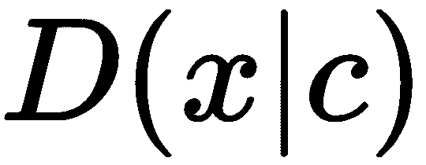
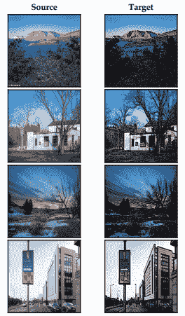

# 第九章：更多关于 GAN 的学习

我们学习了**生成对抗网络**（**GANs**）是什么，以及如何使用不同类型的 GAN 生成图像，参见第八章，*使用 GAN 生成图像*。

在本章中，我们将揭示各种有趣的不同类型的 GAN。我们已经了解到 GAN 可以用来生成新的图像，但我们无法控制它们生成的图像。例如，如果我们希望我们的 GAN 生成具有特定特征的人脸，我们如何向 GAN 传达这些信息？我们做不到，因为我们无法控制生成器生成的图像。

为了解决这个问题，我们使用一种称为**Conditional GAN**（**CGAN**）的新型 GAN，可以通过指定我们要生成的内容来条件化生成器和判别器。我们将从理解 CGAN 如何生成我们感兴趣的图像开始本章，然后学习如何使用**TensorFlow**实现 CGAN。

接着我们了解**InfoGANs**，这是 CGAN 的无监督版本。我们将了解 InfoGANs 是什么，它们与 CGAN 有何不同，以及如何使用 TensorFlow 实现它们来生成新的图像。

接下来，我们将学习关于**CycleGANs**的内容，这是一种非常有趣的 GAN 类型。它们试图学习从一个域中图像的分布到另一个域中图像的映射。例如，将灰度图像转换为彩色图像，我们训练 CycleGAN 学习灰度图像和彩色图像之间的映射，这意味着它们学会了从一个域映射到另一个域，最好的部分是，与其他架构不同，它们甚至不需要成对的数据集。我们将深入探讨它们如何学习这些映射以及它们的架构细节。我们将探索如何实现 CycleGAN 以将真实图片转换为绘画作品。

在本章结束时，我们将探索**StackGAN**，它可以将文本描述转换为逼真的图片。我们将通过深入理解其架构细节来理解 StackGAN 如何实现这一点。

在本章中，我们将学习以下内容：

+   Conditional GANs

+   使用 CGAN 生成特定数字

+   InfoGAN

+   InfoGAN 的架构

+   使用 TensorFlow 构建 InfoGAN

+   CycleGAN

+   使用 CycleGAN 将图片转换为绘画

+   StackGAN

# Conditional GANs

我们知道生成器通过学习真实数据分布生成新的图像，而鉴别器则检查生成器生成的图像是来自真实数据分布还是伪数据分布。

然而，生成器有能力通过学习真实数据分布生成新颖有趣的图像。我们无法控制或影响生成器生成的图像。例如，假设我们的生成器正在生成人脸图像；我们如何告诉生成器生成具有某些特征的人脸，比如大眼睛和尖鼻子？

我们不能！因为我们无法控制生成器生成的图像。

为了克服这一点，我们引入了 GAN 的一个小变体称为 **CGAN**，它对生成器和鉴别器都施加了一个条件。这个条件告诉 GAN 我们希望生成器生成什么样的图像。因此，我们的两个组件——鉴别器和生成器——都会根据这个条件进行操作。

让我们考虑一个简单的例子。假设我们正在使用 MNIST 数据集和 CGAN 生成手写数字。我们假设我们更专注于生成数字 7 而不是其他数字。现在，我们需要将这个条件强加给我们的生成器和鉴别器。我们如何做到这一点？

生成器以噪声  作为输入，并生成一幅图像。但除了  外，我们还传入了额外的输入，即 。这个  是一个独热编码的类标签。由于我们希望生成数字 7，我们将第七个索引设置为 1，其余索引设置为 0，即 [0,0,0,0,0,0,0,1,0,0]。

我们将潜在向量  和独热编码的条件变量  连接起来，并将其作为输入传递给生成器。然后，生成器开始生成数字 7。

鉴别器呢？我们知道鉴别器以图像  作为输入，并告诉我们图像是真实的还是伪造的。在 CGAN 中，我们希望鉴别器基于条件进行鉴别，这意味着它必须判断生成的图像是真实的数字 7 还是伪造的数字 7。因此，除了传入输入  外，我们还通过连接  和  将条件变量  传递给鉴别器。

正如您在以下图中所看到的，我们正在传入生成器  和 ：


生成器是基于 **** 引入的信息条件。类似地，除了将真实和伪造图像传递给鉴别器外，我们还向鉴别器传递了 。因此，生成器生成数字 7，而鉴别器学会区分真实的 7 和伪造的 7。

我们刚刚学习了如何使用 CGAN 生成特定数字，但是 CGAN 的应用并不仅限于此。假设我们需要生成具有特定宽度和高度的数字。我们也可以将这个条件加到，并让 GAN 生成任何期望的图像。

# CGAN 的损失函数

正如您可能已经注意到的那样，我们的普通 GAN 和 CGAN 之间没有太大区别，只是在 CGAN 中，我们将额外输入（即条件变量）与生成器和鉴别器的输入连接在一起。因此，生成器和鉴别器的损失函数与普通 GAN 相同，唯一的区别是它是有条件的。

因此，鉴别器的损失函数如下所示：


生成器的损失函数如下所示：


使用梯度下降最小化损失函数来学习 CGAN。

# 使用 CGAN 生成特定手写数字

我们刚刚学习了 CGAN 的工作原理和结构。为了加强我们的理解，现在我们将学习如何在 TensorFlow 中实现 CGAN，以生成特定手写数字的图像，比如数字 7。

首先，加载所需的库：

```py
import warnings
warnings.filterwarnings('ignore')

import numpy as np
import tensorflow as tf
from tensorflow.examples.tutorials.mnist import input_data
tf.logging.set_verbosity(tf.logging.ERROR)
tf.reset_default_graph()

import matplotlib.pyplot as plt
%matplotlib inline

from IPython import display
```

加载 MNIST 数据集：

```py
data = input_data.read_data_sets("data/mnist",one_hot=True)
```

# 定义生成器

生成器*G*接受噪声，，以及条件变量，，作为输入，并返回图像。我们将生成器定义为简单的两层前馈网络：

```py
def generator(z, c,reuse=False):
    with tf.variable_scope('generator', reuse=reuse):
```

初始化权重：

```py
            w_init = tf.contrib.layers.xavier_initializer()
```

连接噪声，，和条件变量，：

```py
            inputs = tf.concat([z, c], 1)
```

定义第一层：

```py
            dense1 = tf.layers.dense(inputs, 128, kernel_initializer=w_init)
            relu1 = tf.nn.relu(dense1)
```

定义第二层，并使用`tanh`激活函数计算输出：

```py
            logits = tf.layers.dense(relu1, 784, kernel_initializer=w_init)
            output = tf.nn.tanh(logits)

            return output
```

# 定义鉴别器

我们知道鉴别器，，返回概率；也就是说，它会告诉我们给定图像为真实图像的概率。除了输入图像，，它还将条件变量，，作为输入。我们将鉴别器定义为简单的两层前馈网络：

```py
def discriminator(x, c, reuse=False):
    with tf.variable_scope('discriminator', reuse=reuse):
```

初始化权重：

```py
            w_init = tf.contrib.layers.xavier_initializer()
```

连接输入， 和条件变量，：

```py
            inputs = tf.concat([x, c], 1)
```

定义第一层：

```py
            dense1 = tf.layers.dense(inputs, 128, kernel_initializer=w_init)
            relu1 = tf.nn.relu(dense1)
```

定义第二层，并使用`sigmoid`激活函数计算输出：

```py
             logits = tf.layers.dense(relu1, 1, kernel_initializer=w_init)
             output = tf.nn.sigmoid(logits)

             return output
```

定义输入占位符，，条件变量，，和噪声，：

```py
x = tf.placeholder(tf.float32, shape=(None, 784))
c = tf.placeholder(tf.float32, shape=(None, 10))
z = tf.placeholder(tf.float32, shape=(None, 100))
```

# 启动 GAN！

首先，我们将噪声， 和条件变量，，输入到生成器中，它将输出伪造的图像，即，：

```py
fake_x = generator(z, c)
```

现在我们将真实图像一同与条件变量，，输入到鉴别器， ，并得到它们是真实的概率：

```py
D_logits_real = discriminator(x,c)
```

类似地，我们将伪造的图像，`fake_x` 和条件变量，，输入到鉴别器， ，并得到它们是真实的概率：

```py
D_logits_fake = discriminator(fake_x, c, reuse=True)
```

# 计算损失函数

现在我们将看如何计算损失函数。它与普通 GAN 基本相同，只是我们添加了一个条件变量。

# 鉴别器损失

鉴别器损失如下所示：


首先，我们将实现第一项，即，：

```py
D_loss_real = tf.reduce_mean(tf.nn.sigmoid_cross_entropy_with_logits(logits=D_logits_real,
               labels=tf.ones_like(D_logits_real)))
```

现在我们将实现第二项，：

```py
D_loss_fake = tf.reduce_mean(tf.nn.sigmoid_cross_entropy_with_logits(logits=D_logits_fake,  
               labels=tf.zeros_like(D_logits_fake)))
```

最终损失可以写为：

```py
D_loss = D_loss_real + D_loss_fake
```

# 生成器损失

生成器损失如下所示：


生成器损失可以实现如下：

```py
G_loss = tf.reduce_mean(tf.nn.sigmoid_cross_entropy_with_logits(logits=D_logits_fake,
               labels=tf.ones_like(D_logits_fake)))
```

# 优化损失

我们需要优化我们的生成器和鉴别器。因此，我们将鉴别器和生成器的参数分别收集为`theta_D`和`theta_G`：

```py
training_vars = tf.trainable_variables()
theta_D = [var for var in training_vars if var.name.startswith('discriminator')]
theta_G = [var for var in training_vars if var.name.startswith('generator')]
```

使用 Adam 优化器优化损失：

```py
learning_rate = 0.001

D_optimizer = tf.train.AdamOptimizer(learning_rate, beta1=0.5).minimize(D_loss,         
                 var_list=theta_D)
G_optimizer = tf.train.AdamOptimizer(learning_rate, beta1=0.5).minimize(G_loss, 
                       var_list=theta_G)
```

# 开始训练 CGAN

开始 TensorFlow 会话并初始化变量：

```py
session = tf.InteractiveSession()
tf.global_variables_initializer().run()
```

定义`batch_size:`

```py
batch_size = 128
```

定义迭代次数和类别数：

```py
num_epochs = 500
num_classes = 10
```

定义图像和标签：

```py
images = (data.train.images)
labels = data.train.labels
```

# 生成手写数字 7

我们将要生成的数字（`标签`）设置为`7`：

```py
label_to_generate = 7
onehot = np.eye(10)
```

设置迭代次数：

```py
for epoch in range(num_epochs):

    for i in range(len(images) // batch_size):
```

基于批处理大小采样图像：

```py
        batch_image = images[i * batch_size:(i + 1) * batch_size]
```

随机采样条件，即我们要生成的数字：

```py
        batch_c = labels[i * batch_size:(i + 1) * batch_size]
```

采样噪声：

```py
        batch_noise = np.random.normal(0, 1, (batch_size, 100))
```

训练生成器并计算生成器损失：

```py
        generator_loss, _ = session.run([D_loss, D_optimizer], {x: batch_image, c: batch_c, z: batch_noise})    
```

训练鉴别器并计算鉴别器损失：

```py
        discriminator_loss, _ = session.run([G_loss, G_optimizer], {x: batch_image, c: batch_c, z: batch_noise})
```

随机采样噪声：

```py
    noise = np.random.rand(1,100)
```

选择我们想要生成的数字：

```py
    gen_label = np.array([[label_to_generate]]).reshape(-1)
```

将选择的数字转换为一个独热编码向量：

```py
    one_hot_targets = np.eye(num_classes)[gen_label]
```

将噪声和独热编码条件输入到生成器中并生成伪造图像：

```py
    _fake_x = session.run(fake_x, {z: noise, c: one_hot_targets})
    _fake_x = _fake_x.reshape(28,28)
```

打印生成器和鉴别器的损失并绘制生成器图像：

```py
    print("Epoch: {},Discriminator Loss:{}, Generator Loss: {}".format(epoch,discriminator_loss,generator_loss))

    #plot the generated image
    display.clear_output(wait=True)
    plt.imshow(_fake_x) 
    plt.show()
```

如下图所示，生成器现在已经学会生成数字 7，而不是随机生成其他数字：


# 理解 InfoGAN

InfoGAN 是 CGAN 的无监督版本。在 CGAN 中，我们学习如何条件生成器和判别器以生成我们想要的图像。但是当数据集中没有标签时，我们如何做到这一点？假设我们有一个没有标签的 MNIST 数据集，我们如何告诉生成器生成我们感兴趣的特定图像？由于数据集是无标签的，我们甚至不知道数据集中存在哪些类别。

我们知道生成器使用噪声*z*作为输入并生成图像。生成器在*z*中封装了关于图像的所有必要信息，这被称为**纠缠表示**。它基本上学习了*z*中图像的语义表示。如果我们能解开这个向量，我们就可以发现图像的有趣特征。

因此，我们将把*z*分为两部分：

+   常规噪声

+   代码*c*

什么是代码？代码*c*基本上是可解释的分离信息。假设我们有 MNIST 数据，那么代码*c1*暗示了数字标签，代码*c2*暗示了数字的宽度，*c3*暗示了数字的笔画，依此类推。我们用术语*c*来统称它们。

现在我们有*z*和*c*，我们如何学习有意义的代码*c*？我们能从生成器生成的图像学习有意义的代码吗？假设生成器生成了数字 7 的图像。现在我们可以说代码*c1*是 7，因为我们知道*c1*暗示了数字标签。

但由于代码可以意味着任何东西，比如标签、数字的宽度、笔画、旋转角度等等，我们如何学习我们想要的东西？代码*c*将根据先验选择进行学习。例如，如果我们为*c*选择了一个多项先验，那么我们的 InfoGAN 可能会为*c*分配一个数字标签。假设我们选择了一个高斯先验，那么它可能会分配一个旋转角度等等。我们也可以有多个先验。

先验*c*的分布可以是任何形式。InfoGAN 根据分布分配不同的属性。在 InfoGAN 中，代码*c*是根据生成器输出自动推断的，不像 CGAN 那样我们需要显式指定*c*。

简而言之，我们基于生成器输出推断，。但我们究竟是如何推断的呢？我们使用信息理论中的一个概念，称为**互信息**。

# 互信息

两个随机变量之间的互信息告诉我们可以通过一个随机变量获取另一个随机变量的信息量。两个随机变量*x*和*y*之间的互信息可以表示如下：


它基本上是*y*的熵与给定*x*的条件熵之间的差异。

代码  和生成器输出  之间的互信息告诉我们通过  我们可以获取多少关于  的信息。如果互信息 *c* 和  很高，那么我们可以说知道生成器输出有助于推断 *c*。但如果互信息很低，则无法从生成器输出推断 *c*。我们的目标是最大化互信息。

代码  和生成器输出  之间的互信息可以表示为：


让我们来看看公式的元素：

+    是代码的熵

+    是给定生成器输出  条件下代码 *c* 的条件熵。

但问题是，我们如何计算 ？因为要计算这个值，我们需要知道后验分布 ，而这是我们目前不知道的。因此，我们用辅助分布  来估计后验分布：


假设 ，那么我们可以推导出互信息如下：


因此，我们可以说：


最大化互信息， 基本上意味着我们在生成输出中最大化了关于 *c* 的知识，也就是通过另一个变量了解一个变量。

# InfoGAN 的架构

好的。这里到底发生了什么？为什么我们要这样做？简单地说，我们把输入分成了两部分：*z* 和 *c*。因为 *z* 和 *c* 都用于生成图像，它们捕捉了图像的语义含义。代码 *c* 给出了我们关于图像的可解释解耦信息。因此，我们试图在生成器输出中找到 *c*。然而，我们不能轻易地做到这一点，因为我们还不知道后验分布 ，所以我们使用辅助分布  来学习 *c*。

这个辅助分布基本上是另一个神经网络；让我们称这个网络为 *Q* 网络。*Q* 网络的作用是预测给定生成器图像 *x* 的代码 *c* 的可能性，表示为 。

首先，我们从先验分布 *p(c)* 中采样 *c*。然后，我们将 *c* 和 *z* 连接起来，并将它们输入生成器。接下来，我们将由生成器给出的结果  输入鉴别器。我们知道鉴别器的作用是输出给定图像为真实图像的概率。此外，*Q* 网络接收生成的图像，并返回给定生成图像的 *c* 的估计。

鉴别器 *D* 和 *Q* 网络都接受生成器图像并返回输出，因此它们共享一些层。由于它们共享一些层，我们将 *Q* 网络附加到鉴别器上，如下图所示：


因此，鉴别器返回两个输出：

+   图像为真实图像的概率

+   *c* 的估计，即给定生成器图像的 *c* 的概率

我们将互信息项添加到我们的损失函数中。

因此，鉴别器的损失函数定义为：


生成器的损失函数定义为：


这两个方程表明我们正在最小化 GAN 的损失，并同时最大化互信息。对 InfoGAN 还有疑惑？别担心！我们将通过在 TensorFlow 中逐步实现它们来更好地学习 InfoGAN。

# 在 TensorFlow 中构建 InfoGAN：

我们将通过在 TensorFlow 中逐步实现 InfoGAN 来更好地理解它们。我们将使用 MNIST 数据集，并学习 InfoGAN 如何基于生成器输出自动推断出代码 。我们构建一个 Info-DCGAN；即，在生成器和鉴别器中使用卷积层而不是简单的神经网络。

首先，我们将导入所有必要的库：

```py
import warnings
warnings.filterwarnings('ignore')

import numpy as np
import tensorflow as tf

from tensorflow.examples.tutorials.mnist import input_data
tf.logging.set_verbosity(tf.logging.ERROR)

import matplotlib.pyplot as plt
%matplotlib inline
```

加载 MNIST 数据集：

```py
data = input_data.read_data_sets("data/mnist",one_hot=True)
```

定义泄漏 ReLU 激活函数：

```py
def lrelu(X, leak=0.2):
    f1 = 0.5 * (1 + leak)
    f2 = 0.5 * (1 - leak)
    return f1 * X + f2 * tf.abs(X)
```

# 定义生成器：

生成器 ，它接受噪声  和变量  作为输入，并返回一个图像。与在生成器中使用全连接层不同，我们使用了一个反卷积网络，就像我们学习 DCGAN 时一样：

```py
def generator(c, z,reuse=None):
```

首先，连接噪声 *z* 和变量 ：

```py
    input_combined = tf.concat([c, z], axis=1)
```

定义第一层，这是一个包括批归一化和 ReLU 激活的全连接层：

```py
    fuly_connected1 = tf.layers.dense(input_combined, 1024)
    batch_norm1 = tf.layers.batch_normalization(fuly_connected1, training=is_train)
    relu1 = tf.nn.relu(batch_norm1)
```

定义第二层，它也是全连接层，包括批归一化和 ReLU 激活：

```py
    fully_connected2 = tf.layers.dense(relu1, 7 * 7 * 128)
    batch_norm2 = tf.layers.batch_normalization(fully_connected2, training=is_train)
    relu2 = tf.nn.relu(batch_norm2)
```

展平第二层的结果：

```py
    relu_flat = tf.reshape(relu2, [batch_size, 7, 7, 128])
```

第三层是**反卷积**，即转置卷积操作，紧随其后是批归一化和 ReLU 激活：

```py
    deconv1 = tf.layers.conv2d_transpose(relu_flat, 
                                          filters=64,
                                          kernel_size=4,
                                          strides=2,
                                          padding='same',
                                          activation=None)
    batch_norm3 = tf.layers.batch_normalization(deconv1, training=is_train)
    relu3 = tf.nn.relu(batch_norm3)
```

第四层是另一个转置卷积操作：

```py
    deconv2 = tf.layers.conv2d_transpose(relu3, 
                                          filters=1,
                                          kernel_size=4,
                                          strides=2,
                                          padding='same',
                                          activation=None)
```

对第四层的结果应用 sigmoid 函数并获得输出：

```py
    output = tf.nn.sigmoid(deconv2) 

    return output
```

# 定义鉴别器

我们学到鉴别器  和 *Q* 网络都接受生成器图像并返回输出，因此它们共享一些层。由于它们共享一些层，我们像在 InfoGAN 的架构中学到的那样，将 *Q* 网络附加到鉴别器上。在鉴别器中，我们使用卷积网络，而不是全连接层，正如我们在 DCGAN 的鉴别器中学到的：

```py
def discriminator(x,reuse=None):
```

定义第一层，执行卷积操作，随后是泄漏 ReLU 激活：

```py
    conv1 = tf.layers.conv2d(x, 
                             filters=64, 
                             kernel_size=4,
                             strides=2,
                             padding='same',
                             kernel_initializer=tf.contrib.layers.xavier_initializer(),
                             activation=None)
    lrelu1 = lrelu(conv1, 0.2)
```

在第二层中，我们还执行卷积操作，随后进行批归一化和泄漏 ReLU 激活：

```py
    conv2 = tf.layers.conv2d(lrelu1, 
                             filters=128,
                             kernel_size=4,
                             strides=2,
                             padding='same',
                             kernel_initializer=tf.contrib.layers.xavier_initializer(),
                             activation=None)
    batch_norm2 = tf.layers.batch_normalization(conv2, training=is_train)
    lrelu2 = lrelu(batch_norm2, 0.2)
```

展平第二层的结果：

```py
   lrelu2_flat = tf.reshape(lrelu2, [batch_size, -1])
```

将展平的结果馈送到全连接层，这是第三层，随后进行批归一化和泄漏 ReLU 激活：

```py
    full_connected = tf.layers.dense(lrelu2_flat, 
                          units=1024, 
                          activation=None)
    batch_norm_3 = tf.layers.batch_normalization(full_connected, training=is_train)
    lrelu3 = lrelu(batch_norm_3, 0.2)
```

计算鉴别器输出：

```py
    d_logits = tf.layers.dense(lrelu3, units=1, activation=None)
```

正如我们学到的，我们将 *Q* 网络附加到鉴别器。定义 *Q* 网络的第一层，它以鉴别器的最终层作为输入：

```py
    full_connected_2 = tf.layers.dense(lrelu3, 
                                     units=128, 
                                     activation=None)

    batch_norm_4 = tf.layers.batch_normalization(full_connected_2, training=is_train)
    lrelu4 = lrelu(batch_norm_4, 0.2)
```

定义 *Q* 网络的第二层：

```py
    q_net_latent = tf.layers.dense(lrelu4, 
                                    units=74, 
                                    activation=None)
```

估计 *c*：

```py
    q_latents_categoricals_raw = q_net_latent[:,0:10]

    c_estimates = tf.nn.softmax(q_latents_categoricals_raw, dim=1)
```

返回鉴别器 `logits` 和估计的 *c* 值作为输出：

```py
    return d_logits, c_estimates
```

# 定义输入占位符

现在我们为输入 、噪声  和代码  定义占位符：

```py
batch_size = 64
input_shape = [batch_size, 28,28,1]

x = tf.placeholder(tf.float32, input_shape)
z = tf.placeholder(tf.float32, [batch_size, 64])
c = tf.placeholder(tf.float32, [batch_size, 10])

is_train = tf.placeholder(tf.bool)
```

# 启动 GAN

首先，我们将噪声  和代码  提供给生成器，它将根据方程输出假图像 ：

```py
fake_x = generator(c, z)
```

现在我们将真实图像  提供给鉴别器 ，并得到图像为真实的概率。同时，我们还获得了对于真实图像的估计 ：

```py
D_logits_real, c_posterior_real = discriminator(x)
```

类似地，我们将假图像提供给鉴别器，并得到图像为真实的概率，以及对于假图像的估计 ：

```py
D_logits_fake, c_posterior_fake = discriminator(fake_x,reuse=True)
```

# 计算损失函数

现在我们将看到如何计算损失函数。

# 鉴别器损失

鉴别器损失如下：


作为 InfoGAN 的鉴别器损失与 CGAN 相同，实现鉴别器损失与我们在 CGAN 部分学到的相同：

```py
#real loss
D_loss_real = tf.reduce_mean(tf.nn.sigmoid_cross_entropy_with_logits(logits=D_logits_real, 
 labels=tf.ones(dtype=tf.float32, shape=[batch_size, 1])))

#fake loss
D_loss_fake = tf.reduce_mean(tf.nn.sigmoid_cross_entropy_with_logits(logits=D_logits_fake, 
 labels=tf.zeros(dtype=tf.float32, shape=[batch_size, 1])))

#final discriminator loss
D_loss = D_loss_real + D_loss_fake
```

# 生成器损失

生成器的损失函数如下所示：


生成器损失的实现为：

```py
G_loss = tf.reduce_mean(tf.nn.sigmoid_cross_entropy_with_logits(logits=D_logits_fake, 
 labels=tf.ones(dtype=tf.float32, shape=[batch_size, 1])))
```

# 互信息

我们从鉴别器和生成器的损失中减去**互信息**。因此，鉴别器和生成器的最终损失函数如下所示：


可以计算互信息如下：


首先，我们为  定义一个先验：

```py
c_prior = 0.10 * tf.ones(dtype=tf.float32, shape=[batch_size, 10])
```

当  给定时， 的熵表示为 。我们知道熵的计算如下所示：

```py
entropy_of_c = tf.reduce_mean(-tf.reduce_sum(c * tf.log(tf.clip_by_value(c_prior, 1e-12, 1.0)),axis=-1))
```

当给定  时， 的条件熵为 。条件熵的代码如下：

```py
log_q_c_given_x = tf.reduce_mean(tf.reduce_sum(c * tf.log(tf.clip_by_value(c_posterior_fake, 1e-12, 1.0)), axis=-1))
```

互信息表示为 ：

```py
mutual_information = entropy_of_c + log_q_c_given_x
```

鉴别器和生成器的最终损失如下所示：

```py
D_loss = D_loss - mutual_information
G_loss = G_loss - mutual_information
```

# 优化损失

现在我们需要优化我们的生成器和鉴别器。因此，我们收集鉴别器和生成器的参数分别为  和 ：

```py
training_vars = tf.trainable_variables()

theta_D = [var for var in training_vars if 'discriminator' in var.name]
theta_G = [var for var in training_vars if 'generator' in var.name]
```

使用 Adam 优化器优化损失：

```py
learning_rate = 0.001

D_optimizer = tf.train.AdamOptimizer(learning_rate).minimize(D_loss,var_list = theta_D)
G_optimizer = tf.train.AdamOptimizer(learning_rate).minimize(G_loss, var_list = theta_G)
```

# 开始训练

定义批量大小和轮数，并初始化所有 TensorFlow 变量：

```py
num_epochs = 100
session = tf.InteractiveSession()
session.run(tf.global_variables_initializer())
```

定义一个辅助函数来可视化结果：

```py
def plot(c, x):

    c_ = np.argmax(c, 1)

    sort_indices = np.argsort(c_, 0)

    x_reshape = np.reshape(x[sort_indices], [batch_size, 28, 28])

    x_reshape = np.reshape( np.expand_dims(x_reshape, axis=0), [4, (batch_size // 4), 28, 28])

    values = []

    for i in range(0,4):
        row = np.concatenate( [x_reshape[i,j,:,:] for j in range(0,(batch_size // 4))], axis=1)
        values.append(row)

    return np.concatenate(values, axis=0)
```

# 生成手写数字

开始训练并生成图像。每`100`次迭代，我们打印生成器生成的图像：

```py
onehot = np.eye(10)

for epoch in range(num_epochs):

    for i in range(0, data.train.num_examples // batch_size):
```

样本图像：

```py
        x_batch, _ = data.train.next_batch(batch_size)
        x_batch = np.reshape(x_batch, (batch_size, 28, 28, 1))
```

样本值 *c*：

```py
        c_ = np.random.randint(low=0, high=10, size=(batch_size,))
        c_one_hot = onehot[c_]
```

样本噪声 *z*：

```py
        z_batch = np.random.uniform(low=-1.0, high=1.0, size=(batch_size,64))
```

优化生成器和鉴别器的损失：

```py
        feed_dict={x: x_batch, c: c_one_hot, z: z_batch, is_train: True}

        _ = session.run(D_optimizer, feed_dict=feed_dict)
        _ = session.run(G_optimizer, feed_dict=feed_dict)
```

每 100^(th) 次迭代打印生成器图像：

```py

        if i % 100 == 0:

            discriminator_loss = D_loss.eval(feed_dict)
            generator_loss = G_loss.eval(feed_dict)

            _fake_x = fake_x.eval(feed_dict)

            print("Epoch: {}, iteration: {}, Discriminator Loss:{}, Generator Loss: {}".format(epoch,i,discriminator_loss,generator_loss))
            plt.imshow(plot(c_one_hot, _fake_x))
            plt.show() 
```

我们可以看到生成器在每次迭代中是如何发展和生成更好的数字的：


# 使用 CycleGAN 翻译图像

我们已经学习了几种类型的 GAN，并且它们的应用是无穷无尽的。我们已经看到生成器如何学习真实数据的分布并生成新的逼真样本。现在我们将看到一个非常不同且非常创新的 GAN 类型，称为**CycleGAN**。

不像其他 GAN，CycleGAN 将数据从一个域映射到另一个域，这意味着这里我们试图学习从一个域的图像分布到另一个域的图像分布的映射。简单地说，我们将图像从一个域翻译到另一个域。

这意味着什么？假设我们想要将灰度图像转换为彩色图像。灰度图像是一个域，彩色图像是另一个域。CycleGAN 学习这两个域之间的映射并在它们之间进行转换。这意味着给定一个灰度图像，CycleGAN 将其转换为彩色图像。

CycleGAN 的应用非常广泛，例如将真实照片转换为艺术图片、季节转换、照片增强等。如下图所示，您可以看到 CycleGAN 如何在不同域之间转换图像：


但 CycleGAN 有什么特别之处？它们能够在没有配对示例的情况下将图像从一个域转换到另一个域。假设我们要将照片（源）转换为绘画（目标）。在普通的图像到图像的转换中，我们如何做到这一点？我们通过收集一些照片及其对应的绘画，如下图所示，准备训练数据：



收集每个用例的这些配对数据点是一项昂贵的任务，我们可能没有太多记录或配对。这就是 CycleGAN 的最大优势所在。它不需要对齐的数据对。要将照片转换为绘画，我们只需一堆照片和一堆绘画。它们不需要进行映射或对齐。

如下图所示，我们有一些照片在一列，一些绘画在另一列；您可以看到它们并不互相配对。它们是完全不同的图像：


因此，要将图像从任何源域转换为目标域，我们只需一堆这两个域中的图像，而它们不需要成对。现在让我们看看它们是如何工作以及它们如何学习源与目标域之间的映射。

与其他生成对抗网络（GAN）不同，CycleGAN 包含两个生成器和两个判别器。我们用来代表源域中的图像，用来代表目标域中的图像。我们需要学习到的映射关系。

假设我们要学习将真实图片转换为绘画，如下图所示：


# 生成器的角色

我们有两个生成器，和。的作用是学习从到的映射。如上所述，的作用是学习将照片转换为绘画，如下图所示：


它试图生成一个虚假的目标图像，这意味着它将一个源图像，，作为输入，并生成一个虚假的目标图像，：


生成器的角色，，是学习从到的映射，并学会将绘画转化为真实图片，如下图所示：


它试图生成一个虚假的源图像，这意味着它将一个目标图像，，作为输入，并生成一个虚假的源图像，：


# 判别器的角色

与生成器类似，我们有两个判别器，和。判别器的角色是区分真实源图像和假源图像。我们知道假源图像是由生成器生成的。

给定一个图像给判别器，它返回图像为真实源图像的概率：


以下图显示了判别器，您可以观察到它将真实源图像 x 和生成器 F 生成的假源图像作为输入，并返回图像为真实源图像的概率：


判别器的角色是区分真实目标图像和假目标图像。我们知道假目标图像是由生成器生成的。给定一个图像给判别器，它返回图像为真实目标图像的概率：


以下图显示了判别器，您可以观察到它将真实目标图像和生成器生成的假目标图像作为输入，并返回图像为真实目标图像的概率：


# 损失函数

在 CycleGAN 中，我们有两个生成器和两个鉴别器。生成器学习将图像从一个域转换到另一个域，鉴别器试图区分转换后的图像。

因此，我们可以说鉴别器的损失函数  可以表示如下：


同样地，鉴别器  的损失函数可以表示如下：


生成器  的损失函数可以表示如下：


生成器  的损失函数可以表示如下：


总之，最终损失可以写成如下形式：


# 循环一致性损失

仅仅通过对抗损失并不能确保图像的正确映射。例如，生成器可以将源域中的图像映射到目标域中图像的随机排列，这可能匹配目标分布。

因此，为了避免这种情况，我们引入了一种额外的损失，称为**循环一致性损失**。它强制生成器 *G* 和 *F* 都是循环一致的。

让我们回顾一下生成器的功能：

+   **生成器 *G***：将 *x* 转换为 *y*

+   **生成器 *F***：将 *y* 转换为 *x*

我们知道生成器 *G* 接受源图像 *x* 并将其转换为虚假的目标图像 *y*。现在，如果我们将这个生成的虚假目标图像 *y* 输入生成器 *F*，它应该返回原始的源图像 *x*。有点混乱，对吧？

看看下面的图示；我们有一个源图像 *x*。首先，我们将这个图像输入生成器 *G*，它会返回一个虚假的目标图像 *y*。现在我们将这个虚假的目标图像 *y* 输入到生成器 *F*，它应该返回原始的源图像：


上述方程可以表示如下：


这被称为**前向一致性损失**，可以表示如下：


类似地，我们可以指定后向一致性损失，如下图所示。假设我们有一个原始的目标图像 *y*。我们将这个 *y* 输入鉴别器 *F*，它返回一个虚假的源图像 *x*。现在我们将这个生成的虚假源图像 *x* 输入生成器 *G*，它应该返回原始的目标图像 *y*：


前述方程可以表示为：


后向一致性损失可以表示如下：


因此，结合反向和正向一致性损失，我们可以将循环一致性损失写成：


我们希望我们的生成器保持循环一致，因此，我们将它们的损失与循环一致性损失相乘。因此，最终损失函数可以表示为：


# 使用 CycleGAN 将照片转换为绘画作品

现在我们将学习如何在 TensorFlow 中实现 CycleGAN。我们将看到如何使用 CycleGAN 将图片转换为绘画作品：


本节使用的数据集可以从 [`people.eecs.berkeley.edu/~taesung_park/CycleGAN/datasets/monet2photo.zip`](https://people.eecs.berkeley.edu/~taesung_park/CycleGAN/datasets/monet2photo.zip) 下载。下载数据集后，请解压缩存档；它包括四个文件夹，`trainA`、`trainB`、`testA` 和 `testB`，其中包含训练和测试图像。

`trainA` 文件夹包含绘画作品（莫奈），而 `trainB` 文件夹包含照片。由于我们将照片 (*x*) 映射到绘画作品 (*y*)，所以 `trainB` 文件夹中的照片将作为我们的源图像，，而包含绘画作品的 `trainA` 将作为目标图像，。

CycleGAN 的完整代码及其逐步说明可作为 Jupyter Notebook 在 [`github.com/PacktPublishing/Hands-On-Deep-Learning-Algorithms-with-Python`](https://github.com/PacktPublishing/Hands-On-Deep-Learning-Algorithms-with-Python) 中找到。

而不是查看整段代码，我们只会看 TensorFlow 中如何实现 CycleGAN 并将源图像映射到目标领域。您也可以在 [`github.com/PacktPublishing/Hands-On-Deep-Learning-Algorithms-with-Python`](https://github.com/PacktPublishing/Hands-On-Deep-Learning-Algorithms-with-Python) 查看完整的代码。

定义 `CycleGAN` 类：

```py
class CycleGAN:
        def __init__(self):
```

定义输入占位符 `X` 和输出占位符 `Y`：

```py
        self.X = tf.placeholder("float", shape=[batchsize, image_height, image_width, 3])
        self.Y = tf.placeholder("float", shape=[batchsize, image_height, image_width, 3])
```

定义生成器，，将  映射到 ：

```py
        G = generator("G")
```

定义生成器，，将  映射到 ：

```py
        F = generator("F")
```

定义辨别器，，用于区分真实源图像和虚假源图像：

```py
         self.Dx = discriminator("Dx")       
```

定义辨别器，，用于区分真实目标图像和虚假目标图像：

```py
        self.Dy = discriminator("Dy")
```

生成虚假源图像：

```py
        self.fake_X = F(self.Y)
```

生成虚假目标图像：

```py
        self.fake_Y = G(self.X)        
```

获取 `logits`：

```py
        #real source image logits
        self.Dx_logits_real = self.Dx(self.X) 

        #fake source image logits
        self.Dx_logits_fake = self.Dx(self.fake_X, True)

        #real target image logits
        self.Dy_logits_fake = self.Dy(self.fake_Y, True)

        #fake target image logits
        self.Dy_logits_real = self.Dy(self.Y)
```

我们知道循环一致性损失如下所示：


我们可以如下实现循环一致性损失：

```py
        self.cycle_loss = tf.reduce_mean(tf.abs(F(self.fake_Y, True) - self.X)) + \
                        tf.reduce_mean(tf.abs(G(self.fake_X, True) - self.Y))
```

定义我们两个鉴别器的损失， 和 。

我们可以如下重写带有 Wasserstein 距离的鉴别器损失函数：


因此，两个鉴别器的损失如下实现：

```py
        self.Dx_loss = -tf.reduce_mean(self.Dx_logits_real) + tf.reduce_mean(self.Dx_logits_fake) 

        self.Dy_loss = -tf.reduce_mean(self.Dy_logits_real) + tf.reduce_mean(self.Dy_logits_fake)
```

定义我们两个生成器的损失， 和 。我们可以如下重写带有 Wasserstein 距离的生成器损失函数：


因此，两个生成器的损失乘以循环一致性损失`cycle_loss`如下实现：

```py
        self.G_loss = -tf.reduce_mean(self.Dy_logits_fake) + 10\. * self.cycle_loss

        self.F_loss = -tf.reduce_mean(self.Dx_logits_fake) + 10\. * self.cycle_loss
```

使用 Adam 优化器优化鉴别器和生成器：

```py
       #optimize the discriminator
        self.Dx_optimizer = tf.train.AdamOptimizer(2e-4, beta1=0., beta2=0.9).minimize(self.Dx_loss, var_list=[self.Dx.var])

        self.Dy_optimizer = tf.train.AdamOptimizer(2e-4, beta1=0., beta2=0.9).minimize(self.Dy_loss, var_list=[self.Dy.var])

        #optimize the generator
        self.G_optimizer = tf.train.AdamOptimizer(2e-4, beta1=0., beta2=0.9).minimize(self.G_loss, var_list=[G.var])

        self.F_optimizer = tf.train.AdamOptimizer(2e-4, beta1=0., beta2=0.9).minimize(self.F_loss, var_list=[F.var])
```

一旦我们开始训练模型，我们可以看到鉴别器和生成器的损失随迭代次数而减小：

```py
Epoch: 0, iteration: 0, Dx Loss: -0.6229429245, Dy Loss: -2.42867970467, G Loss: 1385.33557129, F Loss: 1383.81530762, Cycle Loss: 138.448059082

Epoch: 0, iteration: 50, Dx Loss: -6.46077537537, Dy Loss: -7.29514217377, G Loss: 629.768066406, F Loss: 615.080932617, Cycle Loss: 62.6807098389

Epoch: 1, iteration: 100, Dx Loss: -16.5891685486, Dy Loss: -16.0576553345, G Loss: 645.53137207, F Loss: 649.854919434, Cycle Loss: 63.9096908569
```

# StackGAN

现在我们将看到一种最引人入胜和迷人的 GAN 类型，称为**StackGAN**。你能相信如果我说 StackGANs 可以根据文本描述生成逼真的图像吗？是的，他们可以。给定一个文本描述，他们可以生成一个逼真的图像。

让我们首先了解艺术家如何画出一幅图像。在第一阶段，艺术家绘制原始形状，创建图像的基本轮廓，形成图像的初始版本。在接下来的阶段，他们通过使图像更真实和吸引人来增强图像。

StackGANs 以类似的方式工作。它们将生成图像的过程分为两个阶段。就像艺术家画图一样，在第一阶段，他们生成基础轮廓、原始形状，并创建图像的低分辨率版本；在第二阶段，他们通过使图像更真实和吸引人来增强第一阶段生成的图像，并将其转换为高分辨率图像。

但是 StackGANs 是如何做到的呢？

他们使用两个 GAN，每个阶段一个。第一阶段的 GAN 生成基础图像，并将其发送到下一阶段的 GAN，后者将基础低分辨率图像转换为合适的高分辨率图像。下图显示了 StackGANs 如何基于文本描述在每个阶段生成图像：


来源：https://arxiv.org/pdf/1612.03242.pdf

正如你所见，在第一阶段，我们有图像的低分辨率版本，但在第二阶段，我们有清晰的高分辨率图像。但是，StackGAN 是如何做到的呢？记住，当我们用条件 GAN 学习时，我们可以通过条件化使我们的 GAN 生成我们想要的图像。

我们在两个阶段都使用它们。在第一阶段，我们的网络基于文本描述进行条件设定。根据这些文本描述，它们生成图像的基本版本。在第二阶段，我们的网络基于从第一阶段生成的图像和文本描述进行条件设定。

但为什么我们在第二阶段又必须要基于文本描述进行条件设定呢？因为在第一阶段，我们错过了文本描述中指定的一些细节，只创建了图像的基本版本。所以，在第二阶段，我们再次基于文本描述进行条件设定，修复缺失的信息，并且使我们的图像更加真实。

凭借这种仅基于文本生成图片的能力，它被广泛应用于许多应用场景。尤其在娱乐行业中大量使用，例如根据描述创建帧，还可以用于生成漫画等等。

# StackGAN 的架构

现在我们对 StackGAN 的工作原理有了基本的了解，我们将更详细地查看它们的架构，看看它们如何从文本生成图片。

StackGAN 的完整架构如下图所示：


来源：https://arxiv.org/pdf/1612.03242.pdf

我们将逐个查看每个组件。

# 条件增强

我们将文本描述作为 GAN 的输入。基于这些描述，它必须生成图像。但它们如何理解文本的含义以生成图片呢？

首先，我们使用编码器将文本转换为嵌入。我们用  表示这个文本嵌入。我们能够创建  的变化吗？通过创建文本嵌入的变化，我们可以获得额外的训练对，并增加对小扰动的鲁棒性。

让  表示均值， 表示我们文本嵌入的对角协方差矩阵，。现在我们从独立的高斯分布中随机采样一个额外的条件变量，，帮助我们创建具有其含义的文本描述的变化。我们知道同样的文本可以用多种方式书写，因此通过条件变量 ，我们可以得到映射到图像的文本的各种版本。

因此，一旦我们有了文本描述，我们将使用编码器提取它们的嵌入，然后计算它们的均值和协方差。然后，我们从文本嵌入的高斯分布中采样 。

# 第一阶段

现在，我们有一个文本嵌入，，以及一个条件变量，。我们将看看它是如何被用来生成图像的基本版本。

# 生成器

生成器的目标是通过学习真实数据分布来生成虚假图像。首先，我们从高斯分布中采样噪声并创建*z*。然后，我们将*z*与我们的条件变量，，连接起来，并将其作为输入提供给生成器，生成图像的基本版本。

生成器的损失函数如下：


让我们来看一下这个公式：

+   表示我们从虚假数据分布中采样*z*，也就是先验噪声。

+   表示我们从真实数据分布中采样文本描述，。

+   表示生成器接受噪声和条件变量返回图像。我们将这个生成的图像馈送给鉴别器。

+   表示生成的图像为虚假的对数概率。

除了这个损失之外，我们还向损失函数中添加了一个正则化项，，这意味着标准高斯分布和条件高斯分布之间的 KL 散度。这有助于我们避免过拟合。

因此，生成器的最终损失函数如下：


# 鉴别器

现在我们将这个生成的图像馈送给鉴别器，它返回图像为真实的概率。鉴别器的损失如下：


在这里：

+   表示真实图像，，条件于文本描述，

+   表示生成的虚假图像

# 第二阶段

我们已经学习了第一阶段如何生成图像的基本版本。现在，在第二阶段，我们修复了第一阶段生成的图像的缺陷，并生成了更真实的图像版本。我们用来条件化网络的图像来自前一个阶段生成的图像，还有文本嵌入。

# 生成器

在第二阶段，生成器不再接受噪声作为输入，而是接受从前一阶段生成的图像作为输入，并且以文本描述作为条件。

这里， 意味着我们从阶段 I 生成的图像进行采样。

 意味着我们从给定的真实数据分布  中抽样文本。

随后，生成器的损失可以如下给出：


除了正则化器外，生成器的损失函数为：


# 鉴别器

判别器的目标是告诉我们图像来自真实分布还是生成器分布。因此，判别器的损失函数如下：


# 摘要

我们从学习条件 GAN 开始这一章，了解了它们如何用于生成我们感兴趣的图像。

后来，我们学习了 InfoGAN，其中代码 *c* 是根据生成的输出自动推断的，不像 CGAN 那样我们需要显式指定 *c*。要推断 *c*，我们需要找到后验分布 ，而我们无法访问它。因此，我们使用辅助分布。我们使用互信息来最大化 ，以增强对 *c* 在给定生成器输出的知识。

接着，我们学习了 CycleGAN，它将数据从一个域映射到另一个域。我们尝试学习将照片域图像分布映射到绘画域图像分布的映射关系。最后，我们了解了 StackGANs 如何从文本描述生成逼真的图像。

在下一章中，我们将学习**自编码器**及其类型。

# 问题

回答以下问题，以评估你从本章学到了多少内容：

1.  条件 GAN 和普通 GAN 有何不同？

1.  InfoGAN 中的代码称为什么？

1.  什么是互信息？

1.  为什么 InfoGAN 需要辅助分布？

1.  什么是循环一致性损失？

1.  解释 CycleGAN 中生成器的作用。

1.  StackGANs 如何将文本描述转换为图片？

# 进一步阅读

更多信息，请参考以下链接：

+   *条件生成对抗网络*，作者为 Mehdi Mirza 和 Simon Osindero，[`arxiv.org/pdf/1411.1784.pdf`](https://arxiv.org/pdf/1411.1784.pdf)

+   *InfoGAN: 通过最大化信息的生成对抗网络进行可解释表示学习*，作者为陈希等人，[`arxiv.org/pdf/1606.03657.pdf`](https://arxiv.org/pdf/1606.03657.pdf)

+   *利用循环一致性对抗网络进行非配对图像到图像翻译*，作者为朱俊彦等人，[`arxiv.org/pdf/1703.10593.pdf`](https://arxiv.org/pdf/1703.10593.pdf)
