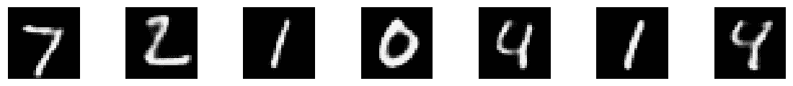
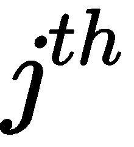
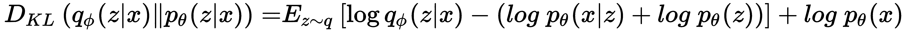

# 第十章：使用自编码器重建输入

**自编码器**是一种无监督学习算法。与其他算法不同，自编码器学习重建输入，即自编码器接收输入并学习将其重现为输出。我们从理解什么是自编码器及其如何重建输入开始这一章节。然后，我们将学习自编码器如何重建 MNIST 图像。

接下来，我们将了解自编码器的不同变体；首先，我们将学习使用卷积层的**卷积自编码器**（**CAEs**）；然后，我们将学习**去噪自编码器**（**DAEs**），它们学习如何去除输入中的噪音。之后，我们将了解稀疏自编码器及其如何从稀疏输入中学习。在本章末尾，我们将学习一种有趣的生成型自编码器，称为**变分自编码器**。我们将理解变分自编码器如何学习生成新的输入及其与其他自编码器的不同之处。

在本章中，我们将涵盖以下主题：

+   自编码器及其架构

+   使用自编码器重建 MNIST 图像

+   卷积自编码器

+   构建卷积自编码器

+   降噪自编码器

+   使用降噪自编码器去除图像中的噪音

+   稀疏自编码器

+   紧束缚自编码器

+   变分自编码器

# 什么是自编码器？

**自编码器**是一种有趣的无监督学习算法。与其他神经网络不同，自编码器的目标是重建给定的输入；即自编码器的输出与输入相同。它由称为**编码器**和**解码器**的两个重要组件组成。

编码器的作用是通过学习输入的潜在表示来编码输入，解码器的作用是从编码器生成的潜在表示中重建输入。潜在表示也称为**瓶颈**或**编码**。如下图所示，将图像作为输入传递给自编码器。编码器获取图像并学习图像的潜在表示。解码器获取潜在表示并尝试重建图像：


下图显示了一个简单的双层香草自编码器；正如您可能注意到的，它由输入层、隐藏层和输出层组成。首先，我们将输入馈送到输入层，然后编码器学习输入的表示并将其映射到瓶颈。从瓶颈处，解码器重建输入：


我们可能会想知道这的用途是什么。为什么我们需要编码和解码输入？为什么我们只需重建输入？嗯，有各种应用，如降维、数据压缩、图像去噪等。

由于自编码器重构输入，输入层和输出层中的节点数始终相同。假设我们有一个包含 100 个输入特征的数据集，我们有一个神经网络，其输入层有 100 个单元，隐藏层有 50 个单元，输出层有 100 个单元。当我们将数据集输入到自编码器中时，编码器尝试学习数据集中的重要特征，并将特征数减少到 50 并形成瓶颈。瓶颈保存数据的表示，即数据的嵌入，并仅包含必要信息。然后，将瓶颈输入到解码器中以重构原始输入。如果解码器成功地重构了原始输入，那么说明编码器成功地学习了给定输入的编码或表示。也就是说，编码器成功地将包含 100 个特征的数据集编码成仅包含 50 个特征的表示，通过捕获必要信息。

因此，编码器本质上尝试学习如何在不丢失有用信息的情况下减少数据的维度。我们可以将自编码器视为类似于**主成分分析**（**PCA**）的降维技术。在 PCA 中，我们通过线性变换将数据投影到低维，并去除不需要的特征。PCA 和自编码器的区别在于 PCA 使用线性变换进行降维，而自编码器使用非线性变换。

除了降维之外，自编码器还广泛用于去噪图像、音频等中的噪声。我们知道自编码器中的编码器通过仅学习必要信息并形成瓶颈或代码来减少数据集的维度。因此，当噪声图像作为自编码器的输入时，编码器仅学习图像的必要信息并形成瓶颈。由于编码器仅学习表示图像的重要和必要信息，它学习到噪声是不需要的信息并从瓶颈中移除噪声的表示。

因此，现在我们将会有一个瓶颈，也就是说，一个没有任何噪声信息的图像的表示。当编码器学习到这个被称为瓶颈的编码表示时，将其输入到解码器中，解码器会从编码器生成的编码中重建输入图像。由于编码没有噪声，重建的图像将不包含任何噪声。

简而言之，自编码器将我们的高维数据映射到一个低级表示。这种数据的低级表示被称为**潜在表示**或**瓶颈**，只包含代表输入的有意义和重要特征。

由于我们的自编码器的角色是重建其输入，我们使用重构误差作为我们的损失函数，这意味着我们试图了解解码器正确重构输入的程度。因此，我们可以使用均方误差损失作为我们的损失函数来量化自编码器的性能。

现在我们已经了解了什么是自编码器，我们将在下一节探讨自编码器的架构。

# 理解自编码器的架构

正如我们刚刚学到的，自编码器由两个重要组件组成：编码器  和解码器 。让我们仔细看看它们各自的作用：

+   **编码器**：编码器  学习输入并返回输入的潜在表示。假设我们有一个输入，。当我们将输入馈送给编码器时，它返回输入的低维潜在表示，称为编码或瓶颈，。我们用  表示编码器的参数：


+   **解码器**：解码器  尝试使用编码器的输出，即编码  作为输入来重建原始输入 。重建图像由  表示。我们用  表示解码器的参数：


我们需要学习编码器和解码器的优化参数，分别表示为  和 ，以便我们可以最小化重构损失。我们可以定义我们的损失函数为实际输入与重构输入之间的均方误差：


这里， 是训练样本的数量。

当潜在表示的维度小于输入时，这被称为**欠完备自编码器**。由于维度较小，欠完备自编码器试图学习和保留输入的仅有的有用和重要特征，并去除其余部分。当潜在表示的维度大于或等于输入时，自编码器将只是复制输入而不学习任何有用的特征，这种类型的自编码器称为**过完备自编码器**。

下图显示了欠完备和过完备自编码器。欠完备自编码器在隐藏层（`code`）中的神经元少于输入层中的单元数；而在过完备自编码器中，隐藏层（`code`）中的神经元数大于输入层中的单元数：


因此，通过限制隐藏层（`code`）中的神经元，我们可以学习输入的有用表示。自编码器也可以有任意数量的隐藏层。具有多个隐藏层的自编码器称为**多层自编码器**或**深层自编码器**。到目前为止，我们所学到的只是**普通**或**浅层自编码器**。

# 使用自编码器重构 MNIST 图像

现在我们将学习如何使用 MNIST 数据集重构手写数字的自编码器。首先，让我们导入必要的库：

```py
import warnings
warnings.filterwarnings('ignore')

import numpy as np
import tensorflow as tf

from tensorflow.keras.models import Model
from tensorflow.keras.layers import Input, Dense
tf.logging.set_verbosity(tf.logging.ERROR)

#plotting
import matplotlib.pyplot as plt
%matplotlib inline

#dataset
from tensorflow.keras.datasets import mnist
```

# 准备数据集

让我们加载 MNIST 数据集。由于我们正在重建给定的输入，所以不需要标签。因此，我们只加载 `x_train` 用于训练和 `x_test` 用于测试：

```py
(x_train, _), (x_test, _) = mnist.load_data()
```

通过除以最大像素值 `255` 来对数据进行归一化：

```py
x_train = x_train.astype('float32') / 255
x_test = x_test.astype('float32') / 255
```

打印我们数据集的 `shape`：

```py
print(x_train.shape, x_test.shape)

((60000, 28, 28), (10000, 28, 28))
```

将图像重塑为二维数组：

```py
x_train = x_train.reshape((len(x_train), np.prod(x_train.shape[1:])))
x_test = x_test.reshape((len(x_test), np.prod(x_test.shape[1:])))
```

现在，数据的形状将变为如下所示：

```py
print(x_train.shape, x_test.shape)

((60000, 784), (10000, 784))
```

# 定义编码器

现在我们定义编码器层，它将图像作为输入并返回编码。

定义编码的大小：

```py
encoding_dim = 32
```

定义输入的占位符：

```py
input_image = Input(shape=(784,))
```

定义编码器，它接受 `input_image` 并返回编码：

```py
encoder  = Dense(encoding_dim, activation='relu')(input_image)
```

# 定义解码器

让我们定义解码器，它从编码器中获取编码值并返回重构的图像：

```py
decoder = Dense(784, activation='sigmoid')(encoder)
```

# 构建模型

现在我们定义了编码器和解码器，我们定义一个模型，该模型接受图像作为输入，并返回解码器的输出，即重构图像：

```py
model = Model(inputs=input_image, outputs=decoder)
```

让我们看看模型的摘要：

```py
model.summary()

________________________________________________________________
Layer (type)                Output Shape              Param #   
=================================================================
input_1 (InputLayer)         (None, 784)               0         
_________________________________________________________________
dense (Dense)                (None, 32)                25120     
_________________________________________________________________
dense_1 (Dense)              (None, 784)               25872     
=================================================================
Total params: 50,992
Trainable params: 50,992
Non-trainable params: 0
_________________________________________________________________
```

使用二元交叉熵作为损失编译模型，并使用 `adadelta` 优化器最小化损失：

```py
model.compile(optimizer='adadelta', loss='binary_crossentropy')
```

现在让我们训练模型。

通常，我们按 `model.fit(x,y)` 训练模型，其中 `x` 是输入，`y` 是标签。但由于自编码器重构它们的输入，模型的输入和输出应该相同。因此，在这里，我们按 `model.fit(x_train, x_train)` 训练模型：

```py
model.fit(x_train, x_train, epochs=50, batch_size=256, shuffle=True, validation_data=(x_test, x_test))
```

# 重构图像

现在我们已经训练了模型，我们看看模型如何重构测试集的图像。将测试图像输入模型并获取重构的图像：

```py
reconstructed_images = model.predict(x_test)
```

# 绘制重构图像

首先，让我们绘制实际图像，即输入图像：

```py
n = 7
plt.figure(figsize=(20, 4))
for i in range(n):

    ax = plt.subplot(1, n, i+1)
    plt.imshow(x_test[i].reshape(28, 28))
    plt.gray()
    ax.get_xaxis().set_visible(False)
    ax.get_yaxis().set_visible(False)
plt.show() 
```

实际图像的绘制如下所示：


绘制重构图像如下所示：

```py
n = 7
plt.figure(figsize=(20, 4))
for i in range(n):
    ax = plt.subplot(2, n, i + n + 1)
    plt.imshow(reconstructed_images[i].reshape(28, 28))
    plt.gray()
    ax.get_xaxis().set_visible(False)
    ax.get_yaxis().set_visible(False)

plt.show() 
```

以下显示了重构后的图像：


如您所见，自编码器已经学习了输入图像的更好表示并对其进行了重构。

# 使用卷积的自编码器

我们刚刚在前一节学习了什么是自编码器。我们了解了传统自编码器，它基本上是具有一个隐藏层的前馈浅网络。我们可以不将它们保持为前馈网络，而是可以将它们作为卷积网络使用吗？由于我们知道卷积网络在分类和识别图像方面表现良好（前提是在自编码器中使用卷积层而不是前馈层），当输入是图像时，它将学习更好地重建输入。

因此，我们介绍一种新类型的自编码器称为 CAE，它使用卷积网络而不是传统的神经网络。在传统的自编码器中，编码器和解码器基本上是一个前馈网络。但在 CAE 中，它们基本上是卷积网络。这意味着编码器由卷积层组成，解码器由转置卷积层组成，而不是前馈网络。CAE 如下图所示：


如图所示，我们将输入图像提供给编码器，编码器由卷积层组成，卷积层执行卷积操作并从图像中提取重要特征。然后我们执行最大池化以仅保留图像的重要特征。以类似的方式，我们执行多个卷积和最大池化操作，并获得图像的潜在表示，称为**瓶颈**。

接下来，我们将瓶颈输入解码器，解码器由反卷积层组成，反卷积层执行反卷积操作并试图从瓶颈中重建图像。它包括多个反卷积和上采样操作以重建原始图像。

因此，这就是 CAE 如何在编码器中使用卷积层和在解码器中使用转置卷积层来重建图像的方法。

# 构建卷积自编码器

就像我们在前一节学习如何实现自编码器一样，实现 CAE 也是一样的，唯一的区别是这里我们在编码器和解码器中使用卷积层，而不是前馈网络。我们将使用相同的 MNIST 数据集来使用 CAE 重建图像。

导入库：

```py
import warnings
warnings.filterwarnings('ignore')

#modelling
from tensorflow.keras.models import Model
from tensorflow.keras.layers import Input, Dense, Conv2D, MaxPooling2D, UpSampling2D
from tensorflow.keras import backend as K

#plotting
import matplotlib.pyplot as plt
%matplotlib inline

#dataset
from keras.datasets import mnist
import numpy as np
```

读取并重塑数据集：

```py
(x_train, _), (x_test, _) = mnist.load_data()

# Normalize the dataset

x_train = x_train.astype('float32') / 255.
x_test = x_test.astype('float32') / 255.

# reshape

x_train = np.reshape(x_train, (len(x_train), 28, 28, 1)) 
x_test = np.reshape(x_test, (len(x_test), 28, 28, 1)) 
```

让我们定义我们输入图像的形状：

```py
input_image = Input(shape=(28, 28, 1))  
```

# 定义编码器

现在，让我们定义我们的编码器。与传统自编码器不同，在这里我们使用卷积网络而不是前馈网络。因此，我们的编码器包括三个卷积层，后跟具有`relu`激活函数的最大池化层。

定义第一个卷积层，然后进行最大池化操作：

```py
x = Conv2D(16, (3, 3), activation='relu', padding='same')(input_image)
x = MaxPooling2D((2, 2), padding='same')(x)
```

定义第二个卷积和最大池化层：

```py
x = Conv2D(8, (3, 3), activation='relu', padding='same')(x)
x = MaxPooling2D((2, 2), padding='same')(x)
```

定义最终的卷积和最大池化层：

```py
x = Conv2D(8, (3, 3), activation='relu', padding='same')(x)
encoder = MaxPooling2D((2, 2), padding='same')(x)
```

# 定义解码器

现在，我们定义我们的解码器；在解码器中，我们执行三层反卷积操作，即对编码器创建的编码进行上采样并重建原始图像。

定义第一个卷积层，并进行上采样：

```py
x = Conv2D(8, (3, 3), activation='relu', padding='same')(encoder)
x = UpSampling2D((2, 2))(x)
```

定义第二个卷积层，并进行上采样：

```py
x = Conv2D(8, (3, 3), activation='relu', padding='same')(x)
x = UpSampling2D((2, 2))(x)
```

定义最终的卷积层并进行上采样：

```py
x = Conv2D(16, (3, 3), activation='relu')(x)
x = UpSampling2D((2, 2))(x)
decoded = Conv2D(1, (3, 3), activation='sigmoid', padding='same')(x)
```

# 构建模型

定义接收输入图像并返回解码器生成的图像（即重建图像）的模型：

```py
model = Model(input_image, decoder)
```

让我们使用二进制交叉熵作为损失来编译模型，并使用`adadelta`作为优化器：

```py
model.compile(optimizer='adadelta', loss='binary_crossentropy')
```

接下来，按以下方式训练模型：

```py
model.fit(x_train, x_train, epochs=50,batch_size=128, shuffle=True, validation_data=(x_test, x_test))
```

# 重建图像

使用我们训练好的模型重建图像：

```py
reconstructed_images = model.predict(x_test)
```

首先，让我们绘制输入图像：

```py
n = 7
plt.figure(figsize=(20, 4))
for i in range(n):

    ax = plt.subplot(1, n, i+1)
    plt.imshow(x_test[i].reshape(28, 28))
    plt.gray()
    ax.get_xaxis().set_visible(False)
    ax.get_yaxis().set_visible(False)
plt.show() 
```

输入图像的绘图如下所示：


现在，我们绘制重建的图像：

```py
n = 7
plt.figure(figsize=(20, 4))
for i in range(n):
    ax = plt.subplot(2, n, i + n + 1)
    plt.imshow(reconstructed_images[i].reshape(28, 28))
    plt.gray()
    ax.get_xaxis().set_visible(False)
    ax.get_yaxis().set_visible(False)

plt.show() 
```

重建图像的绘图如下所示：



# 探索去噪自编码器

去噪自编码器（DAE）是自编码器的另一种小变体。它们主要用于去除图像、音频和其他输入中的噪音。因此，当我们将破坏的输入提供给 DAE 时，它学会重建原始未破坏的输入。现在我们来看看 DAE 如何去除噪音。

使用 DAE 时，我们不是直接将原始输入馈送给自编码器，而是通过添加一些随机噪音来破坏输入，然后再馈送破坏的输入。我们知道编码器通过仅保留重要信息来学习输入的表示，并将压缩表示映射到瓶颈。当破坏的输入被送到编码器时，编码器将学习到噪音是不需要的信息，并且移除其表示。因此，编码器通过仅保留必要信息来学习无噪音的输入的紧凑表示，并将学习到的表示映射到瓶颈。

现在解码器尝试使用由编码器学习到的表示重建图像，也就是瓶颈。由于该表示不包含任何噪音，解码器在没有噪音的情况下重建输入。这就是去噪自编码器从输入中去除噪音的方式。

典型的 DAE 如下图所示。首先，我们通过添加一些噪音来破坏输入，然后将破坏的输入提供给编码器，编码器学习到去除噪音的输入的表示，而解码器使用编码器学习到的表示重建未破坏的输入：


数学上，这可以表示如下。

假设我们有一张图片，，我们向图片添加噪声后得到，这是被破坏的图片：


现在将此破坏的图像馈送给编码器：


解码器尝试重建实际图像：


# 使用 DAE 进行图像去噪

在本节中，我们将学习如何使用 DAE 对图像进行去噪。我们使用 CAE 来对图像进行去噪。DAE 的代码与 CAE 完全相同，只是这里我们在输入中使用了嘈杂的图像。而不是查看整个代码，我们只会看到相应的更改。完整的代码可以在 GitHub 上查看：[`github.com/PacktPublishing/Hands-On-Deep-Learning-Algorithms-with-Python`](https://github.com/PacktPublishing/Hands-On-Deep-Learning-Algorithms-with-Python)。

设置噪声因子：

```py
noise_factor = 1
```

向训练和测试图像添加噪声：

```py
x_train_noisy = x_train + noise_factor * np.random.normal(loc=0.0, scale=1.0, size=x_train.shape) 
x_test_noisy = x_test + noise_factor * np.random.normal(loc=0.0, scale=1.0, size=x_test.shape)
```

将训练集和测试集裁剪为 0 和 1：

```py
x_train_noisy = np.clip(x_train_noisy, 0., 1.)
x_test_noisy = np.clip(x_test_noisy, 0., 1.)
```

让我们训练模型。由于我们希望模型学会去除图像中的噪声，因此模型的输入是嘈杂的图像，即 `x_train_noisy`，输出是去噪后的图像，即 `x_train`：

```py
model.fit(x_train_noisy, x_train, epochs=50,batch_size=128, shuffle=True, validation_data=(x_test_noisy, x_test))
```

使用我们训练好的模型重建图像：

```py
reconstructed_images = model.predict(x_test_noisy)
```

首先，让我们绘制输入图像，即损坏的图像：

```py
n = 7
plt.figure(figsize=(20, 4))
for i in range(n):

    ax = plt.subplot(1, n, i+1)
    plt.imshow(x_test_noisy[i].reshape(28, 28))
    plt.gray()
    ax.get_xaxis().set_visible(False)
    ax.get_yaxis().set_visible(False)
plt.show() 
```

下图显示了输入嘈杂图像的绘图：


现在，让我们绘制模型重建的图像：

```py
n = 7
plt.figure(figsize=(20, 4))
for i in range(n):
    ax = plt.subplot(2, n, i + n + 1)
    plt.imshow(reconstructed_images[i].reshape(28, 28))
    plt.gray()
    ax.get_xaxis().set_visible(False)
    ax.get_yaxis().set_visible(False)

plt.show()
```

如您所见，我们的模型已经学会从图像中去除噪声：


# 理解稀疏自编码器

我们知道自编码器学习重建输入。但是当我们设置隐藏层中的节点数大于输入层中的节点数时，它将学习一个恒等函数，这是不利的，因为它只是完全复制输入。

在隐藏层中增加更多节点有助于学习稳健的潜在表示。但是当隐藏层中的节点更多时，自编码器会试图完全模仿输入，从而过度拟合训练数据。为了解决过拟合问题，我们在损失函数中引入了一个称为**稀疏约束**或**稀疏惩罚**的新约束。带有稀疏惩罚的损失函数可以表示如下：


第一项  表示原始输入  与重建输入  之间的重构误差。第二项表示稀疏约束。现在我们将探讨这种稀疏约束如何缓解过拟合问题。

通过稀疏约束，我们仅激活隐藏层中特定的神经元，而不是激活所有神经元。根据输入，我们激活和取消激活特定的神经元，因此当这些神经元被激活时，它们将学会从输入中提取重要特征。通过施加稀疏惩罚，自编码器不会精确复制输入到输出，并且它还可以学习到稳健的潜在表示。

如下图所示，稀疏自编码器的隐藏层单元数比输入层多；然而，只有少数隐藏层中的神经元被激活。未阴影的神经元表示当前激活的神经元：


如果神经元活跃则返回 1，非活跃则返回 0。在稀疏自编码器中，我们将大多数隐藏层中的神经元设置为非活跃状态。我们知道 sigmoid 激活函数将值压缩到 0 到 1 之间。因此，当我们使用 sigmoid 激活函数时，我们尝试将神经元的值保持接近于 0。

我们通常试图保持隐藏层中每个神经元的平均激活值接近于零，比如 0.05，但不等于零，这个值被称为 ，即我们的稀疏参数。我们通常将  的值设为 0.05。

首先，我们计算神经元的平均激活值。

在整个训练集上，隐藏层中  神经元的平均激活可以计算如下：


在这里，以下内容成立：

+   表示隐藏层中  神经元的平均激活

+   是训练样本的编号

+   是隐藏层中  神经元的激活

+   是**稀疏自编码器**的训练样本

+   表示隐藏层中 ![] 神经元对于第 ![] 个训练样本的激活

我们努力使神经元的平均激活值  接近于 。也就是说，我们尝试保持神经元的平均激活值接近于 0.05：


因此，我们对值  进行惩罚，其变化范围为 。我们知道**Kullback-Leibler**（**KL**）散度广泛用于衡量两个概率分布之间的差异。因此，在这里，我们使用 KL 散度来衡量两个**伯努利分布**，即平均  和平均 ，可以表示如下：


在之前的方程中，表示隐藏层 ，表示隐藏层 中的神经元。前述方程基本上是稀疏惩罚或稀疏性约束。因此，通过稀疏约束，所有神经元永远不会同时活动，并且平均而言，它们被设置为 0.05。

现在我们可以根据稀疏惩罚重新编写损失函数，如下所示：


因此，稀疏自编码器允许我们在隐藏层中拥有比输入层更多的节点，然而通过损失函数中的稀疏约束来减少过拟合问题。

# 构建稀疏自编码器

构建稀疏自编码器与构建常规自编码器相同，只是在编码器和解码器中使用稀疏正则化器，因此在下面的部分中我们只会看到与实现稀疏正则化器相关的部分；完整的代码及解释可以在 GitHub 上找到。

# 定义稀疏正则化器

下面是定义稀疏正则化器的代码：

```py
def sparse_regularizer(activation_matrix):
```

将我们的  值设为 `0.05`：

```py
rho = 0.05
```

计算 ，即平均激活值：

```py
rho_hat = K.mean(activation_matrix) 
```

根据方程*(1)*计算平均  和平均  之间的 KL 散度：

```py
KL_divergence = K.sum(rho*(K.log(rho/rho_hat)) + (1-rho)*(K.log(1-rho/1-rho_hat)))
```

求和 KL 散度值：

```py
    sum = K.sum(KL_divergence) 
```

将`sum`乘以`beta`并返回结果：

```py
    return beta * sum
```

稀疏正则化器的整个函数定义如下：

```py
def sparse_regularizer(activation_matrix):
    p = 0.01
    beta = 3
    p_hat = K.mean(activation_matrix)  
    KL_divergence = p*(K.log(p/p_hat)) + (1-p)*(K.log(1-p/1-p_hat))
    sum = K.sum(KL_divergence) 

    return beta * sum
```

# 学习使用收缩自编码器

类似于稀疏自编码器，**收缩自编码器**在自编码器的损失函数中添加了新的正则化项。它们试图使我们的编码对训练数据中的小变化不那么敏感。因此，使用收缩自编码器，我们的编码变得更加稳健，对于训练数据中存在的噪声等小扰动更加鲁棒。我们现在引入一个称为**正则化器**或**惩罚项**的新术语到我们的损失函数中。它有助于惩罚对输入过于敏感的表示。

我们的损失函数可以用数学方式表示如下：


第一项表示重构误差，第二项表示惩罚项或正则化器，基本上是**雅可比矩阵**的**Frobenius** **范数**。等等！这是什么意思？

矩阵的 Frobenius 范数，也称为**Hilbert-Schmidt 范数**，定义为其元素的绝对值平方和的平方根。由向量值函数的偏导数组成的矩阵称为**雅可比矩阵**。

因此，计算雅可比矩阵的 Frobenius 范数意味着我们的惩罚项是隐藏层对输入的所有偏导数的平方和。其表示如下：


计算隐藏层对输入的偏导数类似于计算损失的梯度。假设我们使用 sigmoid 激活函数，则隐藏层对输入的偏导数表示如下：


将惩罚项添加到我们的损失函数中有助于减少模型对输入变化的敏感性，并使我们的模型更加鲁棒，能够抵抗异常值。因此，收缩自编码器减少了模型对训练数据中小变化的敏感性。

# 实现收缩自编码器

建立收缩自编码器与建立普通自编码器几乎相同，只是在模型中使用了收缩损失正则化器，因此我们将只查看与实现收缩损失相关的部分，而不是整个代码。

# 定义收缩损失

现在让我们看看如何在 Python 中定义损失函数。

定义均方损失如下：

```py
MSE = K.mean(K.square(actual - predicted), axis=1)
```

从我们的编码器层获取权重并转置权重：

```py
weights = K.variable(value=model.get_layer('encoder_layer').get_weights()[0]) 
weights = K.transpose(weights) 
```

获取我们的编码器层的输出：

```py
h = model.get_layer('encoder_layer').output
```

定义惩罚项：

```py
penalty_term =  K.sum(((h * (1 - h))**2) * K.sum(weights**2, axis=1), axis=1)
```

最终损失是均方误差和乘以`lambda`的惩罚项的总和：

```py
Loss = MSE + (lambda * penalty_term)
```

收缩损失的完整代码如下所示：

```py
def contractive_loss(y_pred, y_true):

    lamda = 1e-4

    MSE = K.mean(K.square(y_true - y_pred), axis=1)

    weights = K.variable(value=model.get_layer('encoder_layer').get_weights()[0]) 
    weights = K.transpose(weights) 

    h = model.get_layer('encoder_layer').output

    penalty_term = K.sum(((h * (1 - h))**2) * K.sum(weights**2, axis=1), axis=1)

    Loss = MSE + (lambda * penalty_term)

    return Loss
```

# 解剖变分自编码器

现在我们将看到另一种非常有趣的自编码器类型，称为**变分自编码器**（**VAE**）。与其他自编码器不同，VAE 是生成模型，意味着它们学习生成新数据，就像 GANs 一样。

假设我们有一个包含许多个体面部图像的数据集。当我们用这个数据集训练我们的变分自编码器时，它学会了生成新的逼真面部图像，这些图像在数据集中没有见过。由于其生成性质，变分自编码器有各种应用，包括生成图像、歌曲等。但是，什么使变分自编码器具有生成性质，它与其他自编码器有何不同？让我们在接下来的部分中学习。

正如我们在讨论 GAN 时学到的那样，要使模型具有生成性，它必须学习输入的分布。例如，假设我们有一个包含手写数字的数据集，如 MNIST 数据集。现在，为了生成新的手写数字，我们的模型必须学习数据集中数字的分布。学习数据集中数字的分布有助于 VAE 学习有用的属性，如数字的宽度、笔画、高度等。一旦模型在其分布中编码了这些属性，那么它就可以通过从学习到的分布中抽样来生成新的手写数字。

假设我们有一个包含人脸数据的数据集，那么学习数据集中人脸的分布有助于我们学习各种属性，如性别、面部表情、发色等。一旦模型学习并在其分布中编码了这些属性，那么它就可以通过从学习到的分布中抽样来生成新的人脸。

因此，在变分自编码器中，我们不直接将编码器的编码映射到潜在向量（瓶颈），而是将编码映射到一个分布中；通常是高斯分布。我们从这个分布中抽样一个潜在向量，然后将其馈送给解码器来重构图像。如下图所示，编码器将其编码映射到一个分布中，我们从该分布中抽样一个潜在向量，并将其馈送给解码器来重构图像：


**高斯分布**可以通过其均值和协方差矩阵来参数化。因此，我们可以让我们的编码器生成其编码，并将其映射到一个接近高斯分布的均值向量和标准差向量。现在，从这个分布中，我们抽样一个潜在向量并将其馈送给我们的解码器，解码器然后重构图像：


简而言之，编码器学习给定输入的理想属性，并将其编码成分布。我们从该分布中抽样一个潜在向量，并将潜在向量作为输入馈送给解码器，解码器然后生成从编码器分布中学习的图像。

在变分自编码器中，编码器也称为**识别模型**，解码器也称为**生成模型**。现在我们对变分自编码器有了直观的理解，接下来的部分中，我们将详细了解变分自编码器的工作原理。

# 变分推断

在继续之前，让我们熟悉一下符号：

+   让我们用  来表示输入数据集的分布，其中  表示在训练过程中将学习的网络参数。

+   我们用  表示潜在变量，通过从分布中采样来编码输入的所有属性。

+   表示输入 及其属性的联合分布，。

+    表示潜在变量的分布。

使用贝叶斯定理，我们可以写出以下内容：


前述方程帮助我们计算输入数据集的概率分布。但问题在于计算 ，因为其计算是不可解的。因此，我们需要找到一种可行的方法来估计 。在这里，我们介绍一种称为**变分推断**的概念。

不直接推断  的分布，我们用另一个分布（例如高斯分布 ）来近似它们。也就是说，我们使用 ，这基本上是由  参数化的神经网络，来估计  的值：

+   基本上是我们的概率编码器；即，它们用来创建给定  的潜在向量 *z*。

+    是概率解码器；也就是说，它试图构建给定潜在向量  的输入 。

下图帮助你更好地理解符号及我们迄今为止看到的内容：


# 损失函数

我们刚刚学到，我们使用  来近似 。因此， 的估计值应接近 。由于这两者都是分布，我们使用 KL 散度来衡量  与  的差异，并且我们需要将这种差异最小化。

和之间的 KL 散度如下所示：


由于我们知道，将其代入前述方程中，我们可以写出以下内容：


由于我们知道*log (a/b) = log(a) - log(b)*，我们可以将前述方程重写为：


我们可以将从期望值中取出，因为它不依赖于：


由于我们知道*log(ab) = log (a) + log(b)*，我们可以将前述方程重写为：




我们知道和之间的 KL 散度可以表示为：


将方程*(2)*代入方程*(1)*我们可以写出：


重新排列方程的左侧和右侧，我们可以写成以下内容：


重新排列项，我们的最终方程可以表示为：


上述方程意味着什么？

方程左侧也被称为**变分下界**或**证据下界**（**ELBO**）。左侧第一项表示我们希望最大化的输入*x*的分布，表示估计和真实分布之间的 KL 散度。

损失函数可以写成以下内容：


在这个方程中，您会注意到以下内容：

+   意味着我们在最大化输入的分布；通过简单地添加一个负号，我们可以将最大化问题转化为最小化问题，因此我们可以写成

+   意味着我们在最大化估计和真实分布之间的 KL 散度，但我们想要将它们最小化，因此我们可以写成来最小化 KL 散度

因此，我们的损失函数变为以下内容：

^()


如果你看这个方程式， 基本上意味着输入的重建，即解码器采用潜在向量  并重建输入 。

因此，我们的最终损失函数是重建损失和 KL 散度的总和：


简化的 KL 散度值如下所示：


因此，最小化上述损失函数意味着我们在最小化重建损失的同时，还在最小化估计和真实分布之间的 KL 散度。

# 重参数化技巧

我们在训练 VAE 时遇到了一个问题，即通过梯度下降。请记住，我们正在执行一个采样操作来生成潜在向量。由于采样操作不可微分，我们无法计算梯度。也就是说，在反向传播网络以最小化错误时，我们无法计算采样操作的梯度，如下图所示：


因此，为了应对这一问题，我们引入了一种称为**重参数化技巧**的新技巧。我们引入了一个称为**epsilon**的新参数，它是从单位高斯分布中随机采样的，具体如下所示：


现在我们可以重新定义我们的潜在向量  为：


重参数化技巧如下图所示：


因此，通过重参数化技巧，我们可以使用梯度下降算法训练 VAE。

# 使用 VAE 生成图像

现在我们已经理解了 VAE 模型的工作原理，在本节中，我们将学习如何使用 VAE 生成图像。

导入所需的库：

```py
import warnings
warnings.filterwarnings('ignore')

import numpy as np
import matplotlib.pyplot as plt
from scipy.stats import norm

from tensorflow.keras.layers import Input, Dense, Lambda
from tensorflow.keras.models import Model
from tensorflow.keras import backend as K
from tensorflow.keras import metrics
from tensorflow.keras.datasets import mnist

import tensorflow as tf
tf.logging.set_verbosity(tf.logging.ERROR)
```

# 准备数据集

加载 MNIST 数据集：

```py
(x_train, _), (x_test, _) = mnist.load_data()
```

标准化数据集：

```py
x_train = x_train.astype('float32') / 255.
x_test = x_test.astype('float32') / 255.
```

重塑数据集：

```py
x_train = x_train.reshape((len(x_train), np.prod(x_train.shape[1:])))
x_test = x_test.reshape((len(x_test), np.prod(x_test.shape[1:])))
```

现在让我们定义一些重要的参数：

```py
batch_size = 100
original_dim = 784
latent_dim = 2
intermediate_dim = 256
epochs = 50
epsilon_std = 1.0
```

# 定义编码器

定义输入：

```py
x = Input(shape=(original_dim,))
```

编码器隐藏层：

```py
h = Dense(intermediate_dim, activation='relu')(x)
```

计算均值和方差：

```py
z_mean = Dense(latent_dim)(h)
z_log_var = Dense(latent_dim)(h)
```

# 定义采样操作

使用重参数化技巧定义采样操作，从编码器分布中采样潜在向量：

```py
def sampling(args):
    z_mean, z_log_var = args
    epsilon = K.random_normal(shape=(K.shape(z_mean)[0], latent_dim), mean=0., stddev=epsilon_std)
    return z_mean + K.exp(z_log_var / 2) * epsilon
```

从均值和方差中采样潜在向量 *z*：

```py
z = Lambda(sampling, output_shape=(latent_dim,))([z_mean, z_log_var])
```

# 定义解码器

定义具有两层的解码器：

```py
decoder_hidden = Dense(intermediate_dim, activation='relu')
decoder_reconstruct = Dense(original_dim, activation='sigmoid')
```

使用解码器重建图像，解码器将潜在向量  作为输入并返回重建的图像：

```py
decoded = decoder_hidden(z)
reconstructed = decoder_reconstruct(decoded)
```

# 构建模型

我们按以下方式构建模型：

```py
vae = Model(x, reconstructed)
```

定义重建损失：

```py
Reconstruction_loss = original_dim * metrics.binary_crossentropy(x, reconstructed)
```

定义 KL 散度：

```py
kl_divergence_loss = - 0.5 * K.sum(1 + z_log_var - K.square(z_mean) - K.exp(z_log_var), axis=-1)
```

因此，总损失可以定义为：

```py
total_loss = K.mean(Reconstruction_loss + kl_divergence_loss)
```

添加损失并编译模型：

```py
vae.add_loss(total_loss)
vae.compile(optimizer='rmsprop')
vae.summary()
```

训练模型：

```py
vae.fit(x_train,
        shuffle=True,
        epochs=epochs,
        batch_size=batch_size,
        verbose=2,
        validation_data=(x_test, None))
```

# 定义生成器

定义生成器从学习到的分布中取样并生成图像：

```py
decoder_input = Input(shape=(latent_dim,))
_decoded = decoder_hidden(decoder_input)

_reconstructed = decoder_reconstruct(_decoded)
generator = Model(decoder_input, _reconstructed)
```

# 绘制生成的图像

现在让我们绘制由生成器生成的图像：

```py
n = 7 
digit_size = 28
figure = np.zeros((digit_size * n, digit_size * n))

grid_x = norm.ppf(np.linspace(0.05, 0.95, n))
grid_y = norm.ppf(np.linspace(0.05, 0.95, n))

for i, yi in enumerate(grid_x):
    for j, xi in enumerate(grid_y):
        z_sample = np.array([[xi, yi]])
        x_decoded = generator.predict(z_sample)
        digit = x_decoded[0].reshape(digit_size, digit_size)
        figure[i * digit_size: (i + 1) * digit_size,
               j * digit_size: (j + 1) * digit_size] = digit

plt.figure(figsize=(4, 4), dpi=100)
plt.imshow(figure, cmap='Greys_r')
plt.show()
```

以下是由生成器生成的图像的绘图：


# 总结

我们通过学习自编码器及其如何用于重构其自身输入来开始本章。我们探讨了卷积自编码器，其中我们使用卷积层和反卷积层进行编码和解码。随后，我们学习了稀疏自编码器，它只激活特定的神经元。然后，我们学习了另一种正则化自编码器类型，称为压缩自编码器，最后，我们学习了 VAE，这是一种生成自编码器模型。

在下一章中，我们将学习如何使用少量数据点来进行学习，使用 few-shot 学习算法。

# 问题

让我们通过回答以下问题来检验我们对自编码器的了解：

1.  什么是自编码器？

1.  自编码器的目标函数是什么？

1.  卷积自编码器与普通自编码器有何不同？

1.  什么是去噪自编码器？

1.  如何计算神经元的平均激活？

1.  定义了压缩自编码器的损失函数。

1.  什么是 Frobenius 范数和雅可比矩阵？

# 进一步阅读

您也可以查看以下链接以获取更多信息：

+   *稀疏自编码器* 的笔记由 Andrew Ng 提供，[`web.stanford.edu/class/cs294a/sparseAutoencoder_2011new.pdf`](https://web.stanford.edu/class/cs294a/sparseAutoencoder_2011new.pdf)

+   *压缩自编码器：特征提取期间的显式不变性* 由 Salah Rifai 等人撰写，[`www.icml-2011.org/papers/455_icmlpaper.pdf`](http://www.icml-2011.org/papers/455_icmlpaper.pdf)

+   *变分自编码器用于深度学习图像、标签和标题* 由 Yunchen Pu 等人撰写，[`papers.nips.cc/paper/6528-variational-autoencoder-for-deep-learning-of-images-labels-and-captions.pdf`](https://papers.nips.cc/paper/6528-variational-autoencoder-for-deep-learning-of-images-labels-and-captions.pdf)
