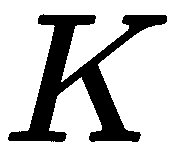
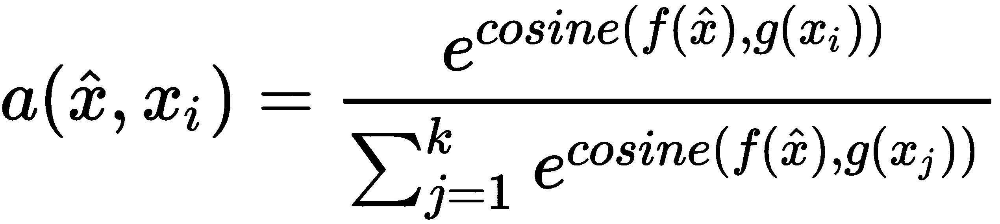
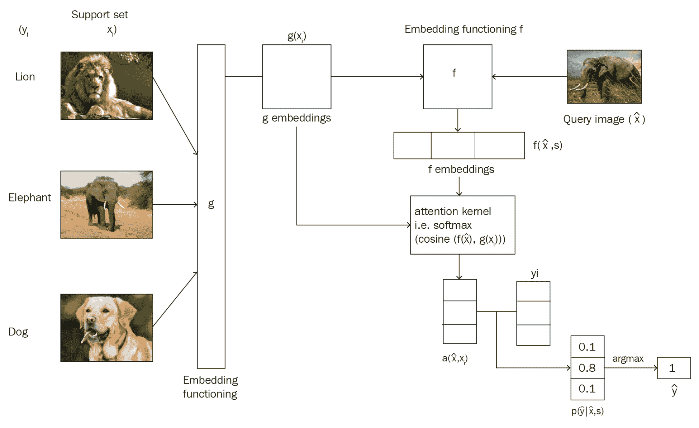

# 第十一章：探索 Few-Shot Learning 算法

恭喜！我们终于来到了最后一章。我们已经走过了很长的路。我们首先学习了神经网络是什么，以及它们如何用于识别手写数字。然后我们探索了如何使用梯度下降算法训练神经网络。我们还学习了递归神经网络用于序列任务，以及卷积神经网络用于图像识别。接着，我们研究了如何使用单词嵌入算法理解文本的语义。然后我们熟悉了几种不同类型的生成对抗网络和自编码器。

到目前为止，我们已经了解到，当我们有一个相当大的数据集时，深度学习算法表现得非常出色。但是当我们没有大量数据点可以学习时，我们该如何处理？对于大多数使用情况，我们可能得不到一个大型数据集。在这种情况下，我们可以使用 few-shot learning 算法，它不需要大量数据集进行学习。在本章中，我们将理解 few-shot learning 算法如何从较少数量的数据点中学习，并探索不同类型的 few-shot learning 算法。首先，我们将学习一个名为**siamese network**的流行 few-shot learning 算法。接下来，我们将直观地学习其他几种 few-shot learning 算法，如 prototypical、relation 和 matching networks。

在本章中，我们将学习以下主题：

+   什么是 few-shot learning？

+   Siamese 网络

+   Siamese 网络的架构

+   Prototypical networks

+   Relation 网络

+   Matching networks

# 什么是 few-shot learning？

从少量数据点中学习被称为**few-shot**学习或**k-shot learning**，其中 k 指定数据集中每个类别中的数据点数量。

假设我们正在执行图像分类任务。假设我们有两个类别 - 苹果和橙子 - 我们试图将给定的图像分类为苹果或橙子。当我们的训练集中恰好有一个苹果图像和一个橙子图像时，这被称为 one-shot learning；也就是说，我们仅从每个类别中的一个数据点中学习。如果我们有，比如，11 张苹果图像和 11 张橙子图像，那就称为 11-shot learning。因此，k-shot learning 中的 k 指的是每个类别中我们拥有的数据点数。

还有**zero-shot learning**，其中我们没有任何类别的数据点。等等，什么？没有任何数据点怎么学习？在这种情况下，我们不会有数据点，但我们会有关于每个类别的元信息，我们将从这些元信息中学习。

由于我们的数据集中有两个类别，即苹果和橙子，我们可以称其为**two-way k-shot learning**。所以，在 n-way k-shot learning 中，n-way 表示数据集中类别的数量，k-shot 表示每个类别中的数据点数。

我们需要我们的模型仅从少数数据点中学习。为了达到这个目标，我们以同样的方式训练它们；也就是说，我们在非常少的数据点上训练模型。假设我们有一个数据集，。我们从数据集中每个类别中抽取少量数据点，并称之为**支持集**。同样地，我们从每个类别中抽取一些不同的数据点，并称之为**查询集**。

我们使用支持集训练模型，并使用查询集进行测试。我们以每集方式训练模型，也就是说，在每一集中，我们从数据集中抽取几个数据点，，准备支持集和查询集，并在支持集上训练，查询集上测试。

# [孪生网络](https://wiki.example.org/siamese_networks)

孪生网络是一种特殊类型的神经网络，是最简单和最流行的一次学习算法之一。正如我们在前面的章节中所学到的，一次学习是一种技术，我们仅从每个类别中学习一个训练示例。因此，孪生网络主要用于那些每个类别数据点不多的应用场景。

例如，假设我们想为我们的组织构建一个人脸识别模型，并且说我们的组织有大约 500 人。如果我们想要从头开始使用**卷积神经网络**（**CNN**）构建我们的人脸识别模型，那么我们需要这 500 人的许多图像来训练网络并获得良好的准确性。但是，显然，我们不会为这 500 人拥有足够多的图像，因此，除非我们有足够的数据点，否则使用 CNN 或任何深度学习算法构建模型是不可行的。因此，在这些情况下，我们可以借助一种复杂的一次学习算法，如孪生网络，它可以从较少的数据点中学习。

但是孪生网络是如何工作的呢？孪生网络基本上由两个对称的神经网络组成，它们共享相同的权重和结构，并且在末端使用能量函数连接在一起，。我们的孪生网络的目标是学习两个输入是相似还是不相似。

假设我们有两幅图像， 和 ，我们想要学习这两幅图像是否相似或不相似。如下图所示，我们将**图像 ** 输入**网络 **，将**图像 ** 输入**网络 **。这两个网络的作用是为输入图像生成嵌入（特征向量）。因此，我们可以使用任何能够给我们嵌入的网络。由于我们的输入是图像，我们可以使用卷积网络来生成这些嵌入：也就是用于提取特征。请记住，在这里 CNN 的作用仅仅是提取特征而不是分类。

我们知道这些网络应该具有相同的权重和架构，如果**网络**  是一个三层 CNN，那么**网络**  也应该是一个三层 CNN，并且我们必须为这两个网络使用相同的权重集。因此，**网络**  和 **网络**  将分别为输入图像  和  提供嵌入。然后，我们将这些嵌入馈送到能量函数中，该函数告诉我们两个输入图像的相似程度。能量函数基本上是任何相似性度量，如欧氏距离和余弦相似度：


孪生网络不仅用于人脸识别，还广泛应用于我们没有多个数据点和需要学习两个输入之间相似性的任务中。孪生网络的应用包括签名验证、相似问题检索和物体跟踪。我们将在下一节详细研究孪生网络。

# 孪生网络的架构

现在我们对孪生网络有了基本的理解，接下来我们将详细探讨它们。孪生网络的架构如下图所示：


正如您可以在前面的图中看到的那样，siamese 网络由两个相同的网络组成，两者共享相同的权重和架构。假设我们有两个输入， 和 。我们将 **Input**  输入到 **Network** ，即 ，我们将 **Input**  输入到 **Network** ，即 。

正如您可以看到的，这两个网络具有相同的权重，，它们将为我们的输入  和  生成嵌入。然后，我们将这些嵌入传入能量函数，，它将给出两个输入之间的相似度。可以表达如下：


假设我们使用欧氏距离作为能量函数；那么当  和  相似时， 的值将很低。当输入值不相似时， 的值将很大。

假设您有两个句子，句子 1 和句子 2。我们将句子 1 输入到网络 ，句子 2 输入到网络 。假设我们的网络  和网络  都是**长短期记忆**（**LSTM**）网络，并且它们共享相同的权重。因此，网络  和网络  将分别为句子 1 和句子 2 生成嵌入。

然后，我们将这些嵌入传入能量函数，该函数给出两个句子之间的相似度分数。但我们如何训练我们的 siamese 网络呢？数据应该如何？特征和标签是什么？我们的目标函数是什么？

Siamese 网络的输入应该是成对的，，以及它们的二进制标签，，指示输入对是真实对（相同）还是伪造对（不同）。正如您可以在下表中看到的那样，我们有作为对的句子和标签，表明句子对是真实（1）还是伪造（0）的：


那么，我们的 siamese 网络的损失函数是什么？

由于孪生网络的目标不是执行分类任务而是理解两个输入值之间的相似性，我们使用对比损失函数。可以表达如下：


在上述方程中， 的值是真实标签，如果两个输入值相似则为 1，如果两个输入值不相似则为 0， 是我们的能量函数，可以是任何距离度量。术语**边界**用于保持约束，即当两个输入值不相似且它们的距离大于一个边界时，它们不会产生损失。

# 原型网络

原型网络是另一种简单、高效且流行的学习算法。与孪生网络类似，它们试图学习度量空间以执行分类。

原型网络的基本思想是为每个类别创建一个原型表示，并基于类原型与查询点之间的距离对查询点（新点）进行分类。

假设我们有一个支持集，其中包含狮子、大象和狗的图像，如下图所示：


我们有三个类别（狮子、大象和狗）。现在我们需要为这三个类别中的每一个创建一个原型表示。如何建立这三个类的原型？首先，我们将使用某个嵌入函数学习每个数据点的嵌入。嵌入函数，，可以是任何用于提取特征的函数。由于我们的输入是图像，我们可以使用卷积网络作为我们的嵌入函数，它将从输入图像中提取特征，如下所示：


一旦我们学习了每个数据点的嵌入，我们就取每个类中数据点的平均嵌入并形成类原型，如下所示。因此，类原型基本上是类中数据点的平均嵌入：


当一个新的数据点出现时，即我们希望预测标签的查询点时，我们将使用与创建类原型相同的嵌入函数生成这个新数据点的嵌入：也就是说，我们使用卷积网络生成我们的查询点的嵌入：


一旦我们有了查询点的嵌入，我们比较类原型和查询点嵌入之间的距离来确定查询点属于哪个类。我们可以使用欧氏距离作为测量类原型与查询点嵌入之间距离的距离度量，如下所示：


在计算类原型与查询点嵌入之间的距离后，我们对这个距离应用 softmax，并得到概率。由于我们有三类，即狮子、大象和狗，我们将得到三个概率。具有高概率的类将是我们查询点的类别。

由于我们希望我们的网络只从少量数据点学习，也就是说，我们希望进行少样本学习，我们以相同的方式训练我们的网络。我们使用**情节式训练**；对于每个情节，我们从数据集中的每个类中随机抽样一些数据点，并称之为支持集，并且我们仅使用支持集训练网络，而不是整个数据集。类似地，我们随机从数据集中抽样一个点作为查询点，并尝试预测其类别。通过这种方式，我们的网络学习如何从数据点中学习。

原型网络的整体流程如下图所示。正如您所看到的，首先，我们将为支持集中的所有数据点生成嵌入，并通过取类中数据点的平均嵌入来构建类原型。我们还生成查询点的嵌入。然后我们计算类原型与查询点嵌入之间的距离。我们使用欧氏距离作为距离度量。然后我们对这个距离应用 softmax，并得到概率。

如下图所示，由于我们的查询点是狮子，狮子的概率最高，为 0.9：


原型网络不仅用于一次性/少样本学习，还用于零样本学习。考虑一个情况，我们没有每个类的数据点，但我们有包含每个类高级描述的元信息。

在这些情况下，我们学习每个类的元信息的嵌入以形成类原型，然后使用类原型进行分类。

# 关系网络

关系网络包括两个重要的函数：嵌入函数，用表示，以及关系函数，用表示。嵌入函数用于从输入中提取特征。如果我们的输入是图像，那么我们可以使用卷积网络作为我们的嵌入函数，它将给出图像的特征向量/嵌入。如果我们的输入是文本，那么我们可以使用 LSTM 网络来获取文本的嵌入。假设我们有一个包含三类的支持集，{狮子，大象，狗}如下所示：


假设我们有一个查询图像 ，如下图所示，我们想要预测这个查询图像的类别：


首先，我们从支持集中每个图像  中取出，并通过嵌入函数  提取特征。由于我们的支持集包含图像，我们可以将卷积网络作为我们的嵌入函数，用于学习嵌入。嵌入函数将为支持集中每个数据点提供特征向量。类似地，我们通过将查询图像  传递给嵌入函数  来学习查询图像的嵌入。

一旦我们有了支持集的特征向量  和查询集的特征向量 ，我们使用某些运算符  将它们组合起来。这里， 可以是任何组合运算符。我们使用串联作为运算符来组合支持集和查询集的特征向量：


如下图所示，我们将组合支持集的特征向量，，以及查询集的特征向量，。但是，这样组合有什么用呢？嗯，这将帮助我们理解支持集中图像的特征向量与查询图像的特征向量之间的关系。

在我们的例子中，这将帮助我们理解狮子的特征向量如何与查询图像的特征向量相关联，大象的特征向量如何与查询图像的特征向量相关联，以及狗的特征向量如何与查询图像的特征向量相关联：


但是我们如何衡量这种相关性呢？嗯，这就是为什么我们使用关系函数 。我们将这些组合特征向量传递给关系函数，它将生成关系分数，范围从 0 到 1，表示支持集  中样本与查询集  中样本之间的相似度。

下面的方程显示了我们如何在关系网络中计算关系分数，：


在这里， 表示关系分数，表示支持集中每个类别与查询图像的相似度。由于支持集中有三个类别和一个查询集中的图像，我们将得到三个分数，表示支持集中所有三个类别与查询图像的相似度。

在一次性学习设置中，关系网络的整体表示如下图所示：


# 匹配网络

匹配网络是谷歌 DeepMind 发布的又一种简单高效的一次性学习算法。它甚至可以为数据集中未观察到的类别生成标签。假设我们有一个支持集 ，包含  个例子作为 。当给出一个查询点（新的未见示例）  时，匹配网络通过与支持集比较来预测  的类别。

我们可以将其定义为 ，其中  是参数化的神经网络， 是查询点  的预测类别， 是支持集。 将返回  属于支持集中每个类的概率。然后我们选择具有最高概率的类作为  的类别。但这究竟是如何工作的？这个概率是如何计算的？让我们现在看看。查询点  的类别  可以预测如下：


让我们解析这个方程。这里  和  是支持集的输入和标签。 是查询输入，即我们希望预测标签的输入。同时  是  和  之间的注意力机制。但是我们如何执行注意力？这里，我们使用了一个简单的注意力机制，即  和  之间的余弦距离上的 softmax：


我们不能直接计算原始输入  和  之间的余弦距离。因此，首先，我们将学习它们的嵌入并计算嵌入之间的余弦距离。我们使用两种不同的嵌入， 和 ，分别用于学习  和  的嵌入。我们将在接下来的部分详细学习这两个嵌入函数  和  如何学习这些嵌入。因此，我们可以重写我们的注意力方程如下：


我们可以将上述方程重写如下：



计算注意力矩阵  后，我们将注意力矩阵乘以支持集标签 。但是我们如何将支持集标签与我们的注意力矩阵相乘呢？首先，我们将支持集标签转换为独热编码值，然后将它们与我们的注意力矩阵相乘，结果得到我们的查询点  属于支持集各类的概率。然后我们应用 *argmax* 并选择具有最大概率值的 。

如果对匹配网络还不清楚？看看以下图表；您可以看到我们的支持集中有三类（狮子、大象和狗），我们有一个新的查询图像 。

首先，我们将支持集输入到嵌入函数 ，将查询图像输入到嵌入函数 ，学习它们的嵌入并计算它们之间的余弦距离，然后我们在这个余弦距离上应用 softmax 注意力。然后，我们将我们的注意力矩阵乘以支持集标签的独热编码，并得到概率。接下来，我们选择概率最高的 。正如您在以下图表中看到的那样，查询集图像是一只大象，我们在索引 1 处具有很高的概率，因此我们预测  的类别为 1（大象）：


我们已经学到我们使用两个嵌入函数， 和 ，分别学习  和  的嵌入。现在我们将看看这两个函数如何学习嵌入。

# 支持集嵌入函数

我们使用嵌入函数  来学习支持集的嵌入。我们将双向 LSTM 作为我们的嵌入函数 。我们可以定义我们的嵌入函数  如下：

```py
    def g(self, x_i):

        forward_cell = rnn.BasicLSTMCell(32)
        backward_cell = rnn.BasicLSTMCell(32)
        outputs, state_forward, state_backward = rnn.static_bidirectional_rnn(forward_cell, backward_cell, x_i, dtype=tf.float32)

        return tf.add(tf.stack(x_i), tf.stack(outputs))
```

# 查询集嵌入函数

我们使用嵌入函数  来学习我们查询点  的嵌入。我们使用 LSTM 作为我们的编码函数。连同输入 ，我们还会传递支持集嵌入的嵌入 *g(x)*，并且还会传递一个称为 *K* 的参数，该参数定义了处理步骤的数量。让我们逐步看看如何计算查询集嵌入。首先，我们将初始化我们的 LSTM 单元：

```py
cell = rnn.BasicLSTMCell(64)
prev_state = cell.zero_state(self.batch_size, tf.float32) 
```

然后，在处理步骤的数量上，我们执行以下操作：

```py
for step in xrange(self.processing_steps):
```

我们通过将其馈送到 LSTM 单元来计算查询集  的嵌入：

```py
    output, state = cell(XHat, prev_state)

    h_k = tf.add(output, XHat)
```

现在，我们对支持集嵌入 `g_embeddings` 执行 softmax 注意力：即，它帮助我们避免不需要的元素：

```py
    content_based_attention = tf.nn.softmax(tf.multiply(prev_state[1], g_embedding)) 
    r_k = tf.reduce_sum(tf.multiply(content_based_attention, g_embedding), axis=0) 
```

我们更新 `previous_state` 并重复这些步骤，执行 `K` 次处理步骤：

```py
prev_state = rnn.LSTMStateTuple(state[0], tf.add(h_k, r_k))
```

计算 `f_embeddings` 的完整代码如下：

```py
    def f(self, XHat, g_embedding):
        cell = rnn.BasicLSTMCell(64)
        prev_state = cell.zero_state(self.batch_size, tf.float32) 

        for step in xrange(self.processing_steps):
            output, state = cell(XHat, prev_state)

            h_k = tf.add(output, XHat) 

            content_based_attention = tf.nn.softmax(tf.multiply(prev_state[1], g_embedding)) 

            r_k = tf.reduce_sum(tf.multiply(content_based_attention, g_embedding), axis=0) 

            prev_state = rnn.LSTMStateTuple(state[0], tf.add(h_k, r_k))

        return output
```

# 匹配网络的架构

匹配网络的整体流程如下图所示，与我们已经看到的图像不同。您可以看到如何通过嵌入函数  和  计算支持集  和查询集 。

正如您所看到的，嵌入函数  将查询集  与支持集嵌入一起作为输入：



再次祝贺您学习了所有重要和流行的深度学习算法！深度学习是一个非常有趣和流行的 AI 领域，它已经改变了世界。现在您已经完成了书籍的阅读，可以开始探索深度学习的各种进展，并开始尝试各种项目。学习和深入学习！

# 摘要

我们从理解 k-shot 学习开始本章。我们了解到在 n-way k-shot 学习中，n-way 表示数据集中的类别数，k-shot 表示每个类别中的数据点数量；支持集和查询集相当于训练集和测试集。然后我们探索了孪生网络。我们学习了孪生网络如何使用相同的网络学习两个输入的相似度。

接着，我们学习了原型网络，它创建每个类的原型表示，并基于类原型与查询点之间的距离对查询点（新点）进行分类。我们还学习了关系网络如何使用两个不同的函数，嵌入函数和关系函数来分类图像。

在本章末尾，我们学习了匹配网络以及它如何使用支持集和查询集的不同嵌入函数来分类图像。

深度学习是人工智能领域中最有趣的分支之一。现在您已经了解了各种深度学习算法，可以开始构建深度学习模型，创建有趣的应用，并为深度学习研究做出贡献。

# 问题

让我们通过回答以下问题来评估从本章中获得的知识：

1.  什么是少样本学习？

1.  什么是支持集和查询集？

1.  定义孪生网络。

1.  定义能量函数。

1.  孪生网络的损失函数是什么？

1.  原型网络是如何工作的？

1.  在关系网络中使用的不同类型函数是什么？

# 进一步阅读

要了解如何从少量数据点中学习更多，请查看 Sudharsan Ravichandiran 撰写、由 Packt 出版的*Hands-On Meta Learning with Python*，可在[`www.packtpub.com/big-data-and-business-intelligence/hands-meta-learning-python`](https://www.packtpub.com/big-data-and-business-intelligence/hands-meta-learning-python)获取。
