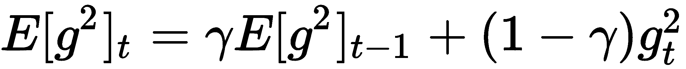
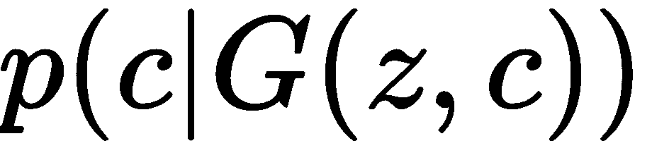
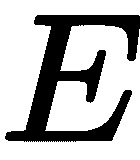

# 评估

以下是每章末尾提到的问题的答案。

# 第一章 - 深度学习简介

1.  机器学习的成功在于正确的特征集合。特征工程在机器学习中扮演了关键角色。如果我们手工设计了正确的特征集合来预测某种结果，那么机器学习算法可以表现良好，但是找到和设计出正确的特征集合并不是一件容易的任务。有了深度学习，我们不需要手工设计这样的特征。由于深度人工神经网络（ANNs）使用了多层，它们自己学习数据的复杂内在特征和多级抽象表示。

1.  这基本上是由于 ANN 的结构。ANN 由一些*n*个层组成，以执行任何计算。我们可以构建一个有多层的 ANN，其中每一层负责学习数据中的复杂模式。由于计算技术的进步，我们甚至可以构建深层次的网络，拥有数百甚至数千层。由于 ANN 使用深层进行学习，我们称其为深度学习；当 ANN 使用深层进行学习时，我们称其为深度网络。

1.  激活函数用于向神经网络引入非线性。

1.  当我们向 ReLU 函数输入任何负值时，它会将它们转换为零。对于所有负值变为零的问题称为**dying ReLU**。

1.  从输入层到输出层的整个预测输出过程称为**前向传播**。在这个传播过程中，输入会在每一层被其相应的权重乘以，并在其上应用激活函数。

1.  从输出层向输入层反向传播网络，并使用梯度下降更新网络权重以最小化损失的整个过程称为**反向传播**。

1.  梯度检查基本上用于调试梯度下降算法，并验证我们是否有正确的实现。

# 第二章 - 了解 TensorFlow

1.  TensorFlow 中的每个计算都由计算图表示。它由多个节点和边组成，其中节点是数学操作，如加法、乘法等，边是张量。计算图在优化资源方面非常高效，也促进了分布式计算。

1.  一个计算图包含了节点上的操作和其边上的张量，只有创建了这个图，我们才能使用 TensorFlow 会话来执行它。

1.  可以使用`tf.Session()`来创建 TensorFlow 会话，并且它将分配内存以存储变量的当前值。

1.  变量是用来存储值的容器。变量将作为计算图中多个操作的输入。我们可以将占位符视为变量，其中我们只定义类型和维度，但不分配值。占位符的值将在运行时提供。我们通过占位符将数据馈送给计算图。占位符被定义为没有值。

1.  TensorBoard 是 TensorFlow 的可视化工具，可以用来可视化计算图。它还可以用来绘制各种定量指标和几个中间计算的结果。当我们训练一个非常深的神经网络时，如果我们不得不调试模型，情况可能变得混乱。通过在 TensorBoard 中可视化计算图，我们可以轻松理解、调试和优化这样复杂的模型。它还支持共享。

1.  作用域用于减少复杂性，并通过将相关节点分组来帮助我们更好地理解模型。在图中具有名称作用域有助于我们组织类似操作。当我们构建复杂的架构时，这非常方便。作用域可以使用 `tf.name_scope()` 创建。

1.  TensorFlow 中的急切执行更符合 Python 风格，并允许快速原型设计。与图模式不同，我们无需每次执行操作时都构建一个图表，急切执行遵循命令式编程范例，可以立即执行任何操作，就像在 Python 中一样。

# 第三章 - 梯度下降及其变体

1.  与梯度下降不同，在 SGD 中，为了更新参数，我们不必遍历训练集中的所有数据点。相反，我们只需遍历单个数据点。也就是说，与梯度下降不同，在遍历训练集中的所有数据点之后等待更新模型参数是不必要的。我们只需在遍历训练集中的每个单一数据点之后更新模型的参数。

1.  在小批量梯度下降中，我们不是在遍历每个训练样本后更新参数，而是在遍历一些数据点批次后更新参数。假设批量大小为 50，这意味着我们在遍历 50 个数据点后更新模型的参数，而不是在遍历每个单独数据点后更新参数。

1.  使用动量执行小批量梯度下降有助于减少梯度步骤中的振荡，并更快地达到收敛。

1.  Nesterov 动量背后的基本动机是，我们不是在当前位置计算梯度，而是在动量将我们带到的位置计算梯度，我们称这个位置为前瞻位置。

1.  在 Adagrad 中，当过去梯度值较高时，我们将学习率设置为较小的值，当过去梯度值较小时，我们将其设置为较高的值。因此，我们的学习率值根据参数过去梯度的更新而改变。

1.  Adadelta 的更新方程如下：

    

    

1.  RMSProp 是为了解决 Adagrad 的学习率衰减问题而引入的。因此，在 RMSProp 中，我们计算梯度的指数衰减运行平均值如下：

    

我们不是采用过去所有梯度的平方和，而是使用这些梯度的运行平均值。因此，我们的更新方程如下：

1.  Adam 的更新方程如下：

    

# 第四章 - 使用 RNN 生成歌词

1.  一个普通的前馈神经网络仅基于当前输入预测输出，但是循环神经网络基于当前输入和前一个隐藏状态预测输出，前者充当内存并存储到目前为止网络所见的上下文信息（输入）。

1.  在时间步长为时，隐藏状态可以计算如下：

    

    换句话说，这是一个*时间步长 t 时的隐藏状态，tanh([输入到隐藏层权重 x 输入] + [隐藏到隐藏层权重 x 上一个隐藏状态])*。

1.  RNN 广泛应用于涉及序列数据的用例，如时间序列、文本、音频、语音、视频、天气等。它们在各种自然语言处理（NLP）任务中得到广泛应用，如语言翻译、情感分析、文本生成等。

1.  在反向传播 RNN 时，我们在每个时间步长乘以权重和*tanh*函数的导数。当我们在向后移动时在每一步乘以较小的数字时，我们的梯度变得微小，导致计算机无法处理的数值；这就是所谓的梯度消失问题。

1.  当我们将网络的权重初始化为非常大的数时，梯度将在每一步变得非常大。在反向传播时，我们在每个时间步长都乘以一个大数，这会导致梯度变为无穷大。这就是所谓的梯度爆炸问题。

1.  我们使用梯度裁剪来规避梯度爆炸问题。在这种方法中，我们根据向量范数（比如，*L2*）对梯度进行归一化，并将梯度值裁剪到一定范围内。例如，如果我们将阈值设为 0.7，那么我们将梯度保持在-0.7 到+0.7 的范围内。如果梯度值超过-0.7，则将其更改为-0.7；同样地，如果超过了 0.7，则将其更改为+0.7。

1.  不同类型的 RNN 架构包括一对一、一对多、多对一和多对多，并且它们用于各种应用。

# 第五章 - RNN 的改进

1.  **长短期记忆**（**LSTM**）单元是 RNN 的一种变体，通过使用称为**门**的特殊结构解决了梯度消失问题。门控制信息在记忆中保持所需的时间。它们学习保留哪些信息和丢弃哪些信息。

1.  LSTM 由三种类型的门组成，即遗忘门、输入门和输出门。遗忘门负责决定从细胞状态（记忆）中移除哪些信息。输入门负责决定将哪些信息存储在细胞状态中。输出门负责决定从细胞状态中提取哪些信息作为输出。

1.  细胞状态也称为内部记忆，所有信息都将存储在这里。

1.  在反向传播 LSTM 网络时，我们需要在每次迭代中更新太多的参数。这增加了我们的训练时间。因此，我们引入了作为 LSTM 单元简化版本的**门控循环单元**（**GRU**）单元。与 LSTM 不同，GRU 单元只有两个门和一个隐藏状态。

1.  在双向 RNN 中，我们有两个不同的隐藏单元层。这两个层从输入连接到输出层。在一个层中，隐藏状态从左到右共享，在另一个层中，从右到左共享。

1.  深度 RNN 通过使用前一个隐藏状态和前一层的输出来计算隐藏状态。

1.  编码器学习给定输入句子的表示（嵌入）。一旦编码器学习到嵌入，它将嵌入发送给解码器。解码器将这个嵌入（思维向量）作为输入，并尝试构建目标句子。

1.  当输入句子很长时，上下文向量并不能捕获整个句子的完整含义，因为它只是最终时间步的隐藏状态。因此，我们不是将最后的隐藏状态作为上下文向量并在解码器中使用注意力机制，而是取所有隐藏状态的总和作为上下文向量。

# 第六章 - 解密卷积网络

1.  CNN 的不同层包括卷积、池化和全连接层。

1.  我们通过一个像素滑动输入矩阵和过滤矩阵，并执行卷积操作。但我们不仅可以通过一个像素滑动输入矩阵，还可以通过任意数量的像素滑动输入矩阵。我们通过过滤矩阵滑动输入矩阵的像素数称为**步长**。

1.  在卷积操作中，我们用一个过滤器矩阵滑动在输入矩阵上。但在某些情况下，过滤器不能完全适应输入矩阵。也就是说，当我们将我们的过滤器矩阵移动两个像素时，它会到达边界，过滤器不适合输入矩阵，也就是说，我们的过滤器矩阵的某些部分在输入矩阵之外。在这种情况下，我们进行填充。

1.  池化层通过保留重要特征来减少空间维度。不同类型的池化操作包括最大池化、平均池化和总和池化。

1.  VGGNet 是最广泛使用的 CNN 架构之一。它由牛津大学的**视觉几何组**（**VGG**）发明。VGG 网络的架构由卷积层和池化层组成。它在整个网络中使用 3 x 3 卷积和 2 x 2 池化。

1.  通过分解卷积层，我们将具有较大过滤器尺寸的卷积层分解为具有较小过滤器尺寸的一堆卷积层。因此，在 inception 块中，具有 5 x 5 过滤器的卷积层可以分解为两个具有 3 x 3 过滤器的卷积层。

1.  类似于 CNN，胶囊网络检查某些特征的存在以对图像进行分类，但除了检测特征外，它还会检查它们之间的空间关系 - 也就是说，它学习特征的层次结构。

1.  在胶囊网络中，除了计算概率之外，我们还需要保留向量的方向，因此我们使用一种称为压缩函数的不同激活函数。它如下所示：

    

# 第七章 - 学习文本表示

1.  在**连续词袋**（**CBOW**）模型中，我们试图预测给定上下文词的目标词，而在 skip-gram 模型中，我们试图预测给定目标词的上下文词。

1.  CBOW 模型的损失函数如下所示：

    

1.  当我们的词汇表中有数百万个单词时，我们需要执行大量的权重更新，直到预测正确的目标词。这是耗时且不高效的方法。因此，我们不是这样做，而是将正确的目标词标记为正类，并从词汇表中随机抽取几个词并标记为负类，这被称为负采样。

1.  PV-DM 类似于连续词袋模型，其中我们试图预测给定上下文词的目标词。在 PV-DM 中，除了词向量外，我们引入了另一个向量，称为段落向量。顾名思义，段落向量学习整个段落的向量表示，并捕捉段落的主题。

1.  编码器的作用是将句子映射到向量，解码器的作用是生成周围的句子；即前面和后面的句子。

1.  在 QuickThoughts 中，有一个有趣的算法用于学习句子嵌入。在 quick-thoughts 中，我们试图学习一个给定句子是否与候选句子相关。因此，我们使用分类器而不是解码器来学习是否一个给定的输入句子与候选句子相关。

# 第八章 - 使用 GAN 生成图像

1.  辨别模型学习如何以最佳方式找到分隔类别的决策边界，而生成模型则学习每个类别的特征。也就是说，辨别模型预测输入条件下的标签， ，而生成模型学习联合概率分布， 。

1.  生成器学习数据集中图像的分布。它学习训练集中手写数字的分布。我们向生成器输入随机噪声，它将把随机噪声转换成与训练集中类似的新手写数字。

1.  判别器的目标是执行分类任务。给定一幅图像，它将其分类为真实或虚假；也就是说，图像是来自训练集还是生成器生成的。

1.  判别器的损失函数如下所示：

    

    生成器的损失函数如下所示：

    

1.  DCGAN 使用卷积网络扩展了 GAN 的设计。也就是说，我们用卷积神经网络替换了生成器和判别器中的前馈网络，**卷积神经网络**（**CNN**）。

1.  **Kullback-Leibler**（**KL**）散度是用于确定一个概率分布与另一个概率分布之间差异的最常用度量之一。假设我们有两个离散概率分布，  和 ，那么 KL 散度可以表达如下：

    

1.  瓦瑟斯坦距离，也被称为**地球移动距离**（**EM**）距离，在最优传输问题中是最常用的距离度量之一，用于从一种配置移动物品到另一种配置。

1.  利普希茨连续函数是一种必须处处连续且几乎处处可微的函数。因此，对于任何利普希茨连续函数，函数图形斜率的绝对值不能超过一个常数， 。这个常数， ，称为**利普希茨常数**。

# 第九章 - 深入学习 GAN

1.  与普通 GAN 不同，**条件生成对抗网络（CGAN）**对生成器和鉴别器都施加条件。这个条件告诉 GAN 我们期望生成器生成什么图像。因此，我们的两个组件——鉴别器和生成器——都基于这个条件进行操作。

1.  代码 *c* 基本上是可解释的解缠信息。假设我们有一些 MNIST 数据，那么，代码 *c1* 表示数字标签，代码 *c2* 表示数字的宽度，代码 *c3* 表示数字的笔画等。我们用术语 *c* 统称它们。

1.  两个随机变量之间的互信息告诉我们通过一个随机变量可以从另一个随机变量获取的信息量。随机变量 *x* 和 *y* 之间的互信息可以表示如下：

    

    它基本上是 *y* 的熵和在给定 *x* 的条件下 *y* 的条件熵之间的差异。

1.  代码 *c* 给出了关于图像的可解释的解缠信息。因此，我们试图在不知道后验分布  的情况下找到 *c*，因此，我们使用辅助分布  来学习 *c*。

1.  仅仅靠对抗损失并不能确保图像的正确映射。例如，生成器可以将源域中的图像映射到与目标域中的目标分布相匹配的随机排列图像中。因此，为了避免这种情况，我们引入了一种额外的损失，称为**循环一致性损失**。它强制生成器 *G* 和 *F* 都保持循环一致。

1.  我们有两个生成器： 和 。 的作用是学习从  到  的映射，生成器  的作用是学习从 y 到  的映射。

1.  Stack GANs 将文本描述转换为图像分为两个阶段。在第一阶段，艺术家绘制基本形状，并创建形成图像初始版本的基本轮廓。在下一个阶段，他们通过使图像更加真实和吸引人来增强图像。

# 第十章 - 使用自编码器重建输入

1.  自编码器是一种无监督学习算法。与其他算法不同，自编码器学习重建输入，也就是说，自编码器接受输入并学习以输出形式复制输入。

1.  我们可以将我们的损失函数定义为实际输入和重构输入之间的差异，如下所示：

    

    在这里， 是训练样本的数量。

1.  **卷积自编码器**（**CAE**）使用卷积网络而不是普通的神经网络。在普通自编码器中，编码器和解码器基本上是前馈网络。但在 CAE 中，它们基本上是卷积网络。这意味着编码器由卷积层组成，解码器由转置卷积层组成，而不是原始的前馈网络。

1.  **去噪自编码器**（**DAE**）是自编码器的另一个小变体。它们主要用于从图像、音频和其他输入中去除噪声。因此，我们将损坏的输入提供给自编码器，它学习重构原始的未损坏输入。

1.  隐藏层中的神经元的平均激活可以计算为整个训练集上的以下值：

    

1.  对抗自编码器的损失函数可以数学表示如下：

    

    第一项代表重构误差，第二项代表惩罚项或正则化器，基本上是**Jacobian 矩阵**的**Frobenius 范数**。

1.  矩阵的 Frobenius 范数，也称为**Hilbert-Schmidt 范数**，定义为其元素的绝对平方和的平方根。由向量值函数的偏导组成的矩阵称为**Jacobian 矩阵**。

# 第十一章 - 探索少样本学习算法

1.  从少量数据点中学习称为**少样本学习**或**k-样本学习**，其中*k*指定数据集中每个类中的数据点数。

1.  我们需要我们的模型仅从少量数据点中学习。为了实现这一点，我们以相同的方式训练它们；也就是说，我们在很少的数据点上训练模型。假设我们有一个数据集，：我们从每个类别中取样少量数据点，并称之为**支持集**。类似地，我们从每个类别中取样一些不同的数据点，并称之为**查询集**。

1.  Siamese 网络基本上由两个对称的神经网络组成，两者共享相同的权重和架构，并在末端使用某种能量函数连接在一起。我们 Siamese 网络的目标是学习两个输入是否相似或不相似。

1.  能量函数，它将为我们提供两个输入之间的相似度。它可以表达如下：

    

1.  由于 Siamese 网络的目标不是执行分类任务，而是理解两个输入值之间的相似性，因此我们使用对比损失函数。它可以表达如下：

    

1.  原型网络是另一种简单、高效且广泛使用的少样本学习算法。原型网络的基本思想是为每个类别创建一个原型表示，并根据类别原型与查询点（新点）之间的距离对查询点进行分类。

1.  关系网络由两个重要函数组成：一个嵌入函数，用  表示，和一个关系函数，用  表示。
