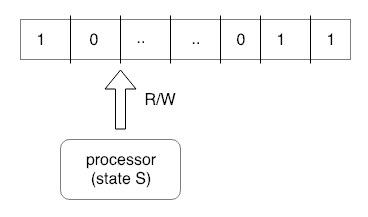
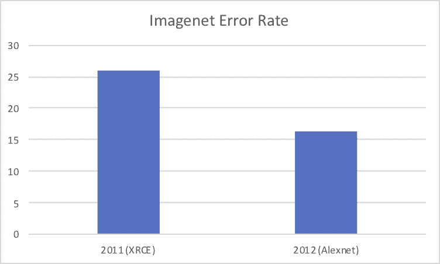
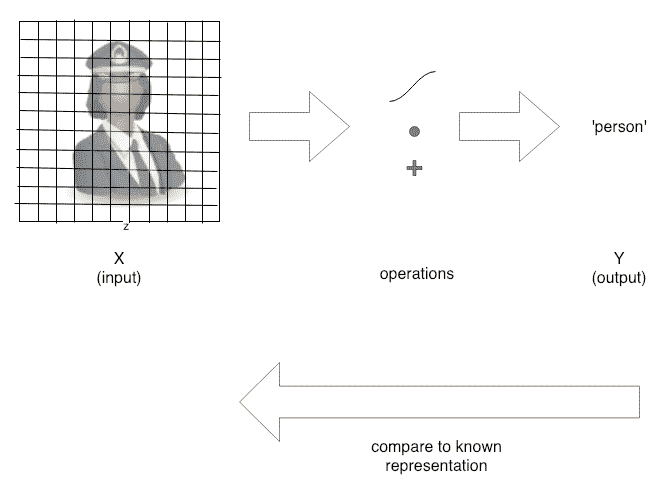
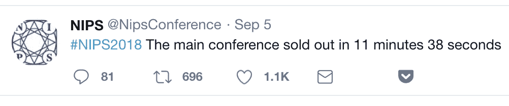
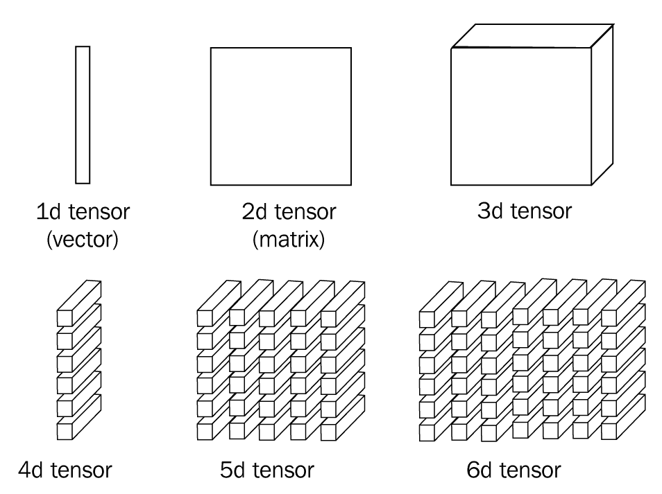
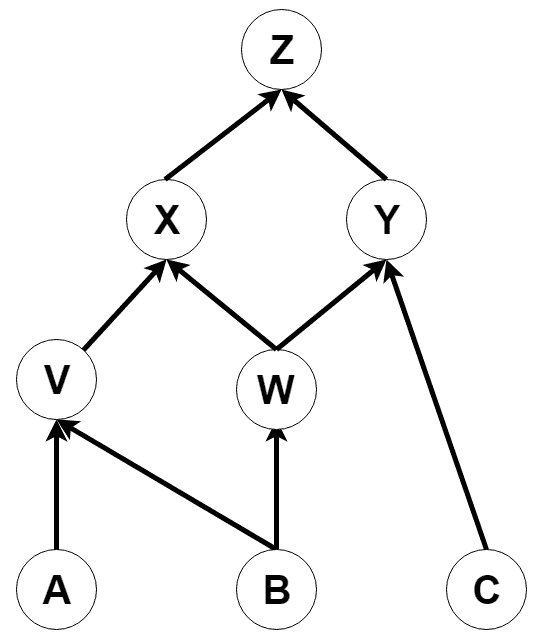
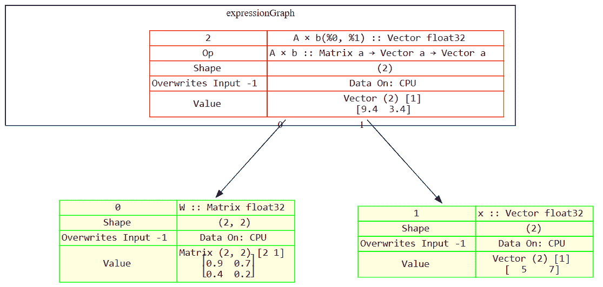
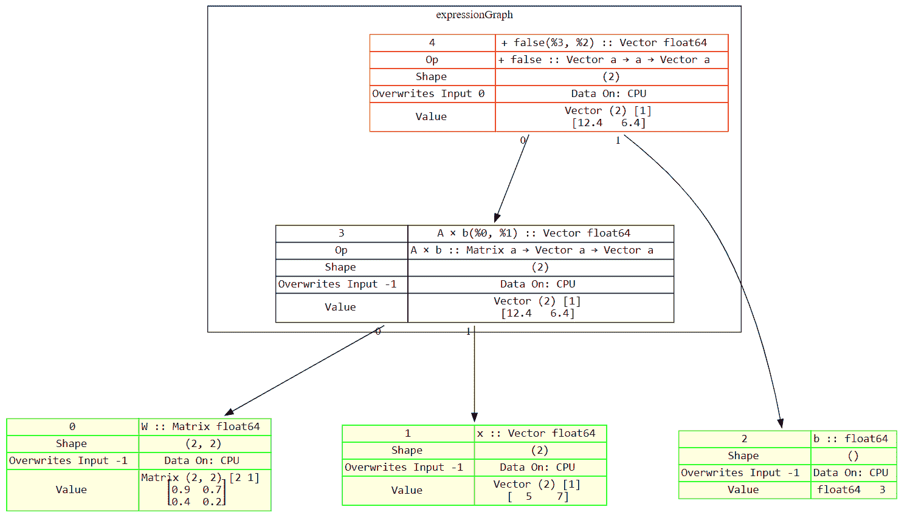

# 第一章：在 Go 中深度学习介绍

本书将非常快速地进入在 Go 中实现**Deep Neural Networks**（**DNNs**）的实际操作方面。简单地说，本书的标题包含了它的目标。这意味着会有大量的技术细节、大量的代码以及（不是太多的）数学。当你最终关闭本书或关闭你的 Kindle 时，你将知道如何（以及为什么）实现现代可扩展的 DNN，并能够根据你所从事的任何行业或疯狂的科学项目的需求重新利用它们。

我们选择 Go 语言反映了我们的 DNNs 执行的操作类型所建立的 Go 库景观的成熟性。当然，在选择语言或库时进行的权衡存在很多争论，我们将在本章的一个部分专门讨论我们的观点，并为我们所做的选择辩护。

但是，没有上下文的代码意味着什么？为什么我们要关心这种看似混乱的线性代数、微积分、统计学和概率论的混合？为什么要使用计算机在图像中识别事物或在金融数据中识别异常模式？而且，也许最重要的是，这些任务的方法有什么共同之处？本书的初步部分将尝试提供一些这方面的背景信息。

科学探索，当被分解为代表其机构和行业专业化的学科时，是由进步思想所统治的。通过这一点，我们指的是一种动力，一种向前推进，朝着某种目标前进。例如，医学的理想目标是能够识别和治愈任何疾病或疾病。物理学家的目标是完全理解自然界的基本法则。进步趋势是朝着这个方向的。科学本身就是一种优化方法。那么**Machine Learning**（**ML**）的最终目标可能是什么呢？

让我们直接了当地说吧。我们认为这是创造**人工通用智能**（**AGI**）的过程。这就是我们的目标：一个通用学习计算机，可以处理工作，让人们留下生活。正如我们在详细讨论**Deep Learning**（**DL**）的历史时将看到的那样，顶尖人工智能实验室的创始人们一致认为 AGI 代表着今天世界上许多复杂问题的*元解决方案*，从经济学到医学再到政府。

本章将涵盖以下主题：

+   为什么选择 DL？

+   DL——历史及应用

+   在 Go 中 ML 的概述

+   使用 Gorgonia

# 介绍 DL

现在我们将提供深度学习（**DL**）为何重要及其如何融入人工智能（**AI**）讨论的高层视角。然后，我们将看一看 DL 的历史发展，以及当前和未来的应用。

# 为什么选择 DL？

那么，亲爱的读者，你是谁？你为何对 DL 感兴趣？你是否对 AI 有自己的私人愿景？还是有更为谦虚的目标？你的*起源故事*是什么？

在我们对同事、老师和见面会熟人的调查中，有更为正式对机器感兴趣的人的起源故事有一些共同特征。无论你是在电脑上与看不见的敌人玩游戏，有时会出现故障，还是在上世纪 90 年代后期追踪*id Software's Quake*中的实际机器人；对软硬件结合思考和独立行动的概念在我们每个人的生活中都有影响。

随着时间的流逝，随着年龄、教育和对流行文化的接触，你的想法逐渐精炼，也许你最终成为了研究员、工程师、黑客或者业余爱好者，现在你想知道如何参与启动这个宏大的机器。

如果你的兴趣更为温和，比如你是一名数据科学家，想要了解前沿技术，但对这些关于有意识的软件和科幻的讨论并不感冒，那么在 2019 年，你在很多方面都比大多数人更为准备充足。不管我们的抱负大小如何，每个人都必须通过试验和错误理解代码的逻辑和辛勤工作。幸运的是，我们有非常快的显卡。

这些基本真理的结果是什么呢？现在，在 2019 年，DL 已经以多种方式影响了我们的生活。一些棘手的问题正在解决。有些微不足道，有些则不然。是的，Netflix 有你最尴尬的电影喜好模型，但 Facebook 为视觉障碍者提供了自动图像标注。理解 DL 的潜力就像看到有人第一次看到爱人照片时脸上的喜悦表情一样简单。

# 深度学习（DL）- 一个历史

现在我们将简要介绍 DL 的历史以及它出现的历史背景，包括以下内容：

+   **AI**的概念

+   计算机科学/信息论的起源

+   当前有关 DL 系统状态/未来的学术工作

虽然我们特别关注 DL，但这个领域并非从无到有。它是机器学习中的一组模型/算法，是计算机科学的一个分支。它构成了 AI 的一种方法。另一种所谓的**符号 AI**则围绕着手工制作（而不是学习得来的）特征和编码中的规则，而不是从数据中算法提取模式的加权模型。

在成为一门科学之前，思考机器的想法在古代就是虚构。希腊的冶金之神*赫菲斯托斯*用金银制造了自动机器人。它们为他服务，是人类想象力自然地考虑如何复制自身体现形式的早期例子。

将历史推进几千年，20 世纪信息理论和计算机科学的几位关键人物建立了 AI 作为一个独特领域的平台，包括我们将要涵盖的 DL 最近的工作。

第一个重要人物，Claude Shannon，为我们提供了通信的一般理论。具体地，在他的里程碑论文*A Mathematical Theory of Computation*中，他描述了如何在使用不完善介质（例如使用真空管进行计算）时避免信息丢失。特别是他的噪声信道编码定理，对于可靠地处理任意大量数据和算法而言至关重要，而不引入介质本身的错误到通信通道中。

1936 年，Alan Turing 描述了他的*Turing machine*，为我们提供了一个通用的计算模型。他所描述的基本构建块定义了机器可能计算的极限。他受到 John Von Neumann 关于*stored-program*的想法的影响。Turing 工作的关键洞见在于数字计算机可以模拟任何形式推理过程（*Church-Turing*假设）。下图显示了图灵机的工作过程：



*所以，你是想告诉我们，图灵先生，计算机也可以像我们一样推理？！*

John Von Neumann 本人受到了图灵 1936 年论文的影响。在晶体管开发之前，当真空管是唯一的计算手段时（如 ENIAC 及其衍生系统），John Von Neumann 发表了他的最终作品。在他去世时仍未完成，题为*The Computer and the Brain*。尽管未完成，但它初步考虑了计算模型如何在大脑中运作，正如它们在机器中一样，包括早期神经科学对神经元和突触之间连接的观察。

自从 1956 年 AI 首次被定义为一个独立的研究领域，而 ML 的术语则是在 1959 年被创造出来，这个领域经历了一个被广泛讨论的起伏过程——既有兴奋和充裕的资金的时期，也有私营部门资金不存在且研究会议甚至不接受强调神经网络方法用于构建 AI 系统的论文的时期。

在 AI 领域内部，这些竞争方法消耗了大量的研究经费和人才。符号 AI 在手工制定规则以完成像图像分类、语音识别和机器翻译等高级任务的不可能性方面达到了其限制。ML 试图根本性地重新配置这一过程。与其将一堆人类编写的规则应用于数据并希望得到答案，人类劳动力反而被用于构建一台可以在已知答案时从数据中推断规则的机器。这是*监督学习*的一个例子，其中机器在处理数千个带有关联*cat*标签的示例图像后学习了本质*cat-ness*。

简单来说，这个想法是要建立一个能够推广的系统。毕竟，我们的目标是通用人工智能（AGI）。拍下家庭最新的毛茸茸的猫的照片，计算机利用其对*猫本质*的理解正确识别出一只*猫*！在机器学习中，一个被认为对构建通用人工智能至关重要的研究领域是*迁移学习*，其中我们可以将理解*猫本质*的机器转移到在识别*猫本质*时进行操作的机器上。这是世界各地许多人工智能实验室采取的方法：将系统建立在系统之上，利用在一个领域中的算法弱点与另一个领域中的统计学几乎确定性的增强，并希望构建一个更好地为人类（或企业）需求服务的系统。

*为人类需求服务* 的概念引向了关于人工智能伦理（以及我们将要探讨的深度学习方法）的一个重要观点。媒体和学术或行业圈子已经就这些系统的伦理影响进行了大量讨论。如果由于计算机视觉的进步，我们可以轻松实现自动化广泛的监视，这对我们社会意味着什么？自动武器系统或制造业又如何？想象一下庞大的仓库不再有任何人类员工，这已不再是一种遥远的设想。那么，曾经从事这些工作的人们将何去何从？

当然，全面考虑这些重要问题超出了本书的范围，但这正是我们工作的背景。你将成为为数不多能够构建这些系统并推动该领域发展的幸运之一。牛津大学未来人类研究所（由尼克·博斯特罗姆领导）和麻省理工学院未来生命研究所（由麦克斯·泰格马克领导）的工作是学术界围绕人工智能伦理问题进行辩论的两个例子。然而，这场辩论并不仅限于学术或非营利圈子；DeepMind，一个旗下的阿尔法母公司旨在成为“AGI 的阿波罗计划”，于 2017 年 10 月推出了“DeepMind 伦理与社会”。

这些可能看似与代码、CUDA 和神经网络识别猫图片的世界毫无关系，但随着技术的进步和这些系统的日益先进及广泛应用，我们的社会将面临真实的后果。作为研究人员和开发者，我们有责任找到一些答案，或者至少有应对这些挑战的想法。

# DL – 炒作还是突破？

深度学习及其相关的炒作是近来的一个发展。大多数关于其*出现*的讨论集中在 2012 年的 ImageNet 基准测试上，深度卷积神经网络将错误率比上一年提高了 9%，这是一个显著的改进，而以往的优胜者最多只能通过使用模型中手工制作的特征来进行增量改进。以下图表展示了这一改进：



尽管最近的炒作，使 DL 正常运转的组成部分——使我们能够训练深度模型的组成部分，在图像分类和各种其他任务中已被证明非常有效。这些是由 Geoffrey Hinton 及其在多伦多大学的团队于 1980 年代开发的。他们的早期工作发生在本章早些时候讨论的*流动*时期之一。事实上，他们完全依赖于来自**加拿大高级研究所**（**CIFAR**）的资助。

随着 21 世纪正式开始，2000 年 3 月爆发的科技泡沫再度膨胀，高性能 GPU 的可用性以及计算能力的普遍增长意味着这些技术，尽管几十年前已经开发，但由于缺乏资金和行业兴趣而未被使用，突然变得可行。以往在图像识别、语音识别、自然语言处理和序列建模中只能看到渐进改进的基准都调整了它们的*y-*轴。

不仅仅是硬件的巨大进步与旧算法的结合使我们达到了这一点。还有算法上的进步，允许我们训练特别深的网络。其中最著名的是批归一化，于 2015 年引入。它确保各层之间的数值稳定，并可以防止梯度爆炸，显著减少训练时间。关于批归一化为何如此有效仍存在活跃的讨论。例如，2018 年 5 月发表的一篇论文驳斥了原始论文的核心前提，即并非*内部协变移位*被减少，而是*使优化景观更加平滑*，即梯度可以更可靠地传播，学习率对训练时间和稳定性的影响更加可预测。

从古希腊神话的民间科学到信息理论、神经科学和计算机科学的实际突破，特别是计算模型，这些集合产生了网络架构和用于训练它们的算法，这些算法能够很好地扩展到解决 2018 年多个基础 AI 任务，这些任务几十年来一直难以解决。

# 定义深度学习

现在，让我们退后一步，从一个简单且可操作的深度学习（DL）定义开始。当我们逐步阅读本书时，对这个术语的理解会逐渐加深，但现在，让我们考虑一个简单的例子。我们有一个人的图像。如何向计算机*展示*这个图像？如何*教*计算机将这个图像与*人*这个词关联起来？

首先，我们找出了这个图像的一个表示，比如图像中每个像素的 RGB 值。然后，我们将这个数值数组（连同几个可训练参数）输入到一系列我们非常熟悉的操作中（乘法和加法）。这样就产生了一个新的表示，我们可以用它来与我们知道的映射到标签“人”的表示进行比较。我们自动化这个比较过程，并随着进行更新我们参数的值。

这个描述涵盖了一个简单的、浅层的机器学习系统。我们将在后面专门讨论神经网络的章节中进一步详细介绍，但是现在，为了使这个系统变得更深入，我们增加了对更多参数的操作。这使我们能够捕获更多关于我们所代表的事物（人的形象）的信息。影响这个系统设计的生物模型是人类神经系统，包括神经元（我们用我们的表现填充的东西）和突触（可训练的参数）。

下图显示了正在进行中的机器学习系统：



因此，深度学习只是对 1957 年的*感知器*的一种进化性变化，这是最简单和最原始的二元分类器。这种变化，再加上计算能力的显著增强，是使得一个系统不能工作和使得一辆车能够自主驾驶的差异。

除了自动驾驶汽车，深度学习和相关方法在农业、作物管理和卫星图像分析中也有许多应用。先进的计算机视觉技术驱动能够除草和减少农药使用的机器。我们拥有几乎实时的快速准确语音搜索。这些是社会的基础，从食品生产到通信。此外，我们还处于引人注目的实时视频和音频生成的前沿，这将使当今关于“假新闻”等隐私争论或戏剧显得微不足道。

在我们达到通用人工智能之前，我们可以利用我们沿途发现的发现来改善我们周围的世界。深度学习就是这些发现之一。它将推动自动化的增加，只要伴随其而来的政治变革是支持的，就能在任何行业中提供改进，意味着商品和服务将变得更便宜、更快速和更广泛地可用。理想情况下，这意味着人们将越来越多地从他们祖先的日常中获得自由。

进步的阴暗面也不容忽视。可以识别受害者的机器视觉也可以识别目标。事实上，未来生命研究所关于自主武器的公开信（*自主武器：AI 和机器人研究人员的公开信*），由史蒂芬·霍金和埃隆·马斯克等科学技术名人支持，是学术部门、工业实验室和政府之间关于进步的正确方式的相互作用和紧张关系的一个例子。在我们的世界中，传统上国家控制着枪支和金钱。先进的 AI 可以被武器化，这是一场也许一个组织赢，其余人输的竞赛。

更具体地说，机器学习领域的发展速度非常快。我们如何衡量这一点？首屈一指的机器学习会议 **Neural Information Processing Systems**（**NIPS**）在 2017 年的注册人数比 2010 年增加了七倍多。

2018 年的注册活动更像是一场摇滚音乐会，而不是干燥的技术会议，这反映在组织者自己发布的以下统计数据中：



*de facto* 机器学习预印本的中心库 **arXiv**，其增长曲线呈现出极端的“曲棍球”形态，新工具的出现帮助研究人员追踪所有新工作。例如特斯拉的 AI 主管 Andrej Karpathy 的网站 arxiv-sanity（[`www.arxiv-sanity.com/`](http://www.arxiv-sanity.com/)）。该网站允许我们对论文进行排序/分组，并组织一个接口，从中轻松地提取我们感兴趣的研究成果。

我们无法预测未来五年进展速度的变化。风险投资家和专家的专业猜测从指数增长到*下一个 AI 冬季即将来临*不等。但是，我们现在拥有技术、库和计算能力，知道如何在自然语言处理或计算机视觉任务中充分利用它们，可以帮助解决真实世界的问题。

这就是我们的书的目的所在，展示如何实现这一点。

# Go 中的机器学习概述

本节将审视 Go 中的机器学习生态系统，首先讨论我们从一个库中期望的基本功能，然后依次评估每个主要的 Go 机器学习库。

Go 的 ML 生态系统在历史上一直相当有限。该语言于 2009 年推出，远早于深度学习革命，该革命吸引了许多新程序员加入。你可能会认为 Go 在库和工具的增长方面与其他语言一样。然而，历史决定了我们的网络基础数学操作的许多高级 API 出现为 Python 库（或具有完整的 Python 绑定）。有许多著名的例子，包括 PyTorch、Keras、TensorFlow、Theano 和 Caffe（你明白的）。

不幸的是，这些库要么没有 Go 的绑定，要么绑定不完整。例如，TensorFlow 可以进行推断（*这是一只猫吗？*），但无法进行训练（*到底什么是猫？好的，我会看这些例子并找出来*）。虽然这利用了 Go 在部署时的优势（编译成单个二进制文件、编译速度快且内存占用低），但从开发者的角度来看，你将被迫在两种语言之间工作（用 Python 训练模型，用 Go 运行模型）。

除了在设计、实施或故障排除时语法转换的认知冲击之外，您可能会遇到的问题还涉及环境和配置问题。这些问题包括：*我的 Go 环境配置正确吗*？*我的 Python 2 二进制链接到 Python 还是 Python 3*？*TensorFlow GPU 正常工作吗*？如果我们的兴趣在于设计最佳模型并在最短时间内进行训练和部署，那么 Python 或 Go 绑定库都不合适。

此时很重要的一点是问：那么，我们希望从 Go 中的*DL 库*中得到什么？简单来说，我们希望尽可能地摆脱不必要的复杂性，同时保留对模型及其训练方式的灵活性和控制。

在实践中这意味着什么？以下清单概述了这个问题的答案：

+   我们不想直接与**基本线性代数子程序**（**BLAS**）接口，以构建乘法和加法等基本操作。

+   我们不想在每次实现新网络时都定义张量类型和相关函数。

+   我们不想每次训练网络时都从头开始实现**随机梯度下降**（**SGD**）。

本书将涵盖以下一些内容：

+   **自动或符号微分**：我们的深度神经网络试图学习某个函数。它通过计算梯度（*梯度下降优化*）来迭代地解决“如何设计一个函数，使其能够接受输入图像并输出标签猫”的问题，同时考虑到损失函数（*我们的函数有多错误*？）。这使我们能够理解是否需要改变网络中的权重以及改变的幅度，微分的具体方式是通过链式法则（*将梯度计算分解*），这给我们提供了训练数百万参数深度网络所需的性能。

+   **数值稳定化函数**：这对 DL 至关重要，正如本书后面章节中将会探讨的那样。一个主要的例子就是**批归一化**或者 BatchNorm，常被称为附带函数。它的目标是将我们的数据放在同一尺度上，以增加训练速度，并减少最大值通过层级导致的梯度爆炸的可能性（这是我们将在第二章，《什么是神经网络以及如何训练一个？》中详细讨论的内容）。

+   **激活函数**：这些是引入非线性到我们神经网络各层的数学操作，帮助确定哪些层中的神经元将被*激活*，将它们的值传递到网络中的下一层。例如 Sigmoid，**修正线性单元**（**ReLU**）和 Softmax。这些将在第二章，《什么是神经网络以及如何训练一个？》中更详细地讨论。

+   **梯度下降优化**：我们还将在第二章，《什么是神经网络以及如何训练一个？》中广泛讨论这些。但是作为 DNN 中主要的优化方法，我们认为这是任何以 DL 为目的的库必须具备的核心功能。

+   **CUDA 支持**：Nvidia 的驱动程序允许我们将 DNN 中涉及的基本操作卸载到 GPU 上。GPU 非常适合并行处理涉及矩阵变换的工作负载（事实上，这是它们最初的用途：计算游戏的世界几何），可以将训练模型的时间减少一个数量级甚至更多。可以说，CUDA 支持对现代 DNN 实现至关重要，因此在前述主要 Python 库中是可用的。

+   **部署工具**：正如我们将在第九章，《构建深度学习流水线》中详细讨论的那样，模型的部署用于训练或推理经常被忽视。随着神经网络架构变得更加复杂，并且可用的数据量变得更大，例如在 AWS GPU 上训练网络，或将训练好的模型部署到其他系统（例如集成到新闻网站的推荐系统）是一个关键步骤。这将改进你的训练时间并扩展可以使用的计算量。这意味着也可以尝试更复杂的模型。理想情况下，我们希望一个库能够轻松地与现有工具集成或具备自己的工具。

现在我们已经为我们理想的库设定了一个合理的需求集，让我们来看看社区中的一些流行选项。以下列表并非详尽无遗，但它涵盖了 GitHub 上大多数主要的与 ML 相关的 Go 项目，从最狭窄到最通用。

# ML 库

我们现在将考虑每个主要的 ML 库，根据我们之前定义的标准来评估它们的效用，包括任何负面方面或缺陷。

# Go 中的词嵌入

**Go 中的词嵌入** 是一个特定任务的 ML 库示例。它实现了生成词嵌入所需的两层神经网络，使用`Word2vec`和`GloVe`。它是一个出色的实现，快速而干净。它非常好地实现了有限数量的特性，特定于通过`Word2vec`和`GloVe`生成词嵌入的任务。

这是一个用于训练 DNNs 的核心功能示例，称为 SGD 的优化方法。这在由斯坦福团队开发的`GloVe`模型中使用。然而，代码特定集成于`GloVe`模型中，而在 DNNs 中使用的其他优化方法（如负采样和 skip-gram）对其无用。

对于 DL 任务来说，这可能是有用的，例如，用于生成文本语料库的嵌入式层或密集向量表示，这可以在**长短期记忆**（**LSTM**）网络中使用，我们将在第五章中讨论，*使用递归神经网络进行下一个单词预测*。然而，我们需要的所有高级功能（例如梯度下降或反向传播）和模型特性（LSTM 单元本身）都不存在。

# Go 或 Golang 的朴素贝叶斯分类和遗传算法

这两个库构成 Go 中 ML 库的另一组特定任务的示例。两者都写得很好，提供了特定功能的原语，但这些原语并不通用。在朴素贝叶斯分类器`lib`中，需要手动构建矩阵，然后才能使用，而传统的通用算法方法根本不使用矩阵。已经有一些工作正在将它们整合到 GA 中；然而，这项工作尚未进入我们在此引用的 GA 库。

# **Go 中的 ML**

一个具有更通用集合有用功能的库是 GoLearn。虽然 DL 特定的功能在其愿望清单上，但它具有实现简单神经网络、随机森林、聚类和其他 ML 方法所需的基本原语。它严重依赖于 Gonum，这是一个提供`float64`和`complex128`矩阵结构以及对它们进行线性代数操作的库。

让我们从代码的角度来看一下这意味着什么，如下所示：

```py
type Network struct {
       origWeights *mat.Dense
       weights *mat.Dense // n * n
       biases []float64 // n for each neuron
       funcs []NeuralFunction // for each neuron
       size int
       input int
   }
```

这里，我们有 GoLearn 对神经网络外观的主要定义。它使用 Gonum 的`mat`库来定义权重，以创建密集矩阵的权重。它有偏差、函数、大小和输入，所有这些都是基本前馈网络的基本要素。（我们将在第三章，*超越基本神经网络 - 自编码器和 RBM*中讨论前馈网络）。

缺少的是轻松定义高级网络架构内部和跨层次连接的能力（例如 RNN 及其派生物，以及 DL 中的必要函数，如卷积操作和批量归一化）。手动编码这些将会显著增加项目开发时间，更不用说优化它们的性能所需的时间了。

另一个重要的缺失特性是对 DL 中使用的网络架构进行训练和扩展的 CUDA 支持。我们将在第四章，*CUDA - GPU 加速训练*中介绍 CUDA，但是如果没有这种支持，我们将局限于不使用大量数据的简单模型，也就是我们在本书的目的中感兴趣的模型类型。

# 用于 Golang 的机器学习库

这个库的不同之处在于它实现了自己的矩阵操作，而不依赖于 Gonum。实际上，它是一系列实现的集合，包括以下内容：

+   线性回归

+   逻辑回归

+   神经网络

+   协作过滤

+   用于异常检测系统的高斯多变量分布

就个别而言，这些都是强大的工具；事实上，线性回归通常被描述为数据科学家工具箱中最重要的工具之一，但出于我们的目的，我们真正关心的只是该库的神经网络部分。在这里，我们看到类似于 GoLearn 的限制，例如有限的激活函数以及用于层内和层间连接的工具的缺乏（例如，LSTM 单元）。

作者还有一个实现 CUDA 矩阵操作的额外库；然而，无论是这个库还是`go_ml`库本身，在撰写本文时已经有四年没有更新了，因此这不是一个你可以简单导入并立即开始构建神经网络的项目。

# GoBrain

另一个目前未处于积极开发状态的库是 GoBrain。你可能会问：为什么要去审查它？简而言之，它之所以引人关注，是因为除了 Gorgonia 之外，它是唯一尝试实现更高级网络架构原语的库。具体而言，它将其主要网络（一个基本的前馈神经网络）扩展为新的东西，即**Elman 递归神经网络**或**SRN**。

自 1990 年引入以来，这是第一个包括循环或连接网络隐藏层和相邻*上下文*单元的网络架构。这使得网络能够学习序列依赖性，例如单词的*上下文*或潜在的语法和人类语言的句法。对当时来说具有开创性的是，SRN 提供了*这些单元可能是通过作用于语音流中的潜在结构的学习过程而产生的*的愿景。

SRN 已经被更现代的递归神经网络取代，我们将在第五章详细介绍*递归神经网络进行下一个单词预测*。然而，在 GoBrain 中，我们有一个有趣的例子，这是一个包含了我们工作所需内容开端的库。

# 一组针对 Go 编程语言的数值库

除了稍后将介绍的 Gorgonia 之外，可能对 DL 有用的最全面的库是 Gonum。最简单的描述是，Gonum 试图模拟 Python 中广为人知的科学计算库，即 NumPy 和 SciPy 的许多功能。

让我们看一个构建矩阵的代码示例，我们可以用它来表示 DNN 的输入。

初始化一个矩阵，并用一些数字支持它，如下所示：

```py
// Initialize a matrix of zeros with 3 rows and 4 columns.
d := mat.NewDense(3, 4, nil)
fmt.Printf("%v\n", mat.Formatted(d))
// Initialize a matrix with pre-allocated data. Data has row-major storage.
data := []float64{
    6, 3, 5,
   -1, 9, 7,
    2, 3, 4,}
d2 := mat.NewDense(3, 3, data)
fmt.Printf("%v\n", mat.Formatted(d2))
```

对矩阵执行操作，如下所示的代码：

```py
a := mat.NewDense(2, 3, []float64{
   3, 4, 5,
   1, 2, 3,
})

b := mat.NewDense(3, 3, []float64{   1, 1, 8,
   1, 2, -3,
   5, 5, 7,
})
fmt.Println("tr(b) =", mat.Trace(b))

c := mat.Dense{}
c.Mul(a, b)
c.Add(c, a)
c.Mul(c, b.T())
fmt.Printf("%v\n", mat.Formatted(c))
```

在这里，我们可以看到 Gonum 为我们提供了我们在 DNN 中层间交换的矩阵操作所需的基本功能，即`c.Mul`和`c.Add`。

当我们决定扩展我们的设计野心时，这时我们遇到了 Gonum 的限制。它没有 GRU/LSTM 单元，也没有带有反向传播的 SGD。如果我们要可靠且高效地构建我们希望完全推广的 DNN，我们需要在其他地方寻找更完整的库。

# 使用 Gorgonia

在撰写本书时，有两个通常被认为适用于 Go 中深度学习的库，分别是 TensorFlow 和 Gorgonia。然而，虽然 TensorFlow 在 Python 中拥有全面的 API 并且广受好评，但在 Go 语言中并非如此。正如前面讨论的那样，TensorFlow 的 Go 绑定仅适用于加载已在 Python 中创建的模型，而不能从头开始创建模型。

Gorgonia 是从头开始构建的 Go 库，能够训练 ML 模型并进行推理。这是一种特别有价值的特性，特别是如果你已经有现有的 Go 应用程序或者想要构建一个 Go 应用程序。Gorgonia 允许你在现有的 Go 环境中开发、训练和维护你的 DL 模型。在本书中，我们将专门使用 Gorgonia 来构建模型。

在继续构建模型之前，让我们先了解一些 Gorgonia 的基础知识，并学习如何在其中构建简单的方程。

# Gorgonia 的基础知识

**Gorgonia** 是一个较低级别的库，这意味着我们需要自己构建模型的方程和架构。这意味着没有一个内置的 DNN 分类器函数会像魔法一样创建一个具有多个隐藏层的完整模型，并立即准备好应用于您的数据集。

Gorgonia 通过提供大量运算符来简化多维数组的操作，从而促进 DL。我们可以利用这些层来构建模型。

Gorgonia 的另一个重要特性是性能。通过消除优化张量操作的需求，我们可以专注于构建模型和确保架构正确，而不是担心我们的模型是否高效。

由于 Gorgonia 比典型的 ML 库略低级，构建模型需要更多步骤。但这并不意味着在 Gorgonia 中构建模型是困难的。它需要以下三个基本步骤：

1.  创建计算图。

1.  输入数据。

1.  执行图。

等等，什么是计算图？**计算图**是一个有向图，其中每个节点都是一个操作或一个变量。变量可以输入到操作中，操作将产生一个值。然后这个值可以输入到另一个操作中。更熟悉的术语来说，图像一个接收所有变量并产生结果的函数。

变量可以是任何东西；我们可以将其设定为单个标量值、一个向量（即数组）或一个矩阵。在 DL 中，我们通常使用一个更一般化的结构称为张量；张量可以被视为类似于*n*维矩阵。

以下截图显示了*n*维张量的可视化表示：



我们将方程表示为图形，因为这样更容易优化我们模型的性能。这是通过将每个节点放入有向图中来实现的，这样我们就知道它的依赖关系。由于我们将每个节点建模为独立的代码片段，我们知道它执行所需的只是它的依赖关系（可以是其他节点或其他变量）。此外，当我们遍历图形时，我们可以知道哪些节点彼此独立，并可以并行运行它们。

例如，考虑以下图示：



因为 **A**，**B** 和 **C** 是独立的，我们可以轻松并行计算它们。计算 **V** 需要 **A** 和 **B** 准备好。然而，**W** 只需要 **B** 准备好。这一过程一直延续到下一个级别，直到我们准备计算最终输出 **Z**。

# 简单示例 - 加法。

理解这一切如何组合在一起的最简单方法是通过构建一个简单的示例。

首先，让我们实现一个简单的图形来将两个数字加在一起 - 基本上是这样的：*c = a + b*：

1.  首先，让我们导入一些库，最重要的是 Gorgonia，如下所示：

```py
package main
import (
     "fmt"
     "log"
     . "gorgonia.org/gorgonia"
 )
```

1.  然后，让我们开始我们的主函数，如下所示：

```py
func main() {
  g := NewGraph()
}
```

1.  接下来，让我们添加我们的标量，如下所示：

```py
a = NewScalar(g, Float64, WithName("a"))
b = NewScalar(g, Float64, WithName("b"))
```

1.  然后，非常重要的是，让我们定义我们的操作节点，如下所示：

```py
c, err = Add(a, b)
if err != nil {
              log.Fatal(err)
              }
```

注意，现在*c*实际上没有值；我们只是定义了我们计算图的一个新节点，因此在它有值之前我们需要执行它。

1.  要执行它，我们需要为其创建一个虚拟机对象，如下所示：

```py
machine := NewTapeMachine(g)
```

1.  然后，设置`a`和`b`的初始值，并继续让机器执行我们的图，如下所示：

```py
Let(a, 1.0)
Let(b, 2.0)
if machine.RunAll() != nil {
                           log.Fatal(err)
                           }
```

完整的代码如下：

```py
package main

import (
         "fmt"
         "log"

         . "gorgonia.org/gorgonia"
)

func main() {
         g := NewGraph()

         var a, b, c *Node
         var err error

         // define the expression
         a = NewScalar(g, Float64, WithName("a"))
         b = NewScalar(g, Float64, WithName("b"))
         c, err = Add(a, b)
         if err != nil {
                  log.Fatal(err)
         }

         // create a VM to run the program on
         machine := NewTapeMachine(g)

         // set initial values then run
         Let(a, 1.0)
         Let(b, 2.0)
         if machine.RunAll() != nil {
                  log.Fatal(err)
         }

         fmt.Printf("%v", c.Value())
         // Output: 3.0
}
```

现在，我们已经在 Gorgonia 中构建并执行了我们的第一个计算图！

# 向量和矩阵

当然，我们不是为了能够加两个数字才来这里的；我们是为了处理张量，最终是深度学习方程，所以让我们迈出第一步，朝着更复杂的东西迈进。

这里的目标是现在创建一个计算以下简单方程的图形：

*z = Wx*

注意*W*是一个*n* x *n*矩阵，而*x*是大小为*n*的向量。在本示例中，我们将使用*n = 2*。

再次，我们从这里开始相同的基本主函数：

```py
package main

import (
        "fmt"
        "log"

        G "gorgonia.org/gorgonia"
        "gorgonia.org/tensor"
)

func main() {
        g := NewGraph()
}
```

您会注意到，我们选择将 Gorgonia 包别名为`G`。

然后，我们像这样创建我们的第一个张量，矩阵`W`：

```py
matB := []float64{0.9,0.7,0.4,0.2}
matT := tensor.New(tensor.WithBacking(matB), tensor.WithShape(2, 2))
mat := G.NewMatrix(g,
        tensor.Float64,
        G.WithName("W"),
        G.WithShape(2, 2),
        G.WithValue(matT),
)

```

您会注意到，这一次我们做了一些不同的事情，如下所列：

1.  我们首先声明一个带有我们想要的矩阵值的数组

1.  然后，我们从该矩阵创建一个张量，形状为 2 x 2，因为我们希望是一个 2 x 2 的矩阵

1.  在这一切之后，我们在图中创建了一个新的节点用于矩阵，并将其命名为`W`，并用张量的值初始化了它

然后，我们以相同的方式创建我们的第二个张量和输入节点，向量`x`，如下所示：

```py
vecB := []float64{5,7}

vecT := tensor.New(tensor.WithBacking(vecB), tensor.WithShape(2))

vec := G.NewVector(g,
        tensor.Float64,
        G.WithName("x"),
        G.WithShape(2),
        G.WithValue(vecT),
)
```

就像上次一样，我们接着添加一个操作节点`z`，它将两者相乘（而不是加法操作）：

```py
z, err := G.Mul(mat, vec)
```

然后，和上次一样，创建一个新的计算机并运行它，如下所示，然后打印结果：

```py
machine := G.NewTapeMachine(g)
if machine.RunAll() != nil {
        log.Fatal(err)
}
fmt.Println(z.Value().Data())
// Output: [9.4 3.4]
```

# 可视化图形

在许多情况下，通过将`io`或`ioutil`添加到您的导入中，并将以下行添加到您的代码中，可以非常方便地可视化图形：

```py
ioutil.WriteFile("simple_graph.dot", []byte(g.ToDot()), 0644)
```

这将生成一个 DOT 文件；您可以在 GraphViz 中打开它，或者更方便地将其转换为 SVG。您可以通过安装 GraphViz 并在命令行中输入以下内容，在大多数现代浏览器中查看它：

```py
dot -Tsvg simple_graph.dot -O
```

这将生成`simple_graph.dot.svg`；您可以在浏览器中打开它以查看图的渲染，如下所示：



你可以看到，在我们的图中，我们有两个输入，`W`和`x`，然后将其馈送到我们的运算符中，这是一个矩阵乘法和一个向量，给我们的结果同样是另一个向量。

# 构建更复杂的表达式

当然，我们已经大部分讲解了如何构建简单的方程；但是，如果你的方程稍微复杂一些，例如以下情况会发生：

*z = Wx + b*

我们也可以通过稍微改变我们的代码来轻松完成这一点，添加以下行：

```py
b := G.NewScalar(g,
        tensor.Float64,
        G.WithName("b"),
        G.WithValue(3.0)
)
```

然后，我们可以稍微更改`z`的定义，如下所示：

```py
a, err := G.Mul(mat, vec)
if err != nil {
        log.Fatal(err)
}

z, err := G.Add(a, b)
if err != nil {
        log.Fatal(err)
}
```

正如你所看到的，我们创建了一个乘法运算符节点，然后在此基础上创建了一个加法运算符节点。

或者，你也可以只在一行中完成，如下所示：

```py
z, err := G.Add(G.Must(G.Mul(mat, vec)), b)
```

注意，我们在这里使用`Must`来抑制错误对象；我们这样做仅仅是为了方便，因为我们知道将此节点添加到图中的操作会成功。重要的是要注意，你可能希望重新构造此代码，以便单独创建用于添加节点的代码，以便每一步都能进行错误处理。

如果你现在继续构建和执行代码，你会发现它将产生以下结果：

```py
// Output: [12.4 6.4]
```

计算图现在看起来像以下的屏幕截图：



你可以看到，`W`和`x`都输入到第一个操作中（我们的乘法操作），稍后又输入到我们的加法操作中以生成我们的结果。

这是使用 Gorgonia 的简介！正如你现在希望看到的那样，它是一个包含了必要原语的库，它将允许我们在接下来的章节中构建第一个简单的，然后是更复杂的神经网络。

# 总结

本章简要介绍了 DL，包括其历史和应用。随后讨论了为什么 Go 语言非常适合 DL，并演示了我们在 Gorgonia 中使用的库与 Go 中其他库的比较。

下一章将涵盖使神经网络和 DL 工作的魔力，其中包括激活函数、网络结构和训练算法。
