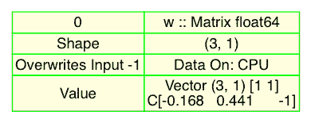

# 什么是神经网络，以及如何训练一个？

虽然我们现在已经讨论了 Go 及其可用的库，但我们还没有讨论什么构成了神经网络。在上一章的末尾，我们使用 Gorgonia 构建了一个图，当通过适当的虚拟机执行时，对一系列矩阵和向量执行几个基本操作（特别是加法和乘法）。

我们现在将讨论如何构建一个神经网络并使其正常工作。这将教会你如何构建后续在本书中讨论的更高级神经网络架构所需的组件。

本章将涵盖以下主题：

+   一个基本的神经网络

+   激活函数

+   梯度下降和反向传播

+   高级梯度下降算法

# 一个基本的神经网络

让我们首先建立一个简单的神经网络。这个网络将使用加法和乘法的基本操作来处理一个 4 x 3 的整数矩阵，初始化一个由 3 x 1 列向量表示的权重系数，并逐渐调整这些权重，直到它们预测出，对于给定的输入序列（并在应用 Sigmoid 非线性后），输出与验证数据集匹配。

# 神经网络的结构

这个示例的目的显然不是建立一个尖端的计算机视觉系统，而是展示如何在参数化函数的背景下使用这些基本操作（以及 Gorgonia 如何处理它们），其中参数是随时间学习的。本节的关键目标是理解学习网络的概念。这个*学习*实际上只是网络的连续、有意识的重新参数化（更新权重）。这是通过一个优化方法完成的，本质上是一小段代码，代表了一些基础的本科水平的微积分。

Sigmoid 函数（以及更一般的激活函数）、**随机梯度下降**（**SGD**）和反向传播将在本章的后续部分中详细讨论。目前，我们将在代码的上下文中讨论它们；即，它们在何处以及如何使用，以及它们在我们计算的函数中的作用。

当你读完这本书或者如果你是一个有经验的机器学习实践者时，下面的内容会看起来像是进入神经网络架构世界的一个极其简单的第一步。但如果这是你第一次接触，务必仔细注意。所有使魔法发生的基础都在这里。

网络由什么构成？以下是我们玩具例子神经网络的主要组成部分：

+   **输入数据**：这是一个 4 x 3 矩阵。

+   **验证数据**：这是一个 1 x 4 列向量，或者实际上是一个四行一列的矩阵。在 Gorgonia 中表示为`WithShape(4,1)`。

+   **激活（Sigmoid）函数**：这为我们的网络和我们正在学习的函数引入了非线性。

+   **突触：** 也称为**可训练权重**，是我们将使用 SGD 优化的网络的关键参数。

我们的计算图中，每个组件及其相关操作都表示为节点。当我们逐步解释网络的操作时，我们将使用我们在第一章，《Go 深度学习入门》中学到的技术生成图形可视化。

我们也将稍微超前设计我们的网络。这意味着什么？考虑以下代码块：

```py
type nn struct {
    g *ExprGraph
    w0, w1 *Node

    pred *Node
}
```

我们将网络的关键组件嵌入名为`nn`的`struct`中。这不仅使我们的代码易读，而且在我们希望对深度（多层）网络的每一层的多个权重执行优化过程（SGD/反向传播）时，它也能很好地扩展。正如你所见，除了每层的权重外，我们还有一个表示网络预测的节点，以及`*ExprGraph`本身。

我们的网络有两层。这些是在网络的前向传递过程中计算的。前向传递代表我们在计算图中希望对值节点执行的所有数值转换。

具体来说，我们有以下内容：

+   `l0`：输入矩阵，我们的`X`

+   `w0`：可训练参数，我们网络的权重，将通过 SGD 算法进行优化

+   `l1`：对`l0`和`w0`的点积应用 Sigmoid 函数的值

+   `pred`：表示网络预测的节点，反馈到`nn struct`的适当字段

那么，我们在这里的目标是什么？

我们希望建立一个系统，该系统学习一个最能够模拟列序列`0, 0, 1, 1`的函数。现在，让我们深入研究一下！

# 你的第一个神经网络

让我们从基本的包命名和导入我们需要的包开始。这个过程分为以下步骤进行：

1.  在这个示例中，我们将使用与 Gorgonia 相同开发者提供的`tensor`库。我们将用它来支持与计算图中的各自节点关联的张量：

```py
package main

import (
    "fmt"
    "io/ioutil"
    "log"

    . "gorgonia.org/gorgonia"
    "gorgonia.org/tensor"
)
```

1.  创建一个变量，将使用以下代码捕获错误：

```py
var err error
```

现在我们可以定义用于嵌入神经网络图、权重和预测（输出）的主`struct`。在更深的网络中，我们会有`w0`、`w1`、`w2`、`w3`等，一直到`wn`。这个`struct`还可能包含我们稍后章节详细讨论的额外网络参数。例如，在**卷积神经网络**（**CNN**）中，还会有每层的 dropout 概率，这有助于防止网络过度拟合我们的训练数据。重点是，无论架构有多高级或者论文有多新颖，你都可以扩展以下`struct`以表达任何网络的属性：

```py
type nn struct {
    g *ExprGraph
    w0, w1 *Node

    pred *Node
}
```

现在，我们将考虑实例化一个新的`nn`的方法。在这里，我们为我们的权重矩阵或者在这个特定情况下是我们的行向量创建节点。这个过程推广到支持*n*阶张量的任何节点的创建。

以下方法返回`ExprGraph`，并附加了新节点：

```py
func newNN(g *ExprGraph) *nn {
    // Create node for w/weight (needs fixed values replaced with random values w/mean 0)
    wB := []float64{-0.167855599, 0.44064899, -0.99977125}
    wT := tensor.New(tensor.WithBacking(wB), tensor.WithShape(3, 1))
    w0 := NewMatrix(g,
        tensor.Float64,
        WithName("w"),
        WithShape(3, 1),
        WithValue(wT),
    )
    return nn{
        g: g,
        w0: w0,
    }
}
```

现在，我们已经向图中添加了一个节点，并且用实值张量支持它，我们应该检查我们的计算图，看看这个权重是如何出现的，如下表所示：



这里需要注意的属性是类型（一个`float64`的矩阵）、`Shape`为`(3, 1)`，当然，这个向量中占据的三个值。这不算是一个图；事实上，我们的节点很孤单，但我们很快就会添加到它上面。在更复杂的网络中，每个我们使用的层都会有一个由权重矩阵支持的节点。

在我们这样做之前，我们必须添加另一个功能，使我们能够将代码扩展到这些更复杂的网络。在这里，我们正在定义网络的可学习部分，这对计算梯度至关重要。正是这些节点的列表，`Grad()`函数将操作它们。以这种方式分组这些节点使我们能够在一个函数中计算跨*n*层网络的权重梯度。扩展这一点意味着添加`w1`、`w2`、`w3`和`wn`，如下面的代码所示：

```py
func (m *nn) learnables() Nodes {
    return Nodes{m.w0}
}
```

现在，我们来到网络的核心部分。执行以下函数*时*，将使用操作和节点扩展我们的图，这些节点表示输入和隐藏层。重要的是要注意，这是一个将在我们网络的主要部分中调用的函数；现在，我们要提前定义它：

```py
func (m *nn) fwd(x *Node) (err error) {
    var l0, l1 *Node

    // Set first layer to be copy of input
    l0 = x

    // Dot product of l0 and w0, use as input for Sigmoid
    l0dot := Must(Mul(l0, m.w0))

    // Build hidden layer out of result
    l1 = Must(Sigmoid(l0dot))
    // fmt.Println("l1: \n", l1.Value())

    m.pred = l1
    return

}
```

我们可以看到在隐藏层`l1`上应用`Sigmoid`函数，正如我们在详细讨论网络组件时简要提到的那样。我们将在本章的下一部分详细介绍它。

现在，我们可以编写我们的`main`函数，在其中实例化我们的网络和所有先前描述的各种方法。让我们详细地走一遍它。这个过程的第一步如下所示：

```py
func main() {
    rand.Seed(31337)

    intercept Ctrl+C
    sigChan := make(chan os.Signal, 1)
    signal.Notify(sigChan, syscall.SIGINT, syscall.SIGTERM)
    doneChan := make(chan bool, 1)

    // Create graph and network
    g := NewGraph()
    m := newNN(g)
```

接下来，我们定义我们的输入矩阵，如下所示：

```py
    // Set input x to network
    xB := []float64{0, 0, 1, 0, 1, 1, 1, 0, 1, 1, 1, 1}
    xT := tensor.New(tensor.WithBacking(xB), tensor.WithShape(4, 3))
    x := NewMatrix(g,
        tensor.Float64,
        WithName("X"),
        WithShape(4, 3),
        WithValue(xT),
    )
```

然后，我们定义实际上将成为我们的验证数据集的部分，如下所示：

```py
    // Define validation dataset
    yB := []float64{0, 0, 1, 1}
    yT := tensor.New(tensor.WithBacking(yB), tensor.WithShape(4, 1))
    y := NewMatrix(g,
        tensor.Float64,
        WithName("y"),
        WithShape(4, 1),
        WithValue(yT),
    )
```

让我们看看我们的图现在加入了`X`和`y`之后的样子：


我们可以看到个别节点`w`、`X`和`y`。就像我们查看`w`时所做的那样，请注意每个节点的类型、`Shape`和`Value`。

现在，我们调用我们的`nn`的`fwd`方法，并真正构建我们的图，包括`X`、`y`和`w`之间的计算关系，如下面的代码所示：

```py
// Run forward pass
if err = m.fwd(x); err != nil {
    log.Fatalf("%+v", err)
}
```

优化过程从这里开始。我们的网络已经做出了第一个预测，现在我们将定义并计算一个`cost`函数，这将帮助我们确定我们的权重有多大错误，并且之后我们需要调整权重以使我们更接近目标`y`（我们的验证数据集）。在这个例子中，我们将重复这个过程固定次数，以使这个相对简单的网络收敛。

以下代码首先计算损失（即，*我们错过了多少？*）。然后，我们取`cost`作为验证数据的`Mean`：

```py
losses := Must(Sub(y, m.pred))
cost := Must(Mean(losses))
```

让我们创建一个`var`来跟踪时间内`cost`的变化，如下所示：

```py
var costVal Value
Read(cost, costVal)
```

在我们继续计算网络中的梯度之前，让我们使用以下代码生成我们图表状态的可视化，这应该已经很熟悉了：

```py
ioutil.WriteFile("pregrad.dot", []byte(g.ToDot()), 0644)
```

使用以下代码将其转换为 PNG：

```py
dot -Tpng pregrad.dot  -O
```

我们现在有一个连接包含我们数据（输入、权重和验证）及我们将在其上执行的操作的图表。

图表变得过大，无法一次性包含在一页内，因此我们现在只考虑此步骤的重要部分。首先注意到我们的权重节点现在有一个`Grad`字段，当前没有值（已运行前向传播，但我们尚未计算梯度），如下表所示：


我们现在还有一些梯度操作；以下是关于这一步的摘录图表：


现在，让我们计算梯度，相对于权重的 cost（表示为`m.learnables`）。这一步在以下代码中显示：

```py
  if _, err = Grad(cost, m.learnables()...); err != nil {
    log.Fatal(err)
  }
```

我们现在可以实例化将处理我们图表的 VM。我们也选择我们的`solver`，在本例中是一个普通的 SGD，如下所示：

```py
// Instantiate VM and Solver
vm := NewTapeMachine(g, BindDualValues(m.learnables()...))
solver := NewVanillaSolver(WithLearnRate(0.001), WithClip(5))
// solver := NewRMSPropSolver()
```

我们为我们的`vm`提供的一个新选项是`BindDualValues`。这个选项确保我们计算的梯度与包含导数值的节点绑定。这意味着，不是节点说“去节点 x 找梯度的值”，而是值立即可被`vm`访问。这是我们在图表上修改权重节点的样子：


`Value`字段现在包含输出相对于节点的偏导数。我们现在终于准备好运行我们的完整训练循环。对于这样一个简单的示例，我们将运行循环一定次数，具体来说，`10000`次循环，如下例所示：

```py
    for i := 0; i < 10000; i++ {
        if err = vm.RunAll(); err != nil {
            log.Fatalf("Failed at inter %d: %v", i, err)
        }
        solver.Step(NodesToValueGrads(m.learnables()))
        fmt.Println("\nState at iter", i)
        fmt.Println("Cost: \n", cost.Value())
        fmt.Println("Weights: \n", m.w0.Value())
        // vm.Set(m.w0, wUpd)
        // vm.Reset()
    }
    fmt.Println("Output after Training: \n", m.pred.Value())
}
```

虽然我们已经熟悉使用 VM 计算图的概念，但是这里我们添加了一个调用`solver`的步骤，这是我们之前定义的。`Step`通过可训练节点的序列（也就是我们的权重）进行工作，添加梯度并乘以我们之前指定的学习率。

就是这样！现在，我们运行我们的程序，并期望训练后的输出是 0、0、1、1，如下面的代码所示：

```py
Output after Training:
C [[0.00966449][0.00786506][0.99358898][0.99211957]]
```

这已经足够接近了，可以宣布我们的网络已经收敛了！

# 激活函数

现在你知道如何构建一个基本的神经网络了，让我们来看看模型中某些元素的目的。其中一个元素是*Sigmoid*，它是一个激活函数。有时也称为**传输函数**。

正如你之前学到的，一个给定的层可以简单地定义为应用于输入的权重；加上一些偏置然后决定激活。激活函数决定一个神经元是否被*激活*。我们还将这个函数放入网络中，以帮助创建输入和输出之间更复杂的关系。在此过程中，我们还需要它是一个能够与我们的反向传播一起工作的函数，这样我们可以通过优化方法（即梯度下降）轻松地优化我们的权重。这意味着我们需要函数的输出是可微的。

在选择激活函数时有几个要考虑的因素，如下所示：

+   **速度**：简单的激活函数比复杂的激活函数执行速度更快。这一点很重要，因为在深度学习中，我们倾向于通过大量数据运行模型，因此会多次执行每个函数。

+   **可微性**：正如我们已经注意到的，函数在反向传播过程中能够区分是有用的。具有梯度使我们能够调整权重，使网络更接近收敛。简言之，它允许我们计算错误，通过最小化成本函数来改进我们的模型。

+   **连续性**：它应该在整个输入范围内返回一个值。

+   **单调性**：虽然这个属性并不是严格必要的，但它有助于优化神经网络，因为它在梯度下降过程中会更快地收敛。使用非单调函数是可能的，但总体上会导致更长的训练时间。

# 阶跃函数

当然，最基本的激活函数可能是一个阶跃函数。如果`x`的值大于一个固定值`a`，那么`y`要么是`0`要么是`1`，如下面的代码所示：

```py
func step(x) {
    if x >= 0 {
        return 1
    } else {
        return 0
    }
}
```

如你在下图中所见，`step`函数非常简单；它接受一个值然后返回`0`或`1`：


这是一个非常简单的函数，对深度学习来说并不特别有用。这是因为这个函数的梯度是一个恒定的零，这意味着当我们进行反向传播时，它将不断产生零，这在我们执行反向传播时几乎没有（如果有的话）任何改进。

# 线性函数

对`step`函数的可能扩展是使用`linear`函数，如下面的代码所示：

```py
func linear(x){
   return 0.5 * x
}
```

这仍然非常简单，如果我们将其绘制出来，它看起来会像以下的图表：


然而，这个函数仍然不是很有用。如果我们查看其梯度，我们会看到，当我们对该函数进行微分时，我们得到的是一个与值`a`相等的直线。这意味着它遇到了与步函数相同的问题；也就是说，我们不会从反向传播中看到太多的改进。

此外，如果我们堆叠多层，你会发现我们得到的结果与仅有一层并没有太大不同。这在试图构建具有多层、特别是具有非线性关系的模型时并不实用。

# Rectified Linear Units

**修正线性单元**（**ReLU**）是目前最流行的激活函数。我们将在后面的章节中将其用作许多高级架构的主要激活函数。

可以描述为：

```py
func relu(x){
   return Max(0,x)
}
```

如果我们将其绘制出来，它看起来会像以下的图表：


正如你所见，它与线性函数极为相似，除了它趋向于零（因此表明神经元未激活）。

ReLU 还具有许多有用的属性，如下所示：

+   **它是非线性的**：因此，堆叠多层这些单元不一定会导致与单层相同

+   **它是可微的**：因此，可以与反向传播一起使用

+   **它很快**：在我们多次运行这个计算以跨层或训练网络的传递时，计算速度很重要

如果输入为负，ReLU 趋向于零。这可能是有用的，因为这会导致较少的神经元被激活，从而可能加速我们的计算。然而，由于可能结果为`0`，这可能会迅速导致神经元*死亡*，并且永远不会再次激活，给定某些输入。

# Leaky ReLU

我们可以修改 ReLU 函数，在输入为负时具有较小的梯度 —— 这可以非常快速地完成，如下所示：

```py
func leaky_relu(x) {
    if x >= 0 {
        return x
    } else {
        return 0.01 * x
    }
}
```

前述函数的图表如下所示：


请注意，此图表已经进行了强调修改，因此*y*对*x*的斜率实际上是`0.1`，而不是通常认为的`0.01`，这是被视为 Leaky ReLU 的特征之一。

由于它总是产生一个小的梯度，这应该有助于防止神经元永久性地*死亡*，同时仍然给我们带来 ReLU 的许多好处。

# Sigmoid 函数

Sigmoid 或逻辑函数也相对流行，如下所示：

```py
func sigmoid(x){
    return 1 / (1 + Exp(-x))
}
```

输出如下：


Sigmoid 还有一个有用的特性：它可以将任何实数映射回在`0`和`1`之间的范围内。这对于生成偏好于在`0`和`1`之间输出的模型非常有用（例如，用于预测某事物的概率模型）。

它也具有我们正在寻找的大多数属性，如下所列：

+   它是**非线性**的。因此，堆叠多层这样的函数不一定会导致与单层相同的结果。

+   它是**可微分**的。因此，它适用于反向传播。

+   它是**单调递增**的。

然而，其中一个缺点是与 ReLU 相比，计算成本更高，因此总体来说，使用此模型进行训练将需要更长的时间。

# Tanh

训练过程中保持较陡的梯度也可能有所帮助；因此，我们可以使用`tanh`函数而不是`Sigmoid`函数，如下面的代码所示：

```py
func tanh(x){
  return 2 * (1 + Exp(-2*x)) - 1
}
```

我们得到以下输出：


`tanh`函数还有另一个有用的特性：其斜率比`Sigmoid`函数陡峭得多；这有助于具有`tanh`激活函数的网络在调整权重时更快地下降梯度。两种函数的输出在以下输出中绘制：


# 但我们应该选择哪一个呢？

每个激活函数都很有用；然而，由于 ReLU 具有所有激活函数中最有用的特性，并且易于计算，因此这应该是您大部分时间使用的函数。

如果您经常遇到梯度陷入困境，切换到 Leaky ReLU 可能是一个好主意。然而，通常可以降低学习速率来防止这种情况，或者在较早的层中使用它，而不是在整个网络中使用它，以保持在整个网络中具有更少激活的优势。

`Sigmoid`作为输出层最有价值，最好以概率作为输出。例如，`tanh`函数也可能很有价值，例如，我们希望层次不断调整值（而不是向上偏置，如 ReLU 和 Sigmoid）。

因此，简短的答案是：这取决于您的网络以及您期望的输出类型。

但是应该注意，虽然这里提出了许多激活函数供您考虑，但其他激活函数也已被提出，例如 PReLU、softmax 和 Swish，这取决于手头的任务。这仍然是一个活跃的研究领域，并且被认为远未解决，因此请继续关注！

# 梯度下降和反向传播

在本章的第一部分示例代码的背景下，我们已经讨论了反向传播和梯度下降，但当 Gorgonia 为我们大部分工作时，真正理解起来可能会有些困难。因此，现在我们将看一下实际的过程本身。

# 梯度下降

反向传播是我们真正训练模型的方法；这是一种通过调整模型权重来最小化预测误差的算法。我们通常通过一种称为**梯度下降**的方法来实现。

让我们从一个基本的例子开始 —— 比如说我们想要训练一个简单的神经网络来完成以下任务，即通过将一个数字乘以 0.5：

| **输入** | **目标** |
| --- | --- |
| 1 | 0.5 |
| 2 | 1.0 |
| 3 | 1.5 |
| 4 | 2.0 |

我们有一个基本的模型可以开始使用，如下所示：

*y = W * x*

因此，首先，让我们猜测 *W* 实际上是两个。以下表格显示了这些结果：

| **输入** | **目标** | **W * x** |
| --- | --- | --- |
| 1 | 0.5 | 2 |
| 2 | 1.0 | 4 |
| 3 | 1.5 | 6 |
| 4 | 2.0 | 8 |

现在我们有了我们*猜测*的输出，我们可以将这个*猜测*与我们预期的答案进行比较，并计算相对误差。例如，在这个表格中，我们使用了平方误差的总和：

| **输入** | **目标** | **W * x** | **绝对误差** | **平方误差** |
| --- | --- | --- | --- | --- |
| 1 | 0.5 | 2 | -1.5 | 2.25 |
| 2 | 1.0 | 4 | -3.0 | 9 |
| 3 | 1.5 | 6 | -4.5 | 20.25 |
| 4 | 2.0 | 8 | -6.0 | 36 |

通过将前述表格中最后一列的值相加，我们现在有了平方误差的总和，为 67.5。

我们当然可以通过 brute force 方式计算从 -10 到 +10 的所有值来得出一个答案，但肯定还有更好的方法吧？理想情况下，我们希望有一种更高效的方法，适用于不是简单四个输入的数据集。

更好的方法是检查导数（或梯度）。我们可以通过稍微增加权重再次进行同样的计算来做到这一点；例如，让我们试试 *W = 2.01*。以下表格显示了这些结果：

| **输入** | **目标** | **W * x** | **绝对误差** | **平方误差** |
| --- | --- | --- | --- | --- |
| 1 | 0.5 | 2.01 | -1.51 | 2.2801 |
| 2 | 1.0 | 4.02 | -3.02 | 9.1204 |
| 3 | 1.5 | 6.03 | -4.53 | 20.5209 |
| 4 | 2.0 | 8.04 | -6.04 | 36.4816 |

这给了我们一个平方误差和为 68.403；这更高了！这意味着，直觉上来说，如果我们增加权重，误差可能会增加。反之亦然；如果我们减少权重，误差可能会减少。例如，让我们尝试 *W = 1.99*，如下表所示：

| **输入** | **目标** | **W * x** | **绝对误差** | **平方误差** |
| --- | --- | --- | --- | --- |
| 0 | 0 | 0 | 0 | 0 |
| 4 | 2 | 4.04 | -1.996 | 3.984016 |
| 8 | 4 | 8.08 | -3.992 | 15.93606 |
| 16 | 8 | 15.84 | -7.984 | 63.74426 |

这给了我们一个较低的误差值为 83.66434。

如果我们绘制给定范围内 *W* 的误差，你会发现有一个自然的底点。这是我们通过梯度下降来最小化误差的方式。

对于这个具体的例子，我们可以轻松地将误差作为权重函数来绘制。

目标是沿着斜坡向下走，直到误差为零：


让我们尝试对我们的例子应用一个权重更新来说明这是如何工作的。一般来说，我们遵循的是所谓的**增量学习规则**，其基本原理与以下类似：

*new_W = old_W - eta * derivative*

在这个公式中，*eta* 是一个常数，有时也被称为**学习率**。回想一下，在 Gorgonia 中调用 `solver` 时，我们将学习率作为其中的一个选项，如下所示：

```py
solver := NewVanillaSolver(WithLearnRate(0.001), WithClip(5))
```

你会经常看到一个 `0.5` 项被添加到关于输出的误差的导数中。这是因为，如果我们的误差函数是一个平方函数，那么导数将是 `2`，所以 `0.5` 项被放在那里来抵消它；然而，*eta* 是一个常数（所以你也可以考虑它被吸收到 *eta* 项中）。

因此，首先，我们需要计算关于输出的误差的导数是什么。

如果我们假设我们的学习率是 `0.001`，那么我们的新权重将会是以下内容：

```py
new_W = 1.00 - 0.001 * 101.338
```

如果我们要计算这个，`new_W` 将会是 `1.89866`。这更接近我们最终目标权重 `0.5`，并且通过足够的重复，我们最终会达到目标。你会注意到我们的学习率很小。如果我们设置得太大（比如说，设为 `1`），我们会调整权重到太负的方向，这样我们会在梯度周围打转，而不是向下降。学习率的选择非常重要：太小的话模型收敛会太慢，太大的话甚至可能会发散。

# 反向传播

这是一个简单的例子。对于具有数千甚至数百万参数的复杂模型，以及涉及多层的情况，我们需要更加智能地将这些更新传播回我们的网络。对于具有多层的网络（相应地增加了参数的数量），新的研究结果显示，例如包含 10,000 层的 CNNs 也不例外。

那么，我们怎么做呢？最简单的方法是通过使用我们知道导数的函数来构建你的神经网络。我们可以在符号上或更实际地进行这样的操作；如果我们将其构建成我们知道如何应用函数以及我们知道如何反向传播（通过知道如何编写导数函数），我们就可以基于这些函数构建一个神经网络。

当然，构建这些函数可能会耗费大量时间。幸运的是，Gorgonia 已经包含了所有这些功能，因此我们可以进行所谓的自动微分。正如我之前提到的，我们为计算创建了一个有向图；这不仅允许我们进行前向传播，还允许我们进行反向传播！

例如，让我们考虑一些更多层次的东西（虽然仍然简单），就像下面的这个例子，其中 **i** 是输入，**f** 是具有权重 *w1* 的第一层，**g** 是具有权重 *w2* 的第二层，**o** 是输出：


首先，我们有一个与 *o* 有关的错误，让我们称之为 *E*。

为了更新我们在 *g* 中的权重，我们需要知道关于 *g* 的输入的误差的导数。

根据导数的链式法则，当处理导数时，我们知道这实际上等效于以下内容：

*dE_dg = dE_do * do_dg * dg_dw2*

也就是说，关于 *g (dE_dg)* 的误差导数实际上等同于关于输出的误差导数 (*dE_do*)，乘以关于函数 *g (do_dg)* 的输出的导数，然后乘以函数 *g* 关于 *w2* 的导数。

这给了我们更新权重在 *g* 中的导数速率。

现在我们需要对 *f* 做同样的事情。怎么做？这是一个重复的过程。我们需要关于 *f* 的输入的误差的导数。再次使用链式法则，我们知道以下内容是正确的：

*dE_df = dE_do * do_dg * dg_df * df_dw1*

你会注意到这里与先前导数的共同之处，*dE_do * do_dg*。

这为我们提供了进一步优化的机会。每次都不必计算整个导数；我们只需要知道我们正在反向传播的层的导数以及我们正在反向传播到的层的导数，这在整个网络中都是成立的。这被称为反向传播算法，它允许我们在整个网络中更新权重，而无需不断重新计算特定权重相对于错误的导数，并且我们可以重复使用先前计算的结果。

# 随机梯度下降

我们可以通过简单的改变进一步优化训练过程。使用基本（或批量）梯度下降，我们通过查看整个数据集来计算调整量。因此，优化的下一个明显步骤是：我们可以通过查看少于整个数据集来计算调整量吗？

事实证明答案是肯定的！由于我们预期要对网络进行多次迭代训练，我们可以利用我们预期梯度会被多次更新这一事实，通过为较少的示例计算来减少计算量。我们甚至可以仅通过计算单个示例来实现这一点。通过为每次网络更新执行较少的计算，我们可以显著减少所需的计算量，从而实现更快的训练时间。这本质上是梯度下降的随机逼近，因此它得名于此。

# 高级梯度下降算法

现在我们了解了 SGD 和反向传播，让我们看看一些高级优化方法（基于 SGD），这些方法通常提供一些优势，通常是在训练时间（或将成本函数最小化到网络收敛点所需的时间）上的改进。

这些*改进*的方法包括速度作为优化参数的一般概念。引用 Wibisono 和 Wilson，在他们关于*优化中的加速方法*的论文开篇中说道：

"在凸优化中，存在一种加速现象，可以提高某些基于梯度的算法的收敛速度。"

简而言之，这些先进的算法大多依赖于类似的原则——它们可以快速通过局部最优点，受其*动量*的驱动——本质上是我们梯度的移动平均。

# 动量

在考虑梯度下降的优化时，我们确实可以借鉴现实生活中的直觉来帮助我们的方法。其中一个例子就是动量。如果我们想象大多数误差梯度实际上就像一个碗，理想的点在中间，如果我们从碗的最高点开始，可能需要很长时间才能到达碗的底部。

如果我们考虑一些真实的物理现象，碗的侧面越陡，球沿着侧面下降时速度越快。以此为灵感，我们可以得到我们可以考虑的 SGD 动量变体；我们试图通过考虑，如果梯度继续朝同一方向下降，我们给予它更多的动量来加速梯度下降。另外，如果我们发现梯度改变方向，我们会减少动量的量。

虽然我们不想陷入繁重的数学中，但有一个简单的公式可以计算*动量*。如下所示：

*V = 动量 * m - lr * g*

这里，*m* 是先前的权重更新，*g* 是关于参数 *p* 的当前梯度，*lr* 是我们求解器的学习率，而 *momentum* 是一个常数。

因此，如果我们想确切地了解如何更新我们的网络参数，我们可以通过以下方式调整公式：

*P(新) = p + v = p + 动量 * m - lr * g*

这在实践中意味着什么？让我们看看一些代码。

首先，在 Gorgonia 中，所有优化方法或求解器的基本接口如下所示：

```py
type Solver interface {
                       Step([]ValueGrad) error
                      }
```

然后，我们有以下函数，为`Solver`提供构建选项：

```py
type SolverOpt func(s Solver)
```

当然，设置的主要选项是使用动量本身；这个`SolverOpt`选项是`WithMomentum`。适用的求解器选项包括`WithL1Reg`、`WithL2Reg`、`WithBatchSize`、`WithClip`和`WithLearnRate`。

让我们使用本章开头的代码示例，但不使用普通的 SGD，而是使用动量求解器的最基本形式，如下所示：

```py
vm := NewTapeMachine(g, BindDualValues(m.learnables()...))
solver := NewMomentum()
```

就这样！但这并没有告诉我们太多，只是 Gorgonia 就像任何优秀的机器学习库一样，足够灵活和模块化，我们可以简单地替换我们的求解器（并衡量相对性能！）。

让我们来看看我们正在调用的函数，如下所示的代码：

```py
func NewMomentum(opts ...SolverOpt) *Momentum {
            s := Momentum{
            eta: 0.001,
            momentum: 0.9,
            }
 for _, opt := range opts {
            opt(s)
            }
            return s
 }
```

我们可以在这里看到我们在原始公式中引用的`momentum`常数，以及`eta`，这是我们的学习率。这就是我们需要做的一切；将动量求解器应用于我们的模型！

# Nesterov 动量

在 Nesterov 动量中，我们改变了计算梯度的位置/时间。我们朝着先前累积梯度的方向跳得更远。然后，在这个新位置测量梯度，并相应地进行修正/更新。

这种修正防止了普通动量算法更新过快，因此在梯度下降试图收敛时产生更少的振荡。

# RMSprop

我们也可以从不同的角度思考优化：如果我们根据特征重要性调整学习率会怎样？当我们在更新常见特征的参数时，我们可以降低学习率，然后在处理不常见特征时增加学习率。这也意味着我们可以花更少的时间优化学习率。有几种变体的这种想法已被提出，但迄今最受欢迎的是 RMSprop。

RMSprop 是 SGD 的修改形式，虽然未公开，但在 Geoffrey Hinton 的《机器学习的神经网络》中有详细阐述。RMSprop 听起来很高级，但也可以简单地称为**自适应梯度下降**。基本思想是根据某些条件修改学习率。

这些条件可以简单地陈述如下：

+   如果函数的梯度很小但一致，那么增加学习率

+   如果函数的梯度很大但不一致，那么降低学习率

RMSprop 的具体做法是通过将权重的学习率除以先前梯度的衰减平均来实现的。

Gorgonia 本身支持 RMSprop。与动量示例类似，您只需更换您的`solver`。以下是您如何定义它，以及您想要传递的多个`solveropts`：

```py
solver = NewRMSPropSolver(WithLearnRate(stepSize), WithL2Reg(l2Reg), WithClip(clip))
```

检查底层函数时，我们看到以下选项及其相关的默认衰减因子、平滑因子和学习率：

```py
func NewRMSPropSolver(opts...SolverOpt) * RMSPropSolver {
    s: = RMSPropSolver {
        decay: 0.999,
        eps: 1e-8,
        eta: 0.001,
    }

        for _,
    opt: = range opts {
        opt(s)
    }
    return s
}
```

# 总结

在本章中，我们介绍了如何构建简单的神经网络以及如何检查您的图表，以及许多常用的激活函数。然后，我们介绍了神经网络通过反向传播和梯度下降进行训练的基础知识。最后，我们讨论了一些不同的梯度下降算法选项以及神经网络的优化方法。

下一章将介绍构建实用的前馈神经网络和自编码器，以及**受限玻尔兹曼机**（**RBMs**）。
