# 超越基本神经网络 - 自编码器和 RBM

现在我们已经学会了如何构建和训练一个简单的神经网络，我们应该构建一些适合实际问题的模型。

在本章中，我们将讨论如何构建一个能识别和生成手写体的模型，以及执行协同过滤。

在本章中，我们将涵盖以下主题：

+   加载数据 – **修改的国家标准技术研究所**（**MNIST**）数据库

+   建立手写体识别的神经网络

+   建立自编码器 – 生成 MNIST 数字

+   建立**受限玻尔兹曼机**（**RBM**）以进行类似 Netflix 的协同过滤

# 加载数据 – MNIST

在我们甚至可以开始训练或构建我们的模型之前，我们首先需要获取一些数据。事实证明，许多人已经在线上提供了可供我们使用的数据。其中一个最好的精选数据集就是 MNIST，我们将在本章的前两个示例中使用它。

我们将学习如何下载 MNIST 并将其加载到我们的 Go 程序中，以便在我们的模型中使用。

# 什么是 MNIST？

在本章中，我们将使用一个名为 MNIST 的流行数据集。这个数据集由 Yann LeCun、Corinna Cortes 和 Christopher Burges 在[`yann.lecun.com/exdb/mnist`](http://yann.lecun.com/exdb/mnist)上提供。

这个数据库因其由两个包含黑白手写数字图像的数据库混合而成的事实而得名。它是一个理想的数据集示例，已经经过预处理和良好的格式化，因此我们可以立即开始使用它。当您下载它时，它已经分成了训练集和测试（验证）集，训练集中有 60,000 个标记示例，测试集中有 10,000 个标记示例。

每个图像正好是 28 x 28 像素，包含一个从 1 到 255 的值（反映像素强度或灰度值）。这对我们来说非常简化了事情，因为这意味着我们可以立即将图像放入矩阵/张量中，并开始对其进行训练。

# 加载 MNIST

Gorgonia 在其`examples`文件夹中带有一个 MNIST 加载器，我们可以通过将以下内容放入我们的导入中轻松在我们的代码中使用它：

```py
"gorgonia.org/gorgonia/examples/mnist"
```

然后，我们可以将以下行添加到我们的代码中：

```py
var inputs, targets tensor.Tensor
var err error
inputs, targets, err = mnist.Load(“train”, “./mnist/, “float64”)
```

这将我们的图像加载到名为`inputs`的张量中，并将我们的标签加载到名为`targets`的张量中（假设您已将相关文件解压缩到一个名为`mnist`的文件夹中，该文件夹应该在您的可执行文件所在的位置）。

在这个例子中，我们正在加载 MNIST 的训练集，因此会产生一个大小为 60,000 x 784 的二维张量用于图像，以及一个大小为 60,000 x 10 的张量用于标签。Gorgonia 中的加载器还会很方便地将所有数字重新缩放到 0 到 1 之间；在训练模型时，我们喜欢小而标准化的数字。

# 建立手写体识别的神经网络

现在我们已经加载了所有这些有用的数据，让我们好好利用它。因为它充满了手写数字，我们应该确实构建一个模型来识别这种手写和它所说的内容。

在第二章，*什么是神经网络以及如何训练一个*中，我们演示了如何构建一个简单的神经网络。现在，是时候建立更为重要的东西了：一个能够识别 MNIST 数据库中手写内容的模型。

# 模型结构简介

首先，让我们回顾一下原始示例：我们有一个单层网络，我们希望从一个 4x3 矩阵得到一个 4x1 向量。现在，我们必须从一个 MNIST 图像（28x28 像素）得到一个单一的数字。这个数字是我们的网络关于图像实际代表的数字的猜测。

以下截图展示了在 MNIST 数据中可以找到的粗略示例：一些手写数字的灰度图像旁边有它们的标签（这些标签是单独存储的）：

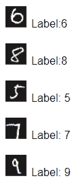

# 层

请记住，我们正在处理张量数据，因此我们需要将这些数据与那些数据格式联系起来。一个单独的图像可以是一个 28x28 的矩阵，或者可以是一个 784 个值的长向量。我们的标签当前是从 0 到 9 的整数。然而，由于这些实际上是分类值而不是从 0 到 9 的连续数值，最好将结果转换为向量。我们不应该要求我们的模型直接产生这个输出，而是应该将输出视为一个包含 10 个值的向量，其中位置为 1 告诉我们它认为是哪个数字。

这为我们提供了正在使用的参数；我们需要输入 784 个值，然后从我们训练过的网络中获取 10 个值。例如，我们按照以下图表构建我们的层：

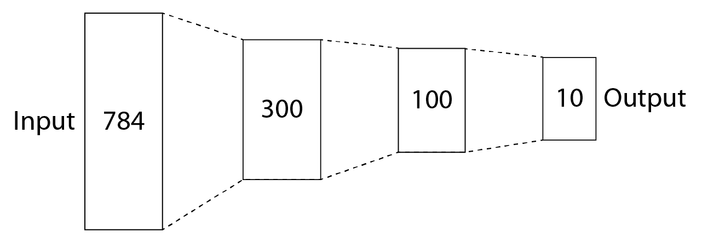

这种结构通常被描述为具有两个隐藏层，每个层分别有**300**和**100**个单元。这可以用以下代码在 Gorgonia 中实现：

```py
type nn struct {
    g *gorgonia.ExprGraph
    w0, w1, w2 *gorgonia.Node

    out *gorgonia.Node
    predVal gorgonia.Value
}

func newNN(g *gorgonia.ExprGraph) *nn {
    // Create node for w/weight
    w0 := gorgonia.NewMatrix(g, dt, gorgonia.WithShape(784, 300), gorgonia.WithName("w0"), gorgonia.WithInit(gorgonia.GlorotN(1.0)))
   w1 := gorgonia.NewMatrix(g, dt, gorgonia.WithShape(300, 100), gorgonia.WithName("w1"), gorgonia.WithInit(gorgonia.GlorotN(1.0)))
    w2 := gorgonia.NewMatrix(g, dt, gorgonia.WithShape(100, 10), gorgonia.WithName("w2"), gorgonia.WithInit(gorgonia.GlorotN(1.0)))

    return &nn{
        g: g,
        w0: w0,
        w1: w1,
        w2: w2,
    }
}
```

我们还使用了你在第二章*什么是神经网络以及如何训练一个*中学到的 ReLU 激活函数。事实证明，ReLU 非常适合这个任务。因此，我们网络的前向传播看起来像是这样：

```py
func (m *nn) fwd(x *gorgonia.Node) (err error) {
    var l0, l1, l2 *gorgonia.Node
    var l0dot, l1dot*gorgonia.Node

    // Set first layer to be copy of input
    l0 = x

    // Dot product of l0 and w0, use as input for ReLU
    if l0dot, err = gorgonia.Mul(l0, m.w0); err != nil {
        return errors.Wrap(err, "Unable to multiply l0 and w0")
    }

    // Build hidden layer out of result
    l1 = gorgonia.Must(gorgonia.Rectify(l0dot))

    // MOAR layers

    if l1dot, err = gorgonia.Mul(l1, m.w1); err != nil {
        return errors.Wrap(err, "Unable to multiply l1 and w1")
    }
    l2 = gorgonia.Must(gorgonia.Rectify(l2dot))

    var out *gorgonia.Node
    if out, err = gorgonia.Mul(l2, m.w2); err != nil {
        return errors.Wrapf(err, "Unable to multiply l2 and w2")
    }

    m.out, err = gorgonia.SoftMax(out)
    gorgonia.Read(m.out, &m.predVal)
    return
}
```

您可以看到，我们网络的最终输出传递到 Gorgonia 的`SoftMax`函数。这通过将所有值重新缩放到 0 到 1 之间的值来压缩我们的输出总和为 1。这非常有用，因为我们使用的 ReLU 激活单元可能会产生非常大的数值。我们希望有一个简单的方法使我们的值尽可能接近我们的标签，看起来有点像以下内容：

```py
[ 0.1 0.1 0.1 1.0 0.1 0.1 0.1 0.1 0.1 ]
```

使用`SoftMax`训练的模型将产生如下值：

```py
[ 0 0 0 0.999681 0 0.000319 0 0 0 0 ]
```

通过获取具有最大值的向量元素，我们可以看到预测的标签是`4`。

# 训练

训练模型需要几个重要的组件。我们有输入，但我们还需要有损失函数和解释输出的方法，以及设置一些其他模型训练过程中的超参数。

# 损失函数

损失函数在训练我们的网络中发挥了重要作用。虽然我们没有详细讨论它们，但它们的作用是告诉我们的模型什么时候出错，以便它可以从错误中学习。

在本例中，我们使用了经过修改以尽可能高效的方式实现的交叉熵损失版本。

应该注意的是，交叉熵损失通常用伪代码表示，如下所示：

```py
crossEntropyLoss = -1 * sum(actual_y * log(predicted_y))
```

然而，在我们的情况下，我们要选择一个更简化的版本：

```py
loss = -1 * mean(actual_y * predicted_y)
```

所以，我们正在实现损失函数如下：

```py
losses, err := gorgonia.HadamardProd(m.out, y)
if err != nil {
    log.Fatal(err)
}
cost := gorgonia.Must(gorgonia.Mean(losses))
cost = gorgonia.Must(gorgonia.Neg(cost))

// we wanna track costs
var costVal gorgonia.Value
gorgonia.Read(cost, &costVal)
```

作为练习，你可以将损失函数修改为更常用的交叉熵损失，并比较你的结果。

# Epochs（时期）、iterations（迭代）和 batch sizes（批量大小）

由于我们的数据集现在要大得多，我们也需要考虑如何实际进行训练。逐个项目进行训练是可以的，但我们也可以批量训练项目。与其在 MNIST 的所有 60,000 个项目上进行训练，不如将数据分成 600 次迭代，每次迭代 100 个项目。对于我们的数据集，这意味着将 100 x 784 的矩阵作为输入而不是 784 个值的长向量。我们也可以将其作为 100 x 28 x 28 的三维张量输入，但这将在后面的章节中涵盖适合利用这种结构的模型架构时再详细讨论。

由于我们是在一个编程语言中进行操作，我们只需构建如下循环：

```py
for b := 0; b < batches; b++ {
    start := b * bs
    end := start + bs
    if start >= numExamples {
        break
    }
    if end > numExamples {
        end = numExamples
    }
}
```

然后，在每个循环内，我们可以插入我们的逻辑来提取必要的信息以输入到我们的机器中：

```py
var xVal, yVal tensor.Tensor
if xVal, err = inputs.Slice(sli{start, end}); err != nil {
    log.Fatal("Unable to slice x")
}

if yVal, err = targets.Slice(sli{start, end}); err != nil {
    log.Fatal("Unable to slice y")
}
// if err = xVal.(*tensor.Dense).Reshape(bs, 1, 28, 28); err != nil {
// log.Fatal("Unable to reshape %v", err)
// }
if err = xVal.(*tensor.Dense).Reshape(bs, 784); err != nil {
    log.Fatal("Unable to reshape %v", err)
}

gorgonia.Let(x, xVal)
gorgonia.Let(y, yVal)
if err = vm.RunAll(); err != nil {
    log.Fatalf("Failed at epoch %d: %v", i, err)
}
solver.Step(m.learnables())
vm.Reset()
```

在深度学习中，你会经常听到另一个术语，epochs（时期）。Epochs 实际上只是多次运行输入数据到你的数据中。如果你回忆一下，梯度下降是一个迭代过程：它非常依赖于重复来收敛到最优解。这意味着我们有一种简单的方法来改进我们的模型，尽管只有 60,000 张训练图片：我们可以重复这个过程多次，直到我们的网络收敛。

我们当然可以以几种不同的方式来管理这个问题。例如，当我们的损失函数在前一个 epoch 和当前 epoch 之间的差异足够小时，我们可以停止重复。我们还可以运行冠军挑战者方法，并从在我们的测试集上出现为冠军的 epochs 中取权重。然而，因为我们想保持我们的例子简单，我们将选择一个任意数量的 epochs；在这种情况下，是 100 个。

当我们在进行这些操作时，让我们也加上一个进度条，这样我们可以看着我们的模型训练：

```py
batches := numExamples / bs
log.Printf("Batches %d", batches)
bar := pb.New(batches)
bar.SetRefreshRate(time.Second / 20)
bar.SetMaxWidth(80)

for i := 0; i < *epochs; i++ {
    // for i := 0; i < 1; i++ {
    bar.Prefix(fmt.Sprintf("Epoch %d", i))
    bar.Set(0)
    bar.Start()
    // put iteration and batch logic above here
    bar.Update()
    log.Printf("Epoch %d | cost %v", i, costVal)
}
```

# 测试和验证

训练当然很重要，但我们还需要知道我们的模型是否确实在做它声称要做的事情。我们可以重复使用我们的训练代码，但让我们做一些改变。

首先，让我们删除 `solver` 命令。我们正在测试我们的模型，而不是训练它，所以我们不应该更新权重：

```py
solver.Step(m.learnables())
```

其次，让我们将数据集中的图像保存到一个便于处理的文件中：

```py
for j := 0; j < xVal.Shape()[0]; j++ {
    rowT, _ := xVal.Slice(sli{j, j + 1})
    row := rowT.Data().([]float64)

    img := visualizeRow(row)

    f, _ := os.OpenFile(fmt.Sprintf("images/%d - %d - %d - %d.jpg", b, j, rowLabel, rowGuess), os.O_CREATE|os.O_WRONLY|os.O_TRUNC, 0644)
    jpeg.Encode(f, img, &jpeg.Options{jpeg.DefaultQuality})
    f.Close()
}
```

如您所见，以下几点是正确的：

+   `b` 是我们的批次号

+   `j` 是批次中的项目编号

+   `rowLabel` 是由 MNIST 提供的标签

+   `rowGuess` 是我们模型的猜测或预测

现在，让我们添加一些方法来将我们的数据标签和预测提取到更易读的格式中（即作为从 0 到 9 的整数）。

对于我们的数据标签，让我们添加以下内容：

```py
yRowT, _ := yVal.Slice(sli{j, j + 1})
yRow := yRowT.Data().([]float64)
var rowLabel int
var yRowHigh float64

for k := 0; k < 10; k++ {
    if k == 0 {
        rowLabel = 0
        yRowHigh = yRow[k]
    } else if yRow[k] > yRowHigh {
        rowLabel = k
        yRowHigh = yRow[k]
    }
}
```

对于我们的预测，我们首先需要将它们提取到熟悉的格式中。在这种情况下，让我们将它们放入一个张量中，这样我们就可以重复使用我们之前的所有代码：

```py
arrayOutput := m.predVal.Data().([]float64)
yOutput := tensor.New(
            tensor.WithShape(bs, 10),                                             tensor.WithBacking(arrayOutput)
            )
```

注意，从 `m.predVal` 输出的结果是包含我们预测值的 `float64` 数组。您也可以检索对象的原始形状，这有助于您创建正确形状的张量。在这种情况下，我们已经知道形状，所以我们直接放入这些参数。

预测代码当然与从预处理的 MNIST 数据集中提取标签类似：

```py
// get prediction
predRowT, _ := yOutput.Slice(sli{j, j + 1})
predRow := predRowT.Data().([]float64)
var rowGuess int
var predRowHigh float64

// guess result
for k := 0; k < 10; k++ {
    if k == 0 {
        rowGuess = 0
        predRowHigh = predRow[k]
    } else if predRow[k] > predRowHigh {
        rowGuess = k
        predRowHigh = predRow[k]
    }
}
```

为了所有这些辛勤工作，您将获得一个包含以下标签和猜测的图像文件夹：

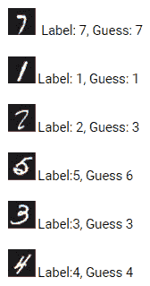

您会发现，在其当前形式下，我们的模型在处理一些（可能是糟糕的）手写时存在困难。

# 仔细观察

或者，您可能还想检查输出的预测，以更好地理解模型中发生的情况。在这种情况下，您可能希望将结果提取到 `.csv` 文件中，您可以使用以下代码来完成：

```py
arrayOutput := m.predVal.Data().([]float64)
yOutput := tensor.New(tensor.WithShape(bs, 10), tensor.WithBacking(arrayOutput))

file, err := os.OpenFile(fmt.Sprintf("%d.csv", b), os.O_CREATE|os.O_WRONLY, 0777)
if err = xVal.(*tensor.Dense).Reshape(bs, 784); err != nil {
 log.Fatal("Unable to create csv", err)
}
defer file.Close()
var matrixToWrite [][]string

for j := 0; j < yOutput.Shape()[0]; j++ {
  rowT, _ := yOutput.Slice(sli{j, j + 1})
  row := rowT.Data().([]float64)
  var rowToWrite []string

  for k := 0; k < 10; k++ {
      rowToWrite = append(rowToWrite, strconv.FormatFloat(row[k], 'f', 6, 64))
  }
  matrixToWrite = append(matrixToWrite, rowToWrite)
}

csvWriter := csv.NewWriter(file)
csvWriter.WriteAll(matrixToWrite)
csvWriter.Flush()
```

有问题的数字的输出可以在以下截图和代码输出中看到。

下面是截图输出：

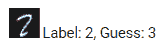

您也可以在代码中观察相同的输出：

```py
[ 0  0  0.000457  0.99897  0  0  0  0.000522  0.000051  0 ]
```

同样，你可以看到它稍微有所变动，如下截图所示：

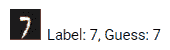

在代码格式中，这也是相同的：

```py
[0 0 0 0 0 0 0 1 0 0]
```

# 练习

我们已经从第二章，*什么是神经网络以及如何训练它？*，扩展了我们的简单示例。此时，尝试一些内容并自行观察结果，以更好地理解您的选择可能产生的影响，将是个好主意。例如，您应该尝试以下所有内容：

+   更改损失函数

+   更改每层的单元数

+   更改层数

+   更改时期数量

+   更改批次大小

# 建立自编码器 - 生成 MNIST 数字

自动编码器的作用正如其名：它自动学习如何对数据进行编码。通常，自动编码器的目标是训练它自动将数据编码到更少的维度中，或者提取数据中的某些细节或其他有用的信息。它还可用于去除数据中的噪声或压缩数据。

一般来说，自动编码器有两部分：编码器和解码器。我们倾向于同时训练这两部分，目标是使解码器的输出尽可能接近我们的输入。

# 层

就像之前一样，我们需要考虑我们的输入和输出。我们再次使用 MNIST，因为编码数字是一个有用的特征。因此，我们知道我们的输入是 784 像素，我们也知道我们的输出也必须有 784 像素。

由于我们已经有了将输入和输出解码为张量的辅助函数，我们可以直接转向我们的神经网络。我们的网络如下：

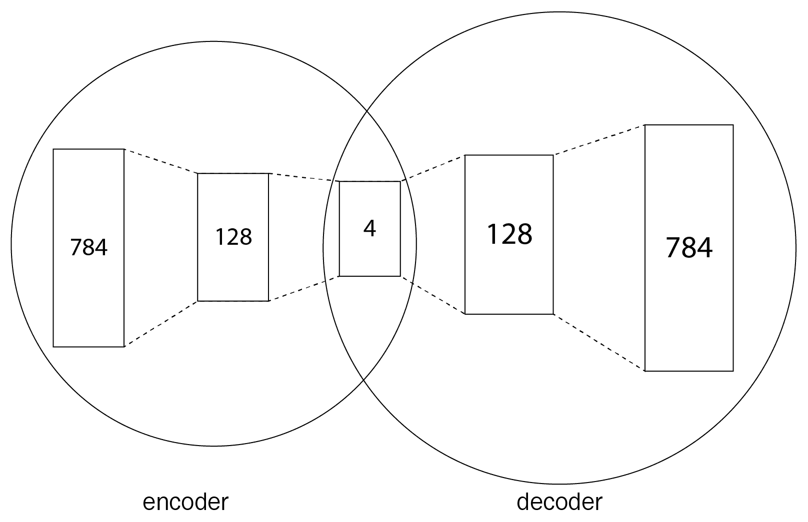

我们可以重复使用上一个示例中的大部分代码，只需更改我们的层次结构：

```py
func newNN(g *gorgonia.ExprGraph) *nn {
    // Create node for w/weight
    w0 := gorgonia.NewMatrix(g, dt, gorgonia.WithShape(784, 128), gorgonia.WithName("w0"), gorgonia.WithInit(gorgonia.GlorotU(1.0)))
    w1 := gorgonia.NewMatrix(g, dt, gorgonia.WithShape(128, 64), gorgonia.WithName("w1"), gorgonia.WithInit(gorgonia.GlorotU(1.0)))
    w2 := gorgonia.NewMatrix(g, dt, gorgonia.WithShape(64, 128), gorgonia.WithName("w2"), gorgonia.WithInit(gorgonia.GlorotU(1.0)))
    w3 := gorgonia.NewMatrix(g, dt, gorgonia.WithShape(128, 784), gorgonia.WithName("w3"), gorgonia.WithInit(gorgonia.GlorotU(1.0)))

    return &nn{
        g: g,
        w0: w0,
        w1: w1,
        w2: w2,
        w3: w3,
    }
}
```

但是，这次我们不会使用 ReLU 激活函数，因为我们知道我们的输出必须是 0 和 1。我们使用`Sigmoid`激活函数，因为这给了我们一个方便的输出。正如您在以下代码块中看到的，虽然我们在每一层都使用它，但你也可以在除了最后一层以外的每个地方都使用 ReLU 激活函数，因为理想情况下，输出层应该被限制在`0`到`1`之间：

```py
func (m *nn) fwd(x *gorgonia.Node) (err error) {
    var l0, l1, l2, l3, l4 *gorgonia.Node
    var l0dot, l1dot, l2dot, l3dot *gorgonia.Node

    // Set first layer to be copy of input
    l0 = x

    // Dot product of l0 and w0, use as input for Sigmoid
    if l0dot, err = gorgonia.Mul(l0, m.w0); err != nil {
        return errors.Wrap(err, "Unable to multiple l0 and w0")
    }
    l1 = gorgonia.Must(gorgonia.Sigmoid(l0dot))

    if l1dot, err = gorgonia.Mul(l1, m.w1); err != nil {
        return errors.Wrap(err, "Unable to multiple l1 and w1")
    }
    l2 = gorgonia.Must(gorgonia.Sigmoid(l1dot))

    if l2dot, err = gorgonia.Mul(l2, m.w2); err != nil {
        return errors.Wrap(err, "Unable to multiple l2 and w2")
    }
    l3 = gorgonia.Must(gorgonia.Sigmoid(l2dot))

    if l3dot, err = gorgonia.Mul(l3, m.w3); err != nil {
        return errors.Wrap(err, "Unable to multiple l3 and w3")
    }
    l4 = gorgonia.Must(gorgonia.Sigmoid(l3dot))

    // m.pred = l3dot
    // gorgonia.Read(m.pred, &m.predVal)
    // return nil

    m.out = l4
    gorgonia.Read(l4, &m.predVal)
    return

}
```

# 训练

与以前一样，我们需要一个用于训练目的的损失函数。自动编码器的输入和输出也是不同的！

# 损失函数

这次，我们的损失函数不同。我们使用的是均方误差的平均值，其伪代码如下所示：

```py
mse = sum( (actual_y - predicted_y) ^ 2 ) / num_of_y
```

在 Gorgonia 中可以轻松实现如下：

```py
losses, err := gorgonia.Square(gorgonia.Must(gorgonia.Sub(y, m.out)))
if err != nil {
    log.Fatal(err)
}
cost := gorgonia.Must(gorgonia.Mean(losses))
```

# 输入和输出

注意，这次我们的输入和输出是相同的。这意味着我们不需要为数据集获取标签，并且在运行虚拟机时，我们可以将`x`和`y`都设置为我们的输入数据：

```py
gorgonia.Let(x, xVal)
gorgonia.Let(y, xVal)
```

# 时期、迭代和批次大小

这个问题要解决起来更难。您会发现，为了了解我们的输出如何改进，这里非常有价值地运行几个时期，因为我们可以在训练过程中编写我们模型的输出，如下代码：

```py
for j := 0; j < 1; j++ {
    rowT, _ := yOutput.Slice(sli{j, j + 1})
    row := rowT.Data().([]float64)

    img := visualizeRow(row)

    f, _ := os.OpenFile(fmt.Sprintf("training/%d - %d - %d training.jpg", j, b, i), os.O_CREATE|os.O_WRONLY|os.O_TRUNC, 0644)
    jpeg.Encode(f, img, &jpeg.Options{jpeg.DefaultQuality})
    f.Close()
}
```

在我们训练模型的过程中，我们可以观察到它在每个时期的改善：

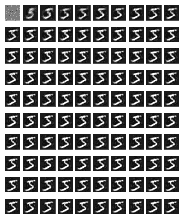

你可以看到我们从几乎纯噪声开始，然后很快得到一个模糊的形状，随着时期的推移，形状逐渐变得更清晰。

# 测试和验证

我们不会详细讨论测试代码，因为我们已经讲过如何从输出中获取图像，但请注意，现在`y`也有`784`列：

```py
arrayOutput := m.predVal.Data().([]float64)
yOutput := tensor.New(tensor.WithShape(bs, 784), tensor.WithBacking(arrayOutput))

for j := 0; j < yOutput.Shape()[0]; j++ {
    rowT, _ := yOutput.Slice(sli{j, j + 1})
    row := rowT.Data().([]float64)

    img := visualizeRow(row)

    f, _ := os.OpenFile(fmt.Sprintf("images/%d - %d output.jpg", b, j), os.O_CREATE|os.O_WRONLY|os.O_TRUNC, 0644)
    jpeg.Encode(f, img, &jpeg.Options{jpeg.DefaultQuality})
    f.Close()
}
```

现在，这里有个有趣的部分：从我们的自动编码器中获取结果：

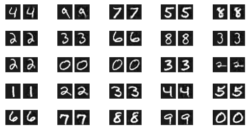

您会注意到结果与输入图像相比明显不太清晰。然而，它也消除了一些图像中的噪音！

# 构建类似 Netflix 风格的协同过滤的 RBM

现在我们将探索一种不同的无监督学习技术，例如，能够处理反映特定用户对特定内容喜好的数据。本节将介绍网络架构和概率分布的新概念，以及它们如何在实际推荐系统的实施中使用，特别是用于推荐可能对给定用户感兴趣的电影。

# RBM 简介。

从教科书的定义来看，RBM 是**概率图模型**，这——考虑到我们已经涵盖的神经网络结构——简单地意味着一群神经元之间存在加权连接。

这些网络有两层：一个**可见**层和一个**隐藏**层。可见层是您向其中输入数据的层，隐藏层则是不直接暴露于您的数据，但必须为当前任务开发其有意义的表示的层。这些任务包括降维、协同过滤、二元分类等。受限意味着连接不是横向的（即在同一层的节点之间），而是每个隐藏单元与网络层之间的每个可见单元连接。图是无向的，这意味着数据不能固定在一个方向上流动。如下所示：

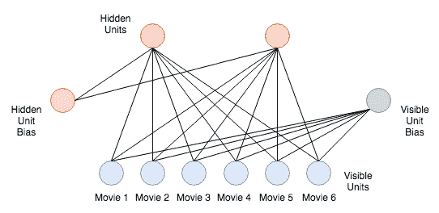

训练过程相对简单，并与我们的普通神经网络不同，我们不仅进行预测、测试预测的强度，然后反向传播错误通过网络。在我们的 RBM 的情况下，这只是故事的一半。

进一步分解训练过程，RBM 的前向传播如下：

+   可见层节点值乘以连接权重。

+   隐藏单元偏置被添加到结果值的所有节点之和中（强制激活）。

+   激活函数被应用。

+   给定隐藏节点的值（激活概率）。

如果这是一个深度网络，隐藏层的输出将作为另一层的输入传递。这种架构的一个例子是**深度置信网络**（**DBN**），这是由 Geoff Hinton 及其在多伦多大学的团队完成的另一项重要工作，它使用多个叠加的 RBM。

然而，我们的 RBM 不是一个深度网络。因此，我们将使用隐藏单元输出做一些与网络的可见单元重构的不同尝试。我们将通过使用隐藏单元作为网络训练的后向或重构阶段的输入来实现这一点。

后向传递看起来与前向传递相似，并通过以下步骤执行：

1.  隐藏层激活作为输入乘以连接权重

1.  可见单元偏置被添加到所有节点乘积的总和中

1.  计算重构误差，或者预测输入与实际输入（我们从前向传递中了解到的）的差异

1.  该错误用于更新权重以尽量减少重构误差

两个状态（隐藏层预测激活和可见层预测输入）共同形成联合概率分布。

如果您对数学有兴趣，两个传递的公式如下所示：

+   **前向传递**：*a*（隐藏节点激活）的概率给出加权输入*x*：

*p(a|x; w)*

+   **后向传递**：*x*（可见层输入）的概率给出加权激活*a*：

*p(x|a; w)*

+   因此，联合概率分布简单地由以下给出：

*p(a, x)*

重构因此可以从我们迄今讨论过的技术种类中以不同方式考虑。它既不是回归（为给定的输入集预测连续输出），也不是分类（为给定的输入集应用类标签）。这一点通过我们在重构阶段计算错误的方式来清楚地表现出来。我们不仅仅测量输入与预测输入之间的实数差异（输出的差异）；相反，我们比较所有值的概率分布的*x*输入与*重建*输入的所有值。我们使用一种称为**Kullback-Leibler 散度**的方法执行此比较。本质上，这种方法测量每个概率分布曲线下不重叠的面积。然后，我们尝试通过权重调整和重新运行训练循环来减少这种散度（误差），从而使曲线更接近，如下图所示：

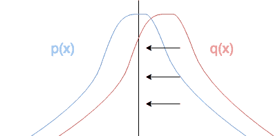

在训练结束时，当这种错误被最小化时，我们可以预测给定用户可能会喜欢哪些其他电影。

# RBMs 用于协同过滤

如本节介绍所讨论的，RBM 可以在多种情况下，无论是监督还是非监督方式下使用。**协同过滤**是一种预测用户偏好的策略，其基本假设是如果用户*A*喜欢物品*Z*，并且用户*B*也喜欢物品*Z*，那么用户*B*可能还喜欢用户*A*喜欢的其他东西（例如物品*Y*）。

我们每次看到 Netflix 向我们推荐内容时，或每次亚马逊向我们推荐新吸尘器时（因为我们当然买了一个吸尘器，现在显然对家用电器感兴趣）都可以看到这种用例。

现在我们已经涵盖了 RBM 是什么、它们如何工作以及它们如何使用的一些理论知识，让我们开始构建一个吧！

# 准备我们的数据 – GroupLens 电影评分

我们正在使用 GroupLens 数据集。它包含了从 MovieLens（[`www.movielens.org`](http://www.movielens.org)）收集的用户、电影和评分的集合，并由明尼苏达大学的多位学术研究人员管理。

我们需要解析 `ratings.dat` 文件，该文件使用冒号作为分隔符，以获取 `userids`、`ratings` 和 `movieids`。然后，我们可以将 `movieids` 与 `movies.dat` 中的电影匹配。

首先，让我们看看我们需要构建电影索引的代码：

```py
package main

import (

  // "github.com/aotimme/rbm"

  "fmt"
  "log"
  "math"
  "strconv"

  "github.com/yunabe/easycsv"
  g "gorgonia.org/gorgonia"
  "gorgonia.org/tensor"
)

var datasetfilename string = "dataset/cleanratings.csv"
var movieindexfilename string = "dataset/cleanmovies.csv"    

func BuildMovieIndex(input string) map[int]string {

  var entrycount int
  r := easycsv.NewReaderFile(input, easycsv.Option{
    Comma: ',',
  })

  var entry struct {
    Id int `index:"0"`
    Title string `index:"1"`
  }

  //fix hardcode
  movieindex := make(map[int]string, 3952)

  for r.Read(&entry) {
    // fmt.Println(entry)
    movieindex[entry.Id] = entry.Title
    // entries = append(entries, entry)
    entrycount++
  }

  return movieindex

}
```

现在，我们编写一个函数来导入原始数据并将其转换为 *m* x *n* 矩阵。在此矩阵中，行代表单个用户，列代表他们在数据集中每部电影上的（归一化）评分：

```py
func DataImport(input string) (out [][]int, uniquemovies map[int]int) {
  //
  // Initial data processing
  //
  // import from CSV, read into entries var
  r := easycsv.NewReaderFile(input, easycsv.Option{
    Comma: ',',
  })

  var entry []int
  var entries [][]int
  for r.Read(&entry) {
    entries = append(entries, entry)
  }

  // maps for if unique true/false
  seenuser := make(map[int]bool)
  seenmovie := make(map[int]bool)

  // maps for if unique index
  uniqueusers := make(map[int]int)
  uniquemovies = make(map[int]int)

  // counters for uniques
  var uniqueuserscount int = 0
  var uniquemoviescount int = 0

  // distinct movie lists/indices
  for _, e := range entries {
    if seenmovie[e[1]] == false {
      uniquemovies[uniquemoviescount] = e[1]
      seenmovie[e[1]] = true
      uniquemoviescount++
    } else if seenmovie[e[1]] == true {
      // fmt.Printf("Seen movie %v before, aborting\n", e[0])
      continue
    }
  }
  // distinct user lists/indices
  for _, e := range entries {
    if seenuser[e[0]] == false {
      uniqueusers[uniqueuserscount] = e[0]
      seenuser[e[0]] = true
      uniqueuserscount++
      // uniqueusers[e[0]] =
    } else if seenuser[e[0]] == true {
      // fmt.Printf("Seen user %v before, aborting\n", e[0])
      continue
    }
  }

  uservecs := make([][]int, len(uniqueusers))
  for i := range uservecs {
    uservecs[i] = make([]int, len(uniquemovies))
  }
```

以下是我们处理 CSV 中每行数据并添加到用户主切片和电影评分子切片的主循环：

```py
  var entriesloop int
  for _, e := range entries {
    // hack - wtf
    if entriesloop%100000 == 0 && entriesloop != 0 {
      fmt.Printf("Processing rating %v of %v\n", entriesloop, len(entries))
    }
    if entriesloop > 999866 {
      break
    }
    var currlike int

    // normalisze ratings
    if e[2] >= 4 {
      currlike = 1
    } else {
      currlike = 0
    }

    // add to a user's vector of index e[1]/movie num whether current movie is +1
    // fmt.Println("Now looping uniquemovies")
    for i, v := range uniquemovies {
      if v == e[1] {
        // fmt.Println("Now setting uservec to currlike")
        // uservec[i] = currlike
        // fmt.Println("Now adding to uservecs")
        uservecs[e[0]][i] = currlike
        break
      }
    }
    // fmt.Printf("Processing rating %v of %v\n", entriesloop, len(entries))
    entriesloop++
  }
  // fmt.Println(uservecs)
  // os.Exit(1)

  // fmt.Println(entry)
  if err := r.Done(); err != nil {
    log.Fatalf("Failed to read a CSV file: %v", err)
  }
  // fmt.Printf("length uservecs %v and uservecs.movies %v", len(uservecs))
  fmt.Println("Number of unique users: ", len(seenuser))
  fmt.Println("Number of unique movies: ", len(seenmovie))
  out = uservecs

  return

}
```

# 在 Gorgonia 中构建 RBM

现在我们清理了数据，创建了训练或测试集，并编写了生成网络输入所需的代码后，我们可以开始编写 RBM 本身的代码。

首先，我们从现在开始使用我们的标准 `struct`，这是我们将网络各组件附加到其中的基础架构：

```py
const cdS = 1
type ggRBM struct {
    g *ExprGraph
    v *Node // visible units
    vB *Node // visible unit biases - same size tensor as v
    h *Node // hidden units
    hB *Node // hidden unit biases - same size tensor as h
    w *Node // connection weights
    cdSamples int // number of samples for contrastive divergence - WHAT ABOUT MOMENTUM
}
func (m *ggRBM) learnables() Nodes {
    return Nodes{m.w, m.vB, m.hB}
}
```

然后，我们添加附加到我们的 RBM 的辅助函数：

1.  首先，我们添加用于我们的 `ContrastiveDivergence` 学习算法（使用 Gibbs 采样）的 `func`：

```py
// Uses Gibbs Sampling
func (r *ggRBM) ContrastiveDivergence(input *Node, learnRate float64, k int) {
   rows := float64(r.TrainingSize)

 // CD-K
   phMeans, phSamples := r.SampleHiddenFromVisible(input)
   nvSamples := make([]float64, r.Inputs)
// iteration 0

   _, nvSamples, nhMeans, nhSamples := r.Gibbs(phSamples, nvSamples)

   for step := 1; step < k; step++ {

       /*nvMeans*/ _, nvSamples, nhMeans, nhSamples = r.Gibbs(nhSamples, nvSamples)

   }

   // Update weights
   for i := 0; i < r.Outputs; i++ {

       for j := 0; j < r.Inputs; j++ {

           r.Weights[i][j] += learnRate * (phMeans[i]*input[j] - nhMeans[i]*nvSamples[j]) / rows
       }
       r.Biases[i] += learnRate * (phSamples[i] - nhMeans[i]) / rows
   }

   // update hidden biases
   for j := 0; j < r.Inputs; j++ {

       r.VisibleBiases[j] += learnRate * (input[j] - nvSamples[j]) / rows
   }
}
```

1.  现在，我们添加了函数来采样我们的可见层或隐藏层：

```py
func (r *ggRBM) SampleHiddenFromVisible(vInput *Node) (means []float64, samples []float64) {
   means = make([]float64, r.Outputs)
   samples = make([]float64, r.Outputs)
   for i := 0; i < r.Outputs; i++ {
       mean := r.PropagateUp(vInput, r.Weights[i], r.Biases[i])
       samples[i] = float64(binomial(1, mean))
       means[i] = mean
   }
   return means, samples
}

func (r *ggRBM) SampleVisibleFromHidden(hInput *Node) (means []float64, samples []float64) {
   means = make([]float64, r.Inputs)
   samples = make([]float64, r.Inputs)
   for j := 0; j < r.Inputs; j++ {
       mean := r.PropagateDown(hInput, j, r.VisibleBiases[j])
       samples[j] = float64(binomial(1, mean))
       means[j] = mean
   }
   return means, samples
}
```

1.  接着，我们添加几个处理权重更新传播的函数：

```py
func (r *ggRBM) PropagateDown(h *Node, j int, hB *Node) *Node {
   retVal := 0.0
   for i := 0; i < r.Outputs; i++ {
       retVal += r.Weights[i][j] * h0[i]
   }
   retVal += bias
   return sigmoid(retVal)
}

func (r *ggRBM) PropagateUp(v *Node, w *Node, vB *Node) float64 {
   retVal := 0.0
   for j := 0; j < r.Inputs; j++ {
       retVal += weights[j] * v0[j]
   }
   retVal += bias
   return sigmoid(retVal)
}
```

1.  现在，我们添加了 Gibbs 采样的函数（与我们之前使用的 `ContrastiveDivergence` 函数相同），以及执行网络重构步骤的函数：

```py
func (r *ggRBM) Gibbs(h, v *Node) (vMeans []float64, vSamples []float64, hMeans []float64, hSamples []float64) {
   vMeans, vSamples = r.SampleVisibleFromHidden(r.h)
   hMeans, hSamples = r.SampleHiddenFromVisible(r.v)
   return
}

func (r *ggRBM) Reconstruct(x *Node) *Node {
   hiddenLayer := make([]float64, r.Outputs)
   retVal := make([]float64, r.Inputs)

   for i := 0; i < r.Outputs; i++ {
       hiddenLayer[i] = r.PropagateUp(x, r.Weights[i], r.Biases[i])
   }

   for j := 0; j < r.Inputs; j++ {
       activated := 0.0
       for i := 0; i < r.Outputs; i++ {
           activated += r.Weights[i][j] * hiddenLayer[i]
       }
       activated += r.VisibleBiases[j]
       retVal[j] = sigmoid(activated)
   }
   return retVal
}
```

1.  接下来，我们添加实例化我们的 RBM 的函数：

```py
func newggRBM(g *ExprGraph, cdS int) *ggRBM {

   vT := tensor.New(tensor.WithBacking(tensor.Random(tensor.Int, 3952)), tensor.WithShape(3952, 1))

   v := NewMatrix(g,
       tensor.Int,
       WithName("v"),
       WithShape(3952, 1),
       WithValue(vT),
   )

   hT := tensor.New(tensor.WithBacking(tensor.Random(tensor.Int, 200)), tensor.WithShape(200, 1))

   h := NewMatrix(g,
       tensor.Int,
       WithName("h"),
       WithShape(200, 1),
       WithValue(hT),
   )

   wB := tensor.Random(tensor.Float64, 3952*200)
   wT := tensor.New(tensor.WithBacking(wB), tensor.WithShape(3952*200, 1))
   w := NewMatrix(g,
       tensor.Float64,
       WithName("w"),
       WithShape(3952*200, 1),
       WithValue(wT),
   )

   return &ggRBM{
       g: g,
       v: v,
       h: h,
       w: w,
       // hB: hB,
       // vB: vB,
       cdSamples: cdS,
   }
}
```

1.  最后，我们训练模型：

```py
func main() {
   g := NewGraph()
   m := newggRBM(g, cdS)
   data, err := ReadDataFile(datasetfilename)
   if err != nil {
       log.Fatal(err)
   }
   fmt.Println("Data read from CSV: \n", data)
   vm := NewTapeMachine(g, BindDualValues(m.learnables()...))
   // solver := NewVanillaSolver(WithLearnRate(1.0))
   for i := 0; i < 1; i++ {
       if vm.RunAll() != nil {
           log.Fatal(err)
       }
   }
}
```

在执行代码之前，我们需要对数据进行一些预处理。这是因为我们数据集中使用的分隔符是 `::`，但我们希望将其更改为 `,`。本章节的存储库包含在文件夹根目录中的 `preprocess.sh`，它会为我们执行以下操作：

```py
#!/bin/bash
export LC_CTYPE=C
export LANG=C
cat ratings.dat | sed 's/::/,/g' > cleanratings.csv
cat movies.dat | sed 's/,//g; s/::/,/g' > cleanmovies.csv
```

现在我们的数据格式化得很好，让我们执行 RBM 的代码并观察输出如下：

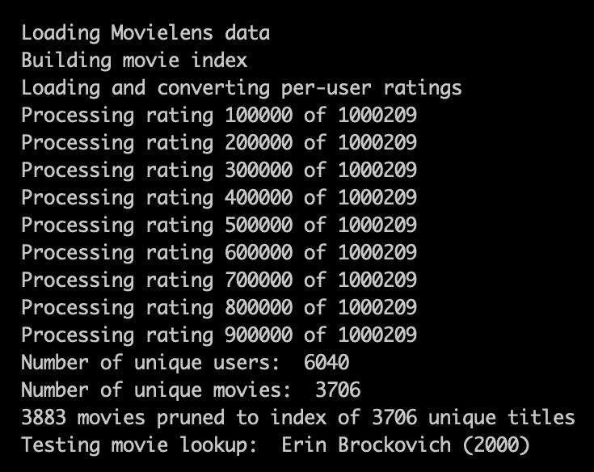

在这里，我们看到我们的数据导入函数正在处理评分和电影索引文件，并构建每个用户向量的长度为 `3706` 的用户评分（归一化为 `0`/`1`）：

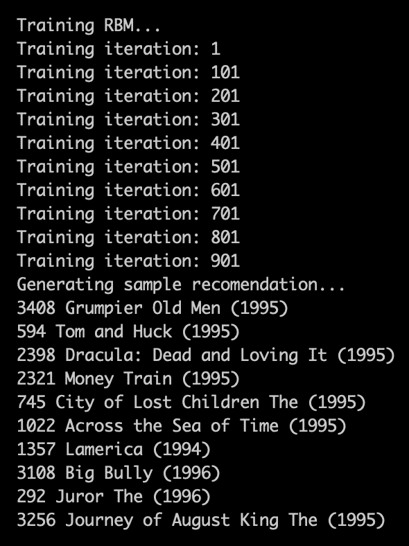

训练阶段完成后（这里设置为 1,000 次迭代），RBM 会为随机选择的用户生成一组推荐。

现在，您可以尝试不同的超参数，并尝试输入您自己的数据！

# 总结

在本章中，我们学习了如何构建一个简单的多层神经网络和自编码器。我们还探讨了概率图模型 RBM 的设计和实现，以无监督方式创建电影推荐引擎。

强烈建议您尝试将这些模型和架构应用于其他数据片段，以查看它们的表现如何。

在下一章中，我们将看一下深度学习的硬件方面，以及 CPU 和 GPU 如何确切地满足我们的计算需求。

# 进一步阅读

+   *协同过滤的限制玻尔兹曼机*，这是多伦多大学研究小组的原始论文，可以在[`www.cs.toronto.edu/~rsalakhu/papers/rbmcf.pdf`](https://www.cs.toronto.edu/~rsalakhu/papers/rbmcf.pdf)查阅。

+   *限制玻尔兹曼机模拟人类选择*，这篇论文探讨了限制玻尔兹曼机在建模*人类选择*（例如我们例子中对某种类型电影的偏好）方面的有效性，并提出了在心理学等其他领域的应用，可在[://papers.nips.cc/paper/5280-restricted-boltzmann-machines-modeling-human-choice.pdf](https://papers.nips.cc/paper/5280-restricted-boltzmann-machines-modeling-human-choice.pdf)查阅。
