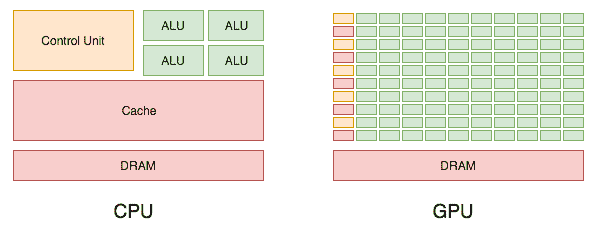
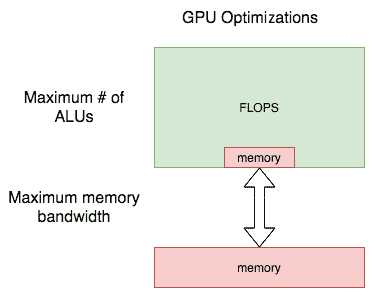
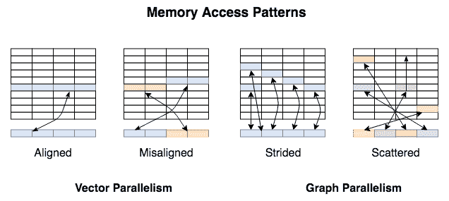
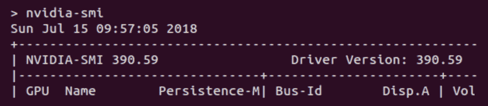
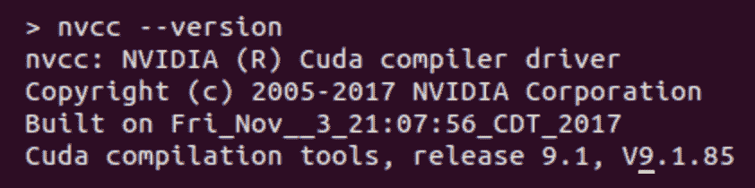
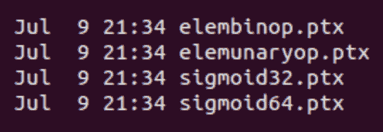
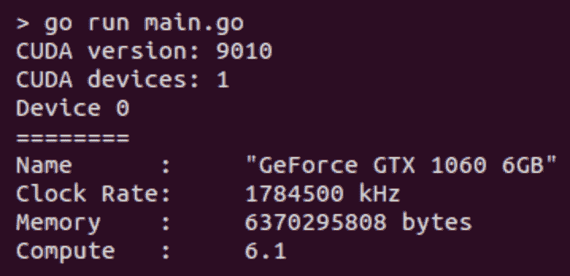

# CUDA - GPU 加速训练

本章将探讨深度学习的硬件方面。首先，我们将看看 CPU 和 GPU 在构建**深度神经网络**（**DNNs**）时如何满足我们的计算需求，它们之间的区别以及它们的优势在哪里。GPU 提供的性能改进是深度学习成功的核心。

我们将学习如何让 Gorgonia 与我们的 GPU 配合工作，以及如何利用**CUDA**来加速我们的 Gorgonia 模型：这是 NVIDIA 的软件库，用于简化构建和执行 GPU 加速深度学习模型。我们还将学习如何构建一个使用 GPU 加速操作的模型，并对比这些模型与 CPU 对应物的性能来确定不同任务的最佳选择。

本章将涵盖以下主题：

+   CPU 与 GPU 对比

+   理解 Gorgonia 和 CUDA

+   使用 CUDA 在 Gorgonia 中构建模型

+   用于训练和推理的 CPU 与 GPU 模型的性能基准测试

# CPU 与 GPU 对比

到目前为止，我们已经涵盖了神经网络的基本理论和实践，但我们还没有多考虑运行它们的处理器。因此，让我们暂停编码，更深入地讨论实际执行工作的这些小小硅片。

从 30,000 英尺高空看，CPU 最初是为了支持标量操作而设计的，这些操作是按顺序执行的，而 GPU 则设计用于支持向量操作，这些操作是并行执行的。神经网络在每个层内执行大量的独立计算（比如，每个神经元乘以它的权重），因此它们是适合于偏向大规模并行的芯片设计的处理工作负载。

让我们通过一个示例来具体说明一下，这种类型的操作如何利用每种性能特征。拿两个行向量 [1, 2, 3] 和 [4, 5, 6] 作为例子，如果我们对它们进行逐元素矩阵乘法，看起来会像这样：

```py
CPU, 2ns per operation (higher per-core clock than GPU, fewer cores):

1 * 4
2 * 5
3 * 6
     = [4, 10, 18]

Time taken: 6ns

GPU, 4ns per operation (lower per-core clock than CPU, more cores):

1 * 4 | 2 * 5 | 3 *6
     = [4, 10, 18]

Time taken: 4ns
```

如你所见，CPU 是按顺序执行计算，而 GPU 是并行执行的。这导致 GPU 完成计算所需的时间比 CPU 少。这是我们在处理与 DNN 相关的工作负载时关心的两种处理器之间的基本差异。

# 计算工作负载和芯片设计

这种差异如何在处理器的实际设计中体现？这张图表，摘自 NVIDIA 自己的 CUDA 文档，说明了这些差异：



控制或缓存单元减少，而核心或 ALUs 数量显著增加。这导致性能提升一个数量级（或更多）。与此相关的警告是，相对于内存、计算和功耗，GPU 的效率远非完美。这就是为什么许多公司正在竞相设计一个从头开始为 DNN 工作负载优化缓存单元/ALUs 比例，并改善数据被拉入内存然后供给计算单元的方式的处理器。目前，内存在 GPU 中是一个瓶颈，如下图所示：



只有当 ALUs 有东西可以处理时，它们才能工作。如果我们用尽了芯片上的内存，我们必须去 L2 缓存，这在 GPU 中比在 CPU 中更快，但访问芯片内 L1 内存仍然比访问芯片外 L2 缓存要慢得多。我们将在后面的章节中讨论这些缺陷，以及新的和竞争性的芯片设计的背景。目前，理解的重要事情是，理想情况下，我们希望在芯片中尽可能塞入尽可能多的 ALUs 和尽可能多的芯片内缓存，以正确的比例，并且在处理器和它们的内存之间进行快速通信。对于这个过程，CPU 确实工作，但 GPU 更好得多。而且目前，它们是广泛面向消费者的最适合机器学习的硬件。

# GPU 中的内存访问

现在，你可能已经清楚，当我们把深度学习的工作负载卸载到我们的处理器时，快速和本地的内存是性能的关键。然而，重要的不仅仅是内存的数量和接近程度，还有这些内存的访问方式。想象一下硬盘上的顺序访问与随机访问性能，原则是相同的。

为什么对 DNNs 这么重要？简单来说，它们是高维结构，最终需要嵌入到供给我们 ALUs 的内存的一维空间中。现代（向量）GPU，专为图形工作负载而建，假设它们将访问相邻的内存，即一个 3D 场景的一部分将存储在相关部分旁边（帧中相邻像素）。因此，它们对这种假设进行了优化。我们的网络不是 3D 场景。它们的数据布局是稀疏的，依赖于网络（及其反过来的图）结构和它们所持有的信息。

下图代表了这些不同工作负载的内存访问模式：



对于深度神经网络（DNNs），当我们编写操作时，我们希望尽可能接近**跨距（Strided）**内存访问模式。毕竟，在 DNNs 中，矩阵乘法是比较常见的操作之一。

# 实际性能

为了真实体验实际性能差异，让我们比较适合神经网络工作负载之一的 CPU，即 Intel Xeon Phi，与 2015 年的 NVIDIA Maxwell GPU。

# Intel Xeon Phi CPU

这里有一些硬性能数字：

+   该芯片的计算单元每秒可达 2,400 Gflops，并从 DRAM 中提取 88 Gwords/sec，比率为 27/1

+   这意味着每次从内存中提取的字，有 27 次浮点操作

# NVIDIA 的 Maxwell GPU

现在，这是参考 NVIDIA GPU 的数字。特别注意比率的变化：

+   6,100 Gflops/sec

+   84 Gwords/sec

+   比率为 72/1

因此，就每块内存中的原始操作而言，GPU 具有明显的优势。

当然，深入微处理器设计的细节超出了本书的范围，但思考处理器内存和计算单元的分布是有用的。现代芯片的设计理念可以总结为*尽可能多地将浮点单位集成到芯片上，以实现最大的计算能力相对于所需的功耗/产生的热量*。

思想是尽可能保持这些算术逻辑单元（ALUs）处于完整状态，从而最小化它们空闲时的时间。

# 了解 Gorgonia 和 CUDA

在我们深入介绍 Gorgonia 如何与 CUDA 协作之前，让我们快速介绍一下 CUDA 及其背景。

# **CUDA**

CUDA 是 NVIDIA 的 GPU 编程语言。这意味着您的 AMD 卡不支持 CUDA。在不断发展的深度学习库、语言和工具的景观中，它是事实上的标准。C 实现是免费提供的，但当然，它仅与 NVIDIA 自家的硬件兼容。

# 基础线性代数子程序

正如我们迄今所建立的网络中所看到的，张量操作对机器学习至关重要。GPU 专为这些类型的向量或矩阵操作设计，但我们的软件也需要设计以利用这些优化。这就是**BLAS**的作用！

**BLAS** 提供了线性代数操作的基本组成部分，通常在图形编程和机器学习中广泛使用。**BLAS** 库是低级的，最初用 Fortran 编写，将其提供的功能分为三个*级别*，根据涵盖的操作类型定义如下：

+   **Level 1**：对步进数组的向量操作，点积，向量范数和广义向量加法

+   **Level 2**：广义矩阵-向量乘法，解决包含上三角矩阵的线性方程

+   **Level 3**：矩阵操作，包括**广义矩阵乘法**（**GEMM**）

**Level 3** 操作是我们在深度学习中真正感兴趣的。以下是 Gorgonia 中 CUDA 优化卷积操作的示例。

# Gorgonia 中的 CUDA

Gorgonia 已经实现了对 NVIDIA 的 CUDA 的支持，作为其`cu`包的一部分。它几乎隐藏了所有的复杂性，因此我们在构建时只需简单地指定`--tags=cuda`标志，并确保我们调用的操作实际上存在于 Gorgonia 的 API 中。

当然，并非所有可能的操作都实现了。重点是那些从并行执行中获益并适合 GPU 加速的操作。正如我们将在第五章中介绍的，*使用递归神经网络进行下一个词预测*，许多与**卷积神经网络**（**CNNs**）相关的操作符合这一标准。

那么，有哪些可用的呢？以下列表概述了选项：

+   1D 或 2D 卷积（在 CNN 中使用）

+   2D 最大池化（也用于 CNN 中！）

+   Dropout（杀死一些神经元！）

+   ReLU（回顾第二章，*什么是神经网络及其训练方式？*中的激活函数）

+   批标准化

现在，我们将依次查看每个的实现。

查看 `gorgonia/ops/nn/api_cuda.go`，我们可以看到以下形式的 2D 卷积函数：

```py
func Conv2d(im, filter *G.Node, kernelShape tensor.Shape, pad, stride, dilation []int) (retVal *G.Node, err error) {
    var op *convolution
    if op, err = makeConvolutionOp(im, filter, kernelShape, pad, stride, dilation); err != nil {
        return nil, err
    }
    return G.ApplyOp(op, im, filter)
}
```

下面的 1D 卷积函数返回一个 `Conv2d()` 实例，这是一种提供两种选项的简洁方法：

```py
func Conv1d(in, filter *G.Node, kernel, pad, stride, dilation int) (*G.Node, error) {
    return Conv2d(in, filter, tensor.Shape{1, kernel}, []int{0, pad}, []int{1, stride}, []int{1, dilation})
}
```

接下来是 `MaxPool2D()` 函数。在 CNN 中，最大池化层是特征提取过程的一部分。输入的维度被减少，然后传递给后续的卷积层。

在这里，我们创建了一个带有 `XY` 参数的 `MaxPool` 实例，并返回在我们的输入节点上运行 `ApplyOp()` 的结果，如以下代码所示：

```py
func MaxPool2D(x *G.Node, kernel tensor.Shape, pad, stride []int) (retVal *G.Node, err error) {
    var op *maxpool
    if op, err = newMaxPoolOp(x, kernel, pad, stride); err != nil {
        return nil, err
    }
    return G.ApplyOp(op, x)
}
```

`Dropout()` 是一种正则化技术，用于防止网络过拟合。我们希望尽可能学习输入数据的最一般表示，而丢失功能可以帮助我们实现这一目标。

`Dropout()` 的结构现在应该已经很熟悉了。它是另一种在层内可以并行化的操作，如下所示：

```py
func Dropout(x *G.Node, prob float64) (retVal *G.Node, err error) {
    var op *dropout
    if op, err = newDropout(x, prob); err != nil {
        return nil, err
    }

    // states := &scratchOp{x.Shape().Clone(), x.Dtype(), ""}
    // m := G.NewUniqueNode(G.WithType(x.Type()), G.WithOp(states), G.In(x.Graph()), G.WithShape(states.shape...))

    retVal, err = G.ApplyOp(op, x)
    return
}
```

我们在第二章中介绍的标准 ReLU 函数也是可用的，如下所示：

```py
func Rectify(x *G.Node) (retVal *G.Node, err error) {
 var op *activation
 if op, err = newRelu(); err != nil {
 return nil, err
 }
 retVal, err = G.ApplyOp(op, x)
 return
}
```

`BatchNorm()` 稍微复杂一些。回顾一下由 Szegedy 和 Ioffe（2015）描述批标准化的原始论文，我们看到对于给定的批次，我们通过减去批次的均值并除以标准差来对前一层的输出进行归一化。我们还可以观察到添加了两个参数，这些参数将通过 SGD 进行训练。

现在，我们可以看到 CUDA 化的 Gorgonia 实现如下。首先，让我们执行函数定义和数据类型检查：

```py
func BatchNorm(x, scale, bias *G.Node, momentum, epsilon float64) (retVal, γ, β *G.Node, op *BatchNormOp, err error) {
    dt, err := dtypeOf(x.Type())
    if err != nil {
        return nil, nil, nil, nil, err
    }
```

然后，需要创建一些临时变量，以允许虚拟机分配额外的内存：

```py
channels := x.Shape()[1]
H, W := x.Shape()[2], x.Shape()[3]
scratchShape := tensor.Shape{1, channels, H, W}

meanScratch := &gpuScratchOp{scratchOp{x.Shape().Clone(), dt, "mean"}}
varianceScratch := &gpuScratchOp{scratchOp{x.Shape().Clone(), dt, "variance"}}
cacheMeanScratch := &gpuScratchOp{scratchOp{scratchShape, dt, "cacheMean"}}
cacheVarianceScratch := &gpuScratchOp{scratchOp{scratchShape, dt, "cacheVariance"}}
```

然后，我们在计算图中创建等效的变量：

```py
g := x.Graph()

dims := len(x.Shape())

mean := G.NewTensor(g, dt, dims, G.WithShape(scratchShape.Clone()...), G.WithName(x.Name()+"_mean"), G.WithOp(meanScratch))

variance := G.NewTensor(g, dt, dims, G.WithShape(scratchShape.Clone()...), G.WithName(x.Name()+"_variance"), G.WithOp(varianceScratch))

cacheMean := G.NewTensor(g, dt, dims, G.WithShape(scratchShape.Clone()...),      G.WithOp(cacheMeanScratch))

cacheVariance := G.NewTensor(g, dt, dims, G.WithShape(scratchShape.Clone()...), G.WithOp(cacheVarianceScratch))
```

然后，在应用函数并返回结果之前，我们在图中创建了我们的比例和偏差变量：

```py
if scale == nil {
    scale = G.NewTensor(g, dt, dims, G.WithShape(scratchShape.Clone()...), G.WithName(x.Name()+"_γ"), G.WithInit(G.GlorotN(1.0)))
}

if bias == nil {
    bias = G.NewTensor(g, dt, dims, G.WithShape(scratchShape.Clone()...), G.WithName(x.Name()+"_β"), G.WithInit(G.GlorotN(1.0)))
}

op = newBatchNormOp(momentum, epsilon)

retVal, err = G.ApplyOp(op, x, scale, bias, mean, variance, cacheMean, cacheVariance)

return retVal, scale, bias, op, err
```

接下来，让我们看看如何在 Gorgonia 中构建利用 CUDA 的模型。

# 在 Gorgonia 中构建支持 CUDA 的模型

在支持 CUDA 的 Gorgonia 中构建一个模型之前，我们需要先做几件事情。我们需要安装 Gorgonia 的 `cu` 接口到 CUDA，并且准备好一个可以训练的模型！

# 为 Gorgonia 安装 CUDA 支持

要使用 CUDA，您需要一台配有 NVIDIA GPU 的计算机。不幸的是，将 CUDA 设置为与 Gorgonia 配合使用是一个稍微复杂的过程，因为它涉及设置能够与 Go 配合使用的 C 编译环境，以及能够与 CUDA 配合使用的 C 编译环境。NVIDIA 已经确保其编译器与每个平台的常用工具链兼容：在 Windows 上是 Visual Studio，在 macOS 上是 Clang-LLVM，在 Linux 上是 GCC。

安装 CUDA 并确保一切正常运行需要一些工作。我们将介绍如何在 Windows 和 Linux 上完成此操作。由于截至撰写本文时，Apple 已经多年未推出配备 NVIDIA GPU 的计算机，因此我们不会介绍如何在 macOS 上执行此操作。您仍然可以通过将外部 GPU 连接到您的 macOS 上来使用 CUDA，但这是一个相当复杂的过程，并且截至撰写本文时，Apple 尚未正式支持使用 NVIDIA GPU 的设置。

# Linux

正如我们讨论过的，一旦 CUDA 设置好了，只需在构建 Gorgonia 代码时添加`-tags=cuda`就可以简单地在 GPU 上运行它。但是如何达到这一点呢？让我们看看。

此指南要求您安装标准的 Ubuntu 18.04。NVIDIA 提供了独立于发行版的安装说明（以及故障排除步骤）：[`docs.nvidia.com/cuda/cuda-installation-guide-linux/index.html`](https://docs.nvidia.com/cuda/cuda-installation-guide-linux/index.html)。

在高层次上，您需要安装以下软件包：

+   NVIDIA 驱动

+   CUDA

+   cuDNN

+   libcupti-dev

首先，您需要确保安装了 NVIDIA 的专有（而不是开源默认）驱动程序。快速检查是否运行了它的方法是执行`nvidia-smi`。您应该看到类似以下内容的输出，指示驱动程序版本号和关于您的 GPU 的其他详细信息：



如果出现`command not found`错误，则有几种选择，这取决于您所运行的 Linux 发行版。最新的 Ubuntu 发行版允许您从默认存储库安装大部分 CUDA 依赖项（包括专有的 NVIDIA 驱动程序）。可以通过执行以下命令完成此操作：

```py
sudo apt install nvidia-390 nvidia-cuda-toolkit libcupti-dev
```

或者，您可以按照官方 NVIDIA 指南中的步骤手动安装各种依赖项。

安装完成并重新启动系统后，请再次运行`nvidia-smi`确认驱动程序已安装。您还需要验证 CUDA C 编译器（`nvidia-cuda-toolkit`包的一部分）是否已安装，方法是执行`nvcc --version`。输出应该类似于以下内容：



安装了 CUDA 之后，还需要执行一些额外的步骤，以确保 Gorgonia 已经编译并准备好使用必要的 CUDA 库：

1.  确保你正在构建的模块的目标目录存在。 如果不存在，请使用以下命令创建它：

```py
mkdir $GOPATH/src/gorgonia.org/gorgonia/cuda\ modules/target
```

1.  运行 `cudagen` 来按如下方式构建模块：

```py
cd $GOPATH/src/gorgonia.org/gorgonia/cmd/cudagen
go run main.go
```

1.  程序执行后，请验证 `/target` 目录是否填充了表示我们在构建网络时将使用的 CUDA 化操作的文件，如下截图所示：



1.  现在初步工作已完成，让我们使用以下命令测试一切是否正常：

```py
go install gorgonia.org/cu/cmd/cudatest cudatest
cd $GOPATH/src/gorgonia.org/cu/cmd/cudatest
go run main.go
```

你应该看到类似以下的输出：



现在你已经准备好利用 GPU 提供的所有计算能力了！

# Windows

Windows 的设置非常类似，但你还需要提供适用于 Go 和 CUDA 的 C 编译器。 这个设置在以下步骤中详细说明：

1.  安装 GCC 环境；在 Windows 上做到这一点的最简单方法是安装 MSYS2。 你可以从 [`www.msys2.org/`](https://www.msys2.org/) 下载 MSYS2。

1.  在安装 MSYS2 后，使用以下命令更新你的安装：

```py
pacman -Syu
```

1.  重新启动 MSYS2 并再次运行以下命令：

```py
pacman -Su
```

1.  安装 GCC 包如下：

```py
pacman -S mingw-w64-x86_64-toolchain
```

1.  安装 Visual Studio 2017 以获取与 CUDA 兼容的编译器。 在撰写本文时，你可以从 [`visualstudio.microsoft.com/downloads/`](https://visualstudio.microsoft.com/downloads/) 下载此软件。 社区版工作正常；如果你有其他版本的许可证，它们也可以使用。

1.  安装 CUDA。 你可以从 NVIDIA 网站下载此软件：[`developer.nvidia.com/cuda-downloads`](https://developer.nvidia.com/cuda-downloads)。 根据我的经验，如果无法使网络安装程序工作，请尝试本地安装程序。

1.  然后，你还应该从 NVIDIA 安装 cuDNN：[`developer.nvidia.com/cudnn`](https://developer.nvidia.com/cudnn)。 安装过程是简单的复制粘贴操作，非常简单。

1.  设置环境变量，以便 Go 和 NVIDIA CUDA 编译器驱动程序 (`nvcc`) 知道如何找到相关的编译器。 你应该根据需要替换 CUDA、MSYS2 和 Visual Studio 安装的位置。 你需要添加的内容和相关变量名如下：

```py
C_INCLUDE_PATH
C:\Program Files\NVIDIA GPU Computing Toolkit\CUDA\v9.2\include

LIBRARY_PATH
C:\Program Files\NVIDIA GPU Computing Toolkit\CUDA\v9.2\lib\x64

PATH
C:\Program Files\NVIDIA GPU Computing Toolkit\CUDA\v9.2\bin
C:\Program Files\NVIDIA GPU Computing Toolkit\CUDA\v9.2\libnvvp
C:\msys64\mingw64\bin
C:\Program Files (x86)\Microsoft Visual Studio 14.0\VC\bin\x86_amd64
```

1.  环境现在应该正确设置，以编译支持 CUDA 的 Go 二进制文件。

现在，为了 Gorgonia，你需要首先按以下步骤进行一些操作：

1.  首先确保为你将要构建的模块存在以下 `target` 目录：

```py
$GOPATH/src/gorgonia.org/gorgonia/cuda\ modules/target
```

1.  然后运行 `cudagen` 来按如下方式构建模块：

```py
cd $GOPATH/src/gorgonia.org/gorgonia/cmd/cudagen
go run main.go
```

1.  现在你已经安装好 `cudatest`，如下所示：

```py
go install gorgonia.org/cu/cmd/cudatest cudatest
```

1.  如果现在运行 `cudatest`，并且一切正常，你将得到类似以下的输出：

```py
CUDA version: 9020
CUDA devices: 1
Device 0
========
Name : "GeForce GTX 1080"
Clock Rate: 1835000 kHz
Memory : 8589934592 bytes
Compute : 6.1
```

# 为训练和推理的 CPU 对 GPU 模型的性能基准测试

现在我们已经完成了所有这些工作，让我们探索使用 GPU 进行深度学习的一些优势。首先，让我们详细了解如何使你的应用程序实际使用 CUDA，然后我们将详细介绍一些 CPU 和 GPU 的速度。

# 如何使用 CUDA

如果你已经完成了所有前面的步骤来使 CUDA 工作，那么使用 CUDA 是一个相当简单的事情。你只需使用以下内容编译你的应用程序：

```py
go build -tags='cuda'
```

这样构建你的可执行文件就支持 CUDA，并使用 CUDA 来运行你的深度学习模型，而不是 CPU。

为了说明，让我们使用一个我们已经熟悉的例子 – 带有权重的神经网络：

```py
w0 := gorgonia.NewMatrix(g, dt, gorgonia.WithShape(784, 300), gorgonia.WithName("w0"), gorgonia.WithInit(gorgonia.GlorotN(1.0)))

w1 := gorgonia.NewMatrix(g, dt, gorgonia.WithShape(300, 100), gorgonia.WithName("w1"), gorgonia.WithInit(gorgonia.GlorotN(1.0)))

w2 := gorgonia.NewMatrix(g, dt, gorgonia.WithShape(100, 10), gorgonia.WithName("w2"), gorgonia.WithInit(gorgonia.GlorotN(1.0)))
```

这只是我们简单的前馈神经网络，我们构建它来在 MNIST 数据集上使用。

# CPU 结果

通过运行代码，我们得到的输出告诉我们每个 epoch 开始的时间，以及上次执行时我们的成本函数值大约是多少。对于这个特定的任务，我们只运行了 10 个 epochs，结果如下所示：

```py
2018/07/21 23:48:45 Batches 600
2018/07/21 23:49:12 Epoch 0 | cost -0.6898460176511779
2018/07/21 23:49:38 Epoch 1 | cost -0.6901109698353116
2018/07/21 23:50:05 Epoch 2 | cost -0.6901978951202982
2018/07/21 23:50:32 Epoch 3 | cost -0.6902410983814113
2018/07/21 23:50:58 Epoch 4 | cost -0.6902669350941992
2018/07/21 23:51:25 Epoch 5 | cost -0.6902841232197489
2018/07/21 23:51:52 Epoch 6 | cost -0.6902963825164774
2018/07/21 23:52:19 Epoch 7 | cost -0.6903055672849466
2018/07/21 23:52:46 Epoch 8 | cost -0.6903127053988457
2018/07/21 23:53:13 Epoch 9 | cost -0.690318412509433
2018/07/21 23:53:13 Run Tests
2018/07/21 23:53:19 Epoch Test | cost -0.6887220522190024
```

我们可以看到在这个 CPU 上，每个 epoch 大约需要 26–27 秒，这是一台 Intel Core i7-2700K。

# GPU 结果

我们可以对可执行文件的 GPU 构建执行相同的操作。这使我们能够比较每个 epoch 训练模型所需的时间。由于我们的模型并不复杂，我们不指望看到太大的差异：

```py
2018/07/21 23:54:31 Using CUDA build
2018/07/21 23:54:32 Batches 600
2018/07/21 23:54:56 Epoch 0 | cost -0.6914807096357707
2018/07/21 23:55:19 Epoch 1 | cost -0.6917470871356043
2018/07/21 23:55:42 Epoch 2 | cost -0.6918343739257966
2018/07/21 23:56:05 Epoch 3 | cost -0.6918777292080605
2018/07/21 23:56:29 Epoch 4 | cost -0.6919036464362168
2018/07/21 23:56:52 Epoch 5 | cost -0.69192088335746
2018/07/21 23:57:15 Epoch 6 | cost -0.6919331749749763
2018/07/21 23:57:39 Epoch 7 | cost -0.691942382545885
2018/07/21 23:58:02 Epoch 8 | cost -0.6919495375223687
2018/07/21 23:58:26 Epoch 9 | cost -0.691955257565567
2018/07/21 23:58:26 Run Tests
2018/07/21 23:58:32 Epoch Test | cost -0.6896057773382677
```

在这个 GPU（一台 NVIDIA Geforce GTX960）上，我们可以看到对于这个简单的任务，速度稍快一些，大约在 23–24 秒之间。

# 摘要

在这一章中，我们看了深度学习的硬件方面。我们还看了 CPU 和 GPU 如何满足我们的计算需求。我们还看了 CUDA 如何在 Gorgonia 中实现 GPU 加速的深度学习，最后，我们看了如何构建一个使用 CUDA Gorgonia 实现特性的模型。

在下一章中，我们将探讨基本的 RNN 和与 RNN 相关的问题。我们还将学习如何在 Gorgonia 中构建 LSTM 模型。
