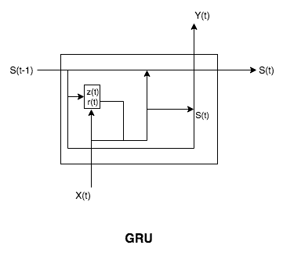

# 使用循环神经网络进行下一个单词预测

到目前为止，我们已经涵盖了许多基本的神经网络架构及其学习算法。这些是设计能够处理更高级任务的网络的必要构建模块，例如机器翻译、语音识别、时间序列预测和图像分割。在本章中，我们将涵盖一类由于其能够模拟数据中的序列依赖性而在这些及其他任务上表现出色的算法/架构。

这些算法已被证明具有极强的能力，它们的变体在工业和消费者应用案例中得到广泛应用。这涵盖了机器翻译、文本生成、命名实体识别和传感器数据分析的方方面面。当你说“好的，谷歌！”或“嘿，Siri！”时，在幕后，一种训练有素的**循环神经网络**（**RNN**）正在进行推断。所有这些应用的共同主题是，这些序列（如时间*x*处的传感器数据，或语料库中位置*y*处的单词出现）都可以以*时间*作为它们的调节维度进行建模。正如我们将看到的那样，我们可以根据需要表达我们的数据并结构化我们的张量。

一个很好的例子是自然语言处理和理解这样的困难问题。如果我们有一个大量的文本，比如莎士比亚的作品集，我们能对这个文本说些什么？我们可以详细说明文本的统计属性，即有多少个单词，其中多少个单词是独特的，总字符数等等，但我们也从阅读的经验中固有地知道文本/语言的一个重要属性是*顺序*；即单词出现的顺序。这个顺序对语法和语言的理解有贡献，更不用说意义本身了。正是在分析这类数据时，我们迄今涵盖的网络存在不足之处。

在本章中，我们将学习以下主题：

+   什么是基本的 RNN

+   如何训练 RNN

+   改进的 RNN 架构，包括**门控循环单元**（**GRU**）/**长短期记忆**（**LSTM**）网络

+   如何在 Gorgonia 中使用 LSTM 单元实现 RNN

# 原始的 RNN

根据其更乌托邦的描述，RNN 能够做到迄今为止我们所涵盖的网络所不能的事情：记忆。更确切地说，在一个单隐藏层的简单网络中，网络的输出以及隐藏层的状态与训练序列中的下一个元素结合，形成新网络的输入（具有自己的可训练隐藏状态）。*原始* RNN 可以如下所示：


让我们深入了解一下。在前面的图示中，两个网络是同一事物的两种不同表示。一个处于**展开**状态，这只是一个计算图的抽象表示，在这里无限数量的时间步骤被表示为**(t)**。然后，当我们提供网络数据并训练它时，我们使用**展开的 RNN**。

对于给定的前向传播，这个网络接受两个输入，其中**X**是一个训练数据片段的表示，以及前一个*隐藏*状态**S**（在**t0**初始化为零向量），以及一个时间步**t**（序列中的位置）重复操作（输入的向量连接，即*Sigmoid*激活）在这些输入及其可训练参数的乘积上。然后，我们应用我们的学习算法，在反向传播上稍作调整，我们将在接下来介绍，因此我们对 RNN 是什么、由什么组成以及它是如何工作的有了基本模型。

# 训练 RNNs

我们训练这些网络的方式是使用**通过时间的反向传播**（**BPTT**）。这是一个对您已知的东西稍作变化的名字。在第二章中，我们将详细探讨这个变化。

# 通过时间反向传播

对于 RNNs，我们有多个相同网络的副本，每个时间步都有一个。因此，我们需要一种方法来反向传播误差导数，并计算每个时间步的参数的权重更新。我们做法很简单。我们沿着函数的轮廓进行，这样我们可以尝试优化其形状。我们有多个可训练参数的副本，每个时间步都有一个，并且我们希望这些副本彼此一致，以便在计算给定参数的所有梯度时，我们取它们的平均值。我们用这个来更新每次学习过程的*t0*处的参数。

目标是计算随着时间步骤累积的误差，并展开/收拢网络并相应地更新权重。当然，这是有计算成本的；也就是说，所需的计算量随着时间步骤的增加而增加。处理这个问题的方法是*截断*（因此，*截断 BPTT*）输入/输出对的序列，这意味着我们一次只展开/收拢 20 个时间步，使问题可处理。

对于那些有兴趣探索背后数学的进一步信息，可以在本章的*进一步阅读*部分找到。

# 成本函数

我们在 RNNs 中使用的成本函数是交叉熵损失。在实现上，与简单的二分类任务相比，并没有什么特别之处。在这里，我们比较两个概率分布——一个是预测的，一个是期望的。我们计算每个时间步的误差并对它们进行求和。

# RNNs 和梯度消失

RNN 本身是一个重要的架构创新，但在梯度*消失*方面遇到问题。当梯度值变得如此小以至于更新同样微小时，这会减慢甚至停止学习。你的数字神经元死亡，你的网络无法按照你的意愿工作。但是，有一个记忆不好的神经网络是否比没有记忆的神经网络更好呢？

让我们深入讨论当你遇到这个问题时实际发生了什么。回顾计算给定权重值的公式在反向传播时的方法：

*W = W - LR*G*

在这里，权重值等于权重减去（学习率乘以梯度）。

您的网络在层间和时间步骤之间传播错误导数。您的数据集越大，时间步骤和参数越多，层次也越多。在每一步中，展开的 RNN 包含一个激活函数，将网络输出压缩到 0 到 1 之间。

当梯度值接近于零时，重复这些操作意味着神经元*死亡*或停止*激活*。在我们的计算图中，神经元模型的数学表示变得脆弱。这是因为如果我们正在学习的参数变化太小，对网络输出本身没有影响，那么网络将无法学习该参数的值。

因此，在训练过程中，我们的网络在时间步骤中前进时，是否有其他方法可以使网络在选择保留的信息方面更加智能呢？答案是肯定的！让我们考虑一下对网络架构的这些变化。

# 使用 GRU/LSTM 单元增强你的 RNN

所以，如果你想构建一个像死去的作家一样写作的机器呢？或者理解两周前股票价格的波动可能意味着今天股票将再次波动？对于序列预测任务，在训练早期观察到关键信息，比如在*t+1*时刻，但在*t+250*时刻进行准确预测是必要的，传统的 RNN 很难处理。这就是 LSTM（以及对某些任务来说是 GRU）网络发挥作用的地方。不再是简单的单元，而是多个条件*迷你*神经网络，每个网络决定是否跨时间步骤传递信息。我们现在将详细讨论每种变体。

# 长短期记忆单元

特别感谢那些发表了一篇名为*长短期记忆*的论文的瑞士研究人员小组，该论文在 1997 年描述了一种用于进一步增强 RNN 的高级*记忆*的方法。

那么，在这个背景下，“内存”实际上指的是什么呢？LSTM 将“愚蠢的”RNN 单元与另一个神经网络相结合（由输入、操作和激活组成），后者将选择性地从一个时间步传递到另一个时间步的信息。它通过维护“单元状态”（类似于香草 RNN 单元）和新的隐藏状态来实现这一点，然后将它们都馈入下一个步骤。正如下图中所示的“门”所示，在这个模式中学习有关应该在隐藏状态中维护的信息：


在这里，我们可以看到多个门包含在 **r(t)**，**z(t)** 和 **h(t)** 中。每个都有一个激活函数：对于 **r** 和 **z** 是 Sigmoid，而对于 **h(t)** 是 **tanh**。

# 门控循环单元

LSTM 单元的替代品是 GRU。这些最初由另一位深度学习历史上的重要人物 Yoshua Bengio 领导的团队首次描述。他们的最初论文《使用 RNN 编码器-解码器学习短语表示进行统计机器翻译》（2014 年）提供了一种思考我们如何增强 RNN 效果的有趣方式。

具体来说，他们将香草 RNN 中的 `Tanh` 激活函数与 LSTM/GRU 单元进行等效对比，并将它们描述为“激活”。它们的激活性质之间的差异是单元本身中信息是否保留、不变或更新。实际上，使用 `Tanh` 函数意味着您的网络对将信息从一个步骤传递到下一个步骤更加选择性。

GRU 与 LSTM 的不同之处在于它们消除了“单元状态”，从而减少了网络执行的张量运算总数。它们还使用单个重置门，而不是 LSTM 的输入和忘记门，进一步简化了网络的架构。

这里是 GRU 的逻辑表示：



这里，我们可以看到单个重置门（**z(t)** 和 **r(t)**）中包含忘记和输入门的组合，单个状态 **S(t)** 被传递到下一个时间步。

# 门的偏置初始化

最近，在一个 ML 会议上，即“国际学习表示会议”，来自 Facebook AI Research 团队发布了一篇关于 RNN 进展的论文。这篇论文关注了增强了 GRU/LSTM 单元的 RNN 的有效性。虽然深入研究这篇论文超出了本书的范围，但您可以在本章末尾的“进一步阅读”部分中了解更多信息。从他们的研究中得出了一个有趣的假设：这些单元的偏置向量可以以某种方式初始化，这将增强网络学习非常长期的依赖关系的能力。他们发布了他们的结果，结果显示，训练时间有所改善，并且困惑度降低的速度也提高了：


这张图来自论文，表示网络在*y*轴上的损失，以及在*x*轴上的训练迭代次数。红色指示了*c*hrono 初始化*。

这是非常新的研究，了解为什么基于 LSTM/GRU 的网络表现如此出色具有明确的科学价值。本文的主要实际影响，即门控单元偏置的初始化，为我们提供了另一个工具来提高模型性能并节省宝贵的 GPU 周期。目前，这些性能改进在单词级 PTB 和字符级 text8 数据集上是最显著的（尽管仍然是渐进的）。我们将在下一节中构建的网络可以很容易地适应测试此更改的相对性能改进。

# 在 Gorgonia 中构建一个 LSTM

现在我们已经讨论了什么是 RNN，如何训练它们以及如何修改它们以获得更好的性能，让我们来构建一个！接下来的几节将介绍如何为使用 LSTM 单元的 RNN 处理和表示数据。我们还将查看网络本身的样子，GRU 单元的代码以及一些工具，用于理解我们的网络正在做什么。

# 表示文本数据

虽然我们的目标是预测给定句子中的下一个单词，或者（理想情况下）预测一系列有意义并符合某种英语语法/语法度量的单词，但实际上我们将在字符级别对数据进行编码。这意味着我们需要获取我们的文本数据（在本例中是威廉·莎士比亚的作品集）并生成一系列标记。这些标记可以是整个句子、单独的单词，甚至是字符本身，这取决于我们正在训练的模型类型。

一旦我们对文本数据进行了标记化处理，我们需要将这些标记转换为适合计算的某种数值表示。正如我们所讨论的，对于我们的情况，这些表示是张量。然后将这些标记转换为一些张量，并对文本执行多种操作，以提取文本的不同属性，以下简称为我们的*语料库*。

这里的目标是生成一个词汇向量（长度为*n*的向量，其中*n*是语料库中唯一字符的数量）。我们将使用这个向量作为每个字符的编码模板。

# 导入和处理输入

让我们从在项目目录的根目录下创建一个`vocab.go`文件开始。在这里，您将定义一些保留的 Unicode 字符，用于表示我们序列的开始/结束，以及用于填充我们序列的`BLANK`字符。

请注意，我们在这里不包括我们的`shakespeare.txt`输入文件。相反，我们构建了一个词汇表和索引，并将我们的输入`corpus`分成块：

```py
package main

import (
  "fmt"
  "strings"
)

const START rune = 0x02
const END rune = 0x03
const BLANK rune = 0x04

// vocab related
var sentences []string
var vocab []rune
var vocabIndex map[rune]int
var maxsent int = 30

func initVocab(ss []string, thresh int) {
  s := strings.Join(ss, " ")
  fmt.Println(s)
  dict := make(map[rune]int)
  for _, r := range s {
    dict[r]++
  }

  vocab = append(vocab, START)
  vocab = append(vocab, END)
  vocab = append(vocab, BLANK)
  vocabIndex = make(map[rune]int)

  for ch, c := range dict {
    if c >= thresh {
      // then add letter to vocab
      vocab = append(vocab, ch)
    }
  }

  for i, v := range vocab {
    vocabIndex[v] = i
  }

  fmt.Println("Vocab: ", vocab)
  inputSize = len(vocab)
  outputSize = len(vocab)
  epochSize = len(ss)
  fmt.Println("\ninputs :", inputSize)
  fmt.Println("\noutputs :", outputSize)
  fmt.Println("\nepochs: :", epochSize)
  fmt.Println("\nmaxsent: :", maxsent)
}

func init() {
  sentencesRaw := strings.Split(corpus, "\n")

  for _, s := range sentencesRaw {
    s2 := strings.TrimSpace(s)
    if s2 != "" {
      sentences = append(sentences, s2)
    }

  }

  initVocab(sentences, 1)
}
```

现在我们可以创建下一部分代码，它提供了我们后续将需要的一些辅助函数。具体来说，我们将添加两个抽样函数：一个是基于温度的，其中已高概率词的概率增加，并在低概率词的情况下减少。温度越高，在任何方向上的概率增加越大。这为您的 LSTM-RNN 提供了另一个可调整的特性。

最后，我们将包括一些函数，用于处理`byte`和`uint`切片，使您可以轻松地进行比较/交换/评估它们：

```py
package main

import (
  "math/rand"

  "gorgonia.org/gorgonia"
  "gorgonia.org/tensor"
)

func sampleT(val gorgonia.Value) int {
  var t tensor.Tensor
  var ok bool
  if t, ok = val.(tensor.Tensor); !ok {
    panic("Expects a tensor")
  }

  return tensor.SampleIndex(t)
}

func sample(val gorgonia.Value) int {

  var t tensor.Tensor
  var ok bool
  if t, ok = val.(tensor.Tensor); !ok {
    panic("expects a tensor")
  }
  indT, err := tensor.Argmax(t, -1)
  if err != nil {
    panic(err)
  }
  if !indT.IsScalar() {
    panic("Expected scalar index")
  }
  return indT.ScalarValue().(int)
}

func shuffle(a []string) {
  for i := len(a) - 1; i > 0; i-- {
    j := rand.Intn(i + 1)
    a[i], a[j] = a[j], a[i]
  }
}

type byteslice []byte

func (s byteslice) Len() int { return len(s) }
func (s byteslice) Less(i, j int) bool { return s[i] < s[j] }
func (s byteslice) Swap(i, j int) { s[i], s[j] = s[j], s[i] }

type uintslice []uint

func (s uintslice) Len() int { return len(s) }
func (s uintslice) Less(i, j int) bool { return s[i] < s[j] }
func (s uintslice) Swap(i, j int) { s[i], s[j] = s[j], s[i] }
```

接下来，我们将创建一个`lstm.go`文件，在这里我们将定义我们的 LSTM 单元。它们看起来像小型神经网络，因为正如我们之前讨论过的那样，它们就是这样。输入门、遗忘门和输出门将被定义，并附带它们的相关权重/偏置。

`MakeLSTM()`函数将会向我们的图中添加这些单元。LSTM 也有许多方法；也就是说，`learnables()`用于生成我们可学习的参数，而`Activate()`则用于定义我们的单元在处理输入数据时执行的操作：

```py
package main

import (
  . "gorgonia.org/gorgonia"
)

type LSTM struct {
  wix *Node
  wih *Node
  bias_i *Node

  wfx *Node
  wfh *Node
  bias_f *Node

  wox *Node
  woh *Node
  bias_o *Node

  wcx *Node
  wch *Node
  bias_c *Node
}

func MakeLSTM(g *ExprGraph, hiddenSize, prevSize int) LSTM {
  retVal := LSTM{}

  retVal.wix = NewMatrix(g, Float, WithShape(hiddenSize, prevSize), WithInit(GlorotN(1.0)), WithName("wix_"))
  retVal.wih = NewMatrix(g, Float, WithShape(hiddenSize, hiddenSize), WithInit(GlorotN(1.0)), WithName("wih_"))
  retVal.bias_i = NewVector(g, Float, WithShape(hiddenSize), WithName("bias_i_"), WithInit(Zeroes()))

  // output gate weights

  retVal.wox = NewMatrix(g, Float, WithShape(hiddenSize, prevSize), WithInit(GlorotN(1.0)), WithName("wfx_"))
  retVal.woh = NewMatrix(g, Float, WithShape(hiddenSize, hiddenSize), WithInit(GlorotN(1.0)), WithName("wfh_"))
  retVal.bias_o = NewVector(g, Float, WithShape(hiddenSize), WithName("bias_f_"), WithInit(Zeroes()))

  // forget gate weights

  retVal.wfx = NewMatrix(g, Float, WithShape(hiddenSize, prevSize), WithInit(GlorotN(1.0)), WithName("wox_"))
  retVal.wfh = NewMatrix(g, Float, WithShape(hiddenSize, hiddenSize), WithInit(GlorotN(1.0)), WithName("woh_"))
  retVal.bias_f = NewVector(g, Float, WithShape(hiddenSize), WithName("bias_o_"), WithInit(Zeroes()))

  // cell write

  retVal.wcx = NewMatrix(g, Float, WithShape(hiddenSize, prevSize), WithInit(GlorotN(1.0)), WithName("wcx_"))
  retVal.wch = NewMatrix(g, Float, WithShape(hiddenSize, hiddenSize), WithInit(GlorotN(1.0)), WithName("wch_"))
  retVal.bias_c = NewVector(g, Float, WithShape(hiddenSize), WithName("bias_c_"), WithInit(Zeroes()))
  return retVal
}

func (l *LSTM) learnables() Nodes {
  return Nodes{
    l.wix, l.wih, l.bias_i,
    l.wfx, l.wfh, l.bias_f,
    l.wcx, l.wch, l.bias_c,
    l.wox, l.woh, l.bias_o,
  }
}

func (l *LSTM) Activate(inputVector *Node, prev lstmout) (out lstmout, err error) {
  // log.Printf("prev %v", prev.hidden.Shape())
  prevHidden := prev.hidden
  prevCell := prev.cell
  var h0, h1, inputGate *Node
  h0 = Must(Mul(l.wix, inputVector))
  h1 = Must(Mul(l.wih, prevHidden))
  inputGate = Must(Sigmoid(Must(Add(Must(Add(h0, h1)), l.bias_i))))

  var h2, h3, forgetGate *Node
  h2 = Must(Mul(l.wfx, inputVector))
  h3 = Must(Mul(l.wfh, prevHidden))
  forgetGate = Must(Sigmoid(Must(Add(Must(Add(h2, h3)), l.bias_f))))

  var h4, h5, outputGate *Node
  h4 = Must(Mul(l.wox, inputVector))
  h5 = Must(Mul(l.woh, prevHidden))
  outputGate = Must(Sigmoid(Must(Add(Must(Add(h4, h5)), l.bias_o))))

  var h6, h7, cellWrite *Node
  h6 = Must(Mul(l.wcx, inputVector))
  h7 = Must(Mul(l.wch, prevHidden))
  cellWrite = Must(Tanh(Must(Add(Must(Add(h6, h7)), l.bias_c))))

  // cell activations
  var retain, write *Node
  retain = Must(HadamardProd(forgetGate, prevCell))
  write = Must(HadamardProd(inputGate, cellWrite))
  cell := Must(Add(retain, write))
  hidden := Must(HadamardProd(outputGate, Must(Tanh(cell))))
  out = lstmout{
    hidden: hidden,
    cell: cell,
  }
  return
}

type lstmout struct {
  hidden, cell *Node
}
```

正如我们之前提到的，我们还将包括 GRU-RNN 的代码。这段代码是模块化的，因此您可以将您的 LSTM 替换为 GRU，从而扩展您可以进行的实验类型和您可以处理的用例范围。

创建一个名为`gru.go`的文件。它将按照`lstm.go`的相同结构进行，但会减少门数量：

```py
package main

import (
  "fmt"

  . "gorgonia.org/gorgonia"
  "gorgonia.org/tensor"
)

var Float = tensor.Float32

type contextualError interface {
  error
  Node() *Node
  Value() Value
  InstructionID() int
  Err() error
}

type GRU struct {

  // weights for mem
  u *Node
  w *Node
  b *Node

  // update gate
  uz *Node
  wz *Node
  bz *Node

  // reset gate
  ur *Node
  wr *Node
  br *Node
  one *Node

  Name string // optional name
}

func MakeGRU(name string, g *ExprGraph, inputSize, hiddenSize int, dt tensor.Dtype) GRU {
  // standard weights
  u := NewMatrix(g, dt, WithShape(hiddenSize, hiddenSize), WithName(fmt.Sprintf("%v.u", name)), WithInit(GlorotN(1.0)))
  w := NewMatrix(g, dt, WithShape(hiddenSize, inputSize), WithName(fmt.Sprintf("%v.w", name)), WithInit(GlorotN(1.0)))
  b := NewVector(g, dt, WithShape(hiddenSize), WithName(fmt.Sprintf("%v.b", name)), WithInit(Zeroes()))

  // update gate
  uz := NewMatrix(g, dt, WithShape(hiddenSize, hiddenSize), WithName(fmt.Sprintf("%v.uz", name)), WithInit(GlorotN(1.0)))
  wz := NewMatrix(g, dt, WithShape(hiddenSize, inputSize), WithName(fmt.Sprintf("%v.wz", name)), WithInit(GlorotN(1.0)))
  bz := NewVector(g, dt, WithShape(hiddenSize), WithName(fmt.Sprintf("%v.b_uz", name)), WithInit(Zeroes()))

  // reset gate
  ur := NewMatrix(g, dt, WithShape(hiddenSize, hiddenSize), WithName(fmt.Sprintf("%v.ur", name)), WithInit(GlorotN(1.0)))
  wr := NewMatrix(g, dt, WithShape(hiddenSize, inputSize), WithName(fmt.Sprintf("%v.wr", name)), WithInit(GlorotN(1.0)))
  br := NewVector(g, dt, WithShape(hiddenSize), WithName(fmt.Sprintf("%v.bz", name)), WithInit(Zeroes()))

  ones := tensor.Ones(dt, hiddenSize)
  one := g.Constant(ones)
  gru := GRU{
    u: u,
    w: w,
    b: b,

    uz: uz,
    wz: wz,
    bz: bz,

    ur: ur,
    wr: wr,
    br: br,

    one: one,
  }
  return gru
}

func (l *GRU) Activate(x, prev *Node) (retVal *Node, err error) {
  // update gate
  uzh := Must(Mul(l.uz, prev))
  wzx := Must(Mul(l.wz, x))
  z := Must(Sigmoid(
    Must(Add(
      Must(Add(uzh, wzx)),
      l.bz))))

  // reset gate
  urh := Must(Mul(l.ur, prev))
  wrx := Must(Mul(l.wr, x))
  r := Must(Sigmoid(
    Must(Add(
      Must(Add(urh, wrx)),
      l.br))))

  // memory for hidden
  hiddenFilter := Must(Mul(l.u, Must(HadamardProd(r, prev))))
  wx := Must(Mul(l.w, x))
  mem := Must(Tanh(
    Must(Add(
      Must(Add(hiddenFilter, wx)),
      l.b))))

  omz := Must(Sub(l.one, z))
  omzh := Must(HadamardProd(omz, prev))
  upd := Must(HadamardProd(z, mem))
  retVal = Must(Add(upd, omzh))
  return
}

func (l *GRU) learnables() Nodes {
  retVal := make(Nodes, 0, 9)
  retVal = append(retVal, l.u, l.w, l.b, l.uz, l.wz, l.bz, l.ur, l.wr, l.br)
  return retVal
}
```

当我们继续将我们网络的各个部分组合在一起时，我们需要在我们的 LSTM/GRU 代码之上添加一个最终的抽象层—即网络本身的层次。我们遵循的命名惯例是*序列到序列*（或`s2s`）网络。在我们的例子中，我们正在预测文本的下一个字符。这个序列是任意的，可以是单词或句子，甚至是语言之间的映射。因此，我们将创建一个`s2s.go`文件。

由于这实际上是一个更大的神经网络，用于包含我们之前在`lstm.go`/`gru.go`中定义的小型神经网络，所以结构是类似的。我们可以看到 LSTM 正在处理我们网络的输入（而不是普通的 RNN 单元），并且我们在`t-0`处有`dummy`节点来处理输入，以及输出节点：

```py
package main

import (
  "encoding/json"
  "io"
  "log"
  "os"

  "github.com/pkg/errors"
  . "gorgonia.org/gorgonia"
  "gorgonia.org/tensor"
)

type seq2seq struct {
  in        LSTM
  dummyPrev *Node // vector
  dummyCell *Node // vector
  embedding *Node // NxM matrix, where M is the number of dimensions of the embedding

  decoder *Node
  vocab []rune

  inVecs []*Node
  losses []*Node
  preds []*Node
  predvals []Value
  g *ExprGraph
  vm VM
}

// NewS2S creates a new Seq2Seq network. Input size is the size of the embedding. Hidden size is the size of the hidden layer
func NewS2S(hiddenSize, embSize int, vocab []rune) *seq2seq {
  g := NewGraph()
  // in := MakeGRU("In", g, embSize, hiddenSize, Float)s
  in := MakeLSTM(g, hiddenSize, embSize)
  log.Printf("%q", vocab)

  dummyPrev := NewVector(g, Float, WithShape(embSize), WithName("Dummy Prev"), WithInit(Zeroes()))
  dummyCell := NewVector(g, Float, WithShape(hiddenSize), WithName("Dummy Cell"), WithInit(Zeroes()))
  embedding := NewMatrix(g, Float, WithShape(len(vocab), embSize), WithInit(GlorotN(1.0)), WithName("Embedding"))
  decoder := NewMatrix(g, Float, WithShape(len(vocab), hiddenSize), WithInit(GlorotN(1.0)), WithName("Output Decoder"))

  return &seq2seq{
    in: in,
    dummyPrev: dummyPrev,
    dummyCell: dummyCell,
    embedding: embedding,
    vocab: vocab,
    decoder: decoder,
    g: g,
  }
}

func (s *seq2seq) learnables() Nodes {
  retVal := make(Nodes, 0)
  retVal = append(retVal, s.in.learnables()...)
  retVal = append(retVal, s.embedding)
  retVal = append(retVal, s.decoder)
  return retVal
}
```

由于我们使用的是静态图，Gorgonia 的`TapeMachine`，我们将需要一个函数来在初始化时构建我们的网络。其中一些值将在运行时被替换：

```py
func (s *seq2seq) build() (cost *Node, err error) {
  // var prev *Node = s.dummyPrev
  prev := lstmout{
    hidden: s.dummyCell,
    cell: s.dummyCell,
  }
  s.predvals = make([]Value, maxsent)

  var prediction *Node
  for i := 0; i < maxsent; i++ {
    var vec *Node
    if i == 0 {
      vec = Must(Slice(s.embedding, S(0))) // dummy, to be replaced at runtime
    } else {
      vec = Must(Mul(prediction, s.embedding))
    }
    s.inVecs = append(s.inVecs, vec)
    if prev, err = s.in.Activate(vec, prev); err != nil {
      return
    }
    prediction = Must(SoftMax(Must(Mul(s.decoder, prev.hidden))))
    s.preds = append(s.preds, prediction)
    Read(prediction, &s.predvals[i])

    logprob := Must(Neg(Must(Log(prediction))))
    loss := Must(Slice(logprob, S(0))) // dummy, to be replaced at runtime
    s.losses = append(s.losses, loss)

    if cost == nil {
      cost = loss
    } else {
      cost = Must(Add(cost, loss))
    }
  }

  _, err = Grad(cost, s.learnables()...)
  return
}
```

现在我们可以定义网络本身的训练循环：

```py

func (s *seq2seq) train(in []rune) (err error) {

  for i := 0; i < maxsent; i++ {
    var currentRune, correctPrediction rune
    switch {
    case i == 0:
      currentRune = START
      correctPrediction = in[i]
    case i-1 == len(in)-1:
      currentRune = in[i-1]
      correctPrediction = END
    case i-1 >= len(in):
      currentRune = BLANK
      correctPrediction = BLANK
    default:
      currentRune = in[i-1]
      correctPrediction = in[i]
    }

    targetID := vocabIndex[correctPrediction]
    if i == 0 || i-1 >= len(in) {
      srcID := vocabIndex[currentRune]
      UnsafeLet(s.inVecs[i], S(srcID))
    }
    UnsafeLet(s.losses[i], S(targetID))

  }
  if s.vm == nil {
    s.vm = NewTapeMachine(s.g, BindDualValues())
  }
  s.vm.Reset()
  err = s.vm.RunAll()

  return
}
```

我们还需要一个`predict`函数，这样在我们的模型训练完成后，我们就可以对其进行抽样：

```py

func (s *seq2seq) predict(in []rune) (output []rune, err error) {
  g2 := s.g.SubgraphRoots(s.preds...)
  vm := NewTapeMachine(g2)
  if err = vm.RunAll(); err != nil {
    return
  }
  defer vm.Close()
  for _, pred := range s.predvals {
    log.Printf("%v", pred.Shape())
    id := sample(pred)
    if id >= len(vocab) {
      log.Printf("Predicted %d. Len(vocab) %v", id, len(vocab))
      continue
    }
    r := vocab[id]

    output = append(output, r)
  }
  return
}
```

在大文本语料库上进行训练可能需要很长时间，因此有一种方式来检查点我们的模型，以便可以从训练周期中的任意点保存/加载它将会很有用：

```py

func (s *seq2seq) checkpoint() (err error) {
  learnables := s.learnables()
  var f io.WriteCloser
  if f, err = os.OpenFile("CHECKPOINT.bin", os.O_CREATE|os.O_TRUNC|os.O_WRONLY, 0644); err != nil {
    return
  }
  defer f.Close()
  enc := json.NewEncoder(f)
  for _, l := range learnables {
    t := l.Value().(*tensor.Dense).Data() // []float32
    if err = enc.Encode(t); err != nil {
      return
    }
  }

  return nil
}

func (s *seq2seq) load() (err error) {
  learnables := s.learnables()
  var f io.ReadCloser
  if f, err = os.OpenFile("CHECKPOINT.bin", os.O_RDONLY, 0644); err != nil {
    return
  }
  defer f.Close()
  dec := json.NewDecoder(f)
  for _, l := range learnables {
    t := l.Value().(*tensor.Dense).Data().([]float32)
    var data []float32
    if err = dec.Decode(&data); err != nil {
      return
    }
    if len(data) != len(t) {
      return errors.Errorf("Unserialized length %d. Expected length %d", len(data), len(t))
    }
    copy(t, data)
  }
  return nil
}
```

最后，我们可以定义`meta-training`循环。这是一个循环，它接受`s2s`网络、一个解算器、我们的数据以及各种超参数：

```py

func train(s *seq2seq, epochs int, solver Solver, data []string) (err error) {
  cost, err := s.build()
  if err != nil {
    return err
  }
  var costVal Value
  Read(cost, &costVal)

  model := NodesToValueGrads(s.learnables())
  for e := 0; e < epochs; e++ {
    shuffle(data)

    for _, sentence := range data {
      asRunes := []rune(sentence)
      if err = s.train(asRunes); err != nil {
        return
      }
      if err = solver.Step(model); err != nil {
        return
      }
    }
    // if e%100 == 0 {
    log.Printf("Cost for epoch %d: %1.10f\n", e, costVal)
    // }

  }

  return nil

}
```

在构建和执行我们的网络之前，我们将添加一个小的可视化工具，以帮助我们进行任何需要的故障排除。通常在处理数据时，可视化是一个强大的工具，在我们的案例中，它允许我们窥探我们的神经网络内部，以便我们理解它在做什么。具体来说，我们将生成热图，用于跟踪我们网络权重在训练过程中的变化。这样，我们可以确保它们在变化（也就是说，我们的网络正在学习）。

创建一个名为`heatmap.go`的文件：

```py
package main

import (
    "image/color"
    "math"

    "github.com/pkg/errors"
    "gonum.org/v1/gonum/mat"
    "gonum.org/v1/plot"
    "gonum.org/v1/plot/palette/moreland"
    "gonum.org/v1/plot/plotter"
    "gonum.org/v1/plot/vg"
    "gorgonia.org/tensor"
)

type heatmap struct {
    x mat.Matrix
}

func (m heatmap) Dims() (c, r int) { r, c = m.x.Dims(); return c, r }
func (m heatmap) Z(c, r int) float64 { return m.x.At(r, c) }
func (m heatmap) X(c int) float64 { return float64(c) }
func (m heatmap) Y(r int) float64 { return float64(r) }

type ticks []string

func (t ticks) Ticks(min, max float64) []plot.Tick {
    var retVal []plot.Tick
    for i := math.Trunc(min); i <= max; i++ {
        retVal = append(retVal, plot.Tick{Value: i, Label: t[int(i)]})
    }
    return retVal
}

func Heatmap(a *tensor.Dense) (p *plot.Plot, H, W vg.Length, err error) {
    switch a.Dims() {
    case 1:
        original := a.Shape()
        a.Reshape(original[0], 1)
        defer a.Reshape(original...)
    case 2:
    default:
        return nil, 0, 0, errors.Errorf("Can't do a tensor with shape %v", a.Shape())
    }

    m, err := tensor.ToMat64(a, tensor.UseUnsafe())
    if err != nil {
        return nil, 0, 0, err
    }

    pal := moreland.ExtendedBlackBody().Palette(256)
    // lum, _ := moreland.NewLuminance([]color.Color{color.Gray{0}, color.Gray{255}})
    // pal := lum.Palette(256)

    hm := plotter.NewHeatMap(heatmap{m}, pal)
    if p, err = plot.New(); err != nil {
        return nil, 0, 0, err
    }
    hm.NaN = color.RGBA{0, 0, 0, 0} // black
    p.Add(hm)

    sh := a.Shape()
    H = vg.Length(sh[0])*vg.Centimeter + vg.Centimeter
    W = vg.Length(sh[1])*vg.Centimeter + vg.Centimeter
    return p, H, W, nil
}

func Avg(a []float64) (retVal float64) {
    for _, v := range a {
        retVal += v
    }

    return retVal / float64(len(a))
}

```

现在我们可以把所有的部件整合到我们的`main.go`文件中。在这里，我们将设置超参数，解析输入，并启动我们的主训练循环：

```py
package main

import (
  "flag"
  "fmt"
  "io/ioutil"
  "log"
  "os"
  "runtime/pprof"

  . "gorgonia.org/gorgonia"
  "gorgonia.org/tensor"
)

var cpuprofile = flag.String("cpuprofile", "", "write cpu profile to file")
var memprofile = flag.String("memprofile", "", "write memory profile to this file")

const (
  embeddingSize = 20
  maxOut = 30

  // gradient update stuff
  l2reg = 0.000001
  learnrate = 0.01
  clipVal = 5.0
)

var trainiter = flag.Int("iter", 5, "How many iterations to train")

// various global variable inits
var epochSize = -1
var inputSize = -1
var outputSize = -1

var corpus string

func init() {
  buf, err := ioutil.ReadFile("shakespeare.txt")
  if err != nil {
    panic(err)
  }
  corpus = string(buf)
}

var dt tensor.Dtype = tensor.Float32

func main() {
  flag.Parse()
  if *cpuprofile != "" {
    f, err := os.Create(*cpuprofile)
    if err != nil {
      log.Fatal(err)
    }
    pprof.StartCPUProfile(f)
    defer pprof.StopCPUProfile()
  }

  hiddenSize := 100

  s2s := NewS2S(hiddenSize, embeddingSize, vocab)
  solver := NewRMSPropSolver(WithLearnRate(learnrate), WithL2Reg(l2reg), WithClip(clipVal), WithBatchSize(float64(len(sentences))))
  for k, v := range vocabIndex {
    log.Printf("%q %v", k, v)
  }

  // p, h, w, err := Heatmap(s2s.decoder.Value().(*tensor.Dense))
  // p.Save(w, h, "embn0.png")

  if err := train(s2s, 300, solver, sentences); err != nil {
    panic(err)
  }
  out, err := s2s.predict([]rune(corpus))
  if err != nil {
    panic(err)
  }
  fmt.Printf("OUT %q\n", out)

  p, h, w, err = Heatmap(s2s.decoder.Value().(*tensor.Dense))
  p.Save(w, h, "embn.png")
}
```

现在，让我们运行`go run *.go`并观察输出：

```py
2019/05/25 23:52:03 Cost for epoch 31: 250.7806701660
2019/05/25 23:52:19 Cost for epoch 32: 176.0116729736
2019/05/25 23:52:35 Cost for epoch 33: 195.0501556396
2019/05/25 23:52:50 Cost for epoch 34: 190.6829681396
2019/05/25 23:53:06 Cost for epoch 35: 181.1398162842
```

我们可以看到在我们网络的早期阶段，成本（衡量网络优化程度的指标）很高且波动很大。

在指定的 epoch 数之后，将进行输出预测：

```py
OUT ['S' 'a' 'K' 'a' 'g' 'y' 'h' ',' '\x04' 'a' 'g' 'a' 't' '\x04' '\x04' ' ' 's' 'h' 'h' 'h' 'h' 'h' ' ' ' ' ' ' ' ' ' ' ' ' ' ' ' ']
```

现在您可以尝试使用 GRU 而不是 LSTM 单元以及探索偏置初始化等超参数和调整，以优化您的网络，从而产生更好的预测。

# 总结

在本章中，我们介绍了什么是 RNN 以及如何训练它。我们已经看到，为了有效地建模长期依赖关系并克服训练中的挑战，需要对标准 RNN 进行改进，包括由 GRU/LSTM 单元提供的跨时间的额外信息控制机制。我们在 Gorgonia 中构建了这样一个网络。

在下一章中，我们将学习如何构建 CNN 以及如何调整一些超参数。

# 进一步阅读

+   *训练递归神经网络*，*Ilya Sutskever*，可查阅[`www.cs.utoronto.ca/~ilya/pubs/ilya_sutskever_phd_thesis.pdf`](http://www.cs.utoronto.ca/~ilya/pubs/ilya_sutskever_phd_thesis.pdf)

+   *长短期记忆*，*Hochreiter*，*Sepp*和*Jurgen Schmidhuber*，可查阅[`www.researchgate.net/publication/13853244_Long_Short-term_Memory`](https://www.researchgate.net/publication/13853244_Long_Short-term_Memory)

+   *关于序列建模的经验评估的门控循环神经网络*，*Bengio 等*，可查阅[`arxiv.org/abs/1412.3555`](https://arxiv.org/abs/1412.3555)
