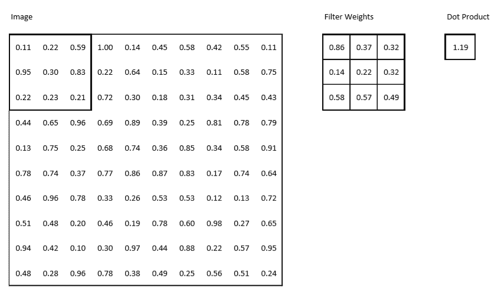
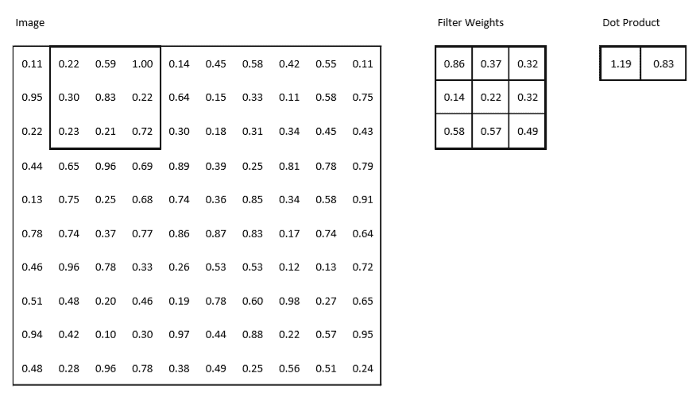
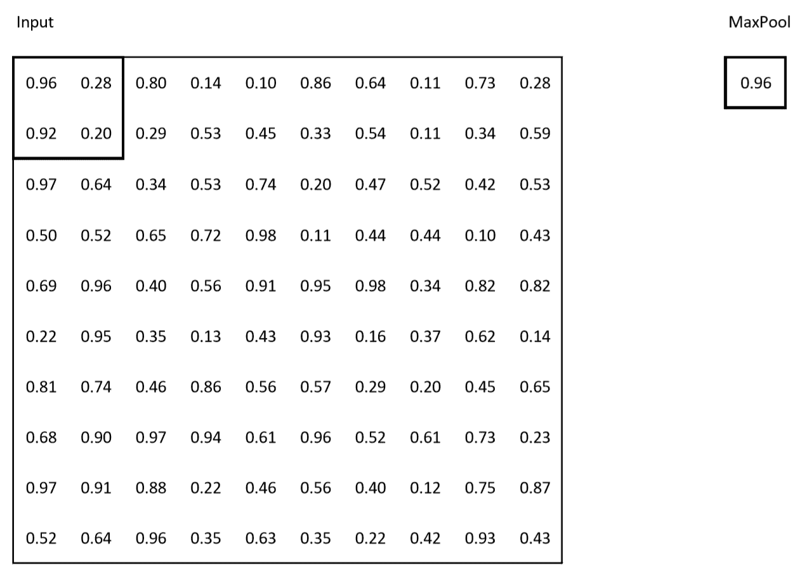
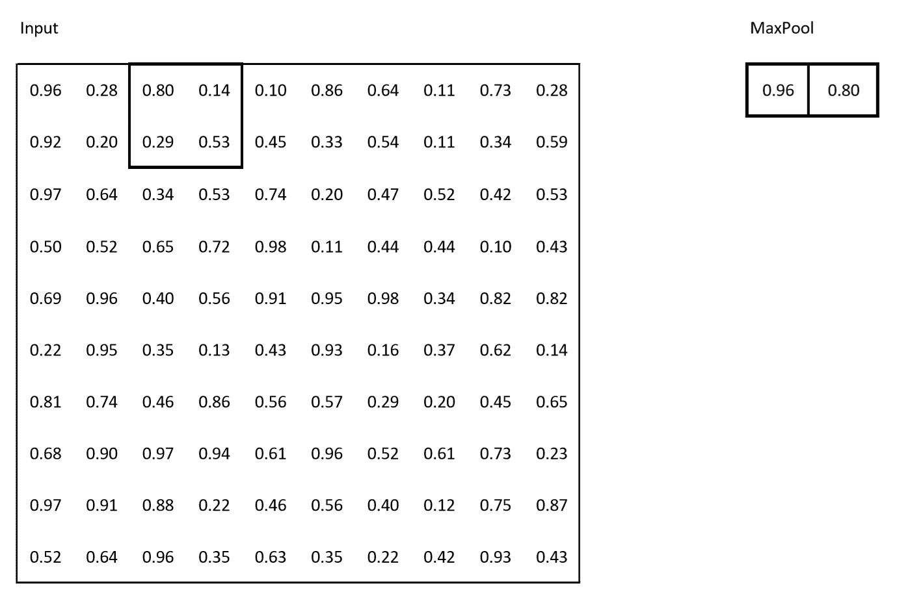
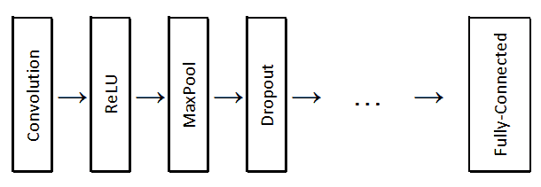
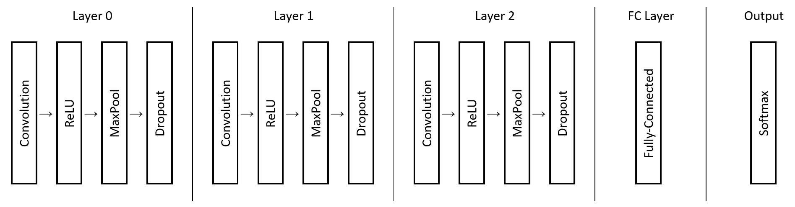
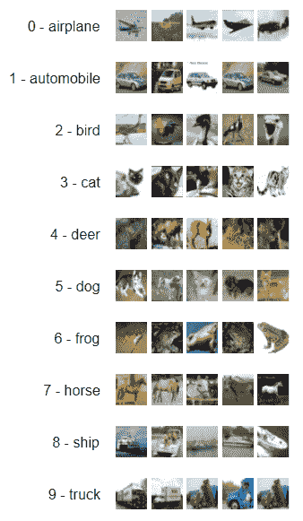
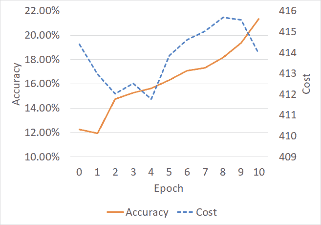
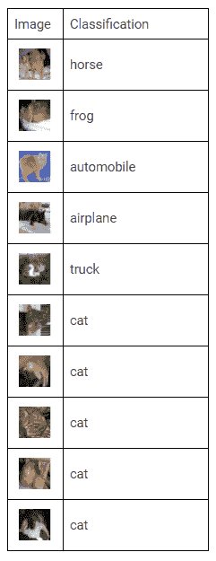
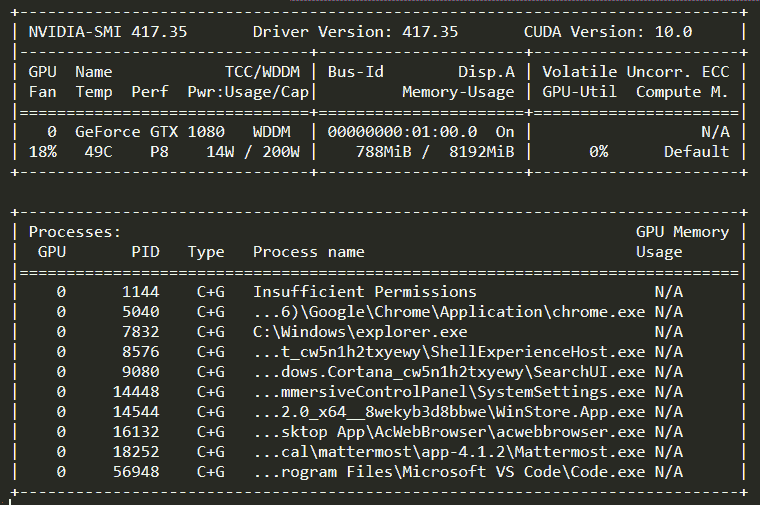

# 第六章：使用卷积神经网络进行物体识别

现在是时候处理一些比我们之前的 MNIST 手写例子更一般的计算机视觉或图像分类问题了。许多相同的原则适用，但我们将使用一些新类型的操作来构建**卷积神经** **网络**（**CNNs**）。

本章将涵盖以下主题：

+   CNN 简介

+   构建一个示例 CNN

+   评估结果和进行改进

# CNN 简介

CNN 是一类深度神经网络，它们非常适合处理具有多个通道的数据，并对输入中包含的信息局部性敏感。这使得 CNN 非常适合与计算机视觉相关的任务，例如人脸识别、图像分类、场景标记等。

# 什么是 CNN？

CNN，也称为**ConvNets**，是一类被普遍认为在图像分类方面非常出色的神经网络，也就是说，它们非常擅长区分猫和狗、汽车和飞机等常见分类任务。

CNN 通常由卷积层、激活层和池化层组成。然而，它们被特别构造以利用输入通常为图像的事实，并利用图像中某些部分极有可能紧邻彼此的事实。

在实现上，它们与我们在早期章节中介绍的前馈网络非常相似。

# 普通前馈与 ConvNet

一般来说，神经网络接收一个单独的向量作为输入（例如我们在第三章中的 MNIST 示例，*超越基本神经网络—自编码器和 RBM*），然后经过几个隐藏层，在最后得到我们推断的结果。这对于图像不是很大的情况是可以的；然而，当我们的图像变得更大时，通常是大多数实际应用中的情况，我们希望确保我们不会建立极其庞大的隐藏层来正确处理它们。

当然，我们在张量理念中的一个方便特性是，事实上我们并不需要将一个向量馈送到模型中；我们可以馈送一个稍微复杂且具有更多维度的东西。基本上，我们想要用 CNN 做的是将神经元按三维排列：高度、宽度和深度——这里所说的深度是指我们彩色系统中的颜色数量，在我们的情况下是红色、绿色和蓝色。

我们不再试图将每个层中的每个神经元连接在一起，而是试图减少它，使其更易管理，减少对我们的样本大小过拟合的可能性，因为我们不会尝试训练输入的每个像素。

# 层

当然，CNN 使用层，我们需要更详细地讨论其中的一些层，因为我们还没有讨论它们；一般来说，CNN 中有三个主要层：卷积层、池化层和全连接层（这些您已经见过）。

# 卷积层

卷积层是这种神经网络的一部分，是神经网络架构中非常重要的组成部分。它可以广义地解释为在图像上进行滑动来寻找特定的特征。我们创建一个小型滤波器，然后根据我们想要的步幅在整个图像上滑动。

因此，例如，输出的第一个单元格将通过计算我们的 3 x 3 滤波器与图像的左上角的**点积**来得出，如下图所示：



如果步幅为一，那么将向右移动一列并继续，如下图所示：



这样就可以继续，直到获得整个输出。

# 池化层

池化层通常放置在卷积层之间；它们的作用是减少传递的数据量，从而减少参数数量，以及减少网络所需的计算量。在这种情况下，我们通过在给定区域内取最大值来进行*池化*操作。

这些层的工作方式与卷积层类似；它们在预定的网格上应用并执行池化操作。在这种情况下，它是最大化操作，因此它将在网格内取最高值。

例如，在一个 2 x 2 网格上进行最大池化操作时，第一个输出的单元格将来自左上角，如下所示：



并且使用步幅为两，第二个将来自向右移动两行的网格，如下图所示：



# 基本结构

现在您理解了层次，让我们来谈谈 CNN 的基本结构。一个 CNN 主要包括以下几部分：一个输入层，然后是若干层卷积层、激活层和池化层，最后以一个全连接层结束，以获得最终的结果。

基本结构看起来像下面这样：



# 构建一个示例 CNN

为了说明 CNN 在实践中的工作原理，我们将构建一个模型来识别照片中的物体是否是猫。我们使用的数据集比这更加复杂，但训练它以正确分类一切会花费相当长的时间。将示例扩展到分类一切都是相当简单的，但我们宁愿不花一周时间等待模型训练。

对于我们的示例，我们将使用以下结构：



# CIFAR-10

这次我们的示例中使用 CIFAR-10 而不是 MNIST。因此，我们不能方便地使用已有的 MNIST 加载器。让我们快速浏览一下加载这个新数据集所需的步骤！

我们将使用 CIFAR-10 的二进制格式，你可以在这里下载：[`www.cs.toronto.edu/~kriz/cifar.html`](https://www.cs.toronto.edu/~kriz/cifar.html)。

此数据集由 Alex Krizhevsky、Vinod Nair 和 Geoffrey Hinton 组成。它包含 60,000 张 32 像素高、32 像素宽的小图像。CIFAR-10 的二进制格式如下所示：

```py
<1 x label><3072 x pixel>
<1 x label><3072 x pixel>
<1 x label><3072 x pixel>
<1 x label><3072 x pixel>
<1 x label><3072 x pixel>
<1 x label><3072 x pixel>
 ...
<1 x label><3072 x pixel>
```

应该注意，它没有分隔符或任何其他验证文件的信息；因此，你应该确保你下载的文件的 MD5 校验和与网站上的匹配。由于结构相对简单，我们可以直接将二进制文件导入 Go 并相应地解析它。

这 3,072 个像素实际上是红、绿、蓝三层值，从 0 到 255，按行主序在 32 x 32 网格中排列，因此这为我们提供了图像数据。

标签是从 **0** 到 **9** 的数字，分别表示以下各类之一：



CIFAR-10 有六个文件，包括五个每个包含 10,000 张图像的训练集文件和一个包含 10,000 张图像的测试集文件：

```py
case "train":
    arrayFiles = []string{
        "data_batch_1.bin",
        "data_batch_2.bin",
        "data_batch_3.bin",
        "data_batch_4.bin",
        "data_batch_5.bin",
    }
case "test":
    arrayFiles = []string{
        "test_batch.bin",
    }
}
```

在 Go 中导入这个很容易——打开文件并读取原始字节。由于每个底层值都是单字节内的 8 位整数，我们可以将其转换为任何我们想要的类型。如果你想要单个整数值，你可以将它们全部转换为无符号 8 位整数；这在你想要将数据转换为图像时非常有用。然而，正如下面的代码所示，你会发现我们在代码中做了一些稍微不同的决定：

```py
f, err := os.Open(filepath.Join(loc, targetFile))
if err != nil {
    log.Fatal(err)
}

defer f.Close()
cifar, err := ioutil.ReadAll(f)

if err != nil {
    log.Fatal(err)
}

for index, element := range cifar {
    if index%3073 == 0 {
        labelSlice = append(labelSlice, float64(element))
    } else {
        imageSlice = append(imageSlice, pixelWeight(element))
    }
}
```

由于我们有兴趣将这些数据用于我们的深度学习算法，因此最好不要偏离我们在 `0` 到 `1` 之间的中间点。我们正在重用来自 MNIST 示例的像素权重，如下所示：

```py
func pixelWeight(px byte) float64 {
    retVal := float64(px)/pixelRange*0.9 + 0.1
    if retVal == 1.0 {
        return 0.999
    }
    return retVal
}
```

将所有像素值从 0 到 255 转换为 `0.1` 到 `1.0` 的范围。

类似地，对于我们的标签，我们将再次使用一位有效编码，将期望的标签编码为 `0.9`，其他所有内容编码为 `0.1`，如下所示：

```py
labelBacking := make([]float64, len(labelSlice)*numLabels, len(labelSlice)*numLabels)
labelBacking = labelBacking[:0]
for i := 0; i < len(labelSlice); i++ {
    for j := 0; j < numLabels; j++ {
        if j == int(labelSlice[i]) {
            labelBacking = append(labelBacking, 0.9)
        } else {
            labelBacking = append(labelBacking, 0.1)
        }
    }
}
```

我们已将其打包为一个便利的 `Load` 函数，这样我们就可以从我们的代码中调用它。它将为我们返回两个方便形状的张量供我们使用。这为我们提供了一个可以导入训练集和测试集的函数：

```py
func Load(typ, loc string) (inputs, targets tensor.Tensor, err error) {

    ...

    inputs = tensor.New(tensor.WithShape(len(labelSlice), 3, 32, 32),        tensor.WithBacking(imageSlice))
    targets = tensor.New(tensor.WithShape(len(labelSlice), numLabels), tensor.WithBacking(labelBacking))
    return
}
```

这允许我们通过在 `main` 中调用以下方式来加载数据：

```py
if inputs, targets, err = cifar.Load("train", loc); err != nil {
    log.Fatal(err)
}
```

# Epochs 和批处理大小

我们将选择`10`个 epochs 作为本例子的训练周期，这样代码可以在不到一个小时内完成训练。需要注意的是，仅仅进行 10 个 epochs 只能使我们达到约 20%的准确率，因此如果发现生成的模型看起来不准确，不必惊慌；你需要更长时间的训练，甚至可能需要大约 1,000 个 epochs。在现代计算机上，一个 epoch 大约需要三分钟来完成；为了不让这个例子需要三天的时间才能完成，我们选择了缩短训练过程，并留给你练习评估更多 epochs 的结果，如下所示：

```py
var (
    epochs = flag.Int("epochs", 10, "Number of epochs to train for")
    dataset = flag.String("dataset", "train", "Which dataset to train on? Valid options are \"train\" or \"test\"")
    dtype = flag.String("dtype", "float64", "Which dtype to use")
    batchsize = flag.Int("batchsize", 100, "Batch size")
    cpuprofile = flag.String("cpuprofile", "", "CPU profiling")
)
```

请注意，这个模型将消耗相当大的内存；`batchsize`设为`100`仍可能需要大约 4 GB 的内存。如果你没有足够的内存而不得不使用交换内存，你可能需要降低批处理大小，以便代码在你的计算机上执行得更好。

# 准确率

由于这个模型需要更长时间来收敛，我们还应该添加一个简单的度量来跟踪我们的准确性。为了做到这一点，我们必须首先从数据中提取我们的标签 - 我们可以像下面这样做：

```py
 // get label
    yRowT, _ := yVal.Slice(sli{j, j + 1})
    yRow := yRowT.Data().([]float64)
    var rowLabel int
    var yRowHigh float64

    for k := 0; k < 10; k++ {
        if k == 0 {
            rowLabel = 0
            yRowHigh = yRow[k]
        } else if yRow[k] > yRowHigh {
            rowLabel = k
            yRowHigh = yRow[k]
        }
    }
```

接着，我们需要从输出数据中获取我们的预测：

```py
yOutput2 := tensor.New(tensor.WithShape(bs, 10), tensor.WithBacking(arrayOutput2))

 // get prediction
    predRowT, _ := yOutput2.Slice(sli{j, j + 1})
    predRow := predRowT.Data().([]float64)
    var rowGuess int
    var predRowHigh float64

    // guess result
    for k := 0; k < 10; k++ {
        if k == 0 {
            rowGuess = 0
            predRowHigh = predRow[k]
        } else if predRow[k] > predRowHigh {
            rowGuess = k
            predRowHigh = predRow[k]
        }
    }
```

然后，我们可以使用这个来更新我们的准确性度量。更新的量将按示例的数量进行缩放，因此我们的输出将是一个百分比数字。

```py
if rowLabel == rowGuess {
    accuracyGuess += 1.0 / float64(numExamples)
}
```

这给了我们一个广泛的*准确性*度量指标，可以用来评估我们的训练进展。

# 构建层

我们可以将我们的层结构考虑为有四个部分。我们将有三个卷积层和一个全连接层。我们的前两层非常相似 - 它们遵循我们之前描述的卷积-ReLU-MaxPool-dropout 结构：

```py
// Layer 0
if c0, err = gorgonia.Conv2d(x, m.w0, tensor.Shape{5, 5}, []int{1, 1}, []int{1, 1}, []int{1, 1}); err != nil {
    return errors.Wrap(err, "Layer 0 Convolution failed")
}
if a0, err = gorgonia.Rectify(c0); err != nil {
    return errors.Wrap(err, "Layer 0 activation failed")
}
if p0, err = gorgonia.MaxPool2D(a0, tensor.Shape{2, 2}, []int{0, 0}, []int{2, 2}); err != nil {
    return errors.Wrap(err, "Layer 0 Maxpooling failed")
}
if l0, err = gorgonia.Dropout(p0, m.d0); err != nil {
    return errors.Wrap(err, "Unable to apply a dropout")
}
```

我们接下来的层类似 - 我们只需要将它连接到前一个输出：

```py
// Layer 1
if c1, err = gorgonia.Conv2d(l0, m.w1, tensor.Shape{5, 5}, []int{1, 1}, []int{1, 1}, []int{1, 1}); err != nil {
    return errors.Wrap(err, "Layer 1 Convolution failed")
}
if a1, err = gorgonia.Rectify(c1); err != nil {
    return errors.Wrap(err, "Layer 1 activation failed")
}
if p1, err = gorgonia.MaxPool2D(a1, tensor.Shape{2, 2}, []int{0, 0}, []int{2, 2}); err != nil {
    return errors.Wrap(err, "Layer 1 Maxpooling failed")
}
if l1, err = gorgonia.Dropout(p1, m.d1); err != nil {
    return errors.Wrap(err, "Unable to apply a dropout to layer 1")
}
```

接下来的层本质上是相同的，但为了准备好连接到全连接层，有些细微的改变：

```py
// Layer 2
if c2, err = gorgonia.Conv2d(l1, m.w2, tensor.Shape{5, 5}, []int{1, 1}, []int{1, 1}, []int{1, 1}); err != nil {
    return errors.Wrap(err, "Layer 2 Convolution failed")
}
if a2, err = gorgonia.Rectify(c2); err != nil {
    return errors.Wrap(err, "Layer 2 activation failed")
}
if p2, err = gorgonia.MaxPool2D(a2, tensor.Shape{2, 2}, []int{0, 0}, []int{2, 2}); err != nil {
    return errors.Wrap(err, "Layer 2 Maxpooling failed")
}

var r2 *gorgonia.Node
b, c, h, w := p2.Shape()[0], p2.Shape()[1], p2.Shape()[2], p2.Shape()[3]
if r2, err = gorgonia.Reshape(p2, tensor.Shape{b, c * h * w}); err != nil {
    return errors.Wrap(err, "Unable to reshape layer 2")
}
if l2, err = gorgonia.Dropout(r2, m.d2); err != nil {
    return errors.Wrap(err, "Unable to apply a dropout on layer 2")
}
```

`Layer 3`是我们已经非常熟悉的全连接层 - 在这里，我们有一个相当简单的结构。我们当然可以向这个层添加更多的层级（许多不同的架构之前也已经这样做过，成功的程度不同）。这个层的代码如下所示：

```py
// Layer 3
log.Printf("l2 shape %v", l2.Shape())
log.Printf("w3 shape %v", m.w3.Shape())
if fc, err = gorgonia.Mul(l2, m.w3); err != nil {
    return errors.Wrapf(err, "Unable to multiply l2 and w3")
}
if a3, err = gorgonia.Rectify(fc); err != nil {
    return errors.Wrapf(err, "Unable to activate fc")
}
if l3, err = gorgonia.Dropout(a3, m.d3); err != nil {
    return errors.Wrapf(err, "Unable to apply a dropout on layer 3")
}
```

# 损失函数和求解器

我们将在这里使用普通的交叉熵损失函数，其实现如下：

```py
losses := gorgonia.Must(gorgonia.HadamardProd(gorgonia.Must(gorgonia.Log(m.out)), y))
cost := gorgonia.Must(gorgonia.Sum(losses))
cost = gorgonia.Must(gorgonia.Neg(cost))

if _, err = gorgonia.Grad(cost, m.learnables()...); err != nil {
    log.Fatal(err)
}
```

除此之外，我们将使用 Gorgonia 的计算机器和 RMSprop 求解器，如下所示：

```py
vm := gorgonia.NewTapeMachine(g, gorgonia.WithPrecompiled(prog, locMap), gorgonia.BindDualValues(m.learnables()...))
solver := gorgonia.NewRMSPropSolver(gorgonia.WithBatchSize(float64(bs)))
```

# 测试集输出

在训练结束时，我们应该将我们的模型与测试集进行比较。

首先，我们应该导入我们的测试数据如下：

```py
if inputs, targets, err = cifar.Load("test", loc); err != nil {
    log.Fatal(err)
}
```

然后，我们需要重新计算我们的批次，因为测试集的大小与训练集不同：

```py
batches = inputs.Shape()[0] / bs
bar = pb.New(batches)
bar.SetRefreshRate(time.Second)
bar.SetMaxWidth(80)
```

然后，我们需要一种快速的方法来跟踪我们的结果，并将我们的结果输出以便稍后检查，将以下代码插入前述章节中描述的准确度度量计算代码中：

```py
// slices to store our output
var testActual, testPred []int

// store our output into the slices within the loop
testActual = append(testActual, rowLabel)
testPred = append(testPred, rowGuess)
```

最后，在我们运行整个测试集的最后时刻 - 将数据写入文本文件：

```py
printIntSlice("testActual.txt", testActual)
printIntSlice("testPred.txt", testPred)
```

现在让我们评估结果。

# 评估结果

如前所述，例子训练了 10 个 epochs 并不特别准确。您需要训练多个 epochs 才能获得更好的结果。如果您一直关注模型的成本和准确性，您会发现随着 epochs 数量的增加，成本会保持相对稳定，准确性会增加，如下图所示：



仍然有用地探索结果以查看模型的表现；我们将特别关注猫：



如我们所见，目前似乎在非常具体的位置上猫的表现要好得多。显然，我们需要找到一个训练更快的解决方案。

# GPU 加速

卷积及其相关操作在 GPU 加速上表现非常出色。您之前看到我们的 GPU 加速影响很小，但对于构建 CNNs 非常有用。我们只需添加神奇的 `'cuda'` 构建标签，如下所示：

```py
go build -tags='cuda'
```

由于 GPU 内存受限，同样的批次大小可能不适用于您的 GPU。如前所述，该模型使用约 4 GB 内存，因此如果您的 GPU 内存少于 6 GB（因为假设您正常桌面使用约 1 GB），则可能需要减少批次大小。如果您的模型运行非常缓慢或者 CUDA 版本的可执行文件执行失败，最好检查是否存在内存不足的问题。您可以使用 NVIDIA SMI 实用程序，并让其每秒检查您的内存，如下所示：

```py
nvidia-smi -l 1
```

这将导致每秒生成以下报告；在代码运行时观察它将告诉您大致消耗了多少 GPU 内存：



让我们快速比较 CPU 和 GPU 版本代码的性能。CPU 版本每个 epoch 大致需要三分钟，如下所示的代码：

```py
2018/12/30 13:23:36 Batches 500
2018/12/30 13:26:23 Epoch 0 |
2018/12/30 13:29:15 Epoch 1 |
2018/12/30 13:32:01 Epoch 2 |
2018/12/30 13:34:47 Epoch 3 |
2018/12/30 13:37:33 Epoch 4 |
2018/12/30 13:40:19 Epoch 5 |
2018/12/30 13:43:05 Epoch 6 |
2018/12/30 13:45:50 Epoch 7 |
2018/12/30 13:48:36 Epoch 8 |
2018/12/30 13:51:22 Epoch 9 |
2018/12/30 13:51:55 Epoch Test |
```

GPU 版本每个 epoch 大约需要两分钟三十秒，如下所示的代码：

```py
2018/12/30 12:57:56 Batches 500
2018/12/30 13:00:24 Epoch 0
2018/12/30 13:02:49 Epoch 1
2018/12/30 13:05:15 Epoch 2
2018/12/30 13:07:40 Epoch 3
2018/12/30 13:10:04 Epoch 4
2018/12/30 13:12:29 Epoch 5
2018/12/30 13:14:55 Epoch 6
2018/12/30 13:17:21 Epoch 7
2018/12/30 13:19:45 Epoch 8
2018/12/30 13:22:10 Epoch 9
2018/12/30 13:22:40 Epoch Test
```

未来的 Gorgonia 版本还将包括对更好操作的支持；目前正在测试中，您可以通过导入 `gorgonia.org/gorgonia/ops/nn` 并将 Gorgonia 版本的 `Conv2d`、`Rectify`、`MaxPool2D` 和 `Dropout` 调用替换为它们的 `nnops` 版本来使用它。稍有不同的 `Layer 0` 示例如下：

```py
if c0, err = nnops.Conv2d(x, m.w0, tensor.Shape{3, 3}, []int{1, 1}, []int{1, 1}, []int{1, 1}); err != nil {
    return errors.Wrap(err, "Layer 0 Convolution failed")
}
if a0, err = nnops.Rectify(c0); err != nil {
    return errors.Wrap(err, "Layer 0 activation failed")
}
if p0, err = nnops.MaxPool2D(a0, tensor.Shape{2, 2}, []int{0, 0}, []int{2, 2}); err != nil {
    return errors.Wrap(err, "Layer 0 Maxpooling failed")
}
if l0, err = nnops.Dropout(p0, m.d0); err != nil {
    return errors.Wrap(err, "Unable to apply a dropout")
}
```

作为练习，替换所有必要的操作并运行以查看它的不同之处。

# CNN 的弱点

CNN 实际上有一个相当严重的弱点：它们不具备方向不变性，这意味着如果你把同一图像倒过来输入，网络很可能完全无法识别。我们可以确保这不是问题的一种方法是训练模型使用不同的旋转；然而，有更好的架构可以解决这个问题，我们稍后会在本书中讨论。

它们也不是尺度不变的。如果输入一张比较小或比较大的同一图像，模型很可能会失败。如果你回想一下为什么会这样，那是因为我们基于一个非常特定大小的过滤器在一个非常特定的像素组上构建模型。

你也已经看到，通常情况下模型训练非常缓慢，特别是在 CPU 上。我们可以通过使用 GPU 来部分解决这个问题，但总体而言，这是一个昂贵的过程，可能需要几天的时间来完成。

# 摘要

现在，你已经学会了如何构建 CNN 以及如何调整一些超参数（如 epoch 数量和 batch 大小），以便获得期望的结果并在不同的计算机上顺利运行。

作为练习，你应该尝试训练这个模型以识别 MNIST 数字，甚至改变卷积层的结构；尝试批量归一化，也许甚至在全连接层中加入更多的权重。

下一章将介绍强化学习和 Q 学习的基础知识，以及如何构建一个 DQN 并解决迷宫问题。

# 进一步阅读

+   *字符级卷积网络用于文本分类* 由 *张翔，赵军波* 和 *杨立昆* 

+   *U-Net：用于生物医学图像分割的卷积网络* 由 *Olaf Ronneberger*，*Philipp Fischer* 和 *Thomas Brox* 

+   *更快的 R-CNN：基于区域建议网络实现实时目标检测* 由 *任少卿*，*何凯明*，*Ross Girshick* 和 *孙剑* 

+   *长期递归卷积网络用于视觉识别和描述* 由 *Jeff Donahue*，*Lisa Anne Hendricks*，*Marcus Rohrbach*，*Subhashini Venugopalan*，*Sergio Guadarrama*，*Kate Saenko* 和 *Trevor Darrell* 
