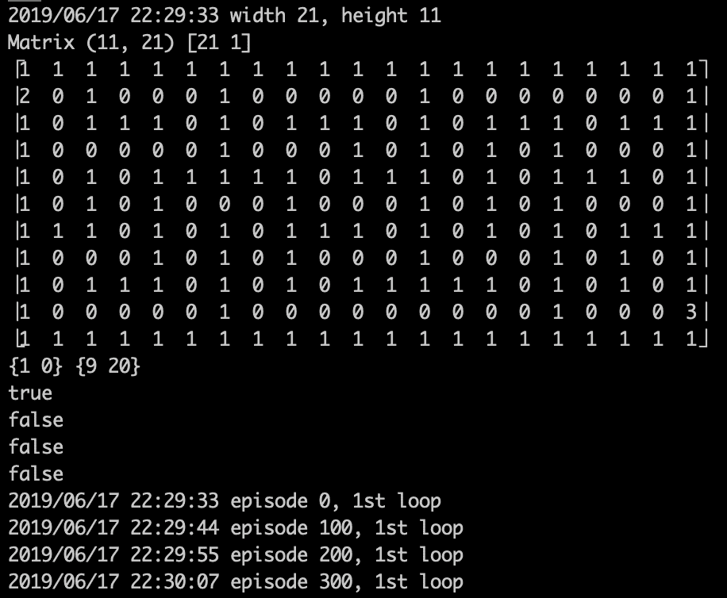
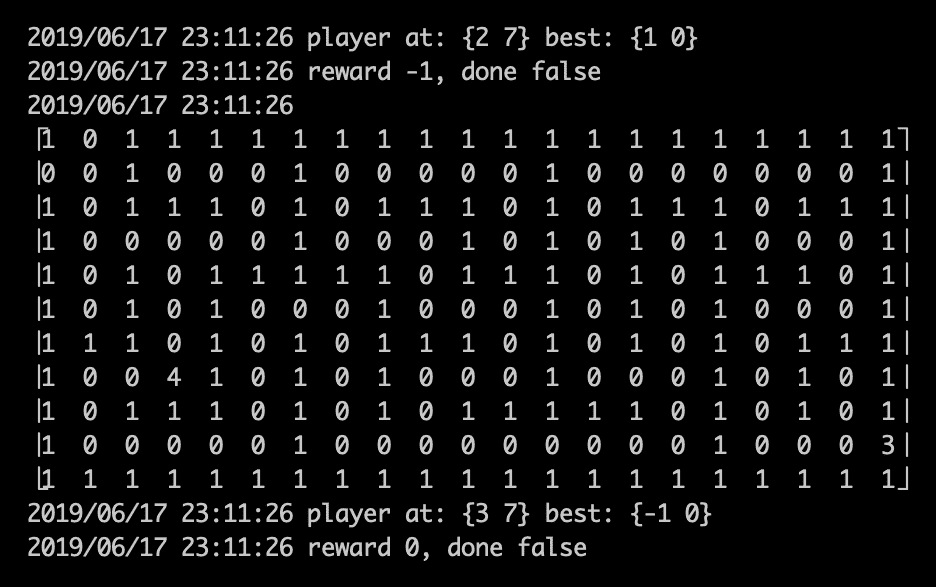

# 使用深度 Q 网络解决迷宫问题

想象一下，你的数据不是离散的文本体或者来自你组织数据仓库的精心清理的记录集合。也许你想训练一个代理去导航一个环境。你将如何开始解决这个问题？到目前为止，我们涵盖的技术都不适合这样的任务。我们需要考虑如何以一种完全不同的方式训练我们的模型，使得这个问题可解决。此外，在使用案例中，问题可以被定义为一个代理探索并从环境中获得奖励，从游戏玩法到个性化新闻推荐，**深度 Q 网络** (**DQNs**) 是我们深度学习技术武器库中有用的工具。

**强化学习** (**RL**) 被 Yann LeCun 描述为机器学习方法的“蛋糕上的樱桃”（他在**卷积神经网络** (**CNNs**) 的发展中起了重要作用，并且在撰写本文时是 Facebook AI Research 的主任）。在这个类比中，无监督学习是蛋糕，监督学习是糖霜。这里我们需要理解的重点是，尽管 RL 提供了无模型学习的承诺，你只需提供一些标量奖励作为你的模型朝着指定的目标成功优化的过程中。

本章将简要介绍为什么会这样，以及 RL 如何更普遍地融入图景中。具体而言，我们将涵盖以下主题：

+   什么是 DQN？

+   学习 Q-learning 算法

+   学习如何训练一个**DQN**

+   构建一个用于解决迷宫的 DQN

# 什么是 DQN？

正如你将会学到的，一个 DQN 与我们迄今为止涵盖的标准前馈和卷积网络并没有太大的区别。事实上，所有标准的要素都存在：

+   我们数据的表示（在这个例子中，是我们迷宫的状态以及试图通过它导航的代理的状态）

+   处理迷宫表示的标准层，其中包括这些层之间的标准操作，例如`Tanh`激活函数

+   具有线性激活的输出层，这给出了预测结果

这里，我们的预测代表着可能影响输入状态的移动。在迷宫解决的情况下，我们试图预测产生最大（和累积）期望奖励的移动，最终导致迷宫的出口。这些预测是作为训练循环的一部分出现的，学习算法使用一个作为随时间衰减的变量的*Gamma*来平衡环境状态空间的探索和通过建立行动、状态或奖励地图获取的知识的利用。

让我们介绍一些新概念。首先，我们需要一个*m* x *n*矩阵，表示给定*状态*（即行）和*动作*（即列）的奖励*R*。我们还需要一个*Q*表。这是一个矩阵（初始化为零值），表示代理的记忆（即我们的玩家试图找到迷宫的方式）或状态历史、采取的行动及其奖励。

这两个矩阵相互关联。我们可以通过以下公式确定我们的代理的记忆*Q*表与已知奖励表的关系：

*Q(状态, 动作) = R(状态, 动作) + Gamma * Max[Q(下一个状态, 所有动作)]*

在这里，我们的时代是**一个回合**。我们的代理执行一个*动作*并从环境中获取更新或奖励，直到系统状态终止。在我们的例子中，这意味着迷宫中卡住了。

我们试图学习的东西是一个策略。这个策略是一个将状态映射到动作的函数或映射。它是一个关于我们系统中每个可能状态的最优动作的*n*维巨大表。

我们评估状态*S*的能力取决于假设它是一个**马尔可夫决策过程**（**MDP**）。正如我们之前指出的，这本书更关注实现而非理论；然而，MDP 对于真正理解 RL 至关重要，因此稍微详细地讨论它们是值得的。

我们使用大写*S*来表示系统的所有可能状态。在迷宫的情况下，这是迷宫边界内代理位置的所有可能位置。

我们使用小写*s*表示单个状态。对所有动作*A*和一个单独的动作*a*也是如此。

每对*(s**, a)*生成奖励分布*R*。它还生成*P*，称为转移概率，对于给定的*(s, a)*，可能的下一个状态分布是*s(t + 1)*。

我们还有一个超参数，即折现因子(*gamma*)。一般来说，这是我们自己设置的超参数。这是为了预测奖励在给定时间步长时的相对价值。例如，假设我们希望为下一个时间步骤的预测奖励分配更大的价值，而不是三个时间步骤之后的奖励。我们可以在学习最优策略的目标的上下文中表示它；伪代码如下：

*OptimalPolicy = max(sum(gamma x reward) for timestep t*

进一步分解我们的 DQN 的概念组件，我们现在可以讨论价值函数。这个函数表示给定状态的累积奖励。例如，在我们的迷宫探索早期，累积预期奖励较低。这是因为我们的代理可以采取或占据的可能动作或状态数量。

# Q 学习

现在，我们来到我们系统的真正核心：Q 值函数。这包括对于给定状态*s*和动作*a1*、*a2*的累积预期奖励。当然，我们对找到最优 Q 值函数很感兴趣。这意味着我们不仅有一个给定的*(s, a)*，而且我们有可训练参数（权重和偏置在我们的 DQN 中的乘积的总和），我们在训练网络时修改或更新这些参数。这些参数允许我们定义一个最优策略，即适用于任何给定状态和代理可用动作的函数。这产生了一个最优 Q 值函数，理论上告诉我们的代理在任何步骤中最佳的行动是什么。一个不好的足球类比可能是 Q 值函数就像教练在新秀代理的耳边大喊指令。

因此，当以伪代码书写时，我们对最优策略的追求如下所示：

*最优策略 = （状态，动作，theta）*

在这里，*theta*指的是我们 DQN 的可训练参数。

那么，什么是 DQN？现在让我们详细检查我们网络的结构，更重要的是，它如何被使用。在这里，我们将引入我们的 Q 值函数，并使用我们的神经网络计算给定状态的预期奖励。

像我们迄今为止涵盖的网络一样，我们提前设置了许多超参数：

+   Gamma（未来奖励的折现因子，例如，0.95）

+   Epsilon（探索或利用，1.0，偏向探索）

+   Epsilon 衰减（随着时间的推移，从学习知识到利用知识的转变，例如，0.995）

+   Epsilon 衰减最小值（例如，0.01）

+   学习率（尽管使用**自适应矩估计**（**Adam**）仍然是默认设置）

+   状态大小

+   动作大小

+   批量大小（以 2 的幂为单位；从 32 开始，逐步调整）

+   节目数

我们还需要一个固定的顺序记忆来进行经验重播功能，将其大小设置为 2,000 条目。

# 优化和网络架构

至于我们的优化方法，我们使用 Adam。您可能还记得来自第二章的内容，*什么是神经网络，我如何训练一个？*，Adam 求解器属于使用动态学习率的求解器类别。在传统的 SGD 中，我们固定学习率。在这里，学习率针对每个参数进行设置，使我们在数据（向量）稀疏的情况下更具控制力。此外，我们使用根均方误差传播与先前梯度相比，理解我们优化表面形状的变化速率，并通过这样做改进我们的网络如何处理数据中的噪声。

现在，让我们谈谈我们神经网络的层次。我们的前两层是标准的前馈网络，采用**整流线性单元**（**ReLU**）激活：

*输出 = 激活（点积（输入，权重） + 偏置）*

第一个按状态大小进行调整（即系统中所有可能状态的向量表示）。

我们的输出层限制为可能动作的数量。这些通过将线性激活应用于我们第二隐藏维度的输出来实现。

我们的损失函数取决于任务和我们拥有的数据；通常我们会使用 MSE 或交叉熵损失。

# 记住，行动，然后重放！

除了我们神经网络中通常涉及的对象，我们需要为代理的记忆定义额外的函数。`remember`函数接受多个输入，如下所示：

+   状态

+   行动

+   奖励

+   下一个状态

+   是否完成

它将这些值附加到内存中（即，一个按顺序排列的列表）。

现在我们定义代理如何在`act`函数中采取行动。这是我们管理探索状态空间和利用学习知识之间平衡的地方。遵循以下步骤：

1.  它接收一个值，即`state`。

1.  从那里，应用`epsilon`；也就是说，如果介于 0 到 1 之间的随机值小于`epsilon`，则采取随机动作。随着时间的推移，我们的 epsilon 会衰减，减少动作的随机性！

1.  然后我们将状态输入到我们的模型中，以预测应采取的行动。

1.  从这个函数中，我们返回`max(a)`。

我们需要的额外函数是用于经验回放的。此函数的步骤如下：

1.  创建一个随机样本（`batch_size`）从我们的 2000 单位内存中选择，这是由前面的`remember`函数定义并添加的。

1.  遍历`state`，`action`，`reward`，`next_state`和`isdone`输入，如下所示：

    1.  设置`target` = `reward`。

    1.  如果未完成，则使用以下公式：

*估计的未来奖励 = 当前奖励 + （折现因子（gamma）* 模型预测的下一个状态的预期最大奖励的调用）*

1.  将未来的`reward`输入映射到模型（即从当前状态预测的未来`reward`输入）。

1.  最后，通过传递当前状态和单个训练时期的目标未来奖励来`重放`记忆。

1.  使用`epsilon_decay`递减`epsilon`。

这部分涵盖了 DQNs 和 Q-learning 的理论，现在是写一些代码的时候了。

# 在 Gorgonia 中使用 DQN 解决迷宫问题。

现在，是时候建立我们的迷宫求解器了！

使用 DQN 解决一个小 ASCII 迷宫有点像带着推土机去沙滩为你的孩子做沙堡：完全不必要，但你可以玩一个大机器。然而，作为学习 DQN 的工具，迷宫是无价的。这是因为游戏中的状态或动作数量有限，约束的表示也很简单（例如我们的迷宫的*墙壁*代表了我们的代理无法通过的障碍）。这意味着我们可以逐步执行我们的程序并轻松检查我们的网络在做什么。

我们将按照以下步骤进行：

1.  为这段代码创建一个`maze.go`文件。

1.  导入我们的库并设置我们的数据类型。

1.  定义我们的`Maze{}`

1.  编写一个`NewMaze()`函数来实例化这个`struct`。

我们还需要定义我们的`Maze{}`辅助函数。这些包括以下内容：

+   `CanMoveTo()`: 检查移动是否有效

+   `Move()`: 将我们的玩家移动到迷宫中的一个坐标

+   `Value()`: 返回给定动作的奖励

+   `Reset()`: 将玩家设置到起始坐标

让我们来看看我们迷宫生成器代码的开头。这是一个摘录，其余的代码可以在书的 GitHub 仓库中找到：

```py
...
type Point struct{ X, Y int }
type Vector Point

type Maze struct {
  // some maze object
  *mazegen.Maze
  repr *tensor.Dense
  iter [][]tile
  values [][]float32

  player, start, goal Point

  // meta

  r *rand.Rand
}
...
```

现在我们已经得到了我们需要生成和与迷宫交互的代码，我们需要定义简单的前馈全连接网络。到现在为止，这段代码应该对我们来说已经很熟悉了。让我们创建`nn.go`：

```py
...
type NN struct {
  g *ExprGraph
  x *Node
  y *Node
  l []FC

  pred *Node
  predVal Value
}

func NewNN(batchsize int) *NN {
  g := NewGraph()
  x := NewMatrix(g, of, WithShape(batchsize, 4), WithName("X"), WithInit(Zeroes()))
  y := NewVector(g, of, WithShape(batchsize), WithName("Y"), WithInit(Zeroes()))
...
```

现在我们可以开始定义将利用这个神经网络的 DQN 了。首先，让我们创建一个`memory.go`文件，其中包含捕获给定情节信息的基本`struct`类型：

```py
package main

type Memory struct {
  State Point
  Action Vector
  Reward float32
  NextState Point
  NextMovables []Vector
  isDone bool
}
```

我们将创建一个`[]Memories`的记忆，并用它来存储每次游戏的 X/Y 状态坐标、移动向量、预期奖励、下一个状态/可能的移动以及迷宫是否已解决。

现在我们可以编辑我们的`main.go`，把一切整合在一起。首先，我们定义跨*m x n*矩阵的可能移动：

```py
package main

import (
  "fmt"
  "log"
  "math/rand"
  "time"

  "gorgonia.org/gorgonia"
)

var cardinals = [4]Vector{
  Vector{0, 1}, // E
  Vector{1, 0}, // N
  Vector{-1, 0}, // S
  Vector{0, -1}, // W
}
```

接下来，我们需要我们的主`DQN{}`结构，我们在其中附加了之前定义的神经网络、我们的 VM/Solver 以及我们 DQN 特定的超参数。我们还需要一个`init()`函数来构建嵌入的前馈网络以及`DQN`对象本身：

```py
type DQN struct {
  *NN
  gorgonia.VM
  gorgonia.Solver
  Memories []Memory // The Q-Table - stores State/Action/Reward/NextState/NextMoves/IsDone - added to each train x times per episode

  gamma float32
  epsilon float32
  epsDecayMin float32
  decay float32
}

func (m *DQN) init() {
  if _, err := m.NN.cons(); err != nil {
    panic(err)
  }
  m.VM = gorgonia.NewTapeMachine(m.NN.g)
  m.Solver = gorgonia.NewRMSPropSolver()
}
```

接下来是我们的经验`replay()`函数。在这里，我们首先从记忆中创建批次，然后重新训练和更新我们的网络，逐步更新我们的 epsilon：

```py
func (m *DQN) replay(batchsize int) error {
  var N int
  if batchsize < len(m.Memories) {
    N = batchsize
  } else {
    N = len(m.Memories)
  }
  Xs := make([]input, 0, N)
  Ys := make([]float32, 0, N)
  mems := make([]Memory, N)
  copy(mems, m.Memories)
  rand.Shuffle(len(mems), func(i, j int) {
    mems[i], mems[j] = mems[j], mems[i]
  })

  for b := 0; b < batchsize; b++ {
    mem := mems[b]

    var y float32
    if mem.isDone {
      y = mem.Reward
    } else {
      var nextRewards []float32
      for _, next := range mem.NextMovables {
        nextReward, err := m.predict(mem.NextState, next)
        if err != nil {
          return err
        }
        nextRewards = append(nextRewards, nextReward)
      }
      reward := max(nextRewards)
      y = mem.Reward + m.gamma*reward
    }
    Xs = append(Xs, input{mem.State, mem.Action})
    Ys = append(Ys, y)
    if err := m.VM.RunAll(); err != nil {
      return err
    }
    m.VM.Reset()
    if err := m.Solver.Step(m.model()); err != nil {
      return err
    }
    if m.epsilon > m.epsDecayMin {
      m.epsilon *= m.decay
    }
  }
  return nil
}
```

接下来是`predict()`函数，在确定最佳移动（或具有最大预测奖励的移动）时调用。它接受迷宫中玩家的位置和一个单一移动，并返回我们神经网络对该移动的预期奖励：

```py
func (m *DQN) predict(player Point, action Vector) (float32, error) {
  x := input{State: player, Action: action}
  m.Let1(x)
  if err := m.VM.RunAll(); err != nil {
    return 0, err
  }
  m.VM.Reset()
  retVal := m.predVal.Data().([]float32)[0]
  return retVal, nil
}
```

然后，我们为`n`个情节定义我们的主训练循环，围绕迷宫移动并构建我们的 DQN 的记忆：

```py
func (m *DQN) train(mz *Maze) (err error) {
  var episodes = 20000
  var times = 1000
  var score float32

  for e := 0; e < episodes; e++ {
    for t := 0; t < times; t++ {
      if e%100 == 0 && t%999 == 1 {
        log.Printf("episode %d, %dst loop", e, t)
      }

      moves := getPossibleActions(mz)
      action := m.bestAction(mz, moves)
      reward, isDone := mz.Value(action)
      score = score + reward
      player := mz.player
      mz.Move(action)
      nextMoves := getPossibleActions(mz)
      mem := Memory{State: player, Action: action, Reward: reward, NextState: mz.player, NextMovables: nextMoves, isDone: isDone}
      m.Memories = append(m.Memories, mem)
    }
  }
  return nil
}
```

我们还需要一个`bestAction()`函数，根据选项切片和我们迷宫的实例选择最佳移动：

```py
func (m *DQN) bestAction(state *Maze, moves []Vector) (bestAction Vector) {
  var bestActions []Vector
  var maxActValue float32 = -100
  for _, a := range moves {
    actionValue, err := m.predict(state.player, a)
    if err != nil {
      // DO SOMETHING
    }
    if actionValue > maxActValue {
      maxActValue = actionValue
      bestActions = append(bestActions, a)
    } else if actionValue == maxActValue {
      bestActions = append(bestActions, a)
    }
  }
  // shuffle bestActions
  rand.Shuffle(len(bestActions), func(i, j int) {
    bestActions[i], bestActions[j] = bestActions[j], bestActions[i]
  })
  return bestActions[0]
}
```

最后，我们定义一个`getPossibleActions()`函数来生成可能移动的切片，考虑到我们的迷宫和我们的小`max()`辅助函数，用于找到`float32s`切片中的最大值：

```py
func getPossibleActions(m *Maze) (retVal []Vector) {
  for i := range cardinals {
    if m.CanMoveTo(m.player, cardinals[i]) {
      retVal = append(retVal, cardinals[i])
    }
  }
  return retVal
}

func max(a []float32) float32 {
  var m float32 = -999999999
  for i := range a {
    if a[i] > m {
      m = a[i]
    }
  }
  return m
}
```

所有这些部分齐全后，我们可以编写我们的`main()`函数完成我们的 DQN。我们从设置`vars`开始，其中包括我们的 epsilon。然后，我们初始化`DQN{}`并实例化`Maze`：

然后我们启动我们的训练循环，一旦完成，尝试解决我们的迷宫：

```py
func main() {
  // DQN vars

  // var times int = 1000
  var gamma float32 = 0.95 // discount factor
  var epsilon float32 = 1.0 // exploration/exploitation bias, set to 1.0/exploration by default
  var epsilonDecayMin float32 = 0.01
  var epsilonDecay float32 = 0.995

  rand.Seed(time.Now().UTC().UnixNano())
  dqn := &DQN{
    NN: NewNN(32),
    gamma: gamma,
    epsilon: epsilon,
    epsDecayMin: epsilonDecayMin,
    decay: epsilonDecay,
  }
  dqn.init()

  m := NewMaze(5, 10)
  fmt.Printf("%+#v", m.repr)
  fmt.Printf("%v %v\n", m.start, m.goal)

  fmt.Printf("%v\n", m.CanMoveTo(m.start, Vector{0, 1}))
  fmt.Printf("%v\n", m.CanMoveTo(m.start, Vector{1, 0}))
  fmt.Printf("%v\n", m.CanMoveTo(m.start, Vector{0, -1}))
  fmt.Printf("%v\n", m.CanMoveTo(m.start, Vector{-1, 0}))

  if err := dqn.train(m); err != nil {
    panic(err)
  }

  m.Reset()
  for {
    moves := getPossibleActions(m)
    best := dqn.bestAction(m, moves)
    reward, isDone := m.Value(best)
    log.Printf("\n%#v", m.repr)
    log.Printf("player at: %v best: %v", m.player, best)
    log.Printf("reward %v, done %v", reward, isDone)
    m.Move(best)
  }
}
```

现在，让我们执行我们的程序并观察输出：



我们可以看到迷宫的尺寸，以及墙壁（`1`）、明显路径（`o`）、我们的玩家（`2`）和迷宫出口（`3`）的简单表示。接下来的一行，`{1 0} {9 20}`，告诉我们玩家起点和迷宫出口的确切*(X, Y)*坐标。然后我们通过移动向量进行一次健全性检查，并开始我们的训练运行跨过`n`剧集。

我们的智能体现在通过迷宫移动：



你可以尝试不同数量的剧集（和剧集长度），并生成更大更复杂的迷宫！

# 摘要

在本章中，我们深入了解了强化学习的背景以及什么是 DQN，包括 Q-learning 算法。我们看到了 DQN 相对于我们迄今讨论的其他架构提供了一种独特的解决问题的方法。我们没有像传统意义上的输出标签那样为 CNN 提供输出标签，例如我们在第五章中处理 CIFAR 图像数据时的情况。事实上，我们的输出标签是相对于环境状态的给定动作的累积奖励，因此你现在可以看到我们已经动态创建了输出标签。但是，这些标签不是网络的最终目标，而是帮助虚拟智能体在离散的可能性空间内做出智能决策。我们还探讨了我们可以在奖励或行动周围做出何种类型的预测。

现在你可以考虑使用 DQN（Deep Q-Network）的其他可能应用，更普遍地应用于一些问题，其中你有某种简单的奖励但没有数据的标签——典型的例子是在某种环境中的智能体。*智能体*和*环境*应该以尽可能通用的方式定义，因为你不仅仅局限于数学玩 Atari 游戏或尝试解决迷宫问题。例如，你网站的用户可以被视为一个智能体，而环境则是一个具有基于特征表示的内容空间。你可以使用这种方法来构建一个新闻推荐引擎。你可以参考*进一步阅读*部分的一篇论文链接，这可能是你想要作为练习实现的内容。

在下一章中，我们将探讨构建**变分自编码器**（**VAE**）以及 VAE 相对于标准自编码器的优势。

# 进一步阅读

+   *使用深度强化学习玩 Atari 游戏*，可在[`www.cs.toronto.edu/~vmnih/docs/dqn.pdf`](https://www.cs.toronto.edu/~vmnih/docs/dqn.pdf)获取。

+   *DRN：用于新闻推荐的深度强化学习框架*，可在[`www.personal.psu.edu/~gjz5038/paper/www2018_reinforceRec/www2018_reinforceRec.pdf`](http://www.personal.psu.edu/~gjz5038/paper/www2018_reinforceRec/www2018_reinforceRec.pdf)获取。
