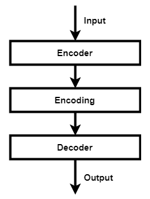
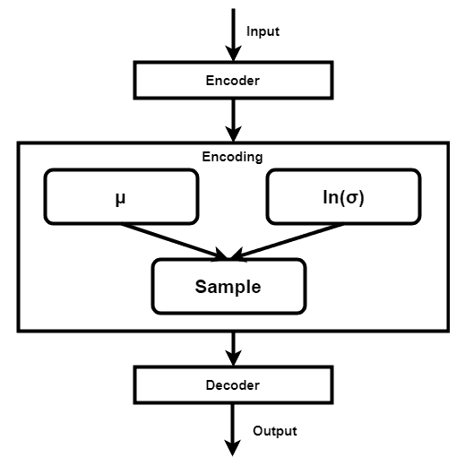
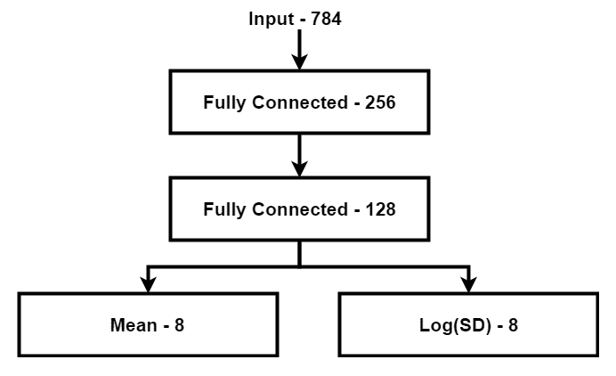
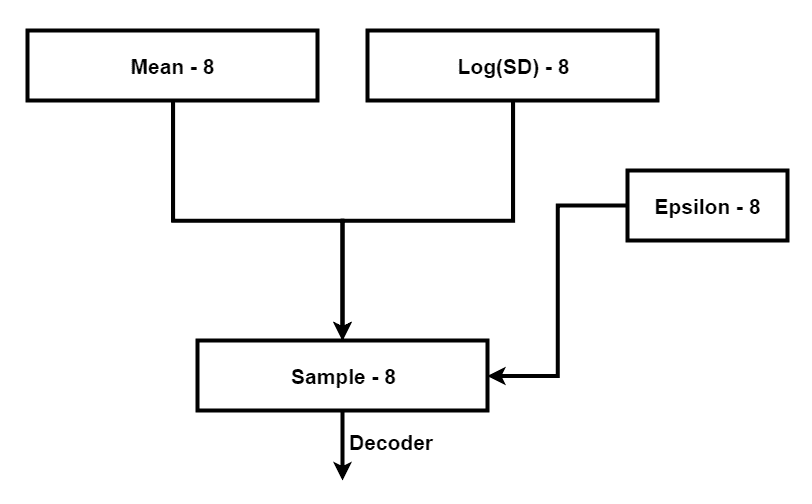
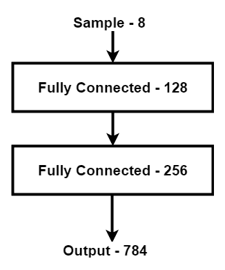
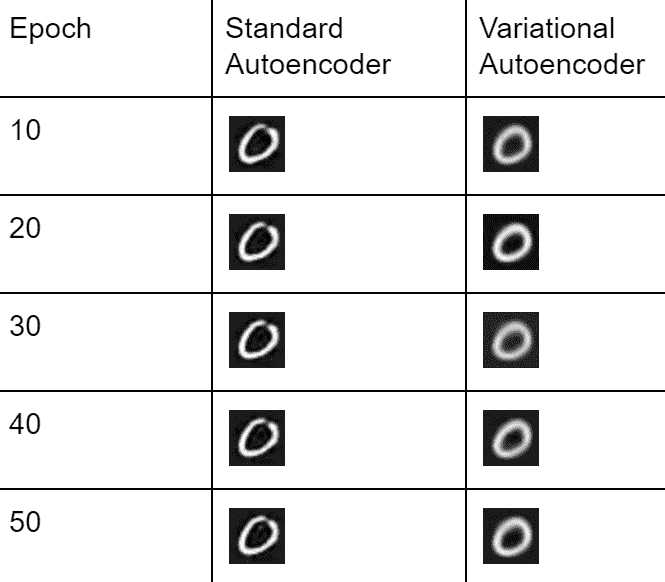
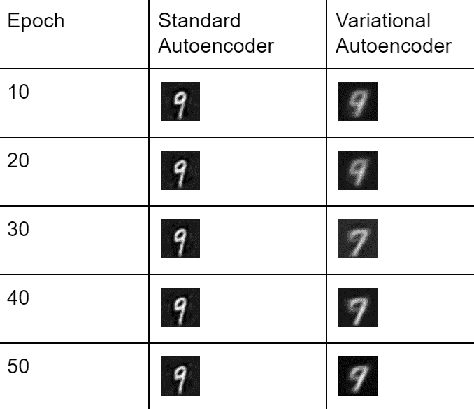
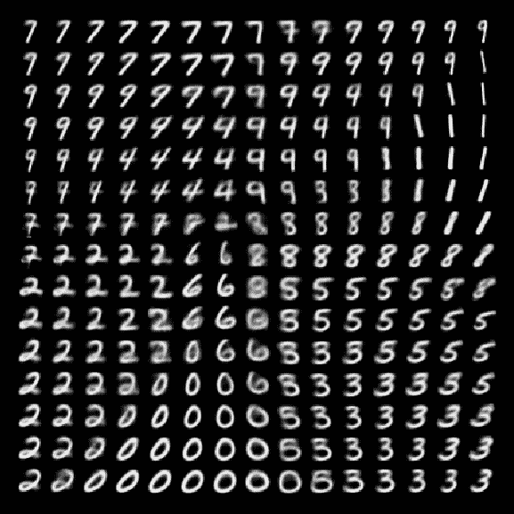
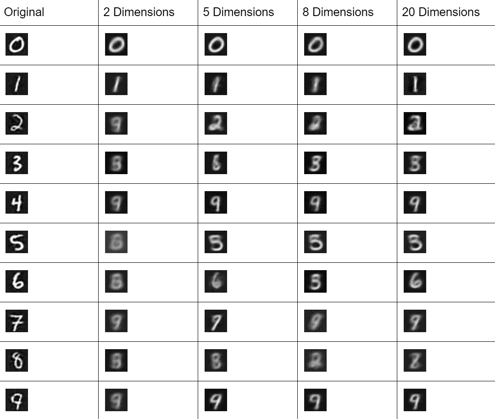

# 第八章：使用变分自编码器生成模型

在前一章中，我们已经探讨了 DQN 是什么以及我们可以在奖励或行动周围做出什么类型的预测。在本章中，我们将讨论如何构建一个 VAE 及其相对于标准自编码器的优势。我们还将探讨改变潜在空间维度对网络的影响。

让我们再来看看另一个自编码器。我们在第三章中已经介绍过自编码器，*超越基础神经网络 – 自编码器和限制玻尔兹曼机*，通过一个简单的例子生成了 MNIST 数字。现在我们将看看如何将其用于一个非常不同的任务——生成新的数字。

本章将涵盖以下主题：

+   **变分自编码器** (**VAEs**) 介绍

+   在 MNIST 上构建 VAE

+   评估结果并更改潜在维度

# 变分自编码器介绍

VAE 在本质上与更基本的自编码器非常相似；它学习如何将其输入的数据编码为简化表示，并且能够基于该编码在另一侧重新创建它。然而，标准自编码器通常仅限于去噪等任务。对于生成任务，使用标准自编码器存在问题，因为标准自编码器中的潜在空间不适合这种目的。它们产生的编码可能不是连续的——它们可能聚集在非常具体的部分周围，并且可能难以进行插值。

然而，由于我们想构建一个更具生成性的模型，并且不想复制我们输入的相同图像，因此我们需要对输入进行变化。如果我们尝试使用标准自编码器来做这件事，那么最终结果很可能会相当荒谬，特别是如果输入与训练集有很大差异。

标准自编码器的结构看起来有点像这样：



我们已经构建了这个标准自编码器；然而，VAE 有一种稍微不同的编码方式，使其看起来更像以下的图表：



VAE 与标准自编码器不同；它通过设计具有连续的潜在空间，使我们能够进行随机采样和插值。它通过将数据编码为两个向量来实现：一个用于存储其均值估计，另一个用于存储其标准差估计。

使用这些均值和标准差，然后我们对编码进行采样，然后将其传递给解码器。解码器然后根据采样编码生成结果。因为我们在采样过程中插入了一定量的随机噪声，所以实际的编码每次都会稍微有所不同。

通过允许此变化发生，解码器不仅仅局限于特定的编码；相反，在训练过程中，它可以跨越潜在空间的更大区域进行操作，因为它不仅仅暴露于数据的变化，还暴露于编码的变化。

为了确保编码在潜在空间中彼此接近，我们在训练过程中引入了一种称为**Kullback-Leibler**（**KL**）散度的度量。KL 散度用于衡量两个概率函数之间的差异。在这种情况下，通过最小化这种散度，我们可以奖励模型使编码彼此靠近，反之亦然，当模型试图通过增加编码之间的距离来作弊时。

在 VAEs 中，我们使用标准正态分布（即均值为 0，标准差为 1 的高斯分布）来测量 KL 散度。我们可以使用以下公式计算：

*klLoss = 0.5 * sum(mean² + exp(sd) - (sd + 1))*

不幸的是，仅仅使用 KL 散度是不够的，因为我们所做的只是确保编码不会散布得太远；我们仍然需要确保编码是有意义的，而不仅仅是相互混合。因此，为了优化 VAE，我们还添加了另一个损失函数来比较输入和输出。这将导致相似对象的编码（或者在 MNIST 的情况下是手写数字）更接近聚类在一起。这将使解码器能够更好地重建输入，并且允许我们通过操纵输入，在连续的轴上产生不同的结果。

# 在 MNIST 上构建 VAE

熟悉 MNIST 数据集以及普通自编码器的结果，这是您未来工作的一个极好的起点。正如您可能记得的那样，MNIST 由许多手写数字图像组成，每个数字尺寸为 28 x 28 像素。

# 编码

由于这是一个自编码器，第一步是构建编码部分，看起来像这样：



首先，我们有我们的两个全连接层：

```py
w0 := gorgonia.NewMatrix(g, dt, gorgonia.WithShape(784, 256), gorgonia.WithName("w0"), gorgonia.WithInit(gorgonia.GlorotU(1.0)))

w1 := gorgonia.NewMatrix(g, dt, gorgonia.WithShape(256, 128), gorgonia.WithName("w1"), gorgonia.WithInit(gorgonia.GlorotU(1.0)))
```

每一层都使用 ReLU 激活函数：

```py
// Set first layer to be copy of input
l0 = x
log.Printf("l0 shape %v", l0.Shape())

// Encoding - Part 1
if c1, err = gorgonia.Mul(l0, m.w0); err != nil {
   return errors.Wrap(err, "Layer 1 Convolution failed")
}
if l1, err = gorgonia.Rectify(c1); err != nil {
    return errors.Wrap(err, "Layer 1 activation failed")
}
log.Printf("l1 shape %v", l1.Shape())

if c2, err = gorgonia.Mul(l1, m.w1); err != nil {
    return errors.Wrap(err, "Layer 1 Convolution failed")
}
if l2, err = gorgonia.Rectify(c2); err != nil {
    return errors.Wrap(err, "Layer 1 activation failed")
}
log.Printf("l2 shape %v", l2.Shape())
```

然后，我们将它们连接到我们的均值和标准差层：

```py
estMean := gorgonia.NewMatrix(g, dt, gorgonia.WithShape(128, 8), gorgonia.WithName("estMean"), gorgonia.WithInit(gorgonia.GlorotU(1.0)))

estSd := gorgonia.NewMatrix(g, dt, gorgonia.WithShape(128, 8), gorgonia.WithName("estSd"), gorgonia.WithInit(gorgonia.GlorotU(1.0)))
```

这些层以它们的形式使用，因此不需要特定的激活函数：

```py
if l3, err = gorgonia.Mul(l2, m.estMean); err != nil {
    return errors.Wrap(err, "Layer 3 Multiplication failed")
}
log.Printf("l3 shape %v", l3.Shape())

if l4, err = gorgonia.HadamardProd(m.floatHalf, gorgonia.Must(gorgonia.Mul(l2, m.estSd))); err != nil {
    return errors.Wrap(err, "Layer 4 Multiplication failed")
}
log.Printf("l4 shape %v", l4.Shape())
```

# 抽样

现在，我们来讲一下 VAE（变分自编码器）背后的一部分魔力：通过抽样创建我们将馈送到解码器中的编码。作为参考，我们正在构建类似以下的东西：



如果您还记得本章早些时候的内容，我们需要在抽样过程中添加一些噪声，我们将其称为`epsilon`。这些数据用于我们的抽样编码；在 Gorgonia 中，我们可以通过`GaussianRandomNode`，输入参数为均值为`0`，标准差为`1`来实现这一点：

```py
epsilon := gorgonia.GaussianRandomNode(g, dt, 0, 1, 100, 8)
```

然后，我们将这些信息馈送到我们的公式中以创建我们的抽样编码：

```py
if sz, err = gorgonia.Add(l3, gorgonia.Must(gorgonia.HadamardProd(gorgonia.Must(gorgonia.Exp(l4)), m.epsilon))); err != nil {
    return errors.Wrap(err, "Layer Sampling failed")
}
log.Printf("sz shape %v", sz.Shape())
```

上述代码可能难以阅读。更简单地说，我们正在做以下工作：

```py
sampled = mean + exp(sd) * epsilon
```

这使我们使用均值和标准差向量加上噪声成分进行了采样编码。这确保了每次的结果并不完全相同。

# 解码

在我们获得了采样的编码之后，我们将其馈送给我们的解码器，这本质上与我们的编码器具有相同的结构，但是顺序相反。布局看起来有点像这样：



在 Gorgonia 中的实际实现看起来像下面这样：

```py
// Decoding - Part 3
if c5, err = gorgonia.Mul(sz, m.w5); err != nil {
    return errors.Wrap(err, "Layer 5 Convolution failed")
}
if l5, err = gorgonia.Rectify(c5); err != nil {
    return errors.Wrap(err, "Layer 5 activation failed")
}
log.Printf("l6 shape %v", l1.Shape())

if c6, err = gorgonia.Mul(l5, m.w6); err != nil {
    return errors.Wrap(err, "Layer 6 Convolution failed")
}
if l6, err = gorgonia.Rectify(c6); err != nil {
    return errors.Wrap(err, "Layer 6 activation failed")
}
log.Printf("l6 shape %v", l6.Shape())

if c7, err = gorgonia.Mul(l6, m.w7); err != nil {
    return errors.Wrap(err, "Layer 7 Convolution failed")
}
if l7, err = gorgonia.Sigmoid(c7); err != nil {
    return errors.Wrap(err, "Layer 7 activation failed")
}
log.Printf("l7 shape %v", l7.Shape())
```

我们在最后一层上放置了`Sigmoid`激活，因为我们希望输出比 ReLU 通常提供的更连续。

# 损失或成本函数

正如本章第一部分讨论的那样，我们优化了两种不同的损失源。

我们优化的第一个损失是输入图像与输出图像之间的实际差异；如果差异很小，这对我们来说是理想的。为此，我们展示输出层，然后计算到输入的差异。对于本例，我们使用输入和输出之间的平方误差之和，没有什么花哨的东西。在伪代码中，这看起来像下面这样：

```py
valueLoss = sum(squared(input - output))
```

在 Gorgonia 中，我们可以按照以下方式实现它：

```py
m.out = l7
valueLoss, err := gorgonia.Sum(gorgonia.Must(gorgonia.Square(gorgonia.Must(gorgonia.Sub(y, m.out)))))
if err != nil {
    log.Fatal(err)
}
```

我们的另一个损失组件是 KL 散度度量，其伪代码如下所示：

```py
klLoss = sum(mean² + exp(sd) - (sd + 1)) / 2
```

我们在 Gorgonia 中的实现更冗长，大量使用了`Must`：

```py
valueOne := gorgonia.NewScalar(g, dt, gorgonia.WithName("valueOne"))
valueTwo := gorgonia.NewScalar(g, dt, gorgonia.WithName("valueTwo"))
gorgonia.Let(valueOne, 1.0)
gorgonia.Let(valueTwo, 2.0)

ioutil.WriteFile("simple_graph_2.dot", []byte(g.ToDot()), 0644)
klLoss, err := gorgonia.Div(
    gorgonia.Must(gorgonia.Sum(
        gorgonia.Must(gorgonia.Sub(
            gorgonia.Must(gorgonia.Add(
                gorgonia.Must(gorgonia.Square(m.outMean)),
                gorgonia.Must(gorgonia.Exp(m.outVar)))),
            gorgonia.Must(gorgonia.Add(m.outVar, valueOne)))))),
    valueTwo)
if err != nil {
    log.Fatal(err)
}

```

现在，剩下的就是一些日常管理和将所有内容联系在一起。我们将使用 Adam 的`solver`作为示例：

```py
func (m *nn) learnables() gorgonia.Nodes {
    return gorgonia.Nodes{m.w0, m.w1, m.w5, m.w6, m.w7, m.estMean, m.estSd}
}

vm := gorgonia.NewTapeMachine(g, gorgonia.BindDualValues(m.learnables()...))
solver := gorgonia.NewAdamSolver(gorgonia.WithBatchSize(float64(bs)), gorgonia.WithLearnRate(0.01))
```

现在让我们评估一下结果。

# 评估结果

您会注意到，我们的 VAE 模型的结果比我们的标准自编码器要模糊得多：



在某些情况下，它还可能在几个不同数字之间犹豫不决，例如在以下示例中，它似乎接近解码为 7 而不是 9：



这是因为我们明确要求分布彼此接近。如果我们试图在二维图上可视化这一点，它看起来会有点像下面的样子：



您可以从上一个示例中看到，它可以生成每个手写数字的多个不同变体，还可以在不同数字之间的某些区域中看到它似乎在几个不同数字之间变形。

# 更改潜在维度

在足够的 epoch 之后，MNIST 上的 VAE 通常表现相当良好，但确保这一点的最佳方法是测试这一假设并尝试几种其他尺寸。

对于本书描述的实现，这是一个相当快速的更改：

```py
w0 := gorgonia.NewMatrix(g, dt, gorgonia.WithShape(784, 256), gorgonia.WithName("w0"), gorgonia.WithInit(gorgonia.GlorotU(1.0)))
w1 := gorgonia.NewMatrix(g, dt, gorgonia.WithShape(256, 128), gorgonia.WithName("w1"), gorgonia.WithInit(gorgonia.GlorotU(1.0)))

w5 := gorgonia.NewMatrix(g, dt, gorgonia.WithShape(8, 128), gorgonia.WithName("w5"), gorgonia.WithInit(gorgonia.GlorotU(1.0)))
w6 := gorgonia.NewMatrix(g, dt, gorgonia.WithShape(128, 256), gorgonia.WithName("w6"), gorgonia.WithInit(gorgonia.GlorotU(1.0)))
w7 := gorgonia.NewMatrix(g, dt, gorgonia.WithShape(256, 784), gorgonia.WithName("w7"), gorgonia.WithInit(gorgonia.GlorotU(1.0)))

estMean := gorgonia.NewMatrix(g, dt, gorgonia.WithShape(128, 8), gorgonia.WithName("estMean"), gorgonia.WithInit(gorgonia.GlorotU(1.0)))
estSd := gorgonia.NewMatrix(g, dt, gorgonia.WithShape(128, 8), gorgonia.WithName("estSd"), gorgonia.WithInit(gorgonia.GlorotU(1.0)))

floatHalf := gorgonia.NewScalar(g, dt, gorgonia.WithName("floatHalf"))
gorgonia.Let(floatHalf, 0.5)

epsilon := gorgonia.GaussianRandomNode(g, dt, 0, 1, 100, 8)
```

这里的基本实现是使用八个维度；要使其在两个维度上工作，我们只需将所有`8`的实例更改为`2`，结果如下：

```py
w0 := gorgonia.NewMatrix(g, dt, gorgonia.WithShape(784, 256), gorgonia.WithName("w0"), gorgonia.WithInit(gorgonia.GlorotU(1.0)))
w1 := gorgonia.NewMatrix(g, dt, gorgonia.WithShape(256, 128), gorgonia.WithName("w1"), gorgonia.WithInit(gorgonia.GlorotU(1.0)))

w5 := gorgonia.NewMatrix(g, dt, gorgonia.WithShape(2, 128), gorgonia.WithName("w5"), gorgonia.WithInit(gorgonia.GlorotU(1.0)))
w6 := gorgonia.NewMatrix(g, dt, gorgonia.WithShape(128, 256), gorgonia.WithName("w6"), gorgonia.WithInit(gorgonia.GlorotU(1.0)))
w7 := gorgonia.NewMatrix(g, dt, gorgonia.WithShape(256, 784), gorgonia.WithName("w7"), gorgonia.WithInit(gorgonia.GlorotU(1.0)))

estMean := gorgonia.NewMatrix(g, dt, gorgonia.WithShape(128, 2), gorgonia.WithName("estMean"), gorgonia.WithInit(gorgonia.GlorotU(1.0)))
estSd := gorgonia.NewMatrix(g, dt, gorgonia.WithShape(128, 2), gorgonia.WithName("estSd"), gorgonia.WithInit(gorgonia.GlorotU(1.0)))

floatHalf := gorgonia.NewScalar(g, dt, gorgonia.WithName("floatHalf"))
gorgonia.Let(floatHalf, 0.5)

epsilon := gorgonia.GaussianRandomNode(g, dt, 0, 1, 100, 2)
```

现在我们只需重新编译代码然后运行它，这使我们能够看到当我们尝试具有更多维度的潜在空间时会发生什么。

正如我们所见，很明显，2 个维度处于劣势，但随着我们逐步升级，情况并不那么明显。您可以看到，平均而言，20 个维度产生了明显更锐利的结果，但实际上，模型的 5 维版本可能已经足够满足大多数需求：



# 总结

您现在已经学会了如何构建 VAE 以及使用 VAE 比标准自编码器的优势。您还了解了变动潜在空间维度对网络的影响。

作为练习，您应该尝试在 CIFAR-10 数据集上训练该模型，并使用卷积层而不是简单的全连接层。

在下一章中，我们将看看数据流水线是什么，以及为什么我们使用 Pachyderm 来构建或管理它们。

# 进一步阅读

+   *自编码变分贝叶斯，* **迪德里克·P·金格玛**，和 **马克斯·威林**

+   *变分自编码器教程，* **卡尔·多尔舍**

+   *ELBO 手术：切割变分证据下界的又一种方法，**马修·D·霍夫曼** 和 **马修·J·约翰逊***

+   *潜在对齐与变分注意力，**邓云天**，**Yoon Kim**，**贾斯汀·邱**，**郭小芬** 和 **亚历山大·M·拉什***
