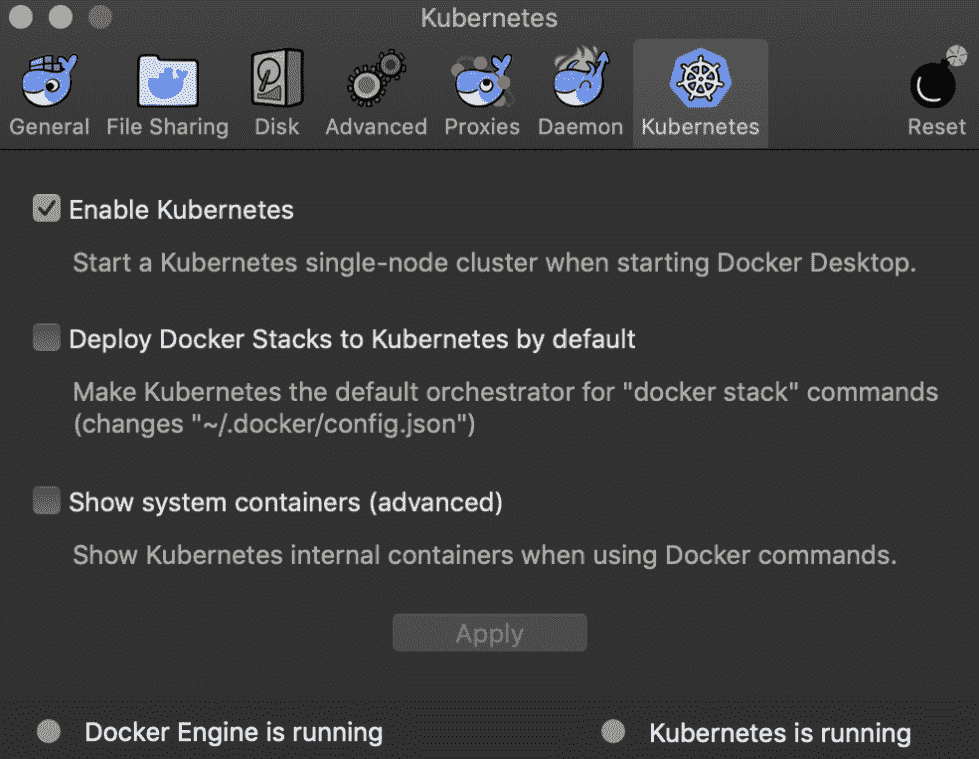
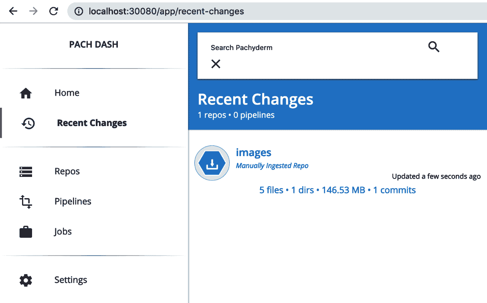
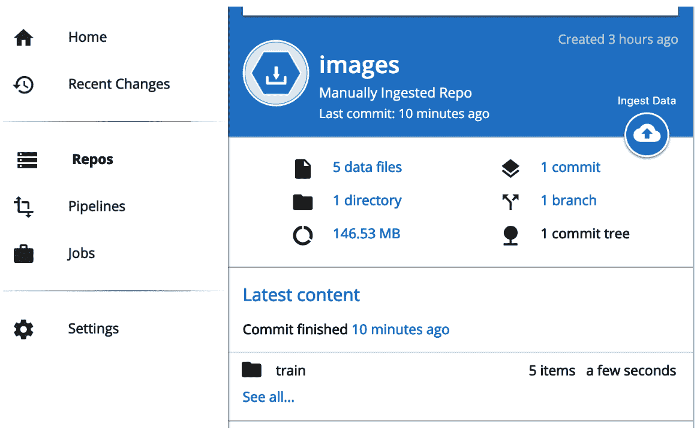

# 构建深度学习管道

到目前为止，对于我们讨论过的各种深度学习架构，我们假设我们的输入数据是静态的。我们处理的是固定的电影评论集、图像或文本。

在现实世界中，无论您的组织或项目是否包括来自自动驾驶汽车、物联网传感器、安全摄像头或客户产品使用的数据，您的数据通常会随时间变化。因此，您需要一种方式来集成这些新数据，以便更新您的模型。数据的结构可能也会发生变化，在客户或观众数据的情况下，可能需要应用新的转换操作。此外，为了测试它们对预测质量的影响，可能会添加或删除维度，这些维度可能不再相关或违反隐私法规。在这些情况下，我们该怎么办？

Pachyderm 就是这样一个有用的工具。我们想知道我们拥有什么数据，我们在哪里拥有它，以及如何确保数据被输入到我们的模型中。

现在，我们将研究如何使用 Pachyderm 工具处理网络中的动态输入值。这将帮助我们准备好在现实世界中使用和部署我们的系统。

通过本章结束时，您将学到以下内容：

+   探索 Pachyderm

+   集成我们的 CNN

# 探索 Pachyderm

本书的重点是在 Go 中开发深度学习系统。因此，自然而然地，现在我们正在讨论如何管理输入到我们网络中的数据，让我们看看一个同样用 Go 编写的工具。

Pachyderm 是一个成熟且可扩展的工具，提供容器化数据管道。在这些管道中，你可以从数据到工具等一切需求都集中在一个地方，可以维护和管理部署，并对数据本身进行版本控制。Pachyderm 团队将他们的工具称为**数据的 Git**，这是一个有用的类比。理想情况下，我们希望对整个数据管道进行版本控制，以便知道用于训练的数据，以及由此给出的特定预测*X*。

Pachyderm 大大简化了管理这些管道的复杂性。Docker 和 Kubernetes 都在幕后运行。我们将在下一章节更详细地探讨这些工具，但现在我们只需知道它们对于实现可复制的构建以及可扩展的模型分布式训练至关重要。

# 安装和配置 Pachyderm

Pachyderm 有大量出色的文档可供参考，我们不会在这里重新讨论所有内容。相反，我们将带您了解基础知识，并构建一个简单数据管道的教程，以向我们在第六章中构建的 CNN 提供版本化图像数据，*使用卷积神经网络进行对象识别*。

首先，您需要安装 Docker Desktop 并为您的操作系统启用 Kubernetes。在本示例中，我们使用 macOS。

完整的安装说明请参阅[`docs.docker.com/docker-for-mac/install/`](https://docs.docker.com/docker-for-mac/install/)，以下是简要说明：

1.  下载 Docker 的 `.dmg` 文件

1.  安装或启动文件

1.  启用 Kubernetes

要安装并运行 Pachyderm，请按照以下步骤操作：

1.  要启用 Kubernetes，在启动 Docker 设置后选择适当的复选框，如下所示：



1.  确保有几个绿色的圆形图标显示您的 Docker 和 Kubernetes 安装正在运行。如果是这样，我们可以通过进入终端并运行以下命令确认底层情况是否正常：

```py
# kubectl get all
NAME TYPE CLUSTER-IP EXTERNAL-IP PORT(S) AGE
service/kubernetes ClusterIP 10.96.0.1 <none> 443/TCP 7m
```

1.  在安装 Pachyderm 之前，请确保集群正在运行。我们使用 Homebrew 安装 Pachyderm，通过以下命令（请注意，您需要安装最新版本的 Xcode）：

```py
brew tap pachyderm/tap && brew install pachyderm/tap/pachctl@1.9
Updating Homebrew...
...
==> Tapping pachyderm/tap
Cloning into '/usr/local/Homebrew/Library/Taps/pachyderm/homebrew-tap'...
remote: Enumerating objects: 13, done.
remote: Counting objects: 100% (13/13), done.
remote: Compressing objects: 100% (12/12), done.
remote: Total 13 (delta 7), reused 2 (delta 0), pack-reused 0
Unpacking objects: 100% (13/13), done.
Tapped 7 formulae (47 files, 34.6KB).
==> Installing pachctl@1.9 from pachyderm/tap
...
==> Downloading https://github.com/pachyderm/pachyderm/releases/download/v1.9.0rc2/pachctl_1.9.0rc2_d
==> Downloading from https://github-production-release-asset-2e65be.s3.amazonaws.com/23653453/0d686a0
######################################################################## 100.0%
/usr/local/Cellar/pachctl@1.9/v1.9.0rc2: 3 files, 62.0MB, built in 26 seconds
```

1.  现在您应该能够启动 Pachyderm 命令行工具了。首先，通过运行以下命令确认工具已成功安装并观察输出：

```py
 pachctl help
Access the Pachyderm API.
..
Usage:
 pachctl [command]

Administration Commands:
..
```

1.  我们几乎完成了集群设置，现在可以专注于获取和存储数据。最后一件事是使用以下命令在 Kubernetes 上部署 Pachyderm：

```py
pachctl deploy local
no config detected at %q. Generating new config... 
/Users/xxx/.pachyderm/config.json
No UserID present in config. Generating new UserID and updating config at /Users/xxx/.pachyderm/config.json
serviceaccount "pachyderm" created
clusterrole.rbac.authorization.k8s.io "pachyderm" created
clusterrolebinding.rbac.authorization.k8s.io "pachyderm" created
deployment.apps "etcd" created
service "etcd" created
service "pachd" created
deployment.apps "pachd" created
service "dash" created
deployment.apps "dash" created
secret "pachyderm-storage-secret" created

Pachyderm is launching. Check its status with "kubectl get all"
Once launched, access the dashboard by running "pachctl port-forward"
```

1.  执行以下命令检查集群状态。如果您在部署后立即运行该命令，应该会看到容器正在创建中：

```py
kubectl get all
NAME READY STATUS RESTARTS AGE
pod/dash-8786f7984-tb5k9 0/2 ContainerCreating 0 8s
pod/etcd-b4d789754-x675p 0/1 ContainerCreating 0 9s
pod/pachd-fbbd6855b-jcf6c 0/1 ContainerCreating 0 9s
```

1.  然后它们会过渡到 `Running` 状态：

```py
kubectl get all
NAME READY STATUS RESTARTS AGE
pod/dash-8786f7984-tb5k9 2/2 Running 0 2m
pod/etcd-b4d789754-x675p 1/1 Running 0 2m
pod/pachd-fbbd6855b-jcf6c 1/1 Running 0 2m
```

接下来的部分将介绍数据的准备工作。

# 将数据导入 Pachyderm

让我们准备我们的数据。在这种情况下，我们使用来自第六章《使用卷积神经网络进行对象识别》的 CIFAR-10 数据集。如果您需要恢复，请从多伦多大学的源头拉取数据，如下所示：

```py
wget https://www.cs.toronto.edu/~kriz/cifar-10-binary.tar.gz
...
cifar-10-binary.tar.gz 100%[==================================>] 162.17M 833KB/s in 2m 26s
```

将数据提取到临时目录，并在 Pachyderm 中创建 `repo`：

```py
# pachctl create repo data
# pachctl list repo
NAME CREATED SIZE (MASTER)
data 8 seconds ago 0B
bash-3.2$
```

现在我们有了一个存储库，让我们用 CIFAR-10 图像数据填充它。首先，让我们创建各个目录并分解各种 CIFAR-10 文件，以便我们可以将整个文件夹（从我们的数据或训练集）直接倒入。

现在我们可以执行以下命令，然后确认数据已成功传输到 `repo`：

```py
#pachctl put file -r data@master -f data/
#pachctl list repo
NAME CREATED SIZE (MASTER)
data 2 minutes ago 202.8MiB
```

我们可以深入了解 `repo` 包含的文件的详细信息：

```py
pachctl list file data@master
COMMIT NAME TYPE COMMITTED SIZE
b22db05d23324ede839718bec5ff219c /data dir 6 minutes ago 202.8MiB
```

# 集成我们的 CNN

现在我们将从前面章节的 CNN 示例中获取示例，并进行一些必要的更新，以使用 Pachyderm 提供的数据打包和部署网络。

# 创建我们的 CNN 的 Docker 镜像

Pachyderm 数据流水线依赖于预先配置的 Docker 镜像。互联网上有很多 Docker 教程，因此我们在这里保持简单，讨论利用简单部署步骤为任何 Go 应用程序带来优势的所需操作。

让我们来看看我们的 Dockerfile：

```py
FROM golang:1.12

ADD main.go /main.go

ADD cifar/ /cifar/

RUN export GOPATH=$HOME/go && cd / && go get -d -v .
```

就是这样！我们只需从 Docker Hub 获取 Go 1.12 镜像并将我们的 CIFAR CNN 放入我们的构建中。我们 Dockerfile 的最后一部分是设置 `GOPATH` 并满足我们的依赖项（例如，安装 Gorgonia）的命令。

执行以下命令来构建 Docker 镜像并观察输出：`docker build -t cifarcnn`：

```py
Sending build context to Docker daemon 212.6MB
Step 1/4 : FROM golang:1.12
 ---> 9fe4cdc1f173
Step 2/4 : ADD main.go /main.go
 ---> Using cache
 ---> 5edf0df312f4
Step 3/4 : ADD cifar/ /cifar/
 ---> Using cache
 ---> 6928f37167a8
Step 4/4 : RUN export GOPATH=$HOME/go && cd / && go get -d -v .
 ---> Running in 7ff14ada5e7c
Fetching https://gorgonia.org/tensor?go-get=1
Parsing meta tags from https://gorgonia.org/tensor?go-get=1 (status code 200)
get "gorgonia.org/tensor": found meta tag get.metaImport{Prefix:"gorgonia.org/tensor", VCS:"git", RepoRoot:"https://github.com/gorgonia/tensor"} at https://gorgonia.org/tensor?go-get=1

...

Fetching https://gorgonia.org/dawson?go-get=1
Parsing meta tags from https://gorgonia.org/dawson?go-get=1 (status code 200)
get "gorgonia.org/dawson": found meta tag get.metaImport{Prefix:"gorgonia.org/dawson", VCS:"git", RepoRoot:"https://github.com/gorgonia/dawson"} at https://gorgonia.org/dawson?go-get=1
gorgonia.org/dawson (download)
Removing intermediate container 7ff14ada5e7c
 ---> 3def2cada165
Successfully built 3def2cada165
Successfully tagged cifar_cnn:latest
```

我们的容器现在已准备好被引用在 Pachyderm 数据管道规范中。

# 更新我们的 CNN 以保存模型

我们需要向我们的 CNN 示例中添加一个简单的函数，以确保生成的模型被保存，这样它就可以被 Pachyderm 作为对象管理。让我们将以下内容添加到 `main.go` 中：

```py
func (m *convnet) savemodel() (err error) {
  learnables := m.learnables()
  var f io.WriteCloser
  if f, err = os.OpenFile("model.bin", os.O_CREATE|os.O_TRUNC|os.O_WRONLY, 0644); err != nil {
    return
  }
  defer f.Close()
  enc := json.NewEncoder(f)
  for _, l := range learnables {
    t := l.Value().(*tensor.Dense).Data() // []float32
    if err = enc.Encode(t); err != nil {
      return
    }
  }

  return nil
}
```

# 创建数据管道

现在我们需要在标准 JSON 中指定一个数据管道。在这里，我们将一个存储库映射到一个目录，并在训练或推断模式下执行我们的网络。

让我们来看看我们的 `cifar_cnn.json` 文件：

```py
{
 "pipeline": {
    "name": "cifarcnn"
  },
  "transform": {
    "image": "cifarcnn:latest",
    "cmd": [
  "go run main.go"
    ]
  },
  "enable_stats": true,
  "parallelism_spec": {
    "constant": "1"
  },
  "input": {
    "pfs": {
      "repo": "data",
      "glob": "/"
    }
  }
}
```

我们在这里选择的选项很简单，您可以看到对 Docker 镜像、命令和开关的引用，以及 `repo` 和我们指定的挂载点。请注意 `parallelism_spec` 选项。将其设置为默认值 `1` 以上，允许我们根据需要扩展特定管道阶段；例如，在推断阶段。

现在我们可以从上述模板创建管道：

```py
pachctl create pipeline -f cifar_cnn.json
```

如果没有错误，这将返回您到命令提示符。然后，您可以检查管道的状态：

```py
pachctl list pipeline 
NAME INPUT CREATED STATE / LAST JOB
cifarcnn data:/ 8 seconds ago running / running
```

我们可以动态调整*并行度*的级别，并通过更新我们的模板将配置推送到我们的集群中：

```py
 "parallelism_spec": {
 "constant": "5"
 },
```

然后，我们可以更新我们的集群并检查我们的作业和 `k8s` 集群的 pod 状态：

```py
#pachctl update pipeline -f cifar_cnn.json
#pachctl list job 
ID PIPELINE STARTED DURATION RESTART PROGRESS DL UL STATE
9339d8d712d945d58322a5ac649d9239 cifarcnn 7 seconds ago - 0 0 + 0 / 1 0B 0B running

#kubectl get pods
NAME READY STATUS RESTARTS AGE
dash-5c54745d97-gs4j2 2/2 Running 2 29d
etcd-b4d789754-x675p 1/1 Running 1 35d
pachd-fbbd6855b-jcf6c 1/1 Running 1 35d
pipeline-cifarcnn-v1-bwfrq 2/2 Running 0 2m
```

等待一段时间运行（并使用 `pachctl logs` 检查进度），我们可以看到我们成功的作业：

```py
#pachctl list job
ID OUTPUT COMMIT STARTED DURATION RESTART PROGRESS DL UL STATE
9339d8d712d945d58322a5ac649d9239 cifarcnn 2 minutes ago About a minute 0 1 + 0 / 1 4.444KiB 49.86KiB success
```

# 可互换的模型

Pachyderm 管道的灵活性使您可以通过简单的更新或推送我们先前使用的 JSON 管道来轻松地将一个模型替换为另一个模型。

指定在 JSON 中指定管道的意义是什么？它是为了使其可重复！管道每次更新其数据（在我们的案例中，是为了对标签类别进行新预测）时都会重新处理数据。

在这里，我们更新 `cifa_cnn.json` 中的 `image` 标志，以引用我们容器化的 CNN 的一个版本，这个版本由于某些原因不包含 dropout：

```py
"image": "pachyderm/cifar_cnn_train:nodropout"
```

然后我们可以像这样在集群上更新管道：

```py
pachctl update pipeline -f cifar_cnn.json --reprocesses
```

# 将预测映射到模型

Pachyderm 的一个重要特性——特别是对于企业用例——是能够对模型和预测进行版本控制。比如说，你在预测客户偿还贷款的可能性时，看到了一批奇怪的预测结果。在排查模型为何做出这些决策的问题时，如果你正在对大团队进行多模型训练，那么翻阅电子邮件和提交历史记录将是一个糟糕的主意！

因此，从推断开始到模型，只需运行以下命令：

```py
#pachctl list job
```

然后您可以获取相关的提交哈希并将其提供给以下命令，观察输出的详细信息：

```py
#pachctl inspect job 9339d8d712d945d58322a5ac649d9239
...
Input:
{
 "pfs": {
 "name": "data",
 "repo": "data",
 "branch": "master",
 "commit": "b22db05d23324ede839718bec5ff219c",
 "glob": "/"
 }
}
...

#pachctl inspect commit data@b22db05d23324ede839718bec5ff219c
Commit: data@b22db05d23324ede839718bec5ff219c
Original Branch: master
Started: 11 minutes ago
Finished: 11 minutes ago
Size: 202.8MiB
```

您可以看到用于生成此预测的模型的确切提交，预测的来源，以及用于训练模型的数据：

```py
#pachctl list file data@adb293f8a4604ed7b081c1ff030c0480
COMMIT NAME TYPE COMMITTED SIZE
b22db05d23324ede839718bec5ff219c /data dir 11 minutes ago 202.8MiB
```

# 使用 Pachyderm 仪表板

从技术上讲，这是 Pachyderm **企业版**的一个功能，但由于我们希望尽可能包容您的使用情况选择，无论您的用例如何，我们将简要介绍 *仪表板* 工具。即使您不需要一个简单的视觉概览您的管道和数据，也可以通过 14 天的试用来探索其功能集。

启动 `http://localhost:30800`。您将看到一个基本的屏幕，其中包括以下内容：

+   仓库（保存我们的 CIFAR-10 数据）

+   管道

+   作业或日志

+   设置

让我们来看下面的截图：



正如你可能记得的那样，Pachyderm 希望你将你的数据仓库视为 Git 仓库。当你深入到下一个屏幕时，这一点显而易见：



仪表板为我们到目前为止一直在使用的 `pachctl` 工具提供了一个熟悉的 GUI 界面。

# 总结

在本章中，我们进行了实际操作，并了解了如何以可维护和可追踪的方式开始增强模型输入或输出组件的过程，以及可以使用哪些工具完成这些操作。从高层次来看，我们了解了数据管道的概念及其重要性，如何在 Pachyderm 中构建/部署/维护管道，以及用于可视化我们的仓库和管道的工具。

在下一章中，我们将深入探讨 Pachyderm 下面的一些技术，包括 Docker 和 Kubernetes，以及如何使用这些工具部署堆栈到云基础设施。
