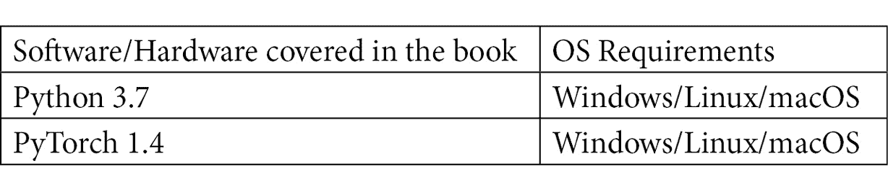

# 前言

在互联网时代，每天从社交媒体和其他平台生成大量文本数据，理解和利用这些数据是一项至关重要的技能。本书将帮助您构建用于**自然语言处理**（**NLP**）任务的深度学习模型，帮助您从文本中提取有价值的见解。

我们将从了解如何安装 PyTorch 和使用 CUDA 加速处理速度开始。接着，您将通过实际示例探索 NLP 架构的工作原理。后续章节将指导您掌握诸如词嵌入、CBOW 和 PyTorch 中的分词等重要原则。您还将学习一些处理文本数据以及如何利用深度学习进行 NLP 任务的技巧。接下来，我们将演示如何实现深度学习和神经网络架构，构建可以分类、翻译文本和进行情感分析的模型。最后，您将学习如何构建高级 NLP 模型，如会话式聊天机器人。

通过本书，您将了解如何使用 PyTorch 进行深度学习解决不同的 NLP 问题，以及如何构建模型来解决这些问题。

# 适合读者

这本 PyTorch 书籍适合 NLP 开发人员、机器学习和深度学习开发人员，或者任何希望利用传统 NLP 方法和深度学习架构构建智能语言应用程序的人士。如果您希望采用现代 NLP 技术和模型来开发项目，那么这本书适合您。需要具备 Python 编程的工作知识和 NLP 任务的基础知识。

# 这本书涵盖了什么内容

*第一章**，机器学习和深度学习基础*，概述了机器学习和神经网络的基本方面。

*第二章**，开始使用 PyTorch 1.x 进行 NLP*，向您展示如何下载、安装和启动 PyTorch。我们还将介绍包的基本功能。

*第三章**，NLP 和文本嵌入*，向您展示如何为 NLP 创建文本嵌入，并将其用于基础语言模型中。

*第四章**，文本预处理、词干提取和词形还原*，向您展示如何为 NLP 深度学习模型预处理文本数据。

*第五章**，递归神经网络和情感分析*，深入讲解了递归神经网络的基础，并向您展示如何使用它们从头开始构建情感分析模型。

*第六章**, 用于文本分类的卷积神经网络*, 介绍了卷积神经网络的基础知识，并展示了如何使用它们构建一个用于文本分类的工作模型。

*第七章**, 使用序列到序列神经网络进行文本翻译*, 引入了用于深度学习的序列到序列模型的概念，并演示了如何使用它们构建一个将文本翻译成另一种语言的模型。

*第八章**, 使用基于注意力的神经网络构建聊天机器人*, 讨论了在序列到序列深度学习模型中使用注意力的概念，还展示了如何使用它们从头开始构建一个完全工作的聊天机器人。

*第九章**, 未来的道路*, 讨论了目前在 NLP 深度学习中使用的一些最先进的模型，并探讨了该领域未来面临的一些挑战和问题。

# 要充分利用本书

您需要在计算机上安装 Python 的某个版本。所有代码示例都已使用版本 3.7 进行测试。您还需要一个用于本书深度学习组件的工作 PyTorch 环境。所有深度学习模型均使用版本 1.4 构建；但是，大多数代码应该可以与更高版本一起使用。



本书中的代码使用了几个 Python 库；但是，这些内容将在相关章节中介绍。

**如果您使用本书的数字版，建议您自行输入代码或通过 GitHub 存储库（链接在下一节中提供）访问代码。这样做可以帮助您避免与复制粘贴代码相关的任何潜在错误。**

# 下载示例代码文件

您可以从您在[www.packt.com](http://packt.com)的账户中下载本书的示例代码文件。如果您在其他地方购买了本书，您可以访问[www.packtpub.com/support](https://www.packtpub.com/support)，注册并直接通过电子邮件接收文件。

您可以按照以下步骤下载代码文件：

1.  在[www.packt.com](http://packt.com)上登录或注册。

1.  选择**支持**选项卡。

1.  点击**代码下载**。

1.  在**搜索**框中输入书名，并按照屏幕上的说明操作。

下载文件后，请确保使用最新版本的解压缩文件夹：

+   适用于 Windows 的 WinRAR/7-Zip

+   适用于 Mac 的 Zipeg/iZip/UnRarX

+   适用于 Linux 的 7-Zip/PeaZip

本书的代码包也托管在 GitHub 上：[`github.com/PacktPublishing/Hands-On-Natural-Language-Processing-with-PyTorch-1.x`](https://github.com/PacktPublishing/Hands-On-Natural-Language-Processing-with-PyTorch-1.x)。如果代码有更新，将在现有的 GitHub 仓库中更新。

我们还有来自丰富书籍和视频目录的其他代码包可供使用：[`github.com/PacktPublishing/`](https://github.com/PacktPublishing/)。请查看！

# 下载彩色图像

我们还提供了一份包含本书中使用的屏幕截图/图示的彩色图像的 PDF 文件。您可以在这里下载：[`static.packt-cdn.com/downloads/9781789802740_ColorImages.pdf`](https://static.packt-cdn.com/downloads/9781789802740_ColorImages.pdf)。

# 使用的约定

本书中使用了多种文本约定。

`文本中的代码`：表示文本中的代码字词、数据库表名、文件夹名、文件名、文件扩展名、路径名、虚拟 URL、用户输入和 Twitter 句柄。以下是一个例子：“将下载的 `WebStorm-10*.dmg` 磁盘映像文件挂载为系统中的另一个磁盘。”

代码块如下所示：

```py
import torch
```

当我们希望引起您对代码块的特定部分的注意时，相关行或条目将以粗体显示：

```py
word_1 = ‘cat'
word_2 = ‘dog'
word_3 = ‘bird'
```

任何命令行输入或输出均写成以下格式：

```py
$ mkdir flaskAPI
$ cd flaskAPI
```

**粗体**：表示新术语、重要词汇或屏幕上显示的字词。例如，菜单或对话框中的字词会以这种方式出现在文本中。以下是一个例子：“从**管理**面板中选择**系统信息**。”

提示或重要注意事项

显示如此。

# 联系我们

我们始终欢迎读者的反馈。

`customercare@packtpub.com`。

**勘误表**：尽管我们已经尽最大努力确保内容的准确性，但错误是难免的。如果您在本书中发现了错误，请向我们报告。请访问 [www.packtpub.com/support/errata](https://www.packtpub.com/support/errata)，选择您的书籍，点击勘误提交表单链接，并输入详细信息。

`copyright@packt.com`，附带材料的链接。

**如果您有兴趣成为作者**：如果您在某个专题上有专业知识，并且有意撰写或为书籍做贡献，请访问 [authors.packtpub.com](http://authors.packtpub.com/)。

# 评价

请留下您的评价。阅读并使用本书后，请在您购买书籍的网站上留下评价。潜在的读者可以通过您的公正意见做出购买决策，我们在 Packt 可以了解您对我们产品的看法，而我们的作者也可以看到您对他们书籍的反馈。谢谢！

欲了解更多有关 Packt 的信息，请访问 [packt.com](http://packt.com)。
