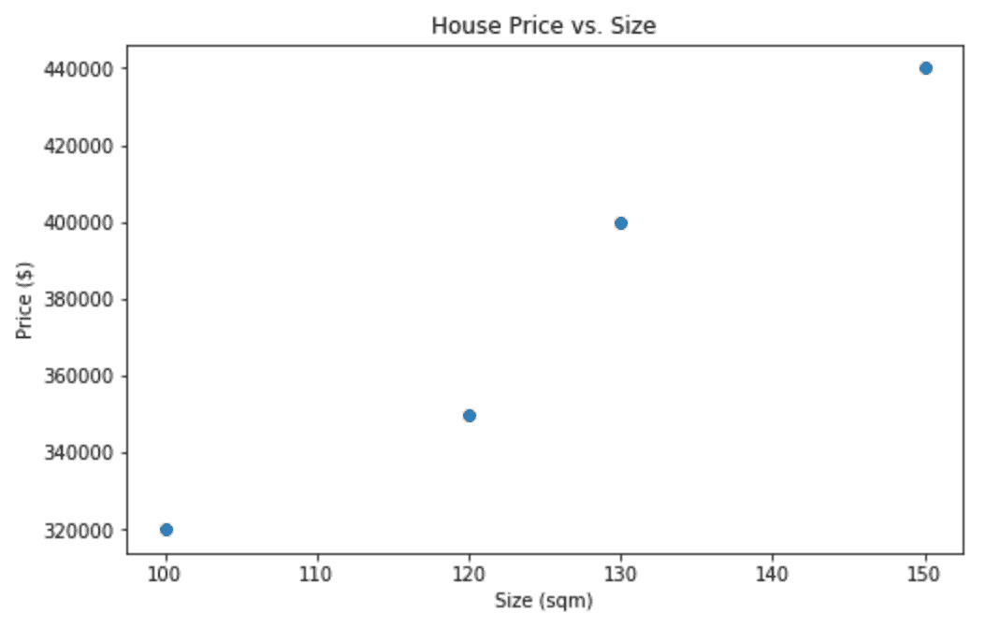
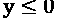
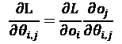
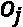

# *第一章*：机器学习和深度学习基础

我们的世界充满了自然语言数据。在过去的几十年里，我们彼此之间的沟通方式已经转变为数字领域，因此这些数据可以用来构建能够改进我们在线体验的模型。从在搜索引擎中返回相关结果，到在电子邮件中自动完成下一个输入的词语，能够从自然语言中提取洞察力的好处是显而易见的。

尽管我们人类理解语言的方式与模型或*人工智能*理解的方式有显著区别，但通过揭示机器学习及其用途，我们可以开始理解这些深度学习模型如何*理解*语言，以及模型从数据中学习时发生的基本情况。

本书中，我们将探讨人工智能和深度学习在自然语言处理中的应用。通过使用 PyTorch，我们将逐步学习如何构建模型，从而进行情感分析、文本分类和序列翻译，这将使我们能够构建基本的聊天机器人。通过涵盖每个模型背后的理论，并演示如何实际实施它们，我们将揭开**自然语言处理**（**NLP**）领域的神秘面纱，并为您提供足够的背景知识，让您可以开始构建自己的模型。

在我们的第一章中，我们将探讨一些机器学习的基本概念。然后，我们将进一步深入研究深度学习、神经网络以及深度学习方法相对于基本机器学习技术的优势。最后，我们将更详细地探讨深度学习，特别是在处理自然语言相关任务时，以及我们如何利用深度学习模型从自然语言中获取洞察力。具体来说，我们将涵盖以下主题：

+   机器学习概述

+   神经网络简介

+   机器学习的自然语言处理（NLP）

# 机器学习概述

从根本上讲，机器学习是用于从数据中识别模式和提取趋势的算法过程。通过在数据上训练特定的机器学习算法，机器学习模型可能会学习到人眼不容易察觉的洞察力。医学成像模型可能会学习从人体图像中检测癌症，而情感分析模型可能会学习到包含“好”、“优秀”和“有趣”的书评更可能是正面评价，而包含“坏”、“糟糕”和“无聊”的书评更可能是负面评价。

广义而言，机器学习算法可以分为两大类：监督学习和无监督学习。

## 监督学习

**监督学习**涵盖任何我们希望使用输入来预测输出的任务。假设我们希望训练一个模型来预测房屋价格。我们知道较大的房屋通常售价更高，但我们不知道价格与大小之间的确切关系。机器学习模型可以通过查看数据来学习这种关系：

图 1.1 – 显示房屋数据的表格

在这里，我们已经得到了最近售出的四栋房屋的大小，以及它们售出的价格。鉴于这四栋房屋的数据，我们能否利用这些信息对市场上的新房屋进行预测？一个简单的机器学习模型，即**回归**，可以估计这两个因素之间的关系：

图 1.2 – 房屋数据的输出

鉴于这些历史数据，我们可以利用这些数据来估计**大小**（X）和**价格**（Y）之间的关系。现在我们已经估计出大小和价格之间的关系，如果我们得到一座新房屋的大小信息，我们可以使用这些信息来预测其价格，使用已学到的函数：

图 1.3 – 预测房屋价格

因此，所有监督学习任务的目标是学习模型输入的某些函数以预测输出，在给定许多示例的情况下，说明输入如何与输出相关：

*给定许多（X, y），学习：*

*F (X) = y*

您的数字输入可以包含任意数量的特征。我们简单的房价模型仅包含一个特征（**大小**），但我们可能希望添加更多特征以获得更好的预测（例如，卧室数量，花园大小等）。因此，更具体地说，我们的监督模型学习一种函数，以便将多个输入映射到输出。这由以下方程给出：

给定许多*([X0, X1, X2,…,Xn], y)*，学习：

*f(X**0, X1, X2,…,Xn) = y*

在前面的例子中，我们学到的函数如下：

在这里，是*x*轴截距，是直线的斜率。

模型可以由数百万，甚至数十亿个输入特征组成（尽管在特征空间过大时可能会遇到硬件限制）。模型的输入类型也可能各不相同，模型可以从图像中学习：

图 1.4 – 模型训练

正如我们稍后将详细探讨的那样，它们还可以从文本中学习：

*我喜欢这部电影* -> 正面

*这部电影太糟糕了* -> 负面

*我今年看过的最好的电影* -> ?

## 无监督学习

**无监督学习**与监督学习不同之处在于，无监督学习不使用输入和输出（*X, y*）的配对来学习。相反，我们只提供输入数据，模型将学习输入数据的结构或表示。无监督学习的最常见方法之一是**聚类**。

例如，我们拿到了来自四个不同国家的温度和降雨量测量数据集，但没有标签说明这些测量数据来自哪里。我们可以使用聚类算法识别数据中存在的不同簇（国家）：

图 1.5 – 聚类算法的输出

聚类在自然语言处理中也有应用。如果我们有一个电子邮件数据集，并且想确定这些电子邮件中使用了多少种不同的语言，聚类的形式可以帮助我们确定这一点。如果英语单词在同一封电子邮件中经常与其他英语单词一起出现，并且西班牙语单词也经常与其他西班牙语单词一起出现，我们将使用聚类来确定我们的数据集中有多少个不同的单词簇，从而确定语言的数量。

## 模型如何学习？

为了使模型学习，我们需要一些评估模型表现的方法。为此，我们使用了一个称为损失的概念。**损失**是衡量我们的模型预测与实际值有多接近的指标。对于数据集中的某个房屋来说，损失的一种度量可以是真实价格（*y*）与我们模型预测的价格（）之间的差异。我们可以通过计算数据集中所有房屋的这种损失的平均值来评估系统内的总损失。然而，正损失理论上可能会抵消负损失，因此更常见的损失度量是**均方误差**：

虽然其他模型可能使用不同的损失函数，但回归通常使用均方误差。现在，我们可以计算整个数据集的损失度量，但我们仍然需要一种算法上达到最低可能损失的方法。这个过程称为**梯度下降**。

### 梯度下降

在这里，我们绘制了我们的损失函数与我们房价模型中的单个学习参数的关系，。我们注意到当设置得太高时，均方误差损失也很高，而当设置得太低时，均方误差损失同样很高。损失被最小化的“甜点”，或者说损失最小的点，位于中间某处。为了算法地计算这一点，我们使用梯度下降。当我们开始训练自己的神经网络时，我们将更详细地看到这一点：

图 1.6 – 梯度下降

我们首先用一个随机值初始化。为了达到使损失最小化的点，我们需要从损失函数的下坡处向中间移动。为了做到这一点，我们首先需要知道向哪个方向移动。在我们的初始点，我们使用基本的微积分来计算初始斜坡的梯度：

在我们的前述示例中，初始点处的梯度是正的。这告诉我们我们的的值大于最优值，所以我们更新我们的的值，使其低于先前的值。我们逐步迭代这个过程，直到越来越接近使均方误差最小化的值的点。这发生在梯度等于零的点。

### 过拟合和欠拟合

考虑以下情况，基本线性模型在我们的数据上拟合得很差。我们可以看到我们的模型，由方程表示，似乎不是一个很好的预测器：

图 1.7 – 欠拟合和过拟合示例

当我们的模型由于特征不足、数据不足或模型规格不足而无法很好地拟合数据时，我们称之为**欠拟合**。我们注意到数据的梯度逐渐增加，并怀疑如果使用多项式，例如，模型可能会更好地拟合；我们稍后将看到，由于神经网络的复杂结构，欠拟合很少成为问题：

考虑以下示例。在这里，我们使用我们的房价模型来拟合一个函数，不仅仅使用房屋大小（*X*），还使用了二次和三次多项式（*X2, X3*）。在这里，我们可以看到我们的新模型完美地拟合了我们的数据点。然而，这并不一定会导致一个好的模型：

图 1.8 – 过拟合的样本输出

现在我们有一栋**110 平方米**的房子来预测价格。根据我们的直觉，因为这栋房子比**100 平方米**的房子大，我们预计这栋房子的价格会更高，大约**$340,000**。然而，使用我们拟合的多项式模型，我们发现预测的价格实际上低于较小的房子，大约**$320,000**。我们的模型很好地拟合了训练数据，但对新的、未见过的数据点泛化能力不强。这被称为**过拟合**。因为过拟合的原因，重要的是不要在模型训练的数据上评估模型的性能，因此我们需要生成一个单独的数据集来评估我们的数据。

### 训练与测试

通常，在训练模型时，我们将数据分为两部分：一个训练数据集和一个较小的测试数据集。我们使用训练数据集训练模型，并在测试数据集上评估其性能。这样做是为了衡量模型在未见过的数据集上的表现。正如前面提到的，要使模型成为一个良好的预测器，它必须很好地推广到模型之前没有见过的新数据集，这正是评估测试数据集的作用。

### 评估模型

虽然我们努力在模型中最小化损失，但这本身并不能提供有关我们的模型在实际预测中表现如何的信息。考虑一个反垃圾邮件模型，它预测接收的电子邮件是否为垃圾邮件，并自动将垃圾邮件发送到垃圾文件夹。评估性能的一个简单指标是**准确率**：

要计算准确率，我们只需将正确预测为垃圾邮件/非垃圾邮件的电子邮件数量除以我们总共进行的预测数量。如果我们在 1,000 封邮件中正确预测了 990 封，那么我们的准确率就是 99%。然而，高准确率并不一定意味着我们的模型很好：

图 1.9 – 显示预测为垃圾邮件/非垃圾邮件的数据表

在这里，我们可以看到，尽管我们的模型正确预测了 990 封邮件不是垃圾邮件（称为真负），但它还预测了 10 封垃圾邮件不是垃圾邮件（称为假负）。我们的模型假定所有邮件都不是垃圾邮件，这根本不是一个好的反垃圾邮件过滤器！除了准确率之外，我们还应该使用**精确率和召回率**来评估我们的模型。在这种情况下，我们的模型召回率为零（意味着没有返回任何正结果），这将是一个立即的红旗：

# 神经网络

在我们之前的示例中，我们主要讨论了形式为  的回归。我们已经涉及使用多项式来拟合诸如  这样更复杂的方程。然而，随着我们向模型添加更多特征，何时使用原始特征的变换成为一个试错的过程。使用**神经网络**，我们能够将更复杂的函数 *y = f(X)* 拟合到我们的数据中，而无需对现有特征进行工程化或转换。

## 神经网络的结构

当我们在学习  的最优值时，这实际上等同于一个**单层神经网络**：

图 1.10 – 单层神经网络

在这里，我们将每个特征作为输入，这里用**节点**表示。我们希望学习参数，这在图中表示为**连接**。我们最终的所有和之间的乘积的总和给出了我们的最终预测*y*：

一个神经网络简单地建立在这个初始概念之上，向计算中添加额外的层，从而增加复杂性和学习的参数，给我们像这样的东西：

图 1.11 – 全连接网络

每个输入节点都连接到另一层中的每个节点。这被称为**全连接层**。全连接层的输出然后乘以它自己的额外权重，以预测*y*。因此，我们的预测不再只是的函数，而是包括每个参数的多个学习权重。特征不再仅仅受到的影响。现在，它还受到的影响。

由于全连接层内的每个节点都将*X*的所有值作为输入，神经网络能够学习输入特征之间的交互特征。可以将多个全连接层串联在一起，以学习更复杂的特征。在本书中，我们将看到，我们构建的所有神经网络都将使用这一概念；将不同类型的多层串联在一起，以构建更复杂的模型。然而，在我们完全理解神经网络之前，还有一个额外的关键要素需要覆盖：激活函数。

## 激活函数

尽管将各种权重串联在一起使我们能够学习更复杂的参数，但最终，我们的最终预测仍然是权重和特征的线性乘积的组合。如果我们希望我们的神经网络学习一个真正复杂的非线性函数，那么我们必须在我们的模型中引入非线性元素。这是通过使用**激活函数**来实现的：

图 1.12 – 神经网络中的激活函数

我们在每个全连接层的每个节点应用一个激活函数。这意味着全连接层中的每个节点都将特征和权重的和作为输入，将非线性函数应用于结果值，并输出转换后的结果。虽然有许多不同的激活函数，但最近最常用的是**ReLU**，或**修正线性单元**：

图 1.13 – ReLU 输出的表示

ReLU 是一个非常简单的非线性函数，在时返回*y = 0*，在*X > 0*时返回*y = X*。在我们的模型中引入这些激活函数后，我们的最终学习函数变得非线性，这意味着我们可以比仅使用传统回归和特征工程组合创建更多的模型。

## 神经网络如何学习？

使用神经网络从我们的数据中学习的过程，比使用基本回归时稍微复杂一些。尽管我们仍然使用之前的梯度下降，但我们需要区分的实际损失函数变得显著复杂。在没有激活函数的单层神经网络中，我们可以轻松计算损失函数的导数，因为我们可以清楚地看到损失函数在每个参数变化时的变化。然而，在具有激活函数的多层神经网络中，情况就复杂得多了。

我们必须首先执行**前向传播**，这是使用模型的当前状态计算预测值*y*并将其与真实值*y*进行评估以获取损失度量的过程。利用这个损失，我们向网络反向传播，计算网络中每个参数的梯度。这使我们能够知道应该朝哪个方向更新我们的参数，以便我们能够朝着最小化损失的点移动。这就是所谓的**反向传播**。我们可以使用**链式法则**计算损失函数相对于每个参数的导数：

在这里， 是网络中每个给定节点的输出。因此，总结一下，在神经网络上执行梯度下降时我们采取的四个主要步骤如下：

1.  使用您的数据执行前向传播，计算网络的总损失。

1.  使用反向传播，计算网络中每个节点处损失相对于每个参数的梯度。

1.  更新这些参数的值，朝着最小化损失的方向移动。

1.  直到收敛为止。

## 神经网络中的过拟合

我们发现，在回归的情况下，可以添加很多特征，这样就可能对网络进行过度拟合。这导致模型完全适合训练数据，但对未见过的测试数据集的泛化能力不强。这在神经网络中是一个常见问题，因为模型复杂度增加意味着往往可以将函数拟合到训练数据集，但这不一定具有泛化能力。以下是在每次数据集的前向和后向传播（称为一个 epoch）之后训练和测试数据集的总损失的图表：

图 1.14 – 测试和训练轮次

在我们继续训练网络的过程中，随着时间的推移，训练损失会逐渐减小，直到我们接近最小化总损失的点。尽管这在一定程度上对测试数据集泛化良好，但是一段时间后，测试数据集上的总损失开始增加，因为我们的函数对训练集中的数据过拟合了。解决这个问题的一个方法是**早停法**。因为我们希望模型能够在未见过的数据上做出良好的预测，我们可以在测试损失最小化的点停止训练模型。一个完全训练好的自然语言处理模型可能能够轻松分类它之前见过的句子，但真正学到东西的模型的衡量标准是它在未见数据上的预测能力。

# 机器学习的自然语言处理

与人类不同，计算机并不以我们理解的方式理解文本。为了创建能够从数据中学习的机器学习模型，我们必须首先学会以计算机能够处理的方式表示自然语言。

当我们讨论机器学习的基本原理时，你可能已经注意到损失函数都处理数值数据，以便能够最小化损失。因此，我们希望将文本表示为一个能够成为神经网络输入基础的数值格式。在这里，我们将介绍几种基本的文本数值表示方法。

## **词袋模型**

表示文本最简单也是最简单的方法之一是使用**词袋模型**表示。这种方法简单地计算给定句子或文档中的单词，并计算所有单词的数量。然后，这些计数被转换为向量，向量的每个元素是语料库中每个单词在句子中出现的次数。语料库简单来说就是分析的所有句子/文档中出现的所有单词。看下面的两个句子：

*猫坐在垫子上*

*狗坐在猫上*

我们可以将每个句子表示为单词计数：

![图 1.15 – 单词计数表

[img/B12365_01_15.jpg)

图 1.15 – 单词计数表

然后，我们可以将这些转换为单个向量：

*猫坐在垫子上 -> [2,1,0,1,1,1]*

*狗坐在猫上 -> [2,1,1,1,1,0]*

然后，这种数值表示可以用作机器学习模型的输入特征向量，其中特征向量是 。

## 顺序表示法

我们将在本书后面看到，更复杂的神经网络模型，包括循环神经网络（RNNs）和长短期记忆网络（LSTMs），不仅仅接受单个向量作为输入，而是可以接受整个向量序列形式的矩阵。因此，为了更好地捕捉单词的顺序和句子的意义，我们可以以一系列独热编码向量的形式表示这些内容：

![图 1.16 – 独热编码向量

[img/B12365_01_16.jpg)

图 1.16 – 独热编码向量

# 总结

在本章中，我们介绍了机器学习和神经网络的基础知识，以及转换文本以供这些模型使用的简要概述。在下一章中，我们将简要介绍 PyTorch 及其如何用于构建这些模型。
