# *第二章*：开始使用 PyTorch 1.x 进行自然语言处理

**PyTorch** 是一个基于 Python 的机器学习库。它主要有两个特点：能够高效地使用硬件加速（使用 GPU）进行张量运算，以及能够构建深度神经网络。PyTorch 还使用动态计算图而不是静态计算图，这使其与 TensorFlow 等类似库有所不同。通过展示如何使用张量表示语言以及如何使用神经网络从自然语言处理中学习，我们将展示这两个特点对于自然语言处理特别有用。

在本章中，我们将向您展示如何在计算机上安装和运行 PyTorch，并演示其一些关键功能。然后，我们将比较 PyTorch 与一些其他深度学习框架，然后探索 PyTorch 的一些自然语言处理功能，如其执行张量操作的能力，并最后演示如何构建一个简单的神经网络。总之，本章将涵盖以下主题：

+   安装 PyTorch

+   将 PyTorch 与其他深度学习框架进行比较

+   PyTorch 的自然语言处理功能

# 技术要求

本章需要安装 Python。建议使用最新版本的 Python（3.6 或更高版本）。还建议使用 Anaconda 包管理器安装 PyTorch。需要 CUDA 兼容的 GPU 来在 GPU 上运行张量操作。本章所有代码可以在 [`github.com/PacktPublishing/Hands-On-Natural-Language-Processing-with-PyTorch-1.x`](https://github.com/PacktPublishing/Hands-On-Natural-Language-Processing-with-PyTorch-1.x) 找到。

# 安装和使用 PyTorch 1.x

与大多数 Python 包一样，PyTorch 安装非常简单。有两种主要方法。第一种是在命令行中使用 `pip` 直接安装。只需输入以下命令：

```py
pip install torch torchvision
```

虽然这种安装方法很快，但建议改用 Anaconda 安装，因为它包含了 PyTorch 运行所需的所有依赖项和二进制文件。此外，后续需要使用 Anaconda 来启用 CUDA 在 GPU 上进行模型训练。可以通过在命令行中输入以下内容来通过 Anaconda 安装 PyTorch：

```py
conda install torch torchvision -c pytorch
```

要检查 PyTorch 是否正确工作，我们可以打开 Jupyter Notebook 并运行几个简单的命令：

1.  要在 PyTorch 中定义一个 Tensor，我们可以这样做：

    ```py
    import torch
    x = torch.tensor([1.,2.])
    print(x)
    ```

    这将导致以下输出：

    ``

    图 2.1 – 张量输出

    这表明 PyTorch 中的张量被保存为它们自己的数据类型（与 NumPy 中保存数组的方式类似）。

1.  我们可以使用标准的 Python 运算符进行基本操作，比如乘法：

    ```py
    x = torch.tensor([1., 2.])
    y = torch.tensor([3., 4.])
    print(x * y)
    ```

    这将导致以下输出：

    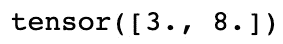

    图 2.2 – 张量乘法输出

1.  我们还可以按如下方式选择张量中的单个元素：

    ```py
    x = torch.tensor([[1., 2.],[5., 3.],[0., 4.]])
    print(x[0][1])
    ```

    这会产生以下输出：

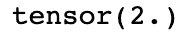

图 2.3 – 张量选择输出

但请注意，与 NumPy 数组不同，从张量对象中选择单个元素会返回另一个张量。为了从张量中返回单个值，您可以使用`.item()`函数：

```py
print(x[0][1].item())
```

这会产生以下输出：

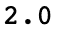

图 2.4 – .item() 函数输出

## 张量

在继续之前，您必须充分了解张量的属性是非常重要的。张量有一个称为**阶**的属性，它基本上确定了张量的维数。阶为一的张量是具有单个维度的张量，等同于一个向量或数字列表。阶为 2 的张量是具有两个维度的张量，相当于矩阵，而阶为 3 的张量包含三个维度。在 PyTorch 中，张量的最大阶数没有限制：

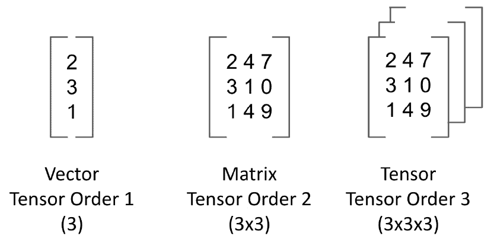

图 2.5 – 张量矩阵

你可以通过输入以下内容来检查任何张量的大小：

```py
x.shape
```

这会产生以下输出：

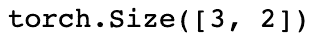

图 2.6 – 张量形状输出

这显示这是一个 3x2 的张量（阶为 2）。

# 使用 CUDA 加速 PyTorch

PyTorch 的主要好处之一是通过**图形处理单元**（**GPU**）实现加速能力。深度学习是一种易于并行化的计算任务，这意味着可以将计算任务分解为较小的任务，并在许多较小的处理器上计算。这意味着与在单个 CPU 上执行任务相比，在 GPU 上执行计算更为高效。

GPU 最初是为高效渲染图形而创建的，但随着深度学习的流行，GPU 因其同时执行多个计算的能力而经常被使用。传统 CPU 可能由大约四到八个核心组成，而 GPU 由数百个较小的核心组成。由于可以在所有这些核心上同时执行计算，GPU 可以快速减少执行深度学习任务所需的时间。

考虑神经网络中的单次传递。我们可以取一小批数据，通过网络传递以获取损失，然后进行反向传播，根据梯度调整参数。如果我们有多批数据要处理，在传统 CPU 上，我们必须等到批次 1 完成后才能为批次 2 计算：

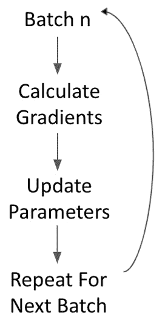

图 2.7 – 神经网络中的一次传递

然而，在 GPU 上，我们可以同时执行所有这些步骤，这意味着在批次 1 完成之前没有批次 2 的要求。我们可以同时计算所有批次的参数更新，然后一次性执行所有参数更新（因为结果是彼此独立的）。并行方法可以极大地加速机器学习过程：

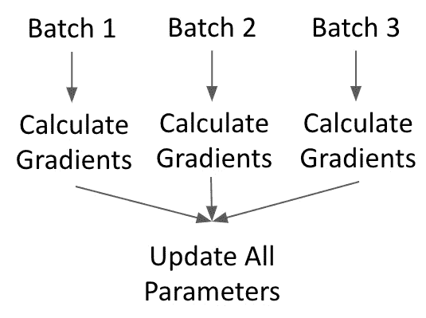

图 2.8 – 并行执行传递的方法

**CUDA（Compute Unified Device Architecture）**是专为 Nvidia GPU 设计的技术，可以在 PyTorch 上实现硬件加速。为了启用 CUDA，首先必须确保系统上的显卡兼容 CUDA。可以在此处找到支持 CUDA 的 GPU 列表：[`developer.nvidia.com/cuda-gpus`](https://developer.nvidia.com/cuda-gpus)。如果您有兼容 CUDA 的 GPU，则可以从此链接安装 CUDA：[`developer.nvidia.com/cuda-downloads`](https://developer.nvidia.com/cuda-downloads)。我们将使用以下步骤来激活它：

1.  首先，为了在 PyTorch 上实际启用 CUDA 支持，您必须从源代码构建 PyTorch。有关如何执行此操作的详细信息可以在此处找到：[`github.com/pytorch/pytorch#from-source`](https://github.com/pytorch/pytorch#from-source)。

1.  然后，在我们的 PyTorch 代码中实际使用 CUDA，我们必须在 Python 代码中输入以下内容：

    ```py
    cuda = torch.device('cuda') 
    ```

    这将设置我们默认的 CUDA 设备名称为`'cuda'`。

1.  然后，我们可以通过在任何张量操作中手动指定设备参数来在此设备上执行操作：

    ```py
    x = torch.tensor([5., 3.], device=cuda)
    ```

    或者，我们可以通过调用`cuda`方法来实现：

    ```py
    y = torch.tensor([4., 2.]).cuda()
    ```

1.  我们可以运行一个简单的操作来确保这个工作正常：

    ```py
    x*y
    ```

    这将导致以下输出：

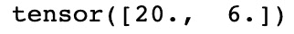

图 2.9 – 使用 CUDA 进行张量乘法输出

在这个阶段，由于我们只是创建一个张量，所以速度上的变化并不明显，但当我们稍后开始规模化训练模型时，我们将看到使用 CUDA 并行化计算可以带来速度上的好处。通过并行训练我们的模型，我们能够大大缩短这个过程所需的时间。

# 将 PyTorch 与其他深度学习框架进行比较

PyTorch 是今天深度学习中使用的主要框架之一。还有其他广泛使用的框架，如 TensorFlow、Theano 和 Caffe。尽管在许多方面它们非常相似，但它们在操作方式上有一些关键区别。其中包括以下内容：

+   模型计算的方式

+   计算图编译的方式

+   能够创建具有可变层的动态计算图的能力

+   语法上的差异

可以说，PyTorch 与其他框架的主要区别在于其模型计算方式的不同。PyTorch 使用一种称为**autograd**的自动微分方法，允许动态定义和执行计算图。这与 TensorFlow 等静态框架形成对比。在这些静态框架中，必须先定义和编译计算图，然后才能最终执行。虽然使用预编译模型可能会导致在生产环境中实现高效，但在研究和探索性项目中，它们不提供同样级别的灵活性。

诸如 PyTorch 之类的框架在模型训练之前不需要预编译计算图。PyTorch 使用的动态计算图意味着在执行时编译图形，这允许在执行过程中动态定义图形。在 NLP 领域，动态模型构建方法尤其有用。让我们考虑两个我们希望进行情感分析的句子：

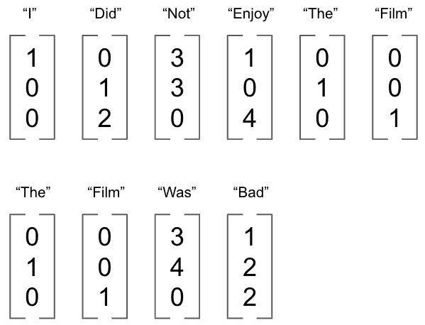

图 2.10 – PyTorch 中的模型构建

我们可以将这些句子表示为单词向量的序列，这些向量将成为我们神经网络的输入。然而，正如我们所看到的，我们的每个输入大小不同。在固定的计算图内，这些不同的输入大小可能是一个问题，但是对于像 PyTorch 这样的框架，模型能够动态调整以适应输入结构的变化。这也是为什么 PyTorch 在与 NLP 相关的深度学习中经常被优先选择的原因之一。

PyTorch 与其他深度学习框架的另一个主要区别在于语法。对于有 Python 经验的开发者来说，PyTorch 通常更受欢迎，因为它在性质上被认为非常符合 Python 风格。PyTorch 与 Python 生态系统的其他方面集成良好，如果你具备 Python 的先验知识，学习起来非常容易。现在我们将通过从头开始编写我们自己的神经网络来演示 PyTorch 的语法。

# 在 PyTorch 中构建简单的神经网络

现在，我们将介绍如何在 PyTorch 中从头开始构建神经网络。这里，我们有一个包含来自 MNIST 数据集中几个图像示例的小`.csv`文件。MNIST 数据集包含一系列手绘的 0 到 9 之间的数字，我们希望尝试对其进行分类。以下是来自 MNIST 数据集的一个示例，其中包含一个手绘的数字 1：

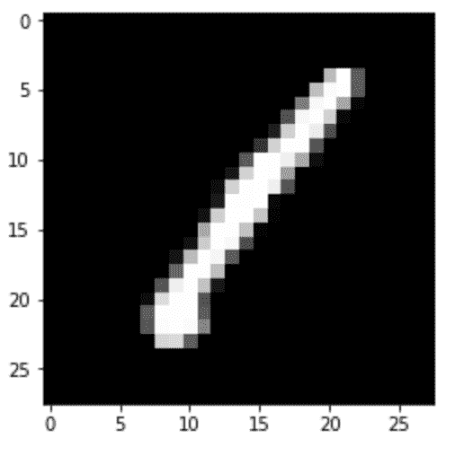

图 2.11 – MNIST 数据集的示例图像

这些图像的尺寸为 28x28：总共 784 个像素。我们的训练数据集`train.csv`包含 1,000 个这样的图像，每个图像由 784 个像素值组成，以及数字（在本例中为 1）的正确分类。

## 加载数据

我们将从加载数据开始，如下所示：

1.  首先，我们需要加载我们的训练数据集，如下所示：

    ```py
    train = pd.read_csv("train.csv")
    train_labels = train['label'].values
    train = train.drop("label",axis=1).values.reshape(len(train),1,28,28)
    ```

    注意，我们将输入重塑为（`1,` `1,` `28,` `28`），这是一个包含 1,000 个图像的张量，每个图像由 28x28 像素组成。

1.  接下来，我们将训练数据和训练标签转换为 PyTorch 张量，以便它们可以被馈送到神经网络中。

    ```py
    X = torch.Tensor(train.astype(float))
    y = torch.Tensor(train_labels).long()
    ```

注意这两个张量的数据类型。一个浮点张量包含 32 位浮点数，而长张量包含 64 位整数。我们的`X`特征必须是浮点数，以便 PyTorch 能够计算梯度，而我们的标签必须是整数，这在这个分类模型中是合理的（因为我们试图预测 1、2、3 等的值），因此预测 1.5 没有意义。

## 构建分类器

接下来，我们可以开始构建实际的神经网络分类器：

```py
class MNISTClassifier(nn.Module):
    def __init__(self):
        super().__init__()
        self.fc1 = nn.Linear(784, 392)
        self.fc2 = nn.Linear(392, 196)
        self.fc3 = nn.Linear(196, 98)
        self.fc4 = nn.Linear(98, 10)
```

我们构建分类器时，就像构建 Python 中的普通类一样，从 PyTorch 的`nn.Module`继承。在我们的`init`方法中，我们定义了神经网络的每一层。在这里，我们定义了不同大小的全连接线性层。

我们的第一层接受**784**个输入，因为这是每个图像的大小（28x28）。然后我们看到一个层的输出必须与下一个层的输入具有相同的值，这意味着我们的第一个全连接层输出**392**个单元，我们的第二层接受**392**个单元作为输入。这样的过程对每一层都重复进行，每次单元数减半，直到我们达到最终的全连接层，其输出**10**个单元。这是我们分类层的长度。

我们的网络现在看起来像这样：

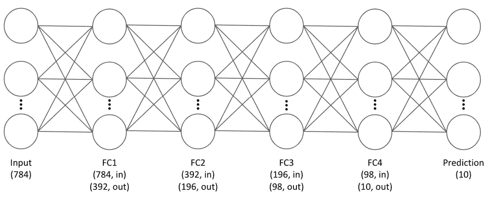

图 2.12 – 我们的神经网络

在这里，我们可以看到我们的最终层输出**10**个单元。这是因为我们希望预测每个图像是否是 0 到 9 之间的数字，总共有 10 种不同的可能分类。我们的输出是长度为**10**的向量，并包含对图像的每个可能值的预测。在做最终分类时，我们将具有最高值的数字分类作为模型的最终预测。例如，对于给定的预测，我们的模型可能以 10%的概率预测图像是类型 1，以 10%的概率预测图像是类型 2，以 80%的概率预测图像是类型 3。因此，我们将类型 3 作为预测结果，因为它以最高的概率进行了预测。

## 实施**dropout**

在我们的`MNISTClassifier`类的`init`方法中，我们还定义了一个 dropout 方法，以帮助正则化网络。

```py
self.dropout = nn.Dropout(p=0.2)
```

Dropout 是一种正则化神经网络的方法，用于防止过拟合。在每个训练 epoch 中，对于每个应用了 dropout 的层中的节点，存在一定的概率（这里定义为 *p* = 20%），使得该层中的每个节点在训练和反向传播过程中都不被使用。这意味着在训练过程中，我们的网络变得对过拟合更加健壮，因为每个节点都不会在每次迭代中都被使用。这样一来，我们的网络就不会过度依赖网络中特定节点的预测。

## 定义前向传播

接下来，我们在分类器中定义前向传播：

```py
    def forward(self, x):
        x = x.view(x.shape[0], -1)
        x = self.dropout(F.relu(self.fc1(x)))
        x = self.dropout(F.relu(self.fc2(x)))
        x = self.dropout(F.relu(self.fc3(x)))
        x = F.log_softmax(self.fc4(x), dim=1)
```

在我们的分类器中的 `forward()` 方法是我们应用激活函数并定义网络中 dropout 的地方。我们的 `forward` 方法定义了输入将如何通过网络。首先接收我们的输入 `x`，并将其重塑为网络中使用的一维向量。然后，我们通过第一个全连接层，并使用 `ReLU` 激活函数使其非线性化。我们还在 `init` 方法中定义了 dropout。我们将这个过程在网络的所有其他层中重复进行。

对于我们的最终预测层，我们将其包裹在一个对数 `softmax` 层中。我们将使用这个层来轻松计算我们的损失函数，接下来我们会看到。

## 设置模型参数

接下来，我们定义我们的模型参数：

```py
model = MNISTClassifier()
loss_function = nn.NLLLoss()
opt = optim.Adam(model.parameters(), lr=0.001)
```

我们将 `MNISTClassifier` 类实例化为模型的一个实例。我们还将我们的损失定义为 **负对数似然损失**：

Loss(y) = -log(y)

假设我们的图像是数字 7。如果我们以概率 1 预测类别 7，我们的损失将是 *-log(1) = 0*，但如果我们只以概率 0.7 预测类别 7，我们的损失将是 *-log(0.7) = 0.3*。这意味着我们的损失会随着预测偏离正确答案而无限增加：

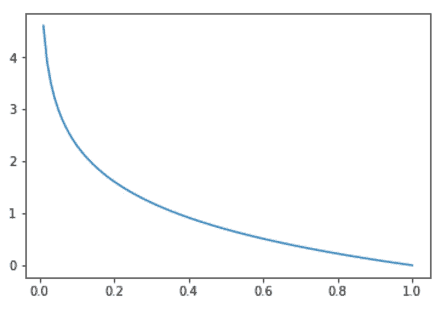

图 2.13 – 我们网络的损失表示

然后，我们对数据集中所有正确类别求和，计算总损失。注意，在构建分类器时，我们定义了对数 softmax 函数，因此已经应用了 softmax 函数（将预测输出限制在 0 到 1 之间）并取了对数。这意味着 *log(y)* 已经计算好了，所以我们计算网络的总损失只需计算输出的负和。

我们还将我们的优化器定义为 Adam 优化器。优化器控制模型内的**学习率**。模型的学习率定义了训练的每个周期中参数更新的大小。学习率越大，梯度下降中参数更新的大小越大。优化器动态控制这个学习率，因此当模型初始化时，参数更新很大。但是，随着模型的学习并接近最小化损失的点，优化器控制学习率，使参数更新变小，可以更精确地定位局部最小值。

## 训练我们的网络

最后，我们实际开始训练我们的网络：

1.  首先，创建一个循环，每个训练周期运行一次。在这里，我们将运行我们的训练循环共 50 个周期。我们首先取出图像的输入张量和标签的输出张量，并将它们转换为 PyTorch 变量。`variable` 是一个 PyTorch 对象，其中包含一个 `backward()` 方法，我们可以用它来执行网络的反向传播：

    ```py
    for epoch in range(50): 
        images = Variable(X)
        labels = Variable(y)
    ```

1.  接下来，在我们的优化器上调用 `zero_grad()` 来将计算得到的梯度设置为零。在 PyTorch 中，梯度是在每次反向传播时累积计算的。虽然这对于某些模型（如训练 RNNs 时）很有用，但对于我们的例子，我们希望在每次通过后从头开始计算梯度，所以确保在每次通过后将梯度重置为零：

    ```py
    opt.zero_grad()
    ```

1.  接下来，我们使用模型的当前状态在数据集上进行预测。这实际上是我们的前向传递，因为我们使用这些预测来计算我们的损失：

    ```py
    outputs = model(images)
    ```

1.  使用数据集的输出和真实标签，我们使用定义的损失函数计算我们模型的总损失，本例中为负对数似然。计算完损失后，我们可以调用 `backward()` 来通过网络反向传播我们的损失。然后，我们使用我们的优化器的 `step()` 方法来相应地更新模型参数：

    ```py
    loss = loss_function(outputs, labels)
    loss.backward()
    opt.step()
    ```

1.  最后，在每个周期完成后，我们打印出总损失。我们可以观察这一点以确保我们的模型在学习：

    ```py
    print ('Epoch [%d/%d] Loss: %.4f' %(epoch+1, 50,         loss.data.item()))
    ```

一般来说，我们期望损失在每个周期后都会减少。我们的输出将看起来像这样：

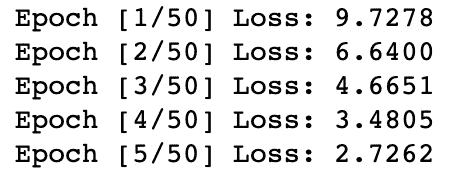

图 2.14 – 训练周期

## 进行预测

现在我们的模型已经训练好，我们可以用它来对未见过的数据进行预测。我们首先读入我们的测试数据集（这些数据集未用于训练我们的模型）：

```py
test = pd.read_csv("test.csv")
test_labels = test['label'].values
test = test.drop("label",axis=1).values.reshape(len(test),                  1,28,28)
X_test = torch.Tensor(test.astype(float))
y_test = torch.Tensor(test_labels).long()
```

在这里，我们执行与加载训练数据集时相同的步骤：我们重塑我们的测试数据，并将其转换为 PyTorch 张量。接下来，要使用我们训练过的模型进行预测，我们只需运行以下命令：

```py
preds = model(X_test)
```

就像我们在模型的前向传播中计算训练数据的输出一样，我们现在通过模型传递测试数据并得到预测。我们可以查看其中一张图像的预测结果如下：

```py
print(preds[0])
```

这导致以下输出：

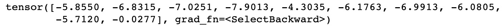

图 2.15 – 预测输出

在这里，我们可以看到我们的预测是一个长度为 10 的向量，每个可能类别（0 到 9 之间的数字）有一个预测值。具有最高预测值的那个是我们模型选择作为预测的那个。在这种情况下，它是向量的第 10 个单元，对应于数字 9。请注意，由于我们之前使用了对数 softmax，我们的预测是对数而不是原始概率。要将其转换回概率，我们可以简单地使用 *x* 进行转换。

现在我们可以构建一个包含真实测试数据标签以及我们模型预测标签的总结 DataFrame：

```py
_, predictionlabel = torch.max(preds.data, 1)
predictionlabel = predictionlabel.tolist()
predictionlabel = pd.Series(predictionlabel)
test_labels = pd.Series(test_labels)
pred_table = pd.concat([predictionlabel, test_labels], axis=1)
pred_table.columns =['Predicted Value', 'True Value']
display(pred_table.head())
```

这导致以下输出：

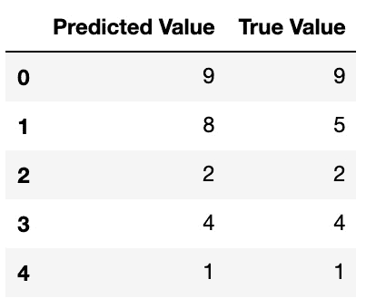

图 2.16 – 预测表格

注意，`torch.max()` 函数会自动选择具有最高值的预测值。我们可以看到，在我们的数据的小部分选择中，我们的模型似乎在做出一些好的预测！

## 评估我们的模型

现在我们从模型得到了一些预测结果，我们可以用这些预测结果来评估我们模型的好坏。评估模型性能的一个简单方法是**准确率**，正如前一章节讨论的那样。在这里，我们简单地计算我们正确预测的百分比（即预测图像标签等于实际图像标签的情况）：

```py
preds = len(predictionlabel)
correct = len([1 for x,y in zip(predictionlabel, test_labels)               if x==y])
print((correct/preds)*100)
```

这导致以下输出：

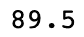

图 2.17 – 准确率分数

恭喜！你的第一个神经网络能够正确识别近 90%的未见数字图像。随着我们的进展，我们将看到更复杂的模型可能会导致性能的提升。然而，目前我们已经证明，使用 PyTorch 创建简单的深度神经网络非常简单。这可以用几行代码实现，并且能够超越基本的机器学习模型如回归。

# PyTorch 的自然语言处理

现在我们已经学会了如何构建神经网络，我们将看到如何使用 PyTorch 为 NLP 构建模型。在这个例子中，我们将创建一个基本的词袋分类器，以便对给定句子的语言进行分类。

## 分类器的设置

对于这个例子，我们将选取一些西班牙语和英语的句子：

1.  首先，我们将每个句子拆分为单词列表，并将每个句子的语言作为标签。我们从中取一部分句子来训练我们的模型，并保留一小部分作为测试集。我们这样做是为了在模型训练后评估其性能：

    ```py
    ("This is my favourite chapter".lower().split(),\
     "English"),
    ("Estoy en la biblioteca".lower().split(), "Spanish")
    ```

    注意，我们还将每个单词转换为小写，这样可以防止在我们的词袋中重复计数。如果我们有单词`book`和单词`Book`，我们希望它们被视为相同的单词，因此我们将它们转换为小写。

1.  接下来，我们构建我们的词索引，这只是我们语料库中所有单词的字典，并为每个单词创建一个唯一的索引值。这可以通过简短的`for`循环轻松完成：

    ```py
    word_dict = {}
    i = 0
    for words, language in training_data + test_data:
        for word in words:
            if word not in word_dict:
                word_dict[word] = i
                i += 1
    print(word_dict)
    ```

    这将导致以下输出：

    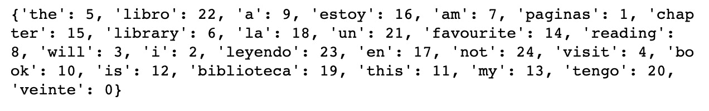

    图 2.18 – 设置分类器

    注意，在这里，我们循环遍历了所有的训练数据和测试数据。如果我们仅在训练数据上创建了我们的词索引，那么在评估测试集时，我们可能会有新的单词，这些单词在原始训练数据中没有出现，因此我们无法为这些单词创建真正的词袋表示。

1.  现在，我们按照前一节中构建神经网络的方式构建我们的分类器；也就是说，通过构建一个从`nn.Module`继承的新类。

    在这里，我们定义我们的分类器，使其包含一个具有 log softmax 激活函数的单个线性层，用来近似逻辑回归。我们可以通过在此处添加额外的线性层轻松扩展为神经网络，但是一个参数的单层将满足我们的目的。请特别注意我们线性层的输入和输出大小：

    ```py
    corpus_size = len(word_dict)
    languages = 2
    label_index = {"Spanish": 0, "English": 1}
    class BagofWordsClassifier(nn.Module):  
        def __init__(self, languages, corpus_size):
            super(BagofWordsClassifier, self).__init__()
            self.linear = nn.Linear(corpus_size, languages)
        def forward(self, bow_vec):
            return F.log_softmax(self.linear(bow_vec), dim=1)
    ```

    输入的长度为`corpus_size`，这只是我们语料库中唯一单词的总数。这是因为我们模型的每个输入将是一个词袋表示，其中包含每个句子中单词的计数，如果给定单词在我们的句子中不存在，则计数为 0。我们的输出大小为 2，这是我们要预测的语言数。我们最终的预测将包括一个句子是英语的概率与句子是西班牙语的概率，最终预测将是概率最高的那个。

1.  接下来，我们定义一些实用函数。首先定义`make_bow_vector`，它接受句子并将其转换为词袋表示。我们首先创建一个全零向量。然后循环遍历句子中的每个单词，递增词袋向量中该索引位置的计数。最后，我们使用`with .view()`来重塑这个向量以输入到我们的分类器中：

    ```py
    def make_bow_vector(sentence, word_index):
        word_vec = torch.zeros(corpus_size)
        for word in sentence:
            word_vec[word_dict[word]] += 1
        return word_vec.view(1, -1)
    ```

1.  类似地，我们定义`make_target`，它简单地接受句子的标签（西班牙语或英语）并返回其相关的索引（`0`或`1`）：

    ```py
    def make_target(label, label_index):
        return torch.LongTensor([label_index[label]])
    ```

1.  现在我们可以创建我们模型的一个实例，准备进行训练。我们还将我们的损失函数定义为负对数似然，因为我们使用了对数 softmax 函数，然后定义我们的优化器以使用标准的**随机****梯度****下降**（**SGD**）：

    ```py
    model = BagofWordsClassifier(languages, corpus_size)
    loss_function = nn.NLLLoss()
    optimizer = optim.SGD(model.parameters(), lr=0.1)
    ```

现在，我们准备训练我们的模型。

## 训练分类器

首先，我们设置了一个循环，其包含我们希望模型运行的轮数。在这个实例中，我们将选择 100 轮次。

在这个循环中，我们首先将梯度归零（否则，PyTorch 会累积计算梯度），然后对于每个句子/标签对，我们分别将其转换为词袋向量和目标。然后，通过当前模型状态的数据进行前向传播，计算出这个特定句子对的预测输出。

利用此预测，我们接着将预测值和实际标签传入我们定义的`loss_function`，以获取这个句子的损失度量。调用`backward()`来通过我们的模型反向传播这个损失，再调用优化器的`step()`来更新模型参数。最后，在每 10 个训练步骤后打印出我们的损失：

```py
for epoch in range(100):
    for sentence, label in training_data:
        model.zero_grad()
        bow_vec = make_bow_vector(sentence, word_dict)
        target = make_target(label, label_index)
        log_probs = model(bow_vec)
        loss = loss_function(log_probs, target)
        loss.backward()
        optimizer.step()

    if epoch % 10 == 0:
        print('Epoch: ',str(epoch+1),', Loss: ' +                         str(loss.item()))
```

这导致了以下输出：

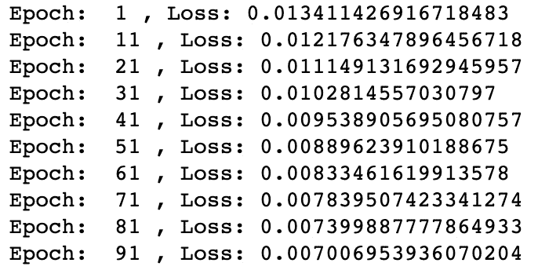

图 2.19 – 训练损失

在这里，我们可以看到随着模型学习，我们的损失随时间递减。尽管这个示例中的训练集非常小，我们仍然可以展示出我们的模型学到了一些有用的东西，如下所示：

1.  我们在一些测试数据的几个句子上评估我们的模型，这些句子我们的模型没有进行训练。在这里，我们首先设置`torch.no_grad()`，这将关闭`autograd`引擎，因为我们不再需要计算梯度，我们不再训练我们的模型。接下来，我们将测试句子转换为词袋向量，并将其馈送到我们的模型中以获得预测。

1.  接着我们简单地打印出句子、句子的真实标签，然后是预测的概率。注意，我们将预测值从对数概率转换回概率。对于每个预测，我们得到两个概率，但是如果我们回顾标签索引，可以看到第一个概率（索引 0）对应于西班牙语，而另一个对应于英语：

    ```py
    def make_predictions(data):
        with torch.no_grad():
            sentence = data[0]
            label = data[1]
            bow_vec = make_bow_vector(sentence, word_dict)
            log_probs = model(bow_vec)
            print(sentence)
            print(label + ':')
            print(np.exp(log_probs))

    make_predictions(test_data[0])
    make_predictions(test_data[1])
    ```

    这导致了以下输出：

    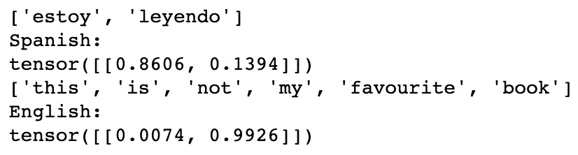

    图 2.20 – 预测输出

    在这里，我们可以看到对于我们的预测，我们的模型预测了正确的答案，但是为什么呢？我们的模型到底学到了什么？我们可以看到，我们的第一个测试句子包含了单词`estoy`，这在我们的训练集中之前出现在一个西班牙语句子中。类似地，我们可以看到单词`book`在我们的训练集中出现在一个英语句子中。由于我们的模型由单层组成，我们每个节点上的参数易于解释。

1.  在这里，我们定义了一个函数，该函数以单词作为输入，并返回层内每个参数的权重。对于给定的单词，我们从字典中获取其索引，然后从模型中选择这些参数的同一索引。请注意，我们的模型返回两个参数，因为我们进行了两次预测；即，模型对西班牙语预测的贡献和模型对英语预测的贡献：

    ```py
    def return_params(word): 
        index = word_dict[word]
        for p in model.parameters():
            dims = len(p.size())
            if dims == 2:
                print(word + ':')
                print('Spanish Parameter = ' +                    str(p[0][index].item()))
                print('English Parameter = ' +                    str(p[1][index].item()))
                print('\n')

    return_params('estoy')
    return_params('book')
    ```

    这导致了以下输出：

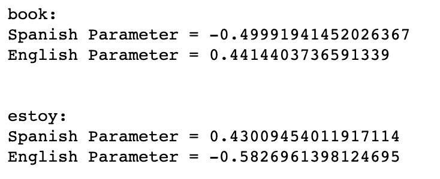

图 2.21 – 更新函数的预测输出

在这里，我们可以看到对于单词`estoy`，这个参数对于西班牙语的预测是正的，对于英语则是负的。这意味着在我们的句子中每出现一次单词"`estoy`"，这个句子变得更可能是西班牙语。同样地，对于单词`book`，我们可以看到它对于预测这个句子是英语有正面贡献。

我们可以展示，我们的模型仅基于其训练过的内容进行学习。如果我们尝试预测一个模型未经训练的词汇，我们可以看到它无法做出准确的决定。在这种情况下，我们的模型认为英文单词"`not`"是西班牙语：

```py
new_sentence = (["not"],"English")
make_predictions(new_sentence)
```

这导致了以下输出：

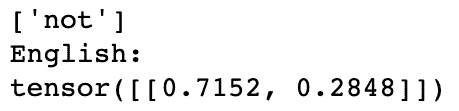

图 2.22 – 最终输出

# 总结

在本章中，我们介绍了 PyTorch 及其一些关键特性。希望现在你对 PyTorch 与其他深度学习框架的区别有了更好的理解，以及它如何用于构建基本的神经网络。虽然这些简单的例子只是冰山一角，但我们已经说明了 PyTorch 是 NLP 分析和学习的强大工具。

在接下来的章节中，我们将展示如何利用 PyTorch 的独特特性来构建用于解决非常复杂的机器学习任务的高度复杂的模型。
